# Capitolo 02 - Segnali di pericolo
### إشارات الخطر

- 📁 **المجلد المحلي للباب:** `Capitolo_02_segnali_pericolo`

## 📌 Strada dissestata (29 domande)

**1.** Il segnale raffigurato preannuncia un tratto di strada deformata

- **الإجابة:** `VERO ✅ (صح)`
- 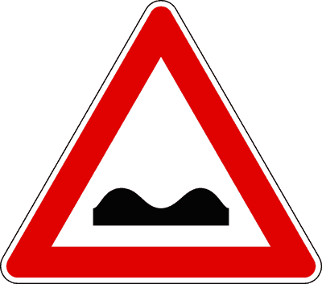

---

**2.** Il segnale raffigurato può essere associato con un segnale di limite massimo di velocità

- **الإجابة:** `VERO ✅ (صح)`
- 

---

**3.** Il segnale raffigurato indica un tratto di strada deformata lungo 380 metri

- **الإجابة:** `VERO ✅ (صح)`
- 

---

**4.** Il segnale raffigurato preannuncia un tratto di strada con pavimentazione irregolare

- **الإجابة:** `VERO ✅ (صح)`
- 

---

**5.** Il segnale raffigurato preannuncia una strada in cattivo stato

- **الإجابة:** `VERO ✅ (صح)`
- 

---

**6.** Il segnale raffigurato è un segnale di pericolo

- **الإجابة:** `VERO ✅ (صح)`
- 

---

**7.** Il segnale raffigurato si trova, in genere, 150 metri prima di un tratto di strada con fondo irregolare

- **الإجابة:** `VERO ✅ (صح)`
- 

---

**8.** Il segnale raffigurato preannuncia un tratto di strada dissestata

- **الإجابة:** `VERO ✅ (صح)`
- 

---

**9.** Il segnale raffigurato, se a fondo giallo, è usato in presenza di cantieri stradali

- **الإجابة:** `VERO ✅ (صح)`
- 

---

**10.** In presenza del segnale raffigurato è importante prevedere eventuali sbandamenti dei veicoli provenienti dal senso opposto

- **الإجابة:** `VERO ✅ (صح)`
- 

---

**11.** In presenza del segnale raffigurato è necessario adeguare la velocità in relazione alle particolari condizioni del fondo stradale

- **الإجابة:** `VERO ✅ (صح)`
- 

---

**12.** In presenza del segnale raffigurato è necessario circolare a velocità moderata se si traina un rimorchio

- **الإجابة:** `VERO ✅ (صح)`
- 

---

**13.** In presenza del segnale raffigurato è necessario moderare la velocità per evitare eccessive sollecitazioni e danni alle sospensioni

- **الإجابة:** `VERO ✅ (صح)`
- 

---

**14.** In presenza del segnale raffigurato è necessario tenere saldamente il volante, per controllare possibili sbandamenti

- **الإجابة:** `VERO ✅ (صح)`
- 

---

**15.** Il segnale raffigurato è un segnale di prescrizione

- **الإجابة:** `FALSO ❌ (خطأ)`
- 

---

**16.** Il segnale raffigurato preannuncia una discesa pericolosa

- **الإجابة:** `FALSO ❌ (خطأ)`
- 

---

**17.** Il segnale raffigurato preannuncia più curve consecutive

- **الإجابة:** `FALSO ❌ (خطأ)`
- 

---

**18.** Il segnale raffigurato preannuncia una serie di dossi

- **الإجابة:** `FALSO ❌ (خطأ)`
- 

---

**19.** Il segnale raffigurato preannuncia una forte variazione di pendenza della strada

- **الإجابة:** `FALSO ❌ (خطأ)`
- 

---

**20.** Il segnale raffigurato preannuncia una doppia curva

- **الإجابة:** `FALSO ❌ (خطأ)`
- 

---

**21.** Il segnale raffigurato preannuncia un dosso

- **الإجابة:** `FALSO ❌ (خطأ)`
- 

---

**22.** Il segnale raffigurato preannuncia una cunetta o un dosso

- **الإجابة:** `FALSO ❌ (خطأ)`
- 

---

**23.** Il segnale raffigurato preannuncia un tratto di strada a visibilità limitata

- **الإجابة:** `FALSO ❌ (خطأ)`
- 

---

**24.** Il segnale raffigurato indica un tratto di strada deformata lungo 320 metri

- **الإجابة:** `FALSO ❌ (خطأ)`
- 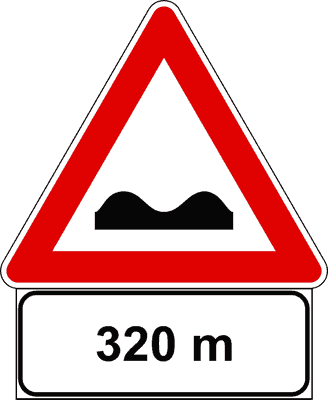

---

**25.** In presenza del segnale raffigurato è obbligatorio circolare al centro della carreggiata

- **الإجابة:** `FALSO ❌ (خطأ)`
- 

---

**26.** In presenza del segnale raffigurato non è necessario rallentare in caso di scarsa visibilità

- **الإجابة:** `FALSO ❌ (خطأ)`
- 

---

**27.** In presenza del segnale raffigurato è necessario fare attenzione al restringimento della carreggiata

- **الإجابة:** `FALSO ❌ (خطأ)`
- 

---

**28.** In presenza del segnale raffigurato è vietato il sorpasso

- **الإجابة:** `FALSO ❌ (خطأ)`
- 

---

**29.** In presenza del segnale raffigurato è necessario rallentare solo se provengono veicoli dal senso opposto

- **الإجابة:** `FALSO ❌ (خطأ)`
- 

---

## 📌 Dosso (24 domande)

**30.** Il segnale raffigurato preannuncia un dosso

- **الإجابة:** `VERO ✅ (صح)`
- 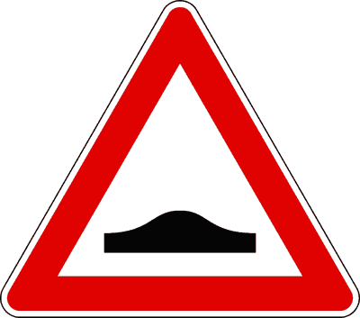

---

**31.** Il segnale raffigurato preannuncia un tratto di strada pericoloso per limitata visibilità

- **الإجابة:** `VERO ✅ (صح)`
- 

---

**32.** Il segnale raffigurato è posto, di norma, 150 metri prima di un dosso

- **الإجابة:** `VERO ✅ (صح)`
- 

---

**33.** In presenza del segnale raffigurato bisogna considerare che la visibilità è limitata

- **الإجابة:** `VERO ✅ (صح)`
- 

---

**34.** Il segnale raffigurato preannuncia una salita, seguita da una discesa

- **الإجابة:** `VERO ✅ (صح)`
- 

---

**35.** Il segnale raffigurato preannuncia una variazione di pendenza della strada con limitata visibilità

- **الإجابة:** `VERO ✅ (صح)`
- 

---

**36.** In presenza del segnale raffigurato è necessario moderare la velocità in relazione alla visibilità

- **الإجابة:** `VERO ✅ (صح)`
- 

---

**37.** In presenza del segnale raffigurato è vietata l'inversione di marcia

- **الإجابة:** `VERO ✅ (صح)`
- 

---

**38.** In presenza del segnale raffigurato sono vietate la sosta e la fermata sia sul tratto in salita che su quello in discesa

- **الإجابة:** `VERO ✅ (صح)`
- 

---

**39.** In presenza del segnale raffigurato è vietato il sorpasso sul tratto in salita, se la strada è a doppio senso di circolazione con due sole corsie

- **الإجابة:** `VERO ✅ (صح)`
- 

---

**40.** Il segnale raffigurato è un segnale di pericolo

- **الإجابة:** `VERO ✅ (صح)`
- 

---

**41.** Il segnale raffigurato può presegnalare dossi artificiali

- **الإجابة:** `VERO ✅ (صح)`
- 

---

**42.** Il segnale raffigurato preannuncia una cunetta

- **الإجابة:** `FALSO ❌ (خطأ)`
- 

---

**43.** Il segnale raffigurato preannuncia un tratto di strada deformata

- **الإجابة:** `FALSO ❌ (خطأ)`
- 

---

**44.** Il segnale raffigurato preannuncia un tratto di strada in cattivo stato

- **الإجابة:** `FALSO ❌ (خطأ)`
- 

---

**45.** Il segnale raffigurato preannuncia un tratto di strada con pavimentazione irregolare

- **الإجابة:** `FALSO ❌ (خطأ)`
- 

---

**46.** Il segnale raffigurato preannuncia un ponte

- **الإجابة:** `FALSO ❌ (خطأ)`
- 

---

**47.** Il segnale raffigurato preannuncia lavori in corso

- **الإجابة:** `FALSO ❌ (خطأ)`
- 

---

**48.** Il segnale raffigurato preannuncia l'ingresso in una galleria

- **الإجابة:** `FALSO ❌ (خطأ)`
- 

---

**49.** Il segnale raffigurato vieta il transito degli autobus

- **الإجابة:** `FALSO ❌ (خطأ)`
- 

---

**50.** In presenza del segnale raffigurato è vietato il sorpasso nel tratto in discesa

- **الإجابة:** `FALSO ❌ (خطأ)`
- 

---

**51.** Il segnale raffigurato è un segnale di obbligo

- **الإجابة:** `FALSO ❌ (خطأ)`
- 

---

**52.** In presenza del segnale raffigurato è possibile effettuare l'inversione di marcia nel tratto in discesa

- **الإجابة:** `FALSO ❌ (خطأ)`
- 

---

**53.** Il segnale raffigurato è un segnale di precedenza

- **الإجابة:** `FALSO ❌ (خطأ)`
- 

---

## 📌 Cunetta (21 domande)

**54.** Il segnale raffigurato preannuncia una cunetta

- **الإجابة:** `VERO ✅ (صح)`
- 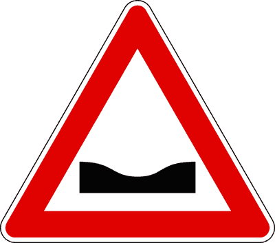

---

**55.** Il segnale raffigurato preannuncia un tratto di strada pericoloso a causa di una cunetta

- **الإجابة:** `VERO ✅ (صح)`
- 

---

**56.** Il segnale raffigurato è un segnale di pericolo

- **الإجابة:** `VERO ✅ (صح)`
- 

---

**57.** Il segnale raffigurato si trova prima di un tratto in discesa seguito da uno in salita

- **الإجابة:** `VERO ✅ (صح)`
- 

---

**58.** Il segnale raffigurato preannuncia un tratto di strada che potrebbe allagarsi in caso di forti piogge

- **الإجابة:** `VERO ✅ (صح)`
- 

---

**59.** In presenza del segnale raffigurato è necessario moderare la velocità per evitare danni alle sospensioni

- **الإجابة:** `VERO ✅ (صح)`
- 

---

**60.** In presenza del segnale raffigurato è necessario moderare la velocità per mantenere il controllo del veicolo

- **الإجابة:** `VERO ✅ (صح)`
- 

---

**61.** In presenza del segnale raffigurato è necessario tenere il volante con una presa più sicura

- **الإجابة:** `VERO ✅ (صح)`
- 

---

**62.** In presenza del segnale raffigurato e in caso di pioggia è necessario prevedere la possibilità di accumulo di acqua nella cunetta

- **الإجابة:** `VERO ✅ (صح)`
- 

---

**63.** In presenza del segnale raffigurato è necessario prevedere la possibilità di accumulo di fango e detriti nella cunetta

- **الإجابة:** `VERO ✅ (صح)`
- 

---

**64.** Il segnale raffigurato indica una banchina cedevole

- **الإجابة:** `FALSO ❌ (خطأ)`
- 

---

**65.** Il segnale raffigurato preannuncia una strada deformata

- **الإجابة:** `FALSO ❌ (خطأ)`
- 

---

**66.** Il segnale raffigurato preannuncia un tratto di strada in cattivo stato

- **الإجابة:** `FALSO ❌ (خطأ)`
- 

---

**67.** Il segnale raffigurato preannuncia un tratto di strada con pavimentazione irregolare

- **الإجابة:** `FALSO ❌ (خطأ)`
- 

---

**68.** Il segnale raffigurato può trovarsi prima di un tratto in salita seguito da una discesa

- **الإجابة:** `FALSO ❌ (خطأ)`
- 

---

**69.** Il segnale raffigurato preannuncia un restringimento della carreggiata

- **الإجابة:** `FALSO ❌ (خطأ)`
- 

---

**70.** Il segnale raffigurato preannuncia un dosso

- **الإجابة:** `FALSO ❌ (خطأ)`
- 

---

**71.** In presenza del segnale raffigurato è necessario rallentare solo se provengono veicoli dal senso opposto

- **الإجابة:** `FALSO ❌ (خطأ)`
- 

---

**72.** In presenza del segnale raffigurato non è necessario rallentare se la cunetta presenta visibilità

- **الإجابة:** `FALSO ❌ (خطأ)`
- 

---

**73.** In presenza del segnale raffigurato è vietato il sorpasso se si circola in una strada a senso unico

- **الإجابة:** `FALSO ❌ (خطأ)`
- 

---

**74.** Il segnale raffigurato preannuncia una banchina cedevole

- **الإجابة:** `FALSO ❌ (خطأ)`
- 

---

## 📌 Curva pericolosa destra (26 domande)

**75.** Il segnale raffigurato preannuncia una curva pericolosa a destra

- **الإجابة:** `VERO ✅ (صح)`
- 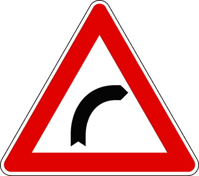

---

**76.** Il segnale raffigurato è posto, di norma, a 150 metri dal punto di inizio della curva

- **الإجابة:** `VERO ✅ (صح)`
- 

---

**77.** Il segnale raffigurato può essere integrato con pannello con la scritta TORNANTE

- **الإجابة:** `VERO ✅ (صح)`
- 

---

**78.** Il segnale raffigurato preannuncia un tratto di strada pericoloso per ridotta visibilità

- **الإجابة:** `VERO ✅ (صح)`
- 

---

**79.** Il segnale raffigurato richiede di moderare la velocità

- **الإجابة:** `VERO ✅ (صح)`
- 

---

**80.** Il segnale raffigurato preannuncia un tratto di strada pericoloso

- **الإجابة:** `VERO ✅ (صح)`
- 

---

**81.** In presenza del segnale raffigurato, posto su strada a doppio senso di circolazione e con due sole corsie, si deve circolare il più possibile vicino al margine destro

- **الإجابة:** `VERO ✅ (صح)`
- 

---

**82.** Il segnale raffigurato preannuncia un tratto di strada in cui è necessario regolare la velocità in relazione alla visibilità e al raggio della curva

- **الإجابة:** `VERO ✅ (صح)`
- 

---

**83.** Il segnale raffigurato preannuncia un tratto di strada in cui è necessario percorrere la curva con più attenzione se la strada è bagnata

- **الإجابة:** `VERO ✅ (صح)`
- 

---

**84.** Il segnale raffigurato preannuncia un tratto di strada in cui non è consentito il sorpasso se la carreggiata è a doppio senso di circolazione e con due sole corsie

- **الإجابة:** `VERO ✅ (صح)`
- 

---

**85.** In presenza del segnale raffigurato si deve viaggiare ad andatura particolarmente moderata se si circola con il ruotino (ruota di soccorso)

- **الإجابة:** `VERO ✅ (صح)`
- 

---

**86.** Il segnale raffigurato preannuncia una serie di curve pericolose di cui la prima a destra

- **الإجابة:** `FALSO ❌ (خطأ)`
- 

---

**87.** Il segnale raffigurato preannuncia un obbligo di svolta a destra

- **الإجابة:** `FALSO ❌ (خطأ)`
- 

---

**88.** Il segnale raffigurato è un segnale di prescrizione

- **الإجابة:** `FALSO ❌ (خطأ)`
- 

---

**89.** Il segnale raffigurato preannuncia un tratto di strada in salita

- **الإجابة:** `FALSO ❌ (خطأ)`
- 

---

**90.** Il segnale raffigurato preannuncia un cambio di corsia

- **الإجابة:** `FALSO ❌ (خطأ)`
- 

---

**91.** Il segnale raffigurato preannuncia una curva a sinistra

- **الإجابة:** `FALSO ❌ (خطأ)`
- 

---

**92.** Il segnale raffigurato, posto su una strada a doppio senso di circolazione, impone di portarsi sulla parte sinistra della carreggiata per affrontare meglio la curva

- **الإجابة:** `FALSO ❌ (خطأ)`
- 

---

**93.** Il segnale raffigurato è posto, di norma, a 5 metri dall'inizio della curva

- **الإجابة:** `FALSO ❌ (خطأ)`
- 

---

**94.** Il segnale raffigurato preannuncia un tratto di strada a due corsie e doppio senso di circolazione in cui è consentito sorpassare i motocicli, senza superare la striscia bianca continua

- **الإجابة:** `FALSO ❌ (خطأ)`
- 

---

**95.** In presenza del segnale raffigurato si deve circolare il più possibile vicino alla striscia bianca che separa i sensi di marcia

- **الإجابة:** `FALSO ❌ (خطأ)`
- 

---

**96.** Il segnale raffigurato preannuncia un tratto di strada in cui è consentita la fermata, ma non la sosta

- **الإجابة:** `FALSO ❌ (خطأ)`
- 

---

**97.** Il segnale raffigurato preannuncia un tratto di strada in cui è consentito sorpassare i motocicli, anche invadendo la corsia opposta

- **الإجابة:** `FALSO ❌ (خطأ)`
- 

---

**98.** Il segnale raffigurato preannuncia un tratto di strada in cui è consentito effettuare l'inversione di marcia

- **الإجابة:** `FALSO ❌ (خطأ)`
- 

---

**99.** Il segnale raffigurato preannuncia un tratto di strada in cui è consentito effettuare manovre di retromarcia

- **الإجابة:** `FALSO ❌ (خطأ)`
- 

---

**100.** Il segnale raffigurato preannuncia un tratto di strada in cui è consentito sorpassare i motocicli, anche superando di poco la striscia bianca continua

- **الإجابة:** `FALSO ❌ (خطأ)`
- 

---

## 📌 Curva pericolosa sinistra (26 domande)

**101.** La figura rappresenta un segnale di pericolo

- **الإجابة:** `VERO ✅ (صح)`
- 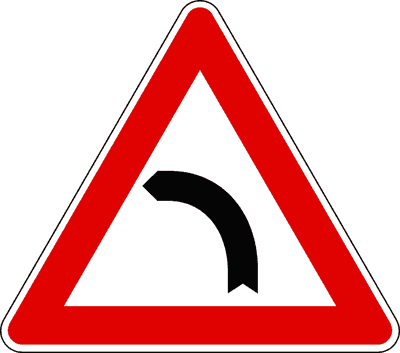

---

**102.** Il segnale raffigurato preannuncia una curva pericolosa a sinistra

- **الإجابة:** `VERO ✅ (صح)`
- 

---

**103.** Il segnale raffigurato preannuncia un tratto di strada non rettilineo, che limita la visibilità

- **الإجابة:** `VERO ✅ (صح)`
- 

---

**104.** Il segnale raffigurato preannuncia un tratto di strada che curva a sinistra con limitata visibilità

- **الإجابة:** `VERO ✅ (صح)`
- 

---

**105.** Il segnale raffigurato preannuncia, di norma a 150 metri, una curva pericolosa

- **الإجابة:** `VERO ✅ (صح)`
- 

---

**106.** Il segnale raffigurato preannuncia un tratto di strada pericoloso per ridotta visibilità

- **الإجابة:** `VERO ✅ (صح)`
- 

---

**107.** Il segnale raffigurato richiede di moderare la velocità per potersi arrestare in caso di un ostacolo improvviso

- **الإجابة:** `VERO ✅ (صح)`
- 

---

**108.** In presenza del segnale raffigurato, su una strada a doppio senso di circolazione con due sole corsie, si deve circolare il più possibile vicino al margine destro

- **الإجابة:** `VERO ✅ (صح)`
- 

---

**109.** In presenza del segnale raffigurato è necessario regolare la velocità in relazione alla visibilità e al raggio della curva

- **الإجابة:** `VERO ✅ (صح)`
- 

---

**110.** In presenza del segnale raffigurato è necessario percorrere la curva con più attenzione se la strada è bagnata

- **الإجابة:** `VERO ✅ (صح)`
- 

---

**111.** In presenza del segnale raffigurato non è consentito sorpassare altri veicoli su una carreggiata a doppio senso di circolazione con due sole corsie

- **الإجابة:** `VERO ✅ (صح)`
- 

---

**112.** In presenza del segnale raffigurato si deve viaggiare ad andatura particolarmente moderata se si circola con il "ruotino" (ruota di soccorso)

- **الإجابة:** `VERO ✅ (صح)`
- 

---

**113.** La figura rappresenta un segnale di obbligo

- **الإجابة:** `FALSO ❌ (خطأ)`
- 

---

**114.** Il segnale raffigurato preannuncia un ostacolo da aggirare a sinistra

- **الإجابة:** `FALSO ❌ (خطأ)`
- 

---

**115.** La figura rappresenta un divieto di svolta a sinistra

- **الإجابة:** `FALSO ❌ (خطأ)`
- 

---

**116.** Il segnale raffigurato impone l'obbligo di mantenere la sinistra

- **الإجابة:** `FALSO ❌ (خطأ)`
- 

---

**117.** Il segnale raffigurato impone di circolare il più vicino possibile al centro della strada

- **الإجابة:** `FALSO ❌ (خطأ)`
- 

---

**118.** Il segnale raffigurato indica una circolazione rotatoria

- **الإجابة:** `FALSO ❌ (خطأ)`
- 

---

**119.** La figura rappresenta un segnale di prescrizione

- **الإجابة:** `FALSO ❌ (خطأ)`
- 

---

**120.** Il segnale raffigurato indica una deviazione per cantiere di lavoro

- **الإجابة:** `FALSO ❌ (خطأ)`
- 

---

**121.** In presenza del segnale raffigurato, su strada a senso unico di circolazione si deve marciare il più possibile vicino al margine destro della carreggiata

- **الإجابة:** `FALSO ❌ (خطأ)`
- 

---

**122.** In presenza del segnale raffigurato è consentita la fermata ma non la sosta

- **الإجابة:** `FALSO ❌ (خطأ)`
- 

---

**123.** In presenza del segnale raffigurato è consentito, su strada a doppio senso di circolazione a due corsie, sorpassare i motocicli senza invadere la corsia opposta

- **الإجابة:** `FALSO ❌ (خطأ)`
- 

---

**124.** In presenza del segnale raffigurato è consentito effettuare l'inversione di marcia

- **الإجابة:** `FALSO ❌ (خطأ)`
- 

---

**125.** In presenza del segnale raffigurato è consentito effettuare manovre di retromarcia

- **الإجابة:** `FALSO ❌ (خطأ)`
- 

---

**126.** In presenza del segnale raffigurato non è consentito il transito ai veicoli con il "ruotino" (ruota di soccorso)

- **الإجابة:** `FALSO ❌ (خطأ)`
- 

---

## 📌 Doppia curva destra (27 domande)

**127.** Il segnale raffigurato preannuncia una doppia curva pericolosa, la prima a destra

- **الإجابة:** `VERO ✅ (صح)`
- 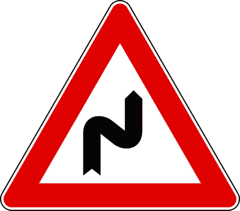

---

**128.** Il segnale raffigurato preannuncia un tratto di strada non rettilineo che limita la visibilità

- **الإجابة:** `VERO ✅ (صح)`
- 

---

**129.** Il segnale raffigurato può essere integrato con un pannello indicante TORNANTI

- **الإجابة:** `VERO ✅ (صح)`
- 

---

**130.** Il segnale raffigurato richiede di moderare la velocità per potersi arrestare in caso di un ostacolo improvviso

- **الإجابة:** `VERO ✅ (صح)`
- 

---

**131.** Il segnale raffigurato può essere integrato con il pannello in figura

- **الإجابة:** `VERO ✅ (صح)`
- 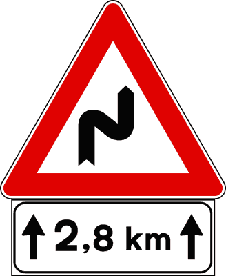

---

**132.** La figura rappresenta un segnale di pericolo

- **الإجابة:** `VERO ✅ (صح)`
- 

---

**133.** Il segnale raffigurato preannuncia, di norma a 150 metri, una doppia curva pericolosa

- **الإجابة:** `VERO ✅ (صح)`
- 

---

**134.** In presenza del segnale raffigurato bisogna moderare la velocità

- **الإجابة:** `VERO ✅ (صح)`
- 

---

**135.** Su strada a due sole corsie e a doppio senso di circolazione, in presenza del segnale raffigurato si deve marciare il più possibile vicino al margine destro

- **الإجابة:** `VERO ✅ (صح)`
- 

---

**136.** In presenza del segnale raffigurato è necessario regolare la velocità in relazione alla visibilità e al raggio delle curve

- **الإجابة:** `VERO ✅ (صح)`
- 

---

**137.** In presenza del segnale raffigurato è necessario percorrere le curve con più attenzione in caso di pioggia

- **الإجابة:** `VERO ✅ (صح)`
- 

---

**138.** In presenza del segnale raffigurato è necessario regolare la velocità in relazione alle condizioni di carico del veicolo

- **الإجابة:** `VERO ✅ (صح)`
- 

---

**139.** Nella curve pericolose preannunciate dal segnale raffigurato è vietato il sorpasso se la carreggiata è a due corsie e a doppio senso di circolazione

- **الإجابة:** `VERO ✅ (صح)`
- 

---

**140.** Su strada a due corsie e a doppio senso di circolazione, in presenza del segnale raffigurato è opportuno fare particolare attenzione ai veicoli provenienti dal senso opposto

- **الإجابة:** `VERO ✅ (صح)`
- 

---

**141.** Il segnale raffigurato preannuncia una deviazione per lavori in corso

- **الإجابة:** `FALSO ❌ (خطأ)`
- 

---

**142.** Il segnale raffigurato preannuncia un raccordo di uscita autostradale

- **الإجابة:** `FALSO ❌ (خطأ)`
- 

---

**143.** Il segnale raffigurato preannuncia una discesa pericolosa

- **الإجابة:** `FALSO ❌ (خطأ)`
- 

---

**144.** Il segnale raffigurato preannuncia un tratto di strada con superficie sdrucciolevole

- **الإجابة:** `FALSO ❌ (خطأ)`
- 

---

**145.** Il segnale raffigurato preannuncia un incrocio

- **الإجابة:** `FALSO ❌ (خطأ)`
- 

---

**146.** Il segnale raffigurato preannuncia un tratto di strada con pavimentazione irregolare

- **الإجابة:** `FALSO ❌ (خطأ)`
- 

---

**147.** Il segnale con il pannello in figura preannuncia un tratto di strada lungo 3,8 km con una serie di curve pericolose

- **الإجابة:** `FALSO ❌ (خطأ)`
- 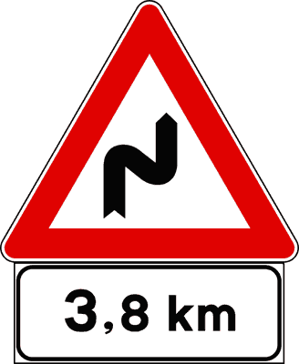

---

**148.** Il segnale raffigurato preannuncia un tratto di strada in cui è consentita l'inversione di marcia

- **الإجابة:** `FALSO ❌ (خطأ)`
- 

---

**149.** In presenza del segnale raffigurato, posto su strada a due corsie e a doppio senso di circolazione, è consentito sorpassare nelle ore diurne

- **الإجابة:** `FALSO ❌ (خطأ)`
- 

---

**150.** Il segnale raffigurato preannuncia un tratto di strada in cui è consentita la manovra di retromarcia

- **الإجابة:** `FALSO ❌ (خطأ)`
- 

---

**151.** In presenza del segnale raffigurato è necessario tenere una velocità moderata esclusivamente nella prima curva

- **الإجابة:** `FALSO ❌ (خطأ)`
- 

---

**152.** In presenza del segnale raffigurato è consentito effettuare la fermata in curva

- **الإجابة:** `FALSO ❌ (خطأ)`
- 

---

**153.** In presenza del segnale raffigurato è consentito sorpassare motocicli e ciclomotori su strada a due corsie e a doppio senso di circolazione

- **الإجابة:** `FALSO ❌ (خطأ)`
- 

---

## 📌 Doppia curva sinistra (24 domande)

**154.** Il segnale raffigurato preannuncia una doppia curva pericolosa, la prima a sinistra

- **الإجابة:** `VERO ✅ (صح)`
- 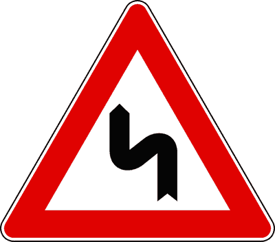

---

**155.** Il segnale raffigurato preannuncia un tratto di strada non rettilineo che limita la visibilità

- **الإجابة:** `VERO ✅ (صح)`
- 

---

**156.** Il segnale raffigurato preannuncia la presenza di tornanti se integrato con apposito pannello

- **الإجابة:** `VERO ✅ (صح)`
- 

---

**157.** La figura rappresenta un segnale di pericolo

- **الإجابة:** `VERO ✅ (صح)`
- 

---

**158.** Il segnale raffigurato preannuncia, in genere a 150 m, una doppia curva pericolosa

- **الإجابة:** `VERO ✅ (صح)`
- 

---

**159.** Il segnale raffigurato richiede di moderare la velocità

- **الإجابة:** `VERO ✅ (صح)`
- 

---

**160.** In presenza del segnale raffigurato si deve circolare il più vicino possibile al margine destro della carreggiata, su strada a due sole corsie e a doppio senso di circolazione

- **الإجابة:** `VERO ✅ (صح)`
- 

---

**161.** In presenza del segnale raffigurato è necessario regolare la velocità in relazione alla visibilità e al raggio delle curve

- **الإجابة:** `VERO ✅ (صح)`
- 

---

**162.** In presenza del segnale raffigurato è necessario percorrere le curve con più attenzione in caso di pioggia

- **الإجابة:** `VERO ✅ (صح)`
- 

---

**163.** In presenza del segnale raffigurato è necessario regolare la velocità in relazione alle condizioni di carico del veicolo

- **الإجابة:** `VERO ✅ (صح)`
- 

---

**164.** In presenza del segnale raffigurato non è consentito effettuare manovre di sorpasso su strade a due sole corsie e a doppio senso di circolazione

- **الإجابة:** `VERO ✅ (صح)`
- 

---

**165.** In presenza del segnale raffigurato è opportuno fare particolare attenzione ai veicoli provenienti dal senso opposto

- **الإجابة:** `VERO ✅ (صح)`
- 

---

**166.** Il segnale raffigurato preannuncia una confluenza a sinistra

- **الإجابة:** `FALSO ❌ (خطأ)`
- 

---

**167.** Il segnale raffigurato preannuncia una strettoia

- **الإجابة:** `FALSO ❌ (خطأ)`
- 

---

**168.** Il segnale raffigurato preannuncia un tratto di carreggiata sdrucciolevole

- **الإجابة:** `FALSO ❌ (خطأ)`
- 

---

**169.** Il segnale raffigurato preannuncia un tratto di strada con una serie di dossi

- **الإجابة:** `FALSO ❌ (خطأ)`
- 

---

**170.** Il segnale raffigurato preannuncia una deviazione per lavori in corso

- **الإجابة:** `FALSO ❌ (خطأ)`
- 

---

**171.** Il segnale raffigurato preannuncia un tratto di strada deformata

- **الإجابة:** `FALSO ❌ (خطأ)`
- 

---

**172.** In presenza del segnale raffigurato è consentita l'inversione di marcia

- **الإجابة:** `FALSO ❌ (خطأ)`
- 

---

**173.** In presenza del segnale raffigurato, posto su strade a due corsie e a doppio senso, è consentito sorpassare un veicolo molto lento

- **الإجابة:** `FALSO ❌ (خطأ)`
- 

---

**174.** In presenza del segnale raffigurato è consentita la manovra di retromarcia

- **الإجابة:** `FALSO ❌ (خطأ)`
- 

---

**175.** In presenza del segnale raffigurato è necessario tenere una velocità moderata esclusivamente nella prima curva

- **الإجابة:** `FALSO ❌ (خطأ)`
- 

---

**176.** In presenza del segnale raffigurato è consentito effettuare la fermata in corrispondenza delle curve

- **الإجابة:** `FALSO ❌ (خطأ)`
- 

---

**177.** In presenza del segnale raffigurato è consentito sorpassare motocicli e ciclomotori su strade a due corsie e a doppio senso

- **الإجابة:** `FALSO ❌ (خطأ)`
- 

---

## 📌 Passaggio livello barriere (27 domande)

**178.** Il segnale raffigurato preannuncia un passaggio a livello con barriere o con semibarriere

- **الإجابة:** `VERO ✅ (صح)`
- 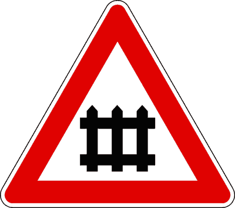

---

**179.** Dopo il segnale raffigurato, se ci sono le semibarriere, è installato un dispositivo a luci rosse lampeggianti

- **الإجابة:** `VERO ✅ (صح)`
- 

---

**180.** Il segnale raffigurato preannuncia un attraversamento ferroviario protetto da barriere o semibarriere, qualunque sia il numero dei binari

- **الإجابة:** `VERO ✅ (صح)`
- 

---

**181.** Il segnale raffigurato preannuncia un attraversamento ferroviario munito di barriere o semibarriere

- **الإجابة:** `VERO ✅ (صح)`
- 

---

**182.** Dopo il segnale raffigurato si può trovare un dispositivo acustico che avverte della chiusura delle barriere o delle semibarriere

- **الإجابة:** `VERO ✅ (صح)`
- 

---

**183.** Il segnale raffigurato è posto, di norma, 150 metri prima del passaggio a livello

- **الإجابة:** `VERO ✅ (صح)`
- 

---

**184.** In presenza del segnale raffigurato è necessario moderare la velocità

- **الإجابة:** `VERO ✅ (صح)`
- 

---

**185.** Dopo il segnale raffigurato, se ci sono le barriere, è installato un dispositivo a luce rossa fissa

- **الإجابة:** `VERO ✅ (صح)`
- 

---

**186.** La figura rappresenta un segnale di pericolo

- **الإجابة:** `VERO ✅ (صح)`
- 

---

**187.** In presenza del segnale raffigurato è necessario moderare la velocità per essere pronti ad arrestarsi se le barriere sono chiuse

- **الإجابة:** `VERO ✅ (صح)`
- 

---

**188.** In presenza del segnale raffigurato non è consentito impegnare il passaggio a livello se il traffico intenso impedisce di sgomberarlo

- **الإجابة:** `VERO ✅ (صح)`
- 

---

**189.** In presenza del segnale raffigurato è necessario arrestarsi se sono in funzione le due luci rosse lampeggianti

- **الإجابة:** `VERO ✅ (صح)`
- 

---

**190.** In presenza del segnale raffigurato è necessario arrestarsi se è in funzione il dispositivo acustico che avverte della chiusura delle barriere

- **الإجابة:** `VERO ✅ (صح)`
- 

---

**191.** In presenza del segnale raffigurato, se il veicolo si ferma per avaria sui binari, il conducente deve adottare ogni iniziativa utile al fine di evitare incidenti

- **الإجابة:** `VERO ✅ (صح)`
- 

---

**192.** Il segnale raffigurato preannuncia l'incrocio con una linea tranviaria

- **الإجابة:** `FALSO ❌ (خطأ)`
- 

---

**193.** Il segnale raffigurato preannuncia una strada senza uscita

- **الإجابة:** `FALSO ❌ (خطأ)`
- 

---

**194.** Il segnale raffigurato obbliga ad arrestarsi se le luci rosse poste in prossimità delle barriere o delle semibarriere sono spente

- **الإجابة:** `FALSO ❌ (خطأ)`
- 

---

**195.** Il segnale raffigurato indica una deviazione obbligatoria

- **الإجابة:** `FALSO ❌ (خطأ)`
- 

---

**196.** Il segnale raffigurato permette di transitare tra una barra e l'altra se le semibarriere sono chiuse, dopo aver verificato che non ci sono treni in arrivo

- **الإجابة:** `FALSO ❌ (خطأ)`
- 

---

**197.** Il segnale raffigurato indica un'area di sosta custodita

- **الإجابة:** `FALSO ❌ (خطأ)`
- 

---

**198.** Il segnale raffigurato si trova prima del segnale verticale DOPPIA CROCE DI S. ANDREA

- **الإجابة:** `FALSO ❌ (خطأ)`
- 

---

**199.** Il segnale raffigurato preannuncia barriere di recinzione di un cantiere stradale

- **الإجابة:** `FALSO ❌ (خطأ)`
- 

---

**200.** Il segnale raffigurato impone di dare la precedenza ai veicoli della polizia penitenziaria in uscita dalle carceri

- **الإجابة:** `FALSO ❌ (خطأ)`
- 

---

**201.** In presenza del segnale raffigurato è consentito sostare in corrispondenza o in prossimità dei passaggi a livelli

- **الإجابة:** `FALSO ❌ (خطأ)`
- 

---

**202.** In presenza del segnale raffigurato è necessario rallentare solo in caso di scarsa visibilità

- **الإجابة:** `FALSO ❌ (خطأ)`
- 

---

**203.** In presenza del segnale raffigurato è possibile attraversare i binari se sbarrati da cavalletti a strisce bianche e rosse

- **الإجابة:** `FALSO ❌ (خطأ)`
- 

---

**204.** In presenza del segnale raffigurato sono consentite la fermata ma non la sosta in prossimità o in corrispondenza dei binari

- **الإجابة:** `FALSO ❌ (خطأ)`
- 

---

## 📌 Ferrovia senza barriere (24 domande)

**205.** Il segnale raffigurato preannuncia un attraversamento ferroviario a livello senza barriere

- **الإجابة:** `VERO ✅ (صح)`
- 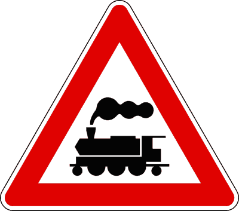

---

**206.** Il segnale raffigurato è posto, di norma, a 150 metri dai binari, integrato dal relativo pannello distanziometrico

- **الإجابة:** `VERO ✅ (صح)`
- 

---

**207.** Il segnale raffigurato richiede di usare la massima prudenza

- **الإجابة:** `VERO ✅ (صح)`
- 

---

**208.** La figura rappresenta un segnale di pericolo

- **الإجابة:** `VERO ✅ (صح)`
- 

---

**209.** Dopo il segnale raffigurato è installato il segnale CROCE DI S. ANDREA, che è posizionato prima dei binari

- **الإجابة:** `VERO ✅ (صح)`
- 

---

**210.** Il segnale raffigurato è integrato con il pannello distanziometrico a tre barre rosse

- **الإجابة:** `VERO ✅ (صح)`
- 

---

**211.** Dopo il segnale raffigurato è installato il segnale DOPPIA CROCE DI S. ANDREA, se la linea ferroviaria ha più di un binario

- **الإجابة:** `VERO ✅ (صح)`
- 

---

**212.** In presenza del segnale raffigurato è necessario rallentare in relazione alla visibilità della linea ferroviaria

- **الإجابة:** `VERO ✅ (صح)`
- 

---

**213.** In presenza del segnale raffigurato è necessario usare la massima prudenza

- **الإجابة:** `VERO ✅ (صح)`
- 

---

**214.** In presenza del segnale raffigurato è necessario rallentare per potere, eventualmente, arrestare il veicolo prima dell'attraversamento ferroviario

- **الإجابة:** `VERO ✅ (صح)`
- 

---

**215.** In presenza del segnale raffigurato è necessario, prima di attraversare, assicurarsi che non ci siano treni in arrivo sia da destra che da sinistra

- **الإجابة:** `VERO ✅ (صح)`
- 

---

**216.** In presenza del segnale raffigurato non è consentito sostare o fermarsi in prossimità o in corrispondenza dei binari

- **الإجابة:** `VERO ✅ (صح)`
- 

---

**217.** Il segnale raffigurato indica l'incrocio con una linea tranviaria

- **الإجابة:** `FALSO ❌ (خطأ)`
- 

---

**218.** Il segnale raffigurato preannuncia un attraversamento ferroviario a livello munito di semibarriere

- **الإجابة:** `FALSO ❌ (خطأ)`
- 

---

**219.** Il segnale raffigurato è posto sul secondo pannello distanziometrico a barre rosse

- **الإجابة:** `FALSO ❌ (خطأ)`
- 

---

**220.** Il segnale raffigurato preannuncia un passaggio a livello con barriere

- **الإجابة:** `FALSO ❌ (خطأ)`
- 

---

**221.** Il segnale raffigurato indica la presenza di una stazione ferroviaria a 150 metri

- **الإجابة:** `FALSO ❌ (خطأ)`
- 

---

**222.** Il segnale raffigurato può essere integrato con un pannello con la scritta TRAM

- **الإجابة:** `FALSO ❌ (خطأ)`
- 

---

**223.** La figura rappresenta un segnale di precedenza

- **الإجابة:** `FALSO ❌ (خطأ)`
- 

---

**224.** In presenza del segnale raffigurato è necessario rallentare esclusivamente in caso di nebbia

- **الإجابة:** `FALSO ❌ (خطأ)`
- 

---

**225.** In presenza del segnale raffigurato è obbligatorio fermarsi prima dei binari se le segnalazioni luminose o acustiche non sono in funzione

- **الإجابة:** `FALSO ❌ (خطأ)`
- 

---

**226.** In presenza del segnale raffigurato è possibile attraversare i binari nel caso siano sbarrati da cavalletti a strisce bianche e rosse

- **الإجابة:** `FALSO ❌ (خطأ)`
- 

---

**227.** In presenza del segnale raffigurato è obbligatorio usare il segnalatore acustico (clacson) prima di attraversare i binari

- **الإجابة:** `FALSO ❌ (خطأ)`
- 

---

**228.** In presenza del segnale raffigurato è consentito il sorpasso invadendo la corsia opposta

- **الإجابة:** `FALSO ❌ (خطأ)`
- 

---

## 📌 Croce sant andrea (13 domande)

**229.** Il segnale raffigurato indica che la sede ferroviaria ha un solo binario

- **الإجابة:** `VERO ✅ (صح)`
- 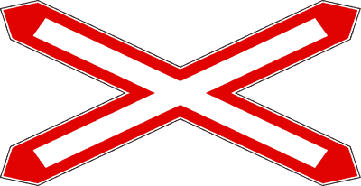

---

**230.** Il segnale raffigurato è posto nelle immediate vicinanze di un attraversamento ferroviario senza barriere

- **الإجابة:** `VERO ✅ (صح)`
- 

---

**231.** Il segnale raffigurato è posto nelle immediate vicinanze del binario

- **الإجابة:** `VERO ✅ (صح)`
- 

---

**232.** Il segnale raffigurato è posto sulla strada dopo il segnale PASSAGGIO A LIVELLO SENZA BARRIERE

- **الإجابة:** `VERO ✅ (صح)`
- 

---

**233.** La figura rappresenta un segnale di pericolo

- **الإجابة:** `VERO ✅ (صح)`
- 

---

**234.** Il segnale raffigurato può essere posto sia in senso orizzontale che in senso verticale

- **الإجابة:** `VERO ✅ (صح)`
- 

---

**235.** Il segnale raffigurato preannuncia una sede ferroviaria con più binari

- **الإجابة:** `FALSO ❌ (خطأ)`
- 

---

**236.** Il segnale raffigurato preannuncia un incrocio di quattro strade

- **الإجابة:** `FALSO ❌ (خطأ)`
- 

---

**237.** Il segnale raffigurato preannuncia una sede tranviaria con un solo binario

- **الإجابة:** `FALSO ❌ (خطأ)`
- 

---

**238.** Il segnale raffigurato è installato in prossimità di un passaggio a livello con semibarriere

- **الإجابة:** `FALSO ❌ (خطأ)`
- 

---

**239.** Il segnale raffigurato è posto prima del segnale PASSAGGIO A LIVELLO SENZA BARRIERE

- **الإجابة:** `FALSO ❌ (خطأ)`
- 

---

**240.** Il segnale raffigurato è integrato da una luce verde ed una rossa fissa

- **الإجابة:** `FALSO ❌ (خطأ)`
- 

---

**241.** Il segnale raffigurato si trova, di norma, a 150 metri dai binari

- **الإجابة:** `FALSO ❌ (خطأ)`
- 

---

## 📌 Doppia croce sant andrea (14 domande)

**242.** Il segnale raffigurato impone di arrestarsi entro la striscia di arresto, se è in arrivo il treno.

- **الإجابة:** `VERO ✅ (صح)`
- 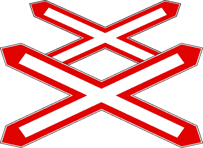

---

**243.** Il segnale raffigurato è posto nelle immediate vicinanze di un attraversamento ferroviario a livello senza barriere

- **الإجابة:** `VERO ✅ (صح)`
- 

---

**244.** Il segnale raffigurato indica che la linea ferroviaria ha più di un binario

- **الإجابة:** `VERO ✅ (صح)`
- 

---

**245.** Il segnale raffigurato invita a fare attenzione, prima di attraversare, perché potrebbe transitare più di un treno

- **الإجابة:** `VERO ✅ (صح)`
- 

---

**246.** Il segnale raffigurato si trova dopo i pannelli distanziometrici a barre rosse

- **الإجابة:** `VERO ✅ (صح)`
- 

---

**247.** Il segnale raffigurato è un segnale di pericolo

- **الإجابة:** `VERO ✅ (صح)`
- 

---

**248.** Il segnale (A) può essere abbinato al segnale (B)

- **الإجابة:** `VERO ✅ (صح)`
- 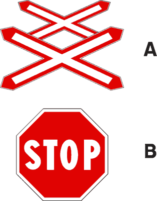

---

**249.** Il segnale raffigurato è posto, di norma, a 150 metri dai binari

- **الإجابة:** `FALSO ❌ (خطأ)`
- 

---

**250.** Il segnale (A) si trova dopo il segnale (B)

- **الإجابة:** `FALSO ❌ (خطأ)`
- 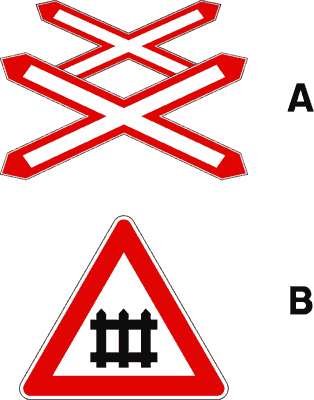

---

**251.** Il segnale raffigurato preannuncia un doppio incrocio stradale pericoloso

- **الإجابة:** `FALSO ❌ (خطأ)`
- 

---

**252.** Il segnale raffigurato indica che la linea ferroviaria ha solo un binario

- **الإجابة:** `FALSO ❌ (خطأ)`
- 

---

**253.** Il segnale raffigurato può essere posto prima di un attraversamento ferroviario con semibarriere

- **الإجابة:** `FALSO ❌ (خطأ)`
- 

---

**254.** Il segnale raffigurato indica che si possono incontrare due passaggi a livello consecutivi, che distano meno di 150 metri l'uno dall'altro

- **الإجابة:** `FALSO ❌ (خطأ)`
- 

---

**255.** Il segnale può avere fondo giallo in caso di lavori ai binari

- **الإجابة:** `FALSO ❌ (خطأ)`
- 

---

## 📌 Pannelli passaggio livello (12 domande)

**256.** I pannelli raffigurati sono posti prima di qualsiasi tipo di passaggio a livello

- **الإجابة:** `VERO ✅ (صح)`
- 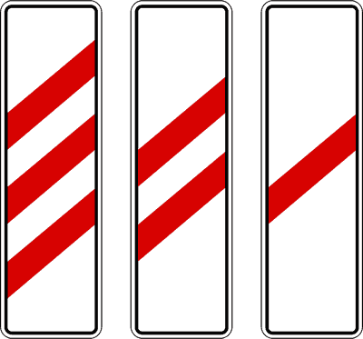

---

**257.** I pannelli raffigurati sono posti, di norma, a circa 150, 100 e 50 metri dall'attraversamento ferroviario

- **الإجابة:** `VERO ✅ (صح)`
- 

---

**258.** I pannelli raffigurati servono ad indicare che ci si sta avvicinando al passaggio a livello

- **الإجابة:** `VERO ✅ (صح)`
- 

---

**259.** Il pannello con tre barre rosse (A) è posto sotto il segnale (B)

- **الإجابة:** `VERO ✅ (صح)`
- 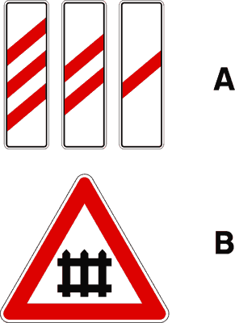

---

**260.** Nel caso di attraversamento ferroviario senza barriere, i pannelli (A) sono posti prima del segnale (B)

- **الإجابة:** `VERO ✅ (صح)`
- 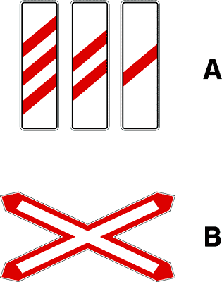

---

**261.** Il pannello con tre barre oblique rosse è il primo dei pannelli che si incontra quando ci si approssima ad un passaggio a livello

- **الإجابة:** `VERO ✅ (صح)`
- 

---

**262.** I pannelli raffigurati si possono trovare solo se il passaggio a livello è con barriere

- **الإجابة:** `FALSO ❌ (خطأ)`
- 

---

**263.** I pannelli raffigurati sono segnali di prescrizione

- **الإجابة:** `FALSO ❌ (خطأ)`
- 

---

**264.** I pannelli raffigurati indicano lavori in corso

- **الإجابة:** `FALSO ❌ (خطأ)`
- 

---

**265.** I pannelli raffigurati hanno tante barre diagonali quanti sono i binari del passaggio a livello

- **الإجابة:** `FALSO ❌ (خطأ)`
- 

---

**266.** I pannelli raffigurati, se con due barre, indicano un attraversamento ferroviario con due soli binari

- **الإجابة:** `FALSO ❌ (خطأ)`
- 

---

**267.** I pannelli raffigurati sono installati su cavalletti che vietano il transito dell'attraversamento ferroviario

- **الإجابة:** `FALSO ❌ (خطأ)`
- 

---

## 📌 Attraversamento tram (28 domande)

**268.** Il segnale raffigurato preannuncia di moderare la velocità perché poco più avanti si potrebbe incrociare un tram

- **الإجابة:** `VERO ✅ (صح)`
- 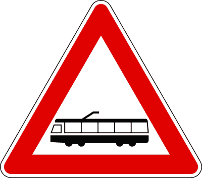

---

**269.** Il segnale raffigurato posto fuori dei centri abitati, preannuncia una linea tranviaria non regolata da semafori

- **الإجابة:** `VERO ✅ (صح)`
- 

---

**270.** Il segnale raffigurato, posto nei centri abitati, preannuncia l'incrocio con una linea tranviaria non regolata da semafori

- **الإجابة:** `VERO ✅ (صح)`
- 

---

**271.** Il segnale raffigurato preannuncia, fuori e dentro i centri abitati, una linea tranviaria non regolata da semafori

- **الإجابة:** `VERO ✅ (صح)`
- 

---

**272.** Il segnale raffigurato preannuncia una linea tranviaria che incrocia la carreggiata

- **الإجابة:** `VERO ✅ (صح)`
- 

---

**273.** Il segnale raffigurato preannuncia una linea tranviaria che riduce lo spazio utile per la circolazione dei veicoli

- **الإجابة:** `VERO ✅ (صح)`
- 

---

**274.** In presenza del segnale raffigurato, il conducente deve porre maggiore attenzione per non intralciare la marcia del tram

- **الإجابة:** `VERO ✅ (صح)`
- 

---

**275.** In presenza del segnale raffigurato, il conducente deve prestare maggiore attenzione, perché potrebbe incrociare un tram

- **الإجابة:** `VERO ✅ (صح)`
- 

---

**276.** In presenza del segnale raffigurato si può sorpassare a destra il tram in marcia se vi è lo spazio necessario

- **الإجابة:** `VERO ✅ (صح)`
- 

---

**277.** In presenza del segnale raffigurato si può circolare sui binari senza intralciare la marcia del tram

- **الإجابة:** `VERO ✅ (صح)`
- 

---

**278.** In presenza del segnale raffigurato si può sorpassare a destra il tram fermo al centro della strada per la salita e discesa dei passeggeri, solo se esiste l'apposito salvagente

- **الإجابة:** `VERO ✅ (صح)`
- 

---

**279.** In presenza del segnale raffigurato si deve fare attenzione agli eventuali pedoni presenti alla fermata del tram

- **الإجابة:** `VERO ✅ (صح)`
- 

---

**280.** In presenza del segnale raffigurato bisogna fare attenzione alla possibile diminuzione di aderenza delle ruote del veicolo se si frena sui binari

- **الإجابة:** `VERO ✅ (صح)`
- 

---

**281.** In presenza del segnale raffigurato occorre tenere presente che il tram necessita di una distanza di arresto maggiore di quella degli autoveicoli

- **الإجابة:** `VERO ✅ (صح)`
- 

---

**282.** Il segnale raffigurato preannuncia un eventuale transito di filobus

- **الإجابة:** `FALSO ❌ (خطأ)`
- 

---

**283.** Il segnale raffigurato può essere integrato con un dispositivo a due luci rosse che si accendono alternativamente

- **الإجابة:** `FALSO ❌ (خطأ)`
- 

---

**284.** Il segnale raffigurato obbliga a dare la precedenza ai filobus

- **الإجابة:** `FALSO ❌ (خطأ)`
- 

---

**285.** Il segnale raffigurato vieta il sorpasso dei tram

- **الإجابة:** `FALSO ❌ (خطأ)`
- 

---

**286.** Il segnale raffigurato preannuncia un passaggio a livello ferroviario senza barriere

- **الإجابة:** `FALSO ❌ (خطأ)`
- 

---

**287.** Il segnale raffigurato preannuncia una zona in cui possono circolare solo i veicoli in servizio pubblico

- **الإجابة:** `FALSO ❌ (خطأ)`
- 

---

**288.** In presenza del segnale raffigurato si ha l'obbligo di dare la precedenza ai filobus

- **الإجابة:** `FALSO ❌ (خطأ)`
- 

---

**289.** In presenza del segnale raffigurato il sorpasso dei tram è vietato esclusivamente ai motocicli

- **الإجابة:** `FALSO ❌ (خطأ)`
- 

---

**290.** In presenza del segnale raffigurato è vietata la marcia sopra i binari del tram

- **الإجابة:** `FALSO ❌ (خطأ)`
- 

---

**291.** In presenza del segnale raffigurato il sorpasso del tram è consentito solo a sinistra

- **الإجابة:** `FALSO ❌ (خطأ)`
- 

---

**292.** In presenza del segnale raffigurato il sorpasso del tram è consentito solo a destra

- **الإجابة:** `FALSO ❌ (خطأ)`
- 

---

**293.** In presenza del segnale raffigurato, il tram fermo per la salita e la discesa dei passeggeri può essere sorpassato a destra quando non esiste il salvagente

- **الإجابة:** `FALSO ❌ (خطأ)`
- 

---

**294.** Il segnale raffigurato preannuncia un'area di sosta per autobus

- **الإجابة:** `FALSO ❌ (خطأ)`
- 

---

**295.** Il segnale raffigurato preannuncia una corsia riservata ai filobus

- **الإجابة:** `FALSO ❌ (خطأ)`
- 

---

## 📌 Attraversamento pedoni (24 domande)

**296.** Il segnale raffigurato preannuncia un attraversamento pedonale

- **الإجابة:** `VERO ✅ (صح)`
- 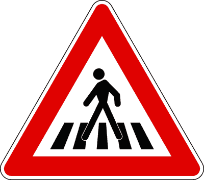

---

**297.** In presenza del segnale raffigurato, il conducente deve dare la precedenza ai pedoni che attraversano sulle strisce

- **الإجابة:** `VERO ✅ (صح)`
- 

---

**298.** Nelle strade extraurbane il segnale raffigurato è posto, di norma, a 150 metri dall'attraversamento

- **الإجابة:** `VERO ✅ (صح)`
- 

---

**299.** Il segnale raffigurato può essere posto anche nei centri abitati

- **الإجابة:** `VERO ✅ (صح)`
- 

---

**300.** Il segnale raffigurato comporta il divieto di sorpassare un veicolo che si sia arrestato per far attraversare i pedoni

- **الإجابة:** `VERO ✅ (صح)`
- 

---

**301.** In presenza del segnale raffigurato non è consentito sorpassare i veicoli che rallentano per far attraversare i pedoni

- **الإجابة:** `VERO ✅ (صح)`
- 

---

**302.** In presenza del segnale raffigurato bisogna rallentare per essere pronti ad arrestarsi se ci sono pedoni che attraversano la carreggiata

- **الإجابة:** `VERO ✅ (صح)`
- 

---

**303.** In presenza del segnale raffigurato si deve fare attenzione a non tamponare i veicoli che si arrestano per dare la precedenza ai pedoni

- **الإجابة:** `VERO ✅ (صح)`
- 

---

**304.** In presenza del segnale raffigurato non si deve effettuare sosta o fermata sopra le strisce pedonali

- **الإجابة:** `VERO ✅ (صح)`
- 

---

**305.** In presenza del segnale raffigurato, qualora non si dia la precedenza ai pedoni che attraversano sulle apposite strisce, si incorre nella sottrazione di punti della patente

- **الإجابة:** `VERO ✅ (صح)`
- 

---

**306.** Il segnale raffigurato preannuncia un luogo frequentato da bambini

- **الإجابة:** `FALSO ❌ (خطأ)`
- 

---

**307.** Il segnale raffigurato preannuncia un viale pedonale

- **الإجابة:** `FALSO ❌ (خطأ)`
- 

---

**308.** Il segnale raffigurato impone di usare i dispositivi di segnalazione acustica per far spostare i pedoni

- **الإجابة:** `FALSO ❌ (خطأ)`
- 

---

**309.** Il segnale raffigurato consente la fermata dei veicoli sull'attraversamento pedonale, purché rimanga spazio sufficiente per i pedoni

- **الإجابة:** `FALSO ❌ (خطأ)`
- 

---

**310.** Il segnale raffigurato vieta il transito ai pedoni

- **الإجابة:** `FALSO ❌ (خطأ)`
- 

---

**311.** Il segnale raffigurato preannuncia un'isola pedonale

- **الإجابة:** `FALSO ❌ (خطأ)`
- 

---

**312.** In presenza del segnale raffigurato è obbligatorio suonare il clacson se vi sono pedoni che attraversano sulle strisce pedonali

- **الإجابة:** `FALSO ❌ (خطأ)`
- 

---

**313.** In presenza del segnale raffigurato si deve rallentare solo se vi sono bambini che attraversano sulle strisce pedonali

- **الإجابة:** `FALSO ❌ (خطأ)`
- 

---

**314.** In presenza del segnale raffigurato i pedoni devono dare la precedenza ai veicoli

- **الإجابة:** `FALSO ❌ (خطأ)`
- 

---

**315.** In presenza del segnale raffigurato non è obbligatorio dare la precedenza ai pedoni che attraversano sulle strisce pedonali

- **الإجابة:** `FALSO ❌ (خطأ)`
- 

---

**316.** In presenza del segnale raffigurato si deve dare la precedenza solo ai pedoni che attraversano da sinistra

- **الإجابة:** `FALSO ❌ (خطأ)`
- 

---

**317.** Il segnale in figura preannuncia un sovrappasso pedonale

- **الإجابة:** `FALSO ❌ (خطأ)`
- 

---

**318.** Il segnale in figura preannuncia un sottopasso pedonale

- **الإجابة:** `FALSO ❌ (خطأ)`
- 

---

**319.** Il segnale raffigurato è posto in corrispondenza di un attraversamento pedonale

- **الإجابة:** `FALSO ❌ (خطأ)`
- 

---

## 📌 Attraversamento ciclabile (18 domande)

**320.** Il segnale raffigurato preannuncia un attraversamento ciclabile

- **الإجابة:** `VERO ✅ (صح)`
- 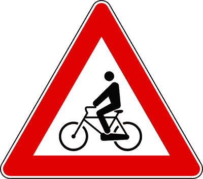

---

**321.** Il segnale raffigurato è un segnale di pericolo

- **الإجابة:** `VERO ✅ (صح)`
- 

---

**322.** Il segnale raffigurato preannuncia un attraversamento per ciclisti, contraddistinto dagli appositi segni sulla carreggiata

- **الإجابة:** `VERO ✅ (صح)`
- 

---

**323.** Il segnale raffigurato preannuncia l'approssimarsi di un luogo dal quale possono provenire ciclisti

- **الإجابة:** `VERO ✅ (صح)`
- 

---

**324.** Il segnale raffigurato è posto, di norma, 150 metri prima dell'attraversamento ciclabile

- **الإجابة:** `VERO ✅ (صح)`
- 

---

**325.** Il segnale raffigurato comporta di moderare la velocità in modo da non costituire pericolo per la sicurezza dei ciclisti

- **الإجابة:** `VERO ✅ (صح)`
- 

---

**326.** In presenza del segnale raffigurato bisogna comportarsi in modo da non costituire pericolo o intralcio per i ciclisti

- **الإجابة:** `VERO ✅ (صح)`
- 

---

**327.** In presenza del segnale raffigurato bisogna rallentare ed essere pronti ad arrestarsi, se necessario, per dare la precedenza ai ciclisti che attraversano

- **الإجابة:** `VERO ✅ (صح)`
- 

---

**328.** In presenza del segnale raffigurato non è consentito sorpassare i veicoli che si sono arrestati per far attraversare la carreggiata ai ciclisti

- **الإجابة:** `VERO ✅ (صح)`
- 

---

**329.** Il segnale raffigurato è posto in corrispondenza di un attraversamento ciclabile

- **الإجابة:** `FALSO ❌ (خطأ)`
- 

---

**330.** Il segnale raffigurato è un segnale di prescrizione

- **الإجابة:** `FALSO ❌ (خطأ)`
- 

---

**331.** Il segnale raffigurato vieta il transito ai ciclisti

- **الإجابة:** `FALSO ❌ (خطأ)`
- 

---

**332.** Il segnale raffigurato preannuncia l'inizio di una pista ciclabile

- **الإجابة:** `FALSO ❌ (خطأ)`
- 

---

**333.** Il segnale raffigurato indica che si sta svolgendo una gara ciclistica

- **الإجابة:** `FALSO ❌ (خطأ)`
- 

---

**334.** Il segnale raffigurato indica un'area riservata alla circolazione dei ciclomotori

- **الإجابة:** `FALSO ❌ (خطأ)`
- 

---

**335.** In presenza del segnale raffigurato si deve suonare il clacson se vi sono ciclisti che stanno attraversando sulle strisce

- **الإجابة:** `FALSO ❌ (خطأ)`
- 

---

**336.** In presenza del segnale raffigurato è necessario tenere presente che i ciclisti devono dare la precedenza ai veicoli

- **الإجابة:** `FALSO ❌ (خطأ)`
- 

---

**337.** In presenza del segnale raffigurato bisogna dare la precedenza solo ai ciclisti che attraversano da destra

- **الإجابة:** `FALSO ❌ (خطأ)`
- 

---

## 📌 Discesa pericolosa (22 domande)

**338.** Il segnale raffigurato è posto prima di una discesa pericolosa

- **الإجابة:** `VERO ✅ (صح)`
- 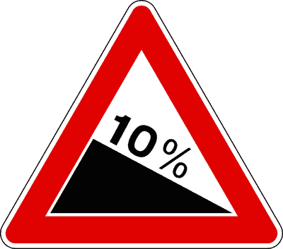

---

**339.** Il segnale raffigurato preannuncia una discesa particolarmente pericolosa

- **الإجابة:** `VERO ✅ (صح)`
- 

---

**340.** Il segnale raffigurato preannuncia un tratto di strada sul quale aumenta lo spazio di frenatura del veicolo

- **الإجابة:** `VERO ✅ (صح)`
- 

---

**341.** Il segnale raffigurato preannuncia una discesa e ne specifica la pendenza

- **الإجابة:** `VERO ✅ (صح)`
- 

---

**342.** Il segnale raffigurato comporta di moderare la velocità

- **الإجابة:** `VERO ✅ (صح)`
- 

---

**343.** Il segnale raffigurato richiede di inserire una marcia adeguatamente bassa

- **الإجابة:** `VERO ✅ (صح)`
- 

---

**344.** In presenza del segnale raffigurato, l'inserimento di una marcia bassa consente di sfruttare adeguatamente l'azione frenante del motore

- **الإجابة:** `VERO ✅ (صح)`
- 

---

**345.** In presenza del segnale raffigurato si deve moderare la velocità per evitare di tamponare veicoli che procedono più lentamente

- **الإجابة:** `VERO ✅ (صح)`
- 

---

**346.** In presenza del segnale raffigurato bisogna evitare l'uso prolungato dei freni per non surriscaldarli

- **الإجابة:** `VERO ✅ (صح)`
- 

---

**347.** In presenza del segnale raffigurato bisogna evitare un uso eccessivo dei freni e regolare la velocità inserendo una marcia bassa

- **الإجابة:** `VERO ✅ (صح)`
- 

---

**348.** In presenza del segnale raffigurato bisogna usare molta prudenza se la strada è bagnata

- **الإجابة:** `VERO ✅ (صح)`
- 

---

**349.** Il segnale raffigurato preannuncia una salita da percorrere con marcia adeguatamente bassa

- **الإجابة:** `FALSO ❌ (خطأ)`
- 

---

**350.** Il segnale raffigurato preannuncia un tratto di strada pericoloso per il fondo dissestato

- **الإجابة:** `FALSO ❌ (خطأ)`
- 

---

**351.** Il segnale raffigurato specifica la pendenza di una salita

- **الإجابة:** `FALSO ❌ (خطأ)`
- 

---

**352.** Il segnale raffigurato preannuncia un tratto di strada che è bene percorrere con il pedale della frizione abbassato

- **الإجابة:** `FALSO ❌ (خطأ)`
- 

---

**353.** Il segnale raffigurato preannuncia una salita pericolosa

- **الإجابة:** `FALSO ❌ (خطأ)`
- 

---

**354.** Il segnale raffigurato indica che non è consentito superare la velocità di 10 km/h

- **الإجابة:** `FALSO ❌ (خطأ)`
- 

---

**355.** In presenza del segnale raffigurato il pericolo è minore in caso di pioggia

- **الإجابة:** `FALSO ❌ (خطأ)`
- 

---

**356.** In presenza del segnale raffigurato si deve rallentare usando continuamente i freni per non danneggiare il cambio di velocità

- **الإجابة:** `FALSO ❌ (خطأ)`
- 

---

**357.** In presenza del segnale raffigurato bisogna inserire la marcia più alta e adeguare la velocità con i freni

- **الإجابة:** `FALSO ❌ (خطأ)`
- 

---

**358.** In presenza del segnale raffigurato bisogna marciare con la frizione abbassata

- **الإجابة:** `FALSO ❌ (خطأ)`
- 

---

**359.** In presenza del segnale raffigurato il conducente deve diminuire la distanza di sicurezza dal veicolo che lo precede

- **الإجابة:** `FALSO ❌ (خطأ)`
- 

---

## 📌 Salita ripida (8 domande)

**360.** Il segnale raffigurato è posto prima di una salita ripida

- **الإجابة:** `VERO ✅ (صح)`
- 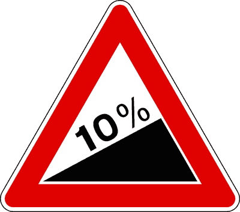

---

**361.** Il segnale raffigurato preannuncia una salita da percorrere con prudenza

- **الإجابة:** `VERO ✅ (صح)`
- 

---

**362.** Il segnale raffigurato preannuncia un tratto di strada da percorrere con marcia adeguatamente bassa

- **الإجابة:** `VERO ✅ (صح)`
- 

---

**363.** Il segnale raffigurato specifica la pendenza della salita

- **الإجابة:** `VERO ✅ (صح)`
- 

---

**364.** Il segnale raffigurato preannuncia un tratto di strada da percorrere con il pedale della frizione abbassato

- **الإجابة:** `FALSO ❌ (خطأ)`
- 

---

**365.** Il segnale raffigurato preannuncia un tratto di strada nel quale aumenta lo spazio di frenatura del veicolo

- **الإجابة:** `FALSO ❌ (خطأ)`
- 

---

**366.** Il segnale raffigurato preannuncia un tratto di strada pericoloso per curve strette

- **الإجابة:** `FALSO ❌ (خطأ)`
- 

---

**367.** Il segnale raffigurato preannuncia una discesa e ne specifica la pendenza

- **الإجابة:** `FALSO ❌ (خطأ)`
- 

---

## 📌 Restringimento carreggiata (16 domande)

**368.** Il segnale raffigurato preannuncia un restringimento della carreggiata

- **الإجابة:** `VERO ✅ (صح)`
- 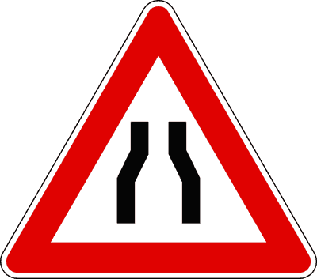

---

**369.** Il segnale raffigurato preannuncia una strettoia con probabili difficoltà di incrocio con i veicoli provenienti dal senso opposto

- **الإجابة:** `VERO ✅ (صح)`
- 

---

**370.** Il segnale raffigurato preannuncia un restringimento sui due lati della carreggiata

- **الإجابة:** `VERO ✅ (صح)`
- 

---

**371.** Il segnale in figura è un segnale di pericolo

- **الإجابة:** `VERO ✅ (صح)`
- 

---

**372.** Dopo il segnale (A) si può trovare il segnale (B)

- **الإجابة:** `VERO ✅ (صح)`
- 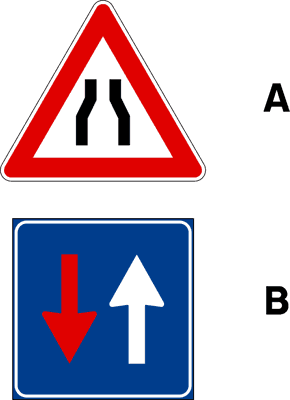

---

**373.** Dopo il segnale (A) si può trovare il segnale (B)

- **الإجابة:** `VERO ✅ (صح)`
- 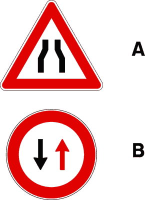

---

**374.** Il segnale raffigurato, se a fondo giallo, è posto in presenza di un cantiere stradale che riduce la larghezza della carreggiata

- **الإجابة:** `VERO ✅ (صح)`
- 

---

**375.** Il segnale raffigurato comporta di moderare la velocità

- **الإجابة:** `VERO ✅ (صح)`
- 

---

**376.** Il segnale raffigurato preannuncia un senso unico alternato con l'obbligo di dare la precedenza ai veicoli provenienti dall'altro senso

- **الإجابة:** `FALSO ❌ (خطأ)`
- 

---

**377.** Il segnale raffigurato preannuncia che i veicoli provenienti dall'altro senso devono darci la precedenza

- **الإجابة:** `FALSO ❌ (خطأ)`
- 

---

**378.** Il segnale raffigurato preannuncia un divieto di transito agli autobus

- **الإجابة:** `FALSO ❌ (خطأ)`
- 

---

**379.** Il segnale raffigurato preannuncia un lungo rettilineo

- **الإجابة:** `FALSO ❌ (خطأ)`
- 

---

**380.** Il segnale raffigurato preannuncia l'ingresso di una galleria

- **الإجابة:** `FALSO ❌ (خطأ)`
- 

---

**381.** Il segnale raffigurato è un segnale di prescrizione

- **الإجابة:** `FALSO ❌ (خطأ)`
- 

---

**382.** Il segnale raffigurato preannuncia una strada a senso unico

- **الإجابة:** `FALSO ❌ (خطأ)`
- 

---

**383.** Il segnale raffigurato preannuncia una corsia di accelerazione

- **الإجابة:** `FALSO ❌ (خطأ)`
- 

---

## 📌 Restringimento sinistra (15 domande)

**384.** Il segnale raffigurato preannuncia un restringimento della carreggiata

- **الإجابة:** `VERO ✅ (صح)`
- 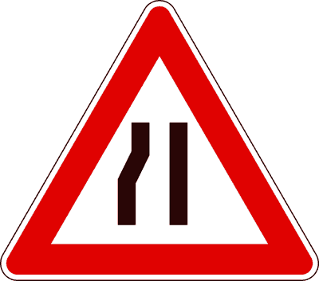

---

**385.** Il segnale raffigurato preannuncia una strettoia sul lato sinistro della carreggiata

- **الإجابة:** `VERO ✅ (صح)`
- 

---

**386.** Il segnale raffigurato preannuncia un restringimento pericoloso sulla sinistra della carreggiata

- **الإجابة:** `VERO ✅ (صح)`
- 

---

**387.** Il segnale raffigurato preannuncia una strettoia con probabile difficoltà di incrocio con i veicoli provenienti dal senso opposto

- **الإجابة:** `VERO ✅ (صح)`
- 

---

**388.** Il segnale raffigurato impone di moderare la velocità e, se occorre, arrestarsi

- **الإجابة:** `VERO ✅ (صح)`
- 

---

**389.** Il segnale raffigurato è un segnale di pericolo

- **الإجابة:** `VERO ✅ (صح)`
- 

---

**390.** Il segnale raffigurato, se a fondo giallo, è posto in presenza di un cantiere stradale che riduce la larghezza della carreggiata

- **الإجابة:** `VERO ✅ (صح)`
- 

---

**391.** Il segnale raffigurato è un segnale di prescrizione

- **الإجابة:** `FALSO ❌ (خطأ)`
- 

---

**392.** Il segnale raffigurato preannuncia una confluenza da sinistra

- **الإجابة:** `FALSO ❌ (خطأ)`
- 

---

**393.** Il segnale raffigurato preannuncia una strada con una serie di curve

- **الإجابة:** `FALSO ❌ (خطأ)`
- 

---

**394.** Il segnale raffigurato preannuncia un cavalcavia

- **الإجابة:** `FALSO ❌ (خطأ)`
- 

---

**395.** Il segnale raffigurato preannuncia un sottopassaggio pedonale

- **الإجابة:** `FALSO ❌ (خطأ)`
- 

---

**396.** Il segnale raffigurato preannuncia un restringimento sulla destra della carreggiata

- **الإجابة:** `FALSO ❌ (خطأ)`
- 

---

**397.** Il segnale raffigurato preannuncia la presenza di un cordolo alto per separare le corsie

- **الإجابة:** `FALSO ❌ (خطأ)`
- 

---

**398.** Il segnale raffigurato preannuncia un tratto di strada sdrucciolevole

- **الإجابة:** `FALSO ❌ (خطأ)`
- 

---

## 📌 Restringimento destra (12 domande)

**399.** Il segnale raffigurato preannuncia una strettoia sulla destra della carreggiata

- **الإجابة:** `VERO ✅ (صح)`
- 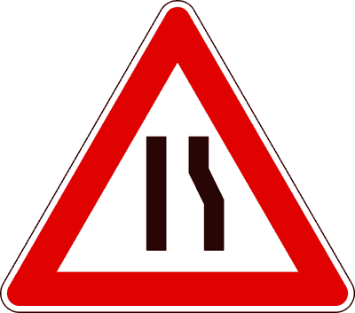

---

**400.** Il segnale raffigurato preannuncia una strettoia causata da un ostacolo fisso sul lato destro

- **الإجابة:** `VERO ✅ (صح)`
- 

---

**401.** Il segnale raffigurato preannuncia un restringimento pericoloso sulla destra della carreggiata

- **الإجابة:** `VERO ✅ (صح)`
- 

---

**402.** Il segnale raffigurato preannuncia il restringimento della carreggiata causato da muretti o altro ostacolo sul lato destro

- **الإجابة:** `VERO ✅ (صح)`
- 

---

**403.** Il segnale raffigurato può trovarsi anche su strada a doppio senso di circolazione

- **الإجابة:** `VERO ✅ (صح)`
- 

---

**404.** Il segnale raffigurato, se a fondo giallo, è posto in presenza di un cantiere che riduce la larghezza della carreggiata

- **الإجابة:** `VERO ✅ (صح)`
- 

---

**405.** Il segnale raffigurato indica la fine del doppio senso di circolazione

- **الإجابة:** `FALSO ❌ (خطأ)`
- 

---

**406.** Il segnale raffigurato obbliga a dare la precedenza ai veicoli provenienti dal senso opposto

- **الإجابة:** `FALSO ❌ (خطأ)`
- 

---

**407.** Il segnale raffigurato autorizza la marcia per file parallele

- **الإجابة:** `FALSO ❌ (خطأ)`
- 

---

**408.** Il segnale raffigurato indica di disporsi su due file

- **الإجابة:** `FALSO ❌ (خطأ)`
- 

---

**409.** Il segnale raffigurato preannuncia una confluenza da destra

- **الإجابة:** `FALSO ❌ (خطأ)`
- 

---

**410.** Il segnale raffigurato preannuncia l'inizio di un senso unico

- **الإجابة:** `FALSO ❌ (خطأ)`
- 

---

## 📌 Ponte mobile (12 domande)

**411.** Il segnale raffigurato preannuncia un ponte mobile

- **الإجابة:** `VERO ✅ (صح)`
- 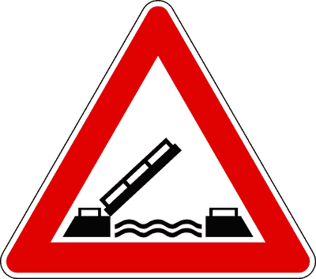

---

**412.** Il segnale raffigurato è un segnale di pericolo

- **الإجابة:** `VERO ✅ (صح)`
- 

---

**413.** Il segnale raffigurato può essere integrato con pannello indicante gli orari di manovra o di funzionamento di un ponte mobile

- **الإجابة:** `VERO ✅ (صح)`
- 

---

**414.** Dopo il segnale raffigurato possiamo trovare un dispositivo a luci rosse lampeggianti

- **الإجابة:** `VERO ✅ (صح)`
- 

---

**415.** Il segnale raffigurato comporta di arrestarsi se sono in funzione le luci rosse lampeggianti

- **الإجابة:** `VERO ✅ (صح)`
- 

---

**416.** Il segnale raffigurato può essere integrato dal pannello distanziometrico a tre barre rosse

- **الإجابة:** `VERO ✅ (صح)`
- 

---

**417.** Il segnale raffigurato preannuncia un'area portuale

- **الإجابة:** `FALSO ❌ (خطأ)`
- 

---

**418.** Il segnale raffigurato obbliga ad arrestarsi prima di attraversare il ponte

- **الإجابة:** `FALSO ❌ (خطأ)`
- 

---

**419.** Il segnale raffigurato preannuncia un ponte con forte pendenza

- **الإجابة:** `FALSO ❌ (خطأ)`
- 

---

**420.** Il segnale raffigurato impone di dare la precedenza ai veicoli provenienti dal senso opposto

- **الإجابة:** `FALSO ❌ (خطأ)`
- 

---

**421.** Il segnale raffigurato vieta il sorpasso se posto sulla strada di accesso ad un'area portuale

- **الإجابة:** `FALSO ❌ (خطأ)`
- 

---

**422.** Il segnale raffigurato preannuncia un passaggio a livello con barriere

- **الإجابة:** `FALSO ❌ (خطأ)`
- 

---

## 📌 Strada sdrucciolevole (24 domande)

**423.** Il segnale raffigurato preannuncia un tratto di strada che può diventare pericoloso in particolari condizioni climatiche specificate nei pannelli integrativi

- **الإجابة:** `VERO ✅ (صح)`
- 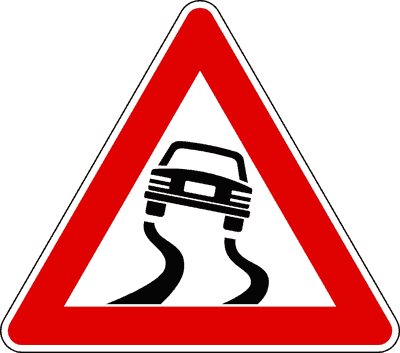

---

**424.** Il segnale raffigurato preannuncia una strada con superficie che può diventare particolarmente sdrucciolevole

- **الإجابة:** `VERO ✅ (صح)`
- 

---

**425.** Il segnale (A), abbinato con il pannello (B), preannuncia una strada con superficie particolarmente sdrucciolevole in caso di pioggia

- **الإجابة:** `VERO ✅ (صح)`
- 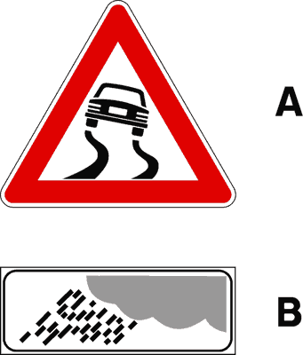

---

**426.** Il segnale (A), se abbinato con il pannello (B), preannuncia un tratto di strada sul quale, in particolari condizioni meteorologiche, è probabile la presenza di ghiaccio

- **الإجابة:** `VERO ✅ (صح)`
- 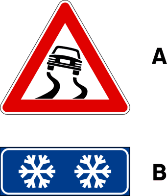

---

**427.** Il segnale raffigurato preannuncia un tratto di strada sul quale può diminuire l'aderenza degli pneumatici

- **الإجابة:** `VERO ✅ (صح)`
- 

---

**428.** Il segnale raffigurato comporta di procedere a velocità moderata e di evitare brusche manovre

- **الإجابة:** `VERO ✅ (صح)`
- 

---

**429.** In presenza del segnale raffigurato è necessario moderare la velocità ed evitare brusche frenate in caso di pioggia

- **الإجابة:** `VERO ✅ (صح)`
- 

---

**430.** In presenza del segnale raffigurato è necessario moderare la velocità ed evitare brusche accelerate in caso di ghiaccio

- **الإجابة:** `VERO ✅ (صح)`
- 

---

**431.** In presenza del segnale raffigurato è necessario moderare la velocità ed evitare brusche sterzate in caso di pioggia

- **الإجابة:** `VERO ✅ (صح)`
- 

---

**432.** In presenza del segnale raffigurato è necessario moderare la velocità e tenere presente che la distanza di sicurezza aumenta in caso di ghiaccio

- **الإجابة:** `VERO ✅ (صح)`
- 

---

**433.** Il segnale raffigurato preannuncia una strettoia

- **الإجابة:** `FALSO ❌ (خطأ)`
- 

---

**434.** Il segnale raffigurato preannuncia la possibilità di sbandamento per forte vento laterale

- **الإجابة:** `FALSO ❌ (خطأ)`
- 

---

**435.** Il segnale raffigurato preannuncia un tratto di strada dove aumenta l'aderenza degli pneumatici

- **الإجابة:** `FALSO ❌ (خطأ)`
- 

---

**436.** Il segnale raffigurato preannuncia che su quella strada diminuisce lo spazio di frenatura

- **الإجابة:** `FALSO ❌ (خطأ)`
- 

---

**437.** Il segnale raffigurato invita a diminuire la distanza di sicurezza

- **الإجابة:** `FALSO ❌ (خطأ)`
- 

---

**438.** Il segnale raffigurato preannuncia una strada con molte curve

- **الإجابة:** `FALSO ❌ (خطأ)`
- 

---

**439.** Il segnale raffigurato preannuncia una pista per la prova di tenuta degli pneumatici

- **الإجابة:** `FALSO ❌ (خطأ)`
- 

---

**440.** In presenza del segnale raffigurato è necessario tenere presente che la distanza di frenatura diminuisce in caso di pioggia

- **الإجابة:** `FALSO ❌ (خطأ)`
- 

---

**441.** In presenza del segnale raffigurato è necessario diminuire la distanza dal veicolo che ci precede, in caso di pioggia

- **الإجابة:** `FALSO ❌ (خطأ)`
- 

---

**442.** In presenza del segnale raffigurato è necessario accelerare bruscamente in caso di pioggia

- **الإجابة:** `FALSO ❌ (خطأ)`
- 

---

**443.** In presenza del segnale raffigurato è sempre vietato il sorpasso quando piove

- **الإجابة:** `FALSO ❌ (خطأ)`
- 

---

**444.** In presenza del segnale raffigurato è necessario frenare bruscamente in caso di ghiaccio

- **الإجابة:** `FALSO ❌ (خطأ)`
- 

---

**445.** Il segnale raffigurato vieta il transito ai veicoli con ruote sporche di fango

- **الإجابة:** `FALSO ❌ (خطأ)`
- 

---

**446.** In presenza del segnale raffigurato è necessario montare le catene

- **الإجابة:** `FALSO ❌ (خطأ)`
- 

---

## 📌 Attenzione bambini (21 domande)

**447.** Il segnale raffigurato può preannunciare la presenza di una scuola frequentata da bambini nelle vicinanze

- **الإجابة:** `VERO ✅ (صح)`
- 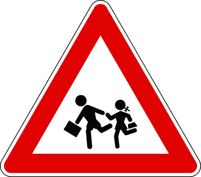

---

**448.** Il segnale raffigurato può essere posto nelle vicinanze di un campo da gioco frequentato da bambini

- **الإجابة:** `VERO ✅ (صح)`
- 

---

**449.** Il segnale raffigurato preannuncia luoghi frequentati da fanciulli

- **الإجابة:** `VERO ✅ (صح)`
- 

---

**450.** Il segnale raffigurato è un segnale di pericolo

- **الإجابة:** `VERO ✅ (صح)`
- 

---

**451.** Il segnale raffigurato può essere posto nelle vicinanze di giardini pubblici frequentati da bambini

- **الإجابة:** `VERO ✅ (صح)`
- 

---

**452.** Il segnale raffigurato invita a circolare a velocità moderata

- **الإجابة:** `VERO ✅ (صح)`
- 

---

**453.** Il segnale raffigurato invita a considerare eventuali comportamenti imprudenti di fanciulli

- **الإجابة:** `VERO ✅ (صح)`
- 

---

**454.** In presenza del segnale raffigurato occorre prestare particolare attenzione per la possibile presenza di bambini

- **الإجابة:** `VERO ✅ (صح)`
- 

---

**455.** In presenza del segnale raffigurato è necessario moderare la velocità e prestare attenzione ai bambini anche se si trovano sui marciapiedi

- **الإجابة:** `VERO ✅ (صح)`
- 

---

**456.** In presenza del segnale raffigurato occorre prestare particolare attenzione ai movimenti imprevedibili dei bambini

- **الإجابة:** `VERO ✅ (صح)`
- 

---

**457.** In presenza del segnale raffigurato è vietato sorpassare i veicoli che si sono fermati per lasciare attraversare i bambini

- **الإجابة:** `VERO ✅ (صح)`
- 

---

**458.** Il segnale raffigurato vieta il transito ai bambini non accompagnati

- **الإجابة:** `FALSO ❌ (خطأ)`
- 

---

**459.** Il segnale raffigurato preannuncia un attraversamento pedonale

- **الإجابة:** `FALSO ❌ (خطأ)`
- 

---

**460.** Il segnale raffigurato indica la fine di un viale riservato ai bambini

- **الإجابة:** `FALSO ❌ (خطأ)`
- 

---

**461.** Il segnale raffigurato preannuncia un percorso pedonale

- **الإجابة:** `FALSO ❌ (خطأ)`
- 

---

**462.** Il segnale raffigurato vieta il transito ai veicoli a motore durante l'orario di uscita dei bambini dalla scuola

- **الإجابة:** `FALSO ❌ (خطأ)`
- 

---

**463.** Il segnale raffigurato indica la fermata di uno scuolabus

- **الإجابة:** `FALSO ❌ (خطأ)`
- 

---

**464.** Il segnale raffigurato è posto sulla parte posteriore dello scuolabus

- **الإجابة:** `FALSO ❌ (خطأ)`
- 

---

**465.** In presenza del segnale raffigurato è necessario fare attenzione ai bambini sulla carreggiata e non a quelli sul marciapiede

- **الإجابة:** `FALSO ❌ (خطأ)`
- 

---

**466.** In presenza del segnale raffigurato è vietato transitare durante l'orario di uscita dei bambini da scuola

- **الإجابة:** `FALSO ❌ (خطأ)`
- 

---

**467.** In presenza del segnale raffigurato è vietato superare la velocità di 30 km/h

- **الإجابة:** `FALSO ❌ (خطأ)`
- 

---

## 📌 Animali domestici (10 domande)

**468.** Il segnale raffigurato preannuncia un tratto di strada con probabile attraversamento di animali domestici

- **الإجابة:** `VERO ✅ (صح)`
- 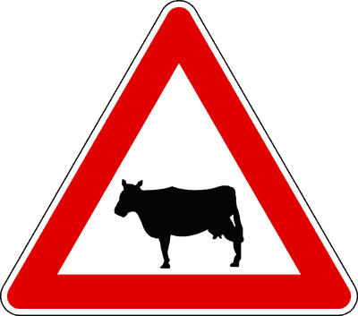

---

**469.** Il segnale raffigurato richiede di rallentare o di arrestarsi se gli animali sulla strada danno segno di spavento

- **الإجابة:** `VERO ✅ (صح)`
- 

---

**470.** Il segnale raffigurato richiede di rallentare o di arrestarsi se gli animali sulla strada non si spostano

- **الإجابة:** `VERO ✅ (صح)`
- 

---

**471.** Il segnale raffigurato preannuncia la possibilità di trovare sulla strada animali domestici vaganti

- **الإجابة:** `VERO ✅ (صح)`
- 

---

**472.** Il segnale raffigurato invita a fare attenzione per la probabile presenza di animali domestici sulla carreggiata

- **الإجابة:** `VERO ✅ (صح)`
- 

---

**473.** In presenza del segnale raffigurato è obbligatorio usare ripetutamente l'avvisatore acustico per allontanare gli animali

- **الإجابة:** `FALSO ❌ (خطأ)`
- 

---

**474.** Il segnale raffigurato preannuncia una zona riservata al pascolo con divieto di transito ai veicoli a motore

- **الإجابة:** `FALSO ❌ (خطأ)`
- 

---

**475.** Il segnale raffigurato preannuncia una strada riservata alla circolazione di animali domestici

- **الإجابة:** `FALSO ❌ (خطأ)`
- 

---

**476.** Il segnale raffigurato preannuncia la presenza di veicoli a trazione animale

- **الإجابة:** `FALSO ❌ (خطأ)`
- 

---

**477.** Il segnale raffigurato preannuncia una fattoria in aperta campagna

- **الإجابة:** `FALSO ❌ (خطأ)`
- 

---

## 📌 Animali selvatici (12 domande)

**478.** Il segnale raffigurato preannuncia il probabile attraversamento di animali selvatici

- **الإجابة:** `VERO ✅ (صح)`
- 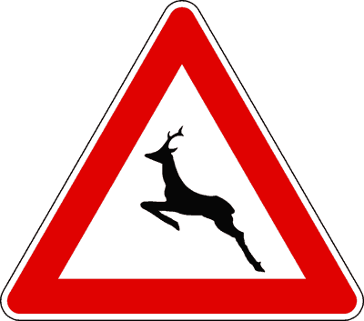

---

**479.** Il segnale raffigurato richiede di rallentare e all'occorrenza di arrestarsi se gli animali danno segno di spavento

- **الإجابة:** `VERO ✅ (صح)`
- 

---

**480.** Il segnale raffigurato richiede di rallentare e all'occorrenza di arrestarsi se gli animali attraversano improvvisamente la strada

- **الإجابة:** `VERO ✅ (صح)`
- 

---

**481.** Il segnale raffigurato preannuncia la possibilità di trovare improvvisamente animali vaganti sulla carreggiata

- **الإجابة:** `VERO ✅ (صح)`
- 

---

**482.** Il segnale raffigurato preannuncia il probabile e improvviso attraversamento di animali selvatici

- **الإجابة:** `VERO ✅ (صح)`
- 

---

**483.** Il segnale raffigurato richiede di rallentare per evitare urti con animali selvatici vaganti

- **الإجابة:** `VERO ✅ (صح)`
- 

---

**484.** In presenza del segnale raffigurato è obbligatorio usare ripetutamente l'avvisatore acustico per allontanare gli animali

- **الإجابة:** `FALSO ❌ (خطأ)`
- 

---

**485.** Il segnale raffigurato preannuncia una area riservata alla circolazione di animali selvatici

- **الإجابة:** `FALSO ❌ (خطأ)`
- 

---

**486.** Il segnale raffigurato obbliga a marciare al centro della strada per evitare di investire gli animali selvatici

- **الإجابة:** `FALSO ❌ (خطأ)`
- 

---

**487.** Il segnale raffigurato consente il transito dei soli veicoli a quattro ruote motrici

- **الإجابة:** `FALSO ❌ (خطأ)`
- 

---

**488.** Il segnale raffigurato indica l'ingresso di uno "zoo safari"

- **الإجابة:** `FALSO ❌ (خطأ)`
- 

---

**489.** Il segnale raffigurato indica l'ingresso di un Parco Nazionale

- **الإجابة:** `FALSO ❌ (خطأ)`
- 

---

## 📌 Doppio senso circolazione (14 domande)

**490.** Il segnale raffigurato preannuncia che una carreggiata a senso unico, diventa a doppio senso di circolazione

- **الإجابة:** `VERO ✅ (صح)`
- 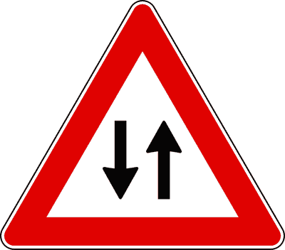

---

**491.** Il segnale raffigurato preannuncia che, poco oltre, si potranno incontrare veicoli che marciano in senso opposto

- **الإجابة:** `VERO ✅ (صح)`
- 

---

**492.** Il segnale raffigurato preannuncia che termina il senso unico di circolazione

- **الإجابة:** `VERO ✅ (صح)`
- 

---

**493.** Il segnale raffigurato è un segnale di pericolo

- **الإجابة:** `VERO ✅ (صح)`
- 

---

**494.** Il segnale raffigurato indica che, poco oltre, occorrerà usare maggiore prudenza

- **الإجابة:** `VERO ✅ (صح)`
- 

---

**495.** Il segnale raffigurato, se a fondo giallo, è posto in presenza di lavori in corso

- **الإجابة:** `VERO ✅ (صح)`
- 

---

**496.** In presenza del segnale raffigurato il sorpasso, se consentito, deve essere effettuato con particolare prudenza

- **الإجابة:** `VERO ✅ (صح)`
- 

---

**497.** Il segnale raffigurato preannuncia che il traffico si svolge su due carreggiate separate

- **الإجابة:** `FALSO ❌ (خطأ)`
- 

---

**498.** Il segnale raffigurato preannuncia che la circolazione diventa a senso unico

- **الإجابة:** `FALSO ❌ (خطأ)`
- 

---

**499.** Il segnale raffigurato impone di dare la precedenza ai veicoli provenienti in senso contrario

- **الإجابة:** `FALSO ❌ (خطأ)`
- 

---

**500.** Il segnale raffigurato preannuncia il diritto di precedenza nei sensi unici alternati

- **الإجابة:** `FALSO ❌ (خطأ)`
- 

---

**501.** Il segnale raffigurato preannuncia che bisogna ritornare indietro

- **الإجابة:** `FALSO ❌ (خطأ)`
- 

---

**502.** Il segnale raffigurato preannuncia un senso unico alternato

- **الإجابة:** `FALSO ❌ (خطأ)`
- 

---

**503.** Il segnale raffigurato è un preavviso di direzione obbligatoria

- **الإجابة:** `FALSO ❌ (خطأ)`
- 

---

## 📌 Banchina portuale (17 domande)

**504.** Il segnale raffigurato preannuncia lo sbocco della strada su una banchina portuale

- **الإجابة:** `VERO ✅ (صح)`
- 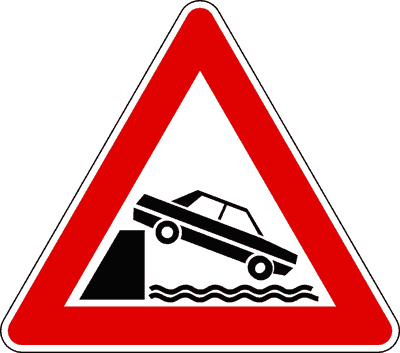

---

**505.** Il segnale raffigurato preannuncia lo sbocco della strada su un molo

- **الإجابة:** `VERO ✅ (صح)`
- 

---

**506.** Il segnale raffigurato preannuncia lo sbocco della strada sull'argine di un fiume

- **الإجابة:** `VERO ✅ (صح)`
- 

---

**507.** Il segnale raffigurato preannuncia lo sbocco della strada sull'argine di un canale

- **الإجابة:** `VERO ✅ (صح)`
- 

---

**508.** In presenza del segnale raffigurato bisogna usare particolare prudenza, soprattutto di notte, per evitare di cadere in acqua

- **الإجابة:** `VERO ✅ (صح)`
- 

---

**509.** Il segnale raffigurato preannuncia il pericolo di caduta in acqua

- **الإجابة:** `VERO ✅ (صح)`
- 

---

**510.** In presenza del segnale raffigurato bisogna usare particolare prudenza se, nel tratto di strada che segue, si dovranno effettuare manovre di retromarcia

- **الإجابة:** `VERO ✅ (صح)`
- 

---

**511.** Il segnale raffigurato è un segnale di pericolo

- **الإجابة:** `VERO ✅ (صح)`
- 

---

**512.** Il segnale raffigurato preannuncia un viadotto in costruzione

- **الإجابة:** `FALSO ❌ (خطأ)`
- 

---

**513.** Il segnale raffigurato obbliga ad arrestarsi in corrispondenza di un ponte mobile in manovra

- **الإجابة:** `FALSO ❌ (خطأ)`
- 

---

**514.** Il segnale raffigurato preannuncia un tratto di strada interrotto per alluvione

- **الإجابة:** `FALSO ❌ (خطأ)`
- 

---

**515.** Il segnale raffigurato preannuncia lo sbocco su un ponte mobile

- **الإجابة:** `FALSO ❌ (خطأ)`
- 

---

**516.** In presenza del segnale raffigurato bisogna usare particolare prudenza perché si incontra una discesa ripida

- **الإجابة:** `FALSO ❌ (خطأ)`
- 

---

**517.** Il segnale raffigurato preannuncia il pericolo di mareggiate

- **الإجابة:** `FALSO ❌ (خطأ)`
- 

---

**518.** Il segnale raffigurato preannuncia un'area attrezzata per il lavaggio dei veicoli

- **الإجابة:** `FALSO ❌ (خطأ)`
- 

---

**519.** Il segnale raffigurato si riferisce soltanto alle autovetture

- **الإجابة:** `FALSO ❌ (خطأ)`
- 

---

**520.** Il segnale raffigurato non ha validità nei mesi estivi

- **الإجابة:** `FALSO ❌ (خطأ)`
- 

---

## 📌 Pietrisco (15 domande)

**521.** Il segnale raffigurato preannuncia un tratto di strada sul quale l'aderenza del veicolo può diminuire

- **الإجابة:** `VERO ✅ (صح)`
- 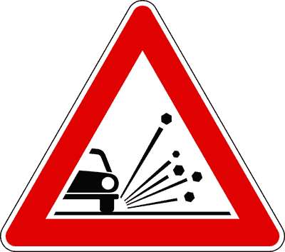

---

**522.** Il segnale raffigurato richiede di procedere con cautela in presenza di pedoni, anche se si trovano fuori dalla carreggiata

- **الإجابة:** `VERO ✅ (صح)`
- 

---

**523.** Il segnale raffigurato preannuncia la presenza di pietrisco che può essere scagliato a distanza al passaggio del veicolo

- **الإجابة:** `VERO ✅ (صح)`
- 

---

**524.** Il segnale raffigurato richiede di moderare la velocità, incrociando un altro veicolo

- **الإجابة:** `VERO ✅ (صح)`
- 

---

**525.** In presenza del segnale raffigurato è opportuno mantenere una distanza maggiore dal veicolo che precede

- **الإجابة:** `VERO ✅ (صح)`
- 

---

**526.** Il segnale raffigurato preannuncia il pericolo di trovare pietrisco sulla pavimentazione stradale

- **الإجابة:** `VERO ✅ (صح)`
- 

---

**527.** In presenza del segnale raffigurato occorre considerare il pericolo di sbandamento o di slittamento

- **الإجابة:** `VERO ✅ (صح)`
- 

---

**528.** Il segnale raffigurato, se a fondo giallo, è posto in presenza di cantieri stradali

- **الإجابة:** `VERO ✅ (صح)`
- 

---

**529.** Il segnale raffigurato consiglia di accelerare per aumentare l'aderenza del veicolo sull'asfalto

- **الإجابة:** `FALSO ❌ (خطأ)`
- 

---

**530.** Il segnale raffigurato è un segnale di prescrizione

- **الإجابة:** `FALSO ❌ (خطأ)`
- 

---

**531.** Il segnale raffigurato preannuncia un tratto di strada soggetto a frana

- **الإجابة:** `FALSO ❌ (خطأ)`
- 

---

**532.** Il segnale raffigurato, se a fondo giallo, preannuncia un tratto di strada non percorribile per la presenza di cantieri stradali

- **الإجابة:** `FALSO ❌ (خطأ)`
- 

---

**533.** Il segnale raffigurato preannuncia la presenza di banchine cedevoli

- **الإجابة:** `FALSO ❌ (خطأ)`
- 

---

**534.** Il segnale raffigurato preannuncia un tratto di strada ove esiste il pericolo di caduta di massi

- **الإجابة:** `FALSO ❌ (خطأ)`
- 

---

**535.** Il segnale raffigurato preannuncia l'obbligo di montare le catene da neve

- **الإجابة:** `FALSO ❌ (خطأ)`
- 

---

## 📌 Caduta massi sinistra (10 domande)

**536.** Il segnale raffigurato preannuncia il pericolo di caduta di massi

- **الإجابة:** `VERO ✅ (صح)`
- 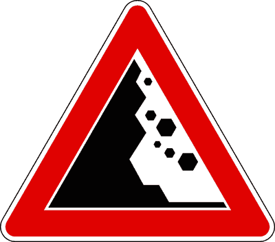

---

**537.** Il segnale raffigurato preannuncia un tratto di strada ove esiste il pericolo di presenza di pietre sulla carreggiata

- **الإجابة:** `VERO ✅ (صح)`
- 

---

**538.** Il segnale raffigurato preannuncia il pericolo di caduta di pietre da sinistra con conseguente loro presenza sulla carreggiata

- **الإجابة:** `VERO ✅ (صح)`
- 

---

**539.** In presenza del segnale raffigurato è opportuno moderare la velocità per evitare di urtare eventuali massi caduti sulla carreggiata

- **الإجابة:** `VERO ✅ (صح)`
- 

---

**540.** In presenza del segnale raffigurato è consigliabile evitare lunghe soste nel tratto di strada interessato dal pericolo

- **الإجابة:** `VERO ✅ (صح)`
- 

---

**541.** Il segnale raffigurato preannuncia un tratto di strada con cantieri stradali

- **الإجابة:** `FALSO ❌ (خطأ)`
- 

---

**542.** In presenza del segnale raffigurato è opportuno suonare con insistenza

- **الإجابة:** `FALSO ❌ (خطأ)`
- 

---

**543.** Il segnale raffigurato preannuncia un tratto di strada in cattivo stato o con pavimentazione irregolare

- **الإجابة:** `FALSO ❌ (خطأ)`
- 

---

**544.** Il segnale raffigurato preannuncia un tratto di strada deformata

- **الإجابة:** `FALSO ❌ (خطأ)`
- 

---

**545.** Il segnale raffigurato preannuncia un tratto di strada in cui è vietato il sorpasso

- **الإجابة:** `FALSO ❌ (خطأ)`
- 

---

## 📌 Caduta massi destra (11 domande)

**546.** Il segnale raffigurato preannuncia il pericolo di caduta di massi da destra

- **الإجابة:** `VERO ✅ (صح)`
- 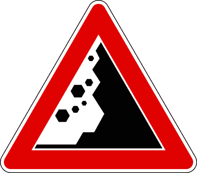

---

**547.** Il segnale raffigurato preannuncia un tratto di strada ove esiste il pericolo di presenza di pietre sulla carreggiata

- **الإجابة:** `VERO ✅ (صح)`
- 

---

**548.** Il segnale raffigurato preannuncia il pericolo di caduta di pietre dalla parete rocciosa

- **الإجابة:** `VERO ✅ (صح)`
- 

---

**549.** In presenza del segnale raffigurato è opportuno moderare la velocità per evitare di urtare eventuali massi caduti sulla carreggiata

- **الإجابة:** `VERO ✅ (صح)`
- 

---

**550.** In presenza del segnale raffigurato bisogna far attenzione a possibili brusche frenate da parte dei veicoli che precedono

- **الإجابة:** `VERO ✅ (صح)`
- 

---

**551.** Il segnale raffigurato preannuncia un tratto di strada sdrucciolevole

- **الإجابة:** `FALSO ❌ (خطأ)`
- 

---

**552.** Il segnale raffigurato preannuncia una strettoia a destra

- **الإجابة:** `FALSO ❌ (خطأ)`
- 

---

**553.** Il segnale raffigurato preannuncia un tratto di strada non asfaltato

- **الإجابة:** `FALSO ❌ (خطأ)`
- 

---

**554.** Il segnale raffigurato preannuncia banchine cedevoli

- **الإجابة:** `FALSO ❌ (خطأ)`
- 

---

**555.** Il segnale raffigurato preannuncia un tratto di strada dove non si può circolare ad oltre 30 km/h

- **الإجابة:** `FALSO ❌ (خطأ)`
- 

---

**556.** Il segnale raffigurato preannuncia possibili grandinate

- **الإجابة:** `FALSO ❌ (خطأ)`
- 

---

## 📌 Semaforo verticale (14 domande)

**557.** Il segnale raffigurato preannuncia un semaforo

- **الإجابة:** `VERO ✅ (صح)`
- 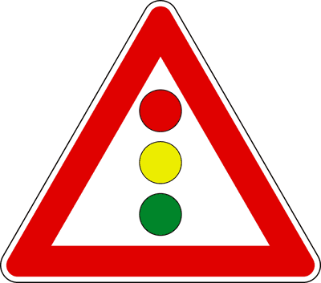

---

**558.** Il segnale raffigurato è un segnale di pericolo

- **الإجابة:** `VERO ✅ (صح)`
- 

---

**559.** Nel segnale raffigurato, il disco giallo può essere sostituito da una luce gialla lampeggiante

- **الإجابة:** `VERO ✅ (صح)`
- 

---

**560.** In presenza del segnale raffigurato bisogna moderare la velocità per potersi all'occorrenza fermare

- **الإجابة:** `VERO ✅ (صح)`
- 

---

**561.** Il segnale raffigurato è a fondo giallo se posto prima di un cantiere stradale

- **الإجابة:** `VERO ✅ (صح)`
- 

---

**562.** Il segnale raffigurato preannuncia un semaforo con disposizione delle luci in verticale

- **الإجابة:** `VERO ✅ (صح)`
- 

---

**563.** Il segnale raffigurato è obbligatorio sulle strade extraurbane

- **الإجابة:** `VERO ✅ (صح)`
- 

---

**564.** Sulle strade extraurbane il segnale è sempre obbligatorio

- **الإجابة:** `VERO ✅ (صح)`
- 

---

**565.** Il segnale raffigurato può avere il disco rosso sostituito da una luce rossa lampeggiante

- **الإجابة:** `FALSO ❌ (خطأ)`
- 

---

**566.** Il segnale raffigurato preannuncia un attraversamento ferroviario senza barriere

- **الإجابة:** `FALSO ❌ (خطأ)`
- 

---

**567.** Il segnale raffigurato può preannunciare un passaggio a livello con semibarriere

- **الإجابة:** `FALSO ❌ (خطأ)`
- 

---

**568.** Il segnale raffigurato preannuncia un senso unico alternato

- **الإجابة:** `FALSO ❌ (خطأ)`
- 

---

**569.** Il segnale raffigurato preannuncia la presenza di un ponte mobile

- **الإجابة:** `FALSO ❌ (خطأ)`
- 

---

**570.** Il segnale raffigurato può avere al centro una luce gialla fissa

- **الإجابة:** `FALSO ❌ (خطأ)`
- 

---

## 📌 Aeroplani (10 domande)

**571.** Il segnale raffigurato preannuncia la possibilità di un improvviso abbagliamento dovuto ad aeroplani a bassa quota

- **الإجابة:** `VERO ✅ (صح)`
- 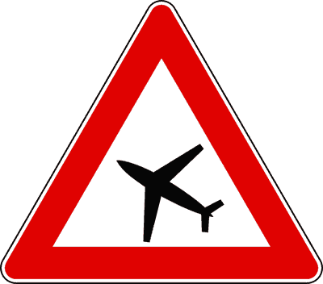

---

**572.** Il segnale raffigurato preannuncia la possibilità di un improvviso e forte rumore dovuto ad aeroplani a bassa quota

- **الإجابة:** `VERO ✅ (صح)`
- 

---

**573.** Il segnale raffigurato è posto nelle vicinanze di aeroporti

- **الإجابة:** `VERO ✅ (صح)`
- 

---

**574.** Il segnale raffigurato è posto nelle vicinanze di piste per l'atterraggio ed il decollo di aeroplani

- **الإجابة:** `VERO ✅ (صح)`
- 

---

**575.** Il segnale raffigurato è posto in zone dove può avvenire il volo a bassa quota di aeroplani

- **الإجابة:** `VERO ✅ (صح)`
- 

---

**576.** Il segnale raffigurato preannuncia una località di volo a vela

- **الإجابة:** `FALSO ❌ (خطأ)`
- 

---

**577.** Il segnale raffigurato preannuncia una zona riservata ai veicoli dell'aeronautica militare

- **الإجابة:** `FALSO ❌ (خطأ)`
- 

---

**578.** Il segnale raffigurato preannuncia un bivio per l'aeroporto

- **الإجابة:** `FALSO ❌ (خطأ)`
- 

---

**579.** Il segnale raffigurato vieta l'accesso agli aeroporti

- **الإجابة:** `FALSO ❌ (خطأ)`
- 

---

**580.** Il segnale raffigurato preannuncia una corsia riservata per l'ingresso in aeroporto

- **الإجابة:** `FALSO ❌ (خطأ)`
- 

---

## 📌 Raffiche vento (26 domande)

**581.** Il segnale raffigurato presegnala un tratto di strada soggetto a forti raffiche di vento laterale

- **الإجابة:** `VERO ✅ (صح)`
- 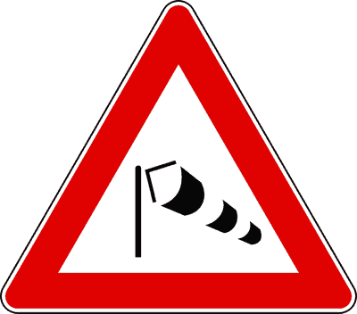

---

**582.** Il segnale raffigurato preannuncia la possibilità di forti raffiche di vento laterale all'uscita da una galleria

- **الإجابة:** `VERO ✅ (صح)`
- 

---

**583.** Il segnale raffigurato preannuncia la presenza di un viadotto esposto ad improvvise raffiche di vento laterale

- **الإجابة:** `VERO ✅ (صح)`
- 

---

**584.** Il segnale raffigurato preannuncia zone soggette a forti ed improvvise raffiche di vento laterale

- **الإجابة:** `VERO ✅ (صح)`
- 

---

**585.** Il segnale raffigurato preannuncia un pericolo che è maggiore per i veicoli telonati o furgonati

- **الإجابة:** `VERO ✅ (صح)`
- 

---

**586.** Il segnale raffigurato preannuncia di procedere con prudenza tenendo saldamente il volante

- **الإجابة:** `VERO ✅ (صح)`
- 

---

**587.** Il segnale raffigurato preannuncia un pericolo che, in caso di forte vento laterale, è maggiore per i veicoli che trainano rimorchi

- **الإجابة:** `VERO ✅ (صح)`
- 

---

**588.** Il segnale raffigurato preannuncia, in caso di forte vento laterale, un pericolo che è maggiore per i veicoli a due ruote

- **الإجابة:** `VERO ✅ (صح)`
- 

---

**589.** Il segnale raffigurato preannuncia, in caso di forte vento laterale, un pericolo che è maggiore per i veicoli che trainano caravan

- **الإجابة:** `VERO ✅ (صح)`
- 

---

**590.** Il segnale raffigurato richiede, in caso di forte vento laterale, di procedere con prudenza tenendo il volante con una presa più sicura

- **الإجابة:** `VERO ✅ (صح)`
- 

---

**591.** Il segnale raffigurato preannuncia, in caso di forte vento laterale, la necessità per i veicoli telonati di rallentare e all'occorrenza di fermarsi

- **الإجابة:** `VERO ✅ (صح)`
- 

---

**592.** Il segnale raffigurato preannuncia, in caso di forte vento laterale, possibili sbandamenti dei veicoli provenienti dal senso opposto

- **الإجابة:** `VERO ✅ (صح)`
- 

---

**593.** Il segnale raffigurato preannuncia, in caso di forte vento laterale, un pericolo che aumenta all'aumentare della superficie laterale del veicolo

- **الإجابة:** `VERO ✅ (صح)`
- 

---

**594.** Il segnale raffigurato preannuncia la presenza di aeroplani a bassa quota

- **الإجابة:** `FALSO ❌ (خطأ)`
- 

---

**595.** Il segnale raffigurato preannuncia un tratto di strada vicino ad un aeroporto

- **الإجابة:** `FALSO ❌ (خطأ)`
- 

---

**596.** Il segnale raffigurato preannuncia la presenza di un campo d'aviazione

- **الإجابة:** `FALSO ❌ (خطأ)`
- 

---

**597.** Il segnale raffigurato indica da quale direzione proviene il vento

- **الإجابة:** `FALSO ❌ (خطأ)`
- 

---

**598.** Il segnale raffigurato preannuncia la presenza, nelle vicinanze, di un parco giochi

- **الإجابة:** `FALSO ❌ (خطأ)`
- 

---

**599.** Il segnale raffigurato preannuncia la presenza di capannoni industriali nelle vicinanze

- **الإجابة:** `FALSO ❌ (خطأ)`
- 

---

**600.** Il segnale raffigurato preannuncia, in caso di forte vento laterale, un pericolo maggiore all'entrata delle gallerie per i veicoli stretti e alti

- **الإجابة:** `FALSO ❌ (خطأ)`
- 

---

**601.** Il segnale raffigurato preannuncia una zona dove, in caso di forte vento laterale, i veicoli con rimorchio hanno maggiore tenuta di strada

- **الإجابة:** `FALSO ❌ (خطأ)`
- 

---

**602.** Il segnale raffigurato preannuncia una zona dove, in caso di forte vento laterale, i veicoli scarichi o leggeri hanno maggiore tenuta di strada

- **الإجابة:** `FALSO ❌ (خطأ)`
- 

---

**603.** Il segnale raffigurato preannuncia, in caso di forte vento laterale, un pericolo che è minore per i veicoli con carichi voluminosi sopra il tetto

- **الإجابة:** `FALSO ❌ (خطأ)`
- 

---

**604.** Il segnale raffigurato, in caso di forte vento laterale, consente di sorpassare riducendo la distanza laterale dal veicolo che si sta superando

- **الإجابة:** `FALSO ❌ (خطأ)`
- 

---

**605.** Il segnale raffigurato preannuncia l'ingresso in galleria

- **الإجابة:** `FALSO ❌ (خطأ)`
- 

---

**606.** Il segnale raffigurato preannuncia la possibile presenza di ghiaccio sulla strada

- **الإجابة:** `FALSO ❌ (خطأ)`
- 

---

## 📌 Pericolo incendio (12 domande)

**607.** Il segnale raffigurato preannuncia l'attraversamento di una zona soggetta al pericolo d'incendio

- **الإجابة:** `VERO ✅ (صح)`
- 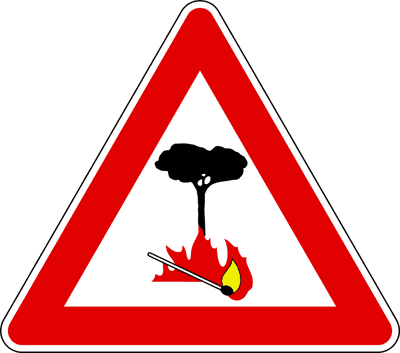

---

**608.** Il segnale raffigurato preannuncia la vicinanza di zone ad alto rischio d'incendio

- **الإجابة:** `VERO ✅ (صح)`
- 

---

**609.** Il segnale raffigurato indica che ci si sta avvicinando ad un bosco facilmente infiammabile

- **الإجابة:** `VERO ✅ (صح)`
- 

---

**610.** Il segnale raffigurato preannuncia zone laterali alla strada che sono ad alto rischio d'incendio

- **الإجابة:** `VERO ✅ (صح)`
- 

---

**611.** Il segnale raffigurato è integrato dal pannello che indica la lunghezza del tratto di strada interessato

- **الإجابة:** `VERO ✅ (صح)`
- 

---

**612.** In presenza del segnale se il conducente o gli eventuali passeggeri non rispettano il divieto di gettare sigarette accese dal finestrino, può verificarsi un incendio

- **الإجابة:** `VERO ✅ (صح)`
- 

---

**613.** Il segnale raffigurato preannuncia l'attraversamento di una zona soggetta al pericolo di esplosioni

- **الإجابة:** `FALSO ❌ (خطأ)`
- 

---

**614.** Il segnale raffigurato preannuncia un tratto di strada fiancheggiato da cave di pietra, con pericolo di esplosioni

- **الإجابة:** `FALSO ❌ (خطأ)`
- 

---

**615.** Il segnale raffigurato vieta il transito ai veicoli che trasportano esplosivi

- **الإجابة:** `FALSO ❌ (خطأ)`
- 

---

**616.** Il segnale raffigurato vieta il transito ai veicoli che trasportano prodotti facilmente infiammabili

- **الإجابة:** `FALSO ❌ (خطأ)`
- 

---

**617.** Il segnale raffigurato vieta il transito ai veicoli che trasportano liquidi infiammabili

- **الإجابة:** `FALSO ❌ (خطأ)`
- 

---

**618.** Il segnale raffigurato preannuncia la possibilità di forte vento laterale

- **الإجابة:** `FALSO ❌ (خطأ)`
- 

---

## 📌 Circolazione rotatoria (6 domande)

**619.** Il segnale raffigurato preannuncia un incrocio di due o più strade extraurbane regolato con circolazione rotatoria

- **الإجابة:** `VERO ✅ (صح)`
- 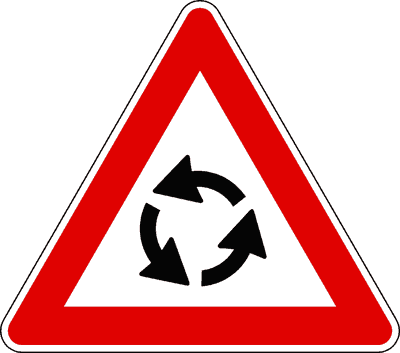

---

**620.** Il segnale raffigurato preannuncia un incrocio di più strade regolato con circolazione nel senso indicato dalle frecce

- **الإجابة:** `VERO ✅ (صح)`
- 

---

**621.** Il segnale raffigurato può essere usato anche nei centri abitati

- **الإجابة:** `VERO ✅ (صح)`
- 

---

**622.** Il segnale raffigurato vieta la svolta a destra al primo incrocio

- **الإجابة:** `FALSO ❌ (خطأ)`
- 

---

**623.** Il segnale raffigurato preannuncia una strada senza uscita, per cui bisogna tornare indietro

- **الإجابة:** `FALSO ❌ (خطأ)`
- 

---

**624.** Il segnale raffigurato preannuncia una svolta a sinistra obbligatoria

- **الإجابة:** `FALSO ❌ (خطأ)`
- 

---

## 📌 Pericolo generico (11 domande)

**625.** Il segnale raffigurato preannuncia un pericolo diverso da quelli per cui sono previsti specifici segnali

- **الإجابة:** `VERO ✅ (صح)`
- 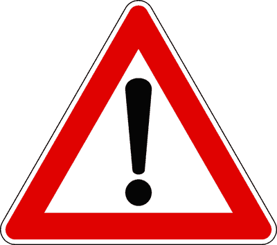

---

**626.** Il segnale raffigurato preannuncia che bisogna usare prudenza perché è vicino un pericolo

- **الإجابة:** `VERO ✅ (صح)`
- 

---

**627.** Il segnale (A), integrato con il pannello (B), preannuncia la possibilità di formazione del ghiaccio

- **الإجابة:** `VERO ✅ (صح)`
- 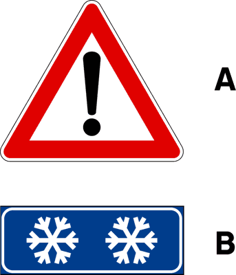

---

**628.** Il segnale raffigurato può essere usato senza pannelli integrativi per indicare un pericolo generico in caso di emergenza

- **الإجابة:** `VERO ✅ (صح)`
- 

---

**629.** Il segnale (A), integrato con il pannello (B), preannuncia la presenza di binari di manovra in corrispondenza di stabilimenti industriali

- **الإجابة:** `VERO ✅ (صح)`
- 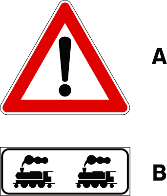

---

**630.** Il segnale (A), integrato con il pannello (B), preannuncia la possibile presenza di macchine sgombraneve al lavoro sulla strada

- **الإجابة:** `VERO ✅ (صح)`
- 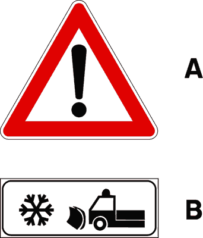

---

**631.** Il segnale raffigurato preannuncia un tratto di strada in cattivo stato o con pavimentazione irregolare

- **الإجابة:** `FALSO ❌ (خطأ)`
- 

---

**632.** Il segnale raffigurato preannuncia che bisogna proseguire diritto

- **الإجابة:** `FALSO ❌ (خطأ)`
- 

---

**633.** Il segnale raffigurato preannuncia una salita ripida

- **الإجابة:** `FALSO ❌ (خطأ)`
- 

---

**634.** Il segnale (A), integrato con il pannello (B), preannuncia un passaggio a livello senza barriere

- **الإجابة:** `FALSO ❌ (خطأ)`
- 

---

**635.** Il segnale (A), integrato con il pannello (B), preannuncia la presenza di veicoli militari in manovra

- **الإجابة:** `FALSO ❌ (خطأ)`
- 

---

## 📌 Banchina cedevole (13 domande)

**636.** Il segnale raffigurato preannuncia un tratto di strada con banchina cedevole

- **الإجابة:** `VERO ✅ (صح)`
- 

---

**637.** Il segnale raffigurato preannuncia un tratto di strada con banchina non praticabile

- **الإجابة:** `VERO ✅ (صح)`
- 

---

**638.** Il segnale raffigurato preannuncia un possibile pericolo di caduta nella cunetta laterale alla strada

- **الإجابة:** `VERO ✅ (صح)`
- 

---

**639.** Il segnale raffigurato preannuncia un tratto di strada con banchina pericolosa

- **الإجابة:** `VERO ✅ (صح)`
- 

---

**640.** Il segnale raffigurato è un segnale di pericolo

- **الإجابة:** `VERO ✅ (صح)`
- 

---

**641.** In presenza del segnale raffigurato è consigliabile non avvicinarsi troppo al margine destro della strada

- **الإجابة:** `VERO ✅ (صح)`
- 

---

**642.** Il segnale raffigurato deve essere integrato con il segnale di limite di velocità

- **الإجابة:** `FALSO ❌ (خطأ)`
- 

---

**643.** Il segnale raffigurato è un segnale di indicazione

- **الإجابة:** `FALSO ❌ (خطأ)`
- 

---

**644.** Il segnale raffigurato preannuncia il divieto di continuare a percorrere quella strada

- **الإجابة:** `FALSO ❌ (خطأ)`
- 

---

**645.** Il segnale raffigurato preannuncia una strada dissestata

- **الإجابة:** `FALSO ❌ (خطأ)`
- 

---

**646.** Il segnale raffigurato preannuncia la presenza di pietrisco sulla pavimentazione

- **الإجابة:** `FALSO ❌ (خطأ)`
- 

---

**647.** Il segnale raffigurato preannuncia il pericolo di allagamento della carreggiata

- **الإجابة:** `FALSO ❌ (خطأ)`
- 

---

**648.** Il segnale raffigurato, preannuncia lo sbocco su un molo

- **الإجابة:** `FALSO ❌ (خطأ)`
- 

---

## 📌 Semaforo orizzontale (14 domande)

**649.** Il segnale raffigurato preannuncia un impianto semaforico con disposizione delle luci in orizzontale

- **الإجابة:** `VERO ✅ (صح)`
- 

---

**650.** Il segnale raffigurato è un segnale di pericolo

- **الإجابة:** `VERO ✅ (صح)`
- 

---

**651.** Nel segnale raffigurato, il disco giallo può essere sostituito da una luce gialla lampeggiante

- **الإجابة:** `VERO ✅ (صح)`
- 

---

**652.** Il segnale raffigurato indica che bisogna moderare la velocità per potersi all'occorrenza fermare

- **الإجابة:** `VERO ✅ (صح)`
- 

---

**653.** Il segnale raffigurato è, di norma, posto 150 metri prima di un semaforo

- **الإجابة:** `VERO ✅ (صح)`
- 

---

**654.** Il segnale raffigurato indica l'obbligo di arresto ad un posto di blocco stradale istituito dagli organi di polizia

- **الإجابة:** `FALSO ❌ (خطأ)`
- 

---

**655.** Il segnale raffigurato preannuncia la presenza di un ponte mobile

- **الإجابة:** `FALSO ❌ (خطأ)`
- 

---

**656.** Il segnale raffigurato preannuncia l'accesso al pontile d'imbarco di navi traghetto

- **الإجابة:** `FALSO ❌ (خطأ)`
- 

---

**657.** Il segnale raffigurato può avere il disco rosso sostituito da una luce rossa lampeggiante

- **الإجابة:** `FALSO ❌ (خطأ)`
- 

---

**658.** Il segnale raffigurato preannuncia un attraversamento ferroviario senza barriere

- **الإجابة:** `FALSO ❌ (خطأ)`
- 

---

**659.** Il segnale raffigurato preannuncia un passaggio a livello con semibarriere

- **الإجابة:** `FALSO ❌ (خطأ)`
- 

---

**660.** Il segnale raffigurato preannuncia la presenza di corsie reversibili

- **الإجابة:** `FALSO ❌ (خطأ)`
- 

---

**661.** Il segnale raffigurato preannuncia un attraversamento ciclabile

- **الإجابة:** `FALSO ❌ (خطأ)`
- 

---

**662.** Il segnale raffigurato preannuncia la presenza di macchine sgombraneve in azione

- **الإجابة:** `FALSO ❌ (خطأ)`
- 

---

