# Capitolo 03 - Segnali di divieto
### إشارات المنع

- 📁 **المجلد المحلي للباب:** `Capitolo_03_segnali_divieto`
- 📊 **إجمالي الأسئلة المعتمدة والمشروحة:** 521 سؤالاً وزارياً

## 📌 Divieto transito (17 domande)

**1.** Il segnale raffigurato vieta la circolazione nei due sensi
- **الإجابة:** `VERO ✅ (صح)`
- 
- **📖 الترجمة السياقية:** الإشارة الموضحة تمنع السير في كلا الاتجاهين.
- **💡 الشرح والقاعدة المرورية:** إشارة "ممنوع المرور في الاتجاهين" (دائرة بيضاء بإطار أحمر - م 116 لائحة تنفيذية): توضع عند مدخلي الطريق لتمنع حركة سير جميع المركبات في الاتجاهين ذهاباً وإياباً. العبارة صحيحة.
- **⚠️ كشف الفخ:** vieta nei due sensi: صحيح، تمنع السير في الاتجاهين معاً.
- **🔑 الكلمات المفتاحية:** `divieto di transito (ممنوع المرور / حظر السير في الاتجاهين)` | `due sensi (اتجاهين)` | `segnale di divieto (إشارة منع)`

---

**2.** Il segnale raffigurato vieta il transito a tutti i veicoli
- **الإجابة:** `VERO ✅ (صح)`
- 
- **📖 الترجمة السياقية:** الإشارة الموضحة تمنع مرور جميع المركبات.
- **💡 الشرح والقاعدة المرورية:** إشارة "ممنوع المرور في الاتجاهين" (دائرة بيضاء بإطار أحمر - م 116 لائحة تنفيذية): يسري الحظر على كافة أصناف المركبات بمحرك وبدون محرك (سيارات، دراجات نارية، دراجات هوائية، وعربات). العبارة صحيحة.
- **⚠️ كشف الفخ:** tutti i veicoli: صحيح، المنع يشمل كافة أصناف المركبات.
- **🔑 الكلمات المفتاحية:** `divieto di transito (ممنوع المرور / حظر السير في الاتجاهين)` | `tutti i veicoli (جميع المركبات)`

---

**3.** Il segnale raffigurato vieta la circolazione ai quadricicli a motore
- **الإجابة:** `VERO ✅ (صح)`
- 
- **📖 الترجمة السياقية:** الإشارة الموضحة تمنع سير الدراجات الرباعية ذات المحرك (الكواد).
- **💡 الشرح والقاعدة المرورية:** إشارة "ممنوع المرور في الاتجاهين" (دائرة بيضاء بإطار أحمر - م 116 لائحة تنفيذية): الدراجات الرباعية (quadricicli a motore) تُصنف كمركبات وبالتالي يشملها منع السير قطعاً. العبارة صحيحة.
- **⚠️ كشف الفخ:** quadricicli a motore: الدراجات الرباعية مركبات ويشملها الحظر.
- **🔑 الكلمات المفتاحية:** `divieto di transito (ممنوع المرور / حظر السير في الاتجاهين)` | `quadricicli a motore (دراجات رباعية بمحرك)`

---

**4.** Il segnale raffigurato è posto su entrambi gli accessi della strada
- **الإجابة:** `VERO ✅ (صح)`
- 
- **📖 الترجمة السياقية:** الإشارة الموضحة توضع عند كلا مدخلي الطريق.
- **💡 الشرح والقاعدة المرورية:** إشارة "ممنوع المرور في الاتجاهين" (دائرة بيضاء بإطار أحمر - م 116 لائحة تنفيذية): بما أنها تمنع السير في الاتجاهين، فهي تُثبت على جميع المداخل المؤدية إلى ذلك المقطع الطريقي. العبارة صحيحة.
- **⚠️ كشف الفخ:** entrambi gli accessi: صحيح، توضع على جانبي الطريق ومداخله.
- **🔑 الكلمات المفتاحية:** `divieto di transito (ممنوع المرور / حظر السير في الاتجاهين)` | `accessi (مداخل)`

---

**5.** Il segnale raffigurato vieta il transito agli autocarri
- **الإجابة:** `VERO ✅ (صح)`
- 
- **📖 الترجمة السياقية:** الإشارة الموضحة تمنع مرور شاحنات نقل البضائع.
- **💡 الشرح والقاعدة المرورية:** إشارة "ممنوع المرور في الاتجاهين" (دائرة بيضاء بإطار أحمر - م 116 لائحة تنفيذية): الشاحنات (autocarri) مركبات مشمولة بالحظر العام لمرور المركبات. العبارة صحيحة.
- **⚠️ كشف الفخ:** vieta agli autocarri: صحيح، الشاحنات تندرج ضمن المركبات الممنوعة.
- **🔑 الكلمات المفتاحية:** `divieto di transito (ممنوع المرور / حظر السير في الاتجاهين)` | `autocarri (شاحنات نقل بضائع)`

---

**6.** Il segnale raffigurato può avere validità limitata nel tempo, indicata in un pannello integrativo
- **الإجابة:** `VERO ✅ (صح)`
- 
- **📖 الترجمة السياقية:** الإشارة الموضحة يمكن أن تكون صلاحيتها محددة بوقت، موضح في لوحة إضافية.
- **💡 الشرح والقاعدة المرورية:** إشارة "ممنوع المرور في الاتجاهين" (دائرة بيضاء بإطار أحمر - م 116 لائحة تنفيذية): يجوز استكمالها بلوحة إضافية تحدد ساعات أو أيام منع السير (fascia oraria). العبارة صحيحة.
- **⚠️ كشف الفخ:** validità limitata nel tempo: صحيح، قد تقيد بأوقات محددة بلوحة تكميلية.
- **🔑 الكلمات المفتاحية:** `divieto di transito (ممنوع المرور / حظر السير في الاتجاهين)` | `pannello integrativo (لوحة إضافية)` | `orario (توقيت)`

---

**7.** Il segnale raffigurato consente il transito ai pedoni
- **الإجابة:** `VERO ✅ (صح)`
- 
- **📖 الترجمة السياقية:** الإشارة الموضحة تسمح بمرور المشاة.
- **💡 الشرح والقاعدة المرورية:** إشارة "ممنوع المرور في الاتجاهين" (دائرة بيضاء بإطار أحمر - م 116 لائحة تنفيذية): المشاة (pedoni) ليسوا مركبات، وبالتالي يحق لهم استخدام الطريق والسير فيه بحرية. العبارة صحيحة.
- **⚠️ كشف الفخ:** consente ai pedoni: المشاة ليسوا مركبات وبالتالي لا يشملهم المنع.
- **🔑 الكلمات المفتاحية:** `divieto di transito (ممنوع المرور / حظر السير في الاتجاهين)` | `pedoni (مشاة)`

---

**8.** Il segnale raffigurato vieta la circolazione ai ciclomotori
- **الإجابة:** `VERO ✅ (صح)`
- 
- **📖 الترجمة السياقية:** الإشارة الموضحة تمنع سير الدراجات النارية الصغيرة (السيبلومات).
- **💡 الشرح والقاعدة المرورية:** إشارة "ممنوع المرور في الاتجاهين" (دائرة بيضاء بإطار أحمر - م 116 لائحة تنفيذية): الدراجات الآلية الخفيفة (ciclomotori) مركبات ذات محرك وتخضع للمنع التام. العبارة صحيحة.
- **⚠️ كشف الفخ:** vieta ai ciclomotori: صحيح، السيبلومات مشمولة بالحظر.
- **🔑 الكلمات المفتاحية:** `divieto di transito (ممنوع المرور / حظر السير في الاتجاهين)` | `ciclomotori (دراجات آلية صغيرة (سيبلومات))`

---

**9.** Il segnale raffigurato è un DIVIETO DI TRANSITO
- **الإجابة:** `VERO ✅ (صح)`
- 
- **📖 الترجمة السياقية:** الإشارة الموضحة هي إشارة "ممنوع المرور" (DIVIETO DI TRANSITO).
- **💡 الشرح والقاعدة المرورية:** إشارة "ممنوع المرور في الاتجاهين" (دائرة بيضاء بإطار أحمر - م 116 لائحة تنفيذية): هذا هو الاسم والمصطلح الرسمي المعتمد في قانون السير الإيطالي. العبارة صحيحة.
- **⚠️ كشف الفخ:** DIVIETO DI TRANSITO: التسمية القانونية المعتمدة.
- **🔑 الكلمات المفتاحية:** `divieto di transito (ممنوع المرور / حظر السير في الاتجاهين)` | `segnale di divieto (إشارة منع)`

---

**10.** Il segnale raffigurato consente il transito alle biciclette
- **الإجابة:** `FALSO ❌ (خطأ)`
- 
- **📖 الترجمة السياقية:** الإشارة الموضحة تسمح بمرور الدراجات الهوائية.
- **💡 الشرح والقاعدة المرورية:** إشارة "ممنوع المرور في الاتجاهين" (دائرة بيضاء بإطار أحمر - م 116 لائحة تنفيذية): الدراجات الهوائية (velocipedi) تُعد قانوناً مركبات، وبالتالي يُحظر عليها المرور تماماً كباقي المركبات. العبارة خاطئة.
- **⚠️ كشف الفخ:** consente alle biciclette: فخ؛ الدراجات الهوائية مركبات ويشملها المنع.
- **🔑 الكلمات المفتاحية:** `divieto di transito (ممنوع المرور / حظر السير في الاتجاهين)` | `biciclette / velocipedi (دراجات هوائية)`

---

**11.** Il segnale raffigurato vieta il transito unicamente ai veicoli a motore
- **الإجابة:** `FALSO ❌ (خطأ)`
- 
- **📖 الترجمة السياقية:** الإشارة الموضحة تمنع المرور حصراً على المركبات ذات المحرك.
- **💡 الشرح والقاعدة المرورية:** إشارة "ممنوع المرور في الاتجاهين" (دائرة بيضاء بإطار أحمر - م 116 لائحة تنفيذية): كلمة (unicamente) خاطئة لأن المنع يشمل أيضاً المركبات بدون محرك كالدراجات الهوائية وعربات الجر. العبارة خاطئة.
- **⚠️ كشف الفخ:** unicamente ai veicoli a motore: فخ الحصر؛ المنع يشمل المركبات بدون محرك أيضاً.
- **🔑 الكلمات المفتاحية:** `divieto di transito (ممنوع المرور / حظر السير في الاتجاهين)` | `autoveicoli (مركبات آلية / سيارات)`

---

**12.** Il segnale raffigurato consente, di norma, di entrare nella strada per effettuare la sosta e le operazioni di carico e scarico
- **الإجابة:** `FALSO ❌ (خطأ)`
- 
- **📖 الترجمة السياقية:** الإشارة الموضحة تسمح عادة بالدخول إلى الطريق للوقوف أو لعمليات الشحن والتفريغ.
- **💡 الشرح والقاعدة المرورية:** إشارة "ممنوع المرور في الاتجاهين" (دائرة بيضاء بإطار أحمر - م 116 لائحة تنفيذية): يحظر الدخول والسير نهائياً ولا يُسمح بالدخول حتى لأغراض الشحن والتفريغ إلا بوجود لوحة استثناء صريحة. العبارة خاطئة.
- **⚠️ كشف الفخ:** carico e scarico: الدخول محظور كلياً في الحالة العامة دون استثناء.
- **🔑 الكلمات المفتاحية:** `divieto di transito (ممنوع المرور / حظر السير في الاتجاهين)` | `carico e scarico (تحميل وتفريغ)`

---

**13.** Il segnale raffigurato non consente l'ingresso, ma solo l'uscita dalla strada
- **الإجابة:** `FALSO ❌ (خطأ)`
- 
- **📖 الترجمة السياقية:** الإشارة الموضحة لا تسمح بالدخول ولكن تسمح فقط بالخروج من الطريق.
- **💡 الشرح والقاعدة المرورية:** إشارة "ممنوع المرور في الاتجاهين" (دائرة بيضاء بإطار أحمر - م 116 لائحة تنفيذية): السماح بالخروج يخص إشارة "ممنوع الدخول" (senso vietato)، أما هنا فالطريق مغلق في الاتجاهين تماماً. العبارة خاطئة.
- **⚠️ كشف الفخ:** solo l'uscita: خلط بين divieto di transito و senso vietato.
- **🔑 الكلمات المفتاحية:** `divieto di transito (ممنوع المرور / حظر السير في الاتجاهين)` | `senso vietato (ممنوع الدخول / اتجاه ممنوع)`

---

**14.** Il segnale raffigurato indica che la circolazione è a senso unico
- **الإجابة:** `FALSO ❌ (خطأ)`
- 
- **📖 الترجمة السياقية:** الإشارة الموضحة تدل على أن السير في اتجاه واحد.
- **💡 الشرح والقاعدة المرورية:** إشارة "ممنوع المرور في الاتجاهين" (دائرة بيضاء بإطار أحمر - م 116 لائحة تنفيذية): لا تشير إلى اتجاه واحد، بل تمنع السير في الاتجاهين على السواء. العبارة خاطئة.
- **⚠️ كشف الفخ:** circolazione a senso unico: خلط مع لافتات السير باتجاه واحد.
- **🔑 الكلمات المفتاحية:** `divieto di transito (ممنوع المرور / حظر السير في الاتجاهين)` | `senso unico (اتجاه واحد)`

---

**15.** Il segnale raffigurato consente il transito alle autovetture con motore elettrico
- **الإجابة:** `FALSO ❌ (خطأ)`
- 
- **📖 الترجمة السياقية:** الإشارة الموضحة تسمح بمرور سيارات الركاب ذات المحرك الكهربائي.
- **💡 الشرح والقاعدة المرورية:** إشارة "ممنوع المرور في الاتجاهين" (دائرة بيضاء بإطار أحمر - م 116 لائحة تنفيذية): السيارات الكهربائية مركبات كاملة وتسري عليها قواعد المنع كغيرها دون تمييز. العبارة خاطئة.
- **⚠️ كشف الفخ:** motore elettrico: لا استثناء للمركبات الكهربائية.
- **🔑 الكلمات المفتاحية:** `divieto di transito (ممنوع المرور / حظر السير في الاتجاهين)` | `motore elettrico (محرك كهربائي)`

---

**16.** Il segnale raffigurato è un segnale di pericolo
- **الإجابة:** `FALSO ❌ (خطأ)`
- 
- **📖 الترجمة السياقية:** الإشارة الموضحة هي إشارة خطر.
- **💡 الشرح والقاعدة المرورية:** إشارة "ممنوع المرور في الاتجاهين" (دائرة بيضاء بإطار أحمر - م 116 لائحة تنفيذية): الإشارة دائرية بإطار أحمر فهي إشارة منع وتنظيم (prescrizione/divieto) وليست إشارة خطر مثلثة. العبارة خاطئة.
- **⚠️ كشف الفخ:** segnale di pericolo: خطأ، تصنيفها إشارة منع.
- **🔑 الكلمات المفتاحية:** `segnale di divieto (إشارة منع)` | `segnale di pericolo (إشارة خطر)`

---

**17.** Il segnale raffigurato, se barrato in rosso, indica la fine del divieto
- **الإجابة:** `FALSO ❌ (خطأ)`
- 
- **📖 الترجمة السياقية:** الإشارة الموضحة، إذا كانت مشطوبة بخط أحمر، تدل على نهاية المنع.
- **💡 الشرح والقاعدة المرورية:** إشارة "ممنوع المرور في الاتجاهين" (دائرة بيضاء بإطار أحمر - م 116 لائحة تنفيذية): إشارة منع المرور لا توجد لها نسخة مشطوبة لنهاية المنع؛ بل ينتهي مفعولها عند أول تقاطع. العبارة خاطئة.
- **⚠️ كشف الفخ:** barrato in rosso indica fine: لا توجد إشارة نهاية مشطوبة لمنع المرور.
- **🔑 الكلمات المفتاحية:** `divieto di transito (ممنوع المرور / حظر السير في الاتجاهين)` | `fine divieto (نهاية المنع)`

---

## 📌 Senso vietato (16 domande)

**18.** Il segnale raffigurato vieta di entrare in una strada accessibile invece dall'altra parte
- **الإجابة:** `VERO ✅ (صح)`
- 
- **📖 الترجمة السياقية:** الإشارة الموضحة تمنع الدخول في طريق يمكن الدخول إليه بالمقابل من الجهة الأخرى.
- **💡 الشرح والقاعدة المرورية:** إشارة "ممنوع الدخول" (دائرة حمراء بشريط أفقي أبيض - م 116 لائحة تنفيذية): تمنع الدخول من هذا الاتجاه لأن الطريق ذو اتجاه واحد في الاتجاه المعاكس القادم نحوك. العبارة صحيحة.
- **⚠️ كشف الفخ:** accessibile dall'altra parte: المعنى الدقيق لإشارة ممنوع الدخول (senso vietato).
- **🔑 الكلمات المفتاحية:** `senso vietato (ممنوع الدخول / اتجاه ممنوع)` | `senso unico (اتجاه واحد)` | `segnale di divieto (إشارة منع)`

---

**19.** I veicoli senza motore devono rispettare il divieto imposto dal segnale rappresentato
- **الإجابة:** `VERO ✅ (صح)`
- 
- **📖 الترجمة السياقية:** يجب على المركبات بدون محرك احترام المنع الذي تفرضه الإشارة الموضحة.
- **💡 الشرح والقاعدة المرورية:** إشارة "ممنوع الدخول" (دائرة حمراء بشريط أفقي أبيض - م 116 لائحة تنفيذية): المنع شامل لجميع المركبات بما فيها الدراجات الهوائية وعربات اليد وعربات الجر. العبارة صحيحة.
- **⚠️ كشف الفخ:** veicoli senza motore: ملزمة لجميع المركبات حتى غير الآلية.
- **🔑 الكلمات المفتاحية:** `senso vietato (ممنوع الدخول / اتجاه ممنوع)` | `veicoli senza motore (مركبات بدون محرك)`

---

**20.** I taxi devono rispettare il divieto imposto dal segnale rappresentato
- **الإجابة:** `VERO ✅ (صح)`
- 
- **📖 الترجمة السياقية:** يجب على سيارات الأجرة (التاكسي) احترام المنع الذي تفرضه الإشارة الموضحة.
- **💡 الشرح والقاعدة المرورية:** إشارة "ممنوع الدخول" (دائرة حمراء بشريط أفقي أبيض - م 116 لائحة تنفيذية): سيارات الأجرة ملزمة بالامتثال كباقي المركبات ولا يحق لها السير عكس الاتجاه. العبارة صحيحة.
- **⚠️ كشف الفخ:** i taxi devono rispettare: التاكسي ملزم بالمنع كغيره.
- **🔑 الكلمات المفتاحية:** `senso vietato (ممنوع الدخول / اتجاه ممنوع)` | `taxi (سيارات أجرة)`

---

**21.** I quadricicli a motore devono rispettare il divieto imposto dal segnale rappresentato
- **الإجابة:** `VERO ✅ (صح)`
- 
- **📖 الترجمة السياقية:** يجب على الدراجات الرباعية ذات المحرك احترام المنع الذي تفرضه الإشارة الموضحة.
- **💡 الشرح والقاعدة المرورية:** إشارة "ممنوع الدخول" (دائرة حمراء بشريط أفقي أبيض - م 116 لائحة تنفيذية): تعتبر دراجات الكواد مركبات ذات محرك وتخضع تماماً لمنع الدخول. العبارة صحيحة.
- **⚠️ كشف الفخ:** quadricicli a motore: مشمولة بالمنع الإلزامي.
- **🔑 الكلمات المفتاحية:** `senso vietato (ممنوع الدخول / اتجاه ممنوع)` | `quadricicli (دراجات رباعية)`

---

**22.** Il divieto imposto dal segnale raffigurato deve essere rispettato anche nelle ore notturne
- **الإجابة:** `VERO ✅ (صح)`
- 
- **📖 الترجمة السياقية:** يجب احترام المنع الذي تفرضه الإشارة الموضحة خلال الساعات الليلية أيضاً.
- **💡 الشرح والقاعدة المرورية:** إشارة "ممنوع الدخول" (دائرة حمراء بشريط أفقي أبيض - م 116 لائحة تنفيذية): يسري المنع على مدار 24 ساعة ليلاً ونهاراً لمنع وقوع حوادث تصادم وجهاً لوجه. العبارة صحيحة.
- **⚠️ كشف الفخ:** anche nelle ore notturne: تسري ليلاً ونهاراً بدون انقطاع.
- **🔑 الكلمات المفتاحية:** `senso vietato (ممنوع الدخول / اتجاه ممنوع)` | `ore notturne (ساعات ليلية)`

---

**23.** Il segnale raffigurato è posto su una strada a senso unico
- **الإجابة:** `VERO ✅ (صح)`
- 
- **📖 الترجمة السياقية:** الإشارة الموضحة توضع على طريق ذي اتجاه واحد للسير.
- **💡 الشرح والقاعدة المرورية:** إشارة "ممنوع الدخول" (دائرة حمراء بشريط أفقي أبيض - م 116 لائحة تنفيذية): توضع عند المخرج المضاد للطريق ذي الاتجاه الواحد لمنع الدخول في الاتجاه المعاكس. العبارة صحيحة.
- **⚠️ كشف الفخ:** strada a senso unico: توضع عند نهاية الطريق ذي الاتجاه الواحد.
- **🔑 الكلمات المفتاحية:** `senso vietato (ممنوع الدخول / اتجاه ممنوع)` | `senso unico (اتجاه واحد)`

---

**24.** Il segnale raffigurato è un SENSO VIETATO
- **الإجابة:** `VERO ✅ (صح)`
- 
- **📖 الترجمة السياقية:** الإشارة الموضحة هي إشارة "ممنوع الدخول" (SENSO VIETATO).
- **💡 الشرح والقاعدة المرورية:** إشارة "ممنوع الدخول" (دائرة حمراء بشريط أفقي أبيض - م 116 لائحة تنفيذية): هذا هو الاسم القانوني الصحيح للإشارة في لائحة المرور الإيطالية. العبارة صحيحة.
- **⚠️ كشف الفخ:** SENSO VIETATO: التسمية المعتمدة للإشارة.
- **🔑 الكلمات المفتاحية:** `senso vietato (ممنوع الدخول / اتجاه ممنوع)` | `segnale di divieto (إشارة منع)`

---

**25.** Il segnale raffigurato consente l'accesso ai motocicli
- **الإجابة:** `FALSO ❌ (خطأ)`
- 
- **📖 الترجمة السياقية:** الإشارة الموضحة تسمح بالدخول للدراجات النارية.
- **💡 الشرح والقاعدة المرورية:** إشارة "ممنوع الدخول" (دائرة حمراء بشريط أفقي أبيض - م 116 لائحة تنفيذية): يحظر الدخول على جميع المركبات دون أي استثناء للدراجات النارية. العبارة خاطئة.
- **⚠️ كشف الفخ:** consente ai motocicli: خطأ، الدراجات النارية ممنوعة من الدخول.
- **🔑 الكلمات المفتاحية:** `senso vietato (ممنوع الدخول / اتجاه ممنوع)` | `motocicli (دراجات نارية)`

---

**26.** Il segnale raffigurato consente l'accesso ai ciclomotori
- **الإجابة:** `FALSO ❌ (خطأ)`
- 
- **📖 الترجمة السياقية:** الإشارة الموضحة تسمح بالدخول للدراجات النارية الصغيرة (السيبلومات).
- **💡 الشرح والقاعدة المرورية:** إشارة "ممنوع الدخول" (دائرة حمراء بشريط أفقي أبيض - م 116 لائحة تنفيذية): الدراجات الآلية الخفيفة ممنوعة تماماً من الدخول عكس الاتجاه. العبارة خاطئة.
- **⚠️ كشف الفخ:** consente ai ciclomotori: خطأ، السيبلومات ممنوعة كلياً.
- **🔑 الكلمات المفتاحية:** `senso vietato (ممنوع الدخول / اتجاه ممنوع)` | `ciclomotori (دراجات آلية صغيرة (سيبلومات))`

---

**27.** Il segnale raffigurato non consente la circolazione dei veicoli in quella strada
- **الإجابة:** `FALSO ❌ (خطأ)`
- 
- **📖 الترجمة السياقية:** الإشارة الموضحة لا تسمح بسير المركبات في ذلك الطريق إطلاقاً.
- **💡 الشرح والقاعدة المرورية:** إشارة "ممنوع الدخول" (دائرة حمراء بشريط أفقي أبيض - م 116 لائحة تنفيذية): السير مسموح وموجود داخل الطريق لكن بالاتجاه المعاكس (القادم نحوك)؛ المنع للدخول فقط. العبارة خاطئة.
- **⚠️ كشف الفخ:** non consente la circolazione: خلط بين ممنوع الدخول وممنوع المرور.
- **🔑 الكلمات المفتاحية:** `senso vietato (ممنوع الدخول / اتجاه ممنوع)` | `divieto di transito (ممنوع المرور / حظر السير في الاتجاهين)`

---

**28.** Il segnale raffigurato è posto su una carreggiata a doppio senso di circolazione
- **الإجابة:** `FALSO ❌ (خطأ)`
- 
- **📖 الترجمة السياقية:** الإشارة الموضحة توضع على نهر طريق ذي اتجاهين للسير.
- **💡 الشرح والقاعدة المرورية:** إشارة "ممنوع الدخول" (دائرة حمراء بشريط أفقي أبيض - م 116 لائحة تنفيذية): لا توضع على طريق ذي اتجاهين، بل على الطرق ذات الاتجاه الواحد لمنع السير عكس الاتجاه. العبارة خاطئة.
- **⚠️ كشف الفخ:** doppio senso di circolazione: خطأ، توضع على الطرق ذات الاتجاه الواحد.
- **🔑 الكلمات المفتاحية:** `senso vietato (ممنوع الدخول / اتجاه ممنوع)` | `doppio senso (اتجاهين)`

---

**29.** Il segnale raffigurato vieta la sosta, ma non la fermata
- **الإجابة:** `FALSO ❌ (خطأ)`
- 
- **📖 الترجمة السياقية:** الإشارة الموضحة تمنع الوقوف، ولكنها لا تمنع التوقف المؤقت.
- **💡 الشرح والقاعدة المرورية:** إشارة "ممنوع الدخول" (دائرة حمراء بشريط أفقي أبيض - م 116 لائحة تنفيذية): الإشارة تمنع الدخول أصلاً، فلا مجال للحديث عن التوقف أو الوقوف داخلها من هذه الجهة. العبارة خاطئة.
- **⚠️ كشف الفخ:** vieta la sosta ma non la fermata: خلط باطل مع إشارات الانتظار.
- **🔑 الكلمات المفتاحية:** `senso vietato (ممنوع الدخول / اتجاه ممنوع)` | `sosta e fermata (وقوف وتوقف)`

---

**30.** Il segnale raffigurato vieta il sorpasso
- **الإجابة:** `FALSO ❌ (خطأ)`
- 
- **📖 الترجمة السياقية:** الإشارة الموضحة تمنع التجاوز.
- **💡 الشرح والقاعدة المرورية:** إشارة "ممنوع الدخول" (دائرة حمراء بشريط أفقي أبيض - م 116 لائحة تنفيذية): لا علاقة لها بمناورات التجاوز إطلاقاً؛ بل تمنع ولوج الشارع. العبارة خاطئة.
- **⚠️ كشف الفخ:** vieta il sorpasso: خلط مع إشارة منع التجاوز.
- **🔑 الكلمات المفتاحية:** `senso vietato (ممنوع الدخول / اتجاه ممنوع)` | `divieto di sorpasso (ممنوع التجاوز)`

---

**31.** Il segnale raffigurato consente la circolazione del traffico locale in entrambi i sensi
- **الإجابة:** `FALSO ❌ (خطأ)`
- 
- **📖 الترجمة السياقية:** الإشارة الموضحة تسمح بحركة المرور المحلية في كلا الاتجاهين.
- **💡 الشرح والقاعدة المرورية:** إشارة "ممنوع الدخول" (دائرة حمراء بشريط أفقي أبيض - م 116 لائحة تنفيذية): لا تسمح بحركة المرور في كلا الاتجاهين؛ الطريق ذو اتجاه واحد قادم فقط. العبارة خاطئة.
- **⚠️ كشف الفخ:** traffico locale in entrambi i sensi: ادعاء باطل ومخالف لنظام الاتجاه الواحد.
- **🔑 الكلمات المفتاحية:** `senso vietato (ممنوع الدخول / اتجاه ممنوع)` | `traffico locale (مرور محلي)`

---

**32.** Il divieto imposto dal segnale raffigurato deve essere rispettato, nei centri abitati, dalle ore 8.00 alle ore 20.00
- **الإجابة:** `FALSO ❌ (خطأ)`
- 
- **📖 الترجمة السياقية:** يجب احترام المنع الذي تفرضه الإشارة، داخل المدن، من الساعة 8:00 حتى 20:00.
- **💡 الشرح والقاعدة المرورية:** إشارة "ممنوع الدخول" (دائرة حمراء بشريط أفقي أبيض - م 116 لائحة تنفيذية): المنع دائم على مدار 24 ساعة ولا يقتصر على أوقات الدوام النهاري. العبارة خاطئة.
- **⚠️ كشف الفخ:** dalle 8.00 alle 20.00: فخ التوقيت النهاري؛ المنع يسري 24 ساعة.
- **🔑 الكلمات المفتاحية:** `senso vietato (ممنوع الدخول / اتجاه ممنوع)` | `orario (توقيت)`

---

**33.** Il segnale raffigurato è un DIVIETO DI TRANSITO
- **الإجابة:** `FALSO ❌ (خطأ)`
- 
- **📖 الترجمة السياقية:** الإشارة الموضحة هي إشارة "ممنوع المرور" (DIVIETO DI TRANSITO).
- **💡 الشرح والقاعدة المرورية:** إشارة "ممنوع الدخول" (دائرة حمراء بشريط أفقي أبيض - م 116 لائحة تنفيذية): هذه الإشارة هي SENSO VIETATO (ممنوع الدخول) وليست DIVIETO DI TRANSITO (الدائرة البيضاء). العبارة خاطئة.
- **⚠️ كشف الفخ:** è un DIVIETO DI TRANSITO: خلط بين مسميات الإشارتين.
- **🔑 الكلمات المفتاحية:** `senso vietato (ممنوع الدخول / اتجاه ممنوع)` | `divieto di transito (ممنوع المرور / حظر السير في الاتجاهين)`

---

## 📌 Divieto sorpasso (35 domande)

**34.** Il segnale raffigurato consente ad un'autovettura di sorpassare un motociclo
- **الإجابة:** `VERO ✅ (صح)`
- 
- **📖 الترجمة السياقية:** الإشارة الموضحة تسمح لسيارة ركاب بتجاوز دراجة نارية.
- **💡 الشرح والقاعدة المرورية:** إشارة "ممنوع التجاوز لجميع المركبات ذات المحرك" (دائرة بيضاء بإطار أحمر وسيارة يسار حمراء - م 116 لائحة تنفيذية): يجوز تجاوز الدراجات النارية ذات العجلتين شريطة عدم تخطي الخط الطولي المتصل والبقاء في المسار. العبارة صحيحة.
- **⚠️ كشف الفخ:** sorpassare un motociclo: يجوز تجاوز الدراجة النارية ذات العجلتين.
- **🔑 الكلمات المفتاحية:** `divieto di sorpasso (ممنوع التجاوز)` | `autoveicoli (مركبات آلية / سيارات)` | `motocicli (دراجات نارية)`

---

**35.** Il segnale raffigurato si può trovare sia sulle strade urbane che su quelle extraurbane
- **الإجابة:** `VERO ✅ (صح)`
- 
- **📖 الترجمة السياقية:** الإشارة الموضحة يمكن أن توجد على الطرق داخل المدن وخارجها.
- **💡 الشرح والقاعدة المرورية:** إشارة "ممنوع التجاوز لجميع المركبات ذات المحرك" (دائرة بيضاء بإطار أحمر وسيارة يسار حمراء - م 116 لائحة تنفيذية): توضع في أي مكان تنعدم فيه الرؤية أو تزداد فيه خطورة التجاوز سواء في شوارع المدن أو الطرق السريعة. العبارة صحيحة.
- **⚠️ كشف الفخ:** strade urbane ed extraurbane: صحيح، توجد داخل المدن وخارجها.
- **🔑 الكلمات المفتاحية:** `divieto di sorpasso (ممنوع التجاوز)` | `strade urbane (طرق حضرية)` | `extraurbane (طرق خارجية)`

---

**36.** Il segnale (A) può essere ripetuto dopo ogni incrocio con pannello integrativo (B)
- **الإجابة:** `VERO ✅ (صح)`
- 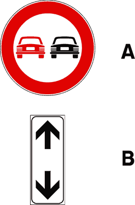
- **📖 الترجمة السياقية:** الإشارة (A) يمكن تكرارها بعد كل تقاطع مع اللوحة الإضافية (B).
- **💡 الشرح والقاعدة المرورية:** إشارة "ممنوع التجاوز لجميع المركبات ذات المحرك" (دائرة بيضاء بإطار أحمر وسيارة يسار حمراء - م 116 لائحة تنفيذية): بعد كل تقاطع يلزم تكرار الإشارة مع لوحة تكميلية توضح استمرار المنع (pannello continua). العبارة صحيحة.
- **⚠️ كشف الفخ:** ripetuto con pannello integrativo: صحيح، تتكرر مع لوحة استمرار السريان.
- **🔑 الكلمات المفتاحية:** `divieto di sorpasso (ممنوع التجاوز)` | `pannello integrativo (لوحة إضافية)`

---

**37.** Il segnale raffigurato vieta di sorpassare autocarri
- **الإجابة:** `VERO ✅ (صح)`
- 
- **📖 الترجمة السياقية:** الإشارة الموضحة تمنع تجاوز الشاحنات.
- **💡 الشرح والقاعدة المرورية:** إشارة "ممنوع التجاوز لجميع المركبات ذات المحرك" (دائرة بيضاء بإطار أحمر وسيارة يسار حمراء - م 116 لائحة تنفيذية): الشاحنات (autocarri) مركبات آلية، وتمنع الإشارة تجاوز أي مركبة آلية ذات أكثر من عجلتين. العبارة صحيحة.
- **⚠️ كشف الفخ:** vieta di sorpassare autocarri: صحيح، يمنع تجاوز الشاحنات.
- **🔑 الكلمات المفتاحية:** `divieto di sorpasso (ممنوع التجاوز)` | `autocarri (شاحنات)`

---

**38.** Il segnale raffigurato consente di sorpassare i ciclomotori
- **الإجابة:** `VERO ✅ (صح)`
- 
- **📖 الترجمة السياقية:** الإشارة الموضحة تسمح بتجاوز الدراجات الآلية الصغيرة (السيبلومات).
- **💡 الشرح والقاعدة المرورية:** إشارة "ممنوع التجاوز لجميع المركبات ذات المحرك" (دائرة بيضاء بإطار أحمر وسيارة يسار حمراء - م 116 لائحة تنفيذية): يجوز تجاوز الدراجات الصغيرة ذات العجلتين (ciclomotori a due ruote) إذا تمت المناورة دون دهس الخط المتصل. العبارة صحيحة.
- **⚠️ كشف الفخ:** consente di sorpassare ciclomotori: صحيح، يجوز تجاوز الدراجات ذات العجلتين.
- **🔑 الكلمات المفتاحية:** `divieto di sorpasso (ممنوع التجاوز)` | `ciclomotori (دراجات آلية صغيرة (سيبلومات))`

---

**39.** Il segnale raffigurato vieta il sorpasso fra autoveicoli, anche se la manovra può compiersi entro la semicarreggiata
- **الإجابة:** `VERO ✅ (صح)`
- 
- **📖 الترجمة السياقية:** الإشارة الموضحة تمنع التجاوز بين المركبات الآلية حتى وإن أمكن تنفيذ المناورة داخل نفس نصف نهر الطريق.
- **💡 الشرح والقاعدة المرورية:** إشارة "ممنوع التجاوز لجميع المركبات ذات المحرك" (دائرة بيضاء بإطار أحمر وسيارة يسار حمراء - م 116 لائحة تنفيذية): قاعدة ذهبية: حظر التجاوز بين المركبات الآلية مطلق، حتى لو كانت الحارة عريضة ولم نتخط الخط الفاصل! العبارة صحيحة.
- **⚠️ كشف الفخ:** anche entro la semicarreggiata: فخ شهير؛ المنع مطلق حتى دون خروج عن المسار.
- **🔑 الكلمات المفتاحية:** `divieto di sorpasso (ممنوع التجاوز)` | `semicarreggiata (نصف نهر الطريق)` | `autoveicoli (مركبات آلية / سيارات)`

---

**40.** In presenza del segnale raffigurato un autocarro può sorpassare un motociclo
- **الإجابة:** `VERO ✅ (صح)`
- 
- **📖 الترجمة السياقية:** في وجود الإشارة الموضحة، يمكن للشاحنة أن تتجاوز دراجة نارية.
- **💡 الشرح والقاعدة المرورية:** إشارة "ممنوع التجاوز لجميع المركبات ذات المحرك" (دائرة بيضاء بإطار أحمر وسيارة يسار حمراء - م 116 لائحة تنفيذية): أي مركبة (بما فيها الشاحنة) يجوز لها تجاوز دراجة نارية ذات عجلتين إذا سمحت المسافة دون دهس الخط المتصل. العبارة صحيحة.
- **⚠️ كشف الفخ:** autocarro può sorpassare motociclo: صحيح، تجاوز الدراجة النارية مسموح لجميع المركبات.
- **🔑 الكلمات المفتاحية:** `divieto di sorpasso (ممنوع التجاوز)` | `autocarro (شاحنة)` | `motocicli (دراجات نارية)`

---

**41.** In presenza del segnale raffigurato un'autovettura può sorpassare un ciclomotore
- **الإجابة:** `VERO ✅ (صح)`
- 
- **📖 الترجمة السياقية:** في وجود الإشارة الموضحة، يمكن لسيارة الركاب أن تتجاوز دراجة آلية خفيفة (سيبلو).
- **💡 الشرح والقاعدة المرورية:** إشارة "ممنوع التجاوز لجميع المركبات ذات المحرك" (دائرة بيضاء بإطار أحمر وسيارة يسار حمراء - م 116 لائحة تنفيذية): مسموح لسيارة الركاب تجاوز الدراجة ذات العجلتين دون تعدي الخط الفاصل. العبارة صحيحة.
- **⚠️ كشف الفخ:** autovettura può sorpassare ciclomotore: صحيح، مسموح.
- **🔑 الكلمات المفتاحية:** `divieto di sorpasso (ممنوع التجاوز)` | `autoveicoli (مركبات آلية / سيارات)` | `ciclomotori (دراجات آلية صغيرة (سيبلومات))`

---

**42.** Il segnale raffigurato consente il transito agli autotreni, autoarticolati ed autosnodati
- **الإجابة:** `VERO ✅ (صح)`
- 
- **📖 الترجمة السياقية:** الإشارة الموضحة تسمح بمرور الشاحنات مع مقطورات والقاطرات المفصلية.
- **💡 الشرح والقاعدة المرورية:** إشارة "ممنوع التجاوز لجميع المركبات ذات المحرك" (دائرة بيضاء بإطار أحمر وسيارة يسار حمراء - م 116 لائحة تنفيذية): الإشارة تنظم مناورة التجاوز فقط ولا تمنع مرور أو سير أي فئة من المركبات على الطريق. العبارة صحيحة.
- **⚠️ كشف الفخ:** consente il transito: الإشارة تمنع التجاوز ولا تمنع العبور أو المرور.
- **🔑 الكلمات المفتاحية:** `divieto di sorpasso (ممنوع التجاوز)` | `autotreni (شاحنات بمقطورة)` | `transito (عبور/مرور)`

---

**43.** In presenza del segnale raffigurato è vietato sorpassare anche gli autoveicoli di massa complessiva inferiore a 3,5 tonnellate
- **الإجابة:** `VERO ✅ (صح)`
- 
- **📖 الترجمة السياقية:** في وجود الإشارة الموضحة، يُحظر تجاوز المركبات الآلية التي تقل كتلتها الإجمالية عن 3.5 طن أيضاً.
- **💡 الشرح والقاعدة المرورية:** إشارة "ممنوع التجاوز لجميع المركبات ذات المحرك" (دائرة بيضاء بإطار أحمر وسيارة يسار حمراء - م 116 لائحة تنفيذية): المنع عام ويشمل كافة السيارات العادية وسيارات الركاب الخفيفة، ولا يقتصر على الشاحنات الثقيلة. العبارة صحيحة.
- **⚠️ كشف الفخ:** anche veicoli sotto 3,5 t: صحيح، المنع يشمل السيارات الخفيفة أيضاً.
- **🔑 الكلمات المفتاحية:** `divieto di sorpasso (ممنوع التجاوز)` | `autoveicoli (مركبات آلية / سيارات)` | `massa (كتلة/وزن)`

---

**44.** In presenza del segnale raffigurato è vietato sorpassare veicoli a motore diversi dai motocicli e dai ciclomotori
- **الإجابة:** `VERO ✅ (صح)`
- 
- **📖 الترجمة السياقية:** في وجود الإشارة الموضحة، يُحظر تجاوز المركبات ذات المحرك باستثناء الدراجات النارية والسيبلومات.
- **💡 الشرح والقاعدة المرورية:** إشارة "ممنوع التجاوز لجميع المركبات ذات المحرك" (دائرة بيضاء بإطار أحمر وسيارة يسار حمراء - م 116 لائحة تنفيذية): صياغة نظامية دقيقة: يمنع تجاوز كل مركبة ذات محرك ما لم تكن دراجة ذات عجلتين. العبارة صحيحة.
- **⚠️ كشف الفخ:** diversi da motocicli e ciclomotori: صحيح، الاستثناء مقتصر على ذات العجلتين.
- **🔑 الكلمات المفتاحية:** `divieto di sorpasso (ممنوع التجاوز)` | `motocicli (دراجات نارية)` | `ciclomotori (دراجات آلية صغيرة (سيبلومات))`

---

**45.** In presenza del segnale raffigurato è consentito sorpassare veicoli a trazione animale
- **الإجابة:** `VERO ✅ (صح)`
- 
- **📖 الترجمة السياقية:** في وجود الإشارة الموضحة، يُسمح بتجاوز المركبات التي تجرها حيوانات.
- **💡 الشرح والقاعدة المرورية:** إشارة "ممنوع التجاوز لجميع المركبات ذات المحرك" (دائرة بيضاء بإطار أحمر وسيارة يسار حمراء - م 116 لائحة تنفيذية): المركبات التي تجرها حيوانات لا محرك لها، ويجوز تجاوز المركبات غير الآلية. العبارة صحيحة.
- **⚠️ كشف الفخ:** veicoli a trazione animale: يجوز تجاوز العربات التي تجرها حيوانات.
- **🔑 الكلمات المفتاحية:** `divieto di sorpasso (ممنوع التجاوز)` | `trazione animale (جر حيواني)`

---

**46.** In presenza del segnale raffigurato è consentito sorpassare ciclomotori a due ruote
- **الإجابة:** `VERO ✅ (صح)`
- 
- **📖 الترجمة السياقية:** في وجود الإشارة الموضحة، يُسمح بتجاوز الدراجات الآلية الخفيفة ذات العجلتين.
- **💡 الشرح والقاعدة المرورية:** إشارة "ممنوع التجاوز لجميع المركبات ذات المحرك" (دائرة بيضاء بإطار أحمر وسيارة يسار حمراء - م 116 لائحة تنفيذية): الدراجات ذات العجلتين يجوز تجاوزها بشرط الالتزام بمسافة الأمان وعدم قطع الخط المتصل. العبارة صحيحة.
- **⚠️ كشف الفخ:** ciclomotori a due ruote: صحيح، ذات العجلتين مسموح تجاوزها.
- **🔑 الكلمات المفتاحية:** `divieto di sorpasso (ممنوع التجاوز)` | `ciclomotori (دراجات آلية صغيرة (سيبلومات))`

---

**47.** In presenza del segnale raffigurato è consentito il sorpasso dei motocicli
- **الإجابة:** `VERO ✅ (صح)`
- 
- **📖 الترجمة السياقية:** في وجود الإشارة الموضحة، يُسمح بتجاوز الدراجات النارية.
- **💡 الشرح والقاعدة المرورية:** إشارة "ممنوع التجاوز لجميع المركبات ذات المحرك" (دائرة بيضاء بإطار أحمر وسيارة يسار حمراء - م 116 لائحة تنفيذية): يجوز تجاوز الدراجات النارية (ذات العجلتين بدون عربة جانبية) ضمن حدود المسار. العبارة صحيحة.
- **⚠️ كشف الفخ:** sorpasso dei motocicli: صحيح، تجاوز الدراجات النارية مسموح.
- **🔑 الكلمات المفتاحية:** `divieto di sorpasso (ممنوع التجاوز)` | `motocicli (دراجات نارية)`

---

**48.** Il segnale raffigurato consente il sorpasso delle biciclette
- **الإجابة:** `VERO ✅ (صح)`
- 
- **📖 الترجمة السياقية:** الإشارة الموضحة تسمح بتجاوز الدراجات الهوائية.
- **💡 الشرح والقاعدة المرورية:** إشارة "ممنوع التجاوز لجميع المركبات ذات المحرك" (دائرة بيضاء بإطار أحمر وسيارة يسار حمراء - م 116 لائحة تنفيذية): الدراجات الهوائية مركبات بدون محرك ويجوز تجاوزها بأمان. العبارة صحيحة.
- **⚠️ كشف الفخ:** sorpasso delle biciclette: صحيح، تجاوز الدراجات الهوائية مسموح.
- **🔑 الكلمات المفتاحية:** `divieto di sorpasso (ممنوع التجاوز)` | `biciclette / velocipedi (دراجات هوائية)`

---

**49.** In presenza del segnale raffigurato è consentito il sorpasso dei veicoli sprovvisti di motore
- **الإجابة:** `VERO ✅ (صح)`
- 
- **📖 الترجمة السياقية:** في وجود الإشارة الموضحة، يُسمح بتجاوز المركبات غير المزودة بمحرك.
- **💡 الشرح والقاعدة المرورية:** إشارة "ممنوع التجاوز لجميع المركبات ذات المحرك" (دائرة بيضاء بإطار أحمر وسيارة يسار حمراء - م 116 لائحة تنفيذية): جميع المركبات عديمة المحرك (sprovvisti di motore) يجوز تجاوزها نظاماً. العبارة صحيحة.
- **⚠️ كشف الفخ:** sprovvisti di motore: صحيح، المركبات غير الآلية يجوز تجاوزها.
- **🔑 الكلمات المفتاحية:** `divieto di sorpasso (ممنوع التجاوز)` | `senza motore (بدون محرك)`

---

**50.** In presenza del segnale raffigurato è consentito il sorpasso dei veicoli a braccia
- **الإجابة:** `VERO ✅ (صح)`
- 
- **📖 الترجمة السياقية:** في وجود الإشارة الموضحة، يُسمح بتجاوز المركبات التي تدفع باليد (عربات اليد).
- **💡 الشرح والقاعدة المرورية:** إشارة "ممنوع التجاوز لجميع المركبات ذات المحرك" (دائرة بيضاء بإطار أحمر وسيارة يسار حمراء - م 116 لائحة تنفيذية): عربات اليد مركبات بدون محرك وتسري عليها قاعدة جواز التجاوز. العبارة صحيحة.
- **⚠️ كشف الفخ:** veicoli a braccia: صحيح، عربات اليد يجوز تجاوزها.
- **🔑 الكلمات المفتاحية:** `divieto di sorpasso (ممنوع التجاوز)` | `veicoli a braccia (عربات يد)`

---

**51.** In presenza del segnale raffigurato è consentito il sorpasso delle carrozze a cavalli
- **الإجابة:** `VERO ✅ (صح)`
- 
- **📖 الترجمة السياقية:** في وجود الإشارة الموضحة، يُسمح بتجاوز العربات التي تجرها الخيول.
- **💡 الشرح والقاعدة المرورية:** إشارة "ممنوع التجاوز لجميع المركبات ذات المحرك" (دائرة بيضاء بإطار أحمر - م 116 لائحة تنفيذية): العربات التي تجرها الخيول مركبات غير آلية (بدون محرك)، ويجوز قانوناً تجاوزها. العبارة صحيحة.
- **⚠️ كشف الفخ:** sorpasso carrozze a cavalli: صحيح، المركبات غير الآلية يجوز تجاوزها.
- **🔑 الكلمات المفتاحية:** `divieto di sorpasso (ممنوع التجاوز)` | `carrozze a cavalli (عربات تجرها خيول)`

---

**52.** Il segnale raffigurato consente ad un motociclo di sorpassare un'autovettura
- **الإجابة:** `FALSO ❌ (خطأ)`
- 
- **📖 الترجمة السياقية:** الإشارة الموضحة تسمح لدراجة نارية بتجاوز سيارة ركاب.
- **💡 الشرح والقاعدة المرورية:** إشارة "ممنوع التجاوز لجميع المركبات ذات المحرك" (دائرة بيضاء بإطار أحمر - م 116 لائحة تنفيذية): الإشارة تمنع تجاوز السيارات والمركبات الآلية من قِبل أي مركبة أخرى بما فيها الدراجات النارية. العبارة خاطئة.
- **⚠️ كشف الفخ:** motociclo sorpassa autovettura: فخ كبير؛ يمنع على الدراجة النارية تجاوز أي سيارة.
- **🔑 الكلمات المفتاحية:** `divieto di sorpasso (ممنوع التجاوز)` | `motocicli (دراجات نارية)` | `autoveicoli (مركبات آلية / سيارات)`

---

**53.** Il segnale raffigurato indica che la corsia di destra è riservata ai veicoli lenti
- **الإجابة:** `FALSO ❌ (خطأ)`
- 
- **📖 الترجمة السياقية:** الإشارة الموضحة تدل على أن المسار الأيمن محجوز للمركبات البطيئة.
- **💡 الشرح والقاعدة المرورية:** إشارة "ممنوع التجاوز لجميع المركبات ذات المحرك" (دائرة بيضاء بإطار أحمر - م 116 لائحة تنفيذية): الإشارة لتنظيم مناورات التجاوز ولا تخصص مسارات للمركبات البطيئة. العبارة خاطئة.
- **⚠️ كشف الفخ:** corsia riservata ai veicoli lenti: خلط لا صلة له بالإشارة.
- **🔑 الكلمات المفتاحية:** `divieto di sorpasso (ممنوع التجاوز)` | `veicoli lenti (مركبات بطيئة)`

---

**54.** Il segnale raffigurato consente di sorpassare un'autovettura purché non si oltrepassi la striscia continua
- **الإجابة:** `FALSO ❌ (خطأ)`
- 
- **📖 الترجمة السياقية:** الإشارة الموضحة تسمح بتجاوز سيارة ركاب بشرط عدم دهس الخط المتصل.
- **💡 الشرح والقاعدة المرورية:** إشارة "ممنوع التجاوز لجميع المركبات ذات المحرك" (دائرة بيضاء بإطار أحمر - م 116 لائحة تنفيذية): قاعدة قطعية: حظر تجاوز سيارات الركاب والمركبات الآلية مطلق، حتى لو تمت المناورة بالكامل داخل نفس المسار! العبارة خاطئة.
- **⚠️ كشف الفخ:** purché non oltrepassi la striscia: فخ شهير جداً؛ تجاوز السيارات ممنوع قطعاً حتى بدون تخطي الخط.
- **🔑 الكلمات المفتاحية:** `divieto di sorpasso (ممنوع التجاوز)` | `autoveicoli (مركبات آلية / سيارات)` | `striscia continua (خط متصل)`

---

**55.** Il segnale raffigurato vieta ad un motociclo di sorpassare una bicicletta
- **الإجابة:** `FALSO ❌ (خطأ)`
- 
- **📖 الترجمة السياقية:** الإشارة الموضحة تمنع الدراجة النارية من تجاوز دراجة هوائية.
- **💡 الشرح والقاعدة المرورية:** إشارة "ممنوع التجاوز لجميع المركبات ذات المحرك" (دائرة بيضاء بإطار أحمر - م 116 لائحة تنفيذية): الدراجة الهوائية لا محرك لها، ويجوز للدراجة النارية تجاوزها بأمان. العبارة خاطئة.
- **⚠️ كشف الفخ:** vieta a motociclo di sorpassare bicicletta: خطأ، تجاوز الدراجة الهوائية مسموح.
- **🔑 الكلمات المفتاحية:** `divieto di sorpasso (ممنوع التجاوز)` | `motocicli (دراجات نارية)` | `biciclette (دراجات هوائية)`

---

**56.** Il segnale raffigurato consente il sorpasso tra autovetture se non vi è la striscia bianca continua
- **الإجابة:** `FALSO ❌ (خطأ)`
- 
- **📖 الترجمة السياقية:** الإشارة الموضحة تسمح بالتجاوز بين سيارات الركاب إذا لم يكن هناك خط أبيض متصل.
- **💡 الشرح والقاعدة المرورية:** إشارة "ممنوع التجاوز لجميع المركبات ذات المحرك" (دائرة بيضاء بإطار أحمر - م 116 لائحة تنفيذية): المنع سارٍ ومطلق بفعل الإشارة نفسها، ولا يبيح وجود الخط المتقطع تجاوز السيارات. العبارة خاطئة.
- **⚠️ كشف الفخ:** se non vi è striscia continua: خطأ، المنع تفرضه الإشارة حتى مع خط متقطع.
- **🔑 الكلمات المفتاحية:** `divieto di sorpasso (ممنوع التجاوز)` | `autoveicoli (مركبات آلية / سيارات)`

---

**57.** Il segnale raffigurato consente ad un'autovettura di sorpassare un autocarro
- **الإجابة:** `FALSO ❌ (خطأ)`
- 
- **📖 الترجمة السياقية:** الإشارة الموضحة تسمح لسيارة ركاب بتجاوز شاحنة نقل بضائع.
- **💡 الشرح والقاعدة المرورية:** إشارة "ممنوع التجاوز لجميع المركبات ذات المحرك" (دائرة بيضاء بإطار أحمر - م 116 لائحة تنفيذية): الشاحنة مركبة آلية (autoveicolo)، وتجاوز أي مركبة آلية محظور تماماً. العبارة خاطئة.
- **⚠️ كشف الفخ:** sorpassare un autocarro: خطأ، الشاحنات يمنع تجاوزها قطعاً.
- **🔑 الكلمات المفتاحية:** `divieto di sorpasso (ممنوع التجاوز)` | `autoveicoli (مركبات آلية / سيارات)` | `autocarro (شاحنة)`

---

**58.** Il segnale raffigurato si trova solo sulle strade extraurbane principali
- **الإجابة:** `FALSO ❌ (خطأ)`
- 
- **📖 الترجمة السياقية:** الإشارة الموضحة توجد فقط على الطرق الرئيسية خارج المدن.
- **💡 الشرح والقاعدة المرورية:** إشارة "ممنوع التجاوز لجميع المركبات ذات المحرك" (دائرة بيضاء بإطار أحمر - م 116 لائحة تنفيذية): توضع على كافة فئات الطرق (حضرية، ثانوية، وسريعة) عند وجود خطر في التجاوز. العبارة خاطئة.
- **⚠️ كشف الفخ:** solo sulle strade extraurbane: قصر باطل، توجد على مختلف الطرق.
- **🔑 الكلمات المفتاحية:** `divieto di sorpasso (ممنوع التجاوز)` | `strade extraurbane (طرق خارج المدن)`

---

**59.** In presenza del segnale raffigurato è vietato sorpassare qualsiasi veicolo
- **الإجابة:** `FALSO ❌ (خطأ)`
- 
- **📖 الترجمة السياقية:** في وجود الإشارة الموضحة، يُحظر تجاوز أي مركبة كانت.
- **💡 الشرح والقاعدة المرورية:** إشارة "ممنوع التجاوز لجميع المركبات ذات المحرك" (دائرة بيضاء بإطار أحمر - م 116 لائحة تنفيذية): لفظ (qualsiasi) خاطئ لأنه يستثنى جواز تجاوز المركبات بدون محرك والدراجات ذات العجلتين. العبارة خاطئة.
- **⚠️ كشف الفخ:** vietato sorpassare qualsiasi veicolo: فخ التعميم؛ يستثنى الدراجات والحيوانات.
- **🔑 الكلمات المفتاحية:** `divieto di sorpasso (ممنوع التجاوز)` | `qualsiasi veicolo (أي مركبة)`

---

**60.** In presenza del segnale raffigurato è vietato il transito alle autovetture
- **الإجابة:** `FALSO ❌ (خطأ)`
- 
- **📖 الترجمة السياقية:** في وجود الإشارة الموضحة، يمنع مرور وسير سيارات الركاب.
- **💡 الشرح والقاعدة المرورية:** إشارة "ممنوع التجاوز لجميع المركبات ذات المحرك" (دائرة بيضاء بإطار أحمر - م 116 لائحة تنفيذية): الإشارة تمنع التجاوز فقط ولا تمنع سير أو مرور السيارات. العبارة خاطئة.
- **⚠️ كشف الفخ:** vietato il transito: خلط بين منع التجاوز ومنع المرور.
- **🔑 الكلمات المفتاحية:** `divieto di sorpasso (ممنوع التجاوز)` | `transito (مرور)` | `autoveicoli (مركبات آلية / سيارات)`

---

**61.** Il segnale raffigurato impone di dare la precedenza nei sensi unici alternati
- **الإجابة:** `FALSO ❌ (خطأ)`
- 
- **📖 الترجمة السياقية:** الإشارة الموضحة تفرض إعطاء الأولوية في السير التبادلي بالاتجاه الواحد.
- **💡 الشرح والقاعدة المرورية:** إشارة "ممنوع التجاوز لجميع المركبات ذات المحرك" (دائرة بيضاء بإطار أحمر - م 116 لائحة تنفيذية): لا علاقة لها بالسير التبادلي أو أولوية المرور في المضايق. العبارة خاطئة.
- **⚠️ كشف الفخ:** precedenza nei sensi unici alternati: خلط مع إشارة الأولوية التبادلية.
- **🔑 الكلمات المفتاحية:** `divieto di sorpasso (ممنوع التجاوز)` | `senso unico alternato (سير تبادلي)`

---

**62.** Il segnale raffigurato consente ad un motociclo di superare un autobus
- **الإجابة:** `FALSO ❌ (خطأ)`
- 
- **📖 الترجمة السياقية:** الإشارة الموضحة تسمح لدراجة نارية بتجاوز حافلة ركاب (أوتوبيس).
- **💡 الشرح والقاعدة المرورية:** إشارة "ممنوع التجاوز لجميع المركبات ذات المحرك" (دائرة بيضاء بإطار أحمر - م 116 لائحة تنفيذية): الحافلة مركبة آلية كاملة ويُحظر على أي مركبة بما فيها الدراجة النارية تجاوزها. العبارة خاطئة.
- **⚠️ كشف الفخ:** motociclo supera autobus: خطأ، تجاوز الحافلات ممنوع قطعاً.
- **🔑 الكلمات المفتاحية:** `divieto di sorpasso (ممنوع التجاوز)` | `motocicli (دراجات نارية)` | `autobus (حافلة)`

---

**63.** In presenza del segnale raffigurato è consentito il sorpasso degli autoveicoli a motore elettrico
- **الإجابة:** `FALSO ❌ (خطأ)`
- 
- **📖 الترجمة السياقية:** في وجود الإشارة الموضحة، يُسمح بتجاوز المركبات الآلية ذات المحرك الكهربائي.
- **💡 الشرح والقاعدة المرورية:** إشارة "ممنوع التجاوز لجميع المركبات ذات المحرك" (دائرة بيضاء بإطار أحمر - م 116 لائحة تنفيذية): المركبات الكهربائية مركبات آلية كاملة ويسري عليها حظر التجاوز كسائر السيارات. العبارة خاطئة.
- **⚠️ كشف الفخ:** autoveicoli a motore elettrico: لا استثناء للمحركات الكهربائية.
- **🔑 الكلمات المفتاحية:** `divieto di sorpasso (ممنوع التجاوز)` | `autoveicoli (مركبات آلية / سيارات)` | `motore elettrico (محرك كهربائي)`

---

**64.** Il segnale raffigurato preannuncia una strettoia
- **الإجابة:** `FALSO ❌ (خطأ)`
- 
- **📖 الترجمة السياقية:** الإشارة الموضحة تُنذر بضيق في نهر الطريق (مضيق).
- **💡 الشرح والقاعدة المرورية:** إشارة "ممنوع التجاوز لجميع المركبات ذات المحرك" (دائرة بيضاء بإطار أحمر - م 116 لائحة تنفيذية): المضيق يُعلن عنه بإشارة خطر مثلثة، ولا علاقة لهذه الإشارة بضيق الطريق. العبارة خاطئة.
- **⚠️ كشف الفخ:** preannuncia una strettoia: خلط مع لافتات الخطر للمضايق.
- **🔑 الكلمات المفتاحية:** `divieto di sorpasso (ممنوع التجاوز)` | `strettoia (مضيق طريقي)`

---

**65.** In presenza del segnale raffigurato è consentito il sorpasso delle macchine agricole
- **الإجابة:** `FALSO ❌ (خطأ)`
- 
- **📖 الترجمة السياقية:** في وجود الإشارة الموضحة، يُسمح بتجاوز الآلات الزراعية ذات المحرك.
- **💡 الشرح والقاعدة المرورية:** إشارة "ممنوع التجاوز لجميع المركبات ذات المحرك" (دائرة بيضاء بإطار أحمر - م 116 لائحة تنفيذية): الآلات الزراعية ذاتية الحركة مركبات بمحرك ولا تندرج ضمن الاستثناءات، فيُحظر تجاوزها. العبارة خاطئة.
- **⚠️ كشف الفخ:** sorpasso delle macchine agricole: فخ؛ يمنع تجاوز الجرارات والآلات الزراعية ذاتية الحركة.
- **🔑 الكلمات المفتاحية:** `divieto di sorpasso (ممنوع التجاوز)` | `macchine agricole (آلات زراعية)`

---

**66.** In presenza del segnale raffigurato è consentito il sorpasso delle macchine operatrici
- **الإجابة:** `FALSO ❌ (خطأ)`
- 
- **📖 الترجمة السياقية:** في وجود الإشارة الموضحة، يُسمح بتجاوز آلات العمل والأشغال (macchine operatrici).
- **💡 الشرح والقاعدة المرورية:** إشارة "ممنوع التجاوز لجميع المركبات ذات المحرك" (دائرة بيضاء بإطار أحمر - م 116 لائحة تنفيذية): آلات العمل مركبات بمحرك ولا يجوز تجاوزها في وجود هذه الإشارة. العبارة خاطئة.
- **⚠️ كشف الفخ:** sorpasso delle macchine operatrici: يمنع تجاوز آلات العمل ذاتية الحركة.
- **🔑 الكلمات المفتاحية:** `divieto di sorpasso (ممنوع التجاوز)` | `macchine operatrici (آلات عمل وأشغال)`

---

**67.** In presenza del segnale raffigurato è consentito il sorpasso dei veicoli a motore che procedono molto lentamente
- **الإجابة:** `FALSO ❌ (خطأ)`
- 
- **📖 الترجمة السياقية:** في وجود الإشارة الموضحة، يُسمح بتجاوز المركبات ذات المحرك التي تسير ببطء شديد.
- **💡 الشرح والقاعدة المرورية:** إشارة "ممنوع التجاوز لجميع المركبات ذات المحرك" (دائرة بيضاء بإطار أحمر - م 116 لائحة تنفيذية): بطء المركبة لا يبيح تجاوزها إطلاقاً؛ المنع يسري بصرف النظر عن سرعة المركبة الأمامية. العبارة خاطئة.
- **⚠️ كشف الفخ:** procedono molto lentamente: فخ سرعة المركبة؛ البطء لا يلغي منع التجاوز.
- **🔑 الكلمات المفتاحية:** `divieto di sorpasso (ممنوع التجاوز)` | `autoveicoli (مركبات آلية / سيارات)`

---

**68.** In presenza del segnale raffigurato è consentito il sorpasso dei veicoli che hanno segnalato l'intenzione di svoltare a destra
- **الإجابة:** `FALSO ❌ (خطأ)`
- 
- **📖 الترجمة السياقية:** في وجود الإشارة الموضحة، يُسمح بتجاوز المركبات التي أعلنت نيتها الانعطاف يميناً.
- **💡 الشرح والقاعدة المرورية:** إشارة "ممنوع التجاوز لجميع المركبات ذات المحرك" (دائرة بيضاء بإطار أحمر - م 116 لائحة تنفيذية): حتى لو أعطت إشارة لليمين، يظل تجاوزها من جهة اليسار ممنوعاً نظاماً بموجب الإشارة. العبارة خاطئة.
- **⚠️ كشف الفخ:** svoltare a destra: لا يجوز التجاوز من اليسار حتى مع إشارة اليمين.
- **🔑 الكلمات المفتاحية:** `divieto di sorpasso (ممنوع التجاوز)` | `svolta a destra (انعطاف لليمين)`

---

## 📌 Obbligo distanza (12 domande)

**69.** In presenza del segnale raffigurato è obbligatorio mantenere una distanza di almeno 70 metri dal veicolo che precede
- **الإجابة:** `VERO ✅ (صح)`
- 
- **📖 الترجمة السياقية:** في وجود الإشارة الموضحة، يجب إلزامياً الحفاظ على مسافة لا تقل عن 70 متراً عن المركبة الأمامية.
- **💡 الشرح والقاعدة المرورية:** إشارة "مسافة أمان دنيا إجبارية 70 متراً" (دائرة بيضاء بإطار أحمر وسيارتان بينهما 70m - م 116 لائحة تنفيذية): تفرض مسافة أمان دنيا إلزامية قدرها 70 متراً على الأقل بين المركبات المتعاقبة. العبارة صحيحة.
- **⚠️ كشف الفخ:** almeno 70 metri: المعنى القانوني الدقيق للمسافة الدنيا.
- **🔑 الكلمات المفتاحية:** `distanziamento minimo obbligatorio (مسافة أمان دنيا إجبارية)` | `distanza (مسافة)` | `segnale di prescrizione (إشارة أمر/تنظيمية)`

---

**70.** In presenza del segnale raffigurato è consentito ad un veicolo di circolare alla distanza di 80 metri da quello che lo precede
- **الإجابة:** `VERO ✅ (صح)`
- 
- **📖 الترجمة السياقية:** في وجود الإشارة الموضحة، يُسمح لمركبة بالسير على مسافة 80 متراً من المركبة التي تسبقها.
- **💡 الشرح والقاعدة المرورية:** إشارة "مسافة أمان دنيا إجبارية 70 متراً" (دائرة بيضاء بإطار أحمر وسيارتان بينهما 70m - م 116 لائحة تنفيذية): مسافة 80 متراً أكبر من الحد الأدنى الإجباري (70 متراً)، وبالتالي فهي قانونية تماماً. العبارة صحيحة.
- **⚠️ كشف الفخ:** distanza di 80 metri: صحيح، 80 أكبر من 70 المقررة كحد أدنى.
- **🔑 الكلمات المفتاحية:** `distanziamento minimo obbligatorio (مسافة أمان دنيا إجبارية)` | `distanza (مسافة)`

---

**71.** Il segnale raffigurato vieta ad un veicolo di circolare a meno di 70 metri da quello che lo precede
- **الإجابة:** `VERO ✅ (صح)`
- 
- **📖 الترجمة السياقية:** الإشارة الموضحة تمنع أي مركبة من السير على مسافة تقل عن 70 متراً عن المركبة التي تسبقها.
- **💡 الشرح والقاعدة المرورية:** إشارة "مسافة أمان دنيا إجبارية 70 متراً" (دائرة بيضاء بإطار أحمر وسيارتان بينهما 70m - م 116 لائحة تنفيذية): يُحظر الاقتراب من المركبة الأمامية لمسافة تقل عن الرقم المكتوب في الإشارة. العبارة صحيحة.
- **⚠️ كشف الفخ:** vieta a meno di 70 metri: صحيح، يمنع الاقتراب لأقل من 70 متراً.
- **🔑 الكلمات المفتاحية:** `distanziamento minimo obbligatorio (مسافة أمان دنيا إجبارية)` | `segnale di divieto (إشارة منع)`

---

**72.** Il segnale raffigurato vale anche per i motocicli
- **الإجابة:** `VERO ✅ (صح)`
- 
- **📖 الترجمة السياقية:** الإشارة الموضحة تسري على الدراجات النارية أيضاً.
- **💡 الشرح والقاعدة المرورية:** إشارة "مسافة أمان دنيا إجبارية 70 متراً" (دائرة بيضاء بإطار أحمر وسيارتان بينهما 70m - م 116 لائحة تنفيذية): الإلزام عام وموجه لكافة مستخدمي الطريق من جميع أصناف المركبات بما فيها الدراجات النارية. العبارة صحيحة.
- **⚠️ كشف الفخ:** vale anche per i motocicli: صحيح، تسري على الدراجات النارية.
- **🔑 الكلمات المفتاحية:** `distanziamento minimo obbligatorio (مسافة أمان دنيا إجبارية)` | `motocicli (دراجات نارية)`

---

**73.** Il segnale raffigurato deve essere rispettato anche quando si viaggia a bassa velocità
- **الإجابة:** `VERO ✅ (صح)`
- 
- **📖 الترجمة السياقية:** يجب احترام الإشارة الموضحة حتى عند السير بسرعة منخفضة.
- **💡 الشرح والقاعدة المرورية:** إشارة "مسافة أمان دنيا إجبارية 70 متراً" (دائرة بيضاء بإطار أحمر وسيارتان بينهما 70m - م 116 لائحة تنفيذية): مسافة الـ 70 متراً ملزمة بغض النظر عن بطء حركة السير أو سرعتها في ذلك المقطع. العبارة صحيحة.
- **⚠️ كشف الفخ:** anche a bassa velocità: الالتزام ثابت حتى عند السرعات المتدنية.
- **🔑 الكلمات المفتاحية:** `distanziamento minimo obbligatorio (مسافة أمان دنيا إجبارية)` | `bassa velocità (سرعة منخفضة)`

---

**74.** Il segnale raffigurato obbliga a rispettare la distanza minima indicata
- **الإجابة:** `VERO ✅ (صح)`
- 
- **📖 الترجمة السياقية:** الإشارة الموضحة تُلزم باحترام مسافة الأمان الدنيا الموضحة.
- **💡 الشرح والقاعدة المرورية:** إشارة "مسافة أمان دنيا إجبارية 70 متراً" (دائرة بيضاء بإطار أحمر وسيارتان بينهما 70m - م 116 لائحة تنفيذية): هذا هو التوصيف الفني للإشارة (distanziamento minimo obbligatorio). العبارة صحيحة.
- **⚠️ كشف الفخ:** distanza minima indicata: التعريف الرسمي للإشارة.
- **🔑 الكلمات المفتاحية:** `distanziamento minimo obbligatorio (مسافة أمان دنيا إجبارية)` | `segnale di obbligo (إشارة إلزام)`

---

**75.** Il segnale raffigurato obbliga i veicoli a marciare a meno di 70 metri di distanza l'uno dall'altro
- **الإجابة:** `FALSO ❌ (خطأ)`
- 
- **📖 الترجمة السياقية:** الإشارة الموضحة تُلزم المركبات بالسير على مسافة تقل عن 70 متراً بين الواحدة والأخرى.
- **💡 الشرح والقاعدة المرورية:** إشارة "مسافة أمان دنيا إجبارية 70 متراً" (دائرة بيضاء بإطار أحمر وسيارتان بينهما 70m - م 116 لائحة تنفيذية): عكس الواقع؛ تُلزم بالسير على مسافة 70 متراً فأكثر، وتمنع السير بأقل من ذلك. العبارة خاطئة.
- **⚠️ كشف الفخ:** marciare a meno di 70 metri: قلب المعنى، تفرض 70 فأكثر.
- **🔑 الكلمات المفتاحية:** `distanziamento minimo obbligatorio (مسافة أمان دنيا إجبارية)` | `a meno di (بأقل من)`

---

**76.** Il segnale raffigurato obbliga il veicolo che precede a distanziare quello che lo segue di almeno 70 metri
- **الإجابة:** `FALSO ❌ (خطأ)`
- 
- **📖 الترجمة السياقية:** الإشارة الموضحة تُلزم المركبة الأمامية بالابتعاد عن المركبة التي تتبعها بمقدار 70 متراً على الأقل.
- **💡 الشرح والقاعدة المرورية:** إشارة "مسافة أمان دنيا إجبارية 70 متراً" (دائرة بيضاء بإطار أحمر وسيارتان بينهما 70m - م 116 لائحة تنفيذية): واجب حفظ المسافة يقع قانوناً على المركبة التابعة في الخلف وليس على المركبة المتقدمة. العبارة خاطئة.
- **⚠️ كشف الفخ:** obbliga il veicolo che precede: فخ تحديد المسؤولية؛ الواجب على التابع وليس المتقدم.
- **🔑 الكلمات المفتاحية:** `distanziamento minimo obbligatorio (مسافة أمان دنيا إجبارية)` | `veicolo che precede (مركبة متقدمة)`

---

**77.** Il segnale raffigurato indica la distanza massima da mantenere esclusivamente nei tratti di strada dove il sorpasso è vietato
- **الإجابة:** `FALSO ❌ (خطأ)`
- 
- **📖 الترجمة السياقية:** الإشارة الموضحة تدل على المسافة القصوى الواجب الحفاظ عليها حصراً في مقاطع منع التجاوز.
- **💡 الشرح والقاعدة المرورية:** إشارة "مسافة أمان دنيا إجبارية 70 متراً" (دائرة بيضاء بإطار أحمر وسيارتان بينهما 70m - م 116 لائحة تنفيذية): تدل على مسافة دنيا (minima) وليست قصوى (massima)، وتسري في مقطع الطريق المخصص لها. العبارة خاطئة.
- **⚠️ كشف الفخ:** distanza massima: خطأ، هي مسافة دنيا وليست قصوى.
- **🔑 الكلمات المفتاحية:** `distanziamento minimo obbligatorio (مسافة أمان دنيا إجبارية)` | `distanza massima (مسافة قصوى)`

---

**78.** Il segnale raffigurato preavvisa che a 70 metri inizia il divieto di transito per le autovetture
- **الإجابة:** `FALSO ❌ (خطأ)`
- 
- **📖 الترجمة السياقية:** الإشارة الموضحة تُنذر مسبقاً بأنه بعد 70 متراً يبدأ منع مرور سيارات الركاب.
- **💡 الشرح والقاعدة المرورية:** إشارة "مسافة أمان دنيا إجبارية 70 متراً" (دائرة بيضاء بإطار أحمر وسيارتان بينهما 70m - م 116 لائحة تنفيذية): الرقم يدل على مسافة التباعد بين المركبات بالأمتار وليس على مسافة تبعد عن منع المرور. العبارة خاطئة.
- **⚠️ كشف الفخ:** a 70 metri inizia divieto: خلط بين مسافة التباعد ولوحات المسافة.
- **🔑 الكلمات المفتاحية:** `distanziamento minimo obbligatorio (مسافة أمان دنيا إجبارية)` | `distanza (مسافة)`

---

**79.** In presenza del segnale raffigurato le autovetture non possono superare la velocità di 70 km/h
- **الإجابة:** `FALSO ❌ (خطأ)`
- 
- **📖 الترجمة السياقية:** في وجود الإشارة الموضحة، لا يمكن لسيارات الركاب تجاوز سرعة 70 كم/س.
- **💡 الشرح والقاعدة المرورية:** إشارة "مسافة أمان دنيا إجبارية 70 متراً" (دائرة بيضاء بإطار أحمر وسيارتان بينهما 70m - م 116 لائحة تنفيذية): الرمز يعبر عن مسافة الأمان بالأمتار (metri) ولا صلة له بحد السرعة بالكم/س. العبارة خاطئة.
- **⚠️ كشف الفخ:** velocità di 70 km/h: خلط بين الأمتار وسرعة كم/س.
- **🔑 الكلمات المفتاحية:** `distanziamento minimo obbligatorio (مسافة أمان دنيا إجبارية)` | `velocità (سرعة)`

---

**80.** Il segnale raffigurato indica la lunghezza massima del cavo di traino
- **الإجابة:** `FALSO ❌ (خطأ)`
- 
- **📖 الترجمة السياقية:** الإشارة الموضحة تدل على الطول الأقصى لحبل القطر والجر.
- **💡 الشرح والقاعدة المرورية:** إشارة "مسافة أمان دنيا إجبارية 70 متراً" (دائرة بيضاء بإطار أحمر وسيارتان بينهما 70m - م 116 لائحة تنفيذية): لا صلة للإشارة بحبال أو قضبان قطر المركبات المعطلة إطلاقاً. العبارة خاطئة.
- **⚠️ كشف الفخ:** cavo di traino: خلط لا أصل له مع حبال القطر.
- **🔑 الكلمات المفتاحية:** `distanziamento minimo obbligatorio (مسافة أمان دنيا إجبارية)` | `cavo di traino (حبل قطر)`

---

## 📌 Limite 80 (25 domande)

**81.** Il segnale raffigurato è un segnale di divieto
- **الإجابة:** `VERO ✅ (صح)`
- 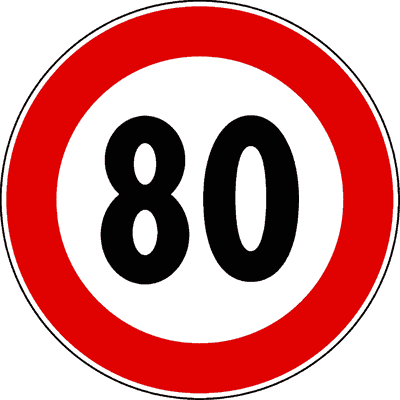
- **📖 الترجمة السياقية:** الإشارة الموضحة هي إشارة منع.
- **💡 الشرح والقاعدة المرورية:** إشارة "حد أقصى للسرعة 80 كم/س" (دائرة بيضاء بإطار أحمر ورقم 80 - م 116 لائحة تنفيذية): الدائرة ذات الإطار الأحمر والخلفية البيضاء برقم السرعة هي إشارة منع (divieto). العبارة صحيحة.
- **⚠️ كشف الفخ:** segnale di divieto: تصنيف صحيح، الإشارة تمنع تجاوز السرعة.
- **🔑 الكلمات المفتاحية:** `limite massimo di velocità (حد أقصى للسرعة)` | `segnale di divieto (إشارة منع)`

---

**82.** In presenza del segnale raffigurato è vietato superare la velocità di 80 km/h
- **الإجابة:** `VERO ✅ (صح)`
- 
- **📖 الترجمة السياقية:** في وجود الإشارة الموضحة، يُحظر تجاوز سرعة 80 كم/س.
- **💡 الشرح والقاعدة المرورية:** إشارة "حد أقصى للسرعة 80 كم/س" (دائرة بيضاء بإطار أحمر ورقم 80 - م 116 لائحة تنفيذية): تحدد السرعة القصوى المصرح بها ويُمنع قانوناً السير بأي سرعة تفوق 80 كم/س. العبارة صحيحة.
- **⚠️ كشف الفخ:** vietato superare 80 km/h: المعنى الأساسي المباشر للإشارة.
- **🔑 الكلمات المفتاحية:** `limite massimo di velocità (حد أقصى للسرعة)` | `segnale di divieto (إشارة منع)`

---

**83.** Il segnale raffigurato può trovarsi anche sulle autostrade
- **الإجابة:** `VERO ✅ (صح)`
- 
- **📖 الترجمة السياقية:** الإشارة الموضحة يمكن أن توجد على الطرق السريعة (الأوتوستراد) أيضاً.
- **💡 الشرح والقاعدة المرورية:** إشارة "حد أقصى للسرعة 80 كم/س" (دائرة بيضاء بإطار أحمر ورقم 80 - م 116 لائحة تنفيذية): توضع على مقاطع الأوتوستراد عند المنعطفات الحادة أو مناطق الأشغال أو الظروف الخاصة. العبارة صحيحة.
- **⚠️ كشف الفخ:** anche sulle autostrade: صحيح، توجد على الأوتوستراد في حالات خاصة.
- **🔑 الكلمات المفتاحية:** `limite massimo di velocità (حد أقصى للسرعة)` | `autostrade (طرق سريعة)`

---

**84.** Il limite di velocità indicato sul segnale raffigurato ha validità immediatamente dopo il segnale stesso
- **الإجابة:** `VERO ✅ (صح)`
- 
- **📖 الترجمة السياقية:** حد السرعة الموضح في الإشارة يسري مفعوله مباشرة بعد الإشارة نفسها.
- **💡 الشرح والقاعدة المرورية:** إشارة "حد أقصى للسرعة 80 كم/س" (دائرة بيضاء بإطار أحمر ورقم 80 - م 116 لائحة تنفيذية): إشارات المنع تسري فوراً من مكان تثبيتها وعمودها ما لم توجد لوحة مسافة تكميلية. العبارة صحيحة.
- **⚠️ كشف الفخ:** validità immediatamente dopo: صحيح، الإلزام فوري من موقع الإشارة.
- **🔑 الكلمات المفتاحية:** `limite massimo di velocità (حد أقصى للسرعة)` | `segnale di prescrizione (إشارة أمر/تنظيمية)`

---

**85.** Il segnale raffigurato prescrive di marciare a velocità inferiore o uguale a 80 km/h
- **الإجابة:** `VERO ✅ (صح)`
- 
- **📖 الترجمة السياقية:** الإشارة الموضحة تفرض السير بسرعة تقل عن أو تساوي 80 كم/س.
- **💡 الشرح والقاعدة المرورية:** إشارة "حد أقصى للسرعة 80 كم/س" (دائرة بيضاء بإطار أحمر ورقم 80 - م 116 لائحة تنفيذية): السرعات المسموحة قانوناً هي 80 كم/س فما دون. العبارة صحيحة.
- **⚠️ كشف الفخ:** inferiore o uguale a 80: صياغة رياضية صحيحة.
- **🔑 الكلمات المفتاحية:** `limite massimo di velocità (حد أقصى للسرعة)` | `segnale di prescrizione (إشارة أمر/تنظيمية)`

---

**86.** Il segnale raffigurato è un segnale di prescrizione
- **الإجابة:** `VERO ✅ (صح)`
- 
- **📖 الترجمة السياقية:** الإشارة الموضحة هي إشارة تنظيمية (أمر).
- **💡 الشرح والقاعدة المرورية:** إشارة "حد أقصى للسرعة 80 كم/س" (دائرة بيضاء بإطار أحمر ورقم 80 - م 116 لائحة تنفيذية): إشارات المنع تندرج ضمن إشارات الأوامر والتنظيم (prescrizione). العبارة صحيحة.
- **⚠️ كشف الفخ:** segnale di prescrizione: تندرج تحت إشارات الأوامر.
- **🔑 الكلمات المفتاحية:** `limite massimo di velocità (حد أقصى للسرعة)` | `segnale di prescrizione (إشارة أمر/تنظيمية)`

---

**87.** Il segnale raffigurato vieta ai veicoli di superare la velocità indicata
- **الإجابة:** `VERO ✅ (صح)`
- 
- **📖 الترجمة السياقية:** الإشارة الموضحة تمنع المركبات من تجاوز السرعة المحددة.
- **💡 الشرح والقاعدة المرورية:** إشارة "حد أقصى للسرعة 80 كم/س" (دائرة بيضاء بإطار أحمر ورقم 80 - م 116 لائحة تنفيذية): تمنع أي مركبة من تخطي سرعة 80 كم/س. العبارة صحيحة.
- **⚠️ كشف الفخ:** vieta di superare la velocità: صحيح، تمنع تخطي 80.
- **🔑 الكلمات المفتاحية:** `limite massimo di velocità (حد أقصى للسرعة)` | `segnale di divieto (إشارة منع)`

---

**88.** Il segnale raffigurato obbliga a rispettare un limite massimo di velocità
- **الإجابة:** `VERO ✅ (صح)`
- 
- **📖 الترجمة السياقية:** الإشارة الموضحة تُلزم باحترام حد أقصى للسرعة.
- **💡 الشرح والقاعدة المرورية:** إشارة "حد أقصى للسرعة 80 كم/س" (دائرة بيضاء بإطار أحمر ورقم 80 - م 116 لائحة تنفيذية): هذا هو المسمى والمدلول الفني المعتمد (limite massimo di velocità). العبارة صحيحة.
- **⚠️ كشف الفخ:** limite massimo di velocità: التسمية الرسمية للإشارة.
- **🔑 الكلمات المفتاحية:** `limite massimo di velocità (حد أقصى للسرعة)` | `segnale di prescrizione (إشارة أمر/تنظيمية)`

---

**89.** Il segnale raffigurato indica la velocità massima alla quale i veicoli possono procedere
- **الإجابة:** `VERO ✅ (صح)`
- 
- **📖 الترجمة السياقية:** الإشارة الموضحة تشير إلى السرعة القصوى التي يمكن للمركبات السير بها.
- **💡 الشرح والقاعدة المرورية:** إشارة "حد أقصى للسرعة 80 كم/س" (دائرة بيضاء بإطار أحمر ورقم 80 - م 116 لائحة تنفيذية): توضح السقف الأعلى للسرعة المسموحة في هذا المقطع. العبارة صحيحة.
- **⚠️ كشف الفخ:** velocità massima: صحيح، سقف السرعة المسموح.
- **🔑 الكلمات المفتاحية:** `limite massimo di velocità (حد أقصى للسرعة)` | `segnale di prescrizione (إشارة أمر/تنظيمية)`

---

**90.** Il segnale raffigurato prescrive l'obbligo di viaggiare a velocità non superiore a 80 km/h
- **الإجابة:** `VERO ✅ (صح)`
- 
- **📖 الترجمة السياقية:** الإشارة الموضحة تفرض وجوب السفر بسرعة لا تزيد عن 80 كم/س.
- **💡 الشرح والقاعدة المرورية:** إشارة "حد أقصى للسرعة 80 كم/س" (دائرة بيضاء بإطار أحمر ورقم 80 - م 116 لائحة تنفيذية): صيغة (non superiore a 80 km/h) مرادفة للحد الأقصى الإلزامي. العبارة صحيحة.
- **⚠️ كشف الفخ:** non superiore a 80 km/h: صحيح، لا تتجاوز 80.
- **🔑 الكلمات المفتاحية:** `limite massimo di velocità (حد أقصى للسرعة)` | `segnale di prescrizione (إشارة أمر/تنظيمية)`

---

**91.** Il numero raffigurato nel segnale indica la velocità massima consentita
- **الإجابة:** `VERO ✅ (صح)`
- 
- **📖 الترجمة السياقية:** الرقم الموضح في الإشارة يدل على السرعة القصوى المسموح بها.
- **💡 الشرح والقاعدة المرورية:** إشارة "حد أقصى للسرعة 80 كم/س" (دائرة بيضاء بإطار أحمر ورقم 80 - م 116 لائحة تنفيذية): يعبر الرقم عن أقصى سرعة بالكم/س يُسمح ببلوغها. العبارة صحيحة.
- **⚠️ كشف الفخ:** velocità massima consentita: صحيح، تعبير رقمي عن أقصى سرعة.
- **🔑 الكلمات المفتاحية:** `limite massimo di velocità (حد أقصى للسرعة)` | `chilometri orari (كم/س)`

---

**92.** Il segnale raffigurato consente di circolare a velocità inferiore a quella indicata
- **الإجابة:** `VERO ✅ (صح)`
- 
- **📖 الترجمة السياقية:** الإشارة الموضحة تسمح بالسير بسرعة أقل من السرعة المحددة.
- **💡 الشرح والقاعدة المرورية:** إشارة "حد أقصى للسرعة 80 كم/س" (دائرة بيضاء بإطار أحمر ورقم 80 - م 116 لائحة تنفيذية): يجوز السير بسرعات أدنى (مثل 50 أو 60 كم/س) ما لم توجد إعاقة غير مبررة لحركة المرور. العبارة صحيحة.
- **⚠️ كشف الفخ:** consente velocità inferiore: صحيح، السير بأقل من 80 مسموح.
- **🔑 الكلمات المفتاحية:** `limite massimo di velocità (حد أقصى للسرعة)` | `segnale di prescrizione (إشارة أمر/تنظيمية)`

---

**93.** Il segnale raffigurato impone di mantenere una distanza di sicurezza di almeno 80 metri
- **الإجابة:** `FALSO ❌ (خطأ)`
- 
- **📖 الترجمة السياقية:** الإشارة الموضحة تفرض الحفاظ على مسافة أمان لا تقل عن 80 متراً.
- **💡 الشرح والقاعدة المرورية:** إشارة "حد أقصى للسرعة 80 كم/س" (دائرة بيضاء بإطار أحمر ورقم 80 - م 116 لائحة تنفيذية): الإشارة تحدد سرعة قصوى (كم/س) ولا تدل على مسافة الأمان بالأمتار. العبارة خاطئة.
- **⚠️ كشف الفخ:** distanza di almeno 80 metri: خلط بين السرعة ومسافة الأمان.
- **🔑 الكلمات المفتاحية:** `limite massimo di velocità (حد أقصى للسرعة)` | `distanziamento minimo obbligatorio (مسافة أمان دنيا إجبارية)`

---

**94.** Il segnale raffigurato non si riferisce ai motocicli
- **الإجابة:** `FALSO ❌ (خطأ)`
- 
- **📖 الترجمة السياقية:** الإشارة الموضحة لا تخص الدراجات النارية.
- **💡 الشرح والقاعدة المرورية:** إشارة "حد أقصى للسرعة 80 كم/س" (دائرة بيضاء بإطار أحمر ورقم 80 - م 116 لائحة تنفيذية): تسري على كافة المركبات بما فيها الدراجات النارية والسيارات والشاحنات. العبارة خاطئة.
- **⚠️ كشف الفخ:** non si riferisce ai motocicli: استثناء باطل؛ الدراجات النارية ملزمة بالحد.
- **🔑 الكلمات المفتاحية:** `limite massimo di velocità (حد أقصى للسرعة)` | `motocicli (دراجات نارية)`

---

**95.** Il segnale raffigurato indica la velocità consigliata
- **الإجابة:** `FALSO ❌ (خطأ)`
- 
- **📖 الترجمة السياقية:** الإشارة الموضحة تشير إلى سرعة موصى بها.
- **💡 الشرح والقاعدة المرورية:** إشارة "حد أقصى للسرعة 80 كم/س" (دائرة بيضاء بإطار أحمر ورقم 80 - م 116 لائحة تنفيذية): السرعة الموصى بها تكون في لافتة مربعة زرقاء، أما هذه فحد أقصى إلزامي ومخالفته توجب المخالفة. العبارة خاطئة.
- **⚠️ كشف الفخ:** velocità consigliata: خلط بين الحد الأقصى الإلزامي والسرعة الموصى بها.
- **🔑 الكلمات المفتاحية:** `limite massimo di velocità (حد أقصى للسرعة)` | `velocità consigliata (سرعة موصى بها)`

---

**96.** Il segnale raffigurato permette di effettuare il sorpasso a velocità superiore a 80 km/h
- **الإجابة:** `FALSO ❌ (خطأ)`
- 
- **📖 الترجمة السياقية:** الإشارة الموضحة تسمح بإجراء التجاوز بسرعة تفوق 80 كم/س.
- **💡 الشرح والقاعدة المرورية:** إشارة "حد أقصى للسرعة 80 كم/س" (دائرة بيضاء بإطار أحمر ورقم 80 - م 116 لائحة تنفيذية): قاعدة قطعية في قانون المرور: لا يجوز أبداً تجاوز الحد الأقصى للسرعة حتى أثناء تنفيذ مناورة التجاوز! العبارة خاطئة.
- **⚠️ كشف الفخ:** sorpasso a velocità superiore a 80: فخ خطير؛ التجاوز لا يبيح خرق حد السرعة مطلقاً.
- **🔑 الكلمات المفتاحية:** `limite massimo di velocità (حد أقصى للسرعة)` | `divieto di sorpasso (ممنوع التجاوز)`

---

**97.** Il segnale raffigurato vieta la circolazione dei veicoli di massa totale superiore a 80 quintali
- **الإجابة:** `FALSO ❌ (خطأ)`
- 
- **📖 الترجمة السياقية:** الإشارة الموضحة تمنع سير المركبات التي يتجاوز وزنها الإجمالي 80 قنطاراً.
- **💡 الشرح والقاعدة المرورية:** إشارة "حد أقصى للسرعة 80 كم/س" (دائرة بيضاء بإطار أحمر ورقم 80 - م 116 لائحة تنفيذية): الرقم يمثل السرعة بالكم/س وليس الوزن بالقناطير أو الأطنان. العبارة خاطئة.
- **⚠️ كشف الفخ:** massa superiore a 80 quintali: خلط بين السرعة والأوزان.
- **🔑 الكلمات المفتاحية:** `limite massimo di velocità (حد أقصى للسرعة)` | `quintali (قناطير)`

---

**98.** Il segnale raffigurato obbliga a rispettare un limite minimo di velocità
- **الإجابة:** `FALSO ❌ (خطأ)`
- 
- **📖 الترجمة السياقية:** الإشارة الموضحة تُلزم باحترام حد أدنى للسرعة.
- **💡 الشرح والقاعدة المرورية:** إشارة "حد أقصى للسرعة 80 كم/س" (دائرة بيضاء بإطار أحمر ورقم 80 - م 116 لائحة تنفيذية): الإشارة ذات الإطار الأحمر حد أقصى، والحد الأدنى دائرية زرقاء. العبارة خاطئة.
- **⚠️ كشف الفخ:** limite minimo: خلط بين الحد الأقصى والأدنى.
- **🔑 الكلمات المفتاحية:** `limite massimo di velocità (حد أقصى للسرعة)` | `limite minimo di velocità (حد أدنى للسرعة)`

---

**99.** Il segnale raffigurato vieta il transito ai veicoli che, per costruzione, non possono raggiungere la velocità indicata
- **الإجابة:** `FALSO ❌ (خطأ)`
- 
- **📖 الترجمة السياقية:** الإشارة الموضحة تمنع مرور المركبات التي تعجز بنيوياً عن بلوغ السرعة المحددة.
- **💡 الشرح والقاعدة المرورية:** إشارة "حد أقصى للسرعة 80 كم/س" (دائرة بيضاء بإطار أحمر ورقم 80 - م 116 لائحة تنفيذية): لا تمنع المركبات البطيئة، بل تمنع السير بأعلى من 80؛ المنع للبطيئة يخص إشارة الحد الأدنى. العبارة خاطئة.
- **⚠️ كشف الفخ:** vieta ai veicoli che non possono raggiungere: خلط مع شروط الحد الأدنى للسرعة.
- **🔑 الكلمات المفتاحية:** `limite massimo di velocità (حد أقصى للسرعة)` | `limite minimo di velocità (حد أدنى للسرعة)`

---

**100.** Il segnale raffigurato indica un limite di velocità valido solo per autoveicoli
- **الإجابة:** `FALSO ❌ (خطأ)`
- 
- **📖 الترجمة السياقية:** الإشارة الموضحة تشير إلى حد سرعة يسري فقط على سيارات الركاب (المركبات الآلية).
- **💡 الشرح والقاعدة المرورية:** إشارة "حد أقصى للسرعة 80 كم/س" (دائرة بيضاء بإطار أحمر ورقم 80 - م 116 لائحة تنفيذية): يسري على جميع أنواع المركبات على الطريق بلا استثناء. العبارة خاطئة.
- **⚠️ كشف الفخ:** valido solo per autoveicoli: قصر باطل، يسري على الجميع.
- **🔑 الكلمات المفتاحية:** `limite massimo di velocità (حد أقصى للسرعة)` | `autoveicoli (مركبات آلية / سيارات)`

---

**101.** Il segnale raffigurato obbliga a rispettare il limite minimo di velocità indicato
- **الإجابة:** `FALSO ❌ (خطأ)`
- 
- **📖 الترجمة السياقية:** الإشارة الموضحة تُلزم باحترام الحد الأدنى للسرعة الموضح.
- **💡 الشرح والقاعدة المرورية:** إشارة "حد أقصى للسرعة 80 كم/س" (دائرة بيضاء بإطار أحمر ورقم 80 - م 116 لائحة تنفيذية): الإشارة ذات الإطار الأحمر تحدد حداً أقصى للسرعة ولا تحدد حداً أدنى؛ الحد الأدنى دائرة زرقاء. العبارة خاطئة.
- **⚠️ كشف الفخ:** limite minimo: خطأ، الإشارة حد أقصى وليست أدنى.
- **🔑 الكلمات المفتاحية:** `limite massimo di velocità (حد أقصى للسرعة)` | `limite minimo di velocità (حد أدنى للسرعة)`

---

**102.** Il segnale raffigurato impone ai veicoli che non sono in grado di superare gli 80 km/h di marciare sulla corsia di destra
- **الإجابة:** `FALSO ❌ (خطأ)`
- 
- **📖 الترجمة السياقية:** الإشارة الموضحة تفرض على المركبات التي لا تستطيع تجاوز 80 كم/س السير في الحارة اليمنى.
- **💡 الشرح والقاعدة المرورية:** إشارة "حد أقصى للسرعة 80 كم/س" (دائرة بيضاء بإطار أحمر ورقم 80 - م 116 لائحة تنفيذية): الإشارة لا تنظم توزيع الحارات للمركبات البطيئة، بل تمنع السير بأعلى من 80 كم/س. العبارة خاطئة.
- **⚠️ كشف الفخ:** marciare sulla corsia di destra: خلط مع لافتات تخصيص المسارات.
- **🔑 الكلمات المفتاحية:** `limite massimo di velocità (حد أقصى للسرعة)` | `corsia di destra (المسار الأيمن)`

---

**103.** Il limite di velocità indicato dal segnale raffigurato entra in vigore 150 metri dopo il segnale stesso
- **الإجابة:** `FALSO ❌ (خطأ)`
- 
- **📖 الترجمة السياقية:** حد السرعة الموضح في الإشارة يبدأ سريانه بعد 150 متراً من موقع الإشارة نفسه.
- **💡 الشرح والقاعدة المرورية:** إشارة "حد أقصى للسرعة 80 كم/س" (دائرة بيضاء بإطار أحمر ورقم 80 - م 116 لائحة تنفيذية): إشارات المنع تسري فوراً من نقطة تثبيتها؛ مسافة 150 متراً تختص بإشارات الخطر المثلثة خارج المدن. العبارة خاطئة.
- **⚠️ كشف الفخ:** entra in vigore 150 metri dopo: فخ مسافة 150م؛ المنع يسري فوراً.
- **🔑 الكلمات المفتاحية:** `limite massimo di velocità (حد أقصى للسرعة)` | `segnale di prescrizione (إشارة أمر/تنظيمية)`

---

**104.** Il segnale raffigurato vieta il transito agli autoveicoli con massa complessiva superiore al valore indicato
- **الإجابة:** `FALSO ❌ (خطأ)`
- 
- **📖 الترجمة السياقية:** الإشارة الموضحة تمنع مرور المركبات الآلية التي يزيد وزنها الإجمالي عن القيمة المحددة.
- **💡 الشرح والقاعدة المرورية:** إشارة "حد أقصى للسرعة 80 كم/س" (دائرة بيضاء بإطار أحمر ورقم 80 - م 116 لائحة تنفيذية): الرقم يعبر عن السرعة القصوى بالكيلومتر في الساعة وليس عن كتلة أو وزن المركبات بالأطنان. العبارة خاطئة.
- **⚠️ كشف الفخ:** massa complessiva: خلط بين حد السرعة والحد الأقصى للوزن.
- **🔑 الكلمات المفتاحية:** `limite massimo di velocità (حد أقصى للسرعة)` | `massa (وزن/كتلة)`

---

**105.** Il segnale raffigurato indica un limite di velocità valido dalle ore 8.00 alle ore 20.00
- **الإجابة:** `FALSO ❌ (خطأ)`
- 
- **📖 الترجمة السياقية:** الإشارة الموضحة تدل على حد سرعة يسري من الساعة 8:00 صباحاً حتى 20:00 مساءً.
- **💡 الشرح والقاعدة المرورية:** إشارة "حد أقصى للسرعة 80 كم/س" (دائرة بيضاء بإطار أحمر ورقم 80 - م 116 لائحة تنفيذية): حدود السرعة تسري على مدار 24 ساعة دون تقيد بساعات النهار ما لم توجد لوحة توقيت إضافية. العبارة خاطئة.
- **⚠️ كشف الفخ:** dalle 8.00 alle 20.00: فخ التوقيت النهاري؛ سارية 24 ساعة.
- **🔑 الكلمات المفتاحية:** `limite massimo di velocità (حد أقصى للسرعة)` | `orario (توقيت)`

---

## 📌 Divieto clacson (11 domande)

**106.** Il segnale raffigurato vieta l'uso del clacson
- **الإجابة:** `VERO ✅ (صح)`
- 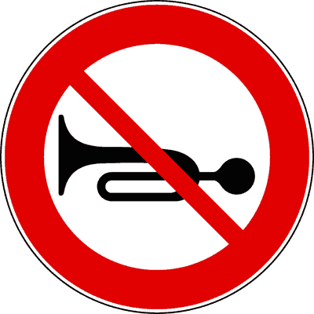
- **📖 الترجمة السياقية:** الإشارة الموضحة تمنع استخدام آلة التنبيه الصوتي (الكلاكس).
- **💡 الشرح والقاعدة المرورية:** إشارة "ممنوع استخدام المنبه الصوتي" (دائرة بيضاء بإطار أحمر وكلاكس مشطوب - م 116 لائحة تنفيذية): تفرض حظر استخدام أجهزة التنبيه الصوتي داخل المنطقة المحددة لتفادي الضوضاء. العبارة صحيحة.
- **⚠️ كشف الفخ:** vieta l'uso del clacson: المعنى المباشر والصريح للإشارة.
- **🔑 الكلمات المفتاحية:** `divieto di segnalazioni acustiche (ممنوع استعمال آلة التنبيه الصوتي (الكلاكس))` | `segnale di divieto (إشارة منع)`

---

**107.** Il segnale raffigurato vieta le segnalazioni acustiche
- **الإجابة:** `VERO ✅ (صح)`
- 
- **📖 الترجمة السياقية:** الإشارة الموضحة تمنع الإشارات والتنبيهات الصوتية.
- **💡 الشرح والقاعدة المرورية:** إشارة "ممنوع استخدام المنبه الصوتي" (دائرة بيضاء بإطار أحمر وكلاكس مشطوب - م 116 لائحة تنفيذية): هذا هو التوصيف القانوني الرسمي للإشارة (divieto di segnalazioni acustiche). العبارة صحيحة.
- **⚠️ كشف الفخ:** vieta le segnalazioni acustiche: التسمية المعتمدة في قانون المرور.
- **🔑 الكلمات المفتاحية:** `divieto di segnalazioni acustiche (ممنوع استعمال آلة التنبيه الصوتي (الكلاكس))` | `segnale di prescrizione (إشارة أمر/تنظيمية)`

---

**108.** In presenza del segnale raffigurato è consentito l'uso del clacson solo in caso di pericolo immediato
- **الإجابة:** `VERO ✅ (صح)`
- 
- **📖 الترجمة السياقية:** في وجود الإشارة الموضحة، يُسمح باستخدام الكلاكس فقط في حالات الخطر الداهم.
- **💡 الشرح والقاعدة المرورية:** إشارة "ممنوع استخدام المنبه الصوتي" (دائرة بيضاء بإطار أحمر وكلاكس مشطوب - م 116 لائحة تنفيذية): الاستثناء القانوني الوحيد هو تفادي وقوع حادث وشيك أو خطر داهم يهدد السلامة العامة. العبارة صحيحة.
- **⚠️ كشف الفخ:** solo in caso di pericolo immediato: صحيح، الخطر الداهم هو الاستثناء الوحيد.
- **🔑 الكلمات المفتاحية:** `divieto di segnalazioni acustiche (ممنوع استعمال آلة التنبيه الصوتي (الكلاكس))` | `pericolo immediato (خطر داهم)`

---

**109.** Il segnale raffigurato indica l'inizio di una zona in cui è vietato suonare il clacson
- **الإجابة:** `VERO ✅ (صح)`
- 
- **📖 الترجمة السياقية:** الإشارة الموضحة تدل على بداية منطقة يُحظر فيها استخدام الكلاكس.
- **💡 الشرح والقاعدة المرورية:** إشارة "ممنوع استخدام المنبه الصوتي" (دائرة بيضاء بإطار أحمر وكلاكس مشطوب - م 116 لائحة تنفيذية): تحدد نقطة انطلاق الحظر وتوضع غالباً بالقرب من المستشفيات ودور العلاج والمناطق الهادئة. العبارة صحيحة.
- **⚠️ كشف الفخ:** inizio di una zona: صحيح، بداية منطقة الحظر الصوتي.
- **🔑 الكلمات المفتاحية:** `divieto di segnalazioni acustiche (ممنوع استعمال آلة التنبيه الصوتي (الكلاكس))` | `inizio (بداية)`

---

**110.** In presenza del segnale raffigurato si può utilizzare il clacson se si trasportano feriti o ammalati gravi
- **الإجابة:** `VERO ✅ (صح)`
- 
- **📖 الترجمة السياقية:** في وجود الإشارة الموضحة، يمكن استخدام الكلاكس عند نقل مصابين أو مرضى في حالات خطيرة.
- **💡 الشرح والقاعدة المرورية:** إشارة "ممنوع استخدام المنبه الصوتي" (دائرة بيضاء بإطار أحمر وكلاكس مشطوب - م 116 لائحة تنفيذية): استثناء صريح في المادة 156 من كود السير: يجوز التنبيه الصوتي عند الإسعاف الطارئ لنقل جرحى أو حالات حرجة. العبارة صحيحة.
- **⚠️ كشف الفخ:** trasportano feriti o ammalati gravi: استثناء إنساني قانوني معتمد.
- **🔑 الكلمات المفتاحية:** `divieto di segnalazioni acustiche (ممنوع استعمال آلة التنبيه الصوتي (الكلاكس))` | `feriti o ammalati (جرحى أو مرضى)`

---

**111.** Il segnale raffigurato consente l'uso del clacson per richiamare l'attenzione in qualsiasi circostanza
- **الإجابة:** `FALSO ❌ (خطأ)`
- 
- **📖 الترجمة السياقية:** الإشارة الموضحة تسمح باستخدام الكلاكس للفت الانتباه في أي ظرف.
- **💡 الشرح والقاعدة المرورية:** إشارة "ممنوع استخدام المنبه الصوتي" (دائرة بيضاء بإطار أحمر وكلاكس مشطوب - م 116 لائحة تنفيذية): يُحظر تماماً استعماله للفت الانتباه أو التحية؛ فالاستعمال مقصور حصراً على الخطر الداهم. العبارة خاطئة.
- **⚠️ كشف الفخ:** in qualsiasi circostanza: فخ التعميم؛ الاستخدام محظور إلا للضرورة القصوى.
- **🔑 الكلمات المفتاحية:** `divieto di segnalazioni acustiche (ممنوع استعمال آلة التنبيه الصوتي (الكلاكس))` | `richiamare l'attenzione (لفت الانتباه)`

---

**112.** Il segnale raffigurato deve essere rispettato soltanto dalle ore 20.00 alle ore 8.00
- **الإجابة:** `FALSO ❌ (خطأ)`
- 
- **📖 الترجمة السياقية:** يجب احترام الإشارة الموضحة فقط من الساعة 20:00 مساءً حتى 8:00 صباحاً.
- **💡 الشرح والقاعدة المرورية:** إشارة "ممنوع استخدام المنبه الصوتي" (دائرة بيضاء بإطار أحمر وكلاكس مشطوب - م 116 لائحة تنفيذية): المنع دائم طوال اليوم (24 ساعة) وليس محصوراً في الفترة الليلية. العبارة خاطئة.
- **⚠️ كشف الفخ:** soltanto dalle 20.00 alle 8.00: فخ التوقيت الليلي؛ المنع دائم.
- **🔑 الكلمات المفتاحية:** `divieto di segnalazioni acustiche (ممنوع استعمال آلة التنبيه الصوتي (الكلاكس))` | `orario (توقيت)`

---

**113.** Il segnale raffigurato preavvisa la possibilità di incontrare una caserma dei vigili del fuoco
- **الإجابة:** `FALSO ❌ (خطأ)`
- 
- **📖 الترجمة السياقية:** الإشارة الموضحة تُنذر باحتمال مصادفة ثكنة لرجال الإطفاء.
- **💡 الشرح والقاعدة المرورية:** إشارة "ممنوع استخدام المنبه الصوتي" (دائرة بيضاء بإطار أحمر وكلاكس مشطوب - م 116 لائحة تنفيذية): لا صلة للإشارة بمراكز الإطفاء؛ بل تخص حظر الإشارات الصوتية للسائقين. العبارة خاطئة.
- **⚠️ كشف الفخ:** caserma dei vigili del fuoco: خلط لا صلة له بالإشارة.
- **🔑 الكلمات المفتاحية:** `divieto di segnalazioni acustiche (ممنوع استعمال آلة التنبيه الصوتي (الكلاكس))` | `vigili del fuoco (رجال الإطفاء)`

---

**114.** Il segnale raffigurato preavvisa una strettoia su strade di montagna
- **الإجابة:** `FALSO ❌ (خطأ)`
- 
- **📖 الترجمة السياقية:** الإشارة الموضحة تُنذر بضيق في الطريق على الطرق الجبلية.
- **💡 الشرح والقاعدة المرورية:** إشارة "ممنوع استخدام المنبه الصوتي" (دائرة بيضاء بإطار أحمر وكلاكس مشطوب - م 116 لائحة تنفيذية): المضايق الجبلية يُشار إليها بإشارات خطر مثلثة، ولا علاقة لهذه الإشارة بذلك. العبارة خاطئة.
- **⚠️ كشف الفخ:** strettoia su strade di montagna: خلط مع لافتات الخطر.
- **🔑 الكلمات المفتاحية:** `divieto di segnalazioni acustiche (ممنوع استعمال آلة التنبيه الصوتي (الكلاكس))` | `strettoia (مضيق)`

---

**115.** Il segnale raffigurato consente l'uso del clacson nei casi di ingorgo stradale
- **الإجابة:** `FALSO ❌ (خطأ)`
- 
- **📖 الترجمة السياقية:** الإشارة الموضحة تسمح باستخدام الكلاكس في حالات الازدحام المروري.
- **💡 الشرح والقاعدة المرورية:** إشارة "ممنوع استخدام المنبه الصوتي" (دائرة بيضاء بإطار أحمر وكلاكس مشطوب - م 116 لائحة تنفيذية): يُحظر حظراً تاماً إطلاق المنبه الصوتي في طوابير واختناقات السير والازدحام (ingorgo). العبارة خاطئة.
- **⚠️ كشف الفخ:** nei casi di ingorgo: خطأ، يمنع منعاً باتاً في الازدحام.
- **🔑 الكلمات المفتاحية:** `divieto di segnalazioni acustiche (ممنوع استعمال آلة التنبيه الصوتي (الكلاكس))` | `ingorgo stradale (ازدحام مروري)`

---

**116.** Il segnale raffigurato indica la fine del divieto di segnalazioni acustiche
- **الإجابة:** `FALSO ❌ (خطأ)`
- 
- **📖 الترجمة السياقية:** الإشارة الموضحة تدل على نهاية منع الإشارات الصوتية.
- **💡 الشرح والقاعدة المرورية:** إشارة "ممنوع استخدام المنبه الصوتي" (دائرة بيضاء بإطار أحمر وكلاكس مشطوب - م 116 لائحة تنفيذية): الإشارة تدل على بداية المنع وليس نهايته؛ نهاية المنع تكون إشارة مشطوبة بخط مائل رمادي. العبارة خاطئة.
- **⚠️ كشف الفخ:** fine del divieto: خطأ، الإشارة لبداية المنع.
- **🔑 الكلمات المفتاحية:** `divieto di segnalazioni acustiche (ممنوع استعمال آلة التنبيه الصوتي (الكلاكس))` | `fine divieto (نهاية المنع)`

---

## 📌 Divieto sorpasso camion (16 domande)

**117.** Il segnale raffigurato vieta ai veicoli di massa a pieno carico superiore a 3,5 tonnellate non destinati al trasporto di persone, di sorpassare veicoli a motore
- **الإجابة:** `VERO ✅ (صح)`
- 
- **📖 الترجمة السياقية:** الإشارة الموضحة تمنع المركبات التي تزيد كتلتها بحمولة كاملة عن 3.5 طن وغير المخصصة لنقل الأشخاص، من تجاوز المركبات ذات المحرك.
- **💡 الشرح والقاعدة المرورية:** إشارة "ممنوع التجاوز لمركبات البضائع التي تزيد عن 3.5 طن" (دائرة بيضاء بإطار أحمر وشاحنة حمراء - م 116 لائحة تنفيذية): نص قانوني دقيق: المنع يسري حصراً على مركبات نقل البضائع (الشاحنات) التي تزيد كتلتها عن 3.5 طن. العبارة صحيحة.
- **⚠️ كشف الفخ:** non destinati al trasporto di persone: استثناء صريح لمركبات نقل الركاب كالحافلات والكرفانات.
- **🔑 الكلمات المفتاحية:** `divieto di sorpasso per autocarri (ممنوع التجاوز للشاحنات فوق 3.5 طن)` | `autocarri oltre 3,5 t (شاحنات نقل بضائع تتجاوز 3.5 طن)` | `sorpasso (تجاوز)`

---

**118.** In presenza del segnale raffigurato, un autocarro non può sorpassare veicoli a motore se sulla sua carta di circolazione è indicata una massa complessiva a pieno carico superiore a 3,5 tonnellate
- **الإجابة:** `VERO ✅ (صح)`
- 
- **📖 الترجمة السياقية:** في وجود الإشارة الموضحة، لا يمكن للشاحنة تجاوز مركبات بمحرك إذا كانت رخصة سيرها تشير لكتلة إجمالية تزيد عن 3.5 طن.
- **💡 الشرح والقاعدة المرورية:** إشارة "ممنوع التجاوز لمركبات البضائع التي تزيد عن 3.5 طن" (دائرة بيضاء بإطار أحمر وشاحنة حمراء - م 116 لائحة تنفيذية): المعيار المعتمد قانوناً هو الوزن المسجل في رخصة السير (carta di circolazione) بغض النظر عن الحمولة الفعلية آنذاك. العبارة صحيحة.
- **⚠️ كشف الفخ:** carta di circolazione oltre 3,5 t: العبرة بالوزن الأقصى المسجل بالرخصة.
- **🔑 الكلمات المفتاحية:** `divieto di sorpasso per autocarri (ممنوع التجاوز للشاحنات فوق 3.5 طن)` | `carta di circolazione (رخصة السير)` | `autocarri oltre 3,5 t (شاحنات نقل بضائع تتجاوز 3.5 طن)`

---

**119.** Il segnale raffigurato consente ad un autocarro di massa a pieno carico inferiore a 3,5 tonnellate di sorpassare un autoarticolato
- **الإجابة:** `VERO ✅ (صح)`
- 
- **📖 الترجمة السياقية:** الإشارة الموضحة تسمح لشاحنة تقل كتلتها بحمولة كاملة عن 3.5 طن بتجاوز قاطرة مفصلية.
- **💡 الشرح والقاعدة المرورية:** إشارة "ممنوع التجاوز لمركبات البضائع التي تزيد عن 3.5 طن" (دائرة بيضاء بإطار أحمر وشاحنة حمراء - م 116 لائحة تنفيذية): الشاحنات الخفيفة التي لا تتعدى 3.5 طن لا يطبق عليها هذا المنع ويجوز لها التجاوز. العبارة صحيحة.
- **⚠️ كشف الفخ:** inferiore a 3,5 tonnellate può sorpassare: صحيح، الشاحنات الخفيفة حتى 3.5 طن مستثناة.
- **🔑 الكلمات المفتاحية:** `divieto di sorpasso per autocarri (ممنوع التجاوز للشاحنات فوق 3.5 طن)` | `autoarticolato (شاحنة مفصلية)`

---

**120.** Il segnale raffigurato consente ad un autobus di massa a pieno carico pari a 18 tonnellate di sorpassare un autotreno
- **الإجابة:** `VERO ✅ (صح)`
- 
- **📖 الترجمة السياقية:** الإشارة الموضحة تسمح لحافلة ركاب كتلتها الإجمالية 18 طناً بتجاوز شاحنة بمقطورة.
- **💡 الشرح والقاعدة المرورية:** إشارة "ممنوع التجاوز لمركبات البضائع التي تزيد عن 3.5 طن" (دائرة بيضاء بإطار أحمر وشاحنة حمراء - م 116 لائحة تنفيذية): قاعدة ذهبية: الحافلات مخصصة لنقل الأشخاص وبالتالي لا تخضع نهائياً لهذا المنع مهما بلغ وزنها! العبارة صحيحة.
- **⚠️ كشف الفخ:** autobus di 18 tonnellate può sorpassare: فخ شهير؛ الحافلات مستثناة لأنها لنقل الأشخاص.
- **🔑 الكلمات المفتاحية:** `divieto di sorpasso per autocarri (ممنوع التجاوز للشاحنات فوق 3.5 طن)` | `autobus (حافلات نقل ركاب)` | `trasporto persone (نقل أشخاص)`

---

**121.** In presenza del segnale raffigurato un'autovettura con massa a pieno carico pari a 3 tonnellate trainante un carrello appendice, può sorpassare veicoli a motore
- **الإجابة:** `VERO ✅ (صح)`
- 
- **📖 الترجمة السياقية:** في وجود الإشارة الموضحة، سيارة ركاب كتلتها 3 أطنان تجر مقطورة أمتعة خفيفة، يمكنها تجاوز مركبات ذات محرك.
- **💡 الشرح والقاعدة المرورية:** إشارة "ممنوع التجاوز لمركبات البضائع التي تزيد عن 3.5 طن" (دائرة بيضاء بإطار أحمر وشاحنة حمراء - م 116 لائحة تنفيذية): سيارات الركاب (autovetture) لا ينطبق عليها هذا المنع إطلاقاً حتى لو كانت تجر مقطورة صغيرة. العبارة صحيحة.
- **⚠️ كشف الفخ:** autovettura con carrello appendice: سيارات الركاب مستثناة من منع الشاحنات.
- **🔑 الكلمات المفتاحية:** `divieto di sorpasso per autocarri (ممنوع التجاوز للشاحنات فوق 3.5 طن)` | `autovetture (سيارات ركاب)` | `carrello appendice (مقطورة أمتعة)`

---

**122.** In presenza del segnale raffigurato un'autovettura può sorpassare un autotreno
- **الإجابة:** `VERO ✅ (صح)`
- 
- **📖 الترجمة السياقية:** في وجود الإشارة الموضحة، يمكن لسيارة الركاب تجاوز شاحنة بمقطورة.
- **💡 الشرح والقاعدة المرورية:** إشارة "ممنوع التجاوز لمركبات البضائع التي تزيد عن 3.5 طن" (دائرة بيضاء بإطار أحمر وشاحنة حمراء - م 116 لائحة تنفيذية): المنع مقصور على الشاحنات الثقيلة ولا يقيد سيارات الركاب العادية في التجاوز. العبارة صحيحة.
- **⚠️ كشف الفخ:** autovettura può sorpassare: صحيح، سيارات الركاب يحق لها التجاوز.
- **🔑 الكلمات المفتاحية:** `divieto di sorpasso per autocarri (ممنوع التجاوز للشاحنات فوق 3.5 طن)` | `autovetture (سيارات ركاب)`

---

**123.** In presenza del segnale raffigurato un autocaravan con massa a pieno carico pari a 4 tonnellate può effettuare manovre di sorpasso
- **الإجابة:** `VERO ✅ (صح)`
- 
- **📖 الترجمة السياقية:** في وجود الإشارة الموضحة، كرفان سكني متنقل (autocaravan) كتلته الإجمالية 4 أطنان يمكنه إجراء مناورة التجاوز.
- **💡 الشرح والقاعدة المرورية:** إشارة "ممنوع التجاوز لمركبات البضائع التي تزيد عن 3.5 طن" (دائرة بيضاء بإطار أحمر وشاحنة حمراء - م 116 لائحة تنفيذية): الكرفان السكني مركبة مخصصة لنقل الأشخاص، فلا يشملها حظر تجاوز الشاحنات وإن زاد وزنها عن 3.5 طن. العبارة صحيحة.
- **⚠️ كشف الفخ:** autocaravan di 4 tonnellate: الكرفان لنقل الأشخاص ولا يسري عليه المنع.
- **🔑 الكلمات المفتاحية:** `divieto di sorpasso per autocarri (ممنوع التجاوز للشاحنات فوق 3.5 طن)` | `autocaravan (كرفان سكني متنقل)`

---

**124.** In presenza del segnale raffigurato è vietato agli autocarri con massa a pieno carico superiore a 3,5 t di sorpassare un motociclo
- **الإجابة:** `VERO ✅ (صح)`
- 
- **📖 الترجمة السياقية:** في وجود الإشارة الموضحة، يُحظر على الشاحنات التي تزيد كتلتها عن 3.5 طن تجاوز دراجة نارية.
- **💡 الشرح والقاعدة المرورية:** إشارة "ممنوع التجاوز لمركبات البضائع التي تزيد عن 3.5 طن" (دائرة بيضاء بإطار أحمر وشاحنة حمراء - م 116 لائحة تنفيذية): قاعدة صارمة: الشاحنة الثقيلة الممنوعة لا يجوز لها تجاوز أي مركبة ذات محرك على الإطلاق حتى لو كانت دراجة نارية! العبارة صحيحة.
- **⚠️ كشف الفخ:** vietato sorpassare un motociclo: فخ؛ الشاحنة الثقيلة لا تتجاوز حتى الدراجة النارية.
- **🔑 الكلمات المفتاحية:** `divieto di sorpasso per autocarri (ممنوع التجاوز للشاحنات فوق 3.5 طن)` | `autocarri oltre 3,5 t (شاحنات نقل بضائع تتجاوز 3.5 طن)` | `motocicli (دراجات نارية)`

---

**125.** In presenza del segnale raffigurato un autocarro con massa massima a pieno carico superiore a 3,5 tonnellate trainante un rimorchio leggero, può sorpassare un motociclo
- **الإجابة:** `FALSO ❌ (خطأ)`
- 
- **📖 الترجمة السياقية:** في وجود الإشارة الموضحة، شاحنة تزيد كتلتها عن 3.5 طن تجر مقطورة خفيفة، يمكنها تجاوز دراجة نارية.
- **💡 الشرح والقاعدة المرورية:** إشارة "ممنوع التجاوز لمركبات البضائع التي تزيد عن 3.5 طن" (دائرة بيضاء بإطار أحمر وشاحنة حمراء - م 116 لائحة تنفيذية): لا يجوز للشاحنة الثقيلة تجاوز الدراجة النارية بأي حال من الأحوال. العبارة خاطئة.
- **⚠️ كشف الفخ:** può sorpassare un motociclo: خطأ، الشاحنة الثقيلة ممنوعة من تجاوز الدراجات النارية.
- **🔑 الكلمات المفتاحية:** `divieto di sorpasso per autocarri (ممنوع التجاوز للشاحنات فوق 3.5 طن)` | `autocarri oltre 3,5 t (شاحنات نقل بضائع تتجاوز 3.5 طن)` | `motocicli (دراجات نارية)`

---

**126.** In presenza del segnale raffigurato un autocaravan di massa a pieno carico superiore a 3,5 tonnellate non può sorpassare veicoli a motore
- **الإجابة:** `FALSO ❌ (خطأ)`
- 
- **📖 الترجمة السياقية:** في وجود الإشارة الموضحة، كرفان سكني تزيد كتلته عن 3.5 طن لا يمكنه تجاوز مركبات ذات محرك.
- **💡 الشرح والقاعدة المرورية:** إشارة "ممنوع التجاوز لمركبات البضائع التي تزيد عن 3.5 طن" (دائرة بيضاء بإطار أحمر وشاحنة حمراء - م 116 لائحة تنفيذية): الكرفان السكني مخصص لنقل الأشخاص ويحق له التجاوز؛ المنع يخص شاحنات نقل البضائع فقط. العبارة خاطئة.
- **⚠️ كشف الفخ:** autocaravan non può sorpassare: خطأ، الكرفان السكني مسموح له بالتجاوز.
- **🔑 الكلمات المفتاحية:** `divieto di sorpasso per autocarri (ممنوع التجاوز للشاحنات فوق 3.5 طن)` | `autocaravan (كرفان سكني متنقل)`

---

**127.** Il segnale raffigurato consente ad un autocarro di massa complessiva superiore a 3,5 tonnellate di sorpassare un motociclo
- **الإجابة:** `FALSO ❌ (خطأ)`
- 
- **📖 الترجمة السياقية:** الإشارة الموضحة تسمح لشاحنة تزيد كتلتها عن 3.5 طن بتجاوز دراجة نارية.
- **💡 الشرح والقاعدة المرورية:** إشارة "ممنوع التجاوز لمركبات البضائع التي تزيد عن 3.5 طن" (دائرة بيضاء بإطار أحمر وشاحنة حمراء - م 116 لائحة تنفيذية): يحظر على الشاحنة التي تفوق 3.5 طن تجاوز أي مركبة بمحرك بما فيها الدراجة النارية. العبارة خاطئة.
- **⚠️ كشف الفخ:** consente di sorpassare motociclo: خطأ، يمنع تجاوز الدراجات النارية.
- **🔑 الكلمات المفتاحية:** `divieto di sorpasso per autocarri (ممنوع التجاوز للشاحنات فوق 3.5 طن)` | `autocarri oltre 3,5 t (شاحنات نقل بضائع تتجاوز 3.5 طن)` | `motocicli (دراجات نارية)`

---

**128.** Il segnale raffigurato consente alle autovetture di sorpassare gli autocarri sulla corsia di destra
- **الإجابة:** `FALSO ❌ (خطأ)`
- 
- **📖 الترجمة السياقية:** الإشارة الموضحة تسمح لسيارات الركاب بتجاوز الشاحنات من المسار الأيمن.
- **💡 الشرح والقاعدة المرورية:** إشارة "ممنوع التجاوز لمركبات البضائع التي تزيد عن 3.5 طن" (دائرة بيضاء بإطار أحمر وشاحنة حمراء - م 116 لائحة تنفيذية): التجاوز من جهة اليمين ممنوع قانوناً في الحالات العامة، والإشارة لا تبيح التجاوز من اليمين. العبارة خاطئة.
- **⚠️ كشف الفخ:** sorpassare sulla corsia di destra: التجاوز من اليمين محظور نظاماً.
- **🔑 الكلمات المفتاحية:** `divieto di sorpasso per autocarri (ممنوع التجاوز للشاحنات فوق 3.5 طن)` | `corsia di destra (المسار الأيمن)`

---

**129.** Il segnale raffigurato vieta il sorpasso agli autosnodati
- **الإجابة:** `FALSO ❌ (خطأ)`
- 
- **📖 الترجمة السياقية:** الإشارة الموضحة تمنع التجاوز على الحافلات المفصلية (autosnodati).
- **💡 الشرح والقاعدة المرورية:** إشارة "ممنوع التجاوز لمركبات البضائع التي تزيد عن 3.5 طن" (دائرة بيضاء بإطار أحمر وشاحنة حمراء - م 116 لائحة تنفيذية): الحافلات المفصلية مخصصة لنقل الركاب والناس فلا يسري عليها حظر الشاحنات. العبارة خاطئة.
- **⚠️ كشف الفخ:** vieta agli autosnodati: خطأ، الحافلات المفصلية لنقل الأشخاص.
- **🔑 الكلمات المفتاحية:** `divieto di sorpasso per autocarri (ممنوع التجاوز للشاحنات فوق 3.5 طن)` | `autosnodati (حافلات مفصلية)`

---

**130.** Il segnale raffigurato vieta ad un'autocaravan di massa complessiva pari a 6 tonnellate di effettuare manovre di sorpasso
- **الإجابة:** `FALSO ❌ (خطأ)`
- 
- **📖 الترجمة السياقية:** الإشارة الموضحة تمنع كرفاناً سكنياً وزنه 6 أطنان من إجراء مناورات التجاوز.
- **💡 الشرح والقاعدة المرورية:** إشارة "ممنوع التجاوز لمركبات البضائع التي تزيد عن 3.5 طن" (دائرة بيضاء بإطار أحمر وشاحنة حمراء - م 116 لائحة تنفيذية): الكرفان مخصص لنقل الأشخاص ولا يخضع لمنع الشاحنات مهما كان وزنه الإجمالي. العبارة خاطئة.
- **⚠️ كشف الفخ:** vieta ad autocaravan di 6 tonnellate: الكرفان لنقل الأشخاص ولا يشمله الحظر.
- **🔑 الكلمات المفتاحية:** `divieto di sorpasso per autocarri (ممنوع التجاوز للشاحنات فوق 3.5 طن)` | `autocaravan (كرفان سكني متنقل)`

---

**131.** In presenza del segnale raffigurato, un autocarro di massa a pieno carico pari a 3 tonnellate non può effettuare manovre di sorpasso
- **الإجابة:** `FALSO ❌ (خطأ)`
- 
- **📖 الترجمة السياقية:** في وجود الإشارة الموضحة، شاحنة كتلتها الإجمالية 3 أطنان لا يمكنها إجراء مناورة التجاوز.
- **💡 الشرح والقاعدة المرورية:** إشارة "ممنوع التجاوز لمركبات البضائع التي تزيد عن 3.5 طن" (دائرة بيضاء بإطار أحمر وشاحنة حمراء - م 116 لائحة تنفيذية): وزن 3 أطنان لا يتجاوز الحد القانوني (3.5 طن)، وبالتالي يحق لتلك الشاحنة التجاوز. العبارة خاطئة.
- **⚠️ كشف الفخ:** autocarro di 3 tonnellate non può: خطأ، الشاحنة حتى 3.5 طن مسموح لها بالتجاوز.
- **🔑 الكلمات المفتاحية:** `divieto di sorpasso per autocarri (ممنوع التجاوز للشاحنات فوق 3.5 طن)` | `autocarri oltre 3,5 t (شاحنات نقل بضائع تتجاوز 3.5 طن)`

---

**132.** In presenza del segnale raffigurato i veicoli con massa a pieno carico superiore a 3,5 tonnellate destinati al trasporto di persone, non possono effettuare manovre di sorpasso
- **الإجابة:** `FALSO ❌ (خطأ)`
- 
- **📖 الترجمة السياقية:** في وجود الإشارة الموضحة، المركبات التي تزيد كتلتها عن 3.5 طن والمخصصة لنقل الأشخاص، لا يمكنها التجاوز.
- **💡 الشرح والقاعدة المرورية:** إشارة "ممنوع التجاوز لمركبات البضائع التي تزيد عن 3.5 طن" (دائرة بيضاء بإطار أحمر وشاحنة حمراء - م 116 لائحة تنفيذية): المركبات المخصصة لنقل الأشخاص (كالأتوبيسات) مستثناة صراحة ويحق لها التجاوز. العبارة خاطئة.
- **⚠️ كشف الفخ:** destinati al trasporto di persone non possono: خطأ، مسموح لها بالتجاوز.
- **🔑 الكلمات المفتاحية:** `divieto di sorpasso per autocarri (ممنوع التجاوز للشاحنات فوق 3.5 طن)` | `autobus (حافلات نقل ركاب)` | `trasporto persone (نقل أشخاص)`

---

## 📌 Veicoli trazione animale (12 domande)

**133.** Il segnale raffigurato vieta il transito ai veicoli a trazione animale
- **الإجابة:** `VERO ✅ (صح)`
- 
- **📖 الترجمة السياقية:** الإشارة الموضحة تمنع مرور المركبات التي تجرها حيوانات.
- **💡 الشرح والقاعدة المرورية:** إشارة "ممنوع مرور المركبات المجرورة بالحيوانات" (دائرة بيضاء بإطار أحمر وعربة خيل - م 116 لائحة تنفيذية): تمنع سير ودخول كافة المركبات والعربات التي تعتمد على الجر بالحيوانات. العبارة صحيحة.
- **⚠️ كشف الفخ:** vieta veicoli a trazione animale: المعنى القانوني الدقيق للإشارة.
- **🔑 الكلمات المفتاحية:** `veicoli a trazione animale (مركبات تجرها حيوانات)` | `segnale di divieto (إشارة منع)`

---

**134.** Il segnale raffigurato vieta il transito ai veicoli trainati da cavalli
- **الإجابة:** `VERO ✅ (صح)`
- 
- **📖 الترجمة السياقية:** الإشارة الموضحة تمنع مرور العربات التي تجرها الخيول.
- **💡 الشرح والقاعدة المرورية:** إشارة "ممنوع مرور المركبات المجرورة بالحيوانات" (دائرة بيضاء بإطار أحمر وعربة خيل - م 116 لائحة تنفيذية): تشمل الحظر كل عربة تجرها خيول أو بغال أو دواب. العبارة صحيحة.
- **⚠️ كشف الفخ:** trainati da cavalli: صحيح، عربات الخيول ممنوعة.
- **🔑 الكلمات المفتاحية:** `veicoli a trazione animale (مركبات تجرها حيوانات)` | `cavalli (خيول)`

---

**135.** Il segnale raffigurato vieta la circolazione alle carrozze a cavalli
- **الإجابة:** `VERO ✅ (صح)`
- 
- **📖 الترجمة السياقية:** الإشارة الموضحة تمنع سير عربات الخيل.
- **💡 الشرح والقاعدة المرورية:** إشارة "ممنوع مرور المركبات المجرورة بالحيوانات" (دائرة بيضاء بإطار أحمر وعربة خيل - م 116 لائحة تنفيذية): حظر صريح لسير الحناطير وعربات الخيول بمختلف أشكالها. العبارة صحيحة.
- **⚠️ كشف الفخ:** carrozze a cavalli: صحيح، عربات الخيل مشمولة بالمنع.
- **🔑 الكلمات المفتاحية:** `veicoli a trazione animale (مركبات تجرها حيوانات)` | `carrozze (عربات)`

---

**136.** Il segnale raffigurato vieta il transito ai veicoli trainati da asini
- **الإجابة:** `VERO ✅ (صح)`
- 
- **📖 الترجمة السياقية:** الإشارة الموضحة تمنع مرور العربات التي تجرها الحمير.
- **💡 الشرح والقاعدة المرورية:** إشارة "ممنوع مرور المركبات المجرورة بالحيوانات" (دائرة بيضاء بإطار أحمر وعربة خيل - م 116 لائحة تنفيذية): الحظر عام يشمل كافة فصائل حيوانات الجر والتحميل (حمير، بغال، ثيران). العبارة صحيحة.
- **⚠️ كشف الفخ:** trainati da asini: صحيح، الجر بالحمير مشمول بالحظر.
- **🔑 الكلمات المفتاحية:** `veicoli a trazione animale (مركبات تجرها حيوانات)` | `asini (حمير)`

---

**137.** Il segnale raffigurato consente il transito dei motocicli
- **الإجابة:** `VERO ✅ (صح)`
- 
- **📖 الترجمة السياقية:** الإشارة الموضحة تسمح بمرور الدراجات النارية.
- **💡 الشرح والقاعدة المرورية:** إشارة "ممنوع مرور المركبات المجرورة بالحيوانات" (دائرة بيضاء بإطار أحمر وعربة خيل - م 116 لائحة تنفيذية): تمنع العربات الحيوانية فقط ولا تمنع الدراجات النارية أو المركبات الآلية. العبارة صحيحة.
- **⚠️ كشف الفخ:** consente ai motocicli: صحيح، الدراجات النارية مسموح لها بالمرور.
- **🔑 الكلمات المفتاحية:** `veicoli a trazione animale (مركبات تجرها حيوانات)` | `motocicli (دراجات نارية)`

---

**138.** Il segnale raffigurato consente il transito degli autoveicoli
- **الإجابة:** `VERO ✅ (صح)`
- 
- **📖 الترجمة السياقية:** الإشارة الموضحة تسمح بمرور المركبات الآلية (السيارات).
- **💡 الشرح والقاعدة المرورية:** إشارة "ممنوع مرور المركبات المجرورة بالحيوانات" (دائرة بيضاء بإطار أحمر وعربة خيل - م 116 لائحة تنفيذية): السيارات والمركبات ذات المحرك تسير بحرية ولا يمسها المنع المخصص للجر الحيواني. العبارة صحيحة.
- **⚠️ كشف الفخ:** consente agli autoveicoli: صحيح، السيارات مسموح لها بالمرور.
- **🔑 الكلمات المفتاحية:** `veicoli a trazione animale (مركبات تجرها حيوانات)` | `autovetture (سيارات ركاب)`

---

**139.** Il segnale raffigurato vieta il transito ai veicoli a motore
- **الإجابة:** `FALSO ❌ (خطأ)`
- 
- **📖 الترجمة السياقية:** الإشارة الموضحة تمنع مرور المركبات ذات المحرك.
- **💡 الشرح والقاعدة المرورية:** إشارة "ممنوع مرور المركبات المجرورة بالحيوانات" (دائرة بيضاء بإطار أحمر وعربة خيل - م 116 لائحة تنفيذية): لا تمنع المركبات ذات المحرك، بل تمنع فقط العربات المجرورة بالحيوانات. العبارة خاطئة.
- **⚠️ كشف الفخ:** vieta ai veicoli a motore: خطأ، المركبات الآلية مصرح لها بالمرور.
- **🔑 الكلمات المفتاحية:** `veicoli a trazione animale (مركبات تجرها حيوانات)` | `autovetture (سيارات ركاب)`

---

**140.** Il segnale raffigurato vige, nei centri abitati, dalle ore 8.00 alle ore 20.00
- **الإجابة:** `FALSO ❌ (خطأ)`
- 
- **📖 الترجمة السياقية:** تسري الإشارة الموضحة، داخل المدن، من الساعة 8:00 صباحاً حتى 20:00 مساءً.
- **💡 الشرح والقاعدة المرورية:** إشارة "ممنوع مرور المركبات المجرورة بالحيوانات" (دائرة بيضاء بإطار أحمر وعربة خيل - م 116 لائحة تنفيذية): المنع دائم ويسري على مدار 24 ساعة دون تقيد بأوقات محددة. العبارة خاطئة.
- **⚠️ كشف الفخ:** dalle 8.00 alle 20.00: فخ التوقيت؛ المنع يسري 24 ساعة.
- **🔑 الكلمات المفتاحية:** `veicoli a trazione animale (مركبات تجرها حيوانات)` | `orario (توقيت)`

---

**141.** Il segnale raffigurato consente il transito ai veicoli a trazione animale se muniti di pneumatici
- **الإجابة:** `FALSO ❌ (خطأ)`
- 
- **📖 الترجمة السياقية:** الإشارة الموضحة تسمح بمرور المركبات التي تجرها حيوانات إذا كانت مزودة بإطارات هوائية.
- **💡 الشرح والقاعدة المرورية:** إشارة "ممنوع مرور المركبات المجرورة بالحيوانات" (دائرة بيضاء بإطار أحمر وعربة خيل - م 116 لائحة تنفيذية): المنع مطلق ولا يستثني العربات ذات العجلات المطاطية أو الهوائية. العبارة خاطئة.
- **⚠️ كشف الفخ:** se muniti di pneumatici: استثناء وهمي باطل؛ المنع شامل.
- **🔑 الكلمات المفتاحية:** `veicoli a trazione animale (مركبات تجرها حيوانات)` | `pneumatici (إطارات هوائية)`

---

**142.** Il segnale raffigurato indica una strada riservata ai carri agricoli
- **الإجابة:** `FALSO ❌ (خطأ)`
- 
- **📖 الترجمة السياقية:** الإشارة الموضحة تشير إلى طريق مخصص للعربات الزراعية.
- **💡 الشرح والقاعدة المرورية:** إشارة "ممنوع مرور المركبات المجرورة بالحيوانات" (دائرة بيضاء بإطار أحمر وعربة خيل - م 116 لائحة تنفيذية): الإشارة للمنع (إطار أحمر) وليست طريقاً مخصصاً (دائرة زرقاء). العبارة خاطئة.
- **⚠️ كشف الفخ:** strada riservata ai carri agricoli: خلط بين إشارة المنع وإشارة التخصيص.
- **🔑 الكلمات المفتاحية:** `veicoli a trazione animale (مركبات تجرها حيوانات)` | `carri agricoli (عربات زراعية)`

---

**143.** Il segnale raffigurato vieta il transito ai veicoli a braccia
- **الإجابة:** `FALSO ❌ (خطأ)`
- 
- **📖 الترجمة السياقية:** الإشارة الموضحة تمنع مرور المركبات التي تدفع باليد (عربات اليد).
- **💡 الشرح والقاعدة المرورية:** إشارة "ممنوع مرور المركبات المجرورة بالحيوانات" (دائرة بيضاء بإطار أحمر وعربة خيل - م 116 لائحة تنفيذية): عربات اليد (veicoli a braccia) يدفعها الإنسان وليست مجرورة بالحيوانات، فلا يشملها المنع. العبارة خاطئة.
- **⚠️ كشف الفخ:** vieta ai veicoli a braccia: خطأ، عربات اليد لا يشملها المنع.
- **🔑 الكلمات المفتاحية:** `veicoli a trazione animale (مركبات تجرها حيوانات)` | `veicoli a braccia (عربات يد)`

---

**144.** Il segnale raffigurato vieta la circolazione a tutti i veicoli sprovvisti di motore
- **الإجابة:** `FALSO ❌ (خطأ)`
- 
- **📖 الترجمة السياقية:** الإشارة الموضحة تمنع السير على جميع المركبات غير المزودة بمحرك.
- **💡 الشرح والقاعدة المرورية:** إشارة "ممنوع مرور المركبات المجرورة بالحيوانات" (دائرة بيضاء بإطار أحمر وعربة خيل - م 116 لائحة تنفيذية): لفظ (tutti) خاطئ؛ الدراجات الهوائية وعربات اليد غير مزودة بمحرك ومع ذلك يسمح لها بالمرور. العبارة خاطئة.
- **⚠️ كشف الفخ:** tutti i veicoli sprovvisti di motore: تعميم باطل؛ الدراجات الهوائية مسموح بها.
- **🔑 الكلمات المفتاحية:** `veicoli a trazione animale (مركبات تجرها حيوانات)` | `senza motore (بدون محرك)`

---

## 📌 Divieto transito pedoni (10 domande)

**145.** Il segnale raffigurato vieta il transito ai pedoni
- **الإجابة:** `VERO ✅ (صح)`
- 
- **📖 الترجمة السياقية:** الإشارة الموضحة تمنع مرور المشاة.
- **💡 الشرح والقاعدة المرورية:** إشارة "ممنوع مرور المشاة" (دائرة بيضاء بإطار أحمر وشخص ماشٍ - م 116 لائحة تنفيذية): تمنع سير وترجل المشاة في هذا الطريق حماية لسلامتهم لارتفاع سرعة أو خطورة المرور. العبارة صحيحة.
- **⚠️ كشف الفخ:** vieta il transito ai pedoni: المعنى النظامي المباشر للإشارة.
- **🔑 الكلمات المفتاحية:** `pedoni (مشاة)` | `segnale di divieto (إشارة منع)`

---

**146.** Il segnale raffigurato consente il transito agli autoveicoli
- **الإجابة:** `VERO ✅ (صح)`
- 
- **📖 الترجمة السياقية:** الإشارة الموضحة تسمح بمرور السيارات والمركبات الآلية.
- **💡 الشرح والقاعدة المرورية:** إشارة "ممنوع مرور المشاة" (دائرة بيضاء بإطار أحمر وشخص ماشٍ - م 116 لائحة تنفيذية): المنع مقصور على المشاة، وتتحرك المركبات الآلية في الطريق بشكل طبيعي. العبارة صحيحة.
- **⚠️ كشف الفخ:** consente agli autoveicoli: صحيح، السيارات مسموح لها بالمرور.
- **🔑 الكلمات المفتاحية:** `pedoni (مشاة)` | `autovetture (سيارات ركاب)`

---

**147.** Il segnale raffigurato consente il transito ai motocicli
- **الإجابة:** `VERO ✅ (صح)`
- 
- **📖 الترجمة السياقية:** الإشارة الموضحة تسمح بمرور الدراجات النارية.
- **💡 الشرح والقاعدة المرورية:** إشارة "ممنوع مرور المشاة" (دائرة بيضاء بإطار أحمر وشخص ماشٍ - م 116 لائحة تنفيذية): الدراجات النارية مركبات مسموح بمرورها ولا يشملها منع المشاة. العبارة صحيحة.
- **⚠️ كشف الفخ:** consente ai motocicli: صحيح، الدراجات النارية مسموح بها.
- **🔑 الكلمات المفتاحية:** `pedoni (مشاة)` | `motocicli (دراجات نارية)`

---

**148.** Il segnale raffigurato consente il transito ai quadricicli a motore
- **الإجابة:** `VERO ✅ (صح)`
- 
- **📖 الترجمة السياقية:** الإشارة الموضحة تسمح بمرور الدراجات الرباعية ذات المحرك (الكواد).
- **💡 الشرح والقاعدة المرورية:** إشارة "ممنوع مرور المشاة" (دائرة بيضاء بإطار أحمر وشخص ماشٍ - م 116 لائحة تنفيذية): الكواد مركبات ذات محرك وتمر بحرية دون مانع. العبارة صحيحة.
- **⚠️ كشف الفخ:** consente ai quadricicli: صحيح، الكواد مسموح له بالمرور.
- **🔑 الكلمات المفتاحية:** `pedoni (مشاة)` | `quadricicli (دراجات رباعية)`

---

**149.** Il segnale raffigurato consente il transito alle biciclette
- **الإجابة:** `VERO ✅ (صح)`
- 
- **📖 الترجمة السياقية:** الإشارة الموضحة تسمح بمرور الدراجات الهوائية.
- **💡 الشرح والقاعدة المرورية:** إشارة "ممنوع مرور المشاة" (دائرة بيضاء بإطار أحمر وشخص ماشٍ - م 116 لائحة تنفيذية): الدراجات الهوائية مركبات (velocipedi) وليست مشاة، فيسمح لها بالمرور ما لم تكن هناك لافتة أخرى تمنعها. العبارة صحيحة.
- **⚠️ كشف الفخ:** consente alle biciclette: صحيح، راكبو الدراجات مسموح بمرورهم.
- **🔑 الكلمات المفتاحية:** `pedoni (مشاة)` | `biciclette (دراجات هوائية)`

---

**150.** Il segnale raffigurato vieta il transito ai ciclomotori
- **الإجابة:** `FALSO ❌ (خطأ)`
- 
- **📖 الترجمة السياقية:** الإشارة الموضحة تمنع مرور الدراجات النارية الصغيرة (السيبلومات).
- **💡 الشرح والقاعدة المرورية:** إشارة "ممنوع مرور المشاة" (دائرة بيضاء بإطار أحمر وشخص ماشٍ - م 116 لائحة تنفيذية): الإشارة تمنع المشاة فقط ولا تمنع الدراجات الآلية الخفيفة (ciclomotori). العبارة خاطئة.
- **⚠️ كشف الفخ:** vieta ai ciclomotori: خطأ، المنع للمشاة فقط.
- **🔑 الكلمات المفتاحية:** `pedoni (مشاة)` | `ciclomotori (دراجات آلية خفيفة)`

---

**151.** Il segnale raffigurato vale dalle ore 8.00 alle ore 20.00
- **الإجابة:** `FALSO ❌ (خطأ)`
- 
- **📖 الترجمة السياقية:** تسري الإشارة الموضحة من الساعة 8:00 صباحاً حتى 20:00 مساءً.
- **💡 الشرح والقاعدة المرورية:** إشارة "ممنوع مرور المشاة" (دائرة بيضاء بإطار أحمر وشخص ماشٍ - م 116 لائحة تنفيذية): منع مرور المشاة دائم على مدار 24 ساعة لحماية سلامتهم من مخاطر الطريق. العبارة خاطئة.
- **⚠️ كشف الفخ:** dalle 8.00 alle 20.00: فخ التوقيت النهاري؛ المنع دائم 24 ساعة.
- **🔑 الكلمات المفتاحية:** `pedoni (مشاة)` | `orario (توقيت)` | `segnale di divieto (إشارة منع)`

---

**152.** Il segnale raffigurato indica un'area urbana riservata a parco giochi e divertimenti
- **الإجابة:** `FALSO ❌ (خطأ)`
- 
- **📖 الترجمة السياقية:** الإشارة الموضحة تدل على منطقة حضرية مخصصة لحديقة ألعاب وتسلية.
- **💡 الشرح والقاعدة المرورية:** إشارة "ممنوع مرور المشاة" (دائرة بيضاء بإطار أحمر وشخص ماشٍ - م 116 لائحة تنفيذية): لا صلة لها بحدائق الألعاب؛ بل تمنع المشاة من السير على الطريق منعاً باتاً. العبارة خاطئة.
- **⚠️ كشف الفخ:** parco giochi: خلط لا صلة له بالإشارة.
- **🔑 الكلمات المفتاحية:** `pedoni (مشاة)` | `parco giochi (حديقة ألعاب)`

---

**153.** Il segnale raffigurato obbliga i pedoni a circolare sul margine sinistro della carreggiata
- **الإجابة:** `FALSO ❌ (خطأ)`
- 
- **📖 الترجمة السياقية:** الإشارة الموضحة تُلزم المشاة بالسير على الحافة اليسرى لنهر الطريق.
- **💡 الشرح والقاعدة المرورية:** إشارة "ممنوع مرور المشاة" (دائرة بيضاء بإطار أحمر وشخص ماشٍ - م 116 لائحة تنفيذية): الإشارة تمنع وجود ومرور المشاة أصلاً، ولا تنظم كيفية سيرهم. العبارة خاطئة.
- **⚠️ كشف الفخ:** circolare sul margine sinistro: خطأ، المشاة ممنوعون من المرور كلياً.
- **🔑 الكلمات المفتاحية:** `pedoni (مشاة)` | `margine sinistro (الحافة اليسرى)`

---

**154.** Il segnale raffigurato indica l'inizio di un percorso pedonale
- **الإجابة:** `FALSO ❌ (خطأ)`
- 
- **📖 الترجمة السياقية:** الإشارة الموضحة تدل على بداية مسار مخصص للمشاة.
- **💡 الشرح والقاعدة المرورية:** إشارة "ممنوع مرور المشاة" (دائرة بيضاء بإطار أحمر وشخص ماشٍ - م 116 لائحة تنفيذية): المسار المخصص للمشاة دائرة زرقاء برسم أبيض (إلزام)، بينما هذه دائرة بإطار أحمر تمنع المشاة. العبارة خاطئة.
- **⚠️ كشف الفخ:** inizio di un percorso pedonale: خلط بين إشارة المنع ومسار المشاة الإلزامي.
- **🔑 الكلمات المفتاحية:** `pedoni (مشاة)` | `percorso pedonale (مسار مشاة)`

---

## 📌 Transito biciclette (13 domande)

**155.** Il segnale raffigurato vieta il transito alle biciclette
- **الإجابة:** `VERO ✅ (صح)`
- 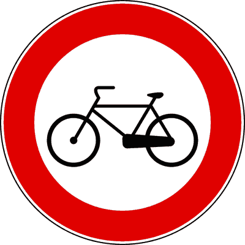
- **📖 الترجمة السياقية:** الإشارة الموضحة تمنع مرور الدراجات الهوائية.
- **💡 الشرح والقاعدة المرورية:** إشارة "ممنوع مرور الدراجات الهوائية" (دائرة بيضاء بإطار أحمر ودراجة - م 116 لائحة تنفيذية): تمنع سير ودخول كافة أصناف الدراجات الهوائية (velocipedi) بما فيها الدراجات الترادفية والرباعية البدالة. العبارة صحيحة.
- **⚠️ كشف الفخ:** vieta alle biciclette: المعنى النظامي المباشر للإشارة.
- **🔑 الكلمات المفتاحية:** `biciclette / velocipedi (دراجات هوائية)` | `segnale di divieto (إشارة منع)`

---

**156.** Il segnale raffigurato è un segnale di divieto
- **الإجابة:** `VERO ✅ (صح)`
- 
- **📖 الترجمة السياقية:** الإشارة الموضحة هي إشارة منع.
- **💡 الشرح والقاعدة المرورية:** إشارة "ممنوع مرور الدراجات الهوائية" (دائرة بيضاء بإطار أحمر ودراجة - م 116 لائحة تنفيذية): الدائرة ذات الإطار الأحمر والخلفية البيضاء هي إشارة منع رسمية في قانون المرور. العبارة صحيحة.
- **⚠️ كشف الفخ:** segnale di divieto: تصنيف صحيح.
- **🔑 الكلمات المفتاحية:** `segnale di divieto (إشارة منع)` | `segnale di prescrizione (إشارة أمر/تنظيمية)`

---

**157.** Il segnale raffigurato consente il transito ai quadricicli a motore
- **الإجابة:** `VERO ✅ (صح)`
- 
- **📖 الترجمة السياقية:** الإشارة الموضحة تسمح بمرور الدراجات الرباعية ذات المحرك (الكواد).
- **💡 الشرح والقاعدة المرورية:** إشارة "ممنوع مرور الدراجات الهوائية" (دائرة بيضاء بإطار أحمر ودراجة - م 116 لائحة تنفيذية): تمنع الدراجات الهوائية فقط ولا تمنع الدراجات الرباعية الآلية المزودة بمحرك. العبارة صحيحة.
- **⚠️ كشف الفخ:** consente ai quadricicli a motore: صحيح، المركبات ذات المحرك تمر بحرية.
- **🔑 الكلمات المفتاحية:** `biciclette / velocipedi (دراجات هوائية)` | `quadricicli a motore (دراجات رباعية بمحرك)`

---

**158.** Il segnale raffigurato consente il transito ai pedoni
- **الإجابة:** `VERO ✅ (صح)`
- 
- **📖 الترجمة السياقية:** الإشارة الموضحة تسمح بمرور المشاة.
- **💡 الشرح والقاعدة المرورية:** إشارة "ممنوع مرور الدراجات الهوائية" (دائرة بيضاء بإطار أحمر ودراجة - م 116 لائحة تنفيذية): المشاة لا يقودون دراجات هوائية ويحق لهم السير على الأقدام بصورة طبيعية. العبارة صحيحة.
- **⚠️ كشف الفخ:** consente ai pedoni: المشاة مصرح بمرورهم.
- **🔑 الكلمات المفتاحية:** `biciclette / velocipedi (دراجات هوائية)` | `pedoni (مشاة)`

---

**159.** Il segnale raffigurato consente il transito ai ciclomotori a due ruote
- **الإجابة:** `VERO ✅ (صح)`
- 
- **📖 الترجمة السياقية:** الإشارة الموضحة تسمح بمرور الدراجات الآلية الصغيرة ذات العجلتين (السيبلومات).
- **💡 الشرح والقاعدة المرورية:** إشارة "ممنوع مرور الدراجات الهوائية" (دائرة بيضاء بإطار أحمر ودراجة - م 116 لائحة تنفيذية): السيبلومات مركبات ذات محرك وليست دراجات هوائية، فلا يسري عليها المنع. العبارة صحيحة.
- **⚠️ كشف الفخ:** consente ai ciclomotori a due ruote: صحيح، السيبلومات مسموح بمرورها.
- **🔑 الكلمات المفتاحية:** `biciclette / velocipedi (دراجات هوائية)` | `ciclomotori (دراجات آلية خفيفة (سيبلومات))`

---

**160.** Il segnale raffigurato vieta il transito ai quadricicli a pedale
- **الإجابة:** `VERO ✅ (صح)`
- 
- **📖 الترجمة السياقية:** الإشارة الموضحة تمنع مرور الدراجات الرباعية التي تعمل بالبدال (البدالات الرباعية).
- **💡 الشرح والقاعدة المرورية:** إشارة "ممنوع مرور الدراجات الهوائية" (دائرة بيضاء بإطار أحمر ودراجة - م 116 لائحة تنفيذية): المركبات التي تسير بالبدالات تُصنف نظاماً كدراجات هوائية (velocipedi) ويشملها منع الدراجات قطعاً. العبارة صحيحة.
- **⚠️ كشف الفخ:** quadricicli a pedale: تصنف كدراجات هوائية ويشملها الحظر.
- **🔑 الكلمات المفتاحية:** `biciclette / velocipedi (دراجات هوائية)` | `quadricicli a pedale (دراجات رباعية بالبدال)`

---

**161.** Il segnale raffigurato vieta il transito ai tandem
- **الإجابة:** `VERO ✅ (صح)`
- 
- **📖 الترجمة السياقية:** الإشارة الموضحة تمنع مرور الدراجات الترادفية (tandem).
- **💡 الشرح والقاعدة المرورية:** إشارة "ممنوع مرور الدراجات الهوائية" (دائرة بيضاء بإطار أحمر ودراجة - م 116 لائحة تنفيذية): الدراجة الترادفية المزدوجة نوع من الدراجات الهوائية ويسري عليها منع الدراجات تماماً. العبارة صحيحة.
- **⚠️ كشف الفخ:** vieta ai tandem: التانديم نوع من الدراجات ويشمله المنع.
- **🔑 الكلمات المفتاحية:** `biciclette / velocipedi (دراجات هوائية)` | `tandem (دراجة ترادفية)`

---

**162.** Il segnale raffigurato vale dalle ore 8.00 alle ore 20.00
- **الإجابة:** `FALSO ❌ (خطأ)`
- 
- **📖 الترجمة السياقية:** تسري الإشارة الموضحة من الساعة 8:00 صباحاً حتى 20:00 مساءً.
- **💡 الشرح والقاعدة المرورية:** إشارة "ممنوع مرور الدراجات الهوائية" (دائرة بيضاء بإطار أحمر ودراجة - م 116 لائحة تنفيذية): المنع سارٍ ومستمر على مدار 24 ساعة دون انقطاع. العبارة خاطئة.
- **⚠️ كشف الفخ:** dalle 8.00 alle 20.00: فخ التوقيت؛ المنع دائم.
- **🔑 الكلمات المفتاحية:** `biciclette / velocipedi (دراجات هوائية)` | `orario (توقيت)`

---

**163.** Il segnale raffigurato consente il transito delle biciclette nelle ore notturne
- **الإجابة:** `FALSO ❌ (خطأ)`
- 
- **📖 الترجمة السياقية:** الإشارة الموضحة تسمح بمرور الدراجات الهوائية في الساعات الليلية.
- **💡 الشرح والقاعدة المرورية:** إشارة "ممنوع مرور الدراجات الهوائية" (دائرة بيضاء بإطار أحمر ودراجة - م 116 لائحة تنفيذية): المرور محظور ليلاً ونهاراً لحماية الدراجين من مخاطر الطريق. العبارة خاطئة.
- **⚠️ كشف الفخ:** nelle ore notturne: خطأ، المنع سارٍ ليلاً أيضاً.
- **🔑 الكلمات المفتاحية:** `biciclette / velocipedi (دراجات هوائية)` | `ore notturne (ساعات ليلية)`

---

**164.** Il segnale raffigurato vieta il transito ai motocicli
- **الإجابة:** `FALSO ❌ (خطأ)`
- 
- **📖 الترجمة السياقية:** الإشارة الموضحة تمنع مرور الدراجات النارية.
- **💡 الشرح والقاعدة المرورية:** إشارة "ممنوع مرور الدراجات الهوائية" (دائرة بيضاء بإطار أحمر ودراجة - م 116 لائحة تنفيذية): الإشارة تخص الدراجات الهوائية فقط ولا تمنع الدراجات النارية (motocicli). العبارة خاطئة.
- **⚠️ كشف الفخ:** vieta ai motocicli: خطأ، الدراجات النارية مسموح بها.
- **🔑 الكلمات المفتاحية:** `biciclette / velocipedi (دراجات هوائية)` | `motocicli (دراجات نارية)`

---

**165.** Il segnale raffigurato vieta il transito ai ciclomotori
- **الإجابة:** `FALSO ❌ (خطأ)`
- 
- **📖 الترجمة السياقية:** الإشارة الموضحة تمنع مرور الدراجات الآلية الصغيرة (السيبلومات).
- **💡 الشرح والقاعدة المرورية:** إشارة "ممنوع مرور الدراجات الهوائية" (دائرة بيضاء بإطار أحمر ودراجة - م 116 لائحة تنفيذية): السيبلومات مسموح بمرورها ولا يشملها منع الدراجات الهوائية. العبارة خاطئة.
- **⚠️ كشف الفخ:** vieta ai ciclomotori: خطأ، السيبلومات لا يشملها المنع.
- **🔑 الكلمات المفتاحية:** `biciclette / velocipedi (دراجات هوائية)` | `ciclomotori (دراجات آلية خفيفة (سيبلومات))`

---

**166.** Il segnale raffigurato indica la presenza di una corsia riservata a biciclette e ciclomotori
- **الإجابة:** `FALSO ❌ (خطأ)`
- 
- **📖 الترجمة السياقية:** الإشارة الموضحة تدل على وجود مسار مخصص للدراجات والسيبلومات.
- **💡 الشرح والقاعدة المرورية:** إشارة "ممنوع مرور الدراجات الهوائية" (دائرة بيضاء بإطار أحمر ودراجة - م 116 لائحة تنفيذية): الإشارة للمنع وليست مساراً مخصصاً؛ المسار المخصص دائرة زرقاء إلزامية. العبارة خاطئة.
- **⚠️ كشف الفخ:** corsia riservata: خلط بين إشارة المنع والمسار المحجوز.
- **🔑 الكلمات المفتاحية:** `biciclette / velocipedi (دراجات هوائية)` | `corsia riservata (مسار مخصص)`

---

**167.** Il segnale raffigurato indica un parcheggio per le biciclette
- **الإجابة:** `FALSO ❌ (خطأ)`
- 
- **📖 الترجمة السياقية:** الإشارة الموضحة تدل على موقف للدراجات الهوائية.
- **💡 الشرح والقاعدة المرورية:** إشارة "ممنوع مرور الدراجات الهوائية" (دائرة بيضاء بإطار أحمر ودراجة - م 116 لائحة تنفيذية): لا صلة للإشارة بمواقف الدراجات، بل هي منع تام لمرورها. العبارة خاطئة.
- **⚠️ كشف الفخ:** parcheggio per biciclette: خلط لا صلة له بالإشارة.
- **🔑 الكلمات المفتاحية:** `biciclette / velocipedi (دراجات هوائية)` | `parcheggio (موقف)`

---

## 📌 Divieto transito motocicli (13 domande)

**168.** Il segnale raffigurato vieta il transito ai motocicli
- **الإجابة:** `VERO ✅ (صح)`
- 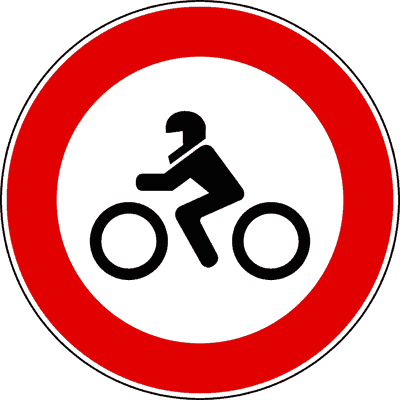
- **📖 الترجمة السياقية:** الإشارة الموضحة تمنع مرور الدراجات النارية.
- **💡 الشرح والقاعدة المرورية:** إشارة "ممنوع مرور الدراجات النارية" (دائرة بيضاء بإطار أحمر ودراجة نارية بفارسها - م 116 لائحة تنفيذية): تمنع سير ودخول الدراجات النارية (motocicli) بكافة فئاتها وسعات محركاتها. العبارة صحيحة.
- **⚠️ كشف الفخ:** vieta il transito ai motocicli: المعنى الأساسي المباشر للإشارة.
- **🔑 الكلمات المفتاحية:** `motocicli (دراجات نارية)` | `segnale di divieto (إشارة منع)`

---

**169.** Il segnale raffigurato consente il transito ai tricicli e ai quadricicli a motore
- **الإجابة:** `VERO ✅ (صح)`
- 
- **📖 الترجمة السياقية:** الإشارة الموضحة تسمح بمرور الدراجات ثلاثية العجلات والرباعية ذات المحرك.
- **💡 الشرح والقاعدة المرورية:** إشارة "ممنوع مرور الدراجات النارية" (دائرة بيضاء بإطار أحمر ودراجة نارية بفارسها - م 116 لائحة تنفيذية): قاعدة ذهبية: التريسيكل والكوادريكولي ليست دراجات نارية عادية ومصرح لها بالمرور. العبارة صحيحة.
- **⚠️ كشف الفخ:** consente ai tricicli e quadricicli: صحيح، التريسيكل والكوادريكولي مسموح بمرورها.
- **🔑 الكلمات المفتاحية:** `motocicli (دراجات نارية)` | `tricicli a motore (دراجات ثلاثية العجلات بمحرك)` | `quadricicli a motore (دراجات رباعية بمحرك)`

---

**170.** Il segnale raffigurato consente il transito alle autovetture
- **الإجابة:** `VERO ✅ (صح)`
- 
- **📖 الترجمة السياقية:** الإشارة الموضحة تسمح بمرور سيارات الركاب.
- **💡 الشرح والقاعدة المرورية:** إشارة "ممنوع مرور الدراجات النارية" (دائرة بيضاء بإطار أحمر ودراجة نارية بفارسها - م 116 لائحة تنفيذية): السيارات والمركبات الآلية الأخرى تمر بحرية تامة دون تقييد. العبارة صحيحة.
- **⚠️ كشف الفخ:** consente alle autovetture: صحيح، السيارات مسموح بها.
- **🔑 الكلمات المفتاحية:** `motocicli (دراجات نارية)` | `autoveicoli (مركبات آلية / سيارات)`

---

**171.** Il segnale raffigurato consente il transito alle biciclette
- **الإجابة:** `VERO ✅ (صح)`
- 
- **📖 الترجمة السياقية:** الإشارة الموضحة تسمح بمرور الدراجات الهوائية.
- **💡 الشرح والقاعدة المرورية:** إشارة "ممنوع مرور الدراجات النارية" (دائرة بيضاء بإطار أحمر ودراجة نارية بفارسها - م 116 لائحة تنفيذية): الدراجات الهوائية لا يشملها منع الدراجات النارية فيحق لها المرور. العبارة صحيحة.
- **⚠️ كشف الفخ:** consente alle biciclette: صحيح، الدراجات الهوائية مسموح بها.
- **🔑 الكلمات المفتاحية:** `motocicli (دراجات نارية)` | `biciclette / velocipedi (دراجات هوائية)`

---

**172.** Il segnale raffigurato vieta il transito ai motocicli di qualsiasi cilindrata
- **الإجابة:** `VERO ✅ (صح)`
- 
- **📖 الترجمة السياقية:** الإشارة الموضحة تمنع مرور الدراجات النارية من أي سعة محرك كانت (سيلندراتا).
- **💡 الشرح والقاعدة المرورية:** إشارة "ممنوع مرور الدراجات النارية" (دائرة بيضاء بإطار أحمر ودراجة نارية بفارسها - م 116 لائحة تنفيذية): الحظر مطلق على الدراجات النارية بصرف النظر عن سعة الأسطوانة (سواء 125 أو 250 أو 1000 سم مكعب). العبارة صحيحة.
- **⚠️ كشف الفخ:** qualsiasi cilindrata: صحيح، المنع يشمل كافة سعات المحرك.
- **🔑 الكلمات المفتاحية:** `motocicli (دراجات نارية)` | `cilindrata (سعة المحرك)`

---

**173.** Il segnale raffigurato consente il transito ai motocicli
- **الإجابة:** `FALSO ❌ (خطأ)`
- 
- **📖 الترجمة السياقية:** الإشارة الموضحة تسمح بمرور الدراجات النارية.
- **💡 الشرح والقاعدة المرورية:** إشارة "ممنوع مرور الدراجات النارية" (دائرة بيضاء بإطار أحمر ودراجة نارية بفارسها - م 116 لائحة تنفيذية): عكس الواقع تماماً؛ فالإشارة وضعت خصيصاً لمنع الدراجات النارية. العبارة خاطئة.
- **⚠️ كشف الفخ:** consente ai motocicli: قلب المعنى، هي تمنعها.
- **🔑 الكلمات المفتاحية:** `motocicli (دراجات نارية)` | `segnale di divieto (إشارة منع)`

---

**174.** Il segnale raffigurato vieta il transito a tutti i veicoli a due ruote
- **الإجابة:** `FALSO ❌ (خطأ)`
- 
- **📖 الترجمة السياقية:** الإشارة الموضحة تمنع المرور على جميع المركبات ذات العجلتين.
- **💡 الشرح والقاعدة المرورية:** إشارة "ممنوع مرور الدراجات النارية" (دائرة بيضاء بإطار أحمر ودراجة نارية بفارسها - م 116 لائحة تنفيذية): لفظ (tutti) خاطئ؛ الدراجات الهوائية والسيبلومات ذات العجلتين يسمح لها بالمرور. العبارة خاطئة.
- **⚠️ كشف الفخ:** tutti i veicoli a due ruote: فخ التعميم؛ الدراجات الهوائية والسيبلومات مستثناة.
- **🔑 الكلمات المفتاحية:** `motocicli (دراجات نارية)` | `due ruote (عجلتين)`

---

**175.** Il segnale raffigurato si riferisce ai soli motocicli di cilindrata superiore ai 125 cm3
- **الإجابة:** `FALSO ❌ (خطأ)`
- 
- **📖 الترجمة السياقية:** الإشارة الموضحة تخص فقط الدراجات النارية التي تفوق سعة محركها 125 سم مكعب.
- **💡 الشرح والقاعدة المرورية:** إشارة "ممنوع مرور الدراجات النارية" (دائرة بيضاء بإطار أحمر ودراجة نارية بفارسها - م 116 لائحة تنفيذية): تسري على كافة الدراجات النارية مهما بلغت سعة محركها دون استثناء للـ 125 سم³. العبارة خاطئة.
- **⚠️ كشف الفخ:** superiore ai 125 cm3: فخ تحديد السعة؛ المنع عام للجميع.
- **🔑 الكلمات المفتاحية:** `motocicli (دراجات نارية)` | `cilindrata (سعة المحرك)`

---

**176.** Il segnale raffigurato consente il transito ai motocicli dotati di cellula di sicurezza
- **الإجابة:** `FALSO ❌ (خطأ)`
- 
- **📖 الترجمة السياقية:** الإشارة الموضحة تسمح بمرور الدراجات النارية المزودة بهيكل حماية أمان (cellula di sicurezza).
- **💡 الشرح والقاعدة المرورية:** إشارة "ممنوع مرور الدراجات النارية" (دائرة بيضاء بإطار أحمر ودراجة نارية بفارسها - م 116 لائحة تنفيذية): المنع يشمل جميع الدراجات النارية دون تمييز لوجود كابينة أو قفص حماية. العبارة خاطئة.
- **⚠️ كشف الفخ:** dotati di cellula di sicurezza: استثناء وهمي باطل.
- **🔑 الكلمات المفتاحية:** `motocicli (دراجات نارية)` | `cellula di sicurezza (هيكل أمان)`

---

**177.** Il segnale raffigurato vieta il transito ai ciclomotori
- **الإجابة:** `FALSO ❌ (خطأ)`
- 
- **📖 الترجمة السياقية:** الإشارة الموضحة تمنع مرور الدراجات الآلية الخفيفة (السيبلومات).
- **💡 الشرح والقاعدة المرورية:** إشارة "ممنوع مرور الدراجات النارية" (دائرة بيضاء بإطار أحمر ودراجة نارية بفارسها - م 116 لائحة تنفيذية): قاعدة مهمة: السيبلومات (ciclomotori) ليست دراجات نارية ومصرح لها بالمرور. العبارة خاطئة.
- **⚠️ كشف الفخ:** vieta ai ciclomotori: فخ؛ السيبلومات مسموح لها بالمرور.
- **🔑 الكلمات المفتاحية:** `motocicli (دراجات نارية)` | `ciclomotori (دراجات آلية خفيفة (سيبلومات))`

---

**178.** Il segnale raffigurato vieta il transito ai quadricicli a motore
- **الإجابة:** `FALSO ❌ (خطأ)`
- 
- **📖 الترجمة السياقية:** الإشارة الموضحة تمنع مرور الدراجات الرباعية ذات المحرك (الكواد).
- **💡 الشرح والقاعدة المرورية:** إشارة "ممنوع مرور الدراجات النارية" (دائرة بيضاء بإطار أحمر ودراجة نارية بفارسها - م 116 لائحة تنفيذية): الكوادريكولي ليست دراجات نارية ويحق لها المرور. العبارة خاطئة.
- **⚠️ كشف الفخ:** vieta ai quadricicli: خطأ، الكوادريكولي مسموح بمرورها.
- **🔑 الكلمات المفتاحية:** `motocicli (دراجات نارية)` | `quadricicli a motore (دراجات رباعية بمحرك)`

---

**179.** Il segnale raffigurato è un segnale di pericolo
- **الإجابة:** `FALSO ❌ (خطأ)`
- 
- **📖 الترجمة السياقية:** الإشارة الموضحة هي إشارة خطر.
- **💡 الشرح والقاعدة المرورية:** إشارة "ممنوع مرور الدراجات النارية" (دائرة بيضاء بإطار أحمر ودراجة نارية بفارسها - م 116 لائحة تنفيذية): الإشارة دائرية بإطار أحمر فهي إشارة منع وليست إشارة خطر مثلثة. العبارة خاطئة.
- **⚠️ كشف الفخ:** segnale di pericolo: خطأ، تصنيفها إشارة منع.
- **🔑 الكلمات المفتاحية:** `motocicli (دراجات نارية)` | `segnale di divieto (إشارة منع)`

---

**180.** Il segnale raffigurato obbliga i motociclisti a servirsi della pista loro riservata
- **الإجابة:** `FALSO ❌ (خطأ)`
- 
- **📖 الترجمة السياقية:** الإشارة الموضحة تُلزم راكبي الدراجات النارية باستخدام مسار مخصص لهم.
- **💡 الشرح والقاعدة المرورية:** إشارة "ممنوع مرور الدراجات النارية" (دائرة بيضاء بإطار أحمر ودراجة نارية بفارسها - م 116 لائحة تنفيذية): الإشارة تمنع المرور ولا تفرض مساراً مخصصاً إجبارياً. العبارة خاطئة.
- **⚠️ كشف الفخ:** pista loro riservata: خلط بين إشارة المنع والمسارات المحجوزة.
- **🔑 الكلمات المفتاحية:** `motocicli (دراجات نارية)` | `pista riservata (مسار مخصص)`

---

## 📌 Veicoli braccia (11 domande)

**181.** Il segnale raffigurato vieta il transito ai veicoli a braccia
- **الإجابة:** `VERO ✅ (صح)`
- 
- **📖 الترجمة السياقية:** الإشارة الموضحة تمنع مرور المركبات التي تدفع باليد (عربات اليد).
- **💡 الشرح والقاعدة المرورية:** إشارة "ممنوع مرور عربات اليد" (دائرة بيضاء بإطار أحمر وشخص يجر عربة - م 116 لائحة تنفيذية): تمنع سير ودخول كافة أنواع عربات اليد والجر اليدوي (veicoli a braccia). العبارة صحيحة.
- **⚠️ كشف الفخ:** vieta veicoli a braccia: المعنى النظامي المباشر للإشارة.
- **🔑 الكلمات المفتاحية:** `veicoli a braccia (عربات اليد)` | `segnale di divieto (إشارة منع)`

---

**182.** Il segnale raffigurato consente il transito delle biciclette
- **الإجابة:** `VERO ✅ (صح)`
- 
- **📖 الترجمة السياقية:** الإشارة الموضحة تسمح بمرور الدراجات الهوائية.
- **💡 الشرح والقاعدة المرورية:** إشارة "ممنوع مرور عربات اليد" (دائرة بيضاء بإطار أحمر وشخص يجر عربة - م 116 لائحة تنفيذية): الدراجات الهوائية ليست عربات يد ومصرح لها بالسير. العبارة صحيحة.
- **⚠️ كشف الفخ:** consente alle biciclette: صحيح، الدراجات الهوائية مسموح بها.
- **🔑 الكلمات المفتاحية:** `veicoli a braccia (عربات اليد)` | `biciclette / velocipedi (دراجات هوائية)`

---

**183.** Il segnale raffigurato consente il transito dei ciclomotori
- **الإجابة:** `VERO ✅ (صح)`
- 
- **📖 الترجمة السياقية:** الإشارة الموضحة تسمح بمرور الدراجات الآلية الصغيرة (السيبلومات).
- **💡 الشرح والقاعدة المرورية:** إشارة "ممنوع مرور عربات اليد" (دائرة بيضاء بإطار أحمر وشخص يجر عربة - م 116 لائحة تنفيذية): المركبات ذات المحرك كالسيبلومات تسير بحرية ولا يمسها منع عربات اليد. العبارة صحيحة.
- **⚠️ كشف الفخ:** consente ai ciclomotori: صحيح، السيبلومات مسموح بها.
- **🔑 الكلمات المفتاحية:** `veicoli a braccia (عربات اليد)` | `ciclomotori (دراجات آلية خفيفة (سيبلومات))`

---

**184.** Il segnale raffigurato consente il transito di autovetture che trainano un carrello-appendice
- **الإجابة:** `VERO ✅ (صح)`
- 
- **📖 الترجمة السياقية:** الإشارة الموضحة تسمح بمرور سيارات الركاب التي تجر مقطورة أمتعة خفيفة.
- **💡 الشرح والقاعدة المرورية:** إشارة "ممنوع مرور عربات اليد" (دائرة بيضاء بإطار أحمر وشخص يجر عربة - م 116 لائحة تنفيذية): السيارات بمقطورة مركبات آلية نظامية ومصرح لها بالمرور. العبارة صحيحة.
- **⚠️ كشف الفخ:** autovetture con carrello-appendice: مسموح بمرورها.
- **🔑 الكلمات المفتاحية:** `veicoli a braccia (عربات اليد)` | `autoveicoli (مركبات آلية / سيارات)`

---

**185.** Il segnale raffigurato vieta il transito di carretti a mano
- **الإجابة:** `VERO ✅ (صح)`
- 
- **📖 الترجمة السياقية:** الإشارة الموضحة تمنع مرور عربات اليد.
- **💡 الشرح والقاعدة المرورية:** إشارة "ممنوع مرور عربات اليد" (دائرة بيضاء بإطار أحمر وشخص يجر عربة - م 116 لائحة تنفيذية): عربات اليد (carretti a mano) هي المعنية بالمنع نصاً وروحاً. العبارة صحيحة.
- **⚠️ كشف الفخ:** vieta carretti a mano: صحيح، عربات اليد ممنوعة.
- **🔑 الكلمات المفتاحية:** `veicoli a braccia (عربات اليد)` | `carretti a mano (عربات يد)`

---

**186.** Il segnale raffigurato indica una strada riservata ai venditori ambulanti
- **الإجابة:** `FALSO ❌ (خطأ)`
- 
- **📖 الترجمة السياقية:** الإشارة الموضحة تدل على طريق مخصص للباعة الجائلين.
- **💡 الشرح والقاعدة المرورية:** إشارة "ممنوع مرور عربات اليد" (دائرة بيضاء بإطار أحمر وشخص يجر عربة - م 116 لائحة تنفيذية): لا صلة للإشارة بالباعة المتجولين، بل هي إشارة منع سير لعربات اليد. العبارة خاطئة.
- **⚠️ كشف الفخ:** strada per venditori ambulanti: خلط لا صلة له بالإشارة.
- **🔑 الكلمات المفتاحية:** `veicoli a braccia (عربات اليد)` | `venditori ambulanti (باعة جائلون)`

---

**187.** Il segnale raffigurato vieta il transito dei veicoli a motore durante le ore di mercato
- **الإجابة:** `FALSO ❌ (خطأ)`
- 
- **📖 الترجمة السياقية:** الإشارة الموضحة تمنع مرور المركبات ذات المحرك خلال ساعات إقامة السوق.
- **💡 الشرح والقاعدة المرورية:** إشارة "ممنوع مرور عربات اليد" (دائرة بيضاء بإطار أحمر وشخص يجر عربة - م 116 لائحة تنفيذية): لا تمنع المركبات الآلية، بل تمنع فقط عربات اليد. العبارة خاطئة.
- **⚠️ كشف الفخ:** vieta veicoli a motore: خطأ، المركبات الآلية مصرح بها.
- **🔑 الكلمات المفتاحية:** `veicoli a braccia (عربات اليد)` | `autoveicoli (مركبات آلية / سيارات)`

---

**188.** Il segnale raffigurato è un segnale di pericolo
- **الإجابة:** `FALSO ❌ (خطأ)`
- 
- **📖 الترجمة السياقية:** الإشارة الموضحة هي إشارة خطر.
- **💡 الشرح والقاعدة المرورية:** إشارة "ممنوع مرور عربات اليد" (دائرة بيضاء بإطار أحمر وشخص يجر عربة - م 116 لائحة تنفيذية): هي إشارة منع (divieto) دائرية بإطار أحمر وليست إشارة خطر. العبارة خاطئة.
- **⚠️ كشف الفخ:** segnale di pericolo: خطأ، تصنيفها منع.
- **🔑 الكلمات المفتاحية:** `veicoli a braccia (عربات اليد)` | `segnale di divieto (إشارة منع)`

---

**189.** Il segnale raffigurato vale, per tutti i veicoli, durante le ore di mercato
- **الإجابة:** `FALSO ❌ (خطأ)`
- 
- **📖 الترجمة السياقية:** تسري الإشارة الموضحة على جميع المركبات خلال ساعات إقامة السوق.
- **💡 الشرح والقاعدة المرورية:** إشارة "ممنوع مرور عربات اليد" (دائرة بيضاء بإطار أحمر وشخص يجر عربة - م 116 لائحة تنفيذية): المنع يخص عربات اليد فقط، ويسري بشكل دائم وليس في ساعات السوق فقط. العبارة خاطئة.
- **⚠️ كشف الفخ:** durante le ore di mercato: فخ ساعات السوق.
- **🔑 الكلمات المفتاحية:** `veicoli a braccia (عربات اليد)` | `mercato (سوق)`

---

**190.** Il segnale raffigurato vieta il transito di veicoli a trazione animale
- **الإجابة:** `FALSO ❌ (خطأ)`
- 
- **📖 الترجمة السياقية:** الإشارة الموضحة تمنع مرور المركبات التي تجرها حيوانات.
- **💡 الشرح والقاعدة المرورية:** إشارة "ممنوع مرور عربات اليد" (دائرة بيضاء بإطار أحمر وشخص يجر عربة - م 116 لائحة تنفيذية): الجر بالحيوانات له إشارته المستقلة الخاصة (رسم الحصان والعربة)، ولا تدل عليه هذه الإشارة. العبارة خاطئة.
- **⚠️ كشف الفخ:** vieta veicoli a trazione animale: خلط بين عربات اليد وعربات الجر الحيواني.
- **🔑 الكلمات المفتاحية:** `veicoli a braccia (عربات اليد)` | `trazione animale (جر حيواني)`

---

**191.** Il segnale raffigurato vieta il transito ad un motociclo, anche se spinto a braccia
- **الإجابة:** `FALSO ❌ (خطأ)`
- 
- **📖 الترجمة السياقية:** الإشارة الموضحة تمنع مرور دراجة نارية حتى لو قيدت ودُفعت باليد.
- **💡 الشرح والقاعدة المرورية:** إشارة "ممنوع مرور عربات اليد" (دائرة بيضاء بإطار أحمر وشخص يجر عربة - م 116 لائحة تنفيذية): الدراجة النارية ليست عربة يد، والشخص الذي يجر دراجته باليد يُعامل كترجل ومشاة. العبارة خاطئة.
- **⚠️ كشف الفخ:** motociclo spinto a braccia: خطأ، لا ينطبق عليها منع عربات اليد.
- **🔑 الكلمات المفتاحية:** `veicoli a braccia (عربات اليد)` | `motocicli (دراجات نارية)`

---

## 📌 Divieto transito autoveicoli (12 domande)

**192.** Il segnale raffigurato vieta il transito a tutti gli autoveicoli
- **الإجابة:** `VERO ✅ (صح)`
- 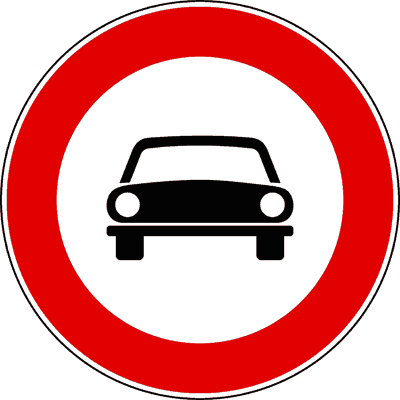
- **📖 الترجمة السياقية:** الإشارة الموضحة تمنع المرور على جميع المركبات الآلية (السيارات والشاحنات والحافلات).
- **💡 الشرح والقاعدة المرورية:** إشارة "ممنوع مرور جميع المركبات الآلية ذات 3 و4 عجلات" (دائرة بيضاء بإطار أحمر وسيارة ودراجة - م 116 لائحة تنفيذية): تمنع سير كافة أصناف المركبات الآلية ذات 4 عجلات فأكثر (autoveicoli). العبارة صحيحة.
- **⚠️ كشف الفخ:** vieta a tutti gli autoveicoli: المعنى الأساسي المباشر للإشارة.
- **🔑 الكلمات المفتاحية:** `autoveicoli (مركبات آلية / سيارات)` | `segnale di divieto (إشارة منع)`

---

**193.** Il segnale raffigurato vieta il transito ai tricicli a motore
- **الإجابة:** `VERO ✅ (صح)`
- 
- **📖 الترجمة السياقية:** الإشارة الموضحة تمنع مرور الدراجات ثلاثية العجلات ذات المحرك (التريسيكل).
- **💡 الشرح والقاعدة المرورية:** إشارة "ممنوع مرور جميع المركبات الآلية ذات 3 و4 عجلات" (دائرة بيضاء بإطار أحمر وسيارة ودراجة - م 116 لائحة تنفيذية): قاعدة قطعية: تشمل حظر المركبات الآلية ذات 3 عجلات (tricicli a motore). العبارة صحيحة.
- **⚠️ كشف الفخ:** vieta ai tricicli a motore: التريسيكل مشمول بالمنع صراحة.
- **🔑 الكلمات المفتاحية:** `autoveicoli (مركبات آلية / سيارات)` | `tricicli a motore (دراجات ثلاثية العجلات بمحرك)`

---

**194.** In presenza del segnale raffigurato è permesso il transito ai motocicli
- **الإجابة:** `VERO ✅ (صح)`
- 
- **📖 الترجمة السياقية:** في وجود الإشارة الموضحة، يُسمح بمرور الدراجات النارية ذات العجلتين.
- **💡 الشرح والقاعدة المرورية:** إشارة "ممنوع مرور جميع المركبات الآلية ذات 3 و4 عجلات" (دائرة بيضاء بإطار أحمر وسيارة ودراجة - م 116 لائحة تنفيذية): الدراجات النارية ذات العجلتين (motocicli) مستثناة ويسمح لها بالمرور في هذا الشارع! العبارة صحيحة.
- **⚠️ كشف الفخ:** permesso il transito ai motocicli: استثناء مهم جداً؛ الدراجات النارية ذات العجلتين مسموح بها.
- **🔑 الكلمات المفتاحية:** `autoveicoli (مركبات آلية / سيارات)` | `motocicli (دراجات نارية)`

---

**195.** In presenza del segnale raffigurato è permesso il transito ai ciclomotori a due ruote
- **الإجابة:** `VERO ✅ (صح)`
- 
- **📖 الترجمة السياقية:** في وجود الإشارة الموضحة، يُسمح بمرور الدراجات الآلية الخفيفة ذات العجلتين (السيبلومات).
- **💡 الشرح والقاعدة المرورية:** إشارة "ممنوع مرور جميع المركبات الآلية ذات 3 و4 عجلات" (دائرة بيضاء بإطار أحمر وسيارة ودراجة - م 116 لائحة تنفيذية): السيبلومات ذات العجلتين يسمح لها بالمرور ولا يشملها الحظر. العبارة صحيحة.
- **⚠️ كشف الفخ:** ciclomotori a due ruote: مسموح بمرورها.
- **🔑 الكلمات المفتاحية:** `autoveicoli (مركبات آلية / سيارات)` | `ciclomotori (دراجات آلية خفيفة (سيبلومات))`

---

**196.** Il segnale raffigurato vieta il transito ai quadricicli a motore
- **الإجابة:** `VERO ✅ (صح)`
- 
- **📖 الترجمة السياقية:** الإشارة الموضحة تمنع مرور الدراجات الرباعية ذات المحرك (الكواد).
- **💡 الشرح والقاعدة المرورية:** إشارة "ممنوع مرور جميع المركبات الآلية ذات 3 و4 عجلات" (دائرة بيضاء بإطار أحمر وسيارة ودراجة - م 116 لائحة تنفيذية): الدراجات الرباعية الآلية (quadricicli a motore) مركبات ذات 4 عجلات ويشملها المنع قطعاً. العبارة صحيحة.
- **⚠️ كشف الفخ:** vieta ai quadricicli a motore: الكوادريكولي مشمولة بالمنع.
- **🔑 الكلمات المفتاحية:** `autoveicoli (مركبات آلية / سيارات)` | `quadricicli a motore (دراجات رباعية بمحرك)`

---

**197.** In presenza del segnale raffigurato è permesso il transito ai veicoli sprovvisti di motore
- **الإجابة:** `VERO ✅ (صح)`
- 
- **📖 الترجمة السياقية:** في وجود الإشارة الموضحة، يُسمح بمرور المركبات غير المزودة بمحرك.
- **💡 الشرح والقاعدة المرورية:** إشارة "ممنوع مرور جميع المركبات الآلية ذات 3 و4 عجلات" (دائرة بيضاء بإطار أحمر وسيارة ودراجة - م 116 لائحة تنفيذية): الدراجات الهوائية والعربات غير الآلية والمشاة مصرح لهم بالمرور دون مانع. العبارة صحيحة.
- **⚠️ كشف الفخ:** permesso a veicoli senza motore: صحيح، المركبات غير الآلية مسموح بها.
- **🔑 الكلمات المفتاحية:** `autoveicoli (مركبات آلية / سيارات)` | `senza motore (بدون محرك)`

---

**198.** In presenza del segnale raffigurato è permesso il transito ai quadricicli a motore
- **الإجابة:** `FALSO ❌ (خطأ)`
- 
- **📖 الترجمة السياقية:** في وجود الإشارة الموضحة، يُسمح بمرور الدراجات الرباعية ذات المحرك (الكواد).
- **💡 الشرح والقاعدة المرورية:** إشارة "ممنوع مرور جميع المركبات الآلية ذات 3 و4 عجلات" (دائرة بيضاء بإطار أحمر وسيارة ودراجة - م 116 لائحة تنفيذية): الكوادريكولي ذات 4 عجلات ومشمولة بالمنع، فلا يسمح لها بالمرور. العبارة خاطئة.
- **⚠️ كشف الفخ:** permesso ai quadricicli: خطأ، الكوادريكولي ممنوعة تماماً.
- **🔑 الكلمات المفتاحية:** `autoveicoli (مركبات آلية / سيارات)` | `quadricicli a motore (دراجات رباعية بمحرك)`

---

**199.** Il segnale raffigurato vieta il transito alle sole autovetture non catalizzate
- **الإجابة:** `FALSO ❌ (خطأ)`
- 
- **📖 الترجمة السياقية:** الإشارة الموضحة تمنع المرور فقط على سيارات الركاب غير المزودة بمحول حفاز (غير المفلترة).
- **💡 الشرح والقاعدة المرورية:** إشارة "ممنوع مرور جميع المركبات الآلية ذات 3 و4 عجلات" (دائرة بيضاء بإطار أحمر وسيارة ودراجة - م 116 لائحة تنفيذية): المنع شامل وعام لكافة السيارات ولا يقتصر على نوع الوقود أو المحول الحفاز (catalizzate). العبارة خاطئة.
- **⚠️ كشف الفخ:** sole autovetture non catalizzate: حصر باطل؛ المنع عام للجميع.
- **🔑 الكلمات المفتاحية:** `autoveicoli (مركبات آلية / سيارات)` | `non catalizzate (غير مفلترة)`

---

**200.** In presenza del segnale raffigurato è consentito il transito alle autovetture adibite al servizio di taxi
- **الإجابة:** `FALSO ❌ (خطأ)`
- 
- **📖 الترجمة السياقية:** في وجود الإشارة الموضحة، يُسمح بمرور سيارات الركاب المخصصة لخدمة التاكسي.
- **💡 الشرح والقاعدة المرورية:** إشارة "ممنوع مرور جميع المركبات الآلية ذات 3 و4 عجلات" (دائرة بيضاء بإطار أحمر وسيارة ودراجة - م 116 لائحة تنفيذية): سيارات التاكسي من فئة autovetture ويسري عليها منع المرور كغيرها من السيارات. العبارة خاطئة.
- **⚠️ كشف الفخ:** consentito ai taxi: خطأ، التاكسي ممنوع من المرور كباقي السيارات.
- **🔑 الكلمات المفتاحية:** `autoveicoli (مركبات آلية / سيارات)` | `taxi (سيارات أجرة)`

---

**201.** In presenza del segnale raffigurato è permesso il transito a tutti i tricicli a motore
- **الإجابة:** `FALSO ❌ (خطأ)`
- 
- **📖 الترجمة السياقية:** في وجود الإشارة الموضحة، يُسمح بمرور جميع الدراجات ثلاثية العجلات ذات المحرك (التريسيكل).
- **💡 الشرح والقاعدة المرورية:** إشارة "ممنوع مرور جميع المركبات الآلية ذات 3 و4 عجلات" (دائرة بيضاء بإطار أحمر وسيارة ودراجة - م 116 لائحة تنفيذية): التريسيكل (tricicli a motore) مشمولة بحظر المرور تماماً ويُمنع دخولها. العبارة خاطئة.
- **⚠️ كشف الفخ:** permesso ai tricicli: خطأ، التريسيكل ممنوعة من المرور.
- **🔑 الكلمات المفتاحية:** `tricicli a motore (دراجات ثلاثية العجلات بمحرك)` | `segnale di divieto (إشارة منع)`

---

**202.** In presenza del segnale raffigurato è consentito il transito agli autobus
- **الإجابة:** `FALSO ❌ (خطأ)`
- 
- **📖 الترجمة السياقية:** في وجود الإشارة الموضحة، يُسمح بمرور حافلات الركاب (الأتوبيسات).
- **💡 الشرح والقاعدة المرورية:** إشارة "ممنوع مرور جميع المركبات الآلية ذات 3 و4 عجلات" (دائرة بيضاء بإطار أحمر وسيارة ودراجة - م 116 لائحة تنفيذية): الحافلات مركبات آلية (autoveicoli) وتسري عليها لافتة حظر المرور كلياً. العبارة خاطئة.
- **⚠️ كشف الفخ:** consentito agli autobus: خطأ، الحافلات ممنوعة من المرور.
- **🔑 الكلمات المفتاحية:** `autobus (حافلات نقل ركاب)` | `autovetture (سيارات ركاب)` | `segnale di divieto (إشارة منع)`

---

**203.** In presenza del segnale raffigurato è consentito il transito agli autocarri
- **الإجابة:** `FALSO ❌ (خطأ)`
- 
- **📖 الترجمة السياقية:** في وجود الإشارة الموضحة، يُسمح بمرور شاحنات نقل البضائع.
- **💡 الشرح والقاعدة المرورية:** إشارة "ممنوع مرور جميع المركبات الآلية ذات 3 و4 عجلات" (دائرة بيضاء بإطار أحمر وسيارة ودراجة - م 116 لائحة تنفيذية): الشاحنات من فئة المركبات الآلية المشمولة بالمنع المطلق. العبارة خاطئة.
- **⚠️ كشف الفخ:** consentito agli autocarri: خطأ، الشاحنات محظورة من المرور.
- **🔑 الكلمات المفتاحية:** `autocarri (شاحنات نقل بضائع)` | `autovetture (سيارات ركاب)` | `segnale di divieto (إشارة منع)`

---

## 📌 Divieto transito autobus (12 domande)

**204.** Il segnale raffigurato indica il divieto di transito agli autobus
- **الإجابة:** `VERO ✅ (صح)`
- 
- **📖 الترجمة السياقية:** الإشارة الموضحة تدل على منع مرور الحافلات.
- **💡 الشرح والقاعدة المرورية:** إشارة "ممنوع مرور الحافلات" (دائرة بيضاء بإطار أحمر ورسم أوتوبيس - م 116 لائحة تنفيذية): تمنع مرور كافة أنواع وفئات الحافلات المخصصة لنقل الركاب (autobus). العبارة صحيحة.
- **⚠️ كشف الفخ:** divieto di transito agli autobus: المعنى الأساسي للإشارة.
- **🔑 الكلمات المفتاحية:** `autobus (حافلات نقل ركاب)` | `segnale di divieto (إشارة منع)`

---

**205.** In presenza del segnale raffigurato è consentito il transito alle autovetture
- **الإجابة:** `VERO ✅ (صح)`
- 
- **📖 الترجمة السياقية:** في وجود الإشارة الموضحة، يُسمح بمرور سيارات الركاب العادية.
- **💡 الشرح والقاعدة المرورية:** إشارة "ممنوع مرور الحافلات" (دائرة بيضاء بإطار أحمر ورسم أوتوبيس - م 116 لائحة تنفيذية): المنع مقصور على الحافلات، وتسير السيارات الخاصة بحرية تامة. العبارة صحيحة.
- **⚠️ كشف الفخ:** consente alle autovetture: صحيح، السيارات الخاصة مسموح بها.
- **🔑 الكلمات المفتاحية:** `autobus (حافلات نقل ركاب)` | `autovetture (سيارات ركاب)`

---

**206.** In presenza del segnale raffigurato è consentito il transito agli autocarri
- **الإجابة:** `VERO ✅ (صح)`
- 
- **📖 الترجمة السياقية:** في وجود الإشارة الموضحة، يُسمح بمرور شاحنات نقل البضائع.
- **💡 الشرح والقاعدة المرورية:** إشارة "ممنوع مرور الحافلات" (دائرة بيضاء بإطار أحمر ورسم أوتوبيس - م 116 لائحة تنفيذية): الشاحنات مركبات لنقل الأشياء ولا يمسها منع الحافلات المخصصة لنقل الركاب. العبارة صحيحة.
- **⚠️ كشف الفخ:** consente agli autocarri: صحيح، الشاحنات مسموح بمرورها.
- **🔑 الكلمات المفتاحية:** `autobus (حافلات نقل ركاب)` | `autocarri (شاحنات نقل بضائع)`

---

**207.** In presenza del segnale raffigurato è consentito il transito ai motocicli
- **الإجابة:** `VERO ✅ (صح)`
- 
- **📖 الترجمة السياقية:** في وجود الإشارة الموضحة، يُسمح بمرور الدراجات النارية.
- **💡 الشرح والقاعدة المرورية:** إشارة "ممنوع مرور الحافلات" (دائرة بيضاء بإطار أحمر ورسم أوتوبيس - م 116 لائحة تنفيذية): الدراجات النارية مصرح لها بالمرور دون أي مانع. العبارة صحيحة.
- **⚠️ كشف الفخ:** consente ai motocicli: صحيح، الدراجات النارية مسموح بها.
- **🔑 الكلمات المفتاحية:** `autobus (حافلات نقل ركاب)` | `motocicli (دراجات نارية)`

---

**208.** In presenza del segnale raffigurato è consentito il transito alle autocaravan
- **الإجابة:** `VERO ✅ (صح)`
- 
- **📖 الترجمة السياقية:** في وجود الإشارة الموضحة، يُسمح بمرور الكرفانات السكنية المتنقلة (autocaravan).
- **💡 الشرح والقاعدة المرورية:** إشارة "ممنوع مرور الحافلات" (دائرة بيضاء بإطار أحمر ورسم أوتوبيس - م 116 لائحة تنفيذية): قاعدة ذهبية: الكرفان السكني (autocaravan) ليس حافلة (autobus) ويحق له المرور والسير نظاماً! العبارة صحيحة.
- **⚠️ كشف الفخ:** consente alle autocaravan: الكرفان ليس حافلة ولا يمنعه هذا الرمز.
- **🔑 الكلمات المفتاحية:** `autobus (حافلات نقل ركاب)` | `autocaravan (كرفان سكني متنقل)`

---

**209.** Il segnale raffigurato vieta il transito anche agli autobus di massa a pieno carico inferiore a 3,5 tonnellate
- **الإجابة:** `VERO ✅ (صح)`
- 
- **📖 الترجمة السياقية:** الإشارة الموضحة تمنع مرور الحافلات حتى لو كانت كتلتها بحمولة كاملة تقل عن 3.5 طن.
- **💡 الشرح والقاعدة المرورية:** إشارة "ممنوع مرور الحافلات" (دائرة بيضاء بإطار أحمر ورسم أوتوبيس - م 116 لائحة تنفيذية): المنع عام وشامل لكافة الحافلات بما فيها الميكروباصات والحافلات الصغيرة أياً كان وزنها. العبارة صحيحة.
- **⚠️ كشف الفخ:** anche autobus sotto 3,5 t: المنع يسري على الحافلات مهما صغر وزنها.
- **🔑 الكلمات المفتاحية:** `autobus (حافلات نقل ركاب)` | `massa (وزن/كتلة)`

---

**210.** In presenza del segnale raffigurato è consentito il transito agli autobus turistici
- **الإجابة:** `FALSO ❌ (خطأ)`
- 
- **📖 الترجمة السياقية:** في وجود الإشارة الموضحة، يُسمح بمرور الحافلات السياحية.
- **💡 الشرح والقاعدة المرورية:** إشارة "ممنوع مرور الحافلات" (دائرة بيضاء بإطار أحمر ورسم أوتوبيس - م 116 لائحة تنفيذية): الحافلات السياحية تندرج تحت فئة الحافلات وممنوعة من المرور كغيرها. العبارة خاطئة.
- **⚠️ كشف الفخ:** consente agli autobus turistici: الحافلات السياحية ممنوعة أيضاً.
- **🔑 الكلمات المفتاحية:** `autobus (حافلات نقل ركاب)` | `autobus turistici (حافلات سياحية)`

---

**211.** Il segnale raffigurato segnala una corsia riservata agli autobus
- **الإجابة:** `FALSO ❌ (خطأ)`
- 
- **📖 الترجمة السياقية:** الإشارة الموضحة تدل على مسار مخصص للحافلات.
- **💡 الشرح والقاعدة المرورية:** إشارة "ممنوع مرور الحافلات" (دائرة بيضاء بإطار أحمر ورسم أوتوبيس - م 116 لائحة تنفيذية): الإشارة للمنع (إطار أحمر) وليست حارة مخصصة أو محجوزة (علامة زرقاء). العبارة خاطئة.
- **⚠️ كشف الفخ:** corsia riservata: خلط بين إشارة المنع والمسار المخصص.
- **🔑 الكلمات المفتاحية:** `autobus (حافلات نقل ركاب)` | `corsia riservata (مسار مخصص)`

---

**212.** Il segnale raffigurato preannuncia un'area di sosta per autobus turistici
- **الإجابة:** `FALSO ❌ (خطأ)`
- 
- **📖 الترجمة السياقية:** الإشارة الموضحة تُنذر بموقف انتظار مخصص للحافلات السياحية.
- **💡 الشرح والقاعدة المرورية:** إشارة "ممنوع مرور الحافلات" (دائرة بيضاء بإطار أحمر ورسم أوتوبيس - م 116 لائحة تنفيذية): لا صلة للإشارة بمواقف السيارات، بل هي حظر صريح للمرور. العبارة خاطئة.
- **⚠️ كشف الفخ:** area di sosta per autobus: خلط مع لافتات مواقف الانتظار.
- **🔑 الكلمات المفتاحية:** `autobus (حافلات نقل ركاب)` | `area di sosta (موقف انتظار)`

---

**213.** In presenza del segnale raffigurato è consentito il transito agli scuolabus
- **الإجابة:** `FALSO ❌ (خطأ)`
- 
- **📖 الترجمة السياقية:** في وجود الإشارة الموضحة، يُسمح بمرور حافلات المدارس (scuolabus).
- **💡 الشرح والقاعدة المرورية:** إشارة "ممنوع مرور الحافلات" (دائرة بيضاء بإطار أحمر ورسم أوتوبيس - م 116 لائحة تنفيذية): حافلات المدارس من فئة الحافلات ومشمولة بالمنع العام إلا بوجود لوحة استثناء رسمية. العبارة خاطئة.
- **⚠️ كشف الفخ:** consente agli scuolabus: حافلات المدارس تخضع للمنع كالحافلات الأخرى.
- **🔑 الكلمات المفتاحية:** `autobus (حافلات نقل ركاب)` | `scuolabus (حافلات مدارس)`

---

**214.** Il segnale raffigurato vieta il transito alle autocaravan
- **الإجابة:** `FALSO ❌ (خطأ)`
- 
- **📖 الترجمة السياقية:** الإشارة الموضحة تمنع مرور الكرفانات السكنية المتنقلة.
- **💡 الشرح والقاعدة المرورية:** إشارة "ممنوع مرور الحافلات" (دائرة بيضاء بإطار أحمر ورسم أوتوبيس - م 116 لائحة تنفيذية): الكرفانات السكنية مسموح بمرورها ولا يشملها منع الحافلات إطلاقاً. العبارة خاطئة.
- **⚠️ كشف الفخ:** vieta alle autocaravan: فخ؛ الكرفانات السكنية مسموح بها.
- **🔑 الكلمات المفتاحية:** `autobus (حافلات نقل ركاب)` | `autocaravan (كرفان سكني متنقل)`

---

**215.** Il segnale raffigurato è valido solo nei giorni feriali
- **الإجابة:** `FALSO ❌ (خطأ)`
- 
- **📖 الترجمة السياقية:** الإشارة الموضحة تسري فقط في أيام العمل الأسبوعية (أيام الفيريا).
- **💡 الشرح والقاعدة المرورية:** إشارة "ممنوع مرور الحافلات" (دائرة بيضاء بإطار أحمر ورسم أوتوبيس - م 116 لائحة تنفيذية): المنع دائم طوال أيام الأسبوع والعطلات الرسمية على مدار 24 ساعة. العبارة خاطئة.
- **⚠️ كشف الفخ:** solo nei giorni feriali: المنع دائم ولا يقتصر على أيام العمل.
- **🔑 الكلمات المفتاحية:** `autobus (حافلات نقل ركاب)` | `giorni feriali (أيام العمل)`

---

## 📌 Transito mezzi pesanti (9 domande)

**216.** Il segnale raffigurato vieta il transito ai veicoli adibiti al trasporto di cose con massa a pieno carico superiore a 3,5 tonnellate
- **الإجابة:** `VERO ✅ (صح)`
- 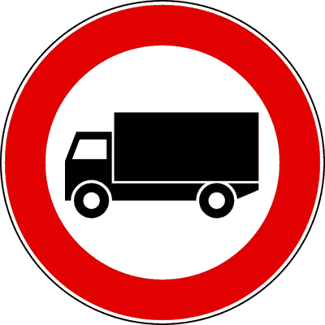
- **📖 الترجمة السياقية:** الإشارة الموضحة تمنع مرور المركبات المخصصة لنقل البضائع التي تزيد كتلتها بحمولة كاملة عن 3.5 طن.
- **💡 الشرح والقاعدة المرورية:** إشارة "ممنوع مرور شاحنات نقل البضائع التي تزيد عن 3.5 طن" (دائرة بيضاء بإطار أحمر ورسم شاحنة - م 116 لائحة تنفيذية): عدم وجود رقم داخل الشاحنة يعني أن الحد القانوني التلقائي هو 3.5 طن لمركبات نقل البضائع. العبارة صحيحة.
- **⚠️ كشف الفخ:** trasporto cose superiore a 3,5 tonnellate: المعنى النظامي المعتمد.
- **🔑 الكلمات المفتاحية:** `autocarri (شاحنات نقل بضائع)` | `trasporto cose (نقل بضائع)` | `segnale di divieto (إشارة منع)`

---

**217.** In presenza del segnale raffigurato è consentito il transito di autobus di massa complessiva superiore a 3,5 tonnellate
- **الإجابة:** `VERO ✅ (صح)`
- 
- **📖 الترجمة السياقية:** في وجود الإشارة الموضحة، يُسمح بمرور حافلات الركاب التي تزيد كتلتها عن 3.5 طن.
- **💡 الشرح والقاعدة المرورية:** إشارة "ممنوع مرور شاحنات نقل البضائع التي تزيد عن 3.5 طن" (دائرة بيضاء بإطار أحمر ورسم شاحنة - م 116 لائحة تنفيذية): قاعدة جوهرية: الحافلات مخصصة لنقل الأشخاص ولا يمسها حظر شاحنات نقل البضائع نهائياً! العبارة صحيحة.
- **⚠️ كشف الفخ:** consente il transito di autobus: الحافلات مخصصة لنقل الأشخاص ومستثناة تماماً.
- **🔑 الكلمات المفتاحية:** `autocarri (شاحنات نقل بضائع)` | `autobus (حافلات نقل ركاب)` | `trasporto persone (نقل أشخاص)`

---

**218.** In presenza del segnale raffigurato è consentito il transito di un'autocaravan di massa a pieno carico superiore a 3,5 tonnellate
- **الإجابة:** `VERO ✅ (صح)`
- 
- **📖 الترجمة السياقية:** في وجود الإشارة الموضحة، يُسمح بمرور كرفان سكني متنقل كتلته تزيد عن 3.5 طن.
- **💡 الشرح والقاعدة المرورية:** إشارة "ممنوع مرور شاحنات نقل البضائع التي تزيد عن 3.5 طن" (دائرة بيضاء بإطار أحمر ورسم شاحنة - م 116 لائحة تنفيذية): الكرفان السكني مخصص لنقل وإقامة الأشخاص، فلا يسري عليه منع شاحنات البضائع. العبارة صحيحة.
- **⚠️ كشف الفخ:** consente ad autocaravan: الكرفان لنقل الأشخاص ومستثنى من المنع.
- **🔑 الكلمات المفتاحية:** `autocarri (شاحنات نقل بضائع)` | `autocaravan (كرفان سكني متنقل)`

---

**219.** Il segnale raffigurato può essere munito di pannello integrativo con un diverso valore della massa ammessa al transito
- **الإجابة:** `VERO ✅ (صح)`
- 
- **📖 الترجمة السياقية:** الإشارة الموضحة يمكن تزويدها بلوحة إضافية تحمل قيمة مختلفة للكتلة المسموح لها بالمرور.
- **💡 الشرح والقاعدة المرورية:** إشارة "ممنوع مرور شاحنات نقل البضائع التي تزيد عن 3.5 طن" (دائرة بيضاء بإطار أحمر ورسم شاحنة - م 116 لائحة تنفيذية): يجوز وضع لوحة تحدد وزناً مختلفاً (كالمنع فوق 5 أو 7.5 طن) حسب قدرة تحمل الطريق. العبارة صحيحة.
- **⚠️ كشف الفخ:** pannello con diverso valore: صحيح، يجوز تعديل الوزن بلوحة تكميلية.
- **🔑 الكلمات المفتاحية:** `autocarri (شاحنات نقل بضائع)` | `pannello integrativo (لوحة إضافية)`

---

**220.** Il segnale raffigurato vieta il transito di un autocarro di massa a pieno carico pari a 3 tonnellate
- **الإجابة:** `FALSO ❌ (خطأ)`
- 
- **📖 الترجمة السياقية:** الإشارة الموضحة تمنع مرور شاحنة بضائع كتلتها الإجمالية 3 أطنان.
- **💡 الشرح والقاعدة المرورية:** إشارة "ممنوع مرور شاحنات نقل البضائع التي تزيد عن 3.5 طن" (دائرة بيضاء بإطار أحمر ورسم شاحنة - م 116 لائحة تنفيذية): كتلة 3 أطنان لا تتجاوز الحد الأدنى للمنع (3.5 طن)، فيحق لها المرور بحرية. العبارة خاطئة.
- **⚠️ كشف الفخ:** vieta autocarro di 3 tonnellate: خطأ، الشاحنات حتى 3.5 طن مسموح بمرورها.
- **🔑 الكلمات المفتاحية:** `autocarri (شاحنات نقل بضائع)` | `massa (وزن/كتلة)`

---

**221.** Il segnale raffigurato vieta il transito a tutti gli autocarri carrozzati con furgone chiuso
- **الإجابة:** `FALSO ❌ (خطأ)`
- 
- **📖 الترجمة السياقية:** الإشارة الموضحة تمنع المرور على جميع الشاحنات ذات الصندوق المغلق (الفان).
- **💡 الشرح والقاعدة المرورية:** إشارة "ممنوع مرور شاحنات نقل البضائع التي تزيد عن 3.5 طن" (دائرة بيضاء بإطار أحمر ورسم شاحنة - م 116 لائحة تنفيذية): المعيار هو الوزن الإجمالي (> 3.5 طن) وليس شكل هيكل الصندوق مغلقاً أو مفتوحاً. العبارة خاطئة.
- **⚠️ كشف الفخ:** tutti gli autocarri con furgone chiuso: شكل الصندوق المغلق لا يحدد المنع بل الوزن.
- **🔑 الكلمات المفتاحية:** `autocarri (شاحنات نقل بضائع)` | `furgone chiuso (صندوق مغلق)`

---

**222.** In presenza del segnale raffigurato è consentito il transito a tutti gli autocarri carrozzati con cassone aperto
- **الإجابة:** `FALSO ❌ (خطأ)`
- 
- **📖 الترجمة السياقية:** في وجود الإشارة الموضحة، يُسمح بالمرور لجميع الشاحنات ذات الصندوق المفتوح.
- **💡 الشرح والقاعدة المرورية:** إشارة "ممنوع مرور شاحنات نقل البضائع التي تزيد عن 3.5 طن" (دائرة بيضاء بإطار أحمر ورسم شاحنة - م 116 لائحة تنفيذية): الشاحنات ذات الصندوق المفتوح إذا زاد وزنها عن 3.5 طن تُمنع من المرور كغيرها. العبارة خاطئة.
- **⚠️ كشف الفخ:** tutti gli autocarri con cassone aperto: خطأ، إذا تجاوزت 3.5 طن فهي ممنوعة.
- **🔑 الكلمات المفتاحية:** `autocarri (شاحنات نقل بضائع)` | `cassone aperto (صندوق مفتوح)`

---

**223.** Il segnale raffigurato vieta il transito ai veicoli di massa superiore a 3,5 tonnellate destinati al trasporto di persone
- **الإجابة:** `FALSO ❌ (خطأ)`
- 
- **📖 الترجمة السياقية:** الإشارة الموضحة تمنع مرور المركبات التي تزيد كتلتها عن 3.5 طن والمخصصة لنقل الأشخاص.
- **💡 الشرح والقاعدة المرورية:** إشارة "ممنوع مرور شاحنات نقل البضائع التي تزيد عن 3.5 طن" (دائرة بيضاء بإطار أحمر ورسم شاحنة - م 116 لائحة تنفيذية): المركبات المخصصة لنقل الأشخاص كالحافلات مستثناة ويسمح لها بالمرور. العبارة خاطئة.
- **⚠️ كشف الفخ:** destinati al trasporto di persone: خطأ، المنع لنقل البضائع فقط.
- **🔑 الكلمات المفتاحية:** `autocarri (شاحنات نقل بضائع)` | `trasporto persone (نقل أشخاص)`

---

**224.** In presenza del segnale raffigurato è consentito il transito agli autotreni di massa superiore a 3,5 tonnellate non adibiti al trasporto di persone
- **الإجابة:** `FALSO ❌ (خطأ)`
- 
- **📖 الترجمة السياقية:** في وجود الإشارة الموضحة، يُسمح بمرور الشاحنات ذات المقطورة التي تزيد كتلتها عن 3.5 طن وغير المخصصة لنقل الأشخاص.
- **💡 الشرح والقاعدة المرورية:** إشارة "ممنوع مرور شاحنات نقل البضائع التي تزيد عن 3.5 طن" (دائرة بيضاء بإطار أحمر ورسم شاحنة - م 116 لائحة تنفيذية): شاحنات المقطورة لنقل البضائع التي تزيد عن 3.5 طن مشمولة بالمنع ويحظر مرورها تماماً. العبارة خاطئة.
- **⚠️ كشف الفخ:** consente agli autotreni merci: خطأ، الشاحنات الثقيلة ممنوعة قطعاً.
- **🔑 الكلمات المفتاحية:** `autocarri (شاحنات نقل بضائع)` | `autotreni (شاحنات بمقطورة)`

---

## 📌 Mezzi molto pesanti (10 domande)

**225.** In presenza del segnale raffigurato è consentito il transito alle autocaravan
- **الإجابة:** `VERO ✅ (صح)`
- 
- **📖 الترجمة السياقية:** في وجود الإشارة الموضحة، يُسمح بمرور الكرفانات السكنية المتنقلة (autocaravan).
- **💡 الشرح والقاعدة المرورية:** إشارة "ممنوع مرور شاحنات البضائع التي تزيد عن 6.5 طن" (دائرة بيضاء بإطار أحمر وشاحنة بداخلها 6.5t - م 116 لائحة تنفيذية): الكرفان مخصص لنقل الأشخاص، فلا يخضع لمنع شاحنات نقل البضائع. العبارة صحيحة.
- **⚠️ كشف الفخ:** consente alle autocaravan: الكرفان لنقل الأشخاص ومستثنى.
- **🔑 الكلمات المفتاحية:** `autocarri (شاحنات نقل بضائع)` | `autocaravan (كرفان سكني متنقل)`

---

**226.** In presenza del segnale raffigurato è consentito il transito agli autobus
- **الإجابة:** `VERO ✅ (صح)`
- 
- **📖 الترجمة السياقية:** في وجود الإشارة الموضحة، يُسمح بمرور حافلات الركاب.
- **💡 الشرح والقاعدة المرورية:** إشارة "ممنوع مرور شاحنات البضائع التي تزيد عن 6.5 طن" (دائرة بيضاء بإطار أحمر وشاحنة بداخلها 6.5t - م 116 لائحة تنفيذية): الحافلات مخصصة لنقل الركاب وتمر بحرية تامة بصرف النظر عن وزنها. العبارة صحيحة.
- **⚠️ كشف الفخ:** consente agli autobus: الحافلات مستثناة لأنها لنقل الأشخاص.
- **🔑 الكلمات المفتاحية:** `autocarri (شاحنات نقل بضائع)` | `autobus (حافلات نقل ركاب)`

---

**227.** Il segnale raffigurato vieta il transito agli autocarri con massa a pieno carico superiore a 6,5 tonnellate
- **الإجابة:** `VERO ✅ (صح)`
- 
- **📖 الترجمة السياقية:** الإشارة الموضحة تمنع مرور شاحنات نقل البضائع التي تزيد كتلتها بحمولة كاملة عن 6.5 طن.
- **💡 الشرح والقاعدة المرورية:** إشارة "ممنوع مرور شاحنات البضائع التي تزيد عن 6.5 طن" (دائرة بيضاء بإطار أحمر وشاحنة بداخلها 6.5t - م 116 لائحة تنفيذية): تمنع مركبات البضائع التي تتخطى كتلتها الإجمالية المدونة بالرخصة الرقم المحدد 6.5 طن. العبارة صحيحة.
- **⚠️ كشف الفخ:** superiore a 6,5 tonnellate: المعنى النظامي الصريح للإشارة.
- **🔑 الكلمات المفتاحية:** `autocarri (شاحنات نقل بضائع)` | `massa (كتلة/وزن)`

---

**228.** In presenza del segnale raffigurato è consentito il transito ai veicoli adibiti al trasporto di cose con massa complessiva pari o inferiore a quella indicata nel segnale
- **الإجابة:** `VERO ✅ (صح)`
- 
- **📖 الترجمة السياقية:** في وجود الإشارة الموضحة، يُسمح بمرور مركبات نقل البضائع التي تساوي كتلتها أو تقل عن الكتلة المحددة في الإشارة.
- **💡 الشرح والقاعدة المرورية:** إشارة "ممنوع مرور شاحنات البضائع التي تزيد عن 6.5 طن" (دائرة بيضاء بإطار أحمر وشاحنة بداخلها 6.5t - م 116 لائحة تنفيذية): المركبات التي تزن 6.5 طن فما دون مصرح لها بالمرور نظاماً. العبارة صحيحة.
- **⚠️ كشف الفخ:** pari o inferiore: صحيح، 6.5 طن أو أقل مسموح لها.
- **🔑 الكلمات المفتاحية:** `autocarri (شاحنات نقل بضائع)` | `pari o inferiore (مساوٍ أو أقل)`

---

**229.** In presenza del segnale raffigurato è vietato il transito di autocarri se sulla carta di circolazione è indicata una massa a pieno carico superiore a 6,5 tonnellate
- **الإجابة:** `VERO ✅ (صح)`
- 
- **📖 الترجمة السياقية:** في وجود الإشارة الموضحة، يُحظر مرور الشاحنات إذا كانت رخصة سيرها تشير لكتلة إجمالية تزيد عن 6.5 طن.
- **💡 الشرح والقاعدة المرورية:** إشارة "ممنوع مرور شاحنات البضائع التي تزيد عن 6.5 طن" (دائرة بيضاء بإطار أحمر وشاحنة بداخلها 6.5t - م 116 لائحة تنفيذية): المرجع الرسمي هو الكتلة المسجلة في رخصة السير حتى وإن كانت الشاحنة فارغة أثناء العبور. العبارة صحيحة.
- **⚠️ كشف الفخ:** carta di circolazione oltre 6,5 t: العبرة بالوزن المصرح بالرخصة.
- **🔑 الكلمات المفتاحية:** `autocarri (شاحنات نقل بضائع)` | `carta di circolazione (رخصة السير)`

---

**230.** In presenza del segnale raffigurato è consentito il transito agli autocarri di massa complessiva pari a 7,5 tonnellate
- **الإجابة:** `FALSO ❌ (خطأ)`
- 
- **📖 الترجمة السياقية:** في وجود الإشارة الموضحة، يُسمح بمرور شاحنات نقل البضائع التي تبلغ كتلتها الإجمالية 7.5 طن.
- **💡 الشرح والقاعدة المرورية:** إشارة "ممنوع مرور شاحنات البضائع التي تزيد عن 6.5 طن" (دائرة بيضاء بإطار أحمر وشاحنة بداخلها 6.5t - م 116 لائحة تنفيذية): وزن 7.5 طن يتجاوز الحد الأقصى المسموح به (6.5 طن) وبالتالي فهو محظور قانوناً. العبارة خاطئة.
- **⚠️ كشف الفخ:** consente ad autocarri di 7,5 tonnellate: خطأ، 7.5 أكبر من 6.5.
- **🔑 الكلمات المفتاحية:** `autocarri (شاحنات نقل بضائع)` | `massa (وزن/كتلة)`

---

**231.** Il segnale raffigurato vieta il transito ai veicoli di massa superiore a 6,5 tonnellate destinati al trasporto di persone
- **الإجابة:** `FALSO ❌ (خطأ)`
- 
- **📖 الترجمة السياقية:** الإشارة الموضحة تمنع مرور المركبات التي تزيد كتلتها عن 6.5 طن والمخصصة لنقل الأشخاص.
- **💡 الشرح والقاعدة المرورية:** إشارة "ممنوع مرور شاحنات البضائع التي تزيد عن 6.5 طن" (دائرة بيضاء بإطار أحمر وشاحنة بداخلها 6.5t - م 116 لائحة تنفيذية): مركبات نقل الأشخاص لا يمسها هذا المنع على الإطلاق. العبارة خاطئة.
- **⚠️ كشف الفخ:** destinati al trasporto di persone: خطأ، المنع لنقل البضائع حصراً.
- **🔑 الكلمات المفتاحية:** `autocarri (شاحنات نقل بضائع)` | `trasporto persone (نقل أشخاص)`

---

**232.** In presenza del segnale raffigurato è consentito il transito agli autoveicoli ad uso speciale di massa superiore a 6,5 tonnellate
- **الإجابة:** `FALSO ❌ (خطأ)`
- 
- **📖 الترجمة السياقية:** في وجود الإشارة الموضحة، يُسمح بمرور المركبات الآلية ذات الاستخدام الخاص التي تزيد كتلتها عن 6.5 طن.
- **💡 الشرح والقاعدة المرورية:** إشارة "ممنوع مرور شاحنات البضائع التي تزيد عن 6.5 طن" (دائرة بيضاء بإطار أحمر وشاحنة بداخلها 6.5t - م 116 لائحة تنفيذية): المركبات التي تزيد عن 6.5 طن من غير المخصصة لنقل الأشخاص ممنوعة من المرور. العبارة خاطئة.
- **⚠️ كشف الفخ:** autoveicoli ad uso speciale oltre 6,5 t: خطأ، مشمولة بالحظر.
- **🔑 الكلمات المفتاحية:** `autocarri (شاحنات نقل بضائع)` | `uso speciale (استخدام خاص)`

---

**233.** Il segnale raffigurato preannuncia una pesa pubblica nelle vicinanze
- **الإجابة:** `FALSO ❌ (خطأ)`
- 
- **📖 الترجمة السياقية:** الإشارة الموضحة تُنذر بميزان شاحنات عام (ميزان بسكول) في الجوار.
- **💡 الشرح والقاعدة المرورية:** إشارة "ممنوع مرور شاحنات البضائع التي تزيد عن 6.5 طن" (دائرة بيضاء بإطار أحمر وشاحنة بداخلها 6.5t - م 116 لائحة تنفيذية): لا صلة للإشارة بموازين الطرق، بل هي حظر سير للمركبات الثقيلة. العبارة خاطئة.
- **⚠️ كشف الفخ:** pesa pubblica: خلط مع لافتات موازين الشاحنات.
- **🔑 الكلمات المفتاحية:** `autocarri (شاحنات نقل بضائع)` | `pesa pubblica (ميزان عمومي)`

---

**234.** Il segnale raffigurato vieta il transito di autobus di massa complessiva superiore a 10 tonnellate
- **الإجابة:** `FALSO ❌ (خطأ)`
- 
- **📖 الترجمة السياقية:** الإشارة الموضحة تمنع مرور حافلات الركاب التي تزيد كتلتها الإجمالية عن 10 أطنان.
- **💡 الشرح والقاعدة المرورية:** إشارة "ممنوع مرور شاحنات البضائع التي تزيد عن 6.5 طن" (دائرة بيضاء بإطار أحمر وشاحنة بداخلها 6.5t - م 116 لائحة تنفيذية): الحافلات مستثناة تماماً ويحق لها المرور مهما كان وزنها. العبارة خاطئة.
- **⚠️ كشف الفخ:** vieta autobus oltre 10 tonnellate: خطأ، الحافلات لا تخضع لهذا المنع.
- **🔑 الكلمات المفتاحية:** `autocarri (شاحنات نقل بضائع)` | `autobus (حافلات نقل ركاب)`

---

## 📌 Transito veicoli rimorchio (10 domande)

**235.** Il segnale raffigurato può essere integrato con pannello che consente il traino di rimorchi di massa non superiore a quella indicata nel pannello stesso
- **الإجابة:** `VERO ✅ (صح)`
- 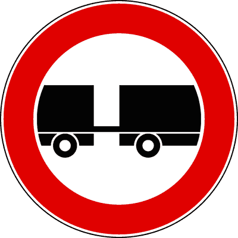
- **📖 الترجمة السياقية:** الإشارة الموضحة يمكن استكمالها بلوحة إضافية تسمح بجر مقطورات لا يزيد وزنها عن الموضح باللوحة.
- **💡 الشرح والقاعدة المرورية:** إشارة "ممنوع مرور المركبات التي تجر مقطورة" (دائرة بيضاء بإطار أحمر وسيارة ومقطورة منفصلة - م 116 لائحة تنفيذية): يجوز استثناء المقطورات الخفيفة حتى وزن معين (مثل 750 كجم) عبر لوحة تكميلية. العبارة صحيحة.
- **⚠️ كشف الفخ:** pannello che consente il traino: صحيح، يجوز استثناء مقطورات بوزن محدد.
- **🔑 الكلمات المفتاحية:** `veicoli con rimorchio (مركبات تجر مقطورة)` | `pannello integrativo (لوحة إضافية)`

---

**236.** Il segnale raffigurato vieta il transito agli autotreni
- **الإجابة:** `VERO ✅ (صح)`
- 
- **📖 الترجمة السياقية:** الإشارة الموضحة تمنع مرور الشاحنات ذات المقطورة (autotreni).
- **💡 الشرح والقاعدة المرورية:** إشارة "ممنوع مرور المركبات التي تجر مقطورة" (دائرة بيضاء بإطار أحمر وسيارة ومقطورة منفصلة - م 116 لائحة تنفيذية): الشاحنات ذات المقطورة مركبات تجر مقطورة ويشملها منع المرور قطعاً. العبارة صحيحة.
- **⚠️ كشف الفخ:** vieta agli autotreni: صحيح، شاحنات المقطورة ممنوعة.
- **🔑 الكلمات المفتاحية:** `veicoli con rimorchio (مركبات تجر مقطورة)` | `autotreni (شاحنات بمقطورة)`

---

**237.** In presenza del segnale raffigurato è consentito il transito di un autoveicolo trainante un carrello-appendice
- **الإجابة:** `VERO ✅ (صح)`
- 
- **📖 الترجمة السياقية:** في وجود الإشارة الموضحة، يُسمح بمرور سيارة تجر مقطورة أمتعة خفيفة ملحقة (carrello-appendice).
- **💡 الشرح والقاعدة المرورية:** إشارة "ممنوع مرور المركبات التي تجر مقطورة" (دائرة بيضاء بإطار أحمر وسيارة ومقطورة منفصلة - م 116 لائحة تنفيذية): قاعدة ذهبية: مقطورة الأمتعة الخفيفة (carrello-appendice) تعتبر جزءاً لا يتجزأ من السيارة ولا تعامل كمقطورة مستقلة! العبارة صحيحة.
- **⚠️ كشف الفخ:** consente con carrello-appendice: فخ شهير جداً؛ مقطورة الأمتعة الخفيفة مستثناة ومسموح بها.
- **🔑 الكلمات المفتاحية:** `veicoli con rimorchio (مركبات تجر مقطورة)` | `carrello-appendice (مقطورة أمتعة خفيفة ملحقة)`

---

**238.** Il segnale raffigurato vieta il transito ai veicoli a motore trainanti un rimorchio
- **الإجابة:** `VERO ✅ (صح)`
- 
- **📖 الترجمة السياقية:** الإشارة الموضحة تمنع مرور المركبات ذات المحرك التي تجر مقطورة.
- **💡 الشرح والقاعدة المرورية:** إشارة "ممنوع مرور المركبات التي تجر مقطورة" (دائرة بيضاء بإطار أحمر وسيارة ومقطورة منفصلة - م 116 لائحة تنفيذية): هذا هو التوصيف القانوني الرسمي للمنع (veicoli trainanti un rimorchio). العبارة صحيحة.
- **⚠️ كشف الفخ:** vieta ai veicoli trainanti un rimorchio: التعريف المعتمد للإشارة.
- **🔑 الكلمات المفتاحية:** `veicoli con rimorchio (مركبات تجر مقطورة)` | `segnale di divieto (إشارة منع)`

---

**239.** In presenza del segnale raffigurato è consentito il transito agli autosnodati
- **الإجابة:** `VERO ✅ (صح)`
- 
- **📖 الترجمة السياقية:** في وجود الإشارة الموضحة، يُسمح بمرور الحافلات المفصلية (autosnodati).
- **💡 الشرح والقاعدة المرورية:** إشارة "ممنوع مرور المركبات التي تجر مقطورة" (دائرة بيضاء بإطار أحمر وسيارة ومقطورة منفصلة - م 116 لائحة تنفيذية): قاعدة مهمة: الحافلة المفصلية تعتبر مركبة واحدة مترابطة ولا تعتبر مركبة بمقطورة، فيحق لها المرور! العبارة صحيحة.
- **⚠️ كشف الفخ:** consente agli autosnodati: الحافلات المفصلية ليست مقطورة ومصرح لها بالمرور.
- **🔑 الكلمات المفتاحية:** `veicoli con rimorchio (مركبات تجر مقطورة)` | `autosnodati (حافلات مفصلية)`

---

**240.** In presenza del segnale raffigurato è consentito il transito di un'autovettura trainante un caravan
- **الإجابة:** `FALSO ❌ (خطأ)`
- 
- **📖 الترجمة السياقية:** في وجود الإشارة الموضحة، يُسمح لسيارة ركاب بجر كرفان مقطور (caravan / roulotte).
- **💡 الشرح والقاعدة المرورية:** إشارة "ممنوع مرور المركبات التي تجر مقطورة" (دائرة بيضاء بإطار أحمر وسيارة ومقطورة منفصلة - م 116 لائحة تنفيذية): الكرفان المقطور (caravan) مقطورة حقيقية ويُحظر تماماً سحبه بعد هذه الإشارة. العبارة خاطئة.
- **⚠️ كشف الفخ:** consente con caravan: خطأ، الكرفان المقطور ممنوع قطعاً.
- **🔑 الكلمات المفتاحية:** `veicoli con rimorchio (مركبات تجر مقطورة)` | `caravan (كرفان مقطور)`

---

**241.** Il segnale raffigurato vale soltanto per i veicoli adibiti al trasporto di merci
- **الإجابة:** `FALSO ❌ (خطأ)`
- 
- **📖 الترجمة السياقية:** تسري الإشارة الموضحة فقط على المركبات المخصصة لنقل البضائع.
- **💡 الشرح والقاعدة المرورية:** إشارة "ممنوع مرور المركبات التي تجر مقطورة" (دائرة بيضاء بإطار أحمر وسيارة ومقطورة منفصلة - م 116 لائحة تنفيذية): المنع عام ويشمل كافة المركبات بما فيها سيارات الركاب التي تجر كرفاناً أو مقطورة قوارب. العبارة خاطئة.
- **⚠️ كشف الفخ:** soltanto trasporto merci: فخ؛ المنع يسري على السيارات التي تجر مقطورات أيضاً.
- **🔑 الكلمات المفتاحية:** `veicoli con rimorchio (مركبات تجر مقطورة)` | `autovetture (سيارات ركاب)`

---

**242.** Il segnale raffigurato indica autocarri in rallentamento
- **الإجابة:** `FALSO ❌ (خطأ)`
- 
- **📖 الترجمة السياقية:** الإشارة الموضحة تدل على شاحنات في حالة تباطؤ.
- **💡 الشرح والقاعدة المرورية:** إشارة "ممنوع مرور المركبات التي تجر مقطورة" (دائرة بيضاء بإطار أحمر وسيارة ومقطورة منفصلة - م 116 لائحة تنفيذية): لا صلة للإشارة بتباطؤ الشاحنات، بل هي منع تام لدخول المركبات التي تجر مقطورة. العبارة خاطئة.
- **⚠️ كشف الفخ:** autocarri in rallentamento: خلط لا أصل له.
- **🔑 الكلمات المفتاحية:** `veicoli con rimorchio (مركبات تجر مقطورة)` | `rallentamento (تباطؤ)`

---

**243.** Il segnale raffigurato indica che gli autotreni debbono procedere ad una distanza di almeno 100 metri tra di loro
- **الإجابة:** `FALSO ❌ (خطأ)`
- 
- **📖 الترجمة السياقية:** الإشارة الموضحة تدل على وجوب سير الشاحنات ذات المقطورة على مسافة 100 متر على الأقل بينها.
- **💡 الشرح والقاعدة المرورية:** إشارة "ممنوع مرور المركبات التي تجر مقطورة" (دائرة بيضاء بإطار أحمر وسيارة ومقطورة منفصلة - م 116 لائحة تنفيذية): لا تحدد مسافة أمان، بل تمنع دخول ومرور المركبات ذات المقطورات كلياً. العبارة خاطئة.
- **⚠️ كشف الفخ:** distanza di almeno 100 metri: خلط مع لافتات مسافة الأمان الإلزامية.
- **🔑 الكلمات المفتاحية:** `veicoli con rimorchio (مركبات تجر مقطورة)` | `distanza (مسافة)`

---

**244.** In presenza del segnale raffigurato è consentito il transito ad un'autovettura che traina un rimorchio per imbarcazione
- **الإجابة:** `FALSO ❌ (خطأ)`
- 
- **📖 الترجمة السياقية:** في وجود الإشارة الموضحة، يُسمح لسيارة ركاب بجر مقطورة لنقل القوارب (rimorchio per imbarcazione).
- **💡 الشرح والقاعدة المرورية:** إشارة "ممنوع مرور المركبات التي تجر مقطورة" (دائرة بيضاء بإطار أحمر وسيارة ومقطورة منفصلة - م 116 لائحة تنفيذية): مقطورة القوارب تُصنف كمقطورة نقل خاصة (T.A.T.S.) ويشملها منع المقطورات قطعاً. العبارة خاطئة.
- **⚠️ كشف الفخ:** rimorchio per imbarcazione: ممنوع، مقطورة القوارب مقطورة حقيقية.
- **🔑 الكلمات المفتاحية:** `veicoli con rimorchio (مركبات تجر مقطورة)` | `rimorchio imbarcazione (مقطورة قوارب)`

---

## 📌 Transito macchine agricole (14 domande)

**245.** Il segnale raffigurato vieta il transito alle trattrici agricole
- **الإجابة:** `VERO ✅ (صح)`
- 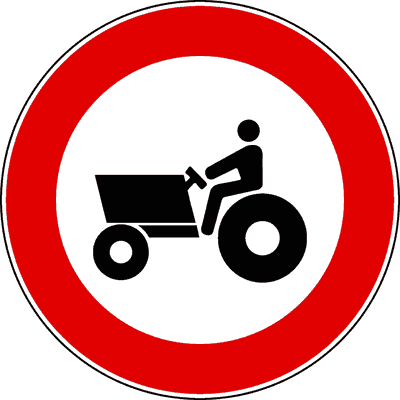
- **📖 الترجمة السياقية:** الإشارة الموضحة تمنع مرور الجرارات الزراعية.
- **💡 الشرح والقاعدة المرورية:** إشارة "ممنوع مرور الآلات الزراعية" (دائرة بيضاء بإطار أحمر وجرار زراعي - م 116 لائحة تنفيذية): تمنع سير ودخول كافة الجرارات والآلات الزراعية ذاتية الحركة والمقطورة. العبارة صحيحة.
- **⚠️ كشف الفخ:** vieta alle trattrici agricole: المعنى الصريح للإشارة.
- **🔑 الكلمات المفتاحية:** `macchine agricole (آلات زراعية / جرارات)` | `trattrici agricole (جرارات زراعية)` | `segnale di divieto (إشارة منع)`

---

**246.** In presenza del segnale raffigurato è consentito il transito di veicoli sgombraneve
- **الإجابة:** `VERO ✅ (صح)`
- 
- **📖 الترجمة السياقية:** في وجود الإشارة الموضحة، يُسمح بمرور كاسحات الثلوج (sgombraneve).
- **💡 الشرح والقاعدة المرورية:** إشارة "ممنوع مرور الآلات الزراعية" (دائرة بيضاء بإطار أحمر وجرار زراعي - م 116 لائحة تنفيذية): كاسحات الثلوج آلات عمل وأشغال (macchine operatrici) وليست آلات زراعية، فيحق لها المرور. العبارة صحيحة.
- **⚠️ كشف الفخ:** consente a veicoli sgombraneve: كاسحات الثلوج آلات أشغال ومسموح بها.
- **🔑 الكلمات المفتاحية:** `macchine agricole (آلات زراعية / جرارات)` | `sgombraneve (كاسحات ثلوج)`

---

**247.** Il segnale raffigurato vale sia di giorno che di notte
- **الإجابة:** `VERO ✅ (صح)`
- 
- **📖 الترجمة السياقية:** تسري الإشارة الموضحة ليلاً ونهاراً على السواء.
- **💡 الشرح والقاعدة المرورية:** إشارة "ممنوع مرور الآلات الزراعية" (دائرة بيضاء بإطار أحمر وجرار زراعي - م 116 لائحة تنفيذية): المنع سارٍ على مدار 24 ساعة لضمان انسيابية وسلامة المرور. العبارة صحيحة.
- **⚠️ كشف الفخ:** vale sia di giorno che di notte: صحيح، المنع دائم 24 ساعة.
- **🔑 الكلمات المفتاحية:** `macchine agricole (آلات زراعية / جرارات)` | `giorno e notte (ليلاً ونهاراً)`

---

**248.** In presenza del segnale raffigurato è consentito il transito alle macchine operatrici destinate a lavori di manutenzione stradale
- **الإجابة:** `VERO ✅ (صح)`
- 
- **📖 الترجمة السياقية:** في وجود الإشارة الموضحة، يُسمح بمرور آلات الأشغال المخصصة لصيانة الطرق.
- **💡 الشرح والقاعدة المرورية:** إشارة "ممنوع مرور الآلات الزراعية" (دائرة بيضاء بإطار أحمر وجرار زراعي - م 116 لائحة تنفيذية): آلات صيانة الطرق آلات عمل (macchine operatrici) ولا يمسها حظر الآلات الزراعية. العبارة صحيحة.
- **⚠️ كشف الفخ:** consente alle macchine operatrici: آلات صيانة الطرق مصرح لها بالمرور.
- **🔑 الكلمات المفتاحية:** `macchine agricole (آلات زراعية / جرارات)` | `macchine operatrici (آلات عمل وأشغال)`

---

**249.** Il segnale raffigurato vale sia per le macchine agricole gommate, sia per quelle cingolate
- **الإجابة:** `VERO ✅ (صح)`
- 
- **📖 الترجمة السياقية:** تسري الإشارة الموضحة على الآلات الزراعية ذات العجلات المطاطية وتلك ذات الجنزير (الكاتربيلر).
- **💡 الشرح والقاعدة المرورية:** إشارة "ممنوع مرور الآلات الزراعية" (دائرة بيضاء بإطار أحمر وجرار زراعي - م 116 لائحة تنفيذية): الحظر شامل لكافة أصناف الآلات الزراعية سواء كانت ذات إطارات (gommate) أو جنزير (cingolate). العبارة صحيحة.
- **⚠️ كشف الفخ:** gommate e cingolate: صحيح، يشمل الآلات المطاطية والمجنزرة.
- **🔑 الكلمات المفتاحية:** `macchine agricole (آلات زراعية / جرارات)` | `gommate (مطاطية)` | `cingolate (مجنزرة)`

---

**250.** In presenza del segnale raffigurato è consentito il transito ai motocicli
- **الإجابة:** `VERO ✅ (صح)`
- 
- **📖 الترجمة السياقية:** في وجود الإشارة الموضحة، يُسمح بمرور الدراجات النارية.
- **💡 الشرح والقاعدة المرورية:** إشارة "ممنوع مرور الآلات الزراعية" (دائرة بيضاء بإطار أحمر وجرار زراعي - م 116 لائحة تنفيذية): الدراجات النارية وسائر المركبات العادية تسير بحرية ولا يمسها منع الجرارات. العبارة صحيحة.
- **⚠️ كشف الفخ:** consente ai motocicli: صحيح، الدراجات النارية مسموح بها.
- **🔑 الكلمات المفتاحية:** `macchine agricole (آلات زراعية / جرارات)` | `motocicli (دراجات نارية)`

---

**251.** In presenza del segnale raffigurato è consentito il transito ai quadricicli a motore
- **الإجابة:** `VERO ✅ (صح)`
- 
- **📖 الترجمة السياقية:** في وجود الإشارة الموضحة، يُسمح بمرور الدراجات الرباعية ذات المحرك (الكواد).
- **💡 الشرح والقاعدة المرورية:** إشارة "ممنوع مرور الآلات الزراعية" (دائرة بيضاء بإطار أحمر وجرار زراعي - م 116 لائحة تنفيذية): الكواد مركبات آلية عادية وليست آلات زراعية، فيسمح لها بالمرور. العبارة صحيحة.
- **⚠️ كشف الفخ:** consente ai quadricicli: صحيح، الكوادريكولي مسموح بمرورها.
- **🔑 الكلمات المفتاحية:** `macchine agricole (آلات زراعية)` | `quadricicli a motore (دراجات رباعية بمحرك)`

---

**252.** In presenza del segnale raffigurato è consentito il transito alle macchine agricole
- **الإجابة:** `FALSO ❌ (خطأ)`
- 
- **📖 الترجمة السياقية:** في وجود الإشارة الموضحة، يُسمح بمرور الآلات الزراعية.
- **💡 الشرح والقاعدة المرورية:** إشارة "ممنوع مرور الآلات الزراعية" (دائرة بيضاء بإطار أحمر وجرار زراعي - م 116 لائحة تنفيذية): عكس الحقيقة تماماً؛ فالإشارة وضعت خصيصاً لمنع الآلات الزراعية. العبارة خاطئة.
- **⚠️ كشف الفخ:** consente alle macchine agricole: قلب المعنى، هي تمنعها.
- **🔑 الكلمات المفتاحية:** `macchine agricole (آلات زراعية)` | `segnale di divieto (إشارة منع)`

---

**253.** In presenza del segnale raffigurato è consentito il traino dei rimorchi agricoli di massa complessiva fino a 1,5 tonnellate
- **الإجابة:** `FALSO ❌ (خطأ)`
- 
- **📖 الترجمة السياقية:** في وجود الإشارة الموضحة، يُسمح بجر المقطورات الزراعية التي تصل كتلتها الإجمالية إلى 1.5 طن.
- **💡 الشرح والقاعدة المرورية:** إشارة "ممنوع مرور الآلات الزراعية" (دائرة بيضاء بإطار أحمر وجرار زراعي - م 116 لائحة تنفيذية): الحظر شامل لكافة الآلات والمقطورات الزراعية دون استثناء للوزن. العبارة خاطئة.
- **⚠️ كشف الفخ:** rimorchi agricoli fino a 1,5 t: خطأ، المقطورات الزراعية ممنوعة كلياً.
- **🔑 الكلمات المفتاحية:** `macchine agricole (آلات زراعية)` | `rimorchi agricoli (مقطورات زراعية)`

---

**254.** Il segnale raffigurato vieta il transito ai trattori stradali per semirimorchi
- **الإجابة:** `FALSO ❌ (خطأ)`
- 
- **📖 الترجمة السياقية:** الإشارة الموضحة تمنع مرور الجرارات الطرقية المخصصة لأنصاف المقطورات (رؤوس التريلات).
- **💡 الشرح والقاعدة المرورية:** إشارة "ممنوع مرور الآلات الزراعية" (دائرة بيضاء بإطار أحمر وجرار زراعي - م 116 لائحة تنفيذية): الجرارات الطرقية (trattori stradali) شاحنات نقل بضائع وليست آلات زراعية، فلا يشملها هذا المنع. العبارة خاطئة.
- **⚠️ كشف الفخ:** vieta ai trattori stradali: خلط بين الجرار الزراعي ورأس التريلا.
- **🔑 الكلمات المفتاحية:** `macchine agricole (آلات زراعية)` | `trattori stradali (جرارات طرقية/رؤوس تريلات)`

---

**255.** Il segnale raffigurato vieta il transito ai quadricicli a motore
- **الإجابة:** `FALSO ❌ (خطأ)`
- 
- **📖 الترجمة السياقية:** الإشارة الموضحة تمنع مرور الدراجات الرباعية ذات المحرك.
- **💡 الشرح والقاعدة المرورية:** إشارة "ممنوع مرور الآلات الزراعية" (دائرة بيضاء بإطار أحمر وجرار زراعي - م 116 لائحة تنفيذية): الكواد ليست آلات زراعية ومصرح لها بالمرور. العبارة خاطئة.
- **⚠️ كشف الفخ:** vieta ai quadricicli: خطأ، الكوادريكولي مسموح بها.
- **🔑 الكلمات المفتاحية:** `macchine agricole (آلات زراعية)` | `quadricicli a motore (دراجات رباعية بمحرك)`

---

**256.** Il segnale raffigurato è obbligatorio in corrispondenza degli accessi privati
- **الإجابة:** `FALSO ❌ (خطأ)`
- 
- **📖 الترجمة السياقية:** الإشارة الموضحة إلزامية عند المداخل والمنافذ الخاصة.
- **💡 الشرح والقاعدة المرورية:** إشارة "ممنوع مرور الآلات الزراعية" (دائرة بيضاء بإطار أحمر وجرار زراعي - م 116 لائحة تنفيذية): لا تفرض على المداخل الخاصة للمزارع، بل توضع على شبكة الطرق العامة لتنظيم المرور. العبارة خاطئة.
- **⚠️ كشف الفخ:** obbligatorio su accessi privati: غير ملزمة على المنافذ الخاصة.
- **🔑 الكلمات المفتاحية:** `macchine agricole (آلات زراعية)` | `accessi privati (مداخل خاصة)`

---

**257.** Il segnale raffigurato si trova soltanto sulla rete stradale delle aziende agricole
- **الإجابة:** `FALSO ❌ (خطأ)`
- 
- **📖 الترجمة السياقية:** الإشارة الموضحة توجد فقط على شبكة طرق المزارع والشركات الزراعية.
- **💡 الشرح والقاعدة المرورية:** إشارة "ممنوع مرور الآلات الزراعية" (دائرة بيضاء بإطار أحمر وجرار زراعي - م 116 لائحة تنفيذية): توضع على الطرق العامة السريعة أو الحضرية التي يُحظر فيها سير الجرارات البطيئة. العبارة خاطئة.
- **⚠️ كشف الفخ:** soltanto su aziende agricole: قصر باطل، توجد على الطرق العامة.
- **🔑 الكلمات المفتاحية:** `macchine agricole (آلات زراعية)` | `strade pubbliche (طرق عامة)`

---

**258.** In presenza del segnale raffigurato è consentito il transito alle macchine agricole durante le fiere
- **الإجابة:** `FALSO ❌ (خطأ)`
- 
- **📖 الترجمة السياقية:** في وجود الإشارة الموضحة، يُسمح بمرور الآلات الزراعية خلال المعارض.
- **💡 الشرح والقاعدة المرورية:** إشارة "ممنوع مرور الآلات الزراعية" (دائرة بيضاء بإطار أحمر وجرار زراعي - م 116 لائحة تنفيذية): المنع دائم وقانوني ولا توجد رخصة تلقائية للمرور أثناء إقامة المعارض. العبارة خاطئة.
- **⚠️ كشف الفخ:** durante le fiere: استثناء وهمي باطل.
- **🔑 الكلمات المفتاحية:** `macchine agricole (آلات زراعية)` | `fiere (معارض)`

---

## 📌 Merci pericolose (7 domande)

**259.** Il segnale raffigurato vieta il transito ai veicoli che trasportano merci pericolose
- **الإجابة:** `VERO ✅ (صح)`
- 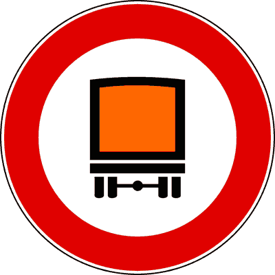
- **📖 الترجمة السياقية:** الإشارة الموضحة تمنع مرور المركبات التي تنقل بضائع خطرة.
- **💡 الشرح والقاعدة المرورية:** إشارة "ممنوع مرور المركبات المحملة ببضائع خطرة" (دائرة بيضاء بإطار أحمر وصندوق مشتعل - م 117 لائحة تنفيذية): تمنع سير ودخول المركبات الحاملة للمواد الخطرة المصنفة دولياً (ADR) لحماية البيئة والسكان. العبارة صحيحة.
- **⚠️ كشف الفخ:** trasportano merci pericolose: المعنى النظامي المباشر للإشارة.
- **🔑 الكلمات المفتاحية:** `merci pericolose (بضائع خطرة)` | `segnale di divieto (إشارة منع)`

---

**260.** Il segnale raffigurato vieta il transito alle autocisterne che trasportano benzina
- **الإجابة:** `VERO ✅ (صح)`
- 
- **📖 الترجمة السياقية:** الإشارة الموضحة تمنع مرور شاحنات الصهريج التي تنقل البنزين.
- **💡 الشرح والقاعدة المرورية:** إشارة "ممنوع مرور المركبات المحملة ببضائع خطرة" (دائرة بيضاء بإطار أحمر وصندوق مشتعل - م 117 لائحة تنفيذية): البنزين مادة شديدة الاشتعال وتُعد من البضائع الخطرة الممنوع مرور صهاريجها هنا. العبارة صحيحة.
- **⚠️ كشف الفخ:** autocisterne che trasportano benzina: صحيح، صهاريج البنزين ممنوعة.
- **🔑 الكلمات المفتاحية:** `merci pericolose (بضائع خطرة)` | `autocisterna (شاحنة صهريج)` | `benzina (بنزين)`

---

**261.** Il segnale raffigurato vieta il transito ai veicoli che trasportano carni macellate
- **الإجابة:** `FALSO ❌ (خطأ)`
- 
- **📖 الترجمة السياقية:** الإشارة الموضحة تمنع مرور المركبات التي تنقل اللحوم المذبوحة.
- **💡 الشرح والقاعدة المرورية:** إشارة "ممنوع مرور المركبات المحملة ببضائع خطرة" (دائرة بيضاء بإطار أحمر وصندوق مشتعل - م 117 لائحة تنفيذية): اللحوم بضائع غذائية قابلة للتلف (merci deperibili) وليست بضائع خطرة كيميائياً. العبارة خاطئة.
- **⚠️ كشف الفخ:** carni macellate: خلط بين البضائع القابلة للتلف والبضائع الخطرة.
- **🔑 الكلمات المفتاحية:** `merci pericolose (بضائع خطرة)` | `carni macellate (لحوم مذبوحة)`

---

**262.** Il segnale raffigurato vieta il transito agli autoveicoli con motore alimentato a gas liquido (GPL)
- **الإجابة:** `FALSO ❌ (خطأ)`
- 
- **📖 الترجمة السياقية:** الإشارة الموضحة تمنع مرور المركبات الآلية التي يعمل محركها بغاز البترول المسال (GPL).
- **💡 الشرح والقاعدة المرورية:** إشارة "ممنوع مرور المركبات المحملة ببضائع خطرة" (دائرة بيضاء بإطار أحمر وصندوق مشتعل - م 117 لائحة تنفيذية): غاز خزان وقود السيارة المخصص لتسيير المحرك لا يُعتبر نقلاً لبضائع خطرة. العبارة خاطئة.
- **⚠️ كشف الفخ:** veicoli alimentati a GPL: وقود تشغيل السيارة مستثنى تماماً.
- **🔑 الكلمات المفتاحية:** `merci pericolose (بضائع خطرة)` | `GPL (غاز سائل)`

---

**263.** Il segnale raffigurato vieta il transito agli autocarri telonati
- **الإجابة:** `FALSO ❌ (خطأ)`
- 
- **📖 الترجمة السياقية:** الإشارة الموضحة تمنع مرور الشاحنات المغطاة بشراع (telonati).
- **💡 الشرح والقاعدة المرورية:** إشارة "ممنوع مرور المركبات المحملة ببضائع خطرة" (دائرة بيضاء بإطار أحمر وصندوق مشتعل - م 117 لائحة تنفيذية): العبرة بنوع الحمولة (بضائع خطرة) وليس بوجود شراع أو غطاء على الشاحنة. العبارة خاطئة.
- **⚠️ كشف الفخ:** autocarri telonati: شكل الشراع لا يحدد المنع.
- **🔑 الكلمات المفتاحية:** `merci pericolose (بضائع خطرة)` | `telonati (مغطى بشراع)`

---

**264.** Il segnale raffigurato vieta il transito ai veicoli che trasportano merci deperibili
- **الإجابة:** `FALSO ❌ (خطأ)`
- 
- **📖 الترجمة السياقية:** الإشارة الموضحة تمنع مرور المركبات التي تنقل بضائع سريعة التلف.
- **💡 الشرح والقاعدة المرورية:** إشارة "ممنوع مرور المركبات المحملة ببضائع خطرة" (دائرة بيضاء بإطار أحمر وصندوق مشتعل - م 117 لائحة تنفيذية): البضائع سريعة التلف كالألبان والخضار ليست بضائع خطرة ويسمح بنقلها. العبارة خاطئة.
- **⚠️ كشف الفخ:** merci deperibili: خلط بين سريعة التلف والبضائع الخطرة.
- **🔑 الكلمات المفتاحية:** `merci pericolose (بضائع خطرة)` | `merci deperibili (بضائع سريعة التلف)`

---

**265.** Il segnale raffigurato vieta il transito ai veicoli con furgone frigorifero
- **الإجابة:** `FALSO ❌ (خطأ)`
- 
- **📖 الترجمة السياقية:** الإشارة الموضحة تمنع مرور المركبات ذات الصندوق المبرد (الثلاجات).
- **💡 الشرح والقاعدة المرورية:** إشارة "ممنوع مرور المركبات المحملة ببضائع خطرة" (دائرة بيضاء بإطار أحمر وصندوق مشتعل - م 117 لائحة تنفيذية): سيارات التبريد لنقل الأغذية لا يشملها المنع إطلاقاً. العبارة خاطئة.
- **⚠️ كشف الفخ:** furgone frigorifero: لا يشملها منع البضائع الخطرة.
- **🔑 الكلمات المفتاحية:** `merci pericolose (بضائع خطرة)` | `furgone frigorifero (صندوق مبرد)`

---

## 📌 Trasporto esplosivi (8 domande)

**266.** Il segnale raffigurato vieta il transito ai veicoli che trasportano esplosivi
- **الإجابة:** `VERO ✅ (صح)`
- 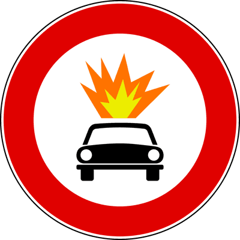
- **📖 الترجمة السياقية:** الإشارة الموضحة تمنع مرور المركبات التي تنقل مواد متفجرة.
- **💡 الشرح والقاعدة المرورية:** إشارة "ممنوع مرور المواد المتفجرة وسهلة الاشتعال" (دائرة بيضاء بإطار أحمر وانفجار دائري - م 117 لائحة تنفيذية): تمنع نقل ودخول المواد المتفجرة (esplosivi) كالديناميت والألعاب النارية والذخائر. العبارة صحيحة.
- **⚠️ كشف الفخ:** trasportano esplosivi: المعنى القانوني الدقيق للإشارة.
- **🔑 الكلمات المفتاحية:** `esplosivi e infiammabili (مواد متفجرة وقابلة للاشتعال)` | `segnale di divieto (إشارة منع)`

---

**267.** Il carburante contenuto nel serbatoio del veicolo non si considera trasporto di materiale infiammabile vietato dal segnale in figura
- **الإجابة:** `VERO ✅ (صح)`
- 
- **📖 الترجمة السياقية:** الوقود الموجود في خزان وقود المركبة لا يُعتبر نقلاً لمواد قابلة للاشتعال ممنوعة بالإشارة الموضحة.
- **💡 الشرح والقاعدة المرورية:** إشارة "ممنوع مرور المواد المتفجرة وسهلة الاشتعال" (دائرة بيضاء بإطار أحمر وانفجار دائري - م 117 لائحة تنفيذية): قاعدة قطعية: وقود محرك السيارة في خزانها الأصلي لا يعتبر حمولة بضائع خطرة ويحق لها المرور. العبارة صحيحة.
- **⚠️ كشف الفخ:** carburante nel serbatoio: وقود الخزان مستثنى ولا يعد حمولة.
- **🔑 الكلمات المفتاحية:** `esplosivi e infiammabili (مواد متفجرة وقابلة للاشتعال)` | `serbatoio (خزان الوقود)`

---

**268.** In presenza del segnale raffigurato è consentito il transito di autovetture alimentate a metano
- **الإجابة:** `VERO ✅ (صح)`
- 
- **📖 الترجمة السياقية:** في وجود الإشارة الموضحة، يُسمح بمرور سيارات الركاب التي تعمل بالغاز الطبيعي (الميثان).
- **💡 الشرح والقاعدة المرورية:** إشارة "ممنوع مرور المواد المتفجرة وسهلة الاشتعال" (دائرة بيضاء بإطار أحمر وانفجار دائري - م 117 لائحة تنفيذية): السيارات التي تعمل بالميثان تستخدمه كوقود تسيير في أسطواناتها المصرحة وتمر بحرية. العبارة صحيحة.
- **⚠️ كشف الفخ:** autovetture a metano: صحيح، سيارات الميثان مسموح بمرورها.
- **🔑 الكلمات المفتاحية:** `esplosivi e infiammabili (مواد متفجرة وقابلة للاشتعال)` | `metano (غاز طبيعي)`

---

**269.** Il segnale raffigurato vieta il transito ai veicoli che trasportano prodotti facilmente infiammabili
- **الإجابة:** `VERO ✅ (صح)`
- 
- **📖 الترجمة السياقية:** الإشارة الموضحة تمنع مرور المركبات التي تنقل منتجات سهلة الاشتعال.
- **💡 الشرح والقاعدة المرورية:** إشارة "ممنوع مرور المواد المتفجرة وسهلة الاشتعال" (دائرة بيضاء بإطار أحمر وانفجار دائري - م 117 لائحة تنفيذية): تشمل الحظر المواد سريعة وسهلة الاشتعال كبراميل الوقود وأسطوانات الغاز التجارية. العبارة صحيحة.
- **⚠️ كشف الفخ:** facilmente infiammabili: صحيح، تشمل المواد شديدة وقابلة الاشتعال.
- **🔑 الكلمات المفتاحية:** `esplosivi e infiammabili (مواد متفجرة وقابلة للاشتعال)` | `facilmente infiammabili (سهلة الاشتعال)`

---

**270.** In presenza del segnale raffigurato gli autoveicoli che trasportano esplosivi possono effettuare manovre di sorpasso
- **الإجابة:** `FALSO ❌ (خطأ)`
- 
- **📖 الترجمة السياقية:** في وجود الإشارة الموضحة، المركبات التي تنقل متفجرات يمكنها تنفيذ مناورات التجاوز.
- **💡 الشرح والقاعدة المرورية:** إشارة "ممنوع مرور المواد المتفجرة وسهلة الاشتعال" (دائرة بيضاء بإطار أحمر وانفجار دائري - م 117 لائحة تنفيذية): هي ممنوعة من الدخول والمرور في هذا الشارع أصلاً، فلا مجال للحديث عن التجاوز! العبارة خاطئة.
- **⚠️ كشف الفخ:** possono effettuare il sorpasso: خطأ، هي ممنوعة من السير بالكامل.
- **🔑 الكلمات المفتاحية:** `esplosivi e infiammabili (مواد متفجرة وقابلة للاشتعال)` | `sorpasso (تجاوز)`

---

**271.** Il segnale raffigurato prescrive di fare attenzione al transito di veicoli che trasportano esplosivo
- **الإجابة:** `FALSO ❌ (خطأ)`
- 
- **📖 الترجمة السياقية:** الإشارة الموضحة تفرض الانتباه لمرور المركبات التي تنقل متفجرات.
- **💡 الشرح والقاعدة المرورية:** إشارة "ممنوع مرور المواد المتفجرة وسهلة الاشتعال" (دائرة بيضاء بإطار أحمر وانفجار دائري - م 117 لائحة تنفيذية): ليست إشارة خطر أو تحذير للسائقين، بل إشارة منع وحظر قطعي لتلك الشاحنات. العبارة خاطئة.
- **⚠️ كشف الفخ:** fare attenzione: خطأ، تصنيفها منع وليست تحذير خطر.
- **🔑 الكلمات المفتاحية:** `esplosivi e infiammabili (مواد متفجرة وقابلة للاشتعال)` | `attenzione (انتباه)`

---

**272.** In presenza del segnale raffigurato è consentito il transito ai veicoli che trasportano prodotti facilmente infiammabili, purché non esplosivi
- **الإجابة:** `FALSO ❌ (خطأ)`
- 
- **📖 الترجمة السياقية:** في وجود الإشارة الموضحة، يُسمح بمرور المركبات التي تنقل منتجات سهلة الاشتعال بشرط ألا تكون متفجرة.
- **💡 الشرح والقاعدة المرورية:** إشارة "ممنوع مرور المواد المتفجرة وسهلة الاشتعال" (دائرة بيضاء بإطار أحمر وانفجار دائري - م 117 لائحة تنفيذية): المنع يجمع الاثنين معاً: المتفجرات والمواد سهلة الاشتعال كلاهما محظور. العبارة خاطئة.
- **⚠️ كشف الفخ:** purché non esplosivi: فخ؛ المنتجات سهلة الاشتعال ممنوعة أيضاً.
- **🔑 الكلمات المفتاحية:** `esplosivi e infiammabili (مواد متفجرة وقابلة للاشتعال)` | `infiammabili (قابلة للاشتعال)`

---

**273.** In presenza del segnale raffigurato è consentito il traino di veicoli che trasportano prodotti facilmente infiammabili
- **الإجابة:** `FALSO ❌ (خطأ)`
- 
- **📖 الترجمة السياقية:** في وجود الإشارة الموضحة، يُسمح بقطر وسحب مركبات تنقل مواد سهلة الاشتعال.
- **💡 الشرح والقاعدة المرورية:** إشارة "ممنوع مرور المواد المتفجرة وسهلة الاشتعال" (دائرة بيضاء بإطار أحمر وانفجار دائري - م 117 لائحة تنفيذية): يُحظر مرور المركبة المحملة بالمواد الخطرة سواء كانت تسير بمفردها أو مقطورة. العبارة خاطئة.
- **⚠️ كشف الفخ:** traino di veicoli infiammabili: القطر ممنوع أيضاً لنفس الحمولة الخطرة.
- **🔑 الكلمات المفتاحية:** `esplosivi e infiammabili (مواد متفجرة وقابلة للاشتعال)` | `traino (قطر/جر)`

---

## 📌 Veicoli acqua (9 domande)

**274.** Il segnale raffigurato vieta il transito ai veicoli che trasportano sostanze suscettibili di contaminare l'acqua
- **الإجابة:** `VERO ✅ (صح)`
- 
- **📖 الترجمة السياقية:** الإشارة الموضحة تمنع مرور المركبات التي تنقل مواد قد تلوث المياه.
- **💡 الشرح والقاعدة المرورية:** إشارة "ممنوع مرور المركبات الحاملة لمواد ملوثة للمياه" (دائرة بيضاء بإطار أحمر وصهريج وأمواج - م 117 لائحة تنفيذية): توضع لحماية مصادر ومجاري وشبكات المياه الصالحة للشرب والبحيرات من التلوث بالمواد الكيميائية. العبارة صحيحة.
- **⚠️ كشف الفخ:** suscettibili di contaminare l'acqua: المعنى الرسمي الصريح للإشارة.
- **🔑 الكلمات المفتاحية:** `sostanze contaminanti l'acqua (مواد تلوث المياه)` | `segnale di divieto (إشارة منع)`

---

**275.** In presenza del segnale raffigurato è consentito il transito di autoveicoli che trasportano prodotti che non contaminano l'acqua
- **الإجابة:** `VERO ✅ (صح)`
- 
- **📖 الترجمة السياقية:** في وجود الإشارة الموضحة، يُسمح بمرور المركبات التي تنقل منتجات لا تلوث المياه.
- **💡 الشرح والقاعدة المرورية:** إشارة "ممنوع مرور المركبات الحاملة لمواد ملوثة للمياه" (دائرة بيضاء بإطار أحمر وصهريج وأمواج - م 117 لائحة تنفيذية): المنع مقصور على المواد الملوثة للمياه، أما المواد غير الملوثة فيسمح بنقلها بحرية. العبارة صحيحة.
- **⚠️ كشف الفخ:** prodotti che non contaminano: صحيح، المواد غير الملوثة مسموح بمرورها.
- **🔑 الكلمات المفتاحية:** `sostanze contaminanti l'acqua (مواد تلوث المياه)` | `non contaminano (لا تلوث)`

---

**276.** In presenza del segnale raffigurato è consentito il transito alle autocisterne che trasportano acqua
- **الإجابة:** `VERO ✅ (صح)`
- 
- **📖 الترجمة السياقية:** في وجود الإشارة الموضحة، يُسمح بمرور شاحنات الصهريج التي تنقل الماء.
- **💡 الشرح والقاعدة المرورية:** إشارة "ممنوع مرور المركبات الحاملة لمواد ملوثة للمياه" (دائرة بيضاء بإطار أحمر وصهريج وأمواج - م 117 لائحة تنفيذية): قاعدة شهيرة: الماء لا يلوث الماء! صهاريج نقل مياه الشرب مصرح لها بالمرور. العبارة صحيحة.
- **⚠️ كشف الفخ:** autocisterne che trasportano acqua: فخ كلاسيكي؛ الماء لا يلوث الماء ومسموح بمروره.
- **🔑 الكلمات المفتاحية:** `sostanze contaminanti l'acqua (مواد تلوث المياه)` | `autocisterna (شاحنة صهريج)` | `acqua (ماء)`

---

**277.** In presenza del segnale raffigurato è consentito il transito alle innaffiatrici stradali
- **الإجابة:** `VERO ✅ (صح)`
- 
- **📖 الترجمة السياقية:** في وجود الإشارة الموضحة، يُسمح بمرور شاحنات رش وغسيل الطرق بالماء (innaffiatrici stradali).
- **💡 الشرح والقاعدة المرورية:** إشارة "ممنوع مرور المركبات الحاملة لمواد ملوثة للمياه" (دائرة بيضاء بإطار أحمر وصهريج وأمواج - م 117 لائحة تنفيذية): شاحنات رش وتنظيف الشوارع محملة بمياه غير ملوثة ومصرح لها بالمرور والعمل. العبارة صحيحة.
- **⚠️ كشف الفخ:** innaffiatrici stradali: مركبات رش المياه مسموح بمرورها.
- **🔑 الكلمات المفتاحية:** `sostanze contaminanti l'acqua (مواد تلوث المياه)` | `innaffiatrici (رشاشات المياه)`

---

**278.** In presenza del segnale raffigurato è consentito il transito di rimorchi che trasportano sostanze che possono contaminare l'acqua
- **الإجابة:** `FALSO ❌ (خطأ)`
- 
- **📖 الترجمة السياقية:** في وجود الإشارة الموضحة، يُسمح بمرور المقطورات التي تنقل مواد قد تلوث المياه.
- **💡 الشرح والقاعدة المرورية:** إشارة "ممنوع مرور المركبات الحاملة لمواد ملوثة للمياه" (دائرة بيضاء بإطار أحمر وصهريج وأمواج - م 117 لائحة تنفيذية): يُحظر نقل المواد الملوثة على كافة المركبات بما فيها المقطورات والصهاريج. العبارة خاطئة.
- **⚠️ كشف الفخ:** consente il transito di rimorchi: خطأ، المقطورات المحملة بمواد ملوثة ممنوعة.
- **🔑 الكلمات المفتاحية:** `sostanze contaminanti l'acqua (مواد تلوث المياه)` | `rimorchi (مقطورات)`

---

**279.** Il segnale raffigurato preannuncia una zona soggetta ad allagamento
- **الإجابة:** `FALSO ❌ (خطأ)`
- 
- **📖 الترجمة السياقية:** الإشارة الموضحة تُنذر بمنطقة معرضة للفيضانات والغرق.
- **💡 الشرح والقاعدة المرورية:** إشارة "ممنوع مرور المركبات الحاملة لمواد ملوثة للمياه" (دائرة بيضاء بإطار أحمر وصهريج وأمواج - م 117 لائحة تنفيذية): لا صلة للإشارة بالفيضانات أو الأحوال الجوية، بل هي منع لنقل المواد الكيميائية الملوثة. العبارة خاطئة.
- **⚠️ كشف الفخ:** zona soggetta ad allagamento: خلط مع مخاطر السيول.
- **🔑 الكلمات المفتاحية:** `sostanze contaminanti l'acqua (مواد تلوث المياه)` | `allagamento (غرق/فيضان)`

---

**280.** Il segnale raffigurato preannuncia la probabile presenza di acqua sulla carreggiata
- **الإجابة:** `FALSO ❌ (خطأ)`
- 
- **📖 الترجمة السياقية:** الإشارة الموضحة تُنذر باحتمال وجود مياه على نهر الطريق.
- **💡 الشرح والقاعدة المرورية:** إشارة "ممنوع مرور المركبات الحاملة لمواد ملوثة للمياه" (دائرة بيضاء بإطار أحمر وصهريج وأمواج - م 117 لائحة تنفيذية): لا تحذر من برك المياه؛ الإشارة إشارة منع للمركبات الملوثة. العبارة خاطئة.
- **⚠️ كشف الفخ:** acqua sulla carreggiata: خلط مع إشارات خطر الانزلاق.
- **🔑 الكلمات المفتاحية:** `sostanze contaminanti l'acqua (مواد تلوث المياه)` | `carreggiata (نهر الطريق)`

---

**281.** Il segnale raffigurato vieta la sosta delle autocisterne
- **الإجابة:** `FALSO ❌ (خطأ)`
- 
- **📖 الترجمة السياقية:** الإشارة الموضحة تمنع وقوف وانتظار شاحنات الصهريج.
- **💡 الشرح والقاعدة المرورية:** إشارة "ممنوع مرور المركبات الحاملة لمواد ملوثة للمياه" (دائرة بيضاء بإطار أحمر وصهريج وأمواج - م 117 لائحة تنفيذية): الإشارة تمنع المرور والعبور (transito) وليس مجرد الوقوف (sosta). العبارة خاطئة.
- **⚠️ كشف الفخ:** vieta la sosta: خلط بين منع السير ومنع الوقوف.
- **🔑 الكلمات المفتاحية:** `sostanze contaminanti l'acqua (مواد تلوث المياه)` | `sosta (وقوف)`

---

**282.** Il segnale raffigurato vieta il transito alle cisterne vuote
- **الإجابة:** `FALSO ❌ (خطأ)`
- 
- **📖 الترجمة السياقية:** الإشارة الموضحة تمنع مرور شاحنات الصهريج الفارغة.
- **💡 الشرح والقاعدة المرورية:** إشارة "ممنوع مرور المركبات الحاملة لمواد ملوثة للمياه" (دائرة بيضاء بإطار أحمر وصهريج وأمواج - م 117 لائحة تنفيذية): إذا كان الصهريج فارغاً ونظيفاً فلا ينقل مواد ملوثة، ويُسمح له بالمرور نظاماً. العبارة خاطئة.
- **⚠️ كشف الفخ:** cisterne vuote: فخ الصهريج الفارغ؛ الفارغ لا ينقل ملوثات ومسموح بمروره.
- **🔑 الكلمات المفتاحية:** `sostanze contaminanti l'acqua (مواد تلوث المياه)` | `cisterne vuote (صهاريج فارغة)`

---

## 📌 Divieto veicoli larghi (12 domande)

**283.** Il segnale raffigurato si riferisce ai veicoli anche se sprovvisti di motore
- **الإجابة:** `VERO ✅ (صح)`
- 
- **📖 الترجمة السياقية:** الإشارة الموضحة تخص المركبات حتى لو كانت غير مزودة بمحرك.
- **💡 الشرح والقاعدة المرورية:** إشارة "أقصى عرض للمركبة 2.30 م" (دائرة بيضاء بإطار أحمر وسهمان أفقيان - م 118 لائحة تنفيذية): تسري على كافة أصناف المركبات بمحرك وبدون محرك (كعربات الجر الحيواني) إذا تجاوزت 2.30 م. العبارة صحيحة.
- **⚠️ كشف الفخ:** anche senza motore: العبرة بالعرض الهندسي لجميع أصناف المركبات.
- **🔑 الكلمات المفتاحية:** `larghezza massima 2,30 m (أقصى عرض مسموح 2.30 م)` | `senza motore (بدون محرك)`

---

**284.** Il segnale raffigurato può trovarsi prima di una strettoia
- **الإجابة:** `VERO ✅ (صح)`
- 
- **📖 الترجمة السياقية:** الإشارة الموضحة يمكن أن توجد قبل مضيق في الطريق.
- **💡 الشرح والقاعدة المرورية:** إشارة "أقصى عرض للمركبة 2.30 م" (دائرة بيضاء بإطار أحمر وسهمان أفقيان - م 118 لائحة تنفيذية): توضع لحماية الممرات والأزقة والجسور الضيقة من انحشار المركبات العريضة فيها. العبارة صحيحة.
- **⚠️ كشف الفخ:** prima di una strettoia: صحيح، توضع قبل المضايق والمعابر الضيقة.
- **🔑 الكلمات المفتاحية:** `larghezza massima 2,30 m (أقصى عرض مسموح 2.30 م)` | `strettoia (مضيق)`

---

**285.** Il segnale raffigurato è posto sulle strade sia urbane che extraurbane
- **الإجابة:** `VERO ✅ (صح)`
- 
- **📖 الترجمة السياقية:** الإشارة الموضحة توضع على الطرق داخل المدن وخارجها.
- **💡 الشرح والقاعدة المرورية:** إشارة "أقصى عرض للمركبة 2.30 م" (دائرة بيضاء بإطار أحمر وسهمان أفقيان - م 118 لائحة تنفيذية): تثبت أينما وُجد ممر ضيق سواء في المراكز التاريخية بالمدن أو على الطرق الجبلية والريفية. العبارة صحيحة.
- **⚠️ كشف الفخ:** sia urbane che extraurbane: صحيح، توجد داخل وخارج المدن.
- **🔑 الكلمات المفتاحية:** `larghezza massima 2,30 m (أقصى عرض مسموح 2.30 م)` | `strade urbane (طرق حضرية)`

---

**286.** Il segnale raffigurato indica la larghezza massima dei veicoli ammessi al transito
- **الإجابة:** `VERO ✅ (صح)`
- 
- **📖 الترجمة السياقية:** الإشارة الموضحة تدل على العرض الأقصى للمركبات المسموح لها بالمرور.
- **💡 الشرح والقاعدة المرورية:** إشارة "أقصى عرض للمركبة 2.30 م" (دائرة بيضاء بإطار أحمر وسهمان أفقيان - م 118 لائحة تنفيذية): تحدد الحد الأقصى لعرض المركبة بحمولتها المصرح بمروره (2.30 م). العبارة صحيحة.
- **⚠️ كشف الفخ:** larghezza massima ammessa: المعنى الفني الدقيق للإشارة.
- **🔑 الكلمات المفتاحية:** `larghezza massima 2,30 m (أقصى عرض مسموح 2.30 م)` | `segnale di prescrizione (إشارة أمر/تنظيمية)`

---

**287.** In presenza del segnale raffigurato è consentito il transito di autotreni larghi 2,30 metri
- **الإجابة:** `VERO ✅ (صح)`
- 
- **📖 الترجمة السياقية:** في وجود الإشارة الموضحة، يُسمح بمرور الشاحنات ذات المقطورة التي يبلغ عرضها 2.30 متراً.
- **💡 الشرح والقاعدة المرورية:** إشارة "أقصى عرض للمركبة 2.30 م" (دائرة بيضاء بإطار أحمر وسهمان أفقيان - م 118 لائحة تنفيذية): عرض 2.30 م مساوٍ للحد الأقصى تماماً وليس أكبر منه، فيحق لها المرور قانوناً. العبارة صحيحة.
- **⚠️ كشف الفخ:** larghi 2,30 metri: صحيح، المساوية للحد مسموح بمرورها والمنع لمن يفوق ذلك.
- **🔑 الكلمات المفتاحية:** `larghezza massima 2,30 m (أقصى عرض مسموح 2.30 م)` | `pari (مساوٍ)`

---

**288.** Il segnale raffigurato si riferisce a tutti i veicoli di larghezza superiore a 2,30 metri
- **الإجابة:** `VERO ✅ (صح)`
- 
- **📖 الترجمة السياقية:** الإشارة الموضحة تخص جميع المركبات التي يتجاوز عرضها 2.30 متراً.
- **💡 الشرح والقاعدة المرورية:** إشارة "أقصى عرض للمركبة 2.30 م" (دائرة بيضاء بإطار أحمر وسهمان أفقيان - م 118 لائحة تنفيذية): تمنع أي مركبة تزيد في عرضها الإجمالي مع الحمولة والمرايا عن 2.30 م. العبارة صحيحة.
- **⚠️ كشف الفخ:** superiore a 2,30 metri: صحيح، المنع لمن يتجاوز هذا القياس.
- **🔑 الكلمات المفتاحية:** `larghezza massima 2,30 m (أقصى عرض مسموح 2.30 م)` | `segnale di divieto (إشارة منع)`

---

**289.** Il segnale raffigurato indica la distanza minima di sicurezza tra due autoveicoli in transito su quella strada
- **الإجابة:** `FALSO ❌ (خطأ)`
- 
- **📖 الترجمة السياقية:** الإشارة الموضحة تدل على مسافة الأمان الدنيا بين مركبتين على ذلك الطريق.
- **💡 الشرح والقاعدة المرورية:** إشارة "أقصى عرض للمركبة 2.30 م" (دائرة بيضاء بإطار أحمر وسهمان أفقيان - م 118 لائحة تنفيذية): الرقم يدل على عرض المركبة بالمتر ولا صلة له بمسافة الأمان الطولية. العبارة خاطئة.
- **⚠️ كشف الفخ:** distanza minima di sicurezza: خلط بين عرض المركبة ومسافة الأمان.
- **🔑 الكلمات المفتاحية:** `larghezza massima 2,30 m (أقصى عرض مسموح 2.30 م)` | `distanza di sicurezza (مسافة أمان)`

---

**290.** In presenza del segnale raffigurato i veicoli a trazione animale larghi più di 2,30 m possono transitare
- **الإجابة:** `FALSO ❌ (خطأ)`
- 
- **📖 الترجمة السياقية:** في وجود الإشارة الموضحة، المركبات المجرورة بالحيوانات التي يزيد عرضها عن 2.30 م يمكنها المرور.
- **💡 الشرح والقاعدة المرورية:** إشارة "أقصى عرض للمركبة 2.30 م" (دائرة بيضاء بإطار أحمر وسهمان أفقيان - م 118 لائحة تنفيذية): المنع مطلق على أي مركبة تفوق هذا العرض بما فيها العربات المجرورة بالحيوانات. العبارة خاطئة.
- **⚠️ كشف الفخ:** trazione animale oltre 2,30 m: خطأ، ممنوعة أيضاً إن تجاوزت العرض.
- **🔑 الكلمات المفتاحية:** `larghezza massima 2,30 m (أقصى عرض مسموح 2.30 م)` | `trazione animale (جر حيواني)`

---

**291.** Il segnale raffigurato è un divieto che non riguarda gli autobus
- **الإجابة:** `FALSO ❌ (خطأ)`
- 
- **📖 الترجمة السياقية:** الإشارة الموضحة تمثل منعاً لا يخص الحافلات.
- **💡 الشرح والقاعدة المرورية:** إشارة "أقصى عرض للمركبة 2.30 م" (دائرة بيضاء بإطار أحمر وسهمان أفقيان - م 118 لائحة تنفيذية): يسري المنع على الحافلات والشاحنات وسائر المركبات إن زاد عرضها عن 2.30 م. العبارة خاطئة.
- **⚠️ كشف الفخ:** non riguarda gli autobus: استثناء باطل؛ الحافلات ملزمة بالحد.
- **🔑 الكلمات المفتاحية:** `larghezza massima 2,30 m (أقصى عرض مسموح 2.30 م)` | `autobus (حافلات)`

---

**292.** Il segnale raffigurato indica la larghezza di una strettoia
- **الإجابة:** `FALSO ❌ (خطأ)`
- 
- **📖 الترجمة السياقية:** الإشارة الموضحة تدل على عرض المضيق نفسه.
- **💡 الشرح والقاعدة المرورية:** إشارة "أقصى عرض للمركبة 2.30 م" (دائرة بيضاء بإطار أحمر وسهمان أفقيان - م 118 لائحة تنفيذية): قاعدة هندسية: الإشارة تحدد أقصى عرض مسموح للمركبة (misura del veicolo) وليس عرض الشارع أو المضيق. العبارة خاطئة.
- **⚠️ كشف الفخ:** larghezza di una strettoia: فخ مشهور؛ الرقم لقياس المركبة وليس الشارع.
- **🔑 الكلمات المفتاحية:** `larghezza massima 2,30 m (أقصى عرض مسموح 2.30 م)` | `strettoia (مضيق)`

---

**293.** Il segnale raffigurato è relativo al rimorchio, ma non alla motrice
- **الإجابة:** `FALSO ❌ (خطأ)`
- 
- **📖 الترجمة السياقية:** الإشارة الموضحة تخص المقطورة فقط ولا تخص القاطرة (السيارة الجارة).
- **💡 الشرح والقاعدة المرورية:** إشارة "أقصى عرض للمركبة 2.30 م" (دائرة بيضاء بإطار أحمر وسهمان أفقيان - م 118 لائحة تنفيذية): تخص أي جزء من المركبة أو القافلة سواء كانت قاطرة أو مقطورة. العبارة خاطئة.
- **⚠️ كشف الفخ:** relativo al rimorchio ma non alla motrice: خطأ، تسري على كامل المركبة.
- **🔑 الكلمات المفتاحية:** `larghezza massima 2,30 m (أقصى عرض مسموح 2.30 م)` | `motrice (قاطرة)`

---

**294.** Il segnale raffigurato indica una strada larga 2,30 metri
- **الإجابة:** `FALSO ❌ (خطأ)`
- 
- **📖 الترجمة السياقية:** الإشارة الموضحة تدل على أن عرض الطريق 2.30 متراً.
- **💡 الشرح والقاعدة المرورية:** إشارة "أقصى عرض للمركبة 2.30 م" (دائرة بيضاء بإطار أحمر وسهمان أفقيان - م 118 لائحة تنفيذية): عرض الطريق يكون عادة أكبر بقليل ليتسع لمرور المركبة ذات العرض 2.30 م. العبارة خاطئة.
- **⚠️ كشف الفخ:** strada larga 2,30 metri: خطأ، الرقم يخص المركبة وليس الطريق.
- **🔑 الكلمات المفتاحية:** `larghezza massima 2,30 m (أقصى عرض مسموح 2.30 م)` | `strada (طريق)`

---

## 📌 Transito veicoli alti (11 domande)

**295.** Il segnale raffigurato indica l'altezza massima, misurata dal piano stradale, dei veicoli che possono transitare
- **الإجابة:** `VERO ✅ (صح)`
- 
- **📖 الترجمة السياقية:** الإشارة الموضحة تدل على الارتفاع الأقصى المقاس من سطح الطريق للمركبات المسموح لها بالمرور.
- **💡 الشرح والقاعدة المرورية:** إشارة "أقصى ارتفاع للمركبة 3.50 م" (دائرة بيضاء بإطار أحمر وسهمان رأسيان - م 118 لائحة تنفيذية): تحدد أقصى ارتفاع مسموح به للمركبة شاملاً حمولتها بدءاً من سطح الأسفلت حتى أعلى نقطة. العبارة صحيحة.
- **⚠️ كشف الفخ:** misurata dal piano stradale: المعنى النظامي الدقيق للقياس.
- **🔑 الكلمات المفتاحية:** `altezza massima 3,50 m (أقصى ارتفاع مسموح 3.50 م)` | `piano stradale (سطح الطريق)` | `segnale di prescrizione (إشارة أمر/تنظيمية)`

---

**296.** Il segnale raffigurato vieta il transito degli autoveicoli con altezza, comprensiva del carico, superiore a 3,50 metri
- **الإجابة:** `VERO ✅ (صح)`
- 
- **📖 الترجمة السياقية:** الإشارة الموضحة تمنع مرور المركبات الآلية التي يزيد ارتفاعها شاملاً الحمولة عن 3.50 متراً.
- **💡 الشرح والقاعدة المرورية:** إشارة "أقصى ارتفاع للمركبة 3.50 م" (دائرة بيضاء بإطار أحمر وسهمان رأسيان - م 118 لائحة تنفيذية): الارتفاع يحسب مع الحمولة والعوارض وأي شيء مثبت فوق المركبة. العبارة صحيحة.
- **⚠️ كشف الفخ:** comprensiva del carico: صحيح، الارتفاع يحسب شاملاً الحمولة.
- **🔑 الكلمات المفتاحية:** `altezza massima 3,50 m (أقصى ارتفاع مسموح 3.50 م)` | `carico (حمولة)`

---

**297.** Il segnale raffigurato indica l'altezza massima dei veicoli ammessi al transito
- **الإجابة:** `VERO ✅ (صح)`
- 
- **📖 الترجمة السياقية:** الإشارة الموضحة تدل على الارتفاع الأقصى للمركبات المسموح لها بالمرور.
- **💡 الشرح والقاعدة المرورية:** إشارة "أقصى ارتفاع للمركبة 3.50 م" (دائرة بيضاء بإطار أحمر وسهمان رأسيان - م 118 لائحة تنفيذية): هذا هو المسمى الفني المعتمد في قانون المرور (altezza massima consentita). العبارة صحيحة.
- **⚠️ كشف الفخ:** altezza massima ammessi al transito: التوصيف المعتمد للإشارة.
- **🔑 الكلمات المفتاحية:** `altezza massima 3,50 m (أقصى ارتفاع مسموح 3.50 م)` | `segnale di prescrizione (إشارة أمر/تنظيمية)`

---

**298.** In presenza del segnale raffigurato è consentito il transito di una macchina agricola alta 3,50 metri
- **الإجابة:** `VERO ✅ (صح)`
- 
- **📖 الترجمة السياقية:** في وجود الإشارة الموضحة، يُسمح بمرور آلة زراعية يبلغ ارتفاعها 3.50 متراً.
- **💡 الشرح والقاعدة المرورية:** إشارة "أقصى ارتفاع للمركبة 3.50 م" (دائرة بيضاء بإطار أحمر وسهمان رأسيان - م 118 لائحة تنفيذية): ارتفاع 3.50 م مساوٍ للحد الأقصى المصرح به تماماً، فيجوز لها العبور. العبارة صحيحة.
- **⚠️ كشف الفخ:** alta 3,50 metri: الارتفاع المساوي للحد مسموح والمنع لمن يفوقه.
- **🔑 الكلمات المفتاحية:** `altezza massima 3,50 m (أقصى ارتفاع مسموح 3.50 م)` | `macchine agricole (آلات زراعية)`

---

**299.** Il segnale raffigurato può trovarsi sia nei centri abitati che fuori
- **الإجابة:** `VERO ✅ (صح)`
- 
- **📖 الترجمة السياقية:** الإشارة الموضحة يمكن أن توجد داخل التجمعات السكنية وخارجها.
- **💡 الشرح والقاعدة المرورية:** إشارة "أقصى ارتفاع للمركبة 3.50 م" (دائرة بيضاء بإطار أحمر وسهمان رأسيان - م 118 لائحة تنفيذية): تثبت في أي موقع يحتوي على جسور أو أنفاق أو كابلات منخفضة في المدن وخارجها. العبارة صحيحة.
- **⚠️ كشف الفخ:** sia nei centri abitati che fuori: صحيح، توجد في كافة المناطق.
- **🔑 الكلمات المفتاحية:** `altezza massima 3,50 m (أقصى ارتفاع مسموح 3.50 م)` | `centri abitati (تجمعات سكنية)`

---

**300.** Il segnale raffigurato può trovarsi in un punto in cui la strada passa sotto un ponte
- **الإجابة:** `VERO ✅ (صح)`
- 
- **📖 الترجمة السياقية:** الإشارة الموضحة يمكن أن توجد في نقطة يمر فيها الطريق تحت جسر.
- **💡 الشرح والقاعدة المرورية:** إشارة "أقصى ارتفاع للمركبة 3.50 م" (دائرة بيضاء بإطار أحمر وسهمان رأسيان - م 118 لائحة تنفيذية): موقع كلاسيكي أمام الجسور والأنفاق والكباري لحماية المنشآت والمركبات من الاصطدام بالهيكل العلوي. العبارة صحيحة.
- **⚠️ كشف الفخ:** sotto un ponte: صحيح، توضع قبل الجسور والأنفاق.
- **🔑 الكلمات المفتاحية:** `altezza massima 3,50 m (أقصى ارتفاع مسموح 3.50 م)` | `ponte (جسر)`

---

**301.** Il segnale raffigurato vieta il transito degli autoveicoli di lunghezza superiore a 3,50 metri
- **الإجابة:** `FALSO ❌ (خطأ)`
- 
- **📖 الترجمة السياقية:** الإشارة الموضحة تمنع مرور المركبات الآلية التي يزيد طولها عن 3.50 متراً.
- **💡 الشرح والقاعدة المرورية:** إشارة "أقصى ارتفاع للمركبة 3.50 م" (دائرة بيضاء بإطار أحمر وسهمان رأسيان - م 118 لائحة تنفيذية): الأسهم الرأسية تحدد الارتفاع (altezza) وليس الطول (lunghezza). العبارة خاطئة.
- **⚠️ كشف الفخ:** lunghezza: خلط بين الارتفاع والطول.
- **🔑 الكلمات المفتاحية:** `altezza massima 3,50 m (أقصى ارتفاع 3.50 م)` | `lunghezza (طول)`

---

**302.** Il segnale raffigurato indica un passaggio alto 3,50 metri
- **الإجابة:** `FALSO ❌ (خطأ)`
- 
- **📖 الترجمة السياقية:** الإشارة الموضحة تدل على أن ارتفاع المعبر 3.50 متراً.
- **💡 الشرح والقاعدة المرورية:** إشارة "أقصى ارتفاع للمركبة 3.50 م" (دائرة بيضاء بإطار أحمر وسهمان رأسيان - م 118 لائحة تنفيذية): تحدد أقصى ارتفاع مسموح للمركبة وليس ارتفاع الجسر أو الممر الفعلي الذي يكون أعلى بهامش أمان. العبارة خاطئة.
- **⚠️ كشف الفخ:** passaggio alto 3,50 m: الرقم لقياس المركبة وليس ارتفاع المعبر.
- **🔑 الكلمات المفتاحية:** `altezza massima 3,50 m (أقصى ارتفاع 3.50 م)` | `passaggio (معبر)`

---

**303.** Il segnale raffigurato nei centri abitati vale soltanto dalle ore 8.00 alle ore 20.00
- **الإجابة:** `FALSO ❌ (خطأ)`
- 
- **📖 الترجمة السياقية:** تسري الإشارة الموضحة داخل التجمعات السكنية فقط من الساعة 8:00 صباحاً حتى 20:00 مساءً.
- **💡 الشرح والقاعدة المرورية:** إشارة "أقصى ارتفاع للمركبة 3.50 م" (دائرة بيضاء بإطار أحمر وسهمان رأسيان - م 118 لائحة تنفيذية): المنع دائم طوال اليوم (24 ساعة) لأن ارتفاع الجسر لا يتغير بين الليل والنهار. العبارة خاطئة.
- **⚠️ كشف الفخ:** dalle 8.00 alle 20.00: فخ التوقيت؛ سارية 24 ساعة.
- **🔑 الكلمات المفتاحية:** `altezza massima 3,50 m (أقصى ارتفاع 3.50 م)` | `orario (توقيت)`

---

**304.** Il segnale raffigurato indica che possono passare gli autocarri con carico alto 3,50 metri dal piano del cassone
- **الإجابة:** `FALSO ❌ (خطأ)`
- 
- **📖 الترجمة السياقية:** الإشارة الموضحة تدل على إمكانية مرور الشاحنات ذات الحمولة المرتفعة 3.50 متراً المقاسة من أرضية الصندوق.
- **💡 الشرح والقاعدة المرورية:** إشارة "أقصى ارتفاع للمركبة 3.50 م" (دائرة بيضاء بإطار أحمر وسهمان رأسيان - م 118 لائحة تنفيذية): الارتفاع يقاس دائماً من سطح الطريق (piano stradale) حتى أعلى نقطة في الحمولة، وليس من أرضية الصندوق. العبارة خاطئة.
- **⚠️ كشف الفخ:** dal piano del cassone: فخ القياس؛ يحسب الارتفاع من سطح الأرض.
- **🔑 الكلمات المفتاحية:** `altezza massima 3,50 m (أقصى ارتفاع 3.50 م)` | `piano stradale (سطح الطريق)`

---

**305.** Il segnale raffigurato indica la distanza di sicurezza da tenere dal veicolo che precede
- **الإجابة:** `FALSO ❌ (خطأ)`
- 
- **📖 الترجمة السياقية:** الإشارة الموضحة تدل على مسافة الأمان الواجب الحفاظ عليها عن المركبة الأمامية.
- **💡 الشرح والقاعدة المرورية:** إشارة "أقصى ارتفاع للمركبة 3.50 م" (دائرة بيضاء بإطار أحمر وسهمان رأسيان - م 118 لائحة تنفيذية): لا صلة للإشارة بمسافة الأمان، بل تحدد الحد الأقصى لارتفاع المركبة المسموح بمرورها. العبارة خاطئة.
- **⚠️ كشف الفخ:** distanza di sicurezza: خلط لا صلة له بالإشارة.
- **🔑 الكلمات المفتاحية:** `altezza massima 3,50 m (أقصى ارتفاع 3.50 م)` | `distanza di sicurezza (مسافة أمان)`

---

## 📌 Veicoli superiori 10metri (13 domande)

**306.** Il segnale raffigurato vieta il transito a tutti i veicoli di lunghezza complessiva superiore a 10 metri
- **الإجابة:** `VERO ✅ (صح)`
- 
- **📖 الترجمة السياقية:** الإشارة الموضحة تمنع مرور جميع المركبات التي يتجاوز طولها الإجمالي 10 أمتار.
- **💡 الشرح والقاعدة المرورية:** إشارة "ممنوع مرور المركبات التي يتجاوز طولها 10 أمتار" (دائرة بيضاء بإطار أحمر وشاحنة و10m - م 118 لائحة تنفيذية): تمنع أي مركبة منفردة أو مجموعة مركبات مترابطة يفوق طولها الكلي مع الحمولة 10 أمتار. العبارة صحيحة.
- **⚠️ كشف الفخ:** lunghezza complessiva superiore a 10 metri: المعنى النظامي الصريح للإشارة.
- **🔑 الكلمات المفتاحية:** `lunghezza superiore a 10 m (طول يتجاوز 10 أمتار)` | `segnale di divieto (إشارة منع)`

---

**307.** In presenza del segnale raffigurato è consentito il transito di un autotreno lungo 10 metri
- **الإجابة:** `VERO ✅ (صح)`
- 
- **📖 الترجمة السياقية:** في وجود الإشارة الموضحة، يُسمح بمرور شاحنة بمقطورة (autotreno) يبلغ طولها 10 أمتار.
- **💡 الشرح والقاعدة المرورية:** إشارة "ممنوع مرور المركبات التي يتجاوز طولها 10 أمتار" (دائرة بيضاء بإطار أحمر وشاحنة و10m - م 118 لائحة تنفيذية): طول 10 أمتار مساوٍ للحد الأقصى المصرح به تماماً (وليس أكبر منه)، فيسمح لها بالمرور. العبارة صحيحة.
- **⚠️ كشف الفخ:** lungo 10 metri: الطول المساوي للحد مسموح به والمنع لما يفوقه.
- **🔑 الكلمات المفتاحية:** `lunghezza superiore a 10 m (طول يتجاوز 10 أمتار)` | `autotreni (شاحنات بمقطورة)`

---

**308.** Il segnale raffigurato vieta il transito a veicoli di lunghezza superiore a quella indicata
- **الإجابة:** `VERO ✅ (صح)`
- 
- **📖 الترجمة السياقية:** الإشارة الموضحة تمنع مرور المركبات التي يزيد طولها عن الطول الموضح.
- **💡 الشرح والقاعدة المرورية:** إشارة "ممنوع مرور المركبات التي يتجاوز طولها 10 أمتار" (دائرة بيضاء بإطار أحمر وشاحنة و10m - م 118 لائحة تنفيذية): صياغة نظامية دقيقة لمفهوم حظر تجاوز الطول الأقصى المسموح. العبارة صحيحة.
- **⚠️ كشف الفخ:** lunghezza superiore a quella indicata: صحيح، يمنع ما يتجاوز الرقم.
- **🔑 الكلمات المفتاحية:** `lunghezza superiore a 10 m (طول يتجاوز 10 أمتار)` | `segnale di prescrizione (إشارة أمر/تنظيمية)`

---

**309.** Il segnale raffigurato deve essere rispettato anche dai conducenti di autobus
- **الإجابة:** `VERO ✅ (صح)`
- 
- **📖 الترجمة السياقية:** يجب احترام الإشارة الموضحة من قِبل سائقي الحافلات أيضاً.
- **💡 الشرح والقاعدة المرورية:** إشارة "ممنوع مرور المركبات التي يتجاوز طولها 10 أمتار" (دائرة بيضاء بإطار أحمر وشاحنة و10m - م 118 لائحة تنفيذية): قاعدة قطعية: المنع عام ويشمل كافة المركبات بما فيها حافلات نقل الركاب الطويلة. العبارة صحيحة.
- **⚠️ كشف الفخ:** anche dai conducenti di autobus: صحيح، الحافلات ملزمة بالحد الأقصى للطول.
- **🔑 الكلمات المفتاحية:** `lunghezza superiore a 10 m (طول يتجاوز 10 أمتار)` | `autobus (حافلات ركاب)`

---

**310.** Il segnale raffigurato vige anche di notte
- **الإجابة:** `VERO ✅ (صح)`
- 
- **📖 الترجمة السياقية:** تسري الإشارة الموضحة خلال الساعات الليلية أيضاً.
- **💡 الشرح والقاعدة المرورية:** إشارة "ممنوع مرور المركبات التي يتجاوز طولها 10 أمتار" (دائرة بيضاء بإطار أحمر وشاحنة و10m - م 118 لائحة تنفيذية): المنع سارٍ على مدار 24 ساعة لأن المنعطفات وضيق الطريق لا يتغير بحلول الليل. العبارة صحيحة.
- **⚠️ كشف الفخ:** vige anche di notte: صحيح، سارية ليلاً ونهاراً.
- **🔑 الكلمات المفتاحية:** `lunghezza superiore a 10 m (طول يتجاوز 10 أمتار)` | `notte (ليل)`

---

**311.** Il segnale raffigurato deve essere rispettato anche dai conducenti di complessi di veicoli
- **الإجابة:** `VERO ✅ (صح)`
- 
- **📖 الترجمة السياقية:** يجب احترام الإشارة الموضحة من قِبل سائقي مجموعات وقوافل المركبات المترابطة أيضاً.
- **💡 الشرح والقاعدة المرورية:** إشارة "ممنوع مرور المركبات التي يتجاوز طولها 10 أمتار" (دائرة بيضاء بإطار أحمر وشاحنة و10m - م 118 لائحة تنفيذية): تشمل الحظر مجموعات المركبات (complessi di veicoli) كالسيارات بجرارات أو كرفانات إذا تجاوز الطول الكلي 10 أمتار. العبارة صحيحة.
- **⚠️ كشف الفخ:** complessi di veicoli: تسري على مجموعات المركبات المترابطة.
- **🔑 الكلمات المفتاحية:** `lunghezza superiore a 10 m (طول يتجاوز 10 أمتار)` | `complessi di veicoli (مجموعات مركبات)`

---

**312.** Il segnale raffigurato deve essere rispettato solo dai conducenti di veicoli adibiti al trasporto di cose
- **الإجابة:** `FALSO ❌ (خطأ)`
- 
- **📖 الترجمة السياقية:** يجب احترام الإشارة الموضحة فقط من قِبل سائقي المركبات المخصصة لنقل البضائع.
- **💡 الشرح والقاعدة المرورية:** إشارة "ممنوع مرور المركبات التي يتجاوز طولها 10 أمتار" (دائرة بيضاء بإطار أحمر وشاحنة و10m - م 118 لائحة تنفيذية): لفظ (solo) خاطئ؛ تسري الإشارة على كافة المركبات بما فيها الحافلات وسيارات الركاب بالكرفان. العبارة خاطئة.
- **⚠️ كشف الفخ:** solo veicoli trasporto cose: فخ الحصر؛ المنع يسري على نقل الأشخاص أيضاً.
- **🔑 الكلمات المفتاحية:** `lunghezza superiore a 10 m (طول يتجاوز 10 أمتار)` | `trasporto cose (نقل بضائع)`

---

**313.** Il segnale raffigurato obbliga un veicolo a distanziare quello che lo segue di almeno 10 metri
- **الإجابة:** `FALSO ❌ (خطأ)`
- 
- **📖 الترجمة السياقية:** الإشارة الموضحة تُلزم المركبة بإبعاد المركبة التي تتبعها بمقدار 10 أمتار على الأقل.
- **💡 الشرح والقاعدة المرورية:** إشارة "ممنوع مرور المركبات التي يتجاوز طولها 10 أمتار" (دائرة بيضاء بإطار أحمر وشاحنة و10m - م 118 لائحة تنفيذية): الرقم يحدد طول المركبة ولا علاقة له بمسافة الأمان الطولية بين المركبات. العبارة خاطئة.
- **⚠️ كشف الفخ:** distanziare di almeno 10 metri: خلط بين طول المركبة ومسافة التباعد.
- **🔑 الكلمات المفتاحية:** `lunghezza superiore a 10 m (طول يتجاوز 10 أمتار)` | `distanza (مسافة)`

---

**314.** Il segnale raffigurato indica un'area di parcheggio per autocarri lunghi al massimo 10 metri
- **الإجابة:** `FALSO ❌ (خطأ)`
- 
- **📖 الترجمة السياقية:** الإشارة الموضحة تدل على موقف سيارات مخصص للشاحنات التي يبلغ أقصى طول لها 10 أمتار.
- **💡 الشرح والقاعدة المرورية:** إشارة "ممنوع مرور المركبات التي يتجاوز طولها 10 أمتار" (دائرة بيضاء بإطار أحمر وشاحنة و10m - م 118 لائحة تنفيذية): لا صلة للإشارة بمواقف السيارات، بل هي منع تام لمرور المركبات الطويلة في هذا المقطع. العبارة خاطئة.
- **⚠️ كشف الفخ:** area di parcheggio: خلط مع لافتات المواقف.
- **🔑 الكلمات المفتاحية:** `lunghezza superiore a 10 m (طول يتجاوز 10 أمتار)` | `parcheggio (موقف)`

---

**315.** Il segnale raffigurato impone il distanziamento minimo tra autocarri per consentire alle autovetture di sorpassarli
- **الإجابة:** `FALSO ❌ (خطأ)`
- 
- **📖 الترجمة السياقية:** الإشارة الموضحة تفرض مسافة تباعد دنيا بين الشاحنات للسماح للسيارات بتجاوزها.
- **💡 الشرح والقاعدة المرورية:** إشارة "ممنوع مرور المركبات التي يتجاوز طولها 10 أمتار" (دائرة بيضاء بإطار أحمر وشاحنة و10m - م 118 لائحة تنفيذية): لا تفرض مسافة تباعد بل تمنع مرور المركبات التي تتخطى هذا الطول. العبارة خاطئة.
- **⚠️ كشف الفخ:** distanziamento minimo tra autocarri: خلط مع قواعد تنظيم التجاوز.
- **🔑 الكلمات المفتاحية:** `lunghezza superiore a 10 m (طول يتجاوز 10 أمتار)` | `autocarri (شاحنات نقل بضائع)`

---

**316.** In presenza del segnale raffigurato è consentito il transito di una autovettura che traina un caravan anche se insieme superano i 10 metri
- **الإجابة:** `FALSO ❌ (خطأ)`
- 
- **📖 الترجمة السياقية:** في وجود الإشارة الموضحة، يُسمح بمرور سيارة تجر كرفاناً مقطوراً حتى لو تجاوزا معاً 10 أمتار.
- **💡 الشرح والقاعدة المرورية:** إشارة "ممنوع مرور المركبات التي يتجاوز طولها 10 أمتار" (دائرة بيضاء بإطار أحمر وشاحنة و10m - م 118 لائحة تنفيذية): إذا تجاوز الطول الإجمالي للمجموعة (السيارة + الكرفان) 10 أمتار، فيُحظر مرورها تماماً. العبارة خاطئة.
- **⚠️ كشف الفخ:** anche se superano i 10 metri: ممنوع، الطول الإجمالي يحسب لكامل المجموعة.
- **🔑 الكلمات المفتاحية:** `lunghezza superiore a 10 m (طول يتجاوز 10 أمتار)` | `caravan (كرفان مقطور)`

---

**317.** In presenza del segnale raffigurato è consentito il transito a tutti gli autosnodati per trasporto di persone
- **الإجابة:** `FALSO ❌ (خطأ)`
- 
- **📖 الترجمة السياقية:** في وجود الإشارة الموضحة، يُسمح بمرور جميع الحافلات المفصلية المخصصة لنقل الركاب.
- **💡 الشرح والقاعدة المرورية:** إشارة "ممنوع مرور المركبات التي يتجاوز طولها 10 أمتار" (دائرة بيضاء بإطار أحمر وشاحنة و10m - م 118 لائحة تنفيذية): الحافلات المفصلية (autosnodati) التي يبلغ طولها غالباً 18 متراً ممنوعة قطعاً من الدخول هنا. العبارة خاطئة.
- **⚠️ كشف الفخ:** consentito a tutti gli autosnodati: خطأ، الحافلات المفصلية تزيد عن 10 أمتار وممنوعة.
- **🔑 الكلمات المفتاحية:** `lunghezza superiore a 10 m (طول يتجاوز 10 أمتار)` | `autosnodati (حافلات مفصلية)`

---

**318.** Il segnale raffigurato preannuncia che gli autocarri devono mantenere una distanza di sicurezza di almeno 10 metri
- **الإجابة:** `FALSO ❌ (خطأ)`
- 
- **📖 الترجمة السياقية:** الإشارة الموضحة تُنذر بوجوب محافظة الشاحنات على مسافة أمان لا تقل عن 10 أمتار.
- **💡 الشرح والقاعدة المرورية:** إشارة "ممنوع مرور المركبات التي يتجاوز طولها 10 أمتار" (دائرة بيضاء بإطار أحمر وشاحنة و10m - م 118 لائحة تنفيذية): الرقم يدل على طول المركبة بالمتر ولا صلة له بمسافة الأمان. العبارة خاطئة.
- **⚠️ كشف الفخ:** distanza di sicurezza di 10 metri: خلط بين الطول ومسافة الأمان.
- **🔑 الكلمات المفتاحية:** `lunghezza superiore a 10 m (طول يتجاوز 10 أمتار)` | `distanza di sicurezza (مسافة أمان)`

---

## 📌 Sette tonnellate (10 domande)

**319.** Il segnale raffigurato vieta il transito ai veicoli aventi una massa effettiva superiore a quella indicata
- **الإجابة:** `VERO ✅ (صح)`
- 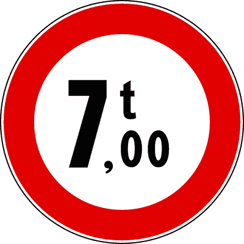
- **📖 الترجمة السياقية:** الإشارة الموضحة تمنع مرور المركبات التي يزيد وزنها الفعلي عن الوزن الموضح.
- **💡 الشرح والقاعدة المرورية:** إشارة "ممنوع مرور المركبات التي يزيد وزنها الفعلي عن 7 أطنان" (دائرة بيضاء بإطار أحمر و7t - م 118 لائحة تنفيذية): تمنع أي مركبة تتجاوز كتلتها الفعلية (massa effettiva) وقت العبور 7 أطنان حماية للمنشأة. العبارة صحيحة.
- **⚠️ كشف الفخ:** massa effettiva superiore: المعنى القانوني الدقيق، العبرة بالوزن الفعلي.
- **🔑 الكلمات المفتاحية:** `massa effettiva oltre 7 t (وزن فعلي يتجاوز 7 أطنان)` | `segnale di divieto (إشارة منع)`

---

**320.** Il segnale raffigurato, integrato con pannello, può vietare il transito contemporaneo di più veicoli
- **الإجابة:** `VERO ✅ (صح)`
- 
- **📖 الترجمة السياقية:** الإشارة الموضحة، مع لوحة إضافية، يمكن أن تمنع المرور المتزامن لأكثر من مركبة.
- **💡 الشرح والقاعدة المرورية:** إشارة "ممنوع مرور المركبات التي يزيد وزنها الفعلي عن 7 أطنان" (دائرة بيضاء بإطار أحمر و7t - م 118 لائحة تنفيذية): يجوز استكمالها بلوحة تمنع مرور مركبتين ثقيلتين في نفس الوقت على الجسر (transito non contemporaneo). العبارة صحيحة.
- **⚠️ كشف الفخ:** vietare il transito contemporaneo: استخدام نظامي شائع فوق الجسور.
- **🔑 الكلمات المفتاحية:** `massa effettiva oltre 7 t (وزن فعلي يتجاوز 7 أطنان)` | `ponte (جسر)` | `pannello integrativo (لوحة إضافية)`

---

**321.** Il segnale raffigurato vieta il transito agli autocarri di tara superiore a 7 tonnellate
- **الإجابة:** `VERO ✅ (صح)`
- 
- **📖 الترجمة السياقية:** الإشارة الموضحة تمنع مرور الشاحنات التي يزيد وزنها الفارغ (tara) عن 7 أطنان.
- **💡 الشرح والقاعدة المرورية:** إشارة "ممنوع مرور المركبات التي يزيد وزنها الفعلي عن 7 أطنان" (دائرة بيضاء بإطار أحمر و7t - م 118 لائحة تنفيذية): إذا كان وزن الشاحنة وهي فارغة يتجاوز 7 أطنان، فوزنها الفعلي حتماً يفوق 7 أطنان وممنوعة من العبور. العبارة صحيحة.
- **⚠️ كشف الفخ:** tara superiore a 7 tonnellate: صحيح، لأن الوزن الفعلي سيفوق 7 أطنان بالضرورة.
- **🔑 الكلمات المفتاحية:** `massa effettiva oltre 7 t (وزن فعلي يتجاوز 7 أطنان)` | `tara (وزن فارغ)` | `autocarri (شاحنات نقل بضائع)`

---

**322.** In presenza del segnale raffigurato è consentito il transito di una macchina agricola di massa a pieno carico pari a 7 tonnellate
- **الإجابة:** `VERO ✅ (صح)`
- 
- **📖 الترجمة السياقية:** في وجود الإشارة الموضحة، يُسمح بمرور آلة زراعية تبلغ كتلتها الإجمالية بحمولة كاملة 7 أطنان.
- **💡 الشرح والقاعدة المرورية:** إشارة "ممنوع مرور المركبات التي يزيد وزنها الفعلي عن 7 أطنان" (دائرة بيضاء بإطار أحمر و7t - م 118 لائحة تنفيذية): وزن 7 أطنان مساوٍ للحد المسموح تماماً ولا يتجاوزه، فيجوز لها العبور بأمان. العبارة صحيحة.
- **⚠️ كشف الفخ:** pari a 7 tonnellate: الوزن المساوي للحد مسموح والمنع لما يفوقه.
- **🔑 الكلمات المفتاحية:** `massa effettiva oltre 7 t (وزن فعلي يتجاوز 7 أطنان)` | `macchina agricola (آلة زراعية)`

---

**323.** Il segnale raffigurato si può trovare prima di un ponte
- **الإجابة:** `VERO ✅ (صح)`
- 
- **📖 الترجمة السياقية:** الإشارة الموضحة يمكن أن توجد قبل جسر.
- **💡 الشرح والقاعدة المرورية:** إشارة "ممنوع مرور المركبات التي يزيد وزنها الفعلي عن 7 أطنان" (دائرة بيضاء بإطار أحمر و7t - م 118 لائحة تنفيذية): موقع كلاسيكي قبل الجسور والكباري ذات القدرة الإنشائية المحدودة على تحمل الأوزان الثقيلة. العبارة صحيحة.
- **⚠️ كشف الفخ:** prima di un ponte: صحيح، توضع لحماية الجسور من الانهيار.
- **🔑 الكلمات المفتاحية:** `massa effettiva oltre 7 t (وزن فعلي يتجاوز 7 أطنان)` | `ponte (جسر)`

---

**324.** In presenza del segnale raffigurato è consentito il transito ai veicoli il cui asse più caricato ha massa superiore a quella indicata
- **الإجابة:** `FALSO ❌ (خطأ)`
- 
- **📖 الترجمة السياقية:** في وجود الإشارة الموضحة، يُسمح بمرور المركبات التي يزيد وزن محورها الأكثر تحميلاً عن الوزن الموضح.
- **💡 الشرح والقاعدة المرورية:** إشارة "ممنوع مرور المركبات التي يزيد وزنها الفعلي عن 7 أطنان" (دائرة بيضاء بإطار أحمر و7t - م 118 لائحة تنفيذية): إذا كان محور واحد فقط يفوق 7 أطنان، فالمركبة ككل تزن أكثر من 7 أطنان وممنوعة قطعاً. العبارة خاطئة.
- **⚠️ كشف الفخ:** asse più caricato superiore: ممنوع، فالوزن الكلي سيتجاوز 7 أطنان حتماً.
- **🔑 الكلمات المفتاحية:** `massa effettiva oltre 7 t (وزن فعلي يتجاوز 7 أطنان)` | `asse (محور)`

---

**325.** Il segnale raffigurato, nei centri abitati, vige dalle ore 8.00 alle ore 20.00
- **الإجابة:** `FALSO ❌ (خطأ)`
- 
- **📖 الترجمة السياقية:** تسري الإشارة الموضحة، داخل التجمعات السكنية، من الساعة 8:00 صباحاً حتى 20:00 مساءً.
- **💡 الشرح والقاعدة المرورية:** إشارة "ممنوع مرور المركبات التي يزيد وزنها الفعلي عن 7 أطنان" (دائرة بيضاء بإطار أحمر و7t - م 118 لائحة تنفيذية): المنع دائم 24 ساعة لأن تحمل الجسر للأوزان ثابت ولا يتغير بتغير الوقت. العبارة خاطئة.
- **⚠️ كشف الفخ:** dalle 8.00 alle 20.00: فخ التوقيت النهاري؛ المنع دائم.
- **🔑 الكلمات المفتاحية:** `massa effettiva oltre 7 t (وزن فعلي يتجاوز 7 أطنان)` | `orario (توقيت)`

---

**326.** In presenza del segnale raffigurato è consentito il transito di autobus di massa superiore a 7 tonnellate
- **الإجابة:** `FALSO ❌ (خطأ)`
- 
- **📖 الترجمة السياقية:** في وجود الإشارة الموضحة، يُسمح بمرور الحافلات التي يزيد وزنها عن 7 أطنان.
- **💡 الشرح والقاعدة المرورية:** إشارة "ممنوع مرور المركبات التي يزيد وزنها الفعلي عن 7 أطنان" (دائرة بيضاء بإطار أحمر و7t - م 118 لائحة تنفيذية): الحظر هندسي يخص سلامة الجسر ويسري على جميع المركبات بما فيها الحافلات الثقيلة دون استثناء. العبارة خاطئة.
- **⚠️ كشف الفخ:** consente ad autobus oltre 7 t: خطأ، الحافلات ممنوعة أيضاً إذا تجاوزت الوزن.
- **🔑 الكلمات المفتاحية:** `massa effettiva oltre 7 t (وزن فعلي يتجاوز 7 أطنان)` | `autobus (حافلات ركاب)`

---

**327.** Il segnale raffigurato vieta il transito ai soli veicoli per trasporto merci di massa superiore a 7 tonnellate
- **الإجابة:** `FALSO ❌ (خطأ)`
- 
- **📖 الترجمة السياقية:** الإشارة الموضحة تمنع المرور فقط على مركبات نقل البضائع التي يزيد وزنها عن 7 أطنان.
- **💡 الشرح والقاعدة المرورية:** إشارة "ممنوع مرور المركبات التي يزيد وزنها الفعلي عن 7 أطنان" (دائرة بيضاء بإطار أحمر و7t - م 118 لائحة تنفيذية): لفظ (soli) خاطئ؛ تسري على أي مركبة تفوق 7 أطنان سواء لنقل البضائع أو الأشخاص. العبارة خاطئة.
- **⚠️ كشف الفخ:** ai soli veicoli trasporto merci: فخ؛ المنع عام لكافة أنواع المركبات.
- **🔑 الكلمات المفتاحية:** `massa effettiva oltre 7 t (وزن فعلي يتجاوز 7 أطنان)` | `trasporto merci (نقل بضائع)`

---

**328.** Il segnale raffigurato vieta il transito ai veicoli di lunghezza superiore a 7 metri
- **الإجابة:** `FALSO ❌ (خطأ)`
- 
- **📖 الترجمة السياقية:** الإشارة الموضحة تمنع مرور المركبات التي يزيد طولها عن 7 أمتار.
- **💡 الشرح والقاعدة المرورية:** إشارة "ممنوع مرور المركبات التي يزيد وزنها الفعلي عن 7 أطنان" (دائرة بيضاء بإطار أحمر و7t - م 118 لائحة تنفيذية): الحرف t يرمز للطن (وزن) وليس للمتر (طول). العبارة خاطئة.
- **⚠️ كشف الفخ:** lunghezza superiore a 7 metri: خلط بين الوزن بالأطنان والطول بالأمتار.
- **🔑 الكلمات المفتاحية:** `massa effettiva oltre 7 t (وزن فعلي يتجاوز 7 أطنان)` | `lunghezza (طول)`

---

## 📌 Massa per asse (10 domande)

**329.** Il segnale raffigurato vieta il transito ai veicoli aventi sull'asse più caricato una massa effettiva superiore a quella indicata
- **الإجابة:** `VERO ✅ (صح)`
- 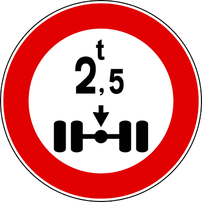
- **📖 الترجمة السياقية:** الإشارة الموضحة تمنع مرور المركبات التي يزيد وزنها الفعلي على المحور الأكثر تحميلاً عن الوزن الموضح.
- **💡 الشرح والقاعدة المرورية:** إشارة "ممنوع مرور المركبات التي يزيد وزن محورها عن 2.5 طن" (دائرة بيضاء بإطار أحمر ومحور و2.5t - م 118 لائحة تنفيذية): تحدد أقصى وزن فعلي مسموح به على المحور الواحد (2.5 طن) لحماية أسطح الطرق والجسور. العبارة صحيحة.
- **⚠️ كشف الفخ:** sull'asse più caricato: المعنى النظامي الصريح لحمولة المحور.
- **🔑 الكلمات المفتاحية:** `massa per asse oltre 2,5 t (وزن على المحور يتجاوز 2.5 طن)` | `asse (محور)` | `segnale di divieto (إشارة منع)`

---

**330.** In presenza del segnale raffigurato è consentito il transito di autocarri aventi massa effettiva per asse di 2,5 tonnellate
- **الإجابة:** `VERO ✅ (صح)`
- 
- **📖 الترجمة السياقية:** في وجود الإشارة الموضحة، يُسمح بمرور الشاحنات التي يبلغ وزنها الفعلي للمحور 2.5 طن.
- **💡 الشرح والقاعدة المرورية:** إشارة "ممنوع مرور المركبات التي يزيد وزن محورها عن 2.5 طن" (دائرة بيضاء بإطار أحمر ومحور و2.5t - م 118 لائحة تنفيذية): وزن 2.5 طن على المحور مساوٍ للحد الأقصى تماماً ولا يتجاوزه، فيسمح لها بالمرور. العبارة صحيحة.
- **⚠️ كشف الفخ:** massa effettiva per asse di 2,5 t: المساواة للحد مسموحة والمنع لما يفوقها.
- **🔑 الكلمات المفتاحية:** `massa per asse oltre 2,5 t (وزن على المحور يتجاوز 2.5 طن)` | `autocarri (شاحنات نقل بضائع)`

---

**331.** Il segnale raffigurato vieta il transito ai veicoli aventi una massa effettiva per asse superiore a 2,5 tonnellate
- **الإجابة:** `VERO ✅ (صح)`
- 
- **📖 الترجمة السياقية:** الإشارة الموضحة تمنع مرور المركبات التي تتجاوز كتلتها الفعلية لكل محور 2.5 طن.
- **💡 الشرح والقاعدة المرورية:** إشارة "ممنوع مرور المركبات التي يزيد وزن محورها عن 2.5 طن" (دائرة بيضاء بإطار أحمر ومحور و2.5t - م 118 لائحة تنفيذية): تمنع أي مركبة تفرغ حمولة تفوق 2.5 طن على أي من محاورها على سطح الطريق. العبارة صحيحة.
- **⚠️ كشف الفخ:** superiore a 2,5 tonnellate: صحيح، المنع لما يتجاوز هذا القياس.
- **🔑 الكلمات المفتاحية:** `massa per asse oltre 2,5 t (وزن على المحور يتجاوز 2.5 طن)` | `segnale di prescrizione (إشارة أمر/تنظيمية)`

---

**332.** Il segnale raffigurato fa riferimento alla massa effettiva sull'asse al momento del transito
- **الإجابة:** `VERO ✅ (صح)`
- 
- **📖 الترجمة السياقية:** تشير الإشارة الموضحة إلى الكتلة الفعلية الواقعة على المحور في لحظة المرور.
- **💡 الشرح والقاعدة المرورية:** إشارة "ممنوع مرور المركبات التي يزيد وزن محورها عن 2.5 طن" (دائرة بيضاء بإطار أحمر ومحور و2.5t - م 118 لائحة تنفيذية): العبرة بالوزن الحقيقي والفعلي المفرغ على المحور لحظة العبور فوق الطريق. العبارة صحيحة.
- **⚠️ كشف الفخ:** al momento del transito: صحيح، العبرة بالوزن الفعلي لحظة المرور.
- **🔑 الكلمات المفتاحية:** `massa per asse oltre 2,5 t (وزن على المحور يتجاوز 2.5 طن)` | `momento del transito (لحظة المرور)`

---

**333.** Il segnale raffigurato può trovarsi prima di un ponte
- **الإجابة:** `VERO ✅ (صح)`
- 
- **📖 الترجمة السياقية:** الإشارة الموضحة يمكن أن توجد قبل جسر.
- **💡 الشرح والقاعدة المرورية:** إشارة "ممنوع مرور المركبات التي يزيد وزن محورها عن 2.5 طن" (دائرة بيضاء بإطار أحمر ومحور و2.5t - م 118 لائحة تنفيذية): توضع قبل الجسور وأغطية القنوات والأنفاق الضعيفة لحمايتها من الانهيار الموضعي. العبارة صحيحة.
- **⚠️ كشف الفخ:** prima di un ponte: صحيح، موقع معتمد لحماية الجسور.
- **🔑 الكلمات المفتاحية:** `massa per asse oltre 2,5 t (وزن على المحور يتجاوز 2.5 طن)` | `ponte (جسر)`

---

**334.** Il segnale raffigurato obbliga i veicoli aventi massa per asse superiore a 2,5 tonnellate a procedere a passo d'uomo
- **الإجابة:** `FALSO ❌ (خطأ)`
- 
- **📖 الترجمة السياقية:** الإشارة الموضحة تُلزم المركبات التي يزيد وزن محورها عن 2.5 طن بالسير بخطوة المشي.
- **💡 الشرح والقاعدة المرورية:** إشارة "ممنوع مرور المركبات التي يزيد وزن محورها عن 2.5 طن" (دائرة بيضاء بإطار أحمر ومحور و2.5t - م 118 لائحة تنفيذية): المرور محظور تماماً ولا يُسمح بالسير لا بسرعة عادية ولا بخطوة المشي (passo d'uomo). العبارة خاطئة.
- **⚠️ كشف الفخ:** procedere a passo d'uomo: خطأ، العبور ممنوع كلياً.
- **🔑 الكلمات المفتاحية:** `massa per asse oltre 2,5 t (وزن على المحور يتجاوز 2.5 طن)` | `passo d'uomo (خطوة المشي)`

---

**335.** Il segnale raffigurato vieta il transito agli autocarri di massa complessiva superiore a quella indicata
- **الإجابة:** `FALSO ❌ (خطأ)`
- 
- **📖 الترجمة السياقية:** الإشارة الموضحة تمنع مرور الشاحنات ذات الوزن الإجمالي الكلي الذي يزيد عن الوزن الموضح.
- **💡 الشرح والقاعدة المرورية:** إشارة "ممنوع مرور المركبات التي يزيد وزن محورها عن 2.5 طن" (دائرة بيضاء بإطار أحمر ومحور و2.5t - م 118 لائحة تنفيذية): المنع يتعلق بحمولة المحور الواحد (massa per asse) وليس بالوزن الكلي للمركبة. العبارة خاطئة.
- **⚠️ كشف الفخ:** massa complessiva: فخ؛ الرقم يخص المحور وليس الوزن الكلي.
- **🔑 الكلمات المفتاحية:** `massa per asse oltre 2,5 t (وزن على المحور يتجاوز 2.5 طن)` | `massa complessiva (وزن إجمالي)`

---

**336.** Il segnale raffigurato vale solo per autoveicoli con ruote gemellate
- **الإجابة:** `FALSO ❌ (خطأ)`
- 
- **📖 الترجمة السياقية:** تسري الإشارة الموضحة فقط على المركبات الآلية ذات العجلات المزدوجة (التوأم).
- **💡 الشرح والقاعدة المرورية:** إشارة "ممنوع مرور المركبات التي يزيد وزن محورها عن 2.5 طن" (دائرة بيضاء بإطار أحمر ومحور و2.5t - م 118 لائحة تنفيذية): تسري على كافة المركبات ومحاورها بصرف النظر عن كون العجلات فردية أو مزدوجة. العبارة خاطئة.
- **⚠️ كشف الفخ:** solo con ruote gemellate: قصر باطل؛ المنع عام لجميع المحاور.
- **🔑 الكلمات المفتاحية:** `massa per asse oltre 2,5 t (وزن على المحور يتجاوز 2.5 طن)` | `ruote gemellate (عجلات مزدوجة)`

---

**337.** Il segnale raffigurato nei centri abitati vige dalle ore 8.00 alle ore 20.00
- **الإجابة:** `FALSO ❌ (خطأ)`
- 
- **📖 الترجمة السياقية:** تسري الإشارة الموضحة داخل التجمعات السكنية من الساعة 8:00 صباحاً حتى 20:00 مساءً.
- **💡 الشرح والقاعدة المرورية:** إشارة "ممنوع مرور المركبات التي يزيد وزن محورها عن 2.5 طن" (دائرة بيضاء بإطار أحمر ومحور و2.5t - م 118 لائحة تنفيذية): المنع دائم على مدار 24 ساعة لحماية سلامة المنشآت الطرقية. العبارة خاطئة.
- **⚠️ كشف الفخ:** dalle 8.00 alle 20.00: فخ التوقيت النهاري؛ المنع دائم.
- **🔑 الكلمات المفتاحية:** `massa per asse oltre 2,5 t (وزن على المحور يتجاوز 2.5 طن)` | `orario (توقيت)`

---

**338.** Il segnale raffigurato vieta il transito a tutti i veicoli con massa complessiva a pieno carico superiore a 2,5 tonnellate
- **الإجابة:** `FALSO ❌ (خطأ)`
- 
- **📖 الترجمة السياقية:** الإشارة الموضحة تمنع المرور على جميع المركبات التي تزيد كتلتها الإجمالية بحمولة كاملة عن 2.5 طن.
- **💡 الشرح والقاعدة المرورية:** إشارة "ممنوع مرور المركبات التي يزيد وزن محورها عن 2.5 طن" (دائرة بيضاء بإطار أحمر ومحور و2.5t - م 118 لائحة تنفيذية): مركبة تزن 4 أطنان موزعة بالتساوي 2 طن على كل محور يحق لها المرور؛ المنع للمحور الواحد وليس للمجموع. العبارة خاطئة.
- **⚠️ كشف الفخ:** massa complessiva oltre 2,5 t: فخ الخلط بين الوزن الكلي ووزن المحور.
- **🔑 الكلمات المفتاحية:** `massa per asse oltre 2,5 t (وزن على المحور يتجاوز 2.5 طن)` | `massa complessiva (وزن إجمالي)`

---

## 📌 Fine prescrizione (10 domande)

**339.** Il segnale raffigurato indica la fine delle prescrizioni precedentemente imposte
- **الإجابة:** `VERO ✅ (صح)`
- 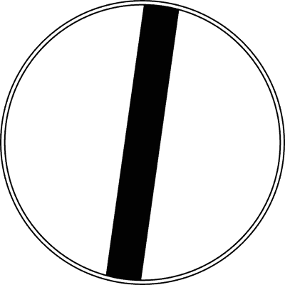
- **📖 الترجمة السياقية:** الإشارة الموضحة تدل على نهاية الأوامر والقيود المفروضة مسبقاً.
- **💡 الشرح والقاعدة المرورية:** إشارة "نهاية جميع الموانع والأوامر السابقة / طريق حر" (دائرة بيضاء بشريط رمادي مائل - م 119 لائحة تنفيذية): تلغي سريان كافة إشارات المنع السابقة على هذا الطريق وتُعيد السير للقواعد العامة. العبارة صحيحة.
- **⚠️ كشف الفخ:** fine delle prescrizioni: المعنى القانوني الدقيق للإشارة.
- **🔑 الكلمات المفتاحية:** `fine prescrizione / via libera (نهاية الأوامر والمنع / طريق حر)` | `segnale di prescrizione (إشارة أمر/تنظيمية)`

---

**340.** Il segnale raffigurato indica la fine di divieti precedentemente imposti
- **الإجابة:** `VERO ✅ (صح)`
- 
- **📖 الترجمة السياقية:** الإشارة الموضحة تدل على نهاية الموانع المفروضة مسبقاً.
- **💡 الشرح والقاعدة المرورية:** إشارة "نهاية جميع الموانع والأوامر السابقة / طريق حر" (دائرة بيضاء بشريط رمادي مائل - م 119 لائحة تنفيذية): تنهي مفعول موانع التجاوز أو السرعة أو استعمال المنبه التي سبقتها. العبارة صحيحة.
- **⚠️ كشف الفخ:** fine di divieti precedentemente imposti: صحيح، نهاية الموانع السابقة.
- **🔑 الكلمات المفتاحية:** `fine prescrizione / via libera (نهاية الأوامر والمنع / طريق حر)` | `segnale di divieto (إشارة منع)`

---

**341.** Il segnale raffigurato è un segnale di via libera
- **الإجابة:** `VERO ✅ (صح)`
- 
- **📖 الترجمة السياقية:** الإشارة الموضحة هي إشارة "طريق حر" (via libera).
- **💡 الشرح والقاعدة المرورية:** إشارة "نهاية جميع الموانع والأوامر السابقة / طريق حر" (دائرة بيضاء بشريط رمادي مائل - م 119 لائحة تنفيذية): هذا هو المسمى والاسم العرفي الشائع المعتمد في قانون المرور الإيطالي (via libera). العبارة صحيحة.
- **⚠️ كشف الفخ:** segnale di via libera: التسمية المعتمدة للإشارة.
- **🔑 الكلمات المفتاحية:** `fine prescrizione / via libera (نهاية الأوامر والمنع / طريق حر)` | `via libera (طريق حر)`

---

**342.** Il segnale raffigurato è un segnale di fine prescrizione
- **الإجابة:** `VERO ✅ (صح)`
- 
- **📖 الترجمة السياقية:** الإشارة الموضحة هي إشارة نهاية أمر تنظيمي.
- **💡 الشرح والقاعدة المرورية:** إشارة "نهاية جميع الموانع والأوامر السابقة / طريق حر" (دائرة بيضاء بشريط رمادي مائل - م 119 لائحة تنفيذية): تصنف رسمياً ضمن فئة إشارات نهاية الأوامر التنظيمية (fine prescrizione). العبارة صحيحة.
- **⚠️ كشف الفخ:** fine prescrizione: التصنيف الرسمي للإشارة.
- **🔑 الكلمات المفتاحية:** `fine prescrizione / via libera (نهاية الأوامر والمنع / طريق حر)` | `segnale di prescrizione (إشارة أمر/تنظيمية)`

---

**343.** Il segnale raffigurato indica il punto dal quale le prescrizioni precedentemente indicate non sono più valide
- **الإجابة:** `VERO ✅ (صح)`
- 
- **📖 الترجمة السياقية:** الإشارة الموضحة تشير إلى النقطة التي تصبح بعدها الأوامر السابقة غير سارية.
- **💡 الشرح والقاعدة المرورية:** إشارة "نهاية جميع الموانع والأوامر السابقة / طريق حر" (دائرة بيضاء بشريط رمادي مائل - م 119 لائحة تنفيذية): يبدأ رفع القيود وسقوط المنع فور تجاوز نقطة تثبيت هذه الإشارة. العبارة صحيحة.
- **⚠️ كشف الفخ:** non sono più valide: صحيح، تنتهي صلاحية المنع من هذه النقطة.
- **🔑 الكلمات المفتاحية:** `fine prescrizione / via libera (نهاية الأوامر والمنع / طريق حر)` | `segnale di prescrizione (إشارة أمر/تنظيمية)`

---

**344.** Il segnale raffigurato indica la fine di un cantiere di lavoro
- **الإجابة:** `FALSO ❌ (خطأ)`
- 
- **📖 الترجمة السياقية:** الإشارة الموضحة تدل على نهاية ورشة أشغال طريق.
- **💡 الشرح والقاعدة المرورية:** إشارة "نهاية جميع الموانع والأوامر السابقة / طريق حر" (دائرة بيضاء بشريط رمادي مائل - م 119 لائحة تنفيذية): نهاية ورش العمل يُشار إليها بلافتات ذات خلفية صفراء، وهذه لافتة عامة لنهاية المنع بخلفية بيضاء. العبارة خاطئة.
- **⚠️ كشف الفخ:** fine di un cantiere: خلط مع لافتات ورش الطرق الصفراء.
- **🔑 الكلمات المفتاحية:** `fine prescrizione / via libera (نهاية الأوامر والمنع / طريق حر)` | `cantiere (ورشة أشغال)`

---

**345.** Il segnale raffigurato riguarda soltanto i veicoli in servizio pubblico
- **الإجابة:** `FALSO ❌ (خطأ)`
- 
- **📖 الترجمة السياقية:** الإشارة الموضحة تخص فقط مركبات الخدمة العامة.
- **💡 الشرح والقاعدة المرورية:** إشارة "نهاية جميع الموانع والأوامر السابقة / طريق حر" (دائرة بيضاء بشريط رمادي مائل - م 119 لائحة تنفيذية): الإشارة عامة وترفع القيود عن كافة مستخدمي الطريق وجميع المركبات. العبارة خاطئة.
- **⚠️ كشف الفخ:** soltanto veicoli in servizio pubblico: قصر باطل، الإشارة للجميع.
- **🔑 الكلمات المفتاحية:** `fine prescrizione / via libera (نهاية الأوامر والمنع / طريق حر)` | `servizio pubblico (خدمة عامة)`

---

**346.** Il segnale raffigurato è un segnale di indicazione
- **الإجابة:** `FALSO ❌ (خطأ)`
- 
- **📖 الترجمة السياقية:** الإشارة الموضحة هي إشارة إرشادية.
- **💡 الشرح والقاعدة المرورية:** إشارة "نهاية جميع الموانع والأوامر السابقة / طريق حر" (دائرة بيضاء بشريط رمادي مائل - م 119 لائحة تنفيذية): تصنف كإشارة نهاية أمر تنظيمي (fine prescrizione) مرتبطة بإشارات المنع وليست إشارة إرشادية عادية. العبارة خاطئة.
- **⚠️ كشف الفخ:** segnale di indicazione: خطأ، تتبع إشارات الأوامر التنظيمية.
- **🔑 الكلمات المفتاحية:** `fine prescrizione / via libera (نهاية الأوامر والمنع / طريق حر)` | `indicazione (إرشاد)`

---

**347.** Il segnale raffigurato indica la fine di un centro abitato
- **الإجابة:** `FALSO ❌ (خطأ)`
- 
- **📖 الترجمة السياقية:** الإشارة الموضحة تدل على نهاية تجمع سكني (مدينة أو قرية).
- **💡 الشرح والقاعدة المرورية:** إشارة "نهاية جميع الموانع والأوامر السابقة / طريق حر" (دائرة بيضاء بشريط رمادي مائل - م 119 لائحة تنفيذية): نهاية المدينة تكون بلافتة مستطيلة تحمل اسم المدينة مشطوباً بخط أحمر مائل. العبارة خاطئة.
- **⚠️ كشف الفخ:** fine di un centro abitato: خلط مع لافتة نهاية المدينة المستطيلة.
- **🔑 الكلمات المفتاحية:** `fine prescrizione / via libera (نهاية الأوامر والمنع / طريق حر)` | `centro abitato (تجمع سكني)`

---

**348.** Il segnale raffigurato indica la fine del pericolo precedentemente segnalato
- **الإجابة:** `FALSO ❌ (خطأ)`
- 
- **📖 الترجمة السياقية:** الإشارة الموضحة تدل على نهاية الخطر المشار إليه مسبقاً.
- **💡 الشرح والقاعدة المرورية:** إشارة "نهاية جميع الموانع والأوامر السابقة / طريق حر" (دائرة بيضاء بشريط رمادي مائل - م 119 لائحة تنفيذية): إشارات الخطر تنتهي بطبيعتها بانتهاء موقع الخطر ولا توضع لها إشارة نهاية؛ الإشارة تنهي الموانع والأوامر فقط. العبارة خاطئة.
- **⚠️ كشف الفخ:** fine del pericolo: خطأ، تنهي الأوامر والموانع وليس الأخطار.
- **🔑 الكلمات المفتاحية:** `fine prescrizione / via libera (نهاية الأوامر والمنع / طريق حر)` | `pericolo (خطر)`

---

## 📌 Fine prescrizione velocita (12 domande)

**349.** Il segnale raffigurato indica la fine di una prescrizione
- **الإجابة:** `VERO ✅ (صح)`
- 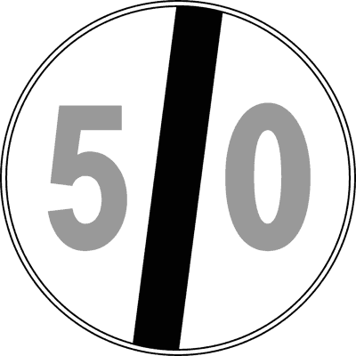
- **📖 الترجمة السياقية:** الإشارة الموضحة تدل على نهاية أمر تنظيمي.
- **💡 الشرح والقاعدة المرورية:** إشارة "نهاية الحد الأقصى للسرعة" (دائرة بيضاء برقم سرعة مشطوب برمادي - م 119 لائحة تنفيذية): الخط المائل الرمادي فوق رقم السرعة يلغي سريان الحد الأقصى للسرعة السابق. العبارة صحيحة.
- **⚠️ كشف الفخ:** fine di una prescrizione: صحيح، تلغي حداً أقصى سابقاً للسرعة.
- **🔑 الكلمات المفتاحية:** `fine limite di velocità (نهاية الحد الأقصى للسرعة)` | `segnale di prescrizione (إشارة أمر/تنظيمية)`

---

**350.** Il segnale raffigurato indica la fine del limite massimo di velocità
- **الإجابة:** `VERO ✅ (صح)`
- 
- **📖 الترجمة السياقية:** الإشارة الموضحة تدل على نهاية الحد الأقصى للسرعة.
- **💡 الشرح والقاعدة المرورية:** إشارة "نهاية الحد الأقصى للسرعة" (دائرة بيضاء برقم سرعة مشطوب برمادي - م 119 لائحة تنفيذية): هذا هو الاسم والمدلول القانوني الرسمي للإشارة (fine del limite massimo di velocità). العبارة صحيحة.
- **⚠️ كشف الفخ:** fine del limite massimo di velocità: التسمية الرسمية المعتمدة.
- **🔑 الكلمات المفتاحية:** `fine limite di velocità (نهاية الحد الأقصى للسرعة)` | `limite massimo (حد أقصى)`

---

**351.** Il segnale raffigurato consente di circolare a velocità superiore a 50 km/h
- **الإجابة:** `VERO ✅ (صح)`
- 
- **📖 الترجمة السياقية:** الإشارة الموضحة تسمح بالسير بسرعة تفوق 50 كم/س.
- **💡 الشرح والقاعدة المرورية:** إشارة "نهاية الحد الأقصى للسرعة 50 كم/س" (دائرة بيضاء برقم 50 مشطوب برمادي - م 119 لائحة تنفيذية): بانتهاء الحد الخاص (50 كم/س)، يجوز القيادة بسرعات أعلى وفق الحدود العامة للسرعة المقررة للطريق. العبارة صحيحة.
- **⚠️ كشف الفخ:** consente oltre 50 km/h: صحيح، زال القيد ويسمح بتجاوز 50 ضمن حدود الطريق العامة.
- **🔑 الكلمات المفتاحية:** `fine limite di velocità (نهاية الحد الأقصى للسرعة)` | `velocità (سرعة)`

---

**352.** Il segnale raffigurato consente di circolare entro i limiti di velocità vigenti per quel tipo di strada
- **الإجابة:** `VERO ✅ (صح)`
- 
- **📖 الترجمة السياقية:** الإشارة الموضحة تسمح بالسير ضمن حدود السرعة السارية على ذلك النوع من الطرق.
- **💡 الشرح والقاعدة المرورية:** إشارة "نهاية الحد الأقصى للسرعة 50 كم/س" (دائرة بيضاء برقم 50 مشطوب برمادي - م 119 لائحة تنفيذية): تعيد السائقين للالتزام بالحدود القصوى العامة للطريق (مثل 50 أو 90 أو 110 أو 130 كم/س). العبارة صحيحة.
- **⚠️ كشف الفخ:** entro i limiti di velocità vigenti: صحيح، تعود السرعة للحدود العامة للطريق.
- **🔑 الكلمات المفتاحية:** `fine limite di velocità (نهاية الحد الأقصى للسرعة)` | `segnale di prescrizione (إشارة أمر/تنظيمية)`

---

**353.** Il segnale raffigurato consente di marciare anche a velocità inferiore a 50 km/h
- **الإجابة:** `VERO ✅ (صح)`
- 
- **📖 الترجمة السياقية:** الإشارة الموضحة تسمح بالسير أيضاً بسرعة تقل عن 50 كم/س.
- **💡 الشرح والقاعدة المرورية:** إشارة "نهاية الحد الأقصى للسرعة 50 كم/س" (دائرة بيضاء برقم 50 مشطوب برمادي - م 119 لائحة تنفيذية): السير بسرعات أقل من 50 كم/س يظل مسموحاً ومشروعاً بما لا يعطل حركة السير. العبارة صحيحة.
- **⚠️ كشف الفخ:** anche a velocità inferiore: صحيح، السير بأقل من 50 مسموح به أيضاً.
- **🔑 الكلمات المفتاحية:** `fine limite di velocità (نهاية الحد الأقصى للسرعة)` | `velocità inferiore (سرعة أقل)`

---

**354.** Il segnale raffigurato indica la fine del relativo divieto
- **الإجابة:** `VERO ✅ (صح)`
- 
- **📖 الترجمة السياقية:** الإشارة الموضحة تدل على نهاية المنع المتعلق بها.
- **💡 الشرح والقاعدة المرورية:** إشارة "نهاية الحد الأقصى للسرعة 50 كم/س" (دائرة بيضاء برقم 50 مشطوب برمادي - م 119 لائحة تنفيذية): تنهي مفعول حظر تجاوز سرعة 50 كم/س الذي كان مفروضاً مسبقاً. العبارة صحيحة.
- **⚠️ كشف الفخ:** fine del relativo divieto: المعنى النظامي الصريح للإشارة.
- **🔑 الكلمات المفتاحية:** `fine limite di velocità (نهاية الحد الأقصى للسرعة)` | `segnale di divieto (إشارة منع)`

---

**355.** Il segnale raffigurato indica il limite di velocità per tutti i veicoli
- **الإجابة:** `FALSO ❌ (خطأ)`
- 
- **📖 الترجمة السياقية:** الإشارة الموضحة تدل على حد السرعة لجميع المركبات.
- **💡 الشرح والقاعدة المرورية:** إشارة "نهاية الحد الأقصى للسرعة 50 كم/س" (دائرة بيضاء برقم 50 مشطوب برمادي - م 119 لائحة تنفيذية): لا تفرض حداً جديداً بل تنهي وتلغي حداً سابقاً؛ الخط المائل يعني دائماً نهاية المنع. العبارة خاطئة.
- **⚠️ كشف الفخ:** indica il limite di velocità: خطأ، هي نهاية الحد وليست بدايته.
- **🔑 الكلمات المفتاحية:** `fine limite di velocità (نهاية الحد الأقصى للسرعة)` | `segnale di prescrizione (إشارة أمر/تنظيمية)`

---

**356.** Il segnale raffigurato vieta di superare la velocità di 50 km/h
- **الإجابة:** `FALSO ❌ (خطأ)`
- 
- **📖 الترجمة السياقية:** الإشارة الموضحة تمنع تجاوز سرعة 50 كم/س.
- **💡 الشرح والقاعدة المرورية:** إشارة "نهاية الحد الأقصى للسرعة 50 كم/س" (دائرة بيضاء برقم 50 مشطوب برمادي - م 119 لائحة تنفيذية): عكس الواقع تماماً؛ هي تلغي المنع وتسمح بالسير بأعلى من 50 كم/س. العبارة خاطئة.
- **⚠️ كشف الفخ:** vieta di superare 50 km/h: قلب المعنى، هي تلغي المنع ولا تفرضه.
- **🔑 الكلمات المفتاحية:** `fine limite di velocità (نهاية الحد الأقصى للسرعة)` | `segnale di divieto (إشارة منع)`

---

**357.** Il segnale raffigurato indica la fine del limite minimo di velocità
- **الإجابة:** `FALSO ❌ (خطأ)`
- 
- **📖 الترجمة السياقية:** الإشارة الموضحة تدل على نهاية الحد الأدنى للسرعة.
- **💡 الشرح والقاعدة المرورية:** إشارة "نهاية الحد الأقصى للسرعة 50 كم/س" (دائرة بيضاء برقم 50 مشطوب برمادي - م 119 لائحة تنفيذية): الإشارة ذات الخلفية البيضاء نهاية حد أقصى؛ نهاية الحد الأدنى تكون دائرة زرقاء برقم مشطوب بأحمر. العبارة خاطئة.
- **⚠️ كشف الفخ:** fine del limite minimo: خلط بين نهاية الحد الأدنى (أزرق) والأقصى (أبيض).
- **🔑 الكلمات المفتاحية:** `fine limite di velocità (نهاية الحد الأقصى للسرعة)` | `limite minimo (حد أدنى)`

---

**358.** Il segnale raffigurato indica la fine dell'obbligo di mantenere una distanza di sicurezza di almeno 50 metri
- **الإجابة:** `FALSO ❌ (خطأ)`
- 
- **📖 الترجمة السياقية:** الإشارة الموضحة تدل على نهاية إلزام الحفاظ على مسافة أمان لا تقل عن 50 متراً.
- **💡 الشرح والقاعدة المرورية:** إشارة "نهاية الحد الأقصى للسرعة 50 كم/س" (دائرة بيضاء برقم 50 مشطوب برمادي - م 119 لائحة تنفيذية): الرقم يخص السرعة بالكم/س وليس مسافة الأمان بالأمتار. العبارة خاطئة.
- **⚠️ كشف الفخ:** distanza di sicurezza di 50 metri: خلط بين السرعة ومسافة الأمان.
- **🔑 الكلمات المفتاحية:** `fine limite di velocità (نهاية الحد الأقصى للسرعة)` | `distanza di sicurezza (مسافة أمان)`

---

**359.** Il segnale raffigurato prescrive ai veicoli che non superano la velocità di 50 km/h di marciare sulla corsia di destra
- **الإجابة:** `FALSO ❌ (خطأ)`
- 
- **📖 الترجمة السياقية:** الإشارة الموضحة تفرض على المركبات التي لا تتجاوز 50 كم/س السير في المسار الأيمن.
- **💡 الشرح والقاعدة المرورية:** إشارة "نهاية الحد الأقصى للسرعة 50 كم/س" (دائرة بيضاء برقم 50 مشطوب برمادي - م 119 لائحة تنفيذية): لا تنظم مسارات السير للمركبات البطيئة، بل ترفع قيد السرعة فقط. العبارة خاطئة.
- **⚠️ كشف الفخ:** corsia di destra: لا صلة للإشارة بتوزيع الحارات.
- **🔑 الكلمات المفتاحية:** `fine limite di velocità (نهاية الحد الأقصى للسرعة)` | `corsia di destra (المسار الأيمن)`

---

**360.** Il segnale raffigurato indica la velocità consigliata
- **الإجابة:** `FALSO ❌ (خطأ)`
- 
- **📖 الترجمة السياقية:** الإشارة الموضحة تشير إلى سرعة موصى بها.
- **💡 الشرح والقاعدة المرورية:** إشارة "نهاية الحد الأقصى للسرعة 50 كم/س" (دائرة بيضاء برقم 50 مشطوب برمادي - م 119 لائحة تنفيذية): ليست سرعة موصى بها (التي تكون مربعة زرقاء)، بل نهاية حد سرعة أقصى. العبارة خاطئة.
- **⚠️ كشف الفخ:** velocità consigliata: خلط مع لافتات السرعة الموصى بها.
- **🔑 الكلمات المفتاحية:** `fine limite di velocità (نهاية الحد الأقصى للسرعة)` | `velocità consigliata (سرعة موصى بها)`

---

## 📌 Fine divieto sorpasso (14 domande)

**361.** Il segnale raffigurato indica la fine del divieto di sorpasso precedentemente imposto
- **الإجابة:** `VERO ✅ (صح)`
- 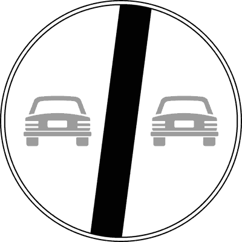
- **📖 الترجمة السياقية:** الإشارة الموضحة تدل على نهاية منع التجاوز المفروض مسبقاً.
- **💡 الشرح والقاعدة المرورية:** إشارة "نهاية منع التجاوز لجميع المركبات" (دائرة بيضاء بسيارتين مشطوبتين برمادي - م 119 لائحة تنفيذية): ترفع حظر التجاوز عن جميع المركبات الآلية وتبيح المناورة من جديد إذا سمحت الرؤية والخطوط. العبارة صحيحة.
- **⚠️ كشف الفخ:** fine del divieto di sorpasso: المعنى الأساسي المباشر للإشارة.
- **🔑 الكلمات المفتاحية:** `fine divieto di sorpasso (نهاية منع التجاوز)` | `segnale di divieto (إشارة منع)`

---

**362.** In presenza del segnale raffigurato è vietato il sorpasso se deve essere oltrepassata la striscia continua
- **الإجابة:** `VERO ✅ (صح)`
- 
- **📖 الترجمة السياقية:** في وجود الإشارة الموضحة، يُحظر التجاوز إذا كان يستلزم تخطي الخط الطولي المتصل.
- **💡 الشرح والقاعدة المرورية:** إشارة "نهاية منع التجاوز لجميع المركبات" (دائرة بيضاء بسيارتين مشطوبتين برمادي - م 119 لائحة تنفيذية): قاعدة قطعية: رفع منع التجاوز لا يبيح دهس أو عبور الخط المتصل (striscia continua) أبداً! العبارة صحيحة.
- **⚠️ كشف الفخ:** se oltrepassata striscia continua: الخط المتصل يحظر تجاوزه في كل الأحوال.
- **🔑 الكلمات المفتاحية:** `fine divieto di sorpasso (نهاية منع التجاوز)` | `striscia continua (خط متصل)`

---

**363.** Il segnale raffigurato indica il punto in cui termina il divieto di sorpasso
- **الإجابة:** `VERO ✅ (صح)`
- 
- **📖 الترجمة السياقية:** الإشارة الموضحة تدل على النقطة التي ينتهي عندها منع التجاوز.
- **💡 الشرح والقاعدة المرورية:** إشارة "نهاية منع التجاوز لجميع المركبات" (دائرة بيضاء بسيارتين مشطوبتين برمادي - م 119 لائحة تنفيذية): تحدد موضع انتهاء الحظر وبداية إمكانية التجاوز وفق القواعد العامة. العبارة صحيحة.
- **⚠️ كشف الفخ:** punto in cui termina: التوصيف الميداني الدقيق للإشارة.
- **🔑 الكلمات المفتاحية:** `fine divieto di sorpasso (نهاية منع التجاوز)` | `segnale di prescrizione (إشارة أمر/تنظيمية)`

---

**364.** Il segnale raffigurato non impone un particolare limite di velocità
- **الإجابة:** `VERO ✅ (صح)`
- 
- **📖 الترجمة السياقية:** الإشارة الموضحة لا تفرض حداً خاصاً للسرعة.
- **💡 الشرح والقاعدة المرورية:** إشارة "نهاية منع التجاوز لجميع المركبات" (دائرة بيضاء بسيارتين مشطوبتين برمادي - م 119 لائحة تنفيذية): لا ترتبط بالسرعة إطلاقاً، بل تخص مناورة التجاوز فقط. العبارة صحيحة.
- **⚠️ كشف الفخ:** non impone limite di velocità: صحيح، لا تحدد سرعة معينة.
- **🔑 الكلمات المفتاحية:** `fine divieto di sorpasso (نهاية منع التجاوز)` | `velocità (سرعة)`

---

**365.** Il segnale raffigurato può essere posto sia nei centri urbani che fuori
- **الإجابة:** `VERO ✅ (صح)`
- 
- **📖 الترجمة السياقية:** الإشارة الموضحة يمكن أن توضع داخل المدن وخارجها.
- **💡 الشرح والقاعدة المرورية:** إشارة "نهاية منع التجاوز لجميع المركبات" (دائرة بيضاء بسيارتين مشطوبتين برمادي - م 119 لائحة تنفيذية): تثبت عند نهاية مقاطع منع التجاوز في الشوارع الحضرية أو الطرق السريعة. العبارة صحيحة.
- **⚠️ كشف الفخ:** sia nei centri urbani che fuori: صحيح، توضع في كافة المناطق.
- **🔑 الكلمات المفتاحية:** `fine divieto di sorpasso (نهاية منع التجاوز)` | `strade urbane (طرق داخل المدن)` | `strade extraurbane (طرق خارج المدن)`

---

**366.** Il segnale raffigurato è un segnale di fine prescrizione
- **الإجابة:** `VERO ✅ (صح)`
- 
- **📖 الترجمة السياقية:** الإشارة الموضحة هي إشارة نهاية أمر تنظيمي.
- **💡 الشرح والقاعدة المرورية:** إشارة "نهاية منع التجاوز لجميع المركبات" (دائرة بيضاء بسيارتين مشطوبتين برمادي - م 119 لائحة تنفيذية): تصنف نظاماً كإشارة نهاية أمر تنظيمي (fine prescrizione). العبارة صحيحة.
- **⚠️ كشف الفخ:** segnale di fine prescrizione: التصنيف الرسمي للإشارة.
- **🔑 الكلمات المفتاحية:** `fine divieto di sorpasso (نهاية منع التجاوز)` | `segnale di prescrizione (إشارة أمر/تنظيمية)`

---

**367.** Il segnale raffigurato ha validità per tutte le 24 ore
- **الإجابة:** `VERO ✅ (صح)`
- 
- **📖 الترجمة السياقية:** الإشارة الموضحة تسري على مدار 24 ساعة كاملة.
- **💡 الشرح والقاعدة المرورية:** إشارة "نهاية منع التجاوز لجميع المركبات" (دائرة بيضاء بسيارتين مشطوبتين برمادي - م 119 لائحة تنفيذية): رفع المنع دائم ومستمر ليلاً ونهاراً دون توقيت محدد. العبارة صحيحة.
- **⚠️ كشف الفخ:** validità per tutte le 24 ore: صحيح، تسري طوال اليوم.
- **🔑 الكلمات المفتاحية:** `fine divieto di sorpasso (نهاية منع التجاوز)` | `24 ore (24 ساعة)`

---

**368.** Il segnale raffigurato indica la fine del divieto di sorpasso tra le sole autovetture
- **الإجابة:** `FALSO ❌ (خطأ)`
- 
- **📖 الترجمة السياقية:** الإشارة الموضحة تدل على نهاية منع التجاوز بين سيارات الركاب فقط.
- **💡 الشرح والقاعدة المرورية:** إشارة "نهاية منع التجاوز لجميع المركبات" (دائرة بيضاء بسيارتين مشطوبتين برمادي - م 119 لائحة تنفيذية): المنع المنتهي كان يشمل كافة المركبات الآلية (شاحنات، حافلات، سيارات) وليس السيارات الخاصة وحدها. العبارة خاطئة.
- **⚠️ كشف الفخ:** sole autovetture: فخ الحصر؛ المنع كان عاماً لجميع المركبات الآلية.
- **🔑 الكلمات المفتاحية:** `fine divieto di sorpasso (نهاية منع التجاوز)` | `autovetture (سيارات ركاب)`

---

**369.** Il segnale raffigurato indica la fine del divieto di transito per tutti gli autoveicoli
- **الإجابة:** `FALSO ❌ (خطأ)`
- 
- **📖 الترجمة السياقية:** الإشارة الموضحة تدل على نهاية منع المرور لجميع المركبات الآلية.
- **💡 الشرح والقاعدة المرورية:** إشارة "نهاية منع التجاوز لجميع المركبات" (دائرة بيضاء بسيارتين مشطوبتين برمادي - م 119 لائحة تنفيذية): تخص التجاوز (sorpasso) ولا صلة لها بمنع المرور والسير (transito). العبارة خاطئة.
- **⚠️ كشف الفخ:** fine divieto di transito: خلط بين منع التجاوز ومنع السير.
- **🔑 الكلمات المفتاحية:** `fine divieto di sorpasso (نهاية منع التجاوز)` | `transito (مرور)`

---

**370.** Il segnale raffigurato prescrive il divieto di marcia per file parallele
- **الإجابة:** `FALSO ❌ (خطأ)`
- 
- **📖 الترجمة السياقية:** الإشارة الموضحة تفرض منع السير في صفوف متوازية.
- **💡 الشرح والقاعدة المرورية:** إشارة "نهاية منع التجاوز لجميع المركبات" (دائرة بيضاء بسيارتين مشطوبتين برمادي - م 119 لائحة تنفيذية): لا تفرض منع السير في صفوف متوازية، بل ترفع قيد التجاوز. العبارة خاطئة.
- **⚠️ كشف الفخ:** file parallele: لا صلة للإشارة بالسير في صفوف متوازية.
- **🔑 الكلمات المفتاحية:** `fine divieto di sorpasso (نهاية منع التجاوز)` | `file parallele (صفوف متوازية)`

---

**371.** Il segnale raffigurato indica la fine del limite massimo di velocità
- **الإجابة:** `FALSO ❌ (خطأ)`
- 
- **📖 الترجمة السياقية:** الإشارة الموضحة تدل على نهاية الحد الأقصى للسرعة.
- **💡 الشرح والقاعدة المرورية:** إشارة "نهاية منع التجاوز لجميع المركبات" (دائرة بيضاء بسيارتين مشطوبتين برمادي - م 119 لائحة تنفيذية): نهاية حد السرعة تحتوي على رقم السرعة مشطوباً، بينما هذه تحمل رسم سيارتين. العبارة خاطئة.
- **⚠️ كشف الفخ:** fine limite di velocità: خلط مع لافتة نهاية السرعة.
- **🔑 الكلمات المفتاحية:** `fine divieto di sorpasso (نهاية منع التجاوز)` | `fine limite di velocità (نهاية الحد الأقصى للسرعة)`

---

**372.** Il segnale raffigurato indica la fine del divieto di sosta su entrambi i lati della strada
- **الإجابة:** `FALSO ❌ (خطأ)`
- 
- **📖 الترجمة السياقية:** الإشارة الموضحة تدل على نهاية منع الوقوف على كلا جانبي الطريق.
- **💡 الشرح والقاعدة المرورية:** إشارة "نهاية منع التجاوز لجميع المركبات" (دائرة بيضاء بسيارتين مشطوبتين برمادي - م 119 لائحة تنفيذية): لا علاقة لها بمواقف السيارات أو منع الوقوف (sosta). العبارة خاطئة.
- **⚠️ كشف الفخ:** fine divieto di sosta: خلط مع إشارات الوقوف.
- **🔑 الكلمات المفتاحية:** `fine divieto di sorpasso (نهاية منع التجاوز)` | `divieto di sosta (ممنوع الوقوف والانتظار (سوسطا))`

---

**373.** Il segnale raffigurato indica che è finito l'obbligo di mantenere la distanza di sicurezza
- **الإجابة:** `FALSO ❌ (خطأ)`
- 
- **📖 الترجمة السياقية:** الإشارة الموضحة تدل على انتهاء وجوب الحفاظ على مسافة الأمان.
- **💡 الشرح والقاعدة المرورية:** إشارة "نهاية منع التجاوز لجميع المركبات" (دائرة بيضاء بسيارتين مشطوبتين برمادي - م 119 لائحة تنفيذية): قاعدة قطعية: مسافة الأمان واجبة ودائمة في كل الأوقات ولا تسقط أبداً بأي إشارة! العبارة خاطئة.
- **⚠️ كشف الفخ:** finito obbligo distanza di sicurezza: فخ؛ مسافة الأمان واجبة دائماً.
- **🔑 الكلمات المفتاحية:** `fine divieto di sorpasso (نهاية منع التجاوز)` | `distanza di sicurezza (مسافة أمان)`

---

**374.** Il segnale raffigurato indica la fine del divieto di sosta in seconda fila
- **الإجابة:** `FALSO ❌ (خطأ)`
- 
- **📖 الترجمة السياقية:** الإشارة الموضحة تدل على نهاية منع الوقوف في صف ثانٍ.
- **💡 الشرح والقاعدة المرورية:** إشارة "نهاية منع التجاوز لجميع المركبات" (دائرة بيضاء بسيارتين مشطوبتين برمادي - م 119 لائحة تنفيذية): الوقوف في صف ثانٍ محظور أصلاً بالقواعد العامة لكود السير ولا صلة لهذه الإشارة به. العبارة خاطئة.
- **⚠️ كشف الفخ:** divieto di sosta in seconda fila: خلط لا صلة له بالإشارة.
- **🔑 الكلمات المفتاحية:** `fine divieto di sorpasso (نهاية منع التجاوز)` | `seconda fila (صف ثانٍ)`

---

## 📌 Fine divieto sorpasso mezzi pesanti (10 domande)

**375.** In presenza del segnale raffigurato un autotreno di massa pari a 44 tonnellate può sorpassare un'autovettura
- **الإجابة:** `VERO ✅ (صح)`
- 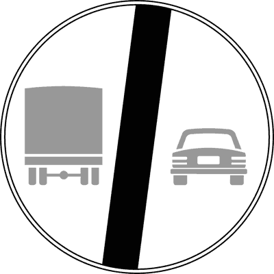
- **📖 الترجمة السياقية:** في وجود الإشارة الموضحة، شاحنة بمقطورة (autotreno) تزن 44 طناً يمكنها تجاوز سيارة ركاب.
- **💡 الشرح والقاعدة المرورية:** إشارة "نهاية منع التجاوز للشاحنات فوق 3.5 طن" (دائرة بيضاء بشاحنة وسيارة مشطوبتين - م 119 لائحة تنفيذية): بانتهاء منع الشاحنات، يحق للشاحنات الثقيلة والمقطورات التجاوز في المسارات المسموحة نظاماً. العبارة صحيحة.
- **⚠️ كشف الفخ:** autotreno di 44 tonnellate può sorpassare: صحيح، زال المنع عن الشاحنات الثقيلة.
- **🔑 الكلمات المفتاحية:** `fine divieto sorpasso autocarri (نهاية منع التجاوز للشاحنات الثقيلة)` | `autotreni (شاحنات بمقطورة)` | `sorpasso (تجاوز)`

---

**376.** Il segnale raffigurato indica la fine del divieto di sorpasso precedentemente imposto
- **الإجابة:** `VERO ✅ (صح)`
- 
- **📖 الترجمة السياقية:** الإشارة الموضحة تدل على نهاية منع التجاوز المفروض مسبقاً.
- **💡 الشرح والقاعدة المرورية:** إشارة "نهاية منع التجاوز للشاحنات فوق 3.5 طن" (دائرة بيضاء بشاحنة وسيارة مشطوبتين - م 119 لائحة تنفيذية): تنهي حظر التجاوز الذي كان مخصصاً لمركبات نقل البضائع الثقيلة. العبارة صحيحة.
- **⚠️ كشف الفخ:** fine del divieto di sorpasso precedentemente imposto: المعنى الصريح للنهاية.
- **🔑 الكلمات المفتاحية:** `fine divieto sorpasso autocarri (نهاية منع التجاوز للشاحنات الثقيلة)` | `segnale di divieto (إشارة منع)`

---

**377.** In presenza del segnale raffigurato un autocarro può sorpassare un autobus
- **الإجابة:** `VERO ✅ (صح)`
- 
- **📖 الترجمة السياقية:** في وجود الإشارة الموضحة، يمكن للشاحنة تجاوز حافلة ركاب.
- **💡 الشرح والقاعدة المرورية:** إشارة "نهاية منع التجاوز للشاحنات فوق 3.5 طن" (دائرة بيضاء بشاحنة وسيارة مشطوبتين - م 119 لائحة تنفيذية): الشاحنة التي كانت ممنوعة من التجاوز أصبح بإمكانها تنفيذ مناورة التجاوز الآن. العبارة صحيحة.
- **⚠️ كشف الفخ:** autocarro può sorpassare autobus: صحيح، الشاحنة يمكنها التجاوز.
- **🔑 الكلمات المفتاحية:** `fine divieto sorpasso autocarri (نهاية منع التجاوز للشاحنات الثقيلة)` | `autocarri oltre 3,5 t (شاحنات نقل بضائع تتجاوز 3.5 طن)` | `autobus (حافلة)`

---

**378.** Il segnale raffigurato indica la fine del divieto di sorpasso per veicoli merci di massa a pieno carico superiore a 3,5 tonnellate
- **الإجابة:** `VERO ✅ (صح)`
- 
- **📖 الترجمة السياقية:** الإشارة الموضحة تدل على نهاية منع التجاوز لمركبات البضائع التي تزيد كتلتها بحمولة كاملة عن 3.5 طن.
- **💡 الشرح والقاعدة المرورية:** إشارة "نهاية منع التجاوز للشاحنات فوق 3.5 طن" (دائرة بيضاء بشاحنة وسيارة مشطوبتين - م 119 لائحة تنفيذية): هذا هو التوصيف والمدلول الرسمي الدقيق للإشارة في قانون المرور. العبارة صحيحة.
- **⚠️ كشف الفخ:** fine divieto per veicoli merci oltre 3,5 t: التعريف المعتمد للإشارة.
- **🔑 الكلمات المفتاحية:** `fine divieto sorpasso autocarri (نهاية منع التجاوز للشاحنات الثقيلة)` | `autocarri oltre 3,5 t (شاحنات نقل بضائع تتجاوز 3.5 طن)` | `segnale di prescrizione (إشارة أمر/تنظيمية)`

---

**379.** Il segnale raffigurato è un segnale di fine prescrizione
- **الإجابة:** `VERO ✅ (صح)`
- 
- **📖 الترجمة السياقية:** الإشارة الموضحة هي إشارة نهاية أمر تنظيمي.
- **💡 الشرح والقاعدة المرورية:** إشارة "نهاية منع التجاوز للشاحنات فوق 3.5 طن" (دائرة بيضاء بشاحنة وسيارة مشطوبتين - م 119 لائحة تنفيذية): تصنف قانوناً ضمن إشارات نهاية الأوامر التنظيمية (fine prescrizione). العبارة صحيحة.
- **⚠️ كشف الفخ:** segnale di fine prescrizione: التصنيف الرسمي للإشارة.
- **🔑 الكلمات المفتاحية:** `fine divieto sorpasso autocarri (نهاية منع التجاوز للشاحنات الثقيلة)` | `segnale di prescrizione (إشارة أمر/تنظيمية)`

---

**380.** In presenza del segnale raffigurato è vietato il transito degli autotreni, autosnodati, autoarticolati
- **الإجابة:** `FALSO ❌ (خطأ)`
- 
- **📖 الترجمة السياقية:** في وجود الإشارة الموضحة، يُحظر مرور الشاحنات بمقطورة والحافلات المفصلية والقاطرات.
- **💡 الشرح والقاعدة المرورية:** إشارة "نهاية منع التجاوز للشاحنات فوق 3.5 طن" (دائرة بيضاء بشاحنة وسيارة مشطوبتين - م 119 لائحة تنفيذية): الإشارة لا تمنع المرور والسير، بل ترفع قيد التجاوز فقط. العبارة خاطئة.
- **⚠️ كشف الفخ:** vietato il transito: خلط بين التجاوز والمرور.
- **🔑 الكلمات المفتاحية:** `fine divieto sorpasso autocarri (نهاية منع التجاوز للشاحنات الثقيلة)` | `transito (مرور)`

---

**381.** In presenza del segnale raffigurato le autovetture devono sorpassare gli autocarri sulla corsia di destra
- **الإجابة:** `FALSO ❌ (خطأ)`
- 
- **📖 الترجمة السياقية:** في وجود الإشارة الموضحة، يجب على سيارات الركاب تجاوز الشاحنات من المسار الأيمن.
- **💡 الشرح والقاعدة المرورية:** إشارة "نهاية منع التجاوز للشاحنات فوق 3.5 طن" (دائرة بيضاء بشاحنة وسيارة مشطوبتين - م 119 لائحة تنفيذية): التجاوز من اليمين محظور قانوناً في الأحوال العادية. العبارة خاطئة.
- **⚠️ كشف الفخ:** sorpassare sulla corsia di destra: التجاوز من اليمين ممنوع نظاماً.
- **🔑 الكلمات المفتاحية:** `fine divieto sorpasso autocarri (نهاية منع التجاوز للشاحنات الثقيلة)` | `corsia di destra (المسار الأيمن)`

---

**382.** Il segnale raffigurato indica la fine del divieto di sorpasso per autobus di massa a pieno carico superiore a 3,5 tonnellate
- **الإجابة:** `FALSO ❌ (خطأ)`
- 
- **📖 الترجمة السياقية:** الإشارة الموضحة تدل على نهاية منع التجاوز لحافلات الركاب التي تزيد كتلتها عن 3.5 طن.
- **💡 الشرح والقاعدة المرورية:** إشارة "نهاية منع التجاوز للشاحنات فوق 3.5 طن" (دائرة بيضاء بشاحنة وسيارة مشطوبتين - م 119 لائحة تنفيذية): الحافلات مخصصة لنقل الركاب ولم تكن مشمولة بالمنع أصلاً؛ المنع كان يخص مركبات نقل البضائع. العبارة خاطئة.
- **⚠️ كشف الفخ:** fine divieto per autobus: الحافلات لم تكن ممنوعة أصلاً.
- **🔑 الكلمات المفتاحية:** `fine divieto sorpasso autocarri (نهاية منع التجاوز للشاحنات الثقيلة)` | `autobus (حافلات)`

---

**383.** Il segnale raffigurato è un segnale di pericolo
- **الإجابة:** `FALSO ❌ (خطأ)`
- 
- **📖 الترجمة السياقية:** الإشارة الموضحة هي إشارة خطر.
- **💡 الشرح والقاعدة المرورية:** إشارة "نهاية منع التجاوز للشاحنات فوق 3.5 طن" (دائرة بيضاء بشاحنة وسيارة مشطوبتين - م 119 لائحة تنفيذية): هي إشارة نهاية أمر تنظيمي وليست إشارة خطر مثلثة. العبارة خاطئة.
- **⚠️ كشف الفخ:** segnale di pericolo: خطأ، ليست إشارة خطر.
- **🔑 الكلمات المفتاحية:** `fine divieto sorpasso autocarri (نهاية منع التجاوز للشاحنات الثقيلة)` | `pericolo (خطر)`

---

**384.** Il segnale raffigurato non vale per gli autocarri di massa complessiva pari a 7 tonnellate
- **الإجابة:** `FALSO ❌ (خطأ)`
- 
- **📖 الترجمة السياقية:** الإشارة الموضحة لا تسري على الشاحنات التي تبلغ كتلتها الإجمالية 7 أطنان.
- **💡 الشرح والقاعدة المرورية:** إشارة "نهاية منع التجاوز للشاحنات فوق 3.5 طن" (دائرة بيضاء بشاحنة وسيارة مشطوبتين - م 119 لائحة تنفيذية): تسري على كافة الشاحنات التي تفوق 3.5 طن بما فيها شاحنات الـ 7 أطنان. العبارة خاطئة.
- **⚠️ كشف الفخ:** non vale per autocarri di 7 t: خطأ، تسري على كافة الشاحنات الثقيلة.
- **🔑 الكلمات المفتاحية:** `fine divieto sorpasso autocarri (نهاية منع التجاوز للشاحنات الثقيلة)` | `autocarri oltre 3,5 t (شاحنات نقل بضائع تتجاوز 3.5 طن)`

---

## 📌 Divieto sosta (43 domande)

**385.** Il segnale raffigurato è posto nei luoghi dove la sosta è vietata
- **الإجابة:** `VERO ✅ (صح)`
- 
- **📖 الترجمة السياقية:** الإشارة الموضحة توضع في الأماكن التي يُحظر فيها الوقوف والانتظار (sosta).
- **💡 الشرح والقاعدة المرورية:** إشارة "ممنوع الوقوف والانتظار" DIVIETO DI SOSTA (دائرة زرقاء بإطار وشريط مائل أحمر - م 120 لائحة تنفيذية): تحدد المقاطع والمواقع الممنوع فيها ترك المركبة متوقفة بدون سائق. العبارة صحيحة.
- **⚠️ كشف الفخ:** nei luoghi dove la sosta è vietata: المعنى المباشر للإشارة.
- **🔑 الكلمات المفتاحية:** `divieto di sosta (ممنوع الوقوف والانتظار (سوسطا))` | `segnale di divieto (إشارة منع)`

---

**386.** Il segnale raffigurato vieta la sosta sulle strade urbane dalle ore 8.00 alle ore 20.00, salvo diversa indicazione
- **الإجابة:** `VERO ✅ (صح)`
- 
- **📖 الترجمة السياقية:** الإشارة الموضحة تمنع الوقوف في الشوارع الحضرية من الساعة 8:00 صباحاً حتى 20:00 مساءً، ما لم يُذكر خلاف ذلك.
- **💡 الشرح والقاعدة المرورية:** إشارة "ممنوع الوقوف والانتظار" DIVIETO DI SOSTA (دائرة زرقاء بإطار وشريط مائل أحمر - م 120 لائحة تنفيذية): قاعدة عامة داخل المدن: يسري منع الوقوف تلقائياً نهاراً بين 8 و20 ما لم توجد لوحة تفيد بخلافه. العبارة صحيحة.
- **⚠️ كشف الفخ:** dalle 8.00 alle 20.00 sulle strade urbane: القاعدة العامة للوقوف داخل المدن.
- **🔑 الكلمات المفتاحية:** `divieto di sosta (ممنوع الوقوف والانتظار (سوسطا))` | `strade urbane (طرق داخل المدن)` | `orario (توقيت)`

---

**387.** Il segnale raffigurato può essere integrato da pannelli per indicarne l'inizio, il proseguimento o la fine
- **الإجابة:** `VERO ✅ (صح)`
- 
- **📖 الترجمة السياقية:** الإشارة الموضحة يمكن استكمالها بلوحات لتبيان بدايتها أو استمرارها أو نهايتها.
- **💡 الشرح والقاعدة المرورية:** إشارة "ممنوع الوقوف والانتظار" DIVIETO DI SOSTA (دائرة زرقاء بإطار وشريط مائل أحمر - م 120 لائحة تنفيذية): تستكمل بأسهم رأسية توضح بداية المنع (سهم لأعلى)، استمراره (سهم ذو رأسين)، أو نهايته (سهم لأسفل). العبارة صحيحة.
- **⚠️ كشف الفخ:** inizio, proseguimento o fine: صحيح، تحدد امتداد الحظر بالأسهم.
- **🔑 الكلمات المفتاحية:** `divieto di sosta (ممنوع الوقوف والانتظار (سوسطا))` | `pannelli integrativi (لوحات إضافية)`

---

**388.** Il segnale raffigurato cessa di validità dopo il primo incrocio, se non ripetuto
- **الإجابة:** `VERO ✅ (صح)`
- 
- **📖 الترجمة السياقية:** الإشارة الموضحة ينتهي سريانها بعد أول تقاطع، ما لم تتكرر.
- **💡 الشرح والقاعدة المرورية:** إشارة "ممنوع الوقوف والانتظار" DIVIETO DI SOSTA (دائرة زرقاء بإطار وشريط مائل أحمر - م 120 لائحة تنفيذية): ينتهي مفعول إشارة منع الوقوف حكماً عند التقاطع القادم إذا لم تُعد كتابتها بعده. العبارة صحيحة.
- **⚠️ كشف الفخ:** cessa dopo il primo incrocio: تنتهي صلاحيتها عند أول تقاطع.
- **🔑 الكلمات المفتاحية:** `divieto di sosta (ممنوع الوقوف والانتظار (سوسطا))` | `incrocio (تقاطع)`

---

**389.** Il segnale raffigurato consente la fermata
- **الإجابة:** `VERO ✅ (صح)`
- 
- **📖 الترجمة السياقية:** الإشارة الموضحة تسمح بالتوقف المؤقت (fermata).
- **💡 الشرح والقاعدة المرورية:** إشارة "ممنوع الوقوف والانتظار" DIVIETO DI SOSTA (دائرة زرقاء بإطار وشريط مائل أحمر - م 120 لائحة تنفيذية): قاعدة ذهبية: منع الوقوف (sosta) يبيح دائماً التوقف المؤقت القصير (fermata) لركوب أو نزول الركاب مع بقاء السائق بالمركبة! العبارة صحيحة.
- **⚠️ كشف الفخ:** consente la fermata: قاعدة أساسية؛ التوقف المؤقت مسموح دائماً.
- **🔑 الكلمات المفتاحية:** `divieto di sosta (ممنوع الوقوف والانتظار (سوسطا))` | `fermata consentita (التوقف المؤقت مسموح (فيرماتا))`

---

**390.** Il segnale raffigurato consente la sosta nel tratto precedente
- **الإجابة:** `VERO ✅ (صح)`
- 
- **📖 الترجمة السياقية:** الإشارة الموضحة تسمح بالوقوف في المقطع السابق لها.
- **💡 الشرح والقاعدة المرورية:** إشارة "ممنوع الوقوف والانتظار" DIVIETO DI SOSTA (دائرة زرقاء بإطار وشريط مائل أحمر - م 120 لائحة تنفيذية): المنع يبدأ من نقطة الإشارة ويمتد للأمام، ولا يسري على الرصيف الواقع قبل الإشارة ما لم توجد أسهم تكميلية. العبارة صحيحة.
- **⚠️ كشف الفخ:** consente la sosta nel tratto precedente: يبدأ المنع من موضع الإشارة فصاعداً.
- **🔑 الكلمات المفتاحية:** `divieto di sosta (ممنوع الوقوف والانتظار (سوسطا))` | `tratto precedente (المقطع السابق)`

---

**391.** Il segnale raffigurato, opportunamente integrato, può vietare la sosta nei centri abitati dalle ore 0,00 alle 24,00
- **الإجابة:** `VERO ✅ (صح)`
- 
- **📖 الترجمة السياقية:** الإشارة الموضحة، إذا استكملت بلوحة مناسبة، يمكن أن تمنع الوقوف داخل المدن من الساعة 0:00 حتى 24:00.
- **💡 الشرح والقاعدة المرورية:** إشارة "ممنوع الوقوف والانتظار" DIVIETO DI SOSTA (دائرة زرقاء بإطار وشريط مائل أحمر - م 120 لائحة تنفيذية): بإضافة لوحة (0-24) يصبح منع الوقوف مستمراً ليلاً ونهاراً داخل التجمعات السكنية. العبارة صحيحة.
- **⚠️ كشف الفخ:** dalle ore 0,00 alle 24,00: صحيح، تصبح دائمة بإضافة لوحة 0-24.
- **🔑 الكلمات المفتاحية:** `divieto di sosta (ممنوع الوقوف والانتظار (سوسطا))` | `h24 (على مدار 24 ساعة)`

---

**392.** Il segnale raffigurato vieta la sosta, ma non la fermata
- **الإجابة:** `VERO ✅ (صح)`
- 
- **📖 الترجمة السياقية:** الإشارة الموضحة تمنع الوقوف (sosta)، ولكنها لا تمنع التوقف المؤقت (fermata).
- **💡 الشرح والقاعدة المرورية:** إشارة "ممنوع الوقوف والانتظار" DIVIETO DI SOSTA (دائرة زرقاء بإطار وشريط مائل أحمر - م 120 لائحة تنفيذية): صياغة نظامية قطعية للتفرقة بين حظر الوقوف الطويل وإباحة التوقف اللحظي. العبارة صحيحة.
- **⚠️ كشف الفخ:** vieta la sosta ma non la fermata: جوهر وقاعدة إشارة Divieto di sosta.
- **🔑 الكلمات المفتاحية:** `divieto di sosta (ممنوع الوقوف والانتظار (سوسطا))` | `fermata consentita (التوقف المؤقت مسموح (فيرماتا))`

---

**393.** Il segnale raffigurato contraddistingue le aree dove è proibito lasciare in sosta un veicolo
- **الإجابة:** `VERO ✅ (صح)`
- 
- **📖 الترجمة السياقية:** الإشارة الموضحة تميز المناطق التي يُحظر فيها ترك المركبة في حالة وقوف وانتظار.
- **💡 الشرح والقاعدة المرورية:** إشارة "ممنوع الوقوف والانتظار" DIVIETO DI SOSTA (دائرة زرقاء بإطار وشريط مائل أحمر - م 120 لائحة تنفيذية): تحدد بدقة حيز الشارع الممنوع ترك السيارات مصطفة فيه. العبارة صحيحة.
- **⚠️ كشف الفخ:** proibito lasciare in sosta: صحيح، منع ترك المركبة متوقفة.
- **🔑 الكلمات المفتاحية:** `divieto di sosta (ممنوع الوقوف والانتظار (سوسطا))` | `segnale di prescrizione (إشارة أمر/تنظيمية)`

---

**394.** Il segnale raffigurato, lungo strade extraurbane, indica divieto permanente di sosta in assenza di indicazioni integrative
- **الإجابة:** `VERO ✅ (صح)`
- 
- **📖 الترجمة السياقية:** الإشارة الموضحة، على الطرق خارج المدن، تدل على منع دائم للوقوف في غياب لوحات إضافية.
- **💡 الشرح والقاعدة المرورية:** إشارة "ممنوع الوقوف والانتظار" DIVIETO DI SOSTA (دائرة زرقاء بإطار وشريط مائل أحمر - م 120 لائحة تنفيذية): قاعدة مهمة: خارج المدن (extraurbana) يسري منع الوقوف تلقائياً طوال 24 ساعة دون الحاجة لأي لوحة إضافية! العبارة صحيحة.
- **⚠️ كشف الفخ:** divieto permanente lungo strade extraurbane: خارج المدن المنع دائم 24 ساعة تلقائياً.
- **🔑 الكلمات المفتاحية:** `divieto di sosta (ممنوع الوقوف والانتظار (سوسطا))` | `strade extraurbane (طرق خارج المدن)`

---

**395.** Il segnale (A), se integrato con pannello (B), indica una zona in cui vige divieto di sosta
- **الإجابة:** `VERO ✅ (صح)`
- 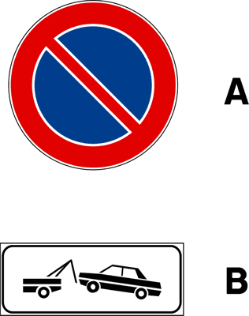
- **📖 الترجمة السياقية:** الإشارة (A)، إذا استكملت باللوحة (B)، تدل على منطقة يسري فيها منع الوقوف.
- **💡 الشرح والقاعدة المرورية:** إشارة "ممنوع الوقوف والانتظار" DIVIETO DI SOSTA (دائرة زرقاء بإطار وشريط مائل أحمر - م 120 لائحة تنفيذية): تشير إلى امتداد نطاق حظر الوقوف في المنطقة المحددة باللوحة. العبارة صحيحة.
- **⚠️ كشف الفخ:** zona con divieto di sosta: صحيح، نطاق منع الوقوف.
- **🔑 الكلمات المفتاحية:** `divieto di sosta (ممنوع الوقوف والانتظار (سوسطا))` | `zona (منطقة)`

---

**396.** Il segnale raffigurato vieta la sosta sul lato della strada dove è posto
- **الإجابة:** `VERO ✅ (صح)`
- 
- **📖 الترجمة السياقية:** الإشارة الموضحة تمنع الوقوف على جانب الطريق الذي وُضعت فيه فقط.
- **💡 الشرح والقاعدة المرورية:** إشارة "ممنوع الوقوف والانتظار" DIVIETO DI SOSTA (دائرة زرقاء بإطار وشريط مائل أحمر - م 120 لائحة تنفيذية): يسري المنع حصراً على الجانب (الرصيف) المثبتة عليه الإشارة ولا يسري على الجانب المقابل. العبارة صحيحة.
- **⚠️ كشف الفخ:** sul lato della strada dove è posto: المنع يخص جانب الطريق المثبتة فيه فقط.
- **🔑 الكلمات المفتاحية:** `divieto di sosta (ممنوع الوقوف والانتظار (سوسطا))` | `lato della strada (جانب الطريق)`

---

**397.** Il segnale (A) con il pannello (B) vieta la sosta solo nei giorni lavorativi
- **الإجابة:** `VERO ✅ (صح)`
- 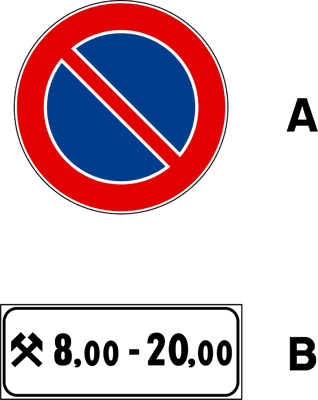
- **📖 الترجمة السياقية:** الإشارة (A) مع اللوحة (B) [رمز المطرقتين] تمنع الوقوف فقط في أيام العمل.
- **💡 الشرح والقاعدة المرورية:** إشارة "ممنوع الوقوف والانتظار" DIVIETO DI SOSTA (دائرة زرقاء بإطار وشريط مائل أحمر - م 120 لائحة تنفيذية): رمز المطرقتين المتقاطعتين (martelli incrociati) يقصر سريان المنع على الأيام غير العطل (giorni lavorativi/feriali). العبارة صحيحة.
- **⚠️ كشف الفخ:** solo nei giorni lavorativi: رمز المطرقتين = أيام العمل الرسمية.
- **🔑 الكلمات المفتاحية:** `divieto di sosta (ممنوع الوقوف والانتظار (سوسطا))` | `giorni lavorativi (أيام العمل)`

---

**398.** Il segnale (A), integrato con il pannello (B), indica una ZONA RIMOZIONE COATTA
- **الإجابة:** `VERO ✅ (صح)`
- 
- **📖 الترجمة السياقية:** الإشارة (A)، مستكملة باللوحة (B) [رمز الرافعة]، تدل على منطقة سحب وحجز المركبات (ZONA RIMOZIONE COATTA).
- **💡 الشرح والقاعدة المرورية:** إشارة "ممنوع الوقوف والانتظار" DIVIETO DI SOSTA (دائرة زرقاء بإطار وشريط مائل أحمر - م 120 لائحة تنفيذية): رمز شاحنة السحب (carro attrezzi) ينذر بسحب السيارة المخالفة ونقلها إلى الحجز البلدي. العبارة صحيحة.
- **⚠️ كشف الفخ:** ZONA RIMOZIONE COATTA: التسمية الرسمية لمنطقة السحب الإجباري.
- **🔑 الكلمات المفتاحية:** `divieto di sosta (ممنوع الوقوف والانتظار (سوسطا))` | `rimozione forzata (سحب وحجز المركبة بالرافعة)`

---

**399.** Il segnale (A), se integrato con pannello (B), indica una zona in cui vige divieto di sosta, con rimozione del veicolo
- **الإجابة:** `VERO ✅ (صح)`
- 
- **📖 الترجمة السياقية:** الإشارة (A)، إذا استكملت باللوحة (B)، تدل على منطقة يسري فيها منع الوقوف مع سحب المركبة المخالفة.
- **💡 الشرح والقاعدة المرورية:** إشارة "ممنوع الوقوف والانتظار" DIVIETO DI SOSTA (دائرة زرقاء بإطار وشريط مائل أحمر - م 120 لائحة تنفيذية): يترتب على المخالفة تطبيق غرامة مالية وسحب ونقل السيارة فوراً بالرافعة. العبارة صحيحة.
- **⚠️ كشف الفخ:** con rimozione del veicolo: صحيح، تشمل إزالة وسحب المركبة.
- **🔑 الكلمات المفتاحية:** `divieto di sosta (ممنوع الوقوف والانتظار (سوسطا))` | `rimozione forzata (سحب وحجز المركبة بالرافعة)`

---

**400.** Il segnale raffigurato non vieta la fermata
- **الإجابة:** `VERO ✅ (صح)`
- 
- **📖 الترجمة السياقية:** الإشارة الموضحة لا تمنع التوقف المؤقت (fermata).
- **💡 الشرح والقاعدة المرورية:** إشارة "ممنوع الوقوف والانتظار" DIVIETO DI SOSTA (دائرة زرقاء بإطار وشريط مائل أحمر - م 120 لائحة تنفيذية): تكرار تأكيدي للقاعدة: التوقف اللحظي بوجود السائق مسموح به قانوناً دون مخالفة. العبارة صحيحة.
- **⚠️ كشف الفخ:** non vieta la fermata: التوقف المؤقت مسموح.
- **🔑 الكلمات المفتاحية:** `divieto di sosta (ممنوع الوقوف والانتظار (سوسطا))` | `fermata consentita (التوقف المؤقت مسموح (فيرماتا))`

---

**401.** Il segnale raffigurato è un segnale di prescrizione
- **الإجابة:** `VERO ✅ (صح)`
- 
- **📖 الترجمة السياقية:** الإشارة المصورة هي إشارة تنظيمية (من إشارات الأوامر/الحظر).
- **💡 الشرح والقاعدة المرورية:** إشارة ممنوع الانتظار (Divieto di sosta - الشكل 84، المادة 120 من اللائحة التنفيذية) تنتمي إلى فئة إشارات التنظيم (segnali di prescrizione)، وتحديداً إشارات الحظر (divieto).
- **⚠️ كشف الفخ:** تذكر تصنيف الإشارات: كل إشارات الحظر والإلزام وحق الأسبقية هي إشارات تنظيمية (prescrizione).
- **🔑 الكلمات المفتاحية:** `segnale di prescrizione (إشارة تنظيمية / إلزامية)` | `divieto di sosta (ممنوع الانتظار)`

---

**402.** Il segnale raffigurato non è posto nei luoghi ove per regola generale vige il divieto di sosta
- **الإجابة:** `VERO ✅ (صح)`
- 
- **📖 الترجمة السياقية:** الإشارة المصورة لا توضع في الأماكن التي يسري فيها منع الانتظار بحكم القاعدة العامة للمرور.
- **💡 الشرح والقاعدة المرورية:** صحيح: لا يتم تثبيت إشارة ممنوع الانتظار في الأماكن التي تحظر فيها المادة 158 من قانون السير الانتظار تلقائياً بحكم القانون (مثل المنعطفات، المرتفعات/الروابي، مفترقات الطرق، ممرات المشاة، وخطوط الترام) لتجنب التكرار الزائد.
- **⚠️ كشف الفخ:** انتبه للصياغة: الإشارة لا توضع حيث يسري الحظر أصلاً بحكم القاعدة العامة، بل توضع حيث يُراد تنظيم ومنع الانتظار خصيصاً.
- **🔑 الكلمات المفتاحية:** `regola generale (قاعدة عامة)` | `divieto di sosta (ممنوع الانتظار)` | `luoghi ove vige (أماكن يسري فيها)`

---

**403.** Il segnale raffigurato vieta l'abbandono prolungato nel tempo del veicolo
- **الإجابة:** `VERO ✅ (صح)`
- 
- **📖 الترجمة السياقية:** الإشارة المصورة تمنع ترك المركبة لفترة طويلة من الوقت (الانتظار/الركن).
- **💡 الشرح والقاعدة المرورية:** تُعرّف المادة 157 من قانون السير الانتظار (sosta) بأنه تعليق حركة المركبة لفترة طويلة مع إمكانية ابتعاد السائق عنها؛ وإشارة ممنوع الانتظار تمنع تحديداً هذا الترك المطول للمركبة.
- **⚠️ كشف الفخ:** الانتظار (sosta) هو ترك المركبة لفترة طويلة، بينما التوقف المؤقت (fermata) قصير جداً والسائق بجوارها. الإشارة تمنع الأول وتسمح بالثاني.
- **🔑 الكلمات المفتاحية:** `abbandono prolungato (ترك المركبة لفترة طويلة)` | `sosta (الانتظار / التوقف المطول)` | `sospensione della marcia (تعليق السير)`

---

**404.** Il segnale raffigurato, posto nei centri abitati, vieta, di norma, la sosta dalle ore 8.00 alle 20.00
- **الإجابة:** `VERO ✅ (صح)`
- 
- **📖 الترجمة السياقية:** الإشارة المصورة، عند وضعها داخل المناطق السكنية المأهولة، تمنع عادةً الانتظار من الساعة 8.00 إلى 20.00.
- **💡 الشرح والقاعدة المرورية:** داخل المناطق السكنية (centri abitati)، وفي غياب لوحات إضافية تحدد أوقاتاً أخرى، يسري حظر الانتظار كقاعدة عامة نهاراً من 8:00 صباحاً حتى 20:00 مساءً (المادة 120 من لائحة قانون السير).
- **⚠️ كشف الفخ:** قاعدة ذهبية في الاختبار: داخل المدينة يسري من 8:00 إلى 20:00 (ما لم يُذكر خلاف ذلك)، بينما خارج المدينة يسري على مدار 24 ساعة!
- **🔑 الكلمات المفتاحية:** `centri abitati (مناطق مأهولة / مدن)` | `dalle ore 8.00 alle 20.00 (من 8:00 إلى 20:00)` | `di norma (عادةً / كقاعدة عامة)`

---

**405.** Il segnale (A), integrato con il pannello (B), consente la sosta agli autobus
- **الإجابة:** `VERO ✅ (صح)`
- 
- **📖 الترجمة السياقية:** الإشارة (A)، مدمجة مع اللوحة الإضافية (B)، تسمح بالانتظار للحافلات.
- **💡 الشرح والقاعدة المرورية:** اللوحة الإضافية للاستثناء (الشكل 948) التي تحمل رمز الحافلة وكلمة 'eccetto' تعفي الحافلات من منع الانتظار، وبالتالي يُسمح لها بالانتظار هناك بشكل استثنائي (المادة 83 من اللائحة التنفيذية).
- **⚠️ كشف الفخ:** اللوحة تستثني الحافلات (eccetto autobus)، وهذا يعني أن الحظر يسري على الجميع ويسمح للحافلات بالانتظار.
- **🔑 الكلمات المفتاحية:** `pannello integrativo (لوحة إضافية)` | `consente la sosta (يسمح بالانتظار)` | `autobus (حافلات)`

---

**406.** Il segnale (A), integrato con il pannello (B), vieta la sosta soltanto nei giorni festivi
- **الإجابة:** `VERO ✅ (صح)`
- 
- **📖 الترجمة السياقية:** الإشارة (A)، مدمجة مع اللوحة الإضافية (B)، تمنع الانتظار في أيام العطلات فقط.
- **💡 الشرح والقاعدة المرورية:** اللوحة الإضافية التي تحمل رمز الصليب اللاتيني (رمز العطلات/الأعياد - الشكل 946) تقصر سريان حظر الانتظار على أيام الآحاد والأعياد الرسمية فقط (المادة 83). أما في أيام العمل فيُسمح بالانتظار.
- **⚠️ كشف الفخ:** الصليب = أيام العطلات والأعياد (festivi). المطرقتان المتقاطعتان = أيام العمل الرسمية (feriali).
- **🔑 الكلمات المفتاحية:** `giorni festivi (أيام العطلات / الأعياد)` | `pannello integrativo (لوحة إضافية)` | `vieta la sosta (يمنع الانتظار)`

---

**407.** Il segnale raffigurato vieta la sosta ma non la fermata
- **الإجابة:** `VERO ✅ (صح)`
- 
- **📖 الترجمة السياقية:** الإشارة المصورة تمنع الانتظار (sosta) لكنها لا تمنع التوقف المؤقت (fermata).
- **💡 الشرح والقاعدة المرورية:** إشارة ممنوع الانتظار ذات الخط المائل الفردي تمنع فقط الانتظار المطول (sosta)، بينما يظل التوقف المؤقت (fermata) لنزول أو صعود الركاب مع بقاء السائق مستعداً للتحرك مسموحاً به دائماً (المادتان 120 و157 من قانون السير).
- **⚠️ كشف الفخ:** فارق جوهري: ممنوع الانتظار يمنع الـ sosta ويسمح بالـ fermata. أما ممنوع التوقف (علامة X) فيمنع الاثنين معاً.
- **🔑 الكلمات المفتاحية:** `vieta la sosta (يمنع الانتظار)` | `non la fermata (ليس التوقف المؤقت)` | `sospensione temporanea (توقف مؤقت)`

---

**408.** Il segnale raffigurato, se posto sul lato sinistro di una strada a senso unico, vieta la sosta anche sul lato destro
- **الإجابة:** `FALSO ❌ (خطأ)`
- 
- **📖 الترجمة السياقية:** الإشارة المصورة، إذا وُضعت على الجانب الأيسر لطريق باتجاه واحد، تمنع الانتظار أيضاً على الجانب الأيمن.
- **💡 الشرح والقاعدة المرورية:** خطأ: تسري إشارة ممنوع الانتظار فقط وحصرياً على جانب الطريق الذي وُضعت عليه فعلياً (المادة 120 من اللائحة التنفيذية). ولا تؤثر على الجانب المقابل ما لم تتكرر هناك.
- **⚠️ كشف الفخ:** كلمة 'anche sul lato destro' خاطئة: الإشارة تؤثر فقط على الجانب الذي ثبتت فيه.
- **🔑 الكلمات المفتاحية:** `lato sinistro (الجانب الأيسر)` | `lato destro (الجانب الأيمن)` | `senso unico (اتجاه واحد)`

---

**409.** Il segnale raffigurato vieta la sosta sul tratto precedente
- **الإجابة:** `FALSO ❌ (خطأ)`
- 
- **📖 الترجمة السياقية:** الإشارة المصورة تمنع الانتظار في المقطع السابق.
- **💡 الشرح والقاعدة المرورية:** خطأ: اللوحة الإضافية التي بها سهم موجه لأعلى (الشكل 940) تشير إلى بداية (inizio) حظر الانتظار من مكان الإشارة إلى الأمام، وليس في المقطع السابق لها.
- **⚠️ كشف الفخ:** سهم لأعلى = بداية الحظر (من هنا فصاعداً). سهم لأسفل = نهاية الحظر (كان سارياً في المقطع السابق). سهم مزدوج = استمرار الحظر.
- **🔑 الكلمات المفتاحية:** `tratto precedente (المقطع السابق)` | `inizio del divieto (بداية الحظر)` | `freccia verso l'alto (سهم لأعلى)`

---

**410.** Il segnale raffigurato preannuncia un divieto di fermata
- **الإجابة:** `FALSO ❌ (خطأ)`
- 
- **📖 الترجمة السياقية:** الإشارة المصورة تعلن مسبقاً عن منع التوقف المؤقت.
- **💡 الشرح والقاعدة المرورية:** خطأ: الإشارة هي منع الانتظار (divieto di sosta) وتسري فوراً من مكان وجودها، وليست إخطاراً مسبقاً (preannuncio) ولا تخص منع التوقف (divieto di fermata).
- **⚠️ كشف الفخ:** الإشارة تسري فوراً من مكانها وليست إخطاراً مسبقاً، وتخص الانتظار فقط وليس التوقف المؤقت.
- **🔑 الكلمات المفتاحية:** `preannuncia (يعلن مسبقاً)` | `divieto di fermata (منع التوقف المؤقت)`

---

**411.** Il segnale raffigurato non vale per i motocicli ed i ciclomotori
- **الإجابة:** `FALSO ❌ (خطأ)`
- 
- **📖 الترجمة السياقية:** الإشارة المصورة لا تسري على الدراجات النارية والدراجات الآلية الصغيرة.
- **💡 الشرح والقاعدة المرورية:** خطأ: حظر الانتظار يسري كقاعدة عامة على جميع المركبات ذات المحرك بلا استثناء، بما في ذلك الدراجات النارية والدراجات الآلية (المادة 120 من اللائحة التنفيذية)، ما لم توجد لوحة استثناء خاصة.
- **⚠️ كشف الفخ:** عبارة 'non vale per motocicli' خاطئة: الإشارة تلزم كافة المركبات بما فيها الدراجات النارية والدراجات الآلية.
- **🔑 الكلمات المفتاحية:** `non vale (لا يسري)` | `motocicli (دراجات نارية)` | `ciclomotori (دراجات آلية صغيرة)`

---

**412.** In presenza del segnale raffigurato è sempre prevista la rimozione forzata del veicolo
- **الإجابة:** `FALSO ❌ (خطأ)`
- 
- **📖 الترجمة السياقية:** في وجود الإشارة المصورة، يُنص دائماً على السحب الإجباري للمركبة.
- **💡 الشرح والقاعدة المرورية:** خطأ: السحب الإجباري بالونش (rimozione forzata) لا يُطبق تلقائياً على كل مخالفة لمنع الانتظار البسيط، بل يشترط وجود لوحة إضافية مخصصة لشاحنة السحب (الشكل 945) أو الحالات الخاصة المنصوص عليها في المادة 159 من قانون السير.
- **⚠️ كشف الفخ:** كلمة 'sempre' تجعل العبارة خاطئة تماماً؛ السحب الإجباري مع منع الانتظار البسيط يتطلب لوحة السحب (pannello rimozione forzata).
- **🔑 الكلمات المفتاحية:** `sempre prevista (مقرر دائماً)` | `rimozione forzata (سحب إجباري بالونش)` | `carro attrezzi (شاحنة السحب)`

---

**413.** Il segnale raffigurato indica che la sosta è regolamentata con l'uso di parchimetri a pagamento
- **الإجابة:** `FALSO ❌ (خطأ)`
- 
- **📖 الترجمة السياقية:** الإشارة المصورة تدل على أن الانتظار منظم باستخدام أجهزة الدفع (باركومتر).
- **💡 الشرح والقاعدة المرورية:** خطأ: هذه الإشارة تمنع الانتظار كلياً. أما الانتظار المدفوع بأجهزة الدفع (parchimetro) فيُشار إليه بإشارة الموقف الزرقاء المربعة (P) مع لوحة الدفع، وليس بإشارة حظر.
- **⚠️ كشف الفخ:** الإشارة هي إشارة حظر (دائرة زرقاء بإطار وخط أحمر)، وليست إشارة تنظيم انتظار مدفوع.
- **🔑 الكلمات المفتاحية:** `regolamentata (منظم)` | `parchimetri a pagamento (أجهزة الدفع الآلي)`

---

**414.** Il segnale raffigurato consente la sosta ai residenti
- **الإجابة:** `FALSO ❌ (خطأ)`
- 
- **📖 الترجمة السياقية:** الإشارة المصورة تسمح بالانتظار للمقيمين (السكان).
- **💡 الشرح والقاعدة المرورية:** خطأ: إشارة منع الانتظار البسيطة تمنع الانتظار على جميع المركبات بما في ذلك مركبات سكان الحي، إلا إذا أُضيفت لوحة استثناء خاصة بالمقيمين (eccetto residenti).
- **⚠️ كشف الفخ:** بدون لوحة استثناء صريحة، يُمنع الانتظار على الجميع حتى المقيمين.
- **🔑 الكلمات المفتاحية:** `consente la sosta (يسمح بالانتظار)` | `residenti (المقيمون / السكان)` | `eccetto (باستثناء)`

---

**415.** Il segnale raffigurato consente la sosta esponendo il tagliando emesso da un parchimetro
- **الإجابة:** `FALSO ❌ (خطأ)`
- 
- **📖 الترجمة السياقية:** الإشارة المصورة تسمح بالانتظار عند إبراز تذكرة صادرة من جهاز الدفع (باركومتر).
- **💡 الشرح والقاعدة المرورية:** خطأ: الإشارة تفرض حظراً للانتظار ولا تجيزه بأي وسيلة دفع. تذاكر الباركومتر تُستخدم في المواقف المنظمة المسموح فيها بالانتظار بأجر.
- **⚠️ كشف الفخ:** إبراز التذكرة يخص مناطق الوقوف المنظمة وليس المناطق التي يُحظر فيها الانتظار بهذه الإشارة.
- **🔑 الكلمات المفتاحية:** `tagliando (تذكرة / إيصال)` | `parchimetro (جهاز الدفع)` | `consente la sosta (يسمح بالانتظار)`

---

**416.** Il segnale raffigurato, nelle strade extraurbane, consente la sosta dopo le ore 20.00
- **الإجابة:** `FALSO ❌ (خطأ)`
- 
- **📖 الترجمة السياقية:** الإشارة المصورة، في الطرق خارج المناطق السكنية، تسمح بالانتظار بعد الساعة 20.00.
- **💡 الشرح والقاعدة المرورية:** خطأ: في الطرق خارج المناطق السكنية (strade extraurbane)، يسري حظر الانتظار على مدار 24 ساعة طوال الليل والنهار (المادة 120 من اللائحة التنفيذية)، ولا ينتهي عند الساعة 20:00 كما هو الحال داخل المدن.
- **⚠️ كشف الفخ:** خارج المدينة يسري الحظر ليل نهار (24h su 24)، وانتهاء الحظر عند الساعة 20:00 يخص داخل المدن فقط.
- **🔑 الكلمات المفتاحية:** `strade extraurbane (طرق خارج المدن)` | `dopo le ore 20.00 (بعد الساعة 20:00)` | `24 ore su 24 (24 ساعة)`

---

**417.** Il segnale raffigurato consente la sosta soltanto ai veicoli a due ruote
- **الإجابة:** `FALSO ❌ (خطأ)`
- 
- **📖 الترجمة السياقية:** الإشارة المصورة تسمح بالانتظار فقط للمركبات ذات العجلتين.
- **💡 الشرح والقاعدة المرورية:** خطأ: الإشارة تمنع الانتظار لجميع المركبات دون استثناء، بما فيها المركبات ذات العجلتين كالدراجات النارية والدراجات الآلية.
- **⚠️ كشف الفخ:** كلمة 'soltanto ai veicoli a due ruote' خاطئة تماماً؛ فالانتظار محظور على الجميع.
- **🔑 الكلمات المفتاحية:** `veicoli a due ruote (مركبات بعجلتين)` | `soltanto (فقط)`

---

**418.** Il segnale raffigurato consente la sosta ai quadricicli a motore
- **الإجابة:** `FALSO ❌ (خطأ)`
- 
- **📖 الترجمة السياقية:** الإشارة المصورة تسمح بالانتظار للدراجات النارية الرباعية (الكواد).
- **💡 الشرح والقاعدة المرورية:** خطأ: الدراجات الرباعية الخفيفة والثقيلة بمحرك (quadricicli a motore) تخضع لمنع الانتظار شأنها شأن السيارات وسائر المركبات.
- **⚠️ كشف الفخ:** لا تتمتع الدراجات الرباعية بأي إعفاء من حظر الانتظار.
- **🔑 الكلمات المفتاحية:** `quadricicli a motore (دراجات نارية رباعية العجلات)`

---

**419.** Il segnale raffigurato, nei centri urbani, prescrive il divieto di sosta dalle ore 20.00 alle ore 8.00, salvo diversa indicazione
- **الإجابة:** `FALSO ❌ (خطأ)`
- 
- **📖 الترجمة السياقية:** الإشارة المصورة، داخل المراكز الحضرية، تفرض حظر الانتظار من الساعة 20.00 حتى 8.00، ما لم يُشر إلى خلاف ذلك.
- **💡 الشرح والقاعدة المرورية:** خطأ: في المراكز الحضرية يسري الحظر في العادة نهاراً من الساعة 8.00 صباحاً إلى 20.00 مساءً، وليس ليلاً من 20.00 إلى 8.00.
- **⚠️ كشف الفخ:** السؤال يعكس التوقيت الحقيقي: المنع نهاراً (8.00 - 20.00) والانتظار مسموح ليلاً كقاعدة عامة.
- **🔑 الكلمات المفتاحية:** `centri urbani (مراكز حضرية / مدن)` | `dalle ore 20.00 alle ore 8.00 (من 20:00 إلى 8:00)`

---

**420.** Il segnale raffigurato indica che la sosta è regolamentata mediante disco orario
- **الإجابة:** `FALSO ❌ (خطأ)`
- 
- **📖 الترجمة السياقية:** الإشارة المصورة تدل على أن الانتظار منظم باستخدام القرص الزمني (disco orario).
- **💡 الشرح والقاعدة المرورية:** خطأ: الإشارة تمنع الانتظار نهائياً خلال فترة سريانها. أما الانتظار المحدد بزمن بواسطة القرص الزمني فله إشارة وشارة خاصة (قرص الساعة).
- **⚠️ كشف الفخ:** الإشارة تمنع الانتظار ولا تنظمه بواسطة القرص الزمني.
- **🔑 الكلمات المفتاحية:** `disco orario (قرص الساعة / التوقيت)` | `sosta regolamentata (انتظار منظم)`

---

**421.** Il segnale (A), se integrato con il pannello (B), è divieto di sosta permanente
- **الإجابة:** `FALSO ❌ (خطأ)`
- 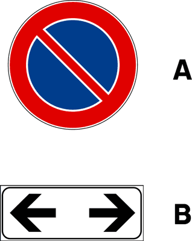
- **📖 الترجمة السياقية:** الإشارة (A)، إذا دُمجت باللوحة (B)، تعني حظر انتظار دائم ومستمر.
- **💡 الشرح والقاعدة المرورية:** خطأ: اللوحة الإضافية التي تحمل رمزي المطرقتين مع التوقيت (الشكل 949) تحدد سريان المنع في أيام العمل وساعات معينة فقط، وبالتالي فهو ليس حظراً دائماً (permanente) على الإطلاق.
- **⚠️ كشف الفخ:** كلمة 'permanente' تعني مستمر طوال الـ 24 ساعة، بينما اللوحة تحدد أيام العمل وساعات معينة فقط.
- **🔑 الكلمات المفتاحية:** `permanente (دائم / مستمر)` | `giorni feriali (أيام العمل)` | `pannello integrativo (لوحة إضافية)`

---

**422.** Il segnale raffigurato, opportunamente integrato, può vietare la sosta in doppia fila
- **الإجابة:** `FALSO ❌ (خطأ)`
- 
- **📖 الترجمة السياقية:** الإشارة المصورة، عند تزويدها باللوحة المناسبة، يمكن أن تمنع الانتظار في صف ثانٍ.
- **💡 الشرح والقاعدة المرورية:** خطأ: الانتظار في صف ثانٍ (sosta in doppia fila) محظور دائماً وبشكل قاطع بموجب القانون العام للمرور (المادة 158 الفقرة 2 من قانون السير)، ولا حاجة لوضع أي إشارة لمنعه ولا توجد إشارة لذلك.
- **⚠️ كشف الفخ:** فخ كلاسيكي في الاختبار: الانتظار في صف ثانٍ ممنوع دائماً بنص القانون العام في كل مكان، ولا توجد إشارة مخصصة لمنعه.
- **🔑 الكلمات المفتاحية:** `doppia fila (صف ثانٍ)` | `norma generale (قاعدة عامة)` | `sosta vietata (انتظار ممنوع)`

---

**423.** Il segnale raffigurato vieta la sospensione temporanea della marcia per la salita e discesa dei passeggeri
- **الإجابة:** `FALSO ❌ (خطأ)`
- 
- **📖 الترجمة السياقية:** الإشارة المصورة تمنع التعليق المؤقت للسير لصعود ونزول الركاب.
- **💡 الشرح والقاعدة المرورية:** خطأ: تعليق السير لصعود أو نزول الركاب هو التوقف المؤقت (fermata)، وإشارة ممنوع الانتظار تسمح به دائماً ولا تمنعه (المادتان 120 و157 من قانون السير).
- **⚠️ كشف الفخ:** النزول والصعود السريع للركاب يُعتبر توقفاً مؤقتاً (fermata)، وهو مسموح به تماماً مع هذه الإشارة.
- **🔑 الكلمات المفتاحية:** `sospensione temporanea (توقف مؤقت)` | `salita e discesa passeggeri (صعود ونزول الركاب)` | `fermata (توقف مؤقت)`

---

**424.** Lungo le strade extraurbane, il segnale raffigurato vale soltanto nelle ore diurne
- **الإجابة:** `FALSO ❌ (خطأ)`
- 
- **📖 الترجمة السياقية:** على طول الطرق خارج المناطق السكنية، تسري الإشارة المصورة فقط خلال ساعات النهار.
- **💡 الشرح والقاعدة المرورية:** خطأ: في الطرق خارج المناطق السكنية (strade extraurbane) يسري حظر الانتظار على مدار 24 ساعة ليلاً ونهاراً (المادة 120 من اللائحة التنفيذية).
- **⚠️ كشف الفخ:** عبارة 'soltanto nelle ore diurne' غير صحيحة؛ خارج المدن يسري المنع ليلاً ونهاراً دون توقف.
- **🔑 الكلمات المفتاحية:** `strade extraurbane (طرق خارج المدن)` | `ore diurne (ساعات النهار)` | `24 ore su 24 (24 ساعة)`

---

**425.** Il segnale raffigurato vieta la sosta dei veicoli su ambo i lati della carreggiata
- **الإجابة:** `FALSO ❌ (خطأ)`
- 
- **📖 الترجمة السياقية:** الإشارة المصورة تمنع انتظار المركبات على كلا جانبي قارعة الطريق.
- **💡 الشرح والقاعدة المرورية:** خطأ: تسري إشارة ممنوع الانتظار فقط على الجانب الذي وُضعت فيه من الطريق، ولا تمنع الانتظار على الجانب الآخر ما لم تكن هناك إشارة أخرى مقابلة.
- **⚠️ كشف الفخ:** عبارة 'su ambo i lati' خاطئة: الإشارة تؤثر فقط على الجانب الذي رُكبت عليه.
- **🔑 الكلمات المفتاحية:** `ambo i lati (كلا الجانبين)` | `carreggiata (قارعة الطريق)`

---

**426.** Il segnale raffigurato permette la sosta degli autobus
- **الإجابة:** `FALSO ❌ (خطأ)`
- 
- **📖 الترجمة السياقية:** الإشارة المصورة تسمح بانتظار الحافلات.
- **💡 الشرح والقاعدة المرورية:** خطأ: إشارة ممنوع الانتظار العادية تمنع الانتظار على كافة المركبات بما فيها الحافلات، إلا إذا كانت هناك لوحة استثناء مخصصة (eccetto autobus).
- **⚠️ كشف الفخ:** بدون لوحة استثناء، الحافلات ممنوعة من الانتظار كغيرها.
- **🔑 الكلمات المفتاحية:** `permette la sosta (يسمح بالانتظار)` | `autobus (حافلات)`

---

**427.** Il segnale raffigurato permette la sosta dei ciclomotori
- **الإجابة:** `FALSO ❌ (خطأ)`
- 
- **📖 الترجمة السياقية:** الإشارة المصورة تسمح بانتظار الدراجات الآلية الصغيرة (السيكلوموتوري).
- **💡 الشرح والقاعدة المرورية:** خطأ: الدراجات الآلية الصغيرة ملزمة بالامتثال لمنع الانتظار ولا يُسمح لها بالانتظار أمام هذه الإشارة.
- **⚠️ كشف الفخ:** لا تتمتع الدراجات الآلية بأي استثناء تلقائي من حظر الانتظار.
- **🔑 الكلمات المفتاحية:** `ciclomotori (دراجات آلية صغيرة)` | `divieto di sosta (ممنوع الانتظار)`

---

## 📌 Divieto fermata (21 domande)

**428.** Il segnale raffigurato vieta la temporanea sospensione della marcia del veicolo
- **الإجابة:** `VERO ✅ (صح)`
- 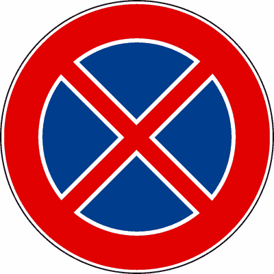
- **📖 الترجمة السياقية:** الإشارة المصورة تمنع التعليق المؤقت لسير المركبة (التوقف المؤقت).
- **💡 الشرح والقاعدة المرورية:** إشارة ممنوع التوقف (Divieto di fermata - الشكل 85، المادة 120 من اللائحة التنفيذية) تمنع أي تعليق لحركة المركبة حتى لو كان لبرهة وجيزة، وبالتالي تمنع كلاً من التوقف المؤقت والانتظار.
- **⚠️ كشف الفخ:** إشارة ممنوع التوقف (شكل X) تمنع أي توقف حتى لبضع ثوانٍ.
- **🔑 الكلمات المفتاحية:** `divieto di fermata (ممنوع التوقف)` | `temporanea sospensione (تعليق مؤقت للسير)` | `sosta e fermata (الانتظار والتوقف)`

---

**429.** Il segnale raffigurato vieta la fermata volontaria di tutti i veicoli
- **الإجابة:** `VERO ✅ (صح)`
- 
- **📖 الترجمة السياقية:** الإشارة المصورة تمنع التوقف الإرادي المؤقت لجميع المركبات.
- **💡 الشرح والقاعدة المرورية:** صحيح: تمنع الإشارة أي توقف اختياري أو إرادي يقوم به السائق لجميع أنواع المركبات. ولا ينطبق المنع بالطبع على التوقف الاضطراري الإجباري بسبب إشارات المرور أو الازدحام أو أمر الشرطة.
- **⚠️ كشف الفخ:** كلمة 'volontaria' دقيقة جداً: التوقف الإرادي هو الممنوع، أما التوقف الإجباري لأسباب حركة المرور فليس ممنوعاً.
- **🔑 الكلمات المفتاحية:** `fermata volontaria (توقف إرادي)` | `tutti i veicoli (جميع المركبات)`

---

**430.** Lungo le strade dove è posto, il segnale raffigurato vale 24 ore su 24
- **الإجابة:** `VERO ✅ (صح)`
- 
- **📖 الترجمة السياقية:** على طول الطرق التي توضع فيها، تسري الإشارة المصورة على مدار 24 ساعة يومياً.
- **💡 الشرح والقاعدة المرورية:** صحيح: إشارة ممنوع التوقف سارية المفعول دائماً على مدار 24 ساعة في اليوم (ليلاً ونهاراً)، سواء داخل المدن أو خارجها، ودون الحاجة لأي لوحة إضافية (المادة 120 من اللائحة التنفيذية).
- **⚠️ كشف الفخ:** فارق جوهري مع ممنوع الانتظار: إشارة ممنوع التوقف تسري دائماً 24 ساعة في كل مكان دون استثناء.
- **🔑 الكلمات المفتاحية:** `24 ore su 24 (24 ساعة يومياً)` | `divieto di fermata (ممنوع التوقف)` | `validità permanente (سريان دائم)`

---

**431.** Il segnale raffigurato vieta la sosta sia di giorno che di notte, anche nei centri abitati
- **الإجابة:** `VERO ✅ (صح)`
- 
- **📖 الترجمة السياقية:** الإشارة المصورة تمنع الانتظار ليلاً ونهاراً، حتى داخل المناطق المأهولة.
- **💡 الشرح والقاعدة المرورية:** صحيح: بما أن التوقف المؤقت ممنوع تماماً على مدار 24 ساعة، فإن الانتظار المطول (sosta) ممنوع من باب أولى ليلاً ونهاراً داخل وخارج المدن.
- **⚠️ كشف الفخ:** من لا يملك حق التوقف المؤقت لدقيقة، لا يملك يقيناً حق الانتظار المطول. حظر التوقف يشمل تلقائياً حظر الانتظار.
- **🔑 الكلمات المفتاحية:** `sia di giorno che di notte (ليلاً ونهاراً)` | `anche nei centri abitati (حتى في المناطق المأهولة)` | `sosta e fermata (الانتظار والتوقف)`

---

**432.** Il segnale raffigurato vieta la fermata a tutti i veicoli
- **الإجابة:** `VERO ✅ (صح)`
- 
- **📖 الترجمة السياقية:** الإشارة المصورة تمنع التوقف المؤقت لجميع المركبات.
- **💡 الشرح والقاعدة المرورية:** صحيح: يشمل حظر التوقف كافة فئات المركبات (سيارات، دراجات، شاحنات، حافلات) دون استثناء.
- **⚠️ كشف الفخ:** الحظر عام ومطلق لجميع المركبات.
- **🔑 الكلمات المفتاحية:** `tutti i veicoli (جميع المركبات)` | `divieto di fermata (ممنوع التوقف)`

---

**433.** Il segnale raffigurato, in assenza di iscrizioni integrative, vige per tutto l'arco delle ventiquattro ore
- **الإجابة:** `VERO ✅ (صح)`
- 
- **📖 الترجمة السياقية:** الإشارة المصورة، في غياب أي إيضاحات إضافية، تسري طوال الأربع والعشرين ساعة.
- **💡 الشرح والقاعدة المرورية:** صحيح: وفقاً للمادة 120 من لائحة قانون السير، يسري منع التوقف لمدة 24 ساعة كاملة تلقائياً إذا لم تكن هناك لوحة تحدد أوقاتاً معينة.
- **⚠️ كشف الفخ:** في غياب اللوحات الإضافية، المنع دائم 24 ساعة على مدار اليوم.
- **🔑 الكلمات المفتاحية:** `assenza di iscrizioni (غياب إيضاحات إضافية)` | `ventiquattro ore (24 ساعة)`

---

**434.** Il segnale raffigurato vieta qualsiasi volontaria fermata del veicolo
- **الإجابة:** `VERO ✅ (صح)`
- 
- **📖 الترجمة السياقية:** الإشارة المصورة تمنع أي توقف إرادي للمركبة.
- **💡 الشرح والقاعدة المرورية:** صحيح: يُحظر تماماً على السائق إيقاف مركبته بإرادته ولو لثوانٍ معدودة بجانب الطريق.
- **⚠️ كشف الفخ:** العبارة 'qualsiasi volontaria fermata' صحيحة تماماً وتصف المعنى الدقيق للإشارة.
- **🔑 الكلمات المفتاحية:** `qualsiasi volontaria fermata (أي توقف إرادي)` | `interruzione della marcia (انقطاع السير)`

---

**435.** In presenza del segnale raffigurato è sempre disposta la rimozione forzata del veicolo
- **الإجابة:** `VERO ✅ (صح)`
- 
- **📖 الترجمة السياقية:** في وجود الإشارة المصورة، يُقرر دائماً السحب الإجباري للمركبة المخالفة.
- **💡 الشرح والقاعدة المرورية:** صحيح: في حالة إشارة ممنوع التوقف، تترتب عقوبة السحب الإجباري للمركبة بالونش (rimozione forzata) تلقائياً ودائماً بحكم المادة 159 من قانون السير، حتى بدون وجود لوحة إضافية للونش!
- **⚠️ كشف الفخ:** فخ هائل في الامتحان: مع ممنوع الانتظار يلزم وجود لوحة الونش، أما مع ممنوع التوقف فالسحب بالونش مقرر دائماً وتلقائياً بنص القانون!
- **🔑 الكلمات المفتاحية:** `sempre disposta (مقرر دائماً)` | `rimozione forzata (سحب إجباري بالونش)` | `divieto di fermata (ممنوع التوقف)`

---

**436.** Il segnale (A), se integrato con il pannello (B), vieta la fermata nel tratto precedente
- **الإجابة:** `VERO ✅ (صح)`
- 
- **📖 الترجمة السياقية:** الإشارة (A)، إذا دُمجت باللوحة (B)، تمنع التوقف في المقطع السابق.
- **💡 الشرح والقاعدة المرورية:** صحيح: اللوحة الإضافية التي بها سهم متجه إلى أسفل (الشكل 955) تدل على نهاية (fine) حظر التوقف، مما يعني أن الحظر كان سارياً في المقطع السابق للإشارة وينتهي عندها (المادتان 83 و120).
- **⚠️ كشف الفخ:** سهم لأسفل = نهاية الحظر، وبالتالي كان الحظر سارياً في المقطع السابق (tratto precedente) حتى نقطة وجود الإشارة.
- **🔑 الكلمات المفتاحية:** `tratto precedente (المقطع السابق)` | `freccia verso il basso (سهم لأسفل)` | `fine del divieto (نهاية الحظر)`

---

**437.** Il segnale (A), se integrato con il pannello (B), indica la fine del divieto di fermata e di sosta
- **الإجابة:** `VERO ✅ (صح)`
- 
- **📖 الترجمة السياقية:** الإشارة (A)، إذا دُمجت باللوحة (B)، تشير إلى نهاية حظر التوقف وحظر الانتظار.
- **💡 الشرح والقاعدة المرورية:** صحيح: السهم لأسفل يشير إلى نهاية حظر التوقف، وبانتهاء حظر التوقف ينتهي بطبيعة الحال حظر الانتظار الذي كان مشمولاً به.
- **⚠️ كشف الفخ:** نهاية حظر التوقف تعني أيضاً نهاية حظر الانتظار المترتب عليه في المقطع السابق.
- **🔑 الكلمات المفتاحية:** `fine del divieto (نهاية الحظر)` | `fermata e sosta (التوقف والانتظار)`

---

**438.** Il segnale raffigurato vieta la sosta, ma consente la fermata
- **الإجابة:** `FALSO ❌ (خطأ)`
- 
- **📖 الترجمة السياقية:** الإشارة المصورة تمنع الانتظار، لكنها تسمح بالتوقف المؤقت.
- **💡 الشرح والقاعدة المرورية:** خطأ: هذه إشارة ممنوع التوقف (divieto di fermata)، وهي تمنع التوقف المؤقت والانتظار معاً. العبارة تصف إشارة ممنوع الانتظار البسيطة وليس إشارة ممنوع التوقف.
- **⚠️ كشف الفخ:** وجود علامة X الحمراء يعني منع التوقف المؤقت تماماً، وليس السماح به.
- **🔑 الكلمات المفتاحية:** `consente la fermata (يسمح بالتوقف المؤقت)` | `divieto di fermata (ممنوع التوقف)`

---

**439.** Lungo le strade urbane, il segnale raffigurato indica che il divieto di fermata vige dalle ore 8.00 alle 20.00
- **الإجابة:** `FALSO ❌ (خطأ)`
- 
- **📖 الترجمة السياقية:** على طول الطرق الحضرية، تدل الإشارة المصورة على أن منع التوقف يسري من الساعة 8.00 إلى 20.00.
- **💡 الشرح والقاعدة المرورية:** خطأ: إشارة ممنوع التوقف تسري 24 ساعة يومياً داخل المدن وخارجها. تحديد ساعات العمل من 8 إلى 20 يخص فقط إشارة ممنوع الانتظار العادية داخل المدن.
- **⚠️ كشف الفخ:** لا يسري التوقيت 8.00 - 20.00 على إشارة ممنوع التوقف؛ فهي سارية 24 ساعة في كل مكان.
- **🔑 الكلمات المفتاحية:** `strade urbane (طرق حضرية)` | `dalle ore 8.00 alle 20.00 (من 8:00 إلى 20:00)` | `24 ore su 24 (24 ساعة)`

---

**440.** Il segnale raffigurato consente la fermata per far salire o scendere passeggeri
- **الإجابة:** `FALSO ❌ (خطأ)`
- 
- **📖 الترجمة السياقية:** الإشارة المصورة تسمح بالتوقف المؤقت لصعود أو نزول الركاب.
- **💡 الشرح والقاعدة المرورية:** خطأ: في وجود إشارة ممنوع التوقف، يُحظر التوقف ولو لثوانٍ معدودة لإنزال أو صعود الركاب؛ حيث يُمنع التوقف إطلاقاً لأي سبب اختياري.
- **⚠️ كشف الفخ:** نزول أو صعود الركاب هو توقف مؤقت (fermata)، وهو ممنوع تماماً هنا.
- **🔑 الكلمات المفتاحية:** `salire o scendere passeggeri (صعود أو نزول ركاب)` | `consente la fermata (يسمح بالتوقف المؤقت)`

---

**441.** Il segnale raffigurato consente la fermata se il veicolo non arreca intralcio alla circolazione
- **الإجابة:** `FALSO ❌ (خطأ)`
- 
- **📖 الترجمة السياقية:** الإشارة المصورة تسمح بالتوقف المؤقت إذا كانت المركبة لا تسبب إعاقة لحركة المرور.
- **💡 الشرح والقاعدة المرورية:** خطأ: حظر التوقف حظر مطلق وقاطع، ولا يُسمح بالتوقف فيه حتى لو كانت المركبة لا تعيق حركة المرور.
- **⚠️ كشف الفخ:** عبارة 'se non arreca intralcio' فخ امتحاني كلاسيكي؛ الحظر مطلق ولا يرتبط بتقدير السائق لعدم الإعاقة.
- **🔑 الكلمات المفتاحية:** `non arreca intralcio (لا يسبب إعاقة)` | `divieto categorico (حظر قاطع)`

---

**442.** Il segnale raffigurato vieta la fermata, ma consente la sosta
- **الإجابة:** `FALSO ❌ (خطأ)`
- 
- **📖 الترجمة السياقية:** الإشارة المصورة تمنع التوقف المؤقت، لكنها تسمح بالانتظار (الركن).
- **💡 الشرح والقاعدة المرورية:** خطأ: لا يمكن عقلاً أو قانوناً السماح بالانتظار المطول في مكان يُحظر فيه حتى التوقف لبضع ثوانٍ. منع التوقف يشمل تلقائياً منع الانتظار.
- **⚠️ كشف الفخ:** من البديهيات المرورية: منع التوقف المؤقت يتضمن حتماً منع الانتظار.
- **🔑 الكلمات المفتاحية:** `vieta la fermata ma consente la sosta (يمنع التوقف ويسمح بالانتظار)`

---

**443.** Il segnale raffigurato non vale per gli autobus
- **الإجابة:** `FALSO ❌ (خطأ)`
- 
- **📖 الترجمة السياقية:** الإشارة المصورة لا تسري على الحافلات.
- **💡 الشرح والقاعدة المرورية:** خطأ: تسري الإشارة على جميع المركبات بما في ذلك الحافلات، ما لم تكن هناك محطة حافلات نظامية محددة ومخصصة بخطوط صفراء.
- **⚠️ كشف الفخ:** الحافلات ملزمة بالامتثال لإشارة منع التوقف ولا تُستثنى منها تلقائياً.
- **🔑 الكلمات المفتاحية:** `non vale per gli autobus (لا يسري على الحافلات)`

---

**444.** Il segnale raffigurato non vale per i taxi
- **الإجابة:** `FALSO ❌ (خطأ)`
- 
- **📖 الترجمة السياقية:** الإشارة المصورة لا تسري على سيارات الأجرة (التاكسي).
- **💡 الشرح والقاعدة المرورية:** خطأ: سيارات الأجرة ملزمة بإشارة ممنوع التوقف كأي مركبة أخرى، ولا يجوز لسائق التاكسي التوقف أمام هذه الإشارة لتحميل أو إنزال الزبائن.
- **⚠️ كشف الفخ:** التاكسي لا يملك أي استثناء للوقوف أمام إشارة ممنوع التوقف.
- **🔑 الكلمات المفتاحية:** `taxi (سيارات الأجرة)` | `non vale (لا يسري)`

---

**445.** Il segnale raffigurato è un preavviso di divieto di sosta
- **الإجابة:** `FALSO ❌ (خطأ)`
- 
- **📖 الترجمة السياقية:** الإشارة المصورة هي إخطار مسبق بمنع الانتظار.
- **💡 الشرح والقاعدة المرورية:** خطأ: هذه إشارة ممنوع التوقف، ويبدأ مفعولها مباشرة من مكان تثبيتها وليست إخطاراً مسبقاً (preavviso).
- **⚠️ كشف الفخ:** الإشارة تسري فوراً من مكانها وتخص منع التوقف وليس فقط الانتظار.
- **🔑 الكلمات المفتاحية:** `preavviso (إخطار مسبق)` | `divieto di sosta (ممنوع الانتظار)`

---

**446.** Il segnale raffigurato vale solo nei giorni feriali, salvo diversa indicazione
- **الإجابة:** `FALSO ❌ (خطأ)`
- 
- **📖 الترجمة السياقية:** الإشارة المصورة تسري فقط في أيام العمل، ما لم يُشر إلى غير ذلك.
- **💡 الشرح والقاعدة المرورية:** خطأ: إشارة ممنوع التوقف تسري في جميع أيام السنة (أيام العمل والعطلات معاً) على مدار 24 ساعة، ما لم تكن هناك لوحة تنص على خلاف ذلك.
- **⚠️ كشف الفخ:** الحظر سارٍ طوال أيام الأسبوع بلا استثناء لأيام العطلات.
- **🔑 الكلمات المفتاحية:** `giorni feriali (أيام العمل)` | `24 ore su 24 (24 ساعة)`

---

**447.** Il segnale raffigurato consente la fermata del veicolo per la salita e la discesa dei passeggeri
- **الإجابة:** `FALSO ❌ (خطأ)`
- 
- **📖 الترجمة السياقية:** الإشارة المصورة تسمح بالتوقف المؤقت للمركبة لصعود ونزول الركاب.
- **💡 الشرح والقاعدة المرورية:** خطأ: يُمنع التوقف نهائياً أمام هذه الإشارة لأي غرض، بما في ذلك صعود أو نزول الركاب.
- **⚠️ كشف الفخ:** صعود ونزول الركاب يُعتبر fermata وهي ممنوعة بشكل قاطع أمام هذه الإشارة.
- **🔑 الكلمات المفتاحية:** `salita e discesa dei passeggeri (صعود ونزول الركاب)` | `consente la fermata (يسمح بالتوقف)`

---

**448.** Il segnale raffigurato preannuncia la fine del divieto di sosta
- **الإجابة:** `FALSO ❌ (خطأ)`
- 
- **📖 الترجمة السياقية:** الإشارة المصورة تعلن مسبقاً عن نهاية منع الانتظار.
- **💡 الشرح والقاعدة المرورية:** خطأ: الإشارة تفرض منع التوقف فوراً ولا تعلن نهاية أي شيء. لو كانت نهاية لكان معها لوحة نهاية (FINE) أو سهم لأسفل.
- **⚠️ كشف الفخ:** الإشارة تفرض حظراً ولا تعلن عن نهاية المنع.
- **🔑 الكلمات المفتاحية:** `preannuncia la fine (يعلن مسبقاً عن نهاية)` | `divieto di sosta (ممنوع الانتظار)`

---

## 📌 Segnale parcheggio (15 domande)

**449.** Il segnale raffigurato indica un parcheggio autorizzato
- **الإجابة:** `VERO ✅ (صح)`
- 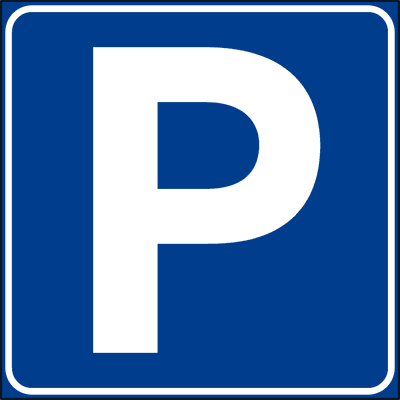
- **📖 الترجمة السياقية:** الإشارة المصورة تشير إلى موقف سيارات مصرح به (مرخص).
- **💡 الشرح والقاعدة المرورية:** إشارة موقف سيارات (Parcheggio - الشكل 86، المادة 120 من اللائحة التنفيذية) ذات الحرف 'P' الأبيض على خلفية زرقاء تشير إلى منطقة مخصصة ومصرح بها لانتظار المركبات.
- **⚠️ كشف الفخ:** الحرف P يعني موقف سيارات مسموح ومرخص به.
- **🔑 الكلمات المفتاحية:** `parcheggio autorizzato (موقف سيارات مصرح به)` | `area di sosta (منطقة انتظار)`

---

**450.** Il segnale raffigurato indica un'area attrezzata ed organizzata per sostare a tempo indeterminato, salvo diversa indicazione
- **الإجابة:** `VERO ✅ (صح)`
- 
- **📖 الترجمة السياقية:** الإشارة المصورة تشير إلى منطقة مجهزة ومنظمة للانتظار لمدة غير محددة، ما لم يُشر إلى غير ذلك.
- **💡 الشرح والقاعدة المرورية:** صحيح: في غياب لوحات إضافية تحدد شروطاً أو قيوداً زمنية (مثل القرص الزمني أو أجهزة الدفع)، يُسمح بانتظار المركبات في الموقف لفترة غير محددة من الوقت (المادة 120 من اللائحة التنفيذية).
- **⚠️ كشف الفخ:** عبارة 'a tempo indeterminato' صحيحة تماماً طالما لا توجد لوحة تقيد مدة الوقوف.
- **🔑 الكلمات المفتاحية:** `tempo indeterminato (مدة غير محددة)` | `area attrezzata (منطقة مجهزة)` | `parcheggio (موقف سيارات)`

---

**451.** Il segnale raffigurato indica un'area di parcheggio e può essere integrato con un pannello che ne indica la distanza
- **الإجابة:** `VERO ✅ (صح)`
- 
- **📖 الترجمة السياقية:** الإشارة المصورة تشير إلى منطقة موقف سيارات ويمكن أن تُدمج بلوحة إضافية تبين المسافة إليها.
- **💡 الشرح والقاعدة المرورية:** إشارة موقف سيارات (Parcheggio - الشكل 86، المادة 120 من اللائحة التنفيذية) يمكن تزويدها بلوحة إضافية للمسافة (مثل 300 م) لتحديد بعد الموقف عن مكان وضع الإشارة (المادة 83 من اللائحة).
- **⚠️ كشف الفخ:** يمكن دمج الإشارة بلوحة إضافية تبين المسافة للوصول إلى الموقف.
- **🔑 الكلمات المفتاحية:** `area di parcheggio (منطقة موقف سيارات)` | `pannello integrativo (لوحة إضافية)` | `distanza (مسافة)`

---

**452.** Il segnale raffigurato indica un'area di parcheggio e può essere integrato con un pannello che indica le categorie cui la stessa è riservata
- **الإجابة:** `VERO ✅ (صح)`
- 
- **📖 الترجمة السياقية:** الإشارة المصورة تشير إلى منطقة موقف سيارات ويمكن أن تُدمج بلوحة إضافية تبين الفئات المخصص لها الموقف.
- **💡 الشرح والقاعدة المرورية:** صحيح: يمكن تزويد إشارة الموقف بلوحة إضافية تقصر استخدامه على فئات معينة من المركبات (مثل الحافلات أو سيارات الأجرة أو المعاقين) وفقاً للمادتين 83 و120 من اللائحة التنفيذية.
- **⚠️ كشف الفخ:** اللوحات الإضافية يمكن أن تخصص الموقف لفئات محددة من المركبات.
- **🔑 الكلمات المفتاحية:** `categorie riservate (فئات مخصصة)` | `area di parcheggio (منطقة موقف سيارات)`

---

**453.** Il segnale raffigurato indica un'area di parcheggio e può essere integrato con pannello che indica le categorie di veicoli esclusi
- **الإجابة:** `VERO ✅ (صح)`
- 
- **📖 الترجمة السياقية:** الإشارة المصورة تشير إلى منطقة موقف سيارات ويمكن أن تُدمج بلوحة تبين فئات المركبات المستبعدة.
- **💡 الشرح والقاعدة المرورية:** صحيح: يمكن دمج الإشارة بلوحة استبعاد لفئات معينة تمنعها من الوقوف في الموقف (مثل استبعاد الشاحنات أو الكرفانات أو الدراجات) لتنظيم استيعاب المكان.
- **⚠️ كشف الفخ:** يمكن تحديد استثناءات ومنع فئات معينة عبر اللوحات الإضافية.
- **🔑 الكلمات المفتاحية:** `categorie escluse (فئات مستبعدة)` | `pannello integrativo (لوحة إضافية)`

---

**454.** Il segnale raffigurato indica un'area di parcheggio e può essere integrato con un pannello che ne indica la limitazione nel tempo
- **الإجابة:** `VERO ✅ (صح)`
- 
- **📖 الترجمة السياقية:** الإشارة المصورة تشير إلى منطقة موقف سيارات ويمكن أن تُدمج بلوحة تبين تحديد مدة الوقوف زمنياً.
- **💡 الشرح والقاعدة المرورية:** صحيح: يمكن وضع لوحة إضافية تحدد مدة الوقوف القصوى (مثل ساعة واحدة مع إلزامية وضع القرص الزمني disco orario) لضمان تداول السيارات في الموقف.
- **⚠️ كشف الفخ:** يجوز تقييد مدة الانتظار داخل الموقف بلوحة إضافية لتحديد الوقت.
- **🔑 الكلمات المفتاحية:** `limitazione nel tempo (تحديد زمني)` | `disco orario (قرص الساعة)`

---

**455.** Il segnale raffigurato indica un'area di parcheggio e può essere integrato con un pannello che indica l'orario e le tariffe
- **الإجابة:** `VERO ✅ (صح)`
- 
- **📖 الترجمة السياقية:** الإشارة المصورة تشير إلى منطقة موقف سيارات ويمكن أن تُدمج بلوحة تبين مواعيد العمل والتعريفات (الرسوم).
- **💡 الشرح والقاعدة المرورية:** صحيح: في المواقف المدفوعة، تُدمج الإشارة بلوحة تبين أوقات استحقاق الرسوم والتعرفة بالساعة أو وسائل الدفع المعتمدة (المادة 120 من اللائحة التنفيذية).
- **⚠️ كشف الفخ:** دمج الإشارة بلوحة المواعيد والتعريفات شائع في المواقف العامة ذات الرسوم.
- **🔑 الكلمات المفتاحية:** `orario e tariffe (مواعيد ورسوم)` | `sosta a pagamento (انتظار مدفوع)`

---

**456.** Il segnale raffigurato indica un'area di parcheggio e può essere integrato con un pannello indicante la disposizione dei veicoli
- **الإجابة:** `VERO ✅ (صح)`
- 
- **📖 الترجمة السياقية:** الإشارة المصورة تشير إلى منطقة موقف سيارات ويمكن أن تُدمج بلوحة تبين كيفية ترتيب واصطفاف المركبات.
- **💡 الشرح والقاعدة المرورية:** صحيح: يمكن دمجها باللوحات الإيضاحية التي توضح رسم وضعية الوقوف (موازٍ للرصيف، عمودي عليه، بزاوية مائلة، أو جزئياً فوق الرصيف).
- **⚠️ كشف الفخ:** توجد لوحات إضافية تحدد الوضعية الصحيحة لاصطفاف المركبات في الموقف.
- **🔑 الكلمات المفتاحية:** `disposizione dei veicoli (ترتيب المركبات / وضعية الاصطفاف)` | `schema di sosta (مخطط الوقوف)`

---

**457.** Il segnale raffigurato indica un'area di sosta con parchimetro
- **الإجابة:** `FALSO ❌ (خطأ)`
- 
- **📖 الترجمة السياقية:** الإشارة المصورة تشير إلى منطقة انتظار بجهاز دفع (باركومتر).
- **💡 الشرح والقاعدة المرورية:** خطأ: الإشارة بمفردها تدل فقط على موقف سيارات مرخص (وهو مجاني في الأصل وغير مقيد بزمن)؛ وللدلالة على وجود جهاز دفع (parchimetro) يلزم وجود لوحة إضافية مخصصة للرسوم.
- **⚠️ كشف الفخ:** الإشارة بمفردها لا تعني وجود باركومتر؛ فالموقف مجاني ما لم توجد لوحة الدفع.
- **🔑 الكلمات المفتاحية:** `parchimetro (جهاز الدفع الآلي)` | `parcheggio autorizzato (موقف مصرح به)`

---

**458.** Il segnale raffigurato indica che il parcheggio è ammesso dalle 8.00 alle 20.00
- **الإجابة:** `FALSO ❌ (خطأ)`
- 
- **📖 الترجمة السياقية:** الإشارة المصورة تشير إلى أن الوقوف في الموقف مسموح به من 8.00 إلى 20.00.
- **💡 الشرح والقاعدة المرورية:** خطأ: في غياب لوحات إضافية تحدد أوقاتاً معينة، يكون الموقف متاحاً للاستخدام على مدار 24 ساعة دون أي قيد زمني (المادة 120 من اللائحة التنفيذية).
- **⚠️ كشف الفخ:** لا يوجد قيد زمني 8.00 - 20.00 على إشارة الموقف المجردة؛ الوقوف متاح دائماً.
- **🔑 الكلمات المفتاحية:** `dalle 8.00 alle 20.00 (من 8:00 إلى 20:00)` | `tempo indeterminato (مدة غير محددة)`

---

**459.** Il segnale raffigurato indica un’area in cui è possibile la sosta al massimo per un’ora
- **الإجابة:** `FALSO ❌ (خطأ)`
- 
- **📖 الترجمة السياقية:** الإشارة المصورة تشير إلى منطقة يمكن فيها الانتظار لمدة أقصاها ساعة واحدة.
- **💡 الشرح والقاعدة المرورية:** خطأ: الإشارة البسيطة تسمح بالانتظار دون تحديد لأقصى مدة (tempo indeterminato)؛ وتحديد مدة ساعة يتطلب لوحة إضافية للقرص الزمني.
- **⚠️ كشف الفخ:** عبارة 'al massimo per un'ora' غير صحيحة للإشارة بمفردها؛ يلزم لوحة إضافية لتحديد الحد الأقصى.
- **🔑 الكلمات المفتاحية:** `al massimo per un'ora (لساعة واحدة كحد أقصى)` | `senza limite (بدون حد)`

---

**460.** Il segnale raffigurato indica la sosta libera, ma con divieto di fermata
- **الإجابة:** `FALSO ❌ (خطأ)`
- 
- **📖 الترجمة السياقية:** الإشارة المصورة تشير إلى انتظار حر، ولكن مع حظر التوقف المؤقت.
- **💡 الشرح والقاعدة المرورية:** خطأ: لا يمكن إطلاقاً حظر التوقف المؤقت (fermata) في مكان يُسمح فيه بالانتظار الكامل (sosta)؛ فالسماح بالانتظار يتضمن تلقائياً السماح بالتوقف المؤقت.
- **⚠️ كشف الفخ:** تناقض بديهي: المكان المسموح بركن السيارة فيه يسمح حتماً بالتوقف المؤقت لبضع ثوانٍ.
- **🔑 الكلمات المفتاحية:** `sosta libera (انتظار حر)` | `divieto di fermata (منع التوقف المؤقت)`

---

**461.** Il segnale raffigurato indica un'area di parcheggio riservato ai veicoli della Polizia di Stato
- **الإجابة:** `FALSO ❌ (خطأ)`
- 
- **📖 الترجمة السياقية:** الإشارة المصورة تشير إلى منطقة موقف مخصصة لمركبات شرطة الدولة.
- **💡 الشرح والقاعدة المرورية:** خطأ: الإشارة عامة ومتاحة لجميع مستخدمي الطريق؛ ولتخصيصها لمركبات الشرطة يلزم وجود لوحة إضافية تبين ذلك صراحة (Polizia).
- **⚠️ كشف الفخ:** الإشارة غير مخصصة للشرطة تلقائياً، بل هي موقف عام للجميع.
- **🔑 الكلمات المفتاحية:** `Polizia di Stato (شرطة الدولة)` | `parcheggio riservato (موقف مخصص)`

---

**462.** Il segnale raffigurato indica un'area di parcheggio e può essere integrato con un pannello che indica la superficie disponibile
- **الإجابة:** `FALSO ❌ (خطأ)`
- 
- **📖 الترجمة السياقية:** الإشارة المصورة تشير إلى منطقة موقف ويمكن أن تُدمج بلوحة تبين المساحة المتوفرة بالمتر المربع.
- **💡 الشرح والقاعدة المرورية:** خطأ: لا توجد في قانون السير لوحات إضافية تشير إلى 'المساحة' (superficie) بالمتر المربع؛ بل تشير اللوحات إلى عدد الأماكن المتاحة أو فئات المركبات أو المسافة.
- **⚠️ كشف الفخ:** فخ لفظي: لا توجد لوحة تبين مساحة الموقف بالمتر المربع، وإنما عدد المواقف أو المسافة.
- **🔑 الكلمات المفتاحية:** `superficie disponibile (المساحة المتاحة)` | `pannello integrativo (لوحة إضافية)`

---

**463.** Il segnale raffigurato indica un'area di parcheggio e può essere integrato con la prescrizione di lasciare la chiave nel quadro
- **الإجابة:** `FALSO ❌ (خطأ)`
- 
- **📖 الترجمة السياقية:** الإشارة المصورة تشير إلى منطقة موقف ويمكن أن تُدمج بأمر ترك المفتاح في مفتاح التشغيل.
- **💡 الشرح والقاعدة المرورية:** خطأ: المادة 158 الفقرة 4 من قانون السير تلزم السائقين باتخاذ كافة الاحتياطات ضد السرقة عند مغادرة المركبة؛ ويُحظر تماماً ترك المفتاح بداخلها، ولا يمكن لأي إشارة رسمية أن تطلب ذلك.
- **⚠️ كشف الفخ:** ترك المفتاح في السيارة مخالفة صريحة للقانون؛ ولا توجد إشارة تطلب ذلك مطلقاً.
- **🔑 الكلمات المفتاحية:** `lasciare la chiave nel quadro (ترك المفتاح في مفتاح التشغيل)` | `prescrizione (إلزام / أمر)`

---

## 📌 Preannuncio area parcheggio (7 domande)

**464.** Il segnale raffigurato preannuncia che nella direzione della freccia vi è un parcheggio
- **الإجابة:** `VERO ✅ (صح)`
- 
- **📖 الترجمة السياقية:** الإشارة المصورة تعلن مسبقاً عن وجود موقف سيارات في اتجاه السهم.
- **💡 الشرح والقاعدة المرورية:** إشارة إخطار مسبق بموقف سيارات (Preavviso di parcheggio - الشكل 89، المادة 120 من اللائحة التنفيذية) تفيد بوجود موقف سيارات عند السير في الاتجاه الموضح بالسهم.
- **⚠️ كشف الفخ:** الإشارة توجه السائقين نحو الموقف باتباع اتجاه السهم.
- **🔑 الكلمات المفتاحية:** `preannuncia (يعلن مسبقاً)` | `direzione della freccia (اتجاه السهم)` | `parcheggio (موقف سيارات)`

---

**465.** Il segnale raffigurato preannuncia una zona di parcheggio procedendo nel senso della freccia
- **الإجابة:** `VERO ✅ (صح)`
- 
- **📖 الترجمة السياقية:** الإشارة المصورة تعلن مسبقاً عن منطقة موقف سيارات عند التقدم في اتجاه السهم.
- **💡 الشرح والقاعدة المرورية:** صحيح: تؤكد الإشارة أن مواصلة السير في المسار والاتجاه الذي يحدده السهم توصل إلى منطقة موقف سيارات.
- **⚠️ كشف الفخ:** اتباع اتجاه السهم يقود إلى منطقة الموقف.
- **🔑 الكلمات المفتاحية:** `senso della freccia (اتجاه السهم)` | `zona di parcheggio (منطقة موقف سيارات)`

---

**466.** Il segnale raffigurato preannuncia un parcheggio a 300 metri nel senso della freccia
- **الإجابة:** `VERO ✅ (صح)`
- 
- **📖 الترجمة السياقية:** الإشارة المصورة تعلن مسبقاً عن موقف سيارات على بعد 300 متر في اتجاه السهم.
- **💡 الشرح والقاعدة المرورية:** صحيح: توضح اللوحة المسافة المتبقية (300 متر) والاتجاه الواجب اتباعه للوصول إلى الموقف.
- **⚠️ كشف الفخ:** تحدد الإشارة كلاً من المسافة (300 متر) والاتجاه المطلوب.
- **🔑 الكلمات المفتاحية:** `a 300 metri (على بعد 300 متر)` | `senso della freccia (في اتجاه السهم)`

---

**467.** Il segnale raffigurato preannuncia un posto di pronto soccorso nel senso della freccia
- **الإجابة:** `FALSO ❌ (خطأ)`
- 
- **📖 الترجمة السياقية:** الإشارة المصورة تعلن مسبقاً عن مركز إسعاف أولي في اتجاه السهم.
- **💡 الشرح والقاعدة المرورية:** خطأ: الحرف 'P' يرمز للموقف (Parcheggio)، ولا علاقة له بالإسعاف الأولي (Pronto Soccorso) الذي يحمل رمز الصليب الأحمر.
- **⚠️ كشف الفخ:** الحرف P يعني موقف سيارات وليس إسعافاً أولياً.
- **🔑 الكلمات المفتاحية:** `pronto soccorso (إسعاف أولي)` | `parcheggio (موقف سيارات)`

---

**468.** Il segnale raffigurato preannuncia un parcheggio vietato nel senso della freccia
- **الإجابة:** `FALSO ❌ (خطأ)`
- 
- **📖 الترجمة السياقية:** الإشارة المصورة تعلن مسبقاً عن موقف سيارات ممنوع في اتجاه السهم.
- **💡 الشرح والقاعدة المرورية:** خطأ: لا يوجد شيء اسمه 'موقف ممنوع'؛ الإشارة إرشادية وتدل على موقف متاح ومسموح به عند اتباع السهم.
- **⚠️ كشف الفخ:** الإشارة للدلالة على موقف مسموح به وليست حظراً.
- **🔑 الكلمات المفتاحية:** `parcheggio vietato (موقف ممنوع)` | `preannuncia (يعلن مسبقاً)`

---

**469.** Il segnale raffigurato preannuncia che la sosta e il parcheggio sono vietati nel senso della freccia
- **الإجابة:** `FALSO ❌ (خطأ)`
- 
- **📖 الترجمة السياقية:** الإشارة المصورة تعلن مسبقاً عن منع الانتظار والركن في اتجاه السهم.
- **💡 الشرح والقاعدة المرورية:** خطأ: الإشارة لا تمنع شيئاً، بل تقدم خدمة بإرشاد السائقين إلى مكان الموقف.
- **⚠️ كشف الفخ:** الإشارة تدل على وجود موقف ولا تمنع الانتظار.
- **🔑 الكلمات المفتاحية:** `sosta vietata (انتظار ممنوع)` | `preannuncia (يعلن مسبقاً)`

---

**470.** Il segnale raffigurato preannuncia di procedere oltre perché il parcheggio è riservato
- **الإجابة:** `FALSO ❌ (خطأ)`
- 
- **📖 الترجمة السياقية:** الإشارة المصورة تعلن مسبقاً بوجوب مواصلة السير للأمام لأن الموقف محجوز.
- **💡 الشرح والقاعدة المرورية:** خطأ: الإشارة ترشد السائق للتوجه نحو الموقف في اتجاه السهم ولا تطالبه بتجاوزه أو مواصلة السير للأمام.
- **⚠️ كشف الفخ:** الإشارة تدعو لاتباع السهم نحو الموقف وليست أمراً بمواصلة السير.
- **🔑 الكلمات المفتاحية:** `procedere oltre (مواصلة السير للأمام)` | `parcheggio riservato (موقف محجوز)`

---

## 📌 Segnale passo carrabile (10 domande)

**471.** Il segnale raffigurato vieta la sosta nel luogo dove è posto
- **الإجابة:** `VERO ✅ (صح)`
- 
- **📖 الترجمة السياقية:** الإشارة المصورة تمنع الانتظار في المكان الذي وُضعت فيه.
- **💡 الشرح والقاعدة المرورية:** إشارة ممر سيارات خاص (Passo carrabile - الشكل 90، المادة 120 من اللائحة التنفيذية) تمنع انتظار المركبات أمام مدخل العقار لضمان حرية حركة الدخول والخروج.
- **⚠️ كشف الفخ:** الإشارة تمنع الانتظار (sosta) أمام المدخل لمنع إغلاقه.
- **🔑 الكلمات المفتاحية:** `passo carrabile (مدخل كراج / ممر سيارات خاص)` | `vieta la sosta (يمنع الانتظار)`

---

**472.** Il segnale raffigurato indica la zona per l'accesso dei veicoli alle proprietà laterali
- **الإجابة:** `VERO ✅ (صح)`
- 
- **📖 الترجمة السياقية:** الإشارة المصورة تشير إلى منطقة دخول المركبات إلى العقارات الجانبية (المنازل والكراجات).
- **💡 الشرح والقاعدة المرورية:** صحيح: الغرض القانوني من ترخيص ممر السيارات الخاص هو تمكين المركبات من العبور بين الطريق العام والملكيات العقارية الخاصة الجانبية (المادة 22 من قانون السير).
- **⚠️ كشف الفخ:** التعريف الرسمي لإشارة مدخل ممر السيارات الخاص.
- **🔑 الكلمات المفتاحية:** `accesso alle proprietà laterali (الدخول إلى العقارات الجانبية)` | `passo carrabile (ممر سيارات)`

---

**473.** Il segnale raffigurato indica lo sbocco di un passo carrabile
- **الإجابة:** `VERO ✅ (صح)`
- 
- **📖 الترجمة السياقية:** الإشارة المصورة تشير إلى مخرج/منفذ ممر سيارات خاص (Passo carrabile).
- **💡 الشرح والقاعدة المرورية:** صحيح: الإشارة توضع على منفذ أو بوابة الممر الخاص المفتوح على الطريق العام للدلالة على خروج ودخول المركبات منه.
- **⚠️ كشف الفخ:** تحدد الإشارة بدقة منفذ أو مخرج ممر السيارات الخاص.
- **🔑 الكلمات المفتاحية:** `sbocco (مخرج / منفذ)` | `passo carrabile (ممر كراج سيارات)`

---

**474.** Il segnale raffigurato consente la fermata, purché il veicolo non sia di intralcio
- **الإجابة:** `VERO ✅ (صح)`
- 
- **📖 الترجمة السياقية:** الإشارة المصورة تسمح بالتوقف المؤقت، بشرط ألا تسبب المركبة إعاقة لحركة المرور.
- **💡 الشرح والقاعدة المرورية:** صحيح: إشارة ممر السيارات الخاص تمنع الانتظار المطول (sosta)، ولكنها تجيز التوقف المؤقت والوجيز (fermata) لنزول أو صعود الركاب شريطة عدم تعطيل دخول أو خروج سيارات العقار (المادة 158 الفقرة 2 من قانون السير).
- **⚠️ كشف الفخ:** فخ شهير: التوقف المؤقت السريع (fermata) مسموح أمام ممر السيارات الخاص إذا لم يعق الحركة، والممنوع فقط هو الانتظار (sosta)!
- **🔑 الكلمات المفتاحية:** `consente la fermata (يسمح بالتوقف المؤقت)` | `non sia di intralcio (ألا تسبب إعاقة)` | `passo carrabile (مدخل كراج)`

---

**475.** Il segnale raffigurato, per essere valido, deve contenere l'indicazione dell'ente che ha concesso l'autorizzazione, il numero e l'anno del rilascio
- **الإجابة:** `VERO ✅ (صح)`
- 
- **📖 الترجمة السياقية:** الإشارة المصورة، لكي تكون قانونية وسارية المفعول، يجب أن تتضمن اسم الجهة المانحة للترخيص، ورقم وتاريخ (سنة) الإصدار.
- **💡 الشرح والقاعدة المرورية:** صحيح: تنص المادة 120 من اللائحة التنفيذية لقانون السير على أن لوحة ممر السيارات الخاص لا تكتسب حجيتها وقانونيتها إلا إذا حملت في أعلاها اسم وشعار البلدية/الجهة المرخصة، وفي أسفلها رقم وتاريخ منح الترخيص.
- **⚠️ كشف الفخ:** شرط قانوني جوهري: اللوحة التي لا تحتوي على اسم البلدية ورقم وسنة الترخيص تُعتبر باطلة وغير قانونية.
- **🔑 الكلمات المفتاحية:** `ente che ha concesso l'autorizzazione (الجهة المانحة للترخيص)` | `numero e anno del rilascio (رقم وسنة الإصدار)` | `valido (صالح / قانوني)`

---

**476.** Il segnale raffigurato è posto soltanto nelle strade urbane
- **الإجابة:** `FALSO ❌ (خطأ)`
- 
- **📖 الترجمة السياقية:** الإشارة المصورة توضع فقط في الطرق الحضرية (داخل المدن).
- **💡 الشرح والقاعدة المرورية:** خطأ: يمكن وضع ترخيص ممر السيارات الخاص على أي عقار جانبي يتصل بالطريق العام، سواء كان داخل المدن أو خارجها على الطرق الإقليمية (المادتان 22 و120).
- **⚠️ كشف الفخ:** عبارة 'soltanto nelle strade urbane' خاطئة؛ فالممر الخاص يمكن ترخيصه على الطرق الخارجية أيضاً.
- **🔑 الكلمات المفتاحية:** `soltanto nelle strade urbane (فقط في الطرق الحضرية)`

---

**477.** Il segnale raffigurato vale solo nelle ore diurne
- **الإجابة:** `FALSO ❌ (خطأ)`
- 
- **📖 الترجمة السياقية:** الإشارة المصورة تسري فقط خلال ساعات النهار.
- **💡 الشرح والقاعدة المرورية:** خطأ: منع الانتظار أمام ممر السيارات الخاص يسري على مدار 24 ساعة يومياً (ليلاً ونهاراً) لضمان دخول وخروج المركبات في أي وقت.
- **⚠️ كشف الفخ:** حظر الانتظار أمام مدخل الكراج دائم طوال الـ 24 ساعة.
- **🔑 الكلمات المفتاحية:** `solo nelle ore diurne (فقط في ساعات النهار)` | `24 ore su 24 (24 ساعة)`

---

**478.** Il segnale raffigurato vale solo nelle ore notturne
- **الإجابة:** `FALSO ❌ (خطأ)`
- 
- **📖 الترجمة السياقية:** الإشارة المصورة تسري فقط خلال ساعات الليل.
- **💡 الشرح والقاعدة المرورية:** خطأ: الإشارة تسري ليلاً ونهاراً على مدار 24 ساعة دون انقطاع.
- **⚠️ كشف الفخ:** لا تقتصر الإشارة على الليل أبداً؛ بل تسري طوال اليوم.
- **🔑 الكلمات المفتاحية:** `solo nelle ore notturne (فقط في ساعات الليل)`

---

**479.** Il segnale raffigurato consente la sosta a particolari categorie di veicoli
- **الإجابة:** `FALSO ❌ (خطأ)`
- 
- **📖 الترجمة السياقية:** الإشارة المصورة تسمح بالانتظار لفئات معينة من المركبات.
- **💡 الشرح والقاعدة المرورية:** خطأ: الانتظار أمام ممر السيارات الخاص ممنوع تماماً على كافة المركبات بلا استثناء، حتى على سيارة مالك العقار نفسه صاحب الترخيص!
- **⚠️ كشف الفخ:** الانتظار ممنوع على الجميع دون أي استثناء لأي فئة، وحتى صاحب المدخل لا يحق له ركن سيارته أمامه على الطريق العام.
- **🔑 الكلمات المفتاحية:** `particolari categorie (فئات خاصة)` | `divieto di sosta (ممنوع الانتظار)`

---

**480.** Il segnale raffigurato consente la sosta ai veicoli adibiti al pronto soccorso non in servizio
- **الإجابة:** `FALSO ❌ (خطأ)`
- 
- **📖 الترجمة السياقية:** الإشارة المصورة تسمح بالانتظار للمركبات المخصصة للإسعاف الأولي غير الموجودة في الخدمة.
- **💡 الشرح والقاعدة المرورية:** خطأ: سيارات الإسعاف أو الطوارئ عندما لا تكون في حالة خدمة وتدخل فعلي تخضع للقواعد العامة كأي سيارة أخرى، ويُمنع عليها منعاً باتاً تعطيل ممر السيارات الخاص.
- **⚠️ كشف الفخ:** مركبات الطوارئ 'غير الموجودة في الخدمة' لا تملك أي استثناء وتلتزم بالقواعد كأي مركبة عادية.
- **🔑 الكلمات المفتاحية:** `pronto soccorso non in servizio (إسعاف ليس في الخدمة)` | `consente la sosta (يسمح بالانتظار)`

---

## 📌 Divieto sosta contrassegno persone invalide (11 domande)

**481.** Il segnale raffigurato consente la sosta ai veicoli al servizio di persone invalide munite dell'apposito contrassegno
- **الإجابة:** `VERO ✅ (صح)`
- 
- **📖 الترجمة السياقية:** الإشارة المصورة تسمح بالانتظار للمركبات المخصصة لخدمة الأشخاص ذوي الإعاقة الحاملين للتصريح المخصص.
- **💡 الشرح والقاعدة المرورية:** إشارة تخصيص مكان الانتظار لذوي الإعاقة (الشكل 91، المادة 120 من اللائحة التنفيذية) تمنع الانتظار على الجميع وتستثني حصراً المركبات التي تخدم أشخاصاً معاقين وتحمل التصريح النظامي المعتمد (contrassegno).
- **⚠️ كشف الفخ:** المكان مخصص حصرياً للمركبات التي تخدم ذوي الإعاقة ولديها التصريح الرسمي.
- **🔑 الكلمات المفتاحية:** `persone invalide (أشخاص ذوو إعاقة)` | `apposito contrassegno (تصريح مخصص)` | `consente la sosta (يسمح بالانتظار)`

---

**482.** Il segnale raffigurato è un segnale di prescrizione
- **الإجابة:** `VERO ✅ (صح)`
- 
- **📖 الترجمة السياقية:** الإشارة المصورة هي إشارة تنظيمية (من إشارات الأوامر/الحظر).
- **💡 الشرح والقاعدة المرورية:** صحيح: الإشارة هي صورة خاصة من صور منع الانتظار، وتندرج بالتالي تحت فئة إشارات التنظيم (segnali di prescrizione) وتحديداً إشارات الحظر.
- **⚠️ كشف الفخ:** تندرج الإشارة ضمن إشارات التنظيم (prescrizione) لأنها تحدد حظراً واستثناءً تنظيمياً ملزماً.
- **🔑 الكلمات المفتاحية:** `segnale di prescrizione (إشارة تنظيمية / إلزامية)`

---

**483.** Il segnale raffigurato rappresenta una specifica eccezione al divieto di sosta
- **الإجابة:** `VERO ✅ (صح)`
- 
- **📖 الترجمة السياقية:** الإشارة المصورة تمثل استثناءً محدداً لقاعدة منع الانتظار.
- **💡 الشرح والقاعدة المرورية:** صحيح: تفرض الإشارة حظراً عاماً على الانتظار مع منح استثناء خاص لصالح المركبات المخصصة لخدمة الأشخاص ذوي الإعاقة (المادة 120 من اللائحة التنفيذية).
- **⚠️ كشف الفخ:** الإشارة هي حظر انتظار يتضمن استثناءً مخصصاً لذوي الإعاقة.
- **🔑 الكلمات المفتاحية:** `specifica eccezione (استثناء محدد)` | `divieto di sosta (ممنوع الانتظار)`

---

**484.** Il segnale raffigurato non consente la sosta a veicoli diversi da quelli al servizio di persone invalide
- **الإجابة:** `VERO ✅ (صح)`
- 
- **📖 الترجمة السياقية:** الإشارة المصورة لا تسمح بالانتظار للمركبات الأخرى غير تلك المخصصة لخدمة ذوي الإعاقة.
- **💡 الشرح والقاعدة المرورية:** صحيح: يُمنع منعاً باتاً على أي مركبة أخرى الانتظار في هذا الموقف المخصص، وتترتب على مخالفته عقوبات مشددة وسحب فوري للمركبة بالونش (المادتان 158 و159 من قانون السير).
- **⚠️ كشف الفخ:** الانتظار محظور تماماً على سائر المركبات التي لا تحمل تصريح ذوي الإعاقة.
- **🔑 الكلمات المفتاحية:** `non consente la sosta (لا تسمح بالانتظار)` | `veicoli diversi (مركبات أخرى)`

---

**485.** Il segnale raffigurato consente la sosta agli scuolabus
- **الإجابة:** `FALSO ❌ (خطأ)`
- 
- **📖 الترجمة السياقية:** الإشارة المصورة تسمح بالانتظار لحافلات المدارس.
- **💡 الشرح والقاعدة المرورية:** خطأ: الإشارة مخصصة حصرياً لخدمة الأشخاص ذوي الإعاقة ولا علاقة لها بحافلات المدارس (scuolabus).
- **⚠️ كشف الفخ:** الموقف ليس لحافلات المدارس، بل هو مخصص حصراً لذوي الإعاقة.
- **🔑 الكلمات المفتاحية:** `scuolabus (حافلات المدارس)` | `consente la sosta (يسمح بالانتظار)`

---

**486.** Il segnale raffigurato indica una corsia riservata ai veicoli al servizio di persone invalide
- **الإجابة:** `FALSO ❌ (خطأ)`
- 
- **📖 الترجمة السياقية:** الإشارة المصورة تشير إلى مسار سير مخصص لمركبات ذوي الإعاقة.
- **💡 الشرح والقاعدة المرورية:** خطأ: الإشارة تحدد مكاناً للانتظار (stallo di sosta) ولا تشير إلى مسار سير أو حارة مرورية (corsia riservata) في نهر الطريق.
- **⚠️ كشف الفخ:** الإشارة تخص الانتظار (sosta) وليس مسار سير مخصص للمرور.
- **🔑 الكلمات المفتاحية:** `corsia riservata (مسار مخصص)` | `sosta (انتظار)`

---

**487.** Il segnale raffigurato è un divieto di sosta per i veicoli al servizio di invalidi, ed indica il più vicino parcheggio
- **الإجابة:** `FALSO ❌ (خطأ)`
- 
- **📖 الترجمة السياقية:** الإشارة المصورة هي منع انتظار لمركبات ذوي الإعاقة، وتشير إلى أقرب موقف سيارات.
- **💡 الشرح والقاعدة المرورية:** خطأ: الإشارة تعكس العكس تماماً: فهي تسمح بالانتظار لمركبات ذوي الإعاقة وتمنعه على باقي المركبات.
- **⚠️ كشف الفخ:** فخ عكس المعنى: الإشارة تسمح لذوي الإعاقة بالوقوف وتمنع غيرهم.
- **🔑 الكلمات المفتاحية:** `divieto di sosta per invalidi (منع انتظار لذوي الإعاقة)`

---

**488.** Il segnale raffigurato preavvisa una zona vietata al traffico regolare perché attrezzata per persone invalide
- **الإجابة:** `FALSO ❌ (خطأ)`
- 
- **📖 الترجمة السياقية:** الإشارة المصورة تخطر مسبقاً بمنطقة ممنوعة على حركة المرور العادية لأنها مجهزة لذوي الإعاقة.
- **💡 الشرح والقاعدة المرورية:** خطأ: الإشارة لا تقيد حركة السير العادية في الشارع، بل تنظم فقط خانة انتظار معينة بجانب الطريق.
- **⚠️ كشف الفخ:** لا تمنع الإشارة حركة المرور العادية، وإنما تخص فقط ركن السيارات.
- **🔑 الكلمات المفتاحية:** `zona vietata al traffico (منطقة محظورة على المرور)` | `preavvisa (يخطر مسبقاً)`

---

**489.** Il segnale raffigurato, nella strada ove è posto, consente il transito ai soli veicoli al servizio di persone invalide
- **الإجابة:** `FALSO ❌ (خطأ)`
- 
- **📖 الترجمة السياقية:** الإشارة المصورة، في الطريق الذي وُضعت فيه، تسمح بمرور مركبات ذوي الإعاقة فقط.
- **💡 الشرح والقاعدة المرورية:** خطأ: الإشارة لا تمنع المرور ولا تنظم عبور السيارات، بل تقتصر على تنظيم ركن السيارات (الانتظار).
- **⚠️ كشف الفخ:** الإشارة لا تحدد من يمر في الشارع، بل تحدد من يحق له الانتظار في هذا الموقف.
- **🔑 الكلمات المفتاحية:** `consente il transito (يسمح بالمرور / السير)` | `soli veicoli (المركبات فقط)`

---

**490.** Il segnale raffigurato consente la sosta ai ciclomotori e ai motocicli
- **الإجابة:** `FALSO ❌ (خطأ)`
- 
- **📖 الترجمة السياقية:** الإشارة المصورة تسمح بالانتظار للدراجات الآلية والدراجات النارية.
- **💡 الشرح والقاعدة المرورية:** خطأ: يُحظر على الدراجات النارية والدراجات الآلية العادية الوقوف في هذا المكان المخصص لذوي الإعاقة.
- **⚠️ كشف الفخ:** لا يحق للدراجات النارية العادية الوقوف في مواقف ذوي الإعاقة.
- **🔑 الكلمات المفتاحية:** `ciclomotori e motocicli (دراجات آلية ونارية)` | `consente la sosta (يسمح بالانتظار)`

---

**491.** Il segnale raffigurato consente la sosta esponendo il tagliando emesso da un parchimetro
- **الإجابة:** `FALSO ❌ (خطأ)`
- 
- **📖 الترجمة السياقية:** الإشارة المصورة تسمح بالانتظار عند إبراز تذكرة صادرة من جهاز الدفع (باركومتر).
- **💡 الشرح والقاعدة المرورية:** خطأ: الموقف المخصص لذوي الإعاقة محجوز لحاملي التصريح المخصص مجاناً ولا يُتاح للعامة عبر دفع رسوم الباركومتر.
- **⚠️ كشف الفخ:** شراء تذكرة باركومتر لا يمنح أي حق للوقوف في مكان مخصص لذوي الإعاقة.
- **🔑 الكلمات المفتاحية:** `parchimetro (جهاز الدفع)` | `tagliando (تذكرة)`

---

## 📌 Regolazione sosta (11 domande)

**492.** Il segnale raffigurato rappresenta una regolazione della sosta
- **الإجابة:** `VERO ✅ (صح)`
- 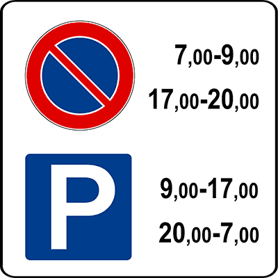
- **📖 الترجمة السياقية:** الإشارة المصورة تمثل تنظيماً للانتظار (regolazione della sosta).
- **💡 الشرح والقاعدة المرورية:** إشارة تنظيم الانتظار وفق فترات زمنية (الشكل 92، المادة 120 من اللائحة التنفيذية) تقسم اليوم إلى فترات يُسمح فيها بالانتظار وفترات أخرى يُمنع فيها.
- **⚠️ كشف الفخ:** الإشارة تنظم الانتظار عبر توزيع ساعات اليوم بين السماح والمنع.
- **🔑 الكلمات المفتاحية:** `regolazione della sosta (تنظيم الانتظار)`

---

**493.** Il segnale raffigurato consente la sosta dalle ore 9.00 alle 17.00
- **الإجابة:** `VERO ✅ (صح)`
- 
- **📖 الترجمة السياقية:** الإشارة المصورة تسمح بالانتظار من الساعة 9.00 إلى 17.00.
- **💡 الشرح والقاعدة المرورية:** صحيح: اللوحة الموضحة بالشكل 92 تحدد الفترة بين 9:00 صباحاً و 17:00 مساءً كفترة يُسمح فيها بانتظار المركبات.
- **⚠️ كشف الفخ:** قراءة اللوحة تؤكد السماح بالانتظار في الفترة من 9 إلى 17.
- **🔑 الكلمات المفتاحية:** `consente la sosta (يسمح بالانتظار)` | `dalle ore 9.00 alle 17.00 (من 9:00 إلى 17:00)`

---

**494.** Il segnale raffigurato vieta la sosta dalle ore 17.00 alle 20.00
- **الإجابة:** `VERO ✅ (صح)`
- 
- **📖 الترجمة السياقية:** الإشارة المصورة تمنع الانتظار من الساعة 17.00 إلى 20.00.
- **💡 الشرح والقاعدة المرورية:** صحيح: اللوحة تحدد الفترة المسائية من الساعة 17:00 إلى الساعة 20:00 كفترة يسري فيها حظر الانتظار.
- **⚠️ كشف الفخ:** من الساعة 17 إلى 20 يسري منع الانتظار رسمياً.
- **🔑 الكلمات المفتاحية:** `vieta la sosta (يمنع الانتظار)` | `dalle ore 17.00 alle 20.00 (من 17:00 إلى 20:00)`

---

**495.** Il segnale raffigurato consente la sosta in alcune ore e la vieta in altre
- **الإجابة:** `VERO ✅ (صح)`
- 
- **📖 الترجمة السياقية:** الإشارة المصورة تسمح بالانتظار في ساعات معينة وتمنعه في ساعات أخرى.
- **💡 الشرح والقاعدة المرورية:** صحيح: هذه هي الطبيعة التشغيلية لإشارة تنظيم الانتظار، حيث توزع اليوم بين ساعات مسموحة وساعات ممنوعة.
- **⚠️ كشف الفخ:** الإشارة توفق بين السماح والمنع بحسب الساعات المحددة في اللوحة.
- **🔑 الكلمات المفتاحية:** `in alcune ore (في بعض الساعات)` | `la vieta in altre (وتمنعه في ساعات أخرى)`

---

**496.** Il segnale raffigurato consente la sosta dalle ore 20.00 alle ore 7.00
- **الإجابة:** `VERO ✅ (صح)`
- 
- **📖 الترجمة السياقية:** الإشارة المصورة تسمح بالانتظار من الساعة 20.00 إلى الساعة 7.00.
- **💡 الشرح والقاعدة المرورية:** صحيح: نظراً لأن فترات الحظر المحددة تغطي الفترتين (7-9 و 17-20)، فإن الفترة الليلية من 20:00 مساءً حتى 7:00 صباحاً يُسمح فيها بالانتظار بحرية.
- **⚠️ كشف الفخ:** خلال ساعات الليل من 20:00 حتى 7:00 صباحاً الانتظار مسموح به تماماً.
- **🔑 الكلمات المفتاحية:** `dalle ore 20.00 alle ore 7.00 (من 20:00 إلى 7:00)` | `consente la sosta (يسمح بالانتظار)`

---

**497.** Il segnale raffigurato vieta la sosta dalle ore 7.00 alle ore 9.00
- **الإجابة:** `VERO ✅ (صح)`
- 
- **📖 الترجمة السياقية:** الإشارة المصورة تمنع الانتظار من الساعة 7.00 إلى الساعة 9.00.
- **💡 الشرح والقاعدة المرورية:** صحيح: الفترة الصباحية من الساعة 7:00 إلى 9:00 محددة صراحة تحت رمز حظر الانتظار لتسهيل حركة المرور في ساعات الذروة.
- **⚠️ كشف الفخ:** الانتظار ممنوع صباحاً من الساعة 7:00 إلى 9:00.
- **🔑 الكلمات المفتاحية:** `vieta la sosta (يمنع الانتظار)` | `dalle ore 7.00 alle ore 9.00 (من 7:00 إلى 9:00)`

---

**498.** Il segnale raffigurato, nei centri abitati, consente la sosta dalle ore 20.00 alle 8.00
- **الإجابة:** `FALSO ❌ (خطأ)`
- 
- **📖 الترجمة السياقية:** الإشارة المصورة، داخل المناطق السكنية، تسمح بالانتظار من الساعة 20.00 إلى 8.00.
- **💡 الشرح والقاعدة المرورية:** خطأ: الإشارة تحدد بداية فترة منع الانتظار الصباحية عند الساعة 7:00 تماماً؛ وبالتالي يُحظر الانتظار بين الساعة 7:00 و 8:00 ولا يمتد السماح حتى الساعة 8:00.
- **⚠️ كشف الفخ:** انتبه للأوقات: الحظر يبدأ الساعة 7:00 صباحاً وليس 8:00؛ لذا لا يجوز الانتظار حتى 8:00.
- **🔑 الكلمات المفتاحية:** `dalle ore 20.00 alle 8.00 (من 20:00 إلى 8:00)` | `consente la sosta (يسمح بالانتظار)`

---

**499.** Il segnale raffigurato indica una zona destinata al parcheggio con impiego del disco orario
- **الإجابة:** `FALSO ❌ (خطأ)`
- 
- **📖 الترجمة السياقية:** الإشارة المصورة تشير إلى منطقة مخصصة لموقف سيارات مع استخدام القرص الزمني.
- **💡 الشرح والقاعدة المرورية:** خطأ: لا يوجد في الإشارة رمز القرص الزمني (disco orario)؛ فالإشارة تنظم ساعات المنع والسماح فقط دون اشتراط قرص التوقيت.
- **⚠️ كشف الفخ:** الإشارة تنظم فترات الانتظار بالساعات ولا تطلب استخدام القرص الزمني.
- **🔑 الكلمات المفتاحية:** `disco orario (قرص التوقيت)` | `zona destinata al parcheggio (منطقة مخصصة للموقف)`

---

**500.** Il segnale raffigurato vieta la fermata del veicolo tra le ore 17.00 e le 20.00
- **الإجابة:** `FALSO ❌ (خطأ)`
- 
- **📖 الترجمة السياقية:** الإشارة المصورة تمنع التوقف المؤقت للمركبة بين الساعة 17.00 و 20.00.
- **💡 الشرح والقاعدة المرورية:** خطأ: الإشارة تمنع الانتظار المطول (sosta) فقط، بينما التوقف المؤقت الوجيز (fermata) يظل مسموحاً به في كافة الأوقات بما فيها بين 17 و 20.
- **⚠️ كشف الفخ:** التوقف المؤقت (fermata) مسموح به دائماً؛ الممنوع هو الانتظار فقط.
- **🔑 الكلمات المفتاحية:** `vieta la fermata (يمنع التوقف المؤقت)` | `dalle 17.00 alle 20.00 (من 17:00 إلى 20:00)`

---

**501.** Il segnale raffigurato consente il parcheggio dalle ore 7.00 alle 9.00
- **الإجابة:** `FALSO ❌ (خطأ)`
- 
- **📖 الترجمة السياقية:** الإشارة المصورة تسمح بركن السيارات من الساعة 7.00 إلى 9.00.
- **💡 الشرح والقاعدة المرورية:** خطأ: الفترة من 7:00 إلى 9:00 صباحاً هي فترة منع انتظار صريحة ومؤكدة بالرمز.
- **⚠️ كشف الفخ:** الانتظار ممنوع من 7 إلى 9 وليس مسموحاً.
- **🔑 الكلمات المفتاحية:** `consente il parcheggio (يسمح بالركن)` | `dalle ore 7.00 alle 9.00 (من 7:00 إلى 9:00)`

---

**502.** Nelle ore in cui è vietata la sosta, il segnale raffigurato comporta la rimozione del veicolo
- **الإجابة:** `FALSO ❌ (خطأ)`
- 
- **📖 الترجمة السياقية:** في الساعات التي يُحظر فيها الانتظار، تؤدي الإشارة المصورة إلى سحب المركبة بالونش.
- **💡 الشرح والقاعدة المرورية:** خطأ: سحب المركبة بالونش (rimozione forzata) لا يكون تلقائياً في حالات منع الانتظار البسيط ما لم تقترن الإشارة بلوحة رمز شاحنة السحب (المادة 159 من قانون السير).
- **⚠️ كشف الفخ:** السحب بالونش لا يترتب إلا بوجود لوحة الونش الإضافية المخصصة لذلك.
- **🔑 الكلمات المفتاحية:** `rimozione del veicolo (سحب المركبة بالونش)` | `comporta (يترتب عليه)`

---

## 📌 Divieto sosta temporaneo (8 domande)

**503.** Il segnale raffigurato è un segnale di DIVIETO DI SOSTA TEMPORANEO
- **الإجابة:** `VERO ✅ (صح)`
- 
- **📖 الترجمة السياقية:** الإشارة المصورة هي إشارة منع انتظار مؤقت (Divieto di sosta temporaneo).
- **💡 الشرح والقاعدة المرورية:** إشارة منع الانتظار لأعمال النظافة الآلية للشوارع (الشكل 148، المادة 120 من اللائحة التنفيذية) هي إشارة منع انتظار مؤقت تسري فقط خلال الساعات والأيام المحددة لتنظيف الطريق.
- **⚠️ كشف الفخ:** الإشارة مؤقتة (temporaneo) لأنها تسري في أيام وساعات كنس وغسيل الشارع فقط.
- **🔑 الكلمات المفتاحية:** `divieto di sosta temporaneo (منع انتظار مؤقت)` | `pulizia strade (تنظيف الشوارع)`

---

**504.** Il segnale raffigurato è posto nei tratti di strada ove vengono effettuate operazioni di pulizia meccanica delle strade
- **الإجابة:** `VERO ✅ (صح)`
- 
- **📖 الترجمة السياقية:** الإشارة المصورة توضع في مقاطع الطرق التي تُجرى فيها عمليات تنظيف الشوارع بالآلات الميكانيكية.
- **💡 الشرح والقاعدة المرورية:** صحيح: تُثبت هذه الإشارة في الشوارع التي تخضع لعمليات كنس وغسيل آلي دوري بواسطة شاحنات كنس الشوارع (autospazzatrici).
- **⚠️ كشف الفخ:** توضع في الشوارع التي تُنظف بواسطة الآلات الميكانيكية لضمان خلو الطريق لمرورها.
- **🔑 الكلمات المفتاحية:** `pulizia meccanica delle strade (تنظيف الشوارع ميكانيكياً)` | `tratti di strada (مقاطع الطريق)`

---

**505.** Il segnale raffigurato vieta la sosta nei periodi in cui viene effettuata la pulizia meccanica della strada
- **الإجابة:** `VERO ✅ (صح)`
- 
- **📖 الترجمة السياقية:** الإشارة المصورة تمنع الانتظار في الفترات التي تُجرى فيها عمليات التنظيف الميكانيكي للطريق.
- **💡 الشرح والقاعدة المرورية:** صحيح: تمنع الإشارة انتظار المركبات تماماً خلال الفترات المحددة لتمكين آليات النظافة من الوصول إلى حافة الرصيف والكنس بشكل كامل ودون عوائق.
- **⚠️ كشف الفخ:** الهدف هو إخلاء حافة الطريق من السيارات أثناء مرور شاحنة النظافة.
- **🔑 الكلمات المفتاحية:** `vieta la sosta (يمنع الانتظار)` | `pulizia meccanica (تنظيف ميكانيكي)`

---

**506.** Il segnale raffigurato, nei centri urbani, segnala il divieto di sosta limitato ai giorni e alle ore indicate
- **الإجابة:** `VERO ✅ (صح)`
- 
- **📖 الترجمة السياقية:** الإشارة المصورة، داخل المراكز الحضرية، تشير إلى منع انتظار يقتصر على الأيام والساعات المحددة.
- **💡 الشرح والقاعدة المرورية:** صحيح: الحظر ليس دائماً طوال الأسبوع، بل ينحصر في الأيام والساعات المكتوبة على اللوحة الإضافية (مثل ليلة الثلاثاء من 01:00 حتى 06:00).
- **⚠️ كشف الفخ:** المنع مقيد بالأيام والمواعيد المحددة في اللوحة فقط، وباقي الأوقات يُسمح بالانتظار.
- **🔑 الكلمات المفتاحية:** `limitato ai giorni e alle ore (مقتصر على الأيام والساعات)` | `centri urbani (مراكز حضرية)`

---

**507.** Il segnale raffigurato indica la presenza di macchine sgombraneve al lavoro sulla strada
- **الإجابة:** `FALSO ❌ (خطأ)`
- 
- **📖 الترجمة السياقية:** الإشارة المصورة تشير إلى وجود كاسحات ثلوج تعمل على الطريق.
- **💡 الشرح والقاعدة المرورية:** خطأ: الرسم يوضح شاحنة كنس وتنظيف شوارع بفرشاة دائرية (macchina spazzatrice)، ولا علاقة له بكاسحات الثلوج (sgombraneve).
- **⚠️ كشف الفخ:** الشاحنة في الرسم مخصصة لكنس الشوارع وليس لإزالة الثلوج.
- **🔑 الكلمات المفتاحية:** `macchine sgombraneve (كاسحات الثلوج)` | `pulizia strade (تنظيف الشوارع)`

---

**508.** Il segnale raffigurato segnala che nelle ore indicate vige il DIVIETO DI SOSTA per i veicoli rappresentati in figura
- **الإجابة:** `FALSO ❌ (خطأ)`
- 
- **📖 الترجمة السياقية:** الإشارة المصورة تشير إلى أنه في الساعات المحددة يسري منع الانتظار للمركبات الموضحة في الرسم.
- **💡 الشرح والقاعدة المرورية:** خطأ: فخ امتحاني خطير! منع الانتظار يسري على سيارات المواطنين العادية لإفساح المجال، وليس على شاحنات النظافة الموضحة في الرسم؛ فشاحنة النظافة تأتي لتعمل وتمر.
- **⚠️ كشف الفخ:** المنع مفروض على السيارات العادية لكي تفسح الطريق لشاحنة النظافة، وليس على شاحنة النظافة نفسها!
- **🔑 الكلمات المفتاحية:** `per i veicoli rappresentati (للمركبات الموضحة في الرسم)` | `divieto di sosta (ممنوع الانتظار)`

---

**509.** Il segnale raffigurato indica che nei giorni e nelle ore indicate è vietata la sosta ai mezzi di pulizia
- **الإجابة:** `FALSO ❌ (خطأ)`
- 
- **📖 الترجمة السياقية:** الإشارة المصورة تشير إلى أنه في الأيام والساعات المحددة يُمنع الانتظار على مركبات التنظيف.
- **💡 الشرح والقاعدة المرورية:** خطأ: شاحنات النظافة تقوم بمهام عملها في تلك الأوقات، والمنع موجه لمركبات مستخدمي الطريق لمنع إعاقة آليات التنظيف.
- **⚠️ كشف الفخ:** المنع ليس موجهاً لآليات النظافة بل لبقية المركبات.
- **🔑 الكلمات المفتاحية:** `vietata ai mezzi di pulizia (ممنوع على مركبات التنظيف)`

---

**510.** Il segnale raffigurato indica presenza di un deposito con probabile uscita di mezzi per pulizia meccanica delle strade
- **الإجابة:** `FALSO ❌ (خطأ)`
- 
- **📖 الترجمة السياقية:** الإشارة المصورة تشير إلى وجود مستودع مع احتمال خروج آليات لتنظيف الشوارع.
- **💡 الشرح والقاعدة المرورية:** خطأ: الإشارة لا تدل على وجود مستودع أو مرآب (deposito) أو مخرج آليات، بل هي إشارة منع انتظار مؤقت لتنظيف الشارع نفسه.
- **⚠️ كشف الفخ:** ليست إشارة تحذير من مخرج مستودع آليات، وإنما منع انتظار لتنظيف الطريق.
- **🔑 الكلمات المفتاحية:** `deposito (مستودع)` | `uscita di mezzi (خروج آليات)`

---

## 📌 Autotreni autoarticolati (11 domande)

**511.** Il segnale raffigurato vieta il transito ad autotreni ed autoarticolati
- **الإجابة:** `VERO ✅ (صح)`
- 
- **📖 الترجمة السياقية:** الإشارة المصورة تمنع مرور الشاحنات ذات المقطورة (autotreni) والشاحنات المفصلية (autoarticolati).
- **💡 الشرح والقاعدة المرورية:** إشارة منع المرور لفئات معينة من المركبات (الشكل 151، المادة 117 من اللائحة التنفيذية) توضح شكلي الشاحنة مع مقطورة (autotreno) والشاحنة المفصلية (autoarticolato)، وتحظر مرورهما في هذا المسار نظراً لكبر حجمهما وصعوبة مناورتهما.
- **⚠️ كشف الفخ:** الإشارة تمنع مرور كلا النوعين: الشاحنات ذات المقطورة والشاحنات المفصلية.
- **🔑 الكلمات المفتاحية:** `vieta il transito (يمنع المرور)` | `autotreni (شاحنات مع مقطورة)` | `autoarticolati (شاحنات مفصلية / تريلا)`

---

**512.** In presenza del segnale raffigurato è vietato il transito alle categorie di veicoli rappresentati in figura
- **الإجابة:** `VERO ✅ (صح)`
- 
- **📖 الترجمة السياقية:** في وجود الإشارة المصورة، يُمنع المرور على فئات المركبات الموضحة في الرسم.
- **💡 الشرح والقاعدة المرورية:** صحيح: هذه هي القاعدة الجوهرية لإشارات منع المرور المتخصصة: يُحظر المرور حصراً على الفئات المرسومة داخل قرص الإشارة (المادة 117 من اللائحة التنفيذية).
- **⚠️ كشف الفخ:** الفئات المرسومة في الإشارة هي تحديداً الفئات الممنوعة من المرور.
- **🔑 الكلمات المفتاحية:** `categorie rappresentate in figura (الفئات الموضحة في الرسم)` | `vietato il transito (ممنوع المرور)`

---

**513.** Il segnale raffigurato è un divieto di transito per determinate categorie di veicoli
- **الإجابة:** `VERO ✅ (صح)`
- 
- **📖 الترجمة السياقية:** الإشارة المصورة هي منع مرور لفئات محددة من المركبات.
- **💡 الشرح والقاعدة المرورية:** صحيح: الإشارة تفرض حظراً على فئتين محددتين فقط (القطارات الطرقية والشاحنات المفصلية)، ولا تمنع بقية أنواع المركبات.
- **⚠️ كشف الفخ:** الحظر خاص بفئات معينة وليس حظراً عاماً لكافة المركبات.
- **🔑 الكلمات المفتاحية:** `determinate categorie (فئات محددة)` | `divieto di transito (منع المرور)`

---

**514.** Il segnale raffigurato indica che i veicoli delle categorie rappresentate in figura non possono transitare
- **الإجابة:** `VERO ✅ (صح)`
- 
- **📖 الترجمة السياقية:** الإشارة المصورة تشير إلى أن مركبات الفئات الموضحة في الرسم لا يمكنها المرور.
- **💡 الشرح والقاعدة المرورية:** صحيح: الشاحنات مع مقطورة والشاحنات المفصلية لا يجوز لها متابعة السير أو دخول هذا الطريق.
- **⚠️ كشف الفخ:** لا يمكن للمركبات المرسومة في الإشارة العبور أو المرور.
- **🔑 الكلمات المفتاحية:** `non possono transitare (لا يمكنها المرور)` | `categorie rappresentate (الفئات الموضحة)`

---

**515.** Il segnale raffigurato indica che possono transitare tutti i veicoli esclusi quelli delle categorie rappresentate in figura
- **الإجابة:** `VERO ✅ (صح)`
- 
- **📖 الترجمة السياقية:** الإشارة المصورة تشير إلى أنه يمكن لجميع المركبات المرور باستثناء تلك التابعة للفئات الموضحة في الرسم.
- **💡 الشرح والقاعدة المرورية:** صحيح: كافة أنواع المركبات الأخرى (السيارات، الحافلات، الشاحنات الفردية بدون مقطورة) يُسمح لها بالمرور، والحظر ينطبق فقط على المركبات الموضحة بالرسم.
- **⚠️ كشف الفخ:** صياغة دقيقة: المرور متاح للجميع باستثناء الفئات المرسومة في الإشارة.
- **🔑 الكلمات المفتاحية:** `possono transitare tutti (يمكن للجميع المرور)` | `esclusi (باستثناء)`

---

**516.** Il segnale raffigurato indica un itinerario obbligatorio per gli autoveicoli delle categorie rappresentate in figura
- **الإجابة:** `FALSO ❌ (خطأ)`
- 
- **📖 الترجمة السياقية:** الإشارة المصورة تشير إلى مسار إجباري لمركبات الفئات الموضحة في الرسم.
- **💡 الشرح والقاعدة المرورية:** خطأ: الإشارة إشارة حظر (قرص أبيض بإطار أحمر - divieto)، وليست إشارة إجبار زرقاء (obbligo)؛ فهي تمنع المرور ولا تفرض مساراً إجبارياً.
- **⚠️ كشف الفخ:** الإشارة دائرية بإطار أحمر فهي حظر وليست إجباراً؛ ولا تحدد مساراً إلزامياً.
- **🔑 الكلمات المفتاحية:** `itinerario obbligatorio (مسار إجباري)` | `divieto di transito (منع المرور)`

---

**517.** Il segnale raffigurato preannuncia un parcheggio per autocarri ed autotreni
- **الإجابة:** `FALSO ❌ (خطأ)`
- 
- **📖 الترجمة السياقية:** الإشارة المصورة تعلن مسبقاً عن موقف شاحنات وشاحنات بمقطورة.
- **💡 الشرح والقاعدة المرورية:** خطأ: الإشارة لا علاقة لها بمواقف السيارات (لا يوجد رمز P)؛ بل هي منع مرور وعبور لهذه الشاحنات الكبيرة في هذا الطريق.
- **⚠️ كشف الفخ:** الإشارة تمنع المرور ولا تعلن عن موقف شاحنات.
- **🔑 الكلمات المفتاحية:** `preannuncia un parcheggio (يعلن مسبقاً عن موقف)` | `divieto di transito (منع المرور)`

---

**518.** Il segnale raffigurato vieta il transito di tutti i veicoli con esclusione di quelli rappresentati in figura
- **الإجابة:** `FALSO ❌ (خطأ)`
- 
- **📖 الترجمة السياقية:** الإشارة المصورة تمنع مرور جميع المركبات باستثناء تلك الموضحة في الرسم.
- **💡 الشرح والقاعدة المرورية:** خطأ: فخ معكوس! الإشارة تمنع مرور المركبات الموضحة في الرسم فقط، وتسمح بمرور باقي المركبات، وليس العكس.
- **⚠️ كشف الفخ:** انتبه لقلب المعنى: الإشارة تمنع الشاحنات المرسومة وتسمح للآخرين، وليس العكس.
- **🔑 الكلمات المفتاحية:** `con esclusione di quelli rappresentati (باستثناء الموضحة بالرسم)` | `vieta il transito (يمنع المرور)`

---

**519.** Il segnale raffigurato vieta la sosta ad autotreni ed autoarticolati
- **الإجابة:** `FALSO ❌ (خطأ)`
- 
- **📖 الترجمة السياقية:** الإشارة المصورة تمنع الانتظار للشاحنات ذات المقطورة والشاحنات المفصلية.
- **💡 الشرح والقاعدة المرورية:** خطأ: الإشارة تمنع المرور والعبور (transito) أصلاً في الطريق، وليس مجرد الانتظار (sosta).
- **⚠️ كشف الفخ:** الإشارة تمنع حركة السير والمرور (transito) ولا تقتصر على الانتظار فقط.
- **🔑 الكلمات المفتاحية:** `vieta la sosta (يمنع الانتظار)` | `divieto di transito (منع المرور)`

---

**520.** Il segnale raffigurato presegnala una strada riservata ai veicoli delle categorie rappresentate in figura
- **الإجابة:** `FALSO ❌ (خطأ)`
- 
- **📖 الترجمة السياقية:** الإشارة المصورة تخطر مسبقاً بطريق مخصص للمركبات التابعة للفئات الموضحة في الرسم.
- **💡 الشرح والقاعدة المرورية:** خطأ: الإشارة تحظر دخول هذه المركبات تماماً ولا تخصص الطريق لها على الإطلاق.
- **⚠️ كشف الفخ:** الإشارة تمنع هذه الفئات ولا تخصص الطريق لها.
- **🔑 الكلمات المفتاحية:** `strada riservata (طريق مخصص)` | `divieto (حظر / منع)`

---

**521.** Il segnale raffigurato indica un divieto di sosta per autotreni e autoarticolati
- **الإجابة:** `FALSO ❌ (خطأ)`
- 
- **📖 الترجمة السياقية:** الإشارة المصورة تدل على منع انتظار للشاحنات ذات المقطورة والشاحنات المفصلية.
- **💡 الشرح والقاعدة المرورية:** خطأ: الإشارة هي منع مرور (Divieto di transito - المادة 117 من اللائحة التنفيذية)، وليست إشارة منع انتظار (Divieto di sosta).
- **⚠️ كشف الفخ:** السؤال يكرر نفس الفخ: الإشارة تمنع المرور والولوج للطريق وليست منع انتظار.
- **🔑 الكلمات المفتاحية:** `divieto di sosta (ممنوع الانتظار)` | `divieto di transito (ممنوع المرور)`

---

