# Capitolo 04 - Segnali di obbligo
### إشارات الإلزام

- 📁 **المجلد المحلي للباب:** `Capitolo_04_segnali_obbligo`

## 📌 Preavviso direzione sinistra (26 domande)

**1.** Il segnale raffigurato preannuncia che non è consentito proseguire diritto

- **الإجابة:** `VERO ✅ (صح)`
- 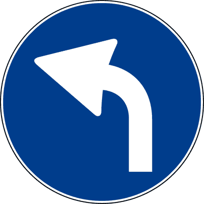

---

**2.** Il segnale raffigurato preannuncia che non è consentito svoltare a destra

- **الإجابة:** `VERO ✅ (صح)`
- 

---

**3.** Il segnale raffigurato è posto prima di un incrocio

- **الإجابة:** `VERO ✅ (صح)`
- 

---

**4.** Il segnale raffigurato precede un segnale di DIREZIONE OBBLIGATORIA A SINISTRA

- **الإجابة:** `VERO ✅ (صح)`
- 

---

**5.** Il segnale raffigurato è un segnale d'obbligo

- **الإجابة:** `VERO ✅ (صح)`
- 

---

**6.** Il segnale raffigurato è un segnale di prescrizione

- **الإجابة:** `VERO ✅ (صح)`
- 

---

**7.** Il segnale raffigurato è preavviso dell'obbligo di svoltare a sinistra

- **الإجابة:** `VERO ✅ (صح)`
- 

---

**8.** Il segnale raffigurato precede un incrocio in cui non è consentito proseguire diritto o girare a destra

- **الإجابة:** `VERO ✅ (صح)`
- 

---

**9.** Il segnale raffigurato preannuncia l'obbligo di svoltare a sinistra al prossimo incrocio

- **الإجابة:** `VERO ✅ (صح)`
- 

---

**10.** Il segnale raffigurato precede un incrocio ove è obbligatorio svoltare a sinistra

- **الإجابة:** `VERO ✅ (صح)`
- 

---

**11.** Il segnale raffigurato è un segnale di preavviso di direzione obbligatoria

- **الإجابة:** `VERO ✅ (صح)`
- 

---

**12.** Il segnale raffigurato preannuncia l'unica direzione consentita

- **الإجابة:** `VERO ✅ (صح)`
- 

---

**13.** Il segnale raffigurato può essere integrato con pannello che indica la distanza dal punto in cui vige l'obbligo

- **الإجابة:** `VERO ✅ (صح)`
- 

---

**14.** Il segnale raffigurato preannuncia un senso unico

- **الإجابة:** `FALSO ❌ (خطأ)`
- 

---

**15.** Il segnale raffigurato è un segnale di indicazione

- **الإجابة:** `FALSO ❌ (خطأ)`
- 

---

**16.** Il segnale raffigurato indica che è obbligatorio passare a sinistra dell'ostacolo

- **الإجابة:** `FALSO ❌ (خطأ)`
- 

---

**17.** Il segnale raffigurato è posto all'inizio di una strada in pendenza

- **الإجابة:** `FALSO ❌ (خطأ)`
- 

---

**18.** Il segnale raffigurato indica l'obbligo di cambiare corsia

- **الإجابة:** `FALSO ❌ (خطأ)`
- 

---

**19.** Il segnale raffigurato presegnala una curva pericolosa a sinistra

- **الإجابة:** `FALSO ❌ (خطأ)`
- 

---

**20.** Il segnale raffigurato indica che non è consentito svoltare a sinistra al prossimo incrocio

- **الإجابة:** `FALSO ❌ (خطأ)`
- 

---

**21.** Il segnale raffigurato obbliga ad andare diritto o a svoltare a sinistra

- **الإجابة:** `FALSO ❌ (خطأ)`
- 

---

**22.** Il segnale raffigurato preannuncia di andare diritto ma non di svoltare a destra

- **الإجابة:** `FALSO ❌ (خطأ)`
- 

---

**23.** Il segnale raffigurato presegnala il senso unico di circolazione nella svolta a sinistra

- **الإجابة:** `FALSO ❌ (خطأ)`
- 

---

**24.** Il segnale raffigurato è un segnale di divieto

- **الإجابة:** `FALSO ❌ (خطأ)`
- 

---

**25.** Il segnale raffigurato preannuncia una corsia di accelerazione

- **الإجابة:** `FALSO ❌ (خطأ)`
- 

---

**26.** Il segnale raffigurato preannuncia una direzione consigliata

- **الإجابة:** `FALSO ❌ (خطأ)`
- 

---

## 📌 Direzione dritto (21 domande)

**27.** Il segnale raffigurato indica l'obbligo di proseguire diritto

- **الإجابة:** `VERO ✅ (صح)`
- 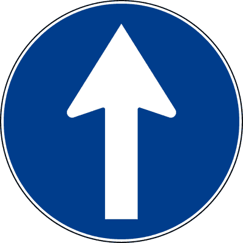

---

**28.** Il segnale raffigurato non consente la svolta a sinistra

- **الإجابة:** `VERO ✅ (صح)`
- 

---

**29.** Il segnale raffigurato, posto prima di un incrocio, obbliga a proseguire diritto

- **الإجابة:** `VERO ✅ (صح)`
- 

---

**30.** Il segnale raffigurato, in corrispondenza di un incrocio, non consente la svolta a destra o a sinistra

- **الإجابة:** `VERO ✅ (صح)`
- 

---

**31.** Il segnale raffigurato indica l'unica direzione consentita

- **الإجابة:** `VERO ✅ (صح)`
- 

---

**32.** Il segnale raffigurato è un segnale di prescrizione

- **الإجابة:** `VERO ✅ (صح)`
- 

---

**33.** Il segnale raffigurato è un segnale di direzione obbligatoria

- **الإجابة:** `VERO ✅ (صح)`
- 

---

**34.** Il segnale raffigurato è un segnale di obbligo

- **الإجابة:** `VERO ✅ (صح)`
- 

---

**35.** Il segnale raffigurato non consente la svolta a destra

- **الإجابة:** `VERO ✅ (صح)`
- 

---

**36.** Il segnale raffigurato consente di svoltare a destra o a sinistra

- **الإجابة:** `FALSO ❌ (خطأ)`
- 

---

**37.** Il segnale raffigurato consente di svoltare all'incrocio

- **الإجابة:** `FALSO ❌ (خطأ)`
- 

---

**38.** Il segnale raffigurato indica l'inizio del senso unico di circolazione

- **الإجابة:** `FALSO ❌ (خطأ)`
- 

---

**39.** Il segnale raffigurato indica la fine del doppio senso di circolazione

- **الإجابة:** `FALSO ❌ (خطأ)`
- 

---

**40.** Il segnale raffigurato impone la marcia in unica fila

- **الإجابة:** `FALSO ❌ (خطأ)`
- 

---

**41.** Il segnale raffigurato è un segnale di indicazione

- **الإجابة:** `FALSO ❌ (خطأ)`
- 

---

**42.** Il segnale raffigurato è un segnale di divieto

- **الإجابة:** `FALSO ❌ (خطأ)`
- 

---

**43.** Il segnale raffigurato è un segnale di corsia

- **الإجابة:** `FALSO ❌ (خطأ)`
- 

---

**44.** Il segnale raffigurato preannuncia una direzione consigliata

- **الإجابة:** `FALSO ❌ (خطأ)`
- 

---

**45.** Il segnale raffigurato obbliga a svoltare a destra o a sinistra

- **الإجابة:** `FALSO ❌ (خطأ)`
- 

---

**46.** Il segnale raffigurato esclude la possibilità che provengano veicoli di fronte

- **الإجابة:** `FALSO ❌ (خطأ)`
- 

---

**47.** Il segnale raffigurato indica un senso unico frontale

- **الإجابة:** `FALSO ❌ (خطأ)`
- 

---

## 📌 Direzione sinistra (24 domande)

**48.** Il segnale raffigurato indica l'obbligo di svoltare a sinistra

- **الإجابة:** `VERO ✅ (صح)`
- 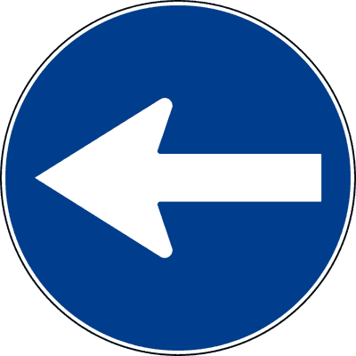

---

**49.** Il segnale raffigurato non consente di svoltare a destra

- **الإجابة:** `VERO ✅ (صح)`
- 

---

**50.** Il segnale raffigurato, posto prima di un incrocio, obbliga a svoltare a sinistra

- **الإجابة:** `VERO ✅ (صح)`
- 

---

**51.** Il segnale raffigurato, in corrispondenza di un incrocio, non consente di proseguire diritto

- **الإجابة:** `VERO ✅ (صح)`
- 

---

**52.** Il segnale raffigurato indica l'unica direzione consentita

- **الإجابة:** `VERO ✅ (صح)`
- 

---

**53.** Il segnale raffigurato è un segnale di prescrizione

- **الإجابة:** `VERO ✅ (صح)`
- 

---

**54.** Il segnale raffigurato è un segnale di direzione obbligatoria

- **الإجابة:** `VERO ✅ (صح)`
- 

---

**55.** Il segnale raffigurato è un segnale di obbligo

- **الإجابة:** `VERO ✅ (صح)`
- 

---

**56.** Il segnale raffigurato indica che si può svoltare soltanto a sinistra

- **الإجابة:** `VERO ✅ (صح)`
- 

---

**57.** Il segnale raffigurato indica che non è consentito proseguire diritto

- **الإجابة:** `VERO ✅ (صح)`
- 

---

**58.** Il segnale raffigurato consente di andare diritto all'incrocio

- **الإجابة:** `FALSO ❌ (خطأ)`
- 

---

**59.** Il segnale raffigurato consente di svoltare a destra all'incrocio

- **الإجابة:** `FALSO ❌ (خطأ)`
- 

---

**60.** Il segnale raffigurato indica l'inizio del senso unico di circolazione dopo una svolta a sinistra

- **الإجابة:** `FALSO ❌ (خطأ)`
- 

---

**61.** Il segnale raffigurato indica la fine del doppio senso di circolazione dopo una svolta a destra

- **الإجابة:** `FALSO ❌ (خطأ)`
- 

---

**62.** Il segnale raffigurato indica che è obbligatorio passare a sinistra di un ostacolo posto sulla carreggiata

- **الإجابة:** `FALSO ❌ (خطأ)`
- 

---

**63.** Il segnale raffigurato è un segnale di indicazione

- **الإجابة:** `FALSO ❌ (خطأ)`
- 

---

**64.** Il segnale raffigurato è un segnale di divieto

- **الإجابة:** `FALSO ❌ (خطأ)`
- 

---

**65.** Il segnale raffigurato indica che la strada che si incrocia è a senso unico verso sinistra

- **الإجابة:** `FALSO ❌ (خطأ)`
- 

---

**66.** Il segnale raffigurato indica un senso unico parallelo

- **الإجابة:** `FALSO ❌ (خطأ)`
- 

---

**67.** Il segnale raffigurato indica il divieto di svoltare a sinistra

- **الإجابة:** `FALSO ❌ (خطأ)`
- 

---

**68.** Il segnale raffigurato indica che ci si può fermare sulla sinistra della strada

- **الإجابة:** `FALSO ❌ (خطأ)`
- 

---

**69.** Il segnale raffigurato indica l'obbligo di proseguire diritto

- **الإجابة:** `FALSO ❌ (خطأ)`
- 

---

**70.** Il segnale raffigurato significa che bisogna aggirare l'ostacolo a sinistra

- **الإجابة:** `FALSO ❌ (خطأ)`
- 

---

**71.** Il segnale raffigurato significa preavviso di curva a sinistra

- **الإجابة:** `FALSO ❌ (خطأ)`
- 

---

## 📌 Direzione destra (25 domande)

**72.** Il segnale raffigurato indica l'obbligo di svoltare a destra

- **الإجابة:** `VERO ✅ (صح)`
- 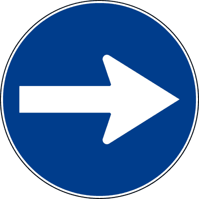

---

**73.** Il segnale raffigurato non consente di svoltare a sinistra

- **الإجابة:** `VERO ✅ (صح)`
- 

---

**74.** Il segnale raffigurato, in corrispondenza di un incrocio, obbliga a svoltare a destra

- **الإجابة:** `VERO ✅ (صح)`
- 

---

**75.** Il segnale raffigurato, posto prima di un incrocio, non consente di proseguire diritto

- **الإجابة:** `VERO ✅ (صح)`
- 

---

**76.** Il segnale raffigurato è un segnale di prescrizione

- **الإجابة:** `VERO ✅ (صح)`
- 

---

**77.** Il segnale raffigurato è un segnale di obbligo

- **الإجابة:** `VERO ✅ (صح)`
- 

---

**78.** Il segnale raffigurato è un segnale di direzione obbligatoria

- **الإجابة:** `VERO ✅ (صح)`
- 

---

**79.** Il segnale raffigurato indica l'unica direzione consentita

- **الإجابة:** `VERO ✅ (صح)`
- 

---

**80.** Il segnale raffigurato indica direzione obbligatoria a destra

- **الإجابة:** `VERO ✅ (صح)`
- 

---

**81.** Il segnale raffigurato indica che si può svoltare soltanto a destra

- **الإجابة:** `VERO ✅ (صح)`
- 

---

**82.** Il segnale raffigurato indica che non è consentito proseguire diritto

- **الإجابة:** `VERO ✅ (صح)`
- 

---

**83.** Il segnale raffigurato indica che si deve svoltare a destra

- **الإجابة:** `VERO ✅ (صح)`
- 

---

**84.** Il segnale raffigurato indica che è pericoloso svoltare a destra

- **الإجابة:** `FALSO ❌ (خطأ)`
- 

---

**85.** Il segnale raffigurato prescrive di proseguire diritto

- **الإجابة:** `FALSO ❌ (خطأ)`
- 

---

**86.** Il segnale raffigurato indica l'inizio del senso unico di circolazione nella svolta a destra

- **الإجابة:** `FALSO ❌ (خطأ)`
- 

---

**87.** Il segnale raffigurato indica la fine del doppio senso di circolazione nella svolta a sinistra

- **الإجابة:** `FALSO ❌ (خطأ)`
- 

---

**88.** Il segnale raffigurato è un segnale di indicazione

- **الإجابة:** `FALSO ❌ (خطأ)`
- 

---

**89.** Il segnale raffigurato è un segnale di divieto

- **الإجابة:** `FALSO ❌ (خطأ)`
- 

---

**90.** Il segnale raffigurato indica che la strada che si incrocia è a senso unico verso destra

- **الإجابة:** `FALSO ❌ (خطأ)`
- 

---

**91.** Il segnale raffigurato indica un senso unico parallelo

- **الإجابة:** `FALSO ❌ (خطأ)`
- 

---

**92.** Il segnale raffigurato indica il divieto di svoltare a destra

- **الإجابة:** `FALSO ❌ (خطأ)`
- 

---

**93.** Il segnale raffigurato indica un'area di parcheggio a destra

- **الإجابة:** `FALSO ❌ (خطأ)`
- 

---

**94.** Il segnale raffigurato indica l'obbligo di proseguire diritto

- **الإجابة:** `FALSO ❌ (خطأ)`
- 

---

**95.** Il segnale raffigurato indica di passare a destra dell'ostacolo

- **الإجابة:** `FALSO ❌ (خطأ)`
- 

---

**96.** Il segnale raffigurato indica preavviso di curva a destra

- **الإجابة:** `FALSO ❌ (خطأ)`
- 

---

## 📌 Preavviso direzione destra (29 domande)

**97.** Il segnale raffigurato è un preavviso di obbligo di svoltare a destra

- **الإجابة:** `VERO ✅ (صح)`
- 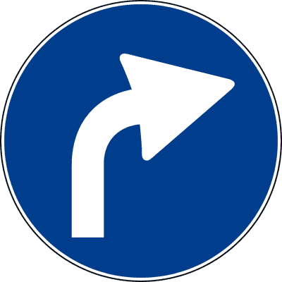

---

**98.** Il segnale raffigurato preannuncia che non è consentito proseguire diritto o svoltare a sinistra

- **الإجابة:** `VERO ✅ (صح)`
- 

---

**99.** Il segnale raffigurato precede un incrocio con obbligo di svoltare a destra

- **الإجابة:** `VERO ✅ (صح)`
- 

---

**100.** Il segnale raffigurato preannuncia un incrocio ove non è consentito proseguire diritto

- **الإجابة:** `VERO ✅ (صح)`
- 

---

**101.** Il segnale raffigurato preannuncia che non è consentito girare a sinistra

- **الإجابة:** `VERO ✅ (صح)`
- 

---

**102.** Il segnale raffigurato è un segnale di prescrizione

- **الإجابة:** `VERO ✅ (صح)`
- 

---

**103.** Il segnale raffigurato preannuncia l'unica direzione consentita

- **الإجابة:** `VERO ✅ (صح)`
- 

---

**104.** Il segnale raffigurato è un segnale d'obbligo

- **الإجابة:** `VERO ✅ (صح)`
- 

---

**105.** Il segnale raffigurato può essere integrato con un pannello che indica la distanza dal punto in cui vige l'obbligo

- **الإجابة:** `VERO ✅ (صح)`
- 

---

**106.** Il segnale raffigurato precede il segnale di DIREZIONE OBBLIGATORIA A DESTRA

- **الإجابة:** `VERO ✅ (صح)`
- 

---

**107.** Il segnale raffigurato preannuncia che non è consentito proseguire diritto

- **الإجابة:** `VERO ✅ (صح)`
- 

---

**108.** Il segnale raffigurato preannuncia che non è consentito svoltare a sinistra

- **الإجابة:** `VERO ✅ (صح)`
- 

---

**109.** Il segnale raffigurato è posto prima di un incrocio

- **الإجابة:** `VERO ✅ (صح)`
- 

---

**110.** Il segnale raffigurato è un segnale di obbligo

- **الإجابة:** `VERO ✅ (صح)`
- 

---

**111.** Il segnale raffigurato indica che non è consentito svoltare a destra al prossimo incrocio

- **الإجابة:** `FALSO ❌ (خطأ)`
- 

---

**112.** Il segnale raffigurato obbliga ad andare diritto o svoltare a destra

- **الإجابة:** `FALSO ❌ (خطأ)`
- 

---

**113.** Il segnale raffigurato prescrive l'obbligo di passare a destra di un ostacolo

- **الإجابة:** `FALSO ❌ (خطأ)`
- 

---

**114.** Il segnale raffigurato indica una curva pericolosa a destra

- **الإجابة:** `FALSO ❌ (خطأ)`
- 

---

**115.** Il segnale raffigurato presegnala una confluenza a destra

- **الإجابة:** `FALSO ❌ (خطأ)`
- 

---

**116.** Il segnale raffigurato obbliga gli autocarri ed i veicoli lenti ad incolonnarsi sulla corsia di destra

- **الإجابة:** `FALSO ❌ (خطأ)`
- 

---

**117.** Il segnale raffigurato è un segnale di divieto

- **الإجابة:** `FALSO ❌ (خطأ)`
- 

---

**118.** Il segnale raffigurato è un segnale di indicazione

- **الإجابة:** `FALSO ❌ (خطأ)`
- 

---

**119.** Il segnale raffigurato è un segnale di preavviso di pericolo

- **الإجابة:** `FALSO ❌ (خطأ)`
- 

---

**120.** Il segnale raffigurato preannuncia una corsia di decelerazione

- **الإجابة:** `FALSO ❌ (خطأ)`
- 

---

**121.** Il segnale raffigurato preannuncia un senso unico

- **الإجابة:** `FALSO ❌ (خطأ)`
- 

---

**122.** Il segnale raffigurato obbliga a svoltare subito a destra

- **الإجابة:** `FALSO ❌ (خطأ)`
- 

---

**123.** Il segnale raffigurato non consente la svolta a destra

- **الإجابة:** `FALSO ❌ (خطأ)`
- 

---

**124.** Il segnale raffigurato indica che è obbligatorio passare a destra dell'ostacolo

- **الإجابة:** `FALSO ❌ (خطأ)`
- 

---

**125.** Il segnale raffigurato preannuncia l'obbligo di svoltare a sinistra

- **الإجابة:** `FALSO ❌ (خطأ)`
- 

---

## 📌 Obbligo destra sinistra (23 domande)

**126.** Il segnale raffigurato indica le direzioni consentite a destra e a sinistra

- **الإجابة:** `VERO ✅ (صح)`
- 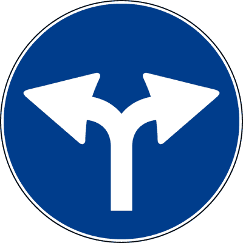

---

**127.** Il segnale raffigurato obbliga a svoltare a destra o a sinistra al prossimo incrocio

- **الإجابة:** `VERO ✅ (صح)`
- 

---

**128.** Il segnale raffigurato indica che non è consentito proseguire diritto all'incrocio

- **الإجابة:** `VERO ✅ (صح)`
- 

---

**129.** Il segnale raffigurato è un segnale di obbligo

- **الإجابة:** `VERO ✅ (صح)`
- 

---

**130.** Il segnale raffigurato indica l'impossibilità di proseguire diritto

- **الإجابة:** `VERO ✅ (صح)`
- 

---

**131.** Il segnale raffigurato indica le uniche direzioni consentite

- **الإجابة:** `VERO ✅ (صح)`
- 

---

**132.** Il segnale raffigurato è un segnale di prescrizione

- **الإجابة:** `VERO ✅ (صح)`
- 

---

**133.** Il segnale raffigurato indica che è consentito svoltare a destra

- **الإجابة:** `VERO ✅ (صح)`
- 

---

**134.** Il segnale raffigurato indica che è consentito svoltare a sinistra

- **الإجابة:** `VERO ✅ (صح)`
- 

---

**135.** Il segnale raffigurato indica che non è consentito proseguire diritto

- **الإجابة:** `VERO ✅ (صح)`
- 

---

**136.** Il segnale raffigurato indica che si può scegliere fra le due direzioni consentite

- **الإجابة:** `VERO ✅ (صح)`
- 

---

**137.** Il segnale raffigurato indica di disporsi su due file per proseguire diritto

- **الإجابة:** `FALSO ❌ (خطأ)`
- 

---

**138.** Il segnale raffigurato indica che il sorpasso è consentito sia a destra che a sinistra

- **الإجابة:** `FALSO ❌ (خطأ)`
- 

---

**139.** Il segnale raffigurato indica l'inizio del doppio senso di circolazione

- **الإجابة:** `FALSO ❌ (خطأ)`
- 

---

**140.** Il segnale raffigurato indica la facoltà di passare a destra o a sinistra di un'isola spartitraffico

- **الإجابة:** `FALSO ❌ (خطأ)`
- 

---

**141.** Il segnale raffigurato indica passaggio consentito alla destra ed alla sinistra di un ostacolo

- **الإجابة:** `FALSO ❌ (خطأ)`
- 

---

**142.** Il segnale raffigurato è un segnale di divieto

- **الإجابة:** `FALSO ❌ (خطأ)`
- 

---

**143.** Il segnale raffigurato è un segnale di indicazione

- **الإجابة:** `FALSO ❌ (خطأ)`
- 

---

**144.** Il segnale raffigurato indica l'inizio della circolazione per file parallele

- **الإجابة:** `FALSO ❌ (خطأ)`
- 

---

**145.** Il segnale raffigurato indica che nelle immediate vicinanze c'è una biforcazione pericolosa

- **الإجابة:** `FALSO ❌ (خطأ)`
- 

---

**146.** Il segnale raffigurato indica che bisogna disporsi su due file per proseguire diritto

- **الإجابة:** `FALSO ❌ (خطأ)`
- 

---

**147.** Il segnale raffigurato indica che è consentito passare sia a destra che a sinistra della striscia continua

- **الإجابة:** `FALSO ❌ (خطأ)`
- 

---

**148.** Il segnale raffigurato indica due sensi unici paralleli

- **الإجابة:** `FALSO ❌ (خطأ)`
- 

---

## 📌 Dritto destra (22 domande)

**149.** Il segnale raffigurato obbliga a proseguire diritto o svoltare a destra all'incrocio

- **الإجابة:** `VERO ✅ (صح)`
- 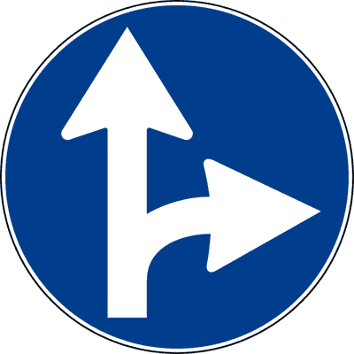

---

**150.** Il segnale raffigurato consente solo di proseguire diritto o svoltare a destra

- **الإجابة:** `VERO ✅ (صح)`
- 

---

**151.** Il segnale raffigurato non consente la svolta a sinistra all'incrocio

- **الإجابة:** `VERO ✅ (صح)`
- 

---

**152.** Il segnale raffigurato indica l'impossibilità di svoltare a sinistra

- **الإجابة:** `VERO ✅ (صح)`
- 

---

**153.** Il segnale raffigurato indica le uniche direzioni consentite

- **الإجابة:** `VERO ✅ (صح)`
- 

---

**154.** Il segnale raffigurato è un segnale di prescrizione

- **الإجابة:** `VERO ✅ (صح)`
- 

---

**155.** Il segnale raffigurato è un segnale di obbligo

- **الإجابة:** `VERO ✅ (صح)`
- 

---

**156.** Il segnale raffigurato indica che non è consentito svoltare a sinistra

- **الإجابة:** `VERO ✅ (صح)`
- 

---

**157.** Il segnale raffigurato indica che è consentito svoltare a destra

- **الإجابة:** `VERO ✅ (صح)`
- 

---

**158.** Il segnale raffigurato indica che è consentito proseguire diritto

- **الإجابة:** `VERO ✅ (صح)`
- 

---

**159.** Il segnale raffigurato indica che si può scegliere fra le due direzioni consentite

- **الإجابة:** `VERO ✅ (صح)`
- 

---

**160.** Il segnale raffigurato consente solo di proseguire diritto

- **الإجابة:** `FALSO ❌ (خطأ)`
- 

---

**161.** Il segnale raffigurato indica che è consentito soltanto svoltare a destra

- **الإجابة:** `FALSO ❌ (خطأ)`
- 

---

**162.** Il segnale raffigurato obbliga a passare a destra di un cantiere stradale

- **الإجابة:** `FALSO ❌ (خطأ)`
- 

---

**163.** Il segnale raffigurato è un segnale di indicazione

- **الإجابة:** `FALSO ❌ (خطأ)`
- 

---

**164.** Il segnale raffigurato è un segnale di pericolo

- **الإجابة:** `FALSO ❌ (خطأ)`
- 

---

**165.** Il segnale raffigurato indica il prossimo inizio di una corsia supplementare riservata ai veicoli lenti

- **الإجابة:** `FALSO ❌ (خطأ)`
- 

---

**166.** Il segnale raffigurato indica che è obbligatorio svoltare unicamente a destra

- **الإجابة:** `FALSO ❌ (خطأ)`
- 

---

**167.** Il segnale raffigurato indica che è obbligatorio proseguire solo diritto

- **الإجابة:** `FALSO ❌ (خطأ)`
- 

---

**168.** Il segnale raffigurato indica che è obbligatorio dare la precedenza a sinistra

- **الإجابة:** `FALSO ❌ (خطأ)`
- 

---

**169.** Il segnale raffigurato indica che in ogni caso bisogna tenersi il più possibile sul margine destro della carreggiata

- **الإجابة:** `FALSO ❌ (خطأ)`
- 

---

**170.** Il segnale raffigurato indica che è prossima una biforcazione pericolosa

- **الإجابة:** `FALSO ❌ (خطأ)`
- 

---

## 📌 Dritto sinistra (21 domande)

**171.** Il segnale raffigurato consente solo di proseguire diritto o svoltare a sinistra

- **الإجابة:** `VERO ✅ (صح)`
- 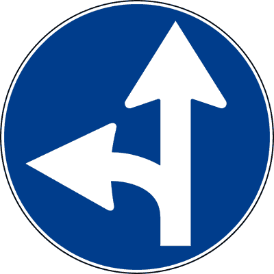

---

**172.** Il segnale raffigurato non consente la svolta a destra

- **الإجابة:** `VERO ✅ (صح)`
- 

---

**173.** Il segnale raffigurato obbliga a svoltare a sinistra o a proseguire diritto

- **الإجابة:** `VERO ✅ (صح)`
- 

---

**174.** Il segnale raffigurato indica che non si deve svoltare a destra

- **الإجابة:** `VERO ✅ (صح)`
- 

---

**175.** Il segnale raffigurato è un segnale di prescrizione

- **الإجابة:** `VERO ✅ (صح)`
- 

---

**176.** Il segnale raffigurato si trova anche fuori dei centri abitati

- **الإجابة:** `VERO ✅ (صح)`
- 

---

**177.** Il segnale raffigurato indica che è consentito proseguire diritto

- **الإجابة:** `VERO ✅ (صح)`
- 

---

**178.** Il segnale raffigurato indica che è consentito svoltare a sinistra

- **الإجابة:** `VERO ✅ (صح)`
- 

---

**179.** Il segnale raffigurato indica che si può scegliere fra le due direzioni consentite

- **الإجابة:** `VERO ✅ (صح)`
- 

---

**180.** Il segnale raffigurato consente solo di proseguire diritto

- **الإجابة:** `FALSO ❌ (خطأ)`
- 

---

**181.** Il segnale raffigurato indica che è consentito soltanto svoltare a sinistra

- **الإجابة:** `FALSO ❌ (خطأ)`
- 

---

**182.** Il segnale raffigurato obbliga a passare a sinistra di un cantiere stradale

- **الإجابة:** `FALSO ❌ (خطأ)`
- 

---

**183.** Il segnale raffigurato consente di sorpassare a sinistra lo spartitraffico

- **الإجابة:** `FALSO ❌ (خطأ)`
- 

---

**184.** Il segnale raffigurato è un segnale di indicazione

- **الإجابة:** `FALSO ❌ (خطأ)`
- 

---

**185.** Il segnale raffigurato è un segnale di pericolo

- **الإجابة:** `FALSO ❌ (خطأ)`
- 

---

**186.** Il segnale raffigurato indica che si deve dare la precedenza a destra

- **الإجابة:** `FALSO ❌ (خطأ)`
- 

---

**187.** Il segnale raffigurato indica che è obbligatorio proseguire solo diritto

- **الإجابة:** `FALSO ❌ (خطأ)`
- 

---

**188.** Il segnale raffigurato indica che è obbligatorio svoltare unicamente a sinistra

- **الإجابة:** `FALSO ❌ (خطأ)`
- 

---

**189.** Il segnale raffigurato indica che si sta incrociando una biforcazione pericolosa

- **الإجابة:** `FALSO ❌ (خطأ)`
- 

---

**190.** Il segnale raffigurato indica che bisogna in ogni caso avvicinarsi il più possibile all'asse della carreggiata

- **الإجابة:** `FALSO ❌ (خطأ)`
- 

---

**191.** Il segnale raffigurato indica che le corsie disponibili diventano due

- **الإجابة:** `FALSO ❌ (خطأ)`
- 

---

## 📌 Passaggio sinistra (20 domande)

**192.** Il segnale raffigurato obbliga i conducenti a passare a sinistra di un ostacolo

- **الإجابة:** `VERO ✅ (صح)`
- 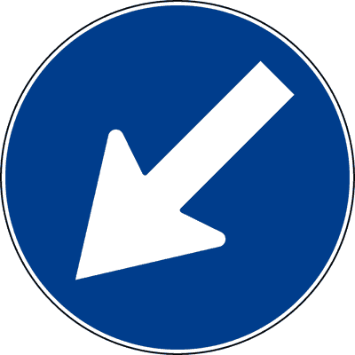

---

**193.** Il segnale raffigurato obbliga i conducenti a passare a sinistra di un'isola di traffico

- **الإجابة:** `VERO ✅ (صح)`
- 

---

**194.** Il segnale raffigurato obbliga i conducenti a passare a sinistra di un salvagente

- **الإجابة:** `VERO ✅ (صح)`
- 

---

**195.** Il segnale raffigurato obbliga i conducenti a passare a sinistra di un cantiere stradale

- **الإجابة:** `VERO ✅ (صح)`
- 

---

**196.** Il segnale raffigurato obbliga i conducenti a passare a sinistra di uno spartitraffico

- **الإجابة:** `VERO ✅ (صح)`
- 

---

**197.** Il segnale raffigurato indica passaggio obbligatorio a sinistra

- **الإجابة:** `VERO ✅ (صح)`
- 

---

**198.** Il segnale raffigurato prescrive di non superare l'ostacolo a destra

- **الإجابة:** `VERO ✅ (صح)`
- 

---

**199.** Il segnale raffigurato indica obbligo di superare un cantiere stradale dalla parte sinistra

- **الإجابة:** `VERO ✅ (صح)`
- 

---

**200.** Il segnale raffigurato indica obbligo di lasciare l'ostacolo a destra

- **الإجابة:** `VERO ✅ (صح)`
- 

---

**201.** Il segnale raffigurato può essere preceduto dal segnale ROTATORIA

- **الإجابة:** `FALSO ❌ (خطأ)`
- 

---

**202.** Il segnale raffigurato indica una discesa pericolosa a sinistra

- **الإجابة:** `FALSO ❌ (خطأ)`
- 

---

**203.** Il segnale raffigurato obbliga i conducenti a svoltare a sinistra

- **الإجابة:** `FALSO ❌ (خطأ)`
- 

---

**204.** Il segnale raffigurato preannuncia l'obbligo di svoltare a sinistra

- **الإجابة:** `FALSO ❌ (خطأ)`
- 

---

**205.** Il segnale raffigurato indica che è obbligatorio svoltare a destra

- **الإجابة:** `FALSO ❌ (خطأ)`
- 

---

**206.** Il segnale raffigurato è un segnale di indicazione

- **الإجابة:** `FALSO ❌ (خطأ)`
- 

---

**207.** Il segnale raffigurato indica obbligo di svoltare a sinistra

- **الإجابة:** `FALSO ❌ (خطأ)`
- 

---

**208.** Il segnale raffigurato indica che bisogna superare il salvagente lasciandolo alla propria sinistra

- **الإجابة:** `FALSO ❌ (خطأ)`
- 

---

**209.** Il segnale raffigurato indica direzione obbligatoria a sinistra

- **الإجابة:** `FALSO ❌ (خطأ)`
- 

---

**210.** Il segnale raffigurato indica che siamo in prossimità di un incrocio

- **الإجابة:** `FALSO ❌ (خطأ)`
- 

---

**211.** Il segnale raffigurato indica che non è possibile proseguire su quella strada

- **الإجابة:** `FALSO ❌ (خطأ)`
- 

---

## 📌 Passaggio destra (19 domande)

**212.** Il segnale raffigurato obbliga i conducenti a passare a destra di un ostacolo

- **الإجابة:** `VERO ✅ (صح)`
- 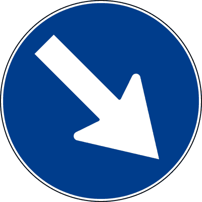

---

**213.** Il segnale raffigurato, posto in presenza di un'isola di traffico, obbliga i conducenti a passare a destra

- **الإجابة:** `VERO ✅ (صح)`
- 

---

**214.** Il segnale raffigurato, posto in presenza di un salvagente, obbliga i conducenti a passare a destra

- **الإجابة:** `VERO ✅ (صح)`
- 

---

**215.** Il segnale raffigurato, posto in presenza di un cantiere stradale, obbliga i conducenti a passare a destra

- **الإجابة:** `VERO ✅ (صح)`
- 

---

**216.** Il segnale raffigurato obbliga i conducenti a passare a destra di uno spartitraffico

- **الإجابة:** `VERO ✅ (صح)`
- 

---

**217.** Il segnale raffigurato indica passaggio obbligatorio a destra

- **الإجابة:** `VERO ✅ (صح)`
- 

---

**218.** Il segnale raffigurato indica che non è consentito superare l'ostacolo a sinistra

- **الإجابة:** `VERO ✅ (صح)`
- 

---

**219.** Il segnale raffigurato indica obbligo di superare lo spartitraffico dalla parte destra

- **الإجابة:** `VERO ✅ (صح)`
- 

---

**220.** Il segnale raffigurato indica obbligo di lasciare un'isola salvagente a sinistra

- **الإجابة:** `VERO ✅ (صح)`
- 

---

**221.** Il segnale raffigurato indica obbligo di passare a destra di un cantiere stradale

- **الإجابة:** `VERO ✅ (صح)`
- 

---

**222.** Il segnale raffigurato presegnala una curva pericolosa a destra

- **الإجابة:** `FALSO ❌ (خطأ)`
- 

---

**223.** Il segnale raffigurato indica una strada deformata a destra

- **الإجابة:** `FALSO ❌ (خطأ)`
- 

---

**224.** Il segnale raffigurato obbliga i conducenti a svoltare a destra

- **الإجابة:** `FALSO ❌ (خطأ)`
- 

---

**225.** Il segnale raffigurato preannuncia l'obbligo di svoltare a destra

- **الإجابة:** `FALSO ❌ (خطأ)`
- 

---

**226.** Il segnale raffigurato indica obbligo di svoltare a destra

- **الإجابة:** `FALSO ❌ (خطأ)`
- 

---

**227.** Il segnale raffigurato indica obbligo di superare l'ostacolo lasciandolo alla propria destra

- **الإجابة:** `FALSO ❌ (خطأ)`
- 

---

**228.** Il segnale raffigurato indica direzione obbligatoria a destra

- **الإجابة:** `FALSO ❌ (خطأ)`
- 

---

**229.** Il segnale raffigurato indica che siamo in prossimità di un incrocio

- **الإجابة:** `FALSO ❌ (خطأ)`
- 

---

**230.** Il segnale raffigurato indica che non è possibile proseguire su quella strada

- **الإجابة:** `FALSO ❌ (خطأ)`
- 

---

## 📌 Passaggio destra sinistra (11 domande)

**231.** Il segnale raffigurato indica al conducente gli unici passaggi consentiti

- **الإجابة:** `VERO ✅ (صح)`
- 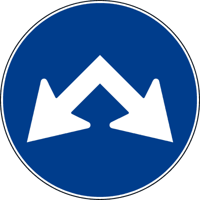

---

**232.** Il segnale raffigurato indica i passaggi consentiti a destra e a sinistra di un'isola di traffico

- **الإجابة:** `VERO ✅ (صح)`
- 

---

**233.** Il segnale raffigurato consente ai conducenti di passare sia a destra che a sinistra di un salvagente

- **الإجابة:** `VERO ✅ (صح)`
- 

---

**234.** Il segnale raffigurato consente il passaggio a destra e a sinistra di un cantiere stradale

- **الإجابة:** `VERO ✅ (صح)`
- 

---

**235.** Il segnale raffigurato indica che si può transitare a destra e a sinistra di uno spartitraffico

- **الإجابة:** `VERO ✅ (صح)`
- 

---

**236.** Il segnale raffigurato consente il passaggio da ambedue i lati dell'ostacolo

- **الإجابة:** `VERO ✅ (صح)`
- 

---

**237.** Il segnale raffigurato obbliga a svoltare a sinistra o a destra all'incrocio

- **الإجابة:** `FALSO ❌ (خطأ)`
- 

---

**238.** Il segnale raffigurato vieta di proseguire in quella strada

- **الإجابة:** `FALSO ❌ (خطأ)`
- 

---

**239.** Il segnale raffigurato è, di norma, preceduto dal segnale ROTATORIA

- **الإجابة:** `FALSO ❌ (خطأ)`
- 

---

**240.** Il segnale raffigurato è un segnale di indicazione

- **الإجابة:** `FALSO ❌ (خطأ)`
- 

---

**241.** Il segnale raffigurato è un segnale di divieto

- **الإجابة:** `FALSO ❌ (خطأ)`
- 

---

## 📌 Rotatoria (19 domande)

**242.** Il segnale raffigurato presegnala un incrocio regolato con circolazione rotatoria

- **الإجابة:** `VERO ✅ (صح)`
- 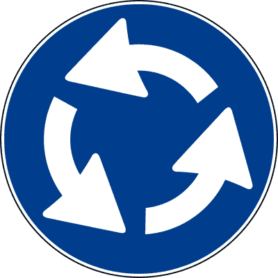

---

**243.** Il segnale raffigurato, in corrispondenza di una piazza, prescrive l'obbligo di circolazione secondo il verso indicato

- **الإجابة:** `VERO ✅ (صح)`
- 

---

**244.** Il segnale raffigurato è posto prima dello sbocco su un'area in cui è prescritta la circolazione rotatoria

- **الإجابة:** `VERO ✅ (صح)`
- 

---

**245.** Il segnale raffigurato è un segnale di prescrizione

- **الإجابة:** `VERO ✅ (صح)`
- 

---

**246.** Il segnale raffigurato è posto prima dello sbocco in una piazza con circolazione rotatoria

- **الإجابة:** `VERO ✅ (صح)`
- 

---

**247.** Il segnale raffigurato indica la presenza di un incrocio nel quale la circolazione è regolata a rotatoria

- **الإجابة:** `VERO ✅ (صح)`
- 

---

**248.** Il segnale raffigurato è un segnale di obbligo

- **الإجابة:** `VERO ✅ (صح)`
- 

---

**249.** Il segnale raffigurato obbliga i conducenti a circolare secondo il verso indicato dalle frecce

- **الإجابة:** `VERO ✅ (صح)`
- 

---

**250.** Il segnale di figura (A) su strade extraurbane è preceduto dal segnale di pericolo di CIRCOLAZIONE ROTATORIA in figura (B)

- **الإجابة:** `VERO ✅ (صح)`
- 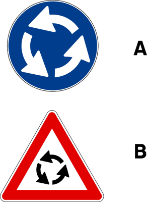

---

**251.** Il segnale raffigurato è un segnale di divieto

- **الإجابة:** `FALSO ❌ (خطأ)`
- 

---

**252.** Il segnale raffigurato preannuncia una direzione obbligatoria a sinistra

- **الإجابة:** `FALSO ❌ (خطأ)`
- 

---

**253.** Il segnale raffigurato è collocato sulla colonnina luminosa posta al centro di una rotatoria

- **الإجابة:** `FALSO ❌ (خطأ)`
- 

---

**254.** Il segnale raffigurato è integrato con un segnale di PASSAGGIO OBBLIGATORIO A SINISTRA

- **الإجابة:** `FALSO ❌ (خطأ)`
- 

---

**255.** Il segnale raffigurato è un segnale di indicazione

- **الإجابة:** `FALSO ❌ (خطأ)`
- 

---

**256.** Il segnale raffigurato prescrive un obbligo di ROTATORIA solo per le autovetture

- **الإجابة:** `FALSO ❌ (خطأ)`
- 

---

**257.** Il segnale raffigurato è posto su colonnina al centro dell'incrocio intorno alla quale bisogna girare secondo le frecce

- **الإجابة:** `FALSO ❌ (خطأ)`
- 

---

**258.** Il segnale raffigurato è posto all'inizio di una strada senza uscita

- **الإجابة:** `FALSO ❌ (خطأ)`
- 

---

**259.** Il segnale raffigurato indica l'obbligo di tornare indietro

- **الإجابة:** `FALSO ❌ (خطأ)`
- 

---

**260.** Il segnale raffigurato non vale per i ciclomotori

- **الإجابة:** `FALSO ❌ (خطأ)`
- 

---

## 📌 Limite minimo velocita (25 domande)

**261.** In presenza del segnale raffigurato è consentito marciare alla velocità di 40 km/h

- **الإجابة:** `VERO ✅ (صح)`
- 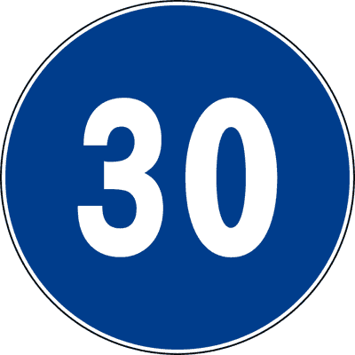

---

**262.** Il segnale raffigurato indica il limite di velocità al di sotto del quale è vietato circolare

- **الإجابة:** `VERO ✅ (صح)`
- 

---

**263.** Il segnale raffigurato è un segnale di obbligo

- **الإجابة:** `VERO ✅ (صح)`
- 

---

**264.** Il segnale raffigurato impone di circolare ad una velocità di almeno 30 km/h

- **الإجابة:** `VERO ✅ (صح)`
- 

---

**265.** Il segnale raffigurato obbliga i veicoli a mantenere almeno la velocità indicata

- **الإجابة:** `VERO ✅ (صح)`
- 

---

**266.** Il segnale raffigurato vieta il transito ai veicoli che non siano in grado di osservare la prescrizione

- **الإجابة:** `VERO ✅ (صح)`
- 

---

**267.** Il segnale raffigurato vieta la circolazione ai veicoli che non sono in grado di marciare almeno a 30 km/h

- **الإجابة:** `VERO ✅ (صح)`
- 

---

**268.** Il segnale raffigurato prescrive un limite minimo di velocità

- **الإجابة:** `VERO ✅ (صح)`
- 

---

**269.** Il segnale raffigurato obbliga a mantenere una velocità non inferiore a 30 km/h

- **الإجابة:** `VERO ✅ (صح)`
- 

---

**270.** In presenza del segnale raffigurato è consentito circolare entro i limiti massimi di velocità vigenti per quella strada

- **الإجابة:** `VERO ✅ (صح)`
- 

---

**271.** Il segnale raffigurato consente la circolazione ai veicoli che procedono a velocità uguale o superiore a quella indicata

- **الإجابة:** `VERO ✅ (صح)`
- 

---

**272.** Il segnale raffigurato consente di marciare alla velocità di 20 km/h

- **الإجابة:** `FALSO ❌ (خطأ)`
- 

---

**273.** Il segnale raffigurato indica la fine del limite massimo di velocità

- **الإجابة:** `FALSO ❌ (خطأ)`
- 

---

**274.** Il segnale raffigurato vieta di superare la velocità indicata

- **الإجابة:** `FALSO ❌ (خطأ)`
- 

---

**275.** Il segnale raffigurato consente di marciare ad una velocità superiore a 30 km/h, senza alcun limite

- **الإجابة:** `FALSO ❌ (خطأ)`
- 

---

**276.** Il segnale raffigurato prescrive di marciare alla velocità costante di 30 km/h

- **الإجابة:** `FALSO ❌ (خطأ)`
- 

---

**277.** Il segnale raffigurato è un segnale di indicazione

- **الإجابة:** `FALSO ❌ (خطأ)`
- 

---

**278.** Il segnale raffigurato indica il limite massimo di velocità

- **الإجابة:** `FALSO ❌ (خطأ)`
- 

---

**279.** Il segnale raffigurato indica che la circolazione è riservata ai veicoli con velocità massima inferiore a quella indicata

- **الإجابة:** `FALSO ❌ (خطأ)`
- 

---

**280.** Il segnale raffigurato vieta di marciare a velocità superiore a quella indicata

- **الإجابة:** `FALSO ❌ (خطأ)`
- 

---

**281.** Il segnale raffigurato consente di marciare alla velocità di 25 km/h

- **الإجابة:** `FALSO ❌ (خطأ)`
- 

---

**282.** Il segnale raffigurato obbliga a mantenere la distanza minima di sicurezza di 30 metri dal veicolo che precede

- **الإجابة:** `FALSO ❌ (خطأ)`
- 

---

**283.** Il segnale raffigurato indica il divieto di transito ai veicoli con massa complessiva superiore a 30 t

- **الإجابة:** `FALSO ❌ (خطأ)`
- 

---

**284.** Il segnale raffigurato consente di circolare a velocità inferiore a quella indicata

- **الإجابة:** `FALSO ❌ (خطأ)`
- 

---

**285.** Il segnale raffigurato indica la velocità consigliata

- **الإجابة:** `FALSO ❌ (خطأ)`
- 

---

## 📌 Fine limite minimo velocita (11 domande)

**286.** Il segnale raffigurato indica la fine di una prescrizione

- **الإجابة:** `VERO ✅ (صح)`
- 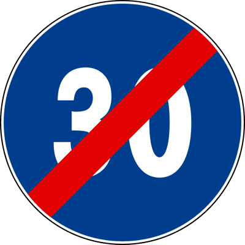

---

**287.** Il segnale raffigurato indica la fine del limite minimo di velocità

- **الإجابة:** `VERO ✅ (صح)`
- 

---

**288.** Il segnale raffigurato indica che non si ha più l'obbligo di circolare ad una velocità almeno pari a quella indicata

- **الإجابة:** `VERO ✅ (صح)`
- 

---

**289.** Il segnale raffigurato consente di circolare entro i limiti massimi di velocità vigenti per quella strada

- **الإجابة:** `VERO ✅ (صح)`
- 

---

**290.** Il segnale raffigurato consente di circolare a velocità superiore a quella indicata

- **الإجابة:** `VERO ✅ (صح)`
- 

---

**291.** Il segnale raffigurato indica la fine del limite massimo di velocità

- **الإجابة:** `FALSO ❌ (خطأ)`
- 

---

**292.** Il segnale raffigurato indica la fine del divieto di transito ai veicoli con massa complessiva superiore a 30 tonnellate

- **الإجابة:** `FALSO ❌ (خطأ)`
- 

---

**293.** Il segnale raffigurato vieta la circolazione ai veicoli di massa superiore a 30 tonnellate

- **الإجابة:** `FALSO ❌ (خطأ)`
- 

---

**294.** Il segnale raffigurato indica la fine del limite di lunghezza massima dei complessi di veicoli

- **الإجابة:** `FALSO ❌ (خطأ)`
- 

---

**295.** Il segnale raffigurato indica la fine dell'obbligo di mantenere la distanza di almeno 30 metri dal veicolo che precede

- **الإجابة:** `FALSO ❌ (خطأ)`
- 

---

**296.** Il segnale raffigurato vieta di circolare alla velocità di 30 km/h

- **الإجابة:** `FALSO ❌ (خطأ)`
- 

---

## 📌 Obbligo catene (11 domande)

**297.** Il segnale raffigurato prescrive di circolare con catene o pneumatici invernali

- **الإجابة:** `VERO ✅ (صح)`
- 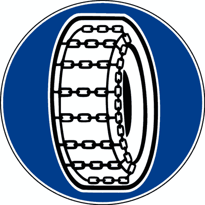

---

**298.** Il segnale raffigurato indica che la circolazione è consentita solo con catene o pneumatici invernali

- **الإجابة:** `VERO ✅ (صح)`
- 

---

**299.** Il segnale raffigurato consente il transito solo ai veicoli muniti di catene o pneumatici invernali

- **الإجابة:** `VERO ✅ (صح)`
- 

---

**300.** Il segnale raffigurato vieta il transito a veicoli sprovvisti di catene o pneumatici invernali

- **الإجابة:** `VERO ✅ (صح)`
- 

---

**301.** Il segnale raffigurato presegnala un tratto di strada ove occorre procedere con particolare prudenza

- **الإجابة:** `VERO ✅ (صح)`
- 

---

**302.** Il segnale raffigurato si trova su strade che, in particolari condizioni, sono innevate o ghiacciate

- **الإجابة:** `VERO ✅ (صح)`
- 

---

**303.** Il segnale raffigurato vieta la circolazione ai veicoli muniti di pneumatici con catene

- **الإجابة:** `FALSO ❌ (خطأ)`
- 

---

**304.** Il segnale raffigurato presegnala la progressiva chilometrica oltre la quale è obbligatorio l'uso delle catene

- **الإجابة:** `FALSO ❌ (خطأ)`
- 

---

**305.** Il segnale raffigurato vieta la circolazione a veicoli muniti di pneumatici con spessore del battistrada inferiore a 3 millimetri

- **الإجابة:** `FALSO ❌ (خطأ)`
- 

---

**306.** Il segnale raffigurato obbliga a togliere le catene per non rovinare l'asfalto

- **الإجابة:** `FALSO ❌ (خطأ)`
- 

---

**307.** Il segnale raffigurato, con pannello integrativo, indica la distanza a cui si trova un'officina per montare le catene

- **الإجابة:** `FALSO ❌ (خطأ)`
- 

---

## 📌 Percorso pedonale (9 domande)

**308.** Il segnale raffigurato indica l'inizio di un viale pedonale

- **الإجابة:** `VERO ✅ (صح)`
- 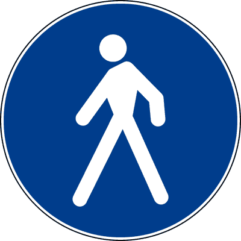

---

**309.** Il segnale raffigurato è un segnale di obbligo

- **الإجابة:** `VERO ✅ (صح)`
- 

---

**310.** Il segnale raffigurato vale anche di giorno

- **الإجابة:** `VERO ✅ (صح)`
- 

---

**311.** Il segnale raffigurato indica un percorso pedonale

- **الإجابة:** `VERO ✅ (صح)`
- 

---

**312.** Il segnale raffigurato consente il transito anche ai veicoli, ma solo con particolare prudenza ed attenzione ai pedoni

- **الإجابة:** `FALSO ❌ (خطأ)`
- 

---

**313.** Il segnale raffigurato indica un divieto di transito per i pedoni

- **الإجابة:** `FALSO ❌ (خطأ)`
- 

---

**314.** Il segnale raffigurato indica un attraversamento pedonale

- **الإجابة:** `FALSO ❌ (خطأ)`
- 

---

**315.** Il segnale raffigurato obbliga i conducenti di veicoli a dare la precedenza ai pedoni

- **الإجابة:** `FALSO ❌ (خطأ)`
- 

---

**316.** Il segnale raffigurato indica un percorso pedonale e ciclabile

- **الإجابة:** `FALSO ❌ (خطأ)`
- 

---

## 📌 Fine percorso pedonale (7 domande)

**317.** Il segnale raffigurato è posto in corrispondenza della fine del percorso pedonale

- **الإجابة:** `VERO ✅ (صح)`
- 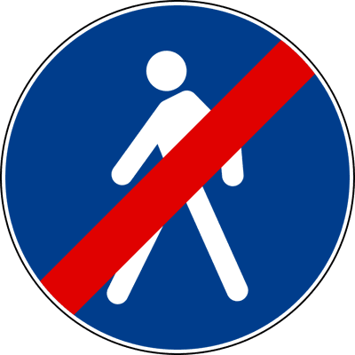

---

**318.** Il segnale raffigurato è posto in corrispondenza della fine del viale pedonale

- **الإجابة:** `VERO ✅ (صح)`
- 

---

**319.** Il segnale raffigurato indica che da lì in poi i pedoni non circolano più su un percorso riservato

- **الإجابة:** `VERO ✅ (صح)`
- 

---

**320.** Il segnale raffigurato preannuncia un attraversamento pedonale

- **الإجابة:** `FALSO ❌ (خطأ)`
- 

---

**321.** Il segnale raffigurato preannuncia un divieto di transito per i pedoni

- **الإجابة:** `FALSO ❌ (خطأ)`
- 

---

**322.** Il segnale raffigurato vieta ai pedoni di attraversare la strada

- **الإجابة:** `FALSO ❌ (خطأ)`
- 

---

**323.** Il segnale raffigurato preannuncia la fine di un'area vietata ai pedoni

- **الإجابة:** `FALSO ❌ (خطأ)`
- 

---

## 📌 Percorso biciclette (10 domande)

**324.** Il segnale raffigurato è posto in corrispondenza di un percorso vietato alle autovetture e ai motocicli

- **الإجابة:** `VERO ✅ (صح)`
- 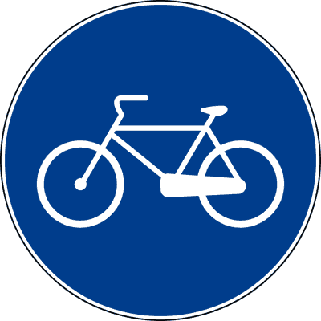

---

**325.** Il segnale raffigurato è posto in corrispondenza di una corsia riservata alle biciclette

- **الإجابة:** `VERO ✅ (صح)`
- 

---

**326.** Il segnale raffigurato è posto in corrispondenza di un percorso riservato alle biciclette

- **الإجابة:** `VERO ✅ (صح)`
- 

---

**327.** Il segnale raffigurato è posto in corrispondenza di un itinerario che si può percorrere solo con le biciclette

- **الإجابة:** `VERO ✅ (صح)`
- 

---

**328.** Il segnale raffigurato è posto in corrispondenza di un attraversamento ciclabile regolato da semaforo

- **الإجابة:** `FALSO ❌ (خطأ)`
- 

---

**329.** Il segnale raffigurato vieta il transito alle biciclette

- **الإجابة:** `FALSO ❌ (خطأ)`
- 

---

**330.** Il segnale raffigurato è posto in corrispondenza di un percorso per pedoni e biciclette

- **الإجابة:** `FALSO ❌ (خطأ)`
- 

---

**331.** Il segnale raffigurato è posto in corrispondenza di una pista riservata alle biciclette e ai ciclomotori

- **الإجابة:** `FALSO ❌ (خطأ)`
- 

---

**332.** Il segnale raffigurato è posto in corrispondenza di un percorso consentito al transito di pedoni e di biciclette

- **الإجابة:** `FALSO ❌ (خطأ)`
- 

---

**333.** Il segnale raffigurato è posto in corrispondenza di un'area vietata al transito delle biciclette

- **الإجابة:** `FALSO ❌ (خطأ)`
- 

---

## 📌 Fine percorso biciclette (9 domande)

**334.** Il segnale raffigurato è posto in corrispondenza della fine della pista ciclabile

- **الإجابة:** `VERO ✅ (صح)`
- 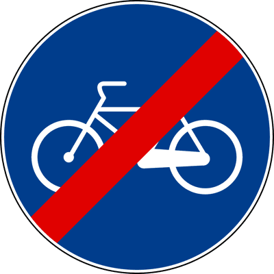

---

**335.** Il segnale raffigurato è posto in corrispondenza della fine di un itinerario percorribile solo con biciclette

- **الإجابة:** `VERO ✅ (صح)`
- 

---

**336.** Il segnale raffigurato è posto in corrispondenza della fine di una corsia riservata ai ciclisti

- **الإجابة:** `VERO ✅ (صح)`
- 

---

**337.** Il segnale raffigurato è posto in corrispondenza della fine di una pista riservata alle biciclette

- **الإجابة:** `VERO ✅ (صح)`
- 

---

**338.** Il segnale raffigurato indica un divieto di sosta per le biciclette

- **الإجابة:** `FALSO ❌ (خطأ)`
- 

---

**339.** Il segnale raffigurato vieta il transito alle biciclette e ai ciclomotori

- **الإجابة:** `FALSO ❌ (خطأ)`
- 

---

**340.** Il segnale raffigurato è posto in corrispondenza della fine del percorso pedonale e ciclabile

- **الإجابة:** `FALSO ❌ (خطأ)`
- 

---

**341.** Il segnale raffigurato preannuncia che non è più consentito il transito ai ciclisti e ai pedoni

- **الإجابة:** `FALSO ❌ (خطأ)`
- 

---

**342.** Il segnale raffigurato è posto all’inizio di un’area vietata alle biciclette

- **الإجابة:** `FALSO ❌ (خطأ)`
- 

---

## 📌 Pista ciclabile marciapiede (10 domande)

**343.** Il segnale raffigurato è posto in corrispondenza dell'inizio di una pista ciclabile accanto al marciapiede

- **الإجابة:** `VERO ✅ (صح)`
- 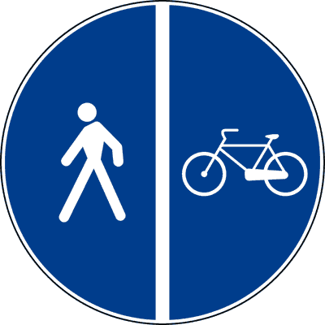

---

**344.** Il segnale raffigurato è posto in corrispondenza dell'inizio di una corsia riservata alle biciclette accanto ad un percorso pedonale

- **الإجابة:** `VERO ✅ (صح)`
- 

---

**345.** Il segnale raffigurato è posto in corrispondenza dell'inizio di una pista riservata alle biciclette, affiancata da un viale pedonale

- **الإجابة:** `VERO ✅ (صح)`
- 

---

**346.** Il segnale raffigurato è posto in corrispondenza dell'inizio di un percorso ciclabile accanto ad un percorso pedonale

- **الإجابة:** `VERO ✅ (صح)`
- 

---

**347.** Il segnale raffigurato non consente la circolazione dei veicoli a motore

- **الإجابة:** `VERO ✅ (صح)`
- 

---

**348.** Il segnale raffigurato è posto in corrispondenza di un percorso unico per pedoni e ciclisti

- **الإجابة:** `FALSO ❌ (خطأ)`
- 

---

**349.** Il segnale raffigurato è posto in corrispondenza di un viale misto, riservato sia ai pedoni che ai ciclisti

- **الإجابة:** `FALSO ❌ (خطأ)`
- 

---

**350.** Il segnale raffigurato è posto in corrispondenza della fine delle corsie riservate ai pedoni e alle biciclette

- **الإجابة:** `FALSO ❌ (خطأ)`
- 

---

**351.** Il segnale raffigurato preannuncia l'obbligo di condurre a mano la bicicletta

- **الإجابة:** `FALSO ❌ (خطأ)`
- 

---

**352.** Il segnale raffigurato preannuncia l'obbligo di parcheggiare la bicicletta e proseguire a piedi

- **الإجابة:** `FALSO ❌ (خطأ)`
- 

---

## 📌 Pedoni ciclisti (9 domande)

**353.** Il segnale raffigurato è posto in corrispondenza di un percorso unico per pedoni e ciclisti

- **الإجابة:** `VERO ✅ (صح)`
- 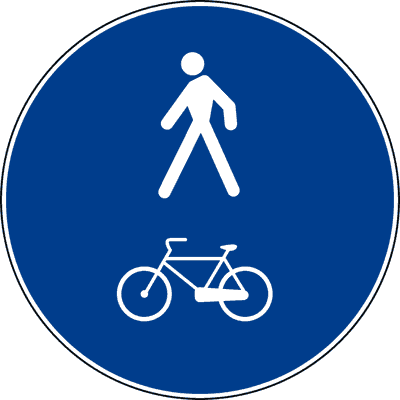

---

**354.** Il segnale raffigurato è posto in corrispondenza di un viale misto, riservato sia ai pedoni che ai ciclisti

- **الإجابة:** `VERO ✅ (صح)`
- 

---

**355.** Il segnale raffigurato è posto in corrispondenza di un itinerario riservato solo al transito di pedoni e ciclisti

- **الإجابة:** `VERO ✅ (صح)`
- 

---

**356.** Il segnale raffigurato non consente la circolazione dei veicoli a motore

- **الإجابة:** `VERO ✅ (صح)`
- 

---

**357.** Il segnale raffigurato è posto in corrispondenza di una pista ciclabile a fianco del marciapiede

- **الإجابة:** `FALSO ❌ (خطأ)`
- 

---

**358.** Il segnale raffigurato è posto in corrispondenza di una pista ciclabile a fianco di un percorso riservato ai pedoni

- **الإجابة:** `FALSO ❌ (خطأ)`
- 

---

**359.** Il segnale raffigurato è posto in corrispondenza di un'area pedonale accanto ad un percorso per ciclisti

- **الإجابة:** `FALSO ❌ (خطأ)`
- 

---

**360.** Il segnale raffigurato è posto in corrispondenza di un percorso pedonale accanto ad un percorso per le biciclette, separati da spartitraffico

- **الإجابة:** `FALSO ❌ (خطأ)`
- 

---

**361.** Il segnale raffigurato è posto in corrispondenza di un'area transitabile con biciclette soltanto se condotte a mano

- **الإجابة:** `FALSO ❌ (خطأ)`
- 

---

## 📌 Fine pista marciapiede (8 domande)

**362.** Il segnale raffigurato è posto in corrispondenza della fine della pista ciclabile accanto al marciapiede

- **الإجابة:** `VERO ✅ (صح)`
- 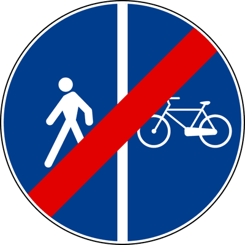

---

**363.** Il segnale raffigurato è posto in corrispondenza della fine della pista ciclabile accanto ad un percorso riservato ai pedoni

- **الإجابة:** `VERO ✅ (صح)`
- 

---

**364.** Il segnale raffigurato è posto in corrispondenza della fine del percorso pedonale a fianco della pista ciclabile

- **الإجابة:** `VERO ✅ (صح)`
- 

---

**365.** Il segnale raffigurato è posto in corrispondenza della fine del percorso pedonale accanto ad un percorso ciclabile

- **الإجابة:** `VERO ✅ (صح)`
- 

---

**366.** Il segnale raffigurato vieta il transito a tutti i veicoli a due ruote

- **الإجابة:** `FALSO ❌ (خطأ)`
- 

---

**367.** Il segnale raffigurato vieta il transito di biciclette condotte a mano

- **الإجابة:** `FALSO ❌ (خطأ)`
- 

---

**368.** Il segnale raffigurato è posto in corrispondenza di una pista riservata in alcuni giorni ai pedoni e in altri alle biciclette

- **الإجابة:** `FALSO ❌ (خطأ)`
- 

---

**369.** Il segnale raffigurato vieta ai pedoni di entrare nelle ore notturne

- **الإجابة:** `FALSO ❌ (خطأ)`
- 

---

## 📌 Fine percorso ciclisti pedoni (7 domande)

**370.** Il segnale raffigurato è posto in corrispondenza della fine del percorso unico pedonale e ciclabile

- **الإجابة:** `VERO ✅ (صح)`
- 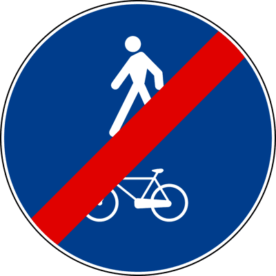

---

**371.** Il segnale raffigurato è posto in corrispondenza della fine di un percorso misto, riservato sia ai pedoni che alle biciclette

- **الإجابة:** `VERO ✅ (صح)`
- 

---

**372.** Il segnale raffigurato è posto in corrispondenza della fine del percorso riservato alla circolazione mista di pedoni e di ciclisti

- **الإجابة:** `VERO ✅ (صح)`
- 

---

**373.** Il segnale raffigurato è posto in corrispondenza di un percorso riservato ai pedoni e alle biciclette

- **الإجابة:** `FALSO ❌ (خطأ)`
- 

---

**374.** Il segnale raffigurato è posto in corrispondenza della fine della sola pista ciclabile

- **الإجابة:** `FALSO ❌ (خطأ)`
- 

---

**375.** Il segnale raffigurato vieta il transito delle biciclette condotte a mano

- **الإجابة:** `FALSO ❌ (خطأ)`
- 

---

**376.** Il segnale raffigurato è posto in corrispondenza della fine del solo percorso pedonale

- **الإجابة:** `FALSO ❌ (خطأ)`
- 

---

## 📌 Animali sella soma (10 domande)

**377.** Il segnale raffigurato non consente il transito ai veicoli

- **الإجابة:** `VERO ✅ (صح)`
- 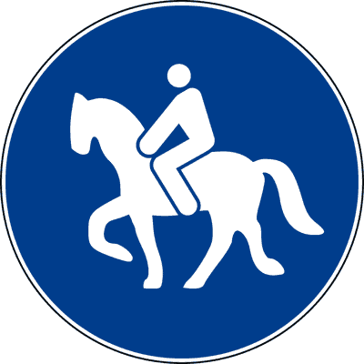

---

**378.** Il segnale raffigurato non consente il transito alle biciclette

- **الإجابة:** `VERO ✅ (صح)`
- 

---

**379.** Il segnale raffigurato non consente il transito ai veicoli con motore elettrico

- **الإجابة:** `VERO ✅ (صح)`
- 

---

**380.** Il segnale raffigurato è posto all'inizio di un percorso riservato agli animali da sella

- **الإجابة:** `VERO ✅ (صح)`
- 

---

**381.** Il segnale raffigurato è posto all'inizio di un percorso riservato agli animali da soma

- **الإجابة:** `VERO ✅ (صح)`
- 

---

**382.** Il segnale raffigurato è posto nelle vicinanze di una scuola di equitazione

- **الإجابة:** `FALSO ❌ (خطأ)`
- 

---

**383.** Il segnale raffigurato è un segnale di pericolo

- **الإجابة:** `FALSO ❌ (خطأ)`
- 

---

**384.** Il segnale raffigurato vieta il passaggio agli animali da soma e da sella

- **الإجابة:** `FALSO ❌ (خطأ)`
- 

---

**385.** Il segnale raffigurato preannuncia la presenza di animali vaganti

- **الإجابة:** `FALSO ❌ (خطأ)`
- 

---

**386.** Il segnale raffigurato preannuncia l'obbligo di dare precedenza agli animali che attraversano

- **الإجابة:** `FALSO ❌ (خطأ)`
- 

---

## 📌 Fine percorso sella soma (7 domande)

**387.** Il segnale raffigurato è posto in corrispondenza della fine di un percorso per gli animali da soma

- **الإجابة:** `VERO ✅ (صح)`
- 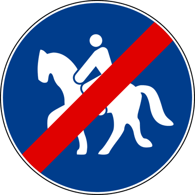

---

**388.** Il segnale raffigurato è posto in corrispondenza della fine di un percorso per gli animali da sella

- **الإجابة:** `VERO ✅ (صح)`
- 

---

**389.** Il segnale raffigurato è posto in corrispondenza della fine del percorso riservato agli animali da soma e da sella

- **الإجابة:** `VERO ✅ (صح)`
- 

---

**390.** Il segnale raffigurato è posto in vicinanza di un ippodromo

- **الإجابة:** `FALSO ❌ (خطأ)`
- 

---

**391.** Il segnale raffigurato vieta il transito ai veicoli a trazione animale

- **الإجابة:** `FALSO ❌ (خطأ)`
- 

---

**392.** Il segnale raffigurato è posto in corrispondenza della fine di un tratto di strada vietato ai cavalli

- **الإجابة:** `FALSO ❌ (خطأ)`
- 

---

**393.** Il segnale raffigurato è posto in corrispondenza della fine di un percorso riservato solo ai cavalli da corsa

- **الإجابة:** `FALSO ❌ (خطأ)`
- 

---

## 📌 Alt dogana (8 domande)

**394.** Il segnale raffigurato prescrive di arrestarsi al varco doganale

- **الإجابة:** `VERO ✅ (صح)`
- 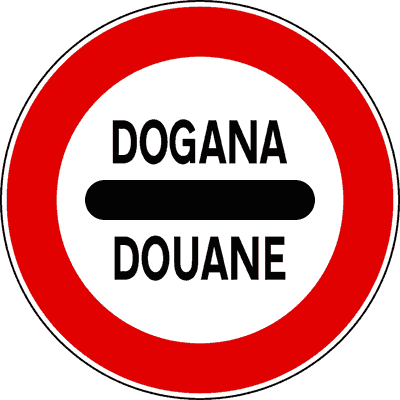

---

**395.** Il segnale raffigurato obbliga ad arrestarsi alla frontiera per il controllo doganale

- **الإجابة:** `VERO ✅ (صح)`
- 

---

**396.** Il segnale raffigurato indica che bisogna rallentare e fermarsi alla dogana

- **الإجابة:** `VERO ✅ (صح)`
- 

---

**397.** Il segnale raffigurato segnala un varco doganale al quale è obbligatorio fermarsi

- **الإجابة:** `VERO ✅ (صح)`
- 

---

**398.** Il segnale raffigurato preannuncia la presenza di un commissariato di polizia

- **الإجابة:** `FALSO ❌ (خطأ)`
- 

---

**399.** Il segnale raffigurato obbliga a rallentare fermandosi al varco doganale solo se si hanno oggetti o merci da dichiarare

- **الإجابة:** `FALSO ❌ (خطأ)`
- 

---

**400.** Il segnale raffigurato preannuncia la presenza di un comando stazione carabinieri

- **الإجابة:** `FALSO ❌ (خطأ)`
- 

---

**401.** Il segnale raffigurato si trova solo alla frontiera con un paese della Comunità Europea

- **الإجابة:** `FALSO ❌ (خطأ)`
- 

---

## 📌 Alt polizia (10 domande)

**402.** Il segnale raffigurato preannuncia la presenza di un posto di blocco stradale istituito da organi di polizia

- **الإجابة:** `VERO ✅ (صح)`
- 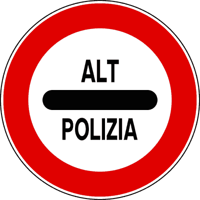

---

**403.** Il segnale raffigurato obbliga ad arrestarsi in prossimità di blocco stradale istituito da organi di polizia

- **الإجابة:** `VERO ✅ (صح)`
- 

---

**404.** Il segnale raffigurato indica l'obbligo di arresto ad un posto di blocco stradale istituito dagli organi di polizia

- **الإجابة:** `VERO ✅ (صح)`
- 

---

**405.** Il segnale raffigurato segnala posto di blocco stradale istituito da organi di polizia al quale è obbligatorio fermarsi

- **الإجابة:** `VERO ✅ (صح)`
- 

---

**406.** Il segnale raffigurato, situato a distanza opportuna dal posto di blocco, è ripetuto all'altezza del punto di arresto

- **الإجابة:** `VERO ✅ (صح)`
- 

---

**407.** Il segnale raffigurato obbliga a rallentare per essere pronti a fermarsi in caso di segnalazione da parte degli agenti

- **الإجابة:** `FALSO ❌ (خطأ)`
- 

---

**408.** Il segnale raffigurato presegnala un confine di Stato con obbligo di arrestarsi

- **الإجابة:** `FALSO ❌ (خطأ)`
- 

---

**409.** Il segnale raffigurato segnala una stazione autostradale alla quale è obbligatorio fermarsi

- **الإجابة:** `FALSO ❌ (خطأ)`
- 

---

**410.** Il segnale raffigurato impone di fermarsi e dare precedenza ai mezzi della polizia

- **الإجابة:** `FALSO ❌ (خطأ)`
- 

---

**411.** Il segnale raffigurato segnala la vicinanza di un controllo doganale

- **الإجابة:** `FALSO ❌ (خطأ)`
- 

---

## 📌 Alt stazione (10 domande)

**412.** Il segnale raffigurato obbliga ad arrestarsi all'accesso autostradale

- **الإجابة:** `VERO ✅ (صح)`
- 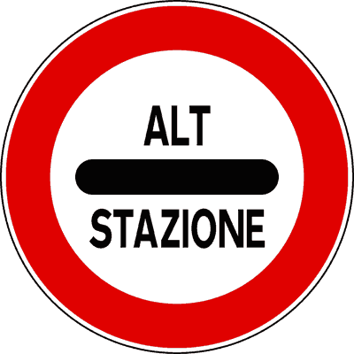

---

**413.** Il segnale raffigurato impone l'obbligo di rallentare e fermarsi per le operazioni di pedaggio autostradale

- **الإجابة:** `VERO ✅ (صح)`
- 

---

**414.** Il segnale raffigurato segnala una stazione autostradale alla quale è obbligatorio fermarsi

- **الإجابة:** `VERO ✅ (صح)`
- 

---

**415.** Il segnale raffigurato prescrive di arrestarsi al casello autostradale per le operazioni di pedaggio

- **الإجابة:** `VERO ✅ (صح)`
- 

---

**416.** Il segnale raffigurato è posto in corrispondenza degli accessi autostradali controllati dove è obbligatorio fermarsi

- **الإجابة:** `VERO ✅ (صح)`
- 

---

**417.** Il segnale raffigurato segnala la presenza di un comando stazione carabinieri, con posto di blocco

- **الإجابة:** `FALSO ❌ (خطأ)`
- 

---

**418.** Il segnale raffigurato preannuncia una stazione ferroviaria

- **الإجابة:** `FALSO ❌ (خطأ)`
- 

---

**419.** Il segnale raffigurato vieta l'accesso ad un'area riservata ai mezzi della società autostradale

- **الإجابة:** `FALSO ❌ (خطأ)`
- 

---

**420.** Il segnale raffigurato indica il punto ove occorre fermarsi per caricare l'autovettura sul treno

- **الإجابة:** `FALSO ❌ (خطأ)`
- 

---

**421.** Il segnale raffigurato può indicare il punto di arresto nei pontili d'imbarco di navi traghetto

- **الإجابة:** `FALSO ❌ (خطأ)`
- 

---

## 📌 Svolta veicoli pesanti (12 domande)

**422.** Il segnale raffigurato preannuncia una svolta obbligatoria a destra per gli autocarri di massa superiore a 3,5 t

- **الإجابة:** `VERO ✅ (صح)`
- 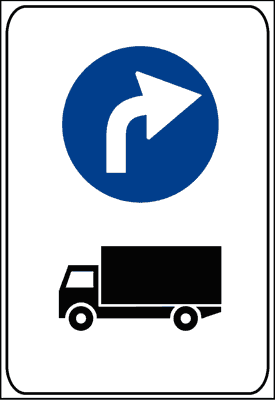

---

**423.** Il segnale raffigurato vieta agli autocarri di massa superiore a 3,5 t di proseguire diritto

- **الإجابة:** `VERO ✅ (صح)`
- 

---

**424.** Il segnale raffigurato preannuncia l'obbligo di svoltare a destra per i veicoli rappresentati nel segnale stesso

- **الإجابة:** `VERO ✅ (صح)`
- 

---

**425.** Il segnale raffigurato preannuncia un divieto di svolta a sinistra per gli autocarri di massa superiore a 3,5 t

- **الإجابة:** `VERO ✅ (صح)`
- 

---

**426.** Il segnale raffigurato preannuncia una svolta obbligatoria per i veicoli rappresentati nel segnale stesso

- **الإجابة:** `VERO ✅ (صح)`
- 

---

**427.** Il segnale raffigurato preannuncia che gli autocarri oltre 3,5 t devono svoltare nella direzione della freccia

- **الإجابة:** `VERO ✅ (صح)`
- 

---

**428.** Il segnale raffigurato preannuncia un posto di rifornimento per autocarri

- **الإجابة:** `FALSO ❌ (خطأ)`
- 

---

**429.** Il segnale raffigurato preannuncia che per gli autocarri è consigliato svoltare a destra

- **الإجابة:** `FALSO ❌ (خطأ)`
- 

---

**430.** Il segnale raffigurato preannuncia il divieto di svoltare a destra per i veicoli rappresentati in figura

- **الإجابة:** `FALSO ❌ (خطأ)`
- 

---

**431.** Il segnale raffigurato preannuncia un'area di parcheggio riservata agli autocarri

- **الإجابة:** `FALSO ❌ (خطأ)`
- 

---

**432.** Il segnale raffigurato preannuncia un segnale di obbligo di svoltare a sinistra per tutti gli autocarri

- **الإجابة:** `FALSO ❌ (خطأ)`
- 

---

**433.** Il segnale raffigurato preannuncia una curva pericolosa a destra per gli autocarri in transito

- **الإجابة:** `FALSO ❌ (خطأ)`
- 

---

