# Capitolo 05 - Segnali di precedenza
### إشارات الأسبقية

- 📁 **المجلد المحلي للباب:** `Capitolo_05_segnali_precedenza`

## 📌 Dare precedenza (25 domande)

**1.** Il segnale raffigurato è un segnale di precedenza

- **الإجابة:** `VERO ✅ (صح)`
- 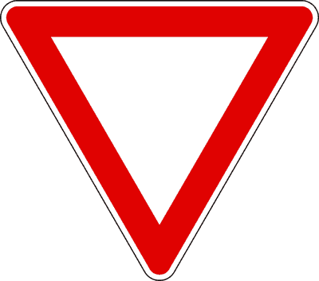

---

**2.** Il segnale raffigurato obbliga a dare precedenza ai veicoli provenienti sia da destra che da sinistra

- **الإجابة:** `VERO ✅ (صح)`
- 

---

**3.** Il segnale raffigurato comporta di dare la precedenza ai veicoli che circolano sulla strada che si incrocia

- **الإجابة:** `VERO ✅ (صح)`
- 

---

**4.** Il segnale raffigurato viene posto su strada secondaria che non ha il diritto di precedenza

- **الإجابة:** `VERO ✅ (صح)`
- 

---

**5.** Il segnale raffigurato si trova sulle corsie di accelerazione per l'immissione in autostrada

- **الإجابة:** `VERO ✅ (صح)`
- 

---

**6.** Il segnale raffigurato su strade extraurbane è preceduto dal segnale PREAVVISO DI DARE PRECEDENZA

- **الإجابة:** `VERO ✅ (صح)`
- 

---

**7.** Il segnale raffigurato preannuncia di moderare particolarmente la velocità e all'occorrenza fermarsi

- **الإجابة:** `VERO ✅ (صح)`
- 

---

**8.** In presenza del segnale raffigurato non occorre fermarsi all'incrocio se, rallentando, si ha modo di vedere che non vi sono veicoli in arrivo, sia da destra che da sinistra

- **الإجابة:** `VERO ✅ (صح)`
- 

---

**9.** Il segnale raffigurato è un segnale di prescrizione

- **الإجابة:** `VERO ✅ (صح)`
- 

---

**10.** Il segnale raffigurato obbliga a dare precedenza ai veicoli che circolano sulla strada su cui ci si immette

- **الإجابة:** `VERO ✅ (صح)`
- 

---

**11.** La prescrizione del segnale raffigurato, se abbinato ad un semaforo, vale quando il semaforo funziona a luce gialla lampeggiante

- **الإجابة:** `VERO ✅ (صح)`
- 

---

**12.** Il segnale raffigurato si trova sulle rampe di raccordo per l'immissione in autostrada

- **الإجابة:** `VERO ✅ (صح)`
- 

---

**13.** Il segnale raffigurato impone l'uso della massima prudenza al fine di evitare incidenti

- **الإجابة:** `VERO ✅ (صح)`
- 

---

**14.** Il segnale raffigurato può essere preceduto dal segnale DIRITTO DI PRECEDENZA

- **الإجابة:** `FALSO ❌ (خطأ)`
- 

---

**15.** Il segnale raffigurato è impiegato su strade che godono del diritto di precedenza

- **الإجابة:** `FALSO ❌ (خطأ)`
- 

---

**16.** Il segnale raffigurato è posto, di norma, 150 metri prima dell'incrocio

- **الإجابة:** `FALSO ❌ (خطأ)`
- 

---

**17.** Il segnale raffigurato, lungo le autostrade, viene posto a distanza maggiore di 150 m

- **الإجابة:** `FALSO ❌ (خطأ)`
- 

---

**18.** Il segnale raffigurato obbliga a fermarsi prima di impegnare l'incrocio

- **الإجابة:** `FALSO ❌ (خطأ)`
- 

---

**19.** Il segnale raffigurato si trova solo su strade urbane

- **الإجابة:** `FALSO ❌ (خطأ)`
- 

---

**20.** Il segnale raffigurato è un segnale generico di pericolo

- **الإجابة:** `FALSO ❌ (خطأ)`
- 

---

**21.** In presenza del segnale raffigurato è obbligatorio dare la precedenza a sinistra solo ai tram e ai veicoli in servizio di emergenza

- **الإجابة:** `FALSO ❌ (خطأ)`
- 

---

**22.** Il segnale raffigurato può essere preceduto dal PREAVVISO DI FERMARSI E DARE PRECEDENZA

- **الإجابة:** `FALSO ❌ (خطأ)`
- 

---

**23.** Il segnale raffigurato lungo le autostrade viene posto a distanza di 150 metri dall'area di servizio

- **الإجابة:** `FALSO ❌ (خطأ)`
- 

---

**24.** Il segnale raffigurato preannuncia di arrestarsi prima di impegnare l'incrocio

- **الإجابة:** `FALSO ❌ (خطأ)`
- 

---

**25.** Il segnale raffigurato si trova solo su strade extraurbane

- **الإجابة:** `FALSO ❌ (خطأ)`
- 

---

## 📌 Segnale stop (18 domande)

**26.** Il segnale raffigurato obbliga a fermarsi in corrispondenza della striscia trasversale di arresto e a dare la precedenza agli altri veicoli

- **الإجابة:** `VERO ✅ (صح)`
- 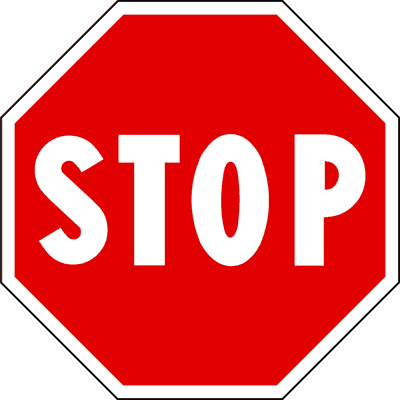

---

**27.** Il segnale raffigurato impone di arrestarsi e dare la precedenza prima di impegnare l'incrocio

- **الإجابة:** `VERO ✅ (صح)`
- 

---

**28.** Il segnale raffigurato obbliga ad arrestarsi all'incrocio e a dare la precedenza a destra e a sinistra

- **الإجابة:** `VERO ✅ (صح)`
- 

---

**29.** Il segnale raffigurato impone di fermarsi all'incrocio anche in presenza di semaforo a luce lampeggiante gialla

- **الإجابة:** `VERO ✅ (صح)`
- 

---

**30.** Il segnale raffigurato si trova all'incrocio con una strada con diritto di precedenza

- **الإجابة:** `VERO ✅ (صح)`
- 

---

**31.** Il segnale raffigurato si trova, in genere, negli incroci con scarsa visibilità

- **الإجابة:** `VERO ✅ (صح)`
- 

---

**32.** Il segnale raffigurato, fuori dei centri abitati, è preceduto dal relativo segnale di preavviso

- **الإجابة:** `VERO ✅ (صح)`
- 

---

**33.** Il segnale raffigurato è utilizzato, di norma, negli incroci di particolare pericolosità

- **الإجابة:** `VERO ✅ (صح)`
- 

---

**34.** Il segnale raffigurato può trovarsi in corrispondenza di un passaggio a livello

- **الإجابة:** `VERO ✅ (صح)`
- 

---

**35.** Il segnale raffigurato preannuncia l'obbligo di fermarsi e di dare la precedenza nei sensi unici alternati

- **الإجابة:** `FALSO ❌ (خطأ)`
- 

---

**36.** Il segnale raffigurato obbliga ad arrestarsi al varco doganale

- **الإجابة:** `FALSO ❌ (خطأ)`
- 

---

**37.** Il segnale raffigurato obbliga ad arrestarsi soltanto in caso di incrocio con altri veicoli

- **الإجابة:** `FALSO ❌ (خطأ)`
- 

---

**38.** Il segnale raffigurato obbliga ad arrestarsi per dare la precedenza solo ai veicoli provenienti da destra

- **الإجابة:** `FALSO ❌ (خطأ)`
- 

---

**39.** Il segnale raffigurato è posto, di norma, 150 metri prima dell'incrocio

- **الإجابة:** `FALSO ❌ (خطأ)`
- 

---

**40.** Il segnale raffigurato impone di arrestarsi perché il transito è vietato

- **الإجابة:** `FALSO ❌ (خطأ)`
- 

---

**41.** Il segnale raffigurato preannuncia di arrestarsi all'incrocio anche se il semaforo emette luce verde

- **الإجابة:** `FALSO ❌ (خطأ)`
- 

---

**42.** Il segnale raffigurato preannuncia l'obbligo di arresto ad un posto di blocco istituito dagli organi di polizia

- **الإجابة:** `FALSO ❌ (خطأ)`
- 

---

**43.** Il segnale raffigurato obbliga ad arrestarsi solo se sopraggiungono altri veicoli

- **الإجابة:** `FALSO ❌ (خطأ)`
- 

---

## 📌 Preavviso precedenza (13 domande)

**44.** Il segnale raffigurato è un segnale di prescrizione

- **الإجابة:** `VERO ✅ (صح)`
- 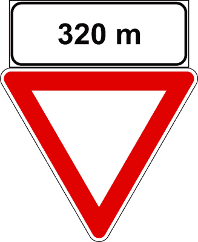

---

**45.** Il segnale raffigurato è un preavviso di dare precedenza sia a destra che a sinistra

- **الإجابة:** `VERO ✅ (صح)`
- 

---

**46.** Il segnale raffigurato preannuncia la successiva presenza di un segnale di DARE PRECEDENZA

- **الإجابة:** `VERO ✅ (صح)`
- 

---

**47.** Il segnale raffigurato indica la distanza dall'incrocio in cui dobbiamo dare precedenza

- **الإجابة:** `VERO ✅ (صح)`
- 

---

**48.** Il segnale raffigurato preannuncia di rallentare per potersi fermare se ci sono veicoli cui bisogna dare precedenza

- **الإجابة:** `VERO ✅ (صح)`
- 

---

**49.** Il segnale raffigurato può preannunciare un incrocio a T, in cui bisogna dare la precedenza

- **الإجابة:** `VERO ✅ (صح)`
- 

---

**50.** Il segnale raffigurato è posto su una strada che non ha diritto di precedenza

- **الإجابة:** `VERO ✅ (صح)`
- 

---

**51.** Il segnale raffigurato è un preavviso di fermarsi e dare precedenza

- **الإجابة:** `FALSO ❌ (خطأ)`
- 

---

**52.** Il segnale raffigurato preannuncia la distanza dal prossimo segnale di STOP

- **الإجابة:** `FALSO ❌ (خطأ)`
- 

---

**53.** Il segnale raffigurato indica la distanza dall'incrocio in cui dovremo obbligatoriamente fermarci

- **الإجابة:** `FALSO ❌ (خطأ)`
- 

---

**54.** In presenza del segnale raffigurato è obbligatorio fermarsi al prossimo incrocio

- **الإجابة:** `FALSO ❌ (خطأ)`
- 

---

**55.** Il segnale raffigurato preannuncia un incrocio in cui vale la regola di dare la precedenza solo a destra

- **الإجابة:** `FALSO ❌ (خطأ)`
- 

---

**56.** Il segnale raffigurato preannuncia la presenza di un semaforo a tre luci a 320 metri

- **الإجابة:** `FALSO ❌ (خطأ)`
- 

---

## 📌 Preavviso stop (14 domande)

**57.** Il segnale raffigurato è un segnale di preavviso di fermarsi e dare precedenza

- **الإجابة:** `VERO ✅ (صح)`
- 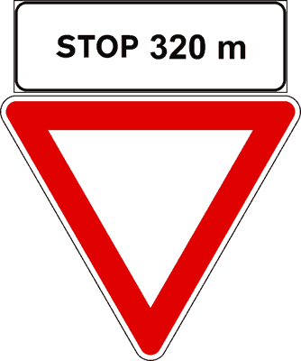

---

**58.** Il segnale raffigurato preannuncia un segnale di STOP a 320 metri

- **الإجابة:** `VERO ✅ (صح)`
- 

---

**59.** Il segnale raffigurato preannuncia di arrestarsi al prossimo incrocio e dare la precedenza a destra ed a sinistra

- **الإجابة:** `VERO ✅ (صح)`
- 

---

**60.** Il segnale raffigurato preannuncia di fermarsi 320 metri dopo il segnale e dare la precedenza

- **الإجابة:** `VERO ✅ (صح)`
- 

---

**61.** Il segnale raffigurato invita a rallentare perché è prossimo un incrocio in cui bisogna fermarsi e dare la precedenza

- **الإجابة:** `VERO ✅ (صح)`
- 

---

**62.** Il segnale raffigurato è un segnale di prescrizione

- **الإجابة:** `VERO ✅ (صح)`
- 

---

**63.** Il segnale raffigurato obbliga solo a rallentare e, se necessario, a dare la precedenza all'incrocio a 320 metri

- **الإجابة:** `FALSO ❌ (خطأ)`
- 

---

**64.** Il segnale raffigurato è posto a 320 metri dal segnale DARE PRECEDENZA

- **الإجابة:** `FALSO ❌ (خطأ)`
- 

---

**65.** Il segnale raffigurato si trova solo nelle strade urbane

- **الإجابة:** `FALSO ❌ (خطأ)`
- 

---

**66.** Il segnale raffigurato preannuncia la presenza di una barriera doganale

- **الإجابة:** `FALSO ❌ (خطأ)`
- 

---

**67.** Il segnale raffigurato può presegnalare un casello autostradale

- **الإجابة:** `FALSO ❌ (خطأ)`
- 

---

**68.** Il segnale raffigurato è posto prima del segnale ALT-POLIZIA

- **الإجابة:** `FALSO ❌ (خطأ)`
- 

---

**69.** Incontrando il segnale raffigurato occorre fermarsi e poi arrestarsi nuovamente dopo 320 metri

- **الإجابة:** `FALSO ❌ (خطأ)`
- 

---

**70.** Il segnale raffigurato è un segnale di pericolo

- **الإجابة:** `FALSO ❌ (خطأ)`
- 

---

## 📌 Incrocio precedenza destra (11 domande)

**71.** Il segnale raffigurato preannuncia un incrocio in cui vale la regola generale di dare la precedenza a destra

- **الإجابة:** `VERO ✅ (صح)`
- 

---

**72.** Il segnale raffigurato prescrive di procedere a velocità particolarmente moderata

- **الإجابة:** `VERO ✅ (صح)`
- 

---

**73.** Il segnale raffigurato preannuncia un incrocio in cui si deve dare precedenza a destra

- **الإجابة:** `VERO ✅ (صح)`
- 

---

**74.** Il segnale raffigurato è un segnale di precedenza

- **الإجابة:** `VERO ✅ (صح)`
- 

---

**75.** Il segnale raffigurato non si trova sul tratto di strada con diritto di precedenza

- **الإجابة:** `VERO ✅ (صح)`
- 

---

**76.** Il segnale raffigurato presegnala un passaggio a livello custodito con barriere

- **الإجابة:** `FALSO ❌ (خطأ)`
- 

---

**77.** Il segnale raffigurato precede il segnale DARE PRECEDENZA

- **الإجابة:** `FALSO ❌ (خطأ)`
- 

---

**78.** Il segnale raffigurato precede il segnale di STOP

- **الإجابة:** `FALSO ❌ (خطأ)`
- 

---

**79.** Il segnale raffigurato si trova, di norma, a non più di 50 metri dall'incrocio

- **الإجابة:** `FALSO ❌ (خطأ)`
- 

---

**80.** Il segnale raffigurato, in autostrada, viene posto a una distanza maggiore di 250 metri

- **الإجابة:** `FALSO ❌ (خطأ)`
- 

---

**81.** Il segnale raffigurato preannuncia la presenza del segnale CROCE DI S. ANDREA

- **الإجابة:** `FALSO ❌ (خطأ)`
- 

---

## 📌 Sensi unici alternati (33 domande)

**82.** Il segnale raffigurato impone, nelle strettoie, di dare precedenza ai veicoli provenienti dal senso opposto

- **الإجابة:** `VERO ✅ (صح)`
- 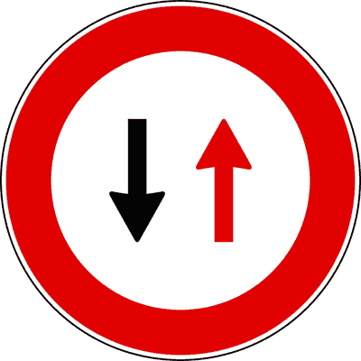

---

**83.** Il segnale raffigurato preannuncia, in presenza di lavori, di dare precedenza ai veicoli provenienti dal senso opposto

- **الإجابة:** `VERO ✅ (صح)`
- 

---

**84.** Il segnale raffigurato preannuncia che bisogna dare la precedenza ai veicoli provenienti di fronte

- **الإجابة:** `VERO ✅ (صح)`
- 

---

**85.** Il segnale raffigurato obbliga a dare la precedenza ai veicoli provenienti dal senso contrario

- **الإجابة:** `VERO ✅ (صح)`
- 

---

**86.** Il segnale raffigurato impone di dare la precedenza nei sensi unici alternati

- **الإجابة:** `VERO ✅ (صح)`
- 

---

**87.** Il segnale raffigurato, in una strada a doppio senso, precede una strettoia che permette il transito di una sola fila di veicoli

- **الإجابة:** `VERO ✅ (صح)`
- 

---

**88.** Il segnale raffigurato preannuncia che la circolazione non può svolgersi contemporaneamente nei due sensi

- **الإجابة:** `VERO ✅ (صح)`
- 

---

**89.** Il segnale raffigurato è un segnale di prescrizione

- **الإجابة:** `VERO ✅ (صح)`
- 

---

**90.** Il segnale raffigurato può essere posto in una strada in cui una parte della carreggiata è sbarrata

- **الإجابة:** `VERO ✅ (صح)`
- 

---

**91.** Il segnale raffigurato può essere posto in una strada con strettoia

- **الإجابة:** `VERO ✅ (صح)`
- 

---

**92.** Il segnale raffigurato impone di dare la precedenza ai veicoli provenienti dal senso opposto

- **الإجابة:** `VERO ✅ (صح)`
- 

---

**93.** Il segnale raffigurato prescrive di dare la precedenza nei sensi unici alternati

- **الإجابة:** `VERO ✅ (صح)`
- 

---

**94.** Il segnale raffigurato si incontra prima di una strettoia che, di norma, consente il passaggio di una sola fila di veicoli

- **الإجابة:** `VERO ✅ (صح)`
- 

---

**95.** In presenza del segnale raffigurato e del semaforo a tre luci abbiamo la precedenza se il semaforo è a luce verde

- **الإجابة:** `VERO ✅ (صح)`
- 

---

**96.** In presenza del segnale raffigurato e del semaforo a tre luci dobbiamo dare la precedenza se il semaforo è spento

- **الإجابة:** `VERO ✅ (صح)`
- 

---

**97.** In presenza del segnale raffigurato e del semaforo a tre luci abbiamo la precedenza se il semaforo è a luce rossa, ma l'agente del traffico ci ordina di passare

- **الإجابة:** `VERO ✅ (صح)`
- 

---

**98.** In presenza del segnale raffigurato e del semaforo a tre luci dobbiamo dare la precedenza se il semaforo è a luce lampeggiante gialla

- **الإجابة:** `VERO ✅ (صح)`
- 

---

**99.** Il segnale raffigurato preannuncia che la circolazione è ammessa nei giorni pari in un senso e nei giorni dispari nell'altro

- **الإجابة:** `FALSO ❌ (خطأ)`
- 

---

**100.** Il segnale raffigurato preannuncia il diritto di precedenza nei sensi unici alternati

- **الإجابة:** `FALSO ❌ (خطأ)`
- 

---

**101.** Il segnale raffigurato, su una carreggiata a senso unico, preannuncia l'inizio del doppio senso di circolazione

- **الإجابة:** `FALSO ❌ (خطأ)`
- 

---

**102.** Il segnale raffigurato preannuncia la fine del senso unico di circolazione

- **الإجابة:** `FALSO ❌ (خطأ)`
- 

---

**103.** Il segnale raffigurato preannuncia la fine del diritto di precedenza nei sensi unici alternati

- **الإجابة:** `FALSO ❌ (خطأ)`
- 

---

**104.** Il segnale raffigurato si trova su strade a senso unico di circolazione

- **الإجابة:** `FALSO ❌ (خطأ)`
- 

---

**105.** Il segnale raffigurato si incontra prima di un qualsiasi restringimento della carreggiata

- **الإجابة:** `FALSO ❌ (خطأ)`
- 

---

**106.** Il segnale raffigurato è un segnale di divieto

- **الإجابة:** `FALSO ❌ (خطأ)`
- 

---

**107.** Il segnale raffigurato è posto all'inizio di una strada a senso unico

- **الإجابة:** `FALSO ❌ (خطأ)`
- 

---

**108.** Il segnale raffigurato obbliga a dare la precedenza, negli incroci, ai veicoli provenienti sia da destra che da sinistra

- **الإجابة:** `FALSO ❌ (خطأ)`
- 

---

**109.** Il segnale raffigurato è un segnale di pericolo

- **الإجابة:** `FALSO ❌ (خطأ)`
- 

---

**110.** Il segnale raffigurato preannuncia il diritto di precedenza nei sensi unici alternati

- **الإجابة:** `FALSO ❌ (خطأ)`
- 

---

**111.** In presenza del segnale raffigurato e del semaforo a tre luci dobbiamo dare la precedenza anche se il semaforo è a luce verde

- **الإجابة:** `FALSO ❌ (خطأ)`
- 

---

**112.** In presenza del segnale raffigurato e del semaforo a tre luci abbiamo la precedenza se il semaforo è a luce gialla lampeggiante

- **الإجابة:** `FALSO ❌ (خطأ)`
- 

---

**113.** In presenza del segnale raffigurato e del semaforo a tre luci abbiamo la precedenza se il semaforo è a luce verde, ma l'agente del traffico ci ordina di fermarci

- **الإجابة:** `FALSO ❌ (خطأ)`
- 

---

**114.** In presenza del segnale raffigurato e del semaforo a tre luci dobbiamo dare la precedenza se il semaforo è spento e l'agente del traffico ci ordina di passare

- **الإجابة:** `FALSO ❌ (خطأ)`
- 

---

## 📌 Fine diritto precedenza (22 domande)

**115.** Il segnale raffigurato invita a maggiore prudenza perché non si ha più diritto di precedenza

- **الإجابة:** `VERO ✅ (صح)`
- 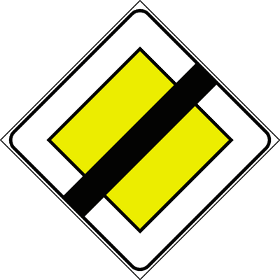

---

**116.** In presenza del segnale raffigurato il conducente, salvo diverso ulteriore segnale, deve dare precedenza ai veicoli provenienti da destra.

- **الإجابة:** `VERO ✅ (صح)`
- 

---

**117.** Il segnale raffigurato è un segnale di precedenza

- **الإجابة:** `VERO ✅ (صح)`
- 

---

**118.** Il segnale raffigurato indica che la strada non gode più del diritto di precedenza

- **الإجابة:** `VERO ✅ (صح)`
- 

---

**119.** Il segnale raffigurato può essere seguito dal segnale FERMARSI E DARE PRECEDENZA

- **الإجابة:** `VERO ✅ (صح)`
- 

---

**120.** Il segnale raffigurato modifica le precedenti norme sulla precedenza agli incroci

- **الإجابة:** `VERO ✅ (صح)`
- 

---

**121.** Il segnale raffigurato indica il ripristino della norma generale sulla precedenza

- **الإجابة:** `VERO ✅ (صح)`
- 

---

**122.** Il segnale raffigurato indica che termina una strada con diritto di precedenza

- **الإجابة:** `VERO ✅ (صح)`
- 

---

**123.** Il segnale raffigurato indica che dopo di esso si dovrà, di norma, dare la precedenza a destra

- **الإجابة:** `VERO ✅ (صح)`
- 

---

**124.** Il segnale raffigurato indica la fine del diritto di precedenza anche sulle strade urbane

- **الإجابة:** `VERO ✅ (صح)`
- 

---

**125.** Il segnale raffigurato è un segnale di indicazione

- **الإجابة:** `FALSO ❌ (خطأ)`
- 

---

**126.** Il segnale raffigurato preannuncia che si sta percorrendo una strada con diritto di precedenza

- **الإجابة:** `FALSO ❌ (خطأ)`
- 

---

**127.** Il segnale raffigurato obbliga ad arrestarsi all'incrocio

- **الإجابة:** `FALSO ❌ (خطأ)`
- 

---

**128.** Il segnale raffigurato indica l'andamento della strada principale

- **الإجابة:** `FALSO ❌ (خطأ)`
- 

---

**129.** Il segnale raffigurato preannuncia sempre un incrocio con precedenza a destra

- **الإجابة:** `FALSO ❌ (خطأ)`
- 

---

**130.** Il segnale raffigurato preannuncia la fine dell'obbligo precedentemente imposto

- **الإجابة:** `FALSO ❌ (خطأ)`
- 

---

**131.** Il segnale raffigurato preannuncia una strada senza uscita

- **الإجابة:** `FALSO ❌ (خطأ)`
- 

---

**132.** Il segnale raffigurato indica la fine di un'autostrada

- **الإجابة:** `FALSO ❌ (خطأ)`
- 

---

**133.** Il segnale raffigurato indica la fine di una strada a senso unico

- **الإجابة:** `FALSO ❌ (خطأ)`
- 

---

**134.** Il segnale raffigurato indica la fine di una strada a doppio senso di circolazione

- **الإجابة:** `FALSO ❌ (خطأ)`
- 

---

**135.** Il segnale raffigurato indica fine del limite di velocità

- **الإجابة:** `FALSO ❌ (خطأ)`
- 

---

**136.** Il segnale raffigurato indica la fine di tutti i divieti

- **الإجابة:** `FALSO ❌ (خطأ)`
- 

---

## 📌 Incrocio con precedenza (15 domande)

**137.** Il segnale raffigurato preannuncia un incrocio con strade di minore importanza

- **الإجابة:** `VERO ✅ (صح)`
- 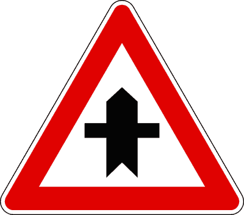

---

**138.** Il segnale raffigurato preannuncia un incrocio in cui si ha la precedenza sui veicoli provenienti dalle strade secondarie

- **الإجابة:** `VERO ✅ (صح)`
- 

---

**139.** Il segnale raffigurato preannuncia l'incrocio con una strada senza diritto di precedenza

- **الإجابة:** `VERO ✅ (صح)`
- 

---

**140.** Il segnale raffigurato, all'incrocio, ci dà la precedenza sui veicoli provenienti sia da destra che da sinistra

- **الإجابة:** `VERO ✅ (صح)`
- 

---

**141.** Il segnale raffigurato perde la sua efficacia in presenza di agente che regola il traffico

- **الإجابة:** `VERO ✅ (صح)`
- 

---

**142.** Il segnale raffigurato può essere preceduto dal segnale DIRITTO DI PRECEDENZA

- **الإجابة:** `VERO ✅ (صح)`
- 

---

**143.** Il segnale raffigurato preannuncia che bisogna rallentare per accertare che ci venga data la precedenza

- **الإجابة:** `VERO ✅ (صح)`
- 

---

**144.** Il segnale raffigurato preannuncia un incrocio in cui si ha la precedenza

- **الإجابة:** `VERO ✅ (صح)`
- 

---

**145.** Il segnale raffigurato preannuncia una confluenza sia da destra che da sinistra

- **الإجابة:** `FALSO ❌ (خطأ)`
- 

---

**146.** Il segnale raffigurato vieta la svolta a sinistra all'incrocio

- **الإجابة:** `FALSO ❌ (خطأ)`
- 

---

**147.** Il segnale raffigurato preannuncia un incrocio con precedenza rispetto ai veicoli provenienti da sinistra mentre si deve dare la precedenza a quelli provenienti da destra

- **الإجابة:** `FALSO ❌ (خطأ)`
- 

---

**148.** Il segnale raffigurato è posto sulle autostrade

- **الإجابة:** `FALSO ❌ (خطأ)`
- 

---

**149.** Il segnale raffigurato è posto a non più di 25 metri dall'incrocio

- **الإجابة:** `FALSO ❌ (خطأ)`
- 

---

**150.** Il segnale raffigurato preannuncia un incrocio nel quale bisogna dare la precedenza

- **الإجابة:** `FALSO ❌ (خطأ)`
- 

---

**151.** Il segnale raffigurato preannuncia corsie di accelerazione a destra e a sinistra

- **الإجابة:** `FALSO ❌ (خطأ)`
- 

---

## 📌 Intersezione t destra (12 domande)

**152.** Il segnale raffigurato preannuncia che si incrocia a destra una strada di minore importanza

- **الإجابة:** `VERO ✅ (صح)`
- 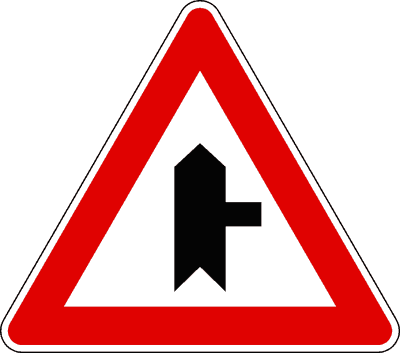

---

**153.** Il segnale raffigurato preannuncia un incrocio con una strada secondaria che si immette da destra

- **الإجابة:** `VERO ✅ (صح)`
- 

---

**154.** In presenza del segnale raffigurato bisogna usare prudenza perché ci si sta avvicinando ad un incrocio

- **الإجابة:** `VERO ✅ (صح)`
- 

---

**155.** Il segnale raffigurato è un segnale di precedenza

- **الإجابة:** `VERO ✅ (صح)`
- 

---

**156.** Il segnale raffigurato preannuncia l'incrocio con una strada senza diritto di precedenza

- **الإجابة:** `VERO ✅ (صح)`
- 

---

**157.** Il segnale raffigurato preannuncia un incrocio in cui il conducente ha la precedenza sui veicoli provenienti da destra

- **الإجابة:** `VERO ✅ (صح)`
- 

---

**158.** Il segnale raffigurato preannuncia, sulla destra, una strada senza uscita

- **الإجابة:** `FALSO ❌ (خطأ)`
- 

---

**159.** Il segnale raffigurato vieta la svolta a destra

- **الإجابة:** `FALSO ❌ (خطأ)`
- 

---

**160.** Il segnale raffigurato è posto sulle corsie di accelerazione delle autostrade

- **الإجابة:** `FALSO ❌ (خطأ)`
- 

---

**161.** Il segnale raffigurato preannuncia un'immissione stradale con corsia di accelerazione

- **الإجابة:** `FALSO ❌ (خطأ)`
- 

---

**162.** Il segnale raffigurato preannuncia un incrocio in cui il conducente ha l’obbligo di fermarsi e dare precedenza ai veicoli provenienti da destra

- **الإجابة:** `FALSO ❌ (خطأ)`
- 

---

**163.** Il segnale raffigurato indica una piazzola di sosta a destra

- **الإجابة:** `FALSO ❌ (خطأ)`
- 

---

## 📌 Intersezione t sinistra (12 domande)

**164.** Il segnale raffigurato preannuncia che si incrocia sulla sinistra una strada di minore importanza

- **الإجابة:** `VERO ✅ (صح)`
- 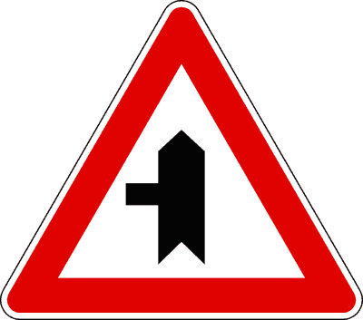

---

**165.** Il segnale raffigurato preannuncia un incrocio in cui si ha la precedenza

- **الإجابة:** `VERO ✅ (صح)`
- 

---

**166.** Il segnale raffigurato prescrive di usare prudenza perché ci si sta avvicinando ad un incrocio

- **الإجابة:** `VERO ✅ (صح)`
- 

---

**167.** Il segnale raffigurato è un segnale di precedenza

- **الإجابة:** `VERO ✅ (صح)`
- 

---

**168.** Il segnale raffigurato preannuncia l'incrocio con una strada senza diritto di precedenza

- **الإجابة:** `VERO ✅ (صح)`
- 

---

**169.** Il segnale raffigurato preannuncia un incrocio in cui si ha la precedenza sui veicoli provenienti da sinistra

- **الإجابة:** `VERO ✅ (صح)`
- 

---

**170.** Il segnale raffigurato preannuncia sulla sinistra una strada senza uscita

- **الإجابة:** `FALSO ❌ (خطأ)`
- 

---

**171.** Il segnale raffigurato vieta la svolta a sinistra

- **الإجابة:** `FALSO ❌ (خطأ)`
- 

---

**172.** Il segnale raffigurato preannuncia una confluenza in autostrada

- **الإجابة:** `FALSO ❌ (خطأ)`
- 

---

**173.** Il segnale raffigurato preannuncia una confluenza a destra

- **الإجابة:** `FALSO ❌ (خطأ)`
- 

---

**174.** Il segnale raffigurato è posto sulle rampe di accesso alle autostrade

- **الإجابة:** `FALSO ❌ (خطأ)`
- 

---

**175.** Il segnale raffigurato preannuncia l'incrocio con un binario morto

- **الإجابة:** `FALSO ❌ (خطأ)`
- 

---

## 📌 Confluenza destra (12 domande)

**176.** Il segnale raffigurato preannuncia una immissione da destra con corsia di accelerazione

- **الإجابة:** `VERO ✅ (صح)`
- 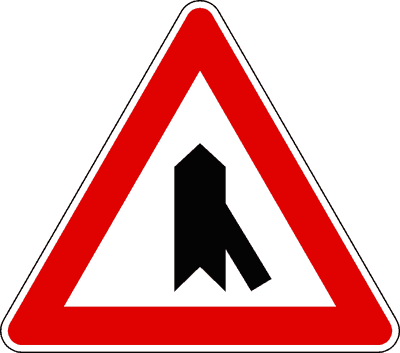

---

**177.** Il segnale raffigurato preannuncia una confluenza sul lato destro

- **الإجابة:** `VERO ✅ (صح)`
- 

---

**178.** Il segnale raffigurato può trovarsi sulle autostrade

- **الإجابة:** `VERO ✅ (صح)`
- 

---

**179.** Il segnale raffigurato invita ad usare la massima prudenza al fine di evitare incidenti

- **الإجابة:** `VERO ✅ (صح)`
- 

---

**180.** Il segnale raffigurato indica che abbiamo la precedenza sui veicoli che si immettono da destra

- **الإجابة:** `VERO ✅ (صح)`
- 

---

**181.** In presenza del segnale raffigurato, sulla rampa di raccordo è posto il segnale di DARE PRECEDENZA

- **الإجابة:** `VERO ✅ (صح)`
- 

---

**182.** Il segnale raffigurato è posto a non più di 25 metri dall'incrocio

- **الإجابة:** `FALSO ❌ (خطأ)`
- 

---

**183.** Il segnale raffigurato preannuncia di dare precedenza ai veicoli provenienti da destra

- **الإجابة:** `FALSO ❌ (خطأ)`
- 

---

**184.** Il segnale raffigurato viene posto su strada secondaria che non gode del diritto di precedenza

- **الإجابة:** `FALSO ❌ (خطأ)`
- 

---

**185.** Il segnale raffigurato può precedere il segnale DARE PRECEDENZA

- **الإجابة:** `FALSO ❌ (خطأ)`
- 

---

**186.** Il segnale raffigurato, su autostrada, non comporta una riduzione della velocità

- **الإجابة:** `FALSO ❌ (خطأ)`
- 

---

**187.** Il segnale raffigurato consente la svolta a destra al prossimo incrocio

- **الإجابة:** `FALSO ❌ (خطأ)`
- 

---

## 📌 Confluenza sinistra (12 domande)

**188.** Il segnale raffigurato preannuncia un'immissione stradale con corsia di accelerazione posta sulla sinistra

- **الإجابة:** `VERO ✅ (صح)`
- 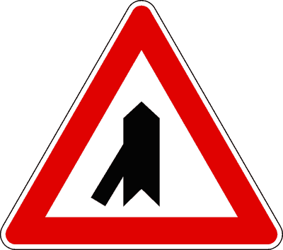

---

**189.** Il segnale raffigurato preannuncia una confluenza sul lato sinistro della carreggiata

- **الإجابة:** `VERO ✅ (صح)`
- 

---

**190.** Il segnale raffigurato si trova su carreggiate a senso unico di circolazione

- **الإجابة:** `VERO ✅ (صح)`
- 

---

**191.** Il segnale raffigurato invita ad usare prudenza perché altri veicoli potrebbero immettersi nel flusso della circolazione

- **الإجابة:** `VERO ✅ (صح)`
- 

---

**192.** Il segnale raffigurato è usato su strade con diritto di precedenza

- **الإجابة:** `VERO ✅ (صح)`
- 

---

**193.** Il segnale raffigurato comporta la presenza del segnale DARE PRECEDENZA sulla strada di immissione laterale

- **الإجابة:** `VERO ✅ (صح)`
- 

---

**194.** Il segnale raffigurato è posto a non più di 25 metri dall'incrocio

- **الإجابة:** `FALSO ❌ (خطأ)`
- 

---

**195.** Il segnale raffigurato prescrive di dare la precedenza ai veicoli provenienti da sinistra

- **الإجابة:** `FALSO ❌ (خطأ)`
- 

---

**196.** Il segnale raffigurato preannuncia che non si ha diritto di precedenza nella confluenza

- **الإجابة:** `FALSO ❌ (خطأ)`
- 

---

**197.** Il segnale raffigurato precede il segnale di DARE PRECEDENZA

- **الإجابة:** `FALSO ❌ (خطأ)`
- 

---

**198.** Il segnale raffigurato, posto sulle autostrade, precede il segnale d'obbligo di svolta a sinistra

- **الإجابة:** `FALSO ❌ (خطأ)`
- 

---

**199.** Il segnale raffigurato consente la svolta a sinistra al prossimo incrocio

- **الإجابة:** `FALSO ❌ (خطأ)`
- 

---

## 📌 Strada diritto precedenza (24 domande)

**200.** Il segnale raffigurato indica l'inizio di una strada in cui i veicoli hanno diritto di precedenza

- **الإجابة:** `VERO ✅ (صح)`
- 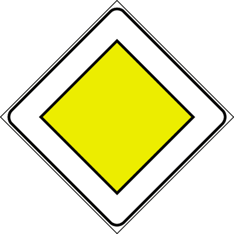

---

**201.** Il segnale raffigurato può essere posto su una strada statale

- **الإجابة:** `VERO ✅ (صح)`
- 

---

**202.** In presenza del segnale raffigurato bisogna comunque dare la precedenza ai veicoli che hanno in funzione il lampeggiante blu e sirena

- **الإجابة:** `VERO ✅ (صح)`
- 

---

**203.** Il segnale raffigurato è un segnale di precedenza

- **الإجابة:** `VERO ✅ (صح)`
- 

---

**204.** In presenza del segnale raffigurato bisogna comunque assicurarsi che i veicoli provenienti dalle strade laterali diano la precedenza

- **الإجابة:** `VERO ✅ (صح)`
- 

---

**205.** Il segnale raffigurato è un segnale di prescrizione

- **الإجابة:** `VERO ✅ (صح)`
- 

---

**206.** Il segnale raffigurato si può trovare all'inizio di una strada urbana o extraurbana che gode del diritto di precedenza

- **الإجابة:** `VERO ✅ (صح)`
- 

---

**207.** Il segnale raffigurato può essere ripetuto in formato piccolo prima e dopo ogni incrocio

- **الإجابة:** `VERO ✅ (صح)`
- 

---

**208.** Il segnale di figura (A) può essere ripetuto in formato piccolo e integrato con il pannello in figura (B)

- **الإجابة:** `VERO ✅ (صح)`
- 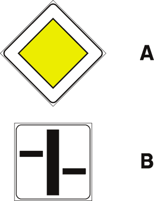

---

**209.** Il segnale raffigurato comporta la presenza sulle strade che si incrociano del segnale DARE PRECEDENZA o STOP

- **الإجابة:** `VERO ✅ (صح)`
- 

---

**210.** In presenza del segnale raffigurato è comunque necessario moderare la velocità in prossimità degli incroci

- **الإجابة:** `VERO ✅ (صح)`
- 

---

**211.** Il segnale raffigurato obbliga ad arrestarsi all'incrocio

- **الإجابة:** `FALSO ❌ (خطأ)`
- 

---

**212.** Il segnale raffigurato può essere posto a protezione di attraversamenti pedonali pericolosi

- **الإجابة:** `FALSO ❌ (خطأ)`
- 

---

**213.** Il segnale raffigurato è posto esclusivamente su strade extraurbane ad intenso traffico

- **الإجابة:** `FALSO ❌ (خطأ)`
- 

---

**214.** Il segnale raffigurato preannuncia incrocio con precedenza rispetto ai soli veicoli provenienti da destra

- **الإجابة:** `FALSO ❌ (خطأ)`
- 

---

**215.** Il segnale raffigurato preannuncia le corsie riservate agli autobus in servizio pubblico

- **الإجابة:** `FALSO ❌ (خطأ)`
- 

---

**216.** Il segnale raffigurato preannuncia l'inizio di un cantiere stradale

- **الإجابة:** `FALSO ❌ (خطأ)`
- 

---

**217.** Il segnale raffigurato si trova all'inizio di una strada senza diritto di precedenza

- **الإجابة:** `FALSO ❌ (خطأ)`
- 

---

**218.** Il segnale raffigurato si trova all'inizio di un'autostrada

- **الإجابة:** `FALSO ❌ (خطأ)`
- 

---

**219.** Il segnale raffigurato si trova esclusivamente all'inizio di una strada statale

- **الإجابة:** `FALSO ❌ (خطأ)`
- 

---

**220.** In presenza del segnale raffigurato non occorrono particolari cautele perché si ha la precedenza

- **الإجابة:** `FALSO ❌ (خطأ)`
- 

---

**221.** Il segnale raffigurato si trova alla fine di una strada con diritto di precedenza

- **الإجابة:** `FALSO ❌ (خطأ)`
- 

---

**222.** Il segnale raffigurato si trova alla fine di una strada statale

- **الإجابة:** `FALSO ❌ (خطأ)`
- 

---

**223.** Il segnale raffigurato indica che si ha la precedenza fino all'uscita del centro abitato

- **الإجابة:** `FALSO ❌ (خطأ)`
- 

---

## 📌 Diritto precedenza sensi unici (20 domande)

**224.** In presenza del segnale raffigurato dobbiamo accertarci che i veicoli provenienti dal senso contrario ci diano la precedenza

- **الإجابة:** `VERO ✅ (صح)`
- 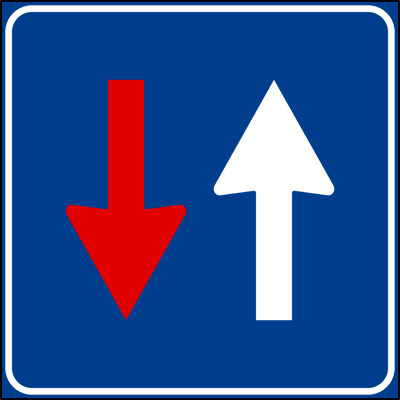

---

**225.** In presenza del segnale raffigurato possiamo percorrere la strettoia, dopo esserci assicurati di aver ottenuto la precedenza

- **الإجابة:** `VERO ✅ (صح)`
- 

---

**226.** In presenza del segnale raffigurato dobbiamo procedere con cautela, anche se abbiamo la precedenza

- **الإجابة:** `VERO ✅ (صح)`
- 

---

**227.** In presenza del segnale raffigurato si può percorrere la strettoia accertandosi di aver avuto la precedenza dai veicoli provenienti di fronte

- **الإجابة:** `VERO ✅ (صح)`
- 

---

**228.** In presenza del segnale raffigurato e del semaforo a tre luci abbiamo la precedenza se il semaforo è a luce verde

- **الإجابة:** `VERO ✅ (صح)`
- 

---

**229.** In presenza del segnale raffigurato e del semaforo a tre luci abbiamo la precedenza se il semaforo è spento

- **الإجابة:** `VERO ✅ (صح)`
- 

---

**230.** In presenza del segnale raffigurato e del semaforo a tre luci abbiamo la precedenza se il semaforo è a luce rossa, ma l'agente del traffico ci ordina di passare

- **الإجابة:** `VERO ✅ (صح)`
- 

---

**231.** In presenza del segnale raffigurato e del semaforo a tre luci dobbiamo dare la precedenza se il semaforo è spento e l'agente del traffico ci ordina di fermarci

- **الإجابة:** `VERO ✅ (صح)`
- 

---

**232.** In presenza del segnale raffigurato e del semaforo a tre luci abbiamo la precedenza se il semaforo è a luce gialla lampeggiante

- **الإجابة:** `VERO ✅ (صح)`
- 

---

**233.** In presenza del segnale raffigurato si deve dare la precedenza ai veicoli che provengono dal senso opposto

- **الإجابة:** `FALSO ❌ (خطأ)`
- 

---

**234.** In presenza del segnale raffigurato possiamo procedere senza cautela, dato che abbiamo il diritto di precedenza

- **الإجابة:** `FALSO ❌ (خطأ)`
- 

---

**235.** In presenza del segnale raffigurato non vi sono particolari obblighi perché siamo su una strada a senso unico

- **الإجابة:** `FALSO ❌ (خطأ)`
- 

---

**236.** In presenza del segnale raffigurato inizia il doppio senso di circolazione

- **الإجابة:** `FALSO ❌ (خطأ)`
- 

---

**237.** In presenza del segnale raffigurato si deve usare prudenza nella strettoia perché la circolazione si svolge a doppio senso

- **الإجابة:** `FALSO ❌ (خطأ)`
- 

---

**238.** Il segnale raffigurato preannuncia il divieto d'inversione di marcia

- **الإجابة:** `FALSO ❌ (خطأ)`
- 

---

**239.** Il segnale raffigurato preannuncia il divieto di svolta

- **الإجابة:** `FALSO ❌ (خطأ)`
- 

---

**240.** In presenza del segnale raffigurato e del semaforo a tre luci abbiamo la precedenza anche se il semaforo è a luce rossa

- **الإجابة:** `FALSO ❌ (خطأ)`
- 

---

**241.** In presenza del segnale raffigurato e del semaforo a tre luci dobbiamo dare la precedenza se il semaforo è a luce lampeggiante gialla

- **الإجابة:** `FALSO ❌ (خطأ)`
- 

---

**242.** In presenza del segnale raffigurato e del semaforo a tre luci abbiamo la precedenza se il semaforo è a luce verde e l'agente del traffico ci ordina di fermarci

- **الإجابة:** `FALSO ❌ (خطأ)`
- 

---

**243.** In presenza del segnale raffigurato e del semaforo a tre luci abbiamo la precedenza se il semaforo è spento e l'agente del traffico ci ordina di fermarci

- **الإجابة:** `FALSO ❌ (خطأ)`
- 

---

