# Capitolo 06 - Segnaletica orizzontale e ostacoli
### الإشارات الأرضية والعوائق

- 📁 **المجلد المحلي للباب:** `Capitolo_06_segnaletica_orizzontale_ostacoli`
- 📊 **إجمالي الأسئلة المعتمدة والمشروحة:** 260 سؤالاً وزارياً

## 📌 Striscia discontinua (16 domande)

**1.** La striscia bianca discontinua in figura può essere superata
- **الإجابة:** `VERO ✅ (صح)`
- 
- **📖 الترجمة السياقية:** يجوز تخطي الخط الأبيض المتقطع (striscia discontinua) الموضح في الشكل.
- **💡 الشرح والقاعدة المرورية:** صحيح (VERO). الخط الأبيض المتقطع يجوز تجاوزه وتخطيه للقيام بمناورات التجاوز أو الانعطاف أو الدوران للخلف عندما تسمح ظروف الرؤية والأمان.
- **⚠️ كشف الفخ:** فخ الامتحان: الخط المتقطع يسمح بالتخطي (può essere superata)، على عكس الخط المتصل.
- **🔑 الكلمات المفتاحية:** `{'it': 'striscia bianca discontinua', 'ar': 'خط أبيض متقطع'}` | `{'it': 'può essere superata', 'ar': 'يجوز تخطيه'}` | `{'it': 'vero', 'ar': 'صحيح'}`

---

**2.** La striscia bianca discontinua in figura divide la carreggiata in due corsie
- **الإجابة:** `VERO ✅ (صح)`
- 
- **📖 الترجمة السياقية:** يقسم الخط الأبيض المتقطع الموضح في الشكل نهر الطريق إلى مسلكين (due corsie).
- **💡 الشرح والقاعدة المرورية:** صحيح (VERO). الخط الطولي المتقطع يقسم عرض نهر الطريق إلى مسلكين مخصصين لحركة المرور.
- **⚠️ كشف الفخ:** فخ الامتحان: الخط الطولي يقسم نهر الطريق إلى مسالك وليس إلى نهري طريق منفصلين.
- **🔑 الكلمات المفتاحية:** `{'it': 'divide la carreggiata in due corsie', 'ar': 'يقسم نهر الطريق لمسلكين'}` | `{'it': 'corsie di marcia', 'ar': 'مسالك السير'}` | `{'it': 'vero', 'ar': 'صحيح'}`

---

**3.** Nelle strade a doppio senso con due corsie la striscia bianca discontinua in figura divide i sensi di marcia
- **الإجابة:** `VERO ✅ (صح)`
- 
- **📖 الترجمة السياقية:** في الطرق ذات الاتجاهين ذات المسلكين، يقسم الخط الأبيض المتقطع الموضح في الشكل اتجاهي السير.
- **💡 الشرح والقاعدة المرورية:** صحيح (VERO). في طريق ذي اتجاهين (doppio senso) ومسلكين فقط، يفصل الخط المتقطع الأوسط حركة المرور المتجهة إلى الأمام عن حركة المرور المعاكسة.
- **⚠️ كشف الفخ:** فخ الامتحان: في السير ذي الاتجاهين والمسلكين، الخط الأوسط يقسم اتجاهي السير (divide i sensi di marcia).
- **🔑 الكلمات المفتاحية:** `{'it': 'strade a doppio senso', 'ar': 'طرق ذات اتجاهين'}` | `{'it': 'divide i sensi di marcia', 'ar': 'يقسم اتجاهي السير'}` | `{'it': 'vero', 'ar': 'صحيح'}`

---

**4.** La striscia bianca discontinua in figura consente, in caso si voglia sorpassare, di occupare momentaneamente l'altra corsia di marcia
- **الإجابة:** `VERO ✅ (صح)`
- 
- **📖 الترجمة السياقية:** يسمح الخط الأبيض المتقطع الموضح في الشكل، في حال الرغبة بالتجاوز، بشغل مسلك السير الآخر مؤقتاً.
- **💡 الشرح والقاعدة المرورية:** صحيح (VERO). في حالة التجاوز (sorpasso) وفي ظل انعدام الخطر، يجوز تخطي الخط المتقطع وشغل المسلك المقابل مؤقتاً لإتمام المناورة ثم العودة لليمين.
- **⚠️ كشف الفخ:** فخ الامتحان: الخط المتقطع يبيح التخطي المؤقت للمسلك المقابل أثناء التجاوز.
- **🔑 الكلمات المفتاحية:** `{'it': "occupare momentaneamente l'altra corsia", 'ar': 'شغل المسلك الآخر مؤقتاً'}` | `{'it': 'sorpassare', 'ar': 'التجاوز'}` | `{'it': 'vero', 'ar': 'صحيح'}`

---

**5.** La striscia bianca discontinua in figura consente l'inversione di marcia, in condizioni di sicurezza, se la strada è a doppio senso
- **الإجابة:** `VERO ✅ (صح)`
- 
- **📖 الترجمة السياقية:** يسمح الخط الأبيض المتقطع الموضح في الشكل بالدوران للخلف (inversione di marcia)، في ظروف آمنة، إذا كان الطريق ذي اتجاهين.
- **💡 الشرح والقاعدة المرورية:** صحيح (VERO). على الطرق ذات الاتجاهين التي يفصلها خط متقطع، يجوز عمل الدوران للخلف (U-turn) بشرط توفر الرؤية الكافية وعدم وجود خطر أو عرقلة.
- **⚠️ كشف الفخ:** فخ الامتحان: الدوران للخلف مسموح به فوق الخط المتقطع في الطريق ذي الاتجاهين، وممنوع فوق الخط المتصل.
- **🔑 الكلمات المفتاحية:** `{'it': 'inversione di marcia', 'ar': 'الدوران للخلف (U-turn)'}` | `{'it': 'condizioni di sicurezza', 'ar': 'شروط الأمان'}` | `{'it': 'strada a doppio senso', 'ar': 'طريق ذو اتجاهين'}` | `{'it': 'vero', 'ar': 'صحيح'}`

---

**6.** La striscia bianca discontinua in figura consente la svolta a sinistra
- **الإجابة:** `VERO ✅ (صح)`
- 
- **📖 الترجمة السياقية:** يسمح الخط الأبيض المتقطع الموضح في الشكل بالانعطاف إلى اليسار.
- **💡 الشرح والقاعدة المرورية:** صحيح (VERO). يجوز تخطي الخط المتقطع للانعطاف يساراً والدخول في شارع فرعي أو عقار جانبي مع إعطاء الأسبقية لحركة المرور المقابلة.
- **⚠️ كشف الفخ:** فخ الامتحان: الانعطاف لليسار مباح عبر الخط المتقطع بشرط احترام قواعد الأسبقية.
- **🔑 الكلمات المفتاحية:** `{'it': 'consente la svolta a sinistra', 'ar': 'يسمح بالانعطاف يساراً'}` | `{'it': 'manovra di svolta', 'ar': 'مناورة الانعطاف'}` | `{'it': 'vero', 'ar': 'صحيح'}`

---

**7.** In una carreggiata a senso unico, la striscia bianca discontinua in figura serve a delimitare le corsie
- **الإجابة:** `VERO ✅ (صح)`
- 
- **📖 الترجمة السياقية:** في نهر طريق ذي اتجاه واحد، يُستخدم الخط الأبيض المتقطع الموضح في الشكل لتحديد وفصل المسالك.
- **💡 الشرح والقاعدة المرورية:** صحيح (VERO). في الطرق ذات الاتجاه الواحد (senso unico)، يفصل الخط المتقطع بين مسالك السير المتوازية التي تسير في نفس الاتجاه.
- **⚠️ كشف الفخ:** فخ الامتحان: الخط المتقطع في الاتجاه الواحد يفصل المسالك (delimitare le corsie) وليس اتجاهي السير.
- **🔑 الكلمات المفتاحية:** `{'it': 'carreggiata a senso unico', 'ar': 'نهر طريق باتجاه واحد'}` | `{'it': 'delimitare le corsie', 'ar': 'تحديد وفصل المسالك'}` | `{'it': 'vero', 'ar': 'صحيح'}`

---

**8.** La striscia bianca discontinua in figura, nelle strade a senso unico, divide le corsie
- **الإجابة:** `VERO ✅ (صح)`
- 
- **📖 الترجمة السياقية:** يقسم الخط الأبيض المتقطع الموضح في الشكل المسالك في الطرق ذات الاتجاه الواحد.
- **💡 الشرح والقاعدة المرورية:** صحيح (VERO). وظيفته الأساسية في الطريق ذي الاتجاه الواحد هي ترسيم الحدود بين المسالك المتجاورة في نفس اتجاه السير.
- **⚠️ كشف الفخ:** فخ الامتحان: في الاتجاه الواحد يقسم الخط المسالك فقط لأن كل حركة السير تسير باتجاه واحد.
- **🔑 الكلمات المفتاحية:** `{'it': 'nelle strade a senso unico', 'ar': 'في الطرق ذات الاتجاه الواحد'}` | `{'it': 'divide le corsie', 'ar': 'يقسم المسالك'}` | `{'it': 'vero', 'ar': 'صحيح'}`

---

**9.** La striscia bianca discontinua in figura consente di circolare stando a cavallo di essa
- **الإجابة:** `FALSO ❌ (خطأ)`
- 
- **📖 الترجمة السياقية:** يسمح الخط الأبيض المتقطع الموضح في الشكل بالسير مع ركوب الخط وتوسّطه بالمركبة (stando a cavallo).
- **💡 الشرح والقاعدة المرورية:** خطأ (FALSO). يُمنع منعاً باتاً السير وركوب الخط الفاصل بالسيارة (marcia a cavallo delle strisce)؛ يجب دائماً السير داخل المسلك المخصص بالكامل.
- **⚠️ كشف الفخ:** فخ الامتحان: عبارة 'stando a cavallo' ممنوعة ومخالفة دائماً سواء كان الخط متقطعاً أو متصلاً.
- **🔑 الكلمات المفتاحية:** `{'it': 'circolare a cavallo della striscia', 'ar': 'السير راكباً فوق الخط (فخ)'}` | `{'it': 'marciare nella corsia', 'ar': 'السير داخل المسلك'}` | `{'it': 'falso', 'ar': 'خطأ'}`

---

**10.** La striscia bianca discontinua in figura divide la strada da una pista ciclabile
- **الإجابة:** `FALSO ❌ (خطأ)`
- 
- **📖 الترجمة السياقية:** يفصل الخط الأبيض المتقطع الموضح في الشكل الطريق عن مسار الدراجات الهوائية (pista ciclabile).
- **💡 الشرح والقاعدة المرورية:** خطأ (FALSO). مسار الدراجات يفصل عن نهر الطريق بخط أبيض متصل عريض (أو رصيف مرتفع)، ولا يُفصل بخط متقطع عادي.
- **⚠️ كشف الفخ:** فخ الامتحان: مسارات الدراجات لا تُفصل بخطوط متقطعة عادية للمركبات.
- **🔑 الكلمات المفتاحية:** `{'it': 'divide da una pista ciclabile', 'ar': 'يفصل عن مسار الدراجات (فخ)'}` | `{'it': 'striscia continua larga', 'ar': 'خط متصل عريض'}` | `{'it': 'falso', 'ar': 'خطأ'}`

---

**11.** La striscia bianca discontinua in figura si trova in vicinanza di tutti i passaggi a livello
- **الإجابة:** `FALSO ❌ (خطأ)`
- 
- **📖 الترجمة السياقية:** يتواجد الخط الأبيض المتقطع الموضح في الشكل بالقرب من جميع تقاطعات السكك الحديدية (passaggi a livello).
- **💡 الشرح والقاعدة المرورية:** خطأ (FALSO). عند الاقتراب من تقاطعات السكك الحديدية يتحول الخط الأوسط دائماً إلى خط أبيض متصل (striscia continua) لمنع التجاوز الخطير.
- **⚠️ كشف الفخ:** فخ الامتحان: كلمة 'tutti i passaggi a livello' خاطئة؛ فالمزلقانات تتطلب خطاً متصلاً لمنع التجاوز.
- **🔑 الكلمات المفتاحية:** `{'it': 'vicinanza di tutti i passaggi a livello', 'ar': 'بالقرب من جميع مزلقانات القطار (فخ)'}` | `{'it': 'striscia continua', 'ar': 'خط متصل'}` | `{'it': 'falso', 'ar': 'خطأ'}`

---

**12.** La striscia bianca discontinua in figura può essere sostituita da una serie di "chiodi" per segnaletica stradale
- **الإجابة:** `FALSO ❌ (خطأ)`
- 
- **📖 الترجمة السياقية:** يمكن استبدال الخط الأبيض المتقطع الموضح في الشكل بسلسلة من 'المسامير' (chiodi) الخاصة بتخطيط الطرق.
- **💡 الشرح والقاعدة المرورية:** خطأ (FALSO). ألغى كود السير الحديث استخدام المسامير المعدنية أو البلاستيكية كبديل للخطوط الأرضية المتقطعة؛ والتخطيط يتم بالطلاء المعتمد فقط.
- **⚠️ كشف الفخ:** فخ الامتحان: المسامير الطرقية (chiodi) غير مسموح بها كبديل لخطوط السير المتقطعة.
- **🔑 الكلمات المفتاحية:** `{'it': 'sostituita da chiodi', 'ar': 'استبداله بمسامير طرقية (فخ)'}` | `{'it': 'segnaletica orizzontale', 'ar': 'التخطيط الأرضي'}` | `{'it': 'falso', 'ar': 'خطأ'}`

---

**13.** La striscia bianca discontinua in figura consente l'inversione di marcia nelle strade a senso unico
- **الإجابة:** `FALSO ❌ (خطأ)`
- 
- **📖 الترجمة السياقية:** يسمح الخط الأبيض المتقطع الموضح في الشكل بالدوران للخلف (inversione di marcia) في الطرق ذات الاتجاه الواحد.
- **💡 الشرح والقاعدة المرورية:** خطأ (FALSO). في الطرق ذات الاتجاه الواحد (senso unico) يُمنع الدوران للخلف منعاً كلياً ومطلقاً، بغض النظر عن نوع الخط الأرضي، لأن ذلك يعني السير عكس الاتجاه.
- **⚠️ كشف الفخ:** فخ الامتحان: الدوران للخلف ممنوع قطعاً في شوارع الاتجاه الواحد مهما كان نوع الخط.
- **🔑 الكلمات المفتاحية:** `{'it': 'inversione nelle strade a senso unico', 'ar': 'الدوران للخلف في الاتجاه الواحد (فخ)'}` | `{'it': 'vietata assolutamente', 'ar': 'ممنوع قطعاً'}` | `{'it': 'falso', 'ar': 'خطأ'}`

---

**14.** La striscia bianca discontinua in figura divide la strada in due carreggiate, ognuna a doppio senso
- **الإجابة:** `FALSO ❌ (خطأ)`
- 
- **📖 الترجمة السياقية:** يقسم الخط الأبيض المتقطع الموضح في الشكل الطريق إلى نهري طريق (due carreggiate)، كل منهما باتجاهين.
- **💡 الشرح والقاعدة المرورية:** خطأ (FALSO). الخطوط الأرضية الطلاء لا تقسم الطريق إلى نهري طريق؛ تقسيم نهري الطريق يتطلب حاجزاً مادياً فاصلاً (spartitraffico)، والخط يقسم نهر الطريق الواحد إلى مسالك.
- **⚠️ كشف الفخ:** فخ الامتحان: الخط يقسم إلى مسالك (corsie) وليس إلى نهري طريق (carreggiate).
- **🔑 الكلمات المفتاحية:** `{'it': 'due carreggiate', 'ar': 'نهري طريق (فخ)'}` | `{'it': 'due corsie', 'ar': 'مسلكين'}` | `{'it': 'falso', 'ar': 'خطأ'}`

---

**15.** La striscia bianca discontinua in figura si trova solo nelle strade a senso unico
- **الإجابة:** `FALSO ❌ (خطأ)`
- 
- **📖 الترجمة السياقية:** يتواجد الخط الأبيض المتقطع الموضح في الشكل فقط في الطرق ذات الاتجاه الواحد.
- **💡 الشرح والقاعدة المرورية:** خطأ (FALSO). يتواجد الخط المتقطع في كل من الطرق ذات الاتجاه الواحد والطرق ذات الاتجاهين على حد سواء.
- **⚠️ كشف الفخ:** فخ الامتحان: كلمة 'solo nelle strade a senso unico' حصرية باطلة.
- **🔑 الكلمات المفتاحية:** `{'it': 'solo nelle strade a senso unico', 'ar': 'فقط في طرق الاتجاه الواحد (فخ)'}` | `{'it': 'anche a doppio senso', 'ar': 'وأيضاً في الاتجاهين'}` | `{'it': 'falso', 'ar': 'خطأ'}`

---

**16.** La striscia bianca discontinua in figura nelle strade a senso unico è posta nei dossi, per dividere i due sensi di marcia
- **الإجابة:** `FALSO ❌ (خطأ)`
- 
- **📖 الترجمة السياقية:** في الطرق ذات الاتجاه الواحد، يوضع الخط الأبيض المتقطع الموضح في الشكل عند التلال المحدبة (dossi) لفصل اتجاهي السير.
- **💡 الشرح والقاعدة المرورية:** خطأ (FALSO). أولاً الطريق ذو الاتجاه الواحد ليس فيه اتجاهان ليفصل بينهما، وثانياً التلال المحدبة في السير المزدوج تحكم بخط متصل لمنع التجاوز وليس متقطعاً.
- **⚠️ كشف الفخ:** فخ الامتحان: تناقض مركب: الطريق ذو الاتجاه الواحد لا يفصل اتجاهين، والتلال المحدبة تتطلب خطاً متصلاً.
- **🔑 الكلمات المفتاحية:** `{'it': 'strade a senso unico... per dividere due sensi', 'ar': 'اتجاه واحد لفصل اتجاهين (تناقض)'}` | `{'it': 'dossi', 'ar': 'المرتفعات المحدبة'}` | `{'it': 'falso', 'ar': 'خطأ'}`

---

## 📌 Strisce strada (7 domande)

**17.** Le strisce lungo il centro della carreggiata possono essere superate se discontinue (tratteggiate)
- **الإجابة:** `VERO ✅ (صح)`
- **📖 الترجمة السياقية:** يجوز تخطي الخطوط الممتدة على طول منتصف نهر الطريق إذا كانت متقطعة (tratteggiate).
- **💡 الشرح والقاعدة المرورية:** صحيح (VERO). الخطوط المتقطعة المركزية تسمح قانوناً بالتخطي لاجتياز المركبات أو الانعطاف بشرط الأمان التام.
- **⚠️ كشف الفخ:** فخ الامتحان: المتقطع = مسموح التخطي (possono essere superate se discontinue).
- **🔑 الكلمات المفتاحية:** `{'it': 'lungo il centro della carreggiata', 'ar': 'على طول منتصف نهر الطريق'}` | `{'it': 'superate se discontinue', 'ar': 'تخطيها إذا كانت متقطعة'}` | `{'it': 'vero', 'ar': 'صحيح'}`

---

**18.** Le strisce lungo il centro della carreggiata non possono essere superate se continue
- **الإجابة:** `VERO ✅ (صح)`
- **📖 الترجمة السياقية:** لا يجوز تخطي الخطوط الممتدة على طول منتصف نهر الطريق إذا كانت متصلة (continue).
- **💡 الشرح والقاعدة المرورية:** صحيح (VERO). الخط المتصل الفاصل يمثل جداراً قانونياً أصم لا يجوز وطؤه أو تجاوزه بأي من عجلات المركبة على الإطلاق.
- **⚠️ كشف الفخ:** فخ الامتحان: الخط المتصل ممنوع التخطي والاجتياز دائماً (non possono essere superate se continue).
- **🔑 الكلمات المفتاحية:** `{'it': 'non possono essere superate se continue', 'ar': 'لا يجوز تخطيها إذا كانت متصلة'}` | `{'it': 'striscia continua', 'ar': 'خط متصل'}` | `{'it': 'vero', 'ar': 'صحيح'}`

---

**19.** La striscia di mezzo in figura consente il sorpasso senza superarla, purché non vi siano motivi che lo vietino
- **الإجابة:** `VERO ✅ (صح)`
- 
- **📖 الترجمة السياقية:** يسمح الخط الأوسط الموضح في الشكل بالتجاوز دون تخطيه، شريطة عدم وجود أسباب أخرى تمنعه.
- **💡 الشرح والقاعدة المرورية:** صحيح (VERO). حتى عند وجود خط متصل، يجوز تجاوز مركبة ذات عجلتين (دراجة أو دراجة نارية) بشرط البقاء بالكامل داخل المسلك دون ملامسة أو تجاوز الخط وبأمان.
- **⚠️ كشف الفخ:** فخ الامتحان: التجاوز مسموح به دون تجاوز الخط المتصل (senza superarla).
- **🔑 الكلمات المفتاحية:** `{'it': 'sorpasso senza superarla', 'ar': 'التجاوز دون تخطي الخط'}` | `{'it': 'mantenere la corsia', 'ar': 'البقاء في المسلك'}` | `{'it': 'vero', 'ar': 'صحيح'}`

---

**20.** La doppia striscia in figura non può essere superata, ma si può circolare stando a cavallo di essa
- **الإجابة:** `FALSO ❌ (خطأ)`
- 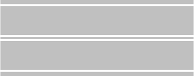
- **📖 الترجمة السياقية:** لا يجوز تخطي الخط المزدوج في الشكل، ولكن يجوز السير مع ركوبه بالمركبة (stando a cavallo).
- **💡 الشرح والقاعدة المرورية:** خطأ (FALSO). السير راكباً الخط (a cavallo) ممنوع منعاً كلياً ومخالفة مرورية صريحة؛ والواجب هو السير داخل المسلك الأيمن دون وطء الخط.
- **⚠️ كشف الفخ:** فخ الامتحان: لا يجوز السير ركوباً فوق أي خط أرضي إطلاقاً.
- **🔑 الكلمات المفتاحية:** `{'it': 'circolare stando a cavallo', 'ar': 'السير راكباً فوق الخط (فخ)'}` | `{'it': 'divieto assoluto', 'ar': 'منع مطلق'}` | `{'it': 'falso', 'ar': 'خطأ'}`

---

**21.** Le strisce lungo il centro della carreggiata possono essere bianche o azzurre
- **الإجابة:** `FALSO ❌ (خطأ)`
- **📖 الترجمة السياقية:** يمكن أن تكون الخطوط على طول منتصف نهر الطريق بيضاء أو زرقاء سماوية (azzurre).
- **💡 الشرح والقاعدة المرورية:** خطأ (FALSO). خطوط فصل المسالك واتجاهات السير في منتصف الطريق بيضاء دائماً (أو صفراء في الورش المؤقتة)، بينما الخطوط الزرقاء مخصصة فقط لمواقف السيارات مدفوعة الأجر.
- **⚠️ كشف الفخ:** فخ الامتحان: اللون الأزرق خاص بمواقف السيارات بالأجر ولا يُستخدم لخطوط منتصف الطريق.
- **🔑 الكلمات المفتاحية:** `{'it': 'bianche o azzurre', 'ar': 'بيضاء أو زرقاء (فخ)'}` | `{'it': 'striscia centrale bianca', 'ar': 'الخط الأوسط أبيض دائماً'}` | `{'it': 'falso', 'ar': 'خطأ'}`

---

**22.** La striscia discontinua in figura può essere sostituita con alcuni "chiodi" o catadiottri, messi a distanza di 50 centimetri
- **الإجابة:** `FALSO ❌ (خطأ)`
- 
- **📖 الترجمة السياقية:** يمكن استبدال الخط المتقطع الموضح في الشكل ببعض 'المسامير' أو العواكس المثبتة على مسافة 50 سنتيمتراً.
- **💡 الشرح والقاعدة المرورية:** خطأ (FALSO). المسامير الطرقية والعواكس الفردية ليست بديلاً نظامياً عن رسم الخطوط الأرضية الطولية في كود السير الحالي.
- **⚠️ كشف الفخ:** فخ الامتحان: المسامير ليست بديلاً للخطوط المتقطعة.
- **🔑 الكلمات المفتاحية:** `{'it': 'sostituita con chiodi o catadiottri', 'ar': 'استبداله بمسامير أو عواكس (فخ)'}` | `{'it': 'norme Cds', 'ar': 'قواعد قانون السير'}` | `{'it': 'falso', 'ar': 'خطأ'}`

---

**23.** La striscia di mezzo in figura non consente il sorpasso in ogni caso
- **الإجابة:** `FALSO ❌ (خطأ)`
- 
- **📖 الترجمة السياقية:** لا يسمح الخط الأوسط الموضح في الشكل بالتجاوز في جميع الأحوال (in ogni caso).
- **💡 الشرح والقاعدة المرورية:** خطأ (FALSO). التجاوز مسموح به إذا تم دون تخطي الخط أو إذا كان الخط متقطعاً وتوفرت شروط الأمان؛ وكلمة 'in ogni caso' باطلة.
- **⚠️ كشف الفخ:** فخ الامتحان: وجود الخط لا يلغي التجاوز كلياً في كل الحالات (مثلاً تجاوز دراجة دون لمس الخط).
- **🔑 الكلمات المفتاحية:** `{'it': 'non consente il sorpasso in ogni caso', 'ar': 'لا يسمح بالتجاوز في كل الحالات (فخ)'}` | `{'it': 'consentito senza superare', 'ar': 'مسموح دون تخطي الخط'}` | `{'it': 'falso', 'ar': 'خطأ'}`

---

## 📌 Doppia striscia continua (10 domande)

**24.** La doppia striscia continua in figura serve a dividere i sensi di marcia, sulle strade a doppio senso di circolazione
- **الإجابة:** `VERO ✅ (صح)`
- 
- **📖 الترجمة السياقية:** يُستخدم الخط المزدوج المتصل الموضح في الشكل لفصل اتجاهي السير في الطرق ذات الاتجاهين.
- **💡 الشرح والقاعدة المرورية:** صحيح (VERO). الخطان المتصلان المتوازيان يوضعان في الطرق العريضة ذات الاتجاهين لفصل حركة المرور المتعاكسة بصرامة.
- **⚠️ كشف الفخ:** فخ الامتحان: الخط المزدوج المتصل يوضع حصراً في الطرق ذات الاتجاهين لفصل السير المزدوج.
- **🔑 الكلمات المفتاحية:** `{'it': 'doppia striscia continua', 'ar': 'خط مزدوج متصل'}` | `{'it': 'dividere i sensi di marcia', 'ar': 'فصل اتجاهي السير'}` | `{'it': 'strade a doppio senso', 'ar': 'طرق ذات اتجاهين'}` | `{'it': 'vero', 'ar': 'صحيح'}`

---

**25.** La doppia striscia continua in figura non può essere superata
- **الإجابة:** `VERO ✅ (صح)`
- 
- **📖 الترجمة السياقية:** لا يجوز تخطي الخط المزدوج المتصل الموضح في الشكل.
- **💡 الشرح والقاعدة المرورية:** صحيح (VERO). الخط المزدوج المتصل يمنع التخطي والاجتياز منعاً مطلقاً وصارماً، ولا يجوز ملامسته بأي جزء من عجلات المركبة.
- **⚠️ كشف الفخ:** فخ الامتحان: الخط المزدوج المتصل لا يجوز تخطيه نهائياً (non può essere superata).
- **🔑 الكلمات المفتاحية:** `{'it': 'non può essere superata', 'ar': 'لا يجوز تخطيه'}` | `{'it': 'doppia striscia', 'ar': 'خط مزدوج'}` | `{'it': 'vero', 'ar': 'صحيح'}`

---

**26.** La doppia striscia continua in figura permette il sorpasso, se consentito, senza superarla
- **الإجابة:** `VERO ✅ (صح)`
- 
- **📖 الترجمة السياقية:** يسمح الخط المزدوج المتصل الموضح في الشكل بالتجاوز، إذا كان مسموحاً، دون تخطيه.
- **💡 الشرح والقاعدة المرورية:** صحيح (VERO). إذا اتسع المسلك لتجاوز مركبة بطيئة أو دراجة دون تجاوز أو ملامسة الخط المزدوج ودون خطر، فالمناورة مسموحة قانوناً.
- **⚠️ كشف الفخ:** فخ الامتحان: التجاوز مسموح بشرط عدم تخطي الخط المزدوج (senza superarla).
- **🔑 الكلمات المفتاحية:** `{'it': 'permette il sorpasso senza superarla', 'ar': 'يسمح بالتجاوز دون تخطيه'}` | `{'it': 'spazio sufficiente', 'ar': 'مساحة كافية'}` | `{'it': 'vero', 'ar': 'صحيح'}`

---

**27.** La doppia striscia continua in figura non consente l'inversione del senso di marcia
- **الإجابة:** `VERO ✅ (صح)`
- 
- **📖 الترجمة السياقية:** لا يسمح الخط المزدوج المتصل الموضح في الشكل بالدوران للخلف (inversione del senso di marcia).
- **💡 الشرح والقاعدة المرورية:** صحيح (VERO). الدوران للخلف (U-turn) فوق الخط المزدوج المتصل محظور تماماً ومخالفة جسيمة لأن ذلك يتطلب اجتياز خطين متصلين.
- **⚠️ كشف الفخ:** فخ الامتحان: الدوران للخلف ممنوع منعاً باتاً عبر الخط المزدوج المتصل.
- **🔑 الكلمات المفتاحية:** `{'it': "non consente l'inversione", 'ar': 'لا يسمح بالدوران للخلف'}` | `{'it': 'divieto di inversione', 'ar': 'منع الدوران للخلف'}` | `{'it': 'vero', 'ar': 'صحيح'}`

---

**28.** La doppia striscia continua in figura non consente di svoltare a sinistra
- **الإجابة:** `VERO ✅ (صح)`
- 
- **📖 الترجمة السياقية:** لا يسمح الخط المزدوج المتصل الموضح في الشكل بالانعطاف إلى اليسار.
- **💡 الشرح والقاعدة المرورية:** صحيح (VERO). يُمنع قطع الخط المزدوج المتصل للانعطاف يساراً للدخول إلى الشوارع أو العقارات الجانبية؛ ويجب الاستمرار للأمام حتى التقاطع المسموح.
- **⚠️ كشف الفخ:** فخ الامتحان: الانعطاف لليسار محظور عبر الخط المزدوج المتصل.
- **🔑 الكلمات المفتاحية:** `{'it': 'non consente di svoltare a sinistra', 'ar': 'لا يسمح بالانعطاف يساراً'}` | `{'it': 'doppia continua', 'ar': 'مزدوج متصل'}` | `{'it': 'vero', 'ar': 'صحيح'}`

---

**29.** La doppia striscia continua in figura si può trovare ai bordi della strada, per segnalare i margini
- **الإجابة:** `FALSO ❌ (خطأ)`
- 
- **📖 الترجمة السياقية:** يمكن أن يتواجد الخط المزدوج المتصل الموضح في الشكل عند حواف الطريق لتحديد الحافة والكتف.
- **💡 الشرح والقاعدة المرورية:** خطأ (FALSO). حواف وأطراف الطريق تحدد بخط متصل مفرد (أو متقطع عند المداخل) ولا تُستخدم خطوط مزدوجة على حواف الطريق.
- **⚠️ كشف الفخ:** فخ الامتحان: الخط المزدوج يوضع في منتصف الطريق فقط وليس عند الحواف (bordi della strada).
- **🔑 الكلمات المفتاحية:** `{'it': 'ai bordi della strada', 'ar': 'عند حواف الطريق (فخ)'}` | `{'it': 'segnalare i margini', 'ar': 'تحديد الحواف'}` | `{'it': 'falso', 'ar': 'خطأ'}`

---

**30.** La doppia striscia continua in figura indica che si può viaggiare per file parallele
- **الإجابة:** `FALSO ❌ (خطأ)`
- 
- **📖 الترجمة السياقية:** يشير الخط المزدوج المتصل الموضح في الشكل إلى إمكانية السير في صفوف متوازية (file parallele).
- **💡 الشرح والقاعدة المرورية:** خطأ (FALSO). الخط المزدوج يفصل اتجاهين متعاكسين؛ والسير في صفوف متوازية ينظمه وجود مسالك متعددة في نفس الاتجاه تحددها خطوط طولية عادية.
- **⚠️ كشف الفخ:** فخ الامتحان: الخط المزدوج يفصل اتجاهين متعاكسين ولا يعني السير في صفوف متوازية.
- **🔑 الكلمات المفتاحية:** `{'it': 'viaggiare per file parallele', 'ar': 'السير في صفوف متوازية (فخ)'}` | `{'it': 'divisione dei sensi', 'ar': 'فصل الاتجاهين'}` | `{'it': 'falso', 'ar': 'خطأ'}`

---

**31.** La doppia striscia continua in figura indica il punto in cui i conducenti si debbono arrestare per la presenza del segnale di STOP
- **الإجابة:** `FALSO ❌ (خطأ)`
- 
- **📖 الترجمة السياقية:** يشير الخط المزدوج المتصل الموضح في الشكل إلى النقطة التي يجب على السائقين التوقف عندها بسبب وجود إشارة قف (STOP).
- **💡 الشرح والقاعدة المرورية:** خطأ (FALSO). نقطة التوقف لإشارة STOP يحددها خط عرضي متصل عريض (striscia trasversale d'arresto) وليس خطوط طولية مزدوجة.
- **⚠️ كشف الفخ:** فخ الامتحان: خط التوقف لإشارة قف هو خط عرضي وليس خطاً طولياً مزدوجاً.
- **🔑 الكلمات المفتاحية:** `{'it': 'arrestarsi per segnale di STOP', 'ar': 'التوقف لإشارة قف (فخ)'}` | `{'it': 'striscia trasversale', 'ar': 'خط عرضي'}` | `{'it': 'falso', 'ar': 'خطأ'}`

---

**32.** La doppia striscia continua in figura è di colore azzurro nei parcheggi a pagamento
- **الإجابة:** `FALSO ❌ (خطأ)`
- 
- **📖 الترجمة السياقية:** يكون الخط المزدوج المتصل الموضح في الشكل أزرق اللون في مواقف السيارات مدفوعة الأجر.
- **💡 الشرح والقاعدة المرورية:** خطأ (FALSO). مواقف السيارات ترسم بخطوط مفردة تحدد أماكن التوقف (stalli di sosta)، ولا ترسم بخط مزدوج متصل أزرق.
- **⚠️ كشف الفخ:** فخ الامتحان: لا يوجد خط مزدوج متصل أزرق لمواقف السيارات.
- **🔑 الكلمات المفتاحية:** `{'it': 'colore azzurro nei parcheggi', 'ar': 'أزرق في المواقف (فخ)'}` | `{'it': 'stalli di sosta', 'ar': 'أماكن وقوف السيارات'}` | `{'it': 'falso', 'ar': 'خطأ'}`

---

**33.** La doppia striscia continua in figura può essere superata
- **الإجابة:** `FALSO ❌ (خطأ)`
- 
- **📖 الترجمة السياقية:** يجوز تخطي الخط المزدوج المتصل الموضح في الشكل.
- **💡 الشرح والقاعدة المرورية:** خطأ (FALSO). تخطي الخط المزدوج المتصل محظور منعاً باتاً ومطلقاً ويعاقب عليه كود السير بأشد العقوبات وسحب النقاط.
- **⚠️ كشف الفخ:** فخ الامتحان: كلمة 'può essere superata' تناقض المعنى الأساسي للخط المزدوج المتصل.
- **🔑 الكلمات المفتاحية:** `{'it': 'può essere superata', 'ar': 'يجوز تخطيه (فخ باطل)'}` | `{'it': 'invalicabile', 'ar': 'لا يجوز اجتيازه'}` | `{'it': 'falso', 'ar': 'خطأ'}`

---

## 📌 Strisce curve discontinue (7 domande)

**34.** Le strisce di guida in figura, sono strisce curve discontinue (tratteggiate) di colore bianco
- **الإجابة:** `VERO ✅ (صح)`
- 
- **📖 الترجمة السياقية:** خطوط التوجيه والإرشاد في الشكل هي خطوط منحنية متقطعة بيضاء اللون.
- **💡 الشرح والقاعدة المرورية:** صحيح (VERO). خطوط التوجيه (strisce di guida) هي خطوط بيضاء منحنية متقطعة ترسم داخل التقاطعات لمساعدة السائقين على اتخاذ المسار المنحني الصحيح.
- **⚠️ كشف الفخ:** فخ الامتحان: خطوط التوجيه بيضاء ومنحنية ومتقطعة (curve discontinue bianche).
- **🔑 الكلمات المفتاحية:** `{'it': 'strisce di guida', 'ar': 'خطوط التوجيه والإرشاد'}` | `{'it': 'curve discontinue di colore bianco', 'ar': 'منحنية متقطعة بيضاء'}` | `{'it': 'vero', 'ar': 'صحيح'}`

---

**35.** Le strisce di guida in figura, di norma, si trovano dove la svolta a sinistra si effettua lasciando alla nostra destra il centro dell'incrocio
- **الإجابة:** `VERO ✅ (صح)`
- 
- **📖 الترجمة السياقية:** تتواجد خطوط التوجيه في الشكل، كقاعدة عامة، حيث يتم الانعطاف لليسار بترك مركز التقاطع على يميننا.
- **💡 الشرح والقاعدة المرورية:** صحيح (VERO). القاعدة الإيطالية للانعطاف لليسار هي ترك مركز التقاطع على اليمين (svolta a sinistra lasciando il centro alla nostra destra)، وترشد هذه الخطوط السائق للقيام بذلك.
- **⚠️ كشف الفخ:** فخ الامتحان: الانعطاف لليسار يتم بترك مركز التقاطع على اليمين (alla nostra destra).
- **🔑 الكلمات المفتاحية:** `{'it': 'lasciando alla nostra destra il centro', 'ar': 'ترك مركز التقاطع على يميننا'}` | `{'it': 'svolta a sinistra', 'ar': 'الانعطاف يساراً'}` | `{'it': 'vero', 'ar': 'صحيح'}`

---

**36.** Le strisce di guida in figura debbono essere lasciate alla sinistra del veicolo quando si svolta a sinistra
- **الإجابة:** `VERO ✅ (صح)`
- 
- **📖 الترجمة السياقية:** يجب ترك خطوط التوجيه في الشكل على يسار المركبة عند الانعطاف إلى اليسار.
- **💡 الشرح والقاعدة المرورية:** صحيح (VERO). عند الانعطاف لليسار، تسير المركبة بمحاذاة القوس بحيث تظل الخطوط المتقطعة على يسار السائق (alla sinistra del veicolo).
- **⚠️ كشف الفخ:** فخ الامتحان: السائق يقود والخطوط المنحنية تقع مباشرة على يساره.
- **🔑 الكلمات المفتاحية:** `{'it': 'lasciate alla sinistra del veicolo', 'ar': 'تُترك على يسار المركبة'}` | `{'it': 'traiettoria corretta', 'ar': 'المسار الصحيح'}` | `{'it': 'vero', 'ar': 'صحيح'}`

---

**37.** Le strisce di guida in figura servono ad effettuare la svolta in modo corretto, senza prendere contro mano la strada di sinistra
- **الإجابة:** `VERO ✅ (صح)`
- 
- **📖 الترجمة السياقية:** تُستخدم خطوط التوجيه في الشكل للقيام بمناورة الانعطاف بطريقة صحيحة دون الدخول في الاتجاه المعاكس للشارع الأيسر.
- **💡 الشرح والقاعدة المرورية:** صحيح (VERO). الهدف من خطوط الإرشاد المنحنية هو حماية السائق من الانعطاف المبكر أو الخاطئ الذي يوقعه في المسار المعاكس (contromano) للشارع الجديد.
- **⚠️ كشف الفخ:** فخ الامتحان: خطوط التوجيه تمنع الدخول في عكس الاتجاه (senza prendere contromano).
- **🔑 الكلمات المفتاحية:** `{'it': 'senza prendere contromano', 'ar': 'دون الدخول في عكس الاتجاه'}` | `{'it': 'svolta corretta', 'ar': 'انعطاف سليم'}` | `{'it': 'vero', 'ar': 'صحيح'}`

---

**38.** Le strisce di guida in figura debbono essere lasciate sempre alla destra del veicolo quando si svolta a destra
- **الإجابة:** `FALSO ❌ (خطأ)`
- 
- **📖 الترجمة السياقية:** يجب ترك خطوط التوجيه في الشكل دائماً على يمين المركبة عند الانعطاف إلى اليمين.
- **💡 الشرح والقاعدة المرورية:** خطأ (FALSO). خطوط التوجيه المنحنية هذه مخصصة لمناورة الانعطاف لليسار وليس للانعطاف لليمين.
- **⚠️ كشف الفخ:** فخ الامتحان: هذه الخطوط ترشد المنعطفين لليسار فقط وليس لليمين.
- **🔑 الكلمات المفتاحية:** `{'it': 'quando si svolta a destra', 'ar': 'عند الانعطاف يميناً (فخ)'}` | `{'it': 'solo svolta a sinistra', 'ar': 'فقط للانعطاف يساراً'}` | `{'it': 'falso', 'ar': 'خطأ'}`

---

**39.** Le strisce di guida in figura non possono essere superate dai veicoli che proseguono diritto
- **الإجابة:** `FALSO ❌ (خطأ)`
- 
- **📖 الترجمة السياقية:** لا يجوز للمركبات التي تواصل السير للأمام مباشرة تخطي خطوط التوجيه في الشكل.
- **💡 الشرح والقاعدة المرورية:** خطأ (FALSO). بما أنها خطوط متقطعة (discontinue)، فيجوز للمركبات المتجهة للأمام مباشرة اجتيازها وتخطيها بحرية وأمان.
- **⚠️ كشف الفخ:** فخ الامتحان: خطوط التوجيه متقطعة ويجوز لمن يتابع السير للأمام تخطيها.
- **🔑 الكلمات المفتاحية:** `{'it': 'non possono essere superate da chi va diritto', 'ar': 'لا يجوز تخطيها لمن يتابع للأمام (فخ)'}` | `{'it': 'sono discontinue', 'ar': 'هي متقطعة'}` | `{'it': 'falso', 'ar': 'خطأ'}`

---

**40.** Le strisce di guida in figura delimitano un'isola di traffico
- **الإجابة:** `FALSO ❌ (خطأ)`
- 
- **📖 الترجمة السياقية:** تحدد خطوط التوجيه في الشكل جزيرة مرورية (isola di traffico).
- **💡 الشرح والقاعدة المرورية:** خطأ (FALSO). الجزيرة المرورية ترسم بخطوط بيضاء متصلة وخطوط مائلة مقلمة (righe oblique)، بينما هذه خطوط توجيه مسار متقطعة.
- **⚠️ كشف الفخ:** فخ الامتحان: الخلط بين خطوط توجيه المسار والجزيرة المرورية المحظورة.
- **🔑 الكلمات المفتاحية:** `{'it': "delimitano un'isola di traffico", 'ar': 'تحدد جزيرة مرورية (فخ)'}` | `{'it': 'strisce di guida', 'ar': 'خطوط توجيه'}` | `{'it': 'falso', 'ar': 'خطأ'}`

---

## 📌 Frecce direzionali (13 domande)

**41.** Le frecce direzionali in figura si trovano all'interno delle corsie, prima di un incrocio
- **الإجابة:** `VERO ✅ (صح)`
- 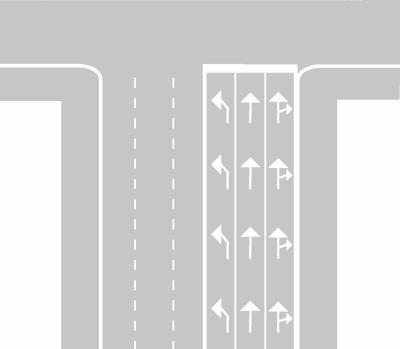
- **📖 الترجمة السياقية:** تتواجد الأسهم التوجيهية في الشكل داخل المسالك قبل التقاطع.
- **💡 الشرح والقاعدة المرورية:** صحيح (VERO). الأسهم التوجيهية المرسومة على الأسفلت (frecce direzionali) توضع داخل مسالك ما قبل التقاطع لتوجيه السائقين واختيار المسلك الصحيح.
- **⚠️ كشف الفخ:** فخ الامتحان: موضع الأسهم التوجيهية داخل المسالك قبل التقاطعات (prima di un incrocio).
- **🔑 الكلمات المفتاحية:** `{'it': "all'interno delle corsie", 'ar': 'داخل المسالك'}` | `{'it': 'prima di un incrocio', 'ar': 'قبل التقاطع'}` | `{'it': 'frecce direzionali', 'ar': 'أسهم توجيهية'}` | `{'it': 'vero', 'ar': 'صحيح'}`

---

**42.** Le frecce direzionali in figura indicano ai conducenti le direzioni consentite all'incrocio
- **الإجابة:** `VERO ✅ (صح)`
- 
- **📖 الترجمة السياقية:** تشير الأسهم التوجيهية في الشكل للسائقين إلى الاتجاهات المسموح بها عند التقاطع.
- **💡 الشرح والقاعدة المرورية:** صحيح (VERO). كل سهم يوضح المناورات الجائزة قانوناً من ذلك المسلك (للأمام، لليمين، أو لليسار).
- **⚠️ كشف الفخ:** فخ الامتحان: الأسهم توضح الاتجاهات المسموح بها في التقاطع.
- **🔑 الكلمات المفتاحية:** `{'it': 'direzioni consentite', 'ar': 'الاتجاهات المسموح بها'}` | `{'it': "all'incrocio", 'ar': 'عند التقاطع'}` | `{'it': 'vero', 'ar': 'صحيح'}`

---

**43.** Le frecce direzionali in figura consentono di immettersi nella corsia scelta quando le strisce sono ancora discontinue (tratteggiate)
- **الإجابة:** `VERO ✅ (صح)`
- 
- **📖 الترجمة السياقية:** تسمح الأسهم التوجيهية في الشكل بالدخول في المسلك المختار عندما تكون الخطوط لا تزال متقطعة.
- **💡 الشرح والقاعدة المرورية:** صحيح (VERO). ما دامت الخطوط الفاصلة بين المسالك متقطعة، يحق للسائق تغيير المسلك والانتقال إلى المسلك الذي يطابق وجهته المرغوبة.
- **⚠️ كشف الفخ:** فخ الامتحان: تغيير المسلك جائز فقط عندما تكون الخطوط متقطعة (quando le strisce sono discontinue).
- **🔑 الكلمات المفتاحية:** `{'it': 'immettersi nella corsia scelta', 'ar': 'الدخول في المسلك المختار'}` | `{'it': 'strisce discontinue', 'ar': 'خطوط متقطعة'}` | `{'it': 'vero', 'ar': 'صحيح'}`

---

**44.** Le frecce direzionali in figura obbligano a seguire la direzione indicata se le strisce di corsia sono continue
- **الإجابة:** `VERO ✅ (صح)`
- 
- **📖 الترجمة السياقية:** تلزم الأسهم التوجيهية في الشكل باتباع الاتجاه الموضح إذا أصبحت خطوط المسالك متصلة.
- **💡 الشرح والقاعدة المرورية:** صحيح (VERO). بمجرد تحول الخطوط المتقطعة إلى خطوط متصلة في نهاية مسلك الاختيار، يصبح السائق مجبراً قانوناً على اتباع الاتجاه الذي يشير إليه سهم مسلكه.
- **⚠️ كشف الفخ:** فخ الامتحان: الخط المتصل يحبس السائق في اتجاه السهم (obbligano a seguire la direzione).
- **🔑 الكلمات المفتاحية:** `{'it': 'obbligano a seguire la direzione', 'ar': 'تلزم باتباع الاتجاه الموضح'}` | `{'it': 'strisce continue', 'ar': 'خطوط متصلة'}` | `{'it': 'vero', 'ar': 'صحيح'}`

---

**45.** Le frecce direzionali in figura sono a freccia combinata diritta-destra per corsie destinate a chi deve proseguire diritto o a destra
- **الإجابة:** `VERO ✅ (صح)`
- 
- **📖 الترجمة السياقية:** الأسهم التوجيهية في الشكل هي أسهم مدمجة (مستقيم - يمين) للمسالك المخصصة لمن يجب عليه متابعة السير للأمام أو لليمين.
- **💡 الشرح والقاعدة المرورية:** صحيح (VERO). السهم المزدوج برأسين يتيح للسائق في هذا المسلك حرية الاختيار بين مواصلة السير للأمام مباشرة أو الانعطاف لليمين.
- **⚠️ كشف الفخ:** فخ الامتحان: السهم المدمج يجمع بين خيارين متاحين لنفس المسلك.
- **🔑 الكلمات المفتاحية:** `{'it': 'freccia combinata diritta-destra', 'ar': 'سهم مدمج مستقيم ويمين'}` | `{'it': 'diritto o a destra', 'ar': 'للأمام أو لليمين'}` | `{'it': 'vero', 'ar': 'صحيح'}`

---

**46.** Le frecce direzionali in figura possono essere completate da scritte sulla pavimentazione che indicano la località raggiungibile
- **الإجابة:** `VERO ✅ (صح)`
- 
- **📖 الترجمة السياقية:** يمكن استكمال الأسهم التوجيهية في الشكل بكتابات على الأسفلت تشير إلى المدينة أو الوجهة المقصودة.
- **💡 الشرح والقاعدة المرورية:** صحيح (VERO). يجوز كتابة أسماء المدن أو المناطق (مثل MILANO، ROMA، CENTRO) على أرضية المسلك بجوار السهم لمساعدة السائقين في اختيار المسلك المناسب.
- **⚠️ كشف الفخ:** فخ الامتحان: نعم، يمكن كتابة أسماء المدن والوجهات على الإسفلت (scritte sulla pavimentazione).
- **🔑 الكلمات المفتاحية:** `{'it': 'scritte sulla pavimentazione', 'ar': 'كتابات على الأسفلت'}` | `{'it': 'località raggiungibile', 'ar': 'الوجهة المقصودة'}` | `{'it': 'vero', 'ar': 'صحيح'}`

---

**47.** Le frecce direzionali in figura segnalano le direzioni permesse
- **الإجابة:** `VERO ✅ (صح)`
- 
- **📖 الترجمة السياقية:** تشير الأسهم التوجيهية في الشكل إلى الاتجاهات المسموح بها.
- **💡 الشرح والقاعدة المرورية:** صحيح (VERO). وظيفة الأسهم الأرضية الأساسية هي الإعلام والترسيم الواضح للاتجاهات والمناورات المسموحة لكل مسلك.
- **⚠️ كشف الفخ:** فخ الامتحان: الأسهم توضح الاتجاهات المسموحة (segnalano le direzioni permesse).
- **🔑 الكلمات المفتاحية:** `{'it': 'direzioni permesse', 'ar': 'الاتجاهات المسموح بها'}` | `{'it': 'segnalano', 'ar': 'تشير إلى'}` | `{'it': 'vero', 'ar': 'صحيح'}`

---

**48.** Le frecce direzionali in figura obbligano a seguire la direzione indicata, anche se le strisce di corsia sono discontinue (tratteggiate)
- **الإجابة:** `FALSO ❌ (خطأ)`
- 
- **📖 الترجمة السياقية:** تلزم الأسهم التوجيهية في الشكل باتباع الاتجاه الموضح حتى لو كانت خطوط المسالك متقطعة.
- **💡 الشرح والقاعدة المرورية:** خطأ (FALSO). إذا كانت الخطوط لا تزال متقطعة، يجوز للسائق تغيير رأيه والانتقال بحذر إلى مسلك آخر؛ والإلزام الصارم لا يبدأ إلا مع الخط المتصل.
- **⚠️ كشف الفخ:** فخ الامتحان: لا إلزام باتجاه السهم ما دامت الخطوط متقطعة.
- **🔑 الكلمات المفتاحية:** `{'it': 'anche se le strisce sono discontinue', 'ar': 'حتى والخطوط متقطعة (فخ)'}` | `{'it': 'libertà di cambiare', 'ar': 'حرية التغيير'}` | `{'it': 'falso', 'ar': 'خطأ'}`

---

**49.** Le frecce direzionali in figura indicano che si è vicino ad una corsia per la sosta d'emergenza
- **الإجابة:** `FALSO ❌ (خطأ)`
- 
- **📖 الترجمة السياقية:** تشير الأسهم التوجيهية في الشكل إلى الاقتراب من مسلك التوقف الاضطراري (corsia per la sosta d'emergenza).
- **💡 الشرح والقاعدة المرورية:** خطأ (FALSO). هذه أسهم اختيار المسالك للتقاطعات، ولا علاقة لها بمسالك الطوارئ على الطرق السريعة.
- **⚠️ كشف الفخ:** فخ الامتحان: الأسهم للتقاطعات وليست لمسلك الطوارئ.
- **🔑 الكلمات المفتاحية:** `{'it': "sosta d'emergenza", 'ar': 'التوقف الاضطراري'}` | `{'it': 'corsie di preselezione', 'ar': 'مسالك الاختيار المسبق'}` | `{'it': 'falso', 'ar': 'خطأ'}`

---

**50.** Le frecce direzionali in figura ci consentono di cambiare corsia se le strisce sono continue
- **الإجابة:** `FALSO ❌ (خطأ)`
- 
- **📖 الترجمة السياقية:** تسمح الأسهم التوجيهية في الشكل بتغيير المسلك إذا كانت الخطوط متصلة.
- **💡 الشرح والقاعدة المرورية:** خطأ (FALSO). بمجرد أن تصبح الخطوط متصلة، يُمنع منعاً باتاً تغيير المسلك أو تخطي الخط المتصل، ويجب الالتزام باتجاه السهم الحالي.
- **⚠️ كشف الفخ:** فخ الامتحان: الخط المتصل يمنع تغيير المسلك تماماً.
- **🔑 الكلمات المفتاحية:** `{'it': 'consento di cambiare corsia se continue', 'ar': 'تسمح بتغيير المسلك مع خط متصل (فخ)'}` | `{'it': 'vietato cambiare', 'ar': 'ممنوع التغيير'}` | `{'it': 'falso', 'ar': 'خطأ'}`

---

**51.** Le frecce direzionali in figura sono di colore azzurro per indicare un parcheggio a pagamento
- **الإجابة:** `FALSO ❌ (خطأ)`
- 
- **📖 الترجمة السياقية:** تكون الأسهم التوجيهية في الشكل زرقاء اللون للإشارة إلى موقف سيارات مدفوع الأجر.
- **💡 الشرح والقاعدة المرورية:** خطأ (FALSO). الأسهم التوجيهية بيضاء اللون دائماً، ولا توجد أسهم توجيهية زرقاء لمواقف السيارات.
- **⚠️ كشف الفخ:** فخ الامتحان: اللون الأزرق لمواقف السيارات المدفوعة فقط ولا ينطبق على أسهم المسالك.
- **🔑 الكلمات المفتاحية:** `{'it': 'colore azzurro', 'ar': 'لون أزرق (فخ)'}` | `{'it': 'frecce bianche', 'ar': 'أسهم بيضاء'}` | `{'it': 'falso', 'ar': 'خطأ'}`

---

**52.** Le frecce direzionali in figura sono di colore giallo nelle strade dove è vietata la sosta
- **الإجابة:** `FALSO ❌ (خطأ)`
- 
- **📖 الترجمة السياقية:** تكون الأسهم التوجيهية في الشكل صفراء اللون في الشوارع التي يُمنع فيها الوقوف (divieto di sosta).
- **💡 الشرح والقاعدة المرورية:** خطأ (FALSO). الأسهم التوجيهية بيضاء دائماً، واللون الأصفر يُستخدم فقط في ورش الأشغال المؤقتة أو لمسارات الحافلات أو خطوط ذوي الاحتياجات الخاصة.
- **⚠️ كشف الفخ:** فخ الامتحان: منع الوقوف لا يغير لون الأسهم التوجيهية إلى الأصفر.
- **🔑 الكلمات المفتاحية:** `{'it': 'colore giallo per divieto di sosta', 'ar': 'لون أصفر لمنع الوقوف (فخ)'}` | `{'it': 'frecce ordinarie bianche', 'ar': 'أسهم بيضاء عادية'}` | `{'it': 'falso', 'ar': 'خطأ'}`

---

**53.** Le frecce direzionali in figura sono di colore blu nelle autostrade
- **الإجابة:** `FALSO ❌ (خطأ)`
- 
- **📖 الترجمة السياقية:** تكون الأسهم التوجيهية في الشكل زرقاء اللون على الطرق السريعة (autostrade).
- **💡 الشرح والقاعدة المرورية:** خطأ (FALSO). جميع التخطيطات الأرضية على الطرق السريعة بيضاء اللون بما في ذلك الأسهم والخطوط، واللون الأزرق مخصص للشاخصات الإرشادية وليس الطلاء الأرضي للمسالك.
- **⚠️ كشف الفخ:** فخ الامتحان: التخطيط الأرضي على الطرق السريعة أبيض وليس أزرق.
- **🔑 الكلمات المفتاحية:** `{'it': 'colore blu nelle autostrade', 'ar': 'لون أزرق على الأوتوستراد (فخ)'}` | `{'it': 'segnaletica orizzontale bianca', 'ar': 'تخطيط أرضي أبيض'}` | `{'it': 'falso', 'ar': 'خطأ'}`

---

## 📌 Isole traffico (12 domande)

**54.** L'isola di traffico in figura indica un tratto di strada vietato al transito ed alla sosta dei veicoli
- **الإجابة:** `VERO ✅ (صح)`
- 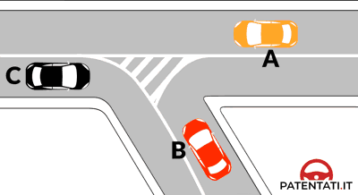
- **📖 الترجمة السياقية:** تشير الجزيرة المرورية في الشكل إلى مقطع من الطريق يُحظر فيه مرور وتوقف المركبات.
- **💡 الشرح والقاعدة المرورية:** صحيح (VERO). الجزيرة المرورية المخططة (isola di traffico a raso) هي مساحة محظورة ومحمية؛ يُمنع منعاً كلياً السير فوقها أو الدخول إليها أو الوقوف عليها.
- **⚠️ كشف الفخ:** فخ الامتحان: الجزيرة المرورية ممنوعة تماماً على السير والتوقف (vietato il transito ed alla sosta).
- **🔑 الكلمات المفتاحية:** `{'it': 'isola di traffico', 'ar': 'جزيرة مرورية'}` | `{'it': 'vietato il transito e la sosta', 'ar': 'ممنوع المرور والتوقف'}` | `{'it': 'vero', 'ar': 'صحيح'}`

---

**55.** L'isola di traffico in figura è realizzata con strisce bianche oblique
- **الإجابة:** `VERO ✅ (صح)`
- 
- **📖 الترجمة السياقية:** يتم إنشاء وتخطيط الجزيرة المرورية في الشكل بخطوط بيضاء مائلة (strisce bianche oblique).
- **💡 الشرح والقاعدة المرورية:** صحيح (VERO). التصميم الهندسي المعتمد للجزيرة المرورية المستوية هو إطار أبيض متصل بداخله أشرطة بيضاء مائلة (zebra/chevrons).
- **⚠️ كشف الفخ:** فخ الامتحان: الخطوط البيضاء المائلة هي السمة المميزة لرسم الجزيرة المرورية المستوية.
- **🔑 الكلمات المفتاحية:** `{'it': 'strisce bianche oblique', 'ar': 'خطوط بيضاء مائلة'}` | `{'it': 'isola a raso', 'ar': 'جزيرة مستوية'}` | `{'it': 'vero', 'ar': 'صحيح'}`

---

**56.** L'isola di traffico in figura indica una parte della strada su cui non si può circolare
- **الإجابة:** `VERO ✅ (صح)`
- 
- **📖 الترجمة السياقية:** تشير الجزيرة المرورية في الشكل إلى جزء من الطريق لا يجوز السير فوقه.
- **💡 الشرح والقاعدة المرورية:** صحيح (VERO). تُعتبر الجزيرة المرورية خارج حدود نهر السير المتاح، ولا يجوز لأي مركبة وطؤها أو السير عليها.
- **⚠️ كشف الفخ:** فخ الامتحان: لا يجوز السير فوق الجزيرة المرورية نهائياً (non si può circolare).
- **🔑 الكلمات المفتاحية:** `{'it': 'non si può circolare', 'ar': 'لا يجوز السير فوقها'}` | `{'it': 'parte vietata', 'ar': 'جزء محظور'}` | `{'it': 'vero', 'ar': 'صحيح'}`

---

**57.** In presenza dell'isola di traffico rappresentata in figura il veicolo C deve svoltare a destra
- **الإجابة:** `VERO ✅ (صح)`
- 
- **📖 الترجمة السياقية:** عند وجود الجزيرة المرورية الموضحة في الشكل، يجب على المركبة C الانعطاف إلى اليمين.
- **💡 الشرح والقاعدة المرورية:** صحيح (VERO). موقع المركبة C في المسلك الأيمن وتوجيهات الجزيرة المرورية تلزمها بالانعطاف يميناً في المسار المخصص لها.
- **⚠️ كشف الفخ:** فخ الامتحان: المركبة C ملزمة بالانعطاف يميناً حسب تصميم المسار والجزيرة.
- **🔑 الكلمات المفتاحية:** `{'it': 'veicolo C deve svoltare a destra', 'ar': 'المركبة C يجب أن تنعطف يميناً'}` | `{'it': 'traiettoria C', 'ar': 'مسار المركبة C'}` | `{'it': 'vero', 'ar': 'صحيح'}`

---

**58.** In presenza dell'isola di traffico rappresentata in figura il veicolo B deve svoltare a destra
- **الإجابة:** `VERO ✅ (صح)`
- 
- **📖 الترجمة السياقية:** عند وجود الجزيرة المرورية الموضحة في الشكل، يجب على المركبة B الانعطاف إلى اليمين.
- **💡 الشرح والقاعدة المرورية:** صحيح (VERO). قناة التوجيه والجزيرة المرورية ترسم مسار المركبة B وتلزمها بالانعطاف إلى اليمين وفق مخطط التقاطع.
- **⚠️ كشف الفخ:** فخ الامتحان: المركبة B تتبع القناة المخصصة للانعطاف يميناً.
- **🔑 الكلمات المفتاحية:** `{'it': 'veicolo B deve svoltare a destra', 'ar': 'المركبة B يجب أن تنعطف يميناً'}` | `{'it': 'canalizzazione', 'ar': 'قنوات التوجيه'}` | `{'it': 'vero', 'ar': 'صحيح'}`

---

**59.** In presenza dell'isola di traffico rappresentata in figura il veicolo A deve andare diritto
- **الإجابة:** `VERO ✅ (صح)`
- 
- **📖 الترجمة السياقية:** عند وجود الجزيرة المرورية الموضحة في الشكل، يجب على المركبة A متابعة السير للأمام مباشرة.
- **💡 الشرح والقاعدة المرورية:** صحيح (VERO). المسلك الخاص بالمركبة A مصمم لمتابعة السير المباشر للأمام وتفادي الجزيرة المرورية.
- **⚠️ كشف الفخ:** فخ الامتحان: المركبة A مسارها محدد للأمام مباشرة.
- **🔑 الكلمات المفتاحية:** `{'it': 'veicolo A deve andare diritto', 'ar': 'المركبة A يجب أن تسير للأمام'}` | `{'it': 'marcia rettilinea', 'ar': 'سير مستقيم'}` | `{'it': 'vero', 'ar': 'صحيح'}`

---

**60.** L'isola di traffico in figura può anche essere realizzata con strisce azzurre trasversali
- **الإجابة:** `FALSO ❌ (خطأ)`
- 
- **📖 الترجمة السياقية:** يمكن أيضاً تخطيط الجزيرة المرورية في الشكل بخطوط زرقاء عرضية.
- **💡 الشرح والقاعدة المرورية:** خطأ (FALSO). الجزيرة المرورية ترسم حصراً بخطوط بيضاء مائلة (أو صفراء في مناطق الأشغال)، ولا تُستخدم الخطوط الزرقاء إطلاقاً للجزر المرورية.
- **⚠️ كشف الفخ:** فخ الامتحان: الخطوط الزرقاء لا علاقة لها بالجزر المرورية.
- **🔑 الكلمات المفتاحية:** `{'it': 'strisce azzurre trasversali', 'ar': 'خطوط زرقاء عرضية (فخ)'}` | `{'it': 'strisce bianche oblique', 'ar': 'خطوط بيضاء مائلة'}` | `{'it': 'falso', 'ar': 'خطأ'}`

---

**61.** L'isola di traffico in figura indica una zona dove è possibile la sosta dei veicoli
- **الإجابة:** `FALSO ❌ (خطأ)`
- 
- **📖 الترجمة السياقية:** تشير الجزيرة المرورية في الشكل إلى منطقة يُتاح فيها توقف وركن المركبات (sosta dei veicoli).
- **💡 الشرح والقاعدة المرورية:** خطأ (FALSO). الجزيرة المرورية محظورة حظراً قاطعاً على السير والوقوف والتوقف بجميع أشكاله.
- **⚠️ كشف الفخ:** فخ الامتحان: الوقوف فوق الجزيرة المرورية ممنوع منعاً باتاً ومخالفة مرورية.
- **🔑 الكلمات المفتاحية:** `{'it': 'possibile la sosta', 'ar': 'الوقوف متاح (فخ)'}` | `{'it': 'divieto di sosta assoluto', 'ar': 'منع وقوف مطلق'}` | `{'it': 'falso', 'ar': 'خطأ'}`

---

**62.** L'isola di traffico in figura indica una parte della carreggiata sulla quale si può sostare solo per 30 minuti
- **الإجابة:** `FALSO ❌ (خطأ)`
- 
- **📖 الترجمة السياقية:** تشير الجزيرة المرورية في الشكل إلى جزء من نهر الطريق يُسمح بالوقوف عليه لمدة 30 دقيقة فقط.
- **💡 الشرح والقاعدة المرورية:** خطأ (FALSO). يُحظر الوقوف عليها ولو لدقيقة واحدة؛ فلا مجال لأي وقت محدد للوقوف فوق الجزيرة المرورية.
- **⚠️ كشف الفخ:** فخ الامتحان: مهلة الـ 30 دقيقة باطلة ومختلقة تماماً.
- **🔑 الكلمات المفتاحية:** `{'it': 'sostare solo per 30 minuti', 'ar': 'الوقوف لمدة 30 دقيقة فقط (فخ)'}` | `{'it': 'mai sostare', 'ar': 'لا وقوف إطلاقاً'}` | `{'it': 'falso', 'ar': 'خطأ'}`

---

**63.** In presenza dell'isola di traffico rappresentata in figura il veicolo C può andare in qualsiasi direzione
- **الإجابة:** `FALSO ❌ (خطأ)`
- 
- **📖 الترجمة السياقية:** عند وجود الجزيرة المرورية الموضحة في الشكل، يجوز للمركبة C السير في أي اتجاه.
- **💡 الشرح والقاعدة المرورية:** خطأ (FALSO). المركبة C مقيدة بمسارها وقناة السير المفروضة بالجزيرة وعليها الالتزام بالانعطاف يميناً ولا يحق لها السير في أي اتجاه.
- **⚠️ كشف الفخ:** فخ الامتحان: عبارة 'in qualsiasi direzione' خاطئة؛ فالمسار مقيد وموجه إجبارياً.
- **🔑 الكلمات المفتاحية:** `{'it': 'in qualsiasi direzione', 'ar': 'في أي اتجاه (فخ)'}` | `{'it': 'solo a destra', 'ar': 'فقط يميناً'}` | `{'it': 'falso', 'ar': 'خطأ'}`

---

**64.** In presenza dell'isola di traffico rappresentata in figura il veicolo B può svoltare a sinistra, dando la precedenza al veicolo A
- **الإجابة:** `FALSO ❌ (خطأ)`
- 
- **📖 الترجمة السياقية:** عند وجود الجزيرة المرورية الموضحة في الشكل، يجوز للمركبة B الانعطاف إلى اليسار مع إعطاء الأسبقية للمركبة A.
- **💡 الشرح والقاعدة المرورية:** خطأ (FALSO). التصميم الهندسي للتقاطع والجزيرة يمنع الانعطاف لليسار للمركبة B ويلزمها بالانعطاف يميناً.
- **⚠️ كشف الفخ:** فخ الامتحان: الانعطاف لليسار غير متاح للمركبة B حسب شكل الجزيرة وقنواتها.
- **🔑 الكلمات المفتاحية:** `{'it': 'veicolo B può svoltare a sinistra', 'ar': 'المركبة B يجوز لها الانعطاف يساراً (فخ)'}` | `{'it': 'obbligo svolta a destra', 'ar': 'وجوب الانعطاف يميناً'}` | `{'it': 'falso', 'ar': 'خطأ'}`

---

**65.** In presenza dell'isola di traffico rappresentata in figura il veicolo A può svoltare a sinistra, dando la precedenza al veicolo C
- **الإجابة:** `FALSO ❌ (خطأ)`
- 
- **📖 الترجمة السياقية:** عند وجود الجزيرة المرورية الموضحة في الشكل، يجوز للمركبة A الانعطاف إلى اليسار مع إعطاء الأسبقية للمركبة C.
- **💡 الشرح والقاعدة المرورية:** خطأ (FALSO). المركبة A ملزمة بالسير للأمام مباشرة ولا يجوز لها الانعطاف يساراً وقطع مسارات التقاطع والجزيرة.
- **⚠️ كشف الفخ:** فخ الامتحان: المركبة A مسارها محدد للأمام مباشرة ولا تنعطف يساراً.
- **🔑 الكلمات المفتاحية:** `{'it': 'veicolo A può svoltare a sinistra', 'ar': 'المركبة A يجوز لها الانعطاف يساراً (فخ)'}` | `{'it': 'solo diritto', 'ar': 'للأمام فقط'}` | `{'it': 'falso', 'ar': 'خطأ'}`

---

## 📌 Striscia continua (9 domande)

**66.** Rispetto al veicolo che procede nel senso della freccia, la striscia continua centrale in figura si trova prima di una curva
- **الإجابة:** `VERO ✅ (صح)`
- 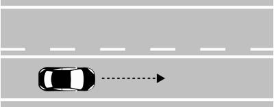
- **📖 الترجمة السياقية:** بالنسبة للمركبة التي تسير في اتجاه السهم، يتواجد الخط المتصل الأوسط في الشكل قبل المنعطف (curva).
- **💡 الشرح والقاعدة المرورية:** صحيح (VERO). الخط المتصل بجانب السائق يوضع قبل المنعطفات لحجب الرؤية ومنع التجاوز الخطير في الاتجاه الصاعد نحو المنعطف.
- **⚠️ كشف الفخ:** فخ الامتحان: الخط المتصل يوضع قبل المنعطف لمنع التجاوز عند انعدام الرؤية.
- **🔑 الكلمات المفتاحية:** `{'it': 'prima di una curva', 'ar': 'قبل المنعطف'}` | `{'it': 'striscia continua dal lato', 'ar': 'خط متصل من جانب المركبة'}` | `{'it': 'visibilità ridotta', 'ar': 'رؤية محدودة'}` | `{'it': 'vero', 'ar': 'صحيح'}`

---

**67.** Rispetto al veicolo che procede nel senso della freccia, la striscia continua centrale in figura si trova sul tratto in salita di un dosso
- **الإجابة:** `VERO ✅ (صح)`
- 
- **📖 الترجمة السياقية:** بالنسبة للمركبة التي تسير في اتجاه السهم، يتواجد الخط المتصل الأوسط في الشكل على المقطع الصاعد من التل المحدب (tratto in salita di un dosso).
- **💡 الشرح والقاعدة المرورية:** صحيح (VERO). في صعود التل المحدب تنعدم الرؤية تماماً، ولذلك يوضع الخط المتصل من جهة الصعود لمنع السائق من التجاوز واجتياز الخط.
- **⚠️ كشف الفخ:** فخ الامتحان: صعود التل المحدب (salita di un dosso) = خط متصل من جهتك لمنع التجاوز الخطير.
- **🔑 الكلمات المفتاحية:** `{'it': 'tratto in salita di un dosso', 'ar': 'المقطع الصاعد من التل المحدب'}` | `{'it': 'striscia continua', 'ar': 'خط متصل'}` | `{'it': 'vero', 'ar': 'صحيح'}`

---

**68.** Rispetto al veicolo che procede nel senso della freccia, la striscia continua centrale in figura si trova prima di un incrocio
- **الإجابة:** `VERO ✅ (صح)`
- 
- **📖 الترجمة السياقية:** بالنسبة للمركبة التي تسير في اتجاه السهم، يتواجد الخط المتصل الأوسط في الشكل قبل التقاطع (prima di un incrocio).
- **💡 الشرح والقاعدة المرورية:** صحيح (VERO). قبل الوصول إلى التقاطعات، يتحول الخط إلى متصل من جهة السير لتثبيت المسالك ومنع التجاوز والانعطافات العشوائية الخطرة.
- **⚠️ كشف الفخ:** فخ الامتحان: الخط المتصل يوضع قبل التقاطع لتنظيم المرور ومنع التجاوز.
- **🔑 الكلمات المفتاحية:** `{'it': 'prima di un incrocio', 'ar': 'قبل التقاطع'}` | `{'it': 'divieto di sorpasso', 'ar': 'منع التجاوز'}` | `{'it': 'vero', 'ar': 'صحيح'}`

---

**69.** Il veicolo in figura non può superare la striscia continua centrale
- **الإجابة:** `VERO ✅ (صح)`
- 
- **📖 الترجمة السياقية:** لا يجوز للمركبة في الشكل تخطي الخط المتصل الأوسط.
- **💡 الشرح والقاعدة المرورية:** صحيح (VERO). القاعدة الحاكمة للخطوط المزدوجة المتصلة/المتقطعة هي: السائق ملزم بالخط الأقرب لمسلكه؛ وبما أن الخط الأقرب متصل فيحظر تخطيه تماماً.
- **⚠️ كشف الفخ:** فخ الامتحان: الخط الأقرب هو المتصل، وبالتالي يُحظر التخطي كلياً لهذه المركبة.
- **🔑 الكلمات المفتاحية:** `{'it': 'non può superare', 'ar': 'لا يجوز لها تخطي'}` | `{'it': 'striscia continua', 'ar': 'خط متصل'}` | `{'it': 'regola della striscia vicina', 'ar': 'قاعدة الخط الأقرب'}` | `{'it': 'vero', 'ar': 'صحيح'}`

---

**70.** Rispetto al veicolo che procede nel senso della freccia, la striscia continua centrale in figura si trova, di norma, su strade a senso unico di circolazione
- **الإجابة:** `FALSO ❌ (خطأ)`
- 
- **📖 الترجمة السياقية:** بالنسبة للمركبة التي تسير في اتجاه السهم، يتواجد الخط المتصل الأوسط في الشكل، كقاعدة عامة، على الطرق ذات الاتجاه الواحد.
- **💡 الشرح والقاعدة المرورية:** خطأ (FALSO). الخطوط المتجاورة المتصلة والمتقطعة توضع على الطرق ذات الاتجاهين (doppio senso) لتنظيم الأسبقية والتجاوز بين الاتجاهين المتعاكسين.
- **⚠️ كشف الفخ:** فخ الامتحان: الخطان المتجاوران (متصل ومتقطع) يوضعان في الطرق ذات الاتجاهين وليس ذات الاتجاه الواحد.
- **🔑 الكلمات المفتاحية:** `{'it': 'strade a senso unico', 'ar': 'طرق ذات اتجاه واحد (فخ)'}` | `{'it': 'strade a doppio senso', 'ar': 'طرق ذات اتجاهين'}` | `{'it': 'falso', 'ar': 'خطأ'}`

---

**71.** Rispetto al veicolo che procede nel senso della freccia, la striscia continua centrale in figura si trova ogni volta che si supera il tratto in discesa di un dosso
- **الإجابة:** `FALSO ❌ (خطأ)`
- 
- **📖 الترجمة السياقية:** بالنسبة للمركبة التي تسير في اتجاه السهم، يتواجد الخط المتصل الأوسط في الشكل كلما تم تجاوز المقطع المنحدر من التل المحدب.
- **💡 الشرح والقاعدة المرورية:** خطأ (FALSO). في المقطع المنحدر (discesa) تنكشف الرؤية ويوضع خط متقطع من جهة النزول وليس خطاً متصلاً.
- **⚠️ كشف الفخ:** فخ الامتحان: المنحدر (discesa) يحمل خطاً متقطعاً لانكشاف الرؤية، بينما الصعود (salita) يحمل خطاً متصلاً.
- **🔑 الكلمات المفتاحية:** `{'it': 'tratto in discesa', 'ar': 'المقطع المنحدر (فخ)'}` | `{'it': 'tratto in salita', 'ar': 'المقطع الصاعد'}` | `{'it': 'falso', 'ar': 'خطأ'}`

---

**72.** Rispetto al veicolo che procede nel senso della freccia, la striscia continua centrale in figura si trova ogni volta che si supera un passaggio a livello
- **الإجابة:** `FALSO ❌ (خطأ)`
- 
- **📖 الترجمة السياقية:** بالنسبة للمركبة التي تسير في اتجاه السهم، يتواجد الخط المتصل الأوسط في الشكل كلما تم تجاوز تقاطع سكة حديد.
- **💡 الشرح والقاعدة المرورية:** خطأ (FALSO). بعد تجاوز المزلقان (dopo il passaggio a livello) تنكشف الرؤية ويوضع خط متقطع، بينما الخط المتصل يوضع قبله.
- **⚠️ كشف الفخ:** فخ الامتحان: الخط المتصل يوضع قبل تقاطع السكة الحديد وليس بعد تجاوزه.
- **🔑 الكلمات المفتاحية:** `{'it': 'ogni volta che si supera', 'ar': 'كلما تم تجاوز المزلقان (فخ)'}` | `{'it': 'dopo il passaggio', 'ar': 'بعد المزلقان خط متقطع'}` | `{'it': 'falso', 'ar': 'خطأ'}`

---

**73.** Rispetto al veicolo che procede nel senso della freccia, la striscia continua centrale in figura consente l'inversione del senso di marcia
- **الإجابة:** `FALSO ❌ (خطأ)`
- 
- **📖 الترجمة السياقية:** بالنسبة للمركبة التي تسير في اتجاه السهم، يسمح الخط المتصل الأوسط في الشكل بالدوران للخلف (inversione del senso di marcia).
- **💡 الشرح والقاعدة المرورية:** خطأ (FALSO). وجود الخط المتصل الأقرب يمنع منعاً باتاً تخطيه لأي سبب، بما في ذلك الدوران للخلف (inversione di marcia).
- **⚠️ كشف الفخ:** فخ الامتحان: الخط المتصل يمنع الدوران للخلف قطعاً.
- **🔑 الكلمات المفتاحية:** `{'it': "consente l'inversione", 'ar': 'يسمح بالدوران للخلف (فخ)'}` | `{'it': 'divieto assoluto', 'ar': 'منع مطلق'}` | `{'it': 'falso', 'ar': 'خطأ'}`

---

**74.** Il veicolo in figura può effettuare un sorpasso anche superando la striscia continua centrale
- **الإجابة:** `FALSO ❌ (خطأ)`
- 
- **📖 الترجمة السياقية:** يجوز للمركبة في الشكل إجراء التجاوز حتى مع تخطي الخط المتصل الأوسط.
- **💡 الشرح والقاعدة المرورية:** خطأ (FALSO). لا يجوز إطلاقاً تخطي أو ملامسة الخط المتصل أثناء التجاوز؛ والتجاوز مسموح فقط إذا تم بالكامل داخل المسلك دون ملامسة الخط.
- **⚠️ كشف الفخ:** فخ الامتحان: عبارة 'anche superando la striscia continua' باطلة؛ فالخط المتصل لا يُتخطى أبداً.
- **🔑 الكلمات المفتاحية:** `{'it': 'anche superando la continua', 'ar': 'حتى مع تخطي الخط المتصل (فخ)'}` | `{'it': 'vietato superare', 'ar': 'ممنوع التخطي'}` | `{'it': 'falso', 'ar': 'خطأ'}`

---

## 📌 Striscia discontinua centrale (9 domande)

**75.** Rispetto al veicolo che procede nel senso della freccia, la striscia discontinua in figura si trova subito dopo una curva
- **الإجابة:** `VERO ✅ (صح)`
- 
- **📖 الترجمة السياقية:** بالنسبة للمركبة التي تسير في اتجاه السهم، يتواجد الخط المتقطع في الشكل مباشرة بعد المنعطف (subito dopo una curva).
- **💡 الشرح والقاعدة المرورية:** صحيح (VERO). بعد الخروج من المنعطف تنكشف الرؤية للأمام، فيوضع الخط المتقطع من جهة السائق للسماح بالتجاوز بأمان.
- **⚠️ كشف الفخ:** فخ الامتحان: بعد المنعطف (dopo una curva) تنكشف الرؤية فيكون الخط من جهتك متقطعاً.
- **🔑 الكلمات المفتاحية:** `{'it': 'subito dopo una curva', 'ar': 'مباشرة بعد المنعطف'}` | `{'it': 'striscia discontinua vicina', 'ar': 'خط متقطع قريب'}` | `{'it': 'visibilità aperta', 'ar': 'رؤية مكشوفة'}` | `{'it': 'vero', 'ar': 'صحيح'}`

---

**76.** Rispetto al veicolo che procede nel senso della freccia, la striscia discontinua in figura consente di effettuare un sorpasso anche superando tutte e due le strisce
- **الإجابة:** `VERO ✅ (صح)`
- 
- **📖 الترجمة السياقية:** بالنسبة للمركبة التي تسير في اتجاه السهم، يسمح الخط المتقطع في الشكل بإجراء التجاوز حتى مع تخطي كلا الخطين.
- **💡 الشرح والقاعدة المرورية:** صحيح (VERO). السائق الذي يقع الخط المتقطع في جهته يحق له تخطي الخطين معاً لشغل المسلك المقابل مؤقتاً أثناء التجاوز إن سمحت ظروف الرؤية والأمان.
- **⚠️ كشف الفخ:** فخ الامتحان: بما أن الخط الأقرب متقطع، يجوز تخطي الخطين معاً أثناء التجاوز (superando tutte e due le strisce).
- **🔑 الكلمات المفتاحية:** `{'it': 'superando tutte e due le strisce', 'ar': 'بتخطي كلا الخطين معاً'}` | `{'it': 'effettuare un sorpasso', 'ar': 'إجراء التجاوز'}` | `{'it': 'vero', 'ar': 'صحيح'}`

---

**77.** Rispetto al veicolo che procede nel senso della freccia, la striscia discontinua in figura si trova dopo un passaggio a livello
- **الإجابة:** `VERO ✅ (صح)`
- 
- **📖 الترجمة السياقية:** بالنسبة للمركبة التي تسير في اتجاه السهم، يتواجد الخط المتقطع في الشكل بعد تقاطع سكة حديد (dopo un passaggio a livello).
- **💡 الشرح والقاعدة المرورية:** صحيح (VERO). بعد عبور خط السكة الحديدية، يوضع الخط المتقطع من جهة السير للسماح باستئناف مناورات التجاوز العادية.
- **⚠️ كشف الفخ:** فخ الامتحان: بعد المزلقان يسمح بالتجاوز بوجود الخط المتقطع.
- **🔑 الكلمات المفتاحية:** `{'it': 'dopo un passaggio a livello', 'ar': 'بعد تقاطع السكة الحديد'}` | `{'it': 'striscia discontinua', 'ar': 'خط متقطع'}` | `{'it': 'vero', 'ar': 'صحيح'}`

---

**78.** Rispetto al veicolo che procede nel senso della freccia, la striscia discontinua in figura si può trovare nel tratto in discesa di un dosso
- **الإجابة:** `VERO ✅ (صح)`
- 
- **📖 الترجمة السياقية:** بالنسبة للمركبة التي تسير في اتجاه السهم، يمكن أن يتواجد الخط المتقطع في الشكل في المقطع المنحدر من التل المحدب (tratto in discesa di un dosso).
- **💡 الشرح والقاعدة المرورية:** صحيح (VERO). في منحدر التل المحدب تكون الرؤية مكشوفة وواضحة للسائق الهابط، فيوضع الخط المتقطع في جهته لإتاحة التجاوز.
- **⚠️ كشف الفخ:** فخ الامتحان: نزول التل المحدب (discesa di un dosso) يتميز بوجود الخط المتقطع من جهة النازل.
- **🔑 الكلمات المفتاحية:** `{'it': 'tratto in discesa di un dosso', 'ar': 'المقطع المنحدر من التل المحدب'}` | `{'it': 'ottima visibilità', 'ar': 'رؤية ممتازة'}` | `{'it': 'vero', 'ar': 'صحيح'}`

---

**79.** Rispetto al veicolo che procede nel senso della freccia, la striscia discontinua in figura consente anche al veicolo che viene di fronte di superare le strisce
- **الإجابة:** `FALSO ❌ (خطأ)`
- 
- **📖 الترجمة السياقية:** بالنسبة للمركبة التي تسير في اتجاه السهم، يسمح الخط المتقطع في الشكل للمركبة القادمة من الأمام أيضاً بتخطي الخطوط.
- **💡 الشرح والقاعدة المرورية:** خطأ (FALSO). المركبة القادمة في المقابل تواجه الخط المتصل من جهتها، وبالتالي يُحظر عليها تماماً تخطي الخطوط.
- **⚠️ كشف الفخ:** فخ الامتحان: التخطي مسموح فقط للمسلك المجاور للخط المتقطع وليس للمسار المقابل.
- **🔑 الكلمات المفتاحية:** `{'it': 'anche al veicolo di fronte', 'ar': 'أيضاً للمركبة المقابلة (فخ)'}` | `{'it': 'solo dal lato discontinuo', 'ar': 'فقط من جهة المتقطع'}` | `{'it': 'falso', 'ar': 'خطأ'}`

---

**80.** Rispetto al veicolo che procede nel senso della freccia, la striscia discontinua in figura si trova, di norma, su strade a senso unico di circolazione
- **الإجابة:** `FALSO ❌ (خطأ)`
- 
- **📖 الترجمة السياقية:** بالنسبة للمركبة التي تسير في اتجاه السهم، يتواجد الخط المتقطع في الشكل، كقاعدة عامة، على الطرق ذات الاتجاه الواحد.
- **💡 الشرح والقاعدة المرورية:** خطأ (FALSO). هذا التخطيط المزدوج (متصل + متقطع) مخصص حصراً للطرق ذات الاتجاهين لفصل السير المزدوج وتنظيم التجاوز.
- **⚠️ كشف الفخ:** فخ الامتحان: الخطوط المتصلة المقترنة بمتقطعة توضع على الطرق ذات الاتجاهين فقط.
- **🔑 الكلمات المفتاحية:** `{'it': 'strade a senso unico', 'ar': 'طرق ذات اتجاه واحد (فخ)'}` | `{'it': 'strade a doppio senso', 'ar': 'طرق ذات اتجاهين'}` | `{'it': 'falso', 'ar': 'خطأ'}`

---

**81.** Rispetto al veicolo che procede nel senso della freccia, la striscia discontinua in figura si trova sul tratto in salita di un dosso
- **الإجابة:** `FALSO ❌ (خطأ)`
- 
- **📖 الترجمة السياقية:** بالنسبة للمركبة التي تسير في اتجاه السهم، يتواجد الخط المتقطع في الشكل في المقطع الصاعد من التل المحدب (tratto in salita).
- **💡 الشرح والقاعدة المرورية:** خطأ (FALSO). في صعود التل المحدب تنعدم الرؤية ويوضع خط متصل من جهتك لمنع التجاوز، والخط المتقطع يوضع في المنحدر فقط.
- **⚠️ كشف الفخ:** فخ الامتحان: الصعود يتطلب خطاً متصلاً وليس متقطعاً.
- **🔑 الكلمات المفتاحية:** `{'it': 'tratto in salita', 'ar': 'المقطع الصاعد (فخ)'}` | `{'it': 'tratto in discesa', 'ar': 'المقطع المنحدر'}` | `{'it': 'falso', 'ar': 'خطأ'}`

---

**82.** Rispetto al veicolo che procede nel senso della freccia, la striscia discontinua in figura si trova subito prima di un incrocio
- **الإجابة:** `FALSO ❌ (خطأ)`
- 
- **📖 الترجمة السياقية:** بالنسبة للمركبة التي تسير في اتجاه السهم، يتواجد الخط المتقطع في الشكل مباشرة قبل التقاطع (subito prima di un incrocio).
- **💡 الشرح والقاعدة المرورية:** خطأ (FALSO). قبل التقاطع مباشرة يوضع خط متصل لمنع التجاوز الخطير عند مدخل التقاطع.
- **⚠️ كشف الفخ:** فخ الامتحان: قبل التقاطع يوضع خط متصل وليس متقطعاً.
- **🔑 الكلمات المفتاحية:** `{'it': 'subito prima di un incrocio', 'ar': 'مباشرة قبل التقاطع (فخ)'}` | `{'it': 'striscia continua prima', 'ar': 'خط متصل قبل التقاطع'}` | `{'it': 'falso', 'ar': 'خطأ'}`

---

**83.** Rispetto al veicolo che procede nel senso della freccia, la striscia discontinua in figura si trova prima di una curva
- **الإجابة:** `FALSO ❌ (خطأ)`
- 
- **📖 الترجمة السياقية:** بالنسبة للمركبة التي تسير في اتجاه السهم، يتواجد الخط المتقطع في الشكل قبل المنعطف (prima di una curva).
- **💡 الشرح والقاعدة المرورية:** خطأ (FALSO). قبل المنعطف تنحجب الرؤية فيوضع خط متصل؛ والخط المتقطع يوضع بعد المنعطف (dopo la curva).
- **⚠️ كشف الفخ:** فخ الامتحان: قبل المنعطف = متصل؛ بعد المنعطف = متقطع.
- **🔑 الكلمات المفتاحية:** `{'it': 'prima di una curva', 'ar': 'قبل المنعطف (فخ)'}` | `{'it': 'dopo la curva', 'ar': 'بعد المنعطف'}` | `{'it': 'falso', 'ar': 'خطأ'}`

---

## 📌 Segni gialli neri (8 domande)

**84.** I segni gialli e neri in figura dipinti sul bordo del marciapiede indicano un divieto di sosta
- **الإجابة:** `VERO ✅ (صح)`
- 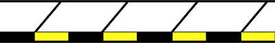
- **📖 الترجمة السياقية:** تشير الخطوط الصفراء والسوداء في الشكل المرسومة على حافة الرصيف إلى منع الوقوف والركن (divieto di sosta).
- **💡 الشرح والقاعدة المرورية:** صحيح (VERO). الأشرطة الصفراء والسوداء المتناوبة على حافة الرصيف تفرض منعاً صريحاً ومطلقا لوقوف السيارات (divieto di sosta) على مدار 24 ساعة.
- **⚠️ كشف الفخ:** فخ الامتحان: الأشرطة الصفراء والسوداء على حافة الرصيف تعني منع الوقوف (divieto di sosta) ولكنها تسمح بالتوقف المؤقت fermata.
- **🔑 الكلمات المفتاحية:** `{'it': 'segni gialli e neri', 'ar': 'خطوط صفراء وسوداء'}` | `{'it': 'bordo del marciapiede', 'ar': 'حافة الرصيف'}` | `{'it': 'divieto di sosta', 'ar': 'منع الوقوف والركن'}` | `{'it': 'vero', 'ar': 'صحيح'}`

---

**85.** I segni gialli e neri in figura sono posti lungo la parte verticale del marciapiede
- **الإجابة:** `VERO ✅ (صح)`
- 
- **📖 الترجمة السياقية:** توضع الخطوط الصفراء والسوداء في الشكل على طول الجزء الرأسي من الرصيف.
- **💡 الشرح والقاعدة المرورية:** صحيح (VERO). تُدهن هذه الخطوط على الحافة الرأسية القائمة لبردورة الرصيف (cordolo del marciapiede) لتكون واضحة تماماً للسائق عند الركن.
- **⚠️ كشف الفخ:** فخ الامتحان: التثبيت يكون على الواجهة الرأسية لكتف الرصيف.
- **🔑 الكلمات المفتاحية:** `{'it': 'parte verticale del marciapiede', 'ar': 'الجزء الرأسي من الرصيف'}` | `{'it': 'cordolo', 'ar': 'بردورة الرصيف'}` | `{'it': 'vero', 'ar': 'صحيح'}`

---

**86.** I segni gialli e neri in figura dipinti sul bordo del marciapiede indicano che su quel lato della strada non è possibile sostare
- **الإجابة:** `VERO ✅ (صح)`
- 
- **📖 الترجمة السياقية:** تشير الخطوط الصفراء والسوداء في الشكل المرسومة على حافة الرصيف إلى أنه لا يمكن ركن المركبات على ذلك الجانب من الطريق.
- **💡 الشرح والقاعدة المرورية:** صحيح (VERO). المنع يسري على ركن ووقوف المركبات (sosta) على طول امتداد الرصيف المدهون بهذه الخطوط التحذيرية.
- **⚠️ كشف الفخ:** فخ الامتحان: الركن ممنوع تماماً على هذا الجانب من الطريق.
- **🔑 الكلمات المفتاحية:** `{'it': 'non è possibile sostare', 'ar': 'لا يمكن الوقوف / الركن'}` | `{'it': 'lato della strada', 'ar': 'جانب الطريق'}` | `{'it': 'vero', 'ar': 'صحيح'}`

---

**87.** I segni gialli e neri in figura dipinti sul bordo del marciapiede consentono la fermata
- **الإجابة:** `VERO ✅ (صح)`
- 
- **📖 الترجمة السياقية:** تسمح الخطوط الصفراء والسوداء في الشكل المرسومة على حافة الرصيف بالتوقف المؤقت (fermata).
- **💡 الشرح والقاعدة المرورية:** صحيح (VERO). تمنع هذه الخطوط وقوف وركن المركبات (divieto di sosta)، ولكنها تسمح بالتوقف القصير المؤقت (fermata) لنزول أو صعود الركاب مع بقاء السائق خلف المقود.
- **⚠️ كشف الفخ:** فخ الامتحان: الخطوط الصفراء والسوداء تمنع الركن (sosta) فقط وتسمح بالتوقف اللحظي (fermata).
- **🔑 الكلمات المفتاحية:** `{'it': 'consentono la fermata', 'ar': 'تسمح بالتوقف المؤقت'}` | `{'it': 'divieto di sosta', 'ar': 'منع الركن'}` | `{'it': 'vero', 'ar': 'صحيح'}`

---

**88.** I segni gialli e neri in figura dipinti sul bordo del marciapiede indicano che la sosta è consentita solo agli autobus
- **الإجابة:** `FALSO ❌ (خطأ)`
- 
- **📖 الترجمة السياقية:** تشير الخطوط الصفراء والسوداء في الشكل المرسومة على حافة الرصيف إلى أن الوقوف مسموح به للحافلات فقط.
- **💡 الشرح والقاعدة المرورية:** خطأ (FALSO). الخطوط لا تخصص مواقف للحافلات، بل تعلن عن منع عام لوقوف وركن كافة المركبات دون استثناء.
- **⚠️ كشف الفخ:** فخ الامتحان: مواقف الحافلات يكتب عليها BUS بالأصفر وتحدد بخطوط زجزاجية، وليست خطوط بردورة الرصيف هذه.
- **🔑 الكلمات المفتاحية:** `{'it': 'sosta consentita solo agli autobus', 'ar': 'الوقوف مسموح للحافلات فقط (فخ)'}` | `{'it': 'divieto di sosta generale', 'ar': 'منع وقوف عام'}` | `{'it': 'falso', 'ar': 'خطأ'}`

---

**89.** I segni gialli e neri in figura dipinti sul bordo del marciapiede segnalano un ostacolo al centro della carreggiata
- **الإجابة:** `FALSO ❌ (خطأ)`
- 
- **📖 الترجمة السياقية:** تنبه الخطوط الصفراء والسوداء في الشكل المرسومة على حافة الرصيف بوجود عائق في منتصف نهر الطريق.
- **💡 الشرح والقاعدة المرورية:** خطأ (FALSO). الخطوط مرسومة على رصيف المشاة الجانبي لتنظيم الوقوف، ولا تدل على عائق في منتصف الطريق.
- **⚠️ كشف الفخ:** فخ الامتحان: العوائق في وسط الطريق تميزها شواخص رأسية أو جزر تخطيطية وليس حواف الأرصفة.
- **🔑 الكلمات المفتاحية:** `{'it': 'ostacolo al centro della carreggiata', 'ar': 'عائق في منتصف نهر الطريق (فخ)'}` | `{'it': 'bordo marciapiede', 'ar': 'حافة الرصيف'}` | `{'it': 'falso', 'ar': 'خطأ'}`

---

**90.** I segni gialli e neri in figura dipinti sul bordo del marciapiede avvertono i pedoni di fare attenzione al gradino
- **الإجابة:** `FALSO ❌ (خطأ)`
- 
- **📖 الترجمة السياقية:** تحذر الخطوط الصفراء والسوداء في الشكل المرسومة على حافة الرصيف المشاة من الانتباه لدرجة الرصيف.
- **💡 الشرح والقاعدة المرورية:** خطأ (FALSO). هذه إشارة مرورية موجهة لقائدي المركبات لمنع ركن السيارات وليست تحذيراً للمشاة من درجات السلالم أو حافة الرصيف.
- **⚠️ كشف الفخ:** فخ الامتحان: الخطوط تنظم مرور السيارات ولا توجه تنبيهاً للمشاة بشأن درجات الرصيف.
- **🔑 الكلمات المفتاحية:** `{'it': 'avvertono i pedoni del gradino', 'ar': 'تحذر المشاة من درجة الرصيف (فخ)'}` | `{'it': 'segnale per veicoli', 'ar': 'إشارة للمركبات'}` | `{'it': 'falso', 'ar': 'خطأ'}`

---

**91.** I segni gialli e neri in figura dipinti sul bordo del marciapiede indicano che è vietata anche la fermata
- **الإجابة:** `FALSO ❌ (خطأ)`
- 
- **📖 الترجمة السياقية:** تشير الخطوط الصفراء والسوداء في الشكل المرسومة على حافة الرصيف إلى منع التوقف المؤقت (fermata) أيضاً.
- **💡 الشرح والقاعدة المرورية:** خطأ (FALSO). المنع يقتصر على الركن والوقوف (sosta)، أما التوقف اللحظي (fermata) فمسموح به تماماً.
- **⚠️ كشف الفخ:** فخ الامتحان: التوقف اللحظي (fermata) غير ممنوع هنا؛ الممنوع هو الركن الطويل (sosta).
- **🔑 الكلمات المفتاحية:** `{'it': 'vietata anche la fermata', 'ar': 'يمنع التوقف المؤقت أيضاً (فخ)'}` | `{'it': 'fermata consentita', 'ar': 'التوقف المؤقت مسموح'}` | `{'it': 'falso', 'ar': 'خطأ'}`

---

## 📌 Fermata autobus (11 domande)

**92.** La segnaletica in figura indica una zona per la fermata degli autobus in servizio pubblico di linea
- **الإجابة:** `VERO ✅ (صح)`
- 
- **📖 الترجمة السياقية:** تشير التخطيطات الأرضية في الشكل إلى منطقة مخصصة لتوقف حافلات النقل العام على الخطوط المنتظمة.
- **💡 الشرح والقاعدة المرورية:** صحيح (VERO). المساحة المحددة بالخطوط الصفراء وكلمة BUS والخط الزجزاجي مخصصة لصعود ونزول ركاب حافلات الخطوط العامة.
- **⚠️ كشف الفخ:** فخ الامتحان: هذا التخطيط الأصفر مخصص رسمياً لمحطة توقف حافلات الخدمة العامة.
- **🔑 الكلمات المفتاحية:** `{'it': 'fermata degli autobus', 'ar': 'موقف حافلات النقل العام'}` | `{'it': 'servizio pubblico di linea', 'ar': 'خدمة الخطوط العامة'}` | `{'it': 'vero', 'ar': 'صحيح'}`

---

**93.** La segnaletica in figura indica lo spazio per la fermata di autobus e filobus in servizio pubblico di linea
- **الإجابة:** `VERO ✅ (صح)`
- 
- **📖 الترجمة السياقية:** تشير التخطيطات الأرضية في الشكل إلى المساحة المخصصة لتوقف الحافلات وترولي باص النقل العام.
- **💡 الشرح والقاعدة المرورية:** صحيح (VERO). تشمل المحطة حافلات النقل العادية والكهربائية (filobus) التابعة لخطوط النقل العام المنتظمة للأشخاص.
- **⚠️ كشف الفخ:** فخ الامتحان: يشمل الموقف الحافلات والترولي باص (autobus e filobus).
- **🔑 الكلمات المفتاحية:** `{'it': 'autobus e filobus', 'ar': 'الحافلات وترولي باص'}` | `{'it': 'spazio per la fermata', 'ar': 'مساحة التوقف'}` | `{'it': 'vero', 'ar': 'صحيح'}`

---

**94.** La striscia a zig zag della segnaletica in figura serve agli autobus per facilitare la manovra di accostamento e per ripartire
- **الإجابة:** `VERO ✅ (صح)`
- 
- **📖 الترجمة السياقية:** يُستخدم الخط المتعرج (zig-zag) في التخطيطات الأرضية بالشكل لتسهيل مناورة اقتراب الحافلات من الرصيف وإعادة انطلاقها.
- **💡 الشرح والقاعدة المرورية:** صحيح (VERO). ترسم الخطوط الزجزاجية الصفراء قبل وبعد الموقف لتوفير مساحة حرة تتيح للحافلة الدخول بسلاسة بمحاذاة الرصيف والخروج منه دون عوائق.
- **⚠️ كشف الفخ:** فخ الامتحان: خط الزجزاج يسهل اقتراب الحافلة وخروجها (accostamento e ripartenza).
- **🔑 الكلمات المفتاحية:** `{'it': 'striscia a zig zag', 'ar': 'خط متعرج (زجزاج)'}` | `{'it': 'facilitare accostamento e ripartenza', 'ar': 'تسهيل الاقتراب والانطلاق'}` | `{'it': 'vero', 'ar': 'صحيح'}`

---

**95.** La segnaletica in figura vieta la sosta ma non la fermata anche nelle parti con striscia gialla a zig zag
- **الإجابة:** `VERO ✅ (صح)`
- 
- **📖 الترجمة السياقية:** تمنع التخطيطات الأرضية في الشكل وقوف وركن السيارات (sosta)، ولكنها لا تمنع التوقف المؤقت (fermata) حتى في الأجزاء ذات الخط المتعرج الأصفر.
- **💡 الشرح والقاعدة المرورية:** صحيح (VERO). يُحظر ركن السيارات (sosta) في كامل منطقة المحطة وخط الزجزاج، لكن يُسمح بالتوقف اللحظي السريع (fermata) لنزول راكب بشرط عدم إعاقة الحافلة.
- **⚠️ كشف الفخ:** فخ الامتحان: ركن السيارات (sosta) ممنوع؛ أما التوقف المؤقت (fermata) فمسموح به ما دام لا يعطل الحافلة.
- **🔑 الكلمات المفتاحية:** `{'it': 'vieta la sosta ma non la fermata', 'ar': 'تمنع الركن ولا تمنع التوقف المؤقت'}` | `{'it': 'anche a zig zag', 'ar': 'حتى في الزجزاج'}` | `{'it': 'vero', 'ar': 'صحيح'}`

---

**96.** La segnaletica in figura indica lo spazio per la fermata di autosnodati in servizio pubblico di linea
- **الإجابة:** `VERO ✅ (صح)`
- 
- **📖 الترجمة السياقية:** تشير التخطيطات الأرضية في الشكل إلى مساحة توقف الحافلات المفصلية (autosnodati) في خدمة الخطوط العامة.
- **💡 الشرح والقاعدة المرورية:** صحيح (VERO). الحافلات المفصلية الطويلة التابعة لشبكة النقل العام تستخدم هذه المحطات المجهزة والمهيأة بأبعادها الكافية لاستيعابها.
- **⚠️ كشف الفخ:** فخ الامتحان: التخطيط يشمل الحافلات المفصلية الطويلة (autosnodati).
- **🔑 الكلمات المفتاحية:** `{'it': 'autosnodati', 'ar': 'الحافلات المفصلية'}` | `{'it': 'servizio pubblico', 'ar': 'خدمة عامة'}` | `{'it': 'vero', 'ar': 'صحيح'}`

---

**97.** La segnaletica in figura indica lo spazio riservato alla sosta anche dei taxi
- **الإجابة:** `FALSO ❌ (خطأ)`
- 
- **📖 الترجمة السياقية:** تشير التخطيطات الأرضية في الشكل إلى مساحة مخصصة أيضاً لوقوف وركن سيارات الأجرة (taxi).
- **💡 الشرح والقاعدة المرورية:** خطأ (FALSO). هذا الموقف خاص حصراً بحافلات النقل العام (BUS)، بينما مواقف سيارات الأجرة يكتب عليها TAXI بخطوط صفراء مستقلة.
- **⚠️ كشف الفخ:** فخ الامتحان: سيارات الأجرة لها مواقفها المستقلة المكتوب عليها TAXI ولا تشارك مواقف الحافلات في الركن.
- **🔑 الكلمات المفتاحية:** `{'it': 'sosta anche dei taxi', 'ar': 'وقوف سيارات الأجرة أيضاً (فخ)'}` | `{'it': 'solo autobus', 'ar': 'حافلات فقط'}` | `{'it': 'falso', 'ar': 'خطأ'}`

---

**98.** La segnaletica in figura non consente alle autovetture di circolare all'interno dell'area segnata
- **الإجابة:** `FALSO ❌ (خطأ)`
- 
- **📖 الترجمة السياقية:** لا تسمح التخطيطات الأرضية في الشكل للسيارات الخاصة بالمرور والسير داخل المساحة المحددة.
- **💡 الشرح والقاعدة المرورية:** خطأ (FALSO). السير والمرور العابر (transito / circolazione) داخل المساحة مسموح به لكافة المركبات، والممنوع فقط هو ركن السيارة (sosta) وتركها.
- **⚠️ كشف الفخ:** فخ الامتحان: السير والمرور فوق خطوط موقف الحافلات مسموح به تماماً والممنوع هو الركن.
- **🔑 الكلمات المفتاحية:** `{'it': 'non consente di circolare', 'ar': 'لا تسمح بالمرور والسير (فخ)'}` | `{'it': 'transito consentito', 'ar': 'المرور العابر مسموح'}` | `{'it': 'falso', 'ar': 'خطأ'}`

---

**99.** La segnaletica in figura non consente la sosta 20 metri prima della striscia gialla a zig zag
- **الإجابة:** `FALSO ❌ (خطأ)`
- 
- **📖 الترجمة السياقية:** تمنع التخطيطات الأرضية في الشكل ركن السيارات لمسافة 20 متراً قبل الخط الأصفر المتعرج (zig-zag).
- **💡 الشرح والقاعدة المرورية:** خطأ (FALSO). المنع يسري على طول خط الزجزاج والمساحة المحددة ذاتها؛ أما المسافة التي يمنع فيها الركن قبل وبعد لافتة المحطة عند غياب الخطوط فهي 15 متراً وليس 20 متراً.
- **⚠️ كشف الفخ:** فخ الامتحان: مسافة الـ 20 متراً خاطئة؛ المسافة القانونية عند غياب التخطيط هي 15 متراً.
- **🔑 الكلمات المفتاحية:** `{'it': '20 metri prima', 'ar': '20 متراً قبل (فخ)'}` | `{'it': '15 metri senza strisce', 'ar': '15 متراً في غياب الخطوط'}` | `{'it': 'falso', 'ar': 'خطأ'}`

---

**100.** La segnaletica in figura vieta agli autocarri di circolare all'interno dell'area segnata
- **الإجابة:** `FALSO ❌ (خطأ)`
- 
- **📖 الترجمة السياقية:** تمنع التخطيطات الأرضية في الشكل الشاحنات (autocarri) من السير والمرور داخل المساحة المحددة.
- **💡 الشرح والقاعدة المرورية:** خطأ (FALSO). يجوز للشاحنات وسائر المركبات المرور العابر فوق هذه التخطيطات كجزء من نهر الطريق العادي.
- **⚠️ كشف الفخ:** فخ الامتحان: المرور العابر غير ممنوع على الشاحنات.
- **🔑 الكلمات المفتاحية:** `{'it': 'vieta agli autocarri di circolare', 'ar': 'تمنع الشاحنات من المرور (فخ)'}` | `{'it': 'circolazione permessa', 'ar': 'المرور مسموح'}` | `{'it': 'falso', 'ar': 'خطأ'}`

---

**101.** La segnaletica in figura può anche essere realizzata con strisce di colore bianco
- **الإجابة:** `FALSO ❌ (خطأ)`
- 
- **📖 الترجمة السياقية:** يمكن أيضاً تنفيذ التخطيطات الأرضية في الشكل باستخدام خطوط بيضاء اللون.
- **💡 الشرح والقاعدة المرورية:** خطأ (FALSO). خطوط مواقف الحافلات ومحطاتها ترسم باللون الأصفر حصراً، ولا يجوز رسمها باللون الأبيض.
- **⚠️ كشف الفخ:** فخ الامتحان: خطوط مواقف الحافلات صفراء اللون دائماً (colore giallo esclusivo).
- **🔑 الكلمات المفتاحية:** `{'it': 'strisce di colore bianco', 'ar': 'خطوط بيضاء (فخ)'}` | `{'it': 'solo colore giallo', 'ar': 'أصفر فقط'}` | `{'it': 'falso', 'ar': 'خطأ'}`

---

**102.** La segnaletica in figura consente la sosta delle autovetture dalle ore 20.00 alle ore 8.00
- **الإجابة:** `FALSO ❌ (خطأ)`
- 
- **📖 الترجمة السياقية:** تسمح التخطيطات الأرضية في الشكل بركن سيارات الركوب من الساعة 20:00 مساءً حتى الساعة 08:00 صباحاً.
- **💡 الشرح والقاعدة المرورية:** خطأ (FALSO). منع ركن السيارات في مواقف الحافلات دائم ومستمر على مدار 24 ساعة يومياً، ولا يُسمح بالركن ليلاً.
- **⚠️ كشف الفخ:** فخ الامتحان: منع الركن مستمر طوال الليل والنهار ولا توجد فترات سماح ليلية.
- **🔑 الكلمات المفتاحية:** `{'it': 'sosta dalle 20.00 alle 8.00', 'ar': 'الوقوف ليلاً من 20 إلى 8 (فخ)'}` | `{'it': 'divieto permanente 24h', 'ar': 'منع دائم 24 ساعة'}` | `{'it': 'falso', 'ar': 'خطأ'}`

---

## 📌 Strisce guida (6 domande)

**103.** In presenza delle strisce di guida in figura il veicolo C può andare diritto
- **الإجابة:** `VERO ✅ (صح)`
- 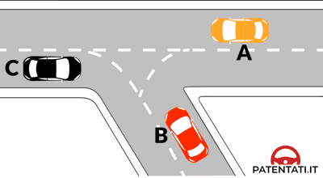
- **📖 الترجمة السياقية:** عند وجود خطوط التوجيه في الشكل، يجوز للمركبة C متابعة السير للأمام مباشرة.
- **💡 الشرح والقاعدة المرورية:** صحيح (VERO). المركبة C تسير في مسلكها الطبيعي وخطوط التوجيه تتيح لها متابعة السير للأمام مباشرة بأمان.
- **⚠️ كشف الفخ:** فخ الامتحان: المركبة C يمكنها السير للأمام مباشرة (può andare diritto).
- **🔑 الكلمات المفتاحية:** `{'it': 'veicolo C può andare diritto', 'ar': 'المركبة C يمكنها السير للأمام'}` | `{'it': 'marcia rettilinea', 'ar': 'سير مستقيم'}` | `{'it': 'vero', 'ar': 'صحيح'}`

---

**104.** In presenza delle strisce di guida in figura il veicolo B può svoltare a sinistra, dando però la precedenza al veicolo A
- **الإجابة:** `VERO ✅ (صح)`
- 
- **📖 الترجمة السياقية:** عند وجود خطوط التوجيه في الشكل، يجوز للمركبة B الانعطاف إلى اليسار، مع إعطاء الأسبقية للمركبة A.
- **💡 الشرح والقاعدة المرورية:** صحيح (VERO). خطوط التوجيه المنحنية ترشد المركبة B للانعطاف لليسار، وبما أنها تنعطف يساراً قاطعة مسار المركبة A المقابلة، فيجب عليها إعطاؤها الأسبقية.
- **⚠️ كشف الفخ:** فخ الامتحان: المركبة B تنعطف يساراً وتعطي الأسبقية للمركبة المقابلة A.
- **🔑 الكلمات المفتاحية:** `{'it': 'veicolo B può svoltare a sinistra', 'ar': 'المركبة B تنعطف يساراً'}` | `{'it': 'precedenza ad A', 'ar': 'أسبقية لـ A'}` | `{'it': 'vero', 'ar': 'صحيح'}`

---

**105.** In presenza delle strisce di guida in figura il veicolo A può andare in qualsiasi direzione
- **الإجابة:** `VERO ✅ (صح)`
- 
- **📖 الترجمة السياقية:** عند وجود خطوط التوجيه في الشكل، يجوز للمركبة A السير في أي اتجاه.
- **💡 الشرح والقاعدة المرورية:** صحيح (VERO). المركبة A قادمة في التقاطع وغير مقيدة بمسار انعطاف إجباري، فيحق لها متابعة السير للأمام أو الانعطاف يميناً أو يساراً وفق قواعد التقاطع.
- **⚠️ كشف الفخ:** فخ الامتحان: المركبة A غير محصورة بمسار واحد ولها حرية الاتجاهات المتاحة.
- **🔑 الكلمات المفتاحية:** `{'it': 'veicolo A può andare in qualsiasi direzione', 'ar': 'المركبة A يمكنها السير في أي اتجاه'}` | `{'it': 'tutte le direzioni permesse', 'ar': 'جميع الاتجاهات المسموحة'}` | `{'it': 'vero', 'ar': 'صحيح'}`

---

**106.** In presenza delle strisce di guida in figura il veicolo C deve svoltare a destra
- **الإجابة:** `FALSO ❌ (خطأ)`
- 
- **📖 الترجمة السياقية:** عند وجود خطوط التوجيه في الشكل، يجب على المركبة C الانعطاف إلى اليمين.
- **💡 الشرح والقاعدة المرورية:** خطأ (FALSO). المركبة C غير ملزمة بالانعطاف يميناً، بل مسارها الطبيعي يسمح لها بمتابعة السير للأمام مباشرة.
- **⚠️ كشف الفخ:** فخ الامتحان: كلمة 'deve svoltare a destra' إلزام كاذب؛ فالمركبة C تسير للأمام.
- **🔑 الكلمات المفتاحية:** `{'it': 'veicolo C deve svoltare a destra', 'ar': 'المركبة C يجب أن تنعطف يميناً (فخ)'}` | `{'it': 'può andare diritto', 'ar': 'يمكنها السير للأمام'}` | `{'it': 'falso', 'ar': 'خطأ'}`

---

**107.** In presenza delle strisce di guida in figura il veicolo B deve svoltare a destra
- **الإجابة:** `FALSO ❌ (خطأ)`
- 
- **📖 الترجمة السياقية:** عند وجود خطوط التوجيه في الشكل، يجب على المركبة B الانعطاف إلى اليمين.
- **💡 الشرح والقاعدة المرورية:** خطأ (FALSO). خطوط التوجيه في الشكل موجهة لانعطاف المركبة B نحو اليسار، وليست للانعطاف نحو اليمين.
- **⚠️ كشف الفخ:** فخ الامتحان: المركبة B مسارها للانعطاف لليسار وليس لليمين.
- **🔑 الكلمات المفتاحية:** `{'it': 'veicolo B deve svoltare a destra', 'ar': 'المركبة B يجب أن تنعطف يميناً (فخ)'}` | `{'it': 'svolta a sinistra', 'ar': 'انعطاف لليسار'}` | `{'it': 'falso', 'ar': 'خطأ'}`

---

**108.** In presenza delle strisce di guida in figura il veicolo A deve andare diritto
- **الإجابة:** `FALSO ❌ (خطأ)`
- 
- **📖 الترجمة السياقية:** عند وجود خطوط التوجيه في الشكل، يجب على المركبة A متابعة السير للأمام مباشرة فقط.
- **💡 الشرح والقاعدة المرورية:** خطأ (FALSO). المركبة A غير مجبرة على السير للأمام فقط، بل يجوز لها أيضاً الانعطاف إذا كان التقاطع يسمح بذلك.
- **⚠️ كشف الفخ:** فخ الامتحان: كلمة 'deve andare diritto' تقييد باطل لحركة المركبة A.
- **🔑 الكلمات المفتاحية:** `{'it': 'veicolo A deve andare diritto', 'ar': 'المركبة A يجب أن تسير للأمام فقط (فخ)'}` | `{'it': 'libertà di manovra', 'ar': 'حرية المناورة'}` | `{'it': 'falso', 'ar': 'خطأ'}`

---

## 📌 Corsie arresto (10 domande)

**109.** Tutte e tre le corsie rappresentate in figura consentono al conducente di proseguire dritto
- **الإجابة:** `VERO ✅ (صح)`
- 
- **📖 الترجمة السياقية:** تسمح المسالك الثلاثة الموضحة في الشكل لقائد المركبة بمواصلة السير للأمام مباشرة.
- **💡 الشرح والقاعدة المرورية:** صحيح (VERO). الأسهم المرسومة داخل المسالك الثلاثة تتضمن جميعاً سهماً متجهاً للأمام (المسلك الأيسر للأمام واليسار، الأوسط للأمام فقط، الأيمن للأمام واليمين).
- **⚠️ كشف الفخ:** فخ الامتحان: نعم، المسالك الثلاثة جميعها تشترك في إتاحة السير للأمام مباشرة.
- **🔑 الكلمات المفتاحية:** `{'it': 'tutte e tre le corsie', 'ar': 'المسالك الثلاثة جميعها'}` | `{'it': 'proseguire dritto', 'ar': 'متابعة السير للأمام'}` | `{'it': 'vero', 'ar': 'صحيح'}`

---

**110.** La corsia di sinistra rappresentata in figura consente al conducente di proseguire dritto o svoltare a sinistra
- **الإجابة:** `VERO ✅ (صح)`
- 
- **📖 الترجمة السياقية:** يسمح المسلك الأيسر الموضح في الشكل لقائد المركبة بمواصلة السير للأمام مباشرة أو الانعطاف إلى اليسار.
- **💡 الشرح والقاعدة المرورية:** صحيح (VERO). السهم المزدوج في المسلك الأيسر يحتوي على سهم للأمام وسهم لليسار، مما يتيح لكلا الخيارين أن يتحققا من هذا المسلك.
- **⚠️ كشف الفخ:** فخ الامتحان: المسلك الأيسر مخصص للأمام ولليسار معاً.
- **🔑 الكلمات المفتاحية:** `{'it': 'corsia di sinistra', 'ar': 'المسلك الأيسر'}` | `{'it': 'dritto o a sinistra', 'ar': 'للأمام أو لليسار'}` | `{'it': 'vero', 'ar': 'صحيح'}`

---

**111.** La corsia di mezzo rappresentata in figura consente al conducente solo di proseguire diritto
- **الإجابة:** `VERO ✅ (صح)`
- 
- **📖 الترجمة السياقية:** يسمح المسلك الأوسط الموضح في الشكل لقائد المركبة بمواصلة السير للأمام مباشرة فقط.
- **💡 الشرح والقاعدة المرورية:** صحيح (VERO). السهم في المسلك الأوسط موجه للأمام فقط، ولا يسمح بالانعطاف يميناً أو يساراً.
- **⚠️ كشف الفخ:** فخ الامتحان: المسلك الأوسط للأمام فقط (solo di proseguire diritto).
- **🔑 الكلمات المفتاحية:** `{'it': 'corsia di mezzo', 'ar': 'المسلك الأوسط'}` | `{'it': 'solo diritto', 'ar': 'للأمام فقط'}` | `{'it': 'vero', 'ar': 'صحيح'}`

---

**112.** La corsia di destra rappresentata in figura consente al conducente di proseguire diritto o svoltare a destra
- **الإجابة:** `VERO ✅ (صح)`
- 
- **📖 الترجمة السياقية:** يسمح المسلك الأيمن الموضح في الشكل لقائد المركبة بمواصلة السير للأمام مباشرة أو الانعطاف إلى اليمين.
- **💡 الشرح والقاعدة المرورية:** صحيح (VERO). السهم المزدوج في المسلك الأيمن يتيح متابعة السير للأمام أو الانعطاف إلى اليمين.
- **⚠️ كشف الفخ:** فخ الامتحان: المسلك الأيمن يجمع بين خياري الأمام واليمين.
- **🔑 الكلمات المفتاحية:** `{'it': 'corsia di destra', 'ar': 'المسلك الأيمن'}` | `{'it': 'diritto o svoltare a destra', 'ar': 'للأمام أو لليمين'}` | `{'it': 'vero', 'ar': 'صحيح'}`

---

**113.** E' possibile cambiare corsia finché le strisce sono ancora discontinue (tratteggiate)
- **الإجابة:** `VERO ✅ (صح)`
- 
- **📖 الترجمة السياقية:** يمكن تغيير المسلك ما دامت الخطوط لا تزال متقطعة (tratteggiate).
- **💡 الشرح والقاعدة المرورية:** صحيح (VERO). يحق للسائق الانتقال من مسلك إلى آخر طالما أن الخطوط الفاصلة متقطعة وقبل الوصول إلى منطقة الخطوط المتصلة.
- **⚠️ كشف الفخ:** فخ الامتحان: تغيير المسلك جائز فقط في منطقة الخطوط المتقطعة.
- **🔑 الكلمات المفتاحية:** `{'it': 'cambiare corsia', 'ar': 'تغيير المسلك'}` | `{'it': 'strisce ancora discontinue', 'ar': 'الخطوط لا تزال متقطعة'}` | `{'it': 'vero', 'ar': 'صحيح'}`

---

**114.** Il veicolo rappresentato in figura può svoltare a sinistra rimanendo nella stessa corsia
- **الإجابة:** `VERO ✅ (صح)`
- 
- **📖 الترجمة السياقية:** يمكن للمركبة الموضحة في الشكل الانعطاف إلى اليسار مع البقاء في نفس المسلك.
- **💡 الشرح والقاعدة المرورية:** صحيح (VERO). بما أنها تتواجد في المسلك الأيسر المجهز بسهم للانعطاف يساراً، فيمكنها إتمام الانعطاف مباشرة دون الحاجة لتغيير المسلك.
- **⚠️ كشف الفخ:** فخ الامتحان: المركبة في المسلك الصحيح للانعطاف لليسار.
- **🔑 الكلمات المفتاحية:** `{'it': 'svoltare a sinistra nella stessa corsia', 'ar': 'الانعطاف يساراً في نفس المسلك'}` | `{'it': 'corsia corretta', 'ar': 'المسلك الصحيح'}` | `{'it': 'vero', 'ar': 'صحيح'}`

---

**115.** La corsia di sinistra rappresentata in figura consente al conducente solo di svoltare a sinistra
- **الإجابة:** `FALSO ❌ (خطأ)`
- 
- **📖 الترجمة السياقية:** يسمح المسلك الأيسر الموضح في الشكل لقائد المركبة بالانعطاف إلى اليسار فقط.
- **💡 الشرح والقاعدة المرورية:** خطأ (FALSO). السهم مزدوج ويسمح أيضاً بمتابعة السير للأمام مباشرة، وكلمة 'solo a sinistra' حصرية غير صحيحة.
- **⚠️ كشف الفخ:** فخ الامتحان: كلمة 'solo' خطأ؛ المسلك يتيح أيضاً السير للأمام.
- **🔑 الكلمات المفتاحية:** `{'it': 'solo di svoltare a sinistra', 'ar': 'فقط الانعطاف يساراً (فخ)'}` | `{'it': 'anche diritto', 'ar': 'وأيضاً للأمام'}` | `{'it': 'falso', 'ar': 'خطأ'}`

---

**116.** La corsia di destra rappresentata in figura è riservata ai veicoli lenti
- **الإجابة:** `FALSO ❌ (خطأ)`
- 
- **📖 الترجمة السياقية:** المسلك الأيمن الموضح في الشكل مخصص للمركبات البطيئة.
- **💡 الشرح والقاعدة المرورية:** خطأ (FALSO). المسلك الأيمن هو مسلك سير عادي يتيح السير للأمام أو الانعطاف يميناً، وليس مسلكاً مخصصاً للمركبات البطيئة.
- **⚠️ كشف الفخ:** فخ الامتحان: الخلط بين مسالك الاختيار المسبق للتقاطعات ومسلك المركبات البطيئة.
- **🔑 الكلمات المفتاحية:** `{'it': 'riservata ai veicoli lenti', 'ar': 'مخصص للمركبات البطيئة (فخ)'}` | `{'it': 'corsia di preselezione', 'ar': 'مسلك اختيار مسبق'}` | `{'it': 'falso', 'ar': 'خطأ'}`

---

**117.** La corsia di destra rappresentata in figura consente al conducente solo di svoltare a destra
- **الإجابة:** `FALSO ❌ (خطأ)`
- 
- **📖 الترجمة السياقية:** يسمح المسلك الأيمن الموضح في الشكل لقائد المركبة بالانعطاف إلى اليمين فقط.
- **💡 الشرح والقاعدة المرورية:** خطأ (FALSO). السهم مزدوج ويسمح بمتابعة السير للأمام مباشرة بالإضافة إلى الانعطاف لليمين.
- **⚠️ كشف الفخ:** فخ الامتحان: السهم الأيمن مدمج (للأمام + لليمين) وليس لليمين فقط.
- **🔑 الكلمات المفتاحية:** `{'it': 'solo svoltare a destra', 'ar': 'فقط الانعطاف يميناً (فخ)'}` | `{'it': 'anche diritto', 'ar': 'وأيضاً للأمام'}` | `{'it': 'falso', 'ar': 'خطأ'}`

---

**118.** Con la segnaletica rappresentata in figura è consentito al conducente cambiare corsia anche superando la striscia continua
- **الإجابة:** `FALSO ❌ (خطأ)`
- 
- **📖 الترجمة السياقية:** مع وجود التخطيطات الأرضية الموضحة في الشكل، يُسمح لقائد المركبة بتغيير المسلك حتى مع تخطي الخط المتصل.
- **💡 الشرح والقاعدة المرورية:** خطأ (FALSO). تخطي الخط المتصل محظور منعاً كلياً؛ ولا يجوز تغيير المسلك إلا في الجزء ذي الخطوط المتقطعة فقط.
- **⚠️ كشف الفخ:** فخ الامتحان: الخط المتصل يمنع تغيير المسلك تماماً.
- **🔑 الكلمات المفتاحية:** `{'it': 'cambiare corsia superando la continua', 'ar': 'تغيير المسلك بتخطي المتصل (فخ)'}` | `{'it': 'vietato superare', 'ar': 'ممنوع التخطي'}` | `{'it': 'falso', 'ar': 'خطأ'}`

---

## 📌 Corsie preselezione (6 domande)

**119.** Le corsie A, B e C rappresentate in figura non consentono al conducente di proseguire diritto
- **الإجابة:** `VERO ✅ (صح)`
- 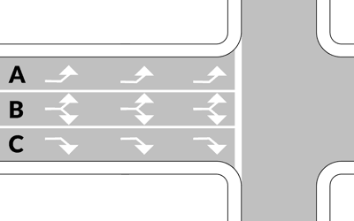
- **📖 الترجمة السياقية:** المسالك A و B و C الموضحة في الشكل لا تسمح لقائد المركبة بمواصلة السير للأمام مباشرة.
- **💡 الشرح والقاعدة المرورية:** صحيح (VERO). جميع الأسهم في هذا التخطيط مخصصة للانعطاف فقط (A و B للانعطاف يساراً، و C للانعطاف يميناً)، ولا يوجد أي سهم يشير للأمام مباشرة.
- **⚠️ كشف الفخ:** فخ الامتحان: تأكد من اتجاه رؤوس الأسهم؛ كلها موجهة للانعطاف ولا يوجد سهم مستقيم للأمام.
- **🔑 الكلمات المفتاحية:** `{'it': 'non consentono di proseguire diritto', 'ar': 'لا تسمح بمتابعة السير للأمام'}` | `{'it': 'solo svolte', 'ar': 'انعطافات فقط'}` | `{'it': 'vero', 'ar': 'صحيح'}`

---

**120.** La corsia A, rappresentata in figura, consente al conducente di svoltare solo a sinistra
- **الإجابة:** `VERO ✅ (صح)`
- 
- **📖 الترجمة السياقية:** يسمح المسلك A الموضح في الشكل لقائد المركبة بالانعطاف إلى اليسار فقط.
- **💡 الشرح والقاعدة المرورية:** صحيح (VERO). سهم المسلك A يشير حصراً إلى جهة اليسار، مما يلزم من يتواجد فيه بالانعطاف يساراً فقط.
- **⚠️ كشف الفخ:** فخ الامتحان: السهم A سهم منفرد لليسار فقط.
- **🔑 الكلمات المفتاحية:** `{'it': 'corsia A', 'ar': 'المسلك A'}` | `{'it': 'solo a sinistra', 'ar': 'لليسار فقط'}` | `{'it': 'vero', 'ar': 'صحيح'}`

---

**121.** Con la segnaletica indicata in figura è consentito al conducente cambiare corsia dove le strisce di corsia sono ancora discontinue(tratteggiate)
- **الإجابة:** `VERO ✅ (صح)`
- 
- **📖 الترجمة السياقية:** مع وجود التخطيطات الأرضية الموضحة في الشكل، يُسمح لقائد المركبة بتغيير المسلك حيث تكون خطوط المسالك لا تزال متقطعة.
- **💡 الشرح والقاعدة المرورية:** صحيح (VERO). الانتقال بين المسالك مسموح به قانوناً في جزء الخطوط المتقطعة للاختيار المسبق للاتجاه المناسب.
- **⚠️ كشف الفخ:** فخ الامتحان: تغيير المسلك مسموح به فقط في منطقة الخطوط المتقطعة.
- **🔑 الكلمات المفتاحية:** `{'it': 'cambiare corsia dove discontinue', 'ar': 'تغيير المسلك حيث الخطوط متقطعة'}` | `{'it': 'preselezione', 'ar': 'اختيار مسبق'}` | `{'it': 'vero', 'ar': 'صحيح'}`

---

**122.** Le corsie A,B e C rappresentate in figura sono a doppio senso di circolazione
- **الإجابة:** `FALSO ❌ (خطأ)`
- 
- **📖 الترجمة السياقية:** المسالك A و B و C الموضحة في الشكل هي مسالك ذات اتجاهين لحركة السير (doppio senso).
- **💡 الشرح والقاعدة المرورية:** خطأ (FALSO). مسالك الاختيار المسبق قبل التقاطع تسير جميعها في نفس الاتجاه (senso unico) نحو مفترق الطرق، وليست باتجاهين.
- **⚠️ كشف الفخ:** فخ الامتحان: مسالك الاختيار المتجاورة في نفس نهر السير تسير في نفس الاتجاه وليست باتجاهين متعاكسين.
- **🔑 الكلمات المفتاحية:** `{'it': 'a doppio senso di circolazione', 'ar': 'ذات اتجاهين للسير (فخ)'}` | `{'it': 'stesso senso di marcia', 'ar': 'نفس اتجاه السير'}` | `{'it': 'falso', 'ar': 'خطأ'}`

---

**123.** Le corsie A, B e C rappresentate in figura consentono al conducente di andare in tutte le direzioni
- **الإجابة:** `FALSO ❌ (خطأ)`
- 
- **📖 الترجمة السياقية:** تسمح المسالك A و B و C الموضحة في الشكل لقائد المركبة بالذهاب في جميع الاتجاهات.
- **💡 الشرح والقاعدة المرورية:** خطأ (FALSO). كل مسلك مخصص لاتجاه محدد ولا يتيح السير في جميع الاتجاهات، والسير للأمام ممنوع تماماً من هذه المسالك.
- **⚠️ كشف الفخ:** فخ الامتحان: عبارة 'in tutte le direzioni' باطلة؛ فكل مسلك مقيد بسهمه.
- **🔑 الكلمات المفتاحية:** `{'it': 'in tutte le direzioni', 'ar': 'في جميع الاتجاهات (فخ)'}` | `{'it': 'direzioni vincolate', 'ar': 'اتجاهات مقيدة ومحددة'}` | `{'it': 'falso', 'ar': 'خطأ'}`

---

**124.** La corsia B rappresentata in figura consente al conducente di svoltare e di proseguire diritto
- **الإجابة:** `FALSO ❌ (خطأ)`
- 
- **📖 الترجمة السياقية:** يسمح المسلك B الموضح في الشكل لقائد المركبة بالانعطاف وبمواصلة السير للأمام مباشرة.
- **💡 الشرح والقاعدة المرورية:** خطأ (FALSO). السهم في المسلك B يشير للانعطاف فقط ولا يسمح بمتابعة السير للأمام.
- **⚠️ كشف الفخ:** فخ الامتحان: المسلك B للانعطاف ولا يتيح السير للأمام مباشرة.
- **🔑 الكلمات المفتاحية:** `{'it': 'svoltare e proseguire diritto', 'ar': 'الانعطاف والسير للأمام (فخ)'}` | `{'it': 'solo svolta', 'ar': 'انعطاف فقط'}` | `{'it': 'falso', 'ar': 'خطأ'}`

---

## 📌 Corsie preselezione strada doppio senso (8 domande)

**125.** La corsia A rappresentata in figura consente al conducente solo di svoltare a sinistra
- **الإجابة:** `VERO ✅ (صح)`
- 
- **📖 الترجمة السياقية:** يسمح المسلك A الموضح في الشكل لقائد المركبة بالانعطاف إلى اليسار فقط.
- **💡 الشرح والقاعدة المرورية:** صحيح (VERO). سهم المسلك الأقصى يساراً (A) موجه لليسار حصراً ويلزم سالكيه بالانعطاف لليسار فقط.
- **⚠️ كشف الفخ:** فخ الامتحان: المسلك A مخصص حصراً للانعطاف يساراً.
- **🔑 الكلمات المفتاحية:** `{'it': 'corsia A', 'ar': 'المسلك A'}` | `{'it': 'solo a sinistra', 'ar': 'يساراً فقط'}` | `{'it': 'vero', 'ar': 'صحيح'}`

---

**126.** La corsia B rappresentata in figura consente al conducente di proseguire diritto e di svoltare a sinistra
- **الإجابة:** `VERO ✅ (صح)`
- 
- **📖 الترجمة السياقية:** يسمح المسلك B الموضح في الشكل لقائد المركبة بمواصلة السير للأمام مباشرة وبالانعطاف إلى اليسار.
- **💡 الشرح والقاعدة المرورية:** صحيح (VERO). السهم المزدوج في المسلك الأوسط (B) يتيح إما متابعة السير للأمام مباشرة أو الانعطاف نحو اليسار.
- **⚠️ كشف الفخ:** فخ الامتحان: المسلك B يجمع بين السير للأمام والانعطاف لليسار.
- **🔑 الكلمات المفتاحية:** `{'it': 'corsia B', 'ar': 'المسلك B'}` | `{'it': 'proseguire diritto e svoltare a sinistra', 'ar': 'للأمام ولليسار'}` | `{'it': 'vero', 'ar': 'صحيح'}`

---

**127.** In presenza della segnaletica in figura, la corsia C è l'unica che consente di svoltare a destra.
- **الإجابة:** `VERO ✅ (صح)`
- 
- **📖 الترجمة السياقية:** عند وجود التخطيطات الأرضية في الشكل، يعتبر المسلك C هو المسلك الوحيد الذي يسمح بالانعطاف إلى اليمين.
- **💡 الشرح والقاعدة المرورية:** صحيح (VERO). المسلك الأيمن (C) هو المسلك الوحيد المجهز بسهم الانعطاف لليمين بين المسالك الثلاثة.
- **⚠️ كشف الفخ:** فخ الامتحان: المسلك C هو المسلك الحصري للانعطاف يميناً.
- **🔑 الكلمات المفتاحية:** `{'it': "corsia C è l'unica", 'ar': 'المسلك C هو الوحيد'}` | `{'it': 'svoltare a destra', 'ar': 'الانعطاف يميناً'}` | `{'it': 'vero', 'ar': 'صحيح'}`

---

**128.** In presenza della segnaletica in figura è consentito cambiare corsia fino a che le strisce sono ancora discontinue(tratteggiate)
- **الإجابة:** `VERO ✅ (صح)`
- 
- **📖 الترجمة السياقية:** عند وجود التخطيطات الأرضية في الشكل، يُسمح بتغيير المسلك حتى النقطة التي تظل فيها الخطوط متقطعة.
- **💡 الشرح والقاعدة المرورية:** صحيح (VERO). يتاح الانتقال بين المسالك طالما أن الخطوط الفاصلة متقطعة وقبل بدء الخطوط المتصلة المقيدة.
- **⚠️ كشف الفخ:** فخ الامتحان: تغيير المسلك جائز في نطاق الخطوط المتقطعة فقط.
- **🔑 الكلمات المفتاحية:** `{'it': 'cambiare corsia', 'ar': 'تغيير المسلك'}` | `{'it': 'strisce ancora discontinue', 'ar': 'الخطوط لا تزال متقطعة'}` | `{'it': 'vero', 'ar': 'صحيح'}`

---

**129.** Tutte e tre le corsie rappresentate in figura consentono al conducente di proseguire diritto
- **الإجابة:** `FALSO ❌ (خطأ)`
- 
- **📖 الترجمة السياقية:** تسمح المسالك الثلاثة الموضحة في الشكل لقائد المركبة بمواصلة السير للأمام مباشرة.
- **💡 الشرح والقاعدة المرورية:** خطأ (FALSO). المسلك A لا يسمح بالسير للأمام بل يلزم بالانعطاف لليسار حصراً؛ لذا فإن عبارة 'المسالك الثلاثة جميعها' خاطئة.
- **⚠️ كشف الفخ:** فخ الامتحان: المسلك A لا يتيح السير للأمام مباشرة.
- **🔑 الكلمات المفتاحية:** `{'it': 'tutte e tre le corsie', 'ar': 'المسالك الثلاثة جميعها (فخ)'}` | `{'it': 'corsia A solo sinistra', 'ar': 'المسلك A لليسار فقط'}` | `{'it': 'falso', 'ar': 'خطأ'}`

---

**130.** In presenza della segnaletica in figura, la corsia A è l'unica che consente di svoltare a sinistra
- **الإجابة:** `FALSO ❌ (خطأ)`
- 
- **📖 الترجمة السياقية:** عند وجود التخطيطات الأرضية في الشكل، يعتبر المسلك A هو المسلك الوحيد الذي يسمح بالانعطاف إلى اليسار.
- **💡 الشرح والقاعدة المرورية:** خطأ (FALSO). المسلك B يسمح أيضاً بالانعطاف إلى اليسار بجانب السير للأمام، فليس المسلك A هو الوحيد.
- **⚠️ كشف الفخ:** فخ الامتحان: المسلك B يتيح أيضاً الانعطاف لليسار، فكلمة 'l'unica' خاطئة.
- **🔑 الكلمات المفتاحية:** `{'it': "corsia A è l'unica per svoltare a sinistra", 'ar': 'المسلك A هو الوحيد لليسار (فخ)'}` | `{'it': 'anche corsia B', 'ar': 'المسلك B أيضاً'}` | `{'it': 'falso', 'ar': 'خطأ'}`

---

**131.** La corsia B rappresentata in figura consente al conducente solo di proseguire diritto
- **الإجابة:** `FALSO ❌ (خطأ)`
- 
- **📖 الترجمة السياقية:** يسمح المسلك B الموضح في الشكل لقائد المركبة بمواصلة السير للأمام مباشرة فقط.
- **💡 الشرح والقاعدة المرورية:** خطأ (FALSO). المسلك B يحمل سهماً مزدوجاً يسمح بالسير للأمام وأيضاً بالانعطاف لليسار، وليس للأمام فقط.
- **⚠️ كشف الفخ:** فخ الامتحان: كلمة 'solo' خطأ لأن المسلك B يسمح بالانعطاف لليسار أيضاً.
- **🔑 الكلمات المفتاحية:** `{'it': 'corsia B solo diritto', 'ar': 'المسلك B للأمام فقط (فخ)'}` | `{'it': 'anche a sinistra', 'ar': 'ولليسار أيضاً'}` | `{'it': 'falso', 'ar': 'خطأ'}`

---

**132.** La corsia C rappresentata in figura consente al conducente solo la svolta a destra
- **الإجابة:** `FALSO ❌ (خطأ)`
- 
- **📖 الترجمة السياقية:** يسمح المسلك C الموضح في الشكل لقائد المركبة بالانعطاف إلى اليمين فقط.
- **💡 الشرح والقاعدة المرورية:** خطأ (FALSO). سهم المسلك C هو سهم مدمج يتيح السير للأمام مباشرة أو الانعطاف لليمين، وليس الانعطاف لليمين فقط.
- **⚠️ كشف الفخ:** فخ الامتحان: المسلك C يسمح بالسير للأمام ولليمين وليس لليمين فقط.
- **🔑 الكلمات المفتاحية:** `{'it': 'corsia C solo svolta a destra', 'ar': 'المسلك C لليمين فقط (فخ)'}` | `{'it': 'anche diritto', 'ar': 'وأيضاً للأمام'}` | `{'it': 'falso', 'ar': 'خطأ'}`

---

## 📌 Bordo marciapiede (7 domande)

**133.** Il bordo del marciapiede come dipinto in figura vieta la sosta anche ai taxi
- **الإجابة:** `VERO ✅ (صح)`
- 
- **📖 الترجمة السياقية:** حافة الرصيف المدهونة كما في الشكل تمنع وقوف وركن سيارات الأجرة (taxi) أيضاً.
- **💡 الشرح والقاعدة المرورية:** صحيح (VERO). تمنع الخطوط الصفراء والسوداء ركن ووقوف كافة المركبات على مدار اليوم، بما في ذلك سيارات الأجرة خارج مواقفها المخصصة.
- **⚠️ كشف الفخ:** فخ الامتحان: المنع يسري على الجميع بما فيهم سيارات الأجرة.
- **🔑 الكلمات المفتاحية:** `{'it': 'vieta la sosta anche ai taxi', 'ar': 'تمنع الركن لسيارات الأجرة أيضاً'}` | `{'it': 'divieto generale', 'ar': 'منع عام'}` | `{'it': 'vero', 'ar': 'صحيح'}`

---

**134.** Il bordo del marciapiede dipinto come in figura indica che nessun veicolo può sostare
- **الإجابة:** `VERO ✅ (صح)`
- 
- **📖 الترجمة السياقية:** تشير حافة الرصيف المدهونة كما في الشكل إلى أنه لا يجوز لأي مركبة ركن سيارتها.
- **💡 الشرح والقاعدة المرورية:** صحيح (VERO). منع الركن (sosta) مطلق وشامل لكافة أنواع وفئات المركبات دون استثناء.
- **⚠️ كشف الفخ:** فخ الامتحان: لا يجوز لأي مركبة الركن هنا (nessun veicolo può sostare).
- **🔑 الكلمات المفتاحية:** `{'it': 'nessun veicolo può sostare', 'ar': 'لا يجوز لأي مركبة الركن'}` | `{'it': 'divieto assoluto', 'ar': 'منع مطلق'}` | `{'it': 'vero', 'ar': 'صحيح'}`

---

**135.** Il bordo del marciapiede dipinto come in figura indica che non si può sostare lungo quel tratto
- **الإجابة:** `VERO ✅ (صح)`
- 
- **📖 الترجمة السياقية:** تشير حافة الرصيف المدهونة كما في الشكل إلى أنه لا يمكن ركن المركبات على طول ذلك المقطع.
- **💡 الشرح والقاعدة المرورية:** صحيح (VERO). يمتد منع الوقوف والركن على كامل طول الرصيف المدهون باللونين الأصفر والأسود.
- **⚠️ كشف الفخ:** فخ الامتحان: الركن ممنوع على طول المقطع المحدد.
- **🔑 الكلمات المفتاحية:** `{'it': 'non si può sostare lungo quel tratto', 'ar': 'لا يمكن الركن على طول ذلك المقطع'}` | `{'it': 'estensione del divieto', 'ar': 'امتداد المنع'}` | `{'it': 'vero', 'ar': 'صحيح'}`

---

**136.** Il bordo del marciapiede dipinto come in figura indica che la sosta è consentita solo a pagamento
- **الإجابة:** `FALSO ❌ (خطأ)`
- 
- **📖 الترجمة السياقية:** تشير حافة الرصيف المدهونة كما في الشكل إلى أن الركن مسموح به بمقابل مالي فقط (a pagamento).
- **💡 الشرح والقاعدة المرورية:** خطأ (FALSO). المواقف مدفوعة الأجر تحدد بخطوط زرقاء على الأسفلت (strisce blu)، بينما الخطوط الصفراء والسوداء على حافة الرصيف تعني منع الركن تماماً.
- **⚠️ كشف الفخ:** فخ الامتحان: الخلط بين مواقف الخطوط الزرقاء بالأجر ومنع الركن بالأصفر والأسود.
- **🔑 الكلمات المفتاحية:** `{'it': 'sosta consentita a pagamento', 'ar': 'الركن مسموح بمقابل مالي (فخ)'}` | `{'it': 'divieto di sosta', 'ar': 'منع الركن'}` | `{'it': 'falso', 'ar': 'خطأ'}`

---

**137.** Il bordo del marciapiede dipinto come in figura indica che la sosta è consentita solo per un'ora
- **الإجابة:** `FALSO ❌ (خطأ)`
- 
- **📖 الترجمة السياقية:** تشير حافة الرصيف المدهونة كما في الشكل إلى أن الركن مسموح به لمدة ساعة واحدة فقط.
- **💡 الشرح والقاعدة المرورية:** خطأ (FALSO). الركن ممنوع منعاً كلياً ولا يُسمح به ولو لدقيقة واحدة؛ وتحديد مدة الوقوف بساعة يشار إليه بقرص الوقت (disco orario) وشاخصة مستقلة.
- **⚠️ كشف الفخ:** فخ الامتحان: لا وجود لمهلة ساعة واحدة؛ الركن محظور كلياً.
- **🔑 الكلمات المفتاحية:** `{'it': "sosta consentita solo per un'ora", 'ar': 'الركن مسموح لساعة فقط (فخ)'}` | `{'it': 'divieto continuo', 'ar': 'منع مستمر'}` | `{'it': 'falso', 'ar': 'خطأ'}`

---

**138.** Il bordo del marciapiede dipinto come in figura indica la presenza di lavori in corso
- **الإجابة:** `FALSO ❌ (خطأ)`
- 
- **📖 الترجمة السياقية:** تشير حافة الرصيف المدهونة كما في الشكل إلى وجود أشغال جارية في الطريق.
- **💡 الشرح والقاعدة المرورية:** خطأ (FALSO). لا تدل هذه الخطوط على أعمال إنشائية، بل هي تنظيم دائم لمنع ركن المركبات على كتف الطريق.
- **⚠️ كشف الفخ:** فخ الامتحان: الخطوط الصفراء والسوداء ليست إشارة ورشة أعمال طريق.
- **🔑 الكلمات المفتاحية:** `{'it': 'presenza di lavori in corso', 'ar': 'وجود أشغال جارية (فخ)'}` | `{'it': 'falso', 'ar': 'خطأ'}`

---

**139.** Il bordo del marciapiede dipinto come in figura indica una strada con diritto di precedenza
- **الإجابة:** `FALSO ❌ (خطأ)`
- 
- **📖 الترجمة السياقية:** تشير حافة الرصيف المدهونة كما في الشكل إلى طريق يتمتع بحق الأسبقية.
- **💡 الشرح والقاعدة المرورية:** خطأ (FALSO). حق الأسبقية يعلن عنه بشاخصة المعين الأصفر والأبيض، ولا علاقة لطلاء حافة الرصيف بنظام الأسبقية.
- **⚠️ كشف الفخ:** فخ الامتحان: لا علاقة لطلاء الرصيف بحق الأسبقية على الطريق.
- **🔑 الكلمات المفتاحية:** `{'it': 'strada con diritto di precedenza', 'ar': 'طريق ذو حق أسبقية (فخ)'}` | `{'it': 'falso', 'ar': 'خطأ'}`

---

## 📌 Regolamenti segnaletica (12 domande)

**140.** E' regolamentare, nelle zone destinate alla fermata degli autobus in servizio pubblico di linea, trovare sulla pavimentazione la scritta BUS di colore giallo
- **الإجابة:** `VERO ✅ (صح)`
- **📖 الترجمة السياقية:** من المطابق للوائح المرورية وجود كلمة BUS باللون الأصفر على أرضية الطريق في المناطق المخصصة لتوقف حافلات النقل العام.
- **💡 الشرح والقاعدة المرورية:** صحيح (VERO). كتابة كلمة BUS بالطلاء الأصفر على الأسفلت إجراء نظامي معتمد لتحديد محطات توقف حافلات الخدمة العامة.
- **⚠️ كشف الفخ:** فخ الامتحان: كلمة BUS بالأصفر مطابقة للوائح كود السير الرسمية.
- **🔑 الكلمات المفتاحية:** `{'it': 'scritta BUS di colore giallo', 'ar': 'كتابة BUS باللون الأصفر'}` | `{'it': 'regolamentare', 'ar': 'مطابق للوائح النظامية'}` | `{'it': 'vero', 'ar': 'صحيح'}`

---

**141.** E' regolamentare trovare sulla pavimentazione la scritta TAXI di colore giallo, per indicare zone riservate alla sosta dei taxi in servizio
- **الإجابة:** `VERO ✅ (صح)`
- **📖 الترجمة السياقية:** من المطابق للوائح المرورية وجود كلمة TAXI باللون الأصفر على أرضية الطريق لتحديد المناطق المخصصة لوقوف سيارات الأجرة في الخدمة.
- **💡 الشرح والقاعدة المرورية:** صحيح (VERO). كلمة TAXI بالأصفر تحدد المواقف الرسمية المخصصة لانتظار سيارات الأجرة المرخصة.
- **⚠️ كشف الفخ:** فخ الامتحان: كتابة TAXI باللون الأصفر نظامية ومعتمدة لمواقف التاكسي.
- **🔑 الكلمات المفتاحية:** `{'it': 'scritta TAXI di colore giallo', 'ar': 'كتابة TAXI باللون الأصفر'}` | `{'it': 'sosta dei taxi', 'ar': 'وقوف سيارات الأجرة'}` | `{'it': 'vero', 'ar': 'صحيح'}`

---

**142.** E' regolamentare trovare sulla pavimentazione la scritta STOP, a completamento del relativo segnale verticale
- **الإجابة:** `VERO ✅ (صح)`
- **📖 الترجمة السياقية:** من المطابق للوائح المرورية وجود كلمة STOP على أرضية الطريق لاستكمال وتأكيد الشاخصة العمودية المقابلة لها.
- **💡 الشرح والقاعدة المرورية:** صحيح (VERO). ترسم كلمة STOP بأحرف بيضاء عريضة على الأسفلت قبل خط التوقف العرضي مرافقة لشاخصة قف العمودية الثمانية الأضلاع.
- **⚠️ كشف الفخ:** فخ الامتحان: كلمة STOP على الأسفلت تستكمل الشاخصة العمودية لقِف.
- **🔑 الكلمات المفتاحية:** `{'it': 'scritta STOP sulla pavimentazione', 'ar': 'كتابة STOP على الأسفلت'}` | `{'it': 'completamento del segnale verticale', 'ar': 'استكمال الشاخصة العمودية'}` | `{'it': 'vero', 'ar': 'صحيح'}`

---

**143.** E' regolamentare trovare sulla pavimentazione la scritta P L, con croce di S. Andrea, per segnalare un passaggio a livello
- **الإجابة:** `VERO ✅ (صح)`
- **📖 الترجمة السياقية:** من المطابق للوائح المرورية وجود الحرفين P L مع صليب القديس أندراوس على أرضية الطريق للتنبيه بتقاطع سكة حديدية.
- **💡 الشرح والقاعدة المرورية:** صحيح (VERO). رسم الحرفين P L (Passaggio a Livello) مع علامة X العريضة على الإسفلت تنبيه أرضي معتمد للاقتراب من مزلقان القطار.
- **⚠️ كشف الفخ:** فخ الامتحان: الرمز P L وصليب سانت أندريا على الإسفلت تنبيه نظامي لمزلقان السكة الحديد.
- **🔑 الكلمات المفتاحية:** `{'it': 'scritta P L con croce di S. Andrea', 'ar': 'كتابة P L مع صليب سانت أندريا'}` | `{'it': 'passaggio a livello', 'ar': 'تقاطع سكة حديد'}` | `{'it': 'vero', 'ar': 'صحيح'}`

---

**144.** Quando si incontrano le strisce di figura dipinte sulla pavimentazione occorre moderare la velocità
- **الإجابة:** `VERO ✅ (صح)`
- 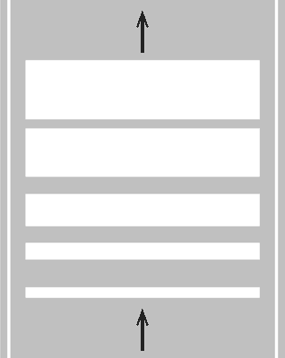
- **📖 الترجمة السياقية:** عند مصادفة الخطوط المرسومة على أرضية الطريق في الشكل، يجب تخفيف السرعة.
- **💡 الشرح والقاعدة المرورية:** صحيح (VERO). الخطوط التحذيرية المتقاربة والمطبات أو الإشارات المرسومة على الإسفلت تفرض دائماً ضبط وتخفيف السرعة والانتباه.
- **⚠️ كشف الفخ:** فخ الامتحان: التخطيطات الأرضية التحذيرية تتطلب تخفيف السرعة (moderare la velocità).
- **🔑 الكلمات المفتاحية:** `{'it': 'moderare la velocità', 'ar': 'تخفيف السرعة'}` | `{'it': 'strisce sulla pavimentazione', 'ar': 'خطوط على الأسفلت'}` | `{'it': 'vero', 'ar': 'صحيح'}`

---

**145.** E' regolamentare trovare sulla pavimentazione la scritta indicante il nome di una località, a completamento della freccia direzionale
- **الإجابة:** `VERO ✅ (صح)`
- **📖 الترجمة السياقية:** من المطابق للوائح المرورية وجود كتابة تشير إلى اسم إحدى المدن على أرضية الطريق لاستكمال السهم التوجيهي.
- **💡 الشرح والقاعدة المرورية:** صحيح (VERO). يجوز رسم اسم المدينة (مثل ROMA أو BOLOGNA) على مسلك السير بجوار السهم لتأكيد المسار المؤدي إليها.
- **⚠️ كشف الفخ:** فخ الامتحان: كتابة اسم المدينة على الإسفلت إجراء نظامي ومعتمد.
- **🔑 الكلمات المفتاحية:** `{'it': 'nome di una località', 'ar': 'اسم مدينة / بلدة'}` | `{'it': 'a completamento della freccia', 'ar': 'استكمالاً للسهم التوجيهي'}` | `{'it': 'vero', 'ar': 'صحيح'}`

---

**146.** E' regolamentare trovare sulla pavimentazione la scritta STOP, per completare il segnale verticale di DARE PRECEDENZA
- **الإجابة:** `FALSO ❌ (خطأ)`
- **📖 الترجمة السياقية:** من المطابق للوائح المرورية وجود كلمة STOP على أرضية الطريق لاستكمال الشاخصة العمودية لإعطاء الأسبقية (DARE PRECEDENZA).
- **💡 الشرح والقاعدة المرورية:** خطأ (FALSO). كلمة STOP ترافق حصراً شاخصة قف (STOP)، بينما إشارة إعطاء الأسبقية (مثلث مقلوب) يرافقها على الأرض مثلث أبيض مقلوب بدون كلمة STOP.
- **⚠️ كشف الفخ:** فخ الامتحان: كلمة STOP لا ترافق إشارة DARE PRECEDENZA إطلاقاً.
- **🔑 الكلمات المفتاحية:** `{'it': 'STOP per DARE PRECEDENZA', 'ar': 'كلمة STOP لإعطاء الأسبقية (فخ)'}` | `{'it': 'solo con segnale STOP', 'ar': 'فقط مع شاخصة قف'}` | `{'it': 'falso', 'ar': 'خطأ'}`

---

**147.** E' regolamentare trovare sulla pavimentazione la scritta indicante una prossima stazione di servizio
- **الإجابة:** `FALSO ❌ (خطأ)`
- **📖 الترجمة السياقية:** من المطابق للوائح المرورية وجود كتابة على أرضية الطريق تشير إلى محطة وقود قادمة.
- **💡 الشرح والقاعدة المرورية:** خطأ (FALSO). محطات الوقود يعلن عنها بشواخص إرشادية عمودية فقط، ولا يُسمح بكتابتها على الأسفلت.
- **⚠️ كشف الفخ:** فخ الامتحان: لا توجد كتابات على الأسفلت لمحطات الوقود.
- **🔑 الكلمات المفتاحية:** `{'it': 'prossima stazione di servizio', 'ar': 'محطة وقود قادمة (فخ)'}` | `{'it': 'non regolamentare', 'ar': 'غير نظامي'}` | `{'it': 'falso', 'ar': 'خطأ'}`

---

**148.** E' regolamentare trovare sulla pavimentazione una scritta pubblicitaria che indica un distributore di carburante
- **الإجابة:** `FALSO ❌ (خطأ)`
- **📖 الترجمة السياقية:** من المطابق للوائح المرورية وجود كتابة إعلانية على أرضية الطريق تشير إلى موزع وقود.
- **💡 الشرح والقاعدة المرورية:** خطأ (FALSO). الإعلانات التجارية محظورة تماماً على الطرق وأرضياتها ويمنع طلاؤها على الأسفلت منعاً باتاً.
- **⚠️ كشف الفخ:** فخ الامتحان: الكتابات الإعلانية والتجارية ممنوعة كلياً على أرضية الطريق.
- **🔑 الكلمات المفتاحية:** `{'it': 'scritta pubblicitaria sulla pavimentazione', 'ar': 'كتابة إعلانية على الأسفلت (فخ)'}` | `{'it': 'divieto di pubblicità', 'ar': 'منع الإعلانات'}` | `{'it': 'falso', 'ar': 'خطأ'}`

---

**149.** E' regolamentare trovare sulla pavimentazione una scritta di incoraggiamento per i corridori ciclisti
- **الإجابة:** `FALSO ❌ (خطأ)`
- **📖 الترجمة السياقية:** من المطابق للوائح المرورية وجود كتابات تشجيعية لمتسابقي الدراجات الهوائية على أرضية الطريق.
- **💡 الشرح والقاعدة المرورية:** خطأ (FALSO). كتابات المشجعين على الطرق أثناء سباقات الدراجات غير نظامية ومخالفة لقانون الطرق وتعتبر تشويهاً لنهر السير.
- **⚠️ كشف الفخ:** فخ الامتحان: العبارات التشجيعية لسباقات الدراجات ليست كتابات نظامية قانونية.
- **🔑 الكلمات المفتاحية:** `{'it': 'incoraggiamento per i ciclisti', 'ar': 'تشجيع لمتسابقي الدراجات (فخ)'}` | `{'it': 'vietato', 'ar': 'ممنوع'}` | `{'it': 'falso', 'ar': 'خطأ'}`

---

**150.** E' regolamentare trovare sulla pavimentazione la scritta TAXI, di colore bianco, nei parcheggi per taxi
- **الإجابة:** `FALSO ❌ (خطأ)`
- **📖 الترجمة السياقية:** من المطابق للوائح المرورية وجود كلمة TAXI باللون الأبيض في مواقف سيارات الأجرة.
- **💡 الشرح والقاعدة المرورية:** خطأ (FALSO). كلمة TAXI ومواقف سيارات الأجرة يجب أن تكون باللون الأصفر حصراً وليس باللون الأبيض.
- **⚠️ كشف الفخ:** فخ الامتحان: كلمة TAXI ترسم باللون الأصفر دائماً وليس بالأبيض.
- **🔑 الكلمات المفتاحية:** `{'it': 'TAXI di colore bianco', 'ar': 'TAXI باللون الأبيض (فخ)'}` | `{'it': 'colore giallo', 'ar': 'اللون الأصفر'}` | `{'it': 'falso', 'ar': 'خطأ'}`

---

**151.** E' regolamentare trovare sulla pavimentazione la scritta GIOCHI, in vicinanza di giardini pubblici
- **الإجابة:** `FALSO ❌ (خطأ)`
- **📖 الترجمة السياقية:** من المطابق للوائح المرورية وجود كلمة 'ألعاب' (GIOCHI) على أرضية الطريق بالقرب من الحدائق العامة.
- **💡 الشرح والقاعدة المرورية:** خطأ (FALSO). لا توجد كتابة أرضية تسمى GIOCHI في لوائح كود السير، والتحذير من الأطفال يتم بشاخصة عمودية مثلثة.
- **⚠️ كشف الفخ:** فخ الامتحان: كلمة GIOCHI غير موجودة نهائياً في قاموس التخطيطات الأرضية لكود السير.
- **🔑 الكلمات المفتاحية:** `{'it': 'scritta GIOCHI', 'ar': 'كتابة GIOCHI (ألعاب) (فخ)'}` | `{'it': 'inesistente', 'ar': 'غير موجودة باللوائح'}` | `{'it': 'falso', 'ar': 'خطأ'}`

---

## 📌 Striscia bianca discontinua strada senso unico (9 domande)

**152.** In una strada a senso unico di circolazione con la segnaletica indicata in figura si può sorpassare anche superando la striscia di mezzo
- **الإجابة:** `VERO ✅ (صح)`
- 
- **📖 الترجمة السياقية:** في طريق ذي اتجاه واحد للسير مع التخطيطات الموضحة في الشكل، يجوز التجاوز حتى مع تخطي الخط الأوسط.
- **💡 الشرح والقاعدة المرورية:** صحيح (VERO). بما أن الطريق باتجاه واحد (senso unico)، فإن المسلك الأيسر يسير في نفس اتجاه السير ولا يوجد أي خطر من مركبات مقابلة، فيجوز تخطي الخط المتقطع للتجاوز بحرية.
- **⚠️ كشف الفخ:** فخ الامتحان: في الاتجاه الواحد، التجاوز فوق الخط المتقطع آمن ومباح تماماً.
- **🔑 الكلمات المفتاحية:** `{'it': 'strada a senso unico', 'ar': 'طريق ذو اتجاه واحد'}` | `{'it': 'sorpassare superando la striscia', 'ar': 'التجاوز بتخطي الخط'}` | `{'it': 'vero', 'ar': 'صحيح'}`

---

**153.** In una strada a senso unico di circolazione con la segnaletica indicata in figura si può sorpassare anche in curva
- **الإجابة:** `VERO ✅ (صح)`
- 
- **📖 الترجمة السياقية:** في طريق ذي اتجاه واحد للسير مع التخطيطات الموضحة في الشكل، يجوز التجاوز حتى في المنعطف (in curva).
- **💡 الشرح والقاعدة المرورية:** صحيح (VERO). في الطريق ذي الاتجاه الواحد والمسلكين، يجوز التجاوز في المنعطفات لأن جميع المركبات تسير في نفس الاتجاه ولا توجد حركة سير مقابلة.
- **⚠️ كشف الفخ:** فخ الامتحان: في طريق الاتجاه الواحد المكون من مسلكين على الأقل، يجوز التجاوز في المنعطف والتلال المحدبة.
- **🔑 الكلمات المفتاحية:** `{'it': 'sorpassare anche in curva', 'ar': 'التجاوز حتى في المنعطف'}` | `{'it': 'senso unico', 'ar': 'اتجاه واحد'}` | `{'it': 'nessun veicolo di fronte', 'ar': 'لا مركبات مقابلة'}` | `{'it': 'vero', 'ar': 'صحيح'}`

---

**154.** In una strada a senso unico di circolazione con la segnaletica indicata in figura la carreggiata è divisa in due corsie
- **الإجابة:** `VERO ✅ (صح)`
- 
- **📖 الترجمة السياقية:** في طريق ذي اتجاه واحد للسير مع التخطيطات الموضحة في الشكل، ينقسم نهر الطريق إلى مسلكين.
- **💡 الشرح والقاعدة المرورية:** صحيح (VERO). الخط المتقطع يقسم نهر الطريق إلى مسلكين متجاورين يسيران في نفس الاتجاه.
- **⚠️ كشف الفخ:** فخ الامتحان: نهر الطريق مقسم إلى مسلكين (due corsie).
- **🔑 الكلمات المفتاحية:** `{'it': 'divisa in due corsie', 'ar': 'مقسم لمسلكين'}` | `{'it': 'carreggiata', 'ar': 'نهر الطريق'}` | `{'it': 'vero', 'ar': 'صحيح'}`

---

**155.** In una strada a senso unico di circolazione con la segnaletica indicata in figura la corsia di sinistra è, di norma, riservata al sorpasso
- **الإجابة:** `VERO ✅ (صح)`
- 
- **📖 الترجمة السياقية:** في طريق ذي اتجاه واحد للسير مع التخطيطات الموضحة في الشكل، يُخصص المسلك الأيسر، كقاعدة عامة، للتجاوز.
- **💡 الشرح والقاعدة المرورية:** صحيح (VERO). القاعدة العامة للسير هي التزام المسلك الأيمن للسير العادي، واستخدام المسلك الأيسر لإجراء مناورات التجاوز.
- **⚠️ كشف الفخ:** فخ الامتحان: المسلك الأيسر مخصص كقاعدة عامة للتجاوز (corsia di sorpasso).
- **🔑 الكلمات المفتاحية:** `{'it': 'corsia di sinistra riservata al sorpasso', 'ar': 'المسلك الأيسر مخصص للتجاوز'}` | `{'it': 'di norma', 'ar': 'كقاعدة عامة'}` | `{'it': 'vero', 'ar': 'صحيح'}`

---

**156.** In una strada a senso unico di circolazione con la segnaletica indicata in figura è consentito il sorpasso in vicinanza o in corrispondenza di dossi
- **الإجابة:** `VERO ✅ (صح)`
- 
- **📖 الترجمة السياقية:** في طريق ذي اتجاه واحد للسير مع التخطيطات الموضحة في الشكل، يُسمح بالتجاوز بالقرب من التلال المحدبة (dossi) أو فوقها.
- **💡 الشرح والقاعدة المرورية:** صحيح (VERO). انعدام الرؤية في التل المحدب لا يمنع التجاوز إذا كان الطريق باتجاه واحد وبمسلكين، لعدم وجود خطر التصادم مع مركبات مقابلة.
- **⚠️ كشف الفخ:** فخ الامتحان: التجاوز مسموح به في التلال المحدبة (dossi) فقط عندما يكون الطريق باتجاه واحد وبمسلكين على الأقل.
- **🔑 الكلمات المفتاحية:** `{'it': 'sorpasso in vicinanza di dossi', 'ar': 'التجاوز بالقرب من المرتفعات المحدبة'}` | `{'it': 'consentito a senso unico', 'ar': 'مسموح في الاتجاه الواحد'}` | `{'it': 'vero', 'ar': 'صحيح'}`

---

**157.** In una strada a senso unico di circolazione con la segnaletica indicata in figura si può sempre viaggiare per file parallele
- **الإجابة:** `FALSO ❌ (خطأ)`
- 
- **📖 الترجمة السياقية:** في طريق ذي اتجاه واحد للسير مع التخطيطات الموضحة في الشكل، يجوز دائماً (sempre) السير في صفوف متوازية.
- **💡 الشرح والقاعدة المرورية:** خطأ (FALSO). السير في صفوف متوازية (file parallele) ليس مباحاً دائماً، بل يُشترط فيه وجود حركة مرور كثيفة ومركبات في طوابير أو إشارات ضوئية أو إذن من شرطة المرور.
- **⚠️ كشف الفخ:** فخ الامتحان: كلمة 'sempre' خاطئة؛ السير في صفوف متوازية مشروط بكثافة السير والازدحام.
- **🔑 الكلمات المفتاحية:** `{'it': 'sempre viaggiare per file parallele', 'ar': 'دائماً السير بصفوف متوازية (فخ)'}` | `{'it': 'solo con traffico intenso', 'ar': 'فقط مع حركة مرور كثيفة'}` | `{'it': 'falso', 'ar': 'خطأ'}`

---

**158.** In una strada a senso unico di circolazione con la segnaletica indicata in figura si può fare l'inversione del senso di marcia
- **الإجابة:** `FALSO ❌ (خطأ)`
- 
- **📖 الترجمة السياقية:** في طريق ذي اتجاه واحد للسير مع التخطيطات الموضحة في الشكل، يجوز القيام بالدوران للخلف (inversione del senso di marcia).
- **💡 الشرح والقاعدة المرورية:** خطأ (FALSO). الدوران للخلف محظور حظراً كلياً في الطرق ذات الاتجاه الواحد لأن ذلك يعني السير في عكس الاتجاه.
- **⚠️ كشف الفخ:** فخ الامتحان: الدوران للخلف ممنوع تماماً في شوارع الاتجاه الواحد مهما كان نوع الخط.
- **🔑 الكلمات المفتاحية:** `{'it': 'fare inversione di marcia', 'ar': 'عمل دوران للخلف (فخ)'}` | `{'it': 'senso unico', 'ar': 'اتجاه واحد'}` | `{'it': 'falso', 'ar': 'خطأ'}`

---

**159.** In una strada a senso unico di circolazione con la segnaletica indicata in figura si può circolare stando a cavallo della striscia di mezzo
- **الإجابة:** `FALSO ❌ (خطأ)`
- 
- **📖 الترجمة السياقية:** في طريق ذي اتجاه واحد للسير مع التخطيطات الموضحة في الشكل، يجوز السير مع ركوب وتوسّط الخط الأوسط بالمركبة.
- **💡 الشرح والقاعدة المرورية:** خطأ (FALSO). السير راكباً الخط (a cavallo della striscia) ممنوع في جميع الطرق دون استثناء؛ ويجب التزام مسلك واحد فقط.
- **⚠️ كشف الفخ:** فخ الامتحان: عبارة 'stando a cavallo' ممنوعة دائماً في قانون المرور.
- **🔑 الكلمات المفتاحية:** `{'it': 'circolare stando a cavallo', 'ar': 'السير راكباً فوق الخط (فخ)'}` | `{'it': 'divieto assoluto', 'ar': 'منع مطلق'}` | `{'it': 'falso', 'ar': 'خطأ'}`

---

**160.** In una strada a senso unico di circolazione con la segnaletica indicata in figura per svoltare a sinistra bisogna rimanere nella corsia di destra
- **الإجابة:** `FALSO ❌ (خطأ)`
- 
- **📖 الترجمة السياقية:** في طريق ذي اتجاه واحد للسير مع التخطيطات الموضحة في الشكل، يجب البقاء في المسلك الأيمن للانعطاف إلى اليسار.
- **💡 الشرح والقاعدة المرورية:** خطأ (FALSO). في الطرق ذات الاتجاه الواحد، يجب التموضع والانتقال إلى أقصى المسلك الأيسر للانعطاف لليسار، وليس البقاء في المسلك الأيمن.
- **⚠️ كشف الفخ:** فخ الامتحان: للانعطاف يساراً في الاتجاه الواحد يجب التموضع في المسلك الأيسر.
- **🔑 الكلمات المفتاحية:** `{'it': 'per svoltare a sinistra nella corsia di destra', 'ar': 'للانعطاف يساراً في المسلك الأيمن (فخ)'}` | `{'it': 'corsia di sinistra', 'ar': 'المسلك الأيسر'}` | `{'it': 'falso', 'ar': 'خطأ'}`

---

## 📌 Strisce pedonali (18 domande)

**161.** La segnaletica in figura indica, sia dentro che fuori dei centri abitati, un attraversamento pedonale
- **الإجابة:** `VERO ✅ (صح)`
- 
- **📖 الترجمة السياقية:** تشير التخطيطات في الشكل، داخل التجمعات السكنية وخارجها، إلى معبر للمشاة (attraversamento pedonale).
- **💡 الشرح والقاعدة المرورية:** صحيح (VERO). الخطوط البيضاء المتوازية العريضة (خطوط الحمار الوحشي) تمثل معبر المشاة الرسمي المعتمد داخل المدن وخارجها.
- **⚠️ كشف الفخ:** فخ الامتحان: خطوط المشاة تستخدم داخل وخارج التجمعات السكنية بنفس الصيغة.
- **🔑 الكلمات المفتاحية:** `{'it': 'attraversamento pedonale', 'ar': 'معبر للمشاة'}` | `{'it': 'dentro e fuori dei centri abitati', 'ar': 'داخل وخارج التجمعات السكنية'}` | `{'it': 'vero', 'ar': 'صحيح'}`

---

**162.** La segnaletica in figura indica un attraversamento pedonale che può trovarsi anche nei piccoli centri abitati
- **الإجابة:** `VERO ✅ (صح)`
- 
- **📖 الترجمة السياقية:** تشير التخطيطات في الشكل إلى معبر للمشاة يمكن أن يتواجد أيضاً في القرى والتجمعات السكنية الصغيرة.
- **💡 الشرح والقاعدة المرورية:** صحيح (VERO). معابر المشاة تنشأ في كافة البلدات والقرى بغض النظر عن حجم التجمع السكني لتأمين عبور المشاة.
- **⚠️ كشف الفخ:** فخ الامتحان: نعم، تتواجد معابر المشاة في التجمعات والقرى الصغيرة أيضاً.
- **🔑 الكلمات المفتاحية:** `{'it': 'anche nei piccoli centri abitati', 'ar': 'أيضاً في التجمعات السكنية الصغيرة'}` | `{'it': 'strisce pedonali', 'ar': 'خطوط المشاة'}` | `{'it': 'vero', 'ar': 'صحيح'}`

---

**163.** La segnaletica in figura indica un attraversamento pedonale
- **الإجابة:** `VERO ✅ (صح)`
- 
- **📖 الترجمة السياقية:** تشير التخطيطات الأرضية الموضحة في الشكل إلى معبر للمشاة.
- **💡 الشرح والقاعدة المرورية:** صحيح (VERO). هذه الخطوط البيضاء الطولية المتوازية هي التخطيط القياسي لمعبر المشاة.
- **⚠️ كشف الفخ:** فخ الامتحان: تعريف مباشر وصحيح لخطوط المشاة.
- **🔑 الكلمات المفتاحية:** `{'it': 'attraversamento pedonale', 'ar': 'معبر مشاة'}` | `{'it': 'segnaletica orizzontale', 'ar': 'تخطيط أرضي'}` | `{'it': 'vero', 'ar': 'صحيح'}`

---

**164.** La segnaletica in figura indica un attraversamento per pedoni
- **الإجابة:** `VERO ✅ (صح)`
- 
- **📖 الترجمة السياقية:** تشير التخطيطات الأرضية الموضحة في الشكل إلى منطقة عبور للمشاة.
- **💡 الشرح والقاعدة المرورية:** صحيح (VERO). تهدف هذه الخطوط إلى توفير ممر آمن ومحدد لمرور المشاة عبر نهر الطريق.
- **⚠️ كشف الفخ:** فخ الامتحان: وظيفة الخطوط هي خدمة عبور المشاة.
- **🔑 الكلمات المفتاحية:** `{'it': 'attraversamento per pedoni', 'ar': 'معبر للمشاة'}` | `{'it': 'strisce bianche', 'ar': 'خطوط بيضاء'}` | `{'it': 'vero', 'ar': 'صحيح'}`

---

**165.** La segnaletica in figura indica un attraversamento in cui i pedoni hanno la precedenza
- **الإجابة:** `VERO ✅ (صح)`
- 
- **📖 الترجمة السياقية:** تشير التخطيطات في الشكل إلى معبر يتمتع فيه المشاة بحق الأسبقية.
- **💡 الشرح والقاعدة المرورية:** صحيح (VERO). عند معابر المشاة، يتمتع المشاة بالأولوية التامة ويجب على قائدي المركبات التوقف لإفساح المجال لهم للعبور.
- **⚠️ كشف الفخ:** فخ الامتحان: الأسبقية للمشاة على خطوط العبور وتجب حمايتهم بالتوقف التام.
- **🔑 الكلمات المفتاحية:** `{'it': 'i pedoni hanno la precedenza', 'ar': 'المشاة يتمتعون بحق الأسبقية'}` | `{'it': 'diritto di precedenza pedoni', 'ar': 'حق أسبقية المشاة'}` | `{'it': 'vero', 'ar': 'صحيح'}`

---

**166.** La segnaletica in figura può essere completata con l'apposito segnale verticale di ATTRAVERSAMENTO PEDONALE
- **الإجابة:** `VERO ✅ (صح)`
- 
- **📖 الترجمة السياقية:** يمكن استكمال التخطيطات في الشكل بالشاخصة العمودية الخاصة بمعبر المشاة (ATTRAVERSAMENTO PEDONALE).
- **💡 الشرح والقاعدة المرورية:** صحيح (VERO). تُستكمل الخطوط الأرضية عادة بشاخصة زرقاء مربعة للمشاة في مكان المعبر لتسهيل رؤيته من مسافة بعيدة.
- **⚠️ كشف الفخ:** فخ الامتحان: التخطيط الأرضي يقترن بشاخصة عمودية زرقاء مربعة لتأكيد المعبر.
- **🔑 الكلمات المفتاحية:** `{'it': 'segnale verticale di ATTRAVERSAMENTO PEDONALE', 'ar': 'شاخصة معبر المشاة العمودية'}` | `{'it': 'completata', 'ar': 'تُستكمل بها'}` | `{'it': 'vero', 'ar': 'صحيح'}`

---

**167.** La segnaletica in figura obbliga i conducenti ad arrestarsi quando vi sono pedoni che attraversano la carreggiata
- **الإجابة:** `VERO ✅ (صح)`
- 
- **📖 الترجمة السياقية:** تلزم التخطيطات في الشكل قائدي المركبات بالتوقف عند وجود مشاة يعبرون نهر الطريق.
- **💡 الشرح والقاعدة المرورية:** صحيح (VERO). التوقف إلزامي وتام لكل قائد مركبة بمجرد بدء المشاة بعبور الخطوط البيضاء.
- **⚠️ كشف الفخ:** فخ الامتحان: التوقف إلزامي للمركبات إذا بدأ المشاة العبور.
- **🔑 الكلمات المفتاحية:** `{'it': 'obbliga i conducenti ad arrestarsi', 'ar': 'تلزم السائقين بالتوقف'}` | `{'it': 'pedoni che attraversano', 'ar': 'مشاة يعبرون'}` | `{'it': 'vero', 'ar': 'صحيح'}`

---

**168.** Un attraversamento pedonale può essere preceduto sulla destra da una striscia gialla a zig zag, come nella figura seguente
- **الإجابة:** `VERO ✅ (صح)`
- 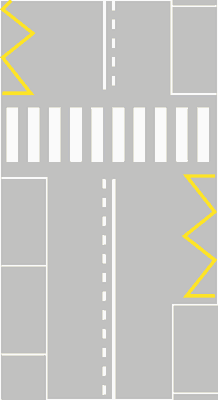
- **📖 الترجمة السياقية:** يمكن أن يسبق معبر المشاة على اليمين خط أصفر متعرج (zig-zag)، كما في الشكل التالي.
- **💡 الشرح والقاعدة المرورية:** صحيح (VERO). يسمح كود السير برسم خط أصفر متعرج قبل معبر المشاة لتنبيه السائقين وحظر وقوف وركن السيارات التي تحجب رؤية المشاة.
- **⚠️ كشف الفخ:** فخ الامتحان: الخط الأصفر المتعرج قبل معبر المشاة يمنع الركن لحماية رؤية المشاة.
- **🔑 الكلمات المفتاحية:** `{'it': 'striscia gialla a zig zag', 'ar': 'خط أصفر متعرج'}` | `{'it': 'preceduto sulla destra', 'ar': 'يسبقه على اليمين'}` | `{'it': 'vero', 'ar': 'صحيح'}`

---

**169.** La segnaletica in figura posta su strade extraurbane secondarie deve essere preceduta dal segnale di pericolo ATTRAVERSAMENTO PEDONALE
- **الإجابة:** `VERO ✅ (صح)`
- 
- **📖 الترجمة السياقية:** يجب أن تُسبق التخطيطات في الشكل عند وضعها على الطرق الثانوية خارج المدن بشاخصة الخطر 'معبر مشاة'.
- **💡 الشرح والقاعدة المرورية:** صحيح (VERO). خارج المدن حيث السرعات أعلى، يجب وضع شاخصة الخطر المثلثة الحمراء (معبر مشاة) على مسافة 150 متراً قبل الخطوط الأرضية لتنبيه السائقين.
- **⚠️ كشف الفخ:** فخ الامتحان: على الطرق خارج المدن، شاخصة الخطر المثلثة على بعد 150م إلزامية قبل معبر المشاة.
- **🔑 الكلمات المفتاحية:** `{'it': 'strade extraurbane secondarie', 'ar': 'طرق ثانوية خارج المدن'}` | `{'it': 'segnale di pericolo ATTRAVERSAMENTO PEDONALE', 'ar': 'شاخصة خطر معبر مشاة'}` | `{'it': 'preceduta', 'ar': 'تُسبق بها'}` | `{'it': 'vero', 'ar': 'صحيح'}`

---

**170.** La segnaletica in figura obbliga i conducenti a fermarsi e dare la precedenza ai pedoni che si accingono ad attraversare
- **الإجابة:** `VERO ✅ (صح)`
- 
- **📖 الترجمة السياقية:** تلزم التخطيطات في الشكل قائدي المركبات بالتوقف وإعطاء الأسبقية للمشاة الذين يستعدون للعبور (si accingono ad attraversare).
- **💡 الشرح والقاعدة المرورية:** صحيح (VERO). التعديلات الصارمة لكود السير تفرض التوقف ليس فقط لمن نزل بالفعل إلى الشارع، بل حتى لمن يقف على الرصيف متأهباً ومستعداً للعبور.
- **⚠️ كشف الفخ:** فخ الامتحان: التوقف واجب حتى للمشاة المتأهبين للعبور على حافة الرصيف (si accingono ad attraversare).
- **🔑 الكلمات المفتاحية:** `{'it': 'si accingono ad attraversare', 'ar': 'يستعدون ويتأهبون للعبور'}` | `{'it': 'dare la precedenza', 'ar': 'إعطاء الأسبقية'}` | `{'it': 'obbligo di fermarsi', 'ar': 'وجوب التوقف'}` | `{'it': 'vero', 'ar': 'صحيح'}`

---

**171.** La segnaletica in figura indica un'isola di traffico
- **الإجابة:** `FALSO ❌ (خطأ)`
- 
- **📖 الترجمة السياقية:** تشير التخطيطات في الشكل إلى جزيرة مرورية (isola di traffico).
- **💡 الشرح والقاعدة المرورية:** خطأ (FALSO). التخطيط يمثل معبراً للمشاة، بينما الجزيرة المرورية ترسم بخطوط بيضاء مائلة محاطة بخط متصل.
- **⚠️ كشف الفخ:** فخ الامتحان: الخلط بين خطوط معبر المشاة والجزيرة المرورية.
- **🔑 الكلمات المفتاحية:** `{'it': 'isola di traffico', 'ar': 'جزيرة مرورية (فخ)'}` | `{'it': 'attraversamento pedonale', 'ar': 'معبر مشاة'}` | `{'it': 'falso', 'ar': 'خطأ'}`

---

**172.** La segnaletica in figura indica un attraversamento per ciclisti
- **الإجابة:** `FALSO ❌ (خطأ)`
- 
- **📖 الترجمة السياقية:** تشير التخطيطات في الشكل إلى معبر مخصص لراكبي الدراجات الهوائية (attraversamento per ciclisti).
- **💡 الشرح والقاعدة المرورية:** خطأ (FALSO). هذا معبر مشاة؛ أما معبر الدراجات الهوائية فيرسم بمربعات بيضاء متقطعة ومتباعدة (quadrati bianchi discontinui).
- **⚠️ كشف الفخ:** فخ الامتحان: معبر الدراجات يتكون من مربعات بيضاء متقطعة وليس خطوط حمار وحشي عريضة متقاربة.
- **🔑 الكلمات المفتاحية:** `{'it': 'attraversamento per ciclisti', 'ar': 'معبر لراكبي الدراجات (فخ)'}` | `{'it': 'quadri bianchi', 'ar': 'مربعات بيضاء للمعبر الدراجي'}` | `{'it': 'falso', 'ar': 'خطأ'}`

---

**173.** La segnaletica in figura indica un attraversamento ciclabile
- **الإجابة:** `FALSO ❌ (خطأ)`
- 
- **📖 الترجمة السياقية:** تشير التخطيطات في الشكل إلى معبر للدراجات (attraversamento ciclabile).
- **💡 الشرح والقاعدة المرورية:** خطأ (FALSO). التخطيط خاص بالمشاة فقط وليس معبراً للدراجات الهوائية.
- **⚠️ كشف الفخ:** فخ الامتحان: معبر الدراجات له تخطيط مربعات مستقل تماماً.
- **🔑 الكلمات المفتاحية:** `{'it': 'attraversamento ciclabile', 'ar': 'معبر دراجات (فخ)'}` | `{'it': 'attraversamento pedonale', 'ar': 'معبر مشاة'}` | `{'it': 'falso', 'ar': 'خطأ'}`

---

**174.** La segnaletica in figura indica un passo carrabile
- **الإجابة:** `FALSO ❌ (خطأ)`
- 
- **📖 الترجمة السياقية:** تشير التخطيطات في الشكل إلى مدخل عقار أو مرآب خاص (passo carrabile).
- **💡 الشرح والقاعدة المرورية:** خطأ (FALSO). التخطيط هو معبر مشاة (attraversamento pedonale)، بينما مدخل العقار الخاص يوضح بلافتة معدنية رسمية مرقمة تحمل ترخيص البلدية.
- **⚠️ كشف الفخ:** فخ الامتحان: الخلط بين خطوط معبر المشاة ولافتة مدخل العقار الخاص.
- **🔑 الكلمات المفتاحية:** `{'it': 'passo carrabile', 'ar': 'مدخل عقار خاص (فخ)'}` | `{'it': 'attraversamento pedonale', 'ar': 'معبر مشاة'}` | `{'it': 'falso', 'ar': 'خطأ'}`

---

**175.** La segnaletica in figura è un'isola di rifugio per pedoni e ciclisti
- **الإجابة:** `FALSO ❌ (خطأ)`
- 
- **📖 الترجمة السياقية:** التخطيط في الشكل هو جزيرة أمان وحماية للمشاة والدراجين (isola di rifugio).
- **💡 الشرح والقاعدة المرورية:** خطأ (FALSO). هذا معبر مشاة أرضي مستوٍ وليس جزيرة ملاذ أو رصيف أمان مرتفع في منتصف الطريق.
- **⚠️ كشف الفخ:** فخ الامتحان: خطوط المعبر ليست جزيرة حماية أو رصيف لجوء مرتفع.
- **🔑 الكلمات المفتاحية:** `{'it': 'isola di rifugio', 'ar': 'جزيرة ملاذ وحماية (فخ)'}` | `{'it': 'strisce pedonali', 'ar': 'خطوط مشاة'}` | `{'it': 'falso', 'ar': 'خطأ'}`

---

**176.** La segnaletica in figura non consente ai veicoli di transitarci sopra
- **الإجابة:** `FALSO ❌ (خطأ)`
- 
- **📖 الترجمة السياقية:** لا تسمح التخطيطات في الشكل للمركبات بالمرور فوقها إطلاقاً.
- **💡 الشرح والقاعدة المرورية:** خطأ (FALSO). يجوز للمركبات المرور والعبور فوق خطوط المشاة عند خلو المعبر من المشاة؛ والمحظور فقط هو الوقوف أو التوقف فوقها أو عدم إعطاء الأسبقية للمشاة.
- **⚠️ كشف الفخ:** فخ الامتحان: المرور فوق خطوط المشاة مسموح عند خلوها من المارة، والممنوع هو الوقوف عليها.
- **🔑 الكلمات المفتاحية:** `{'it': 'non consente di transitarci sopra', 'ar': 'لا تسمح بالمرور فوقها (فخ)'}` | `{'it': 'transito consentito', 'ar': 'المرور العابر مسموح'}` | `{'it': 'falso', 'ar': 'خطأ'}`

---

**177.** La segnaletica in figura indica un'area riservata ai soli pedoni disabili
- **الإجابة:** `FALSO ❌ (خطأ)`
- 
- **📖 الترجمة السياقية:** تشير التخطيطات في الشكل إلى منطقة مخصصة حصراً للمشاة من ذوي الاحتياجات الخاصة (pedoni disabili).
- **💡 الشرح والقاعدة المرورية:** خطأ (FALSO). المعبر مخصص لعبور جميع فئات المشاة عامة، ولا يقتصر على ذوي الاحتياجات الخاصة فقط.
- **⚠️ كشف الفخ:** فخ الامتحان: خطوط المشاة عامة للجميع وليست مقتصرة على فئة معينة.
- **🔑 الكلمات المفتاحية:** `{'it': 'soli pedoni disabili', 'ar': 'المشاة ذوو الاحتياجات الخاصة فقط (فخ)'}` | `{'it': 'tutti i pedoni', 'ar': 'كافة المشاة'}` | `{'it': 'falso', 'ar': 'خطأ'}`

---

**178.** La segnaletica in figura non consente il transito ai pedoni
- **الإجابة:** `FALSO ❌ (خطأ)`
- 
- **📖 الترجمة السياقية:** لا تسمح التخطيطات في الشكل بمرور المشاة.
- **💡 الشرح والقاعدة المرورية:** خطأ (FALSO). التخطيط صُمم وأُنشئ خصيصاً لتمكين المشاة من العبور بأمان؛ فكيف لا يسمح بمرورهم!
- **⚠️ كشف الفخ:** فخ الامتحان: عبارة معاكسة تماماً لوظيفة معبر المشاة الحقيقية.
- **🔑 الكلمات المفتاحية:** `{'it': 'non consente il transito ai pedoni', 'ar': 'لا تسمح بمرور المشاة (فخ سخيف)'}` | `{'it': 'riservata ai pedoni', 'ar': 'مخصصة للمشاة'}` | `{'it': 'falso', 'ar': 'خطأ'}`

---

## 📌 Striscia arresto (10 domande)

**179.** La striscia bianca trasversale in figura può essere abbinata ad un incrocio regolato da semaforo
- **الإجابة:** `VERO ✅ (صح)`
- 
- **📖 الترجمة السياقية:** يمكن أن يقترن الخط الأبيض العرضي في الشكل بتقاطع منظم بإشارة ضوئية.
- **💡 الشرح والقاعدة المرورية:** صحيح (VERO). خط التوقف العرضي (striscia d'arresto) يرسم قبل التقاطعات الضوئية لتحديد مكان توقف المركبات بدقة عند إضاءة الضوء الأحمر.
- **⚠️ كشف الفخ:** فخ الامتحان: خط التوقف العرضي يقترن دائماً بالإشارات الضوئية والتقاطعات المنظمة.
- **🔑 الكلمات المفتاحية:** `{'it': 'incrocio regolato da semaforo', 'ar': 'تقاطع منظم بإشارة ضوئية'}` | `{'it': 'striscia bianca trasversale', 'ar': 'خط أبيض عرضي'}` | `{'it': 'arresto', 'ar': 'توقف'}` | `{'it': 'vero', 'ar': 'صحيح'}`

---

**180.** La striscia bianca trasversale in figura può essere completata con la scritta STOP, dipinta sulla pavimentazione stradale
- **الإجابة:** `VERO ✅ (صح)`
- 
- **📖 الترجمة السياقية:** يمكن استكمال الخط الأبيض العرضي في الشكل بكلمة STOP المطلية على أرضية الطريق.
- **💡 الشرح والقاعدة المرورية:** صحيح (VERO). عندما يرتبط الخط بشاخصة قف، تُدهن كلمة STOP بأحرف بيضاء كبيرة على الإسفلت قبل الخط مباشرة لتأكيد وجوب التوقف.
- **⚠️ كشف الفخ:** فخ الامتحان: كلمة STOP ترسم على الأسفلت مرافقة لخط التوقف العرضي.
- **🔑 الكلمات المفتاحية:** `{'it': 'scritta STOP dipinta sulla pavimentazione', 'ar': 'كتابة STOP على الأسفلت'}` | `{'it': 'completata', 'ar': 'تُستكمل بها'}` | `{'it': 'vero', 'ar': 'صحيح'}`

---

**181.** La striscia bianca trasversale in figura indica il punto in cui i conducenti devono arrestarsi in presenza del segnale FERMARSI E DARE PRECEDENZA (STOP)
- **الإجابة:** `VERO ✅ (صح)`
- 
- **📖 الترجمة السياقية:** يشير الخط الأبيض العرضي في الشكل إلى النقطة التي يجب على قائدي المركبات التوقف عندها في وجود شاخصة قف (STOP).
- **💡 الشرح والقاعدة المرورية:** صحيح (VERO). خط التوقف العرضي المتصل يحدد الحد القانوني المتقدم الذي يجب إيقاف عجلات المركبة قبله تماماً دون تجاوزه عند شاخصة قف.
- **⚠️ كشف الفخ:** فخ الامتحان: مكان التوقف الإلزامي لشاخصة قف هو قبل هذا الخط العرضي مباشرة.
- **🔑 الكلمات المفتاحية:** `{'it': 'punto in cui arrestarsi con STOP', 'ar': 'نقطة التوقف مع شاخصة قف'}` | `{'it': 'prima della striscia', 'ar': 'قبل الخط'}` | `{'it': 'vero', 'ar': 'صحيح'}`

---

**182.** La striscia bianca trasversale in figura indica il punto in cui i conducenti devono arrestarsi in presenza del semaforo a luce rossa
- **الإجابة:** `VERO ✅ (صح)`
- 
- **📖 الترجمة السياقية:** يشير الخط الأبيض العرضي في الشكل إلى النقطة التي يجب على قائدي المركبات التوقف عندها عند وجود ضوء أحمر في الإشارة الضوئية.
- **💡 الشرح والقاعدة المرورية:** صحيح (VERO). عند إضاءة الضوء الأحمر، يجب التوقف التام خلف هذا الخط العرضي وعدم تجاوزه أو التوقف فوقه.
- **⚠️ كشف الفخ:** فخ الامتحان: الخط العرضي هو الحد المكاني للتوقف أمام الضوء الأحمر.
- **🔑 الكلمات المفتاحية:** `{'it': 'semaforo a luce rossa', 'ar': 'إشارة ضوئية بضوء أحمر'}` | `{'it': 'punto di arresto', 'ar': 'نقطة التوقف'}` | `{'it': 'vero', 'ar': 'صحيح'}`

---

**183.** Il segnale raffigurato è una striscia trasversale di arresto
- **الإجابة:** `VERO ✅ (صح)`
- 
- **📖 الترجمة السياقية:** التخطيط الأرضي الموضح في الشكل هو خط توقف عرضي (striscia trasversale di arresto).
- **💡 الشرح والقاعدة المرورية:** صحيح (VERO). هذا هو التعريف القانوني الرسمي الدقيق للخط الأبيض المتصل الممتد بالعرض عبر مسالك السير.
- **⚠️ كشف الفخ:** فخ الامتحان: الاسم الرسمي هو خط التوقف العرضي.
- **🔑 الكلمات المفتاحية:** `{'it': 'striscia trasversale di arresto', 'ar': 'خط توقف عرضي'}` | `{'it': 'definizione', 'ar': 'تعريف رسمي'}` | `{'it': 'vero', 'ar': 'صحيح'}`

---

**184.** La striscia bianca trasversale in figura viene abbinata con il segnale di DARE PRECEDENZA
- **الإجابة:** `FALSO ❌ (خطأ)`
- 
- **📖 الترجمة السياقية:** يقترن الخط الأبيض العرضي في الشكل بشاخصة إعطاء الأسبقية (DARE PRECEDENZA).
- **💡 الشرح والقاعدة المرورية:** خطأ (FALSO). شاخصة إعطاء الأسبقية لا يقترن بها خط متصل، بل يقترن بها خط عرضي مكون من سلسلة مثلثات بيضاء صغيرة مفرغة متجهة نحو السائق.
- **⚠️ كشف الفخ:** فخ الامتحان: إعطاء الأسبقية يقترن بخط مثلثات مفرغة، بينما الخط العرضي المتصل يقترن بشاخصة قف STOP أو الإشارة الضوئية.
- **🔑 الكلمات المفتاحية:** `{'it': 'abbinata con DARE PRECEDENZA', 'ar': 'يقترن بإعطاء الأسبقية (فخ)'}` | `{'it': 'triangolini', 'ar': 'مثلثات صغيرة'}` | `{'it': 'falso', 'ar': 'خطأ'}`

---

**185.** La striscia bianca trasversale in figura indica un attraversamento pedonale non regolato
- **الإجابة:** `FALSO ❌ (خطأ)`
- 
- **📖 الترجمة السياقية:** يشير الخط الأبيض العرضي في الشكل إلى معبر مشاة غير منظم (attraversamento pedonale non regolato).
- **💡 الشرح والقاعدة المرورية:** خطأ (FALSO). معبر المشاة يرسم بخطوط حمار وحشي عريضة متوازية مع محور الطريق، ولا يمثله خط عرضي مفرد.
- **⚠️ كشف الفخ:** فخ الامتحان: الخط العرضي المفرد هو خط توقف سيارات وليس معبر مشاة.
- **🔑 الكلمات المفتاحية:** `{'it': 'attraversamento pedonale non regolato', 'ar': 'معبر مشاة غير منظم (فخ)'}` | `{'it': "striscia d'arresto", 'ar': 'خط توقف'}` | `{'it': 'falso', 'ar': 'خطأ'}`

---

**186.** La striscia bianca trasversale in figura indica un attraversamento ciclabile
- **الإجابة:** `FALSO ❌ (خطأ)`
- 
- **📖 الترجمة السياقية:** يشير الخط الأبيض العرضي في الشكل إلى معبر للدراجات الهوائية (attraversamento ciclabile).
- **💡 الشرح والقاعدة المرورية:** خطأ (FALSO). معبر الدراجات يرسم بمربعات بيضاء متقطعة على جانبي المسار، وليس بخط عرضي متصل مفرد.
- **⚠️ كشف الفخ:** فخ الامتحان: معبر الدراجات يتكون من صفين من المربعات البيضاء.
- **🔑 الكلمات المفتاحية:** `{'it': 'attraversamento ciclabile', 'ar': 'معبر دراجات (فخ)'}` | `{'it': 'quadri bianchi', 'ar': 'مربعات بيضاء'}` | `{'it': 'falso', 'ar': 'خطأ'}`

---

**187.** La striscia bianca trasversale in figura non può mai essere superata
- **الإجابة:** `FALSO ❌ (خطأ)`
- 
- **📖 الترجمة السياقية:** لا يجوز تخطي الخط الأبيض العرضي في الشكل في أي حال من الأحوال (mai).
- **💡 الشرح والقاعدة المرورية:** خطأ (FALSO). كلمة 'mai' باطلة؛ فالخط العرضي يتم تخطيه والعبور فوقه بطبيعة الحال عند إضاءة الضوء الأخضر أو بعد التوقف والتأكد من خلو الطريق عند إشارة STOP.
- **⚠️ كشف الفخ:** فخ الامتحان: الخط العرضي يحدد مكان الوقوف عند اللزوم، ويُتخطى فوراً عند إذن المرور.
- **🔑 الكلمات المفتاحية:** `{'it': 'non può mai essere superata', 'ar': 'لا يجوز تخطيه أبداً (فخ)'}` | `{'it': 'si supera con il verde', 'ar': 'يُتخطى مع الضوء الأخضر'}` | `{'it': 'falso', 'ar': 'خطأ'}`

---

**188.** La striscia bianca trasversale in figura indica l'inizio del divieto di sosta
- **الإجابة:** `FALSO ❌ (خطأ)`
- 
- **📖 الترجمة السياقية:** يشير الخط الأبيض العرضي في الشكل إلى بداية منطقة منع الوقوف (inizio del divieto di sosta).
- **💡 الشرح والقاعدة المرورية:** خطأ (FALSO). منع الوقوف يعلن عنه بشاخصة عمودية دائرية زرقاء بإطار أحمر أو طلاء أصفر وأسود على الرصيف، ولا شأن لخط التوقف العرضي به.
- **⚠️ كشف الفخ:** فخ الامتحان: لا علاقة لخط التوقف ببدء منع الوقوف والركن.
- **🔑 الكلمات المفتاحية:** `{'it': 'inizio del divieto di sosta', 'ar': 'بداية منع الوقوف (فخ)'}` | `{'it': "arresto all'incrocio", 'ar': 'توقف عند التقاطع'}` | `{'it': 'falso', 'ar': 'خطأ'}`

---

## 📌 Striscia bianca discontinua strade doppio senso (7 domande)

**189.** In una strada a doppio senso di circolazione con la segnaletica indicata in figura si può effettuare un sorpasso anche superando la striscia di mezzo
- **الإجابة:** `VERO ✅ (صح)`
- 
- **📖 الترجمة السياقية:** في طريق ذي اتجاهين للسير مع التخطيطات الموضحة في الشكل، يجوز إجراء التجاوز حتى مع تخطي الخط الأوسط.
- **💡 الشرح والقاعدة المرورية:** صحيح (VERO). بما أن الخط الأوسط متقطع، فيحق للسائق تخطيه وشغل المسلك المقابل مؤقتاً للتجاوز إذا سمحت الرؤية وانعدم الخطر.
- **⚠️ كشف الفخ:** فخ الامتحان: الخط المتقطع يسمح بالتجاوز بتخطي الخط في الطريق ذي الاتجاهين مع توفر شروط الأمان.
- **🔑 الكلمات المفتاحية:** `{'it': 'sorpasso superando la striscia', 'ar': 'التجاوز بتخطي الخط'}` | `{'it': 'strada a doppio senso', 'ar': 'طريق ذو اتجاهين'}` | `{'it': 'striscia discontinua', 'ar': 'خط متقطع'}` | `{'it': 'vero', 'ar': 'صحيح'}`

---

**190.** In una strada a doppio senso di circolazione con la segnaletica indicata in figura non si può circolare stando a cavallo della striscia di mezzo
- **الإجابة:** `VERO ✅ (صح)`
- 
- **📖 الترجمة السياقية:** في طريق ذي اتجاهين للسير مع التخطيطات الموضحة في الشكل، لا يجوز السير مع ركوب وتوسّط الخط الأوسط بالمركبة.
- **💡 الشرح والقاعدة المرورية:** صحيح (VERO). ركوب الخط (marcia a cavallo) محظور دائماً؛ ويجب على السائق التزام مسلكه الأيمن المخصص له بالكامل.
- **⚠️ كشف الفخ:** فخ الامتحان: قاعدة صارمة: السير ركوباً فوق الخط الأوسط ممنوع قطعاً.
- **🔑 الكلمات المفتاحية:** `{'it': 'non si può circolare a cavallo', 'ar': 'لا يجوز السير راكباً فوق الخط'}` | `{'it': 'corsia propria', 'ar': 'المسلك المخصص'}` | `{'it': 'vero', 'ar': 'صحيح'}`

---

**191.** In una strada a doppio senso di circolazione con la segnaletica indicata in figura per svoltare a sinistra bisogna spostarsi verso il centro della carreggiata
- **الإجابة:** `VERO ✅ (صح)`
- 
- **📖 الترجمة السياقية:** في طريق ذي اتجاهين للسير مع التخطيطات الموضحة في الشكل، للانعطاف إلى اليسار يجب الاقتراب نحو منتصف نهر الطريق.
- **💡 الشرح والقاعدة المرورية:** صحيح (VERO). في الطرق ذات الاتجاهين، يقترب السائق تدريجياً من خط المنتصف المتقطع دون تخطيه قبل الانعطاف لليسار لإفساح المجال لمن خلفه للتجاوز من اليمين.
- **⚠️ كشف الفخ:** فخ الامتحان: الانعطاف يساراً في الطريق ذي الاتجاهين يتطلب الاقتراب من منتصف نهر الطريق (verso il centro della carreggiata).
- **🔑 الكلمات المفتاحية:** `{'it': 'svoltare a sinistra verso il centro', 'ar': 'الانعطاف يساراً نحو المنتصف'}` | `{'it': 'asse della carreggiata', 'ar': 'محور نهر الطريق'}` | `{'it': 'vero', 'ar': 'صحيح'}`

---

**192.** In una strada a doppio senso di circolazione con la segnaletica indicata in figura si può sorpassare con qualsiasi condizione di visibilità e di traffico
- **الإجابة:** `FALSO ❌ (خطأ)`
- 
- **📖 الترجمة السياقية:** في طريق ذي اتجاهين للسير مع التخطيطات الموضحة في الشكل، يجوز التجاوز في أي ظرف من ظروف الرؤية وحركة المرور.
- **💡 الشرح والقاعدة المرورية:** خطأ (FALSO). التجاوز مشروط حتماً بتوفر رؤية واضحة ومسافة أمان كافية وخلو المسلك المقابل من الخطر، ولا يجوز في أي ظرف عشوائي.
- **⚠️ كشف الفخ:** فخ الامتحان: عبارة 'con qualsiasi condizione' باطلة؛ فالأمان والرؤية شرطان حاسمان للتجاوز.
- **🔑 الكلمات المفتاحية:** `{'it': 'qualsiasi condizione di visibilità', 'ar': 'أي ظرف من ظروف الرؤية (فخ)'}` | `{'it': 'solo con sicurezza', 'ar': 'فقط مع توفر الأمان'}` | `{'it': 'falso', 'ar': 'خطأ'}`

---

**193.** In una strada a doppio senso di circolazione con la segnaletica indicata in figura si può sorpassare anche in curva, ma solo in città
- **الإجابة:** `FALSO ❌ (خطأ)`
- 
- **📖 الترجمة السياقية:** في طريق ذي اتجاهين للسير مع التخطيطات الموضحة في الشكل، يجوز التجاوز حتى في المنعطف، ولكن فقط داخل المدينة.
- **💡 الشرح والقاعدة المرورية:** خطأ (FALSO). في الطرق ذات الاتجاهين ذات المسلكين، يُمنع التجاوز في المنعطفات منعاً باتاً سواء كان ذلك داخل المدن أو خارجها لانعدام الرؤية وخطر الاصطدام المقابل.
- **⚠️ كشف الفخ:** فخ الامتحان: التجاوز في المنعطف ممنوع كلياً في الطرق ذات الاتجاهين والمسلكين حتى داخل المدينة.
- **🔑 الكلمات المفتاحية:** `{'it': 'in curva solo in città', 'ar': 'في المنعطف داخل المدينة فقط (فخ)'}` | `{'it': 'vietato in curva a doppio senso', 'ar': 'ممنوع بالمنعطف في الاتجاهين'}` | `{'it': 'falso', 'ar': 'خطأ'}`

---

**194.** In una strada a doppio senso di circolazione con la segnaletica indicata in figura si può fare l'inversione di marcia, ma senza occupare l'altra corsia
- **الإجابة:** `FALSO ❌ (خطأ)`
- 
- **📖 الترجمة السياقية:** في طريق ذي اتجاهين للسير مع التخطيطات الموضحة في الشكل، يجوز القيام بالدوران للخلف ولكن دون شغل المسلك الآخر.
- **💡 الشرح والقاعدة المرورية:** خطأ (FALSO). الدوران للخلف (inversione) يتطلب بطبيعته الالتفاف وشغل المسلك المقابل؛ وهو مسموح به فوق الخط المتقطع بشغل المسلك المقابل بأمان.
- **⚠️ كشف الفخ:** فخ الامتحان: عبارة 'دون شغل المسلك الآخر' غير منطقية ومستحيلة هندسياً في نهر طريق بمسلكين.
- **🔑 الكلمات المفتاحية:** `{'it': "senza occupare l'altra corsia", 'ar': 'دون شغل المسلك الآخر (تناقض مستحيل)'}` | `{'it': 'inversione consentita', 'ar': 'الدوران مسموح بأمان'}` | `{'it': 'falso', 'ar': 'خطأ'}`

---

**195.** In una strada a doppio senso di circolazione con la segnaletica indicata in figura, fuori dei centri abitati la corsia di sinistra serve per la sosta d'emergenza
- **الإجابة:** `FALSO ❌ (خطأ)`
- 
- **📖 الترجمة السياقية:** في طريق ذي اتجاهين للسير مع التخطيطات الموضحة في الشكل، يُستخدم المسلك الأيسر خارج التجمعات السكنية للتوقف الاضطراري.
- **💡 الشرح والقاعدة المرورية:** خطأ (FALSO). المسلك الأيسر مخصص لحركة المرور المعاكسة؛ والتوقف فيه يعني الوقوف في وجه السيارات القادمة في الاتجاه المقابل وهو خطر قاتل وممنوع تماماً.
- **⚠️ كشف الفخ:** فخ الامتحان: المسلك الأيسر في السير المزدوج هو اتجاه سير معاكس وليس مسلك طوارئ.
- **🔑 الكلمات المفتاحية:** `{'it': "corsia di sinistra per sosta d'emergenza", 'ar': 'المسلك الأيسر للتوقف الاضطراري (فخ قاتل)'}` | `{'it': 'senso opposto', 'ar': 'اتجاه معاكس'}` | `{'it': 'falso', 'ar': 'خطأ'}`

---

## 📌 Carreggiata doppio senso circolazione (7 domande)

**196.** In una carreggiata a doppio senso di circolazione la striscia di mezzo può essere continua o discontinua (tratteggiata)
- **الإجابة:** `VERO ✅ (صح)`
- **📖 الترجمة السياقية:** في نهر طريق ذي اتجاهين للسير، يمكن أن يكون الخط الأوسط متصلاً أو متقطعاً.
- **💡 الشرح والقاعدة المرورية:** صحيح (VERO). يرسم الخط الأوسط الفاصل لاتجاهي السير إما متصلاً (حيث يُمنع التجاوز والتخطي) أو متقطعاً (حيث يُسمح بالتخطي بأمان).
- **⚠️ كشف الفخ:** فخ الامتحان: كلا النوعين (متصل أو متقطع) مستخدم قانونياً في السير ذي الاتجاهين.
- **🔑 الكلمات المفتاحية:** `{'it': 'continua o discontinua', 'ar': 'متصل أو متقطع'}` | `{'it': 'striscia di mezzo', 'ar': 'الخط الأوسط'}` | `{'it': 'doppio senso', 'ar': 'اتجاهان'}` | `{'it': 'vero', 'ar': 'صحيح'}`

---

**197.** In una carreggiata a doppio senso di circolazione la striscia di mezzo, se discontinua (tratteggiata), può essere superata durante un sorpasso
- **الإجابة:** `VERO ✅ (صح)`
- **📖 الترجمة السياقية:** في نهر طريق ذي اتجاهين للسير، يجوز تخطي الخط الأوسط أثناء التجاوز إذا كان متقطعاً.
- **💡 الشرح والقاعدة المرورية:** صحيح (VERO). الخط المتقطع يتيح للسائق اجتيازه وشغل جزء من المسار المعاكس مؤقتاً لإتمام التجاوز إذا سمحت الرؤية.
- **⚠️ كشف الفخ:** فخ الامتحان: الخط المتقطع يبيح التخطي أثناء التجاوز.
- **🔑 الكلمات المفتاحية:** `{'it': 'può essere superata durante sorpasso', 'ar': 'يجوز تخطيه أثناء التجاوز'}` | `{'it': 'striscia discontinua', 'ar': 'خط متقطع'}` | `{'it': 'vero', 'ar': 'صحيح'}`

---

**198.** In una carreggiata a doppio senso di circolazione la linea di mezzo può essere costituita da due strisce continue affiancate, come in figura
- **الإجابة:** `VERO ✅ (صح)`
- 
- **📖 الترجمة السياقية:** في نهر طريق ذي اتجاهين للسير، يمكن أن يتكون الخط الأوسط من خطين متصلين متجاورين كما في الشكل.
- **💡 الشرح والقاعدة المرورية:** صحيح (VERO). يُستخدم الخط المزدوج المتصل (doppia striscia continua) في الطرق العريضة ذات الاتجاهين لتعزيز الفصل ومنع الاجتياز بصرامة.
- **⚠️ كشف الفخ:** فخ الامتحان: الخط المزدوج المتصل نموذج معتمد ورسمي لخط المنتصف في السير المزدوج.
- **🔑 الكلمات المفتاحية:** `{'it': 'due strisce continue affiancate', 'ar': 'خطان متصلان متجاوران'}` | `{'it': 'linea di mezzo', 'ar': 'خط المنتصف'}` | `{'it': 'vero', 'ar': 'صحيح'}`

---

**199.** In una carreggiata a doppio senso di circolazione la linea di mezzo se costituita da strisce continue, come in figura, consente il sorpasso senza superare le linee
- **الإجابة:** `VERO ✅ (صح)`
- 
- **📖 الترجمة السياقية:** في نهر طريق ذي اتجاهين للسير، إذا كان خط المنتصف مكوناً من خطوط متصلة كما في الشكل، فإنه يسمح بالتجاوز دون تخطي الخطوط.
- **💡 الشرح والقاعدة المرورية:** صحيح (VERO). التجاوز مسموح به إذا كانت مساحة المسلك كافية لتجاوز مركبة ذات عجلتين دون ملامسة أو تجاوز الخط المتصل وبأمان تام.
- **⚠️ كشف الفخ:** فخ الامتحان: الخط المتصل لا يمنع التجاوز إذا تم بالكامل داخل المسلك دون تخطيه (senza superare le linee).
- **🔑 الكلمات المفتاحية:** `{'it': 'sorpasso senza superare le linee', 'ar': 'التجاوز دون تخطي الخطوط'}` | `{'it': 'consentito', 'ar': 'مسموح به'}` | `{'it': 'vero', 'ar': 'صحيح'}`

---

**200.** Nella carreggiata a doppio senso di circolazione le strisce di mezzo in figura dividono i sensi di marcia
- **الإجابة:** `VERO ✅ (صح)`
- 
- **📖 الترجمة السياقية:** في نهر طريق ذي اتجاهين للسير، تقسم خطوط المنتصف في الشكل اتجاهي السير.
- **💡 الشرح والقاعدة المرورية:** صحيح (VERO). الوظيفة القانونية الأساسية للخطوط المركزية هي الفصل التام بين تدفق السير المتقدم وتدفق السير المعاكس.
- **⚠️ كشف الفخ:** فخ الامتحان: الخطوط المركزية تفصل اتجاهات السير (dividono i sensi di marcia).
- **🔑 الكلمات المفتاحية:** `{'it': 'dividono i sensi di marcia', 'ar': 'تفصل اتجاهي السير'}` | `{'it': 'strisce di mezzo', 'ar': 'خطوط المنتصف'}` | `{'it': 'vero', 'ar': 'صحيح'}`

---

**201.** Nella carreggiata a doppio senso di circolazione la striscia di mezzo in figura, può essere superata con le sole ruote di sinistra
- **الإجابة:** `FALSO ❌ (خطأ)`
- 
- **📖 الترجمة السياقية:** في نهر طريق ذي اتجاهين للسير، يجوز تخطي الخط الأوسط في الشكل بالعجلات اليسرى فقط.
- **💡 الشرح والقاعدة المرورية:** خطأ (FALSO). الخط المتصل لا يجوز تخطيه أو وطؤه بأي عجلة من عجلات المركبة، سواء العجلات اليسرى أو غيرها.
- **⚠️ كشف الفخ:** فخ الامتحان: عبارة 'con le sole ruote di sinistra' فخ شهير وباطل؛ فالخط المتصل لا يُلمس نهائياً.
- **🔑 الكلمات المفتاحية:** `{'it': 'con le sole ruote di sinistra', 'ar': 'بالعجلات اليسرى فقط (فخ)'}` | `{'it': 'divieto assoluto', 'ar': 'منع مطلق'}` | `{'it': 'falso', 'ar': 'خطأ'}`

---

**202.** Nella carreggiata a doppio senso di circolazione come in figura la striscia di mezzo divide la strada in due carreggiate, ognuna a due corsie
- **الإجابة:** `FALSO ❌ (خطأ)`
- 
- **📖 الترجمة السياقية:** في نهر طريق ذي اتجاهين للسير كما في الشكل، يقسم الخط الأوسط الطريق إلى نهري طريق، كل منهما بمسلكين.
- **💡 الشرح والقاعدة المرورية:** خطأ (FALSO). الخطوط الأرضية تقسم نهر الطريق إلى مسالك، ولا تقسم الطريق إلى نهري طريق؛ تقسيم نهري الطريق يتطلب حاجزاً مادياً خرسانياً أو ترابياً (spartitraffico).
- **⚠️ كشف الفخ:** فخ الامتحان: الخط الطلاء يقسم لمسالك (corsie) وليس لنهري طريق (carreggiate).
- **🔑 الكلمات المفتاحية:** `{'it': 'due carreggiate', 'ar': 'نهري طريق (فخ)'}` | `{'it': 'corsie', 'ar': 'مسالك'}` | `{'it': 'falso', 'ar': 'خطأ'}`

---

## 📌 Striscia bianca continua (10 domande)

**203.** La striscia bianca continua di mezzo in figura divide la carreggiata in due corsie
- **الإجابة:** `VERO ✅ (صح)`
- 
- **📖 الترجمة السياقية:** يقسم الخط الأبيض المتصل الأوسط في الشكل نهر الطريق إلى مسلكين.
- **💡 الشرح والقاعدة المرورية:** صحيح (VERO). الخط الطولي المتصل في المنتصف يقسم عرض نهر الطريق إلى مسلكين نظاميين مخصصين لحركة المرور.
- **⚠️ كشف الفخ:** فخ الامتحان: الخط الأوسط يقسم نهر الطريق إلى مسلكين.
- **🔑 الكلمات المفتاحية:** `{'it': 'divide in due corsie', 'ar': 'يقسم إلى مسلكين'}` | `{'it': 'striscia continua', 'ar': 'خط متصل'}` | `{'it': 'vero', 'ar': 'صحيح'}`

---

**204.** La striscia bianca continua di mezzo in figura non può essere superata
- **الإجابة:** `VERO ✅ (صح)`
- 
- **📖 الترجمة السياقية:** لا يجوز تخطي الخط الأبيض المتصل الأوسط الموضح في الشكل.
- **💡 الشرح والقاعدة المرورية:** صحيح (VERO). الخط المتصل حاجز قانوني لا يجوز اجتيازه أو وطؤه أو قطعه بالمركبة على الإطلاق.
- **⚠️ كشف الفخ:** فخ الامتحان: الخط المتصل لا يجوز تخطيه نهائياً (non può essere superata).
- **🔑 الكلمات المفتاحية:** `{'it': 'non può essere superata', 'ar': 'لا يجوز تخطيه'}` | `{'it': 'invalicabile', 'ar': 'ممنوع الاجتياز'}` | `{'it': 'vero', 'ar': 'صحيح'}`

---

**205.** La striscia bianca continua di mezzo in figura, divide i sensi di marcia nelle strade a doppio senso
- **الإجابة:** `VERO ✅ (صح)`
- 
- **📖 الترجمة السياقية:** يقسم الخط الأبيض المتصل الأوسط في الشكل اتجاهي السير في الطرق ذات الاتجاهين.
- **💡 الشرح والقاعدة المرورية:** صحيح (VERO). في الطرق ذات الاتجاهين والمسلكين، يفصل الخط المتصل حركة السير المتجهة للأمام عن السير المعاكس ويمنع التجاوز الخطر.
- **⚠️ كشف الفخ:** فخ الامتحان: الخط المتصل الأوسط يفصل اتجاهي السير في السير المزدوج.
- **🔑 الكلمات المفتاحية:** `{'it': 'divide i sensi di marcia', 'ar': 'يفصل اتجاهي السير'}` | `{'it': 'strade a doppio senso', 'ar': 'طرق ذات اتجاهين'}` | `{'it': 'vero', 'ar': 'صحيح'}`

---

**206.** La striscia bianca continua di mezzo in figura, sulle strade a doppio senso si può trovare sul tratto in salita di un dosso
- **الإجابة:** `VERO ✅ (صح)`
- 
- **📖 الترجمة السياقية:** يمكن أن يتواجد الخط الأبيض المتصل الأوسط في الشكل على المقطع الصاعد من التل المحدب في الطرق ذات الاتجاهين.
- **💡 الشرح والقاعدة المرورية:** صحيح (VERO). في صعود المرتفع المحدب تنعدم الرؤية تماماً، فيوضع الخط المتصل لمنع السائقين من التجاوز واجتياز المسلك.
- **⚠️ كشف الفخ:** فخ الامتحان: صعود التل المحدب في السير المزدوج يحمل خطاً متصلاً لحظر التجاوز الأعمى.
- **🔑 الكلمات المفتاحية:** `{'it': 'tratto in salita di un dosso', 'ar': 'المقطع الصاعد من التل المحدب'}` | `{'it': 'striscia continua', 'ar': 'خط متصل'}` | `{'it': 'vero', 'ar': 'صحيح'}`

---

**207.** La striscia bianca continua di mezzo in figura, sulle strade a doppio senso può trovarsi in vicinanza degli attraversamenti pedonali
- **الإجابة:** `VERO ✅ (صح)`
- 
- **📖 الترجمة السياقية:** يمكن أن يتواجد الخط الأبيض المتصل الأوسط في الشكل بالقرب من معابر المشاة في الطرق ذات الاتجاهين.
- **💡 الشرح والقاعدة المرورية:** صحيح (VERO). يوضع الخط المتصل قبل معابر المشاة لتثبيت المركبات في مساراتها ومنع التجاوزات الخطيرة التي تهدد حياة المشاة العابرين.
- **⚠️ كشف الفخ:** فخ الامتحان: قبل معابر المشاة يوضع خط متصل لمنع التجاوز الخطير.
- **🔑 الكلمات المفتاحية:** `{'it': 'vicinanza attraversamenti pedonali', 'ar': 'بالقرب من معابر المشاة'}` | `{'it': 'sicurezza pedoni', 'ar': 'سلامة المشاة'}` | `{'it': 'vero', 'ar': 'صحيح'}`

---

**208.** La striscia bianca continua di mezzo in figura permette la manovra di sorpasso senza superarla
- **الإجابة:** `VERO ✅ (صح)`
- 
- **📖 الترجمة السياقية:** يسمح الخط الأبيض المتصل الأوسط في الشكل بمناورة التجاوز دون تخطيه.
- **💡 الشرح والقاعدة المرورية:** صحيح (VERO). يجوز تجاوز دراجة أو مركبة بطيئة بشرط بقاء سيارتك بالكامل داخل مسلكك دون ملامسة أو تجاوز الخط المتصل وبأمان.
- **⚠️ كشف الفخ:** فخ الامتحان: التجاوز مسموح به إذا تم دون تخطي الخط المتصل (senza superarla).
- **🔑 الكلمات المفتاحية:** `{'it': 'manovra di sorpasso senza superarla', 'ar': 'التجاوز دون تخطي الخط'}` | `{'it': 'consentita', 'ar': 'مسموح بها'}` | `{'it': 'vero', 'ar': 'صحيح'}`

---

**209.** La striscia bianca continua di mezzo in figura divide la strada in due carreggiate, ognuna a doppio senso
- **الإجابة:** `FALSO ❌ (خطأ)`
- 
- **📖 الترجمة السياقية:** يقسم الخط الأبيض المتصل الأوسط في الشكل الطريق إلى نهري طريق، كل منهما باتجاهين.
- **💡 الشرح والقاعدة المرورية:** خطأ (FALSO). الخطوط الأرضية تقسم نهر الطريق إلى مسالك فقط، ولا تقسم الطريق إلى نهري طريق مستقلين.
- **⚠️ كشف الفخ:** فخ الامتحان: الخط يقسم إلى مسالك وليس إلى نهري طريق.
- **🔑 الكلمات المفتاحية:** `{'it': 'due carreggiate', 'ar': 'نهري طريق (فخ)'}` | `{'it': 'corsie', 'ar': 'مسالك'}` | `{'it': 'falso', 'ar': 'خطأ'}`

---

**210.** La striscia bianca continua di mezzo in figura consente di marciarvi a cavallo
- **الإجابة:** `FALSO ❌ (خطأ)`
- 
- **📖 الترجمة السياقية:** يسمح الخط الأبيض المتصل الأوسط في الشكل بالسير مع ركوبه بالمركبة (marciarvi a cavallo).
- **💡 الشرح والقاعدة المرورية:** خطأ (FALSO). السير ركوباً فوق الخط محظور وممنوع قانوناً، ويجب السير بالكامل داخل المسلك الأيمن.
- **⚠️ كشف الفخ:** فخ الامتحان: السير راكباً الخط ممنوع قطعاً.
- **🔑 الكلمات المفتاحية:** `{'it': 'marciarvi a cavallo', 'ar': 'السير راكباً فوقه (فخ)'}` | `{'it': 'divieto assoluto', 'ar': 'منع مطلق'}` | `{'it': 'falso', 'ar': 'خطأ'}`

---

**211.** La striscia bianca continua di mezzo in figura consente il sorpasso anche superandola, purché con le sole ruote di sinistra
- **الإجابة:** `FALSO ❌ (خطأ)`
- 
- **📖 الترجمة السياقية:** يسمح الخط الأبيض المتصل الأوسط في الشكل بالتجاوز حتى مع تخطيه، بشرط أن يكون بالعجلات اليسرى فقط.
- **💡 الشرح والقاعدة المرورية:** خطأ (FALSO). الخط المتصل يمنع التخطي والملامسة بأي عجلة كانت؛ ولا استثناء للعجلات اليسرى.
- **⚠️ كشف الفخ:** فخ الامتحان: عبارة 'العجلات اليسرى فقط' حيلة متكررة باطلة في أسئلة الامتحان.
- **🔑 الكلمات المفتاحية:** `{'it': 'con le sole ruote di sinistra', 'ar': 'بالعجلات اليسرى فقط (فخ)'}` | `{'it': 'invalicabile', 'ar': 'لا يجوز تخطيه'}` | `{'it': 'falso', 'ar': 'خطأ'}`

---

**212.** La striscia bianca continua di mezzo in figura consente l'inversione di marcia nelle strade a doppio senso
- **الإجابة:** `FALSO ❌ (خطأ)`
- 
- **📖 الترجمة السياقية:** يسمح الخط الأبيض المتصل الأوسط في الشكل بالدوران للخلف (inversione di marcia) في الطرق ذات الاتجاهين.
- **💡 الشرح والقاعدة المرورية:** خطأ (FALSO). الدوران للخلف يستلزم قطع الخط المتصل واجتيازه وهو أمر محظور تماماً ومخالفة مرورية صريحة.
- **⚠️ كشف الفخ:** فخ الامتحان: الدوران للخلف ممنوع عبر الخط المتصل.
- **🔑 الكلمات المفتاحية:** `{'it': 'inversione di marcia', 'ar': 'الدوران للخلف (فخ)'}` | `{'it': 'vietata con striscia continua', 'ar': 'ممنوع مع الخط المتصل'}` | `{'it': 'falso', 'ar': 'خطأ'}`

---

## 📌 Dispositivi strada (12 domande)

**213.** L'iscrizione in figura indica la velocità consigliata
- **الإجابة:** `VERO ✅ (صح)`
- 
- **📖 الترجمة السياقية:** تشير الكتابة المطلية في الشكل إلى سرعة موصى بها (velocità consigliata).
- **💡 الشرح والقاعدة المرورية:** صحيح (VERO). أرقام السرعات المطلية داخل دوائر بيضاء على الأسفلت تشير إلى السرعة الموصى بها للسائقين لملاءمة ظروف الطريق.
- **⚠️ كشف الفخ:** فخ الامتحان: الأرقام المطلية على الإسفلت تفيد سرعة موصى بها.
- **🔑 الكلمات المفتاحية:** `{'it': 'velocità consigliata', 'ar': 'سرعة موصى بها'}` | `{'it': 'iscrizione', 'ar': 'الكتابة على الإسفلت'}` | `{'it': 'vero', 'ar': 'صحيح'}`

---

**214.** Il dispositivo in figura è un dosso artificiale
- **الإجابة:** `VERO ✅ (صح)`
- 
- **📖 الترجمة السياقية:** التجهيز الموضح في الشكل هو مطب صناعي (dosso artificiale).
- **💡 الشرح والقاعدة المرورية:** صحيح (VERO). المطبات الصناعية المرتفعة باللونين الأسود والأصفر المزودة بعواكس هي تجهيزات معتمدة لتخفيف السرعة إجبارياً في المناطق السكنية.
- **⚠️ كشف الفخ:** فخ الامتحان: التجهيز هو مطب صناعي لتخفيف السرعة.
- **🔑 الكلمات المفتاحية:** `{'it': 'dosso artificiale', 'ar': 'مطب صناعي'}` | `{'it': 'dispositivo stradale', 'ar': 'تجهيز طرقي'}` | `{'it': 'vero', 'ar': 'صحيح'}`

---

**215.** L'elemento in figura è un rallentatore di velocità installato sulla strada
- **الإجابة:** `VERO ✅ (صح)`
- 
- **📖 الترجمة السياقية:** العنصر الموضح في الشكل هو مخفض للسرعة (rallentatore di velocità) مثبت على الطريق.
- **💡 الشرح والقاعدة المرورية:** صحيح (VERO). المطبات والعوائق الهندسية المرتفعة تسمى رسمياً في كود السير مخفضات سرعة مثبتة على نهر السير.
- **⚠️ كشف الفخ:** فخ الامتحان: التجهيز يصنف كمخفض سرعة (rallentatore di velocità).
- **🔑 الكلمات المفتاحية:** `{'it': 'rallentatore di velocità', 'ar': 'مخفض للسرعة'}` | `{'it': 'installato sulla strada', 'ar': 'مثبت على الطريق'}` | `{'it': 'vero', 'ar': 'صحيح'}`

---

**216.** L'elemento in figura rappresenta un rallentatore di velocità
- **الإجابة:** `VERO ✅ (صح)`
- 
- **📖 الترجمة السياقية:** يمثل العنصر الموضح في الشكل وسيلة لتخفيض السرعة.
- **💡 الشرح والقاعدة المرورية:** صحيح (VERO). الغرض الوظيفي الأساسي للمطب الصناعي هو إجبار السائقين على تهدئة وتخفيض السرعة لحماية المشاة والأحياء السكنية.
- **⚠️ كشف الفخ:** فخ الامتحان: وظيفة المطب هي إبطاء وتخفيض السرعة.
- **🔑 الكلمات المفتاحية:** `{'it': 'rappresenta un rallentatore', 'ar': 'يمثل مخفضاً للسرعة'}` | `{'it': 'moderazione del traffico', 'ar': 'تهدئة حركة المرور'}` | `{'it': 'vero', 'ar': 'صحيح'}`

---

**217.** Le strisce di delimitazione gialle in figura individuano un'area di parcheggio riservata a persone invalide
- **الإجابة:** `VERO ✅ (صح)`
- 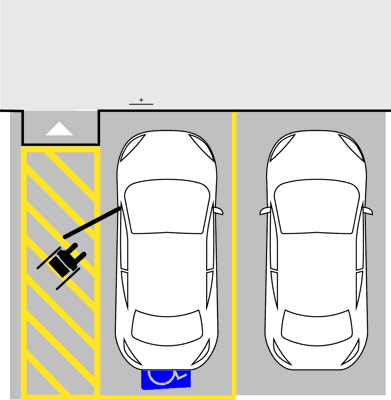
- **📖 الترجمة السياقية:** تحدد الخطوط الصفراء المحيطة في الشكل موقف سيارات مخصص للأشخاص من ذوي الإعاقة (persone invalide).
- **💡 الشرح والقاعدة المرورية:** صحيح (VERO). الإطار الأصفر والرمز الدولي للمعاقين المطلي على الأرض يخصص الموقف حصراً لمركبات حاملي تصريح الإعاقة.
- **⚠️ كشف الفخ:** فخ الامتحان: التخطيط الأصفر مع رمز الكرسي المتحرك يحدد موقفاً مخصصاً لذوي الاحتياجات الخاصة.
- **🔑 الكلمات المفتاحية:** `{'it': 'area di parcheggio riservata a invalidi', 'ar': 'موقف مخصص لذوي الإعاقة'}` | `{'it': 'strisce gialle', 'ar': 'خطوط صفراء'}` | `{'it': 'vero', 'ar': 'صحيح'}`

---

**218.** Le strisce gialle diagonali in figura devono essere lasciate libere per consentire l'entrata e l'uscita dal veicolo delle persone invalide
- **الإجابة:** `VERO ✅ (صح)`
- 
- **📖 الترجمة السياقية:** يجب ترك الخطوط الصفراء المائلة (الشرائط المقلمة) في الشكل خالية للسماح بدخول وخروج الأشخاص ذوي الإعاقة من المركبة.
- **💡 الشرح والقاعدة المرورية:** صحيح (VERO). المساحة المخططة بالأشرطة الصفراء المائلة بجوار الموقف مخصصة لفتح الأبواب وإنزال الكرسي المتحرك، ويحظر حظراً باتاً ركن أو توقف أي مركبة فوقها.
- **⚠️ كشف الفخ:** فخ الامتحان: المساحة المائلة يجب أن تترك خالية تماماً لصعود ونزول المعاقين.
- **🔑 الكلمات المفتاحية:** `{'it': 'strisce gialle diagonali lasciate libere', 'ar': 'خطوط صفراء مائلة تترك خالية'}` | `{'it': 'entrata e uscita invalidi', 'ar': 'دخول وخروج المعاقين'}` | `{'it': 'vero', 'ar': 'صحيح'}`

---

**219.** In presenza dell'iscrizione in figura non è consentito il transito di veicoli con massa a pieno carico superiore a 50 quintali
- **الإجابة:** `FALSO ❌ (خطأ)`
- 
- **📖 الترجمة السياقية:** عند وجود الكتابة المطلية في الشكل، لا يُسمح بمرور المركبات التي يزيد وزنها الإجمالي بحمولة كاملة عن 50 قنطاراً (5 أطنان).
- **💡 الشرح والقاعدة المرورية:** خطأ (FALSO). الرقم المطلي يعبر عن سرعة موصى بها (50 كم/ساعة)، ولا علاقة له بوزن المركبة أو حمولتها بالقناطير.
- **⚠️ كشف الفخ:** فخ الامتحان: الرقم يعبر عن سرعة بـ كم/ساعة وليس عن وزن بالقنطار.
- **🔑 الكلمات المفتاحية:** `{'it': 'massa superiore a 50 quintali', 'ar': 'وزن يزيد عن 50 قنطاراً (فخ)'}` | `{'it': 'velocità in km/h', 'ar': 'سرعة بـ كم/ساعة'}` | `{'it': 'falso', 'ar': 'خطأ'}`

---

**220.** L'elemento in figura è posto su un tratto di strada su cui è vietata la sosta
- **الإجابة:** `FALSO ❌ (خطأ)`
- 
- **📖 الترجمة السياقية:** يوضع العنصر الموضح في الشكل على مقطع طرقي يُحظر فيه وقوف وركن المركبات.
- **💡 الشرح والقاعدة المرورية:** خطأ (FALSO). المطب الصناعي يوضع على نهر الطريق لتهدئة السرعة، ولا يرتبط بوجود منع للوقوف أو الركن.
- **⚠️ كشف الفخ:** فخ الامتحان: المطب الصناعي لا يدل على منع الوقوف.
- **🔑 الكلمات المفتاحية:** `{'it': 'tratto dove è vietata la sosta', 'ar': 'مقطع يمنع فيه الوقوف (فخ)'}` | `{'it': 'rallentatore', 'ar': 'مخفض سرعة'}` | `{'it': 'falso', 'ar': 'خطأ'}`

---

**221.** L'elemento in figura individua un attraversamento ciclabile
- **الإجابة:** `FALSO ❌ (خطأ)`
- 
- **📖 الترجمة السياقية:** يحدد العنصر الموضح في الشكل معبراً للدراجات الهوائية (attraversamento ciclabile).
- **💡 الشرح والقاعدة المرورية:** خطأ (FALSO). هذا مطب صناعي لتخفيض السرعة وليس معبراً للدراجات.
- **⚠️ كشف الفخ:** فخ الامتحان: المطب الصناعي ليس معبراً للدراجات.
- **🔑 الكلمات المفتاحية:** `{'it': 'attraversamento ciclabile', 'ar': 'معبر دراجات (فخ)'}` | `{'it': 'dosso artificiale', 'ar': 'مطب صناعي'}` | `{'it': 'falso', 'ar': 'خطأ'}`

---

**222.** L'elemento in figura individua un attraversamento pedonale
- **الإجابة:** `FALSO ❌ (خطأ)`
- 
- **📖 الترجمة السياقية:** يحدد العنصر الموضح في الشكل معبراً للمشاة (attraversamento pedonale).
- **💡 الشرح والقاعدة المرورية:** خطأ (FALSO). هذا مطب لتخفيف السرعة، ومعبر المشاة ترسم له خطوط بيضاء طولية مخصصة.
- **⚠️ كشف الفخ:** فخ الامتحان: المطب الصناعي ليس معبراً للمشاة.
- **🔑 الكلمات المفتاحية:** `{'it': 'attraversamento pedonale', 'ar': 'معبر مشاة (فخ)'}` | `{'it': 'falso', 'ar': 'خطأ'}`

---

**223.** Le strisce gialle in figura delimitano un'area di parcheggio riservata ai taxi
- **الإجابة:** `FALSO ❌ (خطأ)`
- 
- **📖 الترجمة السياقية:** تحدد الخطوط الصفراء في الشكل موقف سيارات مخصصاً لسيارات الأجرة (taxi).
- **💡 الشرح والقاعدة المرورية:** خطأ (FALSO). موقف التاكسي يكتب عليه TAXI بالأصفر؛ بينما هذا الموقف يحمل رمز الكرسي المتحرك وهو مخصص لذوي الإعاقة.
- **⚠️ كشف الفخ:** فخ الامتحان: الموقف يحمل رمز الإعاقة ومخصص لذوي الاحتياجات الخاصة وليس التاكسي.
- **🔑 الكلمات المفتاحية:** `{'it': 'riservata ai taxi', 'ar': 'مخصص لسيارات الأجرة (فخ)'}` | `{'it': 'riservata a disabili', 'ar': 'مخصص للمعاقين'}` | `{'it': 'falso', 'ar': 'خطأ'}`

---

**224.** Le strisce gialle in figura delimitano un'area riservata al carico e allo scarico di merci
- **الإجابة:** `FALSO ❌ (خطأ)`
- 
- **📖 الترجمة السياقية:** تحدد الخطوط الصفراء في الشكل مساحة مخصصة لشحن وتفريغ البضائع (carico e scarico merci).
- **💡 الشرح والقاعدة المرورية:** خطأ (FALSO). مواقف شحن وتفريغ البضائع تحمل شاخصة مستقلة وتخطيطاً خاصاً بدون رمز الإعاقة الدولي.
- **⚠️ كشف الفخ:** فخ الامتحان: الموقف ليس لشحن البضائع بل لذوي الاحتياجات الخاصة.
- **🔑 الكلمات المفتاحية:** `{'it': 'carico e scarico merci', 'ar': 'شحن وتفريغ البضائع (فخ)'}` | `{'it': 'falso', 'ar': 'خطأ'}`

---

## 📌 Striscia bianca laterale (12 domande)

**225.** La striscia bianca laterale discontinua in figura separa la carreggiata da una piazzola di sosta
- **الإجابة:** `VERO ✅ (صح)`
- 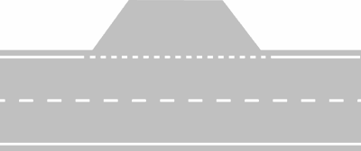
- **📖 الترجمة السياقية:** يفصل الخط الأبيض الجانبي المتقطع في الشكل نهر الطريق عن مساحة التوقف الجانبي (piazzola di sosta).
- **💡 الشرح والقاعدة المرورية:** صحيح (VERO). يُرسم الخط الجانبي متقطعاً للسماح للمركبات بالدخول إلى مساحة التوقف الجانبي والخروج منها بأمان.
- **⚠️ كشف الفخ:** فخ الامتحان: الخط الجانبي المتقطع يتيح الدخول إلى مساحة التوقف الجانبي (piazzola di sosta).
- **🔑 الكلمات المفتاحية:** `{'it': 'separa da una piazzola di sosta', 'ar': 'يفصل عن مساحة التوقف الجانبي'}` | `{'it': 'striscia bianca laterale discontinua', 'ar': 'خط جانبي أبيض متقطع'}` | `{'it': 'vero', 'ar': 'صحيح'}`

---

**226.** La striscia bianca laterale discontinua in figura separa la carreggiata da un passo carrabile
- **الإجابة:** `VERO ✅ (صح)`
- 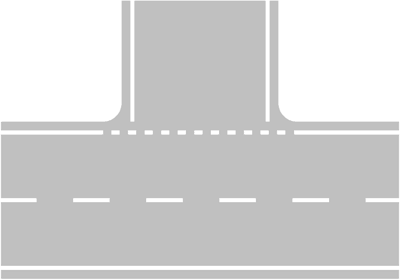
- **📖 الترجمة السياقية:** يفصل الخط الأبيض الجانبي المتقطع في الشكل نهر الطريق عن مدخل عقار أو مرآب خاص (passo carrabile).
- **💡 الشرح والقاعدة المرورية:** صحيح (VERO). عند مداخل العقارات الخاصة والمرائب، يتحول الخط الجانبي لحافة الطريق إلى متقطع للسماح للمركبات بالدخول والخروج من العقار.
- **⚠️ كشف الفخ:** فخ الامتحان: نعم، الخط المتقطع الجانبي يوضع عند مداخل العقارات الخاصة (passo carrabile).
- **🔑 الكلمات المفتاحية:** `{'it': 'separa da un passo carrabile', 'ar': 'يفصل عن مدخل عقار خاص'}` | `{'it': 'accesso consentito', 'ar': 'دخول مسموح'}` | `{'it': 'vero', 'ar': 'صحيح'}`

---

**227.** Le strisce bianche discontinue sull'intersezione in figura sono strisce di guida
- **الإجابة:** `VERO ✅ (صح)`
- 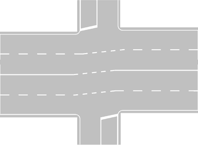
- **📖 الترجمة السياقية:** الخطوط البيضاء المتقطعة على التقاطع في الشكل هي خطوط توجيه وإرشاد (strisce di guida).
- **💡 الشرح والقاعدة المرورية:** صحيح (VERO). الخطوط المنحنية المتقطعة داخل مفترق الطرق هي خطوط توجيه ترشد السائقين لمسار الانعطاف السليم.
- **⚠️ كشف الفخ:** فخ الامتحان: الخطوط المنحنية المتقطعة داخل التقاطع هي خطوط توجيه رسمية.
- **🔑 الكلمات المفتاحية:** `{'it': 'strisce di guida', 'ar': 'خطوط توجيه'}` | `{'it': "sull'intersezione", 'ar': 'على التقاطع'}` | `{'it': 'vero', 'ar': 'صحيح'}`

---

**228.** La striscia bianca laterale discontinua in figura divide la carreggiata da una corsia di accelerazione
- **الإجابة:** `VERO ✅ (صح)`
- 
- **📖 الترجمة السياقية:** يفصل الخط الأبيض الجانبي المتقطع في الشكل نهر الطريق عن مسلك التسارع (corsia di accelerazione).
- **💡 الشرح والقاعدة المرورية:** صحيح (VERO). يفصل الخط الأبيض المتقطع العريض مسلك التسارع عن نهر الطريق الرئيسي لتمكين المركبات من الاندماج بسلاسة.
- **⚠️ كشف الفخ:** فخ الامتحان: مسلك التسارع يفصل عن نهر الطريق بخط أبيض متقطع.
- **🔑 الكلمات المفتاحية:** `{'it': 'corsia di accelerazione', 'ar': 'مسلك التسارع'}` | `{'it': 'divide la carreggiata', 'ar': 'يقسم نهر الطريق'}` | `{'it': 'vero', 'ar': 'صحيح'}`

---

**229.** La striscia bianca laterale discontinua in figura individua il bordo della strada principale, separandolo da quello della strada secondaria
- **الإجابة:** `VERO ✅ (صح)`
- 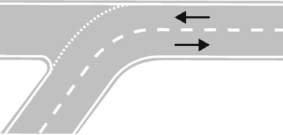
- **📖 الترجمة السياقية:** يحدد الخط الأبيض الجانبي المتقطع في الشكل حافة الطريق الرئيسي، فاصلاً إياها عن حافة الطريق الثانوي.
- **💡 الشرح والقاعدة المرورية:** صحيح (VERO). عند التقاطعات مع الطرق الفرعية، يرسم الخط المتقطع على امتداد حافة الطريق الرئيسي لبيان استمرارية مساره.
- **⚠️ كشف الفخ:** فخ الامتحان: الخط المتقطع يرسم حدود الطريق الرئيسي ويفصلها عن الطريق الفرعي.
- **🔑 الكلمات المفتاحية:** `{'it': 'bordo della strada principale', 'ar': 'حافة الطريق الرئيسي'}` | `{'it': 'strada secondaria', 'ar': 'طريق ثانوي'}` | `{'it': 'vero', 'ar': 'صحيح'}`

---

**230.** La striscia bianca laterale discontinua in figura può essere superata solo in caso di emergenza
- **الإجابة:** `FALSO ❌ (خطأ)`
- 
- **📖 الترجمة السياقية:** لا يجوز تخطي الخط الأبيض الجانبي المتقطع في الشكل إلا في حالات الطوارئ فقط.
- **💡 الشرح والقاعدة المرورية:** خطأ (FALSO). بما أنه خط متقطع، فيجوز تخطيه في الحالات العادية للدخول إلى الموقف الجانبي أو العقار الخاص أو للاندماج، ولا يقتصر على الطوارئ فقط.
- **⚠️ كشف الفخ:** فخ الامتحان: كلمة 'solo in caso di emergenza' تخص خط مسلك الطوارئ المتصل وليس هذا الخط المتقطع.
- **🔑 الكلمات المفتاحية:** `{'it': 'solo in caso di emergenza', 'ar': 'فقط في حالة الطوارئ (فخ)'}` | `{'it': 'discontinua e valicabile', 'ar': 'متقطع ومتاح للتخطي'}` | `{'it': 'falso', 'ar': 'خطأ'}`

---

**231.** La striscia bianca laterale discontinua in figura significa che la sosta non è possibile
- **الإجابة:** `FALSO ❌ (خطأ)`
- 
- **📖 الترجمة السياقية:** يعني الخط الأبيض الجانبي المتقطع في الشكل أن الوقوف والركن غير ممكن.
- **💡 الشرح والقاعدة المرورية:** خطأ (FALSO). على العكس تماماً، الخط المتقطع يتيح الدخول إلى أماكن التوقف الجانبية (piazzole di sosta) المخصصة للتوقف والركن المؤقت.
- **⚠️ كشف الفخ:** فخ الامتحان: الخط المتقطع يتيح الدخول لأماكن التوقف ولا يمنعها.
- **🔑 الكلمات المفتاحية:** `{'it': 'sosta non è possibile', 'ar': 'الوقوف غير ممكن (فخ)'}` | `{'it': 'accesso alla sosta', 'ar': 'دخول للوقوف'}` | `{'it': 'falso', 'ar': 'خطأ'}`

---

**232.** La striscia bianca laterale discontinua separa la carreggiata dalla corsia di emergenza
- **الإجابة:** `FALSO ❌ (خطأ)`
- **📖 الترجمة السياقية:** يفصل الخط الأبيض الجانبي المتقطع نهر الطريق عن مسلك التوقف الاضطراري (corsia di emergenza).
- **💡 الشرح والقاعدة المرورية:** خطأ (FALSO). مسلك الطوارئ على الطرق السريعة يفصل عن نهر الطريق بخط أبيض متصل عريض (striscia continua)، ولا يفصل بخط متقطع.
- **⚠️ كشف الفخ:** فخ الامتحان: مسلك الطوارئ يفصل بخط متصل وليس بخط متقطع.
- **🔑 الكلمات المفتاحية:** `{'it': 'separa dalla corsia di emergenza', 'ar': 'يفصل عن مسلك الطوارئ (فخ)'}` | `{'it': 'striscia continua per emergenza', 'ar': 'خط متصل لمسلك الطوارئ'}` | `{'it': 'falso', 'ar': 'خطأ'}`

---

**233.** La striscia bianca laterale discontinua segnala l'inizio di una banchina
- **الإجابة:** `FALSO ❌ (خطأ)`
- **📖 الترجمة السياقية:** يشير الخط الأبيض الجانبي المتقطع إلى بداية الكتف الترابي للطريق (banchina).
- **💡 الشرح والقاعدة المرورية:** خطأ (FALSO). حافة الطريق الملاصقة للكتف الترابي تحدد بخط أبيض متصل عادي وليس بخط متقطع.
- **⚠️ كشف الفخ:** فخ الامتحان: الكتف الترابي يحده خط متصل.
- **🔑 الكلمات المفتاحية:** `{'it': 'inizio di una banchina', 'ar': 'بداية الكتف الترابي (فخ)'}` | `{'it': 'falso', 'ar': 'خطأ'}`

---

**234.** Le strisce bianche di guida in figura non consentono la svolta
- **الإجابة:** `FALSO ❌ (خطأ)`
- 
- **📖 الترجمة السياقية:** خطوط التوجيه البيضاء في الشكل لا تسمح بالانعطاف.
- **💡 الشرح والقاعدة المرورية:** خطأ (FALSO). خطوط التوجيه صُممت وأُنشئت خصيصاً لإرشاد السائقين وتسهيل مناورة الانعطاف السليم لليسار.
- **⚠️ كشف الفخ:** فخ الامتحان: خطوط التوجيه مخصصة لتسهيل الانعطاف.
- **🔑 الكلمات المفتاحية:** `{'it': 'non consentono la svolta', 'ar': 'لا تسمح بالانعطاف (فخ)'}` | `{'it': 'guidano la svolta', 'ar': 'ترشد وتوجه الانعطاف'}` | `{'it': 'falso', 'ar': 'خطأ'}`

---

**235.** La striscia bianca laterale discontinua in figura delimita l'accesso ad una pista ciclabile
- **الإجابة:** `FALSO ❌ (خطأ)`
- 
- **📖 الترجمة السياقية:** يحدد الخط الأبيض الجانبي المتقطع في الشكل مدخل مسار الدراجات الهوائية.
- **💡 الشرح والقاعدة المرورية:** خطأ (FALSO). مسار الدراجات يفصل بخط أبيض متصل عريض أو رصيف مستقل، ولا يحدده هذا الخط الجانبي.
- **⚠️ كشف الفخ:** فخ الامتحان: الخط المتقطع الجانبي لا يحدد مسار دراجات.
- **🔑 الكلمات المفتاحية:** `{'it': 'accesso a pista ciclabile', 'ar': 'مدخل مسار دراجات (فخ)'}` | `{'it': 'falso', 'ar': 'خطأ'}`

---

**236.** La striscia bianca laterale discontinua in figura, delimita una piazzola di sosta
- **الإجابة:** `FALSO ❌ (خطأ)`
- 
- **📖 الترجمة السياقية:** يحدد الخط الأبيض الجانبي المتقطع في الشكل مساحة للتوقف الجانبي (منع التكرار بصيغة خاطئة للجزئية).
- **💡 الشرح والقاعدة المرورية:** خطأ (FALSO). التخطيط المعروض يمثل مدخل طريق فرعي أو مسلك تسارع وليس تحديداً لمساحة توقف جانبي في هذا السؤال.
- **⚠️ كشف الفخ:** فخ الامتحان: انتبه لتفاصيل الصورة في هذا السؤال المخصص لمدخل الطريق الفرعي.
- **🔑 الكلمات المفتاحية:** `{'it': 'delimita una piazzola di sosta', 'ar': 'يحدد مساحة توقف جانبي (فخ سياقي للصورة)'}` | `{'it': 'innesto stradale', 'ar': 'مدخل طرقي'}` | `{'it': 'falso', 'ar': 'خطأ'}`

---

## 📌 Segnaletica passaggio livello (9 domande)

**237.** La segnaletica rappresentata in figura si trova vicino ad un passaggio a livello
- **الإجابة:** `VERO ✅ (صح)`
- 
- **📖 الترجمة السياقية:** تتواجد التخطيطات الأرضية الموضحة في الشكل بالقرب من تقاطع سكة حديدية (passaggio a livello).
- **💡 الشرح والقاعدة المرورية:** صحيح (VERO). رسم الحرفين P و L مع علامة X العريضة والخطوط المتصلة يوضع على مسار السير للتنبيه بالاقتراب من مزلقان القطار.
- **⚠️ كشف الفخ:** فخ الامتحان: التخطيط P L هو علامة الاقتراب من مزلقان السكة الحديد.
- **🔑 الكلمات المفتاحية:** `{'it': 'vicino ad un passaggio a livello', 'ar': 'بالقرب من تقاطع سكة حديد'}` | `{'it': 'segnaletica orizzontale P L', 'ar': 'التخطيط الأرضي P L'}` | `{'it': 'vero', 'ar': 'صحيح'}`

---

**238.** La segnaletica rappresentata in figura serve ad avvertire i conducenti che si è vicini ad un passaggio a livello senza barriere
- **الإجابة:** `VERO ✅ (صح)`
- 
- **📖 الترجمة السياقية:** تُستخدم التخطيطات الموضحة في الشكل لتنبيه السائقين باقترابهم من تقاطع سكة حديدية بدون حواجز.
- **💡 الشرح والقاعدة المرورية:** صحيح (VERO). يُستخدم هذا التخطيط الأرضي P L للتحذير من جميع أنواع تقاطعات السكك الحديدية بما فيها المزلقانات غير المزودة بحواجز.
- **⚠️ كشف الفخ:** فخ الامتحان: التخطيط ينبه بالمزلقانات بدون حواجز وبحواجز على حد سواء.
- **🔑 الكلمات المفتاحية:** `{'it': 'passaggio a livello senza barriere', 'ar': 'تقاطع سكة حديد بدون حواجز'}` | `{'it': 'avvertire i conducenti', 'ar': 'تنبيه السائقين'}` | `{'it': 'vero', 'ar': 'صحيح'}`

---

**239.** La segnaletica rappresentata in figura serve ad avvertire i conducenti che si è vicini ad un passaggio a livello con barriere
- **الإجابة:** `VERO ✅ (صح)`
- 
- **📖 الترجمة السياقية:** تُستخدم التخطيطات الموضحة في الشكل لتنبيه السائقين باقترابهم من تقاطع سكة حديدية بحواجز.
- **💡 الشرح والقاعدة المرورية:** صحيح (VERO). يُدهن التخطيط P L أيضاً قبل المزلقانات المزودة بحواجز كاملة لتأكيد الانتباه والاقتراب الآمن.
- **⚠️ كشف الفخ:** فخ الامتحان: التخطيط صالح ومطابق لمزلقانات الحواجز والأنصاف حواجز وبدون حواجز.
- **🔑 الكلمات المفتاحية:** `{'it': 'passaggio a livello con barriere', 'ar': 'تقاطع سكة حديد بحواجز'}` | `{'it': 'segnaletica preventiva', 'ar': 'تخطيط وقائي'}` | `{'it': 'vero', 'ar': 'صحيح'}`

---

**240.** In presenza della segnaletica rappresentata in figura non è consentito spostarsi nella parte sinistra della carreggiata
- **الإجابة:** `VERO ✅ (صح)`
- 
- **📖 الترجمة السياقية:** عند وجود التخطيطات الموضحة في الشكل، لا يجوز الانتقال إلى الجزء الأيسر من نهر الطريق.
- **💡 الشرح والقاعدة المرورية:** صحيح (VERO). يقترن التخطيط P L بخط وسطي متصل يمنع التجاوز والانتقال إلى المسلك المعاكس منعاً باتاً لخطورة الموقف أمام المزلقان.
- **⚠️ كشف الفخ:** فخ الامتحان: يُمنع تماماً الانتقال إلى الجزء الأيسر من الطريق لتفادي التجاوز القاتل.
- **🔑 الكلمات المفتاحية:** `{'it': 'non è consentito spostarsi a sinistra', 'ar': 'لا يجوز الانتقال لليسار'}` | `{'it': 'divieto di sorpasso', 'ar': 'منع التجاوز'}` | `{'it': 'striscia continua', 'ar': 'خط متصل'}` | `{'it': 'vero', 'ar': 'صحيح'}`

---

**241.** In presenza della segnaletica rappresentata in figura i conducenti devono prestare attenzione all'eventuale sopraggiungere di treni
- **الإجابة:** `VERO ✅ (صح)`
- 
- **📖 الترجمة السياقية:** عند وجود التخطيطات الموضحة في الشكل، يجب على قائدي المركبات الانتباه الشديد لاحتمال قدوم القطارات.
- **💡 الشرح والقاعدة المرورية:** صحيح (VERO). الواجب الأهم عند الاقتراب من المزلقان هو تخفيف السرعة واليقظة التامة لأي إشارات ضوئية أو صوتية أو اقتراب قطار.
- **⚠️ كشف الفخ:** فخ الامتحان: الانتباه لاحتمال وصول القطار واجب بديهي وقانوني صارم.
- **🔑 الكلمات المفتاحية:** `{'it': 'prestare attenzione ai treni', 'ar': 'الانتباه للقطارات'}` | `{'it': 'sopraggiungere di treni', 'ar': 'قدوم القطارات'}` | `{'it': 'vero', 'ar': 'صحيح'}`

---

**242.** La segnaletica rappresentata in figura serve ad indicare che a 150 metri vi è un attraversamento tranviario molto pericoloso
- **الإجابة:** `FALSO ❌ (خطأ)`
- 
- **📖 الترجمة السياقية:** تُستخدم التخطيطات الموضحة في الشكل للإشارة إلى وجود تقاطع ترام شديد الخطورة على بعد 150 متراً.
- **💡 الشرح والقاعدة المرورية:** خطأ (FALSO). التخطيط P L يخص السكك الحديدية والقطارات (Passaggio a Livello ferroviario) ولا علاقة له بخطوط سير الترام الداخلي.
- **⚠️ كشف الفخ:** فخ الامتحان: الرمز P L للقطار وليس لتقاطع الترام.
- **🔑 الكلمات المفتاحية:** `{'it': 'attraversamento tranviario', 'ar': 'تقاطع ترام (فخ)'}` | `{'it': 'passaggio a livello ferroviario', 'ar': 'تقاطع سكة حديد'}` | `{'it': 'falso', 'ar': 'خطأ'}`

---

**243.** La segnaletica rappresentata in figura si trova solo in vicinanza di passaggi a livello con barriere
- **الإجابة:** `FALSO ❌ (خطأ)`
- 
- **📖 الترجمة السياقية:** تتواجد التخطيطات الموضحة في الشكل فقط بالقرب من تقاطعات السكك الحديدية المزودة بحواجز.
- **💡 الشرح والقاعدة المرورية:** خطأ (FALSO). لا تقتصر حصراً على مزلقانات الحواجز، بل تتواجد أيضاً عند المزلقانات غير المزودة بحواجز وبأنصاف حواجز.
- **⚠️ كشف الفخ:** فخ الامتحان: كلمة 'solo' حصرية باطلة؛ فالتخطيط يوضع لجميع أنواع مزلقانات القطار.
- **🔑 الكلمات المفتاحية:** `{'it': 'solo con barriere', 'ar': 'فقط مع حواجز (فخ)'}` | `{'it': 'anche senza barriere', 'ar': 'وأيضاً بدون حواجز'}` | `{'it': 'falso', 'ar': 'خطأ'}`

---

**244.** La segnaletica rappresentata in figura segnala la vicinanza di un incrocio regolato da Polizia locale
- **الإجابة:** `FALSO ❌ (خطأ)`
- 
- **📖 الترجمة السياقية:** تشير التخطيطات الموضحة في الشكل إلى الاقتراب من تقاطع منظم بواسطة الشرطة المحلية.
- **💡 الشرح والقاعدة المرورية:** خطأ (FALSO). التخطيط يخص مزلقان سكة حديد ولا علاقة له بتنظيم التقاطعات بواسطة رجال الشرطة.
- **⚠️ كشف الفخ:** فخ الامتحان: P L تعني Passaggio a Livello ولا تعني Polizia Locale.
- **🔑 الكلمات المفتاحية:** `{'it': 'regolato da Polizia locale', 'ar': 'منظم بالشرطة المحلية (فخ الحروف P L)'}` | `{'it': 'passaggio a livello', 'ar': 'مزلقان قطار'}` | `{'it': 'falso', 'ar': 'خطأ'}`

---

**245.** La segnaletica rappresentata in figura delimita un parcheggio di autobus in servizio pubblico di linea
- **الإجابة:** `FALSO ❌ (خطأ)`
- 
- **📖 الترجمة السياقية:** تحدد التخطيطات الموضحة في الشكل موقفاً لحافلات النقل العام على الخطوط المنتظمة.
- **💡 الشرح والقاعدة المرورية:** خطأ (FALSO). مواقف الحافلات يكتب عليها BUS بالأصفر، بينما P L تعني تقاطع سكة حديدية.
- **⚠️ كشف الفخ:** فخ الامتحان: الخلط بين مواقف الحافلات ومزلقانات القطار.
- **🔑 الكلمات المفتاحية:** `{'it': 'parcheggio di autobus', 'ar': 'موقف حافلات (فخ)'}` | `{'it': 'falso', 'ar': 'خطأ'}`

---

## 📌 Corsia emergenza (8 domande)

**246.** Nella segnaletica in figura la striscia bianca continua, che separa la carreggiata dalla corsia di emergenza (corsia A), può essere superata solo in caso di necessità (guasto del veicolo, malessere dei viaggiatori)
- **الإجابة:** `VERO ✅ (صح)`
- 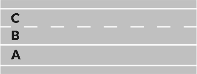
- **📖 الترجمة السياقية:** في التخطيطات الموضحة بالشكل، لا يجوز تخطي الخط الأبيض المتصل الفاصل لنهر الطريق عن مسلك الطوارئ (المسلك A) إلا في حالات الضرورة القصوى (عطل بالمركبة، وعكة صحية للمسافرين).
- **💡 الشرح والقاعدة المرورية:** صحيح (VERO). مسلك الطوارئ محمي بخط أبيض متصل، ولا يجوز الدخول إليه إلا في الحالات الاستثنائية كعطل ميكانيكي أو وعكة صحية مفاجئة للسائق أو الركاب.
- **⚠️ كشف الفخ:** فخ الامتحان: الدخول لمسلك الطوارئ مشروط حصراً بحالات الضرورة (guasto o malessere).
- **🔑 الكلمات المفتاحية:** `{'it': 'corsia di emergenza (corsia A)', 'ar': 'مسلك الطوارئ (المسلك A)'}` | `{'it': 'solo in caso di necessità', 'ar': 'فقط في حالة الضرورة'}` | `{'it': 'guasto o malessere', 'ar': 'عطل أو وعكة صحية'}` | `{'it': 'vero', 'ar': 'صحيح'}`

---

**247.** La corsia di emergenza (corsia A) si può utilizzare in caso di guasto del veicolo, per un massimo di tre ore
- **الإجابة:** `VERO ✅ (صح)`
- 
- **📖 الترجمة السياقية:** يمكن استخدام مسلك الطوارئ (المسلك A) في حالة عطل المركبة لمدة أقصاها ثلاث ساعات.
- **💡 الشرح والقاعدة المرورية:** صحيح (VERO). الحد الأقصى القانوني المسموح به للبقاء في مسلك الطوارئ بسبب عطل المركبة على الطرق السريعة هو 3 ساعات فقط (massimo tre ore)، ويجب بعدها سحب السيارة.
- **⚠️ كشف الفخ:** فخ الامتحان: الحد الأقصى للوقوف في مسلك الطوارئ هو 3 ساعات بالضبط.
- **🔑 الكلمات المفتاحية:** `{'it': 'massimo di tre ore', 'ar': 'أقصاها ثلاث ساعات'}` | `{'it': 'guasto del veicolo', 'ar': 'عطل بالمركبة'}` | `{'it': 'limite temporale', 'ar': 'مهلة زمنية قانونية'}` | `{'it': 'vero', 'ar': 'صحيح'}`

---

**248.** La corsia di emergenza (corsia A) non si può occupare per le manovre di sorpasso
- **الإجابة:** `VERO ✅ (صح)`
- 
- **📖 الترجمة السياقية:** لا يجوز استخدام مسلك الطوارئ (المسلك A) للقيام بمناورات التجاوز.
- **💡 الشرح والقاعدة المرورية:** صحيح (VERO). التجاوز عبر مسلك الطوارئ ممنوع منعاً باتاً ومخالفة مرورية جسيمة يترتب عليها غرامة باهظة وسحب نقاط ورخصة القيادة.
- **⚠️ كشف الفخ:** فخ الامتحان: التجاوز عبر مسلك الطوارئ جريمة مرورية كبرى.
- **🔑 الكلمات المفتاحية:** `{'it': 'non si può occupare per il sorpasso', 'ar': 'لا يجوز شغله للتجاوز'}` | `{'it': 'divieto assoluto di sorpasso', 'ar': 'منع مطلق للتجاوز'}` | `{'it': 'vero', 'ar': 'صحيح'}`

---

**249.** Nella segnaletica in figura la striscia bianca continua, che delimita la corsia di emergenza, (corsia A), indica una zona di parcheggio a tempo
- **الإجابة:** `FALSO ❌ (خطأ)`
- 
- **📖 الترجمة السياقية:** في التخطيطات الموضحة بالشكل، يشير الخط الأبيض المتصل المحدد لمسلك الطوارئ (المسلك A) إلى منطقة ركن محددة بوقت.
- **💡 الشرح والقاعدة المرورية:** خطأ (FALSO). مسلك الطوارئ ليس موقف سيارات ولا يخضع لنظام الركن المؤقت، بل هو مسار مخصص لسيارات الإنقاذ وحالات التعطل الاضطراري.
- **⚠️ كشف الفخ:** فخ الامتحان: مسلك الطوارئ ليس منطقة مواقف سيارات مؤقتة.
- **🔑 الكلمات المفتاحية:** `{'it': 'parcheggio a tempo', 'ar': 'موقف سيارات بوقت (فخ)'}` | `{'it': 'corsia di emergenza', 'ar': 'مسلك طوارئ'}` | `{'it': 'falso', 'ar': 'خطأ'}`

---

**250.** Nella segnaletica in figura la striscia bianca continua che delimita la corsia di emergenza, (corsia A), può essere sempre superata in caso di intenso traffico
- **الإجابة:** `FALSO ❌ (خطأ)`
- 
- **📖 الترجمة السياقية:** في التخطيطات الموضحة بالشكل، يجوز دائماً تخطي الخط الأبيض المتصل المحدد لمسلك الطوارئ في حالة كثافة حركة المرور.
- **💡 الشرح والقاعدة المرورية:** خطأ (FALSO). كثافة حركة المرور والازدحام لا تبيح أبداً استخدام مسلك الطوارئ؛ الاستثناء الوحيد للازدحام هو الخروج من الأوتوستراد بحد أقصى 500 متر قبل المخرج.
- **⚠️ كشف الفخ:** فخ الامتحان: كلمة 'sempre' مع كثافة المرور خطأ؛ التجاوز أو السير في مسلك الطوارئ لتفادي الزحام ممنوع تماماً.
- **🔑 الكلمات المفتاحية:** `{'it': 'sempre superata per traffico intenso', 'ar': 'دائماً تخطيه مع الازدحام (فخ)'}` | `{'it': 'vietato', 'ar': 'ممنوع'}` | `{'it': 'falso', 'ar': 'خطأ'}`

---

**251.** La corsia di emergenza (corsia A) è riservata alla svolta a destra
- **الإجابة:** `FALSO ❌ (خطأ)`
- 
- **📖 الترجمة السياقية:** مسلك الطوارئ (المسلك A) مخصص للانعطاف إلى اليمين.
- **💡 الشرح والقاعدة المرورية:** خطأ (FALSO). مسلك الطوارئ مخصص لحالات التوقف الاضطراري ومرور الإسعاف، والانعطاف يميناً يتم عبر مسالك التباطؤ المخصصة للمخارج.
- **⚠️ كشف الفخ:** فخ الامتحان: مسلك الطوارئ ليس مسلك انعطاف.
- **🔑 الكلمات المفتاحية:** `{'it': 'riservata alla svolta a destra', 'ar': 'مخصص للانعطاف يميناً (فخ)'}` | `{'it': 'corsia di decelerazione', 'ar': 'مسلك التباطؤ للمخارج'}` | `{'it': 'falso', 'ar': 'خطأ'}`

---

**252.** La corsia di emergenza (corsia A) è riservata alla decelerazione
- **الإجابة:** `FALSO ❌ (خطأ)`
- 
- **📖 الترجمة السياقية:** مسلك الطوارئ (المسلك A) مخصص لمسار التباطؤ (decelerazione).
- **💡 الشرح والقاعدة المرورية:** خطأ (FALSO). مسلك التباطؤ مسار مستقل يبدأ قبيل مخارج الطرق السريعة ويفصل بخط متقطع عريض، ولا يجوز الخلط بينه وبين مسلك الطوارئ.
- **⚠️ كشف الفخ:** فخ الامتحان: الخلط بين مسلك الطوارئ ومسلك التباطؤ للخروج.
- **🔑 الكلمات المفتاحية:** `{'it': 'riservata alla decelerazione', 'ar': 'مخصص للتباطؤ (فخ)'}` | `{'it': 'corsia di emergenza', 'ar': 'مسلك طوارئ'}` | `{'it': 'falso', 'ar': 'خطأ'}`

---

**253.** La corsia di emergenza (corsia A) è vietata al transito degli autoveicoli ma non al transito dei motocicli
- **الإجابة:** `FALSO ❌ (خطأ)`
- 
- **📖 الترجمة السياقية:** يُحظر سير السيارات في مسلك الطوارئ (المسلك A)، ولكنه مسموح لسير الدراجات النارية.
- **💡 الشرح والقاعدة المرورية:** خطأ (FALSO). السير في مسلك الطوارئ ممنوع على كافة المركبات دون استثناء، بما في ذلك الدراجات النارية.
- **⚠️ كشف الفخ:** فخ الامتحان: الدراجات النارية تخضع لنفس الحظر التام المفروض على السيارات في مسلك الطوارئ.
- **🔑 الكلمات المفتاحية:** `{'it': 'non al transito dei motocicli', 'ar': 'لا يمنع الدراجات النارية (فخ)'}` | `{'it': 'vietato a tutti', 'ar': 'ممنوع على الجميع'}` | `{'it': 'falso', 'ar': 'خطأ'}`

---

## 📌 Striscia trasversale continua (7 domande)

**254.** La striscia trasversale continua in figura indica il punto in cui bisogna arrestarsi ad un incrocio, se regolato da semaforo a luce rossa
- **الإجابة:** `VERO ✅ (صح)`
- 
- **📖 الترجمة السياقية:** يشير الخط العرضي المتصل في الشكل إلى النقطة التي يجب التوقف عندها عند التقاطع إذا كان منظماً بإشارة ضوئية حمراء.
- **💡 الشرح والقاعدة المرورية:** صحيح (VERO). هذا الخط يحدد الحد المكاني الإلزامي الذي تتوقف قبله المركبات عند إضاءة الضوء الأحمر دون تجاوزه.
- **⚠️ كشف الفخ:** فخ الامتحان: التوقف أمام الضوء الأحمر يكون قبل هذا الخط العرضي مباشرة.
- **🔑 الكلمات المفتاحية:** `{'it': 'semaforo a luce rossa', 'ar': 'إشارة ضوئية حمراء'}` | `{'it': 'punto in cui arrestarsi', 'ar': 'نقطة التوقف'}` | `{'it': 'striscia trasversale continua', 'ar': 'خط عرضي متصل'}` | `{'it': 'vero', 'ar': 'صحيح'}`

---

**255.** La striscia trasversale continua in figura indica il punto in cui dobbiamo sempre arrestarci ad un incrocio, se il vigile lo impone
- **الإجابة:** `VERO ✅ (صح)`
- 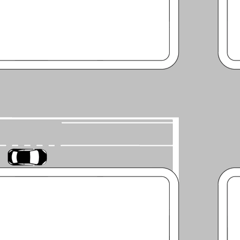
- **📖 الترجمة السياقية:** يشير الخط العرضي المتصل في الشكل إلى النقطة التي يجب علينا التوقف عندها دائماً عند التقاطع إذا فرض شرطي المرور ذلك.
- **💡 الشرح والقاعدة المرورية:** صحيح (VERO). إذا أمر شرطي المرور بالتوقف، فإن خط التوقف العرضي هو المكان النظامي الذي يجب إيقاف المركبة قبله.
- **⚠️ كشف الفخ:** فخ الامتحان: أمر الشرطي بالتوقف ينفذ بالوقوف قبل خط التوقف العرضي.
- **🔑 الكلمات المفتاحية:** `{'it': 'se il vigile lo impone', 'ar': 'إذا فرض الشرطي ذلك'}` | `{'it': 'punto in cui arrestarsi', 'ar': 'نقطة التوقف'}` | `{'it': 'vero', 'ar': 'صحيح'}`

---

**256.** La striscia trasversale continua in figura indica il punto dove occorre arrestarsi
- **الإجابة:** `VERO ✅ (صح)`
- 
- **📖 الترجمة السياقية:** يشير الخط العرضي المتصل في الشكل إلى النقطة التي يلزم التوقف عندها.
- **💡 الشرح والقاعدة المرورية:** صحيح (VERO). وظيفة الخط العرضي المتصل هي ترسيم نقطة التوقف الإلزامي للمركبات عند وجود إشارة STOP أو ضوء أحمر أو أمر شرطي.
- **⚠️ كشف الفخ:** فخ الامتحان: التعريف الدقيق للخط هو تحديد نقطة التوقف.
- **🔑 الكلمات المفتاحية:** `{'it': 'punto dove occorre arrestarsi', 'ar': 'النقطة الواجب التوقف عندها'}` | `{'it': 'linea di arresto', 'ar': 'خط التوقف'}` | `{'it': 'vero', 'ar': 'صحيح'}`

---

**257.** La striscia trasversale continua in figura indica il punto in cui dobbiamo arrestarci ad un incrocio, se non è regolato
- **الإجابة:** `FALSO ❌ (خطأ)`
- 
- **📖 الترجمة السياقية:** يشير الخط العرضي المتصل في الشكل إلى النقطة التي يجب علينا التوقف عندها عند التقاطع إذا كان التقاطع غير منظم (non regolato).
- **💡 الشرح والقاعدة المرورية:** خطأ (FALSO). إذا كان التقاطع غير منظم (لا إشارة ولا شرطي ولا شاخصة STOP)، فلا يلزم التوقف التام، بل تسري قاعدة إعطاء الأسبقية لليمين فقط.
- **⚠️ كشف الفخ:** فخ الامتحان: الخط العرضي لا يلزم بالتوقف إذا كان التقاطع غير منظم ولم تكن هناك شاخصة STOP.
- **🔑 الكلمات المفتاحية:** `{'it': 'se non è regolato', 'ar': 'إذا كان غير منظم (فخ)'}` | `{'it': 'solo con segnale o semaforo', 'ar': 'فقط مع إشارة أو شاخصة'}` | `{'it': 'falso', 'ar': 'خطأ'}`

---

**258.** La striscia trasversale continua in figura indica il punto in cui bisogna sempre arrestarsi in vicinanza di un incrocio stradale
- **الإجابة:** `FALSO ❌ (خطأ)`
- 
- **📖 الترجمة السياقية:** يشير الخط العرضي المتصل في الشكل إلى النقطة التي يجب التوقف عندها دائماً (sempre) بالقرب من تقاطع طرقي.
- **💡 الشرح والقاعدة المرورية:** خطأ (FALSO). كلمة 'sempre' خاطئة تماماً؛ فالتوقف ليس إلزامياً دائماً، بل فقط عند إضاءة الضوء الأحمر أو وجود شاخصة STOP أو أمر من الشرطي؛ أما على الضوء الأخضر فيتم العبور دون توقف.
- **⚠️ كشف الفخ:** فخ الامتحان: كلمة 'sempre' تجعل العبارة باطلة؛ فالمرور على الأخضر لا يتطلب التوقف.
- **🔑 الكلمات المفتاحية:** `{'it': 'sempre arrestarsi', 'ar': 'التوقف دائماً (فخ)'}` | `{'it': 'si passa con il verde', 'ar': 'العبور مع الأخضر دون توقف'}` | `{'it': 'falso', 'ar': 'خطأ'}`

---

**259.** La striscia trasversale continua in figura indica che è obbligatorio dare la precedenza ai veicoli provenienti sia da destra sia da sinistra
- **الإجابة:** `FALSO ❌ (خطأ)`
- 
- **📖 الترجمة السياقية:** يشير الخط العرضي المتصل في الشكل إلى وجوب إعطاء الأسبقية للمركبات القادمة من كل من اليمين واليسار.
- **💡 الشرح والقاعدة المرورية:** خطأ (FALSO). الخط العرضي المتصل يحدد موضع التوقف فقط، وتحديد جهة الأسبقية ينبع من الشاخصة المرافقة (STOP)؛ وبدونها تسري قواعد التقاطع العادية.
- **⚠️ كشف الفخ:** فخ الامتحان: الخط العرضي يحدد مكان الوقوف المادي ولا يحدد بنفسه قواعد اتجاهات الأسبقية.
- **🔑 الكلمات المفتاحية:** `{'it': 'precedenza sia da destra sia da sinistra', 'ar': 'أسبقية لليمين واليسار معاً (فخ)'}` | `{'it': 'punto di arresto', 'ar': 'موضع التوقف فقط'}` | `{'it': 'falso', 'ar': 'خطأ'}`

---

**260.** La striscia trasversale continua in figura si trova all'uscita di una proprietà privata
- **الإجابة:** `FALSO ❌ (خطأ)`
- 
- **📖 الترجمة السياقية:** يتواجد الخط العرضي المتصل في الشكل عند مخرج ملكية أو عقار خاص (uscita di una proprietà privata).
- **💡 الشرح والقاعدة المرورية:** خطأ (FALSO). مخارج العقارات الخاصة والملكيات لا ترسم فيها خطوط توقف عرضية متصلة من هذا النوع التابع للتقاطعات العامة.
- **⚠️ كشف الفخ:** فخ الامتحان: الخط العرضي المتصل خاص بتقاطعات الطرق العامة وليس مخارج الكراجات الخاصة.
- **🔑 الكلمات المفتاحية:** `{'it': 'uscita di una proprietà privata', 'ar': 'مخرج ملكية خاصة (فخ)'}` | `{'it': 'incrocio stradale', 'ar': 'تقاطع طرقي عام'}` | `{'it': 'falso', 'ar': 'خطأ'}`

---

