# Capitolo 07 - Semafori e agenti del traffico
### إشارات المرور الضوئية ورجال المرور

- 📁 **المجلد المحلي للباب:** `Capitolo_07_semafori_vigili`
- 📊 **إجمالي الأسئلة المعتمدة والمشروحة:** 253 سؤالاً وزارياً

## 📌 Semaforo rosso (10 domande)

**1.** In presenza della luce semaforica rossa i veicoli devono arrestarsi
- **الإجابة:** `VERO ✅ (صح)`
- 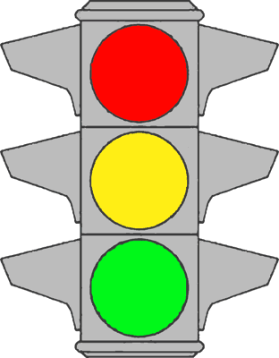
- **📖 الترجمة السياقية:** عند وجود الضوء الأحمر للإشارة الضوئية، يجب على المركبات التوقف تماماً.
- **💡 الشرح والقاعدة المرورية:** صحيح (VERO). الضوء الأحمر يفرض أمراً قاطعاً بالتوقف الإلزامي (obbligo di arresto) دون أي استثناء، ولا يجوز تجاوز خط التوقف ما دام الضوء أحمر.
- **⚠️ كشف الفخ:** فخ الامتحان: لا توجد أي استثناءات تبيح تجاوز الضوء الأحمر في الإشارات الضوئية العادية.
- **🔑 الكلمات المفتاحية:** `{'it': 'luce semaforica rossa', 'ar': 'ضوء الإشارة الأحمر'}` | `{'it': 'arrestarsi', 'ar': 'التوقف التام'}` | `{'it': 'vero', 'ar': 'صحيح'}`

---

**2.** Nei semafori sistemati in verticale la luce rossa si trova in alto, in quelli posti in orizzontale si trova a sinistra
- **الإجابة:** `VERO ✅ (صح)`
- 
- **📖 الترجمة السياقية:** في الإشارات الضوئية الرأسية يقع الضوء الأحمر في الأعلى، وفي الإشارات الأفقية يقع في أقصى اليسار.
- **💡 الشرح والقاعدة المرورية:** صحيح (VERO). الترتيب القياسي المعتمد دولياً: في الإشارة العمودية يكون الأحمر في الأعلى يليه الأصفر ثم الأخضر، وفي الأفقية يكون الأحمر على اليسار ثم الأصفر فالأخضر.
- **⚠️ كشف الفخ:** فخ الامتحان: تذكر الترتيب دائماً: رأسياً (أحمر في الأعلى)، أفقياً (أحمر في أقصى اليسار).
- **🔑 الكلمات المفتاحية:** `{'it': 'sistemati in verticale', 'ar': 'مرتبة رأسياً'}` | `{'it': 'in alto', 'ar': 'في الأعلى'}` | `{'it': 'in orizzontale a sinistra', 'ar': 'أفقياً على اليسار'}` | `{'it': 'vero', 'ar': 'صحيح'}`

---

**3.** Nel semaforo la luce rossa può essere di dimensioni più grandi delle altre
- **الإجابة:** `VERO ✅ (صح)`
- 
- **📖 الترجمة السياقية:** في الإشارة الضوئية، يمكن أن يكون الضوء الأحمر بحجم أكبر من بقية الأضواء.
- **💡 الشرح والقاعدة المرورية:** صحيح (VERO). يسمح كود السير بأن يكون قرص الضوء الأحمر أكبر حجماً من الأصفر والأخضر لزيادة وضوحه ولفت انتباه السائقين لخطورته وأهمية التوقف.
- **⚠️ كشف الفخ:** فخ الامتحان: نعم، يمكن أن يكون الضوء الأحمر أكبر حجماً (dimensioni più grandi) لزيادة وضوح الرؤية.
- **🔑 الكلمات المفتاحية:** `{'it': 'dimensioni più grandi', 'ar': 'أبعاد أكبر حجماً'}` | `{'it': 'luce rossa', 'ar': 'الضوء الأحمر'}` | `{'it': 'vero', 'ar': 'صحيح'}`

---

**4.** Quando è accesa la luce rossa del semaforo bisogna arrestarsi prima della striscia trasversale d'arresto
- **الإجابة:** `VERO ✅ (صح)`
- 
- **📖 الترجمة السياقية:** عند إضاءة الضوء الأحمر للإشارة الضوئية، يجب التوقف قبل خط التوقف العرضي.
- **💡 الشرح والقاعدة المرورية:** صحيح (VERO). يجب التوقف التام خلف خط التوقف الأرضي العريض (striscia trasversale d'arresto) دون تجاوزه أو ملامسته بالمركبة.
- **⚠️ كشف الفخ:** فخ الامتحان: مكان التوقف الإلزامي هو قبل الخط العرضي وليس بعده أو فوقه.
- **🔑 الكلمات المفتاحية:** `{'it': "striscia trasversale d'arresto", 'ar': 'خط التوقف العرضي'}` | `{'it': 'prima della striscia', 'ar': 'قبل الخط'}` | `{'it': 'vero', 'ar': 'صحيح'}`

---

**5.** Durante il periodo di accensione della luce rossa i veicoli non devono superare la striscia di arresto
- **الإجابة:** `VERO ✅ (صح)`
- 
- **📖 الترجمة السياقية:** خلال فترة إضاءة الضوء الأحمر، لا يجوز للمركبات تجاوز خط التوقف.
- **💡 الشرح والقاعدة المرورية:** صحيح (VERO). تجاوز خط التوقف أثناء إضاءة الضوء الأحمر يعتبر مخالفة صريحة وخطراً داهماً يهدد مستخدمي الطريق المشاة والمركبات المتقاطعة.
- **⚠️ كشف الفخ:** فخ الامتحان: لا يُسمح حتى ببروز مقدمة السيارة فوق خط التوقف.
- **🔑 الكلمات المفتاحية:** `{'it': 'non devono superare', 'ar': 'لا يجوز تجاوز'}` | `{'it': 'striscia di arresto', 'ar': 'خط التوقف'}` | `{'it': 'vero', 'ar': 'صحيح'}`

---

**6.** La luce rossa accesa del semaforo consente di svoltare a destra con prudenza, dando precedenza ai pedoni che attraversano la strada
- **الإجابة:** `FALSO ❌ (خطأ)`
- 
- **📖 الترجمة السياقية:** يسمح الضوء الأحمر للإشارة الضوئية بالانعطاف إلى اليمين بحذر، مع إعطاء الأسبقية للمشاة العابرين.
- **💡 الشرح والقاعدة المرورية:** خطأ (FALSO). في قانون المرور الإيطالي، الضوء الأحمر يمنع التقدم تماماً في كافة الاتجاهات (بما في ذلك الانعطاف لليمين)، ما لم يكن هناك سهم أخضر منفصل للانعطاف.
- **⚠️ كشف الفخ:** فخ الامتحان: لا يوجد في إيطاليا نظام الانعطاف يميناً على الأحمر كما في بعض الدول؛ الأحمر يعني توقفاً مطلقاً.
- **🔑 الكلمات المفتاحية:** `{'it': 'svoltare a destra con prudenza', 'ar': 'الانعطاف يميناً بحذر (فخ)'}` | `{'it': 'divieto assoluto', 'ar': 'منع مطلق'}` | `{'it': 'falso', 'ar': 'خطأ'}`

---

**7.** La luce rossa accesa del semaforo consente di ripartire lentamente quando appare il giallo per gli altri veicoli
- **الإجابة:** `FALSO ❌ (خطأ)`
- 
- **📖 الترجمة السياقية:** يسمح الضوء الأحمر للإشارة بالانطلاق ببطء عندما يظهر الضوء الأصفر للمركبات الأخرى.
- **💡 الشرح والقاعدة المرورية:** خطأ (FALSO). يُمنع التحرك أو الانطلاق ما دام ضوؤك أحمر، ولا يجوز الانطلاق إلا بعد ظهور الضوء الأخضر الخاص باتجاهك حصراً.
- **⚠️ كشف الفخ:** فخ الامتحان: توقع إشارة المرور والانطلاق على أصفر المسار الآخر مخالفة خطيرة وممنوعة تماماً.
- **🔑 الكلمات المفتاحية:** `{'it': 'ripartire lentamente', 'ar': 'الانطلاق ببطء (فخ)'}` | `{'it': 'luce rossa accesa', 'ar': 'الضوء الأحمر مضاء'}` | `{'it': 'falso', 'ar': 'خطأ'}`

---

**8.** La luce rossa accesa del semaforo consente di impegnare l'incrocio con molta prudenza a condizione che non ci siano altri veicoli o pedoni
- **الإجابة:** `FALSO ❌ (خطأ)`
- 
- **📖 الترجمة السياقية:** يسمح الضوء الأحمر للإشارة بالدخول في التقاطع بحذر شديد بشرط عدم وجود مركبات أخرى أو مشاة.
- **💡 الشرح والقاعدة المرورية:** خطأ (FALSO). الضوء الأحمر أمر قطعي بالتوقف ولا يمنح أي حق للمرور حتى لو كان التقاطع خالياً تماماً من المركبات والمشاة.
- **⚠️ كشف الفخ:** فخ الامتحان: خلو التقاطع لا يلغي المنع الصارم الذي يفرضه الضوء الأحمر.
- **🔑 الكلمات المفتاحية:** `{'it': "impegnare l'incrocio", 'ar': 'شغل التقاطع / الدخول فيه'}` | `{'it': 'non ci siano altri veicoli', 'ar': 'عدم وجود مركبات أخرى'}` | `{'it': 'falso', 'ar': 'خطأ'}`

---

**9.** La luce rossa accesa del semaforo consente l'attraversamento dell'incrocio, purché sia libero
- **الإجابة:** `FALSO ❌ (خطأ)`
- 
- **📖 الترجمة السياقية:** يسمح الضوء الأحمر للإشارة بعبور التقاطع شريطة أن يكون التقاطع خالياً.
- **💡 الشرح والقاعدة المرورية:** خطأ (FALSO). خلو التقاطع لا يبيح أبداً كسر الإشارة الحمراء؛ التوقف إلزامي ومطلق في كافة الظروف.
- **⚠️ كشف الفخ:** فخ الامتحان: شرط 'purché sia libero' شرط زائف وباطل تماماً عند الإشارة الحمراء.
- **🔑 الكلمات المفتاحية:** `{'it': "attraversamento dell'incrocio", 'ar': 'عبور التقاطع'}` | `{'it': 'purché sia libero', 'ar': 'شريطة أن يكون خالياً (فخ)'}` | `{'it': 'falso', 'ar': 'خطأ'}`

---

**10.** La luce rossa accesa del semaforo obbliga ad affrettarsi per liberare velocemente l'incrocio
- **الإجابة:** `FALSO ❌ (خطأ)`
- 
- **📖 الترجمة السياقية:** يلزم الضوء الأحمر للإشارة الضوئية بالإسراع لإخلاء التقاطع بسرعة.
- **💡 الشرح والقاعدة المرورية:** خطأ (FALSO). الضوء الأحمر يلزم بالتوقف قبل التقاطع وليس الإسراع لداخله؛ التحذير للإخلاء السريع يخص الضوء الأصفر لمن دخل التقاطع بالفعل.
- **⚠️ كشف الفخ:** فخ الامتحان: الأحمر يلزم بالتوقف وليس بالإسراع (affrettarsi).
- **🔑 الكلمات المفتاحية:** `{'it': 'affrettarsi per liberare', 'ar': 'الإسراع لإخلاء التقاطع (فخ)'}` | `{'it': 'arrestarsi', 'ar': 'التوقف'}` | `{'it': 'falso', 'ar': 'خطأ'}`

---

## 📌 Semaforo verde (12 domande)

**11.** Quando è accesa la luce verde del semaforo in figura è possibile svoltare a sinistra, dando la precedenza ai veicoli che arrivano di fronte
- **الإجابة:** `VERO ✅ (صح)`
- 
- **📖 الترجمة السياقية:** عند إضاءة الضوء الأخضر للإشارة المعروضة، يجوز الانعطاف يساراً، مع إعطاء الأسبقية للمركبات القادمة من الأمام في المواجهة.
- **💡 الشرح والقاعدة المرورية:** صحيح (VERO). الضوء الأخضر المستدير يتيح لك كافة المناورات (متابعة السير، الانعطاف يميناً أو يساراً)، وعند الانعطاف لليسار يجب قانوناً إعطاء الأسبقية للقادمين في المقابل.
- **⚠️ كشف الفخ:** فخ الامتحان: الانعطاف لليسار على الأخضر مسموح به لكنه يفرض دائماً إعطاء الأسبقية لحركة المرور المقابلة والمشاة.
- **🔑 الكلمات المفتاحية:** `{'it': 'svoltare a sinistra', 'ar': 'الانعطاف يساراً'}` | `{'it': 'dare la precedenza di fronte', 'ar': 'إعطاء الأسبقية للمقابل'}` | `{'it': 'vero', 'ar': 'صحيح'}`

---

**12.** Quando è accesa la luce verde del semaforo in figura si può svoltare a destra
- **الإجابة:** `VERO ✅ (صح)`
- 
- **📖 الترجمة السياقية:** عند إضاءة الضوء الأخضر للإشارة المعروضة، يجوز الانعطاف إلى اليمين.
- **💡 الشرح والقاعدة المرورية:** صحيح (VERO). الضوء الأخضر الدائري العادي يسمح بالانعطاف إلى اليمين مع إعطاء الأسبقية للمشاة الذين يعبرون الطريق المنعطف إليه.
- **⚠️ كشف الفخ:** فخ الامتحان: الأخضر المستدير يسمح بالمرور في جميع الاتجاهات المتاحة هندسياً.
- **🔑 الكلمات المفتاحية:** `{'it': 'svoltare a destra', 'ar': 'الانعطاف يميناً'}` | `{'it': 'luce verde', 'ar': 'الضوء الأخضر'}` | `{'it': 'vero', 'ar': 'صحيح'}`

---

**13.** Quando è accesa la luce verde del semaforo in figura si può proseguire diritto
- **الإجابة:** `VERO ✅ (صح)`
- 
- **📖 الترجمة السياقية:** عند إضاءة الضوء الأخضر للإشارة المعروضة، يمكن مواصلة السير إلى الأمام مباشرة.
- **💡 الشرح والقاعدة المرورية:** صحيح (VERO). الضوء الأخضر المستدير يسمح بمتابعة السير للأمام مباشرة (proseguire diritto) بأمان وحرية.
- **⚠️ كشف الفخ:** فخ الامتحان: الأخضر يعني مساراً مفتوحاً للأمام ولليمين ولليسار.
- **🔑 الكلمات المفتاحية:** `{'it': 'proseguire diritto', 'ar': 'متابعة السير للأمام'}` | `{'it': 'luce verde', 'ar': 'الضوء الأخضر'}` | `{'it': 'vero', 'ar': 'صحيح'}`

---

**14.** Quando è accesa la luce verde del semaforo in figura si può impegnare l'incrocio, soltanto avendo la certezza di poterlo sgomberare prima dell'accensione della luce rossa
- **الإجابة:** `VERO ✅ (صح)`
- 
- **📖 الترجمة السياقية:** عند إضاءة الضوء الأخضر للإشارة المعروضة، لا يجوز الدخول في التقاطع إلا عند التيقن من إمكانية إخلائه قبل إضاءة الضوء الأحمر.
- **💡 الشرح والقاعدة المرورية:** صحيح (VERO). حتى مع وجود الضوء الأخضر، يُمنع الدخول في التقاطع إذا كان هناك ازدحام مروري يعيق خروجك منه ويؤدي لعرقلة حركة السير العرضية عند تحول الضوء للأحمر.
- **⚠️ كشف الفخ:** فخ الامتحان: وجود الضوء الأخضر لا يبيح لك الدخول وإغلاق التقاطع إذا كان المرور متوقفاً أمامك.
- **🔑 الكلمات المفتاحية:** `{'it': 'certezza di poterlo sgomberare', 'ar': 'التأكد واليقين من إمكانية الإخلاء'}` | `{'it': 'evitare blocchi', 'ar': 'تجنب إغلاق التقاطع'}` | `{'it': 'vero', 'ar': 'صحيح'}`

---

**15.** Quando è accesa la luce verde del semaforo in figura si può attraversare l'incrocio, usando prudenza
- **الإجابة:** `VERO ✅ (صح)`
- 
- **📖 الترجمة السياقية:** عند إضاءة الضوء الأخضر للإشارة المعروضة، يمكن عبور التقاطع مع توخي الحذر.
- **💡 الشرح والقاعدة المرورية:** صحيح (VERO). يتيح الضوء الأخضر العبور ولكن الحذر والانتباه مطلوبان دائماً تحسباً للمشاة أو للمركبات المتبقية داخل التقاطع.
- **⚠️ كشف الفخ:** فخ الامتحان: الأخضر يعطي الإذن لكنه لا يسقط واجب الانتباه والحذر العام.
- **🔑 الكلمات المفتاحية:** `{'it': "attraversare l'incrocio", 'ar': 'عبور التقاطع'}` | `{'it': 'usando prudenza', 'ar': 'باستخدام الحذر'}` | `{'it': 'vero', 'ar': 'صحيح'}`

---

**16.** Avvicinandosi ad un semaforo, che già da molto tempo ha la luce verde accesa, occorre proseguire con prudenza, pronti eventualmente a fermarsi se, quando si accende la luce gialla, non si è ancora impegnato l'incrocio
- **الإجابة:** `VERO ✅ (صح)`
- 
- **📖 الترجمة السياقية:** عند الاقتراب من إشارة ضوئية مضاءة بالأخضر منذ مدة طويلة، يجب مواصلة السير بحذر مع الاستعداد للتوقف إن لم نكن قد دخلنا التقاطع بعد عند إضاءة الضوء الأصفر.
- **💡 الشرح والقاعدة المرورية:** صحيح (VERO). الضوء الأخضر المضاء منذ فترة طويلة مرشح للتحول إلى الأصفر في أي لحظة، لذا يجب التهدئة والاستعداد للتوقف الآمن خلف الخط.
- **⚠️ كشف الفخ:** فخ الامتحان: إشارة الأخضر القديم تتطلب الاستعداد النفسي للتوقف وليس زيادة السرعة.
- **🔑 الكلمات المفتاحية:** `{'it': 'verde da molto tempo', 'ar': 'أخضر منذ مدة طويلة'}` | `{'it': 'pronti a fermarsi', 'ar': 'الاستعداد للتوقف'}` | `{'it': 'vero', 'ar': 'صحيح'}`

---

**17.** Avvicinandosi ad un semaforo, che già da molto tempo ha la luce verde accesa, occorre accelerare, senza che vi sia necessità di guardare la luce del semaforo
- **الإجابة:** `FALSO ❌ (خطأ)`
- 
- **📖 الترجمة السياقية:** عند الاقتراب من إشارة ضوئية مضاءة بالأخضر منذ وقت طويل، يجب زيادة السرعة دون الحاجة إلى النظر إلى ضوء الإشارة.
- **💡 الشرح والقاعدة المرورية:** خطأ (FALSO). زيادة السرعة تصرف شديد الخطورة؛ يجب العكس تماماً وهو تخفيف السرعة ومراقبة الإشارة للاستعداد للتوقف في حال ظهور الأصفر.
- **⚠️ كشف الفخ:** فخ الامتحان: كلمة 'accelerare senza guardare' سلوك طائش ومخالف تماماً لسلامة المرور.
- **🔑 الكلمات المفتاحية:** `{'it': 'accelerare', 'ar': 'زيادة السرعة (فخ)'}` | `{'it': 'senza guardare', 'ar': 'دون النظر (فخ)'}` | `{'it': 'falso', 'ar': 'خطأ'}`

---

**18.** Quando è accesa la luce verde del semaforo in figura si può svoltare a sinistra, ma solo quando si accende anche la luce gialla
- **الإجابة:** `FALSO ❌ (خطأ)`
- 
- **📖 الترجمة السياقية:** عند إضاءة الضوء الأخضر للإشارة المعروضة، يمكن الانعطاف يساراً ولكن فقط عند إضاءة الضوء الأصفر أيضاً.
- **💡 الشرح والقاعدة المرورية:** خطأ (FALSO). الضوء الأخضر وحده كافٍ تماماً للانعطاف يساراً، والضوء الأصفر لا يضيء تزامناً مع الأخضر بل بعد انطفائه للتنبيه بالتوقف.
- **⚠️ كشف الفخ:** فخ الامتحان: الأخضر والأصفر لا يضيئان معاً، والانعطاف لا ينتظر الضوء الأصفر.
- **🔑 الكلمات المفتاحية:** `{'it': 'solo quando si accende il giallo', 'ar': 'فقط عند إضاءة الأصفر (فخ)'}` | `{'it': 'verde da solo', 'ar': 'الأخضر بمفرده'}` | `{'it': 'falso', 'ar': 'خطأ'}`

---

**19.** Quando è accesa la luce verde del semaforo in figura, il conducente che svolta a sinistra ha la precedenza sui veicoli che provengono di fronte
- **الإجابة:** `FALSO ❌ (خطأ)`
- 
- **📖 الترجمة السياقية:** عند إضاءة الضوء الأخضر للإشارة المعروضة، يتمتع السائق المنعطف يساراً بحق الأسبقية على المركبات القادمة من الأمام.
- **💡 الشرح والقاعدة المرورية:** خطأ (FALSO). السائق الذي ينعطف يساراً يقطع مسار المركبات القادمة في الاتجاه المقابل، ولذلك يلزمه القانون بالتوقف وإعطائها الأسبقية.
- **⚠️ كشف الفخ:** فخ الامتحان: الانعطاف يساراً يجعلك تعطي الأسبقية للمقابل ولست صاحب الحق عليه.
- **🔑 الكلمات المفتاحية:** `{'it': 'ha la precedenza sui veicoli di fronte', 'ar': 'له الأسبقية على القادم من الأمام (فخ)'}` | `{'it': 'dare precedenza', 'ar': 'إعطاء الأسبقية'}` | `{'it': 'falso', 'ar': 'خطأ'}`

---

**20.** Quando è accesa la luce verde del semaforo in figura si può svoltare solo se la carreggiata è divisa in corsie
- **الإجابة:** `FALSO ❌ (خطأ)`
- 
- **📖 الترجمة السياقية:** عند إضاءة الضوء الأخضر للإشارة المعروضة، لا يمكن الانعطاف إلا إذا كان نهر الطريق مقسماً إلى مسالك.
- **💡 الشرح والقاعدة المرورية:** خطأ (FALSO). يجوز الانعطاف يميناً أو يساراً سواء كان نهر الطريق مقسماً إلى مسالك (corsie) أو لم يكن مقسماً، مع الالتزام بقواعد التموضع المناسبة.
- **⚠️ كشف الفخ:** فخ الامتحان: شرط تقسيم الطريق إلى مسالك شرط زائف ومختلق.
- **🔑 الكلمات المفتاحية:** `{'it': 'solo se divisa in corsie', 'ar': 'فقط إذا كان مقسماً لمسالك (فخ)'}` | `{'it': 'consentito comunque', 'ar': 'مسموح على أي حال'}` | `{'it': 'falso', 'ar': 'خطأ'}`

---

**21.** Quando è accesa la luce verde del semaforo in figura si deve proseguire diritto
- **الإجابة:** `FALSO ❌ (خطأ)`
- 
- **📖 الترجمة السياقية:** عند إضاءة الضوء الأخضر للإشارة المعروضة، يجب وجوباً مواصلة السير إلى الأمام مباشرة فقط.
- **💡 الشرح والقاعدة المرورية:** خطأ (FALSO). الضوء الأخضر الدائري يسمح بجميع المناورات (للأمام، ولليمين، ولليسار) ولا يفرض السير إلى الأمام حصراً إلا إذا كانت هناك شاخصة اتجاه إجباري مستقلة.
- **⚠️ كشف الفخ:** فخ الامتحان: كلمة 'si deve' تفرض الإلزام بالأمام فقط، بينما الأخضر الدائري يسمح بالانعطاف أيضاً.
- **🔑 الكلمات المفتاحية:** `{'it': 'si deve proseguire diritto', 'ar': 'يجب السير للأمام فقط (فخ)'}` | `{'it': 'tutte le direzioni', 'ar': 'جميع الاتجاهات'}` | `{'it': 'falso', 'ar': 'خطأ'}`

---

**22.** Quando è accesa la luce verde del semaforo in figura si può proseguire diritto, dando però la precedenza ai pedoni
- **الإجابة:** `FALSO ❌ (خطأ)`
- 
- **📖 الترجمة السياقية:** عند إضاءة الضوء الأخضر للإشارة المعروضة، يمكن مواصلة السير إلى الأمام مع إعطاء الأسبقية للمشاة.
- **💡 الشرح والقاعدة المرورية:** خطأ (FALSO). عند متابعة السير للأمام مباشرة تكون إشارة عبور المشاة المقاطعة لمسارك حمراء، فلا تعطي الأسبقية للمشاة إلا إذا انعطفت يميناً أو يساراً لقطع مسار عبورهم.
- **⚠️ كشف الفخ:** فخ الامتحان: عند السير للأمام مباشرة في التقاطع الضوئي تكون إشارة المشاة المعترضة حمراء.
- **🔑 الكلمات المفتاحية:** `{'it': 'proseguire diritto dando precedenza ai pedoni', 'ar': 'السير للأمام مع إعطاء الأسبقية للمشاة (فخ)'}` | `{'it': 'marcia rettilinea', 'ar': 'السير المباشر'}` | `{'it': 'falso', 'ar': 'خطأ'}`

---

## 📌 Semafori corsia (20 domande)

**23.** Nei semafori in figura le frecce verdi accese indicano le direzioni verso le quali si può proseguire
- **الإجابة:** `VERO ✅ (صح)`
- 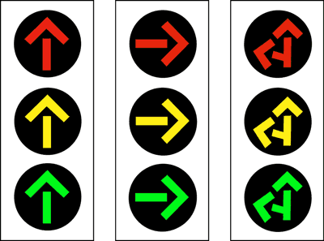
- **📖 الترجمة السياقية:** في الإشارات الضوئية المعروضة، تشير الأسهم الخضراء المضاءة إلى الاتجاهات التي يجوز متابعة السير نحوها.
- **💡 الشرح والقاعدة المرورية:** صحيح (VERO). السهم الأخضر ذو الاتجاه المحدد يسمح بالمرور حصراً في الاتجاه الذي يشير إليه السهم للمسلك المعني.
- **⚠️ كشف الفخ:** فخ الامتحان: سهم المسلك يخصص حق المرور للاتجاه المبين في السهم فقط.
- **🔑 الكلمات المفتاحية:** `{'it': 'frecce verdi accese', 'ar': 'الأسهم الخضراء المضاءة'}` | `{'it': 'direzioni consentite', 'ar': 'الاتجاهات المسموح بها'}` | `{'it': 'vero', 'ar': 'صحيح'}`

---

**24.** Nei semafori in figura le frecce rosse accese indicano che non si può proseguire nelle direzioni indicate
- **الإجابة:** `VERO ✅ (صح)`
- 
- **📖 الترجمة السياقية:** في الإشارات الضوئية المعروضة، تشير الأسهم الحمراء المضاءة إلى عدم جواز متابعة السير في الاتجاهات الموضحة.
- **💡 الشرح والقاعدة المرورية:** صحيح (VERO). السهم الأحمر يفرض منعاً قاطعاً للتنقل أو الانعطاف في الاتجاه المشار إليه بالسهم ويفرض التوقف على سالكي ذلك المسلك.
- **⚠️ كشف الفخ:** فخ الامتحان: السهم الأحمر يمنع الحركة في الاتجاه المشار إليه تحديداً.
- **🔑 الكلمات المفتاحية:** `{'it': 'frecce rosse accese', 'ar': 'الأسهم الحمراء المضاءة'}` | `{'it': 'non si può proseguire', 'ar': 'لا يجوز مواصلة السير'}` | `{'it': 'vero', 'ar': 'صحيح'}`

---

**25.** Nei semafori in figura le frecce gialle fisse accese indicano di liberare l'incrocio, qualora sia stato già impegnato, o di arrestarsi in condizioni di sicurezza
- **الإجابة:** `VERO ✅ (صح)`
- 
- **📖 الترجمة السياقية:** في الإشارات الضوئية المعروضة، تشير الأسهم الصفراء الثابتة المضاءة إلى وجوب إخلاء التقاطع إذا كان قد تم الدخول فيه بالفعل، أو التوقف بشروط السلامة.
- **💡 الشرح والقاعدة المرورية:** صحيح (VERO). حكم السهم الأصفر الثابت هو نفس حكم الضوء الأصفر المستدير: التوقف قبل الخط بأمان، أو إخلاء التقاطع فوراً لمن تجاوزه بالفعل.
- **⚠️ كشف الفخ:** فخ الامتحان: السهم الأصفر الثابت يخير بين التوقف بأمان قبل الخط أو إخلاء التقاطع لمن دخله بالفعل.
- **🔑 الكلمات المفتاحية:** `{'it': 'frecce gialle fisse', 'ar': 'أسهم صفراء ثابتة'}` | `{'it': "liberare l'incrocio", 'ar': 'إخلاء التقاطع'}` | `{'it': 'arrestarsi in sicurezza', 'ar': 'التوقف بأمان'}` | `{'it': 'vero', 'ar': 'صحيح'}`

---

**26.** Nel semaforo in figura le frecce gialle lampeggianti accese indicano di attraversare l'incrocio con particolare prudenza
- **الإجابة:** `VERO ✅ (صح)`
- 
- **📖 الترجمة السياقية:** في الإشارة الضوئية المعروضة، تشير الأسهم الصفراء الوماضة إلى وجوب عبور التقاطع بحذر خاص.
- **💡 الشرح والقاعدة المرورية:** صحيح (VERO). الأسهم أو الأضواء الصفراء الوماضة تعني أن النظام الضوئي في حالة تنبيه عامة وتسمح بالعبور مع مراعاة قواعد الأسبقية وتوخي أقصى درجات الحيطة.
- **⚠️ كشف الفخ:** فخ الامتحان: الوميض الأصفر يعني دائماً تنبيهاً وحذراً مع إمكانية المرور بحذر.
- **🔑 الكلمات المفتاحية:** `{'it': 'frecce gialle lampeggianti', 'ar': 'أسهم صفراء وماضة'}` | `{'it': 'particolare prudenza', 'ar': 'حذر خاص'}` | `{'it': 'vero', 'ar': 'صحيح'}`

---

**27.** I segnali luminosi in figura sono semafori di corsia
- **الإجابة:** `VERO ✅ (صح)`
- 
- **📖 الترجمة السياقية:** الإشارات الضوئية في الصورة هي إشارات ضوئية للمسالك (semafori di corsia).
- **💡 الشرح والقاعدة المرورية:** صحيح (VERO). بما أنها تحتوي على أسهم توجيهية داخل الأقراص، فإنها تصنف رسمياً كإشارات ضوئية لتنظيم حركة المرور حسب المسالك المحددة.
- **⚠️ كشف الفخ:** فخ الامتحان: وجود السهم الموجه داخل العدسة يجعل الإشارة إشارة مسلك (semaforo di corsia).
- **🔑 الكلمات المفتاحية:** `{'it': 'semafori di corsia', 'ar': 'إشارات ضوئية للمسالك'}` | `{'it': 'segnali luminosi', 'ar': 'إشارات ضوئية'}` | `{'it': 'vero', 'ar': 'صحيح'}`

---

**28.** Il semaforo in figura riguarda i veicoli che devono proseguire nella direzione della freccia
- **الإجابة:** `VERO ✅ (صح)`
- 
- **📖 الترجمة السياقية:** تخص الإشارة الضوئية المعروضة المركبات التي يتعين عليها مواصلة السير في اتجاه السهم.
- **💡 الشرح والقاعدة المرورية:** صحيح (VERO). إشارة المسلك موجهة خصيصاً للمركبات المتواجدة في المسلك المؤدي إلى الاتجاه الذي تشير إليه الأسهم.
- **⚠️ كشف الفخ:** فخ الامتحان: الإشارة تحكم مساراً واتجاهاً محدداً بالسهم فقط.
- **🔑 الكلمات المفتاحية:** `{'it': 'riguarda i veicoli', 'ar': 'تخص المركبات'}` | `{'it': 'direzione della freccia', 'ar': 'اتجاه السهم'}` | `{'it': 'vero', 'ar': 'صحيح'}`

---

**29.** Il semaforo in figura consente di proseguire nella sola direzione della freccia verde
- **الإجابة:** `VERO ✅ (صح)`
- 
- **📖 الترجمة السياقية:** تسمح الإشارة الضوئية المعروضة بمتابعة السير في الاتجاه الحصري للسهم الأخضر المضاء.
- **💡 الشرح والقاعدة المرورية:** صحيح (VERO). عند إضاءة السهم الأخضر، يُسمح بالتحرك فقط في الاتجاه الذي يشير إليه السهم، ولا يُسمح بالانعطاف لاتجاهات أخرى.
- **⚠️ كشف الفخ:** فخ الامتحان: كلمة 'nella sola direzione' صحيحة تماماً عند الحديث عن سهم المسلك الموجه.
- **🔑 الكلمات المفتاحية:** `{'it': 'sola direzione della freccia verde', 'ar': 'الاتجاه الحصري للسهم الأخضر'}` | `{'it': 'proseguire', 'ar': 'متابعة السير'}` | `{'it': 'vero', 'ar': 'صحيح'}`

---

**30.** I semafori in figura, se spenti consentono di passare con particolare prudenza
- **الإجابة:** `VERO ✅ (صح)`
- 
- **📖 الترجمة السياقية:** تسمح الإشارات المعروضة بالمرور بحذر خاص إذا كانت مطفأة.
- **💡 الشرح والقاعدة المرورية:** صحيح (VERO). عند انطفاء الإشارة الضوئية أو تعطلها، يجوز للمركبات العبور بشرط توخي الحذر الشديد والالتزام بقواعد الأسبقية العامة أو الشاخصات العمودية.
- **⚠️ كشف الفخ:** فخ الامتحان: انطفاء الإشارة لا يمنع المرور نهائياً بل يتطلب العبور بحذر وفق القواعد العامة.
- **🔑 الكلمات المفتاحية:** `{'it': 'se spenti', 'ar': 'إذا كانت مطفأة'}` | `{'it': 'passare con particolare prudenza', 'ar': 'المرور بحذر خاص'}` | `{'it': 'vero', 'ar': 'صحيح'}`

---

**31.** I semafori di corsia in figura, con freccia rossa accesa impongono l'arresto dei veicoli diretti nel senso della freccia
- **الإجابة:** `VERO ✅ (صح)`
- 
- **📖 الترجمة السياقية:** إشارات المسالك المعروضة تفرض التوقف التام على المركبات المتجهة في اتجاه السهم عندما يكون السهم الأحمر مضاءً.
- **💡 الشرح والقاعدة المرورية:** صحيح (VERO). السهم الأحمر يفرض التوقف المطلق لجميع المركبات الراغبة في السير في الاتجاه المبين في السهم.
- **⚠️ كشف الفخ:** فخ الامتحان: السهم الأحمر يفرض التوقف الصارم للاتجاه الموجه نحوه.
- **🔑 الكلمات المفتاحية:** `{'it': "impongono l'arresto", 'ar': 'تفرض التوقف التام'}` | `{'it': 'freccia rossa accesa', 'ar': 'سهم أحمر مضاء'}` | `{'it': 'vero', 'ar': 'صحيح'}`

---

**32.** I semafori in figura, con freccia gialla fissa accesa, impongono di liberare immediatamente l'incrocio, se lo si è già impegnato
- **الإجابة:** `VERO ✅ (صح)`
- 
- **📖 الترجمة السياقية:** تفرض الإشارات المعروضة، مع إضاءة السهم الأصفر الثابت، إخلاء التقاطع فوراً إذا كان السائق قد دخله بالفعل.
- **💡 الشرح والقاعدة المرورية:** صحيح (VERO). السهم الأصفر الثابت يلزم المركبة التي تجاوزت خط التوقف ودخلت التقاطع بسرعة الخروج وإخلائه دون توقف لتفادي الحوادث.
- **⚠️ كشف الفخ:** فخ الامتحان: إخلاء التقاطع فوراً (liberare immediatamente) واجب قطعي لمن تجاوز خط التوقف بالفعل.
- **🔑 الكلمات المفتاحية:** `{'it': "liberare immediatamente l'incrocio", 'ar': 'إخلاء التقاطع فوراً'}` | `{'it': 'freccia gialla fissa', 'ar': 'سهم أصفر ثابت'}` | `{'it': 'vero', 'ar': 'صحيح'}`

---

**33.** I segnali luminosi in figura valgono anche per le biciclette
- **الإجابة:** `VERO ✅ (صح)`
- 
- **📖 الترجمة السياقية:** تسري الإشارات الضوئية المعروضة أيضاً على الدراجات الهوائية.
- **💡 الشرح والقاعدة المرورية:** صحيح (VERO). إشارات المسالك تسري على جميع فئات المركبات التي تسير على ذلك المسلك، بما في ذلك الدراجات الهوائية (ما لم تكن هناك إشارة خاصة بالدراجات).
- **⚠️ كشف الفخ:** فخ الامتحان: إشارات المرور العامة والمسالك تلزم راكبي الدراجات الهوائية كغيرهم من السائقين.
- **🔑 الكلمات المفتاحية:** `{'it': 'valgono anche per le biciclette', 'ar': 'تسري أيضاً على الدراجات'}` | `{'it': 'tutti i veicoli', 'ar': 'جميع المركبات'}` | `{'it': 'vero', 'ar': 'صحيح'}`

---

**34.** Nel semaforo in figura le frecce verdi accese, rivolte verso l'alto, indicano che si può proseguire in tutte le direzioni
- **الإجابة:** `FALSO ❌ (خطأ)`
- 
- **📖 الترجمة السياقية:** في الإشارة المعروضة، تشير الأسهم الخضراء المتجهة للأعلى إلى إمكانية متابعة السير في جميع الاتجاهات.
- **💡 الشرح والقاعدة المرورية:** خطأ (FALSO). السهم الأخضر المتجه لأعلى يسمح بالسير إلى الأمام مباشرة فقط، ولا يسمح بالانعطاف يميناً أو يساراً.
- **⚠️ كشف الفخ:** فخ الامتحان: عبارة 'in tutte le direzioni' خاطئة؛ السهم الصاعد للأعلى يعني للأمام فقط.
- **🔑 الكلمات المفتاحية:** `{'it': 'tutte le direzioni', 'ar': 'جميع الاتجاهات (فخ)'}` | `{'it': 'solo diritto', 'ar': 'للأمام فقط'}` | `{'it': 'falso', 'ar': 'خطأ'}`

---

**35.** Nel semaforo in figura le frecce rosse accese indicano di proseguire con prudenza
- **الإجابة:** `FALSO ❌ (خطأ)`
- 
- **📖 الترجمة السياقية:** في الإشارة المعروضة، تدعو الأسهم الحمراء المضاءة إلى متابعة السير بحذر.
- **💡 الشرح والقاعدة المرورية:** خطأ (FALSO). السهم الأحمر يفرض التوقف الإلزامي التام، ولا يسمح إطلاقاً بمتابعة السير بحذر.
- **⚠️ كشف الفخ:** فخ الامتحان: اللون الأحمر يفرض التوقف دائماً وليس المتابعة بحذر.
- **🔑 الكلمات المفتاحية:** `{'it': 'proseguire con prudenza', 'ar': 'متابعة السير بحذر (فخ)'}` | `{'it': 'obbligo di arresto', 'ar': 'وجوب التوقف'}` | `{'it': 'falso', 'ar': 'خطأ'}`

---

**36.** I segnali luminosi in figura sono semafori per i veicoli in servizio di linea per trasporto di persone
- **الإجابة:** `FALSO ❌ (خطأ)`
- 
- **📖 الترجمة السياقية:** الإشارات الضوئية المعروضة هي إشارات خاصة بمركبات النقل العام للأشخاص في الخطوط المنتظمة.
- **💡 الشرح والقاعدة المرورية:** خطأ (FALSO). إشارات النقل العام تكون ذات أشرطة بيضاء أفقية أو عمودية ومثلث أصفر، بينما هذه أسهم ملونة عادية للمسالك لجميع المركبات.
- **⚠️ كشف الفخ:** فخ الامتحان: الخلط بين إشارات المسالك العادية وإشارات حافلات النقل العام البيضاء.
- **🔑 الكلمات المفتاحية:** `{'it': 'veicoli in servizio di linea', 'ar': 'مركبات خطوط النقل العام'}` | `{'it': 'semafori di corsia', 'ar': 'إشارات مسالك عامة'}` | `{'it': 'falso', 'ar': 'خطأ'}`

---

**37.** I segnali luminosi in figura sono semafori per i veicoli su rotaie (tram, treni)
- **الإجابة:** `FALSO ❌ (خطأ)`
- 
- **📖 الترجمة السياقية:** الإشارات الضوئية المعروضة هي إشارات للمركبات السائرة على قضبان حديدية (الترام، القطارات).
- **💡 الشرح والقاعدة المرورية:** خطأ (FALSO). هذه إشارات مسالك مرورية عامة لكافة المركبات، وليست إشارات خاصة بمركبات السكك الحديدية أو الترام.
- **⚠️ كشف الفخ:** فخ الامتحان: إشارات القطار والترام لها رموز وأشكال هندسية مخصصة.
- **🔑 الكلمات المفتاحية:** `{'it': 'veicoli su rotaie', 'ar': 'مركبات على سكك حديدية'}` | `{'it': 'tram e treni', 'ar': 'الترام والقطارات'}` | `{'it': 'falso', 'ar': 'خطأ'}`

---

**38.** I segnali luminosi in figura sono posti all'inizio di una galleria
- **الإجابة:** `FALSO ❌ (خطأ)`
- 
- **📖 الترجمة السياقية:** توضع الإشارات الضوئية المعروضة في بداية نفق طرقي (galleria).
- **💡 الشرح والقاعدة المرورية:** خطأ (FALSO). هذه إشارات مسالك تنظم التقاطعات في الطرق العادية، بينما مداخل الأنفاق تستخدم إشارات ضوئية للمسالك العكسية ذات علامة X حمراء وسهم أخضر لأسفل.
- **⚠️ كشف الفخ:** فخ الامتحان: إشارات الأنفاق للمسالك العكسية مختلفة تماماً (علامة X وسهم لأسفل).
- **🔑 الكلمات المفتاحية:** `{'it': 'inizio di una galleria', 'ar': 'بداية نفق'}` | `{'it': 'incrocio', 'ar': 'تقاطع'}` | `{'it': 'falso', 'ar': 'خطأ'}`

---

**39.** I semafori in figura vengono utilizzati negli accessi ai ponti mobili
- **الإجابة:** `FALSO ❌ (خطأ)`
- 
- **📖 الترجمة السياقية:** تُستخدم الإشارات المعروضة عند مداخل الجسور المتحركة (ponti mobili).
- **💡 الشرح والقاعدة المرورية:** خطأ (FALSO). الجسور المتحركة ينظم الدخول إليها ضوءان أحمران وماضان (luci rosse lampeggianti) وليس إشارات مسالك ثلاثية الألوان.
- **⚠️ كشف الفخ:** فخ الامتحان: الجسور المتحركة تحكمها أضواء حمراء وماضة وليس أسهم خضراء وحمراء وصفراء.
- **🔑 الكلمات المفتاحية:** `{'it': 'ponti mobili', 'ar': 'جسور متحركة'}` | `{'it': 'luci rosse lampeggianti', 'ar': 'أضواء حمراء وماضة'}` | `{'it': 'falso', 'ar': 'خطأ'}`

---

**40.** I semafori in figura regolano l'ingresso sul pontile d'imbarco di navi traghetto
- **الإجابة:** `FALSO ❌ (خطأ)`
- 
- **📖 الترجمة السياقية:** تنظم الإشارات المعروضة الدخول إلى رصيف صعود العبارات وسفن النقل (navi traghetto).
- **💡 الشرح والقاعدة المرورية:** خطأ (FALSO). أرصفة صعود العبارات يحكمها الضوءان الأحمران الوماضان، وليست إشارات الأسهم هذه.
- **⚠️ كشف الفخ:** فخ الامتحان: الخلط بين إشارات المسالك في التقاطعات وإشارات أرصفة العبارات الوماضة.
- **🔑 الكلمات المفتاحية:** `{'it': "pontile d'imbarco di navi traghetto", 'ar': 'رصيف صعود العبارات'}` | `{'it': 'falso', 'ar': 'خطأ'}`

---

**41.** I semafori in figura regolano l'attraversamento di un passaggio a livello
- **الإجابة:** `FALSO ❌ (خطأ)`
- 
- **📖 الترجمة السياقية:** تنظم الإشارات المعروضة عبور تقاطع سكة حديدية (passaggio a livello).
- **💡 الشرح والقاعدة المرورية:** خطأ (FALSO). تقاطعات السكك الحديدية تحكمها الأضواء الحمراء الوماضة (luci rosse lampeggianti)، وليس إشارات مسالك المرور العادية.
- **⚠️ كشف الفخ:** فخ الامتحان: لا تستخدم إشارات الأسهم الخضراء والصفراء لتنظيم تقاطع السكة الحديدية.
- **🔑 الكلمات المفتاحية:** `{'it': 'passaggio a livello', 'ar': 'تقاطع سكة حديد'}` | `{'it': 'falso', 'ar': 'خطأ'}`

---

**42.** I segnali luminosi in figura sono semafori per corsie reversibili
- **الإجابة:** `FALSO ❌ (خطأ)`
- 
- **📖 الترجمة السياقية:** الإشارات الضوئية المعروضة هي إشارات لتنظيم المسالك العكسية (corsie reversibili).
- **💡 الشرح والقاعدة المرورية:** خطأ (FALSO). إشارات المسالك العكسية تتكون من ضوءين أو ثلاثة: علامة X حمراء وسهم أخضر مائل لأسفل، وليست إشارات الأسهم الأفقية الثلاثية هذه.
- **⚠️ كشف الفخ:** فخ الامتحان: إشارات المسالك العكسية تظهر فيها علامة X حمراء وسهم متجه رأسياً للأسفل.
- **🔑 الكلمات المفتاحية:** `{'it': 'corsie reversibili', 'ar': 'مسالك عكسية / تبادلية'}` | `{'it': 'falso', 'ar': 'خطأ'}`

---

## 📌 Semaforo giallo (11 domande)

**43.** La luce gialla fissa si accende appena si spegne il verde
- **الإجابة:** `VERO ✅ (صح)`
- 
- **📖 الترجمة السياقية:** يضيء الضوء الأصفر الثابت بمجرد انطفاء الضوء الأخضر.
- **💡 الشرح والقاعدة المرورية:** صحيح (VERO). التسلسل النظامي لإشارة المرور هو: ينطفئ الأخضر فيضيء الأصفر الثابت مباشرة لتحذير السائقين قبل إضاءة الأحمر.
- **⚠️ كشف الفخ:** فخ الامتحان: التسلسل هو: أخضر -> أصفر ثابث -> أحمر.
- **🔑 الكلمات المفتاحية:** `{'it': 'luce gialla fissa', 'ar': 'الضوء الأصفر الثابت'}` | `{'it': 'si accende appena si spegne il verde', 'ar': 'يضيء فور انطفاء الأخضر'}` | `{'it': 'vero', 'ar': 'صحيح'}`

---

**44.** La luce gialla fissa si spegne prima che si accenda il rosso
- **الإجابة:** `VERO ✅ (صح)`
- 
- **📖 الترجمة السياقية:** ينطفئ الضوء الأصفر الثابت قبل أن يضيء الضوء الأحمر.
- **💡 الشرح والقاعدة المرورية:** صحيح (VERO). لا يضيء الأصفر والأحمر معاً في إيطاليا؛ ينطفئ الأصفر الثابت أولاً ثم يضيء الضوء الأحمر مباشرة.
- **⚠️ كشف الفخ:** فخ الامتحان: في كود السير الإيطالي، لا يجتمع لونان مشتعلان في نفس الوقت في الإشارة العادية.
- **🔑 الكلمات المفتاحية:** `{'it': 'si spegne prima del rosso', 'ar': 'ينطفئ قبل الأحمر'}` | `{'it': 'luce rossa', 'ar': 'الضوء الأحمر'}` | `{'it': 'vero', 'ar': 'صحيح'}`

---

**45.** La luce gialla fissa obbliga chi ha già impegnato l'incrocio a liberarlo al più presto
- **الإجابة:** `VERO ✅ (صح)`
- 
- **📖 الترجمة السياقية:** يلزم الضوء الأصفر الثابت كل من دخل التقاطع بالفعل بإخلائه في أسرع وقت ممكن.
- **💡 الشرح والقاعدة المرورية:** صحيح (VERO). السائق الذي بدأ عبور التقاطع عند إضاءة الأصفر ملزم قانوناً بمواصلة السير بحذر وإخلاء مساحة التقاطع لتفادي تعطيل حركة السير القادمة.
- **⚠️ كشف الفخ:** فخ الامتحان: من دخل التقاطع لا يتوقف في وسطه بل يخليه فوراً وبأمان.
- **🔑 الكلمات المفتاحية:** `{'it': "chi ha già impegnato l'incrocio", 'ar': 'من شغل التقاطع بالفعل'}` | `{'it': 'liberarlo al più presto', 'ar': 'إخلاؤه في أسرع وقت'}` | `{'it': 'vero', 'ar': 'صحيح'}`

---

**46.** La luce gialla fissa obbliga a fermarsi prima del punto di arresto, purché lo si possa fare senza creare pericolo
- **الإجابة:** `VERO ✅ (صح)`
- 
- **📖 الترجمة السياقية:** يلزم الضوء الأصفر الثابت بالتوقف قبل نقطة التوقف، بشرط إمكانية القيام بذلك دون التسبب في خطر.
- **💡 الشرح والقاعدة المرورية:** صحيح (VERO). إذا كان السائق قادراً على إيقاف المركبة قبل خط التوقف بأمان ودون خطر التعرض للاصطدام من الخلف، فيجب عليه التوقف.
- **⚠️ كشف الفخ:** فخ الامتحان: قاعدة الأصفر الثابت مشروطة بالأمان: توقف إن استطعت بأمان، وأخلِ التقاطع إن كنت قد دخلته.
- **🔑 الكلمات المفتاحية:** `{'it': 'senza creare pericolo', 'ar': 'دون التسبب في خطر'}` | `{'it': 'obbliga a fermarsi', 'ar': 'يلزم بالتوقف'}` | `{'it': 'vero', 'ar': 'صحيح'}`

---

**47.** La luce gialla fissa si accende quando il verde e il rosso sono spenti
- **الإجابة:** `VERO ✅ (صح)`
- 
- **📖 الترجمة السياقية:** يضيء الضوء الأصفر الثابت عندما يكون الضوءان الأخضر والأحمر مطفأين.
- **💡 الشرح والقاعدة المرورية:** صحيح (VERO). أثناء مرحلة إضاءة الأصفر الثابت، يكون كل من الأخضر والأحمر مطفأين تماماً في الدورة التشغيلية العادية للإشارة.
- **⚠️ كشف الفخ:** فخ الامتحان: كل مرحلة في الإشارة الإيطالية تعمل بضوء منفرد.
- **🔑 الكلمات المفتاحية:** `{'it': 'quando verde e rosso sono spenti', 'ar': 'عندما يكون الأخضر والأحمر مطفأين'}` | `{'it': 'luce gialla fissa', 'ar': 'الضوء الأصفر الثابت'}` | `{'it': 'vero', 'ar': 'صحيح'}`

---

**48.** La luce gialla fissa consente in ogni caso di proseguire impegnando l'incrocio
- **الإجابة:** `FALSO ❌ (خطأ)`
- 
- **📖 الترجمة السياقية:** يسمح الضوء الأصفر الثابت في جميع الأحوال بمواصلة السير والدخول في التقاطع.
- **💡 الشرح والقاعدة المرورية:** خطأ (FALSO). الأصفر الثابت لا يسمح بالدخول في جميع الأحوال، بل يلزم بالتوقف إذا كان يمكن التوقف بأمان خلف الخط.
- **⚠️ كشف الفخ:** فخ الامتحان: كلمة 'in ogni caso' باطلة؛ الدخول مسموح فقط لمن لا يستطيع التوقف بأمان أو لمن دخل التقاطع بالفعل.
- **🔑 الكلمات المفتاحية:** `{'it': 'in ogni caso', 'ar': 'في جميع الأحوال (فخ)'}` | `{'it': 'proseguire', 'ar': 'مواصلة السير'}` | `{'it': 'falso', 'ar': 'خطأ'}`

---

**49.** La luce gialla fissa obbliga il conducente a tornare indietro se ha già superato la striscia trasversale di arresto
- **الإجابة:** `FALSO ❌ (خطأ)`
- 
- **📖 الترجمة السياقية:** يلزم الضوء الأصفر الثابت السائق بالرجوع إلى الخلف إذا كان قد تجاوز خط التوقف العرضي بالفعل.
- **💡 الشرح والقاعدة المرورية:** خطأ (FALSO). الرجوع إلى الخلف في التقاطعات ممنوع منعاً باتاً وشديد الخطورة؛ بل يجب مواصلة السير وإخلاء التقاطع فوراً.
- **⚠️ كشف الفخ:** فخ الامتحان: لا يجوز إطلاقاً الرجوع للخلف عند إشارة المرور أو داخل التقاطع.
- **🔑 الكلمات المفتاحية:** `{'it': 'tornare indietro', 'ar': 'الرجوع للخلف (فخ)'}` | `{'it': "liberare l'incrocio", 'ar': 'إخلاء التقاطع'}` | `{'it': 'falso', 'ar': 'خطأ'}`

---

**50.** La luce gialla fissa ci obbliga ad arrestarci in ogni caso, senza impegnare l'incrocio
- **الإجابة:** `FALSO ❌ (خطأ)`
- 
- **📖 الترجمة السياقية:** يلزمنا الضوء الأصفر الثابت بالتوقف في جميع الأحوال، دون الدخول في التقاطع.
- **💡 الشرح والقاعدة المرورية:** خطأ (FALSO). ليس في جميع الأحوال؛ فإذا كان السائق قريباً جداً من الخط بحيث يؤدي التوقف المفاجئ إلى خطر الاصطدام من الخلف، فيجب عليه المتابعة وإخلاء التقاطع.
- **⚠️ كشف الفخ:** فخ الامتحان: 'in ogni caso' تجعل العبارة خاطئة؛ فالأمان هو المعيار الحاكم.
- **🔑 الكلمات المفتاحية:** `{'it': 'arrestarci in ogni caso', 'ar': 'التوقف في جميع الأحوال (فخ)'}` | `{'it': 'spazio di frenata', 'ar': 'مسافة الفرملة والأمان'}` | `{'it': 'falso', 'ar': 'خطأ'}`

---

**51.** La luce gialla fissa si accende quando è ancora accesa quella rossa
- **الإجابة:** `FALSO ❌ (خطأ)`
- 
- **📖 الترجمة السياقية:** يضيء الضوء الأصفر الثابت بينما لا يزال الضوء الأحمر مضاءً.
- **💡 الشرح والقاعدة المرورية:** خطأ (FALSO). الضوء الأصفر لا يضيء تزامناً مع الأحمر في إيطاليا؛ الأحمر ينطفئ بمفرده، والأصفر يضيء بمفرده بين الأخضر والأحمر.
- **⚠️ كشف الفخ:** فخ الامتحان: لا يشتعل لونان معاً في إشارات السير الإيطالية.
- **🔑 الكلمات المفتاحية:** `{'it': 'quando è ancora accesa la rossa', 'ar': 'بينما الأحمر لا يزال مضاءً (فخ)'}` | `{'it': 'funzionamento separato', 'ar': 'عمل منفصل'}` | `{'it': 'falso', 'ar': 'خطأ'}`

---

**52.** La luce gialla fissa si spegne insieme con il verde
- **الإجابة:** `FALSO ❌ (خطأ)`
- 
- **📖 الترجمة السياقية:** ينطفئ الضوء الأصفر الثابت في نفس وقت انطفاء الضوء الأخضر.
- **💡 الشرح والقاعدة المرورية:** خطأ (FALSO). الأصفر يضيء بعد انطفاء الأخضر، ولا ينطفئ معه؛ فهما يعملان بتعاقب زمني وليس في وقت متزامن.
- **⚠️ كشف الفخ:** فخ الامتحان: الأصفر يبدأ عندما ينتهي الأخضر.
- **🔑 الكلمات المفتاحية:** `{'it': 'si spegne insieme con il verde', 'ar': 'ينطفئ بالتزامن مع الأخضر (فخ)'}` | `{'it': 'successione dei colori', 'ar': 'تعاقب الألوان'}` | `{'it': 'falso', 'ar': 'خطأ'}`

---

**53.** La luce gialla fissa si accende insieme con il rosso
- **الإجابة:** `FALSO ❌ (خطأ)`
- 
- **📖 الترجمة السياقية:** يضيء الضوء الأصفر الثابت بالتزامن مع إضاءة الضوء الأحمر.
- **💡 الشرح والقاعدة المرورية:** خطأ (FALSO). لا يجتمع الضوءان الأصفر والأحمر معاً في إشارات المرور القياسية في إيطاليا.
- **⚠️ كشف الفخ:** فخ الامتحان: نظام إضاءة الأحمر مع الأصفر معاً غير موجود في كود السير الإيطالي.
- **🔑 الكلمات المفتاحية:** `{'it': 'si accende insieme con il rosso', 'ar': 'يضيء بالتزامن مع الأحمر (فخ)'}` | `{'it': 'luci separate', 'ar': 'أضواء منفصلة'}` | `{'it': 'falso', 'ar': 'خطأ'}`

---

## 📌 Luce lampeggiante (8 domande)

**54.** È possibile trovare la luce gialla lampeggiante quando le altre sono spente
- **الإجابة:** `VERO ✅ (صح)`
- 
- **📖 الترجمة السياقية:** يمكن مصادفة الضوء الأصفر الوماض عندما تكون بقية أضواء الإشارة مطفأة.
- **💡 الشرح والقاعدة المرورية:** صحيح (VERO). في أوقات انخفاض حركة المرور (كالليل مثلاً) أو عند وجود عطل جزئي، قد تومض الإشارة بالضوء الأصفر الأوسط فقط لتحذير السائقين.
- **⚠️ كشف الفخ:** فخ الامتحان: وميض الضوء الأصفر المركزي وحده مع انطفاء الآخرين حالة شائعة ومعتمدة ليلاً.
- **🔑 الكلمات المفتاحية:** `{'it': 'gialla lampeggiante', 'ar': 'صفراء وماضة'}` | `{'it': 'altre sono spente', 'ar': 'الأخرى مطفأة'}` | `{'it': 'vero', 'ar': 'صحيح'}`

---

**55.** La luce circolare gialla lampeggiante (tipo A di figura) è un segnale di pericolo generico
- **الإجابة:** `VERO ✅ (صح)`
- 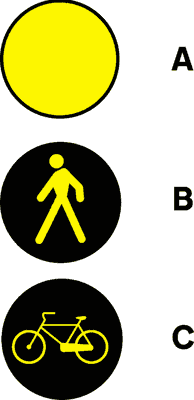
- **📖 الترجمة السياقية:** يعتبر الضوء الدائري الأصفر الوماض (النوع A في الشكل) إشارة خطر عامة.
- **💡 الشرح والقاعدة المرورية:** صحيح (VERO). الضوء الدائري الأصفر الوماض المستقل يُستخدم كإشارة تحذير من خطر عام أو لتنبيه السائقين لوجود نقطة خطرة أو تقاطع مروري.
- **⚠️ كشف الفخ:** فخ الامتحان: وميض الضوء الأصفر الدائري هو تنبيه رسمي لوجود خطر عام في الطريق.
- **🔑 الكلمات المفتاحية:** `{'it': 'pericolo generico', 'ar': 'خطر عام'}` | `{'it': 'luce circolare gialla lampeggiante', 'ar': 'ضوء دائري أصفر وماض'}` | `{'it': 'vero', 'ar': 'صحيح'}`

---

**56.** La luce circolare gialla lampeggiante (tipo A di figura) invita a moderare la velocità
- **الإجابة:** `VERO ✅ (صح)`
- 
- **📖 الترجمة السياقية:** يدعو الضوء الدائري الأصفر الوماض (النوع A في الشكل) إلى تخفيف السرعة.
- **💡 الشرح والقاعدة المرورية:** صحيح (VERO). التحذير بالوميض الأصفر يفرض تلقائياً تخفيف السرعة والتحكم في المركبة للاستعداد لأي طارئ.
- **⚠️ كشف الفخ:** فخ الامتحان: رؤية الضوء الأصفر الوماض تفرض دائماً تخفيف السرعة (moderare la velocità).
- **🔑 الكلمات المفتاحية:** `{'it': 'moderare la velocità', 'ar': 'تخفيف السرعة'}` | `{'it': 'luce gialla lampeggiante', 'ar': 'ضوء أصفر وماض'}` | `{'it': 'vero', 'ar': 'صحيح'}`

---

**57.** La luce circolare gialla lampeggiante (tipo A di figura) invita a procedere con particolare prudenza
- **الإجابة:** `VERO ✅ (صح)`
- 
- **📖 الترجمة السياقية:** يدعو الضوء الدائري الأصفر الوماض (النوع A في الشكل) إلى التقدم بحذر خاص.
- **💡 الشرح والقاعدة المرورية:** صحيح (VERO). الغرض الرئيسي من وميض الضوء الأصفر هو مطالبة مستخدمي الطريق بتوخي أقصى درجات الحذر والحيطة أثناء التقدم.
- **⚠️ كشف الفخ:** فخ الامتحان: الأصفر الوماض = حذر خاص وتخفيف للسرعة.
- **🔑 الكلمات المفتاحية:** `{'it': 'particolare prudenza', 'ar': 'حذر خاص'}` | `{'it': 'procedere con prudenza', 'ar': 'التقدم بحذر'}` | `{'it': 'vero', 'ar': 'صحيح'}`

---

**58.** Nel semaforo la luce gialla lampeggiante impone l'arresto sempre prima dell'incrocio
- **الإجابة:** `FALSO ❌ (خطأ)`
- 
- **📖 الترجمة السياقية:** في الإشارة الضوئية، يفرض الضوء الأصفر الوماض التوقف دائماً قبل التقاطع.
- **💡 الشرح والقاعدة المرورية:** خطأ (FALSO). الضوء الأصفر الوماض لا يفرض التوقف الإلزامي، بل يفرض فقط تخفيف السرعة والحذر واحترام قواعد الأسبقية العادية.
- **⚠️ كشف الفخ:** فخ الامتحان: كلمة 'sempre' خاطئة تماماً؛ الأصفر الوماض لا يلزم بالتوقف وإنما بالحذر.
- **🔑 الكلمات المفتاحية:** `{'it': "impone l'arresto sempre", 'ar': 'يفرض التوقف دائماً (فخ)'}` | `{'it': 'solo prudenza', 'ar': 'حذر فقط'}` | `{'it': 'falso', 'ar': 'خطأ'}`

---

**59.** La luce circolare gialla lampeggiante (tipo A di figura) può essere posta prima di un ponte mobile
- **الإجابة:** `FALSO ❌ (خطأ)`
- 
- **📖 الترجمة السياقية:** يمكن وضع الضوء الدائري الأصفر الوماض (النوع A في الشكل) قبل الجسر المتحرك.
- **💡 الشرح والقاعدة المرورية:** خطأ (FALSO). الجسور المتحركة يوضع قبلها ضوءان أحمران وماضان (luci rosse lampeggianti) وليس ضوءاً أصفر وماضاً.
- **⚠️ كشف الفخ:** فخ الامتحان: الجسور المتحركة والعبارات ومزلقانات القطار تتطلب ضوءين أحمرين وماضين.
- **🔑 الكلمات المفتاحية:** `{'it': 'ponte mobile', 'ar': 'جسر متحرك'}` | `{'it': 'luci rosse', 'ar': 'أضواء حمراء'}` | `{'it': 'falso', 'ar': 'خطأ'}`

---

**60.** La luce circolare gialla lampeggiante (tipo A di figura) può essere posta prima di un pontile d'imbarco di navi traghetto
- **الإجابة:** `FALSO ❌ (خطأ)`
- 
- **📖 الترجمة السياقية:** يمكن وضع الضوء الدائري الأصفر الوماض (النوع A في الشكل) قبل رصيف صعود العبارات وسفن النقل.
- **💡 الشرح والقاعدة المرورية:** خطأ (FALSO). أرصفة صعود السفن والعبارات تحميها أضواء حمراء وماضة للتوقف التام، وليس ضوءاً أصفر وماضاً.
- **⚠️ كشف الفخ:** فخ الامتحان: أرصفة العبارات تحكمها أضواء حمراء وماضة وليست صفراء.
- **🔑 الكلمات المفتاحية:** `{'it': "pontile d'imbarco di navi traghetto", 'ar': 'رصيف صعود سفن العبارات'}` | `{'it': 'falso', 'ar': 'خطأ'}`

---

**61.** La luce gialla lampeggiante insieme a quella rossa in figura indica pericolo
- **الإجابة:** `FALSO ❌ (خطأ)`
- 
- **📖 الترجمة السياقية:** يشير وميض الضوء الأصفر بالتزامن مع الضوء الأحمر في الشكل إلى وجود خطر.
- **💡 الشرح والقاعدة المرورية:** خطأ (FALSO). في الإشارة الضوئية لا يضيء الضوء الأصفر والضوء الأحمر معاً ولا يومضان معاً إطلاقاً.
- **⚠️ كشف الفخ:** فخ الامتحان: لا يجتمع الأصفر والأحمر معاً في إشارة المرور في أي حالة تشغيلية.
- **🔑 الكلمات المفتاحية:** `{'it': 'insieme a quella rossa', 'ar': 'بالتزامن مع الأحمر (فخ)'}` | `{'it': 'inesistente', 'ar': 'غير موجود'}` | `{'it': 'falso', 'ar': 'خطأ'}`

---

## 📌 Luci rosse lampeggianti (10 domande)

**62.** Le luci rosse accese lampeggianti in figura obbligano ad arrestarsi a un passaggio a livello ferroviario senza barriere
- **الإجابة:** `VERO ✅ (صح)`
- 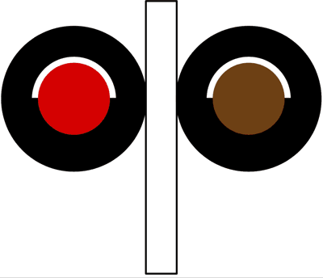
- **📖 الترجمة السياقية:** تلزم الأضواء الحمراء المضاءة الوماضة في الشكل بالتوقف عند تقاطع سكة حديدية بدون حواجز.
- **💡 الشرح والقاعدة المرورية:** صحيح (VERO). الضوءان الأحمران الوماضان البديلان يلزمان بالتوقف التام عند مزلقان السكة الحديدية غير المزود بحواجز فور بدء وميضهما.
- **⚠️ كشف الفخ:** فخ الامتحان: وميض الأضواء الحمراء يعني التوقف الإجباري المطلق فوراً.
- **🔑 الكلمات المفتاحية:** `{'it': 'luci rosse lampeggianti', 'ar': 'أضواء حمراء وماضة'}` | `{'it': 'passaggio a livello senza barriere', 'ar': 'تقاطع سكة حديد بدون حواجز'}` | `{'it': 'vero', 'ar': 'صحيح'}`

---

**63.** Le luci rosse accese lampeggianti in figura obbligano ad arrestarsi a un passaggio a livello ferroviario con semibarriere
- **الإجابة:** `VERO ✅ (صح)`
- 
- **📖 الترجمة السياقية:** تلزم الأضواء الحمراء المضاءة الوماضة في الشكل بالتوقف عند تقاطع سكة حديدية ذي أنصاف حواجز (semibarriere).
- **💡 الشرح والقاعدة المرورية:** صحيح (VERO). توضع الأضواء الحمراء الوماضة عند مزلقانات أنصاف الحواجز وتعمل قبل بدء نزول الحاجز لإلزام المركبات بالتوقف التام.
- **⚠️ كشف الفخ:** فخ الامتحان: الأضواء الحمراء الوماضة تعمل قبل نزول نصف الحاجز وتلزم بالتوقف الفوري.
- **🔑 الكلمات المفتاحية:** `{'it': 'passaggio a livello con semibarriere', 'ar': 'تقاطع سكة حديد بأنصاف حواجز'}` | `{'it': 'obbligano ad arrestarsi', 'ar': 'تلزم بالتوقف'}` | `{'it': 'vero', 'ar': 'صحيح'}`

---

**64.** Le luci rosse accese lampeggianti in figura obbligano ad arrestarsi all'accesso di un pontile d'imbarco di navi traghetto
- **الإجابة:** `VERO ✅ (صح)`
- 
- **📖 الترجمة السياقية:** تلزم الأضواء الحمراء المضاءة الوماضة في الشكل بالتوقف عند مدخل رصيف صعود العبارات وسفن النقل.
- **💡 الشرح والقاعدة المرورية:** صحيح (VERO). توضع هذه الأضواء على مداخل أرصفة العبارات وتلزم بالتوقف لمنع سقوط المركبات في المياه أثناء تحرك العبارة أو فتح البوابة.
- **⚠️ كشف الفخ:** فخ الامتحان: أرصفة العبارات تستخدم رسمياً هذه الأضواء الحمراء الوماضة لمنع الدخول الخطر.
- **🔑 الكلمات المفتاحية:** `{'it': "pontile d'imbarco di navi traghetto", 'ar': 'رصيف صعود سفن العبارات'}` | `{'it': 'obbligo di arresto', 'ar': 'وجوب التوقف'}` | `{'it': 'vero', 'ar': 'صحيح'}`

---

**65.** Le luci rosse accese lampeggianti in figura obbligano ad arrestarsi all'accesso di un ponte mobile
- **الإجابة:** `VERO ✅ (صح)`
- 
- **📖 الترجمة السياقية:** تلزم الأضواء الحمراء المضاءة الوماضة في الشكل بالتوقف عند مدخل الجسر المتحرك (ponte mobile).
- **💡 الشرح والقاعدة المرورية:** صحيح (VERO). تضيء هذه الأضواء باللون الأحمر الوماض لمنع مرور المركبات وإلزامها بالتوقف عندما يكون الجسر المتحرك مفتوحاً للملاحة النهرية أو البحرية.
- **⚠️ كشف الفخ:** فخ الامتحان: الجسور المتحركة تجهز بهذه الأضواء لمنع سقوط المركبات أثناء رفع الجسر.
- **🔑 الكلمات المفتاحية:** `{'it': 'accesso di un ponte mobile', 'ar': 'مدخل جسر متحرك'}` | `{'it': 'arrestarsi', 'ar': 'التوقف'}` | `{'it': 'vero', 'ar': 'صحيح'}`

---

**66.** Le luci rosse accese lampeggianti in figura obbligano a non superare la striscia trasversale d'arresto
- **الإجابة:** `VERO ✅ (صح)`
- 
- **📖 الترجمة السياقية:** تلزم الأضواء الحمراء المضاءة الوماضة في الشكل بعدم تجاوز خط التوقف العرضي.
- **💡 الشرح والقاعدة المرورية:** صحيح (VERO). عند بدء وميض هذه الأضواء، يُحظر تماماً تخطي خط التوقف العريض المرسوم على الأرض ويجب الانتظار خلفه حتى انطفائها التام.
- **⚠️ كشف الفخ:** فخ الامتحان: خط التوقف العرضي هو الحد القانوني الذي يمنع تجاوزه أثناء وميض الأضواء الحمراء.
- **🔑 الكلمات المفتاحية:** `{'it': 'non superare la striscia', 'ar': 'عدم تجاوز خط التوقف'}` | `{'it': "striscia trasversale d'arresto", 'ar': 'خط التوقف العرضي'}` | `{'it': 'vero', 'ar': 'صحيح'}`

---

**67.** Le luci rosse accese lampeggianti in figura si trovano in vicinanza di un posto di blocco della polizia
- **الإجابة:** `FALSO ❌ (خطأ)`
- 
- **📖 الترجمة السياقية:** تتواجد الأضواء الحمراء المضاءة الوماضة في الشكل بالقرب من نقطة تفتيش وحاجز أمني للشرطة (posto di blocco).
- **💡 الشرح والقاعدة المرورية:** خطأ (FALSO). نقاط التفتيش والحواجز الأمنية للشرطة لا تستخدم هذه الإشارات الضوئية المزدوجة، بل تستخدم شاخصة دائرية خاصة (ALT - POLIZIA).
- **⚠️ كشف الفخ:** فخ الامتحان: نقاط تفتيش الشرطة ليست مكاناً لوضع هذه الأضواء الحمراء الوماضة.
- **🔑 الكلمات المفتاحية:** `{'it': 'posto di blocco della polizia', 'ar': 'حاجز أمني للشرطة (فخ)'}` | `{'it': 'segnale Alt Polizia', 'ar': 'إشارة قف شرطة'}` | `{'it': 'falso', 'ar': 'خطأ'}`

---

**68.** Le luci rosse accese lampeggianti in figura obbligano ad arrestarsi all'accesso di un ponte stretto
- **الإجابة:** `FALSO ❌ (خطأ)`
- 
- **📖 الترجمة السياقية:** تلزم الأضواء الحمراء المضاءة الوماضة في الشكل بالتوقف عند مدخل جسر ضيق (ponte stretto).
- **💡 الشرح والقاعدة المرورية:** خطأ (FALSO). الجسور الضيقة تحكمها قواعد الأسبقية أو إشارات الأسبقية في المسالك الضيقة أو إشارات ضوئية عادية، وليس الأضواء الحمراء الوماضة هذه.
- **⚠️ كشف الفخ:** فخ الامتحان: الأضواء الحمراء الوماضة توضع عند الجسور المتحركة (ponti mobili) وليس الجسور الضيقة (ponti stretti).
- **🔑 الكلمات المفتاحية:** `{'it': 'ponte stretto', 'ar': 'جسر ضيق (فخ)'}` | `{'it': 'ponte mobile', 'ar': 'جسر متحرك (الاستخدام الصحيح)'}` | `{'it': 'falso', 'ar': 'خطأ'}`

---

**69.** Le luci rosse accese lampeggianti in figura indicano l'uscita obbligatoria dall'autostrada
- **الإجابة:** `FALSO ❌ (خطأ)`
- 
- **📖 الترجمة السياقية:** تشير الأضواء الحمراء المضاءة الوماضة في الشكل إلى الخروج الإجباري من الطريق السريع (autostrada).
- **💡 الشرح والقاعدة المرورية:** خطأ (FALSO). الخروج الإجباري من الطريق السريع يعلن عنه بشاخصات إرشادية وتوجيهية صفراء أو خضراء، ولا علاقة له بالأضواء الحمراء الوماضة.
- **⚠️ كشف الفخ:** فخ الامتحان: لا تستخدم الأضواء الحمراء الوماضة للإشارة إلى مخارج الطرق السريعة.
- **🔑 الكلمات المفتاحية:** `{'it': "uscita obbligatoria dall'autostrada", 'ar': 'خروج إجباري من الطريق السريع'}` | `{'it': 'falso', 'ar': 'خطأ'}`

---

**70.** Le luci rosse accese lampeggianti in figura si trovano 150 metri prima di un confine di Stato
- **الإجابة:** `FALSO ❌ (خطأ)`
- 
- **📖 الترجمة السياقية:** تتواجد الأضواء الحمراء المضاءة الوماضة في الشكل على بعد 150 متراً قبل حدود الدولة (confine di Stato).
- **💡 الشرح والقاعدة المرورية:** خطأ (FALSO). حدود الدولة ونقاط الجمارك يعلن عنها بشاخصة (ALT - DOGANA) وليس بهذه الأضواء الحمراء الوماضة.
- **⚠️ كشف الفخ:** فخ الامتحان: الخلط بين إشارات الموانئ والقطارات ونقاط التفتيش الجمركية الحدودية.
- **🔑 الكلمات المفتاحية:** `{'it': 'confine di Stato', 'ar': 'حدود الدولة'}` | `{'it': 'Alt Dogana', 'ar': 'قف جمارك'}` | `{'it': 'falso', 'ar': 'خطأ'}`

---

**71.** Le luci rosse accese lampeggianti in figura indicano che sta per accendersi la luce verde
- **الإجابة:** `FALSO ❌ (خطأ)`
- 
- **📖 الترجمة السياقية:** تشير الأضواء الحمراء المضاءة الوماضة في الشكل إلى قرب إضاءة الضوء الأخضر.
- **💡 الشرح والقاعدة المرورية:** خطأ (FALSO). هذا النظام لا يحتوي على ضوء أخضر على الإطلاق؛ فهو مكون فقط من ضوءين أحمرين وماضين، وإذا انطفآ فهذا يعني زوال الخطر وجواز العبور.
- **⚠️ كشف الفخ:** فخ الامتحان: جهاز الأضواء الحمراء الوماضة لا يحتوي أساساً على ضوء أخضر.
- **🔑 الكلمات المفتاحية:** `{'it': 'sta per accendersi il verde', 'ar': 'قرب إضاءة الضوء الأخضر (فخ)'}` | `{'it': 'non ha luce verde', 'ar': 'لا يحتوي على ضوء أخضر'}` | `{'it': 'falso', 'ar': 'خطأ'}`

---

## 📌 Semaforo trasporto pubblico (17 domande)

**72.** Il semaforo in figura può avere la luce bianca orizzontale accesa
- **الإجابة:** `VERO ✅ (صح)`
- 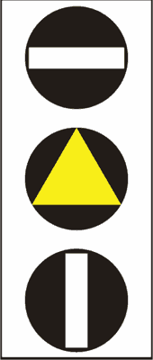
- **📖 الترجمة السياقية:** يمكن أن تكون الإشارة الضوئية في الشكل ذات ضوء أبيض أفقي مضاء.
- **💡 الشرح والقاعدة المرورية:** صحيح (VERO). الشريط الأبيض الأفقي في الأعلى هو إحدى الإشارات المكونة لهذه المنظومة، وإضاءته تعني التوقف التام لمركبات النقل العام.
- **⚠️ كشف الفخ:** فخ الامتحان: الشريط الأبيض الأفقي يمثل حالة التوقف (نظير الضوء الأحمر) لوسائل النقل العام.
- **🔑 الكلمات المفتاحية:** `{'it': 'luce bianca orizzontale', 'ar': 'ضوء أبيض أفقي'}` | `{'it': 'barra orizzontale', 'ar': 'شريط أفقي'}` | `{'it': 'vero', 'ar': 'صحيح'}`

---

**73.** Il semaforo in figura può avere la luce bianca verticale accesa
- **الإجابة:** `VERO ✅ (صح)`
- 
- **📖 الترجمة السياقية:** يمكن أن تكون الإشارة الضوئية في الشكل ذات ضوء أبيض رأسي مضاء.
- **💡 الشرح والقاعدة المرورية:** صحيح (VERO). الشريط الأبيض الرأسي (أو المائل) في الأسفل يمثل إذن المرور (نظير الضوء الأخضر) للسير للأمام أو الانعطاف لحافلات وترامات النقل العام.
- **⚠️ كشف الفخ:** فخ الامتحان: الشريط الرأسي الأبيض يعني إذن العبور لمركبات النقل العام.
- **🔑 الكلمات المفتاحية:** `{'it': 'luce bianca verticale', 'ar': 'ضوء أبيض رأسي'}` | `{'it': 'via libera', 'ar': 'إذن العبور'}` | `{'it': 'vero', 'ar': 'صحيح'}`

---

**74.** Il segnale luminoso in figura indica un semaforo per i veicoli di trasporto pubblico
- **الإجابة:** `VERO ✅ (صح)`
- 
- **📖 الترجمة السياقية:** تشير الإشارة الضوئية المعروضة إلى إشارة ضوئية خاصة بمركبات النقل العام (veicoli di trasporto pubblico).
- **💡 الشرح والقاعدة المرورية:** صحيح (VERO). هذه الإشارة الضوئية البيضاء والصفراء مخصصة حصراً لتنظيم سير مركبات النقل الجماعي المنتظم للأشخاص (كالترام والحافلات).
- **⚠️ كشف الفخ:** فخ الامتحان: الإشارة ذات الأشرطة البيضاء والمثلث الأصفر هي إشارة مخصصة لمركبات النقل العام.
- **🔑 الكلمات المفتاحية:** `{'it': 'veicoli di trasporto pubblico', 'ar': 'مركبات النقل العام'}` | `{'it': 'semaforo speciale', 'ar': 'إشارة ضوئية خاصة'}` | `{'it': 'vero', 'ar': 'صحيح'}`

---

**75.** Il semaforo in figura vale per i veicoli in servizio di linea per trasporto di persone
- **الإجابة:** `VERO ✅ (صح)`
- 
- **📖 الترجمة السياقية:** تسري الإشارة الضوئية المعروضة على المركبات المخصصة لخدمات نقل الأشخاص على الخطوط المنتظمة.
- **💡 الشرح والقاعدة المرورية:** صحيح (VERO). تخضع لهذه الإشارة حافلات النقل العام والترامات السائرة على مسارات محددة ومنتظمة لنقل الركاب.
- **⚠️ كشف الفخ:** فخ الامتحان: الإشارة تخص الحافلات والترامات في الخدمة العامة المنتظمة.
- **🔑 الكلمات المفتاحية:** `{'it': 'servizio di linea', 'ar': 'خدمة الخطوط المنتظمة'}` | `{'it': 'trasporto di persone', 'ar': 'نقل الأشخاص'}` | `{'it': 'vero', 'ar': 'صحيح'}`

---

**76.** Il semaforo in figura impone l'arresto ai veicoli in servizio di linea per trasporto di persone quando è accesa la barra bianca in alto
- **الإجابة:** `VERO ✅ (صح)`
- 
- **📖 الترجمة السياقية:** تفرض الإشارة المعروضة التوقف على مركبات خطوط النقل العام للأشخاص عند إضاءة الشريط الأبيض في الأعلى.
- **💡 الشرح والقاعدة المرورية:** صحيح (VERO). الشريط الأبيض الأفقي العلوي يفرض التوقف الإلزامي (equivale al rosso) على حافلات وترامات النقل العام.
- **⚠️ كشف الفخ:** فخ الامتحان: الشريط الأفقي العلوي = توقف (أحمر).
- **🔑 الكلمات المفتاحية:** `{'it': 'barra bianca in alto', 'ar': 'الشريط الأبيض في الأعلى'}` | `{'it': "impone l'arresto", 'ar': 'يفرض التوقف'}` | `{'it': 'vero', 'ar': 'صحيح'}`

---

**77.** Il semaforo in figura consente ai veicoli di trasporto pubblico di persone di proseguire quando in basso è accesa la barra bianca
- **الإجابة:** `VERO ✅ (صح)`
- 
- **📖 الترجمة السياقية:** تسمح الإشارة المعروضة لمركبات النقل العام للأشخاص بمتابعة السير عند إضاءة الشريط الأبيض في الأسفل.
- **💡 الشرح والقاعدة المرورية:** صحيح (VERO). الشريط الأبيض الرأسي أو المائل السفلي يمنح إذن العبور (equivale al verde) لمركبات النقل العام.
- **⚠️ كشف الفخ:** فخ الامتحان: الشريط الأبيض السفلي = سير وعاشر مسارك (أخضر).
- **🔑 الكلمات المفتاحية:** `{'it': 'barra bianca in basso', 'ar': 'الشريط الأبيض في الأسفل'}` | `{'it': 'consente di proseguire', 'ar': 'يسمح بمتابعة السير'}` | `{'it': 'vero', 'ar': 'صحيح'}`

---

**78.** Il semaforo in figura è un semaforo pedonale
- **الإجابة:** `FALSO ❌ (خطأ)`
- 
- **📖 الترجمة السياقية:** الإشارة الضوئية المعروضة هي إشارة ضوئية خاصة بالمشاة (semaforo pedonale).
- **💡 الشرح والقاعدة المرورية:** خطأ (FALSO). إشارة المشاة تحتوي على رسم رجل مضاء بألوان أخضر وأصفر وأحمر، بينما هذه الإشارة خاصة بمركبات النقل العام.
- **⚠️ كشف الفخ:** فخ الامتحان: إشارة المشاة تتميز برسم الشخص الماشي وليست أشرطة بيضاء.
- **🔑 الكلمات المفتاحية:** `{'it': 'semaforo pedonale', 'ar': 'إشارة مشاة (فخ)'}` | `{'it': 'trasporto pubblico', 'ar': 'نقل عام'}` | `{'it': 'falso', 'ar': 'خطأ'}`

---

**79.** Il semaforo in figura preannuncia lavori in corso
- **الإجابة:** `FALSO ❌ (خطأ)`
- 
- **📖 الترجمة السياقية:** تنذر الإشارة الضوئية المعروضة بوجود أشغال جارية في الطريق (lavori in corso).
- **💡 الشرح والقاعدة المرورية:** خطأ (FALSO). الأشغال الجارية يعلن عنها بشاخصات صفراء وعلامات عمال حفر، ولا علاقة لهذه الإشارة بأعمال الطريق.
- **⚠️ كشف الفخ:** فخ الامتحان: لا علاقة لإشارات النقل العام بأشغال الطرق.
- **🔑 الكلمات المفتاحية:** `{'it': 'lavori in corso', 'ar': 'أشغال جارية (فخ)'}` | `{'it': 'falso', 'ar': 'خطأ'}`

---

**80.** Il semaforo in figura indica i possibili scambi dei binari tranviari
- **الإجابة:** `FALSO ❌ (خطأ)`
- 
- **📖 الترجمة السياقية:** تشير الإشارة الضوئية المعروضة إلى التحويلات الممكنة لقضبان الترام (scambi dei binari tranviari).
- **💡 الشرح والقاعدة المرورية:** خطأ (FALSO). هذه إشارة تنظيم أسبقية ومرور (توقف / انطلاق) وليست مؤشراً ميكانيكياً لتحويل قضبان مسار الترام.
- **⚠️ كشف الفخ:** فخ الامتحان: الإشارة تنظم حق المرور والوقوف ولا تشير لمبدلات القضبان الميكانيكية.
- **🔑 الكلمات المفتاحية:** `{'it': 'scambi dei binari', 'ar': 'تحويلات القضبان'}` | `{'it': 'regolazione del traffico', 'ar': 'تنظيم المرور'}` | `{'it': 'falso', 'ar': 'خطأ'}`

---

**81.** Il semaforo in figura impone ai motocicli di rallentare quando è acceso il triangolo giallo
- **الإجابة:** `FALSO ❌ (خطأ)`
- 
- **📖 الترجمة السياقية:** تفرض الإشارة المعروضة على الدراجات النارية تخفيف السرعة عند إضاءة المثلث الأصفر.
- **💡 الشرح والقاعدة المرورية:** خطأ (FALSO). هذه الإشارة لا تعني الدراجات النارية بأي حال؛ فهي مخصصة حصراً لمركبات النقل العام، والمثلث الأصفر يماثل الضوء الأصفر للتوقف.
- **⚠️ كشف الفخ:** فخ الامتحان: سائقو الدراجات والسيارات يتبعون الإشارات الضوئية العادية ولا يخضعون لهذه الإشارة.
- **🔑 الكلمات المفتاحية:** `{'it': 'motocicli', 'ar': 'دراجات نارية (فخ)'}` | `{'it': 'solo trasporto pubblico', 'ar': 'نقل عام فقط'}` | `{'it': 'falso', 'ar': 'خطأ'}`

---

**82.** Il semaforo in figura vale per i veicoli con targa militare
- **الإجابة:** `FALSO ❌ (خطأ)`
- 
- **📖 الترجمة السياقية:** تسري الإشارة الضوئية المعروضة على المركبات ذات اللوحات المعدنية العسكرية (targa militare).
- **💡 الشرح والقاعدة المرورية:** خطأ (FALSO). الإشارة مخصصة لمركبات النقل العام للأشخاص في الخطوط المنتظمة، ولا تخص المركبات العسكرية.
- **⚠️ كشف الفخ:** فخ الامتحان: المركبات العسكرية لا تخضع لإشارات حافلات النقل العام.
- **🔑 الكلمات المفتاحية:** `{'it': 'targa militare', 'ar': 'لوحة عسكرية (فخ)'}` | `{'it': 'falso', 'ar': 'خطأ'}`

---

**83.** Il semaforo in figura è valido solo per i veicoli che marciano su rotaie (tram, treni)
- **الإجابة:** `FALSO ❌ (خطأ)`
- 
- **📖 الترجمة السياقية:** تسري الإشارة الضوئية المعروضة حصراً على المركبات السائرة على قضبان حديدية (الترام، القطارات).
- **💡 الشرح والقاعدة المرورية:** خطأ (FALSO). الإشارة لا تقتصر حصراً على الترامات، بل تسري أيضاً على حافلات النقل العام (autobus) وسيارات الترولي باص التي تسير على عجلات مطاطية.
- **⚠️ كشف الفخ:** فخ الامتحان: كلمة 'solo veicoli su rotaie' غير صحيحة لأنها تلزم الحافلات أيضاً.
- **🔑 الكلمات المفتاحية:** `{'it': 'solo su rotaie', 'ar': 'فقط على قضبان (فخ)'}` | `{'it': 'anche autobus', 'ar': 'وأيضاً الحافلات'}` | `{'it': 'falso', 'ar': 'خطأ'}`

---

**84.** Il semaforo in figura regola il transito dei pedoni
- **الإجابة:** `FALSO ❌ (خطأ)`
- 
- **📖 الترجمة السياقية:** تنظم الإشارة الضوئية المعروضة عبور المشاة.
- **💡 الشرح والقاعدة المرورية:** خطأ (FALSO). هذه الإشارة لا تنظم عبور المشاة إطلاقاً، بل تنظم حركة حافلات وترامات النقل العام.
- **⚠️ كشف الفخ:** فخ الامتحان: المشاة لهم إشاراتهم الضوئية المستقلة ذات الرموز الآدمية.
- **🔑 الكلمات المفتاحية:** `{'it': 'transito dei pedoni', 'ar': 'عبور المشاة'}` | `{'it': 'falso', 'ar': 'خطأ'}`

---

**85.** Il semaforo in figura indica un passaggio a livello senza barriere
- **الإجابة:** `FALSO ❌ (خطأ)`
- 
- **📖 الترجمة السياقية:** تشير الإشارة الضوئية المعروضة إلى وجود تقاطع سكة حديدية بدون حواجز.
- **💡 الشرح والقاعدة المرورية:** خطأ (FALSO). تقاطع السكة الحديدية بدون حواجز تحكمه أضواء حمراء وماضة وصليب سانت أندريا، ولا علاقة له بهذه الإشارة.
- **⚠️ كشف الفخ:** فخ الامتحان: الخلط بين إشارات القطار وإشارة حافلات النقل الجماعي.
- **🔑 الكلمات المفتاحية:** `{'it': 'passaggio a livello senza barriere', 'ar': 'تقاطع سكة حديد بدون حواجز'}` | `{'it': 'falso', 'ar': 'خطأ'}`

---

**86.** Il semaforo in figura regola il transito nei pontili per l'imbarco sulle navi traghetto
- **الإجابة:** `FALSO ❌ (خطأ)`
- 
- **📖 الترجمة السياقية:** تنظم الإشارة الضوئية المعروضة حركة المرور في أرصفة الصعود إلى سفن العبارات (navi traghetto).
- **💡 الشرح والقاعدة المرورية:** خطأ (FALSO). أرصفة صعود السفن والعبارات تنظمها أضواء حمراء وماضة مزدوجة، بينما هذه الإشارة خاصة بمركبات النقل العام للأشخاص.
- **⚠️ كشف الفخ:** فخ الامتحان: الخلط بين إشارات حافلات النقل العام وإشارات الموانئ والعبارات.
- **🔑 الكلمات المفتاحية:** `{'it': "pontili per l'imbarco", 'ar': 'أرصفة صعود السفن'}` | `{'it': 'navi traghetto', 'ar': 'سفن العبارات'}` | `{'it': 'falso', 'ar': 'خطأ'}`

---

**87.** Il semaforo in figura indica la vicinanza di una stazione ferroviaria
- **الإجابة:** `FALSO ❌ (خطأ)`
- 
- **📖 الترجمة السياقية:** تشير الإشارة الضوئية المعروضة إلى الاقتراب من محطة قطارات (stazione ferroviaria).
- **💡 الشرح والقاعدة المرورية:** خطأ (FALSO). محطات القطار يعلن عنها بشاخصات إرشادية مستطيلة زرقاء أو بيضاء، وليست إشارة ضوئية ذات أشرطة بيضاء للنقل العام.
- **⚠️ كشف الفخ:** فخ الامتحان: الإشارة تنظم حركة المرور عند التقاطعات ولا تشير إلى موقع محطة القطار.
- **🔑 الكلمات المفتاحية:** `{'it': 'stazione ferroviaria', 'ar': 'محطة قطار'}` | `{'it': 'semaforo trasporto pubblico', 'ar': 'إشارة نقل عام'}` | `{'it': 'falso', 'ar': 'خطأ'}`

---

**88.** Il semaforo in figura, con il triangolo giallo acceso, preavvisa lavori in corso
- **الإجابة:** `FALSO ❌ (خطأ)`
- 
- **📖 الترجمة السياقية:** تنذر الإشارة الضوئية المعروضة، مع إضاءة المثلث الأصفر، بوجود أشغال جارية في الطريق.
- **💡 الشرح والقاعدة المرورية:** خطأ (FALSO). المثلث الأصفر المضاء في إشارة النقل العام يعادل الضوء الأصفر العادي (وجوب التوقف بأمان)، ولا علاقة له بورش العمل والأشغال.
- **⚠️ كشف الفخ:** فخ الامتحان: المثلث الأصفر هنا مرحلة توقف لحافلات الترام وليس إشارة أشغال.
- **🔑 الكلمات المفتاحية:** `{'it': 'triangolo giallo acceso', 'ar': 'مثلث أصفر مضاء'}` | `{'it': 'lavori in corso', 'ar': 'أشغال جارية (فخ)'}` | `{'it': 'falso', 'ar': 'خطأ'}`

---

## 📌 Regole semaforo (17 domande)

**89.** Incontrando il semaforo in figura è consentito il passaggio quando è accesa la luce verde
- **الإجابة:** `VERO ✅ (صح)`
- 
- **📖 الترجمة السياقية:** عند مصادفة الإشارة الضوئية المعروضة، يُسمح بالمرور عندما يكون الضوء الأخضر مضاءً.
- **💡 الشرح والقاعدة المرورية:** صحيح (VERO). الضوء الأخضر المستدير يمنح إذن العبور التام (via libera) في جميع الاتجاهات المسموح بها مع توخي الحذر.
- **⚠️ كشف الفخ:** فخ الامتحان: الضوء الأخضر يمنح إذن المرور الأساسي.
- **🔑 الكلمات المفتاحية:** `{'it': 'luce verde', 'ar': 'الضوء الأخضر'}` | `{'it': 'consentito il passaggio', 'ar': 'مسموح بالمرور'}` | `{'it': 'vero', 'ar': 'صحيح'}`

---

**90.** Incontrando il semaforo in figura è consentito il passaggio quando si accende la luce gialla fissa, solo se non ci si può arrestare in condizioni di sicurezza prima dell'incrocio
- **الإجابة:** `VERO ✅ (صح)`
- 
- **📖 الترجمة السياقية:** عند مصادفة الإشارة المعروضة، يُسمح بالمرور عند إضاءة الضوء الأصفر الثابت فقط إذا تعذر التوقف بأمان قبل التقاطع.
- **💡 الشرح والقاعدة المرورية:** صحيح (VERO). القاعدة الذهبية للضوء الأصفر الثابت: التوقف إلزامي إلا إذا كان السائق قريباً جداً بحيث يتعذر التوقف دون خطر الاصطدام أو التوقف الفجائي الخطير.
- **⚠️ كشف الفخ:** فخ الامتحان: المرور على الأصفر الثابت مشروط حصراً بعدم إمكانية التوقف الآمن قبل الخط.
- **🔑 الكلمات المفتاحية:** `{'it': 'luce gialla fissa', 'ar': 'ضوء أصفر ثابت'}` | `{'it': 'condizioni di sicurezza', 'ar': 'شروط الأمان والسلامة'}` | `{'it': 'vero', 'ar': 'صحيح'}`

---

**91.** Incontrando il semaforo in figura è consentito il passaggio quando è accesa la luce gialla lampeggiante, usando però la massima prudenza e moderando la velocità
- **الإجابة:** `VERO ✅ (صح)`
- 
- **📖 الترجمة السياقية:** عند مصادفة الإشارة المعروضة، يُسمح بالمرور عند إضاءة الضوء الأصفر الوماض، ولكن مع توخي أقصى درجات الحذر وتخفيف السرعة.
- **💡 الشرح والقاعدة المرورية:** صحيح (VERO). وميض الضوء الأصفر يعني أن الإشارة في وضع التحذير؛ ويجوز العبور مع تخفيض السرعة والالتزام الصارم بقواعد الأسبقية (إعطاء الأسبقية لليمين).
- **⚠️ كشف الفخ:** فخ الامتحان: الأصفر الوماض يسمح بالمرور بشرط تخفيف السرعة والحذر الشديد.
- **🔑 الكلمات المفتاحية:** `{'it': 'luce gialla lampeggiante', 'ar': 'ضوء أصفر وماض'}` | `{'it': 'massima prudenza', 'ar': 'أقصى درجات الحذر'}` | `{'it': 'moderando la velocità', 'ar': 'تخفيف السرعة'}` | `{'it': 'vero', 'ar': 'صحيح'}`

---

**92.** Incontrando il semaforo in figura è consentito il passaggio quando esso è spento, usando però la massima prudenza
- **الإجابة:** `VERO ✅ (صح)`
- 
- **📖 الترجمة السياقية:** عند مصادفة الإشارة المعروضة، يُسمح بالمرور عندما تكون الإشارة مطفأة، ولكن مع توخي أقصى درجات الحذر.
- **💡 الشرح والقاعدة المرورية:** صحيح (VERO). انطفاء الإشارة بالكامل لا يعني إغلاق الطريق، بل يسمح بالعبور مع تطبيق قواعد المرور العامة وإشارات الأسبقية إن وجدت والحذر الشديد.
- **⚠️ كشف الفخ:** فخ الامتحان: انطفاء الإشارة يعيد تنظيم التقاطع للقواعد العامة للأسبقية دون منع المرور.
- **🔑 الكلمات المفتاحية:** `{'it': 'semaforo spento', 'ar': 'إشارة مطفأة'}` | `{'it': 'consentito il passaggio', 'ar': 'مسموح بالمرور'}` | `{'it': 'massima prudenza', 'ar': 'أقصى درجات الحذر'}` | `{'it': 'vero', 'ar': 'صحيح'}`

---

**93.** Incontrando il segnale luminoso in figura è consentito il passaggio in caso di semaforo guasto, usando però la massima prudenza
- **الإجابة:** `VERO ✅ (صح)`
- 
- **📖 الترجمة السياقية:** عند مصادفة الإشارة المعروضة، يُسمح بالمرور في حال تعطل الإشارة الضوئية، ولكن مع توخي أقصى درجات الحذر.
- **💡 الشرح والقاعدة المرورية:** صحيح (VERO). عند تعطل الإشارة الضوئية (semaforo guasto)، يتقدم السائقون بحذر شديد مع إعطاء الأسبقية لليمين ما لم توجد شاخصات أسبقية عمودية تحكم التقاطع.
- **⚠️ كشف الفخ:** فخ الامتحان: في حالة العطل، تسري القواعد العامة لحق الأسبقية ويسمح بالمرور بحذر.
- **🔑 الكلمات المفتاحية:** `{'it': 'semaforo guasto', 'ar': 'إشارة معطلة'}` | `{'it': 'passaggio con prudenza', 'ar': 'المرور بحذر'}` | `{'it': 'vero', 'ar': 'صحيح'}`

---

**94.** Il segnale luminoso in figura è un semaforo per i veicoli
- **الإجابة:** `VERO ✅ (صح)`
- 
- **📖 الترجمة السياقية:** الإشارة الضوئية المعروضة في الشكل هي إشارة ضوئية للمركبات (semaforo per i veicoli).
- **💡 الشرح والقاعدة المرورية:** صحيح (VERO). الإشارة الثلاثية القياسية (أحمر، أصفر، أخضر) ذات الأقراص الممتلئة مخصصة لتنظيم حركة جميع فئات المركبات.
- **⚠️ كشف الفخ:** فخ الامتحان: الأقراص الدائرية الكاملة تعني إشارة مركبات عامة وليست إشارة مشاة أو دراجات.
- **🔑 الكلمات المفتاحية:** `{'it': 'semaforo per i veicoli', 'ar': 'إشارة ضوئية للمركبات'}` | `{'it': 'segnale luminoso', 'ar': 'إشارة ضوئية'}` | `{'it': 'vero', 'ar': 'صحيح'}`

---

**95.** Il semaforo in figura è posto, di norma, in un incrocio
- **الإجابة:** `VERO ✅ (صح)`
- 
- **📖 الترجمة السياقية:** توضع الإشارة الضوئية المعروضة كقاعدة عامة (di norma) عند التقاطعات.
- **💡 الشرح والقاعدة المرورية:** صحيح (VERO). الموقع الطبيعي والمعتاد لإشارات المرور الضوئية للمركبات هو عند تقاطعات الطرق لتنظيم التدفقات المرورية المتعارضة.
- **⚠️ كشف الفخ:** فخ الامتحان: عبارة 'di norma' دقيقة تماماً لأن وظيفتها الأساسية هي تنظيم التقاطعات.
- **🔑 الكلمات المفتاحية:** `{'it': 'di norma', 'ar': 'كقاعدة عامة / عادةً'}` | `{'it': 'in un incrocio', 'ar': 'عند تقاطع'}` | `{'it': 'vero', 'ar': 'صحيح'}`

---

**96.** Il semaforo in figura serve, di norma, a regolare il passaggio dei veicoli in un incrocio
- **الإجابة:** `VERO ✅ (صح)`
- 
- **📖 الترجمة السياقية:** تُستخدم الإشارة المعروضة كقاعدة عامة لتنظيم مرور المركبات في التقاطعات.
- **💡 الشرح والقاعدة المرورية:** صحيح (VERO). الغرض الأساسي والوظيفي للإشارة الضوئية هو الفصل الزمني لحركات السير المتعارضة عند التقاطعات.
- **⚠️ كشف الفخ:** فخ الامتحان: الوظيفة التنظيمية هي الهدف الجوهري للإشارة الضوئية.
- **🔑 الكلمات المفتاحية:** `{'it': 'regolare il passaggio dei veicoli', 'ar': 'تنظيم مرور المركبات'}` | `{'it': 'in un incrocio', 'ar': 'في تقاطع'}` | `{'it': 'vero', 'ar': 'صحيح'}`

---

**97.** Il semaforo in figura, con luce gialla fissa accesa, consente l'attraversamento dell'incrocio, se lo si è già impegnato
- **الإجابة:** `VERO ✅ (صح)`
- 
- **📖 الترجمة السياقية:** تسمح الإشارة المعروضة، عند إضاءة الضوء الأصفر الثابت، بعبور التقاطع إذا كان السائق قد شغله ودخله بالفعل.
- **💡 الشرح والقاعدة المرورية:** صحيح (VERO). من دخل مساحة التقاطع وتجاوز خط التوقف قبل تحول الضوء للأصفر يجب عليه إتمام العبور وإخلاء التقاطع فوراً لمنع عرقلة المرور.
- **⚠️ كشف الفخ:** فخ الامتحان: من شغل التقاطع بالفعل (già impegnato) يكمل عبوره ولا يتوقف في المنتصف.
- **🔑 الكلمات المفتاحية:** `{'it': 'luce gialla fissa', 'ar': 'ضوء أصفر ثابت'}` | `{'it': 'già impegnato', 'ar': 'دخله وشغله بالفعل'}` | `{'it': 'attraversamento', 'ar': 'العبور'}` | `{'it': 'vero', 'ar': 'صحيح'}`

---

**98.** Incontrando il semaforo in figura è consentito il passaggio poco prima che si accenda la luce verde, purché sia già accesa quella rossa per gli altri veicoli
- **الإجابة:** `FALSO ❌ (خطأ)`
- 
- **📖 الترجمة السياقية:** عند مصادفة الإشارة المعروضة، يُسمح بالمرور قبيل إضاءة الضوء الأخضر بقليل، بشرط أن يكون الضوء الأحمر قد أضاء بالفعل للمركبات الأخرى.
- **💡 الشرح والقاعدة المرورية:** خطأ (FALSO). يُحظر تماماً التحرك أو المرور قبل إضاءة الضوء الأخضر الخاص بمسارك؛ وتوقع الإشارة والانطلاق مبكراً مخالفة مرورية خطيرة للغاية.
- **⚠️ كشف الفخ:** فخ الامتحان: عبارة 'poco prima che si accenda il verde' فخ قاتل؛ يجب انتظار الأخضر الفعلي التام.
- **🔑 الكلمات المفتاحية:** `{'it': 'poco prima del verde', 'ar': 'قبل الأخضر بقليل (فخ)'}` | `{'it': 'attendere il verde', 'ar': 'انتظار الأخضر'}` | `{'it': 'falso', 'ar': 'خطأ'}`

---

**99.** Incontrando il semaforo in figura è consentito il passaggio quando si accende la luce rossa, usando la massima prudenza
- **الإجابة:** `FALSO ❌ (خطأ)`
- 
- **📖 الترجمة السياقية:** عند مصادفة الإشارة المعروضة، يُسمح بالمرور عند إضاءة الضوء الأحمر باستخدام أقصى درجات الحذر.
- **💡 الشرح والقاعدة المرورية:** خطأ (FALSO). الضوء الأحمر يفرض أمراً مطلقاً بالتوقف التام؛ ولا توجد أي درجة من الحذر تبيح كسر الإشارة الحمراء والمرور.
- **⚠️ كشف الفخ:** فخ الامتحان: لا حذر يبيح المرور على الضوء الأحمر؛ التوقف إلزامي مطلق.
- **🔑 الكلمات المفتاحية:** `{'it': 'passaggio con luce rossa', 'ar': 'المرور مع الضوء الأحمر (فخ)'}` | `{'it': 'massima prudenza', 'ar': 'أقصى درجات الحذر (حيلة مضللة)'}` | `{'it': 'falso', 'ar': 'خطأ'}`

---

**100.** Incontrando il semaforo in figura è consentito il passaggio quando, pur essendo accesa la luce rossa, non vengono veicoli dalle altre direzioni
- **الإجابة:** `FALSO ❌ (خطأ)`
- 
- **📖 الترجمة السياقية:** عند مصادفة الإشارة المعروضة، يُسمح بالمرور حتى مع إضاءة الضوء الأحمر طالما لا تأتي مركبات من الاتجاهات الأخرى.
- **💡 الشرح والقاعدة المرورية:** خطأ (FALSO). خلو التقاطع من المركبات الأخرى لا يعطي أي حق لتجاوز الضوء الأحمر؛ فالأمر بالتوقف مرتبط بالضوء الأحمر نفسه وليس بحجم حركة السير.
- **⚠️ كشف الفخ:** فخ الامتحان: خلو الطريق لا يبرر كسر الإشارة الحمراء نهائياً.
- **🔑 الكلمات المفتاحية:** `{'it': 'non vengono veicoli', 'ar': 'لا تأتي مركبات (فخ)'}` | `{'it': 'luce rossa', 'ar': 'ضوء أحمر'}` | `{'it': 'falso', 'ar': 'خطأ'}`

---

**101.** Il semaforo in figura non vale per i veicoli in servizio di linea per trasporto di persone
- **الإجابة:** `FALSO ❌ (خطأ)`
- 
- **📖 الترجمة السياقية:** الإشارة المعروضة لا تسري على المركبات العاملة في خطوط النقل العام للأشخاص.
- **💡 الشرح والقاعدة المرورية:** خطأ (FALSO). الإشارة الضوئية العادية تسري على جميع المركبات بما فيها حافلات النقل العام، إلا إذا كانت هناك إشارة خاصة منفصلة لحافلات النقل العام.
- **⚠️ كشف الفخ:** فخ الامتحان: حافلات النقل العام تخضع للإشارة العامة للمركبات ما لم توجد إشارة خاصة بها.
- **🔑 الكلمات المفتاحية:** `{'it': 'non vale per i veicoli di linea', 'ar': 'لا تسري على حافلات الخطوط (فخ)'}` | `{'it': 'vale per tutti', 'ar': 'تسري على الجميع'}` | `{'it': 'falso', 'ar': 'خطأ'}`

---

**102.** Il segnale luminoso in figura è un semaforo che non vale per le biciclette
- **الإجابة:** `FALSO ❌ (خطأ)`
- 
- **📖 الترجمة السياقية:** الإشارة الضوئية المعروضة هي إشارة لا تسري على الدراجات الهوائية.
- **💡 الشرح والقاعدة المرورية:** خطأ (FALSO). الدراجات الهوائية تعتبر مركبات بالمعنى القانوني، وتلزمها إشارة المرور الضوئية العادية للمركبات تماماً كالسيارات.
- **⚠️ كشف الفخ:** فخ الامتحان: الدراجات الهوائية تخضع لإشارات المرور العادية ولا تُستثنى منها أبداً.
- **🔑 الكلمات المفتاحية:** `{'it': 'non vale per le biciclette', 'ar': 'لا تسري على الدراجات (فخ)'}` | `{'it': 'obbligo anche per ciclisti', 'ar': 'إلزام للدراجين أيضاً'}` | `{'it': 'falso', 'ar': 'خطأ'}`

---

**103.** Il semaforo in figura si trova in tutti i caselli autostradali
- **الإجابة:** `FALSO ❌ (خطأ)`
- 
- **📖 الترجمة السياقية:** تتواجد الإشارة الضوئية المعروضة في جميع بوابات دفع رسوم الطرق السريعة (caselli autostradali).
- **💡 الشرح والقاعدة المرورية:** خطأ (FALSO). بوابات الأوتوستراد تستخدم إشارات ضوئية خاصة بالمسالك (سهم أخضر وعلامة X حمراء أو إشارات تيليباس)، ولا تستخدم الإشارة الثلاثية العادية للتقاطعات في جميع البوابات.
- **⚠️ كشف الفخ:** فخ الامتحان: كلمة 'in tutti i caselli' مبالغة خاطئة؛ بوابات الرسوم لها إشارات مسالك خاصة.
- **🔑 الكلمات المفتاحية:** `{'it': 'tutti i caselli autostradali', 'ar': 'جميع بوابات الطرق السريعة (فخ)'}` | `{'it': 'semafori per caselli', 'ar': 'إشارات بوابات الرسوم'}` | `{'it': 'falso', 'ar': 'خطأ'}`

---

**104.** Il semaforo in figura si trova in vicinanza dei binari ferroviari
- **الإجابة:** `FALSO ❌ (خطأ)`
- 
- **📖 الترجمة السياقية:** تتواجد الإشارة الضوئية المعروضة بالقرب من قضبان السكك الحديدية.
- **💡 الشرح والقاعدة المرورية:** خطأ (FALSO). تقاطعات السكك الحديدية لا تستخدم الإشارة الثلاثية (أخضر وأصفر وأحمر)، بل تستخدم أضواء حمراء وماضة وصليب سانت أندريا.
- **⚠️ كشف الفخ:** فخ الامتحان: السكك الحديدية تستخدم أضواء حمراء وماضة وليس الإشارة الثلاثية العادية.
- **🔑 الكلمات المفتاحية:** `{'it': 'vicinanza dei binari ferroviari', 'ar': 'بالقرب من السكك الحديدية (فخ)'}` | `{'it': 'luci rosse lampeggianti', 'ar': 'أضواء حمراء وماضة'}` | `{'it': 'falso', 'ar': 'خطأ'}`

---

**105.** Il semaforo in figura, con luce gialla lampeggiante accesa, non consente il transito dei veicoli
- **الإجابة:** `FALSO ❌ (خطأ)`
- 
- **📖 الترجمة السياقية:** الإشارة المعروضة، مع إضاءة الضوء الأصفر الوماض، لا تسمح بمرور المركبات.
- **💡 الشرح والقاعدة المرورية:** خطأ (FALSO). على العكس، الضوء الأصفر الوماض يسمح بمرور المركبات ولكن بحذر شديد مع احترام قواعد الأولوية العامة.
- **⚠️ كشف الفخ:** فخ الامتحان: كلمة 'non consente il transito' غير صحيحة؛ الأصفر الوماض يسمح بالعبور بحذر.
- **🔑 الكلمات المفتاحية:** `{'it': 'non consente il transito', 'ar': 'لا تسمح بالمرور (فخ)'}` | `{'it': 'consente con prudenza', 'ar': 'تسمح بحذر'}` | `{'it': 'falso', 'ar': 'خطأ'}`

---

## 📌 Luci passaggio livello (14 domande)

**106.** Le luci in figura si possono trovare in vicinanza di passaggi a livello con semibarriere
- **الإجابة:** `VERO ✅ (صح)`
- 
- **📖 الترجمة السياقية:** يمكن أن تتواجد الأضواء في الشكل بالقرب من تقاطعات السكك الحديدية ذات أنصاف الحواجز (semibarriere).
- **💡 الشرح والقاعدة المرورية:** صحيح (VERO). تُركب الأضواء الحمراء الوماضة البديلة عند مزلقانات أنصاف الحواجز لحظر العبور قبل هبوط الحاجز وأثناء مرور القطار.
- **⚠️ كشف الفخ:** فخ الامتحان: تقاطعات أنصاف الحواجز تتطلب حتماً وجود هذا النظام الضوئي الوماض.
- **🔑 الكلمات المفتاحية:** `{'it': 'passaggi a livello con semibarriere', 'ar': 'تقاطعات سكة حديد بأنصاف حواجز'}` | `{'it': 'luci rosse', 'ar': 'أضواء حمراء'}` | `{'it': 'vero', 'ar': 'صحيح'}`

---

**107.** Le luci in figura si accendono alternativamente per segnalare l'arrivo dei treni nei passaggi a livello senza barriere
- **الإجابة:** `VERO ✅ (صح)`
- 
- **📖 الترجمة السياقية:** تضيء الأضواء في الشكل بالتبادل للإشارة إلى اقتراب القطارات في تقاطعات السكك الحديدية بدون حواجز.
- **💡 الشرح والقاعدة المرورية:** صحيح (VERO). في المزلقانات غير المزودة بحواجز، تومض العدستان الحمراوان بالتناوب عند اقتراب القطار لتنبيه السائقين بوجوب التوقف الفوري.
- **⚠️ كشف الفخ:** فخ الامتحان: الوميض التبادلي (lampeggiano alternativamente) يعلن عن اقتراب القطار.
- **🔑 الكلمات المفتاحية:** `{'it': 'accendono alternativamente', 'ar': 'تضيء بالتبادل'}` | `{'it': 'arrivo dei treni', 'ar': 'اقتراب القطارات'}` | `{'it': 'senza barriere', 'ar': 'بدون حواجز'}` | `{'it': 'vero', 'ar': 'صحيح'}`

---

**108.** Le luci in figura quando sono accese vietano il passaggio di veicoli e pedoni
- **الإجابة:** `VERO ✅ (صح)`
- 
- **📖 الترجمة السياقية:** تمنع الأضواء في الشكل عند إضاءتها مرور كل من المركبات والمشاة.
- **💡 الشرح والقاعدة المرورية:** صحيح (VERO). حظر المرور المفروض بالأضواء الحمراء الوماضة مطلق وشامل، ويلزم المركبات والمشاة معاً بعدم التقدم أو عبور خط السكة الحديدية.
- **⚠️ كشف الفخ:** فخ الامتحان: الحظر يسري على المركبات والمشاة بلا استثناء.
- **🔑 الكلمات المفتاحية:** `{'it': 'vietano il passaggio', 'ar': 'تمنع المرور'}` | `{'it': 'veicoli e pedoni', 'ar': 'المركبات والمشاة'}` | `{'it': 'vero', 'ar': 'صحيح'}`

---

**109.** Le luci in figura, di norma, sono situate sul lato destro della strada
- **الإجابة:** `VERO ✅ (صح)`
- 
- **📖 الترجمة السياقية:** توضع الأضواء في الشكل، كقاعدة عامة (di norma)، على الجانب الأيمن من الطريق.
- **💡 الشرح والقاعدة المرورية:** صحيح (VERO). يتم تثبيت الإشارات الضوئية لمزلقانات القطار على الجانب الأيمن من نهر الطريق لتكون في مجال رؤية السائق المباشر.
- **⚠️ كشف الفخ:** فخ الامتحان: التثبيت الطبيعي للإشارات في كود السير يكون على الجانب الأيمن للطريق.
- **🔑 الكلمات المفتاحية:** `{'it': 'lato destro della strada', 'ar': 'الجانب الأيمن للطريق'}` | `{'it': 'di norma', 'ar': 'كقاعدة عامة'}` | `{'it': 'vero', 'ar': 'صحيح'}`

---

**110.** Le luci in figura entrano in funzione poco prima dell'arrivo del treno e rimangono accese fino alla fine del suo passaggio
- **الإجابة:** `VERO ✅ (صح)`
- 
- **📖 الترجمة السياقية:** تبدأ الأضواء في الشكل بالعمل قبيل وصول القطار بقليل وتظل مضاءة حتى نهاية مروره.
- **💡 الشرح والقاعدة المرورية:** صحيح (VERO). يتم تنشيط الإشارات الضوئية التبادلية آلياً قبل وصول القطار بوقت كافٍ، وتستمر بالوميض طوال فترة عبوره حتى ينتهي مروره بالكامل.
- **⚠️ كشف الفخ:** فخ الامتحان: الأضواء تستمر بالعمل حتى اكتمال مرور القطار كاملاً.
- **🔑 الكلمات المفتاحية:** `{'it': "entrano in funzione prima dell'arrivo", 'ar': 'تبدأ بالعمل قبل وصول القطار'}` | `{'it': 'fine del suo passaggio', 'ar': 'نهاية مروره'}` | `{'it': 'vero', 'ar': 'صحيح'}`

---

**111.** Le luci in figura si accendono subito prima dell'inizio dell'abbassamento delle semibarriere
- **الإجابة:** `VERO ✅ (صح)`
- 
- **📖 الترجمة السياقية:** تضيء الأضواء في الشكل فوراً قبل بدء نزول أنصاف الحواجز.
- **💡 الشرح والقاعدة المرورية:** صحيح (VERO). تضيء الأضواء الحمراء الوماضة وتبدأ صفارة الإنذار بالرنين قبل لحظات من بدء الحركة الميكانيكية لهبوط نصف الحاجز لتفريغ المزلقان.
- **⚠️ كشف الفخ:** فخ الامتحان: الإشارة الضوئية تسبق نزول الحاجز لإتاحة فرصة التوقف أو الخروج لمن بداخل التقاطع.
- **🔑 الكلمات المفتاحية:** `{'it': "subito prima dell'inizio dell'abbassamento", 'ar': 'مباشرة قبل بدء النزول'}` | `{'it': 'semibarriere', 'ar': 'أنصاف الحواجز'}` | `{'it': 'vero', 'ar': 'صحيح'}`

---

**112.** Le luci in figura sono integrate da un dispositivo di segnalazione acustica
- **الإجابة:** `VERO ✅ (صح)`
- 
- **📖 الترجمة السياقية:** تكون الأضواء في الشكل مدمجة بجهاز تنبيه صوتي (صفارة إنذار).
- **💡 الشرح والقاعدة المرورية:** صحيح (VERO). تقترن الأضواء الحمراء الوماضة عند مزلقانات السكك الحديدية بجرس أو صفارة صوتية (dispositivo acustico) لتعزيز تنبيه السائقين والمشاة.
- **⚠️ كشف الفخ:** فخ الامتحان: الإنذار الصوتي يرافق الإشارة الضوئية دائماً عند مزلقانات القطار.
- **🔑 الكلمات المفتاحية:** `{'it': 'dispositivo di segnalazione acustica', 'ar': 'جهاز إنذار صوتي'}` | `{'it': 'campanella ferroviaria', 'ar': 'جرس السكة الحديد'}` | `{'it': 'vero', 'ar': 'صحيح'}`

---

**113.** Avvicinandosi ad un passaggio a livello con luci rosse lampeggianti alternativamente e semibarriera ancora alzata, occorre predisporsi all'arresto
- **الإجابة:** `VERO ✅ (صح)`
- 
- **📖 الترجمة السياقية:** عند الاقتراب من تقاطع سكة حديد بأضواء حمراء تومض بالتبادل بينما لا يزال نصف الحاجز مرفوعاً، يجب الاستعداد للتوقف.
- **💡 الشرح والقاعدة المرورية:** صحيح (VERO). بدء وميض الأضواء الحمراء هو الأمر القاطع بالتوقف، حتى لو كان نصف الحاجز لا يزال في وضع الرفع ولم يبدأ بالنزول بعد.
- **⚠️ كشف الفخ:** فخ الامتحان: العبرة ببدء وميض الأضواء؛ فإذا ومضت وجب التوقف حتى لو كان الحاجز ما زال مرفوعاً.
- **🔑 الكلمات المفتاحية:** `{'it': 'semibarriera ancora alzata', 'ar': 'نصف الحاجز ما زال مرفوعاً'}` | `{'it': "predisporsi all'arresto", 'ar': 'الاستعداد للتوقف'}` | `{'it': 'vero', 'ar': 'صحيح'}`

---

**114.** Avvicinandosi ad un passaggio a livello con luci rosse lampeggianti alternativamente e semibarriera ancora alzata, si può passare velocemente, se non si vede sopraggiungere alcun treno
- **الإجابة:** `FALSO ❌ (خطأ)`
- 
- **📖 الترجمة السياقية:** عند الاقتراب من تقاطع سكة حديد بأضواء حمراء تومض بالتبادل ونصف الحاجز ما زال مرفوعاً، يمكن المرور بسرعة إذا لم نَرَ أي قطار قادم.
- **💡 الشرح والقاعدة المرورية:** خطأ (FALSO). وميض الأضواء الحمراء يفرض التوقف الفوري والمطلق؛ والعبور بسرعة محظور قطعاً ويعرض السائق لموت محقق ومخالفة جسيمة.
- **⚠️ كشف الفخ:** فخ الامتحان: لا يجوز أبداً العبور على الأضواء الحمراء بحجة أن القطار لم يظهر بعد.
- **🔑 الكلمات المفتاحية:** `{'it': 'passare velocemente', 'ar': 'المرور بسرعة (فخ قاتل)'}` | `{'it': 'non si vede sopraggiungere alcun treno', 'ar': 'عدم رؤية قطار قادم'}` | `{'it': 'falso', 'ar': 'خطأ'}`

---

**115.** Le luci in figura si trovano lungo le linee ferroviarie, come semaforo per i conducenti dei treni
- **الإجابة:** `FALSO ❌ (خطأ)`
- 
- **📖 الترجمة السياقية:** تتواجد الأضواء في الشكل على طول خطوط السكك الحديدية كإشارة ضوئية لسائقي القطارات.
- **💡 الشرح والقاعدة المرورية:** خطأ (FALSO). هذه إشارات موجهة لسائقي المركبات ومستخدمي الطريق على المسار البري، وليست لسائقي القطارات على شريط السكة الحديدية.
- **⚠️ كشف الفخ:** فخ الامتحان: الإشارة تنظم حركة سيارات الطريق وليس القطارات.
- **🔑 الكلمات المفتاحية:** `{'it': 'conducenti dei treni', 'ar': 'سائقو القطارات (فخ)'}` | `{'it': 'utenti della strada', 'ar': 'مستخدمو الطريق البري'}` | `{'it': 'falso', 'ar': 'خطأ'}`

---

**116.** Le luci in figura quando lampeggiano alternativamente invitano a occupare rapidamente il passaggio a livello
- **الإجابة:** `FALSO ❌ (خطأ)`
- 
- **📖 الترجمة السياقية:** تدعو الأضواء في الشكل عند وميضها بالتبادل إلى الدخول بسرعة في تقاطع السكة الحديدية وشغله.
- **💡 الشرح والقاعدة المرورية:** خطأ (FALSO). وميض الأضواء يفرض التوقف التام قبل المزلقان، ويمنع منعاً باتاً الدخول أو الاندفاع لعبوره.
- **⚠️ كشف الفخ:** فخ الامتحان: الوميض يلزم بالتوقف وليس بالاندفاع أو شغل التقاطع.
- **🔑 الكلمات المفتاحية:** `{'it': 'occupare rapidamente', 'ar': 'شغل التقاطع بسرعة (فخ)'}` | `{'it': 'fermarsi', 'ar': 'التوقف'}` | `{'it': 'falso', 'ar': 'خطأ'}`

---

**117.** Le luci in figura si possono trovare 150 metri prima di un passaggio a livello con barriere
- **الإجابة:** `FALSO ❌ (خطأ)`
- 
- **📖 الترجمة السياقية:** يمكن أن تتواجد الأضواء في الشكل على بعد 150 متراً قبل تقاطع سكة حديد ذي حواجز كاملة.
- **💡 الشرح والقاعدة المرورية:** خطأ (FALSO). الأضواء الحمراء الوماضة تُثبت مباشرة عند خط التقاطع وليس على بعد 150 متراً (الذي يوضع عنده المثلث التحذيري الخطر).
- **⚠️ كشف الفخ:** فخ الامتحان: موضع الأضواء الحمراء الوماضة عند نقطة التوقف مباشرة وليس على بعد 150 متراً.
- **🔑 الكلمات المفتاحية:** `{'it': '150 metri prima', 'ar': 'على بعد 150 متراً (فخ)'}` | `{'it': 'in prossimità immediata', 'ar': 'بجوار الخط مباشرة'}` | `{'it': 'falso', 'ar': 'خطأ'}`

---

**118.** Le luci in figura vengono poste sul primo dei pannelli distanziometrici di un passaggio a livello
- **الإجابة:** `FALSO ❌ (خطأ)`
- 
- **📖 الترجمة السياقية:** توضع الأضواء في الشكل على أول لوحة من اللوحات المحددة للمسافات (pannelli distanziometrici) لتقاطع السكة الحديد.
- **💡 الشرح والقاعدة المرورية:** خطأ (FALSO). اللوحات المحددة للمسافات هي أعمدة بيضاء بخطوط حمراء مائلة (3 خطوط على مسافة 150م)، ولا تُركب عليها الأضواء الوماضة.
- **⚠️ كشف الفخ:** فخ الامتحان: لا توضع الأضواء الوماضة على لوحات تحديد المسافة ذات الخطوط الثلاثة.
- **🔑 الكلمات المفتاحية:** `{'it': 'primo pannello distanziometrico', 'ar': 'اللوحة الأولى للمسافات (فخ)'}` | `{'it': 'luci al passaggio', 'ar': 'الأضواء عند المزلقان'}` | `{'it': 'falso', 'ar': 'خطأ'}`

---

**119.** Il dispositivo luminoso in figura è costituito da luci lampeggianti alternativamente che si accendono durante la fase di apertura (sollevamento) delle semibarriere
- **الإجابة:** `FALSO ❌ (خطأ)`
- 
- **📖 الترجمة السياقية:** يتكون الجهاز الضوئي في الشكل من أضواء تومض بالتبادل تضيء أثناء مرحلة فتح (رفع) أنصاف الحواجز.
- **💡 الشرح والقاعدة المرورية:** خطأ (FALSO). الأضواء تومض أثناء مرحلة الإغلاق وطوال فترة مرور القطار، وتنطفئ تماماً بمجرد رفع الحاجز والسماح بالمرور.
- **⚠️ كشف الفخ:** فخ الامتحان: الأضواء تنطفئ أثناء الفتح ولا تعمل أثناءه.
- **🔑 الكلمات المفتاحية:** `{'it': 'fase di apertura (sollevamento)', 'ar': 'مرحلة الفتح والرفع (فخ)'}` | `{'it': 'chiusura', 'ar': 'الإغلاق'}` | `{'it': 'falso', 'ar': 'خطأ'}`

---

## 📌 Semafori corsie reversibili (15 domande)

**120.** I segnali luminosi in figura sono semafori per corsie reversibili
- **الإجابة:** `VERO ✅ (صح)`
- 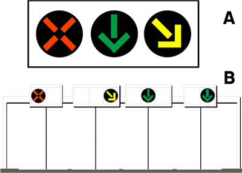
- **📖 الترجمة السياقية:** الإشارات الضوئية في الشكل هي إشارات ضوئية للمسالك التبادلية / العكسية (corsie reversibili).
- **💡 الشرح والقاعدة المرورية:** صحيح (VERO). هذه الإشارات العلوية المزودة بعلامة X حمراء وأسهم خضراء وصفراء مائلة مخصصة لتنظيم المسالك التي يتغير اتجاه سيرها حسب كثافة المرور.
- **⚠️ كشف الفخ:** فخ الامتحان: الرمز X والسهم الرأسي للأسفل هما العلامة المميزة لإشارات المسالك التبادلية.
- **🔑 الكلمات المفتاحية:** `{'it': 'semafori per corsie reversibili', 'ar': 'إشارات ضوئية للمسالك التبادلية'}` | `{'it': 'reversibilità', 'ar': 'عكس اتجاه السير'}` | `{'it': 'vero', 'ar': 'صحيح'}`

---

**121.** Il semaforo in figura non consente di occupare la corsia indicata con luce rossa a forma di X
- **الإجابة:** `VERO ✅ (صح)`
- 
- **📖 الترجمة السياقية:** لا تسمح الإشارة المعروضة بشغل المسلك المشار إليه بالضوء الأحمر على شكل علامة X.
- **💡 الشرح والقاعدة المرورية:** صحيح (VERO). علامة X الحمراء تعني أن المسلك محظور ومخصص للاتجاه المعاكس، ويُمنع منعاً باتاً السير فيه أو الانتقال إليه.
- **⚠️ كشف الفخ:** فخ الامتحان: علامة X الحمراء = مسلك ممنوع تماماً ومحجوز لحركة السير المقابلة.
- **🔑 الكلمات المفتاحية:** `{'it': 'luce rossa a forma di X', 'ar': 'ضوء أحمر على شكل X'}` | `{'it': 'non consente di occupare', 'ar': 'لا تسمح بشغل المسلك'}` | `{'it': 'vero', 'ar': 'صحيح'}`

---

**122.** Il semaforo in figura consente di impegnare la corsia indicata dalla freccia verde
- **الإجابة:** `VERO ✅ (صح)`
- 
- **📖 الترجمة السياقية:** تسمح الإشارة المعروضة بالسير في المسلك المشار إليه بالسهم الأخضر.
- **💡 الشرح والقاعدة المرورية:** صحيح (VERO). السهم الأخضر المتجه لأسفل يعني أن المسلك مفتوح ومتاح للسير في اتجاهك بأمان.
- **⚠️ كشف الفخ:** فخ الامتحان: السهم الأخضر الرأسي للأسفل = مسلك مفتوح للسير.
- **🔑 الكلمات المفتاحية:** `{'it': 'corsia indicata dalla freccia verde', 'ar': 'المسلك المشار إليه بالسهم الأخضر'}` | `{'it': 'consente di impegnare', 'ar': 'تسمح بالسير فيه'}` | `{'it': 'vero', 'ar': 'صحيح'}`

---

**123.** Nei semafori in figura la luce gialla lampeggiante obbliga il conducente a spostarsi nella corsia indicata dalla freccia
- **الإجابة:** `VERO ✅ (صح)`
- 
- **📖 الترجمة السياقية:** في الإشارات المعروضة، يلزم الضوء الأصفر الوماض السائق بالانتقال إلى المسلك الذي يشير إليه السهم المائل.
- **💡 الشرح والقاعدة المرورية:** صحيح (VERO). السهم الأصفر المائل الوماض يفرض إخلاء المسلك فوراً والانتقال إلى المسلك المجاور المشار إليه لأن المسلك الحالي يوشك على الإغلاق.
- **⚠️ كشف الفخ:** فخ الامتحان: السهم الأصفر المائل الوماض يفرض الإخلاء والانتقال الإلزامي للمسلك المشار إليه.
- **🔑 الكلمات المفتاحية:** `{'it': 'freccia gialla lampeggiante', 'ar': 'سهم أصفر وماض'}` | `{'it': 'spostarsi nella corsia indicata', 'ar': 'الانتقال للمسلك المحدد'}` | `{'it': 'obbligo di sgombero', 'ar': 'وجوب الإخلاء'}` | `{'it': 'vero', 'ar': 'صحيح'}`

---

**124.** Il semaforo di corsie reversibili in figura è posto su una carreggiata con almeno tre corsie
- **الإجابة:** `VERO ✅ (صح)`
- 
- **📖 الترجمة السياقية:** توضع إشارة المسالك التبادلية في الشكل على نهر طريق يحتوي على ثلاثة مسالك على الأقل.
- **💡 الشرح والقاعدة المرورية:** صحيح (VERO). نظام المسالك التبادلية العكسية يتطلب هندسياً وجود 3 مسالك على الأقل (مسلك لكل اتجاه ومسلك أوسط تبادلي أو أكثر).
- **⚠️ كشف الفخ:** فخ الامتحان: الحد الأدنى الهندسي للمسالك التبادلية هو ثلاثة مسالك (almeno tre corsie).
- **🔑 الكلمات المفتاحية:** `{'it': 'almeno tre corsie', 'ar': 'ثلاثة مسالك على الأقل'}` | `{'it': 'corsie reversibili', 'ar': 'مسالك تبادلية'}` | `{'it': 'vero', 'ar': 'صحيح'}`

---

**125.** Il semaforo di corsie reversibili in figura consente il transito nella corsia indicata dalla freccia verde
- **الإجابة:** `VERO ✅ (صح)`
- 
- **📖 الترجمة السياقية:** تسمح إشارة المسالك التبادلية في الشكل بالمرور في المسلك المشار إليه بالسهم الأخضر.
- **💡 الشرح والقاعدة المرورية:** صحيح (VERO). السهم الأخضر يؤكد أن المسلك سالك ومفتوح لحركة المرور في اتجاه سيرك.
- **⚠️ كشف الفخ:** فخ الامتحان: السهم الأخضر يعني إذن المرور للمسلك المقابل له.
- **🔑 الكلمات المفتاحية:** `{'it': 'consente il transito', 'ar': 'تسمح بالمرور'}` | `{'it': 'freccia verde', 'ar': 'سهم أخضر'}` | `{'it': 'vero', 'ar': 'صحيح'}`

---

**126.** Il semaforo di corsie reversibili in figura, con freccia gialla lampeggiante impone al conducente di abbandonare quella corsia e di spostarsi in quella indicata
- **الإجابة:** `VERO ✅ (صح)`
- 
- **📖 الترجمة السياقية:** تفرض إشارة المسالك التبادلية في الشكل، مع وميض السهم الأصفر، على السائق مغادرة ذلك المسلك والانتقال إلى المسلك المشار إليه.
- **💡 الشرح والقاعدة المرورية:** صحيح (VERO). وميض السهم الأصفر المائل يلزم بمغادرة المسلك حالاً نحو المسلك المجاور في اتجاه ميل السهم تجنباً لمواجهة السير المعاكس.
- **⚠️ كشف الفخ:** فخ الامتحان: مغادرة المسلك (abbandonare la corsia) التزام إجباري عند رؤية السهم الأصفر المائل.
- **🔑 الكلمات المفتاحية:** `{'it': 'abbandonare quella corsia', 'ar': 'مغادرة ذلك المسلك'}` | `{'it': 'spostarsi in quella indicata', 'ar': 'الانتقال للمسلك المشار إليه'}` | `{'it': 'vero', 'ar': 'صحيح'}`

---

**127.** Il semaforo in figura non consente di occupare le corsie indicate dalle frecce verdi
- **الإجابة:** `FALSO ❌ (خطأ)`
- 
- **📖 الترجمة السياقية:** لا تسمح الإشارة المعروضة بشغل المسالك المشار إليها بالأسهم الخضراء.
- **💡 الشرح والقاعدة المرورية:** خطأ (FALSO). على العكس تماماً، السهم الأخضر يعني بوضوح إمكانية وجواز السير في ذلك المسلك بحرية.
- **⚠️ كشف الفخ:** فخ الامتحان: كلمة 'non consente' تناقض وظيفة السهم الأخضر المفتوح.
- **🔑 الكلمات المفتاحية:** `{'it': 'non consente di occupare', 'ar': 'لا تسمح بشغل المسلك (فخ)'}` | `{'it': 'frecce verdi', 'ar': 'أسهم خضراء'}` | `{'it': 'falso', 'ar': 'خطأ'}`

---

**128.** Il semaforo in figura vale anche per i pedoni
- **الإجابة:** `FALSO ❌ (خطأ)`
- 
- **📖 الترجمة السياقية:** تسري الإشارة المعروضة أيضاً على المشاة.
- **💡 الشرح والقاعدة المرورية:** خطأ (FALSO). إشارات المسالك التبادلية العلوية تخص سائقي المركبات على الطرق السريعة والمتعددة المسالك، ولا شأن للمشاة بها.
- **⚠️ كشف الفخ:** فخ الامتحان: المشاة لا يستخدمون مسالك السيارات التبادلية ولا تسري عليهم إشاراتها.
- **🔑 الكلمات المفتاحية:** `{'it': 'vale anche per i pedoni', 'ar': 'تسري على المشاة أيضاً (فخ)'}` | `{'it': 'solo per veicoli', 'ar': 'للمركبات فقط'}` | `{'it': 'falso', 'ar': 'خطأ'}`

---

**129.** Nei semafori in figura, la luce rossa a forma di X impone di arrestarsi ed attendere la luce gialla
- **الإجابة:** `FALSO ❌ (خطأ)`
- 
- **📖 الترجمة السياقية:** في الإشارات المعروضة، يفرض الضوء الأحمر على شكل X التوقف وانتظار الضوء الأصفر.
- **💡 الشرح والقاعدة المرورية:** خطأ (FALSO). علامة X الحمراء لا تلزم بالتوقف في مكانك في المسلك، بل تمنع الدخول فيه أصلاً وتلزم بالسير في المسالك الخضراء المفتوحة.
- **⚠️ كشف الفخ:** فخ الامتحان: X الحمراء تمنع المسلك نهائياً وليست إشارة انتظار وتوقف مؤقت.
- **🔑 الكلمات المفتاحية:** `{'it': 'arrestarsi ed attendere il giallo', 'ar': 'التوقف وانتظار الأصفر (فخ)'}` | `{'it': 'corsia vietata', 'ar': 'مسلك ممنوع'}` | `{'it': 'falso', 'ar': 'خطأ'}`

---

**130.** Il semaforo in figura non vale per le biciclette
- **الإجابة:** `FALSO ❌ (خطأ)`
- 
- **📖 الترجمة السياقية:** الإشارة المعروضة لا تسري على الدراجات الهوائية.
- **💡 الشرح والقاعدة المرورية:** خطأ (FALSO). في الطرق التي يُسمح للدراجات بالسير فيها وتوجد بها هذه الإشارات، تلتزم الدراجات أيضاً باتجاهات المسالك المفتوحة بالسهم الأخضر.
- **⚠️ كشف الفخ:** فخ الامتحان: إشارات المرور تلزم جميع المركبات التي تستخدم الطريق.
- **🔑 الكلمات المفتاحية:** `{'it': 'non vale per le biciclette', 'ar': 'لا تسري على الدراجات (فخ)'}` | `{'it': 'regole di corsia', 'ar': 'قواعد المسالك'}` | `{'it': 'falso', 'ar': 'خطأ'}`

---

**131.** Il semaforo di corsie reversibili in figura indica la corsia per i veicoli lenti
- **الإجابة:** `FALSO ❌ (خطأ)`
- 
- **📖 الترجمة السياقية:** تشير إشارة المسالك التبادلية في الشكل إلى المسلك المخصص للمركبات البطيئة.
- **💡 الشرح والقاعدة المرورية:** خطأ (FALSO). الإشارة لا تحدد سرعات أو مسالك خاصة بالمركبات البطيئة، بل تحدد اتجاه السير المتاح للمسلك.
- **⚠️ كشف الفخ:** فخ الامتحان: مسالك المركبات البطيئة لها شاخصات تنظيمية وتحديد سرعات دنيا مستقلة.
- **🔑 الكلمات المفتاحية:** `{'it': 'corsia per i veicoli lenti', 'ar': 'مسلك المركبات البطيئة (فخ)'}` | `{'it': 'corsie reversibili', 'ar': 'مسالك عكسية'}` | `{'it': 'falso', 'ar': 'خطأ'}`

---

**132.** Il semaforo di corsie reversibili in figura indica la corsia per la sosta di emergenza
- **الإجابة:** `FALSO ❌ (خطأ)`
- 
- **📖 الترجمة السياقية:** تشير إشارة المسالك التبادلية في الشكل إلى مسلك التوقف الاضطراري (sosta di emergenza).
- **💡 الشرح والقاعدة المرورية:** خطأ (FALSO). مسلك الطوارئ يشار إليه بعلامات أرضية وشاخصات مستقلة (corsia di emergenza)، ولا تنظمه إشارات المسالك التبادلية.
- **⚠️ كشف الفخ:** فخ الامتحان: الخلط بين مسالك التسيير التبادلي ومسلك الطوارئ.
- **🔑 الكلمات المفتاحية:** `{'it': 'sosta di emergenza', 'ar': 'التوقف الاضطراري'}` | `{'it': 'corsia di emergenza', 'ar': 'مسلك الطوارئ'}` | `{'it': 'falso', 'ar': 'خطأ'}`

---

**133.** Il semaforo di corsie reversibili in figura indica la corsia riservata al sorpasso
- **الإجابة:** `FALSO ❌ (خطأ)`
- 
- **📖 الترجمة السياقية:** تشير إشارة المسالك التبادلية في الشكل إلى المسلك المخصص للتجاوز (corsia riservata al sorpasso).
- **💡 الشرح والقاعدة المرورية:** خطأ (FALSO). الإشارة لا تخصص مسلكاً للتجاوز بل تحدد فتح أو إغلاق المسلك لحركة السير العادية.
- **⚠️ كشف الفخ:** فخ الامتحان: لا توجد إشارة تخصص مسلكاً حصرياً للمناورة والتجاوز بهذه الطريقة.
- **🔑 الكلمات المفتاحية:** `{'it': 'riservata al sorpasso', 'ar': 'مخصصة للتجاوز (فخ)'}` | `{'it': 'falso', 'ar': 'خطأ'}`

---

**134.** Il semaforo di corsie reversibili in figura è posto solo su carreggiate a senso unico di circolazione
- **الإجابة:** `FALSO ❌ (خطأ)`
- 
- **📖 الترجمة السياقية:** توضع إشارة المسالك التبادلية في الشكل فقط على طرق ذات اتجاه سير واحد (senso unico).
- **💡 الشرح والقاعدة المرورية:** خطأ (FALSO). على العكس تماماً، وظيفتها الأساسية هي العمل على الطرق ذات الاتجاهين (doppio senso) لعكس اتجاه حركة المسالك حسب الذروة المرورية.
- **⚠️ كشف الفخ:** فخ الامتحان: كلمة 'solo su carreggiate a senso unico' باطلة؛ ففكرة التبادل تتطلب وجود اتجاهين للمرور.
- **🔑 الكلمات المفتاحية:** `{'it': 'solo su senso unico', 'ar': 'فقط على اتجاه واحد (فخ)'}` | `{'it': 'strade a doppio senso', 'ar': 'طرق ذات اتجاهين'}` | `{'it': 'falso', 'ar': 'خطأ'}`

---

## 📌 Semaforo pedoni (19 domande)

**135.** La luce verde accesa del semaforo in figura permette ai pedoni l'attraversamento
- **الإجابة:** `VERO ✅ (صح)`
- 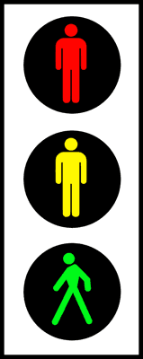
- **📖 الترجمة السياقية:** يسمح الضوء الأخضر المضاء للإشارة المعروضة للمشاة بعبور الطريق.
- **💡 الشرح والقاعدة المرورية:** صحيح (VERO). رسم الشخص الأخضر الماشي في إشارة المشاة يمنح المشاة إذن العبور التام والآمن لمعبر المشاة.
- **⚠️ كشف الفخ:** فخ الامتحان: الشخص الأخضر المضاء يعني إذن العبور للمشاة.
- **🔑 الكلمات المفتاحية:** `{'it': 'luce verde pedoni', 'ar': 'ضوء المشاة الأخضر'}` | `{'it': 'attraversamento', 'ar': 'العبور'}` | `{'it': 'vero', 'ar': 'صحيح'}`

---

**136.** La luce verde accesa del semaforo in figura consente ai pedoni di attraversare la strada
- **الإجابة:** `VERO ✅ (صح)`
- 
- **📖 الترجمة السياقية:** يتيح الضوء الأخضر المضاء للإشارة المعروضة للمشاة عبور الشارع بأمان.
- **💡 الشرح والقاعدة المرورية:** صحيح (VERO). الضوء الأخضر مخصص لتمكين المشاة من اجتياز نهر الطريق على الخطوط المحددة.
- **⚠️ كشف الفخ:** فخ الامتحان: الأخضر هو إذن السير والعبور المعتمد للمشاة.
- **🔑 الكلمات المفتاحية:** `{'it': 'attraversare la strada', 'ar': 'عبور الشارع'}` | `{'it': 'luce verde', 'ar': 'ضوء أخضر'}` | `{'it': 'vero', 'ar': 'صحيح'}`

---

**137.** La luce verde accesa del semaforo in figura consente ai pedoni di impegnare la carreggiata per attraversarla
- **الإجابة:** `VERO ✅ (صح)`
- 
- **📖 الترجمة السياقية:** يسمح الضوء الأخضر المضاء للإشارة المعروضة للمشاة بالدخول في نهر الطريق لعبوره.
- **💡 الشرح والقاعدة المرورية:** صحيح (VERO). يحق للمشاة النزول إلى نهر الطريق وبدء مناورة العبور عند إضاءة الرمز الأخضر.
- **⚠️ كشف الفخ:** فخ الامتحان: النزول لنهر الطريق مسموح به للمشاة عند الضوء الأخضر.
- **🔑 الكلمات المفتاحية:** `{'it': 'impegnare la carreggiata', 'ar': 'الدخول في نهر الطريق'}` | `{'it': 'per attraversarla', 'ar': 'لعبوره'}` | `{'it': 'vero', 'ar': 'صحيح'}`

---

**138.** Il semaforo in figura regola il passaggio dei pedoni negli incroci
- **الإجابة:** `VERO ✅ (صح)`
- 
- **📖 الترجمة السياقية:** تنظم الإشارة المعروضة حركة مرور المشاة عند التقاطعات.
- **💡 الشرح والقاعدة المرورية:** صحيح (VERO). وظيفة إشارة المشاة الضوئية هي ضبط أوقات عبور المشاة بأمان عند مفترقات الطرق والمعابر المجهزة.
- **⚠️ كشف الفخ:** فخ الامتحان: الإشارة مخصصة لتنظيم عبور المشاة بالتوافق مع إشارات المركبات.
- **🔑 الكلمات المفتاحية:** `{'it': 'regola il passaggio dei pedoni', 'ar': 'تنظم مرور المشاة'}` | `{'it': 'negli incroci', 'ar': 'عند التقاطعات'}` | `{'it': 'vero', 'ar': 'صحيح'}`

---

**139.** Il segnale luminoso in figura è un semaforo per i pedoni
- **الإجابة:** `VERO ✅ (صح)`
- 
- **📖 الترجمة السياقية:** الإشارة الضوئية المعروضة هي إشارة ضوئية خاصة بالمشاة (semaforo per i pedoni).
- **💡 الشرح والقاعدة المرورية:** صحيح (VERO). الرموز الظلية للأشخاص (شخص واقف وشخص ماشي) تصنف هذه الإشارة كإشارة ضوئية للمشاة حصراً.
- **⚠️ كشف الفخ:** فخ الامتحان: الأشكال الآدمية المضاءة تميز إشارات المشاة عن سائر الإشارات.
- **🔑 الكلمات المفتاحية:** `{'it': 'semaforo per i pedoni', 'ar': 'إشارة ضوئية للمشاة'}` | `{'it': 'sagoma pedonale', 'ar': 'الرمز الآدمي للمشاة'}` | `{'it': 'vero', 'ar': 'صحيح'}`

---

**140.** Il semaforo in figura, con luce gialla fissa accesa, impone ai pedoni che hanno già occupato l'attraversamento pedonale di liberarlo rapidamente
- **الإجابة:** `VERO ✅ (صح)`
- 
- **📖 الترجمة السياقية:** تفرض الإشارة المعروضة، مع إضاءة الضوء الأصفر الثابت، على المشاة الذين بدأوا العبور بالفعل إخلاء المعبر بسرعة.
- **💡 الشرح والقاعدة المرورية:** صحيح (VERO). الضوء الأصفر للمشاة يلزم من بدأ بالعبور بالإسراع بالوصول إلى الرصيف المقابل، ويمنع من هم على الرصيف من بدء العبور.
- **⚠️ كشف الفخ:** فخ الامتحان: الأصفر للمشاة = إخلاء سريع لمن بدأ العبور، ومنع النزول لمن لم يبدأ.
- **🔑 الكلمات المفتاحية:** `{'it': 'luce gialla fissa pedoni', 'ar': 'ضوء المشاة الأصفر الثابت'}` | `{'it': 'liberarlo rapidamente', 'ar': 'إخلاؤه بسرعة'}` | `{'it': 'vero', 'ar': 'صحيح'}`

---

**141.** Il semaforo in figura, con luce rossa accesa impone ai pedoni di non attraversare
- **الإجابة:** `VERO ✅ (صح)`
- 
- **📖 الترجمة السياقية:** تفرض الإشارة المعروضة، عند إضاءة الضوء الأحمر، على المشاة عدم عبور الطريق.
- **💡 الشرح والقاعدة المرورية:** صحيح (VERO). رمز الشخص الأحمر الواقف يفرض حظراً مطلقاً على المشاة بالنزول إلى الشارع أو عبور الطريق.
- **⚠️ كشف الفخ:** فخ الامتحان: الشخص الأحمر يمنع عبور المشاة تماماً.
- **🔑 الكلمات المفتاحية:** `{'it': 'luce rossa accesa', 'ar': 'ضوء أحمر مضاء'}` | `{'it': 'non attraversare', 'ar': 'عدم العبور'}` | `{'it': 'vero', 'ar': 'صحيح'}`

---

**142.** Il semaforo in figura indica una scala mobile in funzione
- **الإجابة:** `FALSO ❌ (خطأ)`
- 
- **📖 الترجمة السياقية:** تشير الإشارة المعروضة إلى وجود سلم متحرك قيد التشغيل (scala mobile in funzione).
- **💡 الشرح والقاعدة المرورية:** خطأ (FALSO). الإشارة هي إشارة مرور ضوئية للمشاة عند المعابر، ولا علاقة لها بالسلالم المتحركة.
- **⚠️ كشف الفخ:** فخ الامتحان: الخلط الغريب بين إشارات المشاة والسلالم الكهربائية في المباني.
- **🔑 الكلمات المفتاحية:** `{'it': 'scala mobile in funzione', 'ar': 'سلم كهربائي يعمل (فخ)'}` | `{'it': 'semaforo pedonale', 'ar': 'إشارة مشاة'}` | `{'it': 'falso', 'ar': 'خطأ'}`

---

**143.** La luce verde accesa del semaforo in figura consente il passaggio solo dei veicoli
- **الإجابة:** `FALSO ❌ (خطأ)`
- 
- **📖 الترجمة السياقية:** يسمح الضوء الأخضر المضاء للإشارة المعروضة بمرور المركبات فقط.
- **💡 الشرح والقاعدة المرورية:** خطأ (FALSO). الإشارة مخصصة للمشاة فقط، وتسمح بمرور المشاة وليس المركبات.
- **⚠️ كشف الفخ:** فخ الامتحان: كلمة 'solo dei veicoli' عكس الحقيقة تماماً لأن الإشارة للمشاة.
- **🔑 الكلمات المفتاحية:** `{'it': 'solo dei veicoli', 'ar': 'للمركبات فقط (فخ)'}` | `{'it': 'solo pedoni', 'ar': 'للمشاة فقط'}` | `{'it': 'falso', 'ar': 'خطأ'}`

---

**144.** La luce verde accesa del semaforo in figura obbliga i pedoni a dare la precedenza ai veicoli che svoltano
- **الإجابة:** `FALSO ❌ (خطأ)`
- 
- **📖 الترجمة السياقية:** يلزم الضوء الأخضر المضاء للإشارة المعروضة المشاة بإعطاء الأسبقية للمركبات المنعطفة.
- **💡 الشرح والقاعدة المرورية:** خطأ (FALSO). عندما تضيء الإشارة الخضراء للمشاة، تكون الأسبقية التامة للمشاة، والمركبات المنعطفة هي الملزمة بالتوقف وإعطاء الأسبقية لهم.
- **⚠️ كشف الفخ:** فخ الامتحان: المشاة على الأخضر هم أصحاب الأسبقية والمركبات المنعطفة ملزمة باحترامهم.
- **🔑 الكلمات المفتاحية:** `{'it': 'obbliga i pedoni a dare precedenza', 'ar': 'يلزم المشاة بإعطاء الأسبقية (فخ)'}` | `{'it': 'precedenza ai pedoni', 'ar': 'الأسبقية للمشاة'}` | `{'it': 'falso', 'ar': 'خطأ'}`

---

**145.** Il semaforo in figura segnala un ascensore pubblico
- **الإجابة:** `FALSO ❌ (خطأ)`
- 
- **📖 الترجمة السياقية:** تشير الإشارة المعروضة إلى وجود مصعد عام (ascensore pubblico).
- **💡 الشرح والقاعدة المرورية:** خطأ (FALSO). الإشارة هي إشارة تنظيم عبور المشاة في الشوارع ولا تدل على وجود مصاعد.
- **⚠️ كشف الفخ:** فخ الامتحان: لا علاقة لإشارات المرور بالمصاعد العامة.
- **🔑 الكلمات المفتاحية:** `{'it': 'ascensore pubblico', 'ar': 'مصعد عام (فخ)'}` | `{'it': 'falso', 'ar': 'خطأ'}`

---

**146.** Il semaforo in figura segnala la presenza di una scuola elementare, per cui bisogna rallentare
- **الإجابة:** `FALSO ❌ (خطأ)`
- 
- **📖 الترجمة السياقية:** تشير الإشارة المعروضة إلى وجود مدرسة ابتدائية، ولذلك يجب تخفيف السرعة.
- **💡 الشرح والقاعدة المرورية:** خطأ (FALSO). وجود المدارس ينبه إليه بشاخصة تحذير مثلثة حمراء برسم أطفال (pericolo bambini)، وليس بإشارة المشاة الضوئية الثلاثية.
- **⚠️ كشف الفخ:** فخ الامتحان: الخلط بين إشارة عبور المشاة الضوئية وشاخصة خطر الأطفال بالقرب من المدارس.
- **🔑 الكلمات المفتاحية:** `{'it': 'scuola elementare', 'ar': 'مدرسة ابتدائية (فخ)'}` | `{'it': 'pericolo bambini', 'ar': 'خطر أطفال'}` | `{'it': 'falso', 'ar': 'خطأ'}`

---

**147.** La luce verde del semaforo in figura è sempre accesa durante l'uscita degli studenti dalla scuola
- **الإجابة:** `FALSO ❌ (خطأ)`
- 
- **📖 الترجمة السياقية:** يكون الضوء الأخضر للإشارة المعروضة مضاءً دائماً أثناء خروج الطلاب من المدرسة.
- **💡 الشرح والقاعدة المرورية:** خطأ (FALSO). الإشارة تعمل بنظام توقيت دوري آلي منتظم (أخضر ثم أصفر ثم أحمر) أو بطلب زر يدوي، ولا تظل خضراء دائماً.
- **⚠️ كشف الفخ:** فخ الامتحان: كلمة 'sempre accesa' خاطئة لأن الإشارة تتناوب الألوان.
- **🔑 الكلمات المفتاحية:** `{'it': 'sempre accesa', 'ar': 'مضاء دائماً (فخ)'}` | `{'it': 'ciclo semaforico', 'ar': 'دورة ضوئية'}` | `{'it': 'falso', 'ar': 'خطأ'}`

---

**148.** Il segnale luminoso in figura indica la presenza di una scuola
- **الإجابة:** `FALSO ❌ (خطأ)`
- 
- **📖 الترجمة السياقية:** تشير الإشارة الضوئية المعروضة إلى وجود مدرسة.
- **💡 الشرح والقاعدة المرورية:** خطأ (FALSO). الإشارة تنظم عبور المشاة عند التقاطعات عموماً ولا تدل بحد ذاتها على وجود مدرسة.
- **⚠️ كشف الفخ:** فخ الامتحان: إشارة المشاة ليست شاخصة لوجود مدرسة.
- **🔑 الكلمات المفتاحية:** `{'it': 'presenza di una scuola', 'ar': 'وجود مدرسة (فخ)'}` | `{'it': 'falso', 'ar': 'خطأ'}`

---

**149.** Il semaforo in figura indica lo svolgimento di una gara podistica
- **الإجابة:** `FALSO ❌ (خطأ)`
- 
- **📖 الترجمة السياقية:** تشير الإشارة المعروضة إلى إقامة سباق للجري (gara podistica).
- **💡 الشرح والقاعدة المرورية:** خطأ (FALSO). إشارة المشاة لتنظيم حركة المرور اليومية ولا علاقة لها بالمسابقات والسباقات الرياضية.
- **⚠️ كشف الفخ:** فخ الامتحان: الرمز الماشي ليس إعلاناً عن ماراثون أو سباق جري.
- **🔑 الكلمات المفتاحية:** `{'it': 'gara podistica', 'ar': 'سباق جري (فخ)'}` | `{'it': 'falso', 'ar': 'خطأ'}`

---

**150.** Nelle aree di servizio autostradali il semaforo in figura indica i sottopassaggi pedonali
- **الإجابة:** `FALSO ❌ (خطأ)`
- 
- **📖 الترجمة السياقية:** في محطات الاستراحة والخدمة على الطرق السريعة، تشير الإشارة المعروضة إلى الأنفاق السفلية للمشاة.
- **💡 الشرح والقاعدة المرورية:** خطأ (FALSO). الأنفاق السفلية يشار إليها بشاخصات إرشادية مستطيلة زرقاء برسم درج سفلي، وليس بإشارة ضوئية ثلاثية.
- **⚠️ كشف الفخ:** فخ الامتحان: الأنفاق السفلية للمشاة لا تستخدم إشارات ضوئية لتحديد مكانها.
- **🔑 الكلمات المفتاحية:** `{'it': 'sottopassaggi pedonali', 'ar': 'أنفاق المشاة السفلية'}` | `{'it': 'aree di servizio', 'ar': 'محطات الخدمة'}` | `{'it': 'falso', 'ar': 'خطأ'}`

---

**151.** Il semaforo in figura si trova all'ingresso della metropolitana
- **الإجابة:** `FALSO ❌ (خطأ)`
- 
- **📖 الترجمة السياقية:** تتواجد الإشارة المعروضة عند مدخل محطة قطار الأنفاق (metropolitana).
- **💡 الشرح والقاعدة المرورية:** خطأ (FALSO). مداخل المترو توضح بحرف M كبير أحمر وشاخصات إرشادية، ولا تستخدم إشارات مرور ثلاثية.
- **⚠️ كشف الفخ:** فخ الامتحان: لا توضع إشارات المرور الضوئية كعلامة لمدخل المترو.
- **🔑 الكلمات المفتاحية:** `{'it': 'ingresso della metropolitana', 'ar': 'مدخل المترو (فخ)'}` | `{'it': 'falso', 'ar': 'خطأ'}`

---

**152.** Il semaforo in figura indica i cancelli di imbarco nelle aree portuali
- **الإجابة:** `FALSO ❌ (خطأ)`
- 
- **📖 الترجمة السياقية:** تشير الإشارة المعروضة إلى بوابات الصعود في المناطق المينائية.
- **💡 الشرح والقاعدة المرورية:** خطأ (FALSO). بوابات صعود الركاب في الموانئ لها لافتات إرشادية خاصة وليس إشارات المشاة الضوئية للتقاطعات.
- **⚠️ كشف الفخ:** فخ الامتحان: الخلط بين إشارات العبور في الطرق وإشارات الموانئ.
- **🔑 الكلمات المفتاحية:** `{'it': 'cancelli di imbarco', 'ar': 'بوابات الصعود'}` | `{'it': 'aree portuali', 'ar': 'مناطق الموانئ'}` | `{'it': 'falso', 'ar': 'خطأ'}`

---

**153.** Il semaforo in figura indica l'entrata di una struttura sportiva
- **الإجابة:** `FALSO ❌ (خطأ)`
- 
- **📖 الترجمة السياقية:** تشير الإشارة المعروضة إلى مدخل منشأة رياضية (struttura sportiva).
- **💡 الشرح والقاعدة المرورية:** خطأ (FALSO). الإشارة هي إشارة مرور رسمية لتنظيم حركة المشاة ولا تدل على المنشآت والملاعب الرياضية.
- **⚠️ كشف الفخ:** فخ الامتحان: لا علاقة للإشارة بالمنشآت الرياضية.
- **🔑 الكلمات المفتاحية:** `{'it': 'struttura sportiva', 'ar': 'منشأة رياضية (فخ)'}` | `{'it': 'falso', 'ar': 'خطأ'}`

---

## 📌 Semaforo biciclette (11 domande)

**154.** Il semaforo in figura si trova all'uscita di una pista ciclabile, per regolare l'attraversamento della strada
- **الإجابة:** `VERO ✅ (صح)`
- 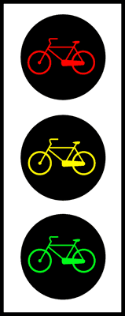
- **📖 الترجمة السياقية:** تتواجد الإشارة في الشكل عند مخرج مسار الدراجات الهوائية (pista ciclabile) لتنظيم عبور الطريق.
- **💡 الشرح والقاعدة المرورية:** صحيح (VERO). إشارة الدراجات توضع عند تقاطع مسار الدراجات مع نهر الطريق العادي لتنظيم عبور الدراجين بأمان.
- **⚠️ كشف الفخ:** فخ الامتحان: وظيفة الإشارة هي حماية وتنظيم خروج وعبور الدراجات من مسارها الخاص.
- **🔑 الكلمات المفتاحية:** `{'it': 'uscita di una pista ciclabile', 'ar': 'مخرج مسار الدراجات'}` | `{'it': 'attraversamento della strada', 'ar': 'عبور الطريق'}` | `{'it': 'vero', 'ar': 'صحيح'}`

---

**155.** Il segnale luminoso in figura è un semaforo riservato ai conducenti di biciclette
- **الإجابة:** `VERO ✅ (صح)`
- 
- **📖 الترجمة السياقية:** الإشارة الضوئية المعروضة هي إشارة مخصصة لسائقي الدراجات الهوائية (biciclette).
- **💡 الشرح والقاعدة المرورية:** صحيح (VERO). رسم الدراجة الهوائية داخل العدسات الثلاث يؤكد أنها موجهة خصيصاً للدراجين فقط دون غيرهم من مستخدمي الطريق.
- **⚠️ كشف الفخ:** فخ الامتحان: رمز الدراجة داخل الإشارة يحصر سريانها على راكبي الدراجات الهوائية.
- **🔑 الكلمات المفتاحية:** `{'it': 'riservato ai conducenti di biciclette', 'ar': 'مخصص لسائقي الدراجات'}` | `{'it': 'semaforo ciclabile', 'ar': 'إشارة الدراجات'}` | `{'it': 'vero', 'ar': 'صحيح'}`

---

**156.** Il semaforo in figura, con luce rossa accesa, impone l'arresto alle biciclette
- **الإجابة:** `VERO ✅ (صح)`
- 
- **📖 الترجمة السياقية:** تفرض الإشارة المعروضة، مع إضاءة الضوء الأحمر، التوقف على الدراجات الهوائية.
- **💡 الشرح والقاعدة المرورية:** صحيح (VERO). رسم الدراجة بالأحمر يلزم الدراجين بالتوقف التام والانتظار خلف خط التوقف الخاص بهم.
- **⚠️ كشف الفخ:** فخ الامتحان: الضوء الأحمر للدراجات يفرض التوقف الإلزامي تماماً كأي ضوء أحمر.
- **🔑 الكلمات المفتاحية:** `{'it': 'luce rossa accesa', 'ar': 'ضوء أحمر مضاء'}` | `{'it': "impone l'arresto", 'ar': 'يفرض التوقف'}` | `{'it': 'biciclette', 'ar': 'الدراجات'}` | `{'it': 'vero', 'ar': 'صحيح'}`

---

**157.** Il semaforo in figura, con luce gialla fissa accesa, impone ai conducenti di biciclette di liberare velocemente l'incrocio se lo hanno già impegnato
- **الإجابة:** `VERO ✅ (صح)`
- 
- **📖 الترجمة السياقية:** تفرض الإشارة المعروضة، مع إضاءة الضوء الأصفر الثابت، على راكبي الدراجات إخلاء التقاطع بسرعة إذا كانوا قد دخلوه بالفعل.
- **💡 الشرح والقاعدة المرورية:** صحيح (VERO). الضوء الأصفر الثابت يلزم الدراج الذي تجاوز خط التوقف بالإسراع بإخلاء التقاطع بسلام وتفادي التوقف في منتصف المسار.
- **⚠️ كشف الفخ:** فخ الامتحان: قاعدة الأصفر الثابت للدراجين هي الإخلاء السريع لمن بدأ العبور، والتوقف الآمن لمن لم يبدأ.
- **🔑 الكلمات المفتاحية:** `{'it': 'luce gialla fissa', 'ar': 'ضوء أصفر ثابت'}` | `{'it': "liberare velocemente l'incrocio", 'ar': 'إخلاء التقاطع بسرعة'}` | `{'it': 'vero', 'ar': 'صحيح'}`

---

**158.** Il semaforo in figura, con luce verde accesa, consente soltanto ai conducenti di biciclette di attraversare l'incrocio
- **الإجابة:** `VERO ✅ (صح)`
- 
- **📖 الترجمة السياقية:** تسمح الإشارة المعروضة، عند إضاءة الضوء الأخضر، لسائقي الدراجات الهوائية فقط بعبور التقاطع.
- **💡 الشرح والقاعدة المرورية:** صحيح (VERO). الضوء الأخضر برسم الدراجة يعطي إذن المرور الحصري لراكبي الدراجات الهوائية دون باقي المركبات العادية.
- **⚠️ كشف الفخ:** فخ الامتحان: كلمة 'soltanto ai conducenti di biciclette' صحيحة لأن الإشارة خاصة بهم فقط.
- **🔑 الكلمات المفتاحية:** `{'it': 'soltanto ai conducenti di biciclette', 'ar': 'فقط لسائقي الدراجات'}` | `{'it': "attraversare l'incrocio", 'ar': 'عبور التقاطع'}` | `{'it': 'vero', 'ar': 'صحيح'}`

---

**159.** Il semaforo in figura indica una corsia riservata alle biciclette e ai ciclomotori
- **الإجابة:** `FALSO ❌ (خطأ)`
- 
- **📖 الترجمة السياقية:** تشير الإشارة المعروضة إلى مسلك مخصص للدراجات الهوائية والدراجات البخارية الصغيرة (ciclomotori).
- **💡 الشرح والقاعدة المرورية:** خطأ (FALSO). الإشارة خاصة بالدراجات الهوائية فقط ولا تشمل الدراجات البخارية الصغيرة (ciclomotori) ذات المحرك.
- **⚠️ كشف الفخ:** فخ الامتحان: إشارة الدراجات لا تسري على الدراجات النارية الصغيرة بمحرك (ciclomotori).
- **🔑 الكلمات المفتاحية:** `{'it': 'ciclomotori', 'ar': 'دراجات بخارية صغيرة (فخ)'}` | `{'it': 'solo velocipedi', 'ar': 'دراجات هوائية فقط'}` | `{'it': 'falso', 'ar': 'خطأ'}`

---

**160.** Il semaforo in figura indica lo svolgimento di una gara ciclistica
- **الإجابة:** `FALSO ❌ (خطأ)`
- 
- **📖 الترجمة السياقية:** تشير الإشارة المعروضة إلى إقامة سباق للدراجات الهوائية (gara ciclistica).
- **💡 الشرح والقاعدة المرورية:** خطأ (FALSO). الإشارة هي إشارة تنظيم مروري دائم ولا تعلن عن سباقات أو مناسبات رياضية للدراجات.
- **⚠️ كشف الفخ:** فخ الامتحان: رمز الدراجة ليس إعلاناً عن تنظيم سباق للدراجات.
- **🔑 الكلمات المفتاحية:** `{'it': 'gara ciclistica', 'ar': 'سباق دراجات (فخ)'}` | `{'it': 'falso', 'ar': 'خطأ'}`

---

**161.** Il semaforo in figura indica che ci sono lavori in corso per la costruzione di una pista ciclabile
- **الإجابة:** `FALSO ❌ (خطأ)`
- 
- **📖 الترجمة السياقية:** تشير الإشارة المعروضة إلى وجود أشغال جارية لإنشاء مسار للدراجات الهوائية.
- **💡 الشرح والقاعدة المرورية:** خطأ (FALSO). الأشغال يعلن عنها بشاخصات صفراء وعلامات عمال وأشغال، ولا تدل عليها إشارة المرور الضوئية للدراجات.
- **⚠️ كشف الفخ:** فخ الامتحان: لا علاقة لإشارة المرور بأشغال الطرق الإنشائية.
- **🔑 الكلمات المفتاحية:** `{'it': 'costruzione di una pista ciclabile', 'ar': 'إنشاء مسار دراجات (فخ)'}` | `{'it': 'lavori in corso', 'ar': 'أشغال جارية'}` | `{'it': 'falso', 'ar': 'خطأ'}`

---

**162.** Il semaforo in figura indica una corsia riservata ai motocicli
- **الإجابة:** `FALSO ❌ (خطأ)`
- 
- **📖 الترجمة السياقية:** تشير الإشارة المعروضة إلى مسلك مخصص للدراجات النارية (motocicli).
- **💡 الشرح والقاعدة المرورية:** خطأ (FALSO). الإشارة خاصة بالدراجات الهوائية (biciclette) العادية، ولا تخص بأي حال الدراجات النارية الكبيرة (motocicli).
- **⚠️ كشف الفخ:** فخ الامتحان: الخلط بين الدراجة الهوائية (bicicletta) والدراجة النارية (motociclo).
- **🔑 الكلمات المفتاحية:** `{'it': 'motocicli', 'ar': 'دراجات نارية (فخ)'}` | `{'it': 'biciclette', 'ar': 'دراجات هوائية'}` | `{'it': 'falso', 'ar': 'خطأ'}`

---

**163.** Il semaforo in figura indica il divieto di transito per le biciclette
- **الإجابة:** `FALSO ❌ (خطأ)`
- 
- **📖 الترجمة السياقية:** تشير الإشارة المعروضة إلى منع مرور الدراجات الهوائية (divieto di transito per le biciclette).
- **💡 الشرح والقاعدة المرورية:** خطأ (FALSO). الإشارة هي إشارة تنظيم ضوئي ثلاثية الألوان تسمح بالمرور على الأخضر وتلزم بالتوقف على الأحمر، وليست شاخصة منع دائرية بإطار أحمر.
- **⚠️ كشف الفخ:** فخ الامتحان: الإشارة تنظم المرور وليست شاخصة منع حظر دائم.
- **🔑 الكلمات المفتاحية:** `{'it': 'divieto di transito', 'ar': 'منع المرور (فخ)'}` | `{'it': 'semaforo di regolazione', 'ar': 'إشارة تنظيم'}` | `{'it': 'falso', 'ar': 'خطأ'}`

---

**164.** Il semaforo in figura vale per tutti i veicoli a due ruote
- **الإجابة:** `FALSO ❌ (خطأ)`
- 
- **📖 الترجمة السياقية:** تسري الإشارة المعروضة على جميع المركبات ذات العجلتين (tutti i veicoli a due ruote).
- **💡 الشرح والقاعدة المرورية:** خطأ (FALSO). الإشارة تسري حصراً على الدراجات الهوائية (biciclette) ولا تسري على الدراجات النارية (motocicli) أو البخارية (ciclomotori).
- **⚠️ كشف الفخ:** فخ الامتحان: عبارة 'tutti i veicoli a due ruote' مضللة؛ فالمركبات ذات المحرك مستثناة منها.
- **🔑 الكلمات المفتاحية:** `{'it': 'tutti i veicoli a due ruote', 'ar': 'جميع المركبات ذات العجلتين (فخ)'}` | `{'it': 'solo velocipedi', 'ar': 'فقط الدراجات الهوائية'}` | `{'it': 'falso', 'ar': 'خطأ'}`

---

## 📌 Luci lampeggianti (8 domande)

**165.** La luce gialla lampeggiante, del tipo B o C in figura, è affiancata al semaforo veicolare
- **الإجابة:** `VERO ✅ (صح)`
- 
- **📖 الترجمة السياقية:** يتم تثبيت الضوء الأصفر الوماض من النوع (B) أو (C) في الشكل بجانب الإشارة الضوئية للمركبات.
- **💡 الشرح والقاعدة المرورية:** صحيح (VERO). المصابيح الصفراء الوماضة المساعدة (المزودة برسم مشاة B أو دراجة C) تُركب بجانب إشارة المركبات لتنبيه السائق المنعطف.
- **⚠️ كشف الفخ:** فخ الامتحان: هذه الأضواء تكون ملحقة بجانب الإشارة الرئيسية لتنبيه السائقين المنعطفين يميناً.
- **🔑 الكلمات المفتاحية:** `{'it': 'affiancata al semaforo veicolare', 'ar': 'مثبتة بجانب إشارة المركبات'}` | `{'it': 'luce gialla lampeggiante', 'ar': 'ضوء أصفر وماض'}` | `{'it': 'vero', 'ar': 'صحيح'}`

---

**166.** La luce gialla lampeggiante, del tipo C in figura, indica che svoltando a destra i veicoli devono dare la precedenza alle biciclette
- **الإجابة:** `VERO ✅ (صح)`
- 
- **📖 الترجمة السياقية:** يشير الضوء الأصفر الوماض من النوع (C) في الشكل إلى وجوب إعطاء الأسبقية للدراجات الهوائية عند الانعطاف يميناً.
- **💡 الشرح والقاعدة المرورية:** صحيح (VERO). الضوء الأصفر الوماض الحامل لرمز الدراجة (C) ينبه سائق السيارة عند الانعطاف لليمين بضرورة التوقف وإعطاء الأسبقية لمسار الدراجات المعترض.
- **⚠️ كشف الفخ:** فخ الامتحان: النوع C برسم الدراجة = إعطاء الأسبقية للدراجات عند الانعطاف يميناً.
- **🔑 الكلمات المفتاحية:** `{'it': 'dare precedenza alle biciclette', 'ar': 'إعطاء الأسبقية للدراجات'}` | `{'it': 'svoltando a destra', 'ar': 'عند الانعطاف يميناً'}` | `{'it': 'tipo C', 'ar': 'النوع C'}` | `{'it': 'vero', 'ar': 'صحيح'}`

---

**167.** La luce gialla lampeggiante, del tipo B in figura, indica che nello svoltare a destra i veicoli debbono dare la precedenza ai pedoni
- **الإجابة:** `VERO ✅ (صح)`
- 
- **📖 الترجمة السياقية:** يشير الضوء الأصفر الوماض من النوع (B) في الشكل إلى وجوب إعطاء الأسبقية للمشاة عند الانعطاف يميناً.
- **💡 الشرح والقاعدة المرورية:** صحيح (VERO). الضوء الأصفر الوماض الحامل لرمز المشاة (B) يذكر السائق عند الانعطاف لليمين بوجوب منح الأسبقية للمشاة العابرين لمعبر المشاة.
- **⚠️ كشف الفخ:** فخ الامتحان: النوع B برسم المشاة = إعطاء الأسبقية للمشاة عند الانعطاف يميناً.
- **🔑 الكلمات المفتاحية:** `{'it': 'dare precedenza ai pedoni', 'ar': 'إعطاء الأسبقية للمشاة'}` | `{'it': 'svoltare a destra', 'ar': 'الانعطاف يميناً'}` | `{'it': 'tipo B', 'ar': 'النوع B'}` | `{'it': 'vero', 'ar': 'صحيح'}`

---

**168.** La luce gialla lampeggiante, del tipo A in figura, può essere posta in punti pericolosi della strada
- **الإجابة:** `VERO ✅ (صح)`
- 
- **📖 الترجمة السياقية:** يمكن وضع الضوء الأصفر الوماض من النوع (A) في الشكل عند النقاط الخطرة من الطريق.
- **💡 الشرح والقاعدة المرورية:** صحيح (VERO). الضوء الدائري الأصفر الوماض المفرد (النوع A) يُستخدم في الأماكن الخطرة أو المنعطفات الحادة أو قبل التقاطعات لتحذير السائقين.
- **⚠️ كشف الفخ:** فخ الامتحان: النوع A الدائري العام مخصص للتنبيه عند النقاط الخطرة (punti pericolosi).
- **🔑 الكلمات المفتاحية:** `{'it': 'punti pericolosi della strada', 'ar': 'نقاط خطرة في الطريق'}` | `{'it': 'tipo A', 'ar': 'النوع A'}` | `{'it': 'luce circolare gialla', 'ar': 'ضوء دائري أصفر'}` | `{'it': 'vero', 'ar': 'صحيح'}`

---

**169.** La luce gialla lampeggiante, del tipo C in figura, indica una corsia riservata a tutti i veicoli a due ruote
- **الإجابة:** `FALSO ❌ (خطأ)`
- 
- **📖 الترجمة السياقية:** يشير الضوء الأصفر الوماض من النوع (C) في الشكل إلى مسلك مخصص لجميع المركبات ذات العجلتين.
- **💡 الشرح والقاعدة المرورية:** خطأ (FALSO). الضوء لا يحدد مسلكاً ولا يخص المركبات ذات المحرك، بل هو ضوء تحذيري يلزم السائق بإعطاء الأسبقية للدراجات الهوائية عند الانعطاف.
- **⚠️ كشف الفخ:** فخ الامتحان: الضوء ليس لافتة مسلك للموتوسيكلات، بل ضوء أسبقية للدراجات الهوائية.
- **🔑 الكلمات المفتاحية:** `{'it': 'corsia riservata a due ruote', 'ar': 'مسلك لمركبات العجلتين (فخ)'}` | `{'it': 'dare precedenza', 'ar': 'إعطاء أسبقية'}` | `{'it': 'falso', 'ar': 'خطأ'}`

---

**170.** La luce gialla lampeggiante, del tipo B in figura, indica la presenza di un viale pedonale
- **الإجابة:** `FALSO ❌ (خطأ)`
- 
- **📖 الترجمة السياقية:** يشير الضوء الأصفر الوماض من النوع (B) في الشكل إلى وجود ممشى ومسار للمشاة (viale pedonale).
- **💡 الشرح والقاعدة المرورية:** خطأ (FALSO). الضوء لا يدل على ممشى للمشاة، بل ينبه السائقين المنعطفين لليمين بإعطاء الأسبقية للمشاة العابرين للتقاطع.
- **⚠️ كشف الفخ:** فخ الامتحان: الضوء تنبيهي للأسبقية عند الانعطاف وليس شاخصة ممشى للمشاة.
- **🔑 الكلمات المفتاحية:** `{'it': 'viale pedonale', 'ar': 'ممشى للمشاة (فخ)'}` | `{'it': 'precedenza ai pedoni', 'ar': 'أسبقية للمشاة'}` | `{'it': 'falso', 'ar': 'خطأ'}`

---

**171.** La luce gialla lampeggiante, del tipo A in figura, è un semaforo per i veicoli in servizio di linea per trasporto di persone
- **الإجابة:** `FALSO ❌ (خطأ)`
- 
- **📖 الترجمة السياقية:** يعتبر الضوء الأصفر الوماض من النوع (A) في الشكل إشارة ضوئية لمركبات النقل العام للأشخاص في الخطوط المنتظمة.
- **💡 الشرح والقاعدة المرورية:** خطأ (FALSO). النوع (A) هو ضوء أصفر دائري وماض للتحذير من خطر عام، ولا علاقة له بإشارات حافلات النقل العام ذات الأشرطة البيضاء.
- **⚠️ كشف الفخ:** فخ الامتحان: النوع A إشارة تحذير خطر عامة وليس إشارة لحافلات النقل العام.
- **🔑 الكلمات المفتاحية:** `{'it': 'tipo A', 'ar': 'النوع A'}` | `{'it': 'veicoli in servizio di linea', 'ar': 'مركبات النقل العام (فخ)'}` | `{'it': 'pericolo generico', 'ar': 'خطر عام'}` | `{'it': 'falso', 'ar': 'خطأ'}`

---

**172.** La luce gialla lampeggiante, del tipo C in figura, indica una corsia riservata ai ciclomotori
- **الإجابة:** `FALSO ❌ (خطأ)`
- 
- **📖 الترجمة السياقية:** يشير الضوء الأصفر الوماض من النوع (C) في الشكل إلى مسلك مخصص للدراجات البخارية الصغيرة (ciclomotori).
- **💡 الشرح والقاعدة المرورية:** خطأ (FALSO). النوع (C) يحمل رسم دراجة هوائية عادية (bicicletta) وينبه السائق المنعطف يميناً لإعطاء الأسبقية للدراجات، ولا يخص الدراجات البخارية بمحرك.
- **⚠️ كشف الفخ:** فخ الامتحان: الرمز هو للدراجات الهوائية (biciclette) وليس للدراجات البخارية بمحرك (ciclomotori).
- **🔑 الكلمات المفتاحية:** `{'it': 'tipo C', 'ar': 'النوع C'}` | `{'it': 'corsia riservata ai ciclomotori', 'ar': 'مسلك مخصص للدراجات البخارية (فخ)'}` | `{'it': 'precedenza biciclette', 'ar': 'أسبقية للدراجات'}` | `{'it': 'falso', 'ar': 'خطأ'}`

---

## 📌 Semafori onda verde (15 domande)

**173.** I segnali luminosi in figura sono semafori di onda verde
- **الإجابة:** `VERO ✅ (صح)`
- 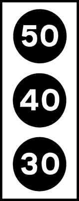
- **📖 الترجمة السياقية:** الإشارات الضوئية المعروضة في الشكل هي إشارات ضوئية للموجة الخضراء (onda verde).
- **💡 الشرح والقاعدة المرورية:** صحيح (VERO). هذه الإشارات الثلاثية التي تعرض أرقام سرعات بالأبيض على خلفية سوداء تسمى إشارات الموجة الخضراء لتنسيق تدفق السير.
- **⚠️ كشف الفخ:** فخ الامتحان: شكل الإشارة بأرقام السرعات الثلاثة يمثل نظام الموجة الخضراء (onda verde).
- **🔑 الكلمات المفتاحية:** `{'it': 'semafori di onda verde', 'ar': 'إشارات ضوئية للموجة الخضراء'}` | `{'it': 'segnali luminosi', 'ar': 'إشارات ضوئية'}` | `{'it': 'vero', 'ar': 'صحيح'}`

---

**174.** Il semaforo in figura consiglia la velocità da mantenere, per trovare la luce verde al semaforo successivo
- **الإجابة:** `VERO ✅ (صح)`
- 
- **📖 الترجمة السياقية:** تنصح الإشارة المعروضة بالسرعة الواجب الحفاظ عليها لمصادفة الضوء الأخضر في الإشارة الضوئية التالية.
- **💡 الشرح والقاعدة المرورية:** صحيح (VERO). إشارة الموجة الخضراء تعرض سرعة موصى بها (consiglia la velocità)؛ فإذا قاد السائق بالسرعة المضاءة فسيجد الإشارة القادمة خضراء تلقائياً دون توقف.
- **⚠️ كشف الفخ:** فخ الامتحان: السرعة المعروضة هي سرعة موصى بها اختيارياً وليست إلزامية.
- **🔑 الكلمات المفتاحية:** `{'it': 'consiglia la velocità', 'ar': 'تنصح بالسرعة'}` | `{'it': 'trovare la luce verde', 'ar': 'مصادفة الضوء الأخضر'}` | `{'it': 'vero', 'ar': 'صحيح'}`

---

**175.** Il semaforo di onda verde in figura si trova su strade con più incroci dove vi sono semafori sincronizzati (temporizzati)
- **الإجابة:** `VERO ✅ (صح)`
- 
- **📖 الترجمة السياقية:** تتواجد إشارة الموجة الخضراء في الشكل على الطرق التي بها تقاطعات متعددة ذات إشارات ضوئية متزامنة (مؤقتة).
- **💡 الشرح والقاعدة المرورية:** صحيح (VERO). يتم تركيب هذا النظام على الشوارع الطويلة التي تحتوي على سلسلة من التقاطعات المتتابعة والمربوطة بنظام تزامن إلكتروني موحد.
- **⚠️ كشف الفخ:** فخ الامتحان: نظام الموجة الخضراء يطبق حصراً على التقاطعات المتزامنة (semafori sincronizzati).
- **🔑 الكلمات المفتاحية:** `{'it': 'semafori sincronizzati', 'ar': 'إشارات ضوئية متزامنة'}` | `{'it': 'più incroci', 'ar': 'تقاطعات متعددة'}` | `{'it': 'vero', 'ar': 'صحيح'}`

---

**176.** Il semaforo in figura segnala la velocità consigliata per poter usufruire dell'onda verde
- **الإجابة:** `VERO ✅ (صح)`
- 
- **📖 الترجمة السياقية:** تشير الإشارة المعروضة إلى السرعة الموصى بها للاستفادة من الموجة الخضراء.
- **💡 الشرح والقاعدة المرورية:** صحيح (VERO). الرقم المضاء يحدد السرعة النموذجية بالكيلومتر/ساعة التي تضمن للسائق السير المتواصل دون التعرض لأي ضوء أحمر.
- **⚠️ كشف الفخ:** فخ الامتحان: كلمة 'velocità consigliata' (سرعة موصى بها) هي التعبير القانوني الدقيق للموجة الخضراء.
- **🔑 الكلمات المفتاحية:** `{'it': 'velocità consigliata', 'ar': 'سرعة موصى بها'}` | `{'it': "usufruire dell'onda verde", 'ar': 'الاستفادة من الموجة الخضراء'}` | `{'it': 'vero', 'ar': 'صحيح'}`

---

**177.** Delle tre luci del semaforo in figura se ne accende soltanto una, mentre le altre sono spente
- **الإجابة:** `VERO ✅ (صح)`
- 
- **📖 الترجمة السياقية:** من بين الأضواء الثلاثة للإشارة المعروضة، يضيء ضوء واحد فقط بينما تكون الأضواء الأخرى مطفأة.
- **💡 الشرح والقاعدة المرورية:** صحيh (VERO). الإشارة تضيء عدسة واحدة فقط برقم السرعة المناسبة للظروف المرورية الحالية (مثلاً 40 أو 50)، وتبقى العدستان الأخريان مطفأتين.
- **⚠️ كشف الفخ:** فخ الامتحان: يضيء رقم واحد فقط في المرة الواحدة وليس جميع الأرقام معاً.
- **🔑 الكلمات المفتاحية:** `{'it': 'se ne accende soltanto una', 'ar': 'يضيء واحد فقط منها'}` | `{'it': 'altre sono spente', 'ar': 'الأخرى مطفأة'}` | `{'it': 'vero', 'ar': 'صحيح'}`

---

**178.** Il semaforo in figura obbliga a mantenere la velocità indicata
- **الإجابة:** `FALSO ❌ (خطأ)`
- 
- **📖 الترجمة السياقية:** تلزم الإشارة المعروضة السائق بالحفاظ على السرعة الموضحة.
- **💡 الشرح والقاعدة المرورية:** خطأ (FALSO). الإشارة لا تلزم بالسرعة (non obbliga)، بل تقدم نصيحة وإرشاداً فقط؛ فالسائق حر في القيادة بسرعة أخرى دون تجاوز السرعة القصوى للطريق.
- **⚠️ كشف الفخ:** فخ الامتحان: كلمة 'obbliga' خطأ؛ السرعة نصيحة واقتراح وليست إلزاماً.
- **🔑 الكلمات المفتاحية:** `{'it': 'obbliga a mantenere la velocità', 'ar': 'تلزم بالحفاظ على السرعة (فخ)'}` | `{'it': 'consiglio', 'ar': 'نصيحة فقط'}` | `{'it': 'falso', 'ar': 'خطأ'}`

---

**179.** Il semaforo in figura non consente di superare la velocità indicata
- **الإجابة:** `FALSO ❌ (خطأ)`
- 
- **📖 الترجمة السياقية:** لا تسمح الإشارة المعروضة بتجاوز السرعة الموضحة.
- **💡 الشرح والقاعدة المرورية:** خطأ (FALSO). السرعة المعروضة ليست حداً أقصى للسرعة (limite massimo)، بل سرعة استرشادية، ويجوز قيادة السيارة بسرعة مختلفة ضمن حدود السرعة العامة للطريق.
- **⚠️ كشف الفخ:** فخ الامتحان: الإشارة ليست حد سرعة أقصى، بل سرعة توقيتية للموجة الخضراء.
- **🔑 الكلمات المفتاحية:** `{'it': 'non consente di superare', 'ar': 'لا تسمح بتجاوز (فخ)'}` | `{'it': 'non è un limite massimo', 'ar': 'ليست حداً أقصى'}` | `{'it': 'falso', 'ar': 'خطأ'}`

---

**180.** Il semaforo in figura impone al conducente di mantenere dal veicolo che lo precede la distanza indicata
- **الإجابة:** `FALSO ❌ (خطأ)`
- 
- **📖 الترجمة السياقية:** تفرض الإشارة المعروضة على السائق الحفاظ على مسافة الأمان الموضحة من المركبة التي تسبقه.
- **💡 الشرح والقاعدة المرورية:** خطأ (FALSO). الأرقام المعروضة (مثل 30، 40، 50) تعبر عن السرعة بالكيلومتر في الساعة، ولا علاقة لها بمسافة الأمان بالأمتار.
- **⚠️ كشف الفخ:** فخ الامتحان: الأرقام تعبر عن السرعة بالساعة وليس مسافة الأمان بالمتر.
- **🔑 الكلمات المفتاحية:** `{'it': 'distanza indicata', 'ar': 'المسافة المحددة (فخ)'}` | `{'it': 'velocità in km/h', 'ar': 'السرعة بـ كم/ساعة'}` | `{'it': 'falso', 'ar': 'خطأ'}`

---

**181.** Il semaforo in figura indica di procedere con prudenza.
- **الإجابة:** `FALSO ❌ (خطأ)`
- 
- **📖 الترجمة السياقية:** تشير الإشارة المعروضة إلى وجوب التقدم بحذر.
- **💡 الشرح والقاعدة المرورية:** خطأ (FALSO). هذه الإشارة ليست شاخصة تحذير من خطر عام تدعو للحذر، بل هي إشارة توجيهية خاصة بالسرعة الموصى بها للموجة الخضراء.
- **⚠️ كشف الفخ:** فخ الامتحان: الإشارة توضح سرعة الموجة الخضراء ولا تصنف كشاخصة تحذير عام.
- **🔑 الكلمات المفتاحية:** `{'it': 'procedere con prudenza', 'ar': 'التقدم بحذر (فخ للعموم)'}` | `{'it': 'onda verde', 'ar': 'موجة خضراء'}` | `{'it': 'falso', 'ar': 'خطأ'}`

---

**182.** Il semaforo in figura, anche se spento, indica la velocità obbligatoria
- **الإجابة:** `FALSO ❌ (خطأ)`
- 
- **📖 الترجمة السياقية:** تشير الإشارة المعروضة، حتى وإن كانت مطفأة، إلى سرعة إجبارية.
- **💡 الشرح والقاعدة المرورية:** خطأ (FALSO). إذا كانت الإشارة مطفأة فلا تفيد أي معنى، وحتى عند إضاءتها فإن السرعة موصى بها وليست إجبارية إطلاقاً.
- **⚠️ كشف الفخ:** فخ الامتحان: كلمة 'anche se spento' وكلمة 'obbligatoria' خطآن صريحان في العبارة.
- **🔑 الكلمات المفتاحية:** `{'it': 'anche se spento', 'ar': 'حتى وإن كانت مطفأة (فخ)'}` | `{'it': 'velocità obbligatoria', 'ar': 'سرعة إجبارية (فخ)'}` | `{'it': 'falso', 'ar': 'خطأ'}`

---

**183.** Il semaforo di onda verde in figura viene posto anche sulle autostrade
- **الإجابة:** `FALSO ❌ (خطأ)`
- 
- **📖 الترجمة السياقية:** توضع إشارة الموجة الخضراء في الشكل أيضاً على الطرق السريعة (autostrade).
- **💡 الشرح والقاعدة المرورية:** خطأ (FALSO). الطرق السريعة لا تحتوي على تقاطعات متتابعة بإشارات ضوئية، ولذلك لا توجد إشارات الموجة الخضراء على الأوتوستراد نهائياً.
- **⚠️ كشف الفخ:** فخ الامتحان: لا توجد إشارات مرور ضوئية ولا موجة خضراء على مسارات الطرق السريعة.
- **🔑 الكلمات المفتاحية:** `{'it': 'anche sulle autostrade', 'ar': 'أيضاً على الطرق السريعة (فخ)'}` | `{'it': 'vietata su autostrade', 'ar': 'مستحيلة على الأوتوستراد'}` | `{'it': 'falso', 'ar': 'خطأ'}`

---

**184.** Il semaforo di onda verde in figura riporta i limiti massimi di velocità delle autovetture, motocicli e autocarri
- **الإجابة:** `FALSO ❌ (خطأ)`
- 
- **📖 الترجمة السياقية:** تعرض إشارة الموجة الخضراء في الشكل حدود السرعة القصوى لسيارات الركوب والدراجات والشاحنات.
- **💡 الشرح والقاعدة المرورية:** خطأ (FALSO). الإشارة لا تصنف حدود السرعة القصوى حسب نوع المركبة، بل تعرض سرعات استرشادية موحدة لكل حركة المرور على الطريق.
- **⚠️ كشف الفخ:** فخ الامتحان: الأرقام الثلاثة ليست مخصصة لفئات مركبات مختلفة بل هي سرعات بديلة لنفس الطريق.
- **🔑 الكلمات المفتاحية:** `{'it': 'limiti massimi per veicoli', 'ar': 'الحدود القصوى للمركبات (فخ)'}` | `{'it': 'velocità unica consigliata', 'ar': 'سرعة موصى بها موحدة'}` | `{'it': 'falso', 'ar': 'خطأ'}`

---

**185.** Il semaforo di onda verde in figura indica le velocità che devono obbligatoriamente rispettare alcuni veicoli
- **الإجابة:** `FALSO ❌ (خطأ)`
- 
- **📖 الترجمة السياقية:** تشير إشارة الموجة الخضراء في الشكل إلى السرعات التي يجب على بعض المركبات احترامها إجبارياً.
- **💡 الشرح والقاعدة المرورية:** خطأ (FALSO). السرعة استرشادية وغير إجبارية على أي مركبة، ولا توجد أي إلزامية في إشارات الموجة الخضراء.
- **⚠️ كشف الفخ:** فخ الامتحان: كلمة 'obbligatoriamente' خطأ كامل؛ إشارة الموجة الخضراء إرشادية غير ملزمة.
- **🔑 الكلمات المفتاحية:** `{'it': 'obbligatoriamente rispettare', 'ar': 'احترامها إجبارياً (فخ)'}` | `{'it': 'solo consigliata', 'ar': 'موصى بها فقط'}` | `{'it': 'falso', 'ar': 'خطأ'}`

---

**186.** Il semaforo di onda verde in figura è un semaforo per lavori in corso
- **الإجابة:** `FALSO ❌ (خطأ)`
- 
- **📖 الترجمة السياقية:** إشارة الموجة الخضراء في الشكل هي إشارة ضوئية خاصة بأشغال الطريق (lavori in corso).
- **💡 الشرح والقاعدة المرورية:** خطأ (FALSO). إشارة الموجة الخضراء دائمة لتنسيق الإشارات الضوئية المتقاطعة ولا علاقة لها بأعمال الطريق أو الورش.
- **⚠️ كشف الفخ:** فخ الامتحان: لا علاقة لإشارات الموجة الخضراء بالأشغال.
- **🔑 الكلمات المفتاحية:** `{'it': 'semaforo per lavori in corso', 'ar': 'إشارة لأشغال الطريق (فخ)'}` | `{'it': 'falso', 'ar': 'خطأ'}`

---

**187.** Il semaforo di onda verde in figura indica la distanza dai caselli autostradali
- **الإجابة:** `FALSO ❌ (خطأ)`
- 
- **📖 الترجمة السياقية:** تشير إشارة الموجة الخضراء في الشكل إلى المسافة المتبقية حتى بوابات دفع رسوم الطرق السريعة.
- **💡 الشرح والقاعدة المرورية:** خطأ (FALSO). الإشارة توضح سرعة بالكيلومتر/ساعة لتنسيق الإشارات في شوارع المدن، ولا تشير إلى مسافة بوابات رسوم الأوتوستراد.
- **⚠️ كشف الفخ:** فخ الامتحان: الخلط بين السرعة بالكيلومتر/ساعة ومسافة بوابات الدفع.
- **🔑 الكلمات المفتاحية:** `{'it': 'distanza dai caselli', 'ar': 'المسافة من بوابات الرسوم (فخ)'}` | `{'it': 'falso', 'ar': 'خطأ'}`

---

## 📌 Agenti traffico (8 domande)

**188.** Chi guida autoveicoli o motocicli deve esibire, a richiesta degli agenti, la carta di circolazione
- **الإجابة:** `VERO ✅ (صح)`
- **📖 الترجمة السياقية:** يجب على قائد السيارات أو الدراجات النارية إبراز رخصة تسيير المركبة (carta di circolazione / libretto) بناءً على طلب رجال الأمن.
- **💡 الشرح والقاعدة المرورية:** صحيح (VERO). رخصة سير المركبة (carta di circolazione أو الوثيقة الموحدة DU) هي الوثيقة الرسمية الإلزامية التي تثبت بيانات المركبة وصلاحيتها ويجب إبرازها عند الطلب.
- **⚠️ كشف الفخ:** فخ الامتحان: رخصة السير من الوثائق الأساسية الثلاث الإلزامية عند كل فحص مروري.
- **🔑 الكلمات المفتاحية:** `{'it': 'carta di circolazione', 'ar': 'رخصة تسيير المركبة (الليبريتو)'}` | `{'it': 'esibire a richiesta', 'ar': 'إبرازها بناءً على الطلب'}` | `{'it': 'vero', 'ar': 'صحيح'}`

---

**189.** Chi guida autoveicoli o motocicli deve esibire, a richiesta degli agenti, la patente di guida
- **الإجابة:** `VERO ✅ (صح)`
- **📖 الترجمة السياقية:** يجب على قائد السيارات أو الدراجات النارية إبراز رخصة القيادة (patente di guida) بناءً على طلب رجال الأمن.
- **💡 الشرح والقاعدة المرورية:** صحيح (VERO). رخصة القيادة سارية المفعول والمناسبة لفئة المركبة وثيقة شخصية إلزامية يجب حملها وإبرازها للشرطة عند الفحص.
- **⚠️ كشف الفخ:** فخ الامتحان: رخصة القيادة وثيقة إلزامية يترتب على عدم حملها غرامة مالية ووجوب إبرازها لاحقاً.
- **🔑 الكلمات المفتاحية:** `{'it': 'patente di guida', 'ar': 'رخصة القيادة'}` | `{'it': 'esibire a richiesta', 'ar': 'إبرازها بناءً على الطلب'}` | `{'it': 'vero', 'ar': 'صحيح'}`

---

**190.** Chi guida autoveicoli o motocicli deve esibire, a richiesta degli agenti, il certificato di assicurazione del veicolo
- **الإجابة:** `VERO ✅ (صح)`
- **📖 الترجمة السياقية:** يجب على قائد السيارات أو الدراجات النارية إبراز شهادة التأمين الخاصة بالمركبة (certificato di assicurazione) بناءً على طلب رجال الأمن.
- **💡 الشرح والقاعدة المرورية:** صحيح (VERO). شهادة التأمين (المطبوعة أو الرقمية على الهاتف) تثبت سريان التأمين الإجباري ضد الغير RCA ويجب إبرازها لرجال الشرطة عند التفتيش.
- **⚠️ كشف الفخ:** فخ الامتحان: شهادة التأمين إجبارية الإبراز، بينما ملصق التأمين على الزجاج لم يعد إلزامياً منذ 2015.
- **🔑 الكلمات المفتاحية:** `{'it': 'certificato di assicurazione', 'ar': 'شهادة التأمين'}` | `{'it': 'esibire a richiesta', 'ar': 'إبرازها عند الطلب'}` | `{'it': 'vero', 'ar': 'صحيح'}`

---

**191.** Chi guida autoveicoli deve esibire, a richiesta degli agenti, il segnale mobile di pericolo (triangolo)
- **الإجابة:** `VERO ✅ (صح)`
- **📖 الترجمة السياقية:** يجب على قائد السيارات إبراز إشارة الخطر المتنقلة (المثلث - triangolo) بناءً على طلب رجال الأمن.
- **💡 الشرح والقاعدة المرورية:** صحيح (VERO). مثلث التحذير العاكس من التجهيزات الإلزامية داخل السيارة، ويحق لرجال الأمن التحقق من وجوده وصلاحيته داخل المركبة.
- **⚠️ كشف الفخ:** فخ الامتحان: مثلث الخطر تجهيز إجباري في السيارات ويجب إظهاره للشرطة عند الطلب.
- **🔑 الكلمات المفتاحية:** `{'it': 'segnale mobile di pericolo', 'ar': 'إشارة الخطر المتنقلة (المثلث)'}` | `{'it': 'triangolo', 'ar': 'المثلث العاكس'}` | `{'it': 'esibire a richiesta', 'ar': 'إبرازه عند الطلب'}` | `{'it': 'vero', 'ar': 'صحيح'}`

---

**192.** Chi guida autoveicoli o motocicli deve mostrare, a richiesta degli agenti, la valigetta di pronto soccorso
- **الإجابة:** `FALSO ❌ (خطأ)`
- **📖 الترجمة السياقية:** يجب على قائد السيارات أو الدراجات النارية إظهار حقيبة الإسعافات الأولية بناءً على طلب رجال الأمن.
- **💡 الشرح والقاعدة المرورية:** خطأ (FALSO). في إيطاليا، حقيبة الإسعافات الأولية (valigetta di pronto soccorso) ليست إجبارية في المركبات الخاصة العادية، ولا يُلزم السائق بحملها أو إبرازها.
- **⚠️ كشف الفخ:** فخ الامتحان: حقيبة الإسعافات الأولية موصى بها لكنها ليست إلزامية قانوناً للسيارات الخاصة في إيطاليا.
- **🔑 الكلمات المفتاحية:** `{'it': 'valigetta di pronto soccorso', 'ar': 'حقيبة الإسعافات الأولية (فخ)'}` | `{'it': 'non obbligatoria', 'ar': 'غير إلزامية'}` | `{'it': 'falso', 'ar': 'خطأ'}`

---

**193.** Chi guida autoveicoli o motocicli deve esibire, a richiesta degli agenti, il certificato di proprietà
- **الإجابة:** `FALSO ❌ (خطأ)`
- **📖 الترجمة السياقية:** يجب على قائد السيارات أو الدراجات النارية إبراز شهادة الملكية (certificato di proprietà) بناءً على طلب رجال الأمن.
- **💡 الشرح والقاعدة المرورية:** خطأ (FALSO). شهادة الملكية (CdP) وثيقة ملكية مالية وقضائية تُحفظ في المنزل، ولا يلزم السائق بحملها في السيارة أو إبرازها في نقاط التفتيش.
- **⚠️ كشف الفخ:** فخ الامتحان: شهادة الملكية لا تُحمل في السيارة ولا تُطلب في فحص المرور، بل رخصة السير (carta di circolazione).
- **🔑 الكلمات المفتاحية:** `{'it': 'certificato di proprietà', 'ar': 'شهادة الملكية (فخ)'}` | `{'it': 'non va a bordo', 'ar': 'لا تُحمل في المركبة'}` | `{'it': 'falso', 'ar': 'خطأ'}`

---

**194.** Chi guida autoveicoli o motocicli deve esibire, a richiesta degli agenti, il codice fiscale
- **الإجابة:** `FALSO ❌ (خطأ)`
- **📖 الترجمة السياقية:** يجب على قائد السيارات أو الدراجات النارية إبراز بطاقة الرقم الضريبي (codice fiscale) بناءً على طلب رجال الأمن.
- **💡 الشرح والقاعدة المرورية:** خطأ (FALSO). بطاقة الرقم الضريبي ليست من وثائق القيادة أو السير الإلزامية التي يفرض كود السير حملها وإبرازها لشرطة المرور.
- **⚠️ كشف الفخ:** فخ الامتحان: الرقم الضريبي وثيقة مالية شخصية لا يطالب بها قانون السير في الفحص المروري.
- **🔑 الكلمات المفتاحية:** `{'it': 'codice fiscale', 'ar': 'الرقم الضريبي (فخ)'}` | `{'it': 'non richiesto', 'ar': 'غير مطلوب للمرور'}` | `{'it': 'falso', 'ar': 'خطأ'}`

---

**195.** Chi guida autoveicoli o motocicli deve mostrare, a richiesta degli agenti, l'attestazione di pagamento della tassa di possesso (bollo)
- **الإجابة:** `FALSO ❌ (خطأ)`
- **📖 الترجمة السياقية:** يجب على قائد السيارات أو الدراجات النارية إظهار إيصال سداد ضريبة تملك المركبة (ضريبة البولو - bollo auto) بناءً على طلب رجال الأمن.
- **💡 الشرح والقاعدة المرورية:** خطأ (FALSO). ضريبة البولو هي ضريبة ملكية إقليمية، ولم يعد إيصال سدادها من الوثائق المطلوب حملها في السيارة أو إبرازها لشرطة السير.
- **⚠️ كشف الفخ:** فخ الامتحان: إيصال سداد البولو (bollo) لا يلزم حمله بالسيارة ولا يُطلب في التفتيش المروري.
- **🔑 الكلمات المفتاحية:** `{'it': 'tassa di possesso (bollo)', 'ar': 'ضريبة تملك المركبة (البولو)'}` | `{'it': 'non è obbligo da esibire', 'ar': 'لا يلزم إبرازه بالشارع'}` | `{'it': 'falso', 'ar': 'خطأ'}`

---

## 📌 Addetti polizia postale (5 domande)

**196.** Gli addetti a servizi di polizia stradale vengono riconosciuti dall'uniforme (divisa)
- **الإجابة:** `VERO ✅ (صح)`
- **📖 الترجمة السياقية:** يتم التعرف على المكلفين بخدمات شرطة المرور من خلال الزي الرسمي (divisa / uniforme).
- **💡 الشرح والقاعدة المرورية:** صحيح (VERO). الزي الرسمي المعتمد هو الوسيلة الأساسية والأولى للتعرف على رجال الشرطة وتأكيد صفتهم الرسمية وسلطتهم على الطريق.
- **⚠️ كشف الفخ:** فخ الامتحان: الزي الرسمي هو العلامة المميزة المعترف بها قانوناً لصفة رجل الشرطة.
- **🔑 الكلمات المفتاحية:** `{'it': 'uniforme (divisa)', 'ar': 'الزي الرسمي (البدلة العسكرية)'}` | `{'it': 'polizia stradale', 'ar': 'شرطة المرور'}` | `{'it': 'riconosciuti', 'ar': 'يتم التعرف عليهم'}` | `{'it': 'vero', 'ar': 'صحيح'}`

---

**197.** Gli addetti a servizi di polizia stradale vengono riconosciuti dalla 'paletta' bianca e rossa
- **الإجابة:** `VERO ✅ (صح)`
- **📖 الترجمة السياقية:** يتم التعرف على المكلفين بخدمات شرطة المرور من خلال عصا الإيقاف (paletta) البيضاء والحمراء.
- **💡 الشرح والقاعدة المرورية:** صحيح (VERO). قرص الإيقاف اليدوي (paletta) ذو اللونين الأبيض والأحمر الحامل لشعار الجمهورية هو الشارة التمييزية الرسمية لإيقاف السير.
- **⚠️ كشف الفخ:** فخ الامتحان: عصا التوقيف الرسمية لونها أبيض وأحمر.
- **🔑 الكلمات المفتاحية:** `{'it': 'paletta bianca e rossa', 'ar': 'عصا التوقيف البيضاء والحمراء'}` | `{'it': 'segnale di arresto', 'ar': 'إشارة توقيف'}` | `{'it': 'vero', 'ar': 'صحيح'}`

---

**198.** Gli addetti a servizi di polizia stradale vengono riconosciuti dal segnale distintivo
- **الإجابة:** `VERO ✅ (صح)`
- **📖 الترجمة السياقية:** يتم التعرف على المكلفين بخدمات شرطة المرور من خلال الشارة والرمز المميز (segnale distintivo).
- **💡 الشرح والقاعدة المرورية:** صحيح (VERO). في حال عدم ارتداء الزي الكامل، يجب على رجل الشرطة إظهار الشارة المميزة الرسمية (الباليتا أو الشارة المعدنية) لإثبات هويته وصفته.
- **⚠️ كشف الفخ:** فخ الامتحان: الشارة المميزة الرسمية تمنح الصلاحية القانونية لإيقاف وتفتيش المركبات.
- **🔑 الكلمات المفتاحية:** `{'it': 'segnale distintivo', 'ar': 'الشارة المميزة'}` | `{'it': 'addetti polizia stradale', 'ar': 'أفراد شرطة المرور'}` | `{'it': 'vero', 'ar': 'صحيح'}`

---

**199.** Gli addetti a servizi di polizia stradale vengono riconosciuti dalla 'paletta' bianca e nera
- **الإجابة:** `FALSO ❌ (خطأ)`
- **📖 الترجمة السياقية:** يتم التعرف على المكلفين بخدمات شرطة المرور من خلال عصا الإيقاف (paletta) البيضاء والسوداء.
- **💡 الشرح والقاعدة المرورية:** خطأ (FALSO). عصا الإيقاف الرسمية هي بيضاء وحمراء وليست بيضاء وسوداء.
- **⚠️ كشف الفخ:** فخ الامتحان: الخلط في الألوان؛ لون عصا التوقيف أبيض وأحمر وليس أبيض وأسود.
- **🔑 الكلمات المفتاحية:** `{'it': 'paletta bianca e nera', 'ar': 'عصا بيضاء وسوداء (فخ)'}` | `{'it': 'bianca e rossa', 'ar': 'بيضاء وحمراء'}` | `{'it': 'falso', 'ar': 'خطأ'}`

---

**200.** Gli addetti a servizi di polizia stradale vengono riconosciuti dai guantoni e dalle strisce rifrangenti
- **الإجابة:** `FALSO ❌ (خطأ)`
- **📖 الترجمة السياقية:** يتم التعرف على المكلفين بخدمات شرطة المرور من خلال القفازات الضخمة والشرائط العاكسة.
- **💡 الشرح والقاعدة المرورية:** خطأ (FALSO). القفازات والشرائط العاكسة هي مجرد وسائل حماية ورؤية وليست وسيلة إثبات الصفة الرسمية لرجل الشرطة (التي تثبت بالزي الرسمي والشارة والباليتا).
- **⚠️ كشف الفخ:** فخ الامتحان: أدوات الرؤية ليست دليلاً رسمياً على صفة رجل الأمن.
- **🔑 الكلمات المفتاحية:** `{'it': 'guantoni e strisce rifrangenti', 'ar': 'قفازات وشرائط عاكسة (فخ)'}` | `{'it': 'divisa e distintivo', 'ar': 'الزي والشارة الرسمية'}` | `{'it': 'falso', 'ar': 'خطأ'}`

---

## 📌 Vigile luce rossa (11 domande)

**201.** Quando il vigile si dispone con le braccia aperte verso la nostra direzione come in figura è vietato il passaggio
- **الإجابة:** `VERO ✅ (صح)`
- 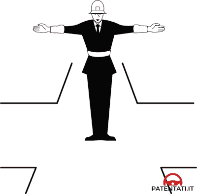
- **📖 الترجمة السياقية:** عندما يقف شرطي المرور بذراعين مفتوحتين في مواجهة اتجاهنا كما في الشكل، يُمنع المرور تماماً.
- **💡 الشرح والقاعدة المرورية:** صحيح (VERO). وقوف الشرطي في مواجهتك بفتح ذراعيه عرضاً يعادل الضوء الأحمر للإشارة الضوئية تماماً، ويفرض حظراً قاطعاً للمرور في جميع الاتجاهات.
- **⚠️ كشف الفخ:** فخ الامتحان: صدر الشرطي أو ظهره مع فتح الذراعين = ضوء أحمر وتوقف مطلق.
- **🔑 الكلمات المفتاحية:** `{'it': 'braccia aperte verso la nostra direzione', 'ar': 'ذراعان مفتوحتان نحو اتجاهنا'}` | `{'it': 'vietato il passaggio', 'ar': 'ممنوع المرور'}` | `{'it': 'vero', 'ar': 'صحيح'}`

---

**202.** Quando il vigile si dispone con le braccia aperte verso la nostra direzione come in figura bisogna arrestarsi prima della striscia trasversale di arresto
- **الإجابة:** `VERO ✅ (صح)`
- 
- **📖 الترجمة السياقية:** عندما يقف شرطي المرور بذراعين مفتوحتين نحو اتجاهنا كما في الشكل، يجب التوقف قبل خط التوقف العرضي.
- **💡 الشرح والقاعدة المرورية:** صحيح (VERO). بما أن هذه الوضعية تعادل الضوء الأحمر، فيجب التوقف التام خلف خط التوقف الأرضي (striscia d'arresto) دون تجاوزه.
- **⚠️ كشف الفخ:** فخ الامتحان: التوقف يكون قبل خط التوقف العرضي تماماً كالإشارة الحمراء.
- **🔑 الكلمات المفتاحية:** `{'it': 'arrestarsi prima della striscia', 'ar': 'التوقف قبل الخط العرضي'}` | `{'it': 'striscia trasversale', 'ar': 'خط التوقف العرضي'}` | `{'it': 'vero', 'ar': 'صحيح'}`

---

**203.** Quando il vigile si dispone con le braccia aperte verso la nostra direzione come in figura non si può svoltare a sinistra
- **الإجابة:** `VERO ✅ (صح)`
- 
- **📖 الترجمة السياقية:** عندما يقف شرطي المرور بذراعين مفتوحتين نحو اتجاهنا كما في الشكل، لا يجوز الانعطاف إلى اليسار.
- **💡 الشرح والقاعدة المرورية:** صحيح (VERO). الوضعية تمنع الحركة تماماً في كافة الاتجاهات (للأمام أو لليمين أو لليسار).
- **⚠️ كشف الفخ:** فخ الامتحان: لا يُسمح بأي مناورة بما فيها الانعطاف لليسار.
- **🔑 الكلمات المفتاحية:** `{'it': 'non si può svoltare a sinistra', 'ar': 'لا يجوز الانعطاف يساراً'}` | `{'it': 'alt', 'ar': 'قف'}` | `{'it': 'vero', 'ar': 'صحيح'}`

---

**204.** Quando il vigile si dispone con le braccia aperte verso la nostra direzione come in figura non si può attraversare l'incrocio
- **الإجابة:** `VERO ✅ (صح)`
- 
- **📖 الترجمة السياقية:** عندما يقف شرطي المرور بذراعين مفتوحتين نحو اتجاهنا كما في الشكل، لا يجوز عبور التقاطع.
- **💡 الشرح والقاعدة المرورية:** صحيح (VERO). عبور التقاطع ممنوع منعاً كلياً حتى يغير الشرطي وضعيته إلى الوضع الموازي المسموح به.
- **⚠️ كشف الفخ:** فخ الامتحان: المنع مطلق لعبور التقاطع.
- **🔑 الكلمات المفتاحية:** `{'it': "non si può attraversare l'incrocio", 'ar': 'لا يجوز عبور التقاطع'}` | `{'it': 'stop', 'ar': 'توقف'}` | `{'it': 'vero', 'ar': 'صحيح'}`

---

**205.** Quando il vigile si dispone con le braccia aperte verso la nostra direzione come in figura non si può svoltare a destra
- **الإجابة:** `VERO ✅ (صح)`
- 
- **📖 الترجمة السياقية:** عندما يقف شرطي المرور بذراعين مفتوحتين نحو اتجاهنا كما في الشكل، لا يجوز الانعطاف إلى اليمين.
- **💡 الشرح والقاعدة المرورية:** صحيح (VERO). الانعطاف يميناً ممنوع أيضاً لأن وضعية الشرطي تحظر جميع حركات السير الموجهة نحو صدره أو ظهره.
- **⚠️ كشف الفخ:** فخ الامتحان: لا يجوز الانعطاف يميناً على إشارة الشرطي الحمراء.
- **🔑 الكلمات المفتاحية:** `{'it': 'non si può svoltare a destra', 'ar': 'لا يجوز الانعطاف يميناً'}` | `{'it': 'divieto totale', 'ar': 'منع تام'}` | `{'it': 'vero', 'ar': 'صحيح'}`

---

**206.** La posizione del vigile con le braccia aperte verso la nostra direzione come in figura equivale alla luce rossa del semaforo
- **الإجابة:** `VERO ✅ (صح)`
- 
- **📖 الترجمة السياقية:** وضعية شرطي المرور بذراعين مفتوحتين نحو اتجاهنا كما في الشكل تعادل الضوء الأحمر للإشارة الضوئية.
- **💡 الشرح والقاعدة المرورية:** صحيح (VERO). التطابق القانوني المعتمد في كود السير هو: ذراعا الشرطي في مواجهتك = ضوء أحمر (luce rossa).
- **⚠️ كشف الفخ:** فخ الامتحان: صدر أو ظهر الشرطي بذراعين مفتوحتين = ضوء أحمر semaforo rosso.
- **🔑 الكلمات المفتاحية:** `{'it': 'equivale alla luce rossa', 'ar': 'تعادل الضوء الأحمر'}` | `{'it': 'braccia aperte', 'ar': 'ذراعان مفتوحتان'}` | `{'it': 'vero', 'ar': 'صحيح'}`

---

**207.** Quando il vigile si dispone con le braccia aperte verso la nostra direzione come in figura si può passare se si svolta a destra, dando però la precedenza ai pedoni che attraversano
- **الإجابة:** `FALSO ❌ (خطأ)`
- 
- **📖 الترجمة السياقية:** عندما يقف شرطي المرور بذراعين مفتوحتين نحو اتجاهنا كما في الشكل، يجوز المرور إذا كان السائق سينعطف يميناً مع إعطاء الأسبقية للمشاة العابرين.
- **💡 الشرح والقاعدة المرورية:** خطأ (FALSO). لا يجوز المرور أو الانعطاف بأي حال؛ فالمنع مطلق ويشمل حتى الانعطاف لليمين.
- **⚠️ كشف الفخ:** فخ الامتحان: لا استثناء للانعطاف يميناً في وضعية الشرطي الحمراء.
- **🔑 الكلمات المفتاحية:** `{'it': 'si può passare se si svolta a destra', 'ar': 'يجوز المرور لمن ينعطف يميناً (فخ)'}` | `{'it': 'arresto totale', 'ar': 'توقف كلي'}` | `{'it': 'falso', 'ar': 'خطأ'}`

---

**208.** Quando il vigile si dispone con le braccia aperte verso la direzione da cui proviene il conducente come in figura questi può procedere, ma con la massima prudenza e a velocità moderata
- **الإجابة:** `FALSO ❌ (خطأ)`
- 
- **📖 الترجمة السياقية:** عندما يقف شرطي المرور بذراعين مفتوحتين نحو اتجاه السائق كما في الشكل، يجوز للسائق التقدم ولكن بأقصى درجات الحذر وبسرعة معتدلة.
- **💡 الشرح والقاعدة المرورية:** خطأ (FALSO). لا يجوز التقدم إطلاقاً بأي سرعة أو بأي حذر؛ فالأمر قاطع بالتوقف التام والانتظار.
- **⚠️ كشف الفخ:** فخ الامتحان: عبارة 'con la massima prudenza' حيلة تضليلية؛ فالتقدم ممنوع تماماً.
- **🔑 الكلمات المفتاحية:** `{'it': 'può procedere con massima prudenza', 'ar': 'يجوز التقدم بأقصى درجات الحذر (فخ)'}` | `{'it': 'divieto assoluto', 'ar': 'منع مطلق'}` | `{'it': 'falso', 'ar': 'خطأ'}`

---

**209.** Quando il vigile si dispone con le braccia aperte verso la nostra direzione come in figura bisogna suonare il clacson, ma con moderazione, per richiamare l'attenzione del vigile
- **الإجابة:** `FALSO ❌ (خطأ)`
- 
- **📖 الترجمة السياقية:** عندما يقف شرطي المرور بذراعين مفتوحتين نحو اتجاهنا كما في الشكل، يجب إطلاق بوق السيارة (الزامور) باعتدال للفت انتباه الشرطي.
- **💡 الشرح والقاعدة المرورية:** خطأ (FALSO). إطلاق البوق (clacson) للفت انتباه الشرطي تصرف وقح وممنوع تماماً ويعاقب عليه القانون؛ والواجب هو التوقف الصامت والانتظار.
- **⚠️ كشف الفخ:** فخ الامتحان: استخدام الكلاكس للفت انتباه الشرطي ممنوع قطعاً ومخالفة مرورية.
- **🔑 الكلمات المفتاحية:** `{'it': 'suonare il clacson', 'ar': 'إطلاق المنبه الصوتي (فخ)'}` | `{'it': 'vietato clacson', 'ar': 'ممنوع استخدام البوق'}` | `{'it': 'falso', 'ar': 'خطأ'}`

---

**210.** Quando il vigile si dispone con le braccia aperte verso la nostra direzione come in figura si può svoltare, ma non proseguire diritto
- **الإجابة:** `FALSO ❌ (خطأ)`
- 
- **📖 الترجمة السياقية:** عندما يقف شرطي المرور بذراعين مفتوحتين نحو اتجاهنا كما في الشكل، يجوز الانعطاف ولكن لا يجوز متابعة السير للأمام مباشرة.
- **💡 الشرح والقاعدة المرورية:** خطأ (FALSO). تمنع هذه الوضعية جميع المناورات بلا استثناء، سواء الانعطاف أو السير للأمام مباشرة.
- **⚠️ كشف الفخ:** فخ الامتحان: لا يجوز الانعطاف إطلاقاً في هذه الوضعية.
- **🔑 الكلمات المفتاحية:** `{'it': 'si può svoltare', 'ar': 'يجوز الانعطاف (فخ)'}` | `{'it': 'nessuna svolta', 'ar': 'لا انعطاف'}` | `{'it': 'falso', 'ar': 'خطأ'}`

---

**211.** La posizione del vigile con le braccia aperte verso la nostra direzione come in figura equivale alla luce verde del semaforo
- **الإجابة:** `FALSO ❌ (خطأ)`
- 
- **📖 الترجمة السياقية:** وضعية شرطي المرور بذراعين مفتوحتين نحو اتجاهنا كما في الشكل تعادل الضوء الأخضر للإشارة الضوئية.
- **💡 الشرح والقاعدة المرورية:** خطأ (FALSO). هذه الوضعية تعادل الضوء الأحمر (التوقف التام)، وليست الضوء الأخضر.
- **⚠️ كشف الفخ:** فخ الامتحان: مواجهة الشرطي بذراعين مفتوحتين = أحمر، والوقوف بالجانب (di profilo) = أخضر.
- **🔑 الكلمات المفتاحية:** `{'it': 'equivale alla luce verde', 'ar': 'تعادل الضوء الأخضر (فخ)'}` | `{'it': 'equivale al rosso', 'ar': 'تعادل الأحمر'}` | `{'it': 'falso', 'ar': 'خطأ'}`

---

## 📌 Vigile verde (8 domande)

**212.** Quando il vigile si dispone di profilo con le braccia aperte come in figura è consentito il passaggio delle correnti di traffico che scorrono parallele alle sue braccia
- **الإجابة:** `VERO ✅ (صح)`
- 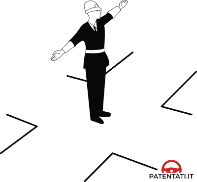
- **📖 الترجمة السياقية:** عندما يقف شرطي المرور بالجانب (di profilo) بذراعين مفتوحتين كما في الشكل، يُسمح بمرور تيارات السير الجارية بموازاة ذراعيه.
- **💡 الشرح والقاعدة المرورية:** صحيح (VERO). وقوف الشرطي جانباً بموازاة مسارك يعادل الضوء الأخضر، ويسمح لحركة السير الموازية لذراعيه بالمرور ومتابعة السير.
- **⚠️ كشف الفخ:** فخ الامتحان: الشرطي بالجانب (di profilo) يفتح الطريق للتيارات الموازية لذراعيه = ضوء أخضر.
- **🔑 الكلمات المفتاحية:** `{'it': 'di profilo', 'ar': 'بالجانب / من الخاصرة'}` | `{'it': 'parallele alle sue braccia', 'ar': 'موازية لذراعيه'}` | `{'it': 'consentito il passaggio', 'ar': 'مسموح بالمرور'}` | `{'it': 'vero', 'ar': 'صحيح'}`

---

**213.** Quando il vigile si dispone di profilo con le braccia aperte come in figura si può svoltare a destra se si proviene dalla sua destra o dalla sua sinistra
- **الإجابة:** `VERO ✅ (صح)`
- 
- **📖 الترجمة السياقية:** عندما يقف شرطي المرور بالجانب بذراعين مفتوحتين كما في الشكل، يجوز الانعطاف إلى اليمين للقادم من جهة يمينه أو يساره.
- **💡 الشرح والقاعدة المرورية:** صحيح (VERO). التيارات المسموح بمرورها يمكنها السير للأمام أو الانعطاف لليمين (أو لليسار مع إعطاء الأسبقية).
- **⚠️ كشف الفخ:** فخ الامتحان: السير والانعطاف يميناً مسموح به في وضعية الجانب الخضراء.
- **🔑 الكلمات المفتاحية:** `{'it': 'svoltare a destra', 'ar': 'الانعطاف يميناً'}` | `{'it': 'dalla sua destra o sinistra', 'ar': 'من يمينه أو يساره'}` | `{'it': 'vero', 'ar': 'صحيح'}`

---

**214.** Quando il vigile si dispone di profilo con le braccia aperte come in figura, le correnti di traffico che scorrono parallele alle sue braccia possono attraversare l'incrocio, ma usando prudenza
- **الإجابة:** `VERO ✅ (صح)`
- 
- **📖 الترجمة السياقية:** عندما يقف شرطي المرور بالجانب بذراعين مفتوحتين كما في الشكل، يجوز لتيارات السير الموازية لذراعيه عبور التقاطع مع توخي الحذر.
- **💡 الشرح والقاعدة المرورية:** صحيح (VERO). العبور مسموح به قانوناً كما هو الحال مع الضوء الأخضر، ولكن الحذر وتخفيف السرعة مطلوبان دائماً عند عبور التقاطعات.
- **⚠️ كشف الفخ:** فخ الامتحان: المرور مسموح ولكن مع الالتزام بالحذر (usando prudenza).
- **🔑 الكلمات المفتاحية:** `{'it': "attraversare l'incrocio", 'ar': 'عبور التقاطع'}` | `{'it': 'usando prudenza', 'ar': 'باستخدام الحذر'}` | `{'it': 'vero', 'ar': 'صحيح'}`

---

**215.** La posizione di profilo del vigile con le braccia aperte come in figura equivale alla luce verde del semaforo per le correnti di traffico che scorrono parallele alle sue braccia
- **الإجابة:** `VERO ✅ (صح)`
- 
- **📖 الترجمة السياقية:** وضعية شرطي المرور بالجانب بذراعين مفتوحتين كما في الشكل تعادل الضوء الأخضر للإشارة الضوئية لتيارات السير الموازية لذراعيه.
- **💡 الشرح والقاعدة المرورية:** صحيح (VERO). المعادل القانوني لوضعية الجانب هو الضوء الأخضر (luce verde) لجميع المركبات السائرة بموازاة امتداد ذراعي الشرطي.
- **⚠️ كشف الفخ:** فخ الامتحان: الشرطي بالجانب = الضوء الأخضر semaforo verde.
- **🔑 الكلمات المفتاحية:** `{'it': 'equivale alla luce verde', 'ar': 'تعادل الضوء الأخضر'}` | `{'it': 'correnti parallele', 'ar': 'التيارات الموازية'}` | `{'it': 'vero', 'ar': 'صحيح'}`

---

**216.** Quando il vigile si dispone di profilo con le braccia aperte come in figura si deve obbligatoriamente proseguire diritto
- **الإجابة:** `FALSO ❌ (خطأ)`
- 
- **📖 الترجمة السياقية:** عندما يقف شرطي المرور بالجانب بذراعين مفتوحتين كما في الشكل، يجب إجبارياً مواصلة السير إلى الأمام مباشرة فقط.
- **💡 الشرح والقاعدة المرورية:** خطأ (FALSO). لا يُشترط السير للأمام فقط؛ بل يجوز أيضاً الانعطاف لليمين أو اليسار تماماً كما هو الحال مع الضوء الأخضر العادي.
- **⚠️ كشف الفخ:** فخ الامتحان: كلمة 'obbligatoriamente proseguire diritto' خطأ؛ فالانعطاف مسموح به أيضاً.
- **🔑 الكلمات المفتاحية:** `{'it': 'obbligatoriamente proseguire diritto', 'ar': 'إجبارياً للأمام فقط (فخ)'}` | `{'it': 'anche svoltare', 'ar': 'يجوز الانعطاف أيضاً'}` | `{'it': 'falso', 'ar': 'خطأ'}`

---

**217.** Quando il vigile si dispone di profilo con le braccia aperte come in figura, ci si deve arrestare prima della striscia trasversale di arresto se si proviene dalla sua sinistra
- **الإجابة:** `FALSO ❌ (خطأ)`
- 
- **📖 الترجمة السياقية:** عندما يقف شرطي المرور بالجانب بذراعين مفتوحتين كما في الشكل، يجب التوقف قبل خط التوقف العرضي لمن هو قادم من جهة يساره.
- **💡 الشرح والقاعدة المرورية:** خطأ (FALSO). القادم من يسار الشرطي يسير بموازاة ذراعيه وله حق المرور (ضوء أخضر) ولا يلزمه التوقف خلف الخط.
- **⚠️ كشف الفخ:** فخ الامتحان: القادم من يسار أو يمين الشرطي وضعه أخضر وله حق العبور.
- **🔑 الكلمات المفتاحية:** `{'it': 'ci si deve arrestare dalla sua sinistra', 'ar': 'يجب التوقف للقادم من يساره (فخ)'}` | `{'it': 'via libera', 'ar': 'المسار مفتوح له'}` | `{'it': 'falso', 'ar': 'خطأ'}`

---

**218.** Quando il vigile si dispone di profilo con le braccia aperte come in figura ci si deve arrestare dopo aver superato le strisce dell'attraversamento pedonale
- **الإجابة:** `FALSO ❌ (خطأ)`
- 
- **📖 الترجمة السياقية:** عندما يقف شرطي المرور بالجانب بذراعين مفتوحتين كما في الشكل، يجب التوقف بعد تجاوز خطوط ممر المشاة.
- **💡 الشرح والقاعدة المرورية:** خطأ (FALSO). التوقف غير مطلوب للمسارات الموازية، وإن طرأ توقف فيجب أن يكون قبل خط التوقف وليس بعد ممر المشاة داخل التقاطع.
- **⚠️ كشف الفخ:** فخ الامتحان: لا يتوقف السائق بعد ممر المشاة وسط التقاطع.
- **🔑 الكلمات المفتاحية:** `{'it': 'arrestarsi dopo le strisce pedonali', 'ar': 'التوقف بعد ممر المشاة (فخ)'}` | `{'it': 'passaggio libero', 'ar': 'المرور مفتوح'}` | `{'it': 'falso', 'ar': 'خطأ'}`

---

**219.** La posizione di profilo del vigile con le braccia aperte come in figura, per le correnti di traffico che scorrono parallele alle sue braccia equivale alla luce rossa del semaforo
- **الإجابة:** `FALSO ❌ (خطأ)`
- 
- **📖 الترجمة السياقية:** وضعية شرطي المرور بالجانب بذراعين مفتوحتين كما في الشكل تعادل الضوء الأحمر للإشارة الضوئية لتيارات السير الموازية لذراعيه.
- **💡 الشرح والقاعدة المرورية:** خطأ (FALSO). تعادل الضوء الأخضر وليس الأحمر؛ فالضوء الأحمر يخص من يواجه صدر الشرطي أو ظهره.
- **⚠️ كشف الفخ:** فخ الامتحان: الجانب = أخضر؛ والصدر/الظهر = أحمر.
- **🔑 الكلمات المفتاحية:** `{'it': 'equivale alla luce rossa', 'ar': 'تعادل الضوء الأحمر (فخ)'}` | `{'it': 'luce verde', 'ar': 'ضوء أخضر'}` | `{'it': 'falso', 'ar': 'خطأ'}`

---

## 📌 Vigile luce gialla (8 domande)

**220.** La posizione del vigile con un braccio alzato come in figura equivale alla luce gialla fissa del semaforo
- **الإجابة:** `VERO ✅ (صح)`
- 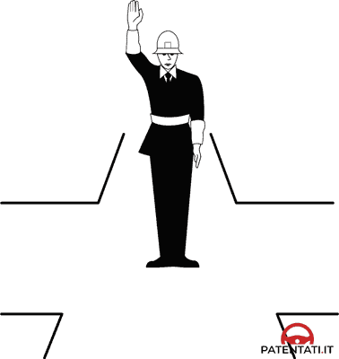
- **📖 الترجمة السياقية:** وضعية شرطي المرور برفع ذراع واحدة للأعلى كما في الشكل تعادل الضوء الأصفر الثابت للإشارة الضوئية.
- **💡 الشرح والقاعدة المرورية:** صحيح (VERO). رفع الشرطي لذراعه رأسياً يعادل الضوء الأصفر الثابت (luce gialla fissa) لجميع الاتجاهات، كإشعار بتغيير وشيك لحركة السير.
- **⚠️ كشف الفخ:** فخ الامتحان: ذراع الشرطي المرفوعة لأعلى = ضوء أصفر ثابت semaforo giallo fisso.
- **🔑 الكلمات المفتاحية:** `{'it': 'un braccio alzato', 'ar': 'ذراع مرفوعة لأعلى'}` | `{'it': 'equivale alla luce gialla fissa', 'ar': 'تعادل الضوء الأصفر الثابت'}` | `{'it': 'vero', 'ar': 'صحيح'}`

---

**221.** Se il vigile ha un braccio alzato come in figura bisogna liberare velocemente l'incrocio, se già è stato impegnato
- **الإجابة:** `VERO ✅ (صح)`
- 
- **📖 الترجمة السياقية:** إذا كان شرطي المرور رافعاً ذراعه كما في الشكل، يجب إخلاء التقاطع بسرعة لمن كان قد شغله ودخله بالفعل.
- **💡 الشرح والقاعدة المرورية:** صحيح (VERO). تطبق قاعدة الضوء الأصفر تماماً: من دخل التقاطع قبل رفع الذراع ملزم بمواصلة السير وإخلاء التقاطع فوراً دون توقف.
- **⚠️ كشف الفخ:** فخ الامتحان: إخلاء التقاطع لمن شغله بالفعل (liberare l'incrocio) واجب قطعي.
- **🔑 الكلمات المفتاحية:** `{'it': "liberare velocemente l'incrocio", 'ar': 'إخلاء التقاطع بسرعة'}` | `{'it': 'già impegnato', 'ar': 'دخله بالفعل'}` | `{'it': 'vero', 'ar': 'صحيح'}`

---

**222.** Se il vigile ha un braccio alzato come in figura bisogna arrestarsi prima dell'incrocio, se è possibile farlo senza creare pericolo
- **الإجابة:** `VERO ✅ (صح)`
- 
- **📖 الترجمة السياقية:** إذا كان شرطي المرور رافعاً ذراعه كما في الشكل، يجب التوقف قبل التقاطع إذا كان بإمكان السائق القيام بذلك دون التسبب في خطر.
- **💡 الشرح والقاعدة المرورية:** صحيح (VERO). التوقف إلزامي قبل خط التوقف لكل من يستطيع إيقاف مركبته بأمان، تجنباً للفرملة الفجائية الخطرة.
- **⚠️ كشف الفخ:** فخ الامتحان: التوقف مشروط بعدم إحداث خطر (senza creare pericolo).
- **🔑 الكلمات المفتاحية:** `{'it': "arrestarsi prima dell'incrocio", 'ar': 'التوقف قبل التقاطع'}` | `{'it': 'senza creare pericolo', 'ar': 'دون التسبب في خطر'}` | `{'it': 'vero', 'ar': 'صحيح'}`

---

**223.** La posizione del vigile con un braccio alzato come in figura è una indicazione riservata solo ai veicoli che devono svoltare
- **الإجابة:** `FALSO ❌ (خطأ)`
- 
- **📖 الترجمة السياقية:** وضعية شرطي المرور برفع ذراع واحدة للأعلى كما في الشكل هي إشارة موجهة فقط للمركبات التي ترغب في الانعطاف.
- **💡 الشرح والقاعدة المرورية:** خطأ (FALSO). الإشارة موجهة لكافة المركبات من جميع الاتجاهات دون استثناء، وليس للمنعطفين فقط.
- **⚠️ كشف الفخ:** فخ الامتحان: كلمة 'solo ai veicoli che devono svoltare' حصرية كاذبة؛ الإشارة عامة للجميع.
- **🔑 الكلمات المفتاحية:** `{'it': 'solo per veicoli che svoltano', 'ar': 'فقط للمركبات المنعطفة (فخ)'}` | `{'it': 'per tutti i veicoli', 'ar': 'لكافة المركبات'}` | `{'it': 'falso', 'ar': 'خطأ'}`

---

**224.** Se il vigile ha un braccio alzato come in figura bisogna in ogni caso arrestarsi
- **الإجابة:** `FALSO ❌ (خطأ)`
- 
- **📖 الترجمة السياقية:** إذا كان شرطي المرور رافعاً ذراعه كما في الشكل، يجب التوقف في جميع الأحوال (in ogni caso).
- **💡 الشرح والقاعدة المرورية:** خطأ (FALSO). ليس في جميع الأحوال؛ فمن دخل التقاطع أو كان قريباً جداً بحيث يتعذر التوقف بأمان، ملزم بإخلاء التقاطع ومواصلة العبور.
- **⚠️ كشف الفخ:** فخ الامتحان: كلمة 'in ogni caso' باطلة؛ فالأمان وإخلاء التقاطع استثناءان صريحان.
- **🔑 الكلمات المفتاحية:** `{'it': 'in ogni caso arrestarsi', 'ar': 'التوقف في جميع الأحوال (فخ)'}` | `{'it': 'sgombero incrocio', 'ar': 'إخلاء التقاطع'}` | `{'it': 'falso', 'ar': 'خطأ'}`

---

**225.** Se il vigile ha un braccio alzato come in figura è consentito soltanto svoltare a destra
- **الإجابة:** `FALSO ❌ (خطأ)`
- 
- **📖 الترجمة السياقية:** إذا كان شرطي المرور رافعاً ذراعه كما في الشكل، يُسمح بالانعطاف إلى اليمين فقط.
- **💡 الشرح والقاعدة المرورية:** خطأ (FALSO). رفع الذراع لا يسمح بالانعطاف يميناً، بل يفرض التوقف لمن لم يدخل التقاطع بعد.
- **⚠️ كشف الفخ:** فخ الامتحان: رفع الذراع لا يبيح الانعطاف يميناً بل يلزم بالاستعداد للتوقف.
- **🔑 الكلمات المفتاحية:** `{'it': 'consentito soltanto svoltare a destra', 'ar': 'يسمح فقط بالانعطاف يميناً (فخ)'}` | `{'it': 'arrestarsi', 'ar': 'التوقف'}` | `{'it': 'falso', 'ar': 'خطأ'}`

---

**226.** Se il vigile ha un braccio alzato come in figura bisogna rallentare solo se nell'incrocio vi sono binari del tram
- **الإجابة:** `FALSO ❌ (خطأ)`
- 
- **📖 الترجمة السياقية:** إذا كان شرطي المرور رافعاً ذراعه كما في الشكل، يجب تخفيف السرعة فقط في حال وجود قضبان ترام في التقاطع.
- **💡 الشرح والقاعدة المرورية:** خطأ (FALSO). يجب التوقف أو إخلاء التقاطع في كافة الأحوال وبغض النظر عن وجود قضبان ترام أو عدمها.
- **⚠️ كشف الفخ:** فخ الامتحان: تقييد الحكم بقضبان الترام شرط باطل وملفق.
- **🔑 الكلمات المفتاحية:** `{'it': 'solo se vi sono binari', 'ar': 'فقط عند وجود قضبان ترام (فخ)'}` | `{'it': 'regola generale', 'ar': 'قاعدة عامة'}` | `{'it': 'falso', 'ar': 'خطأ'}`

---

**227.** La posizione del vigile con il braccio alzato come in figura equivale alla luce rossa del semaforo
- **الإجابة:** `FALSO ❌ (خطأ)`
- 
- **📖 الترجمة السياقية:** وضعية شرطي المرور برفع الذراع كما في الشكل تعادل الضوء الأحمر للإشارة الضوئية.
- **💡 الشرح والقاعدة المرورية:** خطأ (FALSO). تعادل الضوء الأصفر الثابت (luce gialla fissa)، بينما الضوء الأحمر يعادله فتح الذراعين أفقياً في مواجهة السير.
- **⚠️ كشف الفخ:** فخ الامتحان: ذراع واحدة للأعلى = أصفر ثابت؛ ذراعان مفتوحتان نحو صدرك = أحمر.
- **🔑 الكلمات المفتاحية:** `{'it': 'equivale alla luce rossa', 'ar': 'تعادل الضوء الأحمر (فخ)'}` | `{'it': 'luce gialla fissa', 'ar': 'ضوء أصفر ثابت'}` | `{'it': 'falso', 'ar': 'خطأ'}`

---

## 📌 Vigile angolo retto (10 domande)

**228.** Il vigile disposto con le braccia ad angolo retto come in figura consente la svolta a sinistra ai veicoli che arrivano dalla sua sinistra
- **الإجابة:** `VERO ✅ (صح)`
- 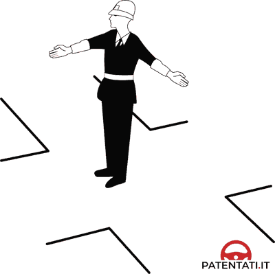
- **📖 الترجمة السياقية:** يسمح شرطي المرور الواقف بذراعين على شكل زاوية قائمة (90 درجة) بالانعطاف يساراً للمركبات القادمة من جهة يساره.
- **💡 الشرح والقاعدة المرورية:** صحيح (VERO). ذراع الشرطي الممدودة للأمام تشكل حاجزاً يحمي مسار الانعطاف لليسار للقادمين من جهة يساره، فيجوز لهم الانعطاف يساراً بالمرور أمام صدره وخلف ظهره.
- **⚠️ كشف الفخ:** فخ الامتحان: القادم من يسار الشرطي مسموح له بالمرور في كافة الاتجاهات: يميناً وللأمام ويساراً.
- **🔑 الكلمات المفتاحية:** `{'it': 'braccia ad angolo retto', 'ar': 'ذراعان بزاوية قائمة'}` | `{'it': 'svolta a sinistra dalla sua sinistra', 'ar': 'انعطاف يساراً للقادم من يساره'}` | `{'it': 'consentita', 'ar': 'مسموح بها'}` | `{'it': 'vero', 'ar': 'صحيح'}`

---

**229.** Il vigile disposto con le braccia ad angolo retto come in figura ferma i veicoli che arrivano dalla sua destra
- **الإجابة:** `VERO ✅ (صح)`
- 
- **📖 الترجمة السياقية:** يوقف شرطي المرور الواقف بذراعين على شكل زاوية قائمة كما في الشكل المركبات القادمة من جهة يمينه.
- **💡 الشرح والقاعدة المرورية:** صحيح (VERO). الذراع الممدودة جانبياً تشكل حاجزاً قاطعاً يمنع مرور المركبات القادمة من جهة يمينه ويلزمها بالتوقف التام.
- **⚠️ كشف الفخ:** فخ الامتحان: القادم من يمين الشرطي في هذه الوضعية وضعه 'أحمر' وممنوع من المرور تماماً.
- **🔑 الكلمات المفتاحية:** `{'it': 'ferma i veicoli dalla sua destra', 'ar': 'يوقف المركبات القادمة من يمينه'}` | `{'it': 'alt', 'ar': 'توقف'}` | `{'it': 'vero', 'ar': 'صحيح'}`

---

**230.** Il vigile disposto con le braccia ad angolo retto come in figura vieta di proseguire diritto ai veicoli che gli vengono dalle sue spalle
- **الإجابة:** `VERO ✅ (صح)`
- 
- **📖 الترجمة السياقية:** يمنع شرطي المرور الواقف بذراعين على شكل زاوية قائمة كما في الشكل مواصلة السير للأمام مباشرة للمركبات القادمة من خلف ظهره.
- **💡 الشرح والقاعدة المرورية:** صحيح (VERO). ظهر الشرطي يشكل دائماً جدار منع مطلق؛ فالمركبات القادمة من خلف ظهره ممنوعة تماماً من السير للأمام أو المرور.
- **⚠️ كشف الفخ:** فخ الامتحان: ظهر الشرطي = منع تام (أحمر) للقادمين من الخلف.
- **🔑 الكلمات المفتاحية:** `{'it': 'dalle sue spalle', 'ar': 'من خلف ظهره'}` | `{'it': 'vieta di proseguire diritto', 'ar': 'يمنع متابعة السير للأمام'}` | `{'it': 'vero', 'ar': 'صحيح'}`

---

**231.** Il vigile disposto con le braccia ad angolo retto come in figura consente di proseguire diritto ai veicoli che arrivano dalla sua sinistra
- **الإجابة:** `VERO ✅ (صح)`
- 
- **📖 الترجمة السياقية:** يسمح شرطي المرور الواقف بذراعين على شكل زاوية قائمة كما في الشكل بمواصلة السير للأمام مباشرة للمركبات القادمة من جهة يساره.
- **💡 الشرح والقاعدة المرورية:** صحيح (VERO). القادم من يسار الشرطي وضعه 'أخضر كامل'، ويحق له متابعة السير للأمام مباشرة بحرية وأمان.
- **⚠️ كشف الفخ:** فخ الامتحان: القادم من يسار الشرطي يملك إذن المرور للأمام مباشرة.
- **🔑 الكلمات المفتاحية:** `{'it': 'proseguire diritto dalla sua sinistra', 'ar': 'السير للأمام للقادم من يساره'}` | `{'it': 'consente', 'ar': 'يسمح'}` | `{'it': 'vero', 'ar': 'صحيح'}`

---

**232.** Il vigile disposto con le braccia ad angolo retto come in figura consente di svoltare a destra ai veicoli che arrivano dalla sua sinistra
- **الإجابة:** `VERO ✅ (صح)`
- 
- **📖 الترجمة السياقية:** يسمح شرطي المرور الواقف بذراعين على شكل زاوية قائمة كما في الشكل بالانعطاف إلى اليمين للمركبات القادمة من جهة يساره.
- **💡 الشرح والقاعدة المرورية:** صحيح (VERO). القادم من جهة يسار الشرطي يتمتع بحرية الحركة في جميع الاتجاهات: الانعطاف لليمين، أو السير للأمام، أو الانعطاف لليسار.
- **⚠️ كشف الفخ:** فخ الامتحان: جميع مناورات السير متاحة للقادم من يسار الشرطي.
- **🔑 الكلمات المفتاحية:** `{'it': 'svoltare a destra dalla sua sinistra', 'ar': 'الانعطاف يميناً للقادم من يساره'}` | `{'it': 'consentito', 'ar': 'مسموح'}` | `{'it': 'vero', 'ar': 'صحيح'}`

---

**233.** Il vigile disposto con le braccia ad angolo retto come in figura consente di svoltare a destra ai veicoli che arrivano dalla sua destra
- **الإجابة:** `FALSO ❌ (خطأ)`
- 
- **📖 الترجمة السياقية:** يسمح شرطي المرور الواقف بذراعين على شكل زاوية قائمة كما في الشكل بالانعطاف إلى اليمين للمركبات القادمة من جهة يمينه.
- **💡 الشرح والقاعدة المرورية:** خطأ (FALSO). المركبات القادمة من جهة يمين الشرطي ممنوعة تماماً من الحركة وتواجه ذراعاً ممتدة تعترض طريقها، فلا يجوز لها الانعطاف يميناً أو السير.
- **⚠️ كشف الفخ:** فخ الامتحان: القادم من يمين الشرطي موقوف كلياً ولا يحق له الانعطاف يميناً.
- **🔑 الكلمات المفتاحية:** `{'it': 'svoltare a destra dalla sua destra', 'ar': 'الانعطاف يميناً للقادم من يمينه (فخ)'}` | `{'it': 'arresto', 'ar': 'توقف'}` | `{'it': 'falso', 'ar': 'خطأ'}`

---

**234.** Il vigile disposto con le braccia ad angolo retto come in figura consente la svolta a destra ai veicoli che arrivano dalle sue spalle
- **الإجابة:** `FALSO ❌ (خطأ)`
- 
- **📖 الترجمة السياقية:** يسمح شرطي المرور الواقف بذراعين على شكل زاوية قائمة كما في الشكل بالانعطاف إلى اليمين للمركبات القادمة من خلف ظهره.
- **💡 الشرح والقاعدة المرورية:** خطأ (FALSO). المركبات القادمة من خلف ظهر الشرطي ممنوعة من الحركة تماماً، وظهر الشرطي يعادل الضوء الأحمر التام.
- **⚠️ كشف الفخ:** فخ الامتحان: القادم من خلف الظهر ممنوع من أي حركة بما في ذلك الانعطاف يميناً.
- **🔑 الكلمات المفتاحية:** `{'it': 'dalle sue spalle svoltare a destra', 'ar': 'الانعطاف يميناً للقادم من خلف ظهره (فخ)'}` | `{'it': 'divieto totale', 'ar': 'منع تام'}` | `{'it': 'falso', 'ar': 'خطأ'}`

---

**235.** Il vigile disposto con le braccia ad angolo retto come in figura consente la svolta a sinistra ai veicoli che arrivano dalla sua destra
- **الإجابة:** `FALSO ❌ (خطأ)`
- 
- **📖 الترجمة السياقية:** يسمح شرطي المرور الواقف بذراعين على شكل زاوية قائمة كما في الشكل بالانعطاف إلى اليسار للمركبات القادمة من جهة يمينه.
- **💡 الشرح والقاعدة المرورية:** خطأ (FALSO). القادم من اليمين موقوف بأمر الشرطي ولا يحق له إجراء أي مناورة.
- **⚠️ كشف الفخ:** فخ الامتحان: القادم من يمين الشرطي ممنوع من المرور كلياً.
- **🔑 الكلمات المفتاحية:** `{'it': 'svolta a sinistra dalla destra', 'ar': 'الانعطاف يساراً للقادم من اليمين (فخ)'}` | `{'it': 'falso', 'ar': 'خطأ'}`

---

**236.** Il vigile disposto con le braccia ad angolo retto come in figura consente di proseguire diritto ai veicoli che arrivano dalla sua destra
- **الإجابة:** `FALSO ❌ (خطأ)`
- 
- **📖 الترجمة السياقية:** يسمح شرطي المرور الواقف بذراعين على شكل زاوية قائمة كما في الشكل بمواصلة السير للأمام مباشرة للمركبات القادمة من جهة يمينه.
- **💡 الشرح والقاعدة المرورية:** خطأ (FALSO). حركة المرور القادمة من جهة يمين الشرطي متوقفة تماماً ومحظور عليها السير للأمام.
- **⚠️ كشف الفخ:** فخ الامتحان: القادم من اليمين لا يسير للأمام ولا ينعطف؛ هو متوقف.
- **🔑 الكلمات المفتاحية:** `{'it': 'proseguire diritto dalla sua destra', 'ar': 'السير للأمام للقادم من يمينه (فخ)'}` | `{'it': 'falso', 'ar': 'خطأ'}`

---

**237.** Il vigile disposto con le braccia ad angolo retto come in figura vieta il passaggio ai veicoli che arrivano dalla sua sinistra
- **الإجابة:** `FALSO ❌ (خطأ)`
- 
- **📖 الترجمة السياقية:** يمنع شرطي المرور الواقف بذراعين على شكل زاوية قائمة كما في الشكل المرور على المركبات القادمة من جهة يساره.
- **💡 الشرح والقاعدة المرورية:** خطأ (FALSO). على العكس تماماً؛ القادم من يسار الشرطي هو الوحيد الذي يتمتع بضوء أخضر كامل ويُسمح له بالمرور في كافة الاتجاهات.
- **⚠️ كشف الفخ:** فخ الامتحان: كلمة 'vieta il passaggio dalla sinistra' عكس الحقيقة؛ فاليسار هو الاتجاه الوحيد المفتوح.
- **🔑 الكلمات المفتاحية:** `{'it': 'vieta il passaggio dalla sua sinistra', 'ar': 'يمنع المرور للقادم من يساره (فخ مضلل)'}` | `{'it': 'consente il passaggio', 'ar': 'يسمح بالمرور'}` | `{'it': 'falso', 'ar': 'خطأ'}`

---

## 📌 Fischeitto (8 domande)

**238.** Il suono prolungato del fischietto da parte dell'agente preposto al traffico significa che tutti i veicoli si devono arrestare, in condizioni di sicurezza
- **الإجابة:** `VERO ✅ (صح)`
- **📖 الترجمة السياقية:** صوت صفارة شرطي المرور المتواصل والطويل يعني أنه يجب على جميع المركبات التوقف التام في ظروف آمنة.
- **💡 الشرح والقاعدة المرورية:** صحيح (VERO). الصفارة الطويلة والممتدة (suono prolungato del fischietto) هي أمر عام وشامل بالتوقف الفوري لجميع المركبات في كافة الاتجاهات.
- **⚠️ كشف الفخ:** فخ الامتحان: الصفارة الطويلة تفرض التوقف التام على الجميع في ظروف الأمان والسلامة.
- **🔑 الكلمات المفتاحية:** `{'it': 'suono prolungato del fischietto', 'ar': 'صوت الصفارة الطويل والمتواصل'}` | `{'it': 'tutti i veicoli si devono arrestare', 'ar': 'توقف جميع المركبات'}` | `{'it': 'condizioni di sicurezza', 'ar': 'شروط الأمان'}` | `{'it': 'vero', 'ar': 'صحيح'}`

---

**239.** Il suono prolungato del fischietto da parte dell'agente preposto al traffico serve per consentire il passaggio di veicoli di soccorso in servizio di emergenza
- **الإجابة:** `VERO ✅ (صح)`
- **📖 الترجمة السياقية:** يُستخدم صوت الصفارة المتواصل والطويل من قِبل شرطي المرور للسماح بمرور مركبات الإسعاف والطوارئ أثناء أداء الخدمة.
- **💡 الشرح والقاعدة المرورية:** صحيح (VERO). الهدف الأساسي من إيقاف حركة السير بالصفارة الطويلة هو تفريغ التقاطع فوراً لفتح مسار حر وسريع لمركبات الإنقاذ والإسعاف والشرطة.
- **⚠️ كشف الفخ:** فخ الامتحان: الصفارة الطويلة تستخدم لتفريغ المفترق لمركبات الطوارئ والإنقاذ.
- **🔑 الكلمات المفتاحية:** `{'it': 'veicoli di soccorso in emergenza', 'ar': 'مركبات الإسعاف والإنقاذ في الطوارئ'}` | `{'it': 'consentire il passaggio', 'ar': 'السماح بالمرور'}` | `{'it': 'vero', 'ar': 'صحيح'}`

---

**240.** Il suono prolungato del fischietto da parte dell'agente preposto al traffico impone a chi ha impegnato l'incrocio di liberarlo ed eventualmente di arrestarsi subito dopo
- **الإجابة:** `VERO ✅ (صح)`
- **📖 الترجمة السياقية:** يفرض صوت الصفارة المتواصل والطويل على كل من دخل التقاطع بالفعل إخلاءه والتوقف فوراً بعد تجاوزه إن تطلب الأمر.
- **💡 الشرح والقاعدة المرورية:** صحيح (VERO). من كان داخل مساحة التقاطع عند إطلاق الصفارة لا يتوقف في المنتصف بل يكمل خروجه سريعاً لترك التقاطع خالياً تماماً.
- **⚠️ كشف الفخ:** فخ الامتحان: من داخل التقاطع يخليه أولاً ثم يتوقف بعده مباشرة.
- **🔑 الكلمات المفتاحية:** `{'it': "chi ha impegnato l'incrocio di liberarlo", 'ar': 'إخلاء التقاطع لمن دخله بالفعل'}` | `{'it': 'arrestarsi subito dopo', 'ar': 'التوقف فوراً بعده'}` | `{'it': 'vero', 'ar': 'صحيح'}`

---

**241.** Il suono prolungato del fischietto da parte dell'agente preposto al traffico indica che occorre arrestarsi, se non si è ancora occupato l'incrocio
- **الإجابة:** `VERO ✅ (صح)`
- **📖 الترجمة السياقية:** يشير صوت الصفارة المتواصل والطويل لشرطي المرور إلى وجوب التوقف لمن لم يدخل التقاطع بعد.
- **💡 الشرح والقاعدة المرورية:** صحيح (VERO). كل مركبة لم تتجاوز خط التوقف عند سماع الصفارة ملزمة بالتوقف التام قبل التقاطع دون الدخول فيه.
- **⚠️ كشف الفخ:** فخ الامتحان: من لم يشغل التقاطع بعد يتوقف فوراً خلف الخط.
- **🔑 الكلمات المفتاحية:** `{'it': "arrestarsi se non si è ancora occupato l'incrocio", 'ar': 'التوقف إن لم يكن قد شغل التقاطع بعد'}` | `{'it': 'alt generale', 'ar': 'قف عام'}` | `{'it': 'vero', 'ar': 'صحيح'}`

---

**242.** Il suono prolungato del fischietto da parte dell'agente preposto al traffico indica che occorre tornare indietro
- **الإجابة:** `FALSO ❌ (خطأ)`
- **📖 الترجمة السياقية:** يشير صوت الصفارة المتواصل والطويل لشرطي المرور إلى وجوب الرجوع إلى الخلف.
- **💡 الشرح والقاعدة المرورية:** خطأ (FALSO). الرجوع للخلف عند التقاطعات ممنوع وخطير؛ فالصفارة تعني التوقف التام في مكانك بأمان، وليس الرجوع للخلف.
- **⚠️ كشف الفخ:** فخ الامتحان: لا تعني الصفارة إطلاقاً الرجوع للخلف (tornare indietro).
- **🔑 الكلمات المفتاحية:** `{'it': 'tornare indietro', 'ar': 'الرجوع للخلف (فخ)'}` | `{'it': 'arrestarsi sul posto', 'ar': 'التوقف في المكان بأمان'}` | `{'it': 'falso', 'ar': 'خطأ'}`

---

**243.** Il suono prolungato del fischietto da parte dell'agente preposto al traffico serve per arrestare o deviare solo i veicoli che arrivano dalla sua destra
- **الإجابة:** `FALSO ❌ (خطأ)`
- **📖 الترجمة السياقية:** يُستخدم صوت الصفارة المتواصل والطويل لشرطي المرور لإيقاف أو تحويل مسار المركبات القادمة من جهة يمينه فقط.
- **💡 الشرح والقاعدة المرورية:** خطأ (FALSO). الصفارة الطويلة هي أمر عام موجه لجميع المركبات من كافة الاتجاهات وليس للقادمين من يمينه فقط.
- **⚠️ كشف الفخ:** فخ الامتحان: كلمة 'solo i veicoli dalla destra' حصرية خاطئة؛ فالصفارة أمر توقف للجميع.
- **🔑 الكلمات المفتاحية:** `{'it': 'solo veicoli dalla destra', 'ar': 'فقط المركبات من يمينه (فخ)'}` | `{'it': 'tutti i veicoli', 'ar': 'جميع المركبات'}` | `{'it': 'falso', 'ar': 'خطأ'}`

---

**244.** Il suono prolungato del fischietto da parte dell'agente preposto al traffico significa che i veicoli fermi devono mettersi in marcia
- **الإجابة:** `FALSO ❌ (خطأ)`
- **📖 الترجمة السياقية:** يعني صوت الصفارة المتواصل والطويل لشرطي المرور وجوب تحرك وانطلاق المركبات المتوقفة.
- **💡 الشرح والقاعدة المرورية:** خطأ (FALSO). على العكس تماماً، الصفارة الطويلة تعني التوقف التام للجميع، بينما السماح بالانطلاق يتم بإشارات يد وتلويح خاص أو نغمات متقطعة قصيرة.
- **⚠️ كشف الفخ:** فخ الامتحان: الصفارة الطويلة تعني قف ولا تعني انطلق (mettersi in marcia).
- **🔑 الكلمات المفتاحية:** `{'it': 'mettersi in marcia', 'ar': 'الانطلاق والتحرك (فخ مضلل)'}` | `{'it': 'ordine di arresto', 'ar': 'أمر بالتوقف'}` | `{'it': 'falso', 'ar': 'خطأ'}`

---

**245.** Il suono prolungato del fischietto da parte dell'agente preposto al traffico impone ai soli veicoli pesanti di arrestarsi
- **الإجابة:** `FALSO ❌ (خطأ)`
- **📖 الترجمة السياقية:** يفرض صوت الصفارة المتواصل والطويل لشرطي المرور التوقف على المركبات الثقيلة فقط.
- **💡 الشرح والقاعدة المرورية:** خطأ (FALSO). الصفارة تلزم جميع أنواع وفئات المركبات (سيارات، شاحنات، دراجات) دون أي تمييز بين خفيف وثقيل.
- **⚠️ كشف الفخ:** فخ الامتحان: كلمة 'ai soli veicoli pesanti' حصرية كاذبة؛ التوقف يسري على الجميع.
- **🔑 الكلمات المفتاحية:** `{'it': 'ai soli veicoli pesanti', 'ar': 'للمركبات الثقيلة فقط (فخ)'}` | `{'it': 'tutti', 'ar': 'الجميع'}` | `{'it': 'falso', 'ar': 'خطأ'}`

---

## 📌 Vicinanze passaggio livello (8 domande)

**246.** Avvicinandosi ad un passaggio a livello con luci rosse accese e semibarriera ancora alzata, è necessario fermarsi sulla linea d'arresto
- **الإجابة:** `VERO ✅ (صح)`
- **📖 الترجمة السياقية:** عند الاقتراب من تقاطع سكة حديد مع إضاءة الأضواء الحمراء ونصف الحاجز لا يزال مرفوعاً، يلزم التوقف على خط التوقف.
- **💡 الشرح والقاعدة المرورية:** صحيح (VERO). إضاءة الأضواء الحمراء هي العلامة الحاسمة لوجوب التوقف الفوري خلف خط التوقف، ولا يجوز انتظار هبوط نصف الحاجز.
- **⚠️ كشف الفخ:** فخ الامتحان: العبرة بالأضواء الحمراء؛ فإذا أضاءت وجب التوقف حتى لو لم ينزل الحاجز بعد.
- **🔑 الكلمات المفتاحية:** `{'it': 'semibarriera ancora alzata', 'ar': 'نصف الحاجز ما زال مرفوعاً'}` | `{'it': "fermarsi sulla linea d'arresto", 'ar': 'التوقف على خط التوقف'}` | `{'it': 'luci rosse accese', 'ar': 'أضواء حمراء مضاءة'}` | `{'it': 'vero', 'ar': 'صحيح'}`

---

**247.** Avvicinandosi ad un passaggio a livello con luci rosse accese e semibarriera ancora alzata, non si deve accelerare per attraversare prima che si abbassi la semibarriera
- **الإجابة:** `VERO ✅ (صح)`
- **📖 الترجمة السياقية:** عند الاقتراب من تقاطع سكة حديد مع إضاءة الأضواء الحمراء ونصف الحاجز لا يزال مرفوعاً، يُمنع زيادة السرعة للعبور قبل هبوط نصف الحاجز.
- **💡 الشرح والقاعدة المرورية:** صحيح (VERO). محاولة التسارع للسباق مع نصف الحاجز والعبور قبل انغلاقه تصرف انتحاري ومخالفة مرورية جسيمة تعرض للموت وسحب الرخصة.
- **⚠️ كشف الفخ:** فخ الامتحان: زيادة السرعة لاجتياز المزلقان قبل هبوط الحاجز محظورة منعاً باتاً.
- **🔑 الكلمات المفتاحية:** `{'it': 'non si deve accelerare', 'ar': 'يُمنع زيادة السرعة'}` | `{'it': 'prima che si abbassi la semibarriera', 'ar': 'قبل هبوط نصف الحاجز'}` | `{'it': 'vero', 'ar': 'صحيح'}`

---

**248.** Avvicinandosi ad un passaggio a livello con luci rosse accese e semibarriera ancora alzata, si può passare velocemente, se non si vede sopraggiungere il treno
- **الإجابة:** `FALSO ❌ (خطأ)`
- **📖 الترجمة السياقية:** عند الاقتراب من تقاطع سكة حديد مع إضاءة الأضواء الحمراء ونصف الحاجز ما زال مرفوعاً، يمكن العبور بسرعة إذا لم نَرَ القطار قادماً.
- **💡 الشرح والقاعدة المرورية:** خطأ (FALSO). بمجرد إضاءة الأضواء الحمراء يمنع العبور منعاً باتاً ومطلقاً، حتى لو لم يظهر القطار بعد في الأفق.
- **⚠️ كشف الفخ:** فخ الامتحان: عدم رؤية القطار لا يبيح العبور إطلاقاً طالما أن الأضواء الحمراء مضاءة.
- **🔑 الكلمات المفتاحية:** `{'it': 'passare velocemente', 'ar': 'المرور بسرعة (فخ قاتل)'}` | `{'it': 'non si vede sopraggiungere', 'ar': 'لا يُرى القطار قادماً'}` | `{'it': 'falso', 'ar': 'خطأ'}`

---

**249.** Avvicinandosi ad un passaggio a livello con luci rosse accese e semibarriera ancora alzata, bisogna accelerare per liberare rapidamente l'attraversamento
- **الإجابة:** `FALSO ❌ (خطأ)`
- **📖 الترجمة السياقية:** عند الاقتراب من تقاطع سكة حديد مع إضاءة الأضواء الحمراء ونصف الحاجز ما زال مرفوعاً، يجب زيادة السرعة لإخلاء المعبر بسرعة.
- **💡 الشرح والقاعدة المرورية:** خطأ (FALSO). زيادة السرعة تصرف محظور تماماً؛ فالواجب هو التوقف الآمن قبل خط التوقف، وليس الاندفاع للأمام.
- **⚠️ كشف الفخ:** فخ الامتحان: لا يجوز التسارع للدخول؛ الإخلاء يخص فقط من هو محبوس داخل القضبان بالفعل.
- **🔑 الكلمات المفتاحية:** `{'it': 'bisogna accelerare', 'ar': 'يجب زيادة السرعة (فخ)'}` | `{'it': 'fermarsi', 'ar': 'التوقف'}` | `{'it': 'falso', 'ar': 'خطأ'}`

---

**250.** Avvicinandosi ad un passaggio a livello con luci rosse accese e semibarriera ancora alzata, bisogna fermarsi in corrispondenza del terzo pannello distanziometrico
- **الإجابة:** `FALSO ❌ (خطأ)`
- **📖 الترجمة السياقية:** عند الاقتراب من تقاطع سكة حديد مع إضاءة الأضواء الحمراء ونصف الحاجز ما زال مرفوعاً، يجب التوقف عند اللوحة المحددة للمسافات الثالثة.
- **💡 الشرح والقاعدة المرورية:** خطأ (FALSO). التوقف يكون عند خط التوقف العرضي أمام المزلقان مباشرة، وليس عند لوحات المسافات البعيدة (على مسافة 150 أو 100 أو 50 متراً).
- **⚠️ كشف الفخ:** فخ الامتحان: التوقف يكون أمام المزلقان عند خط التوقف وليس عند لوحة المسافات الثالثة.
- **🔑 الكلمات المفتاحية:** `{'it': 'terzo pannello distanziometrico', 'ar': 'لوحة المسافات الثالثة (فخ)'}` | `{'it': "linea d'arresto", 'ar': 'خط التوقف'}` | `{'it': 'falso', 'ar': 'خطأ'}`

---

**251.** Avvicinandosi ad un passaggio a livello con luci rosse accese e semibarriera ancora alzata, è possibile attraversare se la linea ferroviaria è ad un solo binario
- **الإجابة:** `FALSO ❌ (خطأ)`
- **📖 الترجمة السياقية:** عند الاقتراب من تقاطع سكة حديد مع إضاءة الأضواء الحمراء ونصف الحاجز ما زال مرفوعاً، يمكن العبور إذا كان خط السكة الحديدية أحادي المسار (مسار واحد).
- **💡 الشرح والقاعدة المرورية:** خطأ (FALSO). الأضواء الحمراء تمنع العبور بصورة مطلقة بغض النظر عن كون السكة بمسار واحد أو بمسارات متعددة.
- **⚠️ كشف الفخ:** فخ الامتحان: عدد قضبان السكة الحديدية لا يغير في وجوب التوقف التام عند إضاءة الأحمر.
- **🔑 الكلمات المفتاحية:** `{'it': 'linea ad un solo binario', 'ar': 'خط بسكة واحدة (فخ)'}` | `{'it': 'divieto assoluto', 'ar': 'منع مطلق'}` | `{'it': 'falso', 'ar': 'خطأ'}`

---

**252.** Avvicinandosi ad un passaggio a livello con luci rosse accese e semibarriera ancora alzata, è possibile attraversare i binari se non si sente ancora il fischio del treno
- **الإجابة:** `FALSO ❌ (خطأ)`
- **📖 الترجمة السياقية:** عند الاقتراب من تقاطع سكة حديد مع إضاءة الأضواء الحمراء ونصف الحاجز ما زال مرفوعاً، يمكن عبور القضبان إذا لم يُسمع صفير القطار بعد.
- **💡 الشرح والقاعدة المرورية:** خطأ (FALSO). الأضواء الحمراء هي الأمر الإلزامي بالتوقف؛ وعدم سماع صفير القطار لا يبيح العبور نهائياً.
- **⚠️ كشف الفخ:** فخ الامتحان: عدم سماع صفارة القطار لا يبيح تجاهل الأضواء الحمراء.
- **🔑 الكلمات المفتاحية:** `{'it': 'non si sente il fischio del treno', 'ar': 'لم يُسمع صفير القطار (فخ)'}` | `{'it': 'luci rosse vietano', 'ar': 'الأضواء الحمراء تمنع'}` | `{'it': 'falso', 'ar': 'خطأ'}`

---

**253.** Avvicinandosi ad un passaggio a livello con luci rosse accese e semibarriera ancora alzata, è possibile attraversare i binari se non vi sono altri veicoli in attesa
- **الإجابة:** `FALSO ❌ (خطأ)`
- **📖 الترجمة السياقية:** عند الاقتراب من تقاطع سكة حديد مع إضاءة الأضواء الحمراء ونصف الحاجز ما زال مرفوعاً، يمكن عبور القضبان إذا لم تكن هناك مركبات أخرى تنتظر.
- **💡 الشرح والقاعدة المرورية:** خطأ (FALSO). عدم وجود مركبات أخرى لا يبيح العبور؛ التوقف إلزامي ومطلق أمام الأضواء الحمراء لحماية الحياة من اصطدام محقق بالقطار.
- **⚠️ كشف الفخ:** فخ الامتحان: خلو المزلقان من سيارات أخرى لا يبيح كسر الأضواء الحمراء.
- **🔑 الكلمات المفتاحية:** `{'it': 'non vi sono altri veicoli in attesa', 'ar': 'لا توجد مركبات أخرى في الانتظار (فخ)'}` | `{'it': 'obbligo di fermarsi', 'ar': 'وجوب التوقف'}` | `{'it': 'falso', 'ar': 'خطأ'}`

---

