# Capitolo 08 - Segnali di indicazione
### الإشارات الإرشادية

- 📁 **المجلد المحلي للباب:** `Capitolo_08_segnali_indicazione`

## 📌 Conferma autostradale (12 domande)

**1.** Il segnale raffigurato è di conferma autostradale

- **الإجابة:** `VERO ✅ (صح)`
- 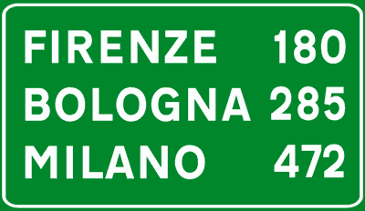

---

**2.** Il segnale raffigurato riporta le località con le relative distanze in chilometri

- **الإجابة:** `VERO ✅ (صح)`
- 

---

**3.** Il segnale raffigurato se di colore blu, si trova su strade extraurbane

- **الإجابة:** `VERO ✅ (صح)`
- 

---

**4.** Il segnale raffigurato è posto su un'autostrada

- **الإجابة:** `VERO ✅ (صح)`
- 

---

**5.** Il segnale raffigurato indica che mancano 180 chilometri per Firenze

- **الإجابة:** `VERO ✅ (صح)`
- 

---

**6.** Il segnale raffigurato indica in autostrada la distanza delle località raggiungibili

- **الإجابة:** `VERO ✅ (صح)`
- 

---

**7.** Il segnale raffigurato indica che uscendo dal primo casello autostradale è possibile raggiungere tutte le località indicate

- **الإجابة:** `FALSO ❌ (خطأ)`
- 

---

**8.** Il segnale raffigurato indica che per raggiungere Milano bisogna percorrere l'autostrada n. 472

- **الإجابة:** `FALSO ❌ (خطأ)`
- 

---

**9.** Il segnale raffigurato indica che mancano 180 chilometri per l'area di servizio di Firenze

- **الإجابة:** `FALSO ❌ (خطأ)`
- 

---

**10.** Il segnale raffigurato indica, per ogni località, il numero della strada da percorrere

- **الإجابة:** `FALSO ❌ (خطأ)`
- 

---

**11.** Il segnale raffigurato indica i chilometri già fatti dalle località indicate

- **الإجابة:** `FALSO ❌ (خطأ)`
- 

---

**12.** Il segnale raffigurato è posto sulle strade extraurbane

- **الإجابة:** `FALSO ❌ (خطأ)`
- 

---

## 📌 Itinerario internazionale (11 domande)

**13.** Il segnale raffigurato indica un itinerario di strada internazionale

- **الإجابة:** `VERO ✅ (صح)`
- 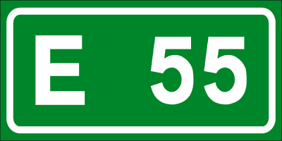

---

**14.** Il segnale raffigurato indica il numero della classificazione internazionale della strada

- **الإجابة:** `VERO ✅ (صح)`
- 

---

**15.** Il segnale raffigurato è posto su strade di importanza internazionale

- **الإجابة:** `VERO ✅ (صح)`
- 

---

**16.** Il segnale raffigurato indica l'itinerario internazionale n. 55

- **الإجابة:** `VERO ✅ (صح)`
- 

---

**17.** Il segnale raffigurato si può trovare all'interno di un segnale di preavviso di bivio stradale

- **الإجابة:** `VERO ✅ (صح)`
- 

---

**18.** Il segnale raffigurato identifica le strade extraurbane

- **الإجابة:** `FALSO ❌ (خطأ)`
- 

---

**19.** Il segnale raffigurato indica l'uscita autostradale n. 55

- **الإجابة:** `FALSO ❌ (خطأ)`
- 

---

**20.** Il segnale raffigurato indica che mancano 55 chilometri al confine di Stato con l'estero

- **الإجابة:** `FALSO ❌ (خطأ)`
- 

---

**21.** Il segnale raffigurato indica la velocità massima da tenere su quella strada

- **الإجابة:** `FALSO ❌ (خطأ)`
- 

---

**22.** Il segnale raffigurato indica il numero del cavalcavia

- **الإجابة:** `FALSO ❌ (خطأ)`
- 

---

**23.** Il segnale raffigurato indica che sono stati percorsi 55 chilometri dal punto di origine dell'autostrada

- **الإجابة:** `FALSO ❌ (خطأ)`
- 

---

## 📌 Strada statale (10 domande)

**24.** Il segnale raffigurato indica il tipo ed il numero di strada percorsa

- **الإجابة:** `VERO ✅ (صح)`
- 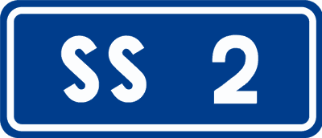

---

**25.** Il segnale raffigurato si può trovare all'interno di un segnale di direzione o di bivio stradale

- **الإجابة:** `VERO ✅ (صح)`
- 

---

**26.** Il segnale raffigurato indica che la strada su cui viaggiamo è una strada statale

- **الإجابة:** `VERO ✅ (صح)`
- 

---

**27.** Il segnale raffigurato indica che stiamo percorrendo la strada statale n. 2

- **الإجابة:** `VERO ✅ (صح)`
- 

---

**28.** Il segnale raffigurato indica il numero di piazzole di sosta

- **الإجابة:** `FALSO ❌ (خطأ)`
- 

---

**29.** Il segnale raffigurato indica una strada sdrucciolevole per 2 chilometri

- **الإجابة:** `FALSO ❌ (خطأ)`
- 

---

**30.** Il segnale raffigurato indica una strada stretta per 2 chilometri

- **الإجابة:** `FALSO ❌ (خطأ)`
- 

---

**31.** Il segnale raffigurato indica una strada senza uscita a 2 chilometri

- **الإجابة:** `FALSO ❌ (خطأ)`
- 

---

**32.** Il segnale raffigurato indica una strada senza segnaletica per 2 chilometri

- **الإجابة:** `FALSO ❌ (خطأ)`
- 

---

**33.** Il segnale raffigurato indica una strada sterrata

- **الإجابة:** `FALSO ❌ (خطأ)`
- 

---

## 📌 Strada comunale (9 domande)

**34.** Il segnale raffigurato si può trovare all'inizio di una strada comunale

- **الإجابة:** `VERO ✅ (صح)`
- 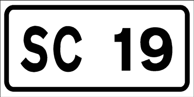

---

**35.** Il segnale raffigurato si può trovare a completamento dei segnali di direzione

- **الإجابة:** `VERO ✅ (صح)`
- 

---

**36.** Il segnale raffigurato identifica una strada comunale

- **الإجابة:** `VERO ✅ (صح)`
- 

---

**37.** Il segnale raffigurato si può trovare lungo la strada comunale n. 19

- **الإجابة:** `VERO ✅ (صح)`
- 

---

**38.** Il segnale raffigurato si trova a diciannove chilometri dalla più vicina Stazione dei Carabinieri

- **الإجابة:** `FALSO ❌ (خطأ)`
- 

---

**39.** Il segnale raffigurato si trova all'inizio di una strada di campagna

- **الإجابة:** `FALSO ❌ (خطأ)`
- 

---

**40.** Il segnale raffigurato si trova dove la strada è percorribile solo con catene da neve

- **الإجابة:** `FALSO ❌ (خطأ)`
- 

---

**41.** Il segnale raffigurato si trova su strade dove la sosta è consentita dopo le ore 19.00

- **الإجابة:** `FALSO ❌ (خطأ)`
- 

---

**42.** Il segnale raffigurato indica, su strada urbana, il numero del cavalcavia

- **الإجابة:** `FALSO ❌ (خطأ)`
- 

---

## 📌 Area campeggio (9 domande)

**43.** Il segnale raffigurato indica la vicinanza di un'area per campeggio

- **الإجابة:** `VERO ✅ (صح)`
- 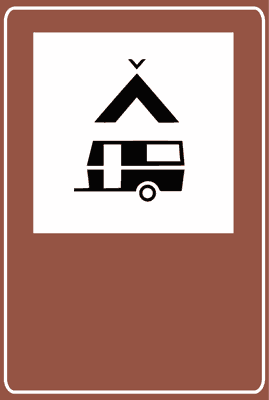

---

**44.** Il segnale raffigurato indica un'area da campeggio con tende e sosta per caravan ed autocaravan

- **الإجابة:** `VERO ✅ (صح)`
- 

---

**45.** Il segnale raffigurato indica una zona destinata alla sosta di caravan ed autocaravan ed al campeggio

- **الإجابة:** `VERO ✅ (صح)`
- 

---

**46.** Il segnale raffigurato indica che è consentito il campeggio e la sosta di caravan ed autocaravan

- **الإجابة:** `VERO ✅ (صح)`
- 

---

**47.** Il segnale raffigurato indica un divieto di sosta per caravan e per i veicoli da campeggio

- **الإجابة:** `FALSO ❌ (خطأ)`
- 

---

**48.** Il segnale raffigurato indica una zona panoramica

- **الإجابة:** `FALSO ❌ (خطأ)`
- 

---

**49.** Il segnale raffigurato indica un'officina di riparazione veicoli da campeggio nelle vicinanze

- **الإجابة:** `FALSO ❌ (خطأ)`
- 

---

**50.** Il segnale raffigurato indica una postazione mobile di Polizia nelle vicinanze

- **الإجابة:** `FALSO ❌ (خطأ)`
- 

---

**51.** Il segnale raffigurato indica un posto mobile di pronto soccorso nelle vicinanze

- **الإجابة:** `FALSO ❌ (خطأ)`
- 

---

## 📌 Comando polizia (9 domande)

**52.** Il segnale raffigurato indica l'indirizzo ed i numeri telefonici del più vicino comando della polizia stradale

- **الإجابة:** `VERO ✅ (صح)`
- 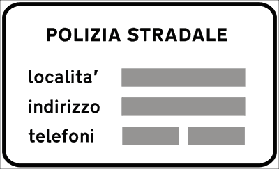

---

**53.** Il segnale raffigurato indica la località ed i numeri di telefono del più vicino comando di polizia stradale

- **الإجابة:** `VERO ✅ (صح)`
- 

---

**54.** Il segnale raffigurato indica la sede ed il numero telefonico del più vicino comando di polizia stradale

- **الإجابة:** `VERO ✅ (صح)`
- 

---

**55.** Il segnale raffigurato riporta alcuni dati (località, via, telefoni) del più vicino comando di polizia stradale

- **الإجابة:** `VERO ✅ (صح)`
- 

---

**56.** Il segnale raffigurato indica un posto di blocco della polizia

- **الإجابة:** `FALSO ❌ (خطأ)`
- 

---

**57.** Il segnale raffigurato indica una strada interrotta per incidente stradale

- **الإجابة:** `FALSO ❌ (خطأ)`
- 

---

**58.** Il segnale raffigurato indica una zona riservata al parcheggio dei veicoli della polizia

- **الإجابة:** `FALSO ❌ (خطأ)`
- 

---

**59.** Il segnale raffigurato indica la possibilità di incrociare una colonna di veicoli della polizia

- **الإجابة:** `FALSO ❌ (خطأ)`
- 

---

**60.** Il segnale raffigurato indica un tratto di strada riservato alla polizia

- **الإجابة:** `FALSO ❌ (خطأ)`
- 

---

## 📌 Senso unico frontale (9 domande)

**61.** Il segnale raffigurato indica un senso unico frontale

- **الإجابة:** `VERO ✅ (صح)`
- 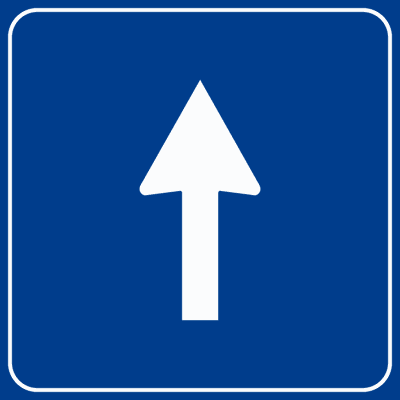

---

**62.** Il segnale raffigurato indica che la circolazione su quel tratto di strada è a senso unico

- **الإجابة:** `VERO ✅ (صح)`
- 

---

**63.** Il segnale raffigurato indica che dopo di esso è vietata l'inversione di marcia

- **الإجابة:** `VERO ✅ (صح)`
- 

---

**64.** Il segnale raffigurato indica l'inizio di una strada a senso unico

- **الإجابة:** `VERO ✅ (صح)`
- 

---

**65.** Il segnale raffigurato indica l'obbligo di proseguire diritto

- **الإجابة:** `FALSO ❌ (خطأ)`
- 

---

**66.** Il segnale raffigurato indica il divieto di svoltare a destra o a sinistra

- **الإجابة:** `FALSO ❌ (خطأ)`
- 

---

**67.** Il segnale raffigurato indica di circolare su una sola corsia

- **الإجابة:** `FALSO ❌ (خطأ)`
- 

---

**68.** Il segnale raffigurato indica un restringimento della carreggiata

- **الإجابة:** `FALSO ❌ (خطأ)`
- 

---

**69.** Il segnale raffigurato indica che si viaggia per file parallele

- **الإجابة:** `FALSO ❌ (خطأ)`
- 

---

## 📌 Senso unico (10 domande)

**70.** Il segnale raffigurato indica che la strada su cui è posto è a senso unico

- **الإجابة:** `VERO ✅ (صح)`
- 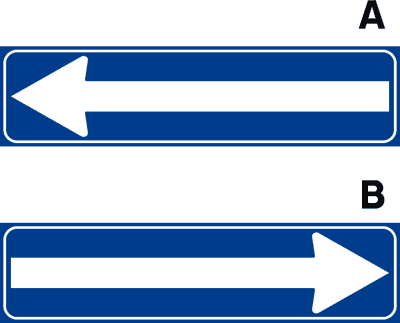

---

**71.** Il segnale A di figura indica che svoltando a sinistra la strada è a senso unico

- **الإجابة:** `VERO ✅ (صح)`
- 

---

**72.** Il segnale raffigurato indica che svoltando nel senso della freccia non si incrociano veicoli provenienti dal senso opposto

- **الإجابة:** `VERO ✅ (صح)`
- 

---

**73.** Il segnale raffigurato indica che una volta svoltato nel senso della freccia è vietata l'inversione di marcia

- **الإجابة:** `VERO ✅ (صح)`
- 

---

**74.** Il segnale raffigurato indica che nel tratto di strada in cui è posto si deve sorpassare a destra

- **الإجابة:** `FALSO ❌ (خطأ)`
- 

---

**75.** Il segnale A di figura indica che è obbligatorio svoltare a sinistra

- **الإجابة:** `FALSO ❌ (خطأ)`
- 

---

**76.** Il segnale raffigurato indica che è vietato proseguire diritto

- **الإجابة:** `FALSO ❌ (خطأ)`
- 

---

**77.** Il segnale raffigurato indica che si deve marciare per file parallele

- **الإجابة:** `FALSO ❌ (خطأ)`
- 

---

**78.** Il segnale raffigurato indica che svoltando nel senso della freccia la sosta è consentita solo a sinistra

- **الإجابة:** `FALSO ❌ (خطأ)`
- 

---

**79.** Il segnale raffigurato indica un parcheggio libero nel senso della freccia

- **الإجابة:** `FALSO ❌ (خطأ)`
- 

---

## 📌 Progressiva autostradale (11 domande)

**80.** Il segnale raffigurato indica la distanza dallo svincolo d'uscita per la località indicata

- **الإجابة:** `VERO ✅ (صح)`
- 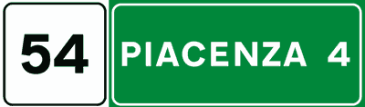

---

**81.** Il segnale raffigurato è posto lungo un'autostrada

- **الإجابة:** `VERO ✅ (صح)`
- 

---

**82.** Il segnale raffigurato indica a sinistra la distanza progressiva e a destra quella dal casello d'uscita per Piacenza

- **الإجابة:** `VERO ✅ (صح)`
- 

---

**83.** Il segnale raffigurato nella parte sinistra indica la distanza progressiva dal luogo di origine dell'autostrada

- **الإجابة:** `VERO ✅ (صح)`
- 

---

**84.** Il segnale raffigurato indica che mancano 4 chilometri dal casello d'uscita per Piacenza

- **الإجابة:** `VERO ✅ (صح)`
- 

---

**85.** Il segnale raffigurato fa parte dei segnali di indicazione

- **الإجابة:** `VERO ✅ (صح)`
- 

---

**86.** Il segnale raffigurato indica cha mancano 54 chilometri dallo svincolo d'uscita per Piacenza

- **الإجابة:** `FALSO ❌ (خطأ)`
- 

---

**87.** Il segnale raffigurato indica che si sta percorrendo l'autostrada n. 54

- **الإجابة:** `FALSO ❌ (خطأ)`
- 

---

**88.** Il segnale raffigurato indica a sinistra la velocità consigliata

- **الإجابة:** `FALSO ❌ (خطأ)`
- 

---

**89.** Il segnale raffigurato indica che sono stati già percorsi 4 chilometri da Piacenza

- **الإجابة:** `FALSO ❌ (خطأ)`
- 

---

**90.** Il segnale raffigurato indica l'inizio di un centro abitato

- **الإجابة:** `FALSO ❌ (خطأ)`
- 

---

## 📌 Sosta taxi (10 domande)

**91.** Il segnale raffigurato indica un'area di sosta per i taxi in servizio

- **الإجابة:** `VERO ✅ (صح)`
- 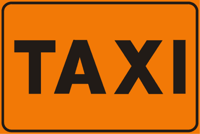

---

**92.** Il segnale raffigurato indica un'area di sosta ad uso esclusivo dei taxi in servizio

- **الإجابة:** `VERO ✅ (صح)`
- 

---

**93.** Il segnale raffigurato indica un parcheggio riservato ai taxi in servizio

- **الإجابة:** `VERO ✅ (صح)`
- 

---

**94.** Il segnale raffigurato indica un'area contrassegnata da strisce gialle con la scritta TAXI

- **الإجابة:** `VERO ✅ (صح)`
- 

---

**95.** Il segnale raffigurato indica un divieto di sorpasso ai taxi

- **الإجابة:** `FALSO ❌ (خطأ)`
- 

---

**96.** Il segnale raffigurato indica una strada vietata ai taxi

- **الإجابة:** `FALSO ❌ (خطأ)`
- 

---

**97.** Il segnale raffigurato indica la presenza nelle vicinanze di un apparecchio per chiamare un taxi

- **الإجابة:** `FALSO ❌ (خطأ)`
- 

---

**98.** Il segnale raffigurato indica la presenza di una stazione radio per taxi

- **الإجابة:** `FALSO ❌ (خطأ)`
- 

---

**99.** Il segnale raffigurato è dotato di luce propria

- **الإجابة:** `FALSO ❌ (خطأ)`
- 

---

**100.** Il segnale raffigurato indica un garage riservato ai taxi

- **الإجابة:** `FALSO ❌ (خطأ)`
- 

---

## 📌 Telefono pubblico (10 domande)

**101.** Il segnale raffigurato indica un posto di telefono pubblico nelle vicinanze

- **الإجابة:** `VERO ✅ (صح)`
- 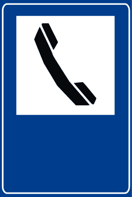

---

**102.** Il segnale raffigurato indica che siamo in vicinanza di un apparecchio telefonico pubblico

- **الإجابة:** `VERO ✅ (صح)`
- 

---

**103.** Il segnale raffigurato indica la possibilità, a breve distanza, di poter telefonare da un telefono pubblico

- **الإجابة:** `VERO ✅ (صح)`
- 

---

**104.** Il segnale raffigurato indica un apparecchio telefonico pubblico posto su strade extraurbane

- **الإجابة:** `VERO ✅ (صح)`
- 

---

**105.** Il segnale raffigurato indica la vicinanza di un negozio di telefonia mobile

- **الإجابة:** `FALSO ❌ (خطأ)`
- 

---

**106.** Il segnale raffigurato indica un posto di pronto soccorso raggiungibile per telefono

- **الإجابة:** `FALSO ❌ (خطأ)`
- 

---

**107.** Il segnale raffigurato indica la possibilità di ricaricare i telefoni cellulari

- **الإجابة:** `FALSO ❌ (خطأ)`
- 

---

**108.** Il segnale raffigurato indica che è vietato usare i telefoni cellulari

- **الإجابة:** `FALSO ❌ (خطأ)`
- 

---

**109.** Il segnale raffigurato indica una zona sufficientemente coperta dal segnale per telefonia mobile

- **الإجابة:** `FALSO ❌ (خطأ)`
- 

---

**110.** Il segnale raffigurato indica che è consentito telefonare solo con cellulari a viva voce

- **الإجابة:** `FALSO ❌ (خطأ)`
- 

---

## 📌 Rifornimento carburante (11 domande)

**111.** Il segnale raffigurato indica un posto di rifornimento carburante

- **الإجابة:** `VERO ✅ (صح)`
- 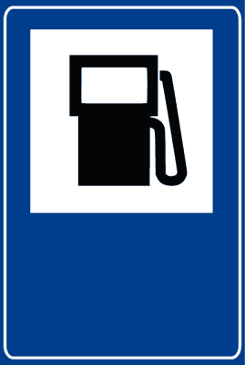

---

**112.** Il segnale raffigurato indica che nelle vicinanze vi è un posto di distribuzione carburante

- **الإجابة:** `VERO ✅ (صح)`
- 

---

**113.** Il segnale raffigurato indica la possibilità di rifornimento carburante a breve distanza

- **الإجابة:** `VERO ✅ (صح)`
- 

---

**114.** Il segnale raffigurato indica che a breve distanza vi è una stazione di rifornimento carburante

- **الإجابة:** `VERO ✅ (صح)`
- 

---

**115.** Il segnale raffigurato indica che lungo la strada, a breve distanza, vi è un distributore di carburante

- **الإجابة:** `VERO ✅ (صح)`
- 

---

**116.** Il segnale raffigurato indica un'officina di assistenza meccanica nelle vicinanze

- **الإجابة:** `FALSO ❌ (خطأ)`
- 

---

**117.** Il segnale raffigurato indica un posto telefonico pubblico nelle vicinanze

- **الإجابة:** `FALSO ❌ (خطأ)`
- 

---

**118.** Il segnale raffigurato indica che nelle vicinanze vi è un'area di sosta per autoveicoli

- **الإجابة:** `FALSO ❌ (خطأ)`
- 

---

**119.** Il segnale raffigurato indica un distributore di carburante riservato solo ai veicoli alimentati a GPL

- **الإجابة:** `FALSO ❌ (خطأ)`
- 

---

**120.** Il segnale raffigurato indica una raffineria

- **الإجابة:** `FALSO ❌ (خطأ)`
- 

---

**121.** Il segnale raffigurato vieta il transito ai veicoli che trasportano carburante

- **الإجابة:** `FALSO ❌ (خطأ)`
- 

---

## 📌 Preavviso deviazione temporanea (11 domande)

**122.** Il segnale raffigurato è un preavviso di deviazione temporanea

- **الإجابة:** `VERO ✅ (صح)`
- 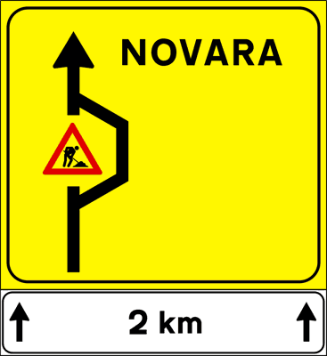

---

**123.** Il segnale raffigurato preavvisa l'interruzione di una strada per lavori in corso

- **الإجابة:** `VERO ✅ (صح)`
- 

---

**124.** Il segnale raffigurato fa parte dei segnali temporanei per lavori sulla strada

- **الإجابة:** `VERO ✅ (صح)`
- 

---

**125.** Il segnale raffigurato indica nella parte inferiore la lunghezza della deviazione

- **الإجابة:** `VERO ✅ (صح)`
- 

---

**126.** Il segnale raffigurato indica che non è assolutamente possibile raggiungere Novara

- **الإجابة:** `FALSO ❌ (خطأ)`
- 

---

**127.** Il segnale raffigurato obbliga a tornare indietro

- **الإجابة:** `FALSO ❌ (خطأ)`
- 

---

**128.** Il segnale raffigurato indica una piazzola di sosta

- **الإجابة:** `FALSO ❌ (خطأ)`
- 

---

**129.** Il segnale raffigurato indica la distanza da un'area di servizio

- **الإجابة:** `FALSO ❌ (خطأ)`
- 

---

**130.** Il segnale raffigurato indica un cantiere di lavoro lungo 2 chilometri

- **الإجابة:** `FALSO ❌ (خطأ)`
- 

---

**131.** Il segnale raffigurato indica che la deviazione si trova a 2 chilometri di distanza dal segnale

- **الإجابة:** `FALSO ❌ (خطأ)`
- 

---

**132.** Il segnale raffigurato è posto a 2 chilometri dal segnale di lavori in corso

- **الإجابة:** `FALSO ❌ (خطأ)`
- 

---

## 📌 Preavviso incrocio (11 domande)

**133.** Il segnale raffigurato preavvisa un incrocio urbano

- **الإجابة:** `VERO ✅ (صح)`
- 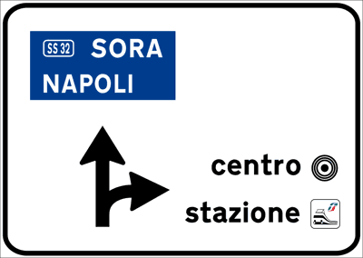

---

**134.** Il segnale raffigurato riporta i nomi dei luoghi raggiungibili dall'incrocio urbano

- **الإجابة:** `VERO ✅ (صح)`
- 

---

**135.** Il segnale raffigurato preavvisa la svolta a destra per raggiungere la stazione ferroviaria

- **الإجابة:** `VERO ✅ (صح)`
- 

---

**136.** Il segnale raffigurato preavvisa la svolta a destra per raggiungere il centro della città

- **الإجابة:** `VERO ✅ (صح)`
- 

---

**137.** Il segnale raffigurato indica di proseguire diritto per raggiungere Sora

- **الإجابة:** `VERO ✅ (صح)`
- 

---

**138.** Il segnale raffigurato preavvisa di proseguire diritto per raggiungere Napoli

- **الإجابة:** `VERO ✅ (صح)`
- 

---

**139.** Il segnale raffigurato si trova su strade extraurbane

- **الإجابة:** `FALSO ❌ (خطأ)`
- 

---

**140.** Il segnale raffigurato indica di svoltare a destra per uscire dal centro abitato

- **الإجابة:** `FALSO ❌ (خطأ)`
- 

---

**141.** Il segnale raffigurato indica che per raggiungere il centro della città bisogna tornare indietro

- **الإجابة:** `FALSO ❌ (خطأ)`
- 

---

**142.** Il segnale raffigurato preavvisa un'area di sosta a destra

- **الإجابة:** `FALSO ❌ (خطأ)`
- 

---

**143.** Il segnale raffigurato preavvisa a destra un passaggio a livello senza barriere

- **الإجابة:** `FALSO ❌ (خطأ)`
- 

---

## 📌 Incroci ravvicinati urbani (14 domande)

**144.** Il segnale raffigurato preavvisa due incroci vicini

- **الإجابة:** `VERO ✅ (صح)`
- 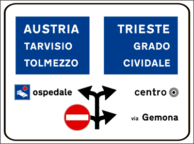

---

**145.** Il segnale raffigurato indica che non è possibile svoltare a sinistra al primo incrocio

- **الإجابة:** `VERO ✅ (صح)`
- 

---

**146.** Il segnale raffigurato preavvisa di svoltare a sinistra per l'ospedale al secondo incrocio

- **الإجابة:** `VERO ✅ (صح)`
- 

---

**147.** Il segnale raffigurato preavvisa di svoltare a destra per via Gemona al primo incrocio

- **الإجابة:** `VERO ✅ (صح)`
- 

---

**148.** Il segnale raffigurato preavvisa di svoltare a destra per il centro della città al secondo incrocio

- **الإجابة:** `VERO ✅ (صح)`
- 

---

**149.** Il segnale raffigurato preavvisa di svoltare a destra in direzione Trieste al secondo incrocio

- **الإجابة:** `VERO ✅ (صح)`
- 

---

**150.** Il segnale raffigurato indica che bisogna svoltare a sinistra al secondo incrocio per raggiungere l'Austria

- **الإجابة:** `VERO ✅ (صح)`
- 

---

**151.** Il segnale raffigurato indica due incroci vicini su strada urbana

- **الإجابة:** `VERO ✅ (صح)`
- 

---

**152.** Il segnale raffigurato si trova su strade extraurbane

- **الإجابة:** `FALSO ❌ (خطأ)`
- 

---

**153.** Il segnale raffigurato indica come lasciare in sosta i veicoli

- **الإجابة:** `FALSO ❌ (خطأ)`
- 

---

**154.** Il segnale raffigurato indica ai veicoli diretti in Austria di tornare indietro

- **الإجابة:** `FALSO ❌ (خطأ)`
- 

---

**155.** Il segnale raffigurato consente di svoltare a sinistra al primo incrocio

- **الإجابة:** `FALSO ❌ (خطأ)`
- 

---

**156.** Il segnale raffigurato indica come uscire da un centro commerciale

- **الإجابة:** `FALSO ❌ (خطأ)`
- 

---

**157.** Il segnale raffigurato preannuncia le direzioni per l'ingresso in autostrada

- **الإجابة:** `FALSO ❌ (خطأ)`
- 

---

## 📌 Incrocio circolazione rotatoria (10 domande)

**158.** Il segnale raffigurato è un preavviso di incrocio urbano con circolazione rotatoria

- **الإجابة:** `VERO ✅ (صح)`
- 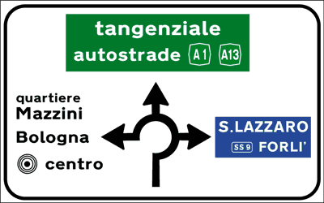

---

**159.** Il segnale raffigurato preavvisa di svoltare alla prima traversa a destra per andare a Forlì

- **الإجابة:** `VERO ✅ (صح)`
- 

---

**160.** Il segnale raffigurato preavvisa di svoltare alla seconda traversa per raggiungere la tangenziale

- **الإجابة:** `VERO ✅ (صح)`
- 

---

**161.** Il segnale raffigurato contiene lo schema della rotatoria

- **الإجابة:** `VERO ✅ (صح)`
- 

---

**162.** Il segnale raffigurato riporta i nomi delle località raggiungibili

- **الإجابة:** `VERO ✅ (صح)`
- 

---

**163.** Il segnale raffigurato indica una strada interrotta

- **الإجابة:** `FALSO ❌ (خطأ)`
- 

---

**164.** Il segnale raffigurato preavvisa un'area pedonale con verde pubblico

- **الإجابة:** `FALSO ❌ (خطأ)`
- 

---

**165.** Il segnale raffigurato preavvisa un divieto di transito agli autoveicoli

- **الإجابة:** `FALSO ❌ (خطأ)`
- 

---

**166.** Il segnale raffigurato si trova su strade extraurbane

- **الإجابة:** `FALSO ❌ (خطأ)`
- 

---

**167.** Il segnale raffigurato vale solo nelle ore notturne

- **الإجابة:** `FALSO ❌ (خطأ)`
- 

---

## 📌 Incrocio limitazione traffico autocarri (10 domande)

**168.** Il segnale raffigurato è un preavviso di incrocio urbano

- **الإجابة:** `VERO ✅ (صح)`
- 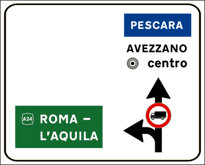

---

**169.** Il segnale raffigurato vieta agli autocarri di massa a pieno carico superiore a 3,5 tonnellate di proseguire diritto per Avezzano

- **الإجابة:** `VERO ✅ (صح)`
- 

---

**170.** Il segnale raffigurato consente alle autovetture di proseguire diritto per Pescara

- **الإجابة:** `VERO ✅ (صح)`
- 

---

**171.** Il segnale raffigurato preavvisa di svoltare a sinistra per raggiungere l'autostrada Roma-L'Aquila

- **الإجابة:** `VERO ✅ (صح)`
- 

---

**172.** Il segnale raffigurato vieta agli autocarri di massa a pieno carico superiore a 3,5 tonnellate di continuare diritto per raggiungere il centro urbano

- **الإجابة:** `VERO ✅ (صح)`
- 

---

**173.** Il segnale raffigurato vieta anche agli autobus di raggiungere Avezzano

- **الإجابة:** `FALSO ❌ (خطأ)`
- 

---

**174.** Il segnale raffigurato si trova solo su strade a senso unico di circolazione

- **الإجابة:** `FALSO ❌ (خطأ)`
- 

---

**175.** Il segnale raffigurato si trova all'ingresso di un'autostrada

- **الإجابة:** `FALSO ❌ (خطأ)`
- 

---

**176.** Il segnale raffigurato indica che la corsia centrale è chiusa

- **الإجابة:** `FALSO ❌ (خطأ)`
- 

---

**177.** Il segnale raffigurato fa parte dei segnali di precedenza

- **الإجابة:** `FALSO ❌ (خطأ)`
- 

---

## 📌 Incrocio extraurbano (11 domande)

**178.** Il segnale raffigurato preavvisa un incrocio su strada extraurbana

- **الإجابة:** `VERO ✅ (صح)`
- 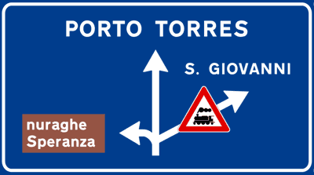

---

**179.** Il segnale raffigurato indica la presenza di un passaggio a livello svoltando a destra

- **الإجابة:** `VERO ✅ (صح)`
- 

---

**180.** Il segnale raffigurato preavvisa di proseguire diritto per raggiungere Porto Torres

- **الإجابة:** `VERO ✅ (صح)`
- 

---

**181.** Il segnale raffigurato preavvisa di svoltare a sinistra per una località turistica

- **الإجابة:** `VERO ✅ (صح)`
- 

---

**182.** Il segnale raffigurato preavvisa di svoltare a destra per S. Giovanni

- **الإجابة:** `VERO ✅ (صح)`
- 

---

**183.** Il segnale raffigurato preannuncia un pericolo per chi svolta a destra per il possibile attraversamento di treni

- **الإجابة:** `VERO ✅ (صح)`
- 

---

**184.** Il segnale raffigurato si trova dopo un incrocio

- **الإجابة:** `FALSO ❌ (خطأ)`
- 

---

**185.** Il segnale raffigurato indica una stazione balneare a sinistra

- **الإجابة:** `FALSO ❌ (خطأ)`
- 

---

**186.** Il segnale raffigurato fa parte dei segnali di obbligo

- **الإجابة:** `FALSO ❌ (خطأ)`
- 

---

**187.** Il segnale raffigurato indica che non è possibile raggiungere S. Giovanni

- **الإجابة:** `FALSO ❌ (خطأ)`
- 

---

**188.** Il segnale raffigurato preavvisa un incrocio urbano con zona residenziale a sinistra

- **الإجابة:** `FALSO ❌ (خطأ)`
- 

---

## 📌 Preselezione extraurbana (11 domande)

**189.** Il segnale raffigurato è posto su strade extraurbane suddivise in due corsie

- **الإجابة:** `VERO ✅ (صح)`
- 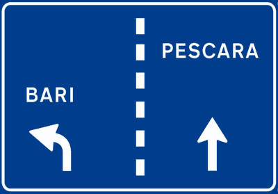

---

**190.** Il segnale raffigurato preavvisa una zona di preselezione con due destinazioni

- **الإجابة:** `VERO ✅ (صح)`
- 

---

**191.** Il segnale raffigurato indica al conducente diretto a Bari di spostarsi sulla corsia di sinistra

- **الإجابة:** `VERO ✅ (صح)`
- 

---

**192.** Il segnale raffigurato indica al conducente diretto a Pescara di spostarsi sulla corsia di destra

- **الإجابة:** `VERO ✅ (صح)`
- 

---

**193.** Il segnale raffigurato è posto dove è ancora possibile cambiare la corsia di canalizzazione

- **الإجابة:** `VERO ✅ (صح)`
- 

---

**194.** Il segnale raffigurato indica l'obbligo di sorpassare a destra

- **الإجابة:** `FALSO ❌ (خطأ)`
- 

---

**195.** Il segnale raffigurato indica che la strada per Bari è interrotta

- **الإجابة:** `FALSO ❌ (خطأ)`
- 

---

**196.** Il segnale raffigurato preavvisa a destra un lungo rettilineo

- **الإجابة:** `FALSO ❌ (خطأ)`
- 

---

**197.** Il segnale raffigurato preavvisa a sinistra una curva pericolosa

- **الإجابة:** `FALSO ❌ (خطأ)`
- 

---

**198.** Il segnale raffigurato preavvisa un obbligo di invertire il senso di marcia

- **الإجابة:** `FALSO ❌ (خطأ)`
- 

---

**199.** Il segnale raffigurato preavvisa a sinistra un cavalcavia

- **الإجابة:** `FALSO ❌ (خطأ)`
- 

---

## 📌 Preselezione urbana (11 domande)

**200.** Il segnale raffigurato è posto su strade urbane

- **الإجابة:** `VERO ✅ (صح)`
- 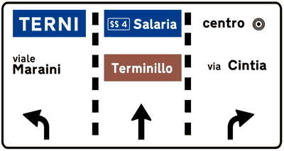

---

**201.** Il segnale raffigurato nelle strade urbane a più corsie consente di immettersi nelle corsie di canalizzazione

- **الإجابة:** `VERO ✅ (صح)`
- 

---

**202.** Il segnale raffigurato indica ai conducenti diretti alla località turistica di immettersi nella corsia di mezzo

- **الإجابة:** `VERO ✅ (صح)`
- 

---

**203.** Il segnale raffigurato indica ai conducenti diretti a Terni di mettersi nella corsia di sinistra

- **الإجابة:** `VERO ✅ (صح)`
- 

---

**204.** Il segnale raffigurato indica ai conducenti diretti al centro della città di occupare la corsia di destra

- **الإجابة:** `VERO ✅ (صح)`
- 

---

**205.** Il segnale raffigurato preavvisa un incrocio autostradale

- **الإجابة:** `FALSO ❌ (خطأ)`
- 

---

**206.** Il segnale raffigurato indica come raggiungere un parcheggio

- **الإجابة:** `FALSO ❌ (خطأ)`
- 

---

**207.** Il segnale raffigurato indica che Terni si trova 500 metri dopo aver effettuato la svolta

- **الإجابة:** `FALSO ❌ (خطأ)`
- 

---

**208.** Il segnale raffigurato indica nelle corsie laterali di invertire il senso di marcia

- **الإجابة:** `FALSO ❌ (خطأ)`
- 

---

**209.** Il segnale raffigurato indica che la strada per Terni è interrotta

- **الإجابة:** `FALSO ❌ (خطأ)`
- 

---

**210.** Il segnale raffigurato indica che non è più possibile cambiare corsia

- **الإجابة:** `FALSO ❌ (خطأ)`
- 

---

## 📌 Ospedale (8 domande)

**211.** Il segnale raffigurato indica l'ingresso di un ospedale

- **الإجابة:** `VERO ✅ (صح)`
- 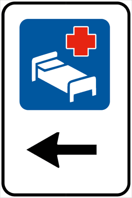

---

**212.** Il segnale raffigurato, che indica la vicinanza di un ospedale, invita a non fare rumori molesti nelle sue vicinanze

- **الإجابة:** `VERO ✅ (صح)`
- 

---

**213.** Il segnale raffigurato indica la direzione per entrare nell'ospedale

- **الإجابة:** `VERO ✅ (صح)`
- 

---

**214.** Il segnale raffigurato è posto in corrispondenza di un ospedale

- **الإجابة:** `VERO ✅ (صح)`
- 

---

**215.** Il segnale raffigurato indica la vicinanza di un hotel

- **الإجابة:** `FALSO ❌ (خطأ)`
- 

---

**216.** Il segnale raffigurato indica la vicinanza di una stazione ferroviaria con vagoni letto

- **الإجابة:** `FALSO ❌ (خطأ)`
- 

---

**217.** Il segnale raffigurato indica un parcheggio riservato ai medici

- **الإجابة:** `FALSO ❌ (خطأ)`
- 

---

**218.** Il segnale raffigurato indica un dormitorio pubblico

- **الإجابة:** `FALSO ❌ (خطأ)`
- 

---

## 📌 Diramazione autostradale (11 domande)

**219.** Il segnale raffigurato indica che per raggiungere Bologna bisogna proseguire diritto

- **الإجابة:** `VERO ✅ (صح)`
- 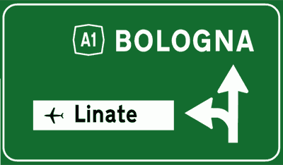

---

**220.** Il segnale raffigurato preavvisa due determinate destinazioni

- **الإجابة:** `VERO ✅ (صح)`
- 

---

**221.** Il segnale raffigurato preavvisa uno svincolo con svolta a sinistra per l'aeroporto di Linate

- **الإجابة:** `VERO ✅ (صح)`
- 

---

**222.** Il segnale raffigurato preavvisa uno svincolo autostradale

- **الإجابة:** `VERO ✅ (صح)`
- 

---

**223.** Il segnale raffigurato preavvisa uno svincolo in cui si deve proseguire diritto per andare a Bologna

- **الإجابة:** `VERO ✅ (صح)`
- 

---

**224.** Il segnale raffigurato si trova su strade extraurbane

- **الإجابة:** `FALSO ❌ (خطأ)`
- 

---

**225.** Il segnale raffigurato vieta la svolta a sinistra

- **الإجابة:** `FALSO ❌ (خطأ)`
- 

---

**226.** Il segnale raffigurato indica che manca un chilometro per arrivare a Bologna

- **الإجابة:** `FALSO ❌ (خطأ)`
- 

---

**227.** Il segnale raffigurato obbliga a cambiare corsia per raggiungere Bologna

- **الإجابة:** `FALSO ❌ (خطأ)`
- 

---

**228.** Il segnale raffigurato è posto all'ingresso di un aeroporto

- **الإجابة:** `FALSO ❌ (خطأ)`
- 

---

**229.** Il segnale raffigurato indica un parco giochi sulla sinistra

- **الإجابة:** `FALSO ❌ (خطأ)`
- 

---

## 📌 Diramazione urbana (10 domande)

**230.** Il segnale raffigurato indica che per raggiungere Milano bisogna proseguire diritto

- **الإجابة:** `VERO ✅ (صح)`
- 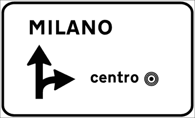

---

**231.** Il segnale raffigurato indica due determinate destinazioni

- **الإجابة:** `VERO ✅ (صح)`
- 

---

**232.** Il segnale raffigurato preavvisa un incrocio con svolta a destra per il centro cittadino

- **الإجابة:** `VERO ✅ (صح)`
- 

---

**233.** Il segnale raffigurato si può trovare su strade urbane

- **الإجابة:** `VERO ✅ (صح)`
- 

---

**234.** Il segnale raffigurato preavvisa un incrocio in cui si deve proseguire diritto per andare a Milano

- **الإجابة:** `VERO ✅ (صح)`
- 

---

**235.** Il segnale raffigurato si trova solo su strade a senso unico

- **الإجابة:** `FALSO ❌ (خطأ)`
- 

---

**236.** Il segnale raffigurato preavvisa un incrocio per il poligono di tiro a segno

- **الإجابة:** `FALSO ❌ (خطأ)`
- 

---

**237.** Il segnale raffigurato indica che svoltando a destra si incontra una strada secondaria

- **الإجابة:** `FALSO ❌ (خطأ)`
- 

---

**238.** Il segnale raffigurato preavvisa la fine del doppio senso di circolazione e l'inizio del senso unico

- **الإجابة:** `FALSO ❌ (خطأ)`
- 

---

**239.** Il segnale raffigurato indica di svoltare a destra per raggiungere un centro commerciale

- **الإجابة:** `FALSO ❌ (خطأ)`
- 

---

## 📌 Itinerario extraurbano (10 domande)

**240.** Il segnale raffigurato si trova sulle strade extraurbane principali

- **الإجابة:** `VERO ✅ (صح)`
- 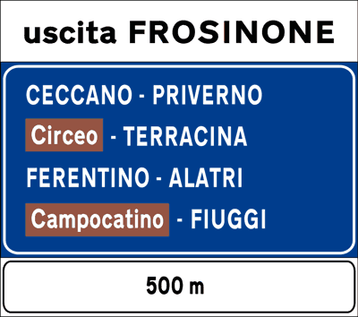

---

**241.** Il segnale raffigurato indica che lo svincolo di uscita per Frosinone è a 500 metri

- **الإجابة:** `VERO ✅ (صح)`
- 

---

**242.** Il segnale raffigurato riporta i nomi delle località raggiungibili uscendo dalla strada extraurbana principale

- **الإجابة:** `VERO ✅ (صح)`
- 

---

**243.** Il segnale raffigurato indica, con la scritta su fondo marrone, le località turistiche

- **الإجابة:** `VERO ✅ (صح)`
- 

---

**244.** Il segnale raffigurato indica la distanza che c'è tra il segnale e il prossimo svincolo d'uscita

- **الإجابة:** `VERO ✅ (صح)`
- 

---

**245.** Il segnale raffigurato si trova uscendo dal comune di Frosinone

- **الإجابة:** `FALSO ❌ (خطأ)`
- 

---

**246.** Il segnale raffigurato indica che a 500 metri si arriva al comune di Frosinone

- **الإجابة:** `FALSO ❌ (خطأ)`
- 

---

**247.** Il segnale raffigurato indica che tutte le località riportate nel cartello sono distanti 500 metri

- **الإجابة:** `FALSO ❌ (خطأ)`
- 

---

**248.** Il segnale raffigurato indica che la strada non è più percorribile e che l'ultima uscita è quella di Frosinone

- **الإجابة:** `FALSO ❌ (خطأ)`
- 

---

**249.** Il segnale raffigurato indica l'inizio di un centro abitato

- **الإجابة:** `FALSO ❌ (خطأ)`
- 

---

## 📌 Fine centro abitato (12 domande)

**250.** Il segnale raffigurato indica la fine del centro abitato

- **الإجابة:** `VERO ✅ (صح)`
- 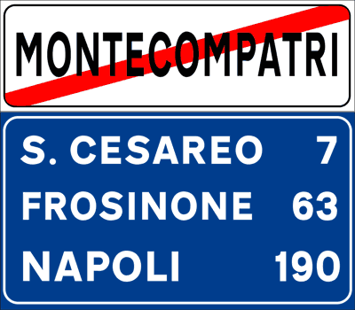

---

**251.** Il segnale raffigurato nella prima riga in alto del pannello blu indica il prossimo centro abitato

- **الإجابة:** `VERO ✅ (صح)`
- 

---

**252.** Il segnale raffigurato indica la fine del centro abitato e le località successive

- **الإجابة:** `VERO ✅ (صح)`
- 

---

**253.** Il segnale raffigurato nel pannello blu indica, per ogni località, la rispettiva distanza chilometrica

- **الإجابة:** `VERO ✅ (صح)`
- 

---

**254.** Il segnale raffigurato indica che per Napoli mancano 190 chilometri

- **الإجابة:** `VERO ✅ (صح)`
- 

---

**255.** Il segnale raffigurato indica che per S. Cesareo mancano 7 chilometri

- **الإجابة:** `VERO ✅ (صح)`
- 

---

**256.** Il segnale raffigurato indica l'inizio di un tratto di strada in salita per raggiungere Montecompatri

- **الإجابة:** `FALSO ❌ (خطأ)`
- 

---

**257.** Il segnale raffigurato indica che non è possibile raggiungere Montecompatri

- **الإجابة:** `FALSO ❌ (خطأ)`
- 

---

**258.** Il segnale raffigurato indica che per raggiungere Napoli bisogna percorrere la strada statale n. 190

- **الإجابة:** `FALSO ❌ (خطأ)`
- 

---

**259.** Il segnale raffigurato indica una strada chiusa al traffico

- **الإجابة:** `FALSO ❌ (خطأ)`
- 

---

**260.** Il segnale raffigurato si trova su strade extraurbane principali

- **الإجابة:** `FALSO ❌ (خطأ)`
- 

---

**261.** Il segnale raffigurato indica l'inizio del centro abitato

- **الإجابة:** `FALSO ❌ (خطأ)`
- 

---

## 📌 Inizio area pedonale (8 domande)

**262.** Il segnale raffigurato indica l'inizio di un'area pedonale

- **الإجابة:** `VERO ✅ (صح)`
- 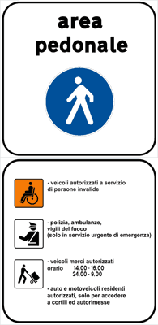

---

**263.** Il segnale raffigurato indica, nel pannello aggiuntivo, i veicoli che possono entrare

- **الإجابة:** `VERO ✅ (صح)`
- 

---

**264.** Il segnale raffigurato consente la circolazione dei veicoli per il carico e lo scarico merci

- **الإجابة:** `VERO ✅ (صح)`
- 

---

**265.** Il segnale raffigurato consente la circolazione dei veicoli per persone diversamente abili

- **الإجابة:** `VERO ✅ (صح)`
- 

---

**266.** Il segnale raffigurato indica una stazione di polizia

- **الإجابة:** `FALSO ❌ (خطأ)`
- 

---

**267.** Il segnale raffigurato indica un'area riservata solo alle persone diversamente abili

- **الإجابة:** `FALSO ❌ (خطأ)`
- 

---

**268.** Il segnale raffigurato indica la presenza di polizia a piedi

- **الإجابة:** `FALSO ❌ (خطأ)`
- 

---

**269.** Il segnale raffigurato indica la presenza di venditori ambulanti

- **الإجابة:** `FALSO ❌ (خطأ)`
- 

---

## 📌 Inizio traffico limitato (10 domande)

**270.** Il segnale raffigurato indica l'inizio di una zona a traffico limitato

- **الإجابة:** `VERO ✅ (صح)`
- 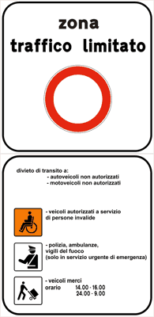

---

**271.** Il segnale raffigurato indica l'inizio dell'area dove il traffico è consentito solo ad alcune categorie di veicoli

- **الإجابة:** `VERO ✅ (صح)`
- 

---

**272.** Il segnale raffigurato riporta quali sono i veicoli che possono entrare

- **الإجابة:** `VERO ✅ (صح)`
- 

---

**273.** Il segnale raffigurato riporta le categorie di veicoli ammessi al transito

- **الإجابة:** `VERO ✅ (صح)`
- 

---

**274.** Il segnale raffigurato indica una strada a senso unico

- **الإجابة:** `FALSO ❌ (خطأ)`
- 

---

**275.** Il segnale raffigurato vieta il transito di tutti i veicoli

- **الإجابة:** `FALSO ❌ (خطأ)`
- 

---

**276.** Il segnale raffigurato indica una zona militare

- **الإجابة:** `FALSO ❌ (خطأ)`
- 

---

**277.** Il segnale raffigurato indica che la strada è chiusa per l'intenso traffico

- **الإجابة:** `FALSO ❌ (خطأ)`
- 

---

**278.** Il segnale raffigurato consente il transito solo ai residenti

- **الإجابة:** `FALSO ❌ (خطأ)`
- 

---

**279.** Il segnale raffigurato indica l'inizio di un'area pedonale

- **الإجابة:** `FALSO ❌ (خطأ)`
- 

---

## 📌 Transitabilita (10 domande)

**280.** Il segnale raffigurato permette di conoscere le condizioni di transitabilità del passo dello Stelvio

- **الإجابة:** `VERO ✅ (صح)`
- 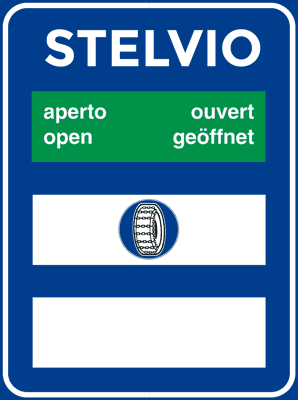

---

**281.** Il segnale raffigurato indica che è necessario transitare solo con catene o pneumatici invernali

- **الإجابة:** `VERO ✅ (صح)`
- 

---

**282.** Il segnale raffigurato indica che la strada è aperta, ma solo ai veicoli che sono equipaggiati con catene o pneumatici invernali

- **الإجابة:** `VERO ✅ (صح)`
- 

---

**283.** Il segnale raffigurato è posto su strade di montagna

- **الإجابة:** `VERO ✅ (صح)`
- 

---

**284.** Il segnale raffigurato indica che è possibile raggiungere il passo dello Stelvio

- **الإجابة:** `VERO ✅ (صح)`
- 

---

**285.** Il segnale raffigurato indica strada aperta solo ai veicoli con pneumatici nuovi

- **الإجابة:** `FALSO ❌ (خطأ)`
- 

---

**286.** Il segnale raffigurato consiglia di montare le catene

- **الإجابة:** `FALSO ❌ (خطأ)`
- 

---

**287.** Il segnale raffigurato obbliga a montare le catene su tutte le quattro ruote

- **الإجابة:** `FALSO ❌ (خطأ)`
- 

---

**288.** Il segnale raffigurato obbliga a togliere le catene per non rovinare l'asfalto

- **الإجابة:** `FALSO ❌ (خطأ)`
- 

---

**289.** Il segnale raffigurato indica l'apertura di un impianto sciistico

- **الإجابة:** `FALSO ❌ (خطأ)`
- 

---

## 📌 Intransitabilita (8 domande)

**290.** Il segnale raffigurato consiglia di procedere con particolare prudenza e attenzione

- **الإجابة:** `VERO ✅ (صح)`
- 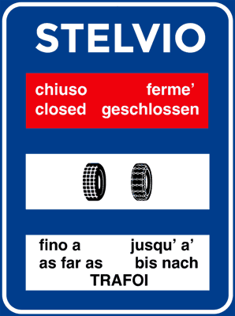

---

**291.** Il segnale raffigurato indica che il passo dello Stelvio non è raggiungibile

- **الإجابة:** `VERO ✅ (صح)`
- 

---

**292.** Il segnale raffigurato raccomanda l'uso delle catene o di pneumatici invernali fino a Trafoi

- **الإجابة:** `VERO ✅ (صح)`
- 

---

**293.** Il segnale raffigurato indica che è possibile arrivare fino a Trafoi

- **الإجابة:** `VERO ✅ (صح)`
- 

---

**294.** Il segnale raffigurato indica che le stazioni di servizio sono chiuse

- **الإجابة:** `FALSO ❌ (خطأ)`
- 

---

**295.** Il segnale raffigurato indica che è obbligatorio montare gli pneumatici invernali

- **الإجابة:** `FALSO ❌ (خطأ)`
- 

---

**296.** Il segnale raffigurato vieta il transito ai veicoli che non hanno le catene da neve

- **الإجابة:** `FALSO ❌ (خطأ)`
- 

---

**297.** Il segnale raffigurato indica che i veicoli per poter transitare debbono avere a bordo le catene

- **الإجابة:** `FALSO ❌ (خطأ)`
- 

---

## 📌 Inizio strada extraurbana (10 domande)

**298.** Il segnale raffigurato indica l'inizio di una strada extraurbana principale

- **الإجابة:** `VERO ✅ (صح)`
- 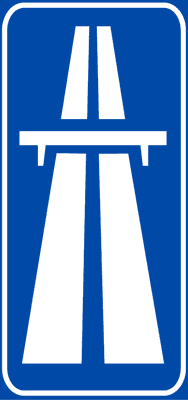

---

**299.** Il segnale raffigurato, se barrato, da una striscia rossa indica la fine di una strada extraurbana principale

- **الإجابة:** `VERO ✅ (صح)`
- 

---

**300.** Il segnale raffigurato è posto all’inizio di una strada extraurbana principale

- **الإجابة:** `VERO ✅ (صح)`
- 

---

**301.** Il segnale raffigurato indica una strada a carreggiate separate

- **الإجابة:** `VERO ✅ (صح)`
- 

---

**302.** Il segnale raffigurato indica la presenza di un cavalcavia che consente l'inversione di marcia

- **الإجابة:** `FALSO ❌ (خطأ)`
- 

---

**303.** Il segnale raffigurato preavvisa un tratto di strada in salita

- **الإجابة:** `FALSO ❌ (خطأ)`
- 

---

**304.** Il segnale raffigurato indica la vicinanza di un sottopassaggio per i veicoli

- **الإجابة:** `FALSO ❌ (خطأ)`
- 

---

**305.** Il segnale raffigurato indica che la strada è interrotta

- **الإجابة:** `FALSO ❌ (خطأ)`
- 

---

**306.** Il segnale raffigurato prescrive la circolazione per file parallele

- **الإجابة:** `FALSO ❌ (خطأ)`
- 

---

**307.** Il segnale raffigurato preavvisa l'inizio di un lungo rettilineo

- **الإجابة:** `FALSO ❌ (خطأ)`
- 

---

## 📌 Limiti generali (11 domande)

**308.** Il segnale raffigurato viene posto in vicinanza della frontiera italiana, visibile dai conducenti provenienti dallo Stato estero

- **الإجابة:** `VERO ✅ (صح)`
- 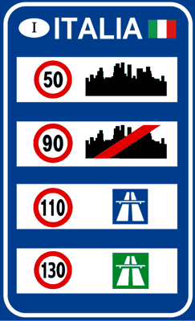

---

**309.** Il segnale raffigurato indica i limiti massimi di velocità generali che valgono in Italia

- **الإجابة:** `VERO ✅ (صح)`
- 

---

**310.** Il segnale raffigurato indica nel primo riquadro in alto il limite massimo di velocità nei centri abitati

- **الإجابة:** `VERO ✅ (صح)`
- 

---

**311.** Il segnale raffigurato indica in 90 km/h il limite massimo di velocità su strade extraurbane secondarie

- **الإجابة:** `VERO ✅ (صح)`
- 

---

**312.** Il segnale raffigurato indica in 110 km /h il limite massimo di velocità sulle strade extraurbane principali

- **الإجابة:** `VERO ✅ (صح)`
- 

---

**313.** Il segnale raffigurato indica in 130 km /h il limite massimo di velocità sulle autostrade

- **الإجابة:** `VERO ✅ (صح)`
- 

---

**314.** Il segnale raffigurato indica in 90 km /h il limite massimo di velocità nei centri abitati

- **الإجابة:** `FALSO ❌ (خطأ)`
- 

---

**315.** Il segnale raffigurato indica il numero di autostrade in Italia che si possono percorrere senza pagarne il pedaggio

- **الإجابة:** `FALSO ❌ (خطأ)`
- 

---

**316.** Il segnale raffigurato indica in 130 km /h il limite massimo di velocità su strade extraurbane principali

- **الإجابة:** `FALSO ❌ (خطأ)`
- 

---

**317.** Il segnale raffigurato si trova all'ingresso di ogni città

- **الإجابة:** `FALSO ❌ (خطأ)`
- 

---

**318.** Il segnale raffigurato indica i limiti minimi di velocità che valgono in Italia

- **الإجابة:** `FALSO ❌ (خطأ)`
- 

---

## 📌 Identificazione autostrada (10 domande)

**319.** Il segnale raffigurato indica il numero dell'autostrada

- **الإجابة:** `VERO ✅ (صح)`
- 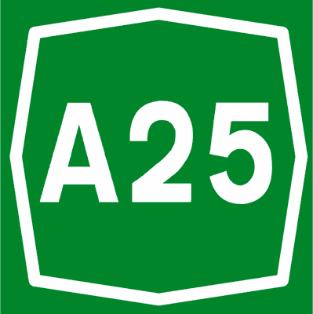

---

**320.** Il segnale raffigurato si può trovare all'interno di un segnale di preavviso di svincolo autostradale

- **الإجابة:** `VERO ✅ (صح)`
- 

---

**321.** Il segnale raffigurato abbinato ad una freccia, indica la direzione per un casello autostradale

- **الإجابة:** `VERO ✅ (صح)`
- 

---

**322.** Il segnale raffigurato identifica l'autostrada n. 25

- **الإجابة:** `VERO ✅ (صح)`
- 

---

**323.** Il segnale raffigurato si trova al confine con l'Austria

- **الإجابة:** `FALSO ❌ (خطأ)`
- 

---

**324.** Il segnale raffigurato indica il numero del cavalcavia

- **الإجابة:** `FALSO ❌ (خطأ)`
- 

---

**325.** Il segnale raffigurato indica la distanza di sicurezza da mantenere dal veicolo che sta davanti

- **الإجابة:** `FALSO ❌ (خطأ)`
- 

---

**326.** Il segnale raffigurato indica un centro di assistenza a 25 chilometri

- **الإجابة:** `FALSO ❌ (خطأ)`
- 

---

**327.** Il segnale raffigurato indica che il prossimo svincolo autostradale si trova a 25 chilometri

- **الإجابة:** `FALSO ❌ (خطأ)`
- 

---

**328.** Il segnale raffigurato indica il limite minimo di velocità che si consiglia di non superare

- **الإجابة:** `FALSO ❌ (خطأ)`
- 

---

## 📌 Inizio centro abitato (8 domande)

**329.** Il segnale raffigurato indica l'inizio di un centro abitato

- **الإجابة:** `VERO ✅ (صح)`
- 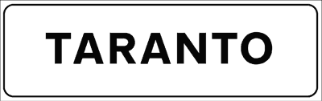

---

**330.** Il segnale raffigurato identifica la località raggiunta

- **الإجابة:** `VERO ✅ (صح)`
- 

---

**331.** Il segnale raffigurato è posto all'inizio del centro abitato, su tutte le strade d'ingresso alla località indicata

- **الإجابة:** `VERO ✅ (صح)`
- 

---

**332.** Il segnale raffigurato se barrato da una striscia rossa indica la fine del centro abitato

- **الإجابة:** `VERO ✅ (صح)`
- 

---

**333.** Il segnale raffigurato indica una località turistica

- **الإجابة:** `FALSO ❌ (خطأ)`
- 

---

**334.** Il segnale raffigurato è posto per indicare la fine di una provincia

- **الإجابة:** `FALSO ❌ (خطأ)`
- 

---

**335.** Il segnale raffigurato indica la direzione da seguire per raggiungere Taranto

- **الإجابة:** `FALSO ❌ (خطأ)`
- 

---

**336.** Il segnale raffigurato identifica un viadotto

- **الإجابة:** `FALSO ❌ (خطأ)`
- 

---

## 📌 Pronto soccorso (8 domande)

**337.** Il segnale raffigurato indica l'ingresso di un pronto soccorso medico

- **الإجابة:** `VERO ✅ (صح)`
- 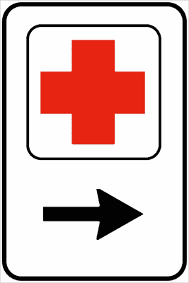

---

**338.** Il segnale raffigurato indica la direzione per entrare nel pronto soccorso

- **الإجابة:** `VERO ✅ (صح)`
- 

---

**339.** Il segnale raffigurato è posto in corrispondenza di un pronto soccorso

- **الإجابة:** `VERO ✅ (صح)`
- 

---

**340.** Il segnale raffigurato indica un posto di confine con la Svizzera

- **الإجابة:** `FALSO ❌ (خطأ)`
- 

---

**341.** Il segnale raffigurato indica una farmacia

- **الإجابة:** `FALSO ❌ (خطأ)`
- 

---

**342.** Il segnale raffigurato indica la strada da seguire per raggiungere il cimitero

- **الإجابة:** `FALSO ❌ (خطأ)`
- 

---

**343.** Il segnale raffigurato preavvisa un incrocio a quattro strade

- **الإجابة:** `FALSO ❌ (خطأ)`
- 

---

**344.** Il segnale raffigurato indica un parcheggio riservato ai medici

- **الإجابة:** `FALSO ❌ (خطأ)`
- 

---

## 📌 Localizzazione territoriale (7 domande)

**345.** Il segnale raffigurato si trova in vicinanza di un ponte che attraversa il fiume Arno

- **الإجابة:** `VERO ✅ (صح)`
- 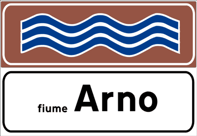

---

**346.** Il segnale raffigurato indica il nome del fiume in vicinanza del ponte che lo attraversa

- **الإجابة:** `VERO ✅ (صح)`
- 

---

**347.** Il segnale raffigurato fa parte dei segnali di indicazione

- **الإجابة:** `VERO ✅ (صح)`
- 

---

**348.** Il segnale raffigurato è posto dove in caso di pioggia la strada si può allagare

- **الإجابة:** `FALSO ❌ (خطأ)`
- 

---

**349.** Il segnale raffigurato indica il pericolo di mareggiate

- **الإجابة:** `FALSO ❌ (خطأ)`
- 

---

**350.** Il segnale raffigurato indica la possibilità di effettuare sci nautico

- **الإجابة:** `FALSO ❌ (خطأ)`
- 

---

**351.** Il segnale raffigurato indica una strada con curve in successione

- **الإجابة:** `FALSO ❌ (خطأ)`
- 

---

## 📌 Info turistiche (7 domande)

**352.** Il segnale raffigurato preavvisa un ufficio di informazioni turistico-alberghiere

- **الإجابة:** `VERO ✅ (صح)`
- 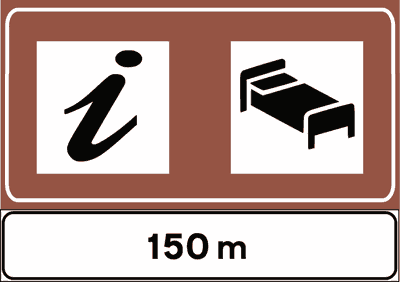

---

**353.** Il segnale raffigurato indica la possibilità di avere informazioni su alberghi e motel

- **الإجابة:** `VERO ✅ (صح)`
- 

---

**354.** Il segnale raffigurato indica un posto dove si possono richiedere informazioni sugli alberghi

- **الإجابة:** `VERO ✅ (صح)`
- 

---

**355.** Il segnale raffigurato indica il numero di alberghi che si trovano nelle vicinanze

- **الإجابة:** `FALSO ❌ (خطأ)`
- 

---

**356.** Il segnale raffigurato indica, a 150 metri, l'ingresso di un ospedale

- **الإجابة:** `FALSO ❌ (خطأ)`
- 

---

**357.** Il segnale raffigurato indica l'ufficio accettazione dell'ospedale

- **الإجابة:** `FALSO ❌ (خطأ)`
- 

---

**358.** Il segnale raffigurato indica che a 150 metri vi è un albergo con personale interprete per clienti stranieri

- **الإجابة:** `FALSO ❌ (خطأ)`
- 

---

## 📌 Attraversamento pedonale non regolato (9 domande)

**359.** Il segnale raffigurato indica un attraversamento pedonale non regolato

- **الإجابة:** `VERO ✅ (صح)`
- 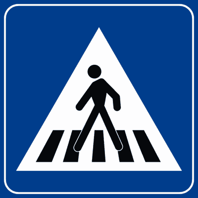

---

**360.** Il segnale raffigurato fuori dei centri abitati si trova dopo il segnale di pericolo ATTRAVERSAMENTO PEDONALE

- **الإجابة:** `VERO ✅ (صح)`
- 

---

**361.** Il segnale raffigurato si trova direttamente in corrispondenza delle strisce dell'attraversamento pedonale

- **الإجابة:** `VERO ✅ (صح)`
- 

---

**362.** Il segnale raffigurato obbliga i conducenti a fermarsi quando i pedoni transitano sugli attraversamenti pedonali

- **الإجابة:** `VERO ✅ (صح)`
- 

---

**363.** Il segnale raffigurato indica un sottopassaggio

- **الإجابة:** `FALSO ❌ (خطأ)`
- 

---

**364.** Il segnale raffigurato è posto 150 metri prima di un attraversamento pedonale

- **الإجابة:** `FALSO ❌ (خطأ)`
- 

---

**365.** Il segnale raffigurato se di colore verde è posto in autostrada

- **الإجابة:** `FALSO ❌ (خطأ)`
- 

---

**366.** Il segnale raffigurato preavvisa una scuola elementare

- **الإجابة:** `FALSO ❌ (خطأ)`
- 

---

**367.** Il segnale raffigurato consente di sorpassare un veicolo che si è arrestato per dare la precedenza ai pedoni

- **الإجابة:** `FALSO ❌ (خطأ)`
- 

---

## 📌 Scuolabus (8 domande)

**368.** Il segnale raffigurato, se posto sul bordo del marciapiede, indica la fermata di uno scuolabus

- **الإجابة:** `VERO ✅ (صح)`
- 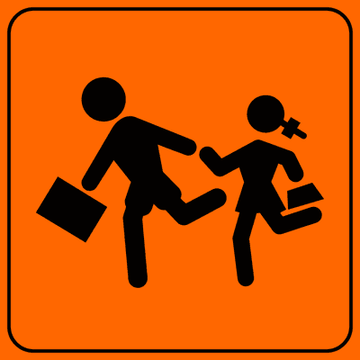

---

**369.** Il segnale raffigurato, se posto all'esterno di un autobus, segnala che esso trasporta scolari

- **الإجابة:** `VERO ✅ (صح)`
- 

---

**370.** Il segnale raffigurato può indicare la fermata di un autobus per trasporto scolari

- **الإجابة:** `VERO ✅ (صح)`
- 

---

**371.** Il segnale raffigurato invita a fare attenzione ai bambini che possono attraversare improvvisamente la strada

- **الإجابة:** `VERO ✅ (صح)`
- 

---

**372.** Il segnale raffigurato invita a fare attenzione perché possono esserci bambini discesi dallo scuolabus che possono attraversare improvvisamente la strada

- **الإجابة:** `VERO ✅ (صح)`
- 

---

**373.** Il segnale raffigurato vieta il transito ai bambini non accompagnati

- **الإجابة:** `FALSO ❌ (خطأ)`
- 

---

**374.** Il segnale raffigurato indica la presenza di giardini pubblici

- **الإجابة:** `FALSO ❌ (خطأ)`
- 

---

**375.** Il segnale raffigurato indica che bisogna obbligatoriamente dare precedenza ai bambini che attraversano

- **الإجابة:** `FALSO ❌ (خطأ)`
- 

---

## 📌 Segnale sos (7 domande)

**376.** Il segnale raffigurato indica la presenza di un dispositivo da utilizzare in caso di richiesta di soccorso stradale

- **الإجابة:** `VERO ✅ (صح)`
- 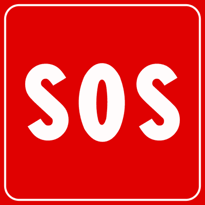

---

**377.** Il segnale raffigurato è posto su un dispositivo di chiamata per assistenza stradale

- **الإجابة:** `VERO ✅ (صح)`
- 

---

**378.** Il segnale raffigurato indica la presenza di un apparecchio per chiamare il soccorso stradale

- **الإجابة:** `VERO ✅ (صح)`
- 

---

**379.** Il segnale raffigurato indica una zona ospedaliera

- **الإجابة:** `FALSO ❌ (خطأ)`
- 

---

**380.** Il segnale raffigurato indica la presenza di un telefono pubblico

- **الإجابة:** `FALSO ❌ (خطأ)`
- 

---

**381.** Il segnale raffigurato indica un'area di sosta per ambulanze

- **الإجابة:** `FALSO ❌ (خطأ)`
- 

---

**382.** Il segnale raffigurato preavvisa una scuola secondaria statale

- **الإجابة:** `FALSO ❌ (خطأ)`
- 

---

## 📌 Strada senza uscita (9 domande)

**383.** Il segnale raffigurato è posto all'inizio di una strada senza uscita per i veicoli

- **الإجابة:** `VERO ✅ (صح)`
- 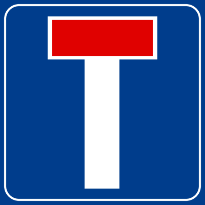

---

**384.** Il segnale raffigurato vale anche per i motocicli

- **الإجابة:** `VERO ✅ (صح)`
- 

---

**385.** Il segnale raffigurato indica una strada senza sbocco per i veicoli

- **الإجابة:** `VERO ✅ (صح)`
- 

---

**386.** Il segnale raffigurato vieta la sosta

- **الإجابة:** `FALSO ❌ (خطأ)`
- 

---

**387.** Il segnale raffigurato preavvisa un incrocio a forma di "T"

- **الإجابة:** `FALSO ❌ (خطأ)`
- 

---

**388.** Il segnale raffigurato è posto in vicinanza di una tabaccheria

- **الإجابة:** `FALSO ❌ (خطأ)`
- 

---

**389.** Il segnale raffigurato indica lavori in corso

- **الإجابة:** `FALSO ❌ (خطأ)`
- 

---

**390.** Il segnale raffigurato vieta l'inversione di marcia

- **الإجابة:** `FALSO ❌ (خطأ)`
- 

---

**391.** Il segnale raffigurato vieta di entrare anche ai pedoni

- **الإجابة:** `FALSO ❌ (خطأ)`
- 

---

## 📌 Preavviso strada senza uscita (10 domande)

**392.** Il segnale raffigurato preavvisa che la strada di destra è senza uscita per i veicoli

- **الإجابة:** `VERO ✅ (صح)`
- 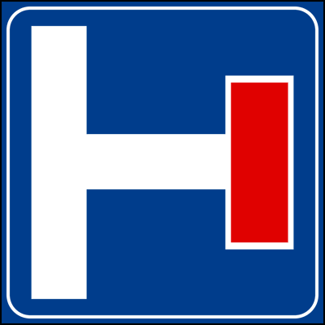

---

**393.** Il segnale raffigurato consente la svolta a destra

- **الإجابة:** `VERO ✅ (صح)`
- 

---

**394.** Il segnale raffigurato consente di proseguire diritto

- **الإجابة:** `VERO ✅ (صح)`
- 

---

**395.** Il segnale raffigurato vale anche per i motocicli

- **الإجابة:** `VERO ✅ (صح)`
- 

---

**396.** Il segnale raffigurato fa parte dei segnali di indicazione

- **الإجابة:** `VERO ✅ (صح)`
- 

---

**397.** Il segnale raffigurato vieta la manovra di inversione di marcia

- **الإجابة:** `FALSO ❌ (خطأ)`
- 

---

**398.** Il segnale raffigurato vieta la svolta a destra

- **الإجابة:** `FALSO ❌ (خطأ)`
- 

---

**399.** Il segnale raffigurato indica una piazzola di sosta sulla destra

- **الإجابة:** `FALSO ❌ (خطأ)`
- 

---

**400.** Il segnale raffigurato preavvisa un'area di parcheggio sulla destra

- **الإجابة:** `FALSO ❌ (خطأ)`
- 

---

**401.** Il segnale raffigurato vale anche per i pedoni

- **الإجابة:** `FALSO ❌ (خطأ)`
- 

---

## 📌 Velocita consigliata (11 domande)

**402.** Il segnale raffigurato indica la velocità che si consiglia di non superare in condizioni ottimali di traffico

- **الإجابة:** `VERO ✅ (صح)`
- 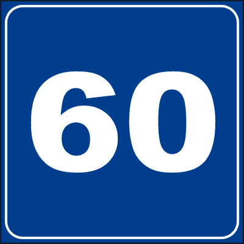

---

**403.** Il segnale raffigurato consente di viaggiare a 50 km/h

- **الإجابة:** `VERO ✅ (صح)`
- 

---

**404.** Il segnale raffigurato può essere abbinato con un pannello che indica la lunghezza del tratto di strada dove si consiglia di non superare la velocità indicata

- **الإجابة:** `VERO ✅ (صح)`
- 

---

**405.** Il segnale raffigurato se barrato da una striscia rossa indica la fine della sua validità

- **الإجابة:** `VERO ✅ (صح)`
- 

---

**406.** Il segnale raffigurato consente, sulle strade extraurbane, di viaggiare a 70 km/h

- **الإجابة:** `VERO ✅ (صح)`
- 

---

**407.** Il segnale raffigurato vieta il transito ai veicoli che superano a pieno carico 60 tonnellate

- **الإجابة:** `FALSO ❌ (خطأ)`
- 

---

**408.** Il segnale raffigurato indica un limite minimo di velocità

- **الإجابة:** `FALSO ❌ (خطأ)`
- 

---

**409.** Il segnale raffigurato vieta di superare la velocità indicata

- **الإجابة:** `FALSO ❌ (خطأ)`
- 

---

**410.** Il segnale raffigurato indica la distanza di sicurezza da mantenere dal veicolo che sta davanti

- **الإجابة:** `FALSO ❌ (خطأ)`
- 

---

**411.** Il segnale raffigurato indica che non è possibile viaggiare ad una velocità più bassa di quella indicata

- **الإجابة:** `FALSO ❌ (خطأ)`
- 

---

**412.** Il segnale raffigurato indica i chilometri già fatti dal punto di origine della strada

- **الإجابة:** `FALSO ❌ (خطأ)`
- 

---

## 📌 Strada veicoli motore (10 domande)

**413.** Il segnale raffigurato indica una strada riservata alla circolazione dei soli veicoli a motore

- **الإجابة:** `VERO ✅ (صح)`
- 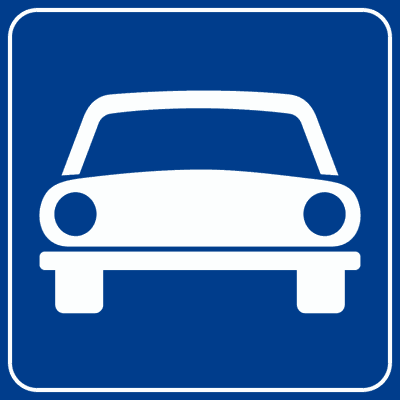

---

**414.** Il segnale raffigurato vieta il transito alle biciclette

- **الإجابة:** `VERO ✅ (صح)`
- 

---

**415.** Il segnale raffigurato viene posto all'inizio di una strada riservata alla circolazione dei veicoli a motore

- **الإجابة:** `VERO ✅ (صح)`
- 

---

**416.** Il segnale raffigurato vieta il transito ai veicoli senza motore

- **الإجابة:** `VERO ✅ (صح)`
- 

---

**417.** Il segnale raffigurato consente il transito agli autobus

- **الإجابة:** `VERO ✅ (صح)`
- 

---

**418.** Il segnale raffigurato se barrato da una striscia rossa indica la fine della sua validità

- **الإجابة:** `VERO ✅ (صح)`
- 

---

**419.** Il segnale raffigurato indica una strada riservata solo ai taxi

- **الإجابة:** `FALSO ❌ (خطأ)`
- 

---

**420.** Il segnale raffigurato indica un parcheggio per le sole autovetture

- **الإجابة:** `FALSO ❌ (خطأ)`
- 

---

**421.** Il segnale raffigurato consente ad una bicicletta di percorrere quella strada

- **الإجابة:** `FALSO ❌ (خطأ)`
- 

---

**422.** Il segnale raffigurato vieta il transito ad un autocarro

- **الإجابة:** `FALSO ❌ (خطأ)`
- 

---

## 📌 Inizio galleria (11 domande)

**423.** Il segnale raffigurato è posto all'inizio di una galleria

- **الإجابة:** `VERO ✅ (صح)`
- 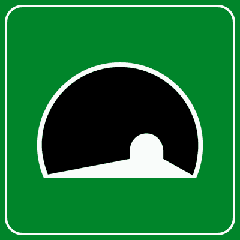

---

**424.** Il segnale raffigurato preavvisa una galleria autostradale

- **الإجابة:** `VERO ✅ (صح)`
- 

---

**425.** Il segnale raffigurato ricorda di spegnere il motore in caso di arresto prolungato in galleria

- **الإجابة:** `VERO ✅ (صح)`
- 

---

**426.** Il segnale raffigurato ricorda di non sostare e di non fermarsi in galleria, salvo diversa segnalazione

- **الإجابة:** `VERO ✅ (صح)`
- 

---

**427.** Il segnale raffigurato invita a tenere ben saldo lo sterzo per fronteggiare eventuali colpi di vento all'uscita della galleria

- **الإجابة:** `VERO ✅ (صح)`
- 

---

**428.** Il segnale raffigurato indica una strada chiusa

- **الإجابة:** `FALSO ❌ (خطأ)`
- 

---

**429.** Il segnale raffigurato indica lavori in corso

- **الإجابة:** `FALSO ❌ (خطأ)`
- 

---

**430.** Il segnale raffigurato indica una galleria non illuminata

- **الإجابة:** `FALSO ❌ (خطأ)`
- 

---

**431.** Il segnale raffigurato vieta il transito ai veicoli che superano 3,5 metri di altezza

- **الإجابة:** `FALSO ❌ (خطأ)`
- 

---

**432.** Il segnale raffigurato indica l'inizio di un ponte

- **الإجابة:** `FALSO ❌ (خطأ)`
- 

---

**433.** Il segnale raffigurato vieta il sorpasso

- **الإجابة:** `FALSO ❌ (خطأ)`
- 

---

## 📌 Presenza ponte (7 domande)

**434.** Il segnale raffigurato si può trovare all'inizio di un ponte, di un viadotto o di un cavalcavia

- **الإجابة:** `VERO ✅ (صح)`
- 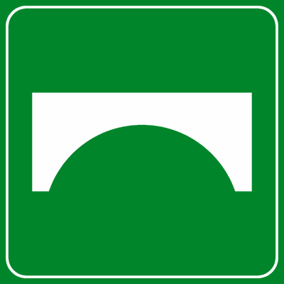

---

**435.** Il segnale raffigurato può essere abbinato ad un pannello che indica la lunghezza del cavalcavia

- **الإجابة:** `VERO ✅ (صح)`
- 

---

**436.** Il segnale raffigurato invita a fare particolare attenzione in caso di forte vento

- **الإجابة:** `VERO ✅ (صح)`
- 

---

**437.** Il segnale raffigurato invita a tenere ben saldo lo sterzo per fronteggiare eventuali colpi di vento laterale

- **الإجابة:** `VERO ✅ (صح)`
- 

---

**438.** Il segnale raffigurato prescrive il divieto di sorpasso tra autoveicoli

- **الإجابة:** `FALSO ❌ (خطأ)`
- 

---

**439.** Il segnale raffigurato indica l'inizio di una galleria

- **الإجابة:** `FALSO ❌ (خطأ)`
- 

---

**440.** Il segnale raffigurato indica che si sta per transitare sotto un ponte

- **الإجابة:** `FALSO ❌ (خطأ)`
- 

---

## 📌 Cartello attraversamento ciclabile (10 domande)

**441.** Il segnale raffigurato indica un attraversamento ciclabile

- **الإجابة:** `VERO ✅ (صح)`
- 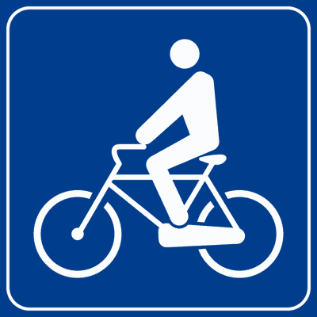

---

**442.** Il segnale raffigurato è posto in corrispondenza delle strisce dell'attraversamento ciclabile

- **الإجابة:** `VERO ✅ (صح)`
- 

---

**443.** Il segnale raffigurato indica che bisogna dare la precedenza ai ciclisti che attraversano sulle strisce

- **الإجابة:** `VERO ✅ (صح)`
- 

---

**444.** Il segnale raffigurato è abbinato alle strisce di attraversamento ciclabile

- **الإجابة:** `VERO ✅ (صح)`
- 

---

**445.** Il segnale raffigurato invita ad usare prudenza perché possiamo trovare ciclisti che attraversano la carreggiata

- **الإجابة:** `VERO ✅ (صح)`
- 

---

**446.** Il segnale raffigurato vieta il transito ai veicoli senza motore

- **الإجابة:** `FALSO ❌ (خطأ)`
- 

---

**447.** Il segnale raffigurato vieta il transito ai ciclisti

- **الإجابة:** `FALSO ❌ (خطأ)`
- 

---

**448.** Il segnale raffigurato indica una pista ciclabile

- **الإجابة:** `FALSO ❌ (خطأ)`
- 

---

**449.** Il segnale raffigurato indica ai ciclisti di svoltare a sinistra

- **الإجابة:** `FALSO ❌ (خطأ)`
- 

---

**450.** Il segnale raffigurato obbliga i ciclisti a dare la precedenza ai veicoli

- **الإجابة:** `FALSO ❌ (خطأ)`
- 

---

## 📌 Svolta sinistra (10 domande)

**451.** Il segnale raffigurato indica il percorso da fare per prendere la strada di sinistra

- **الإجابة:** `VERO ✅ (صح)`
- 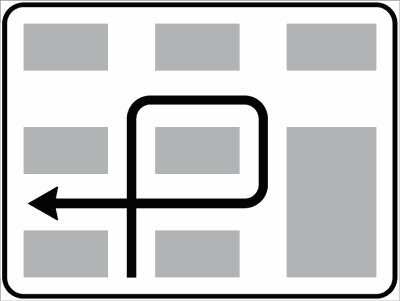

---

**452.** Il segnale raffigurato indica che non è possibile svoltare a sinistra in modo diretto

- **الإجابة:** `VERO ✅ (صح)`
- 

---

**453.** Il segnale raffigurato consente di proseguire diritto

- **الإجابة:** `VERO ✅ (صح)`
- 

---

**454.** Il segnale raffigurato consente la svolta a destra

- **الإجابة:** `VERO ✅ (صح)`
- 

---

**455.** Il segnale raffigurato interessa i conducenti che intendono prendere la strada di sinistra

- **الإجابة:** `VERO ✅ (صح)`
- 

---

**456.** Il segnale raffigurato obbliga a svoltare a sinistra al prossimo incrocio

- **الإجابة:** `FALSO ❌ (خطأ)`
- 

---

**457.** Il segnale raffigurato indica un parcheggio a sinistra

- **الإجابة:** `FALSO ❌ (خطأ)`
- 

---

**458.** Il segnale raffigurato non vale per le biciclette ed i ciclomotori

- **الإجابة:** `FALSO ❌ (خطأ)`
- 

---

**459.** Il segnale raffigurato vieta la svolta a destra

- **الإجابة:** `FALSO ❌ (خطأ)`
- 

---

**460.** Il segnale raffigurato indica il percorso degli autobus che hanno fermate nelle vicinanze

- **الإجابة:** `FALSO ❌ (خطأ)`
- 

---

## 📌 Inversione marcia (10 domande)

**461.** Il segnale raffigurato indica, su strade a carreggiate separate, la presenza di un cavalcavia per effettuare l'inversione di marcia

- **الإجابة:** `VERO ✅ (صح)`
- 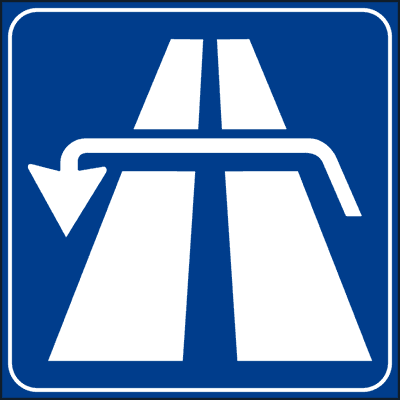

---

**462.** Il segnale raffigurato indica, su strade a carreggiate separate, un sottopassaggio per invertire il senso di marcia

- **الإجابة:** `VERO ✅ (صح)`
- 

---

**463.** Il segnale raffigurato è posto su una strada a carreggiate separate

- **الإجابة:** `VERO ✅ (صح)`
- 

---

**464.** Il segnale raffigurato indica la presenza di una struttura (cavalcavia o sottopassaggio) che consente di tornare indietro

- **الإجابة:** `VERO ✅ (صح)`
- 

---

**465.** Il segnale raffigurato, se su fondo verde, indica, su un'autostrada, la presenza di un cavalcavia per effettuare l'inversione di marcia

- **الإجابة:** `VERO ✅ (صح)`
- 

---

**466.** Il segnale raffigurato indica che la strada è interrotta a causa di lavori in corso

- **الإجابة:** `FALSO ❌ (خطأ)`
- 

---

**467.** Il segnale raffigurato indica l'inizio di un lungo rettilineo

- **الإجابة:** `FALSO ❌ (خطأ)`
- 

---

**468.** Il segnale raffigurato indica l'inizio di una strada extraurbana principale

- **الإجابة:** `FALSO ❌ (خطأ)`
- 

---

**469.** Il segnale raffigurato indica la vicinanza di un incrocio a raso (allo stesso livello del piano stradale)

- **الإجابة:** `FALSO ❌ (خطأ)`
- 

---

**470.** Il segnale raffigurato obbliga ad invertire il senso di marcia

- **الإجابة:** `FALSO ❌ (خطأ)`
- 

---

## 📌 Piazzola sosta (10 domande)

**471.** Il segnale raffigurato indica una piazzola a lato della carreggiata per effettuare la fermata

- **الإجابة:** `VERO ✅ (صح)`
- 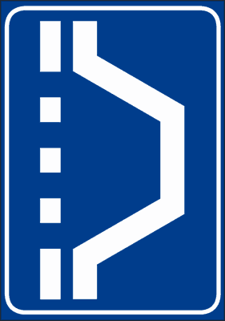

---

**472.** Il segnale raffigurato è posto in vicinanza di una piazzola per effettuare una fermata

- **الإجابة:** `VERO ✅ (صح)`
- 

---

**473.** Il segnale raffigurato si trova su strada extraurbana

- **الإجابة:** `VERO ✅ (صح)`
- 

---

**474.** Il segnale raffigurato può essere abbinato ad un pannello che indica la distanza che c'è tra il segnale e la piazzola

- **الإجابة:** `VERO ✅ (صح)`
- 

---

**475.** Il segnale raffigurato preavvisa un allargamento della carreggiata

- **الإجابة:** `FALSO ❌ (خطأ)`
- 

---

**476.** Il segnale raffigurato indica che la sosta è consentita solo per 3 ore

- **الإجابة:** `FALSO ❌ (خطأ)`
- 

---

**477.** Il segnale raffigurato indica un'area di campeggio

- **الإجابة:** `FALSO ❌ (خطأ)`
- 

---

**478.** Il segnale raffigurato indica la fermata di un autobus

- **الإجابة:** `FALSO ❌ (خطأ)`
- 

---

**479.** Il segnale raffigurato indica un'area di parcheggio per caravan

- **الإجابة:** `FALSO ❌ (خطأ)`
- 

---

**480.** Il segnale raffigurato è posto solo sulle autostrade

- **الإجابة:** `FALSO ❌ (خطأ)`
- 

---

## 📌 Utilizzo corsie (10 domande)

**481.** Il segnale raffigurato indica come utilizzare le corsie di una carreggiata

- **الإجابة:** `VERO ✅ (صح)`
- 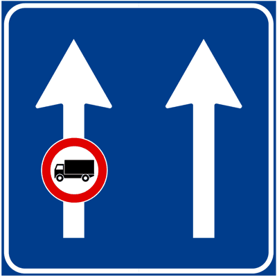

---

**482.** Il segnale raffigurato consente la circolazione dei motocicli su tutte e due le corsie

- **الإجابة:** `VERO ✅ (صح)`
- 

---

**483.** Il segnale raffigurato indica che la corsia di sinistra è vietata agli autocarri che superano la massa a pieno carico di 3,5 tonnellate

- **الإجابة:** `VERO ✅ (صح)`
- 

---

**484.** Il segnale raffigurato è installato sulle strade extraurbane

- **الإجابة:** `VERO ✅ (صح)`
- 

---

**485.** Il segnale raffigurato consente la circolazione delle autovetture su tutte e due le corsie

- **الإجابة:** `VERO ✅ (صح)`
- 

---

**486.** Il segnale raffigurato consente a tutti gli autocarri di sorpassare a destra

- **الإجابة:** `FALSO ❌ (خطأ)`
- 

---

**487.** Il segnale raffigurato indica che gli autocarri che superano 3,5 tonnellate possono circolare solo sulla corsia di sinistra

- **الإجابة:** `FALSO ❌ (خطأ)`
- 

---

**488.** Il segnale raffigurato vieta a tutti gli autocarri di circolare sulla corsia di sinistra

- **الإجابة:** `FALSO ❌ (خطأ)`
- 

---

**489.** Il segnale raffigurato vieta il transito anche agli autobus

- **الإجابة:** `FALSO ❌ (خطأ)`
- 

---

**490.** Il segnale raffigurato si trova solo su strade a doppio senso di circolazione

- **الإجابة:** `FALSO ❌ (خطأ)`
- 

---

## 📌 Velocita minima corsie (9 domande)

**491.** Il segnale raffigurato indica le velocità minime obbligatorie da mantenere sulle corsie indicate

- **الإجابة:** `VERO ✅ (صح)`
- 

---

**492.** Il segnale raffigurato è posto sulle autostrade

- **الإجابة:** `VERO ✅ (صح)`
- 

---

**493.** Il segnale raffigurato consente ad un veicolo che viaggia a 100 km/h di percorrere la corsia di mezzo

- **الإجابة:** `VERO ✅ (صح)`
- 

---

**494.** Il segnale raffigurato obbliga i veicoli che viaggiano alla velocità di 50 km/h di stare sulla prima corsia di destra

- **الإجابة:** `VERO ✅ (صح)`
- 

---

**495.** Il segnale raffigurato consente di circolare a 160 km/h in tutte e tre le corsie

- **الإجابة:** `FALSO ❌ (خطأ)`
- 

---

**496.** Il segnale raffigurato riporta le velocità che si consiglia di non superare

- **الإجابة:** `FALSO ❌ (خطأ)`
- 

---

**497.** Il segnale raffigurato consente ad un veicolo che viaggia alla velocità di 80 km/h di stare sulla corsia di sinistra

- **الإجابة:** `FALSO ❌ (خطأ)`
- 

---

**498.** Il segnale raffigurato indica una strada a doppio senso di circolazione

- **الإجابة:** `FALSO ❌ (خطأ)`
- 

---

**499.** Il segnale raffigurato indica le velocità consigliate

- **الإجابة:** `FALSO ❌ (خطأ)`
- 

---

## 📌 Corsia autobus (8 domande)

**500.** Il segnale raffigurato indica come devono essere utilizzate le corsie

- **الإجابة:** `VERO ✅ (صح)`
- 

---

**501.** Il segnale raffigurato indica che la corsia di destra è riservata agli autobus dei servizi pubblici urbani

- **الإجابة:** `VERO ✅ (صح)`
- 

---

**502.** Il segnale raffigurato indica che le corsie di sinistra sono destinate al transito normale di tutti i veicoli

- **الإجابة:** `VERO ✅ (صح)`
- 

---

**503.** Il segnale raffigurato è posto su strade urbane

- **الإجابة:** `VERO ✅ (صح)`
- 

---

**504.** Il segnale raffigurato consente ai taxi di stare sulla corsia di destra

- **الإجابة:** `FALSO ❌ (خطأ)`
- 

---

**505.** Il segnale raffigurato indica una pista ciclabile sulla destra

- **الإجابة:** `FALSO ❌ (خطأ)`
- 

---

**506.** Il segnale raffigurato si può trovare sulle autostrade

- **الإجابة:** `FALSO ❌ (خطأ)`
- 

---

**507.** Il segnale raffigurato indica che gli autobus possono sorpassare a destra

- **الإجابة:** `FALSO ❌ (خطأ)`
- 

---

## 📌 Aumento corsie (10 domande)

**508.** Il segnale raffigurato indica un cambiamento del numero di corsie disponibili

- **الإجابة:** `VERO ✅ (صح)`
- 

---

**509.** Il segnale raffigurato indica un aumento da una a due corsie

- **الإجابة:** `VERO ✅ (صح)`
- 

---

**510.** Il segnale raffigurato può essere abbinato ad un pannello che indica la distanza dal punto in cui si ha l'aumento di corsia

- **الإجابة:** `VERO ✅ (صح)`
- 

---

**511.** Il segnale raffigurato è posto sulle strade extraurbane

- **الإجابة:** `VERO ✅ (صح)`
- 

---

**512.** Il segnale raffigurato indica che si è vicini ad un cavalcavia che consente di invertire il senso di marcia

- **الإجابة:** `FALSO ❌ (خطأ)`
- 

---

**513.** Il segnale raffigurato preavvisa l'obbligo di svolta a destra

- **الإجابة:** `FALSO ❌ (خطأ)`
- 

---

**514.** Il segnale raffigurato indica la possibilità di passare a destra o a sinistra di un ostacolo

- **الإجابة:** `FALSO ❌ (خطأ)`
- 

---

**515.** Il segnale raffigurato indica che è possibile sorpassare a destra

- **الإجابة:** `FALSO ❌ (خطأ)`
- 

---

**516.** Il segnale raffigurato preannuncia una zona di preselezione

- **الإجابة:** `FALSO ❌ (خطأ)`
- 

---

**517.** Il segnale raffigurato preannuncia una corsia di decelerazione

- **الإجابة:** `FALSO ❌ (خطأ)`
- 

---

## 📌 Diminuzione corsie (9 domande)

**518.** Il segnale raffigurato indica una diminuzione del numero di corsie disponibili

- **الإجابة:** `VERO ✅ (صح)`
- 

---

**519.** Il segnale raffigurato indica una riduzione da tre a due corsie

- **الإجابة:** `VERO ✅ (صح)`
- 

---

**520.** Il segnale raffigurato consiglia di rallentare per restringimento della carreggiata

- **الإجابة:** `VERO ✅ (صح)`
- 

---

**521.** Il segnale raffigurato può essere abbinato ad un pannello che indica la distanza dal restringimento di corsia

- **الإجابة:** `VERO ✅ (صح)`
- 

---

**522.** Il segnale raffigurato è installato sulle autostrade

- **الإجابة:** `VERO ✅ (صح)`
- 

---

**523.** Il segnale raffigurato indica lavori in corso

- **الإجابة:** `FALSO ❌ (خطأ)`
- 

---

**524.** Il segnale raffigurato preavvisa l'obbligo di svoltare a sinistra

- **الإجابة:** `FALSO ❌ (خطأ)`
- 

---

**525.** Il segnale raffigurato preavvisa un cavalcavia che consente l'inversione di marcia

- **الإجابة:** `FALSO ❌ (خطأ)`
- 

---

**526.** Il segnale raffigurato indica che bisogna dare la precedenza ai veicoli che entrano in autostrada

- **الإجابة:** `FALSO ❌ (خطأ)`
- 

---

## 📌 Deviazione autocarri (11 domande)

**527.** Il segnale raffigurato consiglia ai veicoli rappresentati nel pannello di seguire la direzione indicata

- **الإجابة:** `VERO ✅ (صح)`
- 

---

**528.** Il segnale raffigurato preavvisa una deviazione consigliata per gli autotreni ed autoarticolati in transito

- **الإجابة:** `VERO ✅ (صح)`
- 

---

**529.** Il segnale raffigurato consiglia di svoltare a destra alle categorie dei veicoli rappresentati

- **الإجابة:** `VERO ✅ (صح)`
- 

---

**530.** Il segnale raffigurato non è un segnale di obbligo

- **الإجابة:** `VERO ✅ (صح)`
- 

---

**531.** Il segnale raffigurato consiglia agli autotreni e agli autoarticolati la direzione per non attraversare il centro abitato

- **الإجابة:** `VERO ✅ (صح)`
- 

---

**532.** Il segnale raffigurato vieta la svolta a destra agli autotreni ed autoarticolati

- **الإجابة:** `FALSO ❌ (خطأ)`
- 

---

**533.** Il segnale raffigurato indica agli autocarri di sorpassare a destra

- **الإجابة:** `FALSO ❌ (خطأ)`
- 

---

**534.** Il segnale raffigurato indica agli autocarri la direzione per il centro cittadino

- **الإجابة:** `FALSO ❌ (خطأ)`
- 

---

**535.** Il segnale raffigurato preannuncia l'obbligo di svoltare subito a destra per i veicoli rappresentati

- **الإجابة:** `FALSO ❌ (خطأ)`
- 

---

**536.** Il segnale raffigurato indica che i veicoli rappresentati nel pannello devono immediatamente svoltare a destra

- **الإجابة:** `FALSO ❌ (خطأ)`
- 

---

**537.** Il segnale raffigurato preavvisa agli autocarri di spostarsi sulla corsia di destra per superare un ostacolo

- **الإجابة:** `FALSO ❌ (خطأ)`
- 

---

## 📌 Cartello autobus (7 domande)

**538.** Il segnale raffigurato indica una fermata di autobus di pubblico trasporto extraurbano

- **الإجابة:** `VERO ✅ (صح)`
- 

---

**539.** Il segnale raffigurato può essere abbinato ad un pannello che riporta gli orari di partenza degli autobus extraurbani

- **الإجابة:** `VERO ✅ (صح)`
- 

---

**540.** Il segnale raffigurato indica il luogo dove aspettare un autobus di pubblico trasporto extraurbano

- **الإجابة:** `VERO ✅ (صح)`
- 

---

**541.** Il segnale raffigurato indica un divieto di transito agli autobus

- **الإجابة:** `FALSO ❌ (خطأ)`
- 

---

**542.** Il segnale raffigurato indica una corsia riservata agli autobus

- **الإجابة:** `FALSO ❌ (خطأ)`
- 

---

**543.** Il segnale raffigurato indica un'area di sosta per autobus e filobus

- **الإجابة:** `FALSO ❌ (خطأ)`
- 

---

**544.** Il segnale raffigurato indica una strada riservata agli autobus

- **الإجابة:** `FALSO ❌ (خطأ)`
- 

---

## 📌 Scambio autobus (10 domande)

**545.** Il segnale raffigurato indica un parcheggio per veicoli e fermata di autobus nelle vicinanze

- **الإجابة:** `VERO ✅ (صح)`
- 

---

**546.** Il segnale raffigurato è posto vicino ad una fermata di autobus

- **الإجابة:** `VERO ✅ (صح)`
- 

---

**547.** Il segnale raffigurato indica che dopo aver parcheggiato l'autovettura è possibile prendere l'autobus n. 8 o n. 45

- **الإجابة:** `VERO ✅ (صح)`
- 

---

**548.** Il segnale raffigurato indica il numero (8 e 45) degli autobus pubblici che hanno fermate nelle vicinanze

- **الإجابة:** `VERO ✅ (صح)`
- 

---

**549.** Il segnale raffigurato indica la possibilità di parcheggiare l'autovettura e di prendere l'autobus

- **الإجابة:** `VERO ✅ (صح)`
- 

---

**550.** Il segnale raffigurato indica una piazzola di sosta per autobus

- **الإجابة:** `FALSO ❌ (خطأ)`
- 

---

**551.** Il segnale raffigurato è posto nelle vicinanze di un pronto soccorso

- **الإجابة:** `FALSO ❌ (خطأ)`
- 

---

**552.** Il segnale raffigurato indica il numero massimo di autobus che possono parcheggiare

- **الإجابة:** `FALSO ❌ (خطأ)`
- 

---

**553.** Il segnale raffigurato indica per quanti minuti resta fermo un autobus

- **الإجابة:** `FALSO ❌ (خطأ)`
- 

---

**554.** Il segnale raffigurato indica che è possibile iniziare a sostare dalle ore 8.45

- **الإجابة:** `FALSO ❌ (خطأ)`
- 

---

## 📌 Auto seguito (7 domande)

**555.** Il segnale raffigurato si trova nelle vicinanze di una stazione ferroviaria

- **الإجابة:** `VERO ✅ (صح)`
- 

---

**556.** Il segnale raffigurato indica la vicinanza di una grande stazione ferroviaria con possibilità di trasporto di autovetture al seguito del viaggiatore

- **الإجابة:** `VERO ✅ (صح)`
- 

---

**557.** Il segnale raffigurato si trova in vicinanza dell'accesso per le autovetture da caricare sul treno

- **الإجابة:** `VERO ✅ (صح)`
- 

---

**558.** Il segnale raffigurato indica, sulle strade extraurbane, la presenza di un hotel con parcheggio custodito

- **الإجابة:** `FALSO ❌ (خطأ)`
- 

---

**559.** Il segnale raffigurato indica la possibilità di restare in auto durante il suo trasporto in treno

- **الإجابة:** `FALSO ❌ (خطأ)`
- 

---

**560.** Il segnale raffigurato indica che la zona è coperta dal segnale per antifurti satellitari

- **الإجابة:** `FALSO ❌ (خطأ)`
- 

---

**561.** Il segnale raffigurato indica un'area riservata alla sosta delle autocaravan

- **الإجابة:** `FALSO ❌ (خطأ)`
- 

---

## 📌 Impianti scarico (9 domande)

**562.** Il segnale raffigurato indica un'area attrezzata con impianti di scarico per i veicoli che hanno i servizi igienico-sanitari

- **الإجابة:** `VERO ✅ (صح)`
- 

---

**563.** Il segnale raffigurato indica un'area con impianti igienico-sanitari per raccogliere le acque delle autocaravan

- **الإجابة:** `VERO ✅ (صح)`
- 

---

**564.** Il segnale raffigurato interessa tutti i veicoli che hanno degli impianti igienico-sanitari

- **الإجابة:** `VERO ✅ (صح)`
- 

---

**565.** Il segnale raffigurato indica impianti che consentono, ai veicoli che hanno i servizi igienico-sanitari, lo scarico dei residui organici e delle acque bianche e sporche

- **الإجابة:** `VERO ✅ (صح)`
- 

---

**566.** Il segnale raffigurato indica la presenza di servizi igienici per i viaggiatori

- **الإجابة:** `FALSO ❌ (خطأ)`
- 

---

**567.** Il segnale raffigurato indica una strada riservata alle autocaravan

- **الإجابة:** `FALSO ❌ (خطأ)`
- 

---

**568.** Il segnale raffigurato indica un impianto per la pesatura delle autocaravan

- **الإجابة:** `FALSO ❌ (خطأ)`
- 

---

**569.** Il segnale raffigurato avverte di fare attenzione alle buche sulla carreggiata

- **الإجابة:** `FALSO ❌ (خطأ)`
- 

---

**570.** Il segnale raffigurato preavvisa una cunetta pericolosa

- **الإجابة:** `FALSO ❌ (خطأ)`
- 

---

## 📌 Officina meccanica (8 domande)

**571.** Il segnale raffigurato indica un'officina meccanica per veicoli

- **الإجابة:** `VERO ✅ (صح)`
- 

---

**572.** Il segnale raffigurato indica che nelle vicinanze c'è un'officina meccanica per veicoli

- **الإجابة:** `VERO ✅ (صح)`
- 

---

**573.** Il segnale raffigurato indica officina di riparazione veicoli nelle vicinanze

- **الإجابة:** `VERO ✅ (صح)`
- 

---

**574.** Il segnale raffigurato indica che a breve distanza è possibile trovare un'officina meccanica per veicoli

- **الإجابة:** `VERO ✅ (صح)`
- 

---

**575.** Il segnale raffigurato indica di fare attenzione agli operai che escono da una fabbrica

- **الإجابة:** `FALSO ❌ (خطأ)`
- 

---

**576.** Il segnale raffigurato indica un distributore di carburante

- **الإجابة:** `FALSO ❌ (خطأ)`
- 

---

**577.** Il segnale raffigurato indica un'area di sosta nelle vicinanze

- **الإجابة:** `FALSO ❌ (خطأ)`
- 

---

**578.** Il segnale raffigurato indica cantonieri al lavoro sulla strada

- **الإجابة:** `FALSO ❌ (خطأ)`
- 

---

## 📌 Confine stato ue (9 domande)

**579.** Il segnale raffigurato indica il confine di Stato con un Paese che fa parte dell'Unione Europea

- **الإجابة:** `VERO ✅ (صح)`
- 

---

**580.** Il segnale raffigurato si trova al confine di Stato con un Paese dell'Unione Europea

- **الإجابة:** `VERO ✅ (صح)`
- 

---

**581.** Il segnale raffigurato indica il confine tra l’Italia ed uno Stato membro dell’Unione Europea

- **الإجابة:** `VERO ✅ (صح)`
- 

---

**582.** Il segnale raffigurato non obbliga ad arrestarsi al confine di Stato

- **الإجابة:** `VERO ✅ (صح)`
- 

---

**583.** Il segnale raffigurato preavvisa un posto di blocco degli organi di polizia in vicinanza del confine di Stato

- **الإجابة:** `FALSO ❌ (خطأ)`
- 

---

**584.** Il segnale raffigurato è posto dietro al veicolo per indicare la nazione in cui è stato immatricolato

- **الإجابة:** `FALSO ❌ (خطأ)`
- 

---

**585.** Il segnale raffigurato è posto dietro al veicolo per indicare che può circolare solo in uno Stato dell'Europa

- **الإجابة:** `FALSO ❌ (خطأ)`
- 

---

**586.** Il segnale raffigurato obbliga ad arrestarsi alla frontiera con uno Stato dell'Unione Europea

- **الإجابة:** `FALSO ❌ (خطأ)`
- 

---

**587.** Il segnale raffigurato preavvisa l'obbligo di arrestarsi per il controllo doganale entrando in Italia

- **الإجابة:** `FALSO ❌ (خطأ)`
- 

---

## 📌 Preavviso confine (9 domande)

**588.** Il segnale raffigurato preavvisa confine di Stato con un Paese che fa parte dell'Unione Europea

- **الإجابة:** `VERO ✅ (صح)`
- 

---

**589.** Il segnale raffigurato è posto sulle strade che portano al confine di Stato con un Paese dell'Unione Europea

- **الإجابة:** `VERO ✅ (صح)`
- 

---

**590.** Il segnale raffigurato preavvisa la distanza dal confine con uno Stato che fa parte dell'Unione Europea

- **الإجابة:** `VERO ✅ (صح)`
- 

---

**591.** Il segnale raffigurato non obbliga ad arrestarsi per il controllo doganale al confine di Stato

- **الإجابة:** `VERO ✅ (صح)`
- 

---

**592.** Il segnale raffigurato si trova in vicinanza di un posto di blocco

- **الإجابة:** `FALSO ❌ (خطأ)`
- 

---

**593.** Il segnale raffigurato è posto dietro ai veicoli, per indicarne la nazionalità

- **الإجابة:** `FALSO ❌ (خطأ)`
- 

---

**594.** Il segnale raffigurato è posto dietro al veicolo, per indicare che esso appartiene ad un cittadino dell'Unione Europea

- **الإجابة:** `FALSO ❌ (خطأ)`
- 

---

**595.** Il segnale raffigurato preavvisa l'obbligo di arresto alla frontiera con uno Stato dell'Unione Europea

- **الإجابة:** `FALSO ❌ (خطأ)`
- 

---

**596.** Il segnale raffigurato obbliga ad arrestarsi per il controllo doganale all'ingresso nel territorio di un Paese europeo

- **الإجابة:** `FALSO ❌ (خطأ)`
- 

---

## 📌 Direzione obbligatoria (7 domande)

**597.** Il segnale raffigurato è posto in vicinanza di un cantiere stradale

- **الإجابة:** `VERO ✅ (صح)`
- 

---

**598.** Il segnale raffigurato preavvisa la direzione obbligatoria per autotreni ed autoarticolati

- **الإجابة:** `VERO ✅ (صح)`
- 

---

**599.** Il segnale raffigurato viene installato per il periodo di durata dei lavori stradali

- **الإجابة:** `VERO ✅ (صح)`
- 

---

**600.** Il segnale raffigurato preavvisa la direzione per un'area di rifornimento e sosta per mezzi pesanti

- **الإجابة:** `FALSO ❌ (خطأ)`
- 

---

**601.** Il segnale raffigurato obbliga tutti i veicoli a proseguire diritto

- **الإجابة:** `FALSO ❌ (خطأ)`
- 

---

**602.** Il segnale raffigurato preavvisa una direzione consigliata

- **الإجابة:** `FALSO ❌ (خطأ)`
- 

---

**603.** Il segnale raffigurato consiglia a tutti i veicoli di seguire la direzione indicata dalla freccia

- **الإجابة:** `FALSO ❌ (خطأ)`
- 

---

