# Capitolo 09 - Segnali complementari e cantieri stradali
### الإشارات التكميلية وأعمال الطرق

- 📁 **المجلد المحلي للباب:** `Capitolo_09_segnali_complementari_cantiere`

## 📌 Tornante (10 domande)

**1.** Il pannello raffigurato indica la vicinanza di una curva stretta

- **الإجابة:** `VERO ✅ (صح)`
- 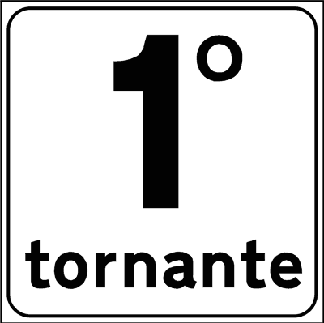

---

**2.** Il pannello raffigurato indica il numero progressivo di una curva pericolosa

- **الإجابة:** `VERO ✅ (صح)`
- 

---

**3.** Il pannello raffigurato indica il primo di una serie di tornanti (curve a raggio ridotto)

- **الإجابة:** `VERO ✅ (صح)`
- 

---

**4.** Il pannello raffigurato, in una serie di tornanti, ne indica il numero progressivo

- **الإجابة:** `VERO ✅ (صح)`
- 

---

**5.** Il pannello raffigurato indica una zona a circolazione rotatoria

- **الإجابة:** `FALSO ❌ (خطأ)`
- 

---

**6.** Il pannello raffigurato indica che fra un chilometro troveremo un tornante

- **الإجابة:** `FALSO ❌ (خطأ)`
- 

---

**7.** Il pannello raffigurato indica i chilometri da fare per poter tornare indietro

- **الإجابة:** `FALSO ❌ (خطأ)`
- 

---

**8.** Il pannello raffigurato indica il numero di incroci superati

- **الإجابة:** `FALSO ❌ (خطأ)`
- 

---

**9.** Il pannello raffigurato indica a quanti chilometri di distanza si trova il prossimo tornante

- **الإجابة:** `FALSO ❌ (خطأ)`
- 

---

**10.** Il pannello raffigurato indica il numero del cavalcavia

- **الإجابة:** `FALSO ❌ (خطأ)`
- 

---

## 📌 Direzione autocarri (10 domande)

**11.** Il segnale raffigurato indica la direzione consigliata per gli autocarri di massa complessiva a pieno carico superiore a 3,5 tonnellate

- **الإجابة:** `VERO ✅ (صح)`
- 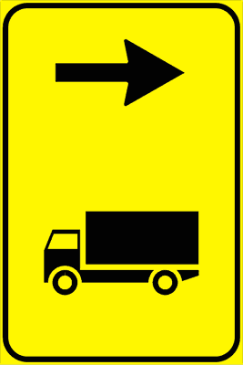

---

**12.** Il segnale raffigurato indica la categoria di veicoli a cui è consigliata la svolta

- **الإجابة:** `VERO ✅ (صح)`
- 

---

**13.** Il segnale raffigurato è installato nel punto della deviazione consigliata per autocarri che superano 3,5 tonnellate

- **الإجابة:** `VERO ✅ (صح)`
- 

---

**14.** Il segnale raffigurato può essere preceduto da un segnale di preavviso

- **الإجابة:** `VERO ✅ (صح)`
- 

---

**15.** Il segnale raffigurato si trova in vicinanza di un incrocio che precede un cantiere stradale

- **الإجابة:** `VERO ✅ (صح)`
- 

---

**16.** Il segnale raffigurato indica che è vietato svoltare a sinistra

- **الإجابة:** `FALSO ❌ (خطأ)`
- 

---

**17.** Il segnale raffigurato indica un'area di sosta per gli autocarri

- **الإجابة:** `FALSO ❌ (خطأ)`
- 

---

**18.** Il segnale raffigurato indica la direzione da seguire per arrivare in una discarica

- **الإجابة:** `FALSO ❌ (خطأ)`
- 

---

**19.** Il segnale raffigurato indica una strada a senso unico sulla destra, riservata solo agli autocarri

- **الإجابة:** `FALSO ❌ (خطأ)`
- 

---

**20.** Il segnale raffigurato obbliga gli autocarri a svoltare a destra

- **الإجابة:** `FALSO ❌ (خطأ)`
- 

---

## 📌 Lavori corso (10 domande)

**21.** Il segnale raffigurato preavvisa lavori in corso

- **الإجابة:** `VERO ✅ (صح)`
- 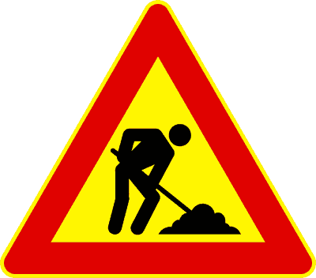

---

**22.** Il segnale raffigurato preavvisa cantieri di lavoro

- **الإجابة:** `VERO ✅ (صح)`
- 

---

**23.** Il segnale raffigurato preavvisa eventuali depositi temporanei di materiali o macchinari

- **الإجابة:** `VERO ✅ (صح)`
- 

---

**24.** Il segnale raffigurato preavvisa la eventuale presenza di uomini che lavorano presso o sulla carreggiata

- **الإجابة:** `VERO ✅ (صح)`
- 

---

**25.** Il segnale raffigurato può essere integrato da pannello che indica la lunghezza del cantiere

- **الإجابة:** `VERO ✅ (صح)`
- 

---

**26.** Il segnale raffigurato impone di dare la precedenza ai veicoli che escono dal cantiere

- **الإجابة:** `FALSO ❌ (خطأ)`
- 

---

**27.** Il segnale raffigurato preavvisa l'obbligo di dare la precedenza ai veicoli che provengono in senso opposto

- **الإجابة:** `FALSO ❌ (خطأ)`
- 

---

**28.** Il segnale raffigurato obbliga a invertire il senso di marcia nelle ore di lavoro degli operai

- **الإجابة:** `FALSO ❌ (خطأ)`
- 

---

**29.** Il segnale raffigurato obbliga a dare la precedenza agli addetti ai lavori

- **الإجابة:** `FALSO ❌ (خطأ)`
- 

---

**30.** Il segnale raffigurato preavvisa un senso unico alternato

- **الإجابة:** `FALSO ❌ (خطأ)`
- 

---

## 📌 Barriera normale (10 domande)

**31.** La barriera raffigurata segnala un'area occupata da un cantiere stradale

- **الإجابة:** `VERO ✅ (صح)`
- 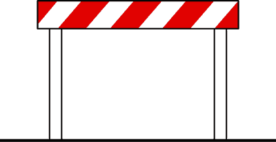

---

**32.** La barriera raffigurata delimita un'area dove si stanno svolgendo lavori stradali

- **الإجابة:** `VERO ✅ (صح)`
- 

---

**33.** La barriera raffigurata è posta ai bordi di un cantiere stradale

- **الإجابة:** `VERO ✅ (صح)`
- 

---

**34.** La barriera raffigurata può utilizzarsi nei passaggi a livello quando le sbarre sono guaste

- **الإجابة:** `VERO ✅ (صح)`
- 

---

**35.** La barriera raffigurata può essere integrata da lanterna a luce rossa fissa in caso di scarsa visibilità

- **الإجابة:** `VERO ✅ (صح)`
- 

---

**36.** La barriera raffigurata si trova all'ingresso di un'autorimessa

- **الإجابة:** `FALSO ❌ (خطأ)`
- 

---

**37.** La barriera raffigurata segnala un parcheggio riservato ai veicoli per lavori stradali

- **الإجابة:** `FALSO ❌ (خطأ)`
- 

---

**38.** La barriera raffigurata si trova nei caselli autostradali per delimitare le corsie

- **الإجابة:** `FALSO ❌ (خطأ)`
- 

---

**39.** La barriera raffigurata segnala una curva pericolosa

- **الإجابة:** `FALSO ❌ (خطأ)`
- 

---

**40.** Le barriere segnalano un percorso ciclabile

- **الإجابة:** `FALSO ❌ (خطأ)`
- 

---

## 📌 Cono delimitazione (9 domande)

**41.** Il cono raffigurato può delimitare zone di lavoro di breve durata

- **الإجابة:** `VERO ✅ (صح)`
- 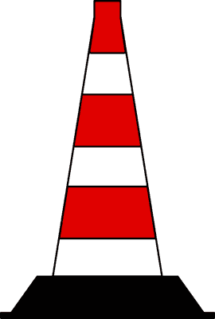

---

**42.** Il cono raffigurato si può usare per segnalare deviazioni provvisorie

- **الإجابة:** `VERO ✅ (صح)`
- 

---

**43.** Il cono raffigurato si può usare per indicare aree interessate da incidenti

- **الإجابة:** `VERO ✅ (صح)`
- 

---

**44.** Il cono raffigurato può indicare separazione provvisoria dei sensi di marcia

- **الإجابة:** `VERO ✅ (صح)`
- 

---

**45.** Il cono raffigurato si usa per indicare un parcheggio riservato

- **الإجابة:** `FALSO ❌ (خطأ)`
- 

---

**46.** Il cono raffigurato si può usare in presenza di lavori stradali superiori a 10 giorni

- **الإجابة:** `FALSO ❌ (خطأ)`
- 

---

**47.** Il cono raffigurato si usa su strade dove avvengono abbondanti nevicate

- **الإجابة:** `FALSO ❌ (خطأ)`
- 

---

**48.** Il cono raffigurato separa la carreggiata dalla pista ciclabile

- **الإجابة:** `FALSO ❌ (خطأ)`
- 

---

**49.** Il cono raffigurato indica un ostacolo posto fuori della carreggiata

- **الإجابة:** `FALSO ❌ (خطأ)`
- 

---

## 📌 Passaggio veicoli (9 domande)

**50.** Il segnale raffigurato può essere posto sui veicoli per lavori stradali, fermi o in lento movimento

- **الإجابة:** `VERO ✅ (صح)`
- 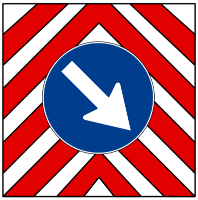

---

**51.** Il segnale raffigurato indica il lato dal quale il veicolo su cui è posto deve essere sorpassato

- **الإجابة:** `VERO ✅ (صح)`
- 

---

**52.** Il segnale raffigurato può essere posto sui veicoli per la manutenzione stradale in sosta sulla carreggiata

- **الإجابة:** `VERO ✅ (صح)`
- 

---

**53.** Il segnale raffigurato può essere posto su alcuni veicoli per lavori stradali, che procedono a bassa velocità

- **الإجابة:** `VERO ✅ (صح)`
- 

---

**54.** Il segnale raffigurato invita i conducenti a diminuire la velocità per la possibile presenza di veicoli fermi o in lento movimento

- **الإجابة:** `VERO ✅ (صح)`
- 

---

**55.** Il segnale raffigurato indica di sorpassare l'ostacolo sulla sinistra

- **الإجابة:** `FALSO ❌ (خطأ)`
- 

---

**56.** Il segnale raffigurato indica di svoltare subito a destra

- **الإجابة:** `FALSO ❌ (خطأ)`
- 

---

**57.** Il segnale raffigurato indica corsia di destra chiusa per manutenzione stradale

- **الإجابة:** `FALSO ❌ (خطأ)`
- 

---

**58.** Il segnale raffigurato obbliga a sostare a destra

- **الإجابة:** `FALSO ❌ (خطأ)`
- 

---

## 📌 Cantiere mobile (7 domande)

**59.** Il segnale raffigurato preavvisa un cantiere mobile con strettoia a sinistra

- **الإجابة:** `VERO ✅ (صح)`
- 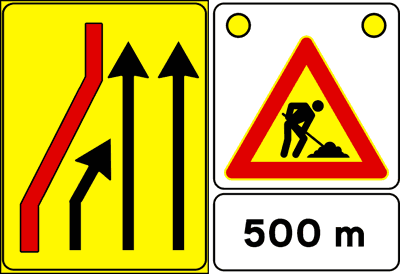

---

**60.** Il segnale raffigurato può essere installato su un veicolo per preavvisare un cantiere stradale

- **الإجابة:** `VERO ✅ (صح)`
- 

---

**61.** Il segnale raffigurato indica le corsie disponibili per la circolazione

- **الإجابة:** `VERO ✅ (صح)`
- 

---

**62.** Il segnale raffigurato indica una diminuzione da tre a due corsie

- **الإجابة:** `VERO ✅ (صح)`
- 

---

**63.** Il segnale raffigurato può essere completato con luci gialle lampeggianti

- **الإجابة:** `VERO ✅ (صح)`
- 

---

**64.** Il segnale raffigurato indica quanti veicoli possono transitare contemporaneamente

- **الإجابة:** `FALSO ❌ (خطأ)`
- 

---

**65.** Il segnale raffigurato indica una piazzola di sosta sul lato sinistro

- **الإجابة:** `FALSO ❌ (خطأ)`
- 

---

## 📌 Deviazione mezzi pesanti (10 domande)

**66.** Il segnale raffigurato indica ai veicoli di massa effettiva superiore a 7 tonnellate diretti a Lucca di cambiare strada

- **الإجابة:** `VERO ✅ (صح)`
- 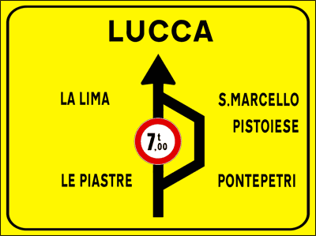

---

**67.** Il segnale raffigurato consente agli autocarri di massa a pieno carico inferiore a 7 tonnellate di proseguire diritto

- **الإجابة:** `VERO ✅ (صح)`
- 

---

**68.** Il segnale raffigurato non consente ai veicoli di massa effettiva superiore a 7 tonnellate diretti a Lucca di proseguire diritto

- **الإجابة:** `VERO ✅ (صح)`
- 

---

**69.** Il segnale raffigurato indica una limitazione di transito su un tratto di strada per i veicoli di massa effettiva superiore a 7 tonnellate

- **الإجابة:** `VERO ✅ (صح)`
- 

---

**70.** Il segnale raffigurato viene posto in vicinanza di un incrocio che anticipa un cantiere stradale

- **الإجابة:** `VERO ✅ (صح)`
- 

---

**71.** Il segnale raffigurato fa parte dei segnali temporanei per cantieri di lavoro sulla strada

- **الإجابة:** `VERO ✅ (صح)`
- 

---

**72.** Il segnale raffigurato indica, a tutti i veicoli, che non è possibile proseguire diritto per Lucca

- **الإجابة:** `FALSO ❌ (خطأ)`
- 

---

**73.** Il segnale raffigurato obbliga tutti i veicoli a svoltare a destra al bivio seguente

- **الإجابة:** `FALSO ❌ (خطأ)`
- 

---

**74.** Il segnale raffigurato vieta il sorpasso agli autoveicoli di massa totale superiore a 7 tonnellate

- **الإجابة:** `FALSO ❌ (خطأ)`
- 

---

**75.** Il segnale raffigurato vieta il transito ai veicoli che superano 7 metri di lunghezza

- **الإجابة:** `FALSO ❌ (خطأ)`
- 

---

## 📌 Corsia chiusa (11 domande)

**76.** Il segnale raffigurato indica la chiusura della corsia di destra per lavori in corso

- **الإجابة:** `VERO ✅ (صح)`
- 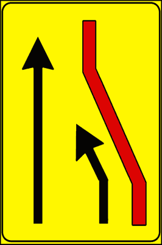

---

**77.** Il segnale raffigurato indica una diminuzione da due a una corsia di marcia

- **الإجابة:** `VERO ✅ (صح)`
- 

---

**78.** Il segnale raffigurato è posto in vicinanza di un cantiere stradale

- **الإجابة:** `VERO ✅ (صح)`
- 

---

**79.** Il segnale raffigurato può essere completato con pannello che indica la distanza dal punto di chiusura della corsia

- **الإجابة:** `VERO ✅ (صح)`
- 

---

**80.** Il segnale raffigurato indica restringimento della carreggiata per lavori in corso

- **الإجابة:** `VERO ✅ (صح)`
- 

---

**81.** Il segnale raffigurato indica la possibilità di sorpassare a destra

- **الإجابة:** `FALSO ❌ (خطأ)`
- 

---

**82.** Il segnale raffigurato preannuncia uno svincolo che consente l'inversione di marcia

- **الإجابة:** `FALSO ❌ (خطأ)`
- 

---

**83.** Il segnale raffigurato si trova in vicinanza di un incrocio

- **الإجابة:** `FALSO ❌ (خطأ)`
- 

---

**84.** Il segnale raffigurato indica una piazzola per la fermata degli autobus

- **الإجابة:** `FALSO ❌ (خطأ)`
- 

---

**85.** Il segnale raffigurato indica la chiusura della corsia per i veicoli lenti

- **الإجابة:** `FALSO ❌ (خطأ)`
- 

---

**86.** Il segnale raffigurato obbliga a dare la precedenza ai veicoli provenienti da destra

- **الإجابة:** `FALSO ❌ (خطأ)`
- 

---

## 📌 Corsie disponibili (9 domande)

**87.** Il segnale raffigurato, posto in presenza di lavori stradali, indica alle categorie di veicoli quali corsie possono occupare

- **الإجابة:** `VERO ✅ (صح)`
- 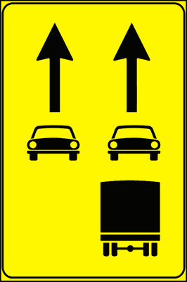

---

**88.** Il segnale raffigurato viene utilizzato per indicare l'uso delle corsie

- **الإجابة:** `VERO ✅ (صح)`
- 

---

**89.** Il segnale raffigurato indica ai veicoli su quali corsie debbono circolare

- **الإجابة:** `VERO ✅ (صح)`
- 

---

**90.** Il segnale raffigurato indica agli autocarri di massa complessiva superiore a 3,5 tonnellate quale corsia debbono percorrere

- **الإجابة:** `VERO ✅ (صح)`
- 

---

**91.** Il segnale raffigurato indica che gli autocarri di massa complessiva superiore a 3,5 tonnellate possono percorrere solo la corsia di destra

- **الإجابة:** `VERO ✅ (صح)`
- 

---

**92.** Il segnale raffigurato indica l'avvicinarsi di un casello autostradale

- **الإجابة:** `FALSO ❌ (خطأ)`
- 

---

**93.** Il segnale raffigurato obbliga gli autocarri a circolare per file parallele

- **الإجابة:** `FALSO ❌ (خطأ)`
- 

---

**94.** Il segnale raffigurato indica che gli autocarri debbono solo sorpassare a destra

- **الإجابة:** `FALSO ❌ (خطأ)`
- 

---

**95.** Il segnale raffigurato vieta ai motocicli di circolare sulla corsia di sinistra

- **الإجابة:** `FALSO ❌ (خطأ)`
- 

---

## 📌 Delineatori senso unico (10 domande)

**96.** I delineatori raffigurati sono usati ai lati della carreggiata di strade a senso unico

- **الإجابة:** `VERO ✅ (صح)`
- 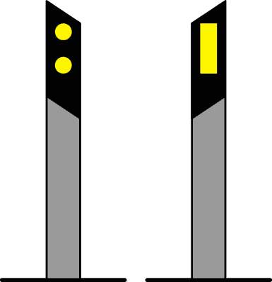

---

**97.** I delineatori raffigurati sono dei segnali complementari

- **الإجابة:** `VERO ✅ (صح)`
- 

---

**98.** I delineatori raffigurati sono posti ai margini di una strada o di una carreggiata a senso unico

- **الإجابة:** `VERO ✅ (صح)`
- 

---

**99.** I delineatori raffigurati servono a visualizzare meglio l'andamento della strada

- **الإجابة:** `VERO ✅ (صح)`
- 

---

**100.** I delineatori raffigurati sono posti su strada a doppio senso

- **الإجابة:** `FALSO ❌ (خطأ)`
- 

---

**101.** I delineatori raffigurati si trovano prima di un attraversamento pedonale

- **الإجابة:** `FALSO ❌ (خطأ)`
- 

---

**102.** I delineatori raffigurati sono posti al centro della carreggiata

- **الإجابة:** `FALSO ❌ (خطأ)`
- 

---

**103.** I delineatori raffigurati dividono la carreggiata in corsie

- **الإجابة:** `FALSO ❌ (خطأ)`
- 

---

**104.** I delineatori raffigurati sono posti per indicare un'area di sosta riservata

- **الإجابة:** `FALSO ❌ (خطأ)`
- 

---

**105.** I delineatori raffigurati sono visibili solo di notte

- **الإجابة:** `FALSO ❌ (خطأ)`
- 

---

## 📌 Delineatori margine (9 domande)

**106.** I delineatori raffigurati sono utili soprattutto nei casi di scarsa visibilità

- **الإجابة:** `VERO ✅ (صح)`
- 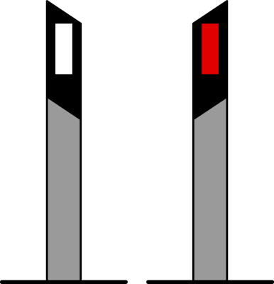

---

**107.** I delineatori raffigurati sono dei segnali complementari

- **الإجابة:** `VERO ✅ (صح)`
- 

---

**108.** I delineatori raffigurati sono posti ai margini di una strada a doppio senso

- **الإجابة:** `VERO ✅ (صح)`
- 

---

**109.** I delineatori raffigurati servono a visualizzare meglio l'andamento della strada

- **الإجابة:** `VERO ✅ (صح)`
- 

---

**110.** I delineatori raffigurati sono utili solo nelle ore notturne

- **الإجابة:** `FALSO ❌ (خطأ)`
- 

---

**111.** I delineatori raffigurati vengono posti a distanza di almeno 100 metri l’uno dall’altro

- **الإجابة:** `FALSO ❌ (خطأ)`
- 

---

**112.** I delineatori raffigurati sono posti al centro della carreggiata

- **الإجابة:** `FALSO ❌ (خطأ)`
- 

---

**113.** I delineatori raffigurati dividono la carreggiata in corsie

- **الإجابة:** `FALSO ❌ (خطأ)`
- 

---

**114.** I delineatori raffigurati sono posti ai lati della carreggiata nelle strade a senso unico

- **الإجابة:** `FALSO ❌ (خطأ)`
- 

---

## 📌 Delineatori gallerie (10 domande)

**115.** Il delineatore raffigurato è posto ai lati delle gallerie a senso unico

- **الإجابة:** `VERO ✅ (صح)`
- 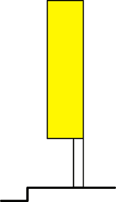

---

**116.** Il delineatore raffigurato è un segnale complementare posto nelle gallerie a senso unico

- **الإجابة:** `VERO ✅ (صح)`
- 

---

**117.** Il delineatore raffigurato si può trovare anche per evidenziare deviazioni o strettoie della carreggiata

- **الإجابة:** `VERO ✅ (صح)`
- 

---

**118.** Il delineatore raffigurato è un segnale complementare

- **الإجابة:** `VERO ✅ (صح)`
- 

---

**119.** Il delineatore raffigurato è usato per indicare un incrocio a senso unico

- **الإجابة:** `FALSO ❌ (خطأ)`
- 

---

**120.** Il delineatore raffigurato indica una strada chiusa

- **الإجابة:** `FALSO ❌ (خطأ)`
- 

---

**121.** Il delineatore raffigurato è posto al centro della carreggiata per indicare un ostacolo

- **الإجابة:** `FALSO ❌ (خطأ)`
- 

---

**122.** Il delineatore raffigurato divide la carreggiata in corsie

- **الإجابة:** `FALSO ❌ (خطأ)`
- 

---

**123.** Il delineatore raffigurato è un pannello distanziometrico posto vicino ad un passaggio a livello

- **الإجابة:** `FALSO ❌ (خطأ)`
- 

---

**124.** Il delineatore raffigurato ha luce propria

- **الإجابة:** `FALSO ❌ (خطأ)`
- 

---

## 📌 Delineatore montagna (10 domande)

**125.** Il delineatore raffigurato è posto ai lati della carreggiata nelle strade di montagna soggette ad innevamento

- **الإجابة:** `VERO ✅ (صح)`
- 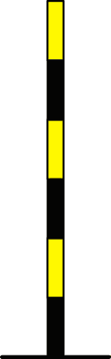

---

**126.** Il delineatore raffigurato è un segnale complementare

- **الإجابة:** `VERO ✅ (صح)`
- 

---

**127.** Il delineatore raffigurato è posto ai lati della carreggiata su strade di montagna

- **الإجابة:** `VERO ✅ (صح)`
- 

---

**128.** Il delineatore raffigurato viene utilizzato per rendere meglio visibili i bordi della carreggiata di una strada innevata

- **الإجابة:** `VERO ✅ (صح)`
- 

---

**129.** Il delineatore raffigurato è posto alla fermata degli autobus

- **الإجابة:** `FALSO ❌ (خطأ)`
- 

---

**130.** Il delineatore raffigurato è posto al centro della carreggiata

- **الإجابة:** `FALSO ❌ (خطأ)`
- 

---

**131.** Il delineatore raffigurato si trova in vicinanza di un attraversamento pedonale

- **الإجابة:** `FALSO ❌ (خطأ)`
- 

---

**132.** Il delineatore raffigurato è usato come paletto di ancoraggio per lasciare in sosta le biciclette

- **الإجابة:** `FALSO ❌ (خطأ)`
- 

---

**133.** Il delineatore raffigurato è usato sulle strade sprovviste di barriere laterali (guardrails)

- **الإجابة:** `FALSO ❌ (خطأ)`
- 

---

**134.** Il delineatore raffigurato indica un divieto di sosta

- **الإجابة:** `FALSO ❌ (خطأ)`
- 

---

## 📌 Delinatore curva stretta (11 domande)

**135.** Il delineatore raffigurato è posto nelle curve strette e con mancanza di visibilità

- **الإجابة:** `VERO ✅ (صح)`
- 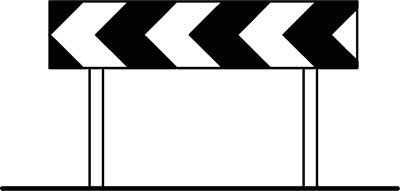

---

**136.** Il delineatore raffigurato si trova, di norma, dopo il segnale CURVA PERICOLOSA A SINISTRA

- **الإجابة:** `VERO ✅ (صح)`
- 

---

**137.** Il delineatore raffigurato, se di colore bianco e rosso, indica una curva provvisoria a sinistra

- **الإجابة:** `VERO ✅ (صح)`
- 

---

**138.** Il delineatore raffigurato è usato per segnalare una curva pericolosa

- **الإجابة:** `VERO ✅ (صح)`
- 

---

**139.** Il delineatore raffigurato invita il conducente a fare attenzione nel percorrere una curva

- **الإجابة:** `VERO ✅ (صح)`
- 

---

**140.** Il delineatore raffigurato indica un cantiere stradale

- **الإجابة:** `FALSO ❌ (خطأ)`
- 

---

**141.** Il delineatore raffigurato segnala una strada dove si trovano salite e discese

- **الإجابة:** `FALSO ❌ (خطأ)`
- 

---

**142.** Il delineatore raffigurato indica gli ostacoli sporgenti sulla carreggiata

- **الإجابة:** `FALSO ❌ (خطأ)`
- 

---

**143.** Il delineatore raffigurato segnala una curva pericolosa a destra

- **الإجابة:** `FALSO ❌ (خطأ)`
- 

---

**144.** Il delineatore raffigurato indica che si è vicini ad un passaggio a livello

- **الإجابة:** `FALSO ❌ (خطأ)`
- 

---

**145.** Il delineatore raffigurato viene posto solo su strade extraurbane principali

- **الإجابة:** `FALSO ❌ (خطأ)`
- 

---

## 📌 Delineatore incrocio t (10 domande)

**146.** Il delineatore raffigurato indica di svoltare a destra o a sinistra

- **الإجابة:** `VERO ✅ (صح)`
- 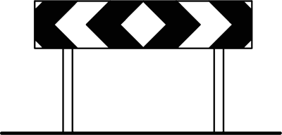

---

**147.** Il delineatore raffigurato ha le punte delle frecce che segnalano le direzioni possibili

- **الإجابة:** `VERO ✅ (صح)`
- 

---

**148.** Il delineatore raffigurato è installato ad un incrocio a forma di "T"

- **الإجابة:** `VERO ✅ (صح)`
- 

---

**149.** Il delineatore raffigurato è posto in un incrocio dove non è possibile proseguire diritto

- **الإجابة:** `VERO ✅ (صح)`
- 

---

**150.** Il delineatore raffigurato indica un passaggio a livello

- **الإجابة:** `FALSO ❌ (خطأ)`
- 

---

**151.** Il delineatore raffigurato indica un ponte mobile

- **الإجابة:** `FALSO ❌ (خطأ)`
- 

---

**152.** Il delineatore raffigurato indica una strada chiusa per lavori in corso

- **الإجابة:** `FALSO ❌ (خطأ)`
- 

---

**153.** Il delineatore raffigurato indica un aumento del numero di corsie della strada

- **الإجابة:** `FALSO ❌ (خطأ)`
- 

---

**154.** Il delineatore raffigurato indica una curva a senso unico

- **الإجابة:** `FALSO ❌ (خطأ)`
- 

---

**155.** Il delineatore raffigurato indica l'ingresso di una galleria

- **الإجابة:** `FALSO ❌ (خطأ)`
- 

---

## 📌 Delinatore modulare (9 domande)

**156.** Il delineatore raffigurato si trova in serie di più elementi per evidenziare una curva pericolosa

- **الإجابة:** `VERO ✅ (صح)`
- 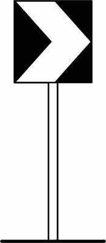

---

**157.** Il delineatore raffigurato è un segnale complementare

- **الإجابة:** `VERO ✅ (صح)`
- 

---

**158.** Il delineatore raffigurato è usato per migliorare la visibilità delle curve

- **الإجابة:** `VERO ✅ (صح)`
- 

---

**159.** Il delineatore raffigurato indica una curva pericolosa a destra

- **الإجابة:** `VERO ✅ (صح)`
- 

---

**160.** Il delineatore raffigurato indica una curva pericolosa a sinistra

- **الإجابة:** `FALSO ❌ (خطأ)`
- 

---

**161.** Il delineatore raffigurato si trova 150 metri prima di una curva

- **الإجابة:** `FALSO ❌ (خطأ)`
- 

---

**162.** Il delineatore raffigurato è posto all'ingresso di una galleria

- **الإجابة:** `FALSO ❌ (خطأ)`
- 

---

**163.** Il delineatore raffigurato viene usato nei passaggi a livello, quando le barriere sono guaste

- **الإجابة:** `FALSO ❌ (خطأ)`
- 

---

**164.** Il delineatore raffigurato si trova solo se la curva è su strada a senso unico

- **الإجابة:** `FALSO ❌ (خطأ)`
- 

---

## 📌 Preavviso semaforo (8 domande)

**165.** Il segnale raffigurato preavvisa un impianto semaforico in presenza di un cantiere stradale

- **الإجابة:** `VERO ✅ (صح)`
- 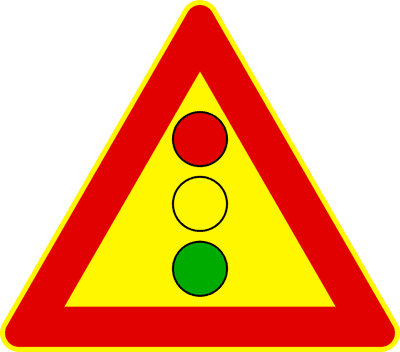

---

**166.** Il segnale raffigurato si può trovare sia su strade urbane che extraurbane

- **الإجابة:** `VERO ✅ (صح)`
- 

---

**167.** Il segnale raffigurato può essere posto prima del restringimento di carreggiata per lavori in corso

- **الإجابة:** `VERO ✅ (صح)`
- 

---

**168.** Nel segnale raffigurato il disco al centro è a luce gialla lampeggiante

- **الإجابة:** `VERO ✅ (صح)`
- 

---

**169.** Il segnale raffigurato preavvisa un semaforo che regola il traffico in transito su ponti mobili o girevoli

- **الإجابة:** `FALSO ❌ (خطأ)`
- 

---

**170.** Il segnale raffigurato preavvisa la presenza di un segnale di STOP

- **الإجابة:** `FALSO ❌ (خطأ)`
- 

---

**171.** Il segnale raffigurato preavvisa l'accesso al pontile d'imbarco delle navi traghetto

- **الإجابة:** `FALSO ❌ (خطأ)`
- 

---

**172.** Il segnale raffigurato preavvisa un attraversamento ferroviario senza barriere

- **الإجابة:** `FALSO ❌ (خطأ)`
- 

---

## 📌 Delineatore ostacolo (9 domande)

**173.** Il delineatore raffigurato viene utilizzato per segnalare un ostacolo

- **الإجابة:** `VERO ✅ (صح)`
- 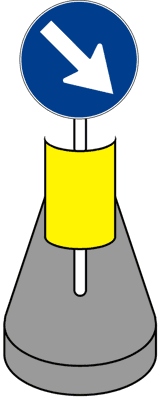

---

**174.** Il delineatore raffigurato viene posto all'interno della carreggiata, in presenza di un ostacolo

- **الإجابة:** `VERO ✅ (صح)`
- 

---

**175.** Il delineatore raffigurato è rifrangente, per una migliore visibilità nelle ore notturne

- **الإجابة:** `VERO ✅ (صح)`
- 

---

**176.** Il delineatore raffigurato può segnalare l'inizio di un'isola di traffico

- **الإجابة:** `VERO ✅ (صح)`
- 

---

**177.** Il delineatore raffigurato è dotato di luce propria

- **الإجابة:** `FALSO ❌ (خطأ)`
- 

---

**178.** Il delineatore raffigurato è posto ai lati della strada

- **الإجابة:** `FALSO ❌ (خطأ)`
- 

---

**179.** Il delineatore raffigurato divide la carreggiata da una pista ciclabile

- **الإجابة:** `FALSO ❌ (خطأ)`
- 

---

**180.** Il delineatore raffigurato presegnala una corsia riservata agli autobus o taxi

- **الإجابة:** `FALSO ❌ (خطأ)`
- 

---

**181.** Il delineatore raffigurato si trova fuori della carreggiata

- **الإجابة:** `FALSO ❌ (خطأ)`
- 

---

