# Capitolo 10 - Pannelli integrativi dei segnali
### اللوحات الإضافية

- 📁 **المجلد المحلي للباب:** `Capitolo_10_pannelli_integrativi`
- 📊 **إجمالي الأسئلة المعتمدة والمشروحة:** 263 سؤالاً وزارياً

## 📌 Pannelli distanza (9 domande)

**1.** Il pannello integrativo raffigurato, posto sotto un segnale di pericolo, indica la distanza tra il segnale ed il punto d'inizio del pericolo
- **الإجابة:** `VERO ✅ (صح)`
- 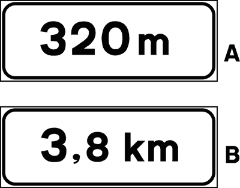
- **📖 الترجمة السياقية:** تشير اللوحة الإضافية المعروضة، عند وضعها أسفل إشارة خطر، إلى المسافة الفاصلة بين الإشارة ونقطة بداية الخطر.
- **💡 الشرح والقاعدة المرورية:** صحيح (VERO). اللوحة الإضافية التي تحتوي على رقم فقط بالأمتار أو الكيلومترات (بدون أسهم جانبية) هي لوحة مسافة (pannello di distanza)، وتحدد البعد المتبقي للوصول إلى الخطر.
- **⚠️ كشف الفخ:** فخ الامتحان: وجود الرقم بمفرده بدون أسهم يعني مسافة تفصلنا عن الخطر (distanza)، وليس طول مقطع الخطر.
- **🔑 الكلمات المفتاحية:** `{'it': 'pannello di distanza', 'ar': 'لوحة مسافة'}` | `{'it': 'distanza tra il segnale e il pericolo', 'ar': 'المسافة بين الإشارة والخطر'}` | `{'it': 'senza frecce', 'ar': 'بدون أسهم'}` | `{'it': 'vero', 'ar': 'صحيح'}`

---

**2.** Il pannello integrativo raffigurato può essere posto sotto i segnali per completarne il significato
- **الإجابة:** `VERO ✅ (صح)`
- 
- **📖 الترجمة السياقية:** يمكن وضع اللوحة الإضافية المعروضة أسفل الإشارات المرورية لاستكمال وتحديد معناها.
- **💡 الشرح والقاعدة المرورية:** صحيح (VERO). توضع لوحات المسافة الإضافية أسفل مختلف أنواع الإشارات (تحذير، منع، إلزام، إرشاد) لتحديد نقطة انطلاق سريان الإشارة.
- **⚠️ كشف الفخ:** فخ الامتحان: اللوحات الإضافية وظيفتها النظامية هي استكمال وتوضيح إشارات المرور.
- **🔑 الكلمات المفتاحية:** `{'it': 'pannello integrativo', 'ar': 'لوحة إضافية'}` | `{'it': 'completarne il significato', 'ar': 'استكمال معناها'}` | `{'it': 'vero', 'ar': 'صحيح'}`

---

**3.** Il pannello integrativo raffigurato, posto sotto un segnale di indicazione, serve a precisare la distanza che manca per raggiungere il punto indicato dal segnale
- **الإجابة:** `VERO ✅ (صح)`
- 
- **📖 الترجمة السياقية:** تُستخدم اللوحة الإضافية المعروضة، عند وضعها أسفل إشارة إرشادية، لتحديد المسافة المتبقية للوصول إلى النقطة التي تشير إليها الإشارة.
- **💡 الشرح والقاعدة المرورية:** صحيح (VERO). أسفل إشارات الإرشاد (مثل محطة وقود، مستشفى، موقف)، تحدد اللوحة البعد الدقيق المتبقي للوصول إلى ذلك المكان.
- **⚠️ كشف الفخ:** فخ الامتحان: اللوحة تبين المسافة المتبقية للوصول إلى المرفق المرشد عنه.
- **🔑 الكلمات المفتاحية:** `{'it': 'segnale di indicazione', 'ar': 'إشارة إرشادية'}` | `{'it': 'distanza che manca per raggiungere', 'ar': 'المسافة المتبقية للوصول'}` | `{'it': 'vero', 'ar': 'صحيح'}`

---

**4.** Il pannello integrativo raffigurato, posto sotto un segnale di obbligo o divieto, indica la distanza dalla quale inizia la prescrizione
- **الإجابة:** `VERO ✅ (صح)`
- 
- **📖 الترجمة السياقية:** تشير اللوحة الإضافية المعروضة، عند وضعها أسفل إشارة إلزام أو منع، إلى المسافة التي يبدأ بعدها سريان هذا الإلزام أو المنع.
- **💡 الشرح والقاعدة المرورية:** صحيح (VERO). إذا وضعت أسفل إشارة منع أو إلزام، فإنها تعمل كإشعار مسبق (preavviso) يفيد بأن القيد لا يبدأ من موضع الإشارة بل بعد المسافة المكتوبة.
- **⚠️ كشف الفخ:** فخ الامتحان: اللوحة تؤجل بداية سريان المنع أو الإلزام حتى قطع المسافة المحددة عليها.
- **🔑 الكلمات المفتاحية:** `{'it': 'segnale di obbligo o divieto', 'ar': 'إشارة إلزام أو منع'}` | `{'it': 'distanza dalla quale inizia la prescrizione', 'ar': 'المسافة التي يبدأ عندها القيد'}` | `{'it': 'vero', 'ar': 'صحيح'}`

---

**5.** Il pannello integrativo mostrato in figura A indica i metri di strada già fatta
- **الإجابة:** `FALSO ❌ (خطأ)`
- 
- **📖 الترجمة السياقية:** تشير اللوحة الإضافية الموضحة في الشكل (A) إلى عدد أمتار الطريق التي تم قطعها بالفعل.
- **💡 الشرح والقاعدة المرورية:** خطأ (FALSO). اللوحة تشير إلى المسافة المتبقية للأمام التي تفصلنا عن النقطة أو الخطر، ولا تحسب المسافة المقطوعة خلفنا.
- **⚠️ كشف الفخ:** فخ الامتحان: اللوحة للمسافة المستقبلية القادمة وليست لما تم قطعه سابقاً (strada già fatta).
- **🔑 الكلمات المفتاحية:** `{'it': 'metri di strada già fatta', 'ar': 'أمتار الطريق المقطوعة (فخ)'}` | `{'it': 'distanza da percorrere', 'ar': 'المسافة المتبقية'}` | `{'it': 'falso', 'ar': 'خطأ'}`

---

**6.** Il pannello integrativo raffigurato indica la pendenza di una strada
- **الإجابة:** `FALSO ❌ (خطأ)`
- 
- **📖 الترجمة السياقية:** تشير اللوحة الإضافية المعروضة إلى نسبة انحدار الطريق (pendenza).
- **💡 الشرح والقاعدة المرورية:** خطأ (FALSO). انحدار الطريق يشار إليه بشاخصة الخطر للمنحدر الخطير برقم ونسبة مئوية (مثل 10%)، ولا يشار إليه برقم أمتار في لوحة مسافة.
- **⚠️ كشف الفخ:** فخ الامتحان: انحدار الطريق يكتب بنسبة مئوية وليس بأمتار لوحة المسافة.
- **🔑 الكلمات المفتاحية:** `{'it': 'pendenza di una strada', 'ar': 'انحدار الطريق (فخ)'}` | `{'it': 'distanza in metri', 'ar': 'مسافة بالأمتار'}` | `{'it': 'falso', 'ar': 'خطأ'}`

---

**7.** Il pannello integrativo mostrato in figura A indica la distanza di sicurezza da mantenere dal veicolo che sta davanti
- **الإجابة:** `FALSO ❌ (خطأ)`
- 
- **📖 الترجمة السياقية:** تشير اللوحة الإضافية الموضحة في الشكل (A) إلى مسافة الأمان الواجب الحفاظ عليها من المركبة التي في الأمام.
- **💡 الشرح والقاعدة المرورية:** خطأ (FALSO). اللوحة تحدد بعد الخطر أو الإشارة، ولا تحدد مسافة الأمان بين المركبات (distanza di sicurezza).
- **⚠️ كشف الفخ:** فخ الامتحان: الخلط بين مسافة الوصول إلى الخطر ومسافة الأمان بين المركبات.
- **🔑 الكلمات المفتاحية:** `{'it': 'distanza di sicurezza', 'ar': 'مسافة الأمان (فخ)'}` | `{'it': 'distanza dal pericolo', 'ar': 'المسافة حتى الخطر'}` | `{'it': 'falso', 'ar': 'خطأ'}`

---

**8.** Il pannello integrativo raffigurato indica la larghezza di una strada
- **الإجابة:** `FALSO ❌ (خطأ)`
- 
- **📖 الترجمة السياقية:** تشير اللوحة الإضافية المعروضة إلى عرض الطريق (larghezza).
- **💡 الشرح والقاعدة المرورية:** خطأ (FALSO). عرض الطريق يوضح برمز قيود العرض (divieto di transito sagoma limite) بشاخصة دائرية ذات سهمين أفقيين، وليس برقم مجرد.
- **⚠️ كشف الفخ:** فخ الامتحان: اللوحة تشير إلى طول المسافة الفاصلة وليس عرض نهر الطريق.
- **🔑 الكلمات المفتاحية:** `{'it': 'larghezza di una strada', 'ar': 'عرض الطريق (فخ)'}` | `{'it': 'distanza', 'ar': 'مسافة'}` | `{'it': 'falso', 'ar': 'خطأ'}`

---

**9.** Il pannello integrativo raffigurato, posto sotto il segnale di pericolo, indica la lunghezza del tratto di strada pericoloso
- **الإجابة:** `FALSO ❌ (خطأ)`
- 
- **📖 الترجمة السياقية:** تشير اللوحة الإضافية المعروضة، عند وضعها أسفل إشارة الخطر، إلى طول امتداد المقطع الطرقي الخطر.
- **💡 الشرح والقاعدة المرورية:** خطأ (FALSO). طول امتداد المقطع الخطر يتطلب لوحة امتداد بسهمين عموديين جانبيين؛ أما هذه اللوحة الخالية من الأسهم فتشير فقط إلى المسافة حتى بداية الخطر.
- **⚠️ كشف الفخ:** فخ الامتحان: غياب الأسهم العمودية الجانبية يعني مسافة حتى الخطر (distanza) وليس طول مقطع الخطر (lunghezza).
- **🔑 الكلمات المفتاحية:** `{'it': 'lunghezza del tratto pericoloso', 'ar': 'طول المقطع الخطر (فخ لوحة الامتداد)'}` | `{'it': 'distanza di inizio', 'ar': 'مسافة البداية'}` | `{'it': 'falso', 'ar': 'خطأ'}`

---

## 📌 Pannelli estensione (10 domande)

**10.** Il pannello integrativo raffigurato, posto sotto un segnale di pericolo, indica la lunghezza del tratto di strada pericoloso
- **الإجابة:** `VERO ✅ (صح)`
- 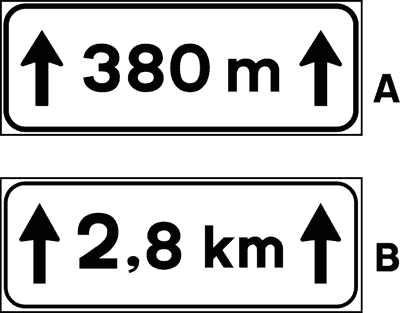
- **📖 الترجمة السياقية:** تشير اللوحة الإضافية المعروضة، عند وضعها أسفل إشارة خطر، إلى طول امتداد مقطع الطريق الخطر.
- **💡 الشرح والقاعدة المرورية:** صحيح (VERO). اللوحة الإضافية المزودة بسهمين عموديين متصاعدين على الجانبين هي لوحة امتداد (pannello di estesa)، وتحدد طول المقطع الخطر المستمر.
- **⚠️ كشف الفخ:** فخ الامتحان: وجود السهمين العموديين على الجانبين يميز لوحة الامتداد (estesa / lunghezza del tratto).
- **🔑 الكلمات المفتاحية:** `{'it': 'pannello di estesa', 'ar': 'لوحة امتداد'}` | `{'it': 'lunghezza del tratto', 'ar': 'طول المقطع'}` | `{'it': 'frecce laterali', 'ar': 'أسهم جانبية'}` | `{'it': 'vero', 'ar': 'صحيح'}`

---

**11.** Il pannello integrativo raffigurato, posto sotto un segnale di obbligo, indica la lunghezza del tratto stradale nel quale vale la prescrizione del segnale
- **الإجابة:** `VERO ✅ (صح)`
- 
- **📖 الترجمة السياقية:** تشير اللوحة الإضافية المعروضة، عند وضعها أسفل إشارة إلزام، إلى طول مقطع الطريق الذي يسري فيه قيد تلك الإشارة.
- **💡 الشرح والقاعدة المرورية:** صحيح (VERO). تفيد اللوحة بأن الإلزام أو الأمر المفروض بالإشارة سيبقى مستمراً وواجب التطبيق على امتداد المسافة الموضحة بالأمتار أو الكيلومترات.
- **⚠️ كشف الفخ:** فخ الامتحان: السهمان الجانبيان يحددان مسافة سريان القيد واستمراريته.
- **🔑 الكلمات المفتاحية:** `{'it': 'segnale di obbligo', 'ar': 'إشارة إلزام'}` | `{'it': 'lunghezza del tratto in cui vale la prescrizione', 'ar': 'طول المقطع الذي يسري فيه القيد'}` | `{'it': 'vero', 'ar': 'صحيح'}`

---

**12.** Il pannello integrativo raffigurato può essere posto sotto un segnale di divieto
- **الإجابة:** `VERO ✅ (صح)`
- 
- **📖 الترجمة السياقية:** يمكن وضع اللوحة الإضافية المعروضة أسفل إشارة منع.
- **💡 الشرح والقاعدة المرورية:** صحيح (VERO). توضع لوحة الامتداد بأسهمها الجانبية أسفل إشارات المنع (مثل منع التجاوز أو حد السرعة) لتحديد طول المسافة التي يستمر فيها تطبيق المنع.
- **⚠️ كشف الفخ:** فخ الامتحان: لوحة الامتداد صالحة للاستخدام أسفل إشارات المنع.
- **🔑 الكلمات المفتاحية:** `{'it': 'posto sotto un segnale di divieto', 'ar': 'توضع أسفل إشارة منع'}` | `{'it': 'estesa del divieto', 'ar': 'امتداد المنع'}` | `{'it': 'vero', 'ar': 'صحيح'}`

---

**13.** Il pannello integrativo raffigurato in figura B, posto sotto ad un segnale di pericolo, indica, in chilometri, la lunghezza del tratto di strada pericoloso
- **الإجابة:** `VERO ✅ (صح)`
- 
- **📖 الترجمة السياقية:** تشير اللوحة الإضافية المعروضة في الشكل (B)، عند وضعها أسفل إشارة خطر، إلى طول مقطع الطريق الخطر بالكيلومترات.
- **💡 الشرح والقاعدة المرورية:** صحيح (VERO). إذا كان الرقم متبوعاً بحرفي km وبجانبه سهمان عموديان، فهذا يعني امتداد واستمرار منطقة الخطر لمسافة هذا العدد من الكيلومترات.
- **⚠️ كشف الفخ:** فخ الامتحان: السهمان مع وحدة km يعبران عن طول المقطع الخطر بالكيلومتر.
- **🔑 الكلمات المفتاحية:** `{'it': 'in chilometri', 'ar': 'بالكيلومترات'}` | `{'it': 'lunghezza del tratto pericoloso', 'ar': 'طول المقطع الخطر'}` | `{'it': 'figura B', 'ar': 'الشكل B'}` | `{'it': 'vero', 'ar': 'صحيح'}`

---

**14.** Il segnale raffigurato indica la lunghezza di un tratto stradale con curve pericolose in successione
- **الإجابة:** `VERO ✅ (صح)`
- 
- **📖 الترجمة السياقية:** تشير الإشارة المعروضة إلى طول مقطع طرقي يحتوي على منعطفات خطرة متتالية.
- **💡 الشرح والقاعدة المرورية:** صحيح (VERO). عند اقتران شاخصة المنعطفات المتتالية بلوحة الامتداد ذات السهمين، فإنها تحدد المسافة الإجمالية التي تستمر فيها المنعطفات الخطرة.
- **⚠️ كشف الفخ:** فخ الامتحان: اقتران إشارة المنعطفات المزدوجة بلوحة الامتداد يحدد طول منطقة المنعطفات.
- **🔑 الكلمات المفتاحية:** `{'it': 'curve pericolose in successione', 'ar': 'منعطفات خطرة متتالية'}` | `{'it': 'lunghezza di un tratto', 'ar': 'طول المقطع'}` | `{'it': 'vero', 'ar': 'صحيح'}`

---

**15.** Il pannello integrativo rappresentato in figura A obbliga a proseguire diritto per 380 metri
- **الإجابة:** `FALSO ❌ (خطأ)`
- 
- **📖 الترجمة السياقية:** تلزم اللوحة الإضافية الموضحة في الشكل (A) بمواصلة السير للأمام مباشرة لمسافة 380 متراً.
- **💡 الشرح والقاعدة المرورية:** خطأ (FALSO). اللوحة لا تلزم بمتابعة السير للأمام، بل تحدد طول امتداد المقطع الخطر أو القيد المطبق بالإشارة العلوية.
- **⚠️ كشف الفخ:** فخ الامتحان: الأسهم الجانبية تعبر عن الامتداد والاستمرار ولا تفرض السير للأمام إجبارياً.
- **🔑 الكلمات المفتاحية:** `{'it': 'obbliga a proseguire diritto', 'ar': 'تلزم بالسير للأمام (فخ)'}` | `{'it': 'lunghezza', 'ar': 'طول امتداد'}` | `{'it': 'falso', 'ar': 'خطأ'}`

---

**16.** Il pannello integrativo rappresentato in figura A indica la distanza di sicurezza da mantenere in caso di pioggia
- **الإجابة:** `FALSO ❌ (خطأ)`
- 
- **📖 الترجمة السياقية:** تشير اللوحة الإضافية الموضحة في الشكل (A) إلى مسافة الأمان الواجب الحفاظ عليها في حالة هطول الأمطار.
- **💡 الشرح والقاعدة المرورية:** خطأ (FALSO). اللوحة تحدد طول امتداد المقطع الخطر وليس مسافة الأمان بين المركبات أثناء المطر.
- **⚠️ كشف الفخ:** فخ الامتحان: لا علاقة للوحة الامتداد بمسافة الأمان عند المطر.
- **🔑 الكلمات المفتاحية:** `{'it': 'distanza di sicurezza in caso di pioggia', 'ar': 'مسافة الأمان عند المطر (فخ)'}` | `{'it': 'estensione', 'ar': 'امتداد'}` | `{'it': 'falso', 'ar': 'خطأ'}`

---

**17.** Il pannello integrativo raffigurato indica la distanza tra il segnale e il punto d'inizio del pericolo
- **الإجابة:** `FALSO ❌ (خطأ)`
- 
- **📖 الترجمة السياقية:** تشير اللوحة الإضافية المعروضة إلى المسافة الفاصلة بين الإشارة ونقطة بداية الخطر.
- **💡 الشرح والقاعدة المرورية:** خطأ (FALSO). المسافة الفاصلة حتى بداية الخطر تمثلها لوحة المسافة بدون أسهم؛ بينما هذه اللوحة ذات السهمين تمثل طول امتداد الخطر نفسه.
- **⚠️ كشف الفخ:** فخ الامتحان: وجود السهمين العموديين يبطل معنى 'المسافة الفاصلة حتى البداية'؛ هي طول الامتداد.
- **🔑 الكلمات المفتاحية:** `{'it': 'distanza tra segnale e inizio', 'ar': 'المسافة حتى البداية (فخ لوحة المسافة)'}` | `{'it': 'estensione del tratto', 'ar': 'طول امتداد المقطع'}` | `{'it': 'falso', 'ar': 'خطأ'}`

---

**18.** Il segnale raffigurato indica la distanza tra il segnale e l'inizio della strada in cattivo stato
- **الإجابة:** `FALSO ❌ (خطأ)`
- 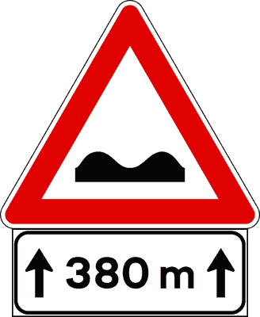
- **📖 الترجمة السياقية:** تشير الإشارة المعروضة إلى المسافة الفاصلة بين الإشارة وبداية الطريق الرديء.
- **💡 الشرح والقاعدة المرورية:** خطأ (FALSO). وجود السهمين الجانبيين يعني أن الطريق الرديء يمتد ويستمر على طول هذه المسافة، ولا يعني المسافة الفاصلة حتى بدايته.
- **⚠️ كشف الفخ:** فخ الامتحان: السهمان يعنيان امتداد الطريق السيئ وليس المسافة المتبقية للوصول إليه.
- **🔑 الكلمات المفتاحية:** `{'it': 'distanza tra segnale e inizio strada dissestata', 'ar': 'المسافة حتى بداية الطريق الرديء (فخ)'}` | `{'it': 'falso', 'ar': 'خطأ'}`

---

**19.** Il pannello integrativo raffigurato in figura A indica l’altezza di un viadotto
- **الإجابة:** `FALSO ❌ (خطأ)`
- 
- **📖 الترجمة السياقية:** تشير اللوحة الإضافية المعروضة في الشكل (A) إلى ارتفاع جسر علوي (viadotto).
- **💡 الشرح والقاعدة المرورية:** خطأ (FALSO). ارتفاع الجسور يعلن عنه بشاخصة دائرية ذات سهمين رأسيين يحددان أقصى ارتفاع مسموح به بالمتر، ولا يشار إليه بلوحة امتداد بالأمتار.
- **⚠️ كشف الفخ:** فخ الامتحان: لا علاقة للوحة الامتداد بارتفاع الجسور والأنفاق.
- **🔑 الكلمات المفتاحية:** `{'it': 'altezza di un viadotto', 'ar': 'ارتفاع جسر علوي (فخ)'}` | `{'it': 'sagoma limite altezza', 'ar': 'الحد الأقصى للارتفاع'}` | `{'it': 'falso', 'ar': 'خطأ'}`

---

## 📌 Fascia oraria (9 domande)

**20.** Il segnale raffigurato vieta la sosta dalle ore 7.30 alle ore 19.00
- **الإجابة:** `VERO ✅ (صح)`
- 
- **📖 الترجمة السياقية:** تمنع الإشارة المعروضة الوقوف والركن من الساعة 7:30 صباحاً حتى الساعة 19:00 مساءً.
- **💡 الشرح والقاعدة المرورية:** صحيح (VERO). اللوحة الإضافية الخالية من الرموز (بدون صلبان وبدون مطارق) تحدد أوقات سريان منع الوقوف في جميع أيام الأسبوع دون تمييز.
- **⚠️ كشف الفخ:** فخ الامتحان: عدم وجود رموز عطلات أو عمل يعني سريان المنع في الساعات المحددة طوال أيام الأسبوع.
- **🔑 الكلمات المفتاحية:** `{'it': 'vieta la sosta', 'ar': 'تمنع الوقوف'}` | `{'it': 'dalle ore 7.30 alle 19.00', 'ar': 'من 7:30 إلى 19:00'}` | `{'it': 'tutti i giorni', 'ar': 'كافة الأيام'}` | `{'it': 'vero', 'ar': 'صحيح'}`

---

**21.** Il segnale raffigurato vieta il transito dalle ore 7.30 alle 19.00
- **الإجابة:** `VERO ✅ (صح)`
- 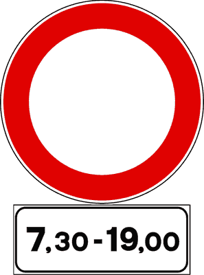
- **📖 الترجمة السياقية:** تمنع الإشارة المعروضة المرور من الساعة 7:30 صباحاً حتى الساعة 19:00 مساءً.
- **💡 الشرح والقاعدة المرورية:** صحيح (VERO). عند اقتران شاخصة منع المرور بلوحة النطاق الزمني، يسري حظر المرور فقط خلال الساعات المكتوبة على اللوحة.
- **⚠️ كشف الفخ:** فخ الامتحان: منع المرور مقيد بالنطاق الزمني المكتوب.
- **🔑 الكلمات المفتاحية:** `{'it': 'vieta il transito', 'ar': 'تمنع المرور'}` | `{'it': 'fascia oraria', 'ar': 'النطاق الزمني'}` | `{'it': 'vero', 'ar': 'صحيح'}`

---

**22.** Il pannello integrativo (A), posto sotto il segnale (B), vieta il transito ai pedoni nelle sole ore indicate
- **الإجابة:** `VERO ✅ (صح)`
- 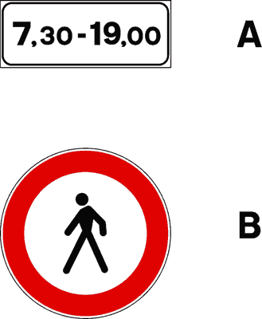
- **📖 الترجمة السياقية:** تمنع اللوحة الإضافية (A)، عند وضعها أسفل الإشارة (B)، مرور المشاة في الساعات الموضحة فقط.
- **💡 الشرح والقاعدة المرورية:** صحيح (VERO). تقيد اللوحة سريان منع مرور المشاة بالساعات المحددة فقط، ويجوز لهم المرور خارج هذا النطاق الزمني.
- **⚠️ كشف الفخ:** فخ الامتحان: كلمة 'nelle sole ore indicate' صحيحة تماماً لأن اللوحة تحدد فترة الحظر حصراً.
- **🔑 الكلمات المفتاحية:** `{'it': 'vieta il transito ai pedoni', 'ar': 'تمنع مرور المشاة'}` | `{'it': 'nelle sole ore indicate', 'ar': 'في الساعات المحددة فقط'}` | `{'it': 'vero', 'ar': 'صحيح'}`

---

**23.** Il pannello integrativo rappresentato in figura B indica le ore di tutti i giorni nelle quali vale il segnale
- **الإجابة:** `VERO ✅ (صح)`
- 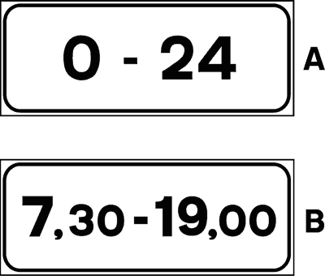
- **📖 الترجمة السياقية:** تشير اللوحة الإضافية الموضحة في الشكل (B) إلى ساعات جميع الأيام التي تسري خلالها الإشارة.
- **💡 الشرح والقاعدة المرورية:** صحيح (VERO). غياب رمزي العطلة والعمل يعني سريان التوقيت طوال أيام الأسبوع بلا استثناء (tutti i giorni).
- **⚠️ كشف الفخ:** فخ الامتحان: اللوحة الخالية من الرموز تسري يومياً (tutti i giorni).
- **🔑 الكلمات المفتاحية:** `{'it': 'ore di tutti i giorni', 'ar': 'ساعات جميع الأيام'}` | `{'it': 'fascia oraria continua', 'ar': 'نطاق زمني يومي'}` | `{'it': 'vero', 'ar': 'صحيح'}`

---

**24.** Il segnale raffigurato consente il transito ai motocicli nelle sole ore indicate
- **الإجابة:** `FALSO ❌ (خطأ)`
- 
- **📖 الترجمة السياقية:** تسمح الإشارة المعروضة بمرور الدراجات النارية في الساعات الموضحة فقط.
- **💡 الشرح والقاعدة المرورية:** خطأ (FALSO). الإشارة تمنع المرور في تلك الساعات ولا تسمح به؛ فاللوحة تحدد ساعات المنع وليس ساعات السماح.
- **⚠️ كشف الفخ:** فخ الامتحان: اللوحة تقيد المنع وليس الإذن؛ فالمرور محظور في تلك الساعات.
- **🔑 الكلمات المفتاحية:** `{'it': 'consente il transito nelle sole ore', 'ar': 'تسمح بالمرور في تلك الساعات فقط (فخ)'}` | `{'it': 'vieta il transito', 'ar': 'تمنع المرور'}` | `{'it': 'falso', 'ar': 'خطأ'}`

---

**25.** Il segnale raffigurato indica che il clacson può essere usato dalle ore 7.30 alle ore 19.00
- **الإجابة:** `FALSO ❌ (خطأ)`
- 
- **📖 الترجمة السياقية:** تشير الإشارة المعروضة إلى إمكانية استخدام آلة التنبيه الصوتية (البوق) من الساعة 7:30 حتى 19:00.
- **💡 الشرح والقاعدة المرورية:** خطأ (FALSO). اللوحة تنظم أوقات المنع أو الركن ولا علاقة لها بقواعد استخدام الكلاكس أو التنبيه الصوتي.
- **⚠️ كشف الفخ:** فخ الامتحان: لا علاقة للوحة بنظام استخدام الزامور.
- **🔑 الكلمات المفتاحية:** `{'it': 'clacson può essere usato', 'ar': 'استخدام البوق مسموح (فخ)'}` | `{'it': 'falso', 'ar': 'خطأ'}`

---

**26.** Il segnale raffigurato indica l’orario di apertura di una zona a traffico limitato
- **الإجابة:** `FALSO ❌ (خطأ)`
- 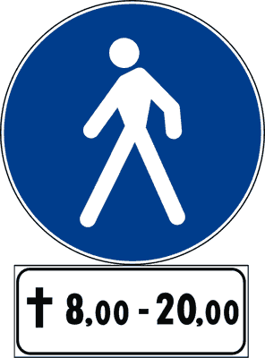
- **📖 الترجمة السياقية:** تشير الإشارة المعروضة إلى مواعيد فتح منطقة ذات حركة مرور محددة (ZTL).
- **💡 الشرح والقاعدة المرورية:** خطأ (FALSO). مواعيد مناطق ZTL تعلن عنها شواخص خاصة بمنطقة المرور المحددة بحدودها وإلكترونياتها، ولا تمثلها هذه اللوحة المفردة.
- **⚠️ كشف الفخ:** فخ الامتحان: الإشارة ليست لوحة لمنطقة المرور المحددة ZTL.
- **🔑 الكلمات المفتاحية:** `{'it': 'apertura di una zona a traffico limitato', 'ar': 'مواعيد فتح منطقة ZTL (فخ)'}` | `{'it': 'falso', 'ar': 'خطأ'}`

---

**27.** Il pannello integrativo rappresentato in figura B indica in quali ore si può circolare a fari spenti
- **الإجابة:** `FALSO ❌ (خطأ)`
- 
- **📖 الترجمة السياقية:** تشير اللوحة الإضافية الموضحة في الشكل (B) إلى الساعات التي يجوز فيها السير بأضواء مطفأة.
- **💡 الشرح والقاعدة المرورية:** خطأ (FALSO). السير بأضواء مطفأة نهاراً أو ليلاً تحكمه قواعد استخدام الأضواء العامة في كود السير، ولا توجد لوحة تسمح بإطفاء الأضواء.
- **⚠️ كشف الفخ:** فخ الامتحان: لا توجد إشارة تحدد ساعات القيادة بأضواء مطفأة.
- **🔑 الكلمات المفتاحية:** `{'it': 'circolare a fari spenti', 'ar': 'السير بأضواء مطفأة (فخ)'}` | `{'it': 'obbligo luci', 'ar': 'إلزام الأضواء'}` | `{'it': 'falso', 'ar': 'خطأ'}`

---

**28.** Il pannello integrativo rappresentato in figura B indica le fasce orarie durante le quali si circola a targhe alterne
- **الإجابة:** `FALSO ❌ (خطأ)`
- 
- **📖 الترجمة السياقية:** تشير اللوحة الإضافية الموضحة في الشكل (B) إلى الفترات الزمنية التي يسري فيها السير بنظام اللوحات الزوجية والفردية (targhe alterne).
- **💡 الشرح والقاعدة المرورية:** خطأ (FALSO). السير بنظام الأرقام التبادلية للوحات السيارات ينظم بشاخصات بيئية وتوجيهية خاصة، ولا تدل عليه هذه اللوحة الزمنية العامة.
- **⚠️ كشف الفخ:** فخ الامتحان: اللوحة لا تتعلق بنظام اللوحات التبادلية للتلوث.
- **🔑 الكلمات المفتاحية:** `{'it': 'targhe alterne', 'ar': 'لوحات زوجية وفردية (فخ)'}` | `{'it': 'fascia oraria ordinaria', 'ar': 'نطاق زمني عادي'}` | `{'it': 'falso', 'ar': 'خطأ'}`

---

## 📌 Fascia oraria giorni festivi (12 domande)

**29.** Il pannello integrativo raffigurato limita la validità del segnale sotto cui è posto ai giorni festivi e alla fascia oraria indicata
- **الإجابة:** `VERO ✅ (صح)`
- 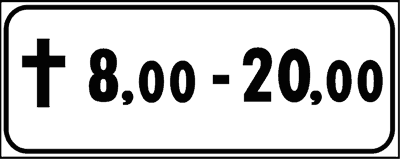
- **📖 الترجمة السياقية:** تقيد اللوحة الإضافية المعروضة سريان الإشارة الموضوعة تحتها بأيام العطلات (giorni festivi) وبالفترة الزمنية الموضحة.
- **💡 الشرح والقاعدة المرورية:** صحيح (VERO). رمز الصليب اللاتيني يرمز رسمياً لأيام العطلات الرسمية والآحاد (giorni festivi)؛ وبالتالي يسري مفعول الإشارة حصراً في أيام العطلات وخلال الساعات المكتوبة.
- **⚠️ كشف الفخ:** فخ الامتحان: رمز الصليب يعني حصراً أيام الآحاد والعطلات الرسمية (giorni festivi).
- **🔑 الكلمات المفتاحية:** `{'it': 'giorni festivi', 'ar': 'أيام العطلات والأعياد'}` | `{'it': 'simbolo della croce', 'ar': 'رمز الصليب (عطلات)'}` | `{'it': 'fascia oraria', 'ar': 'النطاق الزمني'}` | `{'it': 'vero', 'ar': 'صحيح'}`

---

**30.** Il pannello integrativo raffigurato, posto sotto un segnale di prescrizione, precisa che il segnale vale solo nei giorni festivi e nelle fasce orarie indicate
- **الإجابة:** `VERO ✅ (صح)`
- 
- **📖 الترجمة السياقية:** توضح اللوحة الإضافية المعروضة، عند وضعها أسفل إشارة تنظيمية، أن الإشارة تسري فقط في أيام العطلات وفي الفترات الزمنية الموضحة.
- **💡 الشرح والقاعدة المرورية:** صحيح (VERO). وجود رمز العطلات يقصر إلزام أو منع الإشارة على أيام الإجازات الأسبوعية والرسمية وضمن الساعات المحددة فقط.
- **⚠️ كشف الفخ:** فخ الامتحان: الإشارة لا تسري في أيام العمل العادية بل في العطلات فقط.
- **🔑 الكلمات المفتاحية:** `{'it': 'solo nei giorni festivi', 'ar': 'فقط في أيام العطلات'}` | `{'it': 'segnale di prescrizione', 'ar': 'إشارة تنظيمية'}` | `{'it': 'vero', 'ar': 'صحيح'}`

---

**31.** Il segnale raffigurato consente il transito nei giorni festivi e nelle fasce orarie indicate ai soli pedoni
- **الإجابة:** `VERO ✅ (صح)`
- 
- **📖 الترجمة السياقية:** تسمح الإشارة المعروضة بالمرور في أيام العطلات وفي الفترات الزمنية الموضحة للمشاة فقط.
- **💡 الشرح والقاعدة المرورية:** صحيح (VERO). عند اقتران شاخصة مسلك المشاة (أو منطقة المشاة) بهذه اللوحة، يُسمح بمرور المشاة فقط في تلك الأوقات مع حظر المركبات.
- **⚠️ كشف الفخ:** فخ الامتحان: مسار المشاة المقترن بلوحة العطلات يخصص للمشاة فقط في أوقات الإجازات.
- **🔑 الكلمات المفتاحية:** `{'it': 'ai soli pedoni', 'ar': 'للمشاة فقط'}` | `{'it': 'nei giorni festivi', 'ar': 'في أيام العطلات'}` | `{'it': 'vero', 'ar': 'صحيح'}`

---

**32.** Il segnale raffigurato vieta la sosta nella fascia oraria indicata, dei giorni festivi
- **الإجابة:** `VERO ✅ (صح)`
- 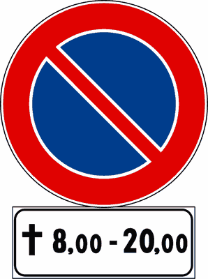
- **📖 الترجمة السياقية:** تمنع الإشارة المعروضة الوقوف والركن في الفترة الزمنية الموضحة من أيام العطلات.
- **💡 الشرح والقاعدة المرورية:** صحيح (VERO). شاخصة منع الوقوف المقترنة برمز العطلات تحظر ركن السيارات حصراً في أيام الآحاد والعطلات خلال الساعات المحددة (مثلاً من 8 إلى 20).
- **⚠️ كشف الفخ:** فخ الامتحان: منع الوقوف يسري فقط في العطلات وخلال الساعات المكتوبة.
- **🔑 الكلمات المفتاحية:** `{'it': 'vieta la sosta nei giorni festivi', 'ar': 'تمنع الوقوف في أيام العطلات'}` | `{'it': 'fascia oraria indicata', 'ar': 'الفترة الزمنية المحددة'}` | `{'it': 'vero', 'ar': 'صحيح'}`

---

**33.** Il segnale raffigurato consente il transito dalle ore 8.00 alle ore 20.00 dei giorni festivi ai soli ciclisti
- **الإجابة:** `VERO ✅ (صح)`
- 
- **📖 الترجمة السياقية:** تسمح الإشارة المعروضة بالمرور من الساعة 8:00 حتى 20:00 في أيام العطلات لراكبي الدراجات الهوائية فقط.
- **💡 الشرح والقاعدة المرورية:** صحيح (VERO). عند اقتران شاخصة مسار الدراجات بهذه اللوحة، تقتصر إتاحة المسلك للدراجين في أيام العطلات والساعات المذكورة.
- **⚠️ كشف الفخ:** فخ الامتحان: تخصيص المسلك للدراجين في العطلات صحيح مع شاخصة الدراجات.
- **🔑 الكلمات المفتاحية:** `{'it': 'ai soli ciclisti', 'ar': 'للدراجين فقط'}` | `{'it': 'giorni festivi 8.00 - 20.00', 'ar': 'العطلات من 8 إلى 20'}` | `{'it': 'vero', 'ar': 'صحيح'}`

---

**34.** Il segnale raffigurato vieta il transito dalle ore 8.00 alle ore 20.00 dei giorni festivi
- **الإجابة:** `VERO ✅ (صح)`
- 
- **📖 الترجمة السياقية:** تمنع الإشارة المعروضة المرور من الساعة 8:00 حتى 20:00 في أيام العطلات.
- **💡 الشرح والقاعدة المرورية:** صحيح (VERO). شاخصة منع المرور المرفقة بهذه اللوحة تحظر دخول وحركة كافة المركبات في أيام العطلات خلال الساعات المحددة.
- **⚠️ كشف الفخ:** فخ الامتحان: منع المرور مقيد بالعطلات والساعات المحددة.
- **🔑 الكلمات المفتاحية:** `{'it': 'vieta il transito', 'ar': 'تمنع المرور'}` | `{'it': 'dalle 8.00 alle 20.00 festivi', 'ar': 'من 8 إلى 20 في العطلات'}` | `{'it': 'vero', 'ar': 'صحيح'}`

---

**35.** Il pannello integrativo raffigurato indica l'orario d'ingresso nel cimitero
- **الإجابة:** `FALSO ❌ (خطأ)`
- 
- **📖 الترجمة السياقية:** تشير اللوحة الإضافية المعروضة إلى مواعيد الدخول إلى المقبرة (cimitero).
- **💡 الشرح والقاعدة المرورية:** خطأ (FALSO). رمز الصليب في قانون السير رمز دولي لأيام الآحاد والعطلات الدينية والرسمية (festivi)، ولا علاقة له بمداخل المقابر.
- **⚠️ كشف الفخ:** فخ الامتحان: الصليب يرمز ليوم العطلة (الأحد) وليس إلى المقابر.
- **🔑 الكلمات المفتاحية:** `{'it': 'ingresso nel cimitero', 'ar': 'دخول المقبرة (فخ الصليب)'}` | `{'it': 'giorni festivi', 'ar': 'أيام العطلات'}` | `{'it': 'falso', 'ar': 'خطأ'}`

---

**36.** Il pannello integrativo raffigurato indica l'orario di apertura delle chiese
- **الإجابة:** `FALSO ❌ (خطأ)`
- 
- **📖 الترجمة السياقية:** تشير اللوحة الإضافية المعروضة إلى مواعيد فتح الكنائس (chiese).
- **💡 الشرح والقاعدة المرورية:** خطأ (FALSO). اللوحة تنظيمية للمرور في أيام العطلات ولا تعلن عن مواعيد فتح الكنائس أو دور العبادة.
- **⚠️ كشف الفخ:** فخ الامتحان: رمز الصليب ليس لافتة لمواعيد فتح الكنائس.
- **🔑 الكلمات المفتاحية:** `{'it': 'apertura delle chiese', 'ar': 'فتح الكنائس (فخ)'}` | `{'it': 'falso', 'ar': 'خطأ'}`

---

**37.** Il pannello integrativo raffigurato indica l'orario di celebrazione delle funzioni religiose
- **الإجابة:** `FALSO ❌ (خطأ)`
- 
- **📖 الترجمة السياقية:** تشير اللوحة الإضافية المعروضة إلى مواعيد إقامة الصلوات والشعائر الدينية.
- **💡 الشرح والقاعدة المرورية:** خطأ (FALSO). قانون المرور لا ينظم مواعيد الصلوات؛ واللوحة تحدد سريان قيود السير في أيام العطلات الرسمية.
- **⚠️ كشف الفخ:** فخ الامتحان: لا علاقة للوحة بمواعيد الصلوات والقداسات.
- **🔑 الكلمات المفتاحية:** `{'it': 'funzioni religiose', 'ar': 'شعائر دينية (فخ)'}` | `{'it': 'falso', 'ar': 'خطأ'}`

---

**38.** Il segnale raffigurato indica che si può parcheggiare tutti i giorni nella fascia oraria indicata
- **الإجابة:** `FALSO ❌ (خطأ)`
- 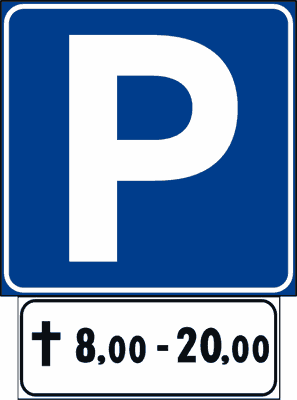
- **📖 الترجمة السياقية:** تشير الإشارة المعروضة إلى إمكانية ركن السيارات في جميع الأيام خلال الفترة الزمنية الموضحة.
- **💡 الشرح والقاعدة المرورية:** خطأ (FALSO). وجود رمز الصليب يقصر سريان الإشارة على أيام العطلات فقط، ولا تسري في جميع الأيام (tutti i giorni).
- **⚠️ كشف الفخ:** فخ الامتحان: كلمة 'tutti i giorni' خاطئة؛ فاللوحة مخصصة لأيام العطلات فقط.
- **🔑 الكلمات المفتاحية:** `{'it': 'tutti i giorni', 'ar': 'جميع الأيام (فخ)'}` | `{'it': 'solo festivi', 'ar': 'العطلات فقط'}` | `{'it': 'falso', 'ar': 'خطأ'}`

---

**39.** Il pannello integrativo raffigurato vale nei giorni lavorativi
- **الإجابة:** `FALSO ❌ (خطأ)`
- 
- **📖 الترجمة السياقية:** تسري اللوحة الإضافية المعروضة في أيام العمل الرسمية (giorni lavorativi).
- **💡 الشرح والقاعدة المرورية:** خطأ (FALSO). اللوحة تسري في أيام العطلات (festivi)؛ بينما أيام العمل يرمز لها بمطرقتين متقاطعتين.
- **⚠️ كشف الفخ:** فخ الامتحان: الصليب = عطلات (festivi)؛ المطرقتان = أيام عمل (lavorativi).
- **🔑 الكلمات المفتاحية:** `{'it': 'giorni lavorativi', 'ar': 'أيام العمل (فخ)'}` | `{'it': 'giorni festivi', 'ar': 'أيام العطلات'}` | `{'it': 'falso', 'ar': 'خطأ'}`

---

**40.** Il segnale raffigurato consente il transito dei motocicli la domenica dalle ore 8.00 alle ore 20.00
- **الإجابة:** `FALSO ❌ (خطأ)`
- 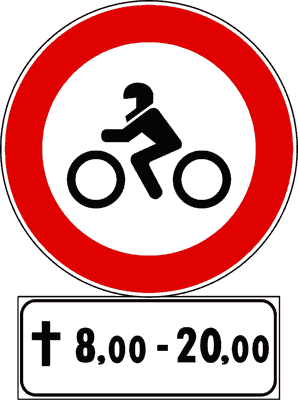
- **📖 الترجمة السياقية:** تسمح الإشارة المعروضة بمرور الدراجات النارية يوم الأحد من الساعة 8:00 حتى 20:00.
- **💡 الشرح والقاعدة المرورية:** خطأ (FALSO). الإشارة إذا كانت منع مرور فإنها تمنع الدراجات النارية في تلك الساعات من يوم الأحد، ولا تسمح لها.
- **⚠️ كشف الفخ:** فخ الامتحان: اللوحة تفرض منعاً في أوقات العطلة ولا تبيح المرور.
- **🔑 الكلمات المفتاحية:** `{'it': 'consente il transito dei motocicli', 'ar': 'تسمح بمرور الدراجات النارية (فخ)'}` | `{'it': 'divieto', 'ar': 'منع'}` | `{'it': 'falso', 'ar': 'خطأ'}`

---

## 📌 Fascia oraria giorni lavorativi (12 domande)

**41.** Il pannello integrativo raffigurato, posto sotto un segnale, ne limita la validità nei giorni lavorativi e alle fasce orarie indicate
- **الإجابة:** `VERO ✅ (صح)`
- 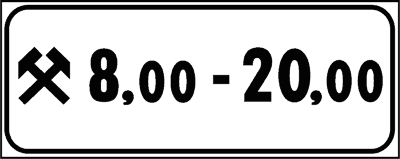
- **📖 الترجمة السياقية:** تقيد اللوحة الإضافية المعروضة، عند وضعها أسفل إشارة، سريانها بأيام العمل الرسمية (giorni lavorativi) وبالفترات الزمنية الموضحة.
- **💡 الشرح والقاعدة المرورية:** صحيح (VERO). رمز المطرقتين المتقاطعتين يرمز حصراً لأيام العمل من الاثنين إلى السبت (giorni lavorativi)، ويسري مفعول الإشارة خلال الساعات المحددة فيها فقط.
- **⚠️ كشف الفخ:** فخ الامتحان: المطرقتان المتقاطعتان ترمزان لأيام العمل (giorni lavorativi).
- **🔑 الكلمات المفتاحية:** `{'it': 'giorni lavorativi', 'ar': 'أيام العمل'}` | `{'it': 'martelli incrociati', 'ar': 'مطرقتان متقاطعتان'}` | `{'it': 'fasce orarie', 'ar': 'فترات زمنية'}` | `{'it': 'vero', 'ar': 'صحيح'}`

---

**42.** Il segnale raffigurato vieta il transito nella fascia oraria indicata, dei giorni lavorativi
- **الإجابة:** `VERO ✅ (صح)`
- 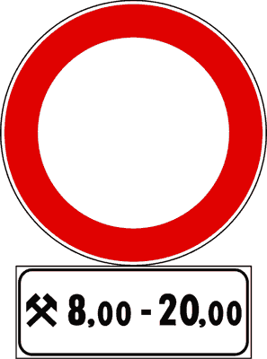
- **📖 الترجمة السياقية:** تمنع الإشارة المعروضة المرور في الفترة الزمنية الموضحة من أيام العمل.
- **💡 الشرح والقاعدة المرورية:** صحيح (VERO). عند اقتران شاخصة منع المرور بهذه اللوحة، يُحظر المرور حصراً في ساعات الذروة المكتوبة في أيام العمل الرسمية.
- **⚠️ كشف الفخ:** فخ الامتحان: حظر المرور سارٍ في أيام العمل والساعات المحددة.
- **🔑 الكلمات المفتاحية:** `{'it': 'vieta il transito nei lavorativi', 'ar': 'تمنع المرور في أيام العمل'}` | `{'it': 'fascia oraria', 'ar': 'فترة زمنية'}` | `{'it': 'vero', 'ar': 'صحيح'}`

---

**43.** Il pannello integrativo raffigurato indica la fascia oraria dei giorni lavorativi durante la quale vale la prescrizione del segnale sotto cui è posto
- **الإجابة:** `VERO ✅ (صح)`
- 
- **📖 الترجمة السياقية:** تشير اللوحة الإضافية المعروضة إلى النطاق الزمني لأيام العمل الذي يسري خلاله القيد المفروض بالإشارة الموضوعة تحتها.
- **💡 الشرح والقاعدة المرورية:** صحيح (VERO). تحدد اللوحة ساعات اليوم أثناء أسبوع العمل التي يطبق فيها الإلزام أو المنع المعلن عنه بالشخصية العلوية.
- **⚠️ كشف الفخ:** فخ الامتحان: النطاق الزمني يسري في أيام العمل (lavorativi).
- **🔑 الكلمات المفتاحية:** `{'it': 'fascia oraria dei giorni lavorativi', 'ar': 'النطاق الزمني لأيام العمل'}` | `{'it': 'prescrizione', 'ar': 'القيد المروري'}` | `{'it': 'vero', 'ar': 'صحيح'}`

---

**44.** Il segnale raffigurato vieta la sosta nella fascia oraria indicata dei giorni lavorativi
- **الإجابة:** `VERO ✅ (صح)`
- 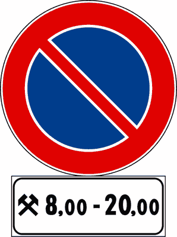
- **📖 الترجمة السياقية:** تمنع الإشارة المعروضة الوقوف والركن في الفترة الزمنية الموضحة من أيام العمل.
- **💡 الشرح والقاعدة المرورية:** صحيح (VERO). شاخصة منع الوقوف المرفقة بهذه اللوحة تحظر ركن المركبات فقط في أيام العمل خلال الساعات المحددة وتسمح به في العطلات وخارج تلك الساعات.
- **⚠️ كشف الفخ:** فخ الامتحان: منع الوقوف مقيد بأيام العمل وساعاتها المذكورة.
- **🔑 الكلمات المفتاحية:** `{'it': 'vieta la sosta nei giorni lavorativi', 'ar': 'تمنع الوقوف في أيام العمل'}` | `{'it': 'orario indicato', 'ar': 'التوقيت المحدد'}` | `{'it': 'vero', 'ar': 'صحيح'}`

---

**45.** Il pannello integrativo raffigurato, posto sotto un segnale di obbligo, indica che esso vale dalle ore 8.00 alle ore 20.00 dei giorni lavorativi
- **الإجابة:** `VERO ✅ (صح)`
- 
- **📖 الترجمة السياقية:** تشير اللوحة الإضافية المعروضة، عند وضعها أسفل إشارة إلزام، إلى أنها تسري من الساعة 8:00 حتى 20:00 في أيام العمل.
- **💡 الشرح والقاعدة المرورية:** صحيح (VERO). الإلزام يطبق فقط في نطاق الساعات المكتوبة وأيام العمل الرسمية دون أيام العطلات.
- **⚠️ كشف الفخ:** فخ الامتحان: سريان إشارة الإلزام مقيد بأيام وساعات العمل المكتوبة.
- **🔑 الكلمات المفتاحية:** `{'it': 'segnale di obbligo', 'ar': 'إشارة إلزام'}` | `{'it': '8.00 alle 20.00 giorni lavorativi', 'ar': 'من 8 إلى 20 في أيام العمل'}` | `{'it': 'vero', 'ar': 'صحيح'}`

---

**46.** Il segnale raffigurato vieta il transito agli autocarri di massa complessiva superiore a 3,5 t. nell'orario indicato, dei giorni lavorativi
- **الإجابة:** `VERO ✅ (صح)`
- 
- **📖 الترجمة السياقية:** تمنع الإشارة المعروضة مرور الشاحنات التي يزيد وزنها الإجمالي عن 3.5 طن في التوقيت الموضح من أيام العمل.
- **💡 الشرح والقاعدة المرورية:** صحيح (VERO). شاخصة منع الشاحنات المقترنة بهذه اللوحة تحظر سير الشاحنات الثقيلة (>3.5 طن) في ساعات العمل المحددة لتفادي الازدحام.
- **⚠️ كشف الفخ:** فخ الامتحان: منع الشاحنات مقيد بالتوقيت المكتوب وأيام العمل.
- **🔑 الكلمات المفتاحية:** `{'it': 'autocarri superiore a 3,5 t', 'ar': 'شاحنات تزيد عن 3.5 طن'}` | `{'it': 'giorni lavorativi', 'ar': 'أيام العمل'}` | `{'it': 'vero', 'ar': 'صحيح'}`

---

**47.** Il pannello integrativo raffigurato indica che il segnale al quale è abbinato vale tutti i giorni, ma solo nelle ore indicate
- **الإجابة:** `FALSO ❌ (خطأ)`
- 
- **📖 الترجمة السياقية:** تشير اللوحة الإضافية المعروضة إلى أن الإشارة المقترنة بها تسري في جميع الأيام، ولكن فقط في الساعات الموضحة.
- **💡 الشرح والقاعدة المرورية:** خطأ (FALSO). لا تسري في جميع الأيام؛ فرمز المطرقتين يقصر سريانها على أيام العمل فقط (lavorativi) ولا تنطبق في أيام العطلات والأعياد.
- **⚠️ كشف الفخ:** فخ الامتحان: عبارة 'tutti i giorni' خاطئة؛ فالمطرقتان تعنيان أيام العمل فقط دون العطلات.
- **🔑 الكلمات المفتاحية:** `{'it': 'vale tutti i giorni', 'ar': 'تسري جميع الأيام (فخ)'}` | `{'it': 'solo lavorativi', 'ar': 'أيام العمل فقط'}` | `{'it': 'falso', 'ar': 'خطأ'}`

---

**48.** Il pannello integrativo raffigurato indica gli orari di apertura di un museo di attrezzi da lavoro
- **الإجابة:** `FALSO ❌ (خطأ)`
- 
- **📖 الترجمة السياقية:** تشير اللوحة الإضافية المعروضة إلى مواعيد فتح متحف أدوات العمل والمعدات.
- **💡 الشرح والقاعدة المرورية:** خطأ (FALSO). رمز المطرقتين هو رمز مروري قانوني لأيام العمل الرسمية، ولا علاقة له بالمتاحف أو المعارض.
- **⚠️ كشف الفخ:** فخ الامتحان: المطرقتان رمزان لأيام العمل وليسا إعلاناً عن متحف أدوات.
- **🔑 الكلمات المفتاحية:** `{'it': 'museo di attrezzi da lavoro', 'ar': 'متحف أدوات عمل (فخ طريف)'}` | `{'it': 'falso', 'ar': 'خطأ'}`

---

**49.** Il pannello integrativo raffigurato indica la fascia oraria di apertura delle officine di soccorso stradale
- **الإجابة:** `FALSO ❌ (خطأ)`
- 
- **📖 الترجمة السياقية:** تشير اللوحة الإضافية المعروضة إلى النطاق الزمني لفتح ورش الصيانة والإنقاذ على الطريق.
- **💡 الشرح والقاعدة المرورية:** خطأ (FALSO). اللوحة تنظم أوقات تطبيق الإشارات المرورية ولا تحدد أوقات عمل ورش تصليح السيارات أو السحب.
- **⚠️ كشف الفخ:** فخ الامتحان: لا علاقة للوحة بمواعيد فتح ورش الصيانة.
- **🔑 الكلمات المفتاحية:** `{'it': 'officine di soccorso stradale', 'ar': 'ورش إنقاذ على الطريق (فخ)'}` | `{'it': 'falso', 'ar': 'خطأ'}`

---

**50.** Il segnale raffigurato è riservato ai veicoli per il soccorso stradale
- **الإجابة:** `FALSO ❌ (خطأ)`
- 
- **📖 الترجمة السياقية:** الإشارة المعروضة مخصصة لمركبات الإنقاذ والإغاثة على الطريق.
- **💡 الشرح والقاعدة المرورية:** خطأ (FALSO). هذه إشارة تنظيمية عامة لجميع المركبات في أيام العمل وليست مخصصة لسيارات الإنقاذ.
- **⚠️ كشف الفخ:** فخ الامتحان: اللوحة عامة وليست خاصة بمركبات الإغاثة.
- **🔑 الكلمات المفتاحية:** `{'it': 'riservato ai veicoli di soccorso', 'ar': 'مخصص لمركبات الإغاثة (فخ)'}` | `{'it': 'falso', 'ar': 'خطأ'}`

---

**51.** Il pannello integrativo raffigurato indica che il segnale al quale è abbinato vale nei giorni festivi
- **الإجابة:** `FALSO ❌ (خطأ)`
- 
- **📖 الترجمة السياقية:** تشير اللوحة الإضافية المعروضة إلى أن الإشارة المقترنة بها تسري في أيام العطلات.
- **💡 الشرح والقاعدة المرورية:** خطأ (FALSO). اللوحة تسري في أيام العمل (lavorativi)؛ أما أيام العطلات فيرمز لها برمز الصليب (croce).
- **⚠️ كشف الفخ:** فخ الامتحان: المطرقتان = أيام عمل، وليست عطلات.
- **🔑 الكلمات المفتاحية:** `{'it': 'vale nei giorni festivi', 'ar': 'تسري في أيام العطلات (فخ)'}` | `{'it': 'lavorativi', 'ar': 'أيام عمل'}` | `{'it': 'falso', 'ar': 'خطأ'}`

---

**52.** Il pannello integrativo raffigurato, posto sotto il segnale PARCHEGGIO, indica che si può parcheggiare nei giorni festivi dalle ore 8.00 alle ore 20.00
- **الإجابة:** `FALSO ❌ (خطأ)`
- 
- **📖 الترجمة السياقية:** تشير اللوحة الإضافية المعروضة، عند وضعها أسفل إشارة موقف السيارات (PARCHEGGIO)، إلى إمكانية الركن في أيام العطلات من الساعة 8:00 إلى 20:00.
- **💡 الشرح والقاعدة المرورية:** خطأ (FALSO). اللوحة تسمح بالركن أو تنظمه في أيام العمل الرسمية (lavorativi) وليس في أيام العطلات (festivi).
- **⚠️ كشف الفخ:** فخ الامتحان: كلمة 'nei giorni festivi' خطأ؛ فالرمز يخص أيام العمل.
- **🔑 الكلمات المفتاحية:** `{'it': 'parcheggiare nei giorni festivi', 'ar': 'الركن في أيام العطلات (فخ)'}` | `{'it': 'giorni lavorativi', 'ar': 'أيام العمل'}` | `{'it': 'falso', 'ar': 'خطأ'}`

---

## 📌 Pannelli limitazione (11 domande)

**53.** Il segnale raffigurato vieta il transito ai soli veicoli indicati
- **الإجابة:** `VERO ✅ (صح)`
- 
- **📖 الترجمة السياقية:** تمنع الإشارة المعروضة المرور للمركبات الموضحة فقط.
- **💡 الشرح والقاعدة المرورية:** صحيح (VERO). اللوحة الإضافية التي تحمل رسم فئة معينة من المركبات (مثل الشاحنات المفصلية autoarticolati) تقصر المنع على تلك الفئة فقط دون غيرها.
- **⚠️ كشف الفخ:** فخ الامتحان: لوحة الفئة المحددة تقصر المنع على الفئة المرسومة حصراً.
- **🔑 الكلمات المفتاحية:** `{'it': 'vieta il transito ai soli veicoli indicati', 'ar': 'تمنع المرور للمركبات الموضحة فقط'}` | `{'it': 'pannello di limitazione', 'ar': 'لوحة تقييد الفئة'}` | `{'it': 'vero', 'ar': 'صحيح'}`

---

**54.** Il segnale raffigurato vieta la sosta ai veicoli indicati
- **الإجابة:** `VERO ✅ (صح)`
- 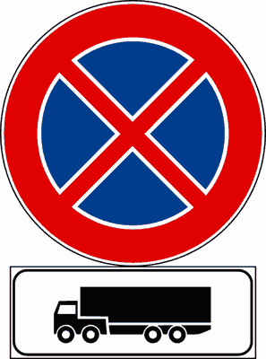
- **📖 الترجمة السياقية:** تمنع الإشارة المعروضة الوقوف والركن للمركبات الموضحة.
- **💡 الشرح والقاعدة المرورية:** صحيح (VERO). عند وضع لوحة الفئة أسفل شاخصة منع الوقوف، يسري حظر الركن فقط على نوع المركبات المرسوم على اللوحة.
- **⚠️ كشف الفخ:** فخ الامتحان: منع الوقوف مقيد بنوع المركبة الموضح في اللوحة.
- **🔑 الكلمات المفتاحية:** `{'it': 'vieta la sosta ai veicoli indicati', 'ar': 'تمنع الوقوف للمركبات الموضحة'}` | `{'it': 'categoria indicata', 'ar': 'الفئة الموضحة'}` | `{'it': 'vero', 'ar': 'صحيح'}`

---

**55.** Il segnale raffigurato vieta la sosta agli autoarticolati
- **الإجابة:** `VERO ✅ (صح)`
- 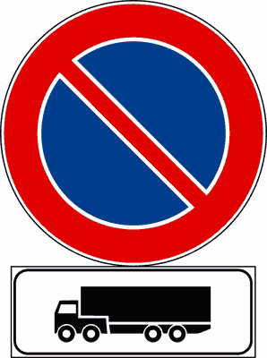
- **📖 الترجمة السياقية:** تمنع الإشارة المعروضة الوقوف والركن للشاحنات المفصلية (autoarticolati / تريلا).
- **💡 الشرح والقاعدة المرورية:** صحيح (VERO). رسم الشاحنة المفصلية (رأس جرار مع نصف مقطورة) يخصص المنع لهذه الفئة من الشاحنات الطويلة.
- **⚠️ كشف الفخ:** فخ الامتحان: الرمز يمثل الشاحنات المفصلية (autoarticolati) بدقة.
- **🔑 الكلمات المفتاحية:** `{'it': 'vieta la sosta agli autoarticolati', 'ar': 'تمنع الوقوف للشاحنات المفصلية'}` | `{'it': 'autoarticolati', 'ar': 'تريلات / شاحنات مفصلية'}` | `{'it': 'vero', 'ar': 'صحيح'}`

---

**56.** Il pannello integrativo raffigurato indica che il segnale al quale è abbinato vale solo per i veicoli rappresentati
- **الإجابة:** `VERO ✅ (صح)`
- 
- **📖 الترجمة السياقية:** تشير اللوحة الإضافية المعروضة إلى أن الإشارة المقترنة بها تسري فقط على المركبات الممثلة بالرسم.
- **💡 الشرح والقاعدة المرورية:** صحيح (VERO). وظيفة هذه اللوحة تضييق نطاق سريان الإشارة ليقتصر حصراً على الفئة المرسومة داخل اللوحة.
- **⚠️ كشف الفخ:** فخ الامتحان: الإشارة تنطبق حصراً على المركبات المرسومة (solo per i veicoli rappresentati).
- **🔑 الكلمات المفتاحية:** `{'it': 'vale solo per i veicoli rappresentati', 'ar': 'تسري فقط على المركبات المرسومة'}` | `{'it': 'limitazione di categoria', 'ar': 'حصر الفئة'}` | `{'it': 'vero', 'ar': 'صحيح'}`

---

**57.** Il pannello integrativo raffigurato può essere abbinato ad un segnale di obbligo
- **الإجابة:** `VERO ✅ (صح)`
- 
- **📖 الترجمة السياقية:** يمكن اقتران اللوحة الإضافية المعروضة بإشارة إلزام (segnale di obbligo).
- **💡 الشرح والقاعدة المرورية:** صحيح (VERO). يجوز وضعها أسفل إشارات الإلزام لتحديد فئة المركبات الملزمة باتباع المسار أو التعليمات (مثل مسار إجباري للشاحنات).
- **⚠️ كشف الفخ:** فخ الامتحان: اللوحة صالحة للاقتران بإشارات الإلزام والمنع.
- **🔑 الكلمات المفتاحية:** `{'it': 'abbinato ad un segnale di obbligo', 'ar': 'تقترن بإشارة إلزام'}` | `{'it': 'obbligo di categoria', 'ar': 'إلزام لفئة محددة'}` | `{'it': 'vero', 'ar': 'صحيح'}`

---

**58.** Il pannello integrativo raffigurato può essere abbinato ad un segnale di divieto
- **الإجابة:** `VERO ✅ (صح)`
- 
- **📖 الترجمة السياقية:** يمكن اقتران اللوحة الإضافية المعروضة بإشارة منع (segnale di divieto).
- **💡 الشرح والقاعدة المرورية:** صحيح (VERO). توضع بكثرة أسفل إشارات المنع لقصر المنع على فئة معينة كالمركبات الثقيلة أو الحافلات.
- **⚠️ كشف الفخ:** فخ الامتحان: الاقتران بإشارات المنع معتمد وشائع جداً.
- **🔑 الكلمات المفتاحية:** `{'it': 'abbinato ad un segnale di divieto', 'ar': 'تقترن بإشارة منع'}` | `{'it': 'divieto di categoria', 'ar': 'منع لفئة معينة'}` | `{'it': 'vero', 'ar': 'صحيح'}`

---

**59.** Il pannello integrativo raffigurato indica un'officina meccanica per autotreni
- **الإجابة:** `FALSO ❌ (خطأ)`
- 
- **📖 الترجمة السياقية:** تشير اللوحة الإضافية المعروضة إلى ورشة ميكانيكية للقطارات الطرقية (autotreni).
- **💡 الشرح والقاعدة المرورية:** خطأ (FALSO). اللوحة تحدد فئة المركبات الخاضعة للمنع أو الإلزام، ولا تدل على وجود ورشة تصليح وصيانة.
- **⚠️ كشف الفخ:** فخ الامتحان: لا علاقة للوحة بورش تصليح الشاحنات.
- **🔑 الكلمات المفتاحية:** `{'it': 'officina meccanica', 'ar': 'ورشة ميكانيكية (فخ)'}` | `{'it': 'falso', 'ar': 'خطأ'}`

---

**60.** Il pannello integrativo raffigurato indica una stazione di rifornimento per soli mezzi pesanti
- **الإجابة:** `FALSO ❌ (خطأ)`
- 
- **📖 الترجمة السياقية:** تشير اللوحة الإضافية المعروضة إلى محطة وقود للمركبات الثقيلة فقط.
- **💡 الشرح والقاعدة المرورية:** خطأ (FALSO). محطات الوقود يعلن عنها بشواخص إرشادية مستقلة برمز مضخة الوقود، وليست لوحة تحديد فئة.
- **⚠️ كشف الفخ:** فخ الامتحان: اللوحة ليست إعلاناً عن محطة وقود للشاحنات.
- **🔑 الكلمات المفتاحية:** `{'it': 'stazione di rifornimento', 'ar': 'محطة وقود (فخ)'}` | `{'it': 'falso', 'ar': 'خطأ'}`

---

**61.** Il segnale raffigurato consente la sosta agli autoarticolati
- **الإجابة:** `FALSO ❌ (خطأ)`
- 
- **📖 الترجمة السياقية:** تسمح الإشارة المعروضة بالوقوف والركن للشاحنات المفصلية (autoarticolati).
- **💡 الشرح والقاعدة المرورية:** خطأ (FALSO). الإشارة تمنع الوقوف للشاحنات المفصلية ولا تسمح به؛ فاللوحة تقيد المنع على هذه الفئة.
- **⚠️ كشف الفخ:** فخ الامتحان: الإشارة تمنع الركن لهذه الفئة ولا تسمح به.
- **🔑 الكلمات المفتاحية:** `{'it': 'consente la sosta agli autoarticolati', 'ar': 'تسمح بالوقوف للشاحنات المفصلية (فخ)'}` | `{'it': 'vieta la sosta', 'ar': 'تمنع الوقوف'}` | `{'it': 'falso', 'ar': 'خطأ'}`

---

**62.** Il segnale raffigurato prescrive che possono transitare gli autoarticolati
- **الإجابة:** `FALSO ❌ (خطأ)`
- 
- **📖 الترجمة السياقية:** تفرض الإشارة المعروضة جواز مرور الشاحنات المفصلية.
- **💡 الشرح والقاعدة المرورية:** خطأ (FALSO). الإشارة إذا كانت منع مرور فإنها تمنع الشاحنات المفصلية من المرور ولا تسمح لها.
- **⚠️ كشف الفخ:** فخ الامتحان: الإشارة تمنع المرور ولا تبيحه.
- **🔑 الكلمات المفتاحية:** `{'it': 'possono transitare gli autoarticolati', 'ar': 'يجوز مرور الشاحنات المفصلية (فخ)'}` | `{'it': 'divieto di transito', 'ar': 'منع المرور'}` | `{'it': 'falso', 'ar': 'خطأ'}`

---

**63.** Il pannello integrativo raffigurato, posto sotto il segnale PARCHEGGIO, indica che possono parcheggiare tutti i veicoli pesanti
- **الإجابة:** `FALSO ❌ (خطأ)`
- 
- **📖 الترجمة السياقية:** تشير اللوحة الإضافية المعروضة، عند وضعها أسفل إشارة موقف السيارات، إلى إمكانية ركن جميع المركبات الثقيلة.
- **💡 الشرح والقاعدة المرورية:** خطأ (FALSO). تقتصر اللوحة على الشاحنات المفصلية (autoarticolati) الممثلة بالرسم فقط، ولا تشمل جميع المركبات الثقيلة كالحافلات والشاحنات الفردية.
- **⚠️ كشف الفخ:** فخ الامتحان: كلمة 'tutti i veicoli pesanti' تعميم خاطئ؛ اللوحة تخص الشاحنات المفصلية فقط.
- **🔑 الكلمات المفتاحية:** `{'it': 'tutti i veicoli pesanti', 'ar': 'جميع المركبات الثقيلة (فخ تعميم)'}` | `{'it': 'solo autoarticolati', 'ar': 'فقط الشاحنات المفصلية'}` | `{'it': 'falso', 'ar': 'خطأ'}`

---

## 📌 Inizio prescrizione (11 domande)

**64.** Il pannello integrativo (A), posto sotto un segnale di divieto, evidenzia il punto d'inizio della prescrizione
- **الإجابة:** `VERO ✅ (صح)`
- 
- **📖 الترجمة السياقية:** تبرز اللوحة الإضافية (A) ذات السهم المتجه للأعلى، عند وضعها أسفل إشارة منع، نقطة بداية سريان القيد والمنع.
- **💡 الشرح والقاعدة المرورية:** صحيح (VERO). السهم الرأسي المتجه للأعلى (freccia verso l'alto) يحدد نقطة البداية الدقيقة (inizio della prescrizione) لتطبيق المنع أو الإلزام.
- **⚠️ كشف الفخ:** فخ الامتحان: السهم المتجه للأعلى يعني بداية سريان المنع (inizio).
- **🔑 الكلمات المفتاحية:** `{'it': "punto d'inizio della prescrizione", 'ar': 'نقطة بداية القيد'}` | `{'it': "freccia verso l'alto", 'ar': 'سهم للأعلى (بداية)'}` | `{'it': 'inizio', 'ar': 'بداية'}` | `{'it': 'vero', 'ar': 'صحيح'}`

---

**65.** Il segnale raffigurato indica che il divieto di sosta ha inizio in quel punto
- **الإجابة:** `VERO ✅ (صح)`
- 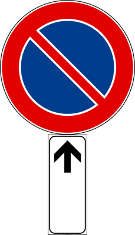
- **📖 الترجمة السياقية:** تشير الإشارة المعروضة إلى أن منع الوقوف والركن يبدأ من تلك النقطة فصاعداً.
- **💡 الشرح والقاعدة المرورية:** صحيح (VERO). السهم المتجه للأعلى مع إشارة منع الوقوف يفيد بأن حظر الركن يبدأ فوراً من موضع اللوحة ويمتد للأمام.
- **⚠️ كشف الفخ:** فخ الامتحان: سهم للأعلى = بداية منع الوقوف من هذا المكان.
- **🔑 الكلمات المفتاحية:** `{'it': 'divieto di sosta ha inizio in quel punto', 'ar': 'منع الوقوف يبدأ من تلك النقطة'}` | `{'it': 'inizio divieto', 'ar': 'بداية المنع'}` | `{'it': 'vero', 'ar': 'صحيح'}`

---

**66.** Il segnale raffigurato evidenzia l'inizio dell'area dove è possibile parcheggiare
- **الإجابة:** `VERO ✅ (صح)`
- 
- **📖 الترجمة السياقية:** تبرز الإشارة المعروضة بداية المنطقة التي يُسمح فيها بركن المركبات.
- **💡 الشرح والقاعدة المرورية:** صحيح (VERO). عند اقتران شاخصة موقف السيارات (P) بلوحة السهم للأعلى، فإنها تحدد بداية المساحة المخصصة لمواقف السيارات.
- **⚠️ كشف الفخ:** فخ الامتحان: سهم للأعلى مع شاخصة بارك = بداية منطقة المواقف.
- **🔑 الكلمات المفتاحية:** `{'it': "inizio dell'area parcheggio", 'ar': 'بداية منطقة المواقف'}` | `{'it': 'parcheggio consentito', 'ar': 'المواقف مسموحة'}` | `{'it': 'vero', 'ar': 'صحيح'}`

---

**67.** il segnale raffigurato evidenzia il punto d'inizio del divieto di fermata
- **الإجابة:** `VERO ✅ (صح)`
- 
- **📖 الترجمة السياقية:** تبرز الإشارة المعروضة نقطة بداية سريان منع التوقف المؤقت (divieto di fermata).
- **💡 الشرح والقاعدة المرورية:** صحيح (VERO). السهم للأعلى مع شاخصة منع التوقف (علامة X الحمراء على خلفية زرقاء) يفيد ببدء سريان منع التوقف والوقوف معاً من تلك النقطة.
- **⚠️ كشف الفخ:** فخ الامتحان: سهم للأعلى = بداية منع التوقف.
- **🔑 الكلمات المفتاحية:** `{'it': "punto d'inizio del divieto di fermata", 'ar': 'نقطة بداية منع التوقف المؤقت'}` | `{'it': 'divieto di fermata', 'ar': 'منع التوقف'}` | `{'it': 'vero', 'ar': 'صحيح'}`

---

**68.** Il segnale raffigurato evidenzia il punto d'inizio del viale pedonale
- **الإجابة:** `VERO ✅ (صح)`
- 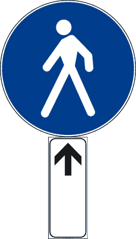
- **📖 الترجمة السياقية:** تبرز الإشارة المعروضة نقطة بداية ممشى ومسار المشاة (viale pedonale).
- **💡 الشرح والقاعدة المرورية:** صحيح (VERO). السهم للأعلى مع شاخصة مسار المشاة يحدد بدقة النقطة التي يبدأ منها الممشى المخصص للمشاة.
- **⚠️ كشف الفخ:** فخ الامتحان: السهم للأعلى يحدد نقطة بداية أي مسار أو قيد.
- **🔑 الكلمات المفتاحية:** `{'it': 'inizio del viale pedonale', 'ar': 'بداية ممشى المشاة'}` | `{'it': 'percorso pedonale', 'ar': 'مسار المشاة'}` | `{'it': 'vero', 'ar': 'صحيح'}`

---

**69.** Il pannello raffigurato (A) indica una strada in salita
- **الإجابة:** `FALSO ❌ (خطأ)`
- 
- **📖 الترجمة السياقية:** تشير اللوحة المعروضة (A) إلى طريق صاعد (salita).
- **💡 الشرح والقاعدة المرورية:** خطأ (FALSO). السهم للأعلى يعني بداية سريان الإشارة (inizio)، ولا علاقة له بانحدار أو صعود الطريق.
- **⚠️ كشف الفخ:** فخ الامتحان: السهم للأعلى لا يعني صعود طريق، بل يعني نقطة بداية الإشارة.
- **🔑 الكلمات المفتاحية:** `{'it': 'strada in salita', 'ar': 'طريق صاعد (فخ اتجاه السهم)'}` | `{'it': 'inizio prescrizione', 'ar': 'بداية القيد'}` | `{'it': 'falso', 'ar': 'خطأ'}`

---

**70.** Il pannello raffigurato (A) indica l'obbligo di proseguire diritto
- **الإجابة:** `FALSO ❌ (خطأ)`
- 
- **📖 الترجمة السياقية:** تشير اللوحة المعروضة (A) إلى وجوب مواصلة السير للأمام مباشرة.
- **💡 الشرح والقاعدة المرورية:** خطأ (FALSO). هذه لوحة إضافية لبدء سريان المنع أو الإذن، وليست شاخصة اتجاه إجباري دائرية زرقاء للأمام.
- **⚠️ كشف الفخ:** فخ الامتحان: السهم الرأسي في اللوحة الإضافية ليس اتجاهاً إجبارياً للسير.
- **🔑 الكلمات المفتاحية:** `{'it': 'obbligo di proseguire diritto', 'ar': 'إلزام بالسير للأمام (فخ)'}` | `{'it': "pannello d'inizio", 'ar': 'لوحة بداية'}` | `{'it': 'falso', 'ar': 'خطأ'}`

---

**71.** Il pannello raffigurato (A) indica la fine di una strada a senso unico
- **الإجابة:** `FALSO ❌ (خطأ)`
- 
- **📖 الترجمة السياقية:** تشير اللوحة المعروضة (A) إلى نهاية طريق ذي اتجاه واحد.
- **💡 الشرح والقاعدة المرورية:** خطأ (FALSO). اللوحة تشير إلى بداية (inizio) ولا تشير إلى نهاية؛ ونهاية الطرق لها شواخص خاصة مشطوبة.
- **⚠️ كشف الفخ:** فخ الامتحان: السهم للأعلى يعني بداية وليس نهاية.
- **🔑 الكلمات المفتاحية:** `{'it': 'fine di una strada a senso unico', 'ar': 'نهاية طريق باتجاه واحد (فخ)'}` | `{'it': 'inizio', 'ar': 'بداية'}` | `{'it': 'falso', 'ar': 'خطأ'}`

---

**72.** Il pannello raffigurato (B) indica la corsia riservata agli autobus urbani
- **الإجابة:** `FALSO ❌ (خطأ)`
- 
- **📖 الترجمة السياقية:** تشير اللوحة المعروضة (B) إلى المسلك المخصص لحافلات النقل العام داخل المدن.
- **💡 الشرح والقاعدة المرورية:** خطأ (FALSO). اللوحة المعروضة هي لوحة بداية سريان الإشارة ولا تدل على مسلك لحافلات النقل.
- **⚠️ كشف الفخ:** فخ الامتحان: لا علاقة للسهم الرأسي بمسلك الحافلات.
- **🔑 الكلمات المفتاحية:** `{'it': 'corsia riservata agli autobus', 'ar': 'مسلك مخصص للحافلات (فخ)'}` | `{'it': 'falso', 'ar': 'خطأ'}`

---

**73.** Il segnale raffigurato evidenzia il punto in cui finisce l'area destinata al parcheggio
- **الإجابة:** `FALSO ❌ (خطأ)`
- 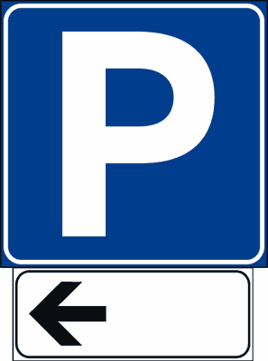
- **📖 الترجمة السياقية:** تبرز الإشارة المعروضة النقطة التي تنتهي عندها المساحة المخصصة لركن المركبات.
- **💡 الشرح والقاعدة المرورية:** خطأ (FALSO). السهم للأعلى يبرز نقطة البداية (inizio)؛ أما نهاية منطقة المواقف فيشار إليها بسهم متجه للأسفل (fine).
- **⚠️ كشف الفخ:** فخ الامتحان: السهم للأعلى يعني بداية المواقف وليس نهايتها.
- **🔑 الكلمات المفتاحية:** `{'it': "finisce l'area destinata al parcheggio", 'ar': 'تنتهي مساحة المواقف (فخ)'}` | `{'it': "inizia l'area", 'ar': 'تبدأ مساحة المواقف'}` | `{'it': 'falso', 'ar': 'خطأ'}`

---

**74.** Il pannello raffigurato (A), posto sotto un segnale di pericolo, evidenzia il punto dove finisce il pericolo
- **الإجابة:** `FALSO ❌ (خطأ)`
- 
- **📖 الترجمة السياقية:** تبرز اللوحة المعروضة (A)، عند وضعها أسفل إشارة خطر، النقطة التي ينتهي عندها الخطر.
- **💡 الشرح والقاعدة المرورية:** خطأ (FALSO). السهم للأعلى يدل على البداية وليس النهاية؛ ونهاية الخطر لا تُمثل بسهم للأعلى.
- **⚠️ كشف الفخ:** فخ الامتحان: السهم للأعلى = بداية دائماً.
- **🔑 الكلمات المفتاحية:** `{'it': 'dove finisce il pericolo', 'ar': 'حيث ينتهي الخطر (فخ)'}` | `{'it': 'inizio', 'ar': 'بداية'}` | `{'it': 'falso', 'ar': 'خطأ'}`

---

## 📌 Continuazione prescrizione (12 domande)

**75.** Il segnale raffigurato indica che il divieto di sosta continua
- **الإجابة:** `VERO ✅ (صح)`
- 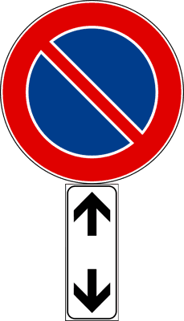
- **📖 الترجمة السياقية:** تشير الإشارة المعروضة إلى استمرار وسريان منع الوقوف والركن (continuazione).
- **💡 الشرح والقاعدة المرورية:** صحيح (VERO). اللوحة الإضافية ذات السهمين المتعاكسين رأسياً (سهم لأعلى وسهم لأسفل) تؤكد استمرار سريان منع الوقوف قبل وبعد الشاخصة.
- **⚠️ كشف الفخ:** فخ الامتحان: السهمان المتعاكسان رأسياً يرمزان للاستمرارية (continuazione).
- **🔑 الكلمات المفتاحية:** `{'it': 'divieto di sosta continua', 'ar': 'منع الوقوف مستمر'}` | `{'it': 'doppia freccia', 'ar': 'سهم مزدوج متعاكس'}` | `{'it': 'continuazione', 'ar': 'استمرار'}` | `{'it': 'vero', 'ar': 'صحيح'}`

---

**76.** Il segnale raffigurato conferma la continuazione del divieto di sorpasso
- **الإجابة:** `VERO ✅ (صح)`
- 
- **📖 الترجمة السياقية:** تؤكد الإشارة المعروضة استمرار سريان منع التجاوز (divieto di sorpasso).
- **💡 الشرح والقاعدة المرورية:** صحيح (VERO). توضع لتذكير السائقين بأن منع التجاوز لا يزال قائماً ومستمراً على طول هذا المقطع من الطريق.
- **⚠️ كشف الفخ:** فخ الامتحان: اللوحة تؤكد استمرار منع التجاوز على الطريق.
- **🔑 الكلمات المفتاحية:** `{'it': 'conferma la continuazione del divieto di sorpasso', 'ar': 'تؤكد استمرار منع التجاوز'}` | `{'it': 'ripetizione', 'ar': 'تأكيد واستمرار'}` | `{'it': 'vero', 'ar': 'صحيح'}`

---

**77.** Il segnale raffigurato indica la continuazione del limite massimo di velocità
- **الإجابة:** `VERO ✅ (صح)`
- 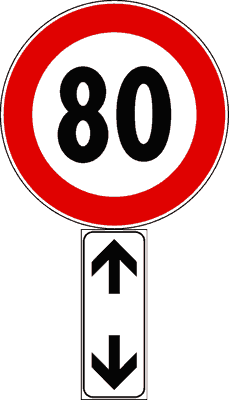
- **📖 الترجمة السياقية:** تشير الإشارة المعروضة إلى استمرار سريان الحد الأقصى للسرعة.
- **💡 الشرح والقاعدة المرورية:** صحيح (VERO). تؤكد اللوحة ذات السهمين المتعاكسين استمرار التقيد بالسرعة القصوى المحددة بعد مفترقات الطرق أو على المسارات الطويلة.
- **⚠️ كشف الفخ:** فخ الامتحان: تأكيد استمرار حد السرعة هو أحد الاستخدامات النظامية للوحة.
- **🔑 الكلمات المفتاحية:** `{'it': 'continuazione del limite massimo di velocità', 'ar': 'استمرار الحد الأقصى للسرعة'}` | `{'it': 'limite continuo', 'ar': 'حد سرعة مستمر'}` | `{'it': 'vero', 'ar': 'صحيح'}`

---

**78.** Il segnale raffigurato indica la continuazione del tratto di strada sdrucciolevole
- **الإجابة:** `VERO ✅ (صح)`
- 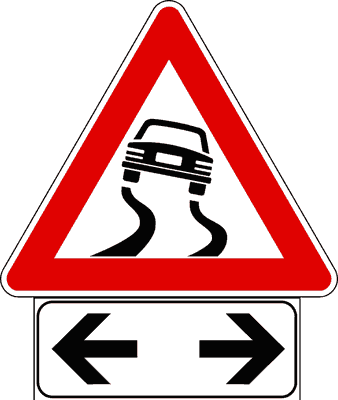
- **📖 الترجمة السياقية:** تشير الإشارة المعروضة إلى استمرار مقطع الطريق الزلق (strada sdrucciolevole).
- **💡 الشرح والقاعدة المرورية:** صحيح (VERO). عند وضعها أسفل إشارة الخطر، تؤكد أن خطر انزلاق الطريق ما زال قائماً ومستمراً للأمام.
- **⚠️ كشف الفخ:** فخ الامتحان: اللوحة تفيد استمرار الخطر المعلن عنه بالإشارة العلوية.
- **🔑 الكلمات المفتاحية:** `{'it': 'continuazione del tratto di strada sdrucciolevole', 'ar': 'استمرار مقطع الطريق الزلق'}` | `{'it': 'pericolo continuo', 'ar': 'خطر مستمر'}` | `{'it': 'vero', 'ar': 'صحيح'}`

---

**79.** Il segnale raffigurato indica che la fermata è vietata sia prima che dopo il segnale
- **الإجابة:** `VERO ✅ (صح)`
- 
- **📖 الترجمة السياقية:** تشير الإشارة المعروضة إلى أن التوقف المؤقت محظور قبل الإشارة وبعدها على حد سواء.
- **💡 الشرح والقاعدة المرورية:** صحيح (VERO). السهمان المتعاكسان (لأعلى ولأسفل) يفيدان بأن الحظر يمتد في كلا الاتجاهين: قبل موقع اللوحة وبعده.
- **⚠️ كشف الفخ:** فخ الامتحان: السهمان يعنيان سريان المنع قبل وبعد الإشارة (sia prima che dopo).
- **🔑 الكلمات المفتاحية:** `{'it': 'vietata sia prima che dopo il segnale', 'ar': 'ممنوع قبل وبعد الإشارة معاً'}` | `{'it': 'fermata vietata', 'ar': 'منع التوقف'}` | `{'it': 'vero', 'ar': 'صحيح'}`

---

**80.** Il pannello integrativo raffigurato (A), posto sotto un segnale di pericolo, ne indica la continuazione
- **الإجابة:** `VERO ✅ (صح)`
- 
- **📖 الترجمة السياقية:** تشير اللوحة الإضافية المعروضة (A)، عند وضعها أسفل إشارة خطر، إلى استمرار ذلك الخطر.
- **💡 الشرح والقاعدة المرورية:** صحيح (VERO). تؤكد اللوحة أن ظروف الخطر لا تزال قائمة ومستمرة لمسافة إضافية على الطريق.
- **⚠️ كشف الفخ:** فخ الامتحان: السهمان أسفل إشارة الخطر يعنيان استمرار الخطر.
- **🔑 الكلمات المفتاحية:** `{'it': 'indica la continuazione', 'ar': 'تشير إلى الاستمرار'}` | `{'it': 'segnale di pericolo', 'ar': 'إشارة خطر'}` | `{'it': 'vero', 'ar': 'صحيح'}`

---

**81.** Il pannello integrativo raffigurato (A) indica di tornare indietro
- **الإجابة:** `FALSO ❌ (خطأ)`
- 
- **📖 الترجمة السياقية:** تشير اللوحة الإضافية المعروضة (A) إلى وجوب الرجوع إلى الخلف.
- **💡 الشرح والقاعدة المرورية:** خطأ (FALSO). اللوحة تعني استمرار القيد (continuazione) ولا تأمر إطلاقاً بالرجوع إلى الخلف.
- **⚠️ كشف الفخ:** فخ الامتحان: السهم الهابط للأسفل لا يعني الرجوع بالسيارة للخلف.
- **🔑 الكلمات المفتاحية:** `{'it': 'tornare indietro', 'ar': 'الرجوع للخلف (فخ)'}` | `{'it': 'continuazione', 'ar': 'استمرار'}` | `{'it': 'falso', 'ar': 'خطأ'}`

---

**82.** Il segnale raffigurato indica la fine della zona destinata al parcheggio
- **الإجابة:** `FALSO ❌ (خطأ)`
- 
- **📖 الترجمة السياقية:** تشير الإشارة المعروضة إلى نهاية المنطقة المخصصة لركن المركبات.
- **💡 الشرح والقاعدة المرورية:** خطأ (FALSO). نهاية المنطقة يشار إليها بسهم مفرد يتجه للأسفل فقط؛ أما السهمان المتعاكسان فيشيران إلى استمرار المواقف.
- **⚠️ كشف الفخ:** فخ الامتحان: السهم المزدوج يعني استمرار وليس نهاية.
- **🔑 الكلمات المفتاحية:** `{'it': 'fine della zona destinata al parcheggio', 'ar': 'نهاية منطقة المواقف (فخ)'}` | `{'it': 'continuazione', 'ar': 'استمرار'}` | `{'it': 'falso', 'ar': 'خطأ'}`

---

**83.** Il pannello integrativo raffigurato (A) indica un senso unico alternato
- **الإجابة:** `FALSO ❌ (خطأ)`
- 
- **📖 الترجمة السياقية:** تشير اللوحة الإضافية المعروضة (A) إلى حركة سير بالتعاقب في الاتجاهين (senso unico alternato).
- **💡 الشرح والقاعدة المرورية:** خطأ (FALSO). السير المتعاقب تنظمه إشارات أسبقية خاصة بأسهم أفقية أو دائرية ومربعة، ولا تدل عليه هذه اللوحة الإضافية الرأسية.
- **⚠️ كشف الفخ:** فخ الامتحان: اللوحة ليست إشارة سير متعاقب.
- **🔑 الكلمات المفتاحية:** `{'it': 'senso unico alternato', 'ar': 'سير متعاقب (فخ)'}` | `{'it': 'falso', 'ar': 'خطأ'}`

---

**84.** Il pannello integrativo raffigurato (A), posto sotto un segnale di pericolo, ne indica la fine
- **الإجابة:** `FALSO ❌ (خطأ)`
- 
- **📖 الترجمة السياقية:** تشير اللوحة الإضافية المعروضة (A)، عند وضعها أسفل إشارة خطر، إلى نهاية ذلك الخطر.
- **💡 الشرح والقاعدة المرورية:** خطأ (FALSO). تشير إلى استمرار الخطر (continuazione) وليس نهايته؛ ونهاية الخطر ترفع بانتهاء مسافة الامتداد.
- **⚠️ كشف الفخ:** فخ الامتحان: السهم المزدوج يعني الاستمرار وليس النهاية.
- **🔑 الكلمات المفتاحية:** `{'it': 'ne indica la fine', 'ar': 'تشير لنهايته (فخ)'}` | `{'it': 'continuazione', 'ar': 'استمرار'}` | `{'it': 'falso', 'ar': 'خطأ'}`

---

**85.** Il pannello integrativo raffigurato (A) indica le due direzioni consentite
- **الإجابة:** `FALSO ❌ (خطأ)`
- 
- **📖 الترجمة السياقية:** تشير اللوحة الإضافية المعروضة (A) إلى الاتجاهين المسموح بهما للسير.
- **💡 الشرح والقاعدة المرورية:** خطأ (FALSO). اللوحة ليست إشارة توجيه لمسارات السير، بل هي لوحة إضافية لتأكيد استمرار مفعول الإشارة العلوية.
- **⚠️ كشف الفخ:** فخ الامتحان: السهمان الرأسيان لا يمثلان اتجاهات مسموحة للحركة.
- **🔑 الكلمات المفتاحية:** `{'it': 'due direzioni consentite', 'ar': 'الاتجاهان المسموح بهما (فخ)'}` | `{'it': 'falso', 'ar': 'خطأ'}`

---

**86.** Il pannello integrativo raffigurato (A) indica una strada a doppio senso di circolazione
- **الإجابة:** `FALSO ❌ (خطأ)`
- 
- **📖 الترجمة السياقية:** تشير اللوحة الإضافية المعروضة (A) إلى طريق ذي اتجاهين لحركة المرور.
- **💡 الشرح والقاعدة المرورية:** خطأ (FALSO). الطريق ذو الاتجاهين يشار إليه بشاخصة الخطر المثلثة ذات السهمين المتعاكسين (doppio senso di circolazione)، وليس بهذه اللوحة الإضافية المستطيلة البيضاء.
- **⚠️ كشف الفخ:** فخ الامتحان: الخلط بين شاخصة السير المزدوج واللوحة الإضافية للاستمرارية.
- **🔑 الكلمات المفتاحية:** `{'it': 'strada a doppio senso di circolazione', 'ar': 'طريق ذو اتجاهين (فخ)'}` | `{'it': 'continuazione prescrizione', 'ar': 'استمرار القيد'}` | `{'it': 'falso', 'ar': 'خطأ'}`

---

## 📌 Termine prescrizione (12 domande)

**87.** Il segnale raffigurato indica il punto nel quale termina il divieto di sosta
- **الإجابة:** `VERO ✅ (صح)`
- 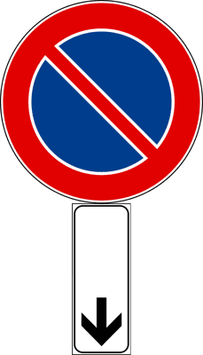
- **📖 الترجمة السياقية:** تشير الإشارة المعروضة إلى النقطة التي ينتهي عندها منع الوقوف والركن (fine del divieto).
- **💡 الشرح والقاعدة المرورية:** صحيح (VERO). السهم الرأسي المتجه للأسفل (freccia verso il basso) يحدد نقطة النهاية التامة (termine / fine) لمنع الوقوف، ويصبح الركن مسموحاً بعد هذه الشاخصة.
- **⚠️ كشف الفخ:** فخ الامتحان: السهم المتجه للأسفل = نهاية القيد أو المنع (fine).
- **🔑 الكلمات المفتاحية:** `{'it': 'termina il divieto di sosta', 'ar': 'ينتهي منع الوقوف'}` | `{'it': 'freccia verso il basso', 'ar': 'سهم للأسفل (نهاية)'}` | `{'it': 'fine divieto', 'ar': 'نهاية المنع'}` | `{'it': 'vero', 'ar': 'صحيح'}`

---

**88.** Il segnale raffigurato indica il punto dove termina il divieto di fermata
- **الإجابة:** `VERO ✅ (صح)`
- 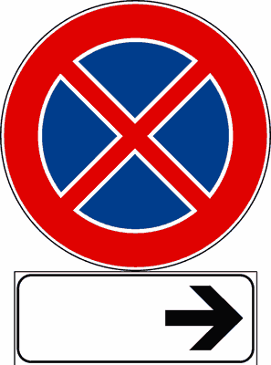
- **📖 الترجمة السياقية:** تشير الإشارة المعروضة إلى النقطة التي ينتهي عندها منع التوقف المؤقت (fine del divieto di fermata).
- **💡 الشرح والقاعدة المرورية:** صحيح (VERO). السهم للأسفل مع شاخصة منع التوقف يحدد نهاية منطقة حظر التوقف والوقوف، فتعود إمكانية التوقف بعدها.
- **⚠️ كشف الفخ:** فخ الامتحان: سهم للأسفل = نهاية منع التوقف.
- **🔑 الكلمات المفتاحية:** `{'it': 'termina il divieto di fermata', 'ar': 'ينتهي منع التوقف'}` | `{'it': 'termine prescrizione', 'ar': 'نهاية القيد'}` | `{'it': 'vero', 'ar': 'صحيح'}`

---

**89.** Il segnale raffigurato indica la fine del cantiere stradale
- **الإجابة:** `VERO ✅ (صح)`
- 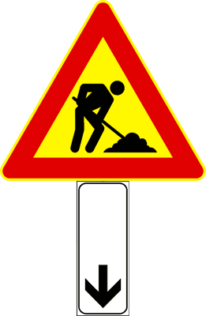
- **📖 الترجمة السياقية:** تشير الإشارة المعروضة إلى نهاية ورشة الأشغال الطرقية (cantiere stradale).
- **💡 الشرح والقاعدة المرورية:** صحيح (VERO). السهم المتجه للأسفل في اللوحة الإضافية يعني نهاية (fine) ما تعلنه الإشارة العلوية؛ وعند وضعه أسفل إشارة الأشغال فهو يحدد نهاية منطقة الورشة.
- **⚠️ كشف الفخ:** فخ الامتحان: السهم للأسفل = نهاية؛ لا تخلط بينه وبين السهم للأعلى (بداية).
- **🔑 الكلمات المفتاحية:** `{'it': 'fine del cantiere stradale', 'ar': 'نهاية ورشة الأشغال'}` | `{'it': 'freccia verso il basso', 'ar': 'سهم للأسفل (نهاية)'}` | `{'it': 'vero', 'ar': 'صحيح'}`

---

**90.** Il segnale raffigurato indica la fine dell'area destinata al parcheggio
- **الإجابة:** `VERO ✅ (صح)`
- 
- **📖 الترجمة السياقية:** تشير الإشارة المعروضة إلى نهاية المنطقة المخصصة لركن المركبات.
- **💡 الشرح والقاعدة المرورية:** صحيح (VERO). شاخصة الموقف (P) مع لوحة السهم المتجه للأسفل تحدد النقطة التي تنتهي عندها منطقة الركن المسموح.
- **⚠️ كشف الفخ:** فخ الامتحان: السهم للأسفل مع P = نهاية المواقف وليس بدايتها.
- **🔑 الكلمات المفتاحية:** `{'it': "fine dell'area destinata al parcheggio", 'ar': 'نهاية منطقة المواقف'}` | `{'it': 'termine', 'ar': 'نهاية'}` | `{'it': 'vero', 'ar': 'صحيح'}`

---

**91.** Il segnale raffigurato indica la fine della strada deformata
- **الإجابة:** `VERO ✅ (صح)`
- 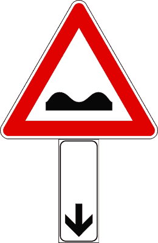
- **📖 الترجمة السياقية:** تشير الإشارة المعروضة إلى نهاية الطريق المشوّه / غير المستوي (strada deformata).
- **💡 الشرح والقاعدة المرورية:** صحيح (VERO). عند وضع لوحة السهم للأسفل تحت إشارة خطر الطريق المشوّه، فإنها تعلن انتهاء المقطع الرديء.
- **⚠️ كشف الفخ:** فخ الامتحان: اللوحة نفسها تعطي معنى النهاية لأي إشارة توضع فوقها.
- **🔑 الكلمات المفتاحية:** `{'it': 'fine della strada deformata', 'ar': 'نهاية الطريق المشوّه'}` | `{'it': 'strada deformata', 'ar': 'طريق غير مستوٍ'}` | `{'it': 'vero', 'ar': 'صحيح'}`

---

**92.** Il segnale raffigurato indica la fine della strada sdrucciolevole
- **الإجابة:** `VERO ✅ (صح)`
- 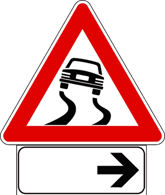
- **📖 الترجمة السياقية:** تشير الإشارة المعروضة إلى نهاية الطريق الزلق (strada sdrucciolevole).
- **💡 الشرح والقاعدة المرورية:** صحيح (VERO). السهم للأسفل تحت إشارة الطريق الزلق يحدد النقطة التي ينتهي عندها خطر الانزلاق.
- **⚠️ كشف الفخ:** فخ الامتحان: لا تخلط بين السهم المزدوج (استمرار الخطر) والسهم المفرد للأسفل (نهاية الخطر).
- **🔑 الكلمات المفتاحية:** `{'it': 'fine della strada sdrucciolevole', 'ar': 'نهاية الطريق الزلق'}` | `{'it': 'sdrucciolevole', 'ar': 'زلق'}` | `{'it': 'vero', 'ar': 'صحيح'}`

---

**93.** Il pannello integrativo raffigurato (A) indica una strada in discesa
- **الإجابة:** `FALSO ❌ (خطأ)`
- 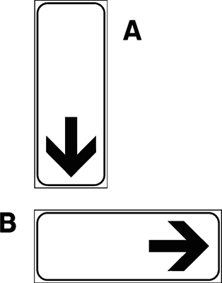
- **📖 الترجمة السياقية:** تشير اللوحة الإضافية المعروضة (A) إلى طريق منحدر (discesa).
- **💡 الشرح والقاعدة المرورية:** خطأ (FALSO). السهم للأسفل في اللوحة الإضافية رمز قانوني لنهاية سريان الإشارة، ولا علاقة له بانحدار الطريق الذي يُعلن عنه بإشارة المنحدر الخطر بالنسبة المئوية.
- **⚠️ كشف الفخ:** فخ الامتحان: اتجاه السهم للأسفل لا يعني نزولاً في الطريق، بل نهاية القيد.
- **🔑 الكلمات المفتاحية:** `{'it': 'strada in discesa', 'ar': 'طريق منحدر (فخ)'}` | `{'it': 'termine prescrizione', 'ar': 'نهاية القيد'}` | `{'it': 'falso', 'ar': 'خطأ'}`

---

**94.** Il pannello integrativo raffigurato (B), posto sotto il segnale PARCHEGGIO, indica l'inizio della zona destinata al parcheggio
- **الإجابة:** `FALSO ❌ (خطأ)`
- 
- **📖 الترجمة السياقية:** تشير اللوحة الإضافية المعروضة (B)، عند وضعها أسفل إشارة الموقف (PARCHEGGIO)، إلى بداية المنطقة المخصصة للركن.
- **💡 الشرح والقاعدة المرورية:** خطأ (FALSO). السهم المتجه للأسفل يعني نهاية منطقة الموقف، أما بدايتها فيُشار إليها بسهم متجه للأعلى.
- **⚠️ كشف الفخ:** فخ الامتحان: للأسفل = نهاية، للأعلى = بداية.
- **🔑 الكلمات المفتاحية:** `{'it': 'inizio della zona parcheggio', 'ar': 'بداية منطقة الموقف (فخ)'}` | `{'it': 'fine', 'ar': 'نهاية'}` | `{'it': 'falso', 'ar': 'خطأ'}`

---

**95.** Il pannello integrativo raffigurato (A), posto sotto un segnale di divieto, indica l'inizio del divieto
- **الإجابة:** `FALSO ❌ (خطأ)`
- 
- **📖 الترجمة السياقية:** تشير اللوحة الإضافية المعروضة (A)، عند وضعها أسفل إشارة منع، إلى بداية المنع.
- **💡 الشرح والقاعدة المرورية:** خطأ (FALSO). السهم للأسفل يعلن نهاية المنع (fine del divieto) وليس بدايته.
- **⚠️ كشف الفخ:** فخ الامتحان: عكس المعنى؛ السهم للأسفل ينهي المنع.
- **🔑 الكلمات المفتاحية:** `{'it': 'inizio del divieto', 'ar': 'بداية المنع (فخ)'}` | `{'it': 'fine del divieto', 'ar': 'نهاية المنع'}` | `{'it': 'falso', 'ar': 'خطأ'}`

---

**96.** Il pannello integrativo raffigurato (A) indica una strada chiusa al traffico
- **الإجابة:** `FALSO ❌ (خطأ)`
- 
- **📖 الترجمة السياقية:** تشير اللوحة الإضافية المعروضة (A) إلى طريق مغلق أمام حركة المرور.
- **💡 الشرح والقاعدة المرورية:** خطأ (FALSO). الطريق المغلق يُعلن عنه بشاخصة منع المرور في الاتجاهين (دائرة بيضاء بإطار أحمر)، واللوحة هنا تدل فقط على نهاية سريان الإشارة.
- **⚠️ كشف الفخ:** فخ الامتحان: اللوحة الإضافية لا تُغلق طريقاً بمفردها.
- **🔑 الكلمات المفتاحية:** `{'it': 'strada chiusa al traffico', 'ar': 'طريق مغلق (فخ)'}` | `{'it': 'pannello di fine', 'ar': 'لوحة نهاية'}` | `{'it': 'falso', 'ar': 'خطأ'}`

---

**97.** Il segnale raffigurato indica la continuazione del divieto di sorpasso
- **الإجابة:** `FALSO ❌ (خطأ)`
- 
- **📖 الترجمة السياقية:** تشير الإشارة المعروضة إلى استمرار منع التجاوز.
- **💡 الشرح والقاعدة المرورية:** خطأ (FALSO). الاستمرار يمثله سهمان متعاكسان (لأعلى ولأسفل)، بينما السهم المفرد للأسفل يعني نهاية المنع.
- **⚠️ كشف الفخ:** فخ الامتحان: الخلط بين لوحة الاستمرار ولوحة النهاية.
- **🔑 الكلمات المفتاحية:** `{'it': 'continuazione del divieto di sorpasso', 'ar': 'استمرار منع التجاوز (فخ)'}` | `{'it': 'termine', 'ar': 'نهاية'}` | `{'it': 'falso', 'ar': 'خطأ'}`

---

**98.** Il pannello integrativo raffigurato (A) indica l'unica direzione consentita
- **الإجابة:** `FALSO ❌ (خطأ)`
- 
- **📖 الترجمة السياقية:** تشير اللوحة الإضافية المعروضة (A) إلى الاتجاه الوحيد المسموح به.
- **💡 الشرح والقاعدة المرورية:** خطأ (FALSO). الاتجاه الإجباري يُحدد بإشارة إلزام دائرية زرقاء، أما هذه اللوحة البيضاء فتدل على نهاية سريان الإشارة فقط.
- **⚠️ كشف الفخ:** فخ الامتحان: السهم في اللوحة الإضافية ليس اتجاه سير.
- **🔑 الكلمات المفتاحية:** `{'it': 'unica direzione consentita', 'ar': 'الاتجاه الوحيد المسموح (فخ)'}` | `{'it': 'falso', 'ar': 'خطأ'}`

---

## 📌 Segni in rifacimento (9 domande)

**99.** Il pannello integrativo raffigurato preavvisa che temporaneamente manca la segnaletica orizzontale sulla carreggiata
- **الإجابة:** `VERO ✅ (صح)`
- 
- **📖 الترجمة السياقية:** تنذر اللوحة الإضافية المعروضة بغياب مؤقت للتخطيط الأرضي على نهر الطريق.
- **💡 الشرح والقاعدة المرورية:** صحيح (VERO). لوحة 'segni orizzontali in rifacimento' تنبه إلى أن الخطوط الأرضية ممسوحة أو قيد الإعادة مؤقتاً، فيجب القيادة بحذر وفق القواعد العامة.
- **⚠️ كشف الفخ:** فخ الامتحان: الغياب مؤقت (temporaneamente) وليس دائماً.
- **🔑 الكلمات المفتاحية:** `{'it': 'manca la segnaletica orizzontale', 'ar': 'غياب التخطيط الأرضي'}` | `{'it': 'temporaneamente', 'ar': 'مؤقتاً'}` | `{'it': 'vero', 'ar': 'صحيح'}`

---

**100.** Il pannello integrativo raffigurato indica un tratto di strada sul quale non è temporaneamente presente la segnaletica orizzontale
- **الإجابة:** `VERO ✅ (صح)`
- 
- **📖 الترجمة السياقية:** تشير اللوحة الإضافية المعروضة إلى مقطع طرقي لا يوجد فيه التخطيط الأرضي بشكل مؤقت.
- **💡 الشرح والقاعدة المرورية:** صحيح (VERO). هي تحذير من مقطع خالٍ مؤقتاً من الخطوط، مما يتطلب انتباهاً لحدود المسالك واتجاهات السير.
- **⚠️ كشف الفخ:** فخ الامتحان: لا خطوط مؤقتاً لا يعني حرية تامة؛ تبقى قواعد السير العامة سارية.
- **🔑 الكلمات المفتاحية:** `{'it': 'tratto senza segnaletica orizzontale', 'ar': 'مقطع بلا تخطيط أرضي'}` | `{'it': 'prudenza', 'ar': 'حذر'}` | `{'it': 'vero', 'ar': 'صحيح'}`

---

**101.** Il pannello integrativo raffigurato indica che si stanno svolgendo i lavori per rifare la segnaletica orizzontale
- **الإجابة:** `VERO ✅ (صح)`
- 
- **📖 الترجمة السياقية:** تشير اللوحة الإضافية المعروضة إلى أن أعمالاً جارية لإعادة رسم التخطيط الأرضي.
- **💡 الشرح والقاعدة المرورية:** صحيح (VERO). عبارة 'in rifacimento' تعني أن الخطوط الأرضية قيد إعادة الطلاء والتجديد.
- **⚠️ كشف الفخ:** فخ الامتحان: rifacimento = إعادة الرسم والتجديد.
- **🔑 الكلمات المفتاحية:** `{'it': 'rifare la segnaletica orizzontale', 'ar': 'إعادة رسم التخطيط الأرضي'}` | `{'it': 'lavori', 'ar': 'أعمال'}` | `{'it': 'vero', 'ar': 'صحيح'}`

---

**102.** Il pannello integrativo raffigurato viene posto sotto il segnale ALTRI PERICOLI
- **الإجابة:** `VERO ✅ (صح)`
- 
- **📖 الترجمة السياقية:** توضع اللوحة الإضافية المعروضة أسفل إشارة 'أخطار أخرى' (ALTRI PERICOLI).
- **💡 الشرح والقاعدة المرورية:** صحيح (VERO). تقترن هذه اللوحة بإشارة الخطر العامة ذات علامة التعجب لتحديد نوع الخطر وهو غياب الخطوط الأرضية.
- **⚠️ كشف الفخ:** فخ الامتحان: لوحات تحديد الخطر توضع عادةً تحت علامة التعجب (Altri pericoli).
- **🔑 الكلمات المفتاحية:** `{'it': 'ALTRI PERICOLI', 'ar': 'أخطار أخرى (علامة التعجب)'}` | `{'it': 'abbinato', 'ar': 'مقترن'}` | `{'it': 'vero', 'ar': 'صحيح'}`

---

**103.** Il segnale raffigurato indica una strada chiusa
- **الإجابة:** `FALSO ❌ (خطأ)`
- 
- **📖 الترجمة السياقية:** تشير الإشارة المعروضة إلى طريق مغلق.
- **💡 الشرح والقاعدة المرورية:** خطأ (FALSO). الإشارة تنبه إلى غياب الخطوط الأرضية مؤقتاً، والطريق مفتوح للسير.
- **⚠️ كشف الفخ:** فخ الامتحان: لا علاقة للوحة بإغلاق الطريق.
- **🔑 الكلمات المفتاحية:** `{'it': 'strada chiusa', 'ar': 'طريق مغلق (فخ)'}` | `{'it': 'falso', 'ar': 'خطأ'}`

---

**104.** Il pannello integrativo raffigurato indica una strada innevata
- **الإجابة:** `FALSO ❌ (خطأ)`
- 
- **📖 الترجمة السياقية:** تشير اللوحة الإضافية المعروضة إلى طريق مغطى بالثلوج.
- **💡 الشرح والقاعدة المرورية:** خطأ (FALSO). الطريق المغطى بالثلج له إشارة خاصة برمز ندفة الثلج، بينما هذه اللوحة تخص إعادة رسم الخطوط الأرضية.
- **⚠️ كشف الفخ:** فخ الامتحان: غياب الخطوط ليس بسبب الثلج هنا.
- **🔑 الكلمات المفتاحية:** `{'it': 'strada innevata', 'ar': 'طريق مغطى بالثلج (فخ)'}` | `{'it': 'falso', 'ar': 'خطأ'}`

---

**105.** Il pannello integrativo raffigurato indica la vicinanza di un attraversamento pedonale
- **الإجابة:** `FALSO ❌ (خطأ)`
- 
- **📖 الترجمة السياقية:** تشير اللوحة الإضافية المعروضة إلى قرب معبر للمشاة.
- **💡 الشرح والقاعدة المرورية:** خطأ (FALSO). معبر المشاة له إشارات خاصة؛ واللوحة هنا تنبه فقط إلى الغياب المؤقت للتخطيط الأرضي.
- **⚠️ كشف الفخ:** فخ الامتحان: الخطوط المرسومة على اللوحة ليست خطوط مشاة.
- **🔑 الكلمات المفتاحية:** `{'it': 'attraversamento pedonale', 'ar': 'معبر مشاة (فخ)'}` | `{'it': 'falso', 'ar': 'خطأ'}`

---

**106.** Il pannello integrativo raffigurato preavvisa l'inizio di un tratto di strada a senso unico
- **الإجابة:** `FALSO ❌ (خطأ)`
- 
- **📖 الترجمة السياقية:** تنذر اللوحة الإضافية المعروضة ببداية مقطع طريق ذي اتجاه واحد.
- **💡 الشرح والقاعدة المرورية:** خطأ (FALSO). الاتجاه الواحد يُعلن عنه بإشارة مستطيلة زرقاء بسهم أبيض، وليس بهذه اللوحة.
- **⚠️ كشف الفخ:** فخ الامتحان: لا علاقة للوحة باتجاه السير.
- **🔑 الكلمات المفتاحية:** `{'it': 'senso unico', 'ar': 'اتجاه واحد (فخ)'}` | `{'it': 'falso', 'ar': 'خطأ'}`

---

**107.** Il pannello integrativo raffigurato indica che non è consentito superare la linea continua
- **الإجابة:** `FALSO ❌ (خطأ)`
- 
- **📖 الترجمة السياقية:** تشير اللوحة الإضافية المعروضة إلى عدم جواز تخطي الخط المتصل.
- **💡 الشرح والقاعدة المرورية:** خطأ (FALSO). اللوحة تعلن غياب الخطوط أصلاً، فلا يوجد خط متصل يُمنع تخطيه؛ بل يجب الاعتماد على القواعد العامة للسير.
- **⚠️ كشف الفخ:** فخ الامتحان: لا يمكن الحديث عن خط متصل في مقطع خالٍ من الخطوط.
- **🔑 الكلمات المفتاحية:** `{'it': 'linea continua', 'ar': 'خط متصل (فخ)'}` | `{'it': 'falso', 'ar': 'خطأ'}`

---

## 📌 Presenza incidente (10 domande)

**108.** Il pannello integrativo raffigurato invita a rallentare a causa di un incidente
- **الإجابة:** `VERO ✅ (صح)`
- 
- **📖 الترجمة السياقية:** تدعو اللوحة الإضافية المعروضة إلى تخفيف السرعة بسبب وقوع حادث.
- **💡 الشرح والقاعدة المرورية:** صحيح (VERO). لوحة الحادث (incidente) ترسم سيارتين متصادمتين وتنبه لوجود حادث أمامنا يتطلب التخفيف والاستعداد للتوقف.
- **⚠️ كشف الفخ:** فخ الامتحان: الحادث يفرض تخفيف السرعة والحذر لتجنب حادث ثانٍ.
- **🔑 الكلمات المفتاحية:** `{'it': 'incidente', 'ar': 'حادث'}` | `{'it': 'rallentare', 'ar': 'تخفيف السرعة'}` | `{'it': 'vero', 'ar': 'صحيح'}`

---

**109.** Il pannello integrativo raffigurato indica veicoli incidentati sulla carreggiata
- **الإجابة:** `VERO ✅ (صح)`
- 
- **📖 الترجمة السياقية:** تشير اللوحة الإضافية المعروضة إلى وجود مركبات متضررة من حادث على نهر الطريق.
- **💡 الشرح والقاعدة المرورية:** صحيح (VERO). اللوحة تحذر من مركبات متضررة قد تشغل نهر الطريق وتعرقل السير.
- **⚠️ كشف الفخ:** فخ الامتحان: الرسم يمثل مركبات متصادمة على الطريق.
- **🔑 الكلمات المفتاحية:** `{'it': 'veicoli incidentati', 'ar': 'مركبات متضررة من حادث'}` | `{'it': 'carreggiata', 'ar': 'نهر الطريق'}` | `{'it': 'vero', 'ar': 'صحيح'}`

---

**110.** Il pannello integrativo raffigurato segnala che la carreggiata è occupata da veicoli incidentati
- **الإجابة:** `VERO ✅ (صح)`
- 
- **📖 الترجمة السياقية:** تنبه اللوحة الإضافية المعروضة إلى أن نهر الطريق مشغول بمركبات متضررة من حادث.
- **💡 الشرح والقاعدة المرورية:** صحيح (VERO). الغرض هو الإنذار المسبق بوجود عائق ناتج عن حادث يشغل جزءاً من الطريق.
- **⚠️ كشف الفخ:** فخ الامتحان: الطريق قد يكون مشغولاً جزئياً، فيلزم الحذر.
- **🔑 الكلمات المفتاحية:** `{'it': 'carreggiata occupata', 'ar': 'نهر الطريق مشغول'}` | `{'it': 'incidentati', 'ar': 'متضررة'}` | `{'it': 'vero', 'ar': 'صحيح'}`

---

**111.** Il pannello integrativo raffigurato segnala un incidente stradale e che quindi occorre diminuire la velocità
- **الإجابة:** `VERO ✅ (صح)`
- 
- **📖 الترجمة السياقية:** تنبه اللوحة الإضافية المعروضة إلى وقوع حادث مروري، ولذلك يجب تخفيض السرعة.
- **💡 الشرح والقاعدة المرورية:** صحيح (VERO). وجود حادث أمامنا يستلزم تخفيض السرعة لتجنب الاصطدام بالمركبات المتوقفة أو بالأشخاص على الطريق.
- **⚠️ كشف الفخ:** فخ الامتحان: العبارة صحيحة بشقيها: حادث + تخفيض السرعة.
- **🔑 الكلمات المفتاحية:** `{'it': 'incidente stradale', 'ar': 'حادث مروري'}` | `{'it': 'diminuire la velocità', 'ar': 'تخفيض السرعة'}` | `{'it': 'vero', 'ar': 'صحيح'}`

---

**112.** Il pannello integrativo raffigurato indica una strada sdrucciolevole
- **الإجابة:** `FALSO ❌ (خطأ)`
- 
- **📖 الترجمة السياقية:** تشير اللوحة الإضافية المعروضة إلى طريق زلق.
- **💡 الشرح والقاعدة المرورية:** خطأ (FALSO). الطريق الزلق له رمز سيارة تنزلق بخطوط متعرجة، بينما هذه اللوحة تمثل حادثاً بين سيارتين.
- **⚠️ كشف الفخ:** فخ الامتحان: لا تخلط بين رمز الانزلاق ورمز التصادم.
- **🔑 الكلمات المفتاحية:** `{'it': 'strada sdrucciolevole', 'ar': 'طريق زلق (فخ)'}` | `{'it': 'incidente', 'ar': 'حادث'}` | `{'it': 'falso', 'ar': 'خطأ'}`

---

**113.** Il pannello integrativo raffigurato indica di fermarsi e dare la precedenza a destra
- **الإجابة:** `FALSO ❌ (خطأ)`
- 
- **📖 الترجمة السياقية:** تشير اللوحة الإضافية المعروضة إلى وجوب التوقف وإعطاء الأسبقية لليمين.
- **💡 الشرح والقاعدة المرورية:** خطأ (FALSO). اللوحة تحذير من حادث، ولا تفرض توقفاً أو قاعدة أسبقية.
- **⚠️ كشف الفخ:** فخ الامتحان: لا علاقة للوحة الحادث بقواعد الأسبقية.
- **🔑 الكلمات المفتاحية:** `{'it': 'fermarsi e dare precedenza', 'ar': 'التوقف وإعطاء الأسبقية (فخ)'}` | `{'it': 'falso', 'ar': 'خطأ'}`

---

**114.** Il pannello integrativo raffigurato si trova solo se l'incidente è avvenuto in autostrada
- **الإجابة:** `FALSO ❌ (خطأ)`
- 
- **📖 الترجمة السياقية:** لا تتواجد اللوحة الإضافية المعروضة إلا إذا وقع الحادث على الطريق السريع.
- **💡 الشرح والقاعدة المرورية:** خطأ (FALSO). يمكن وضع لوحة الحادث على أي نوع من الطرق، وليس على الطرق السريعة فقط.
- **⚠️ كشف الفخ:** فخ الامتحان: كلمة 'solo' حصرية خاطئة.
- **🔑 الكلمات المفتاحية:** `{'it': 'solo in autostrada', 'ar': 'فقط على الطريق السريع (فخ)'}` | `{'it': 'qualsiasi strada', 'ar': 'أي طريق'}` | `{'it': 'falso', 'ar': 'خطأ'}`

---

**115.** Il pannello integrativo raffigurato indica un divieto di sosta
- **الإجابة:** `FALSO ❌ (خطأ)`
- 
- **📖 الترجمة السياقية:** تشير اللوحة الإضافية المعروضة إلى منع الوقوف.
- **💡 الشرح والقاعدة المرورية:** خطأ (FALSO). منع الوقوف له شاخصة دائرية زرقاء بإطار أحمر وخط مائل؛ أما هذه اللوحة فتحذير من حادث.
- **⚠️ كشف الفخ:** فخ الامتحان: لا علاقة للوحة بقواعد الوقوف.
- **🔑 الكلمات المفتاحية:** `{'it': 'divieto di sosta', 'ar': 'منع الوقوف (فخ)'}` | `{'it': 'falso', 'ar': 'خطأ'}`

---

**116.** Il pannello integrativo raffigurato preavvisa la presenza di un garage per veicoli incidentati
- **الإجابة:** `FALSO ❌ (خطأ)`
- 
- **📖 الترجمة السياقية:** تنذر اللوحة الإضافية المعروضة بوجود كراج لإصلاح المركبات المتضررة من الحوادث.
- **💡 الشرح والقاعدة المرورية:** خطأ (FALSO). اللوحة تحذير خطر مؤقت ولا تعلن عن ورش أو خدمات تجارية.
- **⚠️ كشف الفخ:** فخ الامتحان: إشارات الخدمات زرقاء مستطيلة وليست لوحات خطر.
- **🔑 الكلمات المفتاحية:** `{'it': 'garage per veicoli incidentati', 'ar': 'كراج للمركبات المتضررة (فخ)'}` | `{'it': 'falso', 'ar': 'خطأ'}`

---

**117.** Il pannello integrativo raffigurato indica di accendere le luci per evitare incidenti
- **الإجابة:** `FALSO ❌ (خطأ)`
- 
- **📖 الترجمة السياقية:** تشير اللوحة الإضافية المعروضة إلى وجوب إضاءة الأنوار لتجنب الحوادث.
- **💡 الشرح والقاعدة المرورية:** خطأ (FALSO). اللوحة تعلن وقوع حادث فعلي أمامنا ولا تفرض إضاءة الأنوار.
- **⚠️ كشف الفخ:** فخ الامتحان: لا يوجد في اللوحة أي إلزام بالأضواء.
- **🔑 الكلمات المفتاحية:** `{'it': 'accendere le luci', 'ar': 'إضاءة الأنوار (فخ)'}` | `{'it': 'falso', 'ar': 'خطأ'}`

---

## 📌 Attraversamento binari (9 domande)

**118.** Il pannello integrativo raffigurato indica la presenza di binari di manovra
- **الإجابة:** `VERO ✅ (صح)`
- 
- **📖 الترجمة السياقية:** تشير اللوحة الإضافية المعروضة إلى وجود قضبان مناورة (binari di manovra).
- **💡 الشرح والقاعدة المرورية:** صحيح (VERO). اللوحة ترسم قاطرة على قضبان وتنبه إلى عبور قضبان المناورة المستخدمة في نقل العربات داخل المناطق الصناعية.
- **⚠️ كشف الفخ:** فخ الامتحان: قضبان المناورة ليست تقاطع سكة حديد عادي (passaggio a livello).
- **🔑 الكلمات المفتاحية:** `{'it': 'binari di manovra', 'ar': 'قضبان المناورة'}` | `{'it': 'vero', 'ar': 'صحيح'}`

---

**119.** Il segnale raffigurato indica l'attraversamento di binari di manovra
- **الإجابة:** `VERO ✅ (صح)`
- 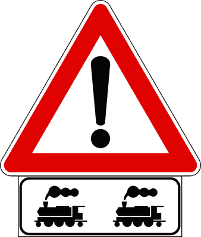
- **📖 الترجمة السياقية:** تشير الإشارة المعروضة إلى عبور قضبان مناورة.
- **💡 الشرح والقاعدة المرورية:** صحيح (VERO). الإشارة المكونة من 'أخطار أخرى' مع اللوحة تحذر من عبور قضبان المناورة على الطريق.
- **⚠️ كشف الفخ:** فخ الامتحان: الإشارة تعني عبور القضبان وليس سكة القطارات الرئيسية.
- **🔑 الكلمات المفتاحية:** `{'it': 'attraversamento di binari di manovra', 'ar': 'عبور قضبان المناورة'}` | `{'it': 'vero', 'ar': 'صحيح'}`

---

**120.** Il pannello integrativo raffigurato preavvisa la presenza di binari di manovra o di raccordo in prossimità di scali merci
- **الإجابة:** `VERO ✅ (صح)`
- 
- **📖 الترجمة السياقية:** تنذر اللوحة الإضافية المعروضة بوجود قضبان مناورة أو قضبان ربط بالقرب من محطات البضائع.
- **💡 الشرح والقاعدة المرورية:** صحيح (VERO). توجد هذه القضبان عادة بالقرب من محطات الشحن والموانئ والمناطق الصناعية (scali merci).
- **⚠️ كشف الفخ:** فخ الامتحان: scali merci = محطات البضائع؛ وهي الموقع النموذجي لهذه القضبان.
- **🔑 الكلمات المفتاحية:** `{'it': 'binari di raccordo', 'ar': 'قضبان الربط'}` | `{'it': 'scali merci', 'ar': 'محطات البضائع'}` | `{'it': 'vero', 'ar': 'صحيح'}`

---

**121.** Il segnale raffigurato invita a diminuire la velocità
- **الإجابة:** `VERO ✅ (صح)`
- 
- **📖 الترجمة السياقية:** تدعو الإشارة المعروضة إلى تخفيض السرعة.
- **💡 الشرح والقاعدة المرورية:** صحيح (VERO). كل إشارة خطر تفرض تخفيض السرعة والحذر، وعبور القضبان قد يسبب فقدان التماسك أو مواجهة عربات متحركة.
- **⚠️ كشف الفخ:** فخ الامتحان: إشارات الخطر تتطلب دائماً تخفيف السرعة.
- **🔑 الكلمات المفتاحية:** `{'it': 'diminuire la velocità', 'ar': 'تخفيض السرعة'}` | `{'it': 'vero', 'ar': 'صحيح'}`

---

**122.** Il pannello integrativo è abbinato al segnale ALTRI PERICOLI
- **الإجابة:** `VERO ✅ (صح)`
- 
- **📖 الترجمة السياقية:** اللوحة الإضافية المعروضة مقترنة بإشارة 'أخطار أخرى' (ALTRI PERICOLI).
- **💡 الشرح والقاعدة المرورية:** صحيح (VERO). توضع اللوحة تحت المثلث ذي علامة التعجب لتحديد طبيعة الخطر.
- **⚠️ كشف الفخ:** فخ الامتحان: علامة التعجب + لوحة = تحديد نوع الخطر.
- **🔑 الكلمات المفتاحية:** `{'it': 'ALTRI PERICOLI', 'ar': 'أخطار أخرى'}` | `{'it': 'vero', 'ar': 'صحيح'}`

---

**123.** Il pannello integrativo indica un'area attrezzata per gare di modellismo
- **الإجابة:** `FALSO ❌ (خطأ)`
- 
- **📖 الترجمة السياقية:** تشير اللوحة الإضافية المعروضة إلى منطقة مجهزة لمسابقات مجسمات القطارات (modellismo).
- **💡 الشرح والقاعدة المرورية:** خطأ (FALSO). اللوحة تحذير من قضبان مناورة حقيقية وليست إعلاناً عن نشاط ترفيهي.
- **⚠️ كشف الفخ:** فخ الامتحان: إجابة طريفة لتشتيت الانتباه.
- **🔑 الكلمات المفتاحية:** `{'it': 'gare di modellismo', 'ar': 'مسابقات المجسمات (فخ)'}` | `{'it': 'falso', 'ar': 'خطأ'}`

---

**124.** Il pannello integrativo raffigurato indica di fare attenzione perché la strada può essere attraversata dai tram
- **الإجابة:** `FALSO ❌ (خطأ)`
- 
- **📖 الترجمة السياقية:** تشير اللوحة الإضافية المعروضة إلى وجوب الانتباه لأن الطريق قد تعبره عربات الترام.
- **💡 الشرح والقاعدة المرورية:** خطأ (FALSO). عبور الترام له إشارة خطر خاصة برسم الترام؛ أما هذه اللوحة فتخص قضبان المناورة.
- **⚠️ كشف الفخ:** فخ الامتحان: قضبان المناورة ≠ ترام.
- **🔑 الكلمات المفتاحية:** `{'it': 'tram', 'ar': 'ترام (فخ)'}` | `{'it': 'binari di manovra', 'ar': 'قضبان مناورة'}` | `{'it': 'falso', 'ar': 'خطأ'}`

---

**125.** Il pannello integrativo raffigurato va rispettato dai conducenti dei treni
- **الإجابة:** `FALSO ❌ (خطأ)`
- 
- **📖 الترجمة السياقية:** يجب على سائقي القطارات احترام اللوحة الإضافية المعروضة.
- **💡 الشرح والقاعدة المرورية:** خطأ (FALSO). الإشارات الطرقية موجهة لمستخدمي الطريق، وليس لسائقي القطارات.
- **⚠️ كشف الفخ:** فخ الامتحان: الإشارة للسائقين على الطريق.
- **🔑 الكلمات المفتاحية:** `{'it': 'conducenti dei treni', 'ar': 'سائقو القطارات (فخ)'}` | `{'it': 'falso', 'ar': 'خطأ'}`

---

**126.** Il pannello integrativo raffigurato indica un passaggio a livello con due binari
- **الإجابة:** `FALSO ❌ (خطأ)`
- 
- **📖 الترجمة السياقية:** تشير اللوحة الإضافية المعروضة إلى تقاطع سكة حديد ذي خطين.
- **💡 الشرح والقاعدة المرورية:** خطأ (FALSO). تقاطع السكة الحديدية ذو الخطين يُشار إليه بصليب القديس أندراوس المزدوج، بينما اللوحة تخص قضبان المناورة.
- **⚠️ كشف الفخ:** فخ الامتحان: لا تخلط بين passaggio a livello وbinari di manovra.
- **🔑 الكلمات المفتاحية:** `{'it': 'passaggio a livello con due binari', 'ar': 'تقاطع سكة بخطين (فخ)'}` | `{'it': 'falso', 'ar': 'خطأ'}`

---

## 📌 Sgombraneve (12 domande)

**127.** Il pannello integrativo raffigurato indica la presenza di macchine sgombraneve al lavoro sulla strada
- **الإجابة:** `VERO ✅ (صح)`
- 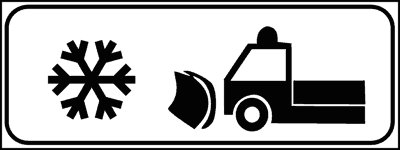
- **📖 الترجمة السياقية:** تشير اللوحة الإضافية المعروضة إلى وجود كاسحات ثلوج تعمل على الطريق.
- **💡 الشرح والقاعدة المرورية:** صحيح (VERO). اللوحة ترسم آلة كاسحة ثلج وتنبه لوجودها أثناء العمل على الطريق.
- **⚠️ كشف الفخ:** فخ الامتحان: sgombraneve = كاسحة ثلوج.
- **🔑 الكلمات المفتاحية:** `{'it': 'macchine sgombraneve', 'ar': 'كاسحات الثلوج'}` | `{'it': 'vero', 'ar': 'صحيح'}`

---

**128.** Il pannello integrativo raffigurato è abbinato al segnale ALTRI PERICOLI
- **الإجابة:** `VERO ✅ (صح)`
- 
- **📖 الترجمة السياقية:** اللوحة الإضافية المعروضة مقترنة بإشارة 'أخطار أخرى'.
- **💡 الشرح والقاعدة المرورية:** صحيح (VERO). توضع تحت المثلث ذي علامة التعجب لتحديد الخطر وهو كاسحات الثلوج.
- **⚠️ كشف الفخ:** فخ الامتحان: علامة التعجب + لوحة تحدد الخطر.
- **🔑 الكلمات المفتاحية:** `{'it': 'ALTRI PERICOLI', 'ar': 'أخطار أخرى'}` | `{'it': 'vero', 'ar': 'صحيح'}`

---

**129.** Il pannello integrativo raffigurato invita a diminuire la velocità per la presenza di macchine sgombraneve in funzione
- **الإجابة:** `VERO ✅ (صح)`
- 
- **📖 الترجمة السياقية:** تدعو اللوحة الإضافية المعروضة إلى تخفيض السرعة بسبب وجود كاسحات ثلوج قيد التشغيل.
- **💡 الشرح والقاعدة المرورية:** صحيح (VERO). كاسحات الثلوج بطيئة وتشغل جزءاً كبيراً من الطريق، فيلزم التخفيف والحذر.
- **⚠️ كشف الفخ:** فخ الامتحان: التخفيف واجب أمام الآليات البطيئة.
- **🔑 الكلمات المفتاحية:** `{'it': 'diminuire la velocità', 'ar': 'تخفيض السرعة'}` | `{'it': 'sgombraneve in funzione', 'ar': 'كاسحة قيد التشغيل'}` | `{'it': 'vero', 'ar': 'صحيح'}`

---

**130.** Il pannello integrativo raffigurato invita a mantenere una distanza di almeno 20 metri dalle macchine sgombraneve in funzione
- **الإجابة:** `VERO ✅ (صح)`
- 
- **📖 الترجمة السياقية:** تدعو اللوحة الإضافية المعروضة إلى الحفاظ على مسافة 20 متراً على الأقل من كاسحات الثلوج قيد التشغيل.
- **💡 الشرح والقاعدة المرورية:** صحيح (VERO). يفرض كود السير الحفاظ على مسافة لا تقل عن 20 متراً من كاسحات الثلوج العاملة بسبب الثلج والحصى المقذوف.
- **⚠️ كشف الفخ:** فخ الامتحان: المسافة الصحيحة 20 متراً وليست 100 متر.
- **🔑 الكلمات المفتاحية:** `{'it': 'almeno 20 metri', 'ar': '20 متراً على الأقل'}` | `{'it': 'distanza', 'ar': 'مسافة'}` | `{'it': 'vero', 'ar': 'صحيح'}`

---

**131.** Il pannello integrativo raffigurato indica di prestare attenzione a macchine sgombraneve sulla strada
- **الإجابة:** `VERO ✅ (صح)`
- 
- **📖 الترجمة السياقية:** تشير اللوحة الإضافية المعروضة إلى وجوب الانتباه لكاسحات الثلوج على الطريق.
- **💡 الشرح والقاعدة المرورية:** صحيح (VERO). اللوحة تحذير يستوجب الانتباه للآليات العاملة.
- **⚠️ كشف الفخ:** فخ الامتحان: عبارة صحيحة مباشرة.
- **🔑 الكلمات المفتاحية:** `{'it': 'prestare attenzione', 'ar': 'الانتباه'}` | `{'it': 'vero', 'ar': 'صحيح'}`

---

**132.** Il pannello integrativo raffigurato è posto su strade innevate per segnalare la presenza di macchine sgombraneve
- **الإجابة:** `VERO ✅ (صح)`
- 
- **📖 الترجمة السياقية:** توضع اللوحة الإضافية المعروضة على الطرق المغطاة بالثلوج للتنبيه بوجود كاسحات ثلوج.
- **💡 الشرح والقاعدة المرورية:** صحيح (VERO). موقعها الطبيعي الطرق الجبلية أو المغطاة بالثلج حيث تعمل الكاسحات.
- **⚠️ كشف الفخ:** فخ الامتحان: منطقي: الكاسحات تعمل حيث يوجد ثلج.
- **🔑 الكلمات المفتاحية:** `{'it': 'strade innevate', 'ar': 'طرق مغطاة بالثلج'}` | `{'it': 'vero', 'ar': 'صحيح'}`

---

**133.** Il pannello integrativo raffigurato indica la costruzione di un parco giochi nelle vicinanze
- **الإجابة:** `FALSO ❌ (خطأ)`
- 
- **📖 الترجمة السياقية:** تشير اللوحة الإضافية المعروضة إلى بناء حديقة ألعاب في المنطقة المجاورة.
- **💡 الشرح والقاعدة المرورية:** خطأ (FALSO). اللوحة تحذير من كاسحات الثلوج وليست إعلاناً عن حديقة ألعاب.
- **⚠️ كشف الفخ:** فخ الامتحان: إجابة مشتتة لا علاقة لها بالرمز.
- **🔑 الكلمات المفتاحية:** `{'it': 'parco giochi', 'ar': 'حديقة ألعاب (فخ)'}` | `{'it': 'falso', 'ar': 'خطأ'}`

---

**134.** Il pannello integrativo raffigurato indica il divieto di transito alle macchine sgombraneve
- **الإجابة:** `FALSO ❌ (خطأ)`
- 
- **📖 الترجمة السياقية:** تشير اللوحة الإضافية المعروضة إلى منع مرور كاسحات الثلوج.
- **💡 الشرح والقاعدة المرورية:** خطأ (FALSO). اللوحة تحذر من وجود الكاسحات، ولا تمنع مرورها.
- **⚠️ كشف الفخ:** فخ الامتحان: اللوحة تحذير وليست منعاً.
- **🔑 الكلمات المفتاحية:** `{'it': 'divieto di transito', 'ar': 'منع المرور (فخ)'}` | `{'it': 'falso', 'ar': 'خطأ'}`

---

**135.** Il pannello integrativo raffigurato indica l'obbligo di montare le catene
- **الإجابة:** `FALSO ❌ (خطأ)`
- 
- **📖 الترجمة السياقية:** تشير اللوحة الإضافية المعروضة إلى إلزامية تركيب السلاسل.
- **💡 الشرح والقاعدة المرورية:** خطأ (FALSO). إلزامية السلاسل لها إشارة إلزام دائرية زرقاء برسم إطار مع سلسلة.
- **⚠️ كشف الفخ:** فخ الامتحان: لا تخلط بين الثلج والكاسحة وإلزامية السلاسل.
- **🔑 الكلمات المفتاحية:** `{'it': 'obbligo di catene', 'ar': 'إلزامية السلاسل (فخ)'}` | `{'it': 'falso', 'ar': 'خطأ'}`

---

**136.** Il pannello integrativo raffigurato obbliga a stare distanti 100 metri dallo sgombraneve in funzione
- **الإجابة:** `FALSO ❌ (خطأ)`
- 
- **📖 الترجمة السياقية:** تلزم اللوحة الإضافية المعروضة بالابتعاد 100 متر عن كاسحة الثلوج قيد التشغيل.
- **💡 الشرح والقاعدة المرورية:** خطأ (FALSO). المسافة القانونية الدنيا هي 20 متراً وليس 100 متر.
- **⚠️ كشف الفخ:** فخ الامتحان: رقم 100 خاطئ، الصحيح 20 متراً.
- **🔑 الكلمات المفتاحية:** `{'it': '100 metri', 'ar': '100 متر (فخ)'}` | `{'it': '20 metri', 'ar': '20 متراً'}` | `{'it': 'falso', 'ar': 'خطأ'}`

---

**137.** Il pannello integrativo raffigurato indica che la strada è percorribile solo dopo che sia passato lo sgombraneve
- **الإجابة:** `FALSO ❌ (خطأ)`
- 
- **📖 الترجمة السياقية:** تشير اللوحة الإضافية المعروضة إلى أن الطريق لا يمكن سلوكه إلا بعد مرور كاسحة الثلوج.
- **💡 الشرح والقاعدة المرورية:** خطأ (FALSO). الطريق مفتوح للسير، واللوحة تحذر فقط من وجود الكاسحات العاملة.
- **⚠️ كشف الفخ:** فخ الامتحان: لا يوجد منع مرور مشروط.
- **🔑 الكلمات المفتاحية:** `{'it': 'percorribile solo dopo', 'ar': 'سالك فقط بعد (فخ)'}` | `{'it': 'falso', 'ar': 'خطأ'}`

---

**138.** Il pannello integrativo raffigurato indica che sulla strada è possibile incrociare il veicolo per la raccolta della spazzatura
- **الإجابة:** `FALSO ❌ (خطأ)`
- 
- **📖 الترجمة السياقية:** تشير اللوحة الإضافية المعروضة إلى إمكانية مصادفة مركبة جمع النفايات على الطريق.
- **💡 الشرح والقاعدة المرورية:** خطأ (FALSO). الرسم يمثل كاسحة ثلوج وليس شاحنة نفايات.
- **⚠️ كشف الفخ:** فخ الامتحان: لا تخلط بين الآليات.
- **🔑 الكلمات المفتاحية:** `{'it': 'raccolta della spazzatura', 'ar': 'جمع النفايات (فخ)'}` | `{'it': 'falso', 'ar': 'خطأ'}`

---

## 📌 Zona allagamento (10 domande)

**139.** Il pannello integrativo raffigurato indica una strada che in caso di forte pioggia si può allagare
- **الإجابة:** `VERO ✅ (صح)`
- 
- **📖 الترجمة السياقية:** تشير اللوحة الإضافية المعروضة إلى طريق يمكن أن يغمره الماء في حالة الأمطار الغزيرة.
- **💡 الشرح والقاعدة المرورية:** صحيح (VERO). لوحة 'zona soggetta ad allagamento' تحذر من مقطع معرض للغمر بالمياه عند هطول أمطار غزيرة.
- **⚠️ كشف الفخ:** فخ الامتحان: allagamento = غمر بالمياه/فيضان.
- **🔑 الكلمات المفتاحية:** `{'it': 'allagare', 'ar': 'يُغمر بالمياه'}` | `{'it': 'forte pioggia', 'ar': 'أمطار غزيرة'}` | `{'it': 'vero', 'ar': 'صحيح'}`

---

**140.** Il pannello integrativo raffigurato indica che stiamo percorrendo un tratto di strada che può allagarsi in caso di forte pioggia
- **الإجابة:** `VERO ✅ (صح)`
- 
- **📖 الترجمة السياقية:** تشير اللوحة الإضافية المعروضة إلى أننا نسير على مقطع طريق قد يُغمر بالمياه عند الأمطار الغزيرة.
- **💡 الشرح والقاعدة المرورية:** صحيح (VERO). التحذير يخص المقطع الذي نسلكه، ويستوجب الحذر من خطر الانزلاق المائي (aquaplaning).
- **⚠️ كشف الفخ:** فخ الامتحان: الخطر مرتبط بالأمطار الغزيرة.
- **🔑 الكلمات المفتاحية:** `{'it': 'tratto di strada', 'ar': 'مقطع طريق'}` | `{'it': 'aquaplaning', 'ar': 'انزلاق مائي'}` | `{'it': 'vero', 'ar': 'صحيح'}`

---

**141.** Il segnale raffigurato indica che la strada si può allagare in caso di forte pioggia
- **الإجابة:** `VERO ✅ (صح)`
- 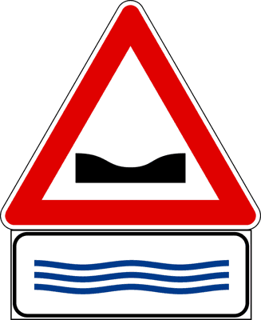
- **📖 الترجمة السياقية:** تشير الإشارة المعروضة إلى أن الطريق قد يُغمر بالمياه في حالة الأمطار الغزيرة.
- **💡 الشرح والقاعدة المرورية:** صحيح (VERO). الإشارة المكونة من المثلث واللوحة تحذر من خطر الغمر بالمياه.
- **⚠️ كشف الفخ:** فخ الامتحان: عبارة صحيحة مباشرة.
- **🔑 الكلمات المفتاحية:** `{'it': 'allagamento', 'ar': 'غمر بالمياه'}` | `{'it': 'vero', 'ar': 'صحيح'}`

---

**142.** Il pannello integrativo raffigurato indica il pericolo di allagamento della carreggiata in caso di pioggia o forte mareggiata
- **الإجابة:** `VERO ✅ (صح)`
- 
- **📖 الترجمة السياقية:** تشير اللوحة الإضافية المعروضة إلى خطر غمر نهر الطريق بالمياه في حالة المطر أو المد البحري القوي.
- **💡 الشرح والقاعدة المرورية:** صحيح (VERO). الغمر قد ينتج عن الأمطار أو عن ارتفاع الأمواج (mareggiata) في الطرق الساحلية.
- **⚠️ كشف الفخ:** فخ الامتحان: المد البحري (mareggiata) سبب صحيح أيضاً.
- **🔑 الكلمات المفتاحية:** `{'it': 'mareggiata', 'ar': 'مد / أمواج بحرية قوية'}` | `{'it': 'pioggia', 'ar': 'مطر'}` | `{'it': 'vero', 'ar': 'صحيح'}`

---

**143.** Il pannello integrativo raffigurato indica una piscina nelle vicinanze
- **الإجابة:** `FALSO ❌ (خطأ)`
- 
- **📖 الترجمة السياقية:** تشير اللوحة الإضافية المعروضة إلى وجود مسبح في المنطقة المجاورة.
- **💡 الشرح والقاعدة المرورية:** خطأ (FALSO). اللوحة تحذير من خطر غمر الطريق بالمياه وليست إعلاناً عن مسبح.
- **⚠️ كشف الفخ:** فخ الامتحان: رمز الماء لا يعني مسبحاً.
- **🔑 الكلمات المفتاحية:** `{'it': 'piscina', 'ar': 'مسبح (فخ)'}` | `{'it': 'falso', 'ar': 'خطأ'}`

---

**144.** Il pannello integrativo raffigurato indica un tratto di strada coperto di neve
- **الإجابة:** `FALSO ❌ (خطأ)`
- 
- **📖 الترجمة السياقية:** تشير اللوحة الإضافية المعروضة إلى مقطع طريق مغطى بالثلج.
- **💡 الشرح والقاعدة المرورية:** خطأ (FALSO). خطر الثلج له رمز ندفة الثلج، أما هذه فتخص الغمر بالمياه.
- **⚠️ كشف الفخ:** فخ الامتحان: ماء ≠ ثلج.
- **🔑 الكلمات المفتاحية:** `{'it': 'coperto di neve', 'ar': 'مغطى بالثلج (فخ)'}` | `{'it': 'falso', 'ar': 'خطأ'}`

---

**145.** Il pannello integrativo raffigurato preavvisa una banchina cedevole
- **الإجابة:** `FALSO ❌ (خطأ)`
- 
- **📖 الترجمة السياقية:** تنذر اللوحة الإضافية المعروضة بوجود كتف طريق رخو (banchina cedevole).
- **💡 الشرح والقاعدة المرورية:** خطأ (FALSO). كتف الطريق الرخو له إشارة خطر مستقلة؛ هذه اللوحة تخص الغمر بالمياه.
- **⚠️ كشف الفخ:** فخ الامتحان: لا تخلط بين الأخطار المختلفة.
- **🔑 الكلمات المفتاحية:** `{'it': 'banchina cedevole', 'ar': 'كتف رخو (فخ)'}` | `{'it': 'falso', 'ar': 'خطأ'}`

---

**146.** Il pannello integrativo raffigurato vieta il transito ai veicoli che trasportano prodotti che potrebbero inquinare l'acqua
- **الإجابة:** `FALSO ❌ (خطأ)`
- 
- **📖 الترجمة السياقية:** تمنع اللوحة الإضافية المعروضة مرور المركبات التي تنقل مواد قد تلوث المياه.
- **💡 الشرح والقاعدة المرورية:** خطأ (FALSO). منع نقل المواد الملوثة للمياه له شاخصة منع دائرية خاصة؛ اللوحة هنا تحذير فقط.
- **⚠️ كشف الفخ:** فخ الامتحان: اللوحة تحذير وليست منعاً.
- **🔑 الكلمات المفتاحية:** `{'it': "prodotti che inquinano l'acqua", 'ar': 'مواد ملوثة للمياه (فخ)'}` | `{'it': 'falso', 'ar': 'خطأ'}`

---

**147.** Il pannello integrativo raffigurato indica un tratto di strada dove è possibile trovare nebbia
- **الإجابة:** `FALSO ❌ (خطأ)`
- 
- **📖 الترجمة السياقية:** تشير اللوحة الإضافية المعروضة إلى مقطع طريق يمكن أن يكون فيه ضباب.
- **💡 الشرح والقاعدة المرورية:** خطأ (FALSO). الضباب له لوحة خاصة، بينما هذه تخص خطر الغمر بالمياه.
- **⚠️ كشف الفخ:** فخ الامتحان: ضباب ≠ غمر بالمياه.
- **🔑 الكلمات المفتاحية:** `{'it': 'nebbia', 'ar': 'ضباب (فخ)'}` | `{'it': 'falso', 'ar': 'خطأ'}`

---

**148.** Il pannello integrativo raffigurato preavvisa la presenza di cordoli trasversali di rallentamento (dossi artificiali)
- **الإجابة:** `FALSO ❌ (خطأ)`
- 
- **📖 الترجمة السياقية:** تنذر اللوحة الإضافية المعروضة بوجود مطبات عرضية صناعية لتخفيض السرعة.
- **💡 الشرح والقاعدة المرورية:** خطأ (FALSO). المطبات الصناعية لها إشارة 'طريق مشوّه' أو 'مطب'، وليست لوحة الغمر بالمياه.
- **⚠️ كشف الفخ:** فخ الامتحان: الرمز لا يمثل مطبات.
- **🔑 الكلمات المفتاحية:** `{'it': 'dossi artificiali', 'ar': 'مطبات صناعية (فخ)'}` | `{'it': 'falso', 'ar': 'خطأ'}`

---

## 📌 Presenza code (11 domande)

**149.** Il pannello integrativo raffigurato indica la possibilità di trovare traffico intenso, con formazione di colonne di veicoli
- **الإجابة:** `VERO ✅ (صح)`
- 
- **📖 الترجمة السياقية:** تشير اللوحة الإضافية المعروضة إلى إمكانية مصادفة حركة مرور كثيفة مع تشكل طوابير من المركبات.
- **💡 الشرح والقاعدة المرورية:** صحيح (VERO). لوحة 'code' (طوابير) ترسم مركبات متتالية وتنبه إلى احتمال وجود ازدحام وطوابير.
- **⚠️ كشف الفخ:** فخ الامتحان: code = طوابير مركبات.
- **🔑 الكلمات المفتاحية:** `{'it': 'code', 'ar': 'طوابير'}` | `{'it': 'traffico intenso', 'ar': 'حركة مرور كثيفة'}` | `{'it': 'vero', 'ar': 'صحيح'}`

---

**150.** Il pannello integrativo raffigurato indica la possibilità di trovare veicoli fermi in colonna
- **الإجابة:** `VERO ✅ (صح)`
- 
- **📖 الترجمة السياقية:** تشير اللوحة الإضافية المعروضة إلى إمكانية مصادفة مركبات متوقفة في طابور.
- **💡 الشرح والقاعدة المرورية:** صحيح (VERO). الطوابير قد تكون متوقفة تماماً، فيجب الاستعداد للتوقف المفاجئ.
- **⚠️ كشف الفخ:** فخ الامتحان: خطر الاصطدام الخلفي مرتفع.
- **🔑 الكلمات المفتاحية:** `{'it': 'veicoli fermi in colonna', 'ar': 'مركبات متوقفة في طابور'}` | `{'it': 'vero', 'ar': 'صحيح'}`

---

**151.** Il pannello integrativo raffigurato si può trovare all'ingresso delle autostrade, per indicare che vi sono veicoli in lento movimento
- **الإجابة:** `VERO ✅ (صح)`
- 
- **📖 الترجمة السياقية:** يمكن مصادفة اللوحة الإضافية المعروضة عند مداخل الطرق السريعة للإشارة إلى وجود مركبات تسير ببطء.
- **💡 الشرح والقاعدة المرورية:** صحيح (VERO). توضع غالباً عند مداخل الأوتوستراد لإعلام السائقين مسبقاً بوجود ازدحام وبطء في السير.
- **⚠️ كشف الفخ:** فخ الامتحان: الاستخدام على الطرق السريعة صحيح ومعتاد.
- **🔑 الكلمات المفتاحية:** `{'it': 'ingresso delle autostrade', 'ar': 'مداخل الطرق السريعة'}` | `{'it': 'lento movimento', 'ar': 'حركة بطيئة'}` | `{'it': 'vero', 'ar': 'صحيح'}`

---

**152.** Il pannello integrativo raffigurato invita ad usare prudenza, per non tamponare veicoli fermi per intasamento del traffico
- **الإجابة:** `VERO ✅ (صح)`
- 
- **📖 الترجمة السياقية:** تدعو اللوحة الإضافية المعروضة إلى الحذر لتجنب الاصطدام من الخلف بمركبات متوقفة بسبب الازدحام.
- **💡 الشرح والقاعدة المرورية:** صحيح (VERO). الهدف الأساسي من لوحة الطوابير هو منع حوادث الاصطدام الخلفي (tamponamento).
- **⚠️ كشف الفخ:** فخ الامتحان: tamponare = الاصطدام من الخلف.
- **🔑 الكلمات المفتاحية:** `{'it': 'tamponare', 'ar': 'الاصطدام من الخلف'}` | `{'it': 'intasamento', 'ar': 'ازدحام'}` | `{'it': 'vero', 'ar': 'صحيح'}`

---

**153.** Il pannello integrativo raffigurato, posto sull'autostrada, può consigliare di uscire per evitare probabili rallentamenti o code
- **الإجابة:** `VERO ✅ (صح)`
- 
- **📖 الترجمة السياقية:** يمكن للوحة الإضافية المعروضة، عند وضعها على الطريق السريع، أن تنصح بالخروج لتفادي التباطؤ أو الطوابير المحتملة.
- **💡 الشرح والقاعدة المرورية:** صحيح (VERO). قد تُستخدم على الطرق السريعة مع لوحات توجيهية لنصح السائقين بسلوك طريق بديل.
- **⚠️ كشف الفخ:** فخ الامتحان: النصيحة بالخروج استخدام صحيح.
- **🔑 الكلمات المفتاحية:** `{'it': 'consigliare di uscire', 'ar': 'النصح بالخروج'}` | `{'it': 'rallentamenti', 'ar': 'تباطؤ'}` | `{'it': 'vero', 'ar': 'صحيح'}`

---

**154.** Il pannello raffigurato indica un'area di parcheggio per autovetture
- **الإجابة:** `FALSO ❌ (خطأ)`
- 
- **📖 الترجمة السياقية:** تشير اللوحة المعروضة إلى منطقة مواقف لسيارات الركوب.
- **💡 الشرح والقاعدة المرورية:** خطأ (FALSO). المواقف لها شاخصة P زرقاء؛ وصفّ السيارات في اللوحة يمثل طابوراً متحركاً وليس موقفاً.
- **⚠️ كشف الفخ:** فخ الامتحان: السيارات المتتالية = طابور وليس موقف.
- **🔑 الكلمات المفتاحية:** `{'it': 'area di parcheggio', 'ar': 'منطقة مواقف (فخ)'}` | `{'it': 'falso', 'ar': 'خطأ'}`

---

**155.** Il pannello integrativo raffigurato indica che la corsia di sinistra è riservata ai veicoli che pagano il pedaggio autostradale tramite telepass
- **الإجابة:** `FALSO ❌ (خطأ)`
- 
- **📖 الترجمة السياقية:** تشير اللوحة الإضافية المعروضة إلى أن المسلك الأيسر مخصص للمركبات التي تدفع رسوم الطريق السريع عبر التليباس (telepass).
- **💡 الشرح والقاعدة المرورية:** خطأ (FALSO). مسالك التليباس لها إشارات صفراء خاصة؛ واللوحة تحذر من الطوابير.
- **⚠️ كشف الفخ:** فخ الامتحان: لا علاقة للوحة بنظام الدفع.
- **🔑 الكلمات المفتاحية:** `{'it': 'telepass', 'ar': 'تليباس (فخ)'}` | `{'it': 'falso', 'ar': 'خطأ'}`

---

**156.** Il pannello integrativo raffigurato indica una strada a senso unico
- **الإجابة:** `FALSO ❌ (خطأ)`
- 
- **📖 الترجمة السياقية:** تشير اللوحة الإضافية المعروضة إلى طريق ذي اتجاه واحد.
- **💡 الشرح والقاعدة المرورية:** خطأ (FALSO). اللوحة تحذير من الطوابير ولا علاقة لها باتجاه السير.
- **⚠️ كشف الفخ:** فخ الامتحان: إجابة مشتتة.
- **🔑 الكلمات المفتاحية:** `{'it': 'senso unico', 'ar': 'اتجاه واحد (فخ)'}` | `{'it': 'falso', 'ar': 'خطأ'}`

---

**157.** Il pannello integrativo raffigurato indica l'obbligo di sorpassare a sinistra
- **الإجابة:** `FALSO ❌ (خطأ)`
- 
- **📖 الترجمة السياقية:** تشير اللوحة الإضافية المعروضة إلى إلزامية التجاوز من اليسار.
- **💡 الشرح والقاعدة المرورية:** خطأ (FALSO). اللوحة لا تفرض أي مناورة، بل تحذر من وجود طوابير.
- **⚠️ كشف الفخ:** فخ الامتحان: اللوحة تحذيرية وليست إلزامية.
- **🔑 الكلمات المفتاحية:** `{'it': 'obbligo di sorpassare', 'ar': 'إلزامية التجاوز (فخ)'}` | `{'it': 'falso', 'ar': 'خطأ'}`

---

**158.** Il pannello integrativo raffigurato indica di diminuire la distanza di sicurezza
- **الإجابة:** `FALSO ❌ (خطأ)`
- 
- **📖 الترجمة السياقية:** تشير اللوحة الإضافية المعروضة إلى وجوب تقليص مسافة الأمان.
- **💡 الشرح والقاعدة المرورية:** خطأ (FALSO). على العكس، وجود طوابير يستلزم زيادة الانتباه والحفاظ على مسافة أمان كافية لتجنب الاصطدام الخلفي.
- **⚠️ كشف الفخ:** فخ الامتحان: تقليص مسافة الأمان يزيد الخطر دائماً.
- **🔑 الكلمات المفتاحية:** `{'it': 'diminuire la distanza di sicurezza', 'ar': 'تقليص مسافة الأمان (فخ)'}` | `{'it': 'falso', 'ar': 'خطأ'}`

---

**159.** Il pannello integrativo raffigurato obbliga i veicoli a circolare a passo d'uomo
- **الإجابة:** `FALSO ❌ (خطأ)`
- 
- **📖 الترجمة السياقية:** تلزم اللوحة الإضافية المعروضة المركبات بالسير بسرعة المشي (a passo d'uomo).
- **💡 الشرح والقاعدة المرورية:** خطأ (FALSO). اللوحة لا تفرض سرعة محددة، بل تحذر من احتمال وجود طوابير.
- **⚠️ كشف الفخ:** فخ الامتحان: لا يوجد إلزام بسرعة معينة.
- **🔑 الكلمات المفتاحية:** `{'it': "passo d'uomo", 'ar': 'سرعة المشي (فخ)'}` | `{'it': 'falso', 'ar': 'خطأ'}`

---

## 📌 Mezzi lavoro (11 domande)

**160.** Il pannello integrativo raffigurato indica la possibile presenza di macchine operatrici in movimento
- **الإجابة:** `VERO ✅ (صح)`
- 
- **📖 الترجمة السياقية:** تشير اللوحة الإضافية المعروضة إلى احتمال وجود آليات عمل متحركة.
- **💡 الشرح والقاعدة المرورية:** صحيح (VERO). لوحة 'mezzi di lavoro in azione' ترسم آلية حفر وتحذر من آليات أشغال (macchine operatrici) تتحرك على الطريق.
- **⚠️ كشف الفخ:** فخ الامتحان: macchine operatrici = آليات العمل والأشغال.
- **🔑 الكلمات المفتاحية:** `{'it': 'macchine operatrici', 'ar': 'آليات العمل'}` | `{'it': 'in movimento', 'ar': 'متحركة'}` | `{'it': 'vero', 'ar': 'صحيح'}`

---

**161.** Il pannello integrativo raffigurato indica che sulla corsia possono esserci pale meccaniche al lavoro
- **الإجابة:** `VERO ✅ (صح)`
- 
- **📖 الترجمة السياقية:** تشير اللوحة الإضافية المعروضة إلى احتمال وجود جرافات (pale meccaniche) تعمل على المسلك.
- **💡 الشرح والقاعدة المرورية:** صحيح (VERO). الجرافات من آليات الأشغال التي تحذر منها اللوحة.
- **⚠️ كشف الفخ:** فخ الامتحان: pale meccaniche = جرافات.
- **🔑 الكلمات المفتاحية:** `{'it': 'pale meccaniche', 'ar': 'جرافات'}` | `{'it': 'vero', 'ar': 'صحيح'}`

---

**162.** Il pannello integrativo raffigurato indica che sulla strada possono esserci escavatori in movimento
- **الإجابة:** `VERO ✅ (صح)`
- 
- **📖 الترجمة السياقية:** تشير اللوحة الإضافية المعروضة إلى احتمال وجود حفارات متحركة على الطريق.
- **💡 الشرح والقاعدة المرورية:** صحيح (VERO). الحفارات (escavatori) تندرج ضمن آليات العمل المشار إليها.
- **⚠️ كشف الفخ:** فخ الامتحان: escavatori = حفارات.
- **🔑 الكلمات المفتاحية:** `{'it': 'escavatori', 'ar': 'حفارات'}` | `{'it': 'vero', 'ar': 'صحيح'}`

---

**163.** Il pannello integrativo raffigurato invita ad usare particolare prudenza per la presenza di pale meccaniche in movimento
- **الإجابة:** `VERO ✅ (صح)`
- 
- **📖 الترجمة السياقية:** تدعو اللوحة الإضافية المعروضة إلى حذر خاص بسبب وجود جرافات متحركة.
- **💡 الشرح والقاعدة المرورية:** صحيح (VERO). الآليات الثقيلة بطيئة وقد تقوم بمناورات مفاجئة، فيلزم الحذر.
- **⚠️ كشف الفخ:** فخ الامتحان: عبارة صحيحة مباشرة.
- **🔑 الكلمات المفتاحية:** `{'it': 'particolare prudenza', 'ar': 'حذر خاص'}` | `{'it': 'vero', 'ar': 'صحيح'}`

---

**164.** Il pannello integrativo raffigurato indica la presenza di cantieri stradali con escavatori e pale meccaniche in azione
- **الإجابة:** `VERO ✅ (صح)`
- 
- **📖 الترجمة السياقية:** تشير اللوحة الإضافية المعروضة إلى وجود ورش طرقية بها حفارات وجرافات تعمل.
- **💡 الشرح والقاعدة المرورية:** صحيح (VERO). غالباً ما ترتبط اللوحة بورش أشغال تعمل فيها آليات ثقيلة.
- **⚠️ كشف الفخ:** فخ الامتحان: ورشة + آليات = صحيح.
- **🔑 الكلمات المفتاحية:** `{'it': 'cantieri stradali', 'ar': 'ورش طرقية'}` | `{'it': 'vero', 'ar': 'صحيح'}`

---

**165.** Il pannello integrativo raffigurato indica la presenza di veicoli militari
- **الإجابة:** `FALSO ❌ (خطأ)`
- 
- **📖 الترجمة السياقية:** تشير اللوحة الإضافية المعروضة إلى وجود مركبات عسكرية.
- **💡 الشرح والقاعدة المرورية:** خطأ (FALSO). الرسم يمثل آلية حفر وليس مركبة عسكرية.
- **⚠️ كشف الفخ:** فخ الامتحان: لا تخلط بين الجرافة والدبابة.
- **🔑 الكلمات المفتاحية:** `{'it': 'veicoli militari', 'ar': 'مركبات عسكرية (فخ)'}` | `{'it': 'falso', 'ar': 'خطأ'}`

---

**166.** Il pannello integrativo raffigurato indica un'area per lo scarico della spazzatura
- **الإجابة:** `FALSO ❌ (خطأ)`
- 
- **📖 الترجمة السياقية:** تشير اللوحة الإضافية المعروضة إلى منطقة لتفريغ النفايات.
- **💡 الشرح والقاعدة المرورية:** خطأ (FALSO). اللوحة تحذير من آليات العمل وليست دلالة على مكب نفايات.
- **⚠️ كشف الفخ:** فخ الامتحان: إجابة مشتتة.
- **🔑 الكلمات المفتاحية:** `{'it': 'scarico della spazzatura', 'ar': 'تفريغ النفايات (فخ)'}` | `{'it': 'falso', 'ar': 'خطأ'}`

---

**167.** Il pannello integrativo raffigurato si trova prima di un ponte, per vietare il transito alle macchine operatrici
- **الإجابة:** `FALSO ❌ (خطأ)`
- 
- **📖 الترجمة السياقية:** توجد اللوحة الإضافية المعروضة قبل جسر لمنع مرور آليات العمل.
- **💡 الشرح والقاعدة المرورية:** خطأ (FALSO). اللوحة تحذيرية ولا تمنع المرور.
- **⚠️ كشف الفخ:** فخ الامتحان: التحذير ≠ المنع.
- **🔑 الكلمات المفتاحية:** `{'it': 'vietare il transito', 'ar': 'منع المرور (فخ)'}` | `{'it': 'falso', 'ar': 'خطأ'}`

---

**168.** Il pannello integrativo raffigurato indica una strada riservata alle sole macchine operatrici
- **الإجابة:** `FALSO ❌ (خطأ)`
- 
- **📖 الترجمة السياقية:** تشير اللوحة الإضافية المعروضة إلى طريق مخصص لآليات العمل فقط.
- **💡 الشرح والقاعدة المرورية:** خطأ (FALSO). الطريق مفتوح لجميع المركبات، واللوحة تحذر فقط من وجود آليات العمل.
- **⚠️ كشف الفخ:** فخ الامتحان: كلمة 'sole' حصرية خاطئة.
- **🔑 الكلمات المفتاحية:** `{'it': 'riservata alle sole macchine operatrici', 'ar': 'مخصص لآليات العمل فقط (فخ)'}` | `{'it': 'falso', 'ar': 'خطأ'}`

---

**169.** Il pannello integrativo raffigurato indica divieto di transito a tutti i veicoli con i cingoli
- **الإجابة:** `FALSO ❌ (خطأ)`
- 
- **📖 الترجمة السياقية:** تشير اللوحة الإضافية المعروضة إلى منع مرور جميع المركبات ذات الجنازير.
- **💡 الشرح والقاعدة المرورية:** خطأ (FALSO). اللوحة لا تمنع شيئاً، بل تحذر من آليات عمل متحركة.
- **⚠️ كشف الفخ:** فخ الامتحان: التحذير ليس منعاً.
- **🔑 الكلمات المفتاحية:** `{'it': 'veicoli con i cingoli', 'ar': 'مركبات بجنازير (فخ)'}` | `{'it': 'falso', 'ar': 'خطأ'}`

---

**170.** Il pannello integrativo raffigurato indica un'area di parcheggio riservata alle macchine operatrici
- **الإجابة:** `FALSO ❌ (خطأ)`
- 
- **📖 الترجمة السياقية:** تشير اللوحة الإضافية المعروضة إلى منطقة مواقف مخصصة لآليات العمل.
- **💡 الشرح والقاعدة المرورية:** خطأ (FALSO). اللوحة تحذير من آليات تتحرك وتعمل، وليست موقفاً لها.
- **⚠️ كشف الفخ:** فخ الامتحان: in azione = قيد العمل وليس متوقفاً.
- **🔑 الكلمات المفتاحية:** `{'it': 'parcheggio', 'ar': 'موقف (فخ)'}` | `{'it': 'falso', 'ar': 'خطأ'}`

---

## 📌 Strada ghiacciata (12 domande)

**171.** Il segnale raffigurato indica la possibilità di trovare un tratto di strada sdrucciolevole a causa di ghiaccio
- **الإجابة:** `VERO ✅ (صح)`
- 
- **📖 الترجمة السياقية:** تشير الإشارة المعروضة إلى إمكانية مصادفة مقطع طريق زلق بسبب الجليد.
- **💡 الشرح والقاعدة المرورية:** صحيح (VERO). إشارة الطريق الزلق مع لوحة ندفة الثلج (strada ghiacciata) تحذر من خطر الانزلاق بسبب الجليد.
- **⚠️ كشف الفخ:** فخ الامتحان: الجليد (ghiaccio) سبب للانزلاق.
- **🔑 الكلمات المفتاحية:** `{'it': 'sdrucciolevole per ghiaccio', 'ar': 'زلق بسبب الجليد'}` | `{'it': 'vero', 'ar': 'صحيح'}`

---

**172.** Il pannello integrativo raffigurato indica la possibilità di trovare tratti di strada ghiacciati
- **الإجابة:** `VERO ✅ (صح)`
- 
- **📖 الترجمة السياقية:** تشير اللوحة الإضافية المعروضة إلى إمكانية مصادفة مقاطع طريق متجمدة.
- **💡 الشرح والقاعدة المرورية:** صحيح (VERO). رمز ندفة الثلج يدل على احتمال وجود جليد على سطح الطريق.
- **⚠️ كشف الفخ:** فخ الامتحان: ندفة الثلج = خطر الجليد.
- **🔑 الكلمات المفتاحية:** `{'it': 'tratti ghiacciati', 'ar': 'مقاطع متجمدة'}` | `{'it': 'vero', 'ar': 'صحيح'}`

---

**173.** Il pannello integrativo raffigurato indica, in caso di bassa temperatura, la presenza di tratti pericolosi per ghiaccio
- **الإجابة:** `VERO ✅ (صح)`
- 
- **📖 الترجمة السياقية:** تشير اللوحة الإضافية المعروضة، في حالة انخفاض درجة الحرارة، إلى وجود مقاطع خطرة بسبب الجليد.
- **💡 الشرح والقاعدة المرورية:** صحيح (VERO). يتشكل الجليد عند انخفاض الحرارة، خاصة على الجسور والمناطق الظليلة.
- **⚠️ كشف الفخ:** فخ الامتحان: الربط بين البرودة والجليد صحيح.
- **🔑 الكلمات المفتاحية:** `{'it': 'bassa temperatura', 'ar': 'انخفاض الحرارة'}` | `{'it': 'ghiaccio', 'ar': 'جليد'}` | `{'it': 'vero', 'ar': 'صحيح'}`

---

**174.** Il pannello integrativo raffigurato indica, su strade coperte di neve, il pericolo di formazione di ghiaccio
- **الإجابة:** `VERO ✅ (صح)`
- 
- **📖 الترجمة السياقية:** تشير اللوحة الإضافية المعروضة، على الطرق المغطاة بالثلج، إلى خطر تشكل الجليد.
- **💡 الشرح والقاعدة المرورية:** صحيح (VERO). الثلج المضغوط قد يتحول إلى جليد زلق شديد الخطورة.
- **⚠️ كشف الفخ:** فخ الامتحان: الثلج قد يتحول إلى جليد.
- **🔑 الكلمات المفتاحية:** `{'it': 'strade coperte di neve', 'ar': 'طرق مغطاة بالثلج'}` | `{'it': 'formazione di ghiaccio', 'ar': 'تشكل الجليد'}` | `{'it': 'vero', 'ar': 'صحيح'}`

---

**175.** Il pannello integrativo raffigurato invita ad usare particolare prudenza, perché la strada può essere ghiacciata
- **الإجابة:** `VERO ✅ (صح)`
- 
- **📖 الترجمة السياقية:** تدعو اللوحة الإضافية المعروضة إلى حذر خاص لأن الطريق قد يكون متجمداً.
- **💡 الشرح والقاعدة المرورية:** صحيح (VERO). الجليد يقلل التماسك بشدة ويزيد مسافة الكبح، فيلزم الحذر والتخفيف.
- **⚠️ كشف الفخ:** فخ الامتحان: مسافة الكبح تتضاعف على الجليد.
- **🔑 الكلمات المفتاحية:** `{'it': 'particolare prudenza', 'ar': 'حذر خاص'}` | `{'it': 'ghiacciata', 'ar': 'متجمدة'}` | `{'it': 'vero', 'ar': 'صحيح'}`

---

**176.** Il segnale raffigurato indica strada sdrucciolevole per ghiaccio, in caso di bassa temperatura
- **الإجابة:** `VERO ✅ (صح)`
- 
- **📖 الترجمة السياقية:** تشير الإشارة المعروضة إلى طريق زلق بسبب الجليد في حالة انخفاض درجة الحرارة.
- **💡 الشرح والقاعدة المرورية:** صحيح (VERO). هذا هو المعنى الدقيق لاقتران إشارة الطريق الزلق بلوحة الجليد.
- **⚠️ كشف الفخ:** فخ الامتحان: عبارة صحيحة مباشرة.
- **🔑 الكلمات المفتاحية:** `{'it': 'strada sdrucciolevole per ghiaccio', 'ar': 'طريق زلق بسبب الجليد'}` | `{'it': 'vero', 'ar': 'صحيح'}`

---

**177.** Il pannello integrativo raffigurato indica la presenza nelle vicinanze di impianti di risalita
- **الإجابة:** `FALSO ❌ (خطأ)`
- 
- **📖 الترجمة السياقية:** تشير اللوحة الإضافية المعروضة إلى وجود مصاعد تزلج (impianti di risalita) في المنطقة المجاورة.
- **💡 الشرح والقاعدة المرورية:** خطأ (FALSO). رمز ندفة الثلج في اللوحة يحذر من خطر الجليد على الطريق، ولا يعلن عن مرافق سياحية أو رياضية.
- **⚠️ كشف الفخ:** فخ الامتحان: ندفة الثلج = خطر جليد، وليست إعلاناً سياحياً.
- **🔑 الكلمات المفتاحية:** `{'it': 'impianti di risalita', 'ar': 'مصاعد التزلج (فخ)'}` | `{'it': 'ghiaccio', 'ar': 'جليد'}` | `{'it': 'falso', 'ar': 'خطأ'}`

---

**178.** Il pannello integrativo raffigurato indica la strada da prendere per raggiungere le alpi
- **الإجابة:** `FALSO ❌ (خطأ)`
- 
- **📖 الترجمة السياقية:** تشير اللوحة الإضافية المعروضة إلى الطريق الواجب سلوكه للوصول إلى جبال الألب.
- **💡 الشرح والقاعدة المرورية:** خطأ (FALSO). اللوحة تحذيرية وليست توجيهية؛ والتوجيه يكون بإشارات الإرشاد ذات أسماء الأماكن.
- **⚠️ كشف الفخ:** فخ الامتحان: لوحات الخطر لا تحدد الوجهات.
- **🔑 الكلمات المفتاحية:** `{'it': 'raggiungere le alpi', 'ar': 'الوصول للألب (فخ)'}` | `{'it': 'falso', 'ar': 'خطأ'}`

---

**179.** Il pannello integrativo raffigurato indica la presenza nelle vicinanze di una stazione sciistica
- **الإجابة:** `FALSO ❌ (خطأ)`
- 
- **📖 الترجمة السياقية:** تشير اللوحة الإضافية المعروضة إلى وجود محطة تزلج في المنطقة المجاورة.
- **💡 الشرح والقاعدة المرورية:** خطأ (FALSO). محطات التزلج تُعلن بإشارات سياحية بنية اللون، بينما هذه اللوحة تحذر من الجليد.
- **⚠️ كشف الفخ:** فخ الامتحان: الإشارات السياحية بنية وليست لوحات خطر.
- **🔑 الكلمات المفتاحية:** `{'it': 'stazione sciistica', 'ar': 'محطة تزلج (فخ)'}` | `{'it': 'falso', 'ar': 'خطأ'}`

---

**180.** Il pannello integrativo raffigurato invita ad usare le luci di emergenza durante la sosta
- **الإجابة:** `FALSO ❌ (خطأ)`
- 
- **📖 الترجمة السياقية:** تدعو اللوحة الإضافية المعروضة إلى استخدام أضواء الطوارئ أثناء الوقوف.
- **💡 الشرح والقاعدة المرورية:** خطأ (FALSO). اللوحة لا تفرض أي استخدام للأضواء؛ هي تحذير من الجليد فقط.
- **⚠️ كشف الفخ:** فخ الامتحان: لا علاقة للوحة بالأضواء.
- **🔑 الكلمات المفتاحية:** `{'it': 'luci di emergenza', 'ar': 'أضواء الطوارئ (فخ)'}` | `{'it': 'falso', 'ar': 'خطأ'}`

---

**181.** Il pannello integrativo raffigurato invita a non usare i fari abbaglianti
- **الإجابة:** `FALSO ❌ (خطأ)`
- 
- **📖 الترجمة السياقية:** تدعو اللوحة الإضافية المعروضة إلى عدم استخدام الأضواء العالية (abbaglianti).
- **💡 الشرح والقاعدة المرورية:** خطأ (FALSO). استخدام الأضواء العالية تنظمه قواعد الإضاءة العامة، واللوحة تحذر من الجليد فقط.
- **⚠️ كشف الفخ:** فخ الامتحان: اللوحة لا تنظم الأضواء.
- **🔑 الكلمات المفتاحية:** `{'it': 'fari abbaglianti', 'ar': 'الأضواء العالية (فخ)'}` | `{'it': 'falso', 'ar': 'خطأ'}`

---

**182.** Il pannello integrativo raffigurato indica una zona dove nevica spesso
- **الإجابة:** `FALSO ❌ (خطأ)`
- 
- **📖 الترجمة السياقية:** تشير اللوحة الإضافية المعروضة إلى منطقة يتساقط فيها الثلج بكثرة.
- **💡 الشرح والقاعدة المرورية:** خطأ (FALSO). اللوحة تحذر من خطر الجليد على سطح الطريق، وليست بياناً مناخياً عن تكرار تساقط الثلج.
- **⚠️ كشف الفخ:** فخ الامتحان: الخطر هو الجليد على الأسفلت وليس كثرة التساقط.
- **🔑 الكلمات المفتاحية:** `{'it': 'nevica spesso', 'ar': 'يتساقط الثلج كثيراً (فخ)'}` | `{'it': 'falso', 'ar': 'خطأ'}`

---

## 📌 Strada pioggia (12 domande)

**183.** Il pannello integrativo raffigurato indica un tratto di strada pericoloso in caso di pioggia
- **الإجابة:** `VERO ✅ (صح)`
- 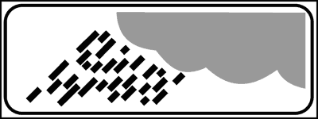
- **📖 الترجمة السياقية:** تشير اللوحة الإضافية المعروضة إلى مقطع طريق خطر في حالة المطر.
- **💡 الشرح والقاعدة المرورية:** صحيح (VERO). لوحة المطر (رسم سحابة وقطرات) تحذر من أن المقطع يصبح خطراً وزلقاً عند هطول المطر.
- **⚠️ كشف الفخ:** فخ الامتحان: الخطر مشروط بهطول المطر (in caso di pioggia).
- **🔑 الكلمات المفتاحية:** `{'it': 'pericoloso in caso di pioggia', 'ar': 'خطر عند المطر'}` | `{'it': 'vero', 'ar': 'صحيح'}`

---

**184.** Il pannello integrativo raffigurato invita, in caso di pioggia, ad aumentare la distanza di sicurezza
- **الإجابة:** `VERO ✅ (صح)`
- 
- **📖 الترجمة السياقية:** تدعو اللوحة الإضافية المعروضة، في حالة المطر، إلى زيادة مسافة الأمان.
- **💡 الشرح والقاعدة المرورية:** صحيح (VERO). المطر يقلل التماسك ويزيد مسافة الكبح، فيجب زيادة مسافة الأمان.
- **⚠️ كشف الفخ:** فخ الامتحان: زيادة (aumentare) وليس تقليص مسافة الأمان.
- **🔑 الكلمات المفتاحية:** `{'it': 'aumentare la distanza di sicurezza', 'ar': 'زيادة مسافة الأمان'}` | `{'it': 'vero', 'ar': 'صحيح'}`

---

**185.** Il pannello integrativo raffigurato indica che quando piove la strada può diventare sdrucciolevole
- **الإجابة:** `VERO ✅ (صح)`
- 
- **📖 الترجمة السياقية:** تشير اللوحة الإضافية المعروضة إلى أن الطريق قد يصبح زلقاً عند هطول المطر.
- **💡 الشرح والقاعدة المرورية:** صحيح (VERO). الماء مع الزيوت والغبار على الأسفلت يجعل الطريق زلقاً.
- **⚠️ كشف الفخ:** فخ الامتحان: عبارة صحيحة مباشرة.
- **🔑 الكلمات المفتاحية:** `{'it': 'sdrucciolevole', 'ar': 'زلق'}` | `{'it': 'quando piove', 'ar': 'عند هطول المطر'}` | `{'it': 'vero', 'ar': 'صحيح'}`

---

**186.** Il pannello integrativo raffigurato indica che in caso di pioggia si può trovare del fango sulla strada
- **الإجابة:** `VERO ✅ (صح)`
- 
- **📖 الترجمة السياقية:** تشير اللوحة الإضافية المعروضة إلى إمكانية وجود طين على الطريق في حالة المطر.
- **💡 الشرح والقاعدة المرورية:** صحيح (VERO). المطر قد يجرف الطين من الأراضي المجاورة إلى الطريق مما يزيد خطر الانزلاق.
- **⚠️ كشف الفخ:** فخ الامتحان: الطين (fango) من أسباب الانزلاق عند المطر.
- **🔑 الكلمات المفتاحية:** `{'it': 'fango', 'ar': 'طين'}` | `{'it': 'vero', 'ar': 'صحيح'}`

---

**187.** Il pannello integrativo raffigurato segnala un tratto di strada sdrucciolevole in caso di pioggia
- **الإجابة:** `VERO ✅ (صح)`
- 
- **📖 الترجمة السياقية:** تنبه اللوحة الإضافية المعروضة إلى مقطع طريق زلق في حالة المطر.
- **💡 الشرح والقاعدة المرورية:** صحيح (VERO). هي المعنى الرسمي للوحة المقترنة بإشارة الطريق الزلق.
- **⚠️ كشف الفخ:** فخ الامتحان: عبارة صحيحة مباشرة.
- **🔑 الكلمات المفتاحية:** `{'it': 'tratto sdrucciolevole', 'ar': 'مقطع زلق'}` | `{'it': 'vero', 'ar': 'صحيح'}`

---

**188.** Il pannello integrativo raffigurato invita a diminuire la velocità in caso di pioggia, perché la strada diventa sdrucciolevole
- **الإجابة:** `VERO ✅ (صح)`
- 
- **📖 الترجمة السياقية:** تدعو اللوحة الإضافية المعروضة إلى تخفيض السرعة في حالة المطر لأن الطريق يصبح زلقاً.
- **💡 الشرح والقاعدة المرورية:** صحيح (VERO). التخفيض يقلل خطر الانزلاق المائي (aquaplaning) وفقدان السيطرة.
- **⚠️ كشف الفخ:** فخ الامتحان: السبب والنتيجة صحيحان معاً.
- **🔑 الكلمات المفتاحية:** `{'it': 'diminuire la velocità', 'ar': 'تخفيض السرعة'}` | `{'it': 'vero', 'ar': 'صحيح'}`

---

**189.** Il pannello integrativo raffigurato indica un autolavaggio nelle vicinanze
- **الإجابة:** `FALSO ❌ (خطأ)`
- 
- **📖 الترجمة السياقية:** تشير اللوحة الإضافية المعروضة إلى وجود مغسلة سيارات في المنطقة المجاورة.
- **💡 الشرح والقاعدة المرورية:** خطأ (FALSO). رمز قطرات الماء يحذر من المطر وليس إعلاناً عن مغسلة سيارات.
- **⚠️ كشف الفخ:** فخ الامتحان: إجابة مشتتة طريفة.
- **🔑 الكلمات المفتاحية:** `{'it': 'autolavaggio', 'ar': 'مغسلة سيارات (فخ)'}` | `{'it': 'falso', 'ar': 'خطأ'}`

---

**190.** Il pannello integrativo raffigurato indica la presenza di una stazione meteorologica nelle vicinanze
- **الإجابة:** `FALSO ❌ (خطأ)`
- 
- **📖 الترجمة السياقية:** تشير اللوحة الإضافية المعروضة إلى وجود محطة أرصاد جوية في المنطقة المجاورة.
- **💡 الشرح والقاعدة المرورية:** خطأ (FALSO). اللوحة تحذير من خطر الطريق عند المطر وليست دليلاً على محطة أرصاد.
- **⚠️ كشف الفخ:** فخ الامتحان: رمز السحابة لا يعني محطة أرصاد.
- **🔑 الكلمات المفتاحية:** `{'it': 'stazione meteorologica', 'ar': 'محطة أرصاد (فخ)'}` | `{'it': 'falso', 'ar': 'خطأ'}`

---

**191.** Il pannello integrativo raffigurato indica di fare attenzione agli autocarri in transito, per la possibile perdita del carico trasportato
- **الإجابة:** `FALSO ❌ (خطأ)`
- 
- **📖 الترجمة السياقية:** تشير اللوحة الإضافية المعروضة إلى وجوب الانتباه للشاحنات العابرة لاحتمال سقوط حمولتها.
- **💡 الشرح والقاعدة المرورية:** خطأ (FALSO). اللوحة تخص المطر، ولا علاقة لها بسقوط حمولة الشاحنات.
- **⚠️ كشف الفخ:** فخ الامتحان: لا تخلط بين الأخطار.
- **🔑 الكلمات المفتاحية:** `{'it': 'perdita del carico', 'ar': 'سقوط الحمولة (فخ)'}` | `{'it': 'falso', 'ar': 'خطأ'}`

---

**192.** Il pannello integrativo raffigurato indica un tratto di strada con probabile formazione di nuvole di polvere
- **الإجابة:** `FALSO ❌ (خطأ)`
- 
- **📖 الترجمة السياقية:** تشير اللوحة الإضافية المعروضة إلى مقطع طريق يحتمل فيه تشكل سحب من الغبار.
- **💡 الشرح والقاعدة المرورية:** خطأ (FALSO). اللوحة تمثل المطر وليس الغبار.
- **⚠️ كشف الفخ:** فخ الامتحان: المطر ≠ الغبار.
- **🔑 الكلمات المفتاحية:** `{'it': 'nuvole di polvere', 'ar': 'سحب الغبار (فخ)'}` | `{'it': 'falso', 'ar': 'خطأ'}`

---

**193.** Il pannello raffigurato indica una zona dove piove spesso
- **الإجابة:** `FALSO ❌ (خطأ)`
- 
- **📖 الترجمة السياقية:** تشير اللوحة المعروضة إلى منطقة يكثر فيها هطول المطر.
- **💡 الشرح والقاعدة المرورية:** خطأ (FALSO). اللوحة تحذر من أن الطريق يصبح زلقاً عند المطر، ولا تصف مناخ المنطقة.
- **⚠️ كشف الفخ:** فخ الامتحان: اللوحة تحذير من خطر وليست معلومة مناخية.
- **🔑 الكلمات المفتاحية:** `{'it': 'piove spesso', 'ar': 'يكثر المطر (فخ)'}` | `{'it': 'falso', 'ar': 'خطأ'}`

---

**194.** Il pannello integrativo raffigurato indica caduta di pietre sulla strada
- **الإجابة:** `FALSO ❌ (خطأ)`
- 
- **📖 الترجمة السياقية:** تشير اللوحة الإضافية المعروضة إلى تساقط الحجارة على الطريق.
- **💡 الشرح والقاعدة المرورية:** خطأ (FALSO). تساقط الحجارة له إشارة خطر خاصة برسم صخور تتساقط من جبل.
- **⚠️ كشف الفخ:** فخ الامتحان: لا تخلط بين المطر وتساقط الصخور.
- **🔑 الكلمات المفتاحية:** `{'it': 'caduta di pietre', 'ar': 'تساقط الحجارة (فخ)'}` | `{'it': 'falso', 'ar': 'خطأ'}`

---

## 📌 Autocarri rallentamento (12 domande)

**195.** Il pannello integrativo raffigurato indica un tratto di strada in salita con probabile presenza di autocarri che marciano a bassa velocità
- **الإجابة:** `VERO ✅ (صح)`
- 
- **📖 الترجمة السياقية:** تشير اللوحة الإضافية المعروضة إلى مقطع طريق صاعد يُحتمل فيه وجود شاحنات تسير بسرعة منخفضة.
- **💡 الشرح والقاعدة المرورية:** صحيح (VERO). لوحة 'autocarri in rallentamento' ترسم شاحنة على منحدر صاعد وتحذر من شاحنات بطيئة بسبب الصعود.
- **⚠️ كشف الفخ:** فخ الامتحان: السبب هو الصعود الحاد الذي يبطئ الشاحنات.
- **🔑 الكلمات المفتاحية:** `{'it': 'autocarri a bassa velocità', 'ar': 'شاحنات بسرعة منخفضة'}` | `{'it': 'salita', 'ar': 'صعود'}` | `{'it': 'vero', 'ar': 'صحيح'}`

---

**196.** Il pannello integrativo raffigurato indica un tratto di strada in ripida salita che costringe gli autocarri a rallentare
- **الإجابة:** `VERO ✅ (صح)`
- 
- **📖 الترجمة السياقية:** تشير اللوحة الإضافية المعروضة إلى مقطع صعود حاد يجبر الشاحنات على التباطؤ.
- **💡 الشرح والقاعدة المرورية:** صحيح (VERO). الصعود الحاد (ripida salita) يقلل سرعة الشاحنات الثقيلة بشكل ملحوظ.
- **⚠️ كشف الفخ:** فخ الامتحان: عبارة صحيحة مباشرة.
- **🔑 الكلمات المفتاحية:** `{'it': 'ripida salita', 'ar': 'صعود حاد'}` | `{'it': 'rallentare', 'ar': 'التباطؤ'}` | `{'it': 'vero', 'ar': 'صحيح'}`

---

**197.** Il pannello integrativo raffigurato indica di fare attenzione per la probabile presenza di veicoli pesanti in lento movimento
- **الإجابة:** `VERO ✅ (صح)`
- 
- **📖 الترجمة السياقية:** تشير اللوحة الإضافية المعروضة إلى وجوب الانتباه لاحتمال وجود مركبات ثقيلة تسير ببطء.
- **💡 الشرح والقاعدة المرورية:** صحيح (VERO). يجب توقع الاقتراب السريع من مركبات بطيئة لتجنب الاصطدام الخلفي.
- **⚠️ كشف الفخ:** فخ الامتحان: عبارة صحيحة مباشرة.
- **🔑 الكلمات المفتاحية:** `{'it': 'veicoli pesanti in lento movimento', 'ar': 'مركبات ثقيلة بطيئة'}` | `{'it': 'vero', 'ar': 'صحيح'}`

---

**198.** In presenza del segnale raffigurato il conducente deve moderare la velocità per la possibile presenza di autocarri in lento movimento
- **الإجابة:** `VERO ✅ (صح)`
- 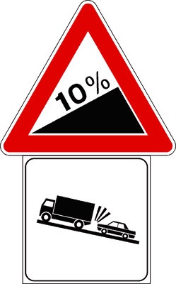
- **📖 الترجمة السياقية:** عند وجود الإشارة المعروضة، يجب على السائق تخفيف السرعة لاحتمال وجود شاحنات بطيئة.
- **💡 الشرح والقاعدة المرورية:** صحيح (VERO). تخفيف السرعة يتيح وقتاً كافياً لرد الفعل عند مصادفة شاحنة بطيئة.
- **⚠️ كشف الفخ:** فخ الامتحان: التخفيف واجب أمام الأخطار المعلنة.
- **🔑 الكلمات المفتاحية:** `{'it': 'moderare la velocità', 'ar': 'تخفيف السرعة'}` | `{'it': 'vero', 'ar': 'صحيح'}`

---

**199.** Il pannello integrativo raffigurato indica di circolare ad una velocità prudenziale, per evitare incidenti con gli autocarri che potrebbero stare davanti
- **الإجابة:** `VERO ✅ (صح)`
- 
- **📖 الترجمة السياقية:** تشير اللوحة الإضافية المعروضة إلى السير بسرعة حذرة لتجنب الحوادث مع الشاحنات التي قد تكون في الأمام.
- **💡 الشرح والقاعدة المرورية:** صحيح (VERO). السرعة الحذرة تجنب الاصطدام بالشاحنات البطيئة في المقدمة.
- **⚠️ كشف الفخ:** فخ الامتحان: عبارة صحيحة مباشرة.
- **🔑 الكلمات المفتاحية:** `{'it': 'velocità prudenziale', 'ar': 'سرعة حذرة'}` | `{'it': 'vero', 'ar': 'صحيح'}`

---

**200.** Il pannello integrativo raffigurato indica un tratto di strada chiuso a causa di un tamponamento
- **الإجابة:** `FALSO ❌ (خطأ)`
- 
- **📖 الترجمة السياقية:** تشير اللوحة الإضافية المعروضة إلى مقطع طريق مغلق بسبب اصطدام خلفي.
- **💡 الشرح والقاعدة المرورية:** خطأ (FALSO). اللوحة تحذر من شاحنات بطيئة، والطريق مفتوح.
- **⚠️ كشف الفخ:** فخ الامتحان: لا إغلاق ولا حادث في معنى اللوحة.
- **🔑 الكلمات المفتاحية:** `{'it': 'strada chiusa', 'ar': 'طريق مغلق (فخ)'}` | `{'it': 'falso', 'ar': 'خطأ'}`

---

**201.** Il pannello integrativo raffigurato indica che è vietato sorpassare gli autocarri
- **الإجابة:** `FALSO ❌ (خطأ)`
- 
- **📖 الترجمة السياقية:** تشير اللوحة الإضافية المعروضة إلى منع تجاوز الشاحنات.
- **💡 الشرح والقاعدة المرورية:** خطأ (FALSO). منع التجاوز له شاخصة دائرية خاصة؛ اللوحة تحذيرية فقط ويجوز التجاوز بأمان.
- **⚠️ كشف الفخ:** فخ الامتحان: التحذير ليس منعاً.
- **🔑 الكلمات المفتاحية:** `{'it': 'vietato sorpassare', 'ar': 'ممنوع التجاوز (فخ)'}` | `{'it': 'falso', 'ar': 'خطأ'}`

---

**202.** Il pannello integrativo raffigurato si trova nei pontili d'imbarco delle navi traghetto
- **الإجابة:** `FALSO ❌ (خطأ)`
- 
- **📖 الترجمة السياقية:** توجد اللوحة الإضافية المعروضة عند أرصفة صعود العبارات.
- **💡 الشرح والقاعدة المرورية:** خطأ (FALSO). مكانها الطبيعي الطرق ذات الصعود الحاد، وليس أرصفة العبارات.
- **⚠️ كشف الفخ:** فخ الامتحان: إجابة مشتتة.
- **🔑 الكلمات المفتاحية:** `{'it': "pontili d'imbarco", 'ar': 'أرصفة العبارات (فخ)'}` | `{'it': 'falso', 'ar': 'خطأ'}`

---

**203.** Il pannello integrativo raffigurato indica di diminuire la distanza di sicurezza
- **الإجابة:** `FALSO ❌ (خطأ)`
- 
- **📖 الترجمة السياقية:** تشير اللوحة الإضافية المعروضة إلى تقليص مسافة الأمان.
- **💡 الشرح والقاعدة المرورية:** خطأ (FALSO). مع المركبات البطيئة يجب الحفاظ على مسافة أمان كافية، وليس تقليصها.
- **⚠️ كشف الفخ:** فخ الامتحان: تقليص مسافة الأمان خطأ دائماً.
- **🔑 الكلمات المفتاحية:** `{'it': 'diminuire la distanza', 'ar': 'تقليص المسافة (فخ)'}` | `{'it': 'falso', 'ar': 'خطأ'}`

---

**204.** Il pannello integrativo raffigurato indica di proseguire con le luci accese
- **الإجابة:** `FALSO ❌ (خطأ)`
- 
- **📖 الترجمة السياقية:** تشير اللوحة الإضافية المعروضة إلى مواصلة السير بالأضواء مضاءة.
- **💡 الشرح والقاعدة المرورية:** خطأ (FALSO). اللوحة لا تفرض إضاءة الأنوار.
- **⚠️ كشف الفخ:** فخ الامتحان: لا علاقة للوحة بالأضواء.
- **🔑 الكلمات المفتاحية:** `{'it': 'luci accese', 'ar': 'أضواء مضاءة (فخ)'}` | `{'it': 'falso', 'ar': 'خطأ'}`

---

**205.** Il pannello integrativo raffigurato indica che bisogna suonare il clacson ogni qualvolta si sorpassa un autocarro
- **الإجابة:** `FALSO ❌ (خطأ)`
- 
- **📖 الترجمة السياقية:** تشير اللوحة الإضافية المعروضة إلى وجوب استخدام البوق في كل مرة يتم فيها تجاوز شاحنة.
- **💡 الشرح والقاعدة المرورية:** خطأ (FALSO). استخدام البوق مقيد بحالات الخطر الحقيقي، ولا يُفرض عند كل تجاوز.
- **⚠️ كشف الفخ:** فخ الامتحان: البوق ليس إلزامياً عند التجاوز.
- **🔑 الكلمات المفتاحية:** `{'it': 'suonare il clacson', 'ar': 'استخدام البوق (فخ)'}` | `{'it': 'falso', 'ar': 'خطأ'}`

---

**206.** Il pannello integrativo raffigurato segnala la possibilità di poter essere trainati
- **الإجابة:** `FALSO ❌ (خطأ)`
- 
- **📖 الترجمة السياقية:** تنبه اللوحة الإضافية المعروضة إلى إمكانية القطر (الجر).
- **💡 الشرح والقاعدة المرورية:** خطأ (FALSO). اللوحة تحذر من شاحنات بطيئة ولا علاقة لها بخدمات القطر.
- **⚠️ كشف الفخ:** فخ الامتحان: إجابة مشتتة.
- **🔑 الكلمات المفتاحية:** `{'it': 'essere trainati', 'ar': 'القطر (فخ)'}` | `{'it': 'falso', 'ar': 'خطأ'}`

---

## 📌 Zona rimozione (11 domande)

**207.** Il pannello integrativo raffigurato indica che il veicolo lasciato in sosta può essere portato via dal carro-attrezzi
- **الإجابة:** `VERO ✅ (صح)`
- 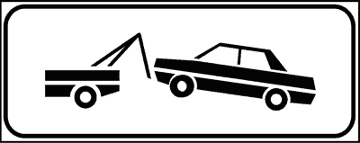
- **📖 الترجمة السياقية:** تشير اللوحة الإضافية المعروضة إلى أن المركبة المتروكة في وضع الوقوف يمكن سحبها بالرافعة (carro attrezzi).
- **💡 الشرح والقاعدة المرورية:** صحيح (VERO). لوحة 'zona rimozione' ترسم رافعة تسحب سيارة، وتعني أن المركبة المخالفة تُسحب قسرياً.
- **⚠️ كشف الفخ:** فخ الامتحان: rimozione = السحب القسري للمركبة.
- **🔑 الكلمات المفتاحية:** `{'it': 'carro attrezzi', 'ar': 'رافعة سحب السيارات'}` | `{'it': 'rimozione', 'ar': 'سحب قسري'}` | `{'it': 'vero', 'ar': 'صحيح'}`

---

**208.** Il segnale raffigurato indica che il veicolo può essere spostato in una depositeria comunale
- **الإجابة:** `VERO ✅ (صح)`
- 
- **📖 الترجمة السياقية:** تشير الإشارة المعروضة إلى أن المركبة يمكن نقلها إلى مستودع حجز بلدي (depositeria comunale).
- **💡 الشرح والقاعدة المرورية:** صحيح (VERO). المركبة المسحوبة تُنقل إلى مستودع البلدية ويتحمل صاحبها تكاليف السحب والحجز.
- **⚠️ كشف الفخ:** فخ الامتحان: depositeria = مستودع الحجز.
- **🔑 الكلمات المفتاحية:** `{'it': 'depositeria comunale', 'ar': 'مستودع حجز بلدي'}` | `{'it': 'vero', 'ar': 'صحيح'}`

---

**209.** In presenza del segnale raffigurato i veicoli al servizio di persone diversamente abili, muniti di apposito contrassegno, non possono essere portati nella depositeria comunale, né bloccati con le ganasce
- **الإجابة:** `VERO ✅ (صح)`
- 
- **📖 الترجمة السياقية:** عند وجود الإشارة المعروضة، لا يجوز نقل المركبات المخصصة لخدمة ذوي الإعاقة والحاملة للشارة الخاصة إلى المستودع البلدي، ولا تثبيتها بالكماشة.
- **💡 الشرح والقاعدة المرورية:** صحيح (VERO). يحمي كود السير مركبات ذوي الإعاقة الحاملة للشارة الأوروبية من السحب والتثبيت بالكماشة (ganasce)، مع إمكانية تحرير مخالفة.
- **⚠️ كشف الفخ:** فخ الامتحان: مركبات ذوي الإعاقة مستثناة من السحب والكماشة.
- **🔑 الكلمات المفتاحية:** `{'it': 'diversamente abili', 'ar': 'ذوو الاحتياجات الخاصة'}` | `{'it': 'ganasce', 'ar': 'الكماشة / أقفال العجلات'}` | `{'it': 'contrassegno', 'ar': 'الشارة الخاصة'}` | `{'it': 'vero', 'ar': 'صحيح'}`

---

**210.** Il pannello integrativo raffigurato indica una zona di divieto di sosta con rimozione del veicolo
- **الإجابة:** `VERO ✅ (صح)`
- 
- **📖 الترجمة السياقية:** تشير اللوحة الإضافية المعروضة إلى منطقة منع وقوف مع سحب المركبة.
- **💡 الشرح والقاعدة المرورية:** صحيح (VERO). تقترن عادة بشاخصة منع الوقوف لتعلن أن العقوبة تشمل السحب القسري.
- **⚠️ كشف الفخ:** فخ الامتحان: منع الوقوف + سحب = zona rimozione.
- **🔑 الكلمات المفتاحية:** `{'it': 'divieto di sosta con rimozione', 'ar': 'منع وقوف مع السحب'}` | `{'it': 'vero', 'ar': 'صحيح'}`

---

**211.** Il segnale raffigurato prevede lo spostamento del veicolo o il suo blocco tramite ganasce
- **الإجابة:** `VERO ✅ (صح)`
- 
- **📖 الترجمة السياقية:** تنص الإشارة المعروضة على نقل المركبة أو تثبيتها بالكماشة.
- **💡 الشرح والقاعدة المرورية:** صحيح (VERO). يجوز للسلطات سحب المركبة أو تثبيتها في مكانها بالكماشة كبديل.
- **⚠️ كشف الفخ:** فخ الامتحان: الكماشة (ganasce) بديل قانوني للسحب.
- **🔑 الكلمات المفتاحية:** `{'it': 'spostamento del veicolo', 'ar': 'نقل المركبة'}` | `{'it': 'blocco con ganasce', 'ar': 'التثبيت بالكماشة'}` | `{'it': 'vero', 'ar': 'صحيح'}`

---

**212.** Il pannello integrativo raffigurato indica la presenza di officine attrezzate per il soccorso stradale
- **الإجابة:** `FALSO ❌ (خطأ)`
- 
- **📖 الترجمة السياقية:** تشير اللوحة الإضافية المعروضة إلى وجود ورش مجهزة للإنقاذ على الطريق.
- **💡 الشرح والقاعدة المرورية:** خطأ (FALSO). رسم الرافعة هنا يعني السحب القسري للمخالفين وليس خدمة إنقاذ.
- **⚠️ كشف الفخ:** فخ الامتحان: الرافعة = عقوبة السحب.
- **🔑 الكلمات المفتاحية:** `{'it': 'officine per soccorso', 'ar': 'ورش إنقاذ (فخ)'}` | `{'it': 'falso', 'ar': 'خطأ'}`

---

**213.** Il pannello integrativo raffigurato indica l'imbarco delle autovetture sui treni merce
- **الإجابة:** `FALSO ❌ (خطأ)`
- 
- **📖 الترجمة السياقية:** تشير اللوحة الإضافية المعروضة إلى صعود السيارات على قطارات البضائع.
- **💡 الشرح والقاعدة المرورية:** خطأ (FALSO). اللوحة تخص السحب القسري للمركبات المخالفة.
- **⚠️ كشف الفخ:** فخ الامتحان: إجابة مشتتة.
- **🔑 الكلمات المفتاحية:** `{'it': 'treni merce', 'ar': 'قطارات البضائع (فخ)'}` | `{'it': 'falso', 'ar': 'خطأ'}`

---

**214.** Il pannello integrativo raffigurato indica un'officina meccanica attrezzata per il cambio d'olio
- **الإجابة:** `FALSO ❌ (خطأ)`
- 
- **📖 الترجمة السياقية:** تشير اللوحة الإضافية المعروضة إلى ورشة ميكانيكية مجهزة لتغيير الزيت.
- **💡 الشرح والقاعدة المرورية:** خطأ (FALSO). اللوحة ليست إعلاناً عن خدمة، بل تحذير من السحب.
- **⚠️ كشف الفخ:** فخ الامتحان: إجابة مشتتة.
- **🔑 الكلمات المفتاحية:** `{'it': "cambio d'olio", 'ar': 'تغيير الزيت (فخ)'}` | `{'it': 'falso', 'ar': 'خطأ'}`

---

**215.** Il pannello integrativo raffigurato indica che possono sostare i veicoli per il soccorso stradale
- **الإجابة:** `FALSO ❌ (خطأ)`
- 
- **📖 الترجمة السياقية:** تشير اللوحة الإضافية المعروضة إلى أن مركبات الإنقاذ على الطريق يجوز لها الوقوف.
- **💡 الشرح والقاعدة المرورية:** خطأ (FALSO). اللوحة تعلن سحب المركبات المخالفة، ولا تخصص موقفاً لمركبات الإنقاذ.
- **⚠️ كشف الفخ:** فخ الامتحان: الرافعة ليست صاحبة الموقف بل أداة العقوبة.
- **🔑 الكلمات المفتاحية:** `{'it': 'possono sostare i veicoli di soccorso', 'ar': 'يجوز وقوف مركبات الإنقاذ (فخ)'}` | `{'it': 'falso', 'ar': 'خطأ'}`

---

**216.** Il pannello integrativo raffigurato indica che dopo tre ore il veicolo lasciato in sosta viene rimosso o bloccato
- **الإجابة:** `FALSO ❌ (خطأ)`
- 
- **📖 الترجمة السياقية:** تشير اللوحة الإضافية المعروضة إلى أن المركبة المتروكة في وضع الوقوف تُسحب أو تُثبت بعد ثلاث ساعات.
- **💡 الشرح والقاعدة المرورية:** خطأ (FALSO). السحب يمكن أن يتم فوراً عند المخالفة دون أي مهلة زمنية.
- **⚠️ كشف الفخ:** فخ الامتحان: لا توجد مهلة 3 ساعات.
- **🔑 الكلمات المفتاحية:** `{'it': 'dopo tre ore', 'ar': 'بعد ثلاث ساعات (فخ)'}` | `{'it': 'immediatamente', 'ar': 'فوراً'}` | `{'it': 'falso', 'ar': 'خطأ'}`

---

**217.** Il pannello integrativo raffigurato indica una strada chiusa per incidente
- **الإجابة:** `FALSO ❌ (خطأ)`
- 
- **📖 الترجمة السياقية:** تشير اللوحة الإضافية المعروضة إلى طريق مغلق بسبب حادث.
- **💡 الشرح والقاعدة المرورية:** خطأ (FALSO). اللوحة تخص السحب القسري ولا تعلن إغلاق الطريق.
- **⚠️ كشف الفخ:** فخ الامتحان: إجابة مشتتة.
- **🔑 الكلمات المفتاحية:** `{'it': 'strada chiusa per incidente', 'ar': 'طريق مغلق لحادث (فخ)'}` | `{'it': 'falso', 'ar': 'خطأ'}`

---

## 📌 Segnale corsia (7 domande)

**218.** Il pannello integrativo in figura, posto in alto sulla carreggiata insieme ad un segnale indicante una località, segnala la corsia da prendere per raggiungere detta località
- **الإجابة:** `VERO ✅ (صح)`
- 
- **📖 الترجمة السياقية:** تشير اللوحة الإضافية في الشكل، الموضوعة في الأعلى فوق نهر الطريق مع إشارة تدل على مدينة، إلى المسلك الواجب سلوكه للوصول إلى تلك المدينة.
- **💡 الشرح والقاعدة المرورية:** صحيح (VERO). لوحة السهم المتجه للأسفل فوق المسلك تحدد أن الإشارة العلوية تخص المسلك الواقع تحتها مباشرة.
- **⚠️ كشف الفخ:** فخ الامتحان: السهم للأسفل هنا يحدد المسلك وليس نهاية القيد (لأنها معلقة فوق الطريق).
- **🔑 الكلمات المفتاحية:** `{'it': 'corsia da prendere', 'ar': 'المسلك الواجب سلوكه'}` | `{'it': 'posto in alto', 'ar': 'مثبتة في الأعلى'}` | `{'it': 'vero', 'ar': 'صحيح'}`

---

**219.** Il pannello integrativo in figura, posto in alto sulla carreggiata insieme ad un segnale, specifica a quale corsia si riferisce il segnale
- **الإجابة:** `VERO ✅ (صح)`
- 
- **📖 الترجمة السياقية:** تحدد اللوحة الإضافية في الشكل، الموضوعة في الأعلى فوق نهر الطريق مع إشارة، المسلكَ الذي تخصه تلك الإشارة.
- **💡 الشرح والقاعدة المرورية:** صحيح (VERO). وظيفتها ربط الإشارة بمسلك معين من المسالك المتعددة.
- **⚠️ كشف الفخ:** فخ الامتحان: عبارة صحيحة مباشرة.
- **🔑 الكلمات المفتاحية:** `{'it': 'a quale corsia si riferisce', 'ar': 'المسلك الذي تخصه'}` | `{'it': 'vero', 'ar': 'صحيح'}`

---

**220.** Il pannello integrativo in figura indica che il segnale posto sopra vale per la sola corsia indicata dalla freccia
- **الإجابة:** `VERO ✅ (صح)`
- 
- **📖 الترجمة السياقية:** تشير اللوحة الإضافية في الشكل إلى أن الإشارة الموضوعة فوقها تسري على المسلك المشار إليه بالسهم فقط.
- **💡 الشرح والقاعدة المرورية:** صحيح (VERO). سريان الإشارة مقصور على المسلك الذي يشير إليه السهم دون المسالك الأخرى.
- **⚠️ كشف الفخ:** فخ الامتحان: 'sola corsia' صحيحة هنا.
- **🔑 الكلمات المفتاحية:** `{'it': 'sola corsia indicata', 'ar': 'المسلك المشار إليه فقط'}` | `{'it': 'vero', 'ar': 'صحيح'}`

---

**221.** Il pannello integrativo in figura è posto per indicare la fermata degli autobus
- **الإجابة:** `FALSO ❌ (خطأ)`
- 
- **📖 الترجمة السياقية:** توضع اللوحة الإضافية في الشكل للدلالة على موقف الحافلات.
- **💡 الشرح والقاعدة المرورية:** خطأ (FALSO). موقف الحافلات له إشارة خاصة وتخطيط أصفر؛ هذه اللوحة تحدد المسلك.
- **⚠️ كشف الفخ:** فخ الامتحان: إجابة مشتتة.
- **🔑 الكلمات المفتاحية:** `{'it': 'fermata degli autobus', 'ar': 'موقف الحافلات (فخ)'}` | `{'it': 'falso', 'ar': 'خطأ'}`

---

**222.** Il pannello integrativo in figura indica che hanno la precedenza i veicoli che vengono di fronte
- **الإجابة:** `FALSO ❌ (خطأ)`
- 
- **📖 الترجمة السياقية:** تشير اللوحة الإضافية في الشكل إلى أن الأسبقية للمركبات القادمة من الأمام.
- **💡 الشرح والقاعدة المرورية:** خطأ (FALSO). اللوحة تحدد المسلك ولا تنظم الأسبقية.
- **⚠️ كشف الفخ:** فخ الامتحان: لا علاقة بالأسبقية.
- **🔑 الكلمات المفتاحية:** `{'it': 'precedenza ai veicoli di fronte', 'ar': 'الأسبقية للقادم من الأمام (فخ)'}` | `{'it': 'falso', 'ar': 'خطأ'}`

---

**223.** Il pannello integrativo in figura indica la fine di una prescrizione
- **الإجابة:** `FALSO ❌ (خطأ)`
- 
- **📖 الترجمة السياقية:** تشير اللوحة الإضافية في الشكل إلى نهاية قيد مروري.
- **💡 الشرح والقاعدة المرورية:** خطأ (FALSO). رغم أن السهم يتجه للأسفل، إلا أن اللوحة المعلقة فوق نهر الطريق تحدد المسلك وليس نهاية القيد.
- **⚠️ كشف الفخ:** فخ الامتحان: لا تخلط بين لوحة المسلك العلوية ولوحة النهاية الجانبية.
- **🔑 الكلمات المفتاحية:** `{'it': 'fine di una prescrizione', 'ar': 'نهاية قيد (فخ)'}` | `{'it': 'corsia', 'ar': 'مسلك'}` | `{'it': 'falso', 'ar': 'خطأ'}`

---

**224.** Il pannello integrativo in figura indica la fine del segnale LIMITE MASSIMO DI VELOCITA'
- **الإجابة:** `FALSO ❌ (خطأ)`
- 
- **📖 الترجمة السياقية:** تشير اللوحة الإضافية في الشكل إلى نهاية إشارة الحد الأقصى للسرعة.
- **💡 الشرح والقاعدة المرورية:** خطأ (FALSO). نهاية حد السرعة لها شاخصة خاصة مشطوبة؛ اللوحة هنا تحدد المسلك الذي يسري عليه الحد.
- **⚠️ كشف الفخ:** فخ الامتحان: اللوحة تخصص الإشارة لمسلك ولا تنهيها.
- **🔑 الكلمات المفتاحية:** `{'it': 'fine limite di velocità', 'ar': 'نهاية حد السرعة (فخ)'}` | `{'it': 'falso', 'ar': 'خطأ'}`

---

## 📌 Presenza tornanti (12 domande)

**225.** Il pannello integrativo in figura (A) indica la vicinanza di una o più curve strette
- **الإجابة:** `VERO ✅ (صح)`
- 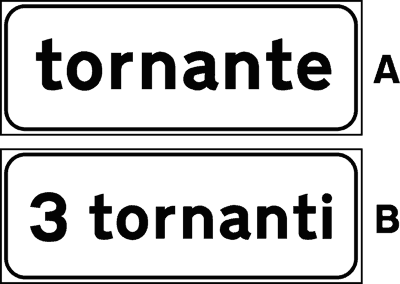
- **📖 الترجمة السياقية:** تشير اللوحة الإضافية في الشكل (A) إلى قرب منعطف ضيق أو أكثر.
- **💡 الشرح والقاعدة المرورية:** صحيح (VERO). لوحة المنعطفات الحادة (tornanti) ترسم مساراً متعرجاً وتحذر من منعطفات ضيقة جداً.
- **⚠️ كشف الفخ:** فخ الامتحان: tornante = منعطف حاد على شكل دبوس شعر.
- **🔑 الكلمات المفتاحية:** `{'it': 'curve strette', 'ar': 'منعطفات ضيقة'}` | `{'it': 'tornanti', 'ar': 'منعطفات حادة'}` | `{'it': 'vero', 'ar': 'صحيح'}`

---

**226.** Il pannello integrativo in figura (B) indica la vicinanza di una o più curve particolarmente pericolose
- **الإجابة:** `VERO ✅ (صح)`
- 
- **📖 الترجمة السياقية:** تشير اللوحة الإضافية في الشكل (B) إلى قرب منعطف أو أكثر بالغ الخطورة.
- **💡 الشرح والقاعدة المرورية:** صحيح (VERO). اللوحة (B) تحمل رقماً يحدد عدد المنعطفات الخطرة القادمة.
- **⚠️ كشف الفخ:** فخ الامتحان: الرقم يدل على عدد المنعطفات وليس عدد المسالك.
- **🔑 الكلمات المفتاحية:** `{'it': 'curve particolarmente pericolose', 'ar': 'منعطفات بالغة الخطورة'}` | `{'it': 'vero', 'ar': 'صحيح'}`

---

**227.** Il pannello integrativo in figura (A) può indicare uno o più tornanti
- **الإجابة:** `VERO ✅ (صح)`
- 
- **📖 الترجمة السياقية:** يمكن أن تشير اللوحة الإضافية في الشكل (A) إلى منعطف حاد واحد أو أكثر.
- **💡 الشرح والقاعدة المرورية:** صحيح (VERO). اللوحة صالحة لمنعطف واحد أو لسلسلة منعطفات حادة.
- **⚠️ كشف الفخ:** فخ الامتحان: 'uno o più' صحيحة.
- **🔑 الكلمات المفتاحية:** `{'it': 'uno o più tornanti', 'ar': 'منعطف حاد أو أكثر'}` | `{'it': 'vero', 'ar': 'صحيح'}`

---

**228.** Il pannello integrativo in figura (B) si può trovare sotto il segnale di CURVA o DOPPIA CURVA
- **الإجابة:** `VERO ✅ (صح)`
- 
- **📖 الترجمة السياقية:** يمكن مصادفة اللوحة الإضافية في الشكل (B) أسفل إشارة منعطف أو منعطف مزدوج.
- **💡 الشرح والقاعدة المرورية:** صحيح (VERO). توضع تحت إشارات المنعطفات لتحديد عددها أو خطورتها.
- **⚠️ كشف الفخ:** فخ الامتحان: الاقتران بإشارات CURVA و DOPPIA CURVA صحيح.
- **🔑 الكلمات المفتاحية:** `{'it': 'CURVA o DOPPIA CURVA', 'ar': 'منعطف أو منعطف مزدوج'}` | `{'it': 'vero', 'ar': 'صحيح'}`

---

**229.** La presenza di uno dei due pannelli integrativi in figura indica la vicinanza di una o più curve strette
- **الإجابة:** `VERO ✅ (صح)`
- 
- **📖 الترجمة السياقية:** وجود أي من اللوحتين الإضافيتين في الشكل يشير إلى قرب منعطف ضيق أو أكثر.
- **💡 الشرح والقاعدة المرورية:** صحيح (VERO). كلتا اللوحتين تحذران من منعطفات ضيقة.
- **⚠️ كشف الفخ:** فخ الامتحان: المعنى مشترك بين اللوحتين.
- **🔑 الكلمات المفتاحية:** `{'it': 'uno dei due pannelli', 'ar': 'إحدى اللوحتين'}` | `{'it': 'vero', 'ar': 'صحيح'}`

---

**230.** La presenza di uno dei due pannelli integrativi in figura indica la vicinanza di una o più curve particolarmente pericolose
- **الإجابة:** `VERO ✅ (صح)`
- 
- **📖 الترجمة السياقية:** وجود أي من اللوحتين الإضافيتين في الشكل يشير إلى قرب منعطف أو أكثر بالغ الخطورة.
- **💡 الشرح والقاعدة المرورية:** صحيح (VERO). كلتاهما تحذران من منعطفات خطرة تستوجب تخفيض السرعة.
- **⚠️ كشف الفخ:** فخ الامتحان: عبارة صحيحة مباشرة.
- **🔑 الكلمات المفتاحية:** `{'it': 'curve pericolose', 'ar': 'منعطفات خطرة'}` | `{'it': 'vero', 'ar': 'صحيح'}`

---

**231.** La presenza di uno dei due pannelli integrativi in figura può indicare uno o più tornanti
- **الإجابة:** `VERO ✅ (صح)`
- 
- **📖 الترجمة السياقية:** وجود أي من اللوحتين الإضافيتين في الشكل قد يشير إلى منعطف حاد واحد أو أكثر.
- **💡 الشرح والقاعدة المرورية:** صحيح (VERO). المعنى يشمل المنعطفات الحادة (tornanti).
- **⚠️ كشف الفخ:** فخ الامتحان: عبارة صحيحة مباشرة.
- **🔑 الكلمات المفتاحية:** `{'it': 'tornanti', 'ar': 'منعطفات حادة'}` | `{'it': 'vero', 'ar': 'صحيح'}`

---

**232.** Il pannello integrativo di figura B indica il numero di corsie di cui è composta la strada
- **الإجابة:** `FALSO ❌ (خطأ)`
- 
- **📖 الترجمة السياقية:** تشير اللوحة الإضافية في الشكل (B) إلى عدد المسالك التي يتكون منها الطريق.
- **💡 الشرح والقاعدة المرورية:** خطأ (FALSO). الرقم يدل على عدد المنعطفات الخطرة وليس عدد المسالك.
- **⚠️ كشف الفخ:** فخ الامتحان: الرقم = عدد المنعطفات.
- **🔑 الكلمات المفتاحية:** `{'it': 'numero di corsie', 'ar': 'عدد المسالك (فخ)'}` | `{'it': 'numero di curve', 'ar': 'عدد المنعطفات'}` | `{'it': 'falso', 'ar': 'خطأ'}`

---

**233.** Il pannello integrativo di figura B indica quanti veicoli contemporaneamente possono percorrere la curva
- **الإجابة:** `FALSO ❌ (خطأ)`
- 
- **📖 الترجمة السياقية:** تشير اللوحة الإضافية في الشكل (B) إلى عدد المركبات التي يمكنها سلوك المنعطف في وقت واحد.
- **💡 الشرح والقاعدة المرورية:** خطأ (FALSO). لا يوجد في كود السير لوحة تحدد عدد المركبات في المنعطف؛ الرقم يخص عدد المنعطفات.
- **⚠️ كشف الفخ:** فخ الامتحان: إجابة مشتتة.
- **🔑 الكلمات المفتاحية:** `{'it': 'quanti veicoli', 'ar': 'عدد المركبات (فخ)'}` | `{'it': 'falso', 'ar': 'خطأ'}`

---

**234.** Il pannello integrativo di figura B indica quanti chilometri mancano per poter trovare un cavalcavia che consente di invertire il senso di marcia
- **الإجابة:** `FALSO ❌ (خطأ)`
- 
- **📖 الترجمة السياقية:** تشير اللوحة الإضافية في الشكل (B) إلى عدد الكيلومترات المتبقية لإيجاد جسر علوي يتيح الدوران للخلف.
- **💡 الشرح والقاعدة المرورية:** خطأ (FALSO). اللوحة تحذير من منعطفات وليست معلومة توجيهية عن الجسور.
- **⚠️ كشف الفخ:** فخ الامتحان: إجابة مشتتة.
- **🔑 الكلمات المفتاحية:** `{'it': 'cavalcavia', 'ar': 'جسر علوي (فخ)'}` | `{'it': 'falso', 'ar': 'خطأ'}`

---

**235.** Il pannello integrativo di figura B indica il numero degli svincoli autostradali
- **الإجابة:** `FALSO ❌ (خطأ)`
- 
- **📖 الترجمة السياقية:** تشير اللوحة الإضافية في الشكل (B) إلى عدد مخارج الطريق السريع.
- **💡 الشرح والقاعدة المرورية:** خطأ (FALSO). مخارج الأوتوستراد تُرقم على لوحات خضراء خاصة؛ واللوحة هنا تخص المنعطفات.
- **⚠️ كشف الفخ:** فخ الامتحان: إجابة مشتتة.
- **🔑 الكلمات المفتاحية:** `{'it': 'svincoli autostradali', 'ar': 'مخارج الطريق السريع (فخ)'}` | `{'it': 'falso', 'ar': 'خطأ'}`

---

**236.** La presenza di uno dei due pannelli integrativi in figura indica l’incrocio con una strada dalla quale si immettono autocarri provenienti da una discarica
- **الإجابة:** `FALSO ❌ (خطأ)`
- 
- **📖 الترجمة السياقية:** وجود أي من اللوحتين في الشكل يشير إلى تقاطع مع طريق تدخل منه شاحنات قادمة من مكب نفايات.
- **💡 الشرح والقاعدة المرورية:** خطأ (FALSO). اللوحتان تحذران من منعطفات حادة وخطرة وليس من تقاطعات أو شاحنات.
- **⚠️ كشف الفخ:** فخ الامتحان: إجابة مشتتة.
- **🔑 الكلمات المفتاحية:** `{'it': 'discarica', 'ar': 'مكب نفايات (فخ)'}` | `{'it': 'falso', 'ar': 'خطأ'}`

---

## 📌 Pulizia strade (8 domande)

**237.** Il pannello integrativo in figura, posto sotto il segnale DIVIETO DI SOSTA, indica che la sosta è vietata solo in determinate ore dei giorni indicati
- **الإجابة:** `VERO ✅ (صح)`
- 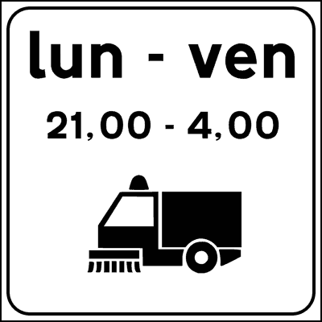
- **📖 الترجمة السياقية:** تشير اللوحة الإضافية في الشكل، الموضوعة أسفل إشارة منع الوقوف، إلى أن الوقوف ممنوع فقط في ساعات معينة من الأيام المحددة.
- **💡 الشرح والقاعدة المرورية:** صحيح (VERO). لوحة تنظيف الشوارع (رسم كناسة آلية مع أيام وساعات) تقصر منع الوقوف على أوقات التنظيف فقط.
- **⚠️ كشف الفخ:** فخ الامتحان: المنع مؤقت ومحدد بأيام وساعات التنظيف.
- **🔑 الكلمات المفتاحية:** `{'it': 'sosta vietata solo in determinate ore', 'ar': 'الوقوف ممنوع في ساعات معينة فقط'}` | `{'it': 'vero', 'ar': 'صحيح'}`

---

**238.** Il pannello integrativo in figura è posto nei tratti di strada dove vengono effettuate operazioni di pulizia delle strade con autospazzatrici
- **الإجابة:** `VERO ✅ (صح)`
- 
- **📖 الترجمة السياقية:** توضع اللوحة الإضافية في الشكل في مقاطع الطرق التي تُجرى فيها عمليات تنظيف بآليات الكنس (autospazzatrici).
- **💡 الشرح والقاعدة المرورية:** صحيح (VERO). الهدف إخلاء جانب الطريق لتمكين آليات الكنس من العمل.
- **⚠️ كشف الفخ:** فخ الامتحان: autospazzatrici = آليات الكنس.
- **🔑 الكلمات المفتاحية:** `{'it': 'autospazzatrici', 'ar': 'آليات الكنس'}` | `{'it': 'pulizia delle strade', 'ar': 'تنظيف الشوارع'}` | `{'it': 'vero', 'ar': 'صحيح'}`

---

**239.** Il pannello integrativo in figura indica i giorni e le ore in cui si effettuano operazioni di pulizia della strada con autospazzatrici
- **الإجابة:** `VERO ✅ (صح)`
- 
- **📖 الترجمة السياقية:** تشير اللوحة الإضافية في الشكل إلى الأيام والساعات التي تُجرى فيها عمليات تنظيف الطريق بآليات الكنس.
- **💡 الشرح والقاعدة المرورية:** صحيح (VERO). اللوحة تحدد جدول التنظيف الذي يُمنع خلاله الوقوف.
- **⚠️ كشف الفخ:** فخ الامتحان: عبارة صحيحة مباشرة.
- **🔑 الكلمات المفتاحية:** `{'it': 'giorni e ore', 'ar': 'الأيام والساعات'}` | `{'it': 'vero', 'ar': 'صحيح'}`

---

**240.** Il pannello integrativo in figura, posto sotto il segnale DIVIETO DI SOSTA, indica che la sosta è vietata solo in alcune ore dei giorni indicati
- **الإجابة:** `VERO ✅ (صح)`
- 
- **📖 الترجمة السياقية:** تشير اللوحة الإضافية في الشكل، الموضوعة أسفل إشارة منع الوقوف، إلى أن الوقوف ممنوع فقط في بعض ساعات الأيام المحددة.
- **💡 الشرح والقاعدة المرورية:** صحيح (VERO). خارج هذه الأوقات يُسمح بالوقوف بشكل طبيعي.
- **⚠️ كشف الفخ:** فخ الامتحان: تكرار للمعنى نفسه بصيغة مختلفة.
- **🔑 الكلمات المفتاحية:** `{'it': 'alcune ore', 'ar': 'بعض الساعات'}` | `{'it': 'vero', 'ar': 'صحيح'}`

---

**241.** Il pannello integrativo in figura indica l'orario per il deposito della spazzatura
- **الإجابة:** `FALSO ❌ (خطأ)`
- 
- **📖 الترجمة السياقية:** تشير اللوحة الإضافية في الشكل إلى أوقات إيداع النفايات.
- **💡 الشرح والقاعدة المرورية:** خطأ (FALSO). اللوحة تحدد أوقات كنس الشوارع ومنع الوقوف، وليس أوقات رمي النفايات.
- **⚠️ كشف الفخ:** فخ الامتحان: كنس الشوارع ≠ جمع النفايات.
- **🔑 الكلمات المفتاحية:** `{'it': 'deposito della spazzatura', 'ar': 'إيداع النفايات (فخ)'}` | `{'it': 'falso', 'ar': 'خطأ'}`

---

**242.** Il pannello integrativo in figura indica i giorni di apertura degli autolavaggi
- **الإجابة:** `FALSO ❌ (خطأ)`
- 
- **📖 الترجمة السياقية:** تشير اللوحة الإضافية في الشكل إلى أيام فتح مغاسل السيارات.
- **💡 الشرح والقاعدة المرورية:** خطأ (FALSO). اللوحة تنظيمية لمنع الوقوف وقت التنظيف.
- **⚠️ كشف الفخ:** فخ الامتحان: إجابة مشتتة.
- **🔑 الكلمات المفتاحية:** `{'it': 'autolavaggi', 'ar': 'مغاسل سيارات (فخ)'}` | `{'it': 'falso', 'ar': 'خطأ'}`

---

**243.** Il pannello integrativo in figura obbliga a dare la precedenza agli autocarri
- **الإجابة:** `FALSO ❌ (خطأ)`
- 
- **📖 الترجمة السياقية:** تلزم اللوحة الإضافية في الشكل بإعطاء الأسبقية للشاحنات.
- **💡 الشرح والقاعدة المرورية:** خطأ (FALSO). اللوحة لا تنظم الأسبقية بل تحدد أوقات منع الوقوف للتنظيف.
- **⚠️ كشف الفخ:** فخ الامتحان: لا علاقة بالأسبقية.
- **🔑 الكلمات المفتاحية:** `{'it': 'precedenza agli autocarri', 'ar': 'أسبقية للشاحنات (فخ)'}` | `{'it': 'falso', 'ar': 'خطأ'}`

---

**244.** Il pannello integrativo in figura, posto sotto il segnale DIVIETO DI SOSTA, indica che non possono sostare i veicoli rappresentati
- **الإجابة:** `FALSO ❌ (خطأ)`
- 
- **📖 الترجمة السياقية:** تشير اللوحة الإضافية في الشكل، الموضوعة أسفل إشارة منع الوقوف، إلى أن المركبات المرسومة لا يجوز لها الوقوف.
- **💡 الشرح والقاعدة المرورية:** خطأ (FALSO). الآلية المرسومة هي كناسة الشوارع التي تعمل، والمنع يسري على جميع المركبات خلال أوقات التنظيف.
- **⚠️ كشف الفخ:** فخ الامتحان: الرسم يوضح سبب المنع وليس الفئة الممنوعة.
- **🔑 الكلمات المفتاحية:** `{'it': 'veicoli rappresentati', 'ar': 'المركبات المرسومة (فخ)'}` | `{'it': 'tutti i veicoli', 'ar': 'جميع المركبات'}` | `{'it': 'falso', 'ar': 'خطأ'}`

---

## 📌 Andamento strada (10 domande)

**245.** I pannelli integrativi in figura vengono posti sotto i segnali di diritto di precedenza
- **الإجابة:** `VERO ✅ (صح)`
- 
- **📖 الترجمة السياقية:** توضع اللوحات الإضافية في الشكل أسفل إشارات حق الأسبقية.
- **💡 الشرح والقاعدة المرورية:** صحيح (VERO). لوحات 'andamento della strada principale' ترسم خطاً عريضاً للطريق الرئيسي وخطوطاً رفيعة للفرعية، وتوضع تحت إشارات الأسبقية.
- **⚠️ كشف الفخ:** فخ الامتحان: الخط العريض = الطريق ذو الأسبقية.
- **🔑 الكلمات المفتاحية:** `{'it': 'segnali di diritto di precedenza', 'ar': 'إشارات حق الأسبقية'}` | `{'it': 'andamento', 'ar': 'مسار'}` | `{'it': 'vero', 'ar': 'صحيح'}`

---

**246.** I pannelli integrativi in figura indicano una intersezione, distinguendo la strada principale dalle strade secondarie
- **الإجابة:** `VERO ✅ (صح)`
- 
- **📖 الترجمة السياقية:** تشير اللوحات الإضافية في الشكل إلى تقاطع، مع التمييز بين الطريق الرئيسي والطرق الثانوية.
- **💡 الشرح والقاعدة المرورية:** صحيح (VERO). الخط العريض يمثل الطريق الرئيسي ذي الأسبقية، والرفيعة الطرق الثانوية.
- **⚠️ كشف الفخ:** فخ الامتحان: التمييز بسماكة الخط.
- **🔑 الكلمات المفتاحية:** `{'it': 'strada principale', 'ar': 'الطريق الرئيسي'}` | `{'it': 'strade secondarie', 'ar': 'الطرق الثانوية'}` | `{'it': 'vero', 'ar': 'صحيح'}`

---

**247.** I pannelli integrativi in figura posti in vicinanza di una intersezione, indicano l'andamento della strada principale
- **الإجابة:** `VERO ✅ (صح)`
- 
- **📖 الترجمة السياقية:** تشير اللوحات الإضافية في الشكل، الموضوعة بالقرب من تقاطع، إلى مسار الطريق الرئيسي.
- **💡 الشرح والقاعدة المرورية:** صحيح (VERO). توضح اتجاه الطريق ذي الأسبقية الذي قد ينعطف عند التقاطع؛ ومن ينعطف معه يحتفظ بالأسبقية.
- **⚠️ كشف الفخ:** فخ الامتحان: الطريق الرئيسي قد لا يكون مستقيماً.
- **🔑 الكلمات المفتاحية:** `{'it': 'andamento della strada principale', 'ar': 'مسار الطريق الرئيسي'}` | `{'it': 'vero', 'ar': 'صحيح'}`

---

**248.** I pannelli integrativi in figura possono trovarsi sotto il segnale INTERSEZIONE CON DIRITTO DI PRECEDENZA
- **الإجابة:** `VERO ✅ (صح)`
- 
- **📖 الترجمة السياقية:** يمكن أن توجد اللوحات الإضافية في الشكل أسفل إشارة 'تقاطع مع حق الأسبقية'.
- **💡 الشرح والقاعدة المرورية:** صحيح (VERO). الاقتران بإشارة التقاطع ذي الأسبقية معتمد لتوضيح شكل التقاطع.
- **⚠️ كشف الفخ:** فخ الامتحان: عبارة صحيحة مباشرة.
- **🔑 الكلمات المفتاحية:** `{'it': 'INTERSEZIONE CON DIRITTO DI PRECEDENZA', 'ar': 'تقاطع مع حق الأسبقية'}` | `{'it': 'vero', 'ar': 'صحيح'}`

---

**249.** I pannelli in figura (B) e (C) indicano una curva pericolosa
- **الإجابة:** `FALSO ❌ (خطأ)`
- 
- **📖 الترجمة السياقية:** تشير اللوحتان (B) و (C) في الشكل إلى منعطف خطر.
- **💡 الشرح والقاعدة المرورية:** خطأ (FALSO). الخط العريض المنحني يمثل مسار الطريق الرئيسي في التقاطع وليس منعطفاً خطراً.
- **⚠️ كشف الفخ:** فخ الامتحان: انحناء الخط العريض ≠ إشارة منعطف.
- **🔑 الكلمات المفتاحية:** `{'it': 'curva pericolosa', 'ar': 'منعطف خطر (فخ)'}` | `{'it': 'falso', 'ar': 'خطأ'}`

---

**250.** I pannelli integrativi in figura indicano come lasciare il veicolo in sosta
- **الإجابة:** `FALSO ❌ (خطأ)`
- 
- **📖 الترجمة السياقية:** تشير اللوحات الإضافية في الشكل إلى كيفية ترك المركبة في وضع الوقوف.
- **💡 الشرح والقاعدة المرورية:** خطأ (FALSO). اللوحات تخص الأسبقية في التقاطعات، وليس طريقة الركن.
- **⚠️ كشف الفخ:** فخ الامتحان: إجابة مشتتة.
- **🔑 الكلمات المفتاحية:** `{'it': 'lasciare il veicolo in sosta', 'ar': 'ترك المركبة واقفة (فخ)'}` | `{'it': 'falso', 'ar': 'خطأ'}`

---

**251.** I pannelli integrativi in figura vengono posti anche sulle autostrade
- **الإجابة:** `FALSO ❌ (خطأ)`
- 
- **📖 الترجمة السياقية:** توضع اللوحات الإضافية في الشكل أيضاً على الطرق السريعة.
- **💡 الشرح والقاعدة المرورية:** خطأ (FALSO). الطرق السريعة لا تحتوي على تقاطعات مستوية، فلا حاجة لهذه اللوحات عليها.
- **⚠️ كشف الفخ:** فخ الامتحان: لا تقاطعات مستوية على الأوتوستراد.
- **🔑 الكلمات المفتاحية:** `{'it': 'autostrade', 'ar': 'الطرق السريعة (فخ)'}` | `{'it': 'falso', 'ar': 'خطأ'}`

---

**252.** I pannelli integrativi in figura indicano strade senza uscita
- **الإجابة:** `FALSO ❌ (خطأ)`
- 
- **📖 الترجمة السياقية:** تشير اللوحات الإضافية في الشكل إلى طرق مسدودة.
- **💡 الشرح والقاعدة المرورية:** خطأ (FALSO). الطريق المسدود له إشارة زرقاء مربعة بشريط أحمر؛ اللوحات هنا تبين مسار الطريق الرئيسي.
- **⚠️ كشف الفخ:** فخ الامتحان: الخطوط الرفيعة طرق ثانوية وليست مسدودة.
- **🔑 الكلمات المفتاحية:** `{'it': 'strade senza uscita', 'ar': 'طرق مسدودة (فخ)'}` | `{'it': 'falso', 'ar': 'خطأ'}`

---

**253.** I pannelli integrativi in figura indicano la presenza di sottopassaggi
- **الإجابة:** `FALSO ❌ (خطأ)`
- 
- **📖 الترجمة السياقية:** تشير اللوحات الإضافية في الشكل إلى وجود أنفاق سفلية.
- **💡 الشرح والقاعدة المرورية:** خطأ (FALSO). اللوحات تمثل تقاطعاً مستوياً وليس أنفاقاً.
- **⚠️ كشف الفخ:** فخ الامتحان: إجابة مشتتة.
- **🔑 الكلمات المفتاحية:** `{'it': 'sottopassaggi', 'ar': 'أنفاق سفلية (فخ)'}` | `{'it': 'falso', 'ar': 'خطأ'}`

---

**254.** I pannelli integrativi in figura indicano che le strade che si incrociano sono momentaneamente interrotte
- **الإجابة:** `FALSO ❌ (خطأ)`
- 
- **📖 الترجمة السياقية:** تشير اللوحات الإضافية في الشكل إلى أن الطرق المتقاطعة مقطوعة مؤقتاً.
- **💡 الشرح والقاعدة المرورية:** خطأ (FALSO). الطرق الثانوية مفتوحة، لكنها ملزمة بإعطاء الأسبقية للطريق الرئيسي.
- **⚠️ كشف الفخ:** فخ الامتحان: الخط الرفيع لا يعني طريقاً مقطوعاً.
- **🔑 الكلمات المفتاحية:** `{'it': 'momentaneamente interrotte', 'ar': 'مقطوعة مؤقتاً (فخ)'}` | `{'it': 'falso', 'ar': 'خطأ'}`

---

## 📌 Pannelli eccezione (9 domande)

**255.** Il segnale in figura consente l'accesso solo agli autobus
- **الإجابة:** `VERO ✅ (صح)`
- 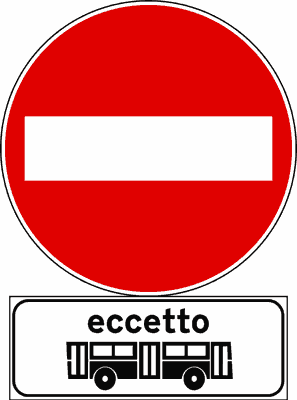
- **📖 الترجمة السياقية:** تسمح الإشارة في الشكل بالدخول للحافلات فقط.
- **💡 الشرح والقاعدة المرورية:** صحيح (VERO). شاخصة منع المرور مع لوحة 'eccetto' (باستثناء) الحافلات تعني أن المنع يسري على الجميع ما عدا الحافلات، فتصبح الحافلات وحدها المسموح لها.
- **⚠️ كشف الفخ:** فخ الامتحان: eccetto = باستثناء؛ المستثنى من المنع مسموح له.
- **🔑 الكلمات المفتاحية:** `{'it': 'eccetto', 'ar': 'باستثناء'}` | `{'it': 'solo agli autobus', 'ar': 'للحافلات فقط'}` | `{'it': 'vero', 'ar': 'صحيح'}`

---

**256.** Il segnale in figura permette di transitare solo agli autobus
- **الإجابة:** `VERO ✅ (صح)`
- 
- **📖 الترجمة السياقية:** تتيح الإشارة في الشكل المرور للحافلات فقط.
- **💡 الشرح والقاعدة المرورية:** صحيح (VERO). الحافلات مستثناة من منع المرور، وجميع المركبات الأخرى ممنوعة.
- **⚠️ كشف الفخ:** فخ الامتحان: الاستثناء يعكس المنع للفئة المذكورة.
- **🔑 الكلمات المفتاحية:** `{'it': 'transitare solo agli autobus', 'ar': 'المرور للحافلات فقط'}` | `{'it': 'vero', 'ar': 'صحيح'}`

---

**257.** Il segnale in figura indica che possono parcheggiare tutti i veicoli tranne gli autobus
- **الإجابة:** `VERO ✅ (صح)`
- 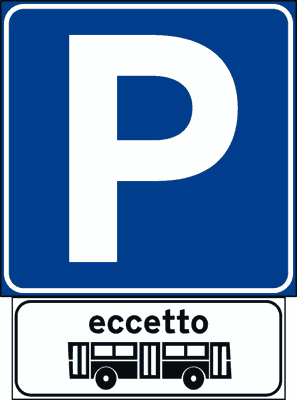
- **📖 الترجمة السياقية:** تشير الإشارة في الشكل إلى أن جميع المركبات يجوز لها الركن ما عدا الحافلات.
- **💡 الشرح والقاعدة المرورية:** صحيح (VERO). عند اقتران لوحة 'eccetto bus' بشاخصة الموقف (P)، يُستثنى الباص من إذن الركن ويبقى الإذن لبقية المركبات.
- **⚠️ كشف الفخ:** فخ الامتحان: الاستثناء يُخرج الفئة المذكورة من معنى الإشارة العلوية أياً كان (منع أو إذن).
- **🔑 الكلمات المفتاحية:** `{'it': 'tutti tranne gli autobus', 'ar': 'الجميع ما عدا الحافلات'}` | `{'it': 'parcheggio', 'ar': 'موقف'}` | `{'it': 'vero', 'ar': 'صحيح'}`

---

**258.** Il pannello integrativo in figura può essere abbinato ad un segnale di obbligo
- **الإجابة:** `VERO ✅ (صح)`
- 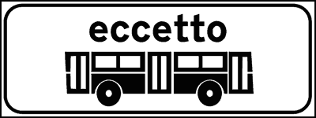
- **📖 الترجمة السياقية:** يمكن اقتران اللوحة الإضافية في الشكل بإشارة إلزام.
- **💡 الشرح والقاعدة المرورية:** صحيح (VERO). لوحة الاستثناء تُستخدم مع إشارات الإلزام لإعفاء فئة معينة من الإلزام.
- **⚠️ كشف الفخ:** فخ الامتحان: الاقتران بالإلزام صحيح.
- **🔑 الكلمات المفتاحية:** `{'it': 'segnale di obbligo', 'ar': 'إشارة إلزام'}` | `{'it': 'vero', 'ar': 'صحيح'}`

---

**259.** Il pannello integrativo in figura può essere abbinato ad un segnale di divieto
- **الإجابة:** `VERO ✅ (صح)`
- 
- **📖 الترجمة السياقية:** يمكن اقتران اللوحة الإضافية في الشكل بإشارة منع.
- **💡 الشرح والقاعدة المرورية:** صحيح (VERO). هو الاستخدام الأكثر شيوعاً: إعفاء فئة من المنع.
- **⚠️ كشف الفخ:** فخ الامتحان: الاقتران بالمنع صحيح.
- **🔑 الكلمات المفتاحية:** `{'it': 'segnale di divieto', 'ar': 'إشارة منع'}` | `{'it': 'vero', 'ar': 'صحيح'}`

---

**260.** Il segnale in figura vieta l'accesso agli autobus
- **الإجابة:** `FALSO ❌ (خطأ)`
- 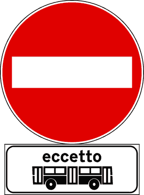
- **📖 الترجمة السياقية:** تمنع الإشارة في الشكل دخول الحافلات.
- **💡 الشرح والقاعدة المرورية:** خطأ (FALSO). الحافلات هي الفئة المستثناة من المنع، فهي الوحيدة المسموح لها بالدخول.
- **⚠️ كشف الفخ:** فخ الامتحان: عكس معنى eccetto.
- **🔑 الكلمات المفتاحية:** `{'it': "vieta l'accesso agli autobus", 'ar': 'تمنع دخول الحافلات (فخ)'}` | `{'it': 'eccetto', 'ar': 'باستثناء'}` | `{'it': 'falso', 'ar': 'خطأ'}`

---

**261.** Il segnale in figura vieta il transito agli autobus
- **الإجابة:** `FALSO ❌ (خطأ)`
- 
- **📖 الترجمة السياقية:** تمنع الإشارة في الشكل مرور الحافلات.
- **💡 الشرح والقاعدة المرورية:** خطأ (FALSO). الحافلات مستثناة من منع المرور ويجوز لها المرور.
- **⚠️ كشف الفخ:** فخ الامتحان: لا تخلط بين لوحة الاستثناء ولوحة تحديد الفئة.
- **🔑 الكلمات المفتاحية:** `{'it': 'vieta il transito agli autobus', 'ar': 'تمنع مرور الحافلات (فخ)'}` | `{'it': 'falso', 'ar': 'خطأ'}`

---

**262.** Il pannello integrativo in figura può trovarsi da solo
- **الإجابة:** `FALSO ❌ (خطأ)`
- 
- **📖 الترجمة السياقية:** يمكن أن توجد اللوحة الإضافية في الشكل بمفردها.
- **💡 الشرح والقاعدة المرورية:** خطأ (FALSO). اللوحات الإضافية لا تكون لها قيمة إلا مقترنة بإشارة رئيسية تكمل معناها.
- **⚠️ كشف الفخ:** فخ الامتحان: اللوحة الإضافية لا تُستخدم منفردة أبداً.
- **🔑 الكلمات المفتاحية:** `{'it': 'trovarsi da solo', 'ar': 'توجد بمفردها (فخ)'}` | `{'it': 'abbinato', 'ar': 'مقترن'}` | `{'it': 'falso', 'ar': 'خطأ'}`

---

**263.** Il pannello integrativo in figura vale solo per gli autobus urbani
- **الإجابة:** `FALSO ❌ (خطأ)`
- 
- **📖 الترجمة السياقية:** تسري اللوحة الإضافية في الشكل على الحافلات الحضرية فقط.
- **💡 الشرح والقاعدة المرورية:** خطأ (FALSO). الاستثناء يشمل الحافلات (autobus) بشكل عام، وليس الحضرية فقط.
- **⚠️ كشف الفخ:** فخ الامتحان: كلمة 'urbani' تقييد غير موجود في اللوحة.
- **🔑 الكلمات المفتاحية:** `{'it': 'solo autobus urbani', 'ar': 'الحافلات الحضرية فقط (فخ)'}` | `{'it': 'falso', 'ar': 'خطأ'}`

---

