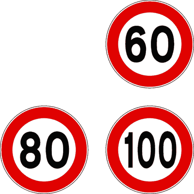

# Capitolo 11 - Limiti di velocita e pericolo
### حدود السرعة ومسافة التوقف

- 📁 **المجلد المحلي للباب:** `Capitolo_11_limiti_di_velocita`

## 📌 Regolazione conducente velocita (16 domande)

**1.** Il conducente deve regolare la velocità in relazione alle caratteristiche del veicolo

- **الإجابة:** `VERO ✅ (صح)`

---

**2.** Il conducente deve regolare la velocità in relazione allo stato del veicolo

- **الإجابة:** `VERO ✅ (صح)`

---

**3.** Il conducente deve regolare la velocità in relazione al carico del veicolo

- **الإجابة:** `VERO ✅ (صح)`

---

**4.** Il conducente deve regolare la velocità in relazione alle caratteristiche della strada

- **الإجابة:** `VERO ✅ (صح)`

---

**5.** Il conducente deve regolare la velocità in relazione alle condizioni della strada

- **الإجابة:** `VERO ✅ (صح)`

---

**6.** Il conducente deve regolare la velocità in relazione alle condizioni del traffico

- **الإجابة:** `VERO ✅ (صح)`

---

**7.** Il conducente deve regolare la velocità in modo da non costituire pericolo di danno alle cose

- **الإجابة:** `VERO ✅ (صح)`

---

**8.** Il conducente deve regolare la velocità in modo da non costituire pericolo per le persone

- **الإجابة:** `VERO ✅ (صح)`

---

**9.** Il conducente deve regolare la velocità in modo da non costituire disordine per la circolazione

- **الإجابة:** `VERO ✅ (صح)`

---

**10.** Il conducente deve regolare la velocità entro i limiti massimi consentiti

- **الإجابة:** `VERO ✅ (صح)`

---

**11.** Il conducente deve regolare la velocità in modo da rispettare le limitazioni imposte

- **الإجابة:** `VERO ✅ (صح)`

---

**12.** Il conducente deve regolare la velocità in relazione alle condizioni atmosferiche

- **الإجابة:** `VERO ✅ (صح)`

---

**13.** Il conducente deve regolare la velocità tenendo conto esclusivamente dei limiti massimi

- **الإجابة:** `FALSO ❌ (خطأ)`

---

**14.** Il conducente deve regolare la velocità in relazione alla propria abilità alla guida

- **الإجابة:** `FALSO ❌ (خطأ)`

---

**15.** Il conducente deve regolare la velocità in relazione alla marca dei pneumatici

- **الإجابة:** `FALSO ❌ (خطأ)`

---

**16.** Il conducente deve regolare la velocità in relazione alla distanza del luogo da raggiungere

- **الإجابة:** `FALSO ❌ (خطأ)`

---

## 📌 Obbligo regolazione (29 domande)

**17.** Il conducente deve sempre mantenere il controllo del veicolo

- **الإجابة:** `VERO ✅ (صح)`

---

**18.** Il conducente deve sempre essere in grado di arrestare il veicolo in condizioni di sicurezza

- **الإجابة:** `VERO ✅ (صح)`

---

**19.** Il conducente deve poter arrestare il veicolo nel campo di visibilità e in condizioni di sicurezza.

- **الإجابة:** `VERO ✅ (صح)`

---

**20.** E' obbligatorio regolare la velocità nelle curve

- **الإجابة:** `VERO ✅ (صح)`

---

**21.** E' obbligatorio regolare la velocità nei tratti di strada a visibilità limitata

- **الإجابة:** `VERO ✅ (صح)`

---

**22.** E' obbligatorio regolare la velocità in prossimità delle intersezioni

- **الإجابة:** `VERO ✅ (صح)`

---

**23.** E' obbligatorio regolare la velocità in prossimità delle scuole

- **الإجابة:** `VERO ✅ (صح)`

---

**24.** E' obbligatorio regolare la velocità in prossimità di luoghi frequentati dai bambini

- **الإجابة:** `VERO ✅ (صح)`

---

**25.** E' obbligatorio regolare la velocità nelle forti discese

- **الإجابة:** `VERO ✅ (صح)`

---

**26.** E' obbligatorio regolare la velocità nei passaggi stretti

- **الإجابة:** `VERO ✅ (صح)`

---

**27.** E' obbligatorio regolare la velocità nei passaggi ingombrati

- **الإجابة:** `VERO ✅ (صح)`

---

**28.** E' obbligatorio regolare la velocità nelle ore notturne

- **الإجابة:** `VERO ✅ (صح)`

---

**29.** E' obbligatorio regolare la velocità nell'attraversamento di abitati

- **الإجابة:** `VERO ✅ (صح)`

---

**30.** E' obbligatorio regolare la velocità nei tratti di strada fiancheggiati da edifici

- **الإجابة:** `VERO ✅ (صح)`

---

**31.** E' obbligatorio ridurre la velocità quando sia difficoltoso l'incrocio con altri veicoli

- **الإجابة:** `VERO ✅ (صح)`

---

**32.** E' obbligatorio regolare la velocità in caso di nebbia o foschia

- **الإجابة:** `VERO ✅ (صح)`

---

**33.** E' obbligatorio regolare la velocità nei tratti di strada coperti da neve

- **الإجابة:** `VERO ✅ (صح)`

---

**34.** E' obbligatorio regolare la velocità nei tratti di strada coperti da ghiaccio

- **الإجابة:** `VERO ✅ (صح)`

---

**35.** E' obbligatorio ridurre la velocità su strada a senso unico

- **الإجابة:** `FALSO ❌ (خطأ)`

---

**36.** E' obbligatorio ridurre la velocità fuori dai centri abitati

- **الإجابة:** `FALSO ❌ (خطأ)`

---

**37.** E' obbligatorio ridurre la velocità nelle strade provinciali

- **الإجابة:** `FALSO ❌ (خطأ)`

---

**38.** E' obbligatorio regolare la velocità nelle ore diurne ma non in quelle notturne

- **الإجابة:** `FALSO ❌ (خطأ)`

---

**39.** E' obbligatorio regolare la velocità nei rettilinei e non in curva

- **الإجابة:** `FALSO ❌ (خطأ)`

---

**40.** E' obbligatorio ridurre la velocità nelle strade in salita

- **الإجابة:** `FALSO ❌ (خطأ)`

---

**41.** E' obbligatorio ridurre la velocità in presenza di qualunque segnale stradale

- **الإجابة:** `FALSO ❌ (خطأ)`

---

**42.** E' obbligatorio ridurre la velocità solo in presenza degli agenti del traffico

- **الإجابة:** `FALSO ❌ (خطأ)`

---

**43.** E' obbligatorio regolare la velocità sulle strade extraurbane secondarie, ma non in quelle principali

- **الإجابة:** `FALSO ❌ (خطأ)`

---

**44.** E' obbligatorio ridurre la velocità solo se l'autovettura è scarica

- **الإجابة:** `FALSO ❌ (خطأ)`

---

**45.** E' obbligatorio ridurre la velocità in prossimità degli autovelox

- **الإجابة:** `FALSO ❌ (خطأ)`

---

## 📌 Riduzione velocita (12 domande)

**46.** E' obbligatorio ridurre la velocità e all'occorrenza fermarsi quando riesce malagevole l'incrocio con altri veicoli

- **الإجابة:** `VERO ✅ (صح)`

---

**47.** E' obbligatorio ridurre la velocità e all'occorrenza fermarsi in prossimità degli attraversamenti pedonali

- **الإجابة:** `VERO ✅ (صح)`

---

**48.** E' obbligatorio ridurre la velocità e all'occorrenza fermarsi quando i pedoni, che sono sul percorso, tardano a scansarsi

- **الإجابة:** `VERO ✅ (صح)`

---

**49.** E' obbligatorio ridurre la velocità e all'occorrenza fermarsi quando i pedoni, che sono sul percorso, danno segni d'incertezza

- **الإجابة:** `VERO ✅ (صح)`

---

**50.** E' obbligatorio ridurre la velocità e all'occorrenza fermarsi quando gli animali che si trovano sulla strada danno segni di spavento

- **الإجابة:** `VERO ✅ (صح)`

---

**51.** E' obbligatorio ridurre la velocità e all'occorrenza fermarsi quando si rimane abbagliati

- **الإجابة:** `VERO ✅ (صح)`

---

**52.** E' obbligatorio ridurre la velocità e all'occorrenza fermarsi in corrispondenza dei passi carrabili

- **الإجابة:** `FALSO ❌ (خطأ)`

---

**53.** E' obbligatorio ridurre la velocità e all'occorrenza fermarsi in prossimità delle fermate degli autobus

- **الإجابة:** `FALSO ❌ (خطأ)`

---

**54.** E' obbligatorio ridurre la velocità e all'occorrenza fermarsi ogni volta che si percorre un cavalcavia

- **الإجابة:** `FALSO ❌ (خطأ)`

---

**55.** E' obbligatorio ridurre la velocità e all'occorrenza fermarsi in prossimità degli autovelox

- **الإجابة:** `FALSO ❌ (خطأ)`

---

**56.** E' obbligatorio ridurre la velocità e all'occorrenza fermarsi in corrispondenza di qualunque segnale stradale

- **الإجابة:** `FALSO ❌ (خطأ)`

---

**57.** E' obbligatorio ridurre la velocità e all'occorrenza fermarsi all'uscita dei centri abitati

- **الإجابة:** `FALSO ❌ (خطأ)`

---

## 📌 Limite velocita generali (29 domande)

**58.** Il limite massimo di velocità per un'autovettura sulle autostrade è ordinariamente di 130 km/h

- **الإجابة:** `VERO ✅ (صح)`

---

**59.** Il limite massimo di velocità per un'autovettura sulle strade extraurbane principali è ordinariamente di 110 km/h

- **الإجابة:** `VERO ✅ (صح)`

---

**60.** Il limite massimo di velocità per un'autovettura sulle strade extraurbane secondarie è di 90 km/h

- **الإجابة:** `VERO ✅ (صح)`

---

**61.** Il limite massimo di velocità per un'autovettura nei centri abitati è ordinariamente di 50 km/h

- **الإجابة:** `VERO ✅ (صح)`

---

**62.** Il limite massimo di velocità per un autoveicolo fino a 3,5 tonnellate sulle autostrade è ordinariamente di 130 km/h

- **الإجابة:** `VERO ✅ (صح)`

---

**63.** Il limite massimo di velocità per un autocarro fino a 3,5 tonnellate sulle strade extraurbane principali è di 110 km/h

- **الإجابة:** `VERO ✅ (صح)`

---

**64.** Il limite massimo di velocità per un autoveicolo fino a 3,5 tonnellate sulle strade extraurbane secondarie è di 90 km/h

- **الإجابة:** `VERO ✅ (صح)`

---

**65.** Il limite massimo di velocità per un motociclo nei centri abitati, è ordinariamente di 50 km/h

- **الإجابة:** `VERO ✅ (صح)`

---

**66.** Il limite massimo di velocità per un'autovettura, in presenza di apposito segnale in tratti di autostrade con particolari caratteristiche, è di 150 km/h

- **الإجابة:** `VERO ✅ (صح)`

---

**67.** Il limite massimo di velocità per un'autovettura in presenza di segnali su una strada urbana con particolari caratteristiche è di 70 km/h

- **الإجابة:** `VERO ✅ (صح)`

---

**68.** Il limite massimo di velocità per un'autovettura in caso di precipitazioni atmosferiche sulle autostrade è di 110 km/h

- **الإجابة:** `VERO ✅ (صح)`

---

**69.** Il limite massimo di velocità per un'autovettura in caso di precipitazioni atmosferiche su strade extraurbane principali è di 90 km/h

- **الإجابة:** `VERO ✅ (صح)`

---

**70.** Il limite massimo di velocità per i ciclomotori è di 45 km/h

- **الإجابة:** `VERO ✅ (صح)`

---

**71.** Il limite massimo di velocità per i quadricicli non leggeri, fuori dai centri urbani, è di 80 km/h

- **الإجابة:** `VERO ✅ (صح)`

---

**72.** Il limite massimo di velocità per una macchina agricola gommata è di 40 km/h

- **الإجابة:** `VERO ✅ (صح)`

---

**73.** Il limite massimo di velocità per una macchina operatrice gommata è di 40 km/h

- **الإجابة:** `VERO ✅ (صح)`

---

**74.** Il limite massimo di velocità per un'autovettura su una qualsiasi autostrada è di 150 km/h

- **الإجابة:** `FALSO ❌ (خطأ)`

---

**75.** Il limite massimo di velocità per un'autovettura su una strada extraurbana principale è di 90 km/h

- **الإجابة:** `FALSO ❌ (خطأ)`

---

**76.** Il limite massimo di velocità per un'autovettura su una strada extraurbana secondaria è di 70 km/h

- **الإجابة:** `FALSO ❌ (خطأ)`

---

**77.** Il limite massimo di velocità per un'autovettura nei centri abitati è sempre di 70 km/h

- **الإجابة:** `FALSO ❌ (خطأ)`

---

**78.** Il limite massimo di velocità per un'autovettura nei centri abitati è sempre di 50 km/h

- **الإجابة:** `FALSO ❌ (خطأ)`

---

**79.** Il limite massimo di velocità dei quadricicli fuori dai centri abitati è di 70 km/h

- **الإجابة:** `FALSO ❌ (خطأ)`

---

**80.** Il limite massimo di velocità degli autocarri nei centri abitati è di 40 km/h

- **الإجابة:** `FALSO ❌ (خطأ)`

---

**81.** Il limite massimo di velocità per un autocarro di massa complessiva fino a 3,5 tonnellate sulle autostrade è di 120 km/h

- **الإجابة:** `FALSO ❌ (خطأ)`

---

**82.** Il limite massimo di velocità per un autoveicolo fino a 3,5 tonnellate sulle strade extraurbane principali è di 80 km/h

- **الإجابة:** `FALSO ❌ (خطأ)`

---

**83.** Il limite massimo di velocità per un autoveicolo fino a 3,5 tonnellate nei centri abitati è di 40 km/h

- **الإجابة:** `FALSO ❌ (خطأ)`

---

**84.** Il limite massimo di velocità per qualsiasi veicolo nei centri abitati è di 60 km/h

- **الإجابة:** `FALSO ❌ (خطأ)`

---

**85.** Il limite massimo di velocità per una macchina agricola con pneumatici è di 50 km/h

- **الإجابة:** `FALSO ❌ (خطأ)`

---

**86.** Il limite massimo di velocità per una macchina operatrice gommata è di 50 km/h

- **الإجابة:** `FALSO ❌ (خطأ)`

---

## 📌 Limiti velocita eta (9 domande)

**87.** Il limite di velocità sulle autostrade per coloro che hanno conseguito la patente da meno di 3 anni è di 100 km/h

- **الإجابة:** `VERO ✅ (صح)`

---

**88.** Il limite di velocità sulle strade extraurbane principali per coloro che hanno conseguito la patente da meno di 3 anni è di 90 km/h

- **الإجابة:** `VERO ✅ (صح)`

---

**89.** Viaggiare ad alta velocità incide sul consumo di carburante e sull'inquinamento ambientale

- **الإجابة:** `VERO ✅ (صح)`

---

**90.** Brusche variazioni di velocità comportano maggior consumo di carburante

- **الإجابة:** `VERO ✅ (صح)`

---

**91.** La velocità in curva incide sulla tenuta di strada del veicolo

- **الإجابة:** `VERO ✅ (صح)`

---

**92.** L'eccessiva velocità in curva può determinare il ribaltamento del veicolo

- **الإجابة:** `VERO ✅ (صح)`

---

**93.** I tratti di strada in curva debbono essere percorsi con il pedale della frizione abbassato

- **الإجابة:** `FALSO ❌ (خطأ)`

---

**94.** Il limite di velocità sulle autostrade per coloro che hanno conseguito la patente da meno di tre anni è di 110 km/h

- **الإجابة:** `FALSO ❌ (خطأ)`

---

**95.** Il limite di velocità sulle strade extraurbane principali per coloro che hanno conseguito la patente da meno di 3 anni è di 110 km/h

- **الإجابة:** `FALSO ❌ (خطأ)`

---

## 📌 Limiti strade extraurbane velocita (18 domande)

**96.** Il limite massimo di velocità sulle autostrade è ordinariamente di 130 km/h per le autovetture con carrello appendice

- **الإجابة:** `VERO ✅ (صح)`

---

**97.** Il limite massimo di velocità sulle autostrade è di 80 km/h per le autovetture con rimorchio

- **الإجابة:** `VERO ✅ (صح)`

---

**98.** Il limite massimo di velocità sulle autostrade è ordinariamente di 130 km/h per i motocicli

- **الإجابة:** `VERO ✅ (صح)`

---

**99.** Il limite massimo di velocità sulle autostrade è ordinariamente di 130 km/h per autocaravan di massa complessiva fino a 3,5 tonnellate

- **الإجابة:** `VERO ✅ (صح)`

---

**100.** Il limite massimo di velocità sulle autostrade è di 80 km/h per l'autovettura che traina un caravan

- **الإجابة:** `VERO ✅ (صح)`

---

**101.** Il limite massimo di velocità sulle strade extraurbane principali è ordinariamente di 110 km/h per i motocicli

- **الإجابة:** `VERO ✅ (صح)`

---

**102.** Il limite massimo di velocità sulle strade extraurbane principali è di 110 km/h per autovetture con carrello appendice

- **الإجابة:** `VERO ✅ (صح)`

---

**103.** Il limite massimo di velocità sulle strade extraurbane principali è di 70 km/h per autovetture con rimorchio per trasporto imbarcazioni

- **الإجابة:** `VERO ✅ (صح)`

---

**104.** Il limite massimo di velocità sulle strade extraurbane secondarie è di 90 km/h per i motocicli

- **الإجابة:** `VERO ✅ (صح)`

---

**105.** Il limite massimo di velocità su strade extraurbane secondarie è di 70 km/h per autovettura che traina un caravan con massa complessiva di 900 chilogrammi.

- **الإجابة:** `VERO ✅ (صح)`

---

**106.** Il limite massimo di velocità sulle autostrade è di 130 km/h per le autovetture con rimorchio

- **الإجابة:** `FALSO ❌ (خطأ)`

---

**107.** Il limite massimo di velocità sulle autostrade è di 90 km/h per i motocicli

- **الإجابة:** `FALSO ❌ (خطأ)`

---

**108.** Il limite massimo di velocità sulle autostrade è di 90 km/h per autocaravan

- **الإجابة:** `FALSO ❌ (خطأ)`

---

**109.** Il limite massimo di velocità sulle autostrade è di 70 km/h per autovettura che traina un caravan

- **الإجابة:** `FALSO ❌ (خطأ)`

---

**110.** Il limite massimo di velocità sulle autostrade è di 120 km/h per autovettura con carrello appendice in caso di pioggia

- **الإجابة:** `FALSO ❌ (خطأ)`

---

**111.** Il limite massimo di velocità su strade extraurbane principali è di 100 km/h per i motocicli

- **الإجابة:** `FALSO ❌ (خطأ)`

---

**112.** Il limite massimo di velocità sulle strade extraurbane principali è di 80 km/h per autovetture con rimorchio per trasporto di imbarcazioni

- **الإجابة:** `FALSO ❌ (خطأ)`

---

**113.** Il limite massimo di velocità sulle strade extraurbane secondarie è di 70 km/h per i motocicli

- **الإجابة:** `FALSO ❌ (خطأ)`

---

## 📌 Regolazione velocita (6 domande)

**114.** La velocità dei veicoli deve essere regolata in modo da non causare intralcio alla circolazione

- **الإجابة:** `VERO ✅ (صح)`

---

**115.** E' obbligatorio ridurre la velocità e all'occorrenza fermarsi negli incroci, per far passare i veicoli cui spetti la precedenza

- **الإجابة:** `VERO ✅ (صح)`

---

**116.** E' obbligatorio ridurre la velocità e all'occorrenza fermarsi da mezz'ora prima del tramonto a mezz'ora dopo il sorgere del sole

- **الإجابة:** `FALSO ❌ (خطأ)`

---

**117.** Si è tenuti a regolare la velocità in funzione del tipo di alimentazione del motore

- **الإجابة:** `FALSO ❌ (خطأ)`

---

**118.** Si è tenuti a regolare la velocità in funzione della velocità dei veicoli che seguono

- **الإجابة:** `FALSO ❌ (خطأ)`

---

**119.** Si è tenuti a regolare la velocità in funzione del tipo di cambio di velocità

- **الإجابة:** `FALSO ❌ (خطأ)`

---

## 📌 Doveri velocita (7 domande)

**120.** La velocità deve essere moderata nei tratti di strada a visuale non libera

- **الإجابة:** `VERO ✅ (صح)`

---

**121.** Si deve tenere una velocità che non costituisca pericolo per la sicurezza della circolazione

- **الإجابة:** `VERO ✅ (صح)`

---

**122.** Si deve tenere una velocità che consenta di intervenire con sicurezza in caso di imprevisti

- **الإجابة:** `VERO ✅ (صح)`

---

**123.** Si deve tenere una velocità adeguata alle proprie condizioni psicofisiche

- **الإجابة:** `VERO ✅ (صح)`

---

**124.** E' obbligo del conducente regolare la velocità in relazione al carico del veicolo

- **الإجابة:** `VERO ✅ (صح)`

---

**125.** Si deve tenere una velocità regolata in funzione del tempo che abbiamo a disposizione

- **الإجابة:** `FALSO ❌ (خطأ)`

---

**126.** La velocità deve essere moderata fuori dai centri abitati

- **الإجابة:** `FALSO ❌ (خطأ)`

---

## 📌 Norme velocita (21 domande)

**127.** In presenza di apposito segnale, il limite massimo di velocità consentito può essere di 150 km/h su tratti di autostrade con particolari caratteristiche

- **الإجابة:** `VERO ✅ (صح)`

---

**128.** Salvo diversa segnalazione, il limite massimo di velocità consentito è di 130 km/h sulle autostrade

- **الإجابة:** `VERO ✅ (صح)`

---

**129.** Salvo diversa segnalazione, il limite massimo di velocità consentito è di 50 km/h nei centri abitati

- **الإجابة:** `VERO ✅ (صح)`

---

**130.** Salvo diversa segnalazione, per i ciclomotori il limite massimo di velocità consentito è di 45 km/h

- **الإجابة:** `VERO ✅ (صح)`

---

**131.** Salvo diversa segnalazione, il limite massimo di velocità consentito per macchine agricole e macchine operatrici con pneumatici è di 40 km/h

- **الإجابة:** `VERO ✅ (صح)`

---

**132.** Salvo diversa segnalazione, il limite massimo di velocità consentito sulle autostrade è di 110 km/h in caso di pioggia

- **الإجابة:** `VERO ✅ (صح)`

---

**133.** Salvo diversa segnalazione, il limite massimo di velocità consentito su strade extraurbane principali è di 90 km/h in caso di grandine

- **الإجابة:** `VERO ✅ (صح)`

---

**134.** In presenza di appositi segnali, il limite massimo di velocità consentito nei centri abitati su strade con particolari caratteristiche è di 70 km/h

- **الإجابة:** `VERO ✅ (صح)`

---

**135.** Salvo diversa segnalazione, il limite massimo di velocità consentito sulle strade extraurbane principali è di 110 km/h

- **الإجابة:** `VERO ✅ (صح)`

---

**136.** Su strade extraurbane principali il limite massimo di velocità è di 110 km/h per le autovetture

- **الإجابة:** `VERO ✅ (صح)`

---

**137.** Su strade extraurbane principali il limite massimo di velocità è di 70 km/h per autovettura che traina caravan da 900 chilogrammi

- **الإجابة:** `VERO ✅ (صح)`

---

**138.** Su strade extraurbane principali il limite massimo di velocità è di 110 km/h per autoveicoli fino a 3,5t

- **الإجابة:** `VERO ✅ (صح)`

---

**139.** Su strade extraurbane principali il limite massimo di velocità è di 70 km/h per autotreni

- **الإجابة:** `VERO ✅ (صح)`

---

**140.** Salvo diversa segnalazione, il limite massimo di velocità consentito sulle strade urbane è di 80 km/h

- **الإجابة:** `FALSO ❌ (خطأ)`

---

**141.** Salvo diversa segnalazione, il limite massimo di velocità consentito per i quadricicli non leggeri è di 70 km/h.

- **الإجابة:** `FALSO ❌ (خطأ)`

---

**142.** Il limite massimo di velocità consentito su qualsiasi autostrada è di 150 km/h

- **الإجابة:** `FALSO ❌ (خطأ)`

---

**143.** Su strade extraurbane principali il limite massimo di velocità è di 100 km/h per autocarri di massa complessiva fino a 3,5 t

- **الإجابة:** `FALSO ❌ (خطأ)`

---

**144.** Su strade extraurbane principali il limite massimo di velocità è di 100 km/h per autocaravan di massa complessiva fino a 3,5 t

- **الإجابة:** `FALSO ❌ (خطأ)`

---

**145.** Su strade extraurbane principali il limite massimo di velocità è di 80 km/h per autovetture con rimorchio leggero

- **الإجابة:** `FALSO ❌ (خطأ)`

---

**146.** Su strade extraurbane principali il limite massimo di velocità è di 100 km/h per motocicli

- **الإجابة:** `FALSO ❌ (خطأ)`

---

**147.** Su strade extraurbane principali il limite massimo di velocità è di 100 km/h per le autovetture con carrello appendice

- **الإجابة:** `FALSO ❌ (خطأ)`

---

## 📌 Strade extraurbane secondarie (13 domande)

**148.** Il limite massimo di velocità su strade extraurbane secondarie è di 90 km/h per motocicli

- **الإجابة:** `VERO ✅ (صح)`

---

**149.** Il limite massimo di velocità su strade extraurbane secondarie è di 90 km/h per autovetture con carrello appendice

- **الإجابة:** `VERO ✅ (صح)`

---

**150.** Il limite massimo di velocità su strade extraurbane secondarie è di 70 km/h per autovetture con rimorchio per trasporto di imbarcazioni o simili

- **الإجابة:** `VERO ✅ (صح)`

---

**151.** Il limite massimo di velocità su strade extraurbane secondarie è di 90 km/h per autocaravan di massa complessiva fino a 3,5t

- **الإجابة:** `VERO ✅ (صح)`

---

**152.** Il limite massimo di velocità su strade extraurbane secondarie è di 90 km/h per autocarri di massa complessiva fino a 3,5t

- **الإجابة:** `VERO ✅ (صح)`

---

**153.** Il limite massimo di velocità su strade extraurbane secondarie è di 70 km/h per autotreni

- **الإجابة:** `VERO ✅ (صح)`

---

**154.** Il limite massimo di velocità su strade extraurbane secondarie è di 70 km/h per i ciclomotori

- **الإجابة:** `FALSO ❌ (خطأ)`

---

**155.** Il limite massimo di velocità su strade extraurbane secondarie è di 90 km/h per i quadricicli non leggeri

- **الإجابة:** `FALSO ❌ (خطأ)`

---

**156.** Il limite massimo di velocità su strade extraurbane secondarie è di 80 km/h per motocicli

- **الإجابة:** `FALSO ❌ (خطأ)`

---

**157.** Il limite massimo di velocità su strade extraurbane secondarie è di 100 km/h per le autovetture

- **الإجابة:** `FALSO ❌ (خطأ)`

---

**158.** Il limite massimo di velocità su strade extraurbane secondarie è di 80 km/h per autovettura che traina caravan da 750 chilogrammi

- **الإجابة:** `FALSO ❌ (خطأ)`

---

**159.** Il limite massimo di velocità su strade extraurbane secondarie è di 100 km/h per autoveicoli fino a 3,5 tonnellate

- **الإجابة:** `FALSO ❌ (خطأ)`

---

**160.** Su strade extraurbane secondarie il limite massimo di velocità è di 80 km/h per autovetture con carrello appendice

- **الإجابة:** `FALSO ❌ (خطأ)`

---

## 📌 Contrassegni velocita (8 domande)

**161.** I contrassegni rappresentati in figura sono applicati sulla parte posteriore di alcune categorie di veicoli

- **الإجابة:** `VERO ✅ (صح)`
- 

---

**162.** I contrassegni rappresentati in figura indicano le velocità massime consentite al veicolo sul quale sono applicati

- **الإجابة:** `VERO ✅ (صح)`
- 

---

**163.** I contrassegni rappresentati in figura sono applicati ad alcuni autobus

- **الإجابة:** `VERO ✅ (صح)`
- 

---

**164.** La velocità deve essere diminuita in caso di traffico misto (presenza di veicoli lenti e veloci o di animali e pedoni che occupano la strada)

- **الإجابة:** `VERO ✅ (صح)`

---

**165.** Si deve regolare la velocità in base alle condizioni del fondo stradale (presenza di buche, sconnessioni, fogliame bagnato.)

- **الإجابة:** `VERO ✅ (صح)`

---

**166.** I contrassegni rappresentati in figura sono applicati su autocarri di massa complessiva fino a 3,5 tonnellate

- **الإجابة:** `FALSO ❌ (خطأ)`
- 

---

**167.** I contrassegni rappresentati in figura sono applicati su autocaravan di massa totale fino a 3,5 tonnellate

- **الإجابة:** `FALSO ❌ (خطأ)`
- 

---

**168.** I contrassegni rappresentati in figura sono applicati sui motocicli di cilindrata superiore a 150 cm3

- **الإجابة:** `FALSO ❌ (خطأ)`
- 

---

## 📌 Moderazione velocita (12 domande)

**169.** La velocità deve essere particolarmente moderata in prossimità di un incrocio

- **الإجابة:** `VERO ✅ (صح)`

---

**170.** La velocità deve essere particolarmente moderata nelle strettoie

- **الإجابة:** `VERO ✅ (صح)`

---

**171.** La velocità deve essere particolarmente moderata quando risulta difficoltoso l'incrocio con altri veicoli

- **الإجابة:** `VERO ✅ (صح)`

---

**172.** La velocità deve essere particolarmente moderata nei tratti di strada in cui manca la visibilità (curve, dossi)

- **الإجابة:** `VERO ✅ (صح)`

---

**173.** La velocità deve essere particolarmente moderata quando, in mancanza di marciapiedi, i pedoni occupano la carreggiata

- **الإجابة:** `VERO ✅ (صح)`

---

**174.** Si deve diminuire la velocità quando la strada è viscida, a causa di acqua, neve, ghiaccio, foglie o fango

- **الإجابة:** `VERO ✅ (صح)`

---

**175.** La velocità deve essere particolarmente moderata subito dopo il tramonto del sole

- **الإجابة:** `FALSO ❌ (خطأ)`

---

**176.** La velocità deve essere particolarmente moderata subito dopo un incrocio

- **الإجابة:** `FALSO ❌ (خطأ)`

---

**177.** Si deve regolare la velocità in base alla fretta del conducente

- **الإجابة:** `FALSO ❌ (خطأ)`

---

**178.** Si deve tenere una velocità adeguata solo alle nostre condizioni di salute

- **الإجابة:** `FALSO ❌ (خطأ)`

---

**179.** Si deve tenere una velocità sempre superiore a 30 km/h

- **الإجابة:** `FALSO ❌ (خطأ)`

---

**180.** Si deve diminuire la velocità quando si è seguiti da un autobus di linea

- **الإجابة:** `FALSO ❌ (خطأ)`

---

## 📌 Diminuzione velocita (7 domande)

**181.** Si deve regolare la velocità in base allo stato di manutenzione e pulizia della strada

- **الإجابة:** `VERO ✅ (صح)`

---

**182.** La velocità deve essere diminuita in caso di forte vento laterale

- **الإجابة:** `VERO ✅ (صح)`

---

**183.** La velocità va diminuita in caso di abbagliamento dovuto al sole

- **الإجابة:** `VERO ✅ (صح)`

---

**184.** Sulle autostrade e sulle strade extraurbane principali, in caso di nebbia fitta, con visibilità inferiore a 100 m, possono essere imposti limiti massimi temporanei di velocità, non superiori a 50 km/h

- **الإجابة:** `VERO ✅ (صح)`

---

**185.** Salvo diversa segnalazione, il limite massimo di velocità sulle strade extraurbane principali è di 100 km/h

- **الإجابة:** `FALSO ❌ (خطأ)`

---

**186.** Salvo diversa segnalazione, il limite massimo di velocità nei centri abitati è di 60 km/h, valido fino ad un chilometro dopo l'uscita del paese

- **الإجابة:** `FALSO ❌ (خطأ)`

---

**187.** Si deve diminuire la velocità ogni qualvolta si incontra un segnale stradale di indicazione

- **الإجابة:** `FALSO ❌ (خطأ)`

---

## 📌 Limiti particolari (15 domande)

**188.** Sulle autostrade, il limite massimo di velocità è di 80 km/h per le autovetture che trainano un rimorchio per il trasporto di cavalli

- **الإجابة:** `VERO ✅ (صح)`

---

**189.** Il limite massimo di velocità sulle strade extraurbane secondarie è di 70 km/h per le autovetture che trainano un rimorchio per il trasporto di motocicli

- **الإجابة:** `VERO ✅ (صح)`

---

**190.** Si deve, in particolare, regolare la velocità in presenza di lavori in corso

- **الإجابة:** `VERO ✅ (صح)`

---

**191.** Si deve, in particolare, regolare la velocità se si incontra sulla strada il segnale di veicolo fermo (triangolo mobile di pericolo)

- **الإجابة:** `VERO ✅ (صح)`

---

**192.** Quando si viaggia per file parallele, è possibile che nella corsia di destra si circoli ad una velocità superiore a quella di sinistra

- **الإجابة:** `VERO ✅ (صح)`

---

**193.** Lungo le corsie di canalizzazione, è possibile che nella corsia di destra si circoli ad una velocità superiore a quella di sinistra

- **الإجابة:** `VERO ✅ (صح)`

---

**194.** Quando il traffico risulta canalizzato, è possibile che nella corsia di destra si circoli ad una velocità superiore a quella di sinistra

- **الإجابة:** `VERO ✅ (صح)`

---

**195.** Sulle autostrade a quattro corsie è consentito viaggiare fino a 170 km/h

- **الإجابة:** `FALSO ❌ (خطأ)`

---

**196.** Sulle autostrade è consentito superare, nelle ore notturne, la velocità di 130 km/h, purché si usino i proiettori a luce abbagliante

- **الإجابة:** `FALSO ❌ (خطأ)`

---

**197.** In autostrada, nella corsia riservata al sorpasso, non è consentito superare la velocità di 110 km/h

- **الإجابة:** `FALSO ❌ (خطأ)`

---

**198.** Nelle autostrade, il limite massimo di velocità è di 150 km/h nelle ore diurne e di 130 km/h in quelle notturne

- **الإجابة:** `FALSO ❌ (خطأ)`

---

**199.** Sulle strade extraurbane principali, che abbiano particolari caratteristiche costruttive e di sicurezza, è possibile che il limite massimo di velocità sia di 130 km/h

- **الإجابة:** `FALSO ❌ (خطأ)`

---

**200.** Sulle strade extraurbane principali è consentito superare la velocità di 110 km/h, ma solo nei tratti di strada in discesa

- **الإجابة:** `FALSO ❌ (خطأ)`

---

**201.** Il limite massimo di velocità sulle strade extraurbane secondarie è di 90 km/h per le autovetture che trainano un rimorchio per il trasporto di gommoni o alianti

- **الإجابة:** `FALSO ❌ (خطأ)`

---

**202.** Sulle strade extraurbane secondarie il limite massimo di velocità per le macchine agricole e le macchine operatrici è di 70 km/h, se hanno in funzione il dispositivo a luce gialla lampeggiante

- **الإجابة:** `FALSO ❌ (خطأ)`

---

## 📌 Velocita incroci (6 domande)

**203.** Se si attraversa ad alta velocità un incrocio avendo diritto di precedenza, in caso di incidente, non può escludersi un concorso di colpa

- **الإجابة:** `VERO ✅ (صح)`

---

**204.** I limiti massimi di velocità vigenti sulle autostrade e sulle strade extraurbane non sono identici in tutti gli stati d'Europa

- **الإجابة:** `VERO ✅ (صح)`

---

**205.** Se si attraversa un incrocio a forte velocità avendo il diritto di precedenza, in caso di incidente si è completamente privi di responsabilità

- **الإجابة:** `FALSO ❌ (خطأ)`

---

**206.** Se si attraversa ad alta velocità un incrocio in cui si ha precedenza, in caso di incidente la responsabilità sarà solo del conducente del veicolo proveniente dalla strada senza diritto di precedenza

- **الإجابة:** `FALSO ❌ (خطأ)`

---

**207.** Se si attraversa un incrocio con diritto di precedenza, non si ha alcun obbligo di rallentare

- **الإجابة:** `FALSO ❌ (خطأ)`

---

**208.** Se si attraversa ad alta velocità un incrocio con precedenza, in caso di incidente la responsabilità sarà del conducente del veicolo che ha impegnato per primo l'incrocio

- **الإجابة:** `FALSO ❌ (خطأ)`

---

## 📌 Pericolo velocita (14 domande)

**209.** In caso di arresto forzato di un veicolo sui binari di un passaggio a livello, bisogna spostarlo, spingendolo quanto prima fuori dai binari

- **الإجابة:** `VERO ✅ (صح)`

---

**210.** In caso di arresto forzato di un veicolo sui binari di un passaggio a livello, se non è possibile spostarlo subito dai binari, bisogna far scendere immediatamente tutte le persone che si trovano a bordo, e avvisare la stazione ferroviaria

- **الإجابة:** `VERO ✅ (صح)`

---

**211.** In caso di arresto forzato del veicolo sui binari ferroviari di un passaggio a livello, bisogna fare in modo che i conducenti dei veicoli su rotaie siano avvisati in tempo utile del pericolo

- **الإجابة:** `VERO ✅ (صح)`

---

**212.** Se si percorre una lunga discesa con il cambio in folle e a motore spento, diventa difficoltoso muovere lo sterzo se il veicolo è dotato di servosterzo

- **الإجابة:** `VERO ✅ (صح)`

---

**213.** Se si percorre una lunga discesa con il cambio in folle e a motore spento, diventa difficoltoso frenare se il veicolo è dotato di servofreno

- **الإجابة:** `VERO ✅ (صح)`

---

**214.** Nei veicoli dotati di servofreno, se si percorre una lunga discesa con il cambio in folle e a motore spento, aumenta il rischio di provocare incidenti

- **الإجابة:** `VERO ✅ (صح)`

---

**215.** Nei veicoli dotati di servosterzo, se si percorre una lunga discesa con il cambio in folle e a motore spento, diventa difficoltoso girare rapidamente lo sterzo per schivare un ostacolo

- **الإجابة:** `VERO ✅ (صح)`

---

**216.** Nei veicoli dotati di servofreno, se si percorre una lunga discesa con il cambio in folle e a motore spento, aumenta pericolosamente lo spazio di frenatura

- **الإجابة:** `VERO ✅ (صح)`

---

**217.** Nei veicoli dotati di servofreno, se si percorre una lunga discesa con il cambio in folle e a motore spento, diventa sempre più difficoltoso arrestare il veicolo

- **الإجابة:** `VERO ✅ (صح)`

---

**218.** Se si percorre una lunga discesa con il cambio in folle e a motore spento, si ha un sovraccarico di corrente elettrica

- **الإجابة:** `FALSO ❌ (خطأ)`

---

**219.** Se si percorre una lunga discesa con il cambio in folle e a motore spento, si può avere un'anomalia al differenziale

- **الإجابة:** `FALSO ❌ (خطأ)`

---

**220.** Per una maggiore sicurezza, è conveniente percorrere le lunghe discese con il cambio in folle e a motore spento, risparmiando così anche carburante

- **الإجابة:** `FALSO ❌ (خطأ)`

---

**221.** Se si percorre una lunga discesa con il cambio in folle e a motore spento, conviene estrarre la chiave di accensione del veicolo

- **الإجابة:** `FALSO ❌ (خطأ)`

---

**222.** Nei veicoli dotati di servofreno a depressione, se si percorre una lunga discesa con il cambio in folle e a motore spento, si ottiene la stessa forza frenante che si ha con il motore acceso

- **الإجابة:** `FALSO ❌ (خطأ)`

---

## 📌 Pallone carreggiata (8 domande)

**223.** In un centro abitato, se si vede un pallone rotolare sulla carreggiata, bisogna diminuire subito la velocità

- **الإجابة:** `VERO ✅ (صح)`

---

**224.** In un centro abitato, se si vede un pallone rotolare sulla carreggiata, bisogna rallentare per potersi fermare, se necessario

- **الإجابة:** `VERO ✅ (صح)`

---

**225.** In un centro abitato, se si vede un pallone rotolare sulla carreggiata, bisogna prevedere anche il possibile attraversamento della strada da parte di un bambino

- **الإجابة:** `VERO ✅ (صح)`

---

**226.** In un centro abitato, se si vede un pallone rotolare sulla carreggiata, bisogna rallentare progressivamente, per evitare di essere tamponati dal veicolo che segue

- **الإجابة:** `VERO ✅ (صح)`

---

**227.** In un centro abitato, se si vede un pallone rotolare sulla carreggiata, bisogna sterzare bruscamente

- **الإجابة:** `FALSO ❌ (خطأ)`

---

**228.** In una strada a doppio senso di circolazione, se si vede un pallone rotolare sulla carreggiata, bisogna scansarlo, anche invadendo la corsia opposta

- **الإجابة:** `FALSO ❌ (خطأ)`

---

**229.** In un centro abitato, se si vede un pallone rotolare sulla carreggiata, non occorre rallentare, per evitare di essere tamponati dal veicolo che segue

- **الإجابة:** `FALSO ❌ (خطأ)`

---

**230.** In un centro abitato, se si vede un pallone rotolare sulla carreggiata, bisogna azionare immediatamente la segnalazione luminosa di pericolo

- **الإجابة:** `FALSO ❌ (خطأ)`

---

## 📌 Macchine parcheggiate (6 domande)

**231.** Passare molto vicino ad un'auto parcheggiata, a bordo della quale si trovano ancora persone, può essere pericoloso, per la possibile apertura imprudente delle portiere

- **الإجابة:** `VERO ✅ (صح)`

---

**232.** Può essere pericoloso circolare troppo vicino alle auto parcheggiate, perché potrebbero impedire la vista di un disabile in carrozzella o di un pedone che spinge un passeggino per bambini, che sono in procinto di attraversare

- **الإجابة:** `VERO ✅ (صح)`

---

**233.** Passare molto vicino ad un'auto parcheggiata, a bordo della quale si trovano ancora persone, non rappresenta un grave pericolo se avviene a bassa velocità

- **الإجابة:** `FALSO ❌ (خطأ)`

---

**234.** Passare molto vicino ad un'auto parcheggiata, a bordo della quale si trovano ancora persone, è pericoloso solo se una delle portiere risulta già aperta

- **الإجابة:** `FALSO ❌ (خطأ)`

---

**235.** Passare molto vicino ad un'auto parcheggiata, a bordo della quale si trovano ancora persone, è pericoloso solo se il conducente ed alcuni passeggeri sono già scesi

- **الإجابة:** `FALSO ❌ (خطأ)`

---

**236.** Passare molto vicino ad un'auto parcheggiata, a bordo della quale si trovano ancora persone, può essere pericoloso, solo se si viaggia ad alta velocità

- **الإجابة:** `FALSO ❌ (خطأ)`

---

## 📌 Comportamenti passaggio livello (20 domande)

**237.** Nel caso in cui, a un passaggio a livello, ci si trova ancora sui binari col proprio veicolo quando le barriere cominciano a chiudersi, occorre mantenere la calma e sgomberare in qualunque modo la sede ferroviaria

- **الإجابة:** `VERO ✅ (صح)`

---

**238.** Nel caso in cui, a un passaggio a livello, ci si trova ancora sui binari col proprio veicolo quando le barriere cominciano a chiudersi, occorre sgomberare in qualunque modo la sede ferroviaria, se necessario anche sfondando le barriere

- **الإجابة:** `VERO ✅ (صح)`

---

**239.** Nel caso in cui, per un guasto al veicolo, si rimane bloccati sulla sede ferroviaria di un passaggio a livello, occorre adoperarsi per rimuovere il veicolo al più presto, ad esempio facendosi trainare da altri utenti

- **الإجابة:** `VERO ✅ (صح)`

---

**240.** Nel caso in cui, per un guasto alla propria autovettura, si rimane bloccati sulla sede ferroviaria di un passaggio a livello, occorre adoperarsi per rimuovere il veicolo al più presto, ad esempio facendosi aiutare da altri utenti a spingere il veicolo fuori dalla linea ferroviaria

- **الإجابة:** `VERO ✅ (صح)`

---

**241.** Ai passaggi a livello occorre usare la massima prudenza e moderare la velocità, per evitare situazioni di pericolo che comportino il danneggiamento delle attrezzature

- **الإجابة:** `VERO ✅ (صح)`

---

**242.** Ai passaggi a livello occorre usare la massima prudenza e moderare la velocità, per evitare situazioni di pericolo che comportino la collisione con le barriere del passaggio stesso

- **الإجابة:** `VERO ✅ (صح)`

---

**243.** Attraversare un passaggio a livello senza rispettare tutte le norme previste, può mettere in pericolo l’incolumità di molte persone che viaggino su un treno in transito

- **الإجابة:** `VERO ✅ (صح)`

---

**244.** Attraversare un passaggio a livello con manovra azzardata per guadagnare tempo, può essere un pericolo per molti individui, oltre che per il conducente

- **الإجابة:** `VERO ✅ (صح)`

---

**245.** Nel caso in cui un veicolo rimanga fermo tra le barriere chiuse del passaggio a livello occorre adoperarsi in ogni modo per presegnalare il pericolo a eventuali treni in transito

- **الإجابة:** `VERO ✅ (صح)`

---

**246.** Nel caso in cui, a un passaggio a livello, ci si trova ancora sui binari col proprio veicolo quando le barriere cominciano a chiudersi, occorre scendere e abbandonare rapidamente il veicolo per mettersi in salvo

- **الإجابة:** `FALSO ❌ (خطأ)`

---

**247.** Nel caso in cui, a un passaggio a livello, ci si trova ancora sui binari col proprio veicolo quando le barriere cominciano a chiudersi, se si sta trainando un rimorchio occorre sganciarlo rapidamente e abbandonarlo sui binari per salvare almeno la motrice

- **الإجابة:** `FALSO ❌ (خطأ)`

---

**248.** Nel caso in cui, per un guasto al veicolo, si rimane bloccati sulla sede ferroviaria di un passaggio a livello, occorre scaricare rapidamente il veicolo per salvare almeno il carico

- **الإجابة:** `FALSO ❌ (خطأ)`

---

**249.** Nel caso in cui, per un guasto alla propria autovettura, si rimane bloccati sulla sede ferroviaria di un passaggio a livello, occorre svuotare rapidamente il serbatoio per evitare incendi in caso di collisione col treno

- **الإجابة:** `FALSO ❌ (خطأ)`

---

**250.** I passaggi a livello vanno affrontati a velocità molto elevata per evitare di rimanere bloccati sulla linea ferroviaria

- **الإجابة:** `FALSO ❌ (خطأ)`

---

**251.** I passaggi a livello vanno affrontati a velocità molto elevata per essere in grado di sfondare le barriere se non si è in grado di fermarsi per tempo a barriere abbassate

- **الإجابة:** `FALSO ❌ (خطأ)`

---

**252.** Attraversare un passaggio a livello senza rispettare tutte le norme previste, comporta esclusivamente una lieve sanzione amministrativa in quanto non comporta reali pericoli per gli altri utenti

- **الإجابة:** `FALSO ❌ (خطأ)`

---

**253.** Attraversare un passaggio a livello con manovra azzardata per guadagnare tempo, può essere pericoloso solo nelle ore notturne

- **الإجابة:** `FALSO ❌ (خطأ)`

---

**254.** Nel caso in cui un veicolo rimanga fermo tra le barriere chiuse del passaggio a livello, unico obbligo del conducente è quello di spegnere il motore e invitare eventuali passeggeri a scendere dal veicolo

- **الإجابة:** `FALSO ❌ (خطأ)`

---

**255.** Nel caso in cui un veicolo rimanga fermo tra le barriere chiuse del passaggio a livello occorre allontanarsi di almeno cento metri il prima possibile

- **الإجابة:** `FALSO ❌ (خطأ)`

---

**256.** In caso di tamponamento tra veicoli in corrispondenza di un passaggio a livello, non si devono spostare i veicoli dai binari qualora vi siano stati feriti

- **الإجابة:** `FALSO ❌ (خطأ)`

---

