# Capitolo 13 - Norme di circolazione e posizione dei veicoli
### قواعد السير ومسارات الطريق

- 📁 **المجلد المحلي للباب:** `Capitolo_13_norme_di_circolazione`
- 📊 **إجمالي الأسئلة المعتمدة والمشروحة:** 379 سؤالاً وزارياً

## 📌 Manovra retromarcia (10 domande)

**1.** Il veicolo S, muovendosi in retromarcia per immettersi nella circolazione, deve dare la precedenza ai veicoli provenienti sia da destra che da sinistra
- **الإجابة:** `VERO ✅ (صح)`
- 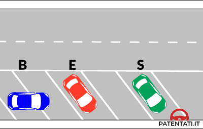
- **📖 الترجمة السياقية:** يجب على المركبة (S)، عند تحركها إلى الخلف (in retromarcia) للاندماج في حركة السير، إعطاء حق الأسبقية للمركبات القادمة من اليمين ومن اليسار على حد سواء.
- **💡 الشرح والقاعدة المرورية:** صحيح (VERO). تنص المادة 154 من كود السير على أن مناورة الرجوع للخلف للاندماج في حركة المرور تتطلب أقصى درجات الحيطة وإعطاء الأسبقية لجميع المركبات القادمة من كلا الاتجاهين (يمين ويسار) دون استثناء.
- **⚠️ كشف الفخ:** فخ الامتحان: الرجوع للخلف يسقط حق الأسبقية تماماً، فيلزم إعطاء الأسبقية لليمين واليسار (sia da destra che da sinistra) وليس لليمين فقط.
- **🔑 الكلمات المفتاحية:** `{'it': 'retromarcia', 'ar': 'الرجوع للخلف'}` | `{'it': 'immettersi nella circolazione', 'ar': 'الاندماج في السير'}` | `{'it': 'dare la precedenza', 'ar': 'إعطاء الأسبقية'}` | `{'it': 'sia da destra che da sinistra', 'ar': 'من اليمين واليسار معا'}`

---

**2.** Il veicolo S, muovendosi in retromarcia per immettersi nella circolazione, deve azionare gli indicatori di direzione
- **الإجابة:** `VERO ✅ (صح)`
- 
- **📖 الترجمة السياقية:** يجب على المركبة (S)، عند تحركها إلى الخلف للاندماج في حركة السير، تشغيل مؤشرات تغيير الاتجاه (الغمازات).
- **💡 الشرح والقاعدة المرورية:** صحيح (VERO). تلزم المادة 154 من كود السير السائق بالإشارة المسبقة والواضحة بواسطة مؤشر الاتجاه (indicatore di direzione) عند القيام بأي مناورة تتضمن تغيير المسار أو الخروج من مكان التوقف والاندماج في حركة السير.
- **⚠️ كشف الفخ:** فخ الامتحان: حتى أثناء الرجوع للخلف، لا يكفي مصباح الرجوع الأبيض، بل يجب تشغيل الغماز (indicatore di direzione) للإشارة إلى اتجاه المناورة.
- **🔑 الكلمات المفتاحية:** `{'it': 'indicatori di direzione', 'ar': 'مؤشرات الاتجاه (الغمازات)'}` | `{'it': 'manovra in retromarcia', 'ar': 'مناورة الرجوع للخلف'}` | `{'it': 'azionare', 'ar': 'تشغيل/تفعيل'}`

---

**3.** Il veicolo S, muovendosi in retromarcia per immettersi nella circolazione, deve fare attenzione agli eventuali pedoni in transito dietro di esso e dar loro la precedenza
- **الإجابة:** `VERO ✅ (صح)`
- 
- **📖 الترجمة السياقية:** يجب على المركبة (S)، عند تحركها إلى الخلف للاندماج في حركة السير، الانتباه للمشاة الذين قد يعبرون خلفها وإعطاؤهم حق الأسبقية.
- **💡 الشرح والقاعدة المرورية:** صحيح (VERO). المشاة خلف المركبة يكونون في نقطة عمياء جزئياً ومعرضين لخطر الدهس المباشر، لذا يلزم كود السير قائد المركبة بالتأكد التام من خلو المسار وإعطاء الأولوية المطلقة للمشاة.
- **⚠️ كشف الفخ:** فخ الامتحان: المشاة خلف السيارة لهم الأسبقية المطلقة دائماً ويجب التوقف تماماً إذا وُجدوا.
- **🔑 الكلمات المفتاحية:** `{'it': 'pedoni in transito', 'ar': 'المشاة العابرون'}` | `{'it': 'dietro di esso', 'ar': 'خلفه'}` | `{'it': 'dar loro la precedenza', 'ar': 'إعطاؤهم الأسبقية'}`

---

**4.** Il veicolo S, muovendosi in retromarcia per immettersi nella circolazione, deve dare la precedenza a tutti i veicoli in transito
- **الإجابة:** `VERO ✅ (صح)`
- 
- **📖 الترجمة السياقية:** يجب على المركبة (S)، عند تحركها إلى الخلف للاندماج في حركة السير، إعطاء حق الأسبقية لجميع المركبات المارة.
- **💡 الشرح والقاعدة المرورية:** صحيح (VERO). قاعدة عامة: المركبة التي تتحرك إلى الخلف تكون في وضعية مناورة خطرة وتفقد أي أسبقية، ويجب عليها إعطاء الأولوية لكل المركبات المارة على الطريق العام (tutti i veicoli in transito).
- **⚠️ كشف الفخ:** فخ الامتحان: كلمة 'tutti i veicoli' هنا صحيحة تماماً؛ فالرجوع للخلف يستوجب التنازل عن الأسبقية للجميع.
- **🔑 الكلمات المفتاحية:** `{'it': 'tutti i veicoli in transito', 'ar': 'جميع المركبات العابرة'}` | `{'it': 'dare la precedenza', 'ar': 'إعطاء الأسبقية'}`

---

**5.** Il veicolo S, muovendosi in retromarcia per immettersi nella circolazione, deve assicurarsi che la strada sia libera e fare la manovra con particolare prudenza
- **الإجابة:** `VERO ✅ (صح)`
- 
- **📖 الترجمة السياقية:** يجب على المركبة (S)، عند تحركها إلى الخلف للاندماج في حركة السير، التأكد من أن الطريق خالٍ والقيام بالمناورة بحذر وانتباه خاص.
- **💡 الشرح والقاعدة المرورية:** صحيح (VERO). تقضي قواعد المرور بضرورة فحص الرؤية والتأكد من خلو المسار بالكامل ومباشرة الرجوع ببطء شديد وحذر مضاعف (particolare prudenza).
- **⚠️ كشف الفخ:** فخ الامتحان: الحذر الشديد والتحقق من خلو الطريق هما الركن الأساسي لسلامة مناورة الرجوع للخلف.
- **🔑 الكلمات المفتاحية:** `{'it': 'strada sia libera', 'ar': 'الطريق خالٍ'}` | `{'it': 'particolare prudenza', 'ar': 'حذر وانتباه خاص'}`

---

**6.** Il veicolo S, muovendosi in retromarcia per immettersi nella circolazione, deve azionare la segnalazione luminosa di pericolo
- **الإجابة:** `FALSO ❌ (خطأ)`
- 
- **📖 الترجمة السياقية:** يجب على المركبة (S)، عند تحركها إلى الخلف للاندماج في حركة السير، تشغيل أضواء الخطر التحذيرية الرباعية (quattro frecce).
- **💡 الشرح والقاعدة المرورية:** خطأ (FALSO). أضواء الخطر الرباعية (quattro frecce / segnalazione luminosa di pericolo) مخصصة لحالات الطوارئ كالأعطال والحوادث أو التباطؤ المفاجئ، ولا تُشغّل لمجرد الرجوع للخلف العادي؛ بل يكفي مصباح الرجوع للخلف الأبيض ومؤشر الاتجاه.
- **⚠️ كشف الفخ:** فخ الامتحان: 'segnalazione luminosa di pericolo' (أضواء الطوارئ الرباعية) غير مخصصة للرجوع للخلف الاعتيادي بل لحالات الأعطال والمخاطر الطارئة.
- **🔑 الكلمات المفتاحية:** `{'it': 'segnalazione luminosa di pericolo', 'ar': 'إشارة الخطر الضوئية (الرباعي)'}` | `{'it': 'non si deve azionare', 'ar': 'لا يلزم تشغيلها'}`

---

**7.** Il veicolo S, muovendosi in retromarcia per immettersi nella circolazione, deve accendere la luce posteriore per nebbia
- **الإجابة:** `FALSO ❌ (خطأ)`
- 
- **📖 الترجمة السياقية:** يجب على المركبة (S)، عند تحركها إلى الخلف للاندماج في حركة السير، إضاءة مصباح الضباب الخلفي.
- **💡 الشرح والقاعدة المرورية:** خطأ (FALSO). مصباح الضباب الخلفي (luce posteriore per nebbia) يُستخدم حصراً عند تدني مدى الرؤية لأقل من 50 متراً بسبب الضباب أو المطر الغزير أو الثلج، واستخدامه أثناء المناورات الاعتيادية يبهت أعين السائقين الآخرين ومخالف للقانون.
- **⚠️ كشف الفخ:** فخ الامتحان: مصباح الضباب الخلفي لا شأن له بمناورة الرجوع للخلف (retromarcia).
- **🔑 الكلمات المفتاحية:** `{'it': 'luce posteriore per nebbia', 'ar': 'مصباح الضباب الخلفي'}` | `{'it': 'visibilità inferiore a 50 metri', 'ar': 'رؤية أقل من 50 متراً'}`

---

**8.** Il veicolo S, muovendosi in retromarcia per immettersi nella circolazione, deve dare la precedenza solo ai veicoli che transitano nel suo senso di marcia
- **الإجابة:** `FALSO ❌ (خطأ)`
- 
- **📖 الترجمة السياقية:** يجب على المركبة (S)، عند تحركها إلى الخلف للاندماج في حركة السير، إعطاء حق الأسبقية فقط للمركبات المارة في نفس اتجاه سيرها.
- **💡 الشرح والقاعدة المرورية:** خطأ (FALSO). كلمة 'solo' تقلب العبارة؛ فيجب إعطاء الأسبقية لجميع المركبات القادمة من كلا الاتجاهين (يمين ويسار)، وليس فقط لمن يسير في نفس الاتجاه.
- **⚠️ كشف الفخ:** فخ الامتحان: كلمة 'solo'؛ الأسبقية واجبة لجميع الاتجاهات بلا استثناء.
- **🔑 الكلمات المفتاحية:** `{'it': 'solo ai veicoli', 'ar': 'فقط للمركبات (فخ)'}` | `{'it': 'entrambi i sensi di marcia', 'ar': 'كلا اتجاهي السير'}`

---

**9.** Il veicolo S, muovendosi in retromarcia per immettersi nella circolazione, deve manovrare velocemente per liberare il posteggio
- **الإجابة:** `FALSO ❌ (خطأ)`
- 
- **📖 الترجمة السياقية:** يجب على المركبة (S)، عند تحركها إلى الخلف للاندماج في حركة السير، المناورة بسرعة لإخلاء مكان الركن.
- **💡 الشرح والقاعدة المرورية:** خطأ (FALSO). الرجوع للخلف مناورة عالية الخطورة بسبب محدودية الرؤية، ويجب أن تتم ببطء شديد وبأقصى درجات الحذر، والسرعة هنا تصرف متهور وخطير جداً.
- **⚠️ كشف الفخ:** فخ الامتحان: كلمة 'velocemente'؛ المناورة تتم ببطء وحذر شديد (lentamente e con cautela).
- **🔑 الكلمات المفتاحية:** `{'it': 'velocemente', 'ar': 'بسرعة (فخ)'}` | `{'it': 'moderare la velocità', 'ar': 'تهدئة السرعة'}`

---

**10.** Il veicolo S, muovendosi in retromarcia per immettersi nella circolazione, deve suonare ripetutamente il clacson durante la manovra
- **الإجابة:** `FALSO ❌ (خطأ)`
- 
- **📖 الترجمة السياقية:** يجب على المركبة (S)، عند تحركها إلى الخلف للاندماج في حركة السير، إطلاق آلة التنبيه (الكلاكس) بشكل متكرر أثناء المناورة.
- **💡 الشرح والقاعدة المرورية:** خطأ (FALSO). استخدام آلة التنبيه محظور داخل التجمعات السكنية إلا في حالات الخطر الفوري الداهم لتفادي وقوع حادث، ولا يجوز إطلاقها بشكل متكرر لمجرد الرجوع للخلف.
- **⚠️ كشف الفخ:** فخ الامتحان: 'suonare ripetutamente il clacson'؛ الكلاكس غير مسموح به في المناورات الروتينية.
- **🔑 الكلمات المفتاحية:** `{'it': 'suonare ripetutamente il clacson', 'ar': 'استخدام المنبه الصوتي بتكرار (فخ)'}` | `{'it': 'divieto di segnalazioni acustiche', 'ar': 'حظر التنبيه الصوتي'}`

---

## 📌 Pericolo intralcio (8 domande)

**11.** E' vietato, in quanto costituisce pericolo o intralcio per la circolazione, tenersi sul margine sinistro della carreggiata per svoltare in una strada a destra
- **الإجابة:** `VERO ✅ (صح)`
- **📖 الترجمة السياقية:** يُمنع، لكونه يشكل خطراً أو إعاقة لحركة السير، الالتزام بالحافة اليسرى لنهر الطريق للانعطاف نحو طريق على اليمين.
- **💡 الشرح والقاعدة المرورية:** صحيح (VERO). تنص المادة 154 على وجوب الاقتراب قدر الإمكان من الحافة اليمنى (margine destro) عند الانعطاف يميناً؛ والتمركز على اليسار للانعطاف يميناً يقطع مسار الآخرين ويسبب تصادماً حتمياً.
- **⚠️ كشف الفخ:** فخ الامتحان: الالتزام باليسار للانعطاف يميناً ممنوع قطعاً ويشكل خطراً جسيماً (pericolo o intralcio).
- **🔑 الكلمات المفتاحية:** `{'it': 'margine sinistro', 'ar': 'الحافة اليسرى'}` | `{'it': 'svoltare a destra', 'ar': 'الانعطاف يميناً'}` | `{'it': 'costituisce pericolo o intralcio', 'ar': 'يشكل خطراً أو إعاقة'}`

---

**12.** E' vietato, in quanto costituisce pericolo o intralcio per la circolazione, sostare sui binari tramviari
- **الإجابة:** `VERO ✅ (صح)`
- **📖 الترجمة السياقية:** يُمنع، لكونه يشكل خطراً أو إعاقة لحركة السير، الركن (Sosta) على قضبان الترام.
- **💡 الشرح والقاعدة المرورية:** صحيح (VERO). المادة 158 تمنع التوقف والانتظار تماماً على مسارات وقضبان الترام لأن ذلك يشل حركة النقل العام الجماعي ويشكل خطراً وإعاقة مرورية بالغة.
- **⚠️ كشف الفخ:** فخ الامتحان: الوقوف أو الركن فوق قضبان الترام ممنوع دائماً.
- **🔑 الكلمات المفتاحية:** `{'it': 'sostare sui binari tramviari', 'ar': 'الركن على قضبان الترام'}` | `{'it': 'intralcio per la circolazione', 'ar': 'إعاقة لحركة السير'}`

---

**13.** E' vietato, in quanto costituisce pericolo o intralcio per la circolazione, effettuare un cambiamento di direzione senza segnalare la manovra con sufficiente anticipo
- **الإجابة:** `VERO ✅ (صح)`
- **📖 الترجمة السياقية:** يُمنع، لكونه يشكل خطراً أو إعاقة لحركة السير، تغيير الاتجاه دون الإشارة إلى المناورة بوقت كافٍ ومسبق.
- **💡 الشرح والقاعدة المرورية:** صحيح (VERO). يلزم كود السير استخدام مؤشرات الاتجاه قبل المناورة بوقت كافٍ (sufficiente anticipo) لتحذير المركبات التابعة وتفادي الاصطدام المفاجئ.
- **⚠️ كشف الفخ:** فخ الامتحان: عدم الإشارة أو التأخر في إعطاء الغماز يعتبر مخالفة وسلوكاً يسبب خطراً وإعاقة للمرور.
- **🔑 الكلمات المفتاحية:** `{'it': 'cambiamento di direzione', 'ar': 'تغيير الاتجاه'}` | `{'it': 'sufficiente anticipo', 'ar': 'وقت كافٍ ومسبق'}` | `{'it': 'segnalare la manovra', 'ar': 'الإشارة إلى المناورة'}`

---

**14.** E' vietato, in quanto costituisce pericolo o intralcio per la circolazione, gareggiare in velocità
- **الإجابة:** `VERO ✅ (صح)`
- **📖 الترجمة السياقية:** يُمنع، لكونه يشكل خطراً أو إعاقة لحركة السير، التسابق في السرعة (gareggiare in velocità).
- **💡 الشرح والقاعدة المرورية:** صحيح (VERO). التسابق بالمركبات على الطرق العامة جريمة جنائية يعاقب عليها القانون بالحبس وسحب الرخصة وحجز المركبة (المادة 9-bis و9-ter من كود السير).
- **⚠️ كشف الفخ:** فخ الامتحان: سباقات السرعة على الطرق العامة ممنوعة كلياً ومجرمة قانوناً.
- **🔑 الكلمات المفتاحية:** `{'it': 'gareggiare in velocità', 'ar': 'التسابق في السرعة'}` | `{'it': 'reato penale', 'ar': 'جريمة جنائية'}`

---

**15.** E' vietato, in quanto costituisce pericolo o intralcio per la circolazione, circolare a velocità troppo bassa senza giustificato motivo
- **الإجابة:** `VERO ✅ (صح)`
- **📖 الترجمة السياقية:** يُمنع، لكونه يشكل خطراً أو إعاقة لحركة السير، السير بسرعة منخفضة للغاية دون مبرر وجيه.
- **💡 الشرح والقاعدة المرورية:** صحيح (VERO). تنص المادة 141 من كود السير على أنه لا يجوز السير ببطء مفرط دون مبرر مقنع (senza giustificato motivo)، لما يسببه ذلك من تكدس وإرباك لحركة السير ودفع السائقين لتجاوزات خطرة.
- **⚠️ كشف الفخ:** فخ الامتحان: السير ببطء شديد دون سبب ممنوع ومعاقب عليه مثله مثل السرعة الزائدة.
- **🔑 الكلمات المفتاحية:** `{'it': 'velocità troppo bassa', 'ar': 'سرعة شديدة الانخفاض'}` | `{'it': 'senza giustificato motivo', 'ar': 'دون سبب مبرر'}`

---

**16.** E' vietato, in quanto costituisce pericolo o intralcio per la circolazione, immettersi nel flusso della circolazione provenendo da strade laterali
- **الإجابة:** `FALSO ❌ (خطأ)`
- **📖 الترجمة السياقية:** يُمنع، لكونه يشكل خطراً أو إعاقة لحركة السير، الاندماج في تيار المرور قادماً من شوارع جانبية.
- **💡 الشرح والقاعدة المرورية:** خطأ (FALSO). الدخول والاندماج في حركة السير من الشوارع الجانبية تصرف طبيعي ومصرح به تماماً، شريطة الالتزام بقواعد حق الأسبقية والحذر اللازم، وليس ممنوعاً.
- **⚠️ كشف الفخ:** فخ الامتحان: الاندماج من طريق جانبي مسموح وليس ممنوعاً (non è vietato) طالما روعيت الأسبقية.
- **🔑 الكلمات المفتاحية:** `{'it': 'immettersi nel flusso', 'ar': 'الاندماج في السير'}` | `{'it': 'strade laterali', 'ar': 'شوارع جانبية'}` | `{'it': 'non è vietato', 'ar': 'ليس ممنوعاً'}`

---

**17.** E' vietato, in quanto costituisce pericolo o intralcio per la circolazione, regolare la velocità in relazione alle caratteristiche e condizioni delle strade
- **الإجابة:** `FALSO ❌ (خطأ)`
- **📖 الترجمة السياقية:** يُمنع، لكونه يشكل خطراً أو إعاقة لحركة السير، ضبط السرعة وفقاً لخصائص وظروف الطريق.
- **💡 الشرح والقاعدة المرورية:** خطأ (FALSO). ضبط السرعة وملائمتها مع حالة الطريق والطقس والرؤية ليس ممنوعاً، بل هو واجب قانوني أساسي تفرضه المادة 141 من كود السير لضمان الأمان.
- **⚠️ كشف الفخ:** فخ الامتحان: ضبط السرعة حسب ظروف الطريق واجب إلزامي (obbligatorio) وليس ممنوعاً (vietato).
- **🔑 الكلمات المفتاحية:** `{'it': 'regolare la velocità', 'ar': 'تعديل/ضبط السرعة'}` | `{'it': 'condizioni delle strade', 'ar': 'ظروف الطريق'}`

---

**18.** E' vietato, in quanto costituisce pericolo o intralcio per la circolazione, fermare momentaneamente un veicolo lungo il margine destro di una carreggiata a senso unico
- **الإجابة:** `FALSO ❌ (خطأ)`
- **📖 الترجمة السياقية:** يُمنع، لكونه يشكل خطراً أو إعاقة لحركة السير، إيقاف المركبة للحظات (Fermata) على طول الحافة اليمنى لنهر طريق ذي اتجاه واحد.
- **💡 الشرح والقاعدة المرورية:** خطأ (FALSO). التوقف المؤقت (Fermata) مسموح به قانوناً على الحافة اليمنى لنهر الطريق (وفي الاتجاه الواحد حتى على اليسار إذا ترك مسافة 3 أمتار)، طالما لا توجد إشارة منع صريحة.
- **⚠️ كشف الفخ:** فخ الامتحان: التوقف المؤقت (Fermata) على اليمين مسموح قانوناً ولا يعتبر إعاقة محظورة ما لم توجد إشارة منع.
- **🔑 الكلمات المفتاحية:** `{'it': 'fermare momentaneamente', 'ar': 'التوقف للحظات (fermata)'}` | `{'it': 'margine destro', 'ar': 'الحافة اليمنى'}` | `{'it': 'senso unico', 'ar': 'اتجاه واحد'}`

---

## 📌 Guida veicolo (10 domande)

**19.** Chi guida un veicolo, anche se ad elevate prestazioni, non deve, comunque, superare i limiti di velocità previsti dalla legge
- **الإجابة:** `VERO ✅ (صح)`
- **📖 الترجمة السياقية:** لا يجوز لقائد المركبة، حتى وإن كانت ذات أداء وقوة عالية (ad elevate prestazioni)، تجاوز حدود السرعة التي يحددها القانون بأي حال.
- **💡 الشرح والقاعدة المرورية:** صحيح (VERO). حدود السرعة القصوى (المادة 142) عامة وملزمة لجميع المركبات بغض النظر عن قوة محركها أو فئتها الرياضية.
- **⚠️ كشف الفخ:** فخ الامتحان: القوة العالية للمركبة لا تمنح أي استثناء في حدود السرعة القانونية.
- **🔑 الكلمات المفتاحية:** `{'it': 'elevate prestazioni', 'ar': 'أداء وقوة عالية'}` | `{'it': 'limiti di velocità', 'ar': 'حدود السرعة'}` | `{'it': 'non deve superare', 'ar': 'لا يجوز تجاوزها'}`

---

**20.** Chi guida un veicolo, anche se ad elevate prestazioni, deve dare, di norma, la precedenza nei crocevia a tutti i veicoli, che provengono da destra
- **الإجابة:** `VERO ✅ (صح)`
- **📖 الترجمة السياقية:** يجب على قائد المركبة، حتى وإن كانت ذات أداء وقوة عالية، إعطاء الأسبقية كقاعدة عامة عند التقاطعات لجميع المركبات القادمة من اليمين.
- **💡 الشرح والقاعدة المرورية:** صحيح (VERO). قاعدة الأسبقية لليمين (المادة 145) تطبق كقاعدة عامة على الجميع دون أي اعتبار لقوة أو فخامة المركبة.
- **⚠️ كشف الفخ:** فخ الامتحان: قوة السيارة وسرعتها لا تعطيها أولوية المرور على حساب القادم من اليمين.
- **🔑 الكلمات المفتاحية:** `{'it': 'dare la precedenza', 'ar': 'إعطاء الأسبقية'}` | `{'it': 'di norma', 'ar': 'كقاعدة عامة'}` | `{'it': 'veicoli da destra', 'ar': 'المركبات القادمة من اليمين'}`

---

**21.** Chi guida un veicolo, anche se ad elevate prestazioni, deve evitare di costituire pericolo per gli altri utenti della strada
- **الإجابة:** `VERO ✅ (صح)`
- **📖 الترجمة السياقية:** يجب على قائد المركبة، حتى وإن كانت ذات أداء وقوة عالية، تجنب تشكيل أي خطر على مستخدمي الطريق الآخرين.
- **💡 الشرح والقاعدة المرورية:** صحيح (VERO). المبدأ العام للمرور (المادة 140) يوجب على كل سائق التصرف بأمان بحيث لا يشكل خطراً أو إعاقة للآخرين مهما كانت مواصفات سيارته.
- **⚠️ كشف الفخ:** فخ الامتحان: تجنب الخطر التزام أساسي دائم على جميع السائقين.
- **🔑 الكلمات المفتاحية:** `{'it': 'costituire pericolo', 'ar': 'تشكيل خطر'}` | `{'it': 'utenti della strada', 'ar': 'مستخدمو الطريق'}`

---

**22.** Chi guida un veicolo, anche se ad elevate prestazioni, deve guardare nello specchietto retrovisore prima di segnalare l'intenzione di cambiare corsia
- **الإجابة:** `VERO ✅ (صح)`
- **📖 الترجمة السياقية:** يجب على قائد المركبة، حتى وإن كانت ذات أداء وقوة عالية، النظر في مرآة الرؤية الخلفية قبل الإشارة بالرغبة في تغيير المسار.
- **💡 الشرح والقاعدة المرورية:** صحيح (VERO). التسلسل الصحيح لمناورة تغيير المسار يقتضي فحص المرايا والتأكد من خلو المسار أولاً ثم تشغيل مؤشر الاتجاه.
- **⚠️ كشف الفخ:** فخ الامتحان: فحص المرآة يجب أن يسبق تشغيل الغماز والانتقال للمسار الآخر.
- **🔑 الكلمات المفتاحية:** `{'it': 'specchietto retrovisore', 'ar': 'مرآة الرؤية الخلفية'}` | `{'it': 'cambiare corsia', 'ar': 'تغيير المسار'}`

---

**23.** Chi guida un veicolo, anche se ad elevate prestazioni, deve tenersi il più vicino possibile al margine destro della carreggiata, quando effettua una svolta a destra
- **الإجابة:** `VERO ✅ (صح)`
- **📖 الترجمة السياقية:** يجب على قائد المركبة، حتى وإن كانت ذات أداء وقوة عالية، الالتزام بأقصى قرب ممكن من الحافة اليمنى لنهر الطريق عند الانعطاف يميناً.
- **💡 الشرح والقاعدة المرورية:** صحيح (VERO). تنص المادة 154 على أن الانعطاف لليمين يتطلب ملازمة الحافة اليمنى لنهر الطريق لتفادي قطع الطريق على الدراجات أو المركبات الأخرى.
- **⚠️ كشف الفخ:** فخ الامتحان: الانعطاف يميناً يتطلب دائماً الالتزام باليمين بغض النظر عن نوع المركبة.
- **🔑 الكلمات المفتاحية:** `{'it': 'margine destro', 'ar': 'الحافة اليمنى'}` | `{'it': 'svolta a destra', 'ar': 'الانعطاف يميناً'}`

---

**24.** Chi guida un veicolo deve guidare sempre al centro della strada, però senza superare la striscia di corsia
- **الإجابة:** `FALSO ❌ (خطأ)`
- **📖 الترجمة السياقية:** يجب على قائد المركبة أن يقود دائماً في منتصف الطريق، ولكن دون تخطي خط المسار.
- **💡 الشرح والقاعدة المرورية:** خطأ (FALSO). القاعدة الذهبية لكود السير الإيطالي (المادة 143) هي السير دائماً بجوار الحافة اليمنى لنهر الطريق (in prossimità del margine destro)، وليس في المنتصف.
- **⚠️ كشف الفخ:** فخ الامتحان: كلمة 'sempre al centro della strada' خاطئة؛ فالواجب هو التزام أقصى اليمين.
- **🔑 الكلمات المفتاحية:** `{'it': 'sempre al centro della strada', 'ar': 'دائماً في منتصف الطريق (فخ)'}` | `{'it': 'margine destro', 'ar': 'الحافة اليمنى'}`

---

**25.** Chi guida un veicolo deve tenere in funzione gli abbaglianti di giorno anche in città
- **الإجابة:** `FALSO ❌ (خطأ)`
- **📖 الترجمة السياقية:** يجب على قائد المركبة تشغيل أضواء الطريق العالية (الضوء العالي - gli abbaglianti) نهاراً وحتى داخل المدينة.
- **💡 الشرح والقاعدة المرورية:** خطأ (FALSO). الأضواء العالية (abbaglianti) محظورة تماماً داخل التجمعات السكنية ذات الإنارة العامة الكافية، ومحظورة نهاراً إلا كإشارة وميضية عابرة للتحذير من خطر وشيك.
- **⚠️ كشف الفخ:** فخ الامتحان: تشغيل الضوء العالي نهاراً أو بالمدينة ممنوع ويبهر عيون الآخرين.
- **🔑 الكلمات المفتاحية:** `{'it': 'proiettori abbaglianti', 'ar': 'الضوء العالي (أضواء الطريق)'}` | `{'it': 'in città', 'ar': 'داخل المدينة (فخ)'}`

---

**26.** Chi guida un veicolo può sorpassare in ogni condizione di traffico, purché non ci sia il segnale di divieto
- **الإجابة:** `FALSO ❌ (خطأ)`
- **📖 الترجمة السياقية:** يجوز لقائد المركبة التجاوز في أي ظرف من ظروف المرور، ما دام لا توجد إشارة منع.
- **💡 الشرح والقاعدة المرورية:** خطأ (FALSO). التجاوز يخضع لشروط سلامة صارمة (رؤية واضحة، مسافة كافية، عدم وجود خط متصل، خلو المسار المقابل)؛ وغياب إشارة المنع لا يعني مطلقاً إمكانية التجاوز في 'أي ظرف' (in ogni condizione di traffico).
- **⚠️ كشف الفخ:** فخ الامتحان: عبارة 'in ogni condizione di traffico'؛ فهناك حالات يمنع فيها التجاوز بقوة القانون دون الحاجة لإشارة منع (كالمنعطفات وقمم المرتفعات).
- **🔑 الكلمات المفتاحية:** `{'it': 'in ogni condizione di traffico', 'ar': 'في أي ظرف مروري (فخ)'}` | `{'it': 'sorpasso', 'ar': 'التجاوز'}`

---

**27.** Chi guida un veicolo deve usare il clacson nei centri abitati, ogni qualvolta ci si avvicina ad un attraversamento ciclabile
- **الإجابة:** `FALSO ❌ (خطأ)`
- **📖 الترجمة السياقية:** يجب على قائد المركبة استخدام آلة التنبيه (الكلاكس) داخل التجمعات السكنية كلما اقترب من معبر للدراجات الهوائية.
- **💡 الشرح والقاعدة المرورية:** خطأ (FALSO). استخدام الكلاكس في المدن مقصور على حالات الخطر الداهم لتفادي حادث، واستخدامه الروتيني عند معابر الدراجات محظور ويزعج المشاة وراكبي الدراجات.
- **⚠️ كشف الفخ:** فخ الامتحان: إطلاق الكلاكس عند معابر الدراجات ممنوع وليس واجباً.
- **🔑 الكلمات المفتاحية:** `{'it': 'usare il clacson', 'ar': 'استخدام المنبه الصوتي'}` | `{'it': 'attraversamento ciclabile', 'ar': 'معبر الدراجات'}`

---

**28.** Chi guida un veicolo può montare trombe bitonali per essere sentito più agevolmente, usandole però solo fuori dei centri abitati
- **الإجابة:** `FALSO ❌ (خطأ)`
- **📖 الترجمة السياقية:** يجوز لقائد المركبة تركيب أبواق مزدوجة النغمة (trombe bitonali) ليُسمع بسهولة أكبر، شريطة استخدامها خارج التجمعات السكنية فقط.
- **💡 الشرح والقاعدة المرورية:** خطأ (FALSO). يُمنع منعاً باتاً تعديل أجهزة التنبيه الصوتية أو تركيب أبواق ذات نغمات متعددة أو خاصة (trombe bitonali / sirene)، فهذه مقتصرة حصرياً على مركبات الطوارئ والإسعاف والشرطة المرخصة.
- **⚠️ كشف الفخ:** فخ الامتحان: تركيب أبواق ذات نغمات خاصة (trombe bitonali) ممنوع على المركبات المدنية ومخالف للمواصفات الفنية.
- **🔑 الكلمات المفتاحية:** `{'it': 'trombe bitonali', 'ar': 'أبواق مزدوجة النغمة (فخ)'}` | `{'it': 'dispositivi di segnalazione acustica', 'ar': 'أجهزة التنبيه الصوتي'}`

---

## 📌 Carico veicoli (15 domande)

**29.** Sui motocicli è consentito il trasporto di animali se custoditi in apposita gabbia
- **الإجابة:** `VERO ✅ (صح)`
- **📖 الترجمة السياقية:** يُسمح على الدراجات النارية بنقل الحيوانات إذا كانت محفوظة ومؤمنة في قفص مخصص.
- **💡 الشرح والقاعدة المرورية:** صحيح (VERO). تنص المادة 170 من كود السير على جواز نقل حيوان على الدراجة النارية بشرط وضعه داخل قفص أو حاوية مخصصة، وألا تبرز عن حدود المركبة المسموحة (50 سم جانباً)، ولا تعيق حركة السائق أو رؤيته.
- **⚠️ كشف الفخ:** فخ الامتحان: نقل الحيوان على الدراجة مسموح بشرط القفص المخصص (apposita gabbia) والالتزام بحدود البروز.
- **🔑 الكلمات المفتاحية:** `{'it': 'trasporto di animali', 'ar': 'نقل الحيوانات'}` | `{'it': 'apposita gabbia', 'ar': 'قفص مخصص'}` | `{'it': 'motocicli', 'ar': 'الدراجات النارية'}`

---

**30.** Il carico deve essere sistemato sui motocicli in modo da non sporgere lateralmente di oltre 50 cm
- **الإجابة:** `VERO ✅ (صح)`
- **📖 الترجمة السياقية:** يجب ترتيب الحمولة على الدراجات النارية بحيث لا تبرز جانبياً بأكثر من 50 سم.
- **💡 الشرح والقاعدة المرورية:** صحيح (VERO). المادة 170 تحدد بروز الحمولة على الدراجات النارية: لا يجوز أن تبرز طولياً بأكثر من 50 سم من الأمام أو الخلف، ولا تبرز جانبياً بأكثر من 50 سم عن محور الدراجة.
- **⚠️ كشف الفخ:** فخ الامتحان: الحد الأقصى لبروز الحمولة على الدراجات النارية هو 50 سم (lateralmente e longitudinalmente).
- **🔑 الكلمات المفتاحية:** `{'it': 'sporgere lateralmente', 'ar': 'البروز جانبياً'}` | `{'it': 'oltre 50 cm', 'ar': 'أكثر من 50 سم'}` | `{'it': 'motocicli', 'ar': 'الدراجات النارية'}`

---

**31.** Il carico deve essere sistemato sugli autoveicoli in modo da non diminuire la visibilità del conducente
- **الإجابة:** `VERO ✅ (صح)`
- **📖 الترجمة السياقية:** يجب ترتيب الحمولة وتثبيتها على السيارات بحيث لا تقلل من مدى رؤية السائق.
- **💡 الشرح والقاعدة المرورية:** صحيح (VERO). تنص المادة 164 من كود السير على أن الحمولة يجب ألا تحجب أو تقلص الرؤية الأمامية أو الجانبية أو عبر المرايا الخلفية.
- **⚠️ كشف الفخ:** فخ الامتحان: الرؤية التامة للسائق شرط أساسي وإلزامي عند ترتيب أي حمولة.
- **🔑 الكلمات المفتاحية:** `{'it': 'sistemazione del carico', 'ar': 'ترتيب وتثبيت الحمولة'}` | `{'it': 'diminuire la visibilità', 'ar': 'تقليل مدى الرؤية'}`

---

**32.** Il carico deve essere sistemato sugli autoveicoli in modo da non impedire la libertà di movimenti nella guida
- **الإجابة:** `VERO ✅ (صح)`
- **📖 الترجمة السياقية:** يجب ترتيب الحمولة على السيارات بحيث لا تعيق حرية حركة السائق أثناء القيادة.
- **💡 الشرح والقاعدة المرورية:** صحيح (VERO). تشترط المادة 164 أن يتمتع السائق بالحرية الكاملة لحركة يديه وقدميه والوصول المباشر لكافة أجهزة التحكم (المقود، الدواسات، مبدل السرعة).
- **⚠️ كشف الفخ:** فخ الامتحان: حرية حركة السائق (libertà di movimenti) متطلب أمان إلزامي.
- **🔑 الكلمات المفتاحية:** `{'it': 'libertà di movimenti', 'ar': 'حرية الحركة'}` | `{'it': 'autoveicoli', 'ar': 'السيارات'}`

---

**33.** Il carico deve essere sistemato sugli autoveicoli in modo da evitarne la caduta
- **الإجابة:** `VERO ✅ (صح)`
- **📖 الترجمة السياقية:** يجب ترتيب وتثبيت الحمولة على السيارات بطريقة تمنع سقوطها.
- **💡 الشرح والقاعدة المرورية:** صحيح (VERO). الحمولة يجب أن تكون محكمة الربط والتثبيت لتفادي انزلاقها أو تبعثرها أو سقوطها على الطريق مما قد يسبب كوارث للآخرين.
- **⚠️ كشف الفخ:** فخ الامتحان: تثبيت الحمولة لتجنب سقوطها (evitarne la caduta) قاعدة بديهية وإلزامية.
- **🔑 الكلمات المفتاحية:** `{'it': 'evitarne la caduta', 'ar': 'تجنب سقوطها'}` | `{'it': 'sistemato', 'ar': 'مرتب ومثبت'}`

---

**34.** Il carico deve essere sistemato sugli autoveicoli in modo da non sporgere dalla parte posteriore per più dei tre decimi della lunghezza del veicolo
- **الإجابة:** `VERO ✅ (صح)`
- **📖 الترجمة السياقية:** يجب ترتيب الحمولة على السيارات بحيث لا تبرز من الجهة الخلفية بأكثر من ثلاثة أعشار (3/10) طول المركبة.
- **💡 الشرح والقاعدة المرورية:** صحيح (VERO). وفقاً للمادة 164، الحمولة غير القابلة للتجزئة (carico indivisibile) لا يجوز أن تبرز من الخلف بأكثر من 3/10 من طول السيارة الإجمالي (30%).
- **⚠️ كشف الفخ:** فخ الامتحان: النسبة الخلفية القانونية هي ثلاثة أعشار (tre decimi = 30%) حصراً للحمولة غير القابلة للتجزئة، ولا بروز من الأمام.
- **🔑 الكلمات المفتاحية:** `{'it': 'sporgere dalla parte posteriore', 'ar': 'البروز من الجهة الخلفية'}` | `{'it': 'tre decimi della lunghezza', 'ar': 'ثلاثة أعشار الطول (3/10)'}`

---

**35.** Il carico sugli autoveicoli non deve superare la portata indicata nella carta di circolazione
- **الإجابة:** `VERO ✅ (صح)`
- **📖 الترجمة السياقية:** يجب ألا تتجاوز الحمولة المنقولة على السيارات الحمولة الصافية المصرح بها (portata) والمثبتة في رخصة السير.
- **💡 الشرح والقاعدة المرورية:** صحيح (VERO). الحمولة الصافية (portata utile) المحددة في رخصة السير (carta di circolazione / documento unico) تمثل الحد الأقصى للوزن الذي يمكن نقله بأمان، وتجاوزها مخالفة جسيمة.
- **⚠️ كشف الفخ:** فخ الامتحان: الالتزام بالحمولة المقررة في رخصة السير إلزامي ولا يجوز تجاوزه إطلاقاً.
- **🔑 الكلمات المفتاحية:** `{'it': 'portata', 'ar': 'الحمولة الصافية المسموحة'}` | `{'it': 'carta di circolazione', 'ar': 'رخصة السير (الكارتة)'}`

---

**36.** Il carico deve essere sistemato sugli autoveicoli in modo da evitare la sporgenza laterale dello stesso per più di tre decimi della lunghezza del veicolo
- **الإجابة:** `FALSO ❌ (خطأ)`
- **📖 الترجمة السياقية:** يجب ترتيب الحمولة على السيارات لتفادي بروزها جانبياً لأكثر من ثلاثة أعشار طول المركبة.
- **💡 الشرح والقاعدة المرورية:** خطأ (FALSO). نسبة ثلاثة أعشار (3/10) تخص البروز الخلفي (sporgenza posteriore) وليس البروز الجانبي؛ أما البروز الجانبي فيحسب بحد أقصى 30 سم عن أضواء الوضعية (luci di posizione).
- **⚠️ كشف الفخ:** فخ الامتحان: خلط بين البروز الجانبي (30 سم من أضواء الموضع) والبروز الخلفي (3/10 من طول السيارة).
- **🔑 الكلمات المفتاحية:** `{'it': 'sporgenza laterale', 'ar': 'البروز الجانبي (فخ هنا بنسبة 3/10)'}` | `{'it': 'tre decimi', 'ar': 'ثلاثة أعشار (للخلف فقط)'}`

---

**37.** Il carico deve essere sistemato sugli autoveicoli in modo da non superare di oltre il 10% l'altezza massima prevista dalla carta di circolazione, ma entro 4 metri
- **الإجابة:** `FALSO ❌ (خطأ)`
- **📖 الترجمة السياقية:** يجب ترتيب الحمولة على السيارات بحيث لا تتجاوز بأكثر من 10% الارتفاع الأقصى المحدد في رخصة السير، بشرط ألا تتعدى 4 أمتار.
- **💡 الشرح والقاعدة المرورية:** خطأ (FALSO). لا توجد أي نسبة تسامح 10% في أبعاد الارتفاع؛ فالأبعاد المقررة في رخصة السير ملزمة بدقة، والحد الأقصى للارتفاع العام هو 4 أمتار دون أي نسب مئوية إضافية.
- **⚠️ كشف الفخ:** فخ الامتحان: عبارة 'oltre il 10% dell'altezza'؛ لا يوجد أي تسامح بنسبة 10% في الارتفاع.
- **🔑 الكلمات المفتاحية:** `{'it': "oltre il 10% l'altezza", 'ar': 'تجاوز الارتفاع بنسبة 10% (فخ)'}` | `{'it': 'altezza massima', 'ar': 'الارتفاع الأقصى'}`

---

**38.** Il carico deve essere sistemato sugli autoveicoli in modo da non superare di oltre il 10% la portata utile indicata sul documento di circolazione
- **الإجابة:** `FALSO ❌ (خطأ)`
- **📖 الترجمة السياقية:** يجب ترتيب الحمولة على السيارات بحيث لا تتجاوز بأكثر من 10% الحمولة الصافية المحددة في وثيقة السير.
- **💡 الشرح والقاعدة المرورية:** خطأ (FALSO). تجاوز الحمولة المحددة في رخصة السير ممنوع قطعاً من الصفر؛ ونسب التسامح في الوزن لمركبات النقل الثقيل لا تعني أن القانون 'يسمح' مسبقاً بتحميل 10% زيادة.
- **⚠️ كشف الفخ:** فخ الامتحان: لا يسمح بتحميل أكثر من الحمولة الصافية المصرح بها إطلاقاً.
- **🔑 الكلمات المفتاحية:** `{'it': 'superare di oltre il 10%', 'ar': 'تجاوز بأكثر من 10% (فخ)'}` | `{'it': 'portata utile', 'ar': 'الحمولة الصافية'}`

---

**39.** Il carico deve essere sistemato sugli autoveicoli in modo da sporgere dalla parte anteriore del veicolo di più dei tre decimi della sua lunghezza
- **الإجابة:** `FALSO ❌ (خطأ)`
- **📖 الترجمة السياقية:** يجب ترتيب الحمولة على السيارات بحيث تبرز من الجهة الأمامية للمركبة بأكثر من ثلاثة أعشار طولها.
- **💡 الشرح والقاعدة المرورية:** خطأ (FALSO). البروز من الأمام (sporgenza anteriore) ممنوع تماماً على جميع السيارات؛ ولا يجوز أن تبرز أي حمولة أمام حدود المركبة إطلاقاً.
- **⚠️ كشف الفخ:** فخ الامتحان: البروز الأمامي للحمولة ممنوع قطعاً (mai anteriormente).
- **🔑 الكلمات المفتاحية:** `{'it': 'sporgere dalla parte anteriore', 'ar': 'البروز من الجهة الأمامية (ممنوع)'}` | `{'it': 'vietata la sporgenza anteriore', 'ar': 'حظر البروز الأمامي'}`

---

**40.** Il carico deve essere segnalato, di giorno, con un panno rosso se sporge dalla parte posteriore
- **الإجابة:** `FALSO ❌ (خطأ)`
- **📖 الترجمة السياقية:** يجب الإشارة إلى الحمولة نهاراً بواسطة قطعة قماش حمراء إذا كانت بارزة من الجهة الخلفية.
- **💡 الشرح والقاعدة المرورية:** خطأ (FALSO). الحمولة البارزة من الخلف يجب تمييزها حصراً باللوحة العاكسة المعتمدة ذات الخطوط المائلة البيضاء والحمراء (pannello quadrangolare retroriflettente a strisce bianche e rosse)، ويمنع استخدام قطعة قماش أو ملابس.
- **⚠️ كشف الفخ:** فخ الامتحان: 'panno rosso' (قطعة قماش حمراء) فخ شهير؛ الإشارة القانونية الحصرية هي اللوحة المربعة المخططة بالأبيض والأحمر.
- **🔑 الكلمات المفتاحية:** `{'it': 'panno rosso', 'ar': 'قطعة قماش حمراء (فخ)'}` | `{'it': 'pannello a strisce bianche e rosse', 'ar': 'اللوحة المخططة بالأبيض والأحمر'}`

---

**41.** La sporgenza posteriore del carico deve essere segnalata con un pannello retroriflettente a strisce gialle e rosse
- **الإجابة:** `FALSO ❌ (خطأ)`
- **📖 الترجمة السياقية:** يجب الإشارة إلى البروز الخلفي للحمولة بواسطة لوحة عاكسة ذات خطوط صفراء وحمراء.
- **💡 الشرح والقاعدة المرورية:** خطأ (FALSO). اللوحة المخصصة للحمولة البارزة خطوطها بيضاء وحمراء (bianche e rosse)؛ أما الخطوط الصفراء والحمراء فهي مخصصة للوحات الخلفية للشاحنات الثقيلة والمقطورات.
- **⚠️ كشف الفخ:** فخ الامتحان: خطوط لوحة الحمولة البارزة بيضاء وحمراء وليست صفراء وحمراء (gialle e rosse).
- **🔑 الكلمات المفتاحية:** `{'it': 'strisce gialle e rosse', 'ar': 'خطوط صفراء وحمراء (فخ)'}` | `{'it': 'strisce bianche e rosse', 'ar': 'خطوط بيضاء وحمراء'}`

---

**42.** Sui motocicli in nessun caso è consentito trasportare un carico
- **الإجابة:** `FALSO ❌ (خطأ)`
- **📖 الترجمة السياقية:** لا يُسمح على الإطلاق وفي أي حال من الأحوال بنقل حمولة على الدراجات النارية.
- **💡 الشرح والقاعدة المرورية:** خطأ (FALSO). يُسمح بنقل الحمولة على الدراجات النارية إذا كانت مثبتة بإحكام ولا تبرز بأكثر من 50 سم طولياً وجانبياً، ولا تعيق الرؤية وحرية القيادة.
- **⚠️ كشف الفخ:** فخ الامتحان: كلمة 'in nessun caso' متطرفة وخاطئة؛ فنقل الحمولة مسموح بضوابط محددة.
- **🔑 الكلمات المفتاحية:** `{'it': 'in nessun caso', 'ar': 'في أي حال من الأحوال (فخ)'}` | `{'it': 'consentito con limiti', 'ar': 'مسموح بحدود وضوابط'}`

---

**43.** Sui motocicli è consentito trasportare sacchetti con la spesa anche se non saldamente assicurati
- **الإجابة:** `FALSO ❌ (خطأ)`
- **📖 الترجمة السياقية:** يُسمح على الدراجات النارية بنقل أكياس المشتريات حتى وإن لم تكن مثبتة ومربوطة بإحكام.
- **💡 الشرح والقاعدة المرورية:** خطأ (FALSO). أي حمولة على الدراجة النارية يجب أن تكون مؤمنة ومثبتة بإحكام تام (saldamente assicurati) لتفادي تمايلها أو سقوطها أو تشابكها مع العجلات ومحاور التوجيه.
- **⚠️ كشف الفخ:** فخ الامتحان: عبارة 'anche se non saldamente assicurati' تلغي شروط السلامة الأساسية.
- **🔑 الكلمات المفتاحية:** `{'it': 'non saldamente assicurati', 'ar': 'غير مثبتة بإحكام (فخ)'}` | `{'it': 'saldamente ancorato', 'ar': 'مثبت بإحكام'}`

---

## 📌 Uso corretto strada (11 domande)

**44.** L'uso corretto della strada comporta che i veicoli procedano ad una velocità adeguata alle condizioni della strada e del traffico
- **الإجابة:** `VERO ✅ (صح)`
- **📖 الترجمة السياقية:** يتطلب الاستخدام الصحيح للطريق أن تسير المركبات بسرعة ملائمة لظروف الطريق وحالة المرور.
- **💡 الشرح والقاعدة المرورية:** صحيح (VERO). تنص المادة 141 من كود السير على وجوب ملاءمة السرعة دائماً مع خصائص الطريق والرؤية وحجم حركة السير للحفاظ على التحكم الكامل بالمركبة.
- **⚠️ كشف الفخ:** فخ الامتحان: ملائمة السرعة لظروف الطريق والمرور هي جوهر القيادة الآمنة.
- **🔑 الكلمات المفتاحية:** `{'it': 'uso corretto della strada', 'ar': 'الاستخدام الصحيح للطريق'}` | `{'it': 'velocità adeguata', 'ar': 'سرعة مناسبة/ملائمة'}`

---

**45.** L'uso corretto della strada comporta che siano osservate le norme di comportamento e quelle dettate dalla comune prudenza
- **الإجابة:** `VERO ✅ (صح)`
- **📖 الترجمة السياقية:** يتطلب الاستخدام الصحيح للطريق مراعاة قواعد السلوك وتلك التي يمليها الحذر والتعقل العام.
- **💡 الشرح والقاعدة المرورية:** صحيح (VERO). لا يكفي تطبيق النصوص القانونية الحرفية فقط، بل يجب التصرف دائماً بحذر وعقلانية وحس المسؤولية (comune prudenza) لتفادي الأخطار المفاجئة.
- **⚠️ كشف الفخ:** فخ الامتحان: الحذر العام (comune prudenza) وقواعد السلوك متلازمان.
- **🔑 الكلمات المفتاحية:** `{'it': 'norme di comportamento', 'ar': 'قواعد السلوك'}` | `{'it': 'comune prudenza', 'ar': 'الحذر والتعقل العام'}`

---

**46.** L'uso corretto della strada comporta che ci si affretti a sgombrare l'incrocio, quando compaia sul semaforo la luce gialla fissa e non si è in grado di arrestare il veicolo in sicurezza prima della striscia di arresto
- **الإجابة:** `VERO ✅ (صح)`
- **📖 الترجمة السياقية:** يتطلب الاستخدام الصحيح للطريق الإسراع بإخلاء التقاطع عند ظهور الضوء الأصفر الثابت في إشارة المرور إذا تعذر إيقاف المركبة بأمان قبل خط التوقف.
- **💡 الشرح والقاعدة المرورية:** صحيح (VERO). تنص المادة 41 على أنه إذا ظهر الضوء الأصفر الثابت وكان السائق قد تجاوز خط التوقف أو لا يمكنه التوقف بأمان دون خطر صدمه من الخلف، فعليه إخلاء التقاطع فوراً بحذر.
- **⚠️ كشف الفخ:** فخ الامتحان: الضوء الأصفر الثابت يلزم بالإخلاء السريع للتقاطع إذا تعذر التوقف الآمن قبل الخط.
- **🔑 الكلمات المفتاحية:** `{'it': 'luce gialla fissa', 'ar': 'الضوء الأصفر الثابت'}` | `{'it': "sgombrare l'incrocio", 'ar': 'إخلاء التقاطع'}` | `{'it': 'in condizioni di sicurezza', 'ar': 'في ظروف آمنة'}`

---

**47.** L'uso corretto della strada comporta che si dia la precedenza ai pedoni che attraversano sugli attraversamenti pedonali
- **الإجابة:** `VERO ✅ (صح)`
- **📖 الترجمة السياقية:** يتطلب الاستخدام الصحيح للطريق إعطاء حق الأسبقية للمشاة الذين يعبرون على ممرات المشاة.
- **💡 الشرح والقاعدة المرورية:** صحيح (VERO). تلزم المادة 191 السائق بإعطاء الأسبقية المطلقة للمشاة الذين يعبرون أو يوشكون على العبور فوق ممرات المشاة المخصصة (attraversamenti pedonali).
- **⚠️ كشف الفخ:** فخ الامتحان: إعطاء الأسبقية للمشاة على ممرهم التزام قانوني حتمي.
- **🔑 الكلمات المفتاحية:** `{'it': 'dare la precedenza ai pedoni', 'ar': 'إعطاء الأسبقية للمشاة'}` | `{'it': 'attraversamenti pedonali', 'ar': 'ممرات المشاة'}`

---

**48.** L'uso corretto della strada comporta che si usino proiettori anabbaglianti nei centri abitati nelle ore notturne
- **الإجابة:** `VERO ✅ (صح)`
- **📖 الترجمة السياقية:** يتطلب الاستخدام الصحيح للطريق استخدام أضواء التقاطع (الضوء المنخفض - anabbaglianti) داخل التجمعات السكنية أثناء ساعات الليل.
- **💡 الشرح والقاعدة المرورية:** صحيح (VERO). تنص المادة 153 على وجوب استخدام الضوء المنخفض (anabbaglianti) ليلاً داخل المدن والقرى وتجنب الضوء العالي منعاً لإبهار الآخرين.
- **⚠️ كشف الفخ:** فخ الامتحان: داخل التجمعات السكنية ليلاً القاعدة هي استخدام الضوء المنخفض (anabbaglianti).
- **🔑 الكلمات المفتاحية:** `{'it': 'proiettori anabbaglianti', 'ar': 'أضواء التقاطع (الضوء المنخفض)'}` | `{'it': 'centri abitati', 'ar': 'التجمعات السكنية'}` | `{'it': 'ore notturne', 'ar': 'ساعات الليل'}`

---

**49.** L'uso corretto della strada comporta che si guardino gli specchi retrovisori prima di azionare l'indicatore di direzione per cambiare corsia
- **الإجابة:** `VERO ✅ (صح)`
- **📖 الترجمة السياقية:** يتطلب الاستخدام الصحيح للطريق النظر في مرايا الرؤية الخلفية قبل تشغيل مؤشر الاتجاه لتغيير المسار.
- **💡 الشرح والقاعدة المرورية:** صحيح (VERO). التحقق من خلو الطريق عبر المرايا يسبق تشغيل الغماز والمناورة، حتى لا يتم تضليل أو إرباك السائقين في المسارات المجاورة دون جدوى.
- **⚠️ كشف الفخ:** فخ الامتحان: فحص المرايا خطوة أولى وأساسية قبل تشغيل مؤشر تغيير الاتجاه.
- **🔑 الكلمات المفتاحية:** `{'it': 'specchi retrovisori', 'ar': 'مرايا الرؤية الخلفية'}` | `{'it': 'indicatore di direzione', 'ar': 'مؤشر الاتجاه'}` | `{'it': 'cambiare corsia', 'ar': 'تغيير المسار'}`

---

**50.** L'uso corretto della strada comporta che i veicoli impegnino sempre la carreggiata il più rapidamente possibile
- **الإجابة:** `FALSO ❌ (خطأ)`
- **📖 الترجمة السياقية:** يتطلب الاستخدام الصحيح للطريق أن تشغل المركبات نهر الطريق دائماً بأقصى سرعة ممكنة.
- **💡 الشرح والقاعدة المرورية:** خطأ (FALSO). شغل الطريق بأقصى سرعة تصرف عدواني وخطير؛ والأصل هو السير بسرعة ملائمة وهادئة وفق حدود السرعة وحالة الطريق.
- **⚠️ كشف الفخ:** فخ الامتحان: عبارة 'il più rapidamente possibile' (بأسرع ما يمكن دائماً) منافية تماماً لقواعد الأمان.
- **🔑 الكلمات المفتاحية:** `{'it': 'il più rapidamente possibile', 'ar': 'بأسرع ما يمكن (فخ)'}` | `{'it': 'impegnare la carreggiata', 'ar': 'شغل نهر الطريق'}`

---

**51.** L'uso corretto della strada comporta che ci si arresti sempre ai passaggi pedonali ripartendo solo se non sopraggiungono pedoni
- **الإجابة:** `FALSO ❌ (خطأ)`
- **📖 الترجمة السياقية:** يتطلب الاستخدام الصحيح للطريق التوقف التام دائماً عند ممرات المشاة، وعدم الانطلاق مجدداً إلا في حال عدم قدوم أي مشاة.
- **💡 الشرح والقاعدة المرورية:** خطأ (FALSO). كلمة 'sempre' خاطئة؛ فلا يُشترط التوقف الإجباري إذا كان ممر المشاة خالياً تماماً، بل يجب التهدئة والتأكد من خلوه والتوقف فقط إذا كان هناك مشاة يعبرون أو يوشكون على العبور.
- **⚠️ كشف الفخ:** فخ الامتحان: كلمة 'arrestarsi sempre'؛ التوقف ليس إلزامياً دائماً عند ممر المشاة إذا كان خالياً.
- **🔑 الكلمات المفتاحية:** `{'it': 'arrestarsi sempre', 'ar': 'التوقف دائماً (فخ)'}` | `{'it': 'passaggi pedonali', 'ar': 'ممرات المشاة'}`

---

**52.** L'uso corretto della strada comporta che si usino in ogni caso i proiettori a luce abbagliante
- **الإجابة:** `FALSO ❌ (خطأ)`
- **📖 الترجمة السياقية:** يتطلب الاستخدام الصحيح للطريق استخدام أضواء الطريق العالية (abbaglianti) في كل الأحوال.
- **💡 الشرح والقاعدة المرورية:** خطأ (FALSO). عبارة 'in ogni caso' خاطئة تماماً؛ فالضوء العالي محظور داخل المدن، ومحظور عند تقاطع المركبات أو السير خلف مركبة أخرى لتجنب إبهار بصر السائقين.
- **⚠️ كشف الفخ:** فخ الامتحان: كلمة 'in ogni caso' مع الضوء العالي؛ فالأصل هو الضوء المنخفض.
- **🔑 الكلمات المفتاحية:** `{'it': 'in ogni caso', 'ar': 'في كل الأحوال (فخ)'}` | `{'it': 'luce abbagliante', 'ar': 'الضوء العالي'}`

---

**53.** L'uso corretto della strada comporta che ci si arresti in ogni caso in presenza del segnale in figura
- **الإجابة:** `FALSO ❌ (خطأ)`
- 
- **📖 الترجمة السياقية:** يتطلب الاستخدام الصحيح للطريق التوقف في كل الأحوال عند وجود الإشارة الموضحة في الصورة (إشارة إعطاء الأسبقية مثلث مقلوب).
- **💡 الشرح والقاعدة المرورية:** خطأ (FALSO). إشارة إعطاء حق الأسبقية (DARE PRECEDENZA - مثلث مقلوب) لا تلزم بالتوقف في كل الأحوال (in ogni caso)، بل تبطئ وتتوقف فقط إذا كانت هناك مركبات قادمة يجب إعطاؤها الأسبقية، بخلاف إشارة قف (STOP).
- **⚠️ كشف الفخ:** فخ الامتحان: التوقف في كل الأحوال ملزم مع إشارة (STOP)، أما إشارة (DARE PRECEDENZA) فلا تتطلب التوقف إلا إذا كان هناك قادمون.
- **🔑 الكلمات المفتاحية:** `{'it': 'arrestarsi in ogni caso', 'ar': 'التوقف في كل الأحوال (فخ)'}` | `{'it': 'segnale di dare precedenza', 'ar': 'إشارة إعطاء الأسبقية'}`

---

**54.** L'uso corretto della strada comporta che si proceda a velocità elevata per non creare intralcio
- **الإجابة:** `FALSO ❌ (خطأ)`
- **📖 الترجمة السياقية:** يتطلب الاستخدام الصحيح للطريق السير بسرعة عالية لتفادي إحداث إعاقة مرورية.
- **💡 الشرح والقاعدة المرورية:** خطأ (FALSO). تفادي الإعاقة لا يبرر القيادة بسرعة عالية ومتهورة؛ بل يجب الالتزام بحدود السرعة وملاءمتها للظروف دون إفراط أو تفريط.
- **⚠️ كشف الفخ:** فخ الامتحان: السرعة العالية خطر وليست حلاً لتفادي الإعاقة.
- **🔑 الكلمات المفتاحية:** `{'it': 'velocità elevata', 'ar': 'سرعة عالية (فخ)'}` | `{'it': 'non creare intralcio', 'ar': 'عدم خلق إعاقة'}`

---

## 📌 Prossimita incrocio (13 domande)

**55.** Quando, giunti in prossimità di un incrocio, ci accorgiamo di aver sbagliato la corsia di preselezione dobbiamo seguire la direzione consentita dall'eventuale segnaletica orizzontale
- **الإجابة:** `VERO ✅ (صح)`
- **📖 الترجمة السياقية:** عندما نلاحظ عند الاقتراب من التقاطع أننا أخطأنا في مسار التوجيه المسبق (corsia di preselezione)، يجب علينا اتباع الاتجاه المسموح به وفقاً للإشارات الأرضية.
- **💡 الشرح والقاعدة المرورية:** صحيح (VERO). عند الوصول لمسار التوجيه المسبق (بمجرد بدء الخط المتصل)، يُلزم القانون السائق بمواصلة السير في الاتجاه المخصص للمسار الذي دخله، ثم تصحيح المسار لاحقاً بعد التقاطع بأمان.
- **⚠️ كشف الفخ:** فخ الامتحان: إذا أخطأت المسار المخصص، يجب أن تتبع اتجاهه وتخرج مع التقاطع ثم تصحح وجهتك لاحقاً.
- **🔑 الكلمات المفتاحية:** `{'it': 'corsia di preselezione', 'ar': 'مسار التوجيه المسبق'}` | `{'it': 'seguire la direzione consentita', 'ar': 'اتباع الاتجاه المسموح به'}` | `{'it': 'segnaletica orizzontale', 'ar': 'الإشارات الأرضية'}`

---

**56.** Quando, giunti in prossimità di un incrocio, ci accorgiamo di aver sbagliato la corsia di preselezione non dobbiamo effettuare cambiamenti di corsia, anche per non intralciare i veicoli che seguono
- **الإجابة:** `VERO ✅ (صح)`
- **📖 الترجمة السياقية:** عندما نلاحظ عند الاقتراب من التقاطع أننا أخطأنا في مسار التوجيه المسبق، يجب ألا نقوم بتغيير المسار، لتجنب إعاقة المركبات التابعة لنا أيضاً.
- **💡 الشرح والقاعدة المرورية:** صحيح (VERO). يُمنع قطع الخطوط المتصلة أو الانعطاف المفاجئ لتغيير المسار في التقاطع لما يسببه ذلك من إرباك وتصادم مع المركبات التابعة.
- **⚠️ كشف الفخ:** فخ الامتحان: تغيير المسار قرب التقاطع بعد بدء الخط المتصل ممنوع قطعاً.
- **🔑 الكلمات المفتاحية:** `{'it': 'non dobbiamo effettuare cambiamenti di corsia', 'ar': 'يجب عدم تغيير المسار'}` | `{'it': 'non intralciare i veicoli', 'ar': 'عدم إعاقة المركبات'}`

---

**57.** Quando, giunti in prossimità di un incrocio, ci accorgiamo di aver sbagliato la corsia di preselezione non ci dobbiamo arrestare bruscamente, per evitare tamponamenti e confusione nella circolazione
- **الإجابة:** `VERO ✅ (صح)`
- **📖 الترجمة السياقية:** عندما نلاحظ عند الاقتراب من التقاطع أننا أخطأنا في مسار التوجيه المسبق، يجب ألا نتوقف فجأة، لتفادي حوادث الصدم الخلفي والارتباك في حركة السير.
- **💡 الشرح والقاعدة المرورية:** صحيح (VERO). التوقف المفاجئ في مسارات التقاطع غير متوقع للمركبات القادمة من الخلف ويؤدي فوراً إلى تصادم خلفي متسلسل (tamponamento).
- **⚠️ كشف الفخ:** فخ الامتحان: التوقف المفاجئ ممنوع وخطير؛ استمر في طريقك في اتجاه المسار الخاطئ وصحح وجهتك لاحقاً.
- **🔑 الكلمات المفتاحية:** `{'it': 'arrestare bruscamente', 'ar': 'التوقف المفاجئ'}` | `{'it': 'evitare tamponamenti', 'ar': 'تجنب الصدم الخلفي'}`

---

**58.** Quando, giunti in prossimità di un incrocio, ci accorgiamo di aver sbagliato la corsia di preselezione non ci dobbiamo fermare a chiedere informazioni, per non ostacolare il flusso della circolazione
- **الإجابة:** `VERO ✅ (صح)`
- **📖 الترجمة السياقية:** عندما نلاحظ عند الاقتراب من التقاطع أننا أخطأنا في مسار التوجيه المسبق، يجب ألا نتوقف لطلب معلومات أو إرشادات، لتفادي عرقلة تدفق حركة السير.
- **💡 الشرح والقاعدة المرورية:** صحيح (VERO). التوقف في مسارات التحضير للتقاطع للاستفسار أو السؤال عن الاتجاه يعرقل السير بالكامل ويخلق خطراً داهماً، وهو محظور تماماً.
- **⚠️ كشف الفخ:** فخ الامتحان: التوقف للسؤال عن الطريق عند التقاطع ممنوع؛ تابع مسارك ثم توقف في مكان آمن مسموح.
- **🔑 الكلمات المفتاحية:** `{'it': 'non ci dobbiamo fermare a chiedere informazioni', 'ar': 'يجب ألا نتوقف للسؤال عن معلومات'}` | `{'it': 'non ostacolare il flusso', 'ar': 'عدم عرقلة حركة المرور'}`

---

**59.** Quando, giunti in prossimità di un incrocio, ci accorgiamo di aver sbagliato la corsia di preselezione dobbiamo procedere nel senso voluto dalla segnaletica, dando le dovute precedenze
- **الإجابة:** `VERO ✅ (صح)`
- **📖 الترجمة السياقية:** عندما نلاحظ عند الاقتراب من التقاطع أننا أخطأنا في مسار التوجيه المسبق، يجب علينا التقدم في الاتجاه الذي تفرضه الإشارات، مع إعطاء الأسبقية الواجبة.
- **💡 الشرح والقاعدة المرورية:** صحيح (VERO). القاعدة الإلزامية تقتضي إكمال المسار المفروض بالإشارات الأرضية والشاخصات، واحترام قواعد وحق الأسبقية عند عبور التقاطع.
- **⚠️ كشف الفخ:** فخ الامتحان: المتابعة الإلزامية في الاتجاه المحدد للمسار مع احترام الأسبقيات المقررة.
- **🔑 الكلمات المفتاحية:** `{'it': 'senso voluto dalla segnaletica', 'ar': 'الاتجاه الذي تفرضه الإشارات'}` | `{'it': 'dando le dovute precedenze', 'ar': 'إعطاء الأسبقية الواجبة'}`

---

**60.** Giungendo ad un incrocio, se non si è in grado di capire subito chi ha la precedenza, bisogna procedere con prudenza e accortezza
- **الإجابة:** `VERO ✅ (صح)`
- **📖 الترجمة السياقية:** عند الوصول إلى تقاطع، إذا لم نتمكن على الفور من معرفة من له حق الأسبقية، يجب المتابعة بحذر وانتباه بالغين.
- **💡 الشرح والقاعدة المرورية:** صحيح (VERO). في حالات الشك أو عدم وضوح ترتيب المرور في التقاطع، القاعدة الذهبية هي إبطاء السرعة والحذر الشديد وتفادي أي حركة مباغتة حتى التأكد من تصرف الآخرين.
- **⚠️ كشف الفخ:** فخ الامتحان: الشك في الأسبقية يفرض التباطؤ والحذر الشديد (prudenza e accortezza).
- **🔑 الكلمات المفتاحية:** `{'it': 'capire chi ha la precedenza', 'ar': 'معرفة صاحب الأسبقية'}` | `{'it': 'prudenza e accortezza', 'ar': 'حذر وانتباه ويقظة'}`

---

**61.** Giungendo ad un incrocio, se non si è in grado di capire subito chi ha la precedenza, si può proseguire senza rallentare, se si sceglie di andare diritto
- **الإجابة:** `FALSO ❌ (خطأ)`
- **📖 الترجمة السياقية:** عند الوصول إلى تقاطع، إذا لم نتمكن على الفور من معرفة من له حق الأسبقية، يجوز المتابعة دون إبطاء السرعة، إذا اخترنا السير للأمام مباشرة.
- **💡 الشرح والقاعدة المرورية:** خطأ (FALSO). السير للأمام مباشرة لا يعطي أي امتياز لتجاوز التقاطع دون تهدئة السرعة؛ فالغموض في الأسبقية يوجب التباطؤ الحتمي والاستعداد للتوقف.
- **⚠️ كشف الفخ:** فخ الامتحان: عبارة 'senza rallentare' (دون إبطاء السرعة) خطأ وفخ مؤكد عند التقاطعات.
- **🔑 الكلمات المفتاحية:** `{'it': 'senza rallentare', 'ar': 'دون إبطاء (فخ)'}` | `{'it': 'andare diritto', 'ar': 'السير للأمام'}`

---

**62.** Quando, giunti in prossimità di un incrocio, ci accorgiamo di aver sbagliato la corsia di preselezione dobbiamo effettuare la manovra di svolta che intendevamo fare, dando però precedenza a tutti i veicoli
- **الإجابة:** `FALSO ❌ (خطأ)`
- **📖 الترجمة السياقية:** عندما نلاحظ عند الاقتراب من التقاطع أننا أخطأنا في مسار التوجيه المسبق، يجب القيام بمناورة الانعطاف التي كنا ننوي القيام بها، ولكن مع إعطاء الأسبقية لجميع المركبات.
- **💡 الشرح والقاعدة المرورية:** خطأ (FALSO). لا يجوز بأي حال الانعطاف من مسار غير مخصص لتلك المناورة (مثل الانعطاف يساراً من مسار السير للأمام أو اليمين) حتى لو أعطيت الأسبقية، لما يشكله من كسر للإشارات وخطورة قصوى.
- **⚠️ كشف الفخ:** فخ الامتحان: إعطاء الأسبقية لا يبيح أبداً الانعطاف من المسار الخاطئ.
- **🔑 الكلمات المفتاحية:** `{'it': 'effettuare la manovra di svolta', 'ar': 'القيام بمناورة الانعطاف (ممنوع من المسار الخطأ)'}` | `{'it': 'corsia sbagliata', 'ar': 'المسار الخاطئ'}`

---

**63.** Quando, giunti in prossimità di un incrocio, ci accorgiamo di aver sbagliato la corsia di preselezione dobbiamo chiedere consiglio agli agenti del traffico
- **الإجابة:** `FALSO ❌ (خطأ)`
- **📖 الترجمة السياقية:** عندما نلاحظ عند الاقتراب من التقاطع أننا أخطأنا في مسار التوجيه المسبق، يجب علينا طلب النصيحة من رجال شرطة المرور.
- **💡 الشرح والقاعدة المرورية:** خطأ (FALSO). التوقف وسط التقاطع أو تعطيل المرور لسؤال شرطي المرور تصرف غير نظامي ومربك لحركة السير؛ والواجب هو متابعة السير وفق مسارك.
- **⚠️ كشف الفخ:** فخ الامتحان: 'chiedere consiglio agli agenti' فخ؛ يجب مواصلة السير في اتجاه المسار وعدم التوقف.
- **🔑 الكلمات المفتاحية:** `{'it': 'chiedere consiglio agli agenti', 'ar': 'طلب النصيحة من شرطة المرور (فخ)'}` | `{'it': 'seguire la corsia', 'ar': 'اتباع المسار'}`

---

**64.** Quando, giunti in prossimità di un incrocio, ci accorgiamo di aver sbagliato la corsia di preselezione dobbiamo azionare l'accensione simultanea di tutti gli indicatori di direzione, quale segnale di pericolo
- **الإجابة:** `FALSO ❌ (خطأ)`
- **📖 الترجمة السياقية:** عندما نلاحظ عند الاقتراب من التقاطع أننا أخطأنا في مسار التوجيه المسبق، يجب تشغيل أضواء الخطر الرباعية كإشارة خطر.
- **💡 الشرح والقاعدة المرورية:** خطأ (FALSO). الخطأ في اختيار المسار ليس حالة طوارئ أو عطلاً مفاجئاً يستدعي تشغيل أضواء الخطر الرباعية (quattro frecce)، وتشغيلها يضلل السائقين الآخرين.
- **⚠️ كشف الفخ:** فخ الامتحان: أضواء الخطر الرباعية لا تستخدم عند الخطأ في المسار.
- **🔑 الكلمات المفتاحية:** `{'it': 'accensione simultanea di tutti gli indicatori', 'ar': 'تشغيل أضواء الخطر الرباعية (فخ)'}` | `{'it': 'segnale di pericolo', 'ar': 'إشارة خطر'}`

---

**65.** Quando, giunti in prossimità di un incrocio, ci accorgiamo di aver sbagliato la corsia di preselezione dobbiamo accostarci sulla destra e fermarci finché non sia passata la colonna dei veicoli che seguono
- **الإجابة:** `FALSO ❌ (خطأ)`
- **📖 الترجمة السياقية:** عندما نلاحظ عند الاقتراب من التقاطع أننا أخطأنا في مسار التوجيه المسبق، يجب التزام أقصى اليمين والتوقف حتى تمر طابور المركبات التابعة لنا.
- **💡 الشرح والقاعدة المرورية:** خطأ (FALSO). التوقف بجوار التقاطع يعيق السير ويخلق تكدساً وخطراً كبيراً، وهو ممنوع تماماً عند مداخل التقاطعات.
- **⚠️ كشف الفخ:** فخ الامتحان: التوقف على اليمين عند التقاطع ممنوع؛ تابع السير في اتجاه المسار.
- **🔑 الكلمات المفتاحية:** `{'it': 'accostarsi sulla destra e fermarsi', 'ar': 'الانحياز لليمين والتوقف (فخ)'}` | `{'it': 'colonna dei veicoli', 'ar': 'طابور المركبات'}`

---

**66.** Quando, giunti in prossimità di un incrocio, ci accorgiamo di aver sbagliato la corsia di preselezione cerchiamo di retrocedere, con prudenza, fino al punto in cui cessano le strisce continue di corsia
- **الإجابة:** `FALSO ❌ (خطأ)`
- **📖 الترجمة السياقية:** عندما نلاحظ عند الاقتراب من التقاطع أننا أخطأنا في مسار التوجيه المسبق، نحاول الرجوع إلى الخلف بحذر حتى النقطة التي تنتهي عندها الخطوط المتصلة للمسارات.
- **💡 الشرح والقاعدة المرورية:** خطأ (FALSO). الرجوع للخلف عند التقاطعات أو في مسارات التوجيه المسبق ممنوع منعاً باتاً وخطير للغاية ويؤدي إلى حوادث مروعة.
- **⚠️ كشف الفخ:** فخ الامتحان: الرجوع للخلف (retrocedere) عند التقاطعات ممنوع كلياً ومخالفة جسيمة.
- **🔑 الكلمات المفتاحية:** `{'it': 'retrocedere con prudenza', 'ar': 'الرجوع للخلف بحذر (فخ - ممنوع)'}` | `{'it': 'strisce continue', 'ar': 'الخطوط المتصلة'}`

---

**67.** Quando, giunti in prossimità di un incrocio, ci accorgiamo di aver sbagliato la corsia di preselezione dobbiamo arrivare al semaforo e attendere che la luce ci consenta di effettuare il cambio di corsia
- **الإجابة:** `FALSO ❌ (خطأ)`
- **📖 الترجمة السياقية:** عندما نلاحظ عند الاقتراب من التقاطع أننا أخطأنا في مسار التوجيه المسبق، يجب الوصول إلى إشارة المرور والانتظار حتى تسمح لنا الإضاءة بتغيير المسار.
- **💡 الشرح والقاعدة المرورية:** خطأ (FALSO). الإشارة الضوئية لا تعطي إذناً بتغيير المسار عند خط التوقف، ولا يجوز انتظار دورة إشارة أخرى لتغيير المسار لأن ذلك يغلق المسار ويعطل حركة المرور.
- **⚠️ كشف الفخ:** فخ الامتحان: تغيير المسار عند إشارة المرور ممنوع؛ يجب اتباع اتجاه المسار والخروج منه.
- **🔑 الكلمات المفتاحية:** `{'it': 'attendere cambio di corsia', 'ar': 'الانتظار لتغيير المسار (فخ)'}` | `{'it': 'semaforo', 'ar': 'إشارة المرور'}`

---

## 📌 Centro abitato pedone (6 domande)

**68.** In un centro abitato, quando un pedone, fuori delle strisce di attraversamento, non accenni a darci la precedenza, è necessario ridurre la velocità e, occorrendo, fermarsi per non investirlo
- **الإجابة:** `VERO ✅ (صح)`
- **📖 الترجمة السياقية:** داخل التجمع السكني، عندما لا يبدي أحد المشاة خارج ممر المشاة أي بادرة لإعطائنا حق الأسبقية، يجب تخفيض السرعة والتوقف إذا لزم الأمر لتفادي دهسه.
- **💡 الشرح والقاعدة المرورية:** صحيح (VERO). حماية الأرواح وسلامة المشاة تعلو على أي قاعدة أسبقية؛ وحتى إن أخطأ المشاة بالعبور خارج الخطوط المخصصة، يلتزم السائق بتخفيض السرعة والتوقف التام لتفادي الاصطدام بهم.
- **⚠️ كشف الفخ:** فخ الامتحان: سلامة المشاة مقدمة دائماً على أولوية المرور الشكلية؛ التخفيض والتوقف إلزامي لمنع الحادث.
- **🔑 الكلمات المفتاحية:** `{'it': 'fuori delle strisce', 'ar': 'خارج ممر المشاة'}` | `{'it': 'ridurre la velocità', 'ar': 'تخفيض السرعة'}` | `{'it': 'non investirlo', 'ar': 'لتفادي دهسه'}`

---

**69.** In un centro abitato, quando un pedone, fuori delle strisce di attraversamento, non accenni a darci la precedenza, è opportuno rallentare e avvisarlo con un breve colpo di clacson, in caso di pericolo immediato
- **الإجابة:** `VERO ✅ (صح)`
- **📖 الترجمة السياقية:** داخل التجمع السكني، عندما لا يبدي أحد المشاة خارج ممر المشاة أي بادرة لإعطائنا حق الأسبقية، من المناسب إبطاء السرعة وتنبيهه بضربة خفيفة وقصيرة من آلة التنبيه (الكلاكس) في حالة الخطر الداهم.
- **💡 الشرح والقاعدة المرورية:** صحيح (VERO). استخدام الكلاكس مسموح استثنائياً في المدن عند وجود خطر فوري وشيك على سلامة الأشخاص لتفادي حادث دهس، مقترناً بإبطاء السرعة.
- **⚠️ كشف الفخ:** فخ الامتحان: التنبيه بضربة قصيرة من الكلاكس مسموح في حالة الخطر الفوري (pericolo immediato) لإنقاذ حياة المترجل.
- **🔑 الكلمات المفتاحية:** `{'it': 'breve colpo di clacson', 'ar': 'تنبيه خفيف وقصير بالكلاكس'}` | `{'it': 'pericolo immediato', 'ar': 'خطر فوري وداهم'}` | `{'it': 'rallentare', 'ar': 'إبطاء السرعة'}`

---

**70.** In un centro abitato, quando un pedone, fuori delle strisce di attraversamento, non accenni a darci la precedenza, è necessario ridurre la velocità fino a fermarsi tempestivamente, se occorre
- **الإجابة:** `VERO ✅ (صح)`
- **📖 الترجمة السياقية:** داخل التجمع السكني، عندما لا يبدي أحد المشاة خارج ممر المشاة أي بادرة لإعطائنا حق الأسبقية، يجب تخفيض السرعة وصولاً إلى التوقف في الوقت المناسب إذا لزم الأمر.
- **💡 الشرح والقاعدة المرورية:** صحيح (VERO). السائق ملزم قانوناً بالتحكم المطلق بمركبته والقدرة على التوقف في الوقت المناسب (tempestivamente) لتفادي صدم أي مستخدم للطريق.
- **⚠️ كشف الفخ:** فخ الامتحان: التوقف الحاسم والمبكر لتجنب الحادث واجب قانوني وإنساني.
- **🔑 الكلمات المفتاحية:** `{'it': 'fermarsi tempestivamente', 'ar': 'التوقف في الوقت المناسب وبسرعة'}` | `{'it': 'ridurre la velocità', 'ar': 'تخفيض السرعة'}`

---

**71.** In un centro abitato, quando un pedone, fuori delle strisce di attraversamento, non accenni a darci la precedenza, è opportuno nelle ore notturne, procedere con gli abbaglianti accesi così che possa accorgersi di noi
- **الإجابة:** `FALSO ❌ (خطأ)`
- **📖 الترجمة السياقية:** داخل التجمع السكني، عندما لا يبدي أحد المشاة خارج ممر المشاة أي بادرة لإعطائنا حق الأسبقية، من المناسب أثناء ساعات الليل السير بالأضواء العالية (abbaglianti) حتى ينتبه إلينا.
- **💡 الشرح والقاعدة المرورية:** خطأ (FALSO). إشعال الضوء العالي يبهر بصر المشاة ويعميهم مؤقتاً مما قد يدفعهم للارتباك أو التعثر والسقوط أمام السيارة، فضلاً عن أنه ممنوع داخل المدن.
- **⚠️ كشف الفخ:** فخ الامتحان: تشغيل الضوء العالي في وجه المشاة يبهرهم ويزيد خطر الدهس وهو ممنوع بالمدينة.
- **🔑 الكلمات المفتاحية:** `{'it': 'abbaglianti accesi', 'ar': 'الضوء العالي المضاء (فخ)'}` | `{'it': 'accecare i pedoni', 'ar': 'إبهار المشاة'}`

---

**72.** In un centro abitato, quando un pedone, fuori delle strisce di attraversamento, non accenni a darci la precedenza, è opportuno cercare di richiamare la sua attenzione con qualsiasi mezzo, perché ci dia la precedenza
- **الإجابة:** `FALSO ❌ (خطأ)`
- **📖 الترجمة السياقية:** داخل التجمع السكني، عندما لا يبدي أحد المشاة خارج ممر المشاة أي بادرة لإعطائنا حق الأسبقية، من المناسب محاولة لفت انتباهه بأي وسيلة كانت لكي يعطينا حق الأسبقية.
- **💡 الشرح والقاعدة المرورية:** خطأ (FALSO). عبارة 'con qualsiasi mezzo' (بأي وسيلة كانت) غير قانونية، كما أنه لا يجوز إجبار المشاة أو ترويعهم لإفساح الطريق؛ بل يجب تهدئة السرعة وتفادي الخطر.
- **⚠️ كشف الفخ:** فخ الامتحان: عبارة 'con qualsiasi mezzo' فخ متطرف؛ والواجب هو التهدئة والتوقف لحمايته وليس إجباره على إفساح الطريق.
- **🔑 الكلمات المفتاحية:** `{'it': 'con qualsiasi mezzo', 'ar': 'بأي وسيلة (فخ)'}` | `{'it': 'richiamare attenzione', 'ar': 'لفت الانتباه'}`

---

**73.** In un centro abitato, quando un pedone, fuori delle strisce di attraversamento, non accenni a darci la precedenza, è necessario proseguire, senza curarci di lui, perché abbiamo la precedenza
- **الإجابة:** `FALSO ❌ (خطأ)`
- **📖 الترجمة السياقية:** داخل التجمع السكني، عندما لا يبدي أحد المشاة خارج ممر المشاة أي بادرة لإعطائنا حق الأسبقية، يجب المتابعة دون الاكتراث له لأن الأسبقية لنا.
- **💡 الشرح والقاعدة المرورية:** خطأ (FALSO). القيادة دون مبالاة بحياة المشاة بدعوى حق الأسبقية تعد تهوراً وجريمة قتل خطأ في حال الاصطدام؛ فحياة الإنسان أولوية مطلقة.
- **⚠️ كشف الفخ:** فخ الامتحان: عبارة 'senza curarci di lui' (دون الاكتراث له) سلوك إجرامي محظور تماماً.
- **🔑 الكلمات المفتاحية:** `{'it': 'senza curarci di lui', 'ar': 'دون الاكتراث له (فخ)'}` | `{'it': 'perché abbiamo la precedenza', 'ar': 'لأن الأسبقية لنا (فخ)'}`

---

## 📌 Corteo centro abitato (12 domande)

**74.** Quando, in un centro abitato, il conducente di un veicolo si imbatte in un corteo, deve fermarsi sulla destra e attendere che la carreggiata si liberi
- **الإجابة:** `VERO ✅ (صح)`
- **📖 الترجمة السياقية:** عندما يصادف قائد المركبة موكباً أو مسيرة (corteo) داخل التجمع السكني، يجب عليه التوقف على اليمين والانتظار حتى يخلو نهر الطريق.
- **💡 الشرح والقاعدة المرورية:** صحيح (VERO). تنص المادة 163 من كود السير على حظر قطع المواكب والمسيرات المصرح بها (جنائزية، دينية، عسكرية، مسيرات)؛ ويجب التوقف بأمان على الجانب الأيمن والانتظار حتى يمر الموكب كاملاً.
- **⚠️ كشف الفخ:** فخ الامتحان: قطع الموكب ممنوع؛ والواجب هو التوقف يميناً وانتظار مروره التام.
- **🔑 الكلمات المفتاحية:** `{'it': 'corteo', 'ar': 'موكب/مسيرة'}` | `{'it': 'fermarsi sulla destra', 'ar': 'التوقف على اليمين'}` | `{'it': 'attendere', 'ar': 'الانتظار'}`

---

**75.** Quando, in un centro abitato, il conducente di un veicolo si imbatte in un corteo, deve evitare di suonare il clacson
- **الإجابة:** `VERO ✅ (صح)`
- **📖 الترجمة السياقية:** عندما يصادف قائد المركبة موكباً داخل التجمع السكني، يجب عليه تجنب إطلاق آلة التنبيه (الكلاكس).
- **💡 الشرح والقاعدة المرورية:** صحيح (VERO). إطلاق الكلاكس أمام المواكب أو المسيرات تصرف ممنوع قانوناً وعديم الاحترام ومخل بالسكينة العامة، خاصة في الجنائز والمواكب الرسمية والدينية.
- **⚠️ كشف الفخ:** فخ الامتحان: استخدام الكلاكس ممنوع أمام المواكب.
- **🔑 الكلمات المفتاحية:** `{'it': 'evitare di suonare il clacson', 'ar': 'تجنب استخدام المنبه الصوتي'}` | `{'it': 'corteo', 'ar': 'موكب'}`

---

**76.** È opportuno che il conducente di un veicolo, quando in un centro abitato si imbatte in un corteo, imbocchi, se possibile, una strada laterale, purché la manovra possa essere fatta in maniera corretta
- **الإجابة:** `VERO ✅ (صح)`
- **📖 الترجمة السياقية:** من المناسب لقائد المركبة، عند مصادفة موكب داخل التجمع السكني، أن ينعطف إن أمكن في طريق جانبي، شريطة تنفيذ المناورة بصورة صحيحة ونظامية.
- **💡 الشرح والقاعدة المرورية:** صحيح (VERO). لتفادي الانتظار الطويل وتخفيف الضغط على حركة السير، يُنصح بسلوك طريق فرعي بديل إن وجد وكان الانعطاف مسموحاً وآمناً دون قطع الموكب.
- **⚠️ كشف الفخ:** فخ الامتحان: تغيير المسار وسلوك طريق جانبي مسموح به ومستحسن إذا كان بطريقة صحيحة ودون إعاقة.
- **🔑 الكلمات المفتاحية:** `{'it': 'imboccare una strada laterale', 'ar': 'سلوك طريق جانبي'}` | `{'it': 'manovra corretta', 'ar': 'مناورة صحيحة ونظامية'}`

---

**77.** Quando, in un centro abitato, il conducente di un veicolo si imbatte in un corteo, deve accertarsi, prima di passare, che esso sia transitato completamente
- **الإجابة:** `VERO ✅ (صح)`
- **📖 الترجمة السياقية:** عندما يصادف قائد المركبة موكباً داخل التجمع السكني، يجب عليه التأكد قبل المتابعة من عبور الموكب بالكامل.
- **💡 الشرح والقاعدة المرورية:** صحيح (VERO). يُمنع التحرك أو قطع صفوف الموكب قبل مروره وانتهائه بالكامل (transitato completamente) لضمان عدم تعريض المشاركين لأي خطر.
- **⚠️ كشف الفخ:** فخ الامتحان: لا يجوز التحرك حتى يعبر الموكب بأكمله وتفرغ الطريق تماماً.
- **🔑 الكلمات المفتاحية:** `{'it': 'transitato completamente', 'ar': 'عبر بالكامل'}` | `{'it': 'accertarsi prima di passare', 'ar': 'التأكد قبل المرور'}`

---

**78.** È opportuno che il conducente di un veicolo, quando in un centro abitato si imbatte in un corteo, eviti di retrocedere se ciò ostacola il flusso della circolazione
- **الإجابة:** `VERO ✅ (صح)`
- **📖 الترجمة السياقية:** من المناسب لقائد المركبة، عند مصادفة موكب داخل التجمع السكني، تجنب الرجوع للخلف إذا كان ذلك يعرقل تدفق حركة السير.
- **💡 الشرح والقاعدة المرورية:** صحيح (VERO). الرجوع للخلف في وجود ازدحام خلف السيارة يسبب ارتباكاً وإعاقة وحوادث صدم، لذا يجب تجنبه والانتظار في المكان بهدوء.
- **⚠️ كشف الفخ:** فخ الامتحان: تفادي الرجوع للخلف إذا سبب عرقلة تصرف سليم ومطلوب.
- **🔑 الكلمات المفتاحية:** `{'it': 'eviti di retrocedere', 'ar': 'تجنب الرجوع للخلف'}` | `{'it': 'ostacola il flusso', 'ar': 'يعرقل تدفق السير'}`

---

**79.** È opportuno che il conducente di un veicolo, quando in un centro abitato si imbatte in un corteo, non faccia inversione di marcia, qualora ciò costituisca intralcio alla circolazione
- **الإجابة:** `VERO ✅ (صح)`
- **📖 الترجمة السياقية:** من المناسب لقائد المركبة، عند مصادفة موكب داخل التجمع السكني، ألا يقوم بالدوران للخلف (inversione di marcia)، إذا كان ذلك يشكل إعاقة لحركة السير.
- **💡 الشرح والقاعدة المرورية:** صحيح (VERO). القيام بمناورة U-turn وسط زحام الموكب والسيارات يغلق الشارع ويشكل خطراً وإعاقة مرورية جسيمة.
- **⚠️ كشف الفخ:** فخ الامتحان: الامتناع عن الدوران للخلف المعرقل للسير تصرف نظامي صحيح.
- **🔑 الكلمات المفتاحية:** `{'it': 'inversione di marcia', 'ar': 'الدوران للخلف (U-turn)'}` | `{'it': 'costituisce intralcio', 'ar': 'يشكل إعاقة'}`

---

**80.** Quando, in un centro abitato, il conducente di un veicolo si imbatte in un corteo, deve suonare discretamente onde avvertire il corteo di far cessare al più presto l'ingombro
- **الإجابة:** `FALSO ❌ (خطأ)`
- **📖 الترجمة السياقية:** عندما يصادف قائد المركبة موكباً داخل التجمع السكني، يجب عليه إطلاق المنبه الصوتي بهدوء لتنبيه الموكب لإنهاء العرقلة في أسرع وقت.
- **💡 الشرح والقاعدة المرورية:** خطأ (FALSO). يُمنع منعاً باتاً التنبيه الصوتي على المواكب أو استعجالها، والمواكب المصرح بها لها حماية قانونية لمسارها.
- **⚠️ كشف الفخ:** فخ الامتحان: استخدام الكلاكس مهما كان خافتاً (discretamente) ممنوع قطعاً.
- **🔑 الكلمات المفتاحية:** `{'it': 'suonare discretamente', 'ar': 'إطلاق المنبه بهدوء (فخ)'}` | `{'it': "far cessare l'ingombro", 'ar': 'إنهاء العرقلة'}`

---

**81.** Quando, in un centro abitato, il conducente di un veicolo si imbatte in un corteo, deve cercare di farsi strada interrompendo il corteo, ma con estrema prudenza
- **الإجابة:** `FALSO ❌ (خطأ)`
- **📖 الترجمة السياقية:** عندما يصادف قائد المركبة موكباً داخل التجمع السكني، يجب عليه محاولة شق طريقه بقطع الموكب ولكن بحذر شديد.
- **💡 الشرح والقاعدة المرورية:** خطأ (FALSO). تنص المادة 163 صراحة على حظر قطع المواكب (vietato interrompere cortei)؛ ولا يجوز اختراق الموكب مهما كان الحذر.
- **⚠️ كشف الفخ:** فخ الامتحان: عبارة 'interrompendo il corteo' محظورة قانوناً بنص صريح.
- **🔑 الكلمات المفتاحية:** `{'it': 'interrompendo il corteo', 'ar': 'قطع الموكب (ممنوع صراحة)'}` | `{'it': 'farsi strada', 'ar': 'شق الطريق'}`

---

**82.** È opportuno che il conducente di un veicolo, quando in un centro abitato si imbatte in un corteo, accenda le luci di profondità per vedere meglio ed evitare incidenti
- **الإجابة:** `FALSO ❌ (خطأ)`
- **📖 الترجمة السياقية:** من المناسب لقائد المركبة، عند مصادفة موكب داخل التجمع السكني، إشعال أضواء العمق (الضوء العالي - luci di profondità) للرؤية بشكل أفضل وتفادي الحوادث.
- **💡 الشرح والقاعدة المرورية:** خطأ (FALSO). أضواء العمق (الضوء العالي abbaglianti) محظورة بالمدينة وتبهر المشاركين في الموكب وتشوش رؤيتهم وتعرضهم للخطر.
- **⚠️ كشف الفخ:** فخ الامتحان: إشعال أضواء العمق/الضوء العالي (luci di profondità) داخل المدن وأمام المشاة ممنوع.
- **🔑 الكلمات المفتاحية:** `{'it': 'luci di profondità', 'ar': 'أضواء العمق (الضوء العالي - فخ)'}` | `{'it': 'abbagliamento', 'ar': 'الإبهار'}`

---

**83.** È opportuno che il conducente di un veicolo, quando in un centro abitato si imbatte in un corteo, se proprio ha molta fretta, passi rapidamente usando il clacson in maniera continua
- **الإجابة:** `FALSO ❌ (خطأ)`
- **📖 الترجمة السياقية:** من المناسب لقائد المركبة، عند مصادفة موكب داخل التجمع السكني، إذا كان على عجلة شديدة من أمره، أن يمر بسرعة مع استخدام المنبه الصوتي باستمرار.
- **💡 الشرح والقاعدة المرورية:** خطأ (FALSO). الاستعجال لا يبيح مخالفة القوانين؛ والسرعة واستخدام الكلاكس المستمر واختراق الموكب تصرف همجي وعدواني ومخالفة مرورية فادحة.
- **⚠️ كشف الفخ:** فخ الامتحان: العجلة (molta fretta) والكلاكس المستمر فخاخ واضحة للتصرفات المرفوضة قطيعاً.
- **🔑 الكلمات المفتاحية:** `{'it': 'se ha molta fretta', 'ar': 'إذا كان في عجلة (فخ)'}` | `{'it': 'clacson in maniera continua', 'ar': 'المنبه الصوتي باستمرار'}`

---

**84.** Quando, in un centro abitato, il conducente di un veicolo si imbatte in un corteo, deve regolarsi in base alla sua densità, oltrepassandolo o interrompendolo qualora sia possibile
- **الإجابة:** `FALSO ❌ (خطأ)`
- **📖 الترجمة السياقية:** عندما يصادف قائد المركبة موكباً داخل التجمع السكني، يجب عليه التصرف حسب كثافته، بتجاوزه أو قطعه إذا كان ذلك ممكناً.
- **💡 الشرح والقاعدة المرورية:** خطأ (FALSO). يُمنع قطع الموكب أياً كانت كثافته أو تباعد أفراده؛ فالمنع مطلق بموجب كود السير.
- **⚠️ كشف الفخ:** فخ الامتحان: قطع الموكب ممنوع بصرف النظر عن كثافته (densità).
- **🔑 الكلمات المفتاحية:** `{'it': 'in base alla sua densità', 'ar': 'حسب كثافته (فخ)'}` | `{'it': 'interrompendolo', 'ar': 'قطعه'}`

---

**85.** Quando, in un centro abitato, il conducente di un veicolo si imbatte in un corteo, deve retrocedere rapidamente fino al primo incrocio
- **الإجابة:** `FALSO ❌ (خطأ)`
- **📖 الترجمة السياقية:** عندما يصادف قائد المركبة موكباً داخل التجمع السكني، يجب عليه الرجوع للخلف بسرعة حتى أول تقاطع.
- **💡 الشرح والقاعدة المرورية:** خطأ (FALSO). الرجوع للخلف بسرعة (retrocedere rapidamente) سلوك بالغ الخطورة وممنوع، والرجوع إلى التقاطعات محظور قطيعاً.
- **⚠️ كشف الفخ:** فخ الامتحان: كلمة 'rapidamente' والرجوع للخلف حتى التقاطع كلاهما ممنوعان.
- **🔑 الكلمات المفتاحية:** `{'it': 'retrocedere rapidamente', 'ar': 'الرجوع للخلف بسرعة (فخ)'}` | `{'it': 'primo incrocio', 'ar': 'أول تقاطع'}`

---

## 📌 Incrocio urbano (9 domande)

**86.** Quando ad un incrocio urbano, al segnale di via libera, il veicolo che precede tarda a riprendere la marcia, è opportuno attendere pazientemente la ripresa della marcia
- **الإجابة:** `VERO ✅ (صح)`
- **📖 الترجمة السياقية:** عندما يتأخر في الانطلاق المركبة التي تسبقنا عند تقاطع بالمدينة عند ظهور إشارة فتح الطريق (الضوء الأخضر)، فمن المناسب انتظار انطلاقها بصبر.
- **💡 الشرح والقاعدة المرورية:** صحيح (VERO). التحلي بالصبر وتجنب الانفعال عند تعطل أو تأخر انطلاق المركبة الأمامية من متطلبات القيادة المتحضرة لتفادي حوادث الاصطدام والتوتر المروري.
- **⚠️ كشف الفخ:** فخ الامتحان: الانتظار بصبر (attendere pazientemente) هو التصرف السليم والأخلاقي المطلوب.
- **🔑 الكلمات المفتاحية:** `{'it': 'segnale di via libera', 'ar': 'إشارة فتح الطريق (الأخضر)'}` | `{'it': 'tarda a riprendere la marcia', 'ar': 'يتأخر في الانطلاق'}` | `{'it': 'attendere pazientemente', 'ar': 'الانتظار بصبر'}`

---

**87.** Quando ad un incrocio urbano, al segnale di via libera, il veicolo che precede tarda a riprendere la marcia, è opportuno evitare di suonare il clacson con insistenza e di provocare una situazione di intolleranza negli altri automobilisti
- **الإجابة:** `VERO ✅ (صح)`
- **📖 الترجمة السياقية:** عندما يتأخر في الانطلاق المركبة التي تسبقنا عند تقاطع بالمدينة عند إشارة فتح الطريق، فمن المناسب تجنب إطلاق المنبه الصوتي بإلحاح وإثارة حالة من التوتر والعداء بين السائقين الآخرين.
- **💡 الشرح والقاعدة المرورية:** صحيح (VERO). التنبيه الصوتي المستمر يولد التوتر والارتباك لدى السائق المتوقف ولدى المحيطين به، وهو مخالف لقواعد المرور التي تحظر إطلاق الكلاكس بالمدن لغير درء الأخطار المباشرة.
- **⚠️ كشف الفخ:** فخ الامتحان: تجنب الإلحاح بالمنبه الصوتي سلوك حضاري وقانوني مطلوب.
- **🔑 الكلمات المفتاحية:** `{'it': 'suonare il clacson con insistenza', 'ar': 'إطلاق المنبه بإلحاح'}` | `{'it': 'situazione di intolleranza', 'ar': 'حالة من التوتر والعدائية'}`

---

**88.** Quando ad un incrocio urbano, al segnale di via libera, il veicolo che precede tarda a riprendere la marcia, è opportuno, se c'è bisogno ed è possibile farlo senza pericolo, prestare aiuto all'automobilista rimasto fermo
- **الإجابة:** `VERO ✅ (صح)`
- **📖 الترجمة السياقية:** عندما يتأخر في الانطلاق المركبة التي تسبقنا عند تقاطع بالمدينة عند إشارة فتح الطريق، فمن المناسب، إذا دعت الحاجة وكان ذلك ممكناً دون خطر، تقديم المساعدة للسائق المتعطل.
- **💡 الشرح والقاعدة المرورية:** صحيح (VERO). روح التضامن والتعاون والمساعدة المتبادلة بين مستخدمي الطريق (مثل المساعدة في دفع سيارة تعطلت فجأة عند الإشارة إن أمكن بأمان) تفرغ الطريق وتحل المشكلة سريعاً.
- **⚠️ كشف الفخ:** فخ الامتحان: تقديم المساعدة إذا أمكن وبأمان (prestare aiuto senza pericolo) تصرف صحيح ومطلوب.
- **🔑 الكلمات المفتاحية:** `{'it': 'prestare aiuto', 'ar': 'تقديم المساعدة'}` | `{'it': 'senza pericolo', 'ar': 'دون خطر'}` | `{'it': 'automobilista rimasto fermo', 'ar': 'السائق العالق/المتعطل'}`

---

**89.** Nei centri abitati è vietato l'uso del segnalatore acustico per sollecitare il conducente del veicolo che precede a riprendere la marcia quando il semaforo diventa verde
- **الإجابة:** `VERO ✅ (صح)`
- **📖 الترجمة السياقية:** يُمنع داخل التجمعات السكنية استخدام جهاز التنبيه الصوتي لاستعجال قائد المركبة التي تسبقنا على الانطلاق عند تحول إشارة المرور إلى اللون الأخضر.
- **💡 الشرح والقاعدة المرورية:** صحيح (VERO). تحظر المادة 156 من كود السير استخدام المنبه الصوتي داخل المدن إلا في حالات الضرورة القصوى والخطر الحقيقي، ولا يجوز بتاتاً استخدامه للاستعجال عند الإشارة الخضراء.
- **⚠️ كشف الفخ:** فخ الامتحان: استخدام الكلاكس لاستعجال السائق عند الإشارة الخضراء ممنوع قانوناً في المدن.
- **🔑 الكلمات المفتاحية:** `{'it': "vietato l'uso del segnalatore acustico", 'ar': 'حظر استخدام المنبه الصوتي'}` | `{'it': 'sollecitare', 'ar': 'استعجال/حث'}` | `{'it': 'semaforo verde', 'ar': 'الإشارة الخضراء'}`

---

**90.** Quando ad un incrocio urbano, al segnale di via libera, il veicolo che precede tarda a riprendere la marcia, non si deve superarlo con manovre pericolose
- **الإجابة:** `VERO ✅ (صح)`
- **📖 الترجمة السياقية:** عندما يتأخر في الانطلاق المركبة التي تسبقنا عند تقاطع بالمدينة عند إشارة فتح الطريق، يجب عدم تجاوزه بمناورات خطرة.
- **💡 الشرح والقاعدة المرورية:** صحيح (VERO). التجاوز المتهور عند التقاطعات أو الالتفاف المفاجئ حول سيارة متعطلة يعرض للمشاة والسيارات القادمة من المسارات الأخرى لخطر اصطدام وشيك.
- **⚠️ كشف الفخ:** فخ الامتحان: تجنب المناورات الخطرة لتخطي السيارة المتعطلة التزام قطعي.
- **🔑 الكلمات المفتاحية:** `{'it': 'non si deve superarlo', 'ar': 'يجب عدم تجاوزه'}` | `{'it': 'manovre pericolose', 'ar': 'مناورات خطرة'}`

---

**91.** Quando ad un incrocio urbano, al segnale di via libera, il veicolo che precede tarda a riprendere la marcia, è opportuno suonare insistentemente per sollecitare il conducente a rimettersi in moto
- **الإجابة:** `FALSO ❌ (خطأ)`
- **📖 الترجمة السياقية:** عندما يتأخر في الانطلاق المركبة التي تسبقنا عند تقاطع بالمدينة عند إشارة فتح الطريق، فمن المناسب إطلاق المنبه الصوتي بإلحاح لاستعجال السائق على التحرك.
- **💡 الشرح والقاعدة المرورية:** خطأ (FALSO). إطلاق الكلاكس بإلحاح ممنوع داخل المدن ومخالفة مرورية صريحة تزيد الموقف توتراً.
- **⚠️ كشف الفخ:** فخ الامتحان: عبارة 'suonare insistentemente' ممنوعة ومخالفة.
- **🔑 الكلمات المفتاحية:** `{'it': 'suonare insistentemente', 'ar': 'إطلاق المنبه بإلحاح (فخ)'}` | `{'it': 'sollecitare', 'ar': 'استعجال'}`

---

**92.** Quando ad un incrocio urbano, al segnale di via libera, il veicolo che precede tarda a riprendere la marcia, è opportuno richiamare con il clacson l'attenzione degli automobilisti che seguono
- **الإجابة:** `FALSO ❌ (خطأ)`
- **📖 الترجمة السياقية:** عندما يتأخر في الانطلاق المركبة التي تسبقنا عند تقاطع بالمدينة عند إشارة فتح الطريق، فمن المناسب لفت انتباه السائقين الذين يتبعوننا باستخدام آلة التنبيه.
- **💡 الشرح والقاعدة المرورية:** خطأ (FALSO). المنبه الصوتي لا يستخدم لتنبيه السائقين في الخلف؛ وتنبيه الخلف يتم بأضواء التوقف أو أضواء الخطر إن كان هناك توقف مفاجئ وليس بالكلاكس.
- **⚠️ كشف الفخ:** فخ الامتحان: استخدام الكلاكس للفت انتباه من هم بالخلف غير مخصص وغير جائز.
- **🔑 الكلمات المفتاحية:** `{'it': 'richiamare con il clacson', 'ar': 'التنبيه بالكلاكس (فخ)'}` | `{'it': 'automobilisti che seguono', 'ar': 'السائقون في الخلف'}`

---

**93.** Quando ad un incrocio urbano, al segnale di via libera, il veicolo che precede tarda a riprendere la marcia, è opportuno tirare il freno a mano e scendere per cercare un agente del traffico che prenda i dovuti provvedimenti
- **الإجابة:** `FALSO ❌ (خطأ)`
- **📖 الترجمة السياقية:** عندما يتأخر في الانطلاق المركبة التي تسبقنا عند تقاطع بالمدينة عند إشارة فتح الطريق، فمن المناسب سحب فرامل اليد والنزول للبحث عن شرطي مرور ليتخذ الإجراءات اللازمة.
- **💡 الشرح والقاعدة المرورية:** خطأ (FALSO). ترك السيارة والترجل منها وسط التقاطع للبحث عن شرطي يعطل الطريق بأكمله وهو تصرف عبثي وممنوع تماماً.
- **⚠️ كشف الفخ:** فخ الامتحان: النزول من السيارة في التقاطع للبحث عن شرطي تصرف مضحك وممنوع كلياً.
- **🔑 الكلمات المفتاحية:** `{'it': 'tirare il freno a mano e scendere', 'ar': 'سحب فرامل اليد والنزول (فخ)'}` | `{'it': 'agente del traffico', 'ar': 'شرطي المرور'}`

---

**94.** Quando ad un incrocio urbano, al segnale di via libera, il veicolo che precede tarda a riprendere la marcia, è opportuno cercare di sgombrare al più presto la carreggiata, anche invertendo il senso di marcia
- **الإجابة:** `FALSO ❌ (خطأ)`
- **📖 الترجمة السياقية:** عندما يتأخر في الانطلاق المركبة التي تسبقنا عند تقاطع بالمدينة عند إشارة فتح الطريق، فمن المناسب محاولة إخلاء نهر الطريق في أسرع وقت، حتى وإن تطلب ذلك الدوران للخلف وعكس اتجاه السير (inversione).
- **💡 الشرح والقاعدة المرورية:** خطأ (FALSO). الدوران للخلف (inversione del senso di marcia) عند التقاطعات أو بالقرب منها ممنوع منعاً باتاً بموجب المادة 154 ويشكل خطراً فادحاً.
- **⚠️ كشف الفخ:** فخ الامتحان: الدوران للخلف (inversione di marcia) عند التقاطع ممنوع دائماً.
- **🔑 الكلمات المفتاحية:** `{'it': 'invertendo il senso di marcia', 'ar': 'عكس اتجاه السير/الدوران للخلف (فخ)'}` | `{'it': 'incrocio', 'ar': 'التقاطع'}`

---

## 📌 Strada extraurbana notte (10 domande)

**95.** Allorché di notte, su strada extraurbana, incrociamo un veicolo con fari a luce abbagliante accesi, occorre procedere con prudenza, usando le luci anabbaglianti
- **الإجابة:** `VERO ✅ (صح)`
- **📖 الترجمة السياقية:** عند التقابل ليلاً على طريق خارج المدينة مع مركبة تسير بأضواء الطريق العالية المضاءة (abbaglianti)، يجب المتابعة بحذر واستخدام أضواء التقاطع المنخفضة (anabbaglianti).
- **💡 الشرح والقاعدة المرورية:** صحيح (VERO). عند تقابل المركبات ليلاً، يلزم القانون خفض الأضواء إلى المنخفضة (anabbaglianti) والقيادة بحذر شديد؛ ولا يجوز الرد بإشعال الأضواء العالية حتى لا يعمى كلا السائقين.
- **⚠️ كشف الفخ:** فخ الامتحان: يجب البقاء على الأضواء المنخفضة (anabbaglianti) وعدم تشغيل العالي بالمثل.
- **🔑 الكلمات المفتاحية:** `{'it': 'strada extraurbana', 'ar': 'طريق خارج المدينة'}` | `{'it': 'fari abbaglianti', 'ar': 'الضوء العالي'}` | `{'it': 'luci anabbaglianti', 'ar': 'الضوء المنخفض'}`

---

**96.** Allorché di notte, su strada extraurbana, incrociamo un veicolo con fari a luce abbagliante accesi, occorre distogliere lo sguardo dal fascio luminoso per non essere abbagliati
- **الإجابة:** `VERO ✅ (صح)`
- **📖 الترجمة السياقية:** عند التقابل ليلاً على طريق خارج المدينة مع مركبة تسير بأضواء الطريق العالية، يجب تحويل النظر بعيداً عن حزمة الضوء لتفادي الإصابة بالإبهار (العمى المؤقت).
- **💡 الشرح والقاعدة المرورية:** صحيح (VERO). لتفادي إبهار شبكية العين وفقدان الرؤية، يجب توجيه النظر نحو الحافة اليمنى للطريق (الخط الأبيض الجانبي) بعيداً عن كشافات السيارة المقابلة.
- **⚠️ كشف الفخ:** فخ الامتحان: صرف البصر عن شعاع الضوء (distogliere lo sguardo) تقنية حماية بصرية أساسية.
- **🔑 الكلمات المفتاحية:** `{'it': 'distogliere lo sguardo', 'ar': 'تحويل النظر بعيداً'}` | `{'it': 'fascio luminoso', 'ar': 'حزمة الضوء'}` | `{'it': 'non essere abbagliati', 'ar': 'تفادي الإبهار'}`

---

**97.** Allorché di notte, su strada extraurbana, incrociamo un veicolo con fari a luce abbagliante accesi, occorre rallentare adeguatamente ed eventualmente fermarsi
- **الإجابة:** `VERO ✅ (صح)`
- **📖 الترجمة السياقية:** عند التقابل ليلاً على طريق خارج المدينة مع مركبة تسير بأضواء الطريق العالية، يجب إبطاء السرعة بالقدر الكافي والتوقف إن اقتضت الضرورة.
- **💡 الشرح والقاعدة المرورية:** صحيح (VERO). انخفاض الرؤية بسبب الإبهار يستوجب التهدئة الفورية، وإذا انعدمت الرؤية تماماً يجب التوقف بأمان حتى استعادة القدرة على الإبصار وتجاوز الخطر.
- **⚠️ كشف الفخ:** فخ الامتحان: التهدئة والتوقف المحتمل (eventualmente fermarsi) تصرف مطلوب عند تدني الرؤية.
- **🔑 الكلمات المفتاحية:** `{'it': 'rallentare adeguatamente', 'ar': 'إبطاء السرعة بشكل ملائم'}` | `{'it': 'eventualmente fermarsi', 'ar': 'التوقف عند الضرورة'}`

---

**98.** Allorché di notte, su strada extraurbana, incrociamo un veicolo con fari a luce abbagliante accesi, occorre tener conto della ridotta visibilità nel nostro comportamento di guida
- **الإجابة:** `VERO ✅ (صح)`
- **📖 الترجمة السياقية:** عند التقابل ليلاً على طريق خارج المدينة مع مركبة تسير بأضواء الطريق العالية، يجب أن نأخذ في الاعتبار انخفاض مستوى الرؤية في سلوك قيادتنا.
- **💡 الشرح والقاعدة المرورية:** صحيح (VERO). انخفاض مدى الرؤية يتطلب زيادة مسافة الأمان ومضاعفة الانتباه وتوقع وجود عوائق أو مشاة على حافة الطريق.
- **⚠️ كشف الفخ:** فخ الامتحان: تكييف القيادة مع الرؤية المنخفضة واجب حتمي.
- **🔑 الكلمات المفتاحية:** `{'it': 'ridotta visibilità', 'ar': 'انخفاض مدى الرؤية'}` | `{'it': 'comportamento di guida', 'ar': 'سلوك القيادة'}`

---

**99.** Allorché di notte, su strada extraurbana, incrociamo un veicolo con fari a luce abbagliante accesi, occorre evitare brusche manovre e cambi di corsia
- **الإجابة:** `VERO ✅ (صح)`
- **📖 الترجمة السياقية:** عند التقابل ليلاً على طريق خارج المدينة مع مركبة تسير بأضواء الطريق العالية، يجب تجنب المناورات المفاجئة وتغيير المسار بشكل حاد.
- **💡 الشرح والقاعدة المرورية:** صحيح (VERO). بسبب تدني الرؤية وتقدير المسافات تحت وطأة الإبهار، فإن أي انحراف مفاجئ أو تغيير للمسار قد يؤدي للخروج عن الطريق أو الاصطدام بسيارات أخرى.
- **⚠️ كشف الفخ:** فخ الامتحان: تجنب المناورات المفاجئة قاعدة سلامة قطعية أثناء التعرض للإبهار.
- **🔑 الكلمات المفتاحية:** `{'it': 'evitare brusche manovre', 'ar': 'تجنب المناورات المفاجئة'}` | `{'it': 'cambi di corsia', 'ar': 'تغيير المسار'}`

---

**100.** Allorché di notte, su strada extraurbana, incrociamo un veicolo con fari a luce abbagliante accesi, occorre disporre il retrovisore interno in posizione antiabbagliante
- **الإجابة:** `FALSO ❌ (خطأ)`
- **📖 الترجمة السياقية:** عند التقابل ليلاً على طريق خارج المدينة مع مركبة تسير بأضواء الطريق العالية، يجب ضبط المرآة العاكسة الداخلية في وضعية مضادة للإبهار.
- **💡 الشرح والقاعدة المرورية:** خطأ (FALSO). وضعية المرآة المضادة للإبهار مخصصة لحجب أضواء المركبات القادمة من الخلف (dietro)، ولا تأثير لها إطلاقاً على ضوء المركبات المقابلة القادمة من الأمام في الاتجاه المعاكس.
- **⚠️ كشف الفخ:** فخ الامتحان: المرآة الداخلية تخص السيارات القادمة من الخلف وليس المقابلة من الأمام (veicolo incrociante).
- **🔑 الكلمات المفتاحية:** `{'it': 'retrovisore interno antiabbagliante', 'ar': 'مرآة الرؤية الخلفية المضادة للإبهار (فخ)'}` | `{'it': 'veicolo incrociante', 'ar': 'المركبة المقابلة من الأمام'}`

---

**101.** Allorché di notte, su strada extraurbana, incrociamo un veicolo con fari a luce abbagliante accesi, occorre procedere a nostra volta con i fari abbaglianti, per veder meglio la strada
- **الإجابة:** `FALSO ❌ (خطأ)`
- **📖 الترجمة السياقية:** عند التقابل ليلاً على طريق خارج المدينة مع مركبة تسير بأضواء الطريق العالية، يجب علينا بدورنا السير بالأضواء العالية لرؤية الطريق بشكل أفضل.
- **💡 الشرح والقاعدة المرورية:** خطأ (FALSO). 'المعاملة بالمثل' بإشعال الضوء العالي تؤدي إلى إبهار السائق المقابل أيضاً، مما ينتج عنه عمى لحظي لكلا السائقين ويزيد خطر الاصطدام المباشر وجه لوجه.
- **⚠️ كشف الفخ:** فخ الامتحان: إشعال الضوء العالي في المقابل (a nostra volta con i fari abbaglianti) تصرف انتقامي كارثي وممنوع.
- **🔑 الكلمات المفتاحية:** `{'it': 'procedere a nostra volta con fari abbaglianti', 'ar': 'السير بدورنا بالضوء العالي (فخ)'}` | `{'it': 'vietato abbagliare', 'ar': 'حظر الإبهار'}`

---

**102.** Allorché di notte, su strada extraurbana, incrociamo un veicolo con fari a luce abbagliante accesi, occorre fermarsi immediatamente
- **الإجابة:** `FALSO ❌ (خطأ)`
- **📖 الترجمة السياقية:** عند التقابل ليلاً على طريق خارج المدينة مع مركبة تسير بأضواء الطريق العالية، يجب التوقف فوراً وفي الحال.
- **💡 الشرح والقاعدة المرورية:** خطأ (FALSO). التوقف الفوري والمفاجئ وسط الطريق (fermarsi immediatamente) قد يؤدي إلى اصطدام المركبات التي تسير خلفنا بنا؛ بل يجب التباطؤ التدريجي والتوقف بهدوء فقط عند الضرورة القصوى.
- **⚠️ كشف الفخ:** فخ الامتحان: كلمة 'immediatamente' خاطئة؛ فالتوقف المفاجئ خطر داهم.
- **🔑 الكلمات المفتاحية:** `{'it': 'fermarsi immediatamente', 'ar': 'التوقف فوراً (فخ)'}` | `{'it': 'rallentare gradualmente', 'ar': 'التباطؤ التدريجي'}`

---

**103.** Allorché di notte, su strada extraurbana, incrociamo un veicolo con fari a luce abbagliante accesi, occorre azionare le trombe bitonali per richiamare l'attenzione del veicolo incrociante
- **الإجابة:** `FALSO ❌ (خطأ)`
- **📖 الترجمة السياقية:** عند التقابل ليلاً على طريق خارج المدينة مع مركبة تسير بأضواء الطريق العالية، يجب تشغيل الأبواق مزدوجة النغمة (trombe bitonali) للفت انتباه المركبة المقابلة.
- **💡 الشرح والقاعدة المرورية:** خطأ (FALSO). الأبواق مزدوجة النغمة محظورة على السيارات المدنية، والتنبيه ليلاً يتم برمشة خفيفة بالضوء (lampeggio degli anabbaglianti/abbaglianti) وليس بالأبواق.
- **⚠️ كشف الفخ:** فخ الامتحان: الأبواق مزدوجة النغمة محظورة، والتنبيه ليلاً يكون وميضياً بالضوء.
- **🔑 الكلمات المفتاحية:** `{'it': 'trombe bitonali', 'ar': 'أبواق مزدوجة النغمة (فخ)'}` | `{'it': 'segnalazione visiva', 'ar': 'الإشارة الضوئية'}`

---

**104.** Allorché di notte, su strada extraurbana, incrociamo un veicolo con fari a luce abbagliante accesi, occorre cercare di ripararsi gli occhi con le mani
- **الإجابة:** `FALSO ❌ (خطأ)`
- **📖 الترجمة السياقية:** عند التقابل ليلاً على طريق خارج المدينة مع مركبة تسير بأضواء الطريق العالية، يجب محاولة حجب وحماية العينين باليدين.
- **💡 الشرح والقاعدة المرورية:** خطأ (FALSO). رفع اليدين لتغطية العينين يؤدي لترك مقود السيارة وفقدان السيطرة عليها وهو تصرف انتحاري؛ بل يجب الإمساك بالمقود بكلتا اليدين وتحويل النظر لليمين.
- **⚠️ كشف الفخ:** فخ الامتحان: حجب العينين باليدين (ripararsi gli occhi con le mani) يترك المقود دون تحكم وهو غير جائز إطلاقاً.
- **🔑 الكلمات المفتاحية:** `{'it': 'ripararsi gli occhi con le mani', 'ar': 'تغطية العينين باليدين (فخ)'}` | `{'it': 'controllo del veicolo', 'ar': 'السيطرة على المركبة'}`

---

## 📌 Evitare pericolo (7 domande)

**105.** Per non costituire pericolo o intralcio per la circolazione, è necessario guidare in modo adeguato alle caratteristiche del veicolo, della strada e del traffico
- **الإجابة:** `VERO ✅ (صح)`
- **📖 الترجمة السياقية:** لتجنب تشكيل خطر أو إعاقة لحركة السير، من الضروري القيادة بأسلوب يتلاءم مع خصائص المركبة وحالة الطريق وظروف المرور.
- **💡 الشرح والقاعدة المرورية:** صحيح (VERO). تنص المادة 140 من كود السير على أن سلامة السير تقتضي ضبط أسلوب القيادة والسرعة وفقاً لمواصفات المركبة (الوزن والحمولة والفرامل) وطبيعة الطريق وحجم حركة المرور.
- **⚠️ كشف الفخ:** فخ الامتحان: ملاءمة القيادة لخصائص المركبة والطريق والمرور هي الركيزة الأساسية للأمان.
- **🔑 الكلمات المفتاحية:** `{'it': 'caratteristiche del veicolo', 'ar': 'خصائص المركبة'}` | `{'it': 'strada e traffico', 'ar': 'الطريق والمرور'}` | `{'it': 'non costituire pericolo', 'ar': 'عدم تشكيل خطر'}`

---

**106.** Per non costituire pericolo o intralcio per la circolazione, è necessario osservare non solo le norme sulla circolazione, ma anche le cautele dettate dal buonsenso
- **الإجابة:** `VERO ✅ (صح)`
- **📖 الترجمة السياقية:** لتجنب تشكيل خطر أو إعاقة لحركة السير، من الضروري الالتزام ليس فقط بقواعد السير، بل أيضاً باحتياطات الحيطة والحذر التي يمليها المنطق السليم (الحس السليم - buonsenso).
- **💡 الشرح والقاعدة المرورية:** صحيح (VERO). النصوص القانونية وحدها لا تحيط بكل المواقف الطارئة؛ لذا يفرض كود السير الجمع بين تطبيق القواعد الرسمية والتصرف بالمنطق السليم والحس الواعي (buonsenso).
- **⚠️ كشف الفخ:** فخ الامتحان: الجمع بين نصوص القانون والمنطق السليم (buonsenso) مطلوب دائماً.
- **🔑 الكلمات المفتاحية:** `{'it': 'norme sulla circolazione', 'ar': 'قواعد السير'}` | `{'it': 'buonsenso', 'ar': 'المنطق/الحس السليم'}`

---

**107.** Per non costituire pericolo o intralcio per la circolazione, è necessario unire all'applicazione delle fondamentali norme sulla circolazione un forte senso civico
- **الإجابة:** `VERO ✅ (صح)`
- **📖 الترجمة السياقية:** لتجنب تشكيل خطر أو إعاقة لحركة السير، من الضروري الجمع بين تطبيق القواعد الأساسية للمرور والحس المدني العالي (الوعي والمسؤولية المجتمعية - senso civico).
- **💡 الشرح والقاعدة المرورية:** صحيح (VERO). القيادة مسؤولية اجتماعية مشتركة تتطلب احترام حقوق الآخرين والصبر والتعاون المتبادل (senso civico) لحماية الأرواح وضمان سيولة المرور.
- **⚠️ كشف الفخ:** فخ الامتحان: الحس المدني (senso civico) جزء لا يتجزأ من السلوك المروري الصحيح.
- **🔑 الكلمات المفتاحية:** `{'it': 'senso civico', 'ar': 'الحس المدني والمسؤولية'}` | `{'it': 'norme fondamentali', 'ar': 'القواعد الأساسية'}`

---

**108.** Per non costituire pericolo o intralcio per la circolazione, è necessario limitarsi ad osservare i limiti massimi di velocità
- **الإجابة:** `FALSO ❌ (خطأ)`
- **📖 الترجمة السياقية:** لتجنب تشكيل خطر أو إعاقة لحركة السير، من الضروري الاقتصار على الالتزام بالحدود القصوى للسرعة.
- **💡 الشرح والقاعدة المرورية:** خطأ (FALSO). كلمة 'limitarsi' (الاقتصار) خاطئة؛ فلا يكفي مجرد عدم تجاوز السرعة القصوى، بل يجب مراعاة جميع قواعد السير، وضبط السرعة حتى لو كانت أقل بكثير من الحد الأقصى إذا تطلبت ظروف الطقس أو الطريق ذلك.
- **⚠️ كشف الفخ:** فخ الامتحان: كلمة 'limitarsi'؛ السلامة تتطلب الالتزام بكافة القواعد وتكييف السرعة، وليس مجرد احترام الحد الأقصى.
- **🔑 الكلمات المفتاحية:** `{'it': 'limitarsi', 'ar': 'الاقتصار على (فخ)'}` | `{'it': 'limiti massimi di velocità', 'ar': 'حدود السرعة القصوى'}`

---

**109.** Per non costituire pericolo o intralcio per la circolazione, è necessario procedere sempre a velocità costante
- **الإجابة:** `FALSO ❌ (خطأ)`
- **📖 الترجمة السياقية:** لتجنب تشكيل خطر أو إعاقة لحركة السير، من الضروري السير دائماً بسرعة ثابتة.
- **💡 الشرح والقاعدة المرورية:** خطأ (FALSO). كلمة 'sempre a velocità costante' خاطئة؛ فالسرعة يجب أن تتغير وتتكيف باستمرار بحسب المنعطفات، التقاطعات، وجود المشاة، وكثافة حركة السير.
- **⚠️ كشف الفخ:** فخ الامتحان: كلمة 'sempre a velocità costante'؛ السرعة يجب أن تتغير وتتكيف مع الظروف ولا تبقى ثابتة.
- **🔑 الكلمات المفتاحية:** `{'it': 'velocità costante', 'ar': 'سرعة ثابتة (فخ)'}` | `{'it': 'adeguare la velocità', 'ar': 'ملاءمة السرعة'}`

---

**110.** Per non costituire pericolo o intralcio per la circolazione, è necessario dare, comunque, la precedenza a tutti i veicoli negli incroci
- **الإجابة:** `FALSO ❌ (خطأ)`
- **📖 الترجمة السياقية:** لتجنب تشكيل خطر أو إعاقة لحركة السير، من الضروري في كل الأحوال إعطاء الأسبقية لجميع المركبات عند التقاطعات.
- **💡 الشرح والقاعدة المرورية:** خطأ (FALSO). التنازل غير المبرر عن حق الأسبقية عندما تكون الأسبقية لك (مثل إعطاء الأسبقية لمن على يسارك دون موجب) يربك المرور ويخلق ترددات وحوادث تصادم.
- **⚠️ كشف الفخ:** فخ الامتحان: عبارة 'dare comunque la precedenza a tutti' خاطئة؛ يجب احترام قواعد الأسبقية كما يحددها القانون دون تنازل عشوائي يعطل السير.
- **🔑 الكلمات المفتاحية:** `{'it': 'dare comunque la precedenza a tutti', 'ar': 'إعطاء الأسبقية للجميع في كل الأحوال (فخ)'}` | `{'it': 'regole di precedenza', 'ar': 'قواعد الأسبقية'}`

---

**111.** Per non costituire pericolo o intralcio per la circolazione, è necessario limitarsi ad osservare i limiti minimi di velocità
- **الإجابة:** `FALSO ❌ (خطأ)`
- **📖 الترجمة السياقية:** لتجنب تشكيل خطر أو إعاقة لحركة السير، من الضروري الاقتصار على الالتزام بالحدود الدنيا للسرعة.
- **💡 الشرح والقاعدة المرورية:** خطأ (FALSO). كلمة 'limitarsi' خاطئة تماماً؛ فالأمان يتطلب احترام كافة القواعد والحدود القصوى والدنيا وملاءمة السرعة لظروف الرؤية وحركة المرور.
- **⚠️ كشف الفخ:** فخ الامتحان: كلمة 'limitarsi' مع الحدود الدنيا فخ واضح.
- **🔑 الكلمات المفتاحية:** `{'it': 'limitarsi', 'ar': 'الاقتصار على (فخ)'}` | `{'it': 'limiti minimi di velocità', 'ar': 'الحدود الدنيا للسرعة'}`

---

## 📌 Condizioni traffico intenso (6 domande)

**112.** In caso di traffico intenso il conducente deve regolare la propria velocità uniformandola il più possibile a quella della corrente di traffico che scorre lungo la corsia occupata
- **الإجابة:** `VERO ✅ (صح)`
- **📖 الترجمة السياقية:** في حالة الازدحام المروري الشديد، يجب على السائق ضبط سرعته ومواءمتها قدر الإمكان مع سرعة تيار المرور المتدفق في المسار الذي يشغله.
- **💡 الشرح والقاعدة المرورية:** صحيح (VERO). التناغم مع سرعة تدفق السير في المسار يمنع التباطؤ المربك أو التسارع المفاجئ، مما يضمن انسيابية حركة الطابور وتفادي التصادمات الخلفية.
- **⚠️ كشف الفخ:** فخ الامتحان: مواءمة السرعة مع حركة مسارك في الزحام تضمن السلاسة والأمان.
- **🔑 الكلمات المفتاحية:** `{'it': 'traffico intenso', 'ar': 'ازدحام مروري شديد'}` | `{'it': 'uniformare la velocità', 'ar': 'مواءمة وتوحيد السرعة'}` | `{'it': 'corrente di traffico', 'ar': 'تيار المرور'}`

---

**113.** In caso di traffico intenso il conducente deve mantenere sempre la distanza di sicurezza dal veicolo che lo precede
- **الإجابة:** `VERO ✅ (صح)`
- **📖 الترجمة السياقية:** في حالة الازدحام المروري الشديد، يجب على السائق الحفاظ دائماً على مسافة الأمان من المركبة التي تسبقه.
- **💡 الشرح والقاعدة المرورية:** صحيح (VERO). حتى في حالة بطء حركة السير في الازدحام، مسافة الأمان إلزامية دائماً لتفادي الاصطدام في حال التوقف الفجائي أو رجوع السيارة الأمامية للخلف قليلاً.
- **⚠️ كشف الفخ:** فخ الامتحان: مسافة الأمان واجبة دائماً حتى في أشد حالات الزحام (sempre la distanza di sicurezza).
- **🔑 الكلمات المفتاحية:** `{'it': 'distanza di sicurezza', 'ar': 'مسافة الأمان'}` | `{'it': 'veicolo che precede', 'ar': 'المركبة التي تسبقنا'}`

---

**114.** In caso di traffico intenso il conducente deve evitare di suonare il clacson per invitare i veicoli che lo precedono ad accelerare l'andatura
- **الإجابة:** `VERO ✅ (صح)`
- **📖 الترجمة السياقية:** في حالة الازدحام المروري الشديد، يجب على السائق تجنب استخدام المنبه الصوتي لحث المركبات التي تسبقه على زيادة سرعتها.
- **💡 الشرح والقاعدة المرورية:** صحيح (VERO). استخدام الكلاكس في الاختناقات المرورية لا يقدم ولا يؤخر وهو تصرف عديم الفائدة وممنوع قانوناً، ويولد التوتر والإزعاج العام.
- **⚠️ كشف الفخ:** فخ الامتحان: استخدام الكلاكس لاستعجال الطابور في الزحام ممنوع كلياً.
- **🔑 الكلمات المفتاحية:** `{'it': 'evitare di suonare il clacson', 'ar': 'تجنب استخدام المنبه الصوتي'}` | `{'it': "accelerare l'andatura", 'ar': 'تسريع السير'}`

---

**115.** In caso di traffico intenso il conducente deve cambiare ripetutamente corsia di marcia in modo da impegnare sempre quella più libera
- **الإجابة:** `FALSO ❌ (خطأ)`
- **📖 الترجمة السياقية:** في حالة الازدحام المروري الشديد، يجب على السائق تغيير مسار السير بشكل متكرر ليشغل دائماً المسار الأكثر فراغاً.
- **💡 الشرح والقاعدة المرورية:** خطأ (FALSO). التبديل المتكرر بين المسارات في الزحام (slalom / zig-zag) ممنوع بنص المادة 144، ويشكل خطراً فادحاً ويعرقل حركة المرور ويزيد من احتمالات الاصطدام.
- **⚠️ كشف الفخ:** فخ الامتحان: التنقل بين المسارات في الزحام (cambiare ripetutamente corsia) ممنوع قطيعاً.
- **🔑 الكلمات المفتاحية:** `{'it': 'cambiare ripetutamente corsia', 'ar': 'تغيير المسار بتكرار (فخ)'}` | `{'it': 'marcia per file parallele', 'ar': 'السير في طوابير متوازية'}`

---

**116.** In caso di traffico intenso il conducente deve occupare le corsie riservate alla marcia dei veicoli in servizio pubblico, se libere
- **الإجابة:** `FALSO ❌ (خطأ)`
- **📖 الترجمة السياقية:** في حالة الازدحام المروري الشديد، يجب على السائق شغل المسارات المخصصة لمركبات النقل العام (الحافلات وسيارات الأجرة)، إذا كانت فارغة.
- **💡 الشرح والقاعدة المرورية:** خطأ (FALSO). المسارات المحجوزة للنقل العام (corsie preferenziali / riservate) مخصصة حصرياً للحافلات وسيارات الأجرة ومحظورة تماماً على السيارات الخاصة حتى في أشد حالات الازدحام.
- **⚠️ كشف الفخ:** فخ الامتحان: مسارات النقل العام محظورة دائماً ولا يجوز استخدامها بسبب الزحام.
- **🔑 الكلمات المفتاحية:** `{'it': 'corsie riservate', 'ar': 'المسارات المخصصة'}` | `{'it': 'servizio pubblico', 'ar': 'الخدمة العامة/النقل العام'}`

---

**117.** In caso di traffico intenso il conducente deve fare uso del lampeggio simultaneo di tutti gli indicatori di direzione
- **الإجابة:** `FALSO ❌ (خطأ)`
- **📖 الترجمة السياقية:** في حالة الازدحام المروري الشديد، يجب على السائق استخدام الوميض المتزامن لجميع مؤشرات الاتجاه (أضواء الخطر الرباعية).
- **💡 الشرح والقاعدة المرورية:** خطأ (FALSO). أضواء الخطر الرباعية (quattro frecce) مخصصة فقط للأعطال أو الحوادث أو التحذير من تباطؤ مفاجئ كطابور غير متوقع، ولا يجوز تشغيلها باستمرار لمجرد السير في ازدحام مروري عادي.
- **⚠️ كشف الفخ:** فخ الامتحان: تشغيل أضواء الخطر الرباعية طوال فترة الزحام غير مخصص وممنوع.
- **🔑 الكلمات المفتاحية:** `{'it': 'lampeggio simultaneo', 'ar': 'الوميض المتزامن (الرباعي - فخ)'}` | `{'it': 'tutti gli indicatori', 'ar': 'جميع مؤشرات الاتجاه'}`

---

## 📌 Svolta destra (10 domande)

**118.** Per effettuare la svolta a destra occorre tenersi il più vicino possibile al margine destro della carreggiata
- **الإجابة:** `VERO ✅ (صح)`
- **📖 الترجمة السياقية:** لتنفيذ الانعطاف نحو اليمين، يلزم الالتزام بأقصى قرب ممكن من الحافة اليمنى لنهر الطريق.
- **💡 الشرح والقاعدة المرورية:** صحيح (VERO). تنص المادة 154 من كود السير على أن الانعطاف يميناً يوجب التموضع المسبق وملازمة الحافة اليمنى للطريق لتأمين مسار الانعطاف ومنع التجاوز الخطير من اليمين.
- **⚠️ كشف الفخ:** فخ الامتحان: الالتزام بأقصى اليمين هو الوضع القانوني الحصري للانعطاف يميناً.
- **🔑 الكلمات المفتاحية:** `{'it': 'svolta a destra', 'ar': 'الانعطاف يميناً'}` | `{'it': 'margine destro della carreggiata', 'ar': 'الحافة اليمنى لنهر الطريق'}`

---

**119.** Per effettuare la svolta a destra bisogna segnalare in anticipo la manovra da compiere, azionando l'indicatore di direzione
- **الإجابة:** `VERO ✅ (صح)`
- **📖 الترجمة السياقية:** لتنفيذ الانعطاف نحو اليمين، يجب الإشارة مسبقاً وبوقت كافٍ إلى المناورة المراد القيام بها عن طريق تشغيل مؤشر الاتجاه (الغماز).
- **💡 الشرح والقاعدة المرورية:** صحيح (VERO). تلزم المادة 154 السائق بتشغيل مؤشر الاتجاه الأيمن بوقت كافٍ ومسبق (in anticipo) قبل بدء التباطؤ والانعطاف لتحذير المركبات خلفه.
- **⚠️ كشف الفخ:** فخ الامتحان: الإشارة المسبقة بالغماز إلزامية قبل أي انعطاف.
- **🔑 الكلمات المفتاحية:** `{'it': 'segnalare in anticipo', 'ar': 'الإشارة مسبقاً'}` | `{'it': 'indicatore di direzione', 'ar': 'مؤشر الاتجاه'}`

---

**120.** La svolta a destra si effettua immettendosi nella corsia che consente di eseguire tale manovra
- **الإجابة:** `VERO ✅ (صح)`
- **📖 الترجمة السياقية:** يتم تنفيذ الانعطاف نحو اليمين بالدخول في المسار الذي يسمح بتنفيذ هذه المناورة.
- **💡 الشرح والقاعدة المرورية:** صحيح (VERO). عند وجود مسارات توجيه مسبق (corsie di canalizzazione)، يجب الدخول مسبقاً في المسار المخصص للانعطاف يميناً والمشار إليه بالأسهم الأرضية.
- **⚠️ كشف الفخ:** فخ الامتحان: يجب شغل المسار المخصص للانعطاف يميناً قبل الوصول للتقاطع.
- **🔑 الكلمات المفتاحية:** `{'it': 'immettersi nella corsia', 'ar': 'الدخول في المسار'}` | `{'it': 'svolta a destra', 'ar': 'الانعطاف يميناً'}`

---

**121.** La svolta a destra si effettua moderando la velocità man mano che ci si avvicina al punto di svolta
- **الإجابة:** `VERO ✅ (صح)`
- **📖 الترجمة السياقية:** يتم تنفيذ الانعطاف نحو اليمين بتهدئة السرعة تدريجياً كلما اقتربنا من نقطة الانعطاف.
- **💡 الشرح والقاعدة المرورية:** صحيح (VERO). الانعطاف يميناً مساره منحنى ضيق، ويقتضي تهدئة السرعة تدريجياً لضمان ثبات السيارة وتفادي الانزلاق وإعطاء الأسبقية للمشاة أو الدراجات المحتملين.
- **⚠️ كشف الفخ:** فخ الامتحان: تهدئة السرعة تدريجياً (moderando la velocità) إجراء بديهي وإلزامي للسلامة.
- **🔑 الكلمات المفتاحية:** `{'it': 'moderando la velocità', 'ar': 'تهدئة السرعة تدريجياً'}` | `{'it': 'punto di svolta', 'ar': 'نقطة الانعطاف'}`

---

**122.** La svolta a destra si effettua senza creare pericolo o intralcio agli altri
- **الإجابة:** `VERO ✅ (صح)`
- **📖 الترجمة السياقية:** يتم تنفيذ الانعطاف نحو اليمين دون خلق خطر أو إعاقة للآخرين.
- **💡 الشرح والقاعدة المرورية:** صحيح (VERO). القاعدة العامة لجميع المناورات (المادة 154) تشترط التأكد من تنفيذها دون تشكيل أي خطر أو عرقلة لمستخدمي الطريق الآخرين.
- **⚠️ كشف الفخ:** فخ الامتحان: تنفيذ الانعطاف دون خطر أو إعاقة شرط أساسي لصحة المناورة.
- **🔑 الكلمات المفتاحية:** `{'it': 'senza creare pericolo', 'ar': 'دون خلق خطر'}` | `{'it': 'senza intralcio', 'ar': 'دون إعاقة'}`

---

**123.** Per svoltare a destra bisogna tenersi il più vicino possibile al margine sinistro della carreggiata
- **الإجابة:** `FALSO ❌ (خطأ)`
- **📖 الترجمة السياقية:** للانعطاف نحو اليمين، يلزم الالتزام بأقصى قرب ممكن من الحافة اليسرى لنهر الطريق.
- **💡 الشرح والقاعدة المرورية:** خطأ (FALSO). الانعطاف يميناً يتطلب الالتزام بالحافة اليمنى (margine destro)؛ والالتزام باليسار يقطع مسار الآخرين ويسبب تصادماً حتمياً.
- **⚠️ كشف الفخ:** فخ الامتحان: الانعطاف يميناً يكون من اليمين وليس من الحافة اليسرى (margine sinistro).
- **🔑 الكلمات المفتاحية:** `{'it': 'margine sinistro', 'ar': 'الحافة اليسرى (فخ)'}` | `{'it': 'margine destro', 'ar': 'الحافة اليمنى'}`

---

**124.** Per svoltare a destra bisogna tenersi sulla corsia di sinistra
- **الإجابة:** `FALSO ❌ (خطأ)`
- **📖 الترجمة السياقية:** للانعطاف نحو اليمين، يلزم التمركز في المسار الأيسر.
- **💡 الشرح والقاعدة المرورية:** خطأ (FALSO). الانعطاف يميناً يتم من المسار الأيمن؛ أما المسار الأيسر فهو مخصص للسير للأمام أو الانعطاف يساراً في الطرق متعددة المسارات.
- **⚠️ كشف الفخ:** فخ الامتحان: الانعطاف يميناً من المسار الأيسر (corsia di sinistra) خطأ جسيم وممنوع.
- **🔑 الكلمات المفتاحية:** `{'it': 'corsia di sinistra', 'ar': 'المسار الأيسر (فخ)'}` | `{'it': 'svolta a destra', 'ar': 'الانعطاف يميناً'}`

---

**125.** La svolta a destra si effettua senza mai dare la precedenza ai pedoni, se il semaforo ha la luce verde accesa
- **الإجابة:** `FALSO ❌ (خطأ)`
- **📖 الترجمة السياقية:** يتم تنفيذ الانعطاف نحو اليمين دون إعطاء الأسبقية أبداً للمشاة، إذا كانت إشارة المرور مضاءة باللون الأخضر.
- **💡 الشرح والقاعدة المرورية:** خطأ (FALSO). عند الانعطاف يميناً أو يساراً عند إشارة ضوئية خضراء، تنص المادة 191 على وجوب إعطاء الأسبقية للمشاة الذين يعبرون الطريق الذي ننعطف إليه وتكون إشارتهم خضراء أيضاً؛ وكلمة 'senza mai' باطلة تماماً.
- **⚠️ كشف الفخ:** فخ الامتحان: كلمة 'senza mai'؛ عند الانعطاف يميناً بالإشارة الخضراء، يجب حتماً إعطاء الأسبقية للمشاة العابرين.
- **🔑 الكلمات المفتاحية:** `{'it': 'senza mai dare la precedenza', 'ar': 'دون إعطاء الأسبقية أبداً (فخ)'}` | `{'it': 'pedoni', 'ar': 'المشاة'}` | `{'it': 'luce verde', 'ar': 'الضوء الأخضر'}`

---

**126.** La svolta a destra si effettua girando attorno alla colonnina luminosa eventualmente posta al centro dell'incrocio
- **الإجابة:** `FALSO ❌ (خطأ)`
- **📖 الترجمة السياقية:** يتم تنفيذ الانعطاف نحو اليمين بالدوران حول العمود المضيء الموجود في وسط التقاطع إن وجد.
- **💡 الشرح والقاعدة المرورية:** خطأ (FALSO). الدوران حول العمود المضيء في مركز التقاطع (colonnina luminosa al centro dell'incrocio) يُتبع عند الانعطاف يساراً (svolta a sinistra) بترك العمود على اليمين؛ أما عند الانعطاف يميناً فلا يذهب السائق إلى مركز التقاطع بل ينعطف مباشرة بمحاذاة الرصيف الأيمن.
- **⚠️ كشف الفخ:** فخ الامتحان: الدوران حول عمود منتصف التقاطع يخص الانعطاف يساراً وليس الانعطاف يميناً.
- **🔑 الكلمات المفتاحية:** `{'it': 'girando attorno alla colonnina', 'ar': 'الدوران حول العمود (فخ لليمين)'}` | `{'it': "centro dell'incrocio", 'ar': 'مركز التقاطع'}` | `{'it': 'svolta a sinistra', 'ar': 'الانعطاف يساراً'}`

---

**127.** Quando si vuole svoltare a destra è necessario portarsi in vicinanza del centro dell'incrocio
- **الإجابة:** `FALSO ❌ (خطأ)`
- **📖 الترجمة السياقية:** عندما ترغب في الانعطاف إلى اليمين (svoltare a destra)، من الضروري الاقتراب من مركز التقاطع (centro dell'incrocio).
- **💡 الشرح والقاعدة المرورية:** خطأ (FALSO). وفقاً للمادة 154 من كود السير، عند الانعطاف يميناً يجب على السائق التزام أقصى الجانب الأيمن من الطريق (margine destro) والاقتراب من الحافة اليمنى، بينما الاقتراب من مركز التقاطع أو محور الطريق مخصص للانعطاف يساراً في الطرق ذات الاتجاهين.
- **⚠️ كشف الفخ:** فخ العبارة هو 'centro dell'incrocio'؛ فالاقتراب من مركز التقاطع يكون عند الانعطاف يساراً (a sinistra)، أما لليمين فيجب البقاء ملاصقاً للحافة اليمنى.
- **🔑 الكلمات المفتاحية:** `{'it': 'svoltare a destra', 'ar': 'الانعطاف يميناً'}` | `{'it': "centro dell'incrocio", 'ar': 'مركز التقاطع'}` | `{'it': 'margine destro', 'ar': 'الحافة اليمنى'}`

---

## 📌 Impegno delle corsie (6 domande)

**128.** Su una strada a tre corsie a doppio senso di marcia, in figura, si deve impegnare quella centrale solo per il sorpasso
- **الإجابة:** `VERO ✅ (صح)`
- 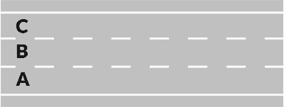
- **📖 الترجمة السياقية:** على طريق ذي ثلاثة مسارات باتجاهين للسير (strada a tre corsie a doppio senso)، كما في الشكل، يجب استخدام المسار الأوسط فقط للتجاوز (solo per il sorpasso).
- **💡 الشرح والقاعدة المرورية:** صحيح (VERO). في الطرق ذات الاتجاهين والمكونة من ثلاثة مسارات (شكل 554)، يُخصص المسار الجانبي الأيمن في كل اتجاه للسير العادي (marcia normale)، بينما يُخصص المسار الأوسط المشترك حصرياً لمناورات التجاوز لكلا الاتجاهين.
- **⚠️ كشف الفخ:** كلمة 'solo per il sorpasso' هنا صحيحة وليست فخاً؛ فالمسار الأوسط غير مسموح بالسير العادي فيه إطلاقاً.
- **🔑 الكلمات المفتاحية:** `{'it': 'tre corsie a doppio senso', 'ar': 'ثلاثة مسارات باتجاهين'}` | `{'it': 'corsia centrale', 'ar': 'المسار الأوسط'}` | `{'it': 'solo per il sorpasso', 'ar': 'فقط للتجاوز'}`

---

**129.** Su una strada a due corsie a doppio senso di marcia, in figura, si deve impegnare quella di sinistra solo per il sorpasso
- **الإجابة:** `VERO ✅ (صح)`
- 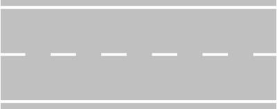
- **📖 الترجمة السياقية:** على طريق ذي مسارين باتجاهين للسير (strada a due corsie a doppio senso)، كما في الشكل، يجب استخدام المسار الأيسر فقط للتجاوز (solo per il sorpasso).
- **💡 الشرح والقاعدة المرورية:** صحيح (VERO). بموجب المادة 143 من كود السير، يُلزم السائق بالسير في المسار الأيمن، والمسار الأيسر في الطرق ذات الاتجاهين (شكل 502) مخصص لحركة المرور المعاكسة ولا يجوز دخوله إلا بصفة مؤقتة واستثنائية للتجاوز عند وضوح الرؤية وأمان المناورة.
- **⚠️ كشف الفخ:** كلمة 'solo per il sorpasso' صحيحة تماماً لأن شغل المسار المقابل في السير العادي يُعد سيراً خطيراً في عكس الاتجاه (contromano).
- **🔑 الكلمات المفتاحية:** `{'it': 'due corsie a doppio senso', 'ar': 'مساران باتجاهين'}` | `{'it': 'corsia di sinistra', 'ar': 'المسار الأيسر'}` | `{'it': 'solo per il sorpasso', 'ar': 'فقط للتجاوز'}`

---

**130.** Sulle strade extraurbane principali la sosta è consentita solo nelle apposite aree
- **الإجابة:** `VERO ✅ (صح)`
- **📖 الترجمة السياقية:** على الطرق الرئيسية خارج المدن (strade extraurbane principali)، يُسمح بالركن والتوقف الطويل (sosta) فقط في الأماكن المخصصة لذلك.
- **💡 الشرح والقاعدة المرورية:** صحيح (VERO). وفقاً للمادتين 175 و176 من كود السير، يُحظر الركن (sosta) على طول قارعة الطريق في الطرق السريعة والطرق الرئيسية خارج المدن، ويُسمح به فقط في باحات الاستراحة ومواقف الركن المجهزة والمحددة بلوحات (aree di sosta / parcheggio).
- **⚠️ كشف الفخ:** كلمة 'solo nelle apposite aree' قاعدة صارمة ملزمة؛ فلا يُسمح بالتوقف العادي (sosta) على مسارات السير أو شريط التوقف الاضطراري.
- **🔑 الكلمات المفتاحية:** `{'it': 'strade extraurbane principali', 'ar': 'طرق رئيسية خارج المدن'}` | `{'it': 'sosta', 'ar': 'الركن / التوقف التام'}` | `{'it': 'apposite aree', 'ar': 'مساحات مخصصة'}`

---

**131.** Su una strada a due carreggiate separate, in figura, si deve percorrere la carreggiata di destra per la marcia normale e quella di sinistra per il sorpasso
- **الإجابة:** `FALSO ❌ (خطأ)`
- 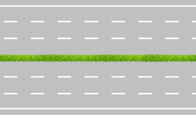
- **📖 الترجمة السياقية:** على طريق مقسم إلى قارعتين منفصلتين (due carreggiate separate)، كما في الشكل، يجب استخدام القارعة اليمنى للسير العادي واليسرى للتجاوز.
- **💡 الشرح والقاعدة المرورية:** خطأ (FALSO). في الطرق ذات القارعتين المنفصلتين (شكل 559)، تكون كل قارعة (carreggiata) مخصصة لاتجاه سير واحد مستقل؛ والتجاوز يتم في المسار الأيسر داخل نفس القارعة (corsia di sinistra)، بينما القارعة اليسرى بأكملها تسير في الاتجاه المعاكس واستخدامها يُعد جريمة سير في عكس الاتجاه (contromano).
- **⚠️ كشف الفخ:** الفخ في الخلط بين كلمة 'carreggiata' (قارعة طريق كاملة) وكلمة 'corsia' (حارة / مسار). التجاوز يتم في مسار (corsia) وليس في قارعة كاملة (carreggiata).
- **🔑 الكلمات المفتاحية:** `{'it': 'due carreggiate separate', 'ar': 'قارعتان منفصلتان'}` | `{'it': 'carreggiata di destra', 'ar': 'القارعة اليمنى'}` | `{'it': 'carreggiata di sinistra', 'ar': 'القارعة اليسرى (معاكسة للسير)'}`

---

**132.** Nelle strade composte da una carreggiata a due corsie a doppio senso di marcia, in figura, si può marciare per file parallele
- **الإجابة:** `FALSO ❌ (خطأ)`
- 
- **📖 الترجمة السياقية:** في الطرق المكونة من قارعة واحدة ذات مسارين باتجاهين للسير (due corsie a doppio senso)، كما في الشكل، يجوز السير في طوابير متوازية (file parallele).
- **💡 الشرح والقاعدة المرورية:** خطأ (FALSO). السير في طوابير متوازية (file parallele) يشترط قانوناً وجود مسارين على الأقل مخصصين لنفس اتجاه السير (almeno due corsie per senso di marcia). وفي طريق بمسار واحد لكل اتجاه (شكل 502)، يستحيل ويُحظر السير في صفوف متوازية.
- **⚠️ كشف الفخ:** السير في طوابير متوازية يتطلب مسارين لنفس الاتجاه على الأقل، وهنا يوجد مسار واحد فقط لكل اتجاه.
- **🔑 الكلمات المفتاحية:** `{'it': 'file parallele', 'ar': 'طوابير متوازية'}` | `{'it': 'doppio senso', 'ar': 'اتجاهان للسير'}` | `{'it': 'una corsia per senso', 'ar': 'مسار واحد لكل اتجاه'}`

---

**133.** Nelle strade a quattro carreggiate separate, quelle centrali sono riservate al sorpasso
- **الإجابة:** `FALSO ❌ (خطأ)`
- **📖 الترجمة السياقية:** في الطرق ذات أربع قارعات منفصلة (quattro carreggiate separate)، تُخصص القارعات المركزية للتجاوز فقط.
- **💡 الشرح والقاعدة المرورية:** خطأ (FALSO). في الطرق ذات الأربع قارعات، تُخصص القارعتان المركزيتان للسير السريع والمباشر (scorrimento veloce) باتجاهين منفصلين، وتُخصص القارعات الجانبية للسير البطيء أو حركة الوصول المحلية، ولا توجد قارعة كاملة مخصصة فقط للتجاوز (sorpasso).
- **⚠️ كشف الفخ:** كلمة 'riservate al sorpasso' المنسوبة لقارعة كاملة؛ القارعات تُخصص لاتجاهات وسرعات سير وليس للمناورة فقط.
- **🔑 الكلمات المفتاحية:** `{'it': 'quattro carreggiate separate', 'ar': 'أربع قارعات منفصلة'}` | `{'it': 'carreggiate centrali', 'ar': 'القارعات المركزية'}` | `{'it': 'scorrimento veloce', 'ar': 'سير سريع'}`

---

## 📌 Cambio corsia (8 domande)

**134.** Chi intende cambiare corsia deve controllare che la corsia che vuole occupare sia libera davanti per un tratto sufficiente
- **الإجابة:** `VERO ✅ (صح)`
- **📖 الترجمة السياقية:** من ينوي تغيير المسار (cambiare corsia) يجب عليه التأكد من أن المسار الذي يريد شغله خالٍ من الأمام لمسافة كافية.
- **💡 الشرح والقاعدة المرورية:** صحيح (VERO). المادة 154 من كود السير تلزم السائق قبل البدء في تغيير المسار بالتأكد من خلو المسار الجديد من الأمام والخلف بمسافة كافية تسمح بالمناورة دون مضايقة أو قطع الطريق على أحد.
- **⚠️ كشف الفخ:** التأكد من الخلو للأمام (libera davanti) شرط بديهي وأساسي لضمان مسافة أمان قبل الدخول في المسار.
- **🔑 الكلمات المفتاحية:** `{'it': 'cambiare corsia', 'ar': 'تغيير المسار'}` | `{'it': 'libera davanti', 'ar': 'خالٍ من الأمام'}` | `{'it': 'tratto sufficiente', 'ar': 'مسافة كافية'}`

---

**135.** Chi intende cambiare corsia deve controllare che la corsia che vuole occupare sia libera dietro per un tratto sufficiente
- **الإجابة:** `VERO ✅ (صح)`
- **📖 الترجمة السياقية:** من ينوي تغيير المسار يجب عليه التأكد من أن المسار الذي يريد شغله خالٍ من الخلف لمسافة كافية.
- **💡 الشرح والقاعدة المرورية:** صحيح (VERO). التأكد من خلو المسار من الخلف (libera dietro) عبر مرآة الرؤية الخلفية والنقطة العمياء إلزامي، حتى لا نفاجئ مركبة قادمة بسرعة وتضطر للفرملة الحادة لتفادينا.
- **⚠️ كشف الفخ:** التحقق من الرؤية الخلفية (dietro) إجراء جوهري قبل الانتقال لأي مسار جانبي.
- **🔑 الكلمات المفتاحية:** `{'it': 'cambiare corsia', 'ar': 'تغيير المسار'}` | `{'it': 'libera dietro', 'ar': 'خالٍ من الخلف'}` | `{'it': 'retrovisore', 'ar': 'مرآة الرؤية الخلفية'}`

---

**136.** Chi intende cambiare corsia, per effettuare un sorpasso, deve controllare che il veicolo che sta davanti non abbia segnalato l'inizio della stessa manovra
- **الإجابة:** `VERO ✅ (صح)`
- **📖 الترجمة السياقية:** من ينوي تغيير المسار للقيام بالتجاوز، يجب عليه التأكد من أن المركبة التي أمامه لم تشرع في إعطاء إشارة لبدء نفس المناورة.
- **💡 الشرح والقاعدة المرورية:** صحيح (VERO). المادة 148 من كود السير تنص صراحة على أن الأولوية في التجاوز للمركبة الأمامية إذا كانت قد أعلنت نيتها بالفعل بتشغيل مؤشر الاتجاه؛ فلا يجوز تخطيها أو تغيير المسار لمنافستها.
- **⚠️ كشف الفخ:** التحقق من عدم إشارة المركبة الأمامية (non abbia segnalato) قاعدة أسبقية ملزمة في التجاوز.
- **🔑 الكلمات المفتاحية:** `{'it': 'sorpasso', 'ar': 'التجاوز'}` | `{'it': 'veicolo che sta davanti', 'ar': 'المركبة التي في الأمام'}` | `{'it': 'inizio della manovra', 'ar': 'بدء المناورة'}`

---

**137.** Chi intende cambiare corsia deve segnalare la manovra in anticipo, tramite l'indicatore di direzione
- **الإجابة:** `VERO ✅ (صح)`
- **📖 الترجمة السياقية:** من ينوي تغيير المسار يجب عليه الإشارة إلى المناورة مسبقاً، باستخدام مؤشر الاتجاه (غماز / indicatore di direzione).
- **💡 الشرح والقاعدة المرورية:** صحيح (VERO). المادة 154 تلزم بالإشعار المبكر والكافي (segnalare in anticipo) بأي انحراف جانبي أو تغيير للمسار عبر استخدام ضوء الاتجاه المناسب لتنبيه مستخدمي الطريق.
- **⚠️ كشف الفخ:** كلمة 'in anticipo' تؤكد وجوب تشغيل الغماز قبل بدء الحركة بزمن كافٍ وليس أثناء الالتفاف.
- **🔑 الكلمات المفتاحية:** `{'it': 'segnalare in anticipo', 'ar': 'الإشارة مسبقاً'}` | `{'it': 'indicatore di direzione', 'ar': 'مؤشر الاتجاه (الغماز)'}` | `{'it': 'cambio corsia', 'ar': 'تغيير المسار'}`

---

**138.** Chi intende cambiare corsia non deve creare intralcio o pericolo per chi percorre la corsia che vuole impegnare
- **الإجابة:** `VERO ✅ (صح)`
- **📖 الترجمة السياقية:** من ينوي تغيير المسار يجب ألا يسبب عرقلة (intralcio) أو خطراً (pericolo) لمن يسير في المسار الذي يريد شغله.
- **💡 الشرح والقاعدة المرورية:** صحيح (VERO). الأولوية دائماً للمركبات التي تسير بانتظام داخل مسارها؛ ويحظر على أي سائق يغير مساره إرباك حركة المرور أو إجبار الغير على إبطاء سرعته أو الانحراف.
- **⚠️ كشف الفخ:** تجنب العرقلة أو الخطر (non creare intralcio o pericolo) هو المبدأ الجوهري الأول لكل مناورة.
- **🔑 الكلمات المفتاحية:** `{'it': 'intralcio', 'ar': 'إعاقة / عرقلة'}` | `{'it': 'pericolo', 'ar': 'خطر'}` | `{'it': 'impegnare la corsia', 'ar': 'شغل المسار'}`

---

**139.** Chi intende cambiare corsia non deve azionare l'indicatore di direzione se la strada è libera
- **الإجابة:** `FALSO ❌ (خطأ)`
- **📖 الترجمة السياقية:** من ينوي تغيير المسار لا يجب عليه تشغيل مؤشر الاتجاه إذا كان الطريق خالياً.
- **💡 الشرح والقاعدة المرورية:** خطأ (FALSO). تشغيل مؤشر الاتجاه (indicatore di direzione) إلزامي قانوناً في جميع الحالات والظروف عند تغيير المسار، ولا يُعفى السائق أبداً بحجة أن الطريق خالٍ، فقد توجد مركبة أو دراجة في الزاوية الميتة.
- **⚠️ كشف الفخ:** عبارة 'se la strada è libera' فخ شائع لإلغاء إلزامية الإشارة؛ استخدام الغماز إلزامي دائماً ودون استثناء.
- **🔑 الكلمات المفتاحية:** `{'it': 'non deve azionare', 'ar': 'لا يجب تشغيل (خاطئ)'}` | `{'it': 'strada è libera', 'ar': 'الطريق خالٍ'}` | `{'it': 'obbligo di segnalare', 'ar': 'إلزامية الإشارة'}`

---

**140.** Chi intende cambiare corsia ha l'obbligo di segnalare la manovra con l'uso dell'avvisatore acustico (clacson o trombe)
- **الإجابة:** `FALSO ❌ (خطأ)`
- **📖 الترجمة السياقية:** من ينوي تغيير المسار ملزم بالإشارة للمناورة باستخدام المنبه الصوتي (البوق / clacson).
- **💡 الشرح والقاعدة المرورية:** خطأ (FALSO). تغيير المسار يتم الإعلان عنه حصرياً عبر الإشارات الضوئية (مؤشر الاتجاه)، والمنبه الصوتي مخصص فقط لتفادي الحوادث العاجلة ويحظر استخدامه داخل المدن لتغيير المسارات.
- **⚠️ كشف الفخ:** كلمة 'avvisatore acustico / clacson'؛ تغيير المسار يُشار إليه بالضوء (indicatore di direzione) وليس بالصوت.
- **🔑 الكلمات المفتاحية:** `{'it': 'avvisatore acustico', 'ar': 'المنبه الصوتي'}` | `{'it': 'clacson', 'ar': 'البوق'}` | `{'it': 'cambiare corsia', 'ar': 'تغيير المسار'}`

---

**141.** Prima di cambiare corsia è necessario accertare che le corsie siano separate da una striscia continua
- **الإجابة:** `FALSO ❌ (خطأ)`
- **📖 الترجمة السياقية:** قبل تغيير المسار من الضروري التأكد من أن المسارات مفصولة بخط متصل (striscia continua).
- **💡 الشرح والقاعدة المرورية:** خطأ (FALSO). الخط المتصل (striscia continua) يُمنع منعاً باتاً قطعه أو تجاوزه، ولا يمكن تغيير المسار إلا إذا كان الخط الفاصل متقطعاً (striscia discontinua / tratteggiata).
- **⚠️ كشف الفخ:** عكس القاعدة تماماً: الخط المتصل يمنع التغيير، والخط المتقطع هو الذي يسمح به.
- **🔑 الكلمات المفتاحية:** `{'it': 'striscia continua', 'ar': 'خط متصل (يمنع تجاوزه)'}` | `{'it': 'striscia discontinua', 'ar': 'خط متقطع'}` | `{'it': 'cambio corsia', 'ar': 'تغيير المسار'}`

---

## 📌 Svolta carreggiata doppio senso (9 domande)

**142.** In una carreggiata a doppio senso di circolazione per svoltare a sinistra bisogna avvicinarsi al centro della carreggiata
- **الإجابة:** `VERO ✅ (صح)`
- **📖 الترجمة السياقية:** في قارعة طريق ذات اتجاهين للسير، للانعطاف إلى اليسار يجب الاقتراب من منتصف القارعة (centro della carreggiata).
- **💡 الشرح والقاعدة المرورية:** صحيح (VERO). بموجب المادة 154، في الطرق ذات الاتجاهين (doppio senso)، يجب على السائق الراغب بالانعطاف يساراً التقرب من خط منتصف الطريق (asse della carreggiata) دون تجاوزه، لإفساح المجال للمركبات القادمة من الخلف للتجاوز من اليمين.
- **⚠️ كشف الفخ:** في الطريق ذي الاتجاهين نقترب من الوسط (centro)، بينما في الطريق ذي الاتجاه الواحد نقترب من أقصى اليسار (margine sinistro).
- **🔑 الكلمات المفتاحية:** `{'it': 'doppio senso', 'ar': 'اتجاهان للسير'}` | `{'it': 'svolta a sinistra', 'ar': 'الانعطاف يساراً'}` | `{'it': 'centro della carreggiata', 'ar': 'منتصف القارعة'}`

---

**143.** In una carreggiata a doppio senso di circolazione per svoltare a sinistra occorre, di norma, occupare l'area sinistra dell'incrocio, come i veicoli in figura, salvo diversa segnalazione
- **الإجابة:** `VERO ✅ (صح)`
- 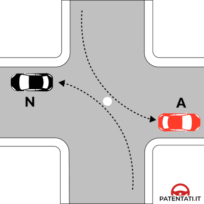
- **📖 الترجمة السياقية:** في قارعة طريق ذات اتجاهين للسير، للانعطاف إلى اليسار يجب كقاعدة عامة شغل المنطقة اليسرى من التقاطع، كما المركبات في الشكل، ما لم توجد إشارات أخرى.
- **💡 الشرح والقاعدة المرورية:** صحيح (VERO). وفقاً للشكل 601، عند تقاطع مركبتين تلتفان يساراً في نفس الوقت، تدور كل منهما أمام الأخرى تاركة مركز التقاطع على يمينها (svolta a sinistra all'italiana)، فتشغل كل واحدة المنطقة اليسرى بالنسبة لمسارها دون الدوران حول المركز.
- **⚠️ كشف الفخ:** مطابقة لصورة التقاطع 601 حيث ينعطف السائقان دون الالتفاف حول مركز التقاطع بل بترك المركز على اليمين.
- **🔑 الكلمات المفتاحية:** `{'it': "occupare l'area sinistra", 'ar': 'شغل المنطقة اليسرى'}` | `{'it': 'centro a destra', 'ar': 'المركز على اليمين'}` | `{'it': 'salvo diversa segnalazione', 'ar': 'ما لم توجد إشارة مخالفة'}`

---

**144.** In una carreggiata a doppio senso di circolazione per svoltare a sinistra bisogna girare intorno al centro dell'incrocio come il veicolo H in figura, se c'è il segnale di rotatoria
- **الإجابة:** `VERO ✅ (صح)`
- 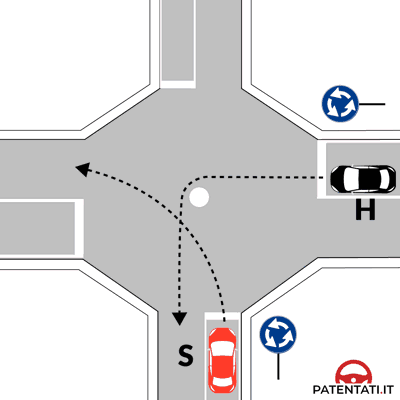
- **📖 الترجمة السياقية:** في قارعة طريق ذات اتجاهين للسير، للانعطاف إلى اليسار يجب الدوران حول مركز التقاطع كما تفعل المركبة H في الشكل، إذا وُجدت إشارة الدوار (rotatoria).
- **💡 الشرح والقاعدة المرورية:** صحيح (VERO). بوجود إشارة الدوار (شكل 602)، يُلزم السائق بقواعد السير الدائري، فيدور إجبارياً حول الجزيرة المركزية أو مركز التقاطع (عكس عقارب الساعة) تاركاً المركز على يساره لإتمام الانعطاف نحو المخرج المطلوب.
- **⚠️ كشف الفخ:** وجود إشارة الدوار يلزم بالدوران حول المركز (girare intorno al centro)، على النقيض من التقاطعات العادية بدون دوار.
- **🔑 الكلمات المفتاحية:** `{'it': 'girare intorno al centro', 'ar': 'الدوران حول المركز'}` | `{'it': 'segnale di rotatoria', 'ar': 'إشارة الدوار'}` | `{'it': 'veicolo H', 'ar': 'المركبة H'}`

---

**145.** In una carreggiata a doppio senso di circolazione per svoltare a sinistra bisogna dare la precedenza ai veicoli provenienti da destra, salvo diversa segnalazione
- **الإجابة:** `VERO ✅ (صح)`
- **📖 الترجمة السياقية:** في قارعة طريق ذات اتجاهين للسير، للانعطاف إلى اليسار يجب إعطاء حق الأولوية للمركبات القادمة من اليمين، ما لم توجد إشارات تخالف ذلك.
- **💡 الشرح والقاعدة المرورية:** صحيح (VERO). تسري القاعدة العامة للأولوية للقادم من اليمين (precedenza a destra)؛ وعند الانعطاف يساراً، تصبح المركبات القادمة بالمواجهة (من الأمام) على يميننا أثناء الدوران، فيجب إعطاؤها الأولوية أيضاً.
- **⚠️ كشف الفخ:** إعطاء الأولوية لليمين يظل واجباً أساسياً عند الانعطاف يساراً في غياب إشارات تنص على غير ذلك.
- **🔑 الكلمات المفتاحية:** `{'it': 'dare la precedenza', 'ar': 'إعطاء الأولوية'}` | `{'it': 'provenienti da destra', 'ar': 'القادمون من اليمين'}` | `{'it': 'svolta a sinistra', 'ar': 'الانعطاف يساراً'}`

---

**146.** In una carreggiata a doppio senso di circolazione per svoltare a sinistra occorre spostarsi il più possibile sul margine sinistro della carreggiata
- **الإجابة:** `FALSO ❌ (خطأ)`
- **📖 الترجمة السياقية:** في قارعة طريق ذات اتجاهين للسير، للانعطاف إلى اليسار يجب الانتقال قدر الإمكان إلى الحافة اليسرى القصوى للقارعة (margine sinistro).
- **💡 الشرح والقاعدة المرورية:** خطأ (FALSO). الالتصاق بالحافة اليسرى القصوى مطلوب فقط في الطرق ذات الاتجاه الواحد (senso unico). أما في الطرق ذات الاتجاهين (doppio senso)، فالانتقال إلى الحافة اليسرى يعني السير في عكس الاتجاه (contromano) والاصطدام بالمرور القادم وجهاً لوجه.
- **⚠️ كشف الفخ:** الخلط الخطر بين الطريق ذي الاتجاه الواحد (الانتقال لأقصى اليسار) والطريق ذي الاتجاهين (البقاء قرب خط الوسط).
- **🔑 الكلمات المفتاحية:** `{'it': 'margine sinistro', 'ar': 'الحافة اليسرى القصوى'}` | `{'it': 'doppio senso', 'ar': 'اتجاهان للسير'}` | `{'it': 'contromano', 'ar': 'عكس السير'}`

---

**147.** In una carreggiata a doppio senso di circolazione per svoltare a sinistra bisogna effettuare la manovra velocemente, per evitare i veicoli provenienti da destra e da sinistra
- **الإجابة:** `FALSO ❌ (خطأ)`
- **📖 الترجمة السياقية:** في قارعة طريق ذات اتجاهين للسير، للانعطاف إلى اليسار يجب تنفيذ المناورة بسرعة، لتفادي المركبات القادمة من اليمين واليسار.
- **💡 الشرح والقاعدة المرورية:** خطأ (FALSO). الانعطاف في التقاطعات يتطلب التمهل وتهدئة السرعة إلى أقصى حد وإعطاء حق الأولوية، وعبارة 'بسرعة لتفادي المركبات' تشكل تصرفاً متهوراً ومخالفة صريحة لقواعد السلامة المرورية.
- **⚠️ كشف الفخ:** كلمة 'velocemente' (بسرعة) فخ مؤكد للخطأ؛ فالمناورات في التقاطعات تتطلب التمهل والحيطة.
- **🔑 الكلمات المفتاحية:** `{'it': 'effettuare velocemente', 'ar': 'التنفيذ بسرعة (خاطئ)'}` | `{'it': 'moderare la velocità', 'ar': 'تهدئة السرعة'}` | `{'it': 'massima prudenza', 'ar': 'أقصى درجات الحيطة'}`

---

**148.** In una carreggiata a doppio senso di circolazione per svoltare a sinistra bisogna effettuare la svolta occupando sempre il lato destro dell'incrocio, come i veicoli in figura
- **الإجابة:** `FALSO ❌ (خطأ)`
- 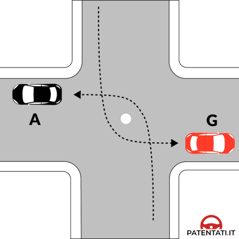
- **📖 الترجمة السياقية:** في قارعة طريق ذات اتجاهين للسير، للانعطاف إلى اليسار يجب دائماً تنفيذ الانعطاف بشغل الجانب الأيمن من التقاطع، كما المركبات في الشكل.
- **💡 الشرح والقاعدة المرورية:** خطأ (FALSO). في التقاطعات المعتادة (شكل 599)، الانعطاف يساراً يتم بترك مركز التقاطع على اليمين وشغل المنطقة اليسرى للمسار، ولا يُشغل الجانب الأيمن من التقاطع دائماً، فكلمة 'sempre' تجعل العبارة غير صحيحة.
- **⚠️ كشف الفخ:** كلمة 'sempre il lato destro' غير صحيحة، فالقاعدة العامة هي عبور التقاطع بترك المركز على اليمين وشغل المسار الأيسر المناسب.
- **🔑 الكلمات المفتاحية:** `{'it': 'sempre', 'ar': 'دائماً (فخ مضلل)'}` | `{'it': "lato destro dell'incrocio", 'ar': 'الجانب الأيمن من التقاطع'}` | `{'it': 'svolta a sinistra', 'ar': 'الانعطاف يساراً'}`

---

**149.** In una carreggiata a doppio senso di circolazione per svoltare a sinistra bisogna dare la precedenza ai veicoli che arrivano da sinistra, salvo diversa segnalazione
- **الإجابة:** `FALSO ❌ (خطأ)`
- **📖 الترجمة السياقية:** في قارعة طريق ذات اتجاهين للسير، للانعطاف إلى اليسار يجب إعطاء الأولوية للمركبات القادمة من اليسار، ما لم توجد إشارات أخرى.
- **💡 الشرح والقاعدة المرورية:** خطأ (FALSO). وفقاً للمادة 145، الأولوية في التقاطعات هي لليمين (da destra) وللقادمين من الأمام في الاتجاه المعاكس؛ ولا تُعطى الأولوية للقادم من اليسار إلا بوجود إشارة خاصة كإشارة 'أعطِ الأولوية' في مدخل الدوار.
- **⚠️ كشف الفخ:** عبارة 'arrivano da sinistra'؛ القاعدة العامة تنص على إعطاء الأولوية لليمين (da destra) وليس لليسار.
- **🔑 الكلمات المفتاحية:** `{'it': 'da sinistra', 'ar': 'من اليسار'}` | `{'it': 'precedenza da destra', 'ar': 'الأولوية للقادم من اليمين'}` | `{'it': 'norma generale', 'ar': 'القاعدة العامة'}`

---

**150.** In una carreggiata a doppio senso di circolazione per svoltare a sinistra occorre suonare il clacson, per attraversare con maggior sicurezza l'incrocio
- **الإجابة:** `FALSO ❌ (خطأ)`
- **📖 الترجمة السياقية:** في قارعة طريق ذات اتجاهين للسير، للانعطاف إلى اليسار يجب استخدام بوق السيارة (clacson)، لعبور التقاطع بأمان أكبر.
- **💡 الشرح والقاعدة المرورية:** خطأ (FALSO). استخدام المنبه الصوتي (clacson) داخل التجمعات السكانية محظور إلا في حالات الخطر الفوري لإنقاذ الأرواح، ولا يُسمح باستخدامه نهائياً لطلب المرور أو تسهيل الانعطاف في التقاطعات.
- **⚠️ كشف الفخ:** استخدام 'suonare il clacson' في التقاطعات ممنوع، والأمان يتحقق بالتهدئة والانتباه واستعمال إشارات الانعطاف الضوئية.
- **🔑 الكلمات المفتاحية:** `{'it': 'suonare il clacson', 'ar': 'استخدام المنبه الصوتي'}` | `{'it': 'centri abitati', 'ar': 'المناطق السكنية'}` | `{'it': "sicurezza dell'incrocio", 'ar': 'أمان التقاطع'}`

---

## 📌 Utilizzo corsie file parallele (26 domande)

**151.** I veicoli devono, di norma, circolare sulla parte destra della carreggiata ed in vicinanza del margine destro
- **الإجابة:** `VERO ✅ (صح)`
- **📖 الترجمة السياقية:** يجب على المركبات، كقاعدة عامة، السير في الجانب الأيمن من القارعة وعلى مقربة من الحافة اليمنى.
- **💡 الشرح والقاعدة المرورية:** صحيح (VERO). بموجب المادة 143 من كود السير، القاعدة الأساسية في إيطاليا هي التزام أقصى اليمين (mano destra)، حيث يجب السير قرب الحافة اليمنى للطريق لتسهيل انسياب المرور وتفادي الحوادث.
- **⚠️ كشف الفخ:** قاعدة السير على اليمين (parte destra / margine destro) هي الأصل العام لكل مركبة.
- **🔑 الكلمات المفتاحية:** `{'it': 'parte destra', 'ar': 'الجانب الأيمن'}` | `{'it': 'margine destro', 'ar': 'الحافة اليمنى'}` | `{'it': 'di norma', 'ar': 'كقاعدة عامة'}`

---

**152.** In una strada divisa in due carreggiate separate come in figura, i veicoli devono, di norma, circolare sulla carreggiata di destra rispetto alla propria direzione di marcia
- **الإجابة:** `VERO ✅ (صح)`
- 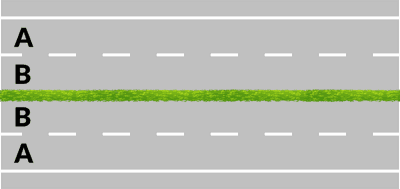
- **📖 الترجمة السياقية:** في طريق مقسم إلى قارعتين منفصلتين كما في الشكل، يجب على المركبات، كقاعدة عامة، السير في القارعة اليمنى بالنسبة لاتجاه سيرها.
- **💡 الشرح والقاعدة المرورية:** صحيح (VERO). في الطريق ذي القارعتين المنفصلتين (شكل 558)، تُخصص كل قارعة لاتجاه سير واحد، ويلتزم السائق بالسير في القارعة الواقعة على يمينه بالنسبة لاتجاه رحلته.
- **⚠️ كشف الفخ:** القارعة اليمنى بالنسبة لاتجاه السير (carreggiata di destra) هي المسار الصحيح والقانوني.
- **🔑 الكلمات المفتاحية:** `{'it': 'due carreggiate separate', 'ar': 'قارعتان منفصلتان'}` | `{'it': 'carreggiata di destra', 'ar': 'القارعة اليمنى'}` | `{'it': 'direzione di marcia', 'ar': 'اتجاه السير'}`

---

**153.** Su una strada divisa in tre carreggiate separate come in figura, i veicoli devono, di norma, circolare sulla carreggiata centrale o su quella di destra rispetto alla propria direzione di marcia
- **الإجابة:** `VERO ✅ (صح)`
- 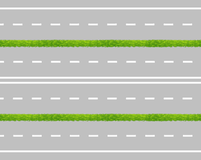
- **📖 الترجمة السياقية:** في طريق مقسم إلى ثلاث قارعات منفصلة كما في الشكل، يجب على المركبات، كقاعدة عامة، السير في القارعة المركزية أو في القارعة اليمنى بالنسبة لاتجاه سيرها.
- **💡 الشرح والقاعدة المرورية:** صحيح (VERO). في الطريق ذي القارعات الثلاث (شكل 562)، تكون القارعتان الجانبيتان باتجاه واحد والقارعة المركزية قد تكون باتجاهين أو باتجاهين منفصلين، وبالتالي يسير السائق في القارعة اليمنى أو المركزية، ويُمنع نهائياً من دخول القارعة اليسرى لأنها مخصصة لحركة السير المعاكسة.
- **⚠️ كشف الفخ:** السير متاح في القارعة اليمنى أو الوسطى، لكن القارعة اليسرى محظورة لأنها للاتجاه المقابل.
- **🔑 الكلمات المفتاحية:** `{'it': 'tre carreggiate separate', 'ar': 'ثلاث قارعات منفصلة'}` | `{'it': 'carreggiata centrale o destra', 'ar': 'القارعة الوسطى أو اليمنى'}` | `{'it': 'senso contrario', 'ar': 'الاتجاه المعاكس'}`

---

**154.** In una carreggiata a doppio senso di marcia con due corsie, come in figura, i veicoli devono circolare nella corsia di destra, impegnando solo quella di sinistra per il sorpasso
- **الإجابة:** `VERO ✅ (صح)`
- 
- **📖 الترجمة السياقية:** في قارعة طريق ذات اتجاهين للسير ومسارين كما في الشكل، يجب على المركبات السير في المسار الأيمن، واستخدام المسار الأيسر فقط للتجاوز.
- **💡 الشرح والقاعدة المرورية:** صحيح (VERO). وفقاً للمادة 143، في طريق بمسارين باتجاهين (شكل 502)، يُخصص المسار الأيمن للسير العادي، والمسار الأيسر ملك للاتجاه المعاكس ولا يجوز استخدامه إلا مؤقتاً للتجاوز (solo per il sorpasso).
- **⚠️ كشف الفخ:** كلمة 'solo per il sorpasso' صحيحة تماماً لكون المسار الأيسر معاكساً لحركة السير.
- **🔑 الكلمات المفتاحية:** `{'it': 'doppio senso con due corsie', 'ar': 'اتجاهان بمسارين'}` | `{'it': 'corsia di destra', 'ar': 'المسار الأيمن'}` | `{'it': 'solo per il sorpasso', 'ar': 'فقط للتجاوز'}`

---

**155.** Su carreggiate a tre corsie per senso di marcia, come in figura, i veicoli a motore devono, di norma, percorrere la corsia più libera a destra
- **الإجابة:** `VERO ✅ (صح)`
- 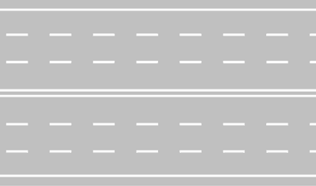
- **📖 الترجمة السياقية:** في القارعات ذات ثلاثة مسارات لكل اتجاه سير كما في الشكل، يجب على المركبات ذات المحرك، كقاعدة عامة، السير في المسار الأكثر خلوّاً على اليمين.
- **💡 الشرح والقاعدة المرورية:** صحيح (VERO). تنص المادة 143 على التزام المسار الأيمن الأكثر خلوّاً (la corsia più libera a destra) للسير العادي على الطرق السريعة والقارعات متعددة المسارات، وتُترك المسارات اليسرى للتجاوز.
- **⚠️ كشف الفخ:** قاعدة 'corsia più libera a destra' ملزمة دائماً؛ ولا يجوز البقاء في المسارات الوسطى أو اليسرى دون وجود مركبات نتجاوزها على اليمين.
- **🔑 الكلمات المفتاحية:** `{'it': 'tre corsie per senso', 'ar': 'ثلاثة مسارات لكل اتجاه'}` | `{'it': 'corsia più libera a destra', 'ar': 'المسار الأكثر خلوّاً على اليمين'}` | `{'it': 'veicoli a motore', 'ar': 'مركبات ذات محرك'}`

---

**156.** I veicoli a motore possono circolare per file parallele in vicinanza di incroci regolati da vigili o da semafori
- **الإجابة:** `VERO ✅ (صح)`
- **📖 الترجمة السياقية:** يجوز للمركبات ذات المحرك السير في طوابير متوازية (file parallele) بالقرب من التقاطعات المنظمة بواسطة شرطي مرور أو إشارات ضوئية.
- **💡 الشرح والقاعدة المرورية:** صحيح (VERO). بموجب المادة 144، يُسمح بالسير في صفوف متوازية عند الاقتراب من التقاطعات المزودة بإشارات ضوئية (semafori) أو بتوجيه من شرطي المرور (vigili)，بشرط وجود مسارين على الأقل لنفس الاتجاه.
- **⚠️ كشف الفخ:** السير في طوابير متوازية جائز استثنائياً عند التقاطعات المنظمة بإشارات ضوئية أو رجال المرور.
- **🔑 الكلمات المفتاحية:** `{'it': 'file parallele', 'ar': 'طوابير متوازية'}` | `{'it': 'incroci regolati', 'ar': 'تقاطعات منظمة'}` | `{'it': 'vigili o semafori', 'ar': 'رجال مرور أو إشارات ضوئية'}`

---

**157.** I veicoli senza motore devono circolare il più possibile vicino al margine destro della carreggiata
- **الإجابة:** `VERO ✅ (صح)`
- **📖 الترجمة السياقية:** يجب على المركبات غير المزودة بمحرك (veicoli senza motore) السير في أقرب نقطة ممكنة من الحافة اليمنى للقارعة.
- **💡 الشرح والقاعدة المرورية:** صحيح (VERO). المركبات غير الآلية كالدراجات الهوائية وعربات الجر اليدوي والحيواني يجب أن تسير بمحاذاة الحافة اليمنى القصوى (margine destro) لمنع عرقلة المركبات الأسرع وتجنب حوادث الدهس.
- **⚠️ كشف الفخ:** الالتزام التام بأقصى الحافة اليمنى واجب قطعي على المركبات البطيئة وغير المزودة بمحرك.
- **🔑 الكلمات المفتاحية:** `{'it': 'veicoli senza motore', 'ar': 'مركبات بدون محرك'}` | `{'it': 'margine destro', 'ar': 'الحافة اليمنى'}` | `{'it': 'il più possibile vicino', 'ar': 'في أقرب نقطة ممكنة'}`

---

**158.** Chi conduce gli animali li deve tenere il più possibile vicino al margine destro della carreggiata
- **الإجابة:** `VERO ✅ (صح)`
- **📖 الترجمة السياقية:** يجب على من يقود الحيوانات إبقاؤها في أقرب مكان ممكن من الحافة اليمنى لقارعة الطريق.
- **💡 الشرح والقاعدة المرورية:** صحيح (VERO). وفقاً للمادة 143، يجب اقتياد الحيوانات بالقرب الشديد من الحافة اليمنى للطريق منعاً لتعطيل المرور وحفاظاً على أمن مستخدمي الطريق والحيوانات ذاتها.
- **⚠️ كشف الفخ:** قيادة الحيوانات تخضع لنفس قاعدة التزام أقصى الحافة اليمنى من الطريق.
- **🔑 الكلمات المفتاحية:** `{'it': 'conduce gli animali', 'ar': 'يقود الحيوانات'}` | `{'it': 'margine destro', 'ar': 'الحافة اليمنى'}` | `{'it': 'carreggiata', 'ar': 'قارعة الطريق'}`

---

**159.** Su strade a doppio senso di marcia con due corsie, come in figura, incrociando altri veicoli occorre spostarsi il più vicino possibile al margine destro della carreggiata
- **الإجابة:** `VERO ✅ (صح)`
- 
- **📖 الترجمة السياقية:** على الطرق ذات الاتجاهين والمسارين كما في الشكل، عند التقاطع مع مركبات أخرى قادمة بالمواجهة، يجب الاقتراب قدر الإمكان من الحافة اليمنى للقارعة.
- **💡 الشرح والقاعدة المرورية:** صحيح (VERO). بموجب المادة 150 من كود السير، عند تقابل مركبتين في اتجاهين متعاكسين على طريق ضيق بمسارين (شكل 502)، يجب على كل سائق الانحياز إلى أقصى اليمين لتوفير حيز أمان كافٍ للعبور وتجنب الاحتكاك الجانبي.
- **⚠️ كشف الفخ:** الانحياز لليمين (margine destro) عند تقابل مركبة مقابلة واجب لضمان مسافة الأمان الجانبية.
- **🔑 الكلمات المفتاحية:** `{'it': 'incrociando altri veicoli', 'ar': 'عند التقابل مع مركبات أخرى'}` | `{'it': 'margine destro', 'ar': 'الحافة اليمنى'}` | `{'it': 'doppio senso', 'ar': 'اتجاهان للسير'}`

---

**160.** In una carreggiata a doppio senso di marcia con due corsie, come in figura, i veicoli devono circolare nella corsia di destra, impegnando quella di sinistra solo per il sorpasso
- **الإجابة:** `VERO ✅ (صح)`
- 
- **📖 الترجمة السياقية:** في قارعة طريق ذات اتجاهين للسير ومسارين كما في الشكل، يجب على المركبات السير في المسار الأيمن، واستخدام المسار الأيسر فقط للتجاوز.
- **💡 الشرح والقاعدة المرورية:** صحيح (VERO). في الطريق ذي الاتجاهين والمسارين (شكل 502)، يُلزم السائق بالسير العادي في المسار الأيمن، والمسار الأيسر مخصص حصرياً لمناورة التجاوز عند استيفاء شروط الأمان.
- **⚠️ كشف الفخ:** تأكيد ثانٍ للقاعدة الوزارية: المسار المقابل لا يُستخدم إلا للتجاوز فقط.
- **🔑 الكلمات المفتاحية:** `{'it': 'corsia di destra', 'ar': 'المسار الأيمن'}` | `{'it': 'corsia di sinistra', 'ar': 'المسار الأيسر'}` | `{'it': 'solo per il sorpasso', 'ar': 'فقط للتجاوز'}`

---

**161.** Su strada a doppio senso di marcia con due corsie, come in figura, i veicoli che percorrono il tratto in salita di un dosso devono tenersi il più possibile vicino al margine destro della carreggiata
- **الإجابة:** `VERO ✅ (صح)`
- 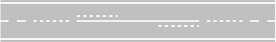
- **📖 الترجمة السياقية:** على طريق ذي اتجاهين ومسارين كما في الشكل، يجب على المركبات التي تسير في المقطع الصاعد من مرتفع محدب (dosso) التزام أقصى نقطة ممكنة من الحافة اليمنى للقارعة.
- **💡 الشرح والقاعدة المرورية:** صحيح (VERO). عند صعود المرتفع المحدب (dosso) في طريق باتجاهين ومسار لكل اتجاه (شكل 536)، تنعدم الرؤية تماماً لما وراء القمة، لذا تلزم المادة 143 من كود السير بالالتصاق التام بالحافة اليمنى لمنع الاصطدام وجه لوجه مع مركبة قادمة بالاتجاه المعاكس.
- **⚠️ كشف الفخ:** الالتصاق الشديد باليمين في صعود التلة (tratto in salita di un dosso) أمر إجباري بسبب انعدام الرؤية.
- **🔑 الكلمات المفتاحية:** `{'it': 'tratto in salita', 'ar': 'المقطع الصاعد'}` | `{'it': 'dosso', 'ar': 'مرتفع محدب'}` | `{'it': 'margine destro', 'ar': 'الحافة اليمنى'}`

---

**162.** Su strada a doppio senso di marcia con tre corsie, come in figura, i veicoli possono usare la corsia centrale per la marcia normale
- **الإجابة:** `FALSO ❌ (خطأ)`
- 
- **📖 الترجمة السياقية:** على طريق ذي اتجاهين للسير وثلاثة مسارات كما في الشكل، يجوز للمركبات استخدام المسار الأوسط للسير العادي (marcia normale).
- **💡 الشرح والقاعدة المرورية:** خطأ (FALSO). في الطريق المكون من ثلاثة مسارات باتجاهين (شكل 554)، يُخصص المسار الأوسط حصرياً للتجاوز (solo per il sorpasso) لكلا الاتجاهين، ويحظر تماماً استخدامه للسير العادي.
- **⚠️ كشف الفخ:** المسار الأوسط مخصص فقط للتجاوز، وكلمة 'marcia normale' تجعل العبارة خاطئة تماماً.
- **🔑 الكلمات المفتاحية:** `{'it': 'corsia centrale', 'ar': 'المسار الأوسط'}` | `{'it': 'marcia normale', 'ar': 'السير العادي'}` | `{'it': 'tre corsie a doppio senso', 'ar': 'ثلاثة مسارات باتجاهين'}`

---

**163.** Quando una strada è a doppio senso di marcia con tre corsie, come in figura, i veicoli possono circolare per file parallele
- **الإجابة:** `FALSO ❌ (خطأ)`
- 
- **📖 الترجمة السياقية:** عندما يكون الطريق باتجاهين للسير وثلاثة مسارات كما في الشكل، يجوز للمركبات السير في طوابير متوازية (file parallele).
- **💡 الشرح والقاعدة المرورية:** خطأ (FALSO). السير في طوابير متوازية يتطلب وجود مسارين على الأقل مخصصين لنفس اتجاه السير بصفة دائمة؛ وفي الطريق ذي المسارات الثلاثة باتجاهين (شكل 554)، يوجد مسار واحد لكل اتجاه ومسار مشترك للتجاوز، فلا تجوز الطوابير المتوازية إطلاقاً.
- **⚠️ كشف الفخ:** لا تجوز الطوابير المتوازية في طريق 3 مسارات باتجاهين لعدم وجود مسارين مخصصين لاتجاه واحد.
- **🔑 الكلمات المفتاحية:** `{'it': 'file parallele', 'ar': 'طوابير متوازية'}` | `{'it': 'doppio senso', 'ar': 'اتجاهان للسير'}` | `{'it': 'tre corsie', 'ar': 'ثلاثة مسارات'}`

---

**164.** Per svoltare a sinistra i veicoli debbono tenersi sul margine destro della carreggiata
- **الإجابة:** `FALSO ❌ (خطأ)`
- **📖 الترجمة السياقية:** للانعطاف إلى اليسار يجب على المركبات التزام الحافة اليمنى لقارعة الطريق.
- **💡 الشرح والقاعدة المرورية:** خطأ (FALSO). للانعطاف يساراً، يجب الاقتراب من خط الوسط في الطرق ذات الاتجاهين، أو التزام أقصى الحافة اليسرى في الطرق ذات الاتجاه الواحد. التزام الحافة اليمنى مخصص فقط للانعطاف يميناً.
- **⚠️ كشف الفخ:** الالتزام بالحافة اليمنى (margine destro) مخصص لليمين وليس للانعطاف يساراً (svoltare a sinistra).
- **🔑 الكلمات المفتاحية:** `{'it': 'svoltare a sinistra', 'ar': 'الانعطاف يساراً'}` | `{'it': 'margine destro', 'ar': 'الحافة اليمنى (خاطئ هنا)'}` | `{'it': 'asse della carreggiata', 'ar': 'محور القارعة'}`

---

**165.** E' possibile circolare al centro della carreggiata quando la strada è libera
- **الإجابة:** `FALSO ❌ (خطأ)`
- **📖 الترجمة السياقية:** يجوز السير في وسط قارعة الطريق عندما يكون الطريق خالياً.
- **💡 الشرح والقاعدة المرورية:** خطأ (FALSO). تنص المادة 143 على التزام الجانب الأيمن دائماً والاقتراب من الحافة اليمنى، ويُحظر السير في وسط الطريق حتى لو كان خالياً تماماً من المركبات.
- **⚠️ كشف الفخ:** عبارة 'quando la strada è libera' فخ متكرر؛ خلو الطريق لا يعطي رخصة للسير في المنتصف ومخالفة قاعدة اليمين.
- **🔑 الكلمات المفتاحية:** `{'it': 'centro della carreggiata', 'ar': 'وسط القارعة'}` | `{'it': 'strada è libera', 'ar': 'الطريق خالٍ'}` | `{'it': 'obbligo a destra', 'ar': 'إلزامية اليمين'}`

---

**166.** In una strada a doppio senso di marcia con due corsie, come in figura, i veicoli possono circolare per file parallele
- **الإجابة:** `FALSO ❌ (خطأ)`
- 
- **📖 الترجمة السياقية:** في طريق ذي اتجاهين للسير ومسارين كما في الشكل، يجوز للمركبات السير في طوابير متوازية.
- **💡 الشرح والقاعدة المرورية:** خطأ (FALSO). في طريق باتجاهين ومسارين فقط (مسار واحد لكل اتجاه، شكل 502)، لا توجد مسارات متوازية لنفس الاتجاه، وبالتالي يستحيل ويمنع قانوناً السير في طوابير متوازية.
- **⚠️ كشف الفخ:** الطوابير المتوازية تستلزم مسارين لنفس الاتجاه، بينما هنا يوجد مسار واحد فقط لكل اتجاه.
- **🔑 الكلمات المفتاحية:** `{'it': 'due corsie a doppio senso', 'ar': 'مساران باتجاهين'}` | `{'it': 'file parallele', 'ar': 'طوابير متوازية'}` | `{'it': 'divieto', 'ar': 'منع'}`

---

**167.** In caso di intenso traffico è consentito circolare per file parallele, utilizzando le corsie riservate agli autobus e ai veicoli in servizio pubblico
- **الإجابة:** `FALSO ❌ (خطأ)`
- **📖 الترجمة السياقية:** في حال وجود حركة مرور كثيفة، يُسمح بالسير في طوابير متوازية باستخدام المسارات المخصصة للحافلات ومركبات الخدمة العامة.
- **💡 الشرح والقاعدة المرورية:** خطأ (FALSO). المسارات المخصصة للنقل العام (corsie preferenziali per autobus e taxi) محظورة تماماً على المركبات الخاصة في جميع الأوقات وظروف الازدحام المروري.
- **⚠️ كشف الفخ:** الازدحام المروري الكثيف لا يجيز إطلاقاً اقتحام مسارات الحافلات المحجوزة.
- **🔑 الكلمات المفتاحية:** `{'it': 'intenso traffico', 'ar': 'مرور كثيف'}` | `{'it': 'corsie riservate agli autobus', 'ar': 'مسارات محجوزة للحافلات'}` | `{'it': 'servizio pubblico', 'ar': 'خدمة عامة'}`

---

**168.** Su strada a senso unico i veicoli che percorrono una curva a sinistra devono tenersi in prossimità del margine sinistro della carreggiata
- **الإجابة:** `FALSO ❌ (خطأ)`
- **📖 الترجمة السياقية:** على طريق ذي اتجاه واحد، يجب على المركبات التي تسير في منعطف إلى اليسار البقاء بالقرب من الحافة اليسرى للقارعة.
- **💡 الشرح والقاعدة المرورية:** خطأ (FALSO). وفقاً للمادة 143، في جميع المنعطفات (سواء كانت لليمين أو لليسار وحتى في الطرق ذات الاتجاه الواحد)، يجب على السائقين السير في الجانب الأيمن والاقتراب من الحافة اليمنى لضمان أقصى مسافة رؤية وأمان.
- **⚠️ كشف الفخ:** الانعطاف لليسار في المنعطف (curva a sinistra) لا يبرر الاقتراب من الحافة اليسرى؛ القاعدة هي البقاء على اليمين دائماً في المنعطفات.
- **🔑 الكلمات المفتاحية:** `{'it': 'senso unico', 'ar': 'اتجاه واحد'}` | `{'it': 'curva a sinistra', 'ar': 'منعطف لليسار'}` | `{'it': 'margine sinistro', 'ar': 'الحافة اليسرى (خاطئ)'}`

---

**169.** Su strada a due carreggiate separate, come in figura, i veicoli che percorrono un dosso devono tenersi vicino al margine sinistro della carreggiata
- **الإجابة:** `FALSO ❌ (خطأ)`
- 
- **📖 الترجمة السياقية:** على طريق ذي قارعتين منفصلتين كما في الشكل، يجب على المركبات التي تصعد مرتفعاً محدباً البقاء بالقرب من الحافة اليسرى للقارعة.
- **💡 الشرح والقاعدة المرورية:** خطأ (FALSO). في القارعة المستقلة (شكل 558)، يجب السير دائماً في المسار الأيمن (la corsia più libera a destra) والاقتراب من اليمين، ولا يجوز البقاء بالقرب من الحافة اليسرى المخصصة لمسار التجاوز فقط.
- **⚠️ كشف الفخ:** البقاء قرب الحافة اليسرى في السير العادي ممنوع في جميع الطرق، فالالتزام بالمسار الأيمن واجب دائم.
- **🔑 الكلمات المفتاحية:** `{'it': 'due carreggiate separate', 'ar': 'قارعتان منفصلتان'}` | `{'it': 'dosso', 'ar': 'مرتفع محدب'}` | `{'it': 'margine sinistro', 'ar': 'الحافة اليسرى'}`

---

**170.** I veicoli che percorrono una curva, su strada a due corsie per ogni senso di marcia, come in figura, possono marciare oltrepassando la striscia discontinua se la strada è libera
- **الإجابة:** `FALSO ❌ (خطأ)`
- 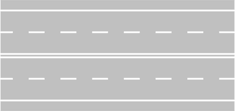
- **📖 الترجمة السياقية:** يجوز للمركبات التي تسير في منعطف على طريق بمسارين لكل اتجاه سير كما في الشكل، أن تسير متجاوزة الخط المتقطع إذا كان الطريق خالياً.
- **💡 الشرح والقاعدة المرورية:** خطأ (FALSO). المادة 143 تلزم المركبات بالسير التام داخل حدود مسارها وعدم ركوب أو تخطي الخطوط المحددة للمسارات في المنعطفات حتى لو كان الخط متقطعاً والطريق خالياً.
- **⚠️ كشف الفخ:** تخطي الخط المتقطع في المنعطف دون مبرر التجاوز ممنوع، وخلو الطريق لا يبيح السير فوق الخطوط الفاصلة.
- **🔑 الكلمات المفتاحية:** `{'it': 'curva', 'ar': 'منعطف'}` | `{'it': 'oltrepassando la striscia', 'ar': 'متجاوزاً الخط الفاصل'}` | `{'it': 'striscia discontinua', 'ar': 'خط متقطع'}`

---

**171.** I veicoli che vogliono effettuare una svolta a sinistra devono tenersi il più possibile vicino al margine destro della carreggiata
- **الإجابة:** `FALSO ❌ (خطأ)`
- **📖 الترجمة السياقية:** يجب على المركبات التي ترغب في الانعطاف إلى اليسار التزام أقصى نقطة ممكنة من الحافة اليمنى للقارعة.
- **💡 الشرح والقاعدة المرورية:** خطأ (FALSO). تكرار لقاعدة الانعطاف: الانعطاف يساراً يتطلب التقرب من خط المنتصف في الاتجاهين، أو أقصى اليسار في الاتجاه الواحد. التزام الحافة اليمنى مخصص للانعطاف يميناً فقط.
- **⚠️ كشف الفخ:** الالتزام بالحافة اليمنى مخصص للانعطاف يميناً، والانعطاف يساراً من الحافة اليمنى يشكل خطراً فادحاً لقطعه مسار السير.
- **🔑 الكلمات المفتاحية:** `{'it': 'svolta a sinistra', 'ar': 'الانعطاف يساراً'}` | `{'it': 'margine destro', 'ar': 'الحافة اليمنى'}` | `{'it': 'manovra errata', 'ar': 'مناورة خاطئة'}`

---

**172.** I filobus devono, di norma, circolare il più possibile vicino al margine sinistro della carreggiata
- **الإجابة:** `FALSO ❌ (خطأ)`
- **📖 الترجمة السياقية:** يجب على مركبات الترولي باص (filobus)، كقاعدة عامة، السير في أقرب نقطة ممكنة من الحافة اليسرى للقارعة.
- **💡 الشرح والقاعدة المرورية:** خطأ (FALSO). تنطبق قاعدة الالتزام بأقصى اليمين على جميع المركبات دون استثناء، بما في ذلك مركبات الترولي باص والحافلات؛ فلا تسير أي مركبة بمحاذاة الحافة اليسرى.
- **⚠️ كشف الفخ:** مركبات الترولي باص تخضع لنفس قواعد السير العادي على الجانب الأيمن من الطريق.
- **🔑 الكلمات المفتاحية:** `{'it': 'filobus', 'ar': 'ترولي باص (حافلة كهربائية)'}` | `{'it': 'margine sinistro', 'ar': 'الحافة اليسرى (خاطئ)'}` | `{'it': 'margine destro', 'ar': 'الحافة اليمنى'}`

---

**173.** Su strade a 2 corsie per senso di marcia, in caso di intenso traffico i ciclomotori possono circolare sulla corsia di sinistra
- **الإجابة:** `FALSO ❌ (خطأ)`
- 
- **📖 الترجمة السياقية:** على الطرق ذات مسارين لكل اتجاه سير، في حال وجود ازدحام مروري، يجوز للدراجات النارية الصغيرة (ciclomotori) السير في المسار الأيسر.
- **💡 الشرح والقاعدة المرورية:** خطأ (FALSO). بموجب المادة 143، يجب على الدراجات النارية الصغيرة (ciclomotori) ومركبات النقل البطيئة السير دائماً في المسار الأيمن، ولا يُسمح لها بشغل المسار الأيسر حتى في حالات الازدحام.
- **⚠️ كشف الفخ:** الدراجات النارية الصغيرة ممنوعة من السير في المسار الأيسر المخصص للمركبات الأسرع والتجاوز.
- **🔑 الكلمات المفتاحية:** `{'it': 'ciclomotori', 'ar': 'دراجات نارية صغيرة'}` | `{'it': 'corsia di sinistra', 'ar': 'المسار الأيسر'}` | `{'it': 'intenso traffico', 'ar': 'ازدحام مروري'}`

---

**174.** In una carreggiata come in figura in caso di intenso traffico, ciclomotori e motocicli possono circolare sulla pista ciclabile se non superano la velocità di 20 km/h
- **الإجابة:** `FALSO ❌ (خطأ)`
- 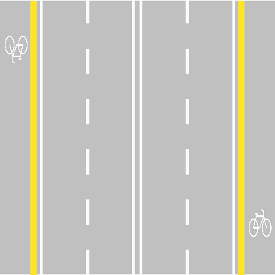
- **📖 الترجمة السياقية:** في قارعة طريق كما في الشكل، في حال وجود ازدحام مروري، يجوز للدراجات النارية الصغيرة والدراجات النارية السير في مسار الدراجات الهوائية (pista ciclabile) إذا لم تتجاوز سرعتها 20 كم/س.
- **💡 الشرح والقاعدة المرورية:** خطأ (FALSO). مسار الدراجات الهوائية (pista ciclabile، شكل 511) مخصص حصرياً للدراجات الهوائية (velocipedi)؛ ويُمنع منعاً باتاً دخول أي مركبة ذات محرك إليه مهما كانت الظروف أو السرعة.
- **⚠️ كشف الفخ:** تحديد سرعة 20 كم/س فخ تمويهي؛ فدخول مسار الدراجات الهوائية محظور مطلقاً على الدراجات النارية.
- **🔑 الكلمات المفتاحية:** `{'it': 'pista ciclabile', 'ar': 'مسار الدراجات الهوائية'}` | `{'it': 'ciclomotori e motocicli', 'ar': 'دراجات آلية ونارية'}` | `{'it': 'divieto assoluto', 'ar': 'حظر مطلق'}`

---

**175.** In caso di traffico intenso, i motocicli possono circolare sulle corsie di emergenza
- **الإجابة:** `FALSO ❌ (خطأ)`
- **📖 الترجمة السياقية:** في حال وجود ازدحام مروري كثيف، يجوز للدراجات النارية السير على مسارات الطوارئ (corsie di emergenza).
- **💡 الشرح والقاعدة المرورية:** خطأ (FALSO). مسار الطوارئ (corsia di emergenza) مخصص حصرياً لحالات العطل المفاجئ أو توقف المرض أو لمركبات الإسعاف والإنقاذ، ويحظر على الدراجات النارية أو غيرها السير فيه لتخطي الزحام.
- **⚠️ كشف الفخ:** مسار الطوارئ لا يُستخدم أبداً لتجاوز طوابير الزحام من قبل أي مركبة خاصة.
- **🔑 الكلمات المفتاحية:** `{'it': 'corsie di emergenza', 'ar': 'مسارات الطوارئ'}` | `{'it': 'motocicli', 'ar': 'دراجات نارية'}` | `{'it': 'traffico intenso', 'ar': 'ازدحام شديد'}`

---

**176.** Su strade a 2 corsie per senso di marcia, in caso di intenso traffico i ciclomotori a due ruote possono circolare sulla corsia di sinistra
- **الإجابة:** `FALSO ❌ (خطأ)`
- 
- **📖 الترجمة السياقية:** على الطرق ذات مسارين لكل اتجاه سير، في حال وجود ازدحام مروري، يجوز للدراجات النارية الصغيرة ذات العجلتين السير في المسار الأيسر.
- **💡 الشرح والقاعدة المرورية:** خطأ (FALSO). الدراجات النارية الصغيرة (ciclomotori a due ruote) ملزمة قانوناً بالسير في المسار الأكثر يمينية ولا يجوز لها شغل المسار الأيسر حتى أثناء الازدحام.
- **⚠️ كشف الفخ:** تأكيد ثانٍ لمنع الدراجات الصغيرة ذات العجلتين من شغل المسار الأيسر.
- **🔑 الكلمات المفتاحية:** `{'it': 'ciclomotori a due ruote', 'ar': 'دراجات صغيرة ذات عجلتين'}` | `{'it': 'corsia di sinistra', 'ar': 'المسار الأيسر'}` | `{'it': 'corsia di destra', 'ar': 'المسار الأيمن'}`

---

## 📌 Attenzione cambio corsia (11 domande)

**177.** Quando si vuole cambiare corsia non si deve creare intralcio o pericolo a chi si trova sulla corsia da impegnare
- **الإجابة:** `VERO ✅ (صح)`
- **📖 الترجمة السياقية:** عند الرغبة في تغيير المسار، يجب عدم خلق عرقلة (intralcio) أو خطر (pericolo) لمن يتواجد بالفعل في المسار المراد دخوله.
- **💡 الشرح والقاعدة المرورية:** صحيح (VERO). تنص المادة 154 على أن تغيير المسار مناورة ثانوية تخضع لأولوية السير للمركبات الموجودة بالفعل في ذلك المسار، ويحظر إجبارها على الفرملة أو الانحراف.
- **⚠️ كشف الفخ:** عدم إحداث عرقلة أو خطر التزام جوهري عند الانتقال بين المسارات.
- **🔑 الكلمات المفتاحية:** `{'it': 'cambiare corsia', 'ar': 'تغيير المسار'}` | `{'it': 'non creare intralcio', 'ar': 'عدم خلق عرقلة'}` | `{'it': 'pericolo', 'ar': 'خطر'}`

---

**178.** Quando si vuole cambiare corsia si deve segnalare in anticipo la manovra da compiere
- **الإجابة:** `VERO ✅ (صح)`
- **📖 الترجمة السياقية:** عند الرغبة في تغيير المسار، يجب الإشارة مسبقاً (segnalare in anticipo) إلى المناورة المزمع القيام بها.
- **💡 الشرح والقاعدة المرورية:** صحيح (VERO). المادة 154 تلزم السائقين بتشغيل مؤشر الاتجاه (غماز) بوقت كافٍ قبل بدء أي تغيير للمسار لإخطار السائقين الآخرين وتفادي المفاجآت.
- **⚠️ كشف الفخ:** الإشارة المسبقة (in anticipo) ملزمة قانوناً قبل بدء الانحراف.
- **🔑 الكلمات المفتاحية:** `{'it': 'segnalare in anticipo', 'ar': 'الإشارة مسبقاً'}` | `{'it': 'manovra da compiere', 'ar': 'المناورة المراد تنفيذها'}` | `{'it': 'indicatore di direzione', 'ar': 'مؤشر الاتجاه'}`

---

**179.** Quando si vuole cambiare corsia bisogna controllare che la corsia da impegnare sia libera davanti per un tratto sufficiente
- **الإجابة:** `VERO ✅ (صح)`
- **📖 الترجمة السياقية:** عند الرغبة في تغيير المسار، يجب التأكد من أن المسار المراد دخوله خالٍ من الأمام لمسافة كافية.
- **💡 الشرح والقاعدة المرورية:** صحيح (VERO). يجب التحقق من وجود مسافة أمان كافية أمام المركبة في المسار الجديد تسمح بالاندماج فيه بسلاسة ودون الاقتراب الخطر من المركبات الأمامية.
- **⚠️ كشف الفخ:** التحقق من خلو المسار من الأمام (libera davanti) خطوة أساسية لتقدير مسافة الأمان.
- **🔑 الكلمات المفتاحية:** `{'it': 'corsia da impegnare', 'ar': 'المسار المراد دخوله'}` | `{'it': 'libera davanti', 'ar': 'خالٍ من الأمام'}` | `{'it': 'tratto sufficiente', 'ar': 'مسافة كافية'}`

---

**180.** Quando si vuole cambiare corsia si deve controllare che la striscia che divide le corsie sia tratteggiata
- **الإجابة:** `VERO ✅ (صح)`
- **📖 الترجمة السياقية:** عند الرغبة في تغيير المسار، يجب التأكد من أن الخط الفاصل بين المسارات هو خط متقطع (striscia tratteggiata).
- **💡 الشرح والقاعدة المرورية:** صحيح (VERO). يُمنع تغيير المسار إذا كان الخط الفاصل متصلاً (striscia continua)، ويشترط أن يكون متقطعاً (tratteggiata / discontinua) للسماح بتخطيه قانوناً.
- **⚠️ كشف الفخ:** التأكد من أن الخط متقطع شرط نظامي إلزامي قبل الشروع في تبديل المسار.
- **🔑 الكلمات المفتاحية:** `{'it': 'striscia tratteggiata', 'ar': 'خط متقطع'}` | `{'it': 'striscia continua', 'ar': 'خط متصل'}` | `{'it': 'cambiare corsia', 'ar': 'تغيير المسار'}`

---

**181.** Quando si vuole cambiare corsia si deve segnalare la manovra, facendo uso dell'indicatore di direzione
- **الإجابة:** `VERO ✅ (صح)`
- **📖 الترجمة السياقية:** عند الرغبة في تغيير المسار، يجب الإشارة للمناورة باستخدام مؤشر الاتجاه (الغماز).
- **💡 الشرح والقاعدة المرورية:** صحيح (VERO). المادة 154 تلزم السائق باستخدام مؤشر الاتجاه المناسب طوال فترة الاستعداد وتنفيذ مناورة تغيير المسار.
- **⚠️ كشف الفخ:** استخدام مؤشر الاتجاه إلزامي ولا يُعفى منه السائق تحت أي ذريعة.
- **🔑 الكلمات المفتاحية:** `{'it': 'indicatore di direzione', 'ar': 'مؤشر الاتجاه'}` | `{'it': 'segnalare la manovra', 'ar': 'الإشارة للمناورة'}` | `{'it': 'cambio corsia', 'ar': 'تغيير المسار'}`

---

**182.** Quando si vuole cambiare corsia bisogna controllare che sulla corsia che si vuole occupare non stiano arrivando altri veicoli
- **الإجابة:** `VERO ✅ (صح)`
- **📖 الترجمة السياقية:** عند الرغبة في تغيير المسار، يجب التأكد من عدم قدوم مركبات أخرى في المسار المراد شغله.
- **💡 الشرح والقاعدة المرورية:** صحيح (VERO). يجب فحص مرايا الرؤية الخلفية والجانبية والتأكد من عدم اقتراب مركبات مسرعة أو وجود مركبة بمحاذاتنا في المنطقة العمياء قبل الانتقال.
- **⚠️ كشف الفخ:** فحص حركة المرور القادمة في المسار المراد دخوله إجراء وقائي حتمي.
- **🔑 الكلمات المفتاحية:** `{'it': 'non stiano arrivando altri veicoli', 'ar': 'عدم قدوم مركبات أخرى'}` | `{'it': 'corsia che si vuole occupare', 'ar': 'المسار المراد شغله'}` | `{'it': 'controllo visivo', 'ar': 'فحص بصري'}`

---

**183.** Nelle strade urbane è consentito, quando si vuole svoltare, circolare a cavallo delle strisce di corsia
- **الإجابة:** `FALSO ❌ (خطأ)`
- **📖 الترجمة السياقية:** في الطرق الحضرية، يُسمح عند الرغبة في الانعطاف بالسير فوق الخطوط المحددة للمسارات (a cavallo delle strisce).
- **💡 الشرح والقاعدة المرورية:** خطأ (FALSO). السير فوق خطوط المسارات (a cavallo delle strisce) ممنوع منعاً باتاً في جميع الأوقات وعلى كافة أنواع الطرق؛ ويجب السير دائماً بالكامل داخل مسار واحد محدد.
- **⚠️ كشف الفخ:** عبارة 'a cavallo delle strisce' (فوق الخط الفاصل / ركوب الخط) ممنوعة دائماً في قواعد المرور.
- **🔑 الكلمات المفتاحية:** `{'it': 'a cavallo delle strisce', 'ar': 'فوق خطوط المسارات (ركوب الخط)'}` | `{'it': 'strade urbane', 'ar': 'طرق حضرية داخل المدينة'}` | `{'it': 'divieto assoluto', 'ar': 'حظر مطلق'}`

---

**184.** Quando si vuole cambiare corsia l'uso dell'indicatore di direzione è facoltativo se ci sono le strisce discontinue (tratteggiate)
- **الإجابة:** `FALSO ❌ (خطأ)`
- **📖 الترجمة السياقية:** عند الرغبة في تغيير المسار، يكون استخدام مؤشر الاتجاه اختيارياً (facoltativo) إذا كانت الخطوط متقطعة.
- **💡 الشرح والقاعدة المرورية:** خطأ (FALSO). استخدام مؤشر الاتجاه ليس اختيارياً أبداً؛ بل هو إلزامي إجباري (obbligatorio) في كل تغيير للمسار حتى مع وجود خطوط متقطعة.
- **⚠️ كشف الفخ:** كلمة 'facoltativo' (اختياري) فخ صريح؛ إشارات الاتجاه إجبارية دائماً.
- **🔑 الكلمات المفتاحية:** `{'it': 'facoltativo', 'ar': 'اختياري (خاطئ)'}` | `{'it': 'obbligatorio', 'ar': 'إلزامي / إجباري'}` | `{'it': 'indicatore di direzione', 'ar': 'مؤشر الاتجاه'}`

---

**185.** Quando si vuole cambiare corsia, per immettersi nella corsia di destra, non occorre alcuna particolare attenzione
- **الإجابة:** `FALSO ❌ (خطأ)`
- **📖 الترجمة السياقية:** عند الرغبة في تغيير المسار للدخول في المسار الأيمن، لا يلزم أي انتباه خاص.
- **💡 الشرح والقاعدة المرورية:** خطأ (FALSO). الانتقال إلى المسار الأيمن يتطلب نفس القدر من الحيطة والحذر الشديدين وفحص المرايا ومؤشر الاتجاه والتأكد من عدم وجود دراجات أو مركبات على اليمين.
- **⚠️ كشف الفخ:** عبارة 'non occorre alcuna particolare attenzione' تنفي مبدأ الحذر والحيطة المفروض على كل مناورة مرورية.
- **🔑 الكلمات المفتاحية:** `{'it': 'non occorre alcuna attenzione', 'ar': 'لا يلزم أي انتباه (خاطئ)'}` | `{'it': 'corsia di destra', 'ar': 'المسار الأيمن'}` | `{'it': 'massima prudenza', 'ar': 'أقصى درجات الحيطة'}`

---

**186.** In vicinanza degli incroci, come in figura si può sempre cambiare corsia fino alla striscia trasversale di arresto
- **الإجابة:** `FALSO ❌ (خطأ)`
- 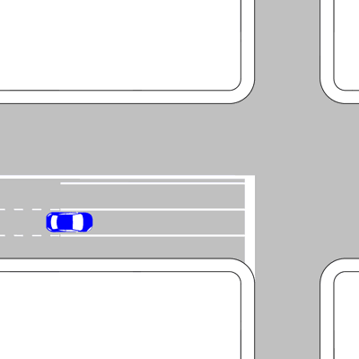
- **📖 الترجمة السياقية:** بالقرب من التقاطعات، كما في الشكل، يجوز دائماً تغيير المسار حتى خط التوقف العرضي (striscia trasversale di arresto).
- **💡 الشرح والقاعدة المرورية:** خطأ (FALSO). في التقاطعات المزودة بمسارات توجيهية (شكل 570)، تتحول الخطوط المتقطعة قبل التقاطع إلى خطوط متصلة (zona di arresto)، وعندها يُحظر تماماً تغيير المسار ويجب الالتزام بالمسار المحدد حتى عبور التقاطع.
- **⚠️ كشف الفخ:** كلمة 'sempre... fino alla striscia trasversale' خطأ، لأن الخط المتصل يمنع التغيير قبل خط التوقف بعدة أمتار.
- **🔑 الكلمات المفتاحية:** `{'it': 'striscia trasversale di arresto', 'ar': 'خط التوقف العرضي'}` | `{'it': 'sempre', 'ar': 'دائماً (فخ مضلل)'}` | `{'it': 'corsie di canalizzazione', 'ar': 'مسارات التوجيه والتحديد'}`

---

**187.** Quando si vuole cambiare corsia per un sorpasso è obbligatorio ridurre la velocità
- **الإجابة:** `FALSO ❌ (خطأ)`
- **📖 الترجمة السياقية:** عند الرغبة في تغيير المسار للقيام بالتجاوز، يجب إلزامياً تخفيض السرعة.
- **💡 الشرح والقاعدة المرورية:** خطأ (FALSO). التجاوز يتطلب زيادة ملائمة في السرعة لإنهاء المناورة بأسرع وقت وأمان؛ وتخفيض السرعة عند الانتقال لمسار التجاوز يعرقل المرور القادم من الخلف ويخلق خطراً جسيماً.
- **⚠️ كشف الفخ:** عبارة 'obbligatorio ridurre la velocità'؛ تخفيض السرعة أثناء الشروع في التجاوز تصرف غير منطقي وخطير.
- **🔑 الكلمات المفتاحية:** `{'it': 'ridurre la velocità', 'ar': 'تخفيض السرعة'}` | `{'it': 'sorpasso', 'ar': 'التجاوز'}` | `{'it': 'intralcio', 'ar': 'عرقلة'}`

---

## 📌 Svolte cambi direzioni (8 domande)

**188.** Quando si vuole cambiare direzione si deve azionare in anticipo l'indicatore di direzione
- **الإجابة:** `VERO ✅ (صح)`
- **📖 الترجمة السياقية:** عند الرغبة في تغيير الاتجاه، يجب تشغيل مؤشر الاتجاه مسبقاً (in anticipo).
- **💡 الشرح والقاعدة المرورية:** صحيح (VERO). تنص المادة 154 على وجوب الإعلان المسبق عن تغيير الاتجاه (svolta) باستخدام مؤشر الاتجاه في الوقت المناسب قبل الوصول إلى نقطة الانعطاف.
- **⚠️ كشف الفخ:** التشغيل المسبق لمؤشر الاتجاه واجب لتحذير حركة المرور خلفنا وأمامنا.
- **🔑 الكلمات المفتاحية:** `{'it': 'cambiare direzione', 'ar': 'تغيير الاتجاه'}` | `{'it': 'azionare in anticipo', 'ar': 'تشغيل مسبقاً'}` | `{'it': 'indicatore di direzione', 'ar': 'مؤشر الاتجاه'}`

---

**189.** Per svoltare a sinistra bisogna, di norma, lasciare il centro dell'incrocio alla nostra destra, come i veicoli in figura
- **الإجابة:** `VERO ✅ (صح)`
- 
- **📖 الترجمة السياقية:** للانعطاف إلى اليسار يجب، كقاعدة عامة، ترك مركز التقاطع على يميننا، كما تفعل المركبات في الشكل.
- **💡 الشرح والقاعدة المرورية:** صحيح (VERO). وفقاً للمادة 154 والشكل 601، في التقاطعات المعتادة غير المزودة بدوار، تنعطف المركبات يساراً بالمرور وجهاً لوجه وترك مركز التقاطع على اليمين (senza girare intorno al centro).
- **⚠️ كشف الفخ:** ترك مركز التقاطع على اليمين (lasciare il centro alla nostra destra) هي القاعدة الإيطالية النظامية للانعطاف يساراً في التقاطعات العادية.
- **🔑 الكلمات المفتاحية:** `{'it': 'svoltare a sinistra', 'ar': 'الانعطاف يساراً'}` | `{'it': "centro dell'incrocio a destra", 'ar': 'مركز التقاطع على اليمين'}` | `{'it': 'di norma', 'ar': 'كقاعدة عامة'}`

---

**190.** Su strada a senso unico per svoltare a sinistra bisogna tenersi sul margine sinistro
- **الإجابة:** `VERO ✅ (صح)`
- **📖 الترجمة السياقية:** على طريق ذي اتجاه واحد (strada a senso unico)، للانعطاف إلى اليسار يجب التزام الحافة اليسرى (margine sinistro).
- **💡 الشرح والقاعدة المرورية:** صحيح (VERO). في الطريق ذي الاتجاه الواحد، لا توجد مركبات قادمة في الاتجاه المقابل، لذا يلتزم السائق الراغب بالانعطاف يساراً بأقصى الحافة اليسرى للطريق لإفساح المجال لمرور المركبات الراغبة في التوجه للأمام أو اليمين.
- **⚠️ كشف الفخ:** في الطريق ذي الاتجاه الواحد نلتزم أقصى اليسار (margine sinistro)، بينما في الاتجاهين نقترب من خط المنتصف فقط.
- **🔑 الكلمات المفتاحية:** `{'it': 'strada a senso unico', 'ar': 'طريق ذو اتجاه واحد'}` | `{'it': 'svoltare a sinistra', 'ar': 'الانعطاف يساراً'}` | `{'it': 'margine sinistro', 'ar': 'الحافة اليسرى'}`

---

**191.** Durante l'effettuazione dell'inversione di marcia l'indicatore di direzione deve rimanere in funzione per l'intera durata della manovra
- **الإجابة:** `VERO ✅ (صح)`
- **📖 الترجمة السياقية:** أثناء تنفيذ مناورة الرجوع في الاتجاه المعاكس (inversione di marcia)، يجب أن يظل مؤشر الاتجاه مشتعلاً طوال مدة المناورة.
- **💡 الشرح والقاعدة المرورية:** صحيح (VERO). بموجب قواعد السلامة، مناورة الدوران للخلف (inversione) تشكل خطورة مستمرة وتتطلب إبقاء إشارة الاتجاه تعمل طوال مراحل تنفيذ الحركة لتنبيه جميع مستخدمي الطريق.
- **⚠️ كشف الفخ:** إبقاء مؤشر الاتجاه طوال مدة المناورة (intera durata della manovra) قاعدة أمان مؤكدة.
- **🔑 الكلمات المفتاحية:** `{'it': 'inversione di marcia', 'ar': 'الرجوع في الاتجاه المعاكس (الدوران للخلف)'}` | `{'it': 'indicatore di direzione', 'ar': 'مؤشر الاتجاه'}` | `{'it': 'intera durata', 'ar': 'كامل المدة'}`

---

**192.** Il veicolo in figura, può svoltare a destra
- **الإجابة:** `FALSO ❌ (خطأ)`
- 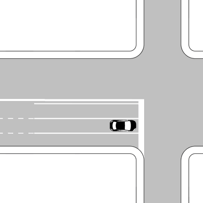
- **📖 الترجمة السياقية:** المركبة الموضحة في الشكل يجوز لها الانعطاف إلى اليمين.
- **💡 الشرح والقاعدة المرورية:** خطأ (FALSO). في الشكل 572، تتواجد المركبة في مسار موجه بأسهم تحدد السير إلى الأمام أو اليسار، أو في مسار لا يسمح بالانعطاف يميناً؛ وبموجب الأسهم الإلزامية على القارعة (frecce direzionali)، لا يجوز لها الانعطاف لليمين.
- **⚠️ كشف الفخ:** الأسهم الموجهة على المسار تلزم باتباع اتجاهها، ولا يجوز الانعطاف لليمين من مسار غير مخصص لذلك.
- **🔑 الكلمات المفتاحية:** `{'it': 'svoltare a destra', 'ar': 'الانعطاف يميناً'}` | `{'it': 'frecce direzionali', 'ar': 'أسهم التوجيه الإلزامية'}` | `{'it': 'corsia canalizzata', 'ar': 'مسار توجيهي محدد'}`

---

**193.** Per svoltare a sinistra bisogna girare intorno al centro dell'incrocio, come i veicoli in figura
- **الإجابة:** `FALSO ❌ (خطأ)`
- 
- **📖 الترجمة السياقية:** للانعطاف إلى اليسار يجب الدوران حول مركز التقاطع، كما تفعل المركبات في الشكل.
- **💡 الشرح والقاعدة المرورية:** خطأ (FALSO). في الشكل 599، تلتف المركبات حول مركز التقاطع وتتركه على يسارها، وهذا خلاف القاعدة العامة في التقاطعات المعتادة بدون دوار، حيث القاعدة هي ترك المركز على اليمين والعبور المتوازي.
- **⚠️ كشف الفخ:** الدوران حول المركز (girare intorno al centro) يُطبق فقط في الدوار (rotatoria)، وليس في التقاطعات المتقاطعة العادية.
- **🔑 الكلمات المفتاحية:** `{'it': 'girare intorno al centro', 'ar': 'الدوران حول مركز التقاطع'}` | `{'it': 'svolta a sinistra', 'ar': 'الانعطاف يساراً'}` | `{'it': 'regola ordinaria', 'ar': 'القاعدة المعتادة'}`

---

**194.** Quando si vuole cambiare direzione è obbligatorio fare uso delle segnalazioni acustiche (clacson o trombe)
- **الإجابة:** `FALSO ❌ (خطأ)`
- **📖 الترجمة السياقية:** عند الرغبة في تغيير الاتجاه، يجب إلزامياً استخدام الإشارات الصوتية (البوق / clacson).
- **💡 الشرح والقاعدة المرورية:** خطأ (FALSO). تغيير الاتجاه يتم الإشعار عنه حصرياً عبر مؤشر الاتجاه الضوئي (indicatore di direzione)، واستخدام المنبه الصوتي ممنوع في مثل هذه المناورات.
- **⚠️ كشف الفخ:** استخدام المنبه الصوتي (segnalazioni acustiche) ليس وسيلة لتغيير الاتجاه إطلاقاً.
- **🔑 الكلمات المفتاحية:** `{'it': 'cambiare direzione', 'ar': 'تغيير الاتجاه'}` | `{'it': 'segnalazioni acustiche', 'ar': 'إشارات صوتية (خاطئ)'}` | `{'it': 'clacson o trombe', 'ar': 'بوق'}`

---

**195.** Viaggiando su semicarreggiata a tre corsie, come in figura, per svoltare a sinistra si deve utilizzare la corsia centrale
- **الإجابة:** `FALSO ❌ (خطأ)`
- 
- **📖 الترجمة السياقية:** عند السير على نصف قارعة بثلاثة مسارات كما في الشكل، يجب استخدام المسار الأوسط للانعطاف إلى اليسار.
- **💡 الشرح والقاعدة المرورية:** خطأ (FALSO). في القارعة المقسمة إلى مسارات توجيهية (شكل 572)، يجب استخدام المسار الأيسر المخصص حصرياً للانعطاف يساراً، بينما المسار الأوسط مخصص للسير للأمام فقط.
- **⚠️ كشف الفخ:** الانعطاف يساراً يتم من المسار الأيسر وليس من المسار الأوسط (corsia centrale).
- **🔑 الكلمات المفتاحية:** `{'it': 'semicarreggiata a tre corsie', 'ar': 'نصف قارعة بثلاثة مسارات'}` | `{'it': 'svoltare a sinistra', 'ar': 'الانعطاف يساراً'}` | `{'it': 'corsia centrale', 'ar': 'المسار الأوسط (خاطئ)'}`

---

## 📌 Strada doppio senso marcia (6 domande)

**196.** Su una strada a doppio senso di marcia per svoltare a sinistra non si deve prendere contromano la strada in cui si svolta
- **الإجابة:** `VERO ✅ (صح)`
- **📖 الترجمة السياقية:** على طريق ذي اتجاهين للسير، عند الانعطاف إلى اليسار يجب عدم الدخول في عكس الاتجاه (contromano) في الطريق المراد الانعطاف إليه.
- **💡 الشرح والقاعدة المرورية:** صحيح (VERO). بموجب المادة 154 من كود السير، عند الانعطاف يساراً يجب توجيه المركبة بدقة للدخول في النصف الأيمن من القارعة الجديدة (corsia di destra) وتفادي قطع المنعطف بزاوية حادة تجعل المركبة تدخل في مسار حركة المرور المعاكسة.
- **⚠️ كشف الفخ:** عدم الدخول في عكس الاتجاه في الطريق الجديد (non prendere contromano) واجب بديهي لحماية السلامة.
- **🔑 الكلمات المفتاحية:** `{'it': 'svoltare a sinistra', 'ar': 'الانعطاف يساراً'}` | `{'it': 'non prendere contromano', 'ar': 'عدم الدخول عكس الاتجاه'}` | `{'it': 'doppio senso', 'ar': 'اتجاهان للسير'}`

---

**197.** Su una strada a doppio senso di marcia nello svoltare a sinistra si deve, di norma, lasciare il centro dell'incrocio alla nostra destra, come i veicoli in figura
- **الإجابة:** `VERO ✅ (صح)`
- 
- **📖 الترجمة السياقية:** على طريق ذي اتجاهين للسير، عند الانعطاف إلى اليسار يجب، كقاعدة عامة، ترك مركز التقاطع على يميننا، كما تفعل المركبات في الشكل.
- **💡 الشرح والقاعدة المرورية:** صحيح (VERO). وفقاً للشكل 601، في التقاطعات التقليدية غير المزودة بدوار، تنعطف المركبات يساراً بحيث تتقابل وجهاً لوجه وتترك مركز التقاطع على يمينها (senza girare attorno al centro)، لتفادي التقاطع والتعارض بين مسارات الحركة.
- **⚠️ كشف الفخ:** ترك المركز على اليمين (lasciare il centro alla nostra destra) هو المسار النظامي للانعطاف لليسار في التقاطعات المعتادة.
- **🔑 الكلمات المفتاحية:** `{'it': 'lasciare il centro a destra', 'ar': 'ترك المركز على اليمين'}` | `{'it': 'svolta a sinistra', 'ar': 'الانعطاف يساراً'}` | `{'it': 'doppio senso', 'ar': 'اتجاهان للسير'}`

---

**198.** Su una strada a doppio senso di marcia per svoltare a sinistra occorre inserirsi nelle corsie che consentono di proseguire in tale direzione
- **الإجابة:** `VERO ✅ (صح)`
- **📖 الترجمة السياقية:** على طريق ذي اتجاهين للسير، للانعطاف إلى اليسار يجب الدخول في المسارات التي تسمح بمتابعة السير في ذلك الاتجاه.
- **💡 الشرح والقاعدة المرورية:** صحيح (VERO). عند وجود مسارات توجيهية (corsie di canalizzazione)، يجب على السائق التمركز في المسار المخصص للانعطاف يساراً الموضح بالأسهم الأرضية (frecce direzionali).
- **⚠️ كشف الفخ:** اختيار المسار المخصص للانعطاف التزام مسبق تفرضه علامات السير الأرضية.
- **🔑 الكلمات المفتاحية:** `{'it': 'inserirsi nelle corsie', 'ar': 'الدخول في المسارات'}` | `{'it': 'proseguire in tale direzione', 'ar': 'متابعة السير في ذلك الاتجاه'}` | `{'it': 'preselezione', 'ar': 'الاختيار المسبق للمسار'}`

---

**199.** Su una strada a doppio senso di marcia per svoltare a sinistra è necessario spostarsi a sinistra della linea continua di mezzeria
- **الإجابة:** `FALSO ❌ (خطأ)`
- **📖 الترجمة السياقية:** على طريق ذي اتجاهين للسير، للانعطاف إلى اليسار من الضروري الانتقال إلى يسار الخط المتصل المنصف للطريق (linea continua di mezzeria).
- **💡 الشرح والقاعدة المرورية:** خطأ (FALSO). الخط المتصل المنصف للطريق (linea continua di mezzeria) يُحظر تماماً قطعه أو تجاوزه، والانتقال إلى يساره يعد سيراً في عكس الاتجاه ومخالفة مرورية جسيمة؛ ويجب البقاء دائماً على يمين الخط والاقتراب منه فقط.
- **⚠️ كشف الفخ:** الانتقال إلى يسار الخط المتصل (a sinistra della linea continua) ممنوع قانوناً وبشكل قاطع.
- **🔑 الكلمات المفتاحية:** `{'it': 'linea continua di mezzeria', 'ar': 'الخط المتصل المنصف للطريق'}` | `{'it': 'spostarsi a sinistra', 'ar': 'الانتقال إلى اليسار (خاطئ)'}` | `{'it': 'divieto di oltrepassare', 'ar': 'حظر التخطي'}`

---

**200.** Su una strada a doppio senso di marcia per svoltare a sinistra ci si deve tenere lungo il margine destro della carreggiata
- **الإجابة:** `FALSO ❌ (خطأ)`
- **📖 الترجمة السياقية:** على طريق ذي اتجاهين للسير، للانعطاف إلى اليسار يجب البقاء بمحاذاة الحافة اليمنى للقارعة.
- **💡 الشرح والقاعدة المرورية:** خطأ (FALSO). للانعطاف يساراً في طريق باتجاهين، يجب الاقتراب من خط المنتصف، والبقاء على الحافة اليمنى مخصص فقط لمن يرغب في الانعطاف يميناً أو الاستمرار في السير للأمام.
- **⚠️ كشف الفخ:** البقاء بمحاذاة الحافة اليمنى خطأ للانعطاف يساراً، لأنه يقطع مسار المركبات المتجهة للأمام عند الالتفاف.
- **🔑 الكلمات المفتاحية:** `{'it': 'svolta a sinistra', 'ar': 'الانعطاف يساراً'}` | `{'it': 'margine destro', 'ar': 'الحافة اليمنى (خاطئ)'}` | `{'it': 'centro strada', 'ar': 'وسط الطريق'}`

---

**201.** Su una strada a doppio senso di marcia per svoltare a sinistra è necessario arrestarsi prima di completare la manovra, anche se non sopraggiungono veicoli
- **الإجابة:** `FALSO ❌ (خطأ)`
- **📖 الترجمة السياقية:** على طريق ذي اتجاهين للسير، للانعطاف إلى اليسار من الضروري التوقف قبل إتمام المناورة، حتى لو لم تكن هناك مركبات قادمة.
- **💡 الشرح والقاعدة المرورية:** خطأ (FALSO). لا يُلزم السائق بالتوقف التام (arrestarsi) قبل الانعطاف يساراً إلا إذا كانت هناك مركبات قادمة من اليمين أو من الاتجاه المقابل يجب إعطاؤها حق الأولوية؛ فإذا كان الطريق خالياً تماماً تُنفذ المناورة ببطء وحذر دون توقف إجباري.
- **⚠️ كشف الفخ:** عبارة 'anche se non sopraggiungono veicoli' تجعل العبارة خاطئة؛ فالتوقف ليس إلزامياً إذا كان التقاطع خالياً تماماً.
- **🔑 الكلمات المفتاحية:** `{'it': 'arrestarsi', 'ar': 'التوقف التام'}` | `{'it': 'anche se non sopraggiungono', 'ar': 'حتى لو لم تكن قادمة مركبات (فخ)'}` | `{'it': 'completare la manovra', 'ar': 'إتمام المناورة'}`

---

## 📌 Durante marcia (16 domande)

**202.** Percorrendo una carreggiata a senso unico la svolta a sinistra si effettua segnalando in anticipo la manovra da compiere
- **الإجابة:** `VERO ✅ (صح)`
- **📖 الترجمة السياقية:** عند السير في قارعة ذات اتجاه واحد (senso unico)، يتم الانعطاف إلى اليسار بالإشارة مسبقاً إلى المناورة المزمع القيام بها.
- **💡 الشرح والقاعدة المرورية:** صحيح (VERO). الإشارة المسبقة بمؤشر الاتجاه (الغماز) إلزامية في كافة الطرق، بما فيها الطرق ذات الاتجاه الواحد، قبل بدء الانعطاف بوقت كافٍ.
- **⚠️ كشف الفخ:** الإشارة المسبقة (segnalando in anticipo) قاعدة دائمة في كل انعطاف.
- **🔑 الكلمات المفتاحية:** `{'it': 'carreggiata a senso unico', 'ar': 'قارعة ذات اتجاه واحد'}` | `{'it': 'svolta a sinistra', 'ar': 'الانعطاف يساراً'}` | `{'it': 'segnalando in anticipo', 'ar': 'بالإشارة مسبقاً'}`

---

**203.** Durante la marcia per file parallele è consentito cambiare corsia per effettuare manovre di svolta.
- **الإجابة:** `VERO ✅ (صح)`
- **📖 الترجمة السياقية:** أثناء السير في طوابير متوازية (file parallele)، يُسمح بتغيير المسار للقيام بمناورات الانعطاف.
- **💡 الشرح والقاعدة المرورية:** صحيح (VERO). بموجب المادة 144 من كود السير، عند السير في طوابير متوازية، يجب على السائقين البقاء في مسارهم، لكن يُستثنى من ذلك ويُسمح بالانتقال بين المسارات فقط عند الاستعداد لتنفيذ انعطاف (svolta).
- **⚠️ كشف الفخ:** تغيير المسار في الطوابير المتوازية ممنوع للتخطي، ولكنه مسموح حصرياً لغرض الانعطاف (per effettuare manovre di svolta).
- **🔑 الكلمات المفتاحية:** `{'it': 'file parallele', 'ar': 'طوابير متوازية'}` | `{'it': 'cambiare corsia', 'ar': 'تغيير المسار'}` | `{'it': 'manovre di svolta', 'ar': 'مناورات الانعطاف'}`

---

**204.** La marcia per file parallele è ammessa quando viene autorizzata dagli agenti del traffico
- **الإجابة:** `VERO ✅ (صح)`
- **📖 الترجمة السياقية:** يُسمح بالسير في طوابير متوازية عندما يأذن بذلك رجال تنظيم المرور (agenti del traffico).
- **💡 الشرح والقاعدة المرورية:** صحيح (VERO). تعليمات وإشارات رجال الشرطة والمرور تعلو كافة القواعد والإشارات، ولهم صلاحية السماح بتسيير المركبات في طوابير متوازية لتسهيل تدفق السير.
- **⚠️ كشف الفخ:** إذن رجال المرور (autorizzata dagli agenti) يجيز السير في صفوف متوازية قانوناً.
- **🔑 الكلمات المفتاحية:** `{'it': 'file parallele', 'ar': 'طوابير متوازية'}` | `{'it': 'agenti del traffico', 'ar': 'رجال المرور'}` | `{'it': 'autorizzata', 'ar': 'مأذون بها / مصرح بها'}`

---

**205.** E' consentita la marcia per file parallele su strade a due corsie per senso di marcia ad un incrocio regolato da semaforo
- **الإجابة:** `VERO ✅ (صح)`
- **📖 الترجمة السياقية:** يُسمح بالسير في طوابير متوازية على الطرق ذات مسارين لكل اتجاه سير عند تقاطع منظم بإشارة ضوئية (semaforo).
- **💡 الشرح والقاعدة المرورية:** صحيح (VERO). وفقاً للمادة 144، يُسمح بالسير في طوابير متوازية عند الاقتراب من التقاطعات المنظمة بإشارات ضوئية، بشرط توفر مسارين على الأقل مخصصين لنفس الاتجاه.
- **⚠️ كشف الفخ:** وجود الإشارة الضوئية مع مسارين لكل اتجاه يتيح قانوناً السير في طوابير متوازية.
- **🔑 الكلمات المفتاحية:** `{'it': 'due corsie per senso', 'ar': 'مساران لكل اتجاه'}` | `{'it': 'incrocio regolato da semaforo', 'ar': 'تقاطع منظم بإشارة ضوئية'}` | `{'it': 'file parallele', 'ar': 'طوابير متوازية'}`

---

**206.** Su strade con almeno due corsie per senso di marcia, come in figura, qualora il traffico sia intenso, si può viaggiare per file parallele
- **الإجابة:** `VERO ✅ (صح)`
- 
- **📖 الترجمة السياقية:** على الطرق التي تحتوي على مسارين على الأقل لكل اتجاه سير، كما في الشكل، يجوز السير في طوابير متوازية إذا كانت حركة المرور كثيفة.
- **💡 الشرح والقاعدة المرورية:** صحيح (VERO). في حالات الازدحام المروري الكثيف (traffico intenso)، تجيز المادة 144 السير في طوابير متوازية على الطرق التي تضم مسارين أو أكثر لنفس الاتجاه (شكل 550).
- **⚠️ كشف الفخ:** كثافة المرور مع وجود مسارين على الأقل لنفس الاتجاه هي الحالة النموذجية للسير في طوابير متوازية.
- **🔑 الكلمات المفتاحية:** `{'it': 'almeno due corsie per senso', 'ar': 'مساران على الأقل لكل اتجاه'}` | `{'it': 'traffico sia intenso', 'ar': 'المرور كثيف'}` | `{'it': 'file parallele', 'ar': 'طوابير متوازية'}`

---

**207.** Di norma, è consentito viaggiare per file parallele lungo il tratto di strada che porta ad un incrocio regolato da agenti del traffico
- **الإجابة:** `VERO ✅ (صح)`
- **📖 الترجمة السياقية:** كقاعدة عامة، يُسمح بالسير في طوابير متوازية على مقطع الطريق المؤدي إلى تقاطع منظم بواسطة رجال المرور.
- **💡 الشرح والقاعدة المرورية:** صحيح (VERO). على مسار الاقتراب من تقاطع يديره شرطي مرور، يُسمح للمركبات بالانتظام في صفوف متوازية حسب المسارات لتسهيل توجيهها وعبورها السريع.
- **⚠️ كشف الفخ:** الاقتراب من تقاطع يديره رجل مرور يجيز الاصطفاف في طوابير متوازية.
- **🔑 الكلمات المفتاحية:** `{'it': 'tratto di strada', 'ar': 'مقطع من الطريق'}` | `{'it': 'regolato da agenti', 'ar': 'منظم بواسطة رجال المرور'}` | `{'it': 'file parallele', 'ar': 'طوابير متوازية'}`

---

**208.** In condizioni di traffico intenso su carreggiata a senso unico a tre corsie, come in figura, è consentito viaggiare per file parallele
- **الإجابة:** `VERO ✅ (صح)`
- 
- **📖 الترجمة السياقية:** في ظروف حركة المرور الكثيفة، على قارعة ذات اتجاه واحد وثلاثة مسارات كما في الشكل، يُسمح بالسير في طوابير متوازية.
- **💡 الشرح والقاعدة المرورية:** صحيح (VERO). عند وجود ثلاثة مسارات في اتجاه واحد (شكل 554 بصفته قارعة باتجاه واحد)، ومع كثافة حركة المرور، يُسمح قانوناً باستغلال كافة المسارات والسير في طوابير متوازية.
- **⚠️ كشف الفخ:** توفر اتجاه واحد مع 3 مسارات وازدحام مروري يحقق الشروط الكاملة للسير في طوابير متوازية.
- **🔑 الكلمات المفتاحية:** `{'it': 'traffico intenso', 'ar': 'مرور كثيف'}` | `{'it': 'senso unico a tre corsie', 'ar': 'اتجاه واحد بثلاثة مسارات'}` | `{'it': 'file parallele', 'ar': 'طوابير متوازية'}`

---

**209.** Percorrendo una carreggiata a senso unico la svolta a sinistra si effettua immettendosi in una corsia qualsiasi, se si viaggia per file parallele
- **الإجابة:** `FALSO ❌ (خطأ)`
- **📖 الترجمة السياقية:** عند السير في قارعة ذات اتجاه واحد، يتم الانعطاف إلى اليسار بالدخول في أي مسار كان، إذا كنا نسير في طوابير متوازية.
- **💡 الشرح والقاعدة المرورية:** خطأ (FALSO). حتى أثناء السير في طوابير متوازية، يجب على السائق الراغب في الانعطاف يساراً الانتقال في الوقت المناسب إلى المسار الأقصى لليسار، ولا يجوز له الانعطاف من أي مسار عشوائي.
- **⚠️ كشف الفخ:** عبارة 'immettendosi in una corsia qualsiasi' خاطئة تماماً؛ فالانعطاف يساراً يفرض حتماً التواجد في المسار الأيسر.
- **🔑 الكلمات المفتاحية:** `{'it': 'corsia qualsiasi', 'ar': 'أي مسار كان (خاطئ)'}` | `{'it': 'svolta a sinistra', 'ar': 'الانعطاف يساراً'}` | `{'it': 'corsia corretta', 'ar': 'المسار الصحيح'}`

---

**210.** E' consentito viaggiare per file parallele lungo il tratto di strada che porta ad un incrocio non regolato da semaforo o da agenti del traffico
- **الإجابة:** `FALSO ❌ (خطأ)`
- **📖 الترجمة السياقية:** يُسمح بالسير في طوابير متوازية على مقطع الطريق المؤدي إلى تقاطع غير منظم بإشارة ضوئية أو برجال المرور.
- **💡 الشرح والقاعدة المرورية:** خطأ (FALSO). التقاطعات غير المنظمة (non regolato da semaforo o vigili) لا يُسمح فيها بالسير في طوابير متوازية لمجرد الاقتراب من التقاطع، بل تسري قواعد السير العادي والتزام المسار الأيمن إلا في حال الكثافة المرورية الشديدة المقرونة بعدة مسارات.
- **⚠️ كشف الفخ:** كلمة 'non regolato' (غير منظم)؛ الطوابير المتوازية عند التقاطعات تشترط وجود إشارة ضوئية أو شرطي.
- **🔑 الكلمات المفتاحية:** `{'it': 'non regolato', 'ar': 'غير منظم'}` | `{'it': 'incrocio', 'ar': 'تقاطع'}` | `{'it': 'divieto file parallele', 'ar': 'منع الطوابير المتوازية'}`

---

**211.** E' consentito viaggiare per file parallele su strada con due corsie e doppio senso di marcia, come quella in figura
- **الإجابة:** `FALSO ❌ (خطأ)`
- 
- **📖 الترجمة السياقية:** يُسمح بالسير في طوابير متوازية على طريق ذي مسارين واتجاهين للسير، كالطريق الموضح في الشكل.
- **💡 الشرح والقاعدة المرورية:** خطأ (FALSO). في طريق بمسارين باتجاهين (شكل 502)، يوجد مسار واحد فقط لكل اتجاه، ولا يمكن مطلقاً السير في طوابير متوازية لأن ذلك يعني السير في مسار الاتجاه المعاكس واصطداماً محققاً.
- **⚠️ كشف الفخ:** الطريق بمسارين باتجاهين لا يسمح أبداً بصفوف متوازية لعدم وجود مسارين لنفس الاتجاه.
- **🔑 الكلمات المفتاحية:** `{'it': 'due corsie e doppio senso', 'ar': 'مساران واتجاهان'}` | `{'it': 'file parallele', 'ar': 'طوابير متوازية'}` | `{'it': 'impossibile', 'ar': 'مستحيل وممنوع'}`

---

**212.** E' sempre consentito viaggiare per file parallele se la carreggiata a doppio senso ha almeno due corsie per ogni senso di marcia, come quella in figura
- **الإجابة:** `FALSO ❌ (خطأ)`
- 
- **📖 الترجمة السياقية:** يُسمح دائماً بالسير في طوابير متوازية إذا كانت القارعة ذات الاتجاهين تحتوي على مسارين على الأقل لكل اتجاه سير، كما في الشكل.
- **💡 الشرح والقاعدة المرورية:** خطأ (FALSO). السير في طوابير متوازية ليس مسموحاً 'دائماً' (sempre)؛ بل يقتصر حصرياً على حالات الازدحام المروري الكثيف أو بتوجيه من شرطي مرور أو إشارة ضوئية، وفي الظروف العادية يجب السير في المسار الأيمن فقط.
- **⚠️ كشف الفخ:** كلمة 'sempre' (دائماً) هي فخ الخطأ هنا؛ فالسير في طوابير متوازية استثناء مشروط بالازدحام وليس خياراً متاحاً دائماً.
- **🔑 الكلمات المفتاحية:** `{'it': 'sempre consentito', 'ar': 'مسموح دائماً (فخ مضلل)'}` | `{'it': 'traffico normale', 'ar': 'مرور عادي'}` | `{'it': 'file parallele', 'ar': 'طوابير متوازية'}`

---

**213.** Nei centri urbani è consentito marciare per file parallele in qualunque condizione di traffico
- **الإجابة:** `FALSO ❌ (خطأ)`
- **📖 الترجمة السياقية:** في المراكز الحضرية (المدن)، يُسمح بالسير في طوابير متوازية في أي حالة من حالات حركة المرور.
- **💡 الشرح والقاعدة المرورية:** خطأ (FALSO). داخل المدن لا يجوز السير في طوابير متوازية 'في أي ظرف' (in qualunque condizione)، بل فقط في حالات الكثافة المرورية الشديدة أو عند التقاطعات المنظمة بإشارات ضوئية، ومع وجود مسارين على الأقل لنفس الاتجاه.
- **⚠️ كشف الفخ:** عبارة 'in qualunque condizione di traffico' خاطئة؛ فالأصل هو التزام المسار الأيمن ما لم يكن هناك ازدحام مبرر.
- **🔑 الكلمات المفتاحية:** `{'it': 'qualunque condizione', 'ar': 'أي ظرف كان (فخ)'}` | `{'it': 'centri urbani', 'ar': 'المراكز الحضرية'}` | `{'it': 'file parallele', 'ar': 'طوابير متوازية'}`

---

**214.** E' obbligatorio viaggiare per file parallele sulle carreggiate a tre corsie per senso di marcia, come quella in figura
- **الإجابة:** `FALSO ❌ (خطأ)`
- 
- **📖 الترجمة السياقية:** يجب إلزامياً السير في طوابير متوازية على القارعات ذات ثلاثة مسارات لكل اتجاه سير، كما في الشكل.
- **💡 الشرح والقاعدة المرورية:** خطأ (FALSO). السير في طوابير متوازية ليس إلزامياً (obbligatorio) بل هو رخصة وإمكانية (facoltà) تجوز فقط عند كثافة حركة المرور؛ والقاعدة العامة الملزمة هي السير في المسار الأكثر خلوّاً على اليمين.
- **⚠️ كشف الفخ:** كلمة 'obbligatorio' (إلزامي) فخ صريح؛ فالطوابير المتوازية ليست إلزاماً نظامياً بل خيار مقيد بالازدحام.
- **🔑 الكلمات المفتاحية:** `{'it': 'obbligatorio', 'ar': 'إلزامي (خاطئ)'}` | `{'it': 'tre corsie per senso', 'ar': 'ثلاثة مسارات لكل اتجاه'}` | `{'it': 'facoltà', 'ar': 'رخصة / خيار'}`

---

**215.** Durante la marcia per file parallele, percorrendo la corsia di sinistra, bisogna mantenere in funzione l'indicatore di direzione sinistro
- **الإجابة:** `FALSO ❌ (خطأ)`
- **📖 الترجمة السياقية:** أثناء السير في طوابير متوازية، عند السير في المسار الأيسر، يجب إبقاء مؤشر الاتجاه الأيسر مشتعلاً.
- **💡 الشرح والقاعدة المرورية:** خطأ (FALSO). مؤشر الاتجاه يُستخدم فقط للإعلان عن مناورة انتقال أو انعطاف ويُطفأ فور إتمامها، ولا يجوز إبقاؤه مشتعلاً أثناء السير للأمام داخل المسار لأن ذلك يضلل المركبات الأخرى.
- **⚠️ كشف الفخ:** إبقاء مؤشر الاتجاه مشتعلاً (mantenere in funzione l'indicatore) دون نية الانعطاف مخالف ومضلل للمرور.
- **🔑 الكلمات المفتاحية:** `{'it': 'mantenere in funzione', 'ar': 'إبقاء مشتعلاً (خاطئ)'}` | `{'it': 'indicatore di direzione sinistro', 'ar': 'مؤشر الاتجاه الأيسر'}` | `{'it': 'proseguire diritto', 'ar': 'متابعة السير للأمام'}`

---

**216.** La marcia per file parallele non è ammessa se la strada è a una sola carreggiata
- **الإجابة:** `FALSO ❌ (خطأ)`
- **📖 الترجمة السياقية:** لا يُسمح بالسير في طوابير متوازية إذا كان الطريق مكوناً من قارعة واحدة فقط.
- **💡 الشرح والقاعدة المرورية:** خطأ (FALSO). إذا كانت القارعة الواحدة تحتوي على مسارين أو أكثر لنفس الاتجاه (سواء كانت باتجاه واحد أو باتجاهين)، فإنه يُسمح بالسير في طوابير متوازية في حالات الازدحام المروري.
- **⚠️ كشف الفخ:** الشرط الأساسي للطوابير المتوازية هو عدد المسارات لنفس الاتجاه (corsie) وليس عدد القارعات (carreggiate).
- **🔑 الكلمات المفتاحية:** `{'it': 'una sola carreggiata', 'ar': 'قارعة واحدة فقط'}` | `{'it': 'non è ammessa', 'ar': 'غير مسموح بها (خاطئ)'}` | `{'it': 'file parallele', 'ar': 'طوابير متوازية'}`

---

**217.** Durante la marcia per file parallele i motocicli possono procedere passando tra i veicoli affiancati
- **الإجابة:** `FALSO ❌ (خطأ)`
- **📖 الترجمة السياقية:** أثناء السير في طوابير متوازية، يجوز للدراجات النارية التقدم بالمرور بين المركبات المصطفة جنباً إلى جنب.
- **💡 الشرح والقاعدة المرورية:** خطأ (FALSO). المرور بين خطوط السيارات (slalom / interlinea) محظور تماماً وخطير للغاية؛ ويجب على الدراجات النارية الاصطفاف بانتظام داخل مسارها خلف المركبات كأي مركبة أخرى.
- **⚠️ كشف الفخ:** المرور المتعرج بين السيارات المتجاورة (passando tra i veicoli affiancati) سلوك غير قانوني وعالي الخطورة.
- **🔑 الكلمات المفتاحية:** `{'it': 'motocicli', 'ar': 'دراجات نارية'}` | `{'it': 'veicoli affiancati', 'ar': 'مركبات متجاورة جنباً إلى جنب'}` | `{'it': 'divieto di slalom', 'ar': 'حظر التعرج بين السيارات'}`

---

## 📌 Obbligo precedenza (11 domande)

**218.** Agli incroci è obbligatorio dare la precedenza ai veicoli circolanti su rotaie (tram e treni), salvo diversa segnalazione
- **الإجابة:** `VERO ✅ (صح)`
- **📖 الترجمة السياقية:** عند التقاطعات، يجب إلزامياً إعطاء الأولوية للمركبات التي تسير على قضبان (الترام والقطارات)، ما لم توجد إشارات تخالف ذلك.
- **💡 الشرح والقاعدة المرورية:** صحيح (VERO). تنص المادة 145 من كود السير على أن مركبات السكك الحديدية والترام تسير على مسار ثابت ولها مسافة توقف أطول، لذا تتمتع دائماً بحق الأولوية على كافة المركبات العادية ما لم تقضِ إشارة خاصة بخلاف ذلك.
- **⚠️ كشف الفخ:** المركبات التي تسير على قضبان (veicoli circolanti su rotaie) لها الأسبقية النظامية دائماً.
- **🔑 الكلمات المفتاحية:** `{'it': 'veicoli su rotaie', 'ar': 'مركبات تسير على قضبان'}` | `{'it': 'tram e treni', 'ar': 'الترام والقطارات'}` | `{'it': 'obbligo di precedenza', 'ar': 'إلزامية إعطاء الأولوية'}`

---

**219.** E' obbligatorio dare la precedenza a destra e a sinistra quando, da fermi, ci si immette nella circolazione
- **الإجابة:** `VERO ✅ (صح)`
- **📖 الترجمة السياقية:** يجب إلزامياً إعطاء الأولوية لليمين واليسار عند الانطلاق من حالة التوقف التام للاندماج في حركة السير.
- **💡 الشرح والقاعدة المرورية:** صحيح (VERO). بموجب المادة 154، عند الانطلاق من الركن أو من جانب الطريق (immettersi nella circolazione)، تكون الأولوية لجميع المركبات السائرة بالفعل في الطريق، ويجب إعطاء الأسبقية لليمين واليسار معاً.
- **⚠️ كشف الفخ:** الاندماج في السير من وضع التوقف يفرض إعطاء الأولوية للجهتين (destra e sinistra) دون قيد.
- **🔑 الكلمات المفتاحية:** `{'it': 'da fermi', 'ar': 'من وضع التوقف'}` | `{'it': 'immettersi nella circolazione', 'ar': 'الاندماج في حركة السير'}` | `{'it': 'precedenza a destra e sinistra', 'ar': 'الأولوية لليمين واليسار'}`

---

**220.** E' obbligatorio dare la precedenza a tutti i veicoli circolanti sulle strade quando si effettua l'inversione del senso di marcia
- **الإجابة:** `VERO ✅ (صح)`
- **📖 الترجمة السياقية:** يجب إلزامياً إعطاء الأولوية لجميع المركبات التي تسير على الطريق عند إجراء مناورة الرجوع في الاتجاه المعاكس (inversione del senso di marcia).
- **💡 الشرح والقاعدة المرورية:** صحيح (VERO). مناورة الدوران للخلف (inversione) مناورة استثنائية عالية الخطورة؛ لذا تلزم المادة 154 السائق بإعطاء الأولوية المطلقة لكافة المركبات القادمة في كلا الاتجاهين قبل وأثناء تنفيذها.
- **⚠️ كشف الفخ:** مناورة الرجوع للخلف تفرض إعطاء الأسبقية لجميع المركبات (a tutti i veicoli) بدون استثناء.
- **🔑 الكلمات المفتاحية:** `{'it': 'inversione del senso di marcia', 'ar': 'الرجوع في الاتجاه المعاكس'}` | `{'it': 'tutti i veicoli', 'ar': 'جميع المركبات'}` | `{'it': 'dare la precedenza', 'ar': 'إعطاء الأولوية'}`

---

**221.** E' obbligatorio dare la precedenza a tutti i veicoli quando si effettua la retromarcia
- **الإجابة:** `VERO ✅ (صح)`
- **📖 الترجمة السياقية:** يجب إلزامياً إعطاء الأولوية لجميع المركبات عند إجراء مناورة الرجوع إلى الخلف (retromarcia).
- **💡 الشرح والقاعدة المرورية:** صحيح (VERO). الرجوع إلى الخلف (retromarcia) مناورة محدودة الرؤية وتلزم المادة 154 من يقوم بها بتقديم كافة المركبات ومستخدمي الطريق والتأكد من خلو المسار التام.
- **⚠️ كشف الفخ:** الرجوع للخلف يفرض التنازل عن الأولوية لجميع المركبات والمشاة بلا استثناء.
- **🔑 الكلمات المفتاحية:** `{'it': 'retromarcia', 'ar': 'الرجوع إلى الخلف'}` | `{'it': 'tutti i veicoli', 'ar': 'جميع المركبات'}` | `{'it': 'dare precedenza', 'ar': 'إعطاء الأولوية'}`

---

**222.** E' obbligatorio dare la precedenza a destra e a sinistra quando si esce da un passo carrabile
- **الإجابة:** `VERO ✅ (صح)`
- **📖 الترجمة السياقية:** يجب إلزامياً إعطاء الأولوية لليمين واليسار عند الخروج من مدخل خاص بالمركبات (passo carrabile).
- **💡 الشرح والقاعدة المرورية:** صحيح (VERO). الخارج من عقار خاص أو مدخل مرآب (passo carrabile) يدخل إلى طريق عام، وتنص المادة 145 على إلزامه بمنح الأولوية لكافة مستخدمي الطريق القادمين من اليمين ومن اليسار وكذلك المشاة.
- **⚠️ كشف الفخ:** الخروج من ملك خاص أو كراج يفرض إعطاء الأولوية للجهتين (destra e sinistra) حتماً.
- **🔑 الكلمات المفتاحية:** `{'it': 'passo carrabile', 'ar': 'مدخل مركبات لعقار خاص'}` | `{'it': 'precedenza a destra e sinistra', 'ar': 'الأولوية لليمين واليسار'}` | `{'it': 'strada pubblica', 'ar': 'طريق عام'}`

---

**223.** E' obbligatorio dare la precedenza a destra e a sinistra in presenza del segnale in figura
- **الإجابة:** `VERO ✅ (صح)`
- 
- **📖 الترجمة السياقية:** يجب إلزامياً إعطاء الأولوية لليمين واليسار عند وجود الإشارة الموضحة في الشكل.
- **💡 الشرح والقاعدة المرورية:** صحيح (VERO). الإشارة في الشكل (مثلث مقلوب، إشارة أعطِ الأولوية DARE PRECEDENZA) تلزم السائق بتهدئة السرعة والتوقف إن لزم الأمر لمنح حق المرور للمركبات القادمة من اليمين ومن اليسار معاً.
- **⚠️ كشف الفخ:** إشارة DARE PRECEDENZA تلزم بمنح الأسبقية لكلا الجانبين (destra e sinistra).
- **🔑 الكلمات المفتاحية:** `{'it': 'dare la precedenza', 'ar': 'أعطِ الأولوية'}` | `{'it': 'destra e sinistra', 'ar': 'يمين ويسار'}` | `{'it': 'segnale triangolare capovolto', 'ar': 'إشارة المثلث المقلوب'}`

---

**224.** E' obbligatorio dare la precedenza a destra e a sinistra in presenza del segnale in figura
- **الإجابة:** `FALSO ❌ (خطأ)`
- 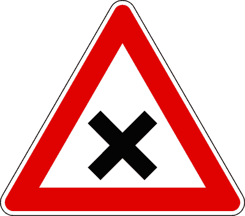
- **📖 الترجمة السياقية:** يجب إلزامياً إعطاء الأولوية لليمين واليسار عند وجود الإشارة الموضحة في الشكل.
- **💡 الشرح والقاعدة المرورية:** خطأ (FALSO). الإشارة في الشكل (مربع أصفر مائل/معين، إشارة حق الأولوية DIRITTO DI PRECEDENZA) تعني أن سائق هذه الطريق يمتلك هو حق الأسبقية في التقاطعات على القادمين من اليمين واليسار، ولا يلتزم بإعطائهم الأولوية.
- **⚠️ كشف الفخ:** الإشارة هي 'حق الأولوية' (diritto di precedenza) وليس 'أعطِ الأولوية'؛ فالأسبقية لك وليست عليك.
- **🔑 الكلمات المفتاحية:** `{'it': 'diritto di precedenza', 'ar': 'حق الأولوية (أسبقية لك)'}` | `{'it': 'dare la precedenza', 'ar': 'إعطاء الأولوية (خاطئ)'}` | `{'it': 'segnale a rombo', 'ar': 'إشارة المعين الأصفر'}`

---

**225.** E' obbligatorio dare la precedenza a destra e a sinistra in presenza del segnale ROTATORIA
- **الإجابة:** `FALSO ❌ (خطأ)`
- **📖 الترجمة السياقية:** يجب إلزامياً إعطاء الأولوية لليمين واليسار عند وجود إشارة الدوار (ROTATORIA).
- **💡 الشرح والقاعدة المرورية:** خطأ (FALSO). إشارة الدوار الزرقاء بمفردها (rotatoria) تدل فقط على اتجاه الدوران الدائري الإلزامي، وتسري فيها القاعدة العامة للأولوية للقادم من اليمين (أي للمركبات التي تدخل الدوار) ما لم تكن مصحوبة بإشارة 'أعطِ الأولوية' (dare precedenza) الصريحة.
- **⚠️ كشف الفخ:** وجود إشارة الدوار الزرقاء بمفردها لا يفرض قانوناً إعطاء الأولوية لليمين واليسار، فالأولوية تخضع للقاعدة العامة لليمين إلا إذا وجدت إشارة DARE PRECEDENZA.
- **🔑 الكلمات المفتاحية:** `{'it': 'segnale rotatoria', 'ar': 'إشارة الدوار'}` | `{'it': 'precedenza a destra e sinistra', 'ar': 'الأولوية لليمين واليسار (خاطئ بمفردها)'}` | `{'it': 'regola generale', 'ar': 'القاعدة العامة'}`

---

**226.** E' obbligatorio dare la precedenza a tutti i veicoli circolanti negli incroci regolati da semaforo a luce gialla lampeggiante
- **الإجابة:** `FALSO ❌ (خطأ)`
- **📖 الترجمة السياقية:** يجب إلزامياً إعطاء الأولوية لجميع المركبات في التقاطعات المنظمة بإشارة ضوئية ذات ضوء أصفر وامض (luce gialla lampeggiante).
- **💡 الشرح والقاعدة المرورية:** خطأ (FALSO). عند وميض الضوء الأصفر في الإشارة الضوئية (semaforo a luce gialla lampeggiante)، يعني ذلك تعطل أو إيقاف الإشارة، فتسري القاعدة العامة للأولوية للقادم من اليمين فقط (precedenza a destra)، ولا يلزم إعطاء الأولوية لجميع المركبات (من اليمين واليسار).
- **⚠️ كشف الفخ:** عبارة 'a tutti i veicoli'؛ الضوء الأصفر الوامض يعيد تطبيق قاعدة اليمين العادية ولا يفرض التنازل للجميع كإشارة STOP.
- **🔑 الكلمات المفتاحية:** `{'it': 'luce gialla lampeggiante', 'ar': 'ضوء أصفر وامض'}` | `{'it': 'tutti i veicoli', 'ar': 'جميع المركبات (فخ)'}` | `{'it': 'precedenza a destra', 'ar': 'الأولوية لليمين'}`

---

**227.** E' obbligatorio dare la precedenza a tutti i veicoli circolanti quando si svolta a sinistra
- **الإجابة:** `FALSO ❌ (خطأ)`
- **📖 الترجمة السياقية:** يجب إلزامياً إعطاء الأولوية لجميع المركبات التي تسير على الطريق عند الانعطاف إلى اليسار.
- **💡 الشرح والقاعدة المرورية:** خطأ (FALSO). عند الانعطاف يساراً، يجب إعطاء حق الأولوية للمركبات القادمة من اليمين وللمركبات القادمة من الأمام (الاتجاه المقابل)، ولكن ليس لجميع المركبات؛ فالمركبات القادمة من جهة اليسار ملزمة بإعطائنا الأولوية لأننا نأتي على يمينها.
- **⚠️ كشف الفخ:** كلمة 'a tutti i veicoli' فخ؛ فلا نمنح الأولوية للمركبات القادمة من اليسار في غياب إشارات خاصة.
- **🔑 الكلمات المفتاحية:** `{'it': 'svolta a sinistra', 'ar': 'الانعطاف يساراً'}` | `{'it': 'tutti i veicoli', 'ar': 'جميع المركبات (خاطئ)'}` | `{'it': 'veicoli da sinistra', 'ar': 'المركبات القادمة من اليسار'}`

---

**228.** E' obbligatorio dare la precedenza a tutti i veicoli circolanti in presenza del segnale in figura
- **الإجابة:** `FALSO ❌ (خطأ)`
- 
- **📖 الترجمة السياقية:** يجب إلزامياً إعطاء الأولوية لجميع المركبات التي تسير على الطريق عند وجود الإشارة الموضحة في الشكل.
- **💡 الشرح والقاعدة المرورية:** خطأ (FALSO). الإشارة في الشكل (شكل 47: معين أصفر مشطوب بخط أسود، نهاية حق الأولوية FINE DEL DIRITTO DI PRECEDENZA) تعني انتهاء امتياز الأسبقية والعودة إلى القاعدة العامة للأولوية لليمين فقط، ولا تلزم بإعطاء الأولوية لجميع المركبات (من اليمين واليسار).
- **⚠️ كشف الفخ:** إشارة نهاية حق الأولوية تعيدنا لقاعدة إعطاء الأولوية لليمين فقط، وليس لجميع المركبات (tutti i veicoli).
- **🔑 الكلمات المفتاحية:** `{'it': 'fine del diritto di precedenza', 'ar': 'نهاية حق الأولوية'}` | `{'it': 'tutti i veicoli', 'ar': 'جميع المركبات (فخ)'}` | `{'it': 'norma generale a destra', 'ar': 'القاعدة العامة لليمين'}`

---

## 📌 Vicinanza incrocio (9 domande)

**229.** Giungendo in vicinanza di un incrocio bisogna predisporsi ad osservare le norme di precedenza
- **الإجابة:** `VERO ✅ (صح)`
- **📖 الترجمة السياقية:** عند الاقتراب من تقاطع طرق، يجب الاستعداد لمراعاة قواعد حق الأولوية.
- **💡 الشرح والقاعدة المرورية:** صحيح (VERO). بموجب المادة 145 من كود السير، يلتزم السائق عند الاقتراب من أي تقاطع بتهدئة سرعته وفحص حركة السير والاستعداد التام للوقوف وإعطاء حق الأولوية لمستحقيها.
- **⚠️ كشف الفخ:** الاستعداد لمراعاة قواعد الأسبقية التزام سلوكي ووقائي أساسي لكل سائق.
- **🔑 الكلمات المفتاحية:** `{'it': 'vicinanza di un incrocio', 'ar': 'الاقتراب من التقاطع'}` | `{'it': 'predisporsi', 'ar': 'الاستعداد والتهيؤ'}` | `{'it': 'norme di precedenza', 'ar': 'قواعد حق الأولوية'}`

---

**230.** Giungendo in vicinanza di un incrocio ci si deve spostare per tempo sulla corsia destinata alla direzione che si intende prendere
- **الإجابة:** `VERO ✅ (صح)`
- **📖 الترجمة السياقية:** عند الاقتراب من تقاطع طرق، يجب الانتقال في الوقت المناسب إلى المسار المخصص للاتجاه المراد اتباعه.
- **💡 الشرح والقاعدة المرورية:** صحيح (VERO). تنص المادة 154 على وجوب التموضع المسبق (spostarsi per tempo) داخل مسار التوجيه المناسب (corsia di preselezione) قبل الوصول إلى التقاطع وقبل تحول الخطوط المتقطعة إلى خطوط متصلة.
- **⚠️ كشف الفخ:** الانتقال المبكر للمسار الصحيح (spostarsi per tempo) يمنع الارتباك وتغيير المسار المفاجئ في التقاطع.
- **🔑 الكلمات المفتاحية:** `{'it': 'spostarsi per tempo', 'ar': 'الانتقال في الوقت المناسب'}` | `{'it': 'corsia destinata', 'ar': 'المسار المخصص'}` | `{'it': 'direzione', 'ar': 'الاتجاه'}`

---

**231.** Giungendo in vicinanza di un incrocio si deve segnalare per tempo l'intenzione di svoltare
- **الإجابة:** `VERO ✅ (صح)`
- **📖 الترجمة السياقية:** عند الاقتراب من تقاطع طرق، يجب الإشارة في الوقت المناسب (مسبقاً) إلى نية الانعطاف.
- **💡 الشرح والقاعدة المرورية:** صحيح (VERO). تشغيل مؤشر الاتجاه (غماز) بوقت كافٍ قبل التقاطع إلزامي لإعلام السائقين الآخرين والمشاة بنيتك في تغيير الاتجاه.
- **⚠️ كشف الفخ:** الإشارة المسبقة لنية الانعطاف (segnalare per tempo) تضمن وضوح مسار السير وتفادي الاصطدام الخلفي.
- **🔑 الكلمات المفتاحية:** `{'it': 'segnalare per tempo', 'ar': 'الإشارة في الوقت المناسب'}` | `{'it': 'intenzione di svoltare', 'ar': 'نية الانعطاف'}` | `{'it': 'indicatore di direzione', 'ar': 'مؤشر الاتجاه'}`

---

**232.** Giungendo alla guida di un veicolo a due ruote in vicinanza di un incrocio, bisogna incolonnarsi dietro gli altri veicoli in attesa
- **الإجابة:** `VERO ✅ (صح)`
- **📖 الترجمة السياقية:** عند الاقتراب من تقاطع طرق أثناء قيادة مركبة ذات عجلتين، يجب الاصطفاف في طابور خلف المركبات الأخرى المنتظرة.
- **💡 الشرح والقاعدة المرورية:** صحيح (VERO). يجب على سائقي الدراجات النارية والعادية الوقوف بانتظام في الصف خلف السيارات (incolonnarsi dietro) وعدم التسلل بين المركبات أو تخطيها بطريقة متهورة للوصول إلى مقدمة التقاطع.
- **⚠️ كشف الفخ:** الاصطفاف في طابور (incolonnarsi dietro) قاعدة انضباط إلزامية لمركبات العجلتين.
- **🔑 الكلمات المفتاحية:** `{'it': 'veicolo a due ruote', 'ar': 'مركبة ذات عجلتين'}` | `{'it': 'incolonnarsi dietro', 'ar': 'الاصطفاف في طابور خلف المركبات'}` | `{'it': 'attesa', 'ar': 'الانتظار'}`

---

**233.** Giungendo ad un incrocio è consentito impegnarlo solo se si ha la possibilità di proseguire e liberarlo
- **الإجابة:** `VERO ✅ (صح)`
- **📖 الترجمة السياقية:** عند الوصول إلى تقاطع طرق، لا يُسمح بشغله إلا إذا كانت هناك إمكانية لمتابعة السير وإخلائه.
- **💡 الشرح والقاعدة المرورية:** صحيح (VERO). وفقاً للمادة 145، يُحظر دخول التقاطع إذا كانت حركة المرور أمامه متوقفة أو بطيئة بدرجة قد تؤدي إلى بقاء المركبة عالقة في منتصفه وسد مسار المرور العرضي.
- **⚠️ كشف الفخ:** التأكد من القدرة على إخلاء التقاطع (possibilità di proseguire e liberarlo) شرط أساسي لدخوله.
- **🔑 الكلمات المفتاحية:** `{'it': "impegnare l'incrocio", 'ar': 'دخول / شغل التقاطع'}` | `{'it': 'liberarlo', 'ar': 'إخلاؤه'}` | `{'it': 'blocco del traffico', 'ar': 'انسداد المرور'}`

---

**234.** Giungendo in vicinanza di un incrocio si deve usare la massima prudenza per evitare incidenti
- **الإجابة:** `VERO ✅ (صح)`
- **📖 الترجمة السياقية:** عند الاقتراب من تقاطع طرق، يجب توخي أقصى درجات الحيطة والحذر لتفادي وقوع الحوادث.
- **💡 الشرح والقاعدة المرورية:** صحيح (VERO). التقاطعات هي أكثر نقاط شبكة الطرق عرضة للحوادث، ويلزم كود السير السائقين باعتماد سلوك وقائي حذر وتخفيض السرعة حتى لو كانت لديهم الأسبقية.
- **⚠️ كشف الفخ:** الحيطة القصوى (massima prudenza) قاعدة سلوكية ذهبية في الاقتراب من كافة التقاطعات.
- **🔑 الكلمات المفتاحية:** `{'it': 'massima prudenza', 'ar': 'أقصى درجات الحيطة'}` | `{'it': 'evitare incidenti', 'ar': 'تفادي الحوادث'}` | `{'it': 'incrocio', 'ar': 'تقاطع'}`

---

**235.** Giungendo in vicinanza di un incrocio bisogna passare sempre prima dei veicoli che arrivano da destra
- **الإجابة:** `FALSO ❌ (خطأ)`
- **📖 الترجمة السياقية:** عند الاقتراب من تقاطع طرق، يجب المرور دائماً قبل المركبات القادمة من اليمين.
- **💡 الشرح والقاعدة المرورية:** خطأ (FALSO). القاعدة العامة الملزمة في التقاطعات غير المزودة بإشارات هي العكس تماماً: إعطاء حق الأولوية للمركبات القادمة من اليمين (dare precedenza a destra)، ولا يجوز المرور قبلها.
- **⚠️ كشف الفخ:** عبارة 'passare sempre prima dei veicoli da destra' تعاكس تماماً مبدأ الأولوية لليمين.
- **🔑 الكلمات المفتاحية:** `{'it': 'passare sempre prima', 'ar': 'المرور دائماً أولاً (خاطئ)'}` | `{'it': 'arrivano da destra', 'ar': 'القادمون من اليمين'}` | `{'it': 'dare precedenza', 'ar': 'إعطاء الأولوية'}`

---

**236.** Giungendo in vicinanza di un incrocio bisogna sorpassare velocemente a sinistra se si vuole svoltare a destra
- **الإجابة:** `FALSO ❌ (خطأ)`
- **📖 الترجمة السياقية:** عند الاقتراب من تقاطع طرق، يجب التجاوز بسرعة من اليسار إذا كنا نرغب في الانعطاف إلى اليمين.
- **💡 الشرح والقاعدة المرورية:** خطأ (FALSO). التجاوز بالقرب من التقاطعات ممنوع عموماً، والتجاوز من اليسار للانعطاف يميناً مناورة عبثية وشديدة الخطورة تقطع مسار السير وتسبب حوادث مميتة.
- **⚠️ كشف الفخ:** التجاوز بسرعة من اليسار للانعطاف يميناً فكرة خاطئة ومحرمة مرورياً تماماً.
- **🔑 الكلمات المفتاحية:** `{'it': 'sorpassare velocemente', 'ar': 'التجاوز بسرعة (خاطئ)'}` | `{'it': 'svoltare a destra', 'ar': 'الانعطاف يميناً'}` | `{'it': 'pericolo grave', 'ar': 'خطر جسيم'}`

---

**237.** Giungendo in vicinanza di un incrocio nei centri abitati occorre suonare il clacson
- **الإجابة:** `FALSO ❌ (خطأ)`
- **📖 الترجمة السياقية:** عند الاقتراب من تقاطع طرق داخل التجمعات السكانية (المدن)، يجب استخدام بوق السيارة (clacson).
- **💡 الشرح والقاعدة المرورية:** خطأ (FALSO). استخدام المنبه الصوتي (clacson) داخل التجمعات السكنية ممنوع منعاً باتاً إلا لتفادي خطر اصطدام وشيك لا يمكن تفاديه بغيره، ولا يجوز إطلاقه أبداً بشكل روتيني عند التقاطعات.
- **⚠️ كشف الفخ:** استخدام البوق داخل المدن (nei centri abitati) محظور ولا يُسمح به عند الاقتراب من التقاطعات.
- **🔑 الكلمات المفتاحية:** `{'it': 'centri abitati', 'ar': 'المناطق المأهولة / المدن'}` | `{'it': 'suonare il clacson', 'ar': 'استخدام البوق (ممنوع)'}` | `{'it': 'divieto', 'ar': 'حظر'}`

---

## 📌 Corrispondenza incroci (12 domande)

**238.** In vicinanza o in corrispondenza degli incroci non è consentito procedere a zig zag, anche se le corsie direzionali sono segnate da strisce discontinue (tratteggiate)
- **الإجابة:** `VERO ✅ (صح)`
- **📖 الترجمة السياقية:** بالقرب من التقاطعات أو عندها، لا يُسمح بالسير بطريقة متعرجة (a zig zag)، حتى لو كانت المسارات التوجيهية محددة بخطوط متقطعة.
- **💡 الشرح والقاعدة المرورية:** صحيح (VERO). يُمنع منعاً باتاً السير المتعرج والتنقل الفوضوي بين المسارات عند الاقتراب من التقاطعات، لما يسببه ذلك من إرباك لحركة السير وتعريض السائقين الآخرين للخطر، ويجب التزام مسار واحد محدد.
- **⚠️ كشف الفخ:** حظر السير المتعرج (non è consentito procedere a zig zag) يسري حتى لو كانت الخطوط متقطعة.
- **🔑 الكلمات المفتاحية:** `{'it': 'procedere a zig zag', 'ar': 'السير بطريقة متعرجة'}` | `{'it': 'non è consentito', 'ar': 'غير مسموح به'}` | `{'it': 'strisce discontinue', 'ar': 'خطوط متقطعة'}`

---

**239.** In vicinanza o in corrispondenza degli incroci non è consentito cambiare improvvisamente la direzione di marcia
- **الإجابة:** `VERO ✅ (صح)`
- **📖 الترجمة السياقية:** بالقرب من التقاطعات أو عندها، لا يُسمح بتغيير اتجاه السير بشكل مفاجئ.
- **💡 الشرح والقاعدة المرورية:** صحيح (VERO). تغيير الاتجاه المفاجئ يمنع السائقين الآخرين من رد الفعل وتفادي الاصطدام؛ ويلزم كود السير السائقين بالاختيار المبكر للاتجاه والإشارة المسبقة والتمهل.
- **⚠️ كشف الفخ:** التغيير المفاجئ للاتجاه (cambiare improvvisamente) ممنوع تماماً لخطورته الفادحة.
- **🔑 الكلمات المفتاحية:** `{'it': 'cambiare improvvisamente', 'ar': 'التغيير المفاجئ'}` | `{'it': 'direzione di marcia', 'ar': 'اتجاه السير'}` | `{'it': 'incroci', 'ar': 'التقاطعات'}`

---

**240.** In vicinanza o in corrispondenza degli incroci non è consentito effettuare l'inversione di marcia
- **الإجابة:** `VERO ✅ (صح)`
- **📖 الترجمة السياقية:** بالقرب من التقاطعات أو عندها، لا يُسمح بإجراء مناورة الرجوع في الاتجاه المعاكس (الدوران للخلف / inversione di marcia).
- **💡 الشرح والقاعدة المرورية:** صحيح (VERO). تنص المادة 154 على حظر إجراء مناورة الدوران للخلف (inversione di marcia) عند التقاطعات أو بالقرب منها نظراً لخطورتها الشديدة وتعطيلها لمسارات المرور المتقاطعة.
- **⚠️ كشف الفخ:** مناورة الدوران للخلف ممنوعة قانوناً بالقرب من التقاطعات (in corrispondenza degli incroci).
- **🔑 الكلمات المفتاحية:** `{'it': 'inversione di marcia', 'ar': 'الرجوع في الاتجاه المعاكس'}` | `{'it': 'non è consentito', 'ar': 'غير مسموح به'}` | `{'it': 'corrispondenza degli incroci', 'ar': 'عند التقاطعات'}`

---

**241.** In corrispondenza di incroci extraurbani non è consentito effettuare la sosta
- **الإجابة:** `VERO ✅ (صح)`
- **📖 الترجمة السياقية:** عند تقاطعات الطرق خارج المدن (incroci extraurbani)، لا يُسمح بالتوقف والركن (sosta).
- **💡 الشرح والقاعدة المرورية:** صحيح (VERO). بموجب المادة 158 من كود السير، يُحظر الركن (sosta) والتوقف التام عند كافة التقاطعات وخارج المدن على مسافة تقل عن 10 أمتار قبل وبعد التقاطع لتأمين مسافة الرؤية وحرية المناورة.
- **⚠️ كشف الفخ:** الركن (sosta) ممنوع قطعاً عند تقاطعات الطرق خارج المدن.
- **🔑 الكلمات المفتاحية:** `{'it': 'incroci extraurbani', 'ar': 'تقاطعات خارج المدن'}` | `{'it': 'sosta', 'ar': 'الركن / التوقف التام'}` | `{'it': 'non è consentito', 'ar': 'غير مسموح به'}`

---

**242.** In corrispondenza di incroci extraurbani non è consentito effettuare la fermata
- **الإجابة:** `VERO ✅ (صح)`
- **📖 الترجمة السياقية:** عند تقاطعات الطرق خارج المدن، لا يُسمح بالوقوف المؤقت (fermata).
- **💡 الشرح والقاعدة المرورية:** صحيح (VERO). يُحظر التوقف المؤقت (fermata) عند تقاطعات الطرق خارج المدن لأن وقوف أي مركبة حتى لبضع ثوانٍ يعيق خطوط الرؤية ويخلق خطراً داهماً للمرور السريع.
- **⚠️ كشف الفخ:** الوقوف المؤقت (fermata) ممنوع أيضاً عند تقاطعات الطرق خارج المدن تماماً كالركن.
- **🔑 الكلمات المفتاحية:** `{'it': 'fermata', 'ar': 'الوقوف المؤقت'}` | `{'it': 'incroci extraurbani', 'ar': 'تقاطعات خارج المدن'}` | `{'it': 'divieto di fermata', 'ar': 'حظر الوقوف المؤقت'}`

---

**243.** In vicinanza o in corrispondenza degli incroci non è consentito sorpassare una bicicletta, se si deve occupare la corsia opposta di marcia
- **الإجابة:** `VERO ✅ (صح)`
- **📖 الترجمة السياقية:** بالقرب من التقاطعات أو عندها، لا يُسمح بتجاوز دراجة هوائية إذا كان ذلك يتطلب شغل المسار المخصص للاتجاه المعاكس.
- **💡 الشرح والقاعدة المرورية:** صحيح (VERO). وفقاً للمادة 148، يُحظر التجاوز عند التقاطعات إذا كان يتطلب غزو مسار الاتجاه المعاكس، حتى لو كانت المركبة المراد تجاوزها دراجة هوائية بطيئة.
- **⚠️ كشف الفخ:** غزو مسار الاتجاه المعاكس (occupare la corsia opposta) ممنوع قطعاً في التجاوز عند التقاطع حتى مع الدراجات.
- **🔑 الكلمات المفتاحية:** `{'it': 'sorpassare una bicicletta', 'ar': 'تجاوز دراجة هوائية'}` | `{'it': 'corsia opposta', 'ar': 'مسار الاتجاه المعاكس'}` | `{'it': 'non è consentito', 'ar': 'غير مسموح به'}`

---

**244.** In vicinanza o in corrispondenza degli incroci non è consentito usare i fari anabbaglianti
- **الإجابة:** `FALSO ❌ (خطأ)`
- **📖 الترجمة السياقية:** بالقرب من التقاطعات أو عندها، لا يُسمح باستخدام المصابيح الخافضة للضوء (أنوار التلاقي / fari anabbaglianti).
- **💡 الشرح والقاعدة المرورية:** خطأ (FALSO). مصابيح الضوء المنخفض (anabbaglianti) مسموح بها ومطلوبة إلزامياً ليلاً وفي ظروف الرؤية المحدودة، وهي الأنوار القياسية المستخدمة في المدن والتقاطعات دون إبهار للآخرين.
- **⚠️ كشف الفخ:** أنوار التلاقي (anabbaglianti) مسموحة وإلزامية، وما يُحظر هو الضوء العالي المبهر (abbaglianti) عند مواجهة مركبات أخرى.
- **🔑 الكلمات المفتاحية:** `{'it': 'fari anabbaglianti', 'ar': 'المصابيح الخافضة (أنوار التلاقي)'}` | `{'it': 'non è consentito', 'ar': 'غير مسموح به (خاطئ)'}` | `{'it': 'fari abbaglianti', 'ar': 'المصابيح العالية المبهرة'}`

---

**245.** In vicinanza o in corrispondenza degli incroci extraurbani non è consentito superare la velocità di 60 km/h
- **الإجابة:** `FALSO ❌ (خطأ)`
- **📖 الترجمة السياقية:** بالقرب من تقاطعات الطرق خارج المدن أو عندها، لا يُسمح بتجاوز سرعة 60 كم/س.
- **💡 الشرح والقاعدة المرورية:** خطأ (FALSO). لا يحدد قانون المرور حداً عددياً ثابتاً عاماً بـ 60 كم/س عند التقاطعات؛ بل يلزم بتهدئة السرعة وملاءمتها لظروف الرؤية وحركة السير ودرجة وضوح التقاطع.
- **⚠️ كشف الفخ:** تحديد سرعة رقمية ثابتة كـ '60 km/h' فخ اصطناعي؛ فالقاعدة هي تعديل السرعة حسب الحالة دون حد أقصى موحد كهذا.
- **🔑 الكلمات المفتاحية:** `{'it': 'velocità di 60 km/h', 'ar': 'سرعة 60 كم/س (حد غير موجود بنص عام)'}` | `{'it': 'moderare la velocità', 'ar': 'تهدئة السرعة'}` | `{'it': 'incroci extraurbani', 'ar': 'تقاطعات خارج المدن'}`

---

**246.** In corrispondenza degli incroci urbani è consentito non azionare l'indicatore di direzione per svoltare a destra
- **الإجابة:** `FALSO ❌ (خطأ)`
- **📖 الترجمة السياقية:** عند تقاطعات الطرق داخل المدن، يُسمح بعدم تشغيل مؤشر الاتجاه للانعطاف إلى اليمين.
- **💡 الشرح والقاعدة المرورية:** خطأ (FALSO). تشغيل مؤشر الاتجاه (الغماز) إلزامي قانوناً في كل عملية انعطاف (سواء يميناً أو يساراً)، ولا يُعفى السائق من هذا الواجب داخل المدن أو خارجها تحت أي ظرف.
- **⚠️ كشف الفخ:** عبارة 'è consentito non azionare l'indicatore' باطلة؛ فالإشارة بالغماز إلزامية حتمية في جميع الانعطافات.
- **🔑 الكلمات المفتاحية:** `{'it': "non azionare l'indicatore", 'ar': 'عدم تشغيل مؤشر الاتجاه (خاطئ ومخالف)'}` | `{'it': 'svoltare a destra', 'ar': 'الانعطاف يميناً'}` | `{'it': 'incroci urbani', 'ar': 'تقاطعات داخل المدن'}`

---

**247.** In vicinanza o in corrispondenza degli incroci regolati da semaforo non è consentito il sorpasso
- **الإجابة:** `FALSO ❌ (خطأ)`
- **📖 الترجمة السياقية:** بالقرب من التقاطعات المنظمة بإشارات ضوئية أو عندها، لا يُسمح بالتجاوز.
- **💡 الشرح والقاعدة المرورية:** خطأ (FALSO). بموجب المادة 148 من كود السير، يُسمح استثنائياً بالتجاوز عند التقاطعات إذا كانت منظمة بإشارات ضوئية (أو رجال مرور) بشرط عدم غزو المسار المخصص للاتجاه المعاكس.
- **⚠️ كشف الفخ:** التجاوز مسموح به عند التقاطع المنظم بإشارة ضوئية إذا تم داخل المسارات المخصصة لنفس الاتجاه.
- **🔑 الكلمات المفتاحية:** `{'it': 'incroci regolati da semaforo', 'ar': 'تقاطعات منظمة بإشارة ضوئية'}` | `{'it': 'sorpasso', 'ar': 'التجاوز (مسموح بشروط)'}` | `{'it': 'non è consentito', 'ar': 'غير مسموح به (خاطئ)'}`

---

**248.** In vicinanza o in corrispondenza degli incroci non si deve rallentare se il semaforo è a luce gialla lampeggiante
- **الإجابة:** `FALSO ❌ (خطأ)`
- **📖 الترجمة السياقية:** بالقرب من التقاطعات أو عندها، لا يجب تخفيض السرعة إذا كانت الإشارة الضوئية ذات ضوء أصفر وامض.
- **💡 الشرح والقاعدة المرورية:** خطأ (FALSO). عند وميض الضوء الأصفر، يجب إلزامياً تخفيض السرعة وتوخي الحذر البالغ واستخدام أقصى درجات الحيطة لأن التقاطع غير محمي بإشارات الأولوية الضوئية التلقائية.
- **⚠️ كشف الفخ:** عبارة 'non si deve rallentare' مناقضة تماماً لقواعد السلامة؛ فالضوء الأصفر الوامض يفرض التهدئة والانتباه التام.
- **🔑 الكلمات المفتاحية:** `{'it': 'non si deve rallentare', 'ar': 'لا يجب التهدئة (خاطئ)'}` | `{'it': 'luce gialla lampeggiante', 'ar': 'ضوء أصفر وامض'}` | `{'it': 'moderare la velocità', 'ar': 'تهدئة السرعة'}`

---

**249.** In vicinanza o in corrispondenza degli incroci extraurbani non è consentito azionare i dispositivi di segnalazione acustica (clacson o trombe)
- **الإجابة:** `FALSO ❌ (خطأ)`
- **📖 الترجمة السياقية:** بالقرب من تقاطعات الطرق خارج المدن أو عندها، لا يُسمح باستخدام أجهزة التنبيه الصوتي (البوق / clacson).
- **💡 الشرح والقاعدة المرورية:** خطأ (FALSO). خارج التجمعات السكنية (strade extraurbane)، يُسمح قانوناً باستخدام المنبه الصوتي للضرورة الأمنية لتحذير مستخدمي الطريق قبل المنعطفات والتقاطعات ذات الرؤية المحدودة.
- **⚠️ كشف الفخ:** استخدام البوق خارج المدن مسموح به لغايات السلامة والتحذير قبل التقاطعات الوعرة وغير الواضحة.
- **🔑 الكلمات المفتاحية:** `{'it': 'extraurbani', 'ar': 'خارج المدن'}` | `{'it': 'segnalazione acustica', 'ar': 'التنبيه الصوتي'}` | `{'it': 'motivi di sicurezza', 'ar': 'دواعي السلامة'}`

---

## 📌 Proprieta privata (9 domande)

**250.** Se ad un incrocio giungono contemporaneamente da strade diverse due veicoli, l'obbligo di dare la precedenza spetta, di norma, al conducente del veicolo che arriva da sinistra
- **الإجابة:** `VERO ✅ (صح)`
- **📖 الترجمة السياقية:** إذا وصلت إلى تقاطع طرق مركبتان في نفس الوقت من طريقين مختلفين، فإن التزام إعطاء الأولوية يقع، كقاعدة عامة، على سائق المركبة القادمة من اليسار.
- **💡 الشرح والقاعدة المرورية:** صحيح (VERO). بموجب المادة 145، تسري القاعدة العامة للأولوية للقادم من اليمين؛ وبالتالي فإن السائق القادم من اليسار هو المطالب نظامياً بمنح حق الأولوية للسائق القادم من جهة يمينه.
- **⚠️ كشف الفخ:** صيغة قانونية دقيقة: من يأتي من اليسار هو الذي يجب عليه إعطاء الأولوية لمن يأتي من اليمين.
- **🔑 الكلمات المفتاحية:** `{'it': 'arriva da sinistra', 'ar': 'القادم من اليسار'}` | `{'it': 'obbligo di dare la precedenza', 'ar': 'واجب إعطاء الأولوية'}` | `{'it': 'contemporaneamente', 'ar': 'في نفس الوقت'}`

---

**251.** Se ad un incrocio giungono contemporaneamente da strade diverse due veicoli, entrambi hanno l'obbligo di moderare la velocità, per evitare incidenti
- **الإجابة:** `VERO ✅ (صح)`
- **📖 الترجمة السياقية:** إذا وصلت إلى تقاطع طرق مركبتان في نفس الوقت من طريقين مختلفين، فكلاهما ملزمان بتهدئة السرعة لتفادي وقوع الحوادث.
- **💡 الشرح والقاعدة المرورية:** صحيح (VERO). تنص المادة 145 على أن واجب تهدئة السرعة والحيطة يقع على عاتق كلا السائقين (entrambi)، حتى من يتمتع منهما بحق الأولوية، لمنع الاصطدام في حال أخطأ الطرف الآخر.
- **⚠️ كشف الفخ:** واجب تهدئة السرعة مشترك وإلزامي على السائقين معاً (entrambi)، ولا يُعفى منه صاحب الأولوية.
- **🔑 الكلمات المفتاحية:** `{'it': 'entrambi', 'ar': 'كلاهما'}` | `{'it': 'moderare la velocità', 'ar': 'تهدئة السرعة'}` | `{'it': 'evitare incidenti', 'ar': 'تفادي الحوادث'}`

---

**252.** Giungendo ad un incrocio, bisogna essere prudenti e tolleranti nei confronti di chi, pur non avendo la precedenza, passa ugualmente per primo
- **الإجابة:** `VERO ✅ (صح)`
- **📖 الترجمة السياقية:** عند الوصول إلى تقاطع طرق، يجب التحلي بالحذر والتسامح تجاه من يمر أولاً على الرغم من عدم امتلاكه حق الأولوية.
- **💡 الشرح والقاعدة المرورية:** صحيح (VERO). السلامة على الطرق تقوم على مبدأ الدفاع الوقائي والتسامح (tolleranti)؛ فإذا خالف سائق حق الأولوية واقتحم التقاطع، يجب التنازل له والتوقف تفادياً للحادث بدلاً من الإصرار على المرور والاصطدام.
- **⚠️ كشف الفخ:** الحذر والتسامح (prudenti e tolleranti) مبدأ إنساني وقانوني أساسي لتفادي الحوادث حتى مع المخالفين.
- **🔑 الكلمات المفتاحية:** `{'it': 'prudenti e tolleranti', 'ar': 'حذرون ومتسامحون'}` | `{'it': 'non avendo la precedenza', 'ar': 'لا يملك حق الأولوية'}` | `{'it': 'evitare collisioni', 'ar': 'تفادي الاصطدام'}`

---

**253.** Uscendo con un veicolo da una proprietà privata, bisogna procedere con prudenza
- **الإجابة:** `VERO ✅ (صح)`
- **📖 الترجمة السياقية:** عند الخروج بمركبة من ملكية خاصة (proprietà privata)، يجب السير بحذر وتأنٍّ (con prudenza).
- **💡 الشرح والقاعدة المرورية:** صحيح (VERO). تنص المادة 154 من قانون السير على وجوب توخي أقصى درجات الحيطة والحذر عند الخروج من العقارات والملكيات الخاصة لتفادي مفاجأة مستخدمي الطريق العام.
- **⚠️ كشف الفخ:** فخ الامتحان: الحذر والبطء واجب دائم ومطلق عند الخروج من الأماكن المغلقة أو الكراجات إلى الطريق العام.
- **🔑 الكلمات المفتاحية:** `{'it': 'proprietà privata', 'ar': 'ملكية خاصة'}` | `{'it': 'procedere con prudenza', 'ar': 'السير بحذر'}`

---

**254.** Uscendo con un veicolo da una proprietà privata, bisogna dare la precedenza agli eventuali pedoni
- **الإجابة:** `VERO ✅ (صح)`
- **📖 الترجمة السياقية:** عند الخروج بمركبة من ملكية خاصة، يجب إعطاء الأسبقية للمشاة المحتملين (eventuali pedoni).
- **💡 الشرح والقاعدة المرورية:** صحيح (VERO). الخارج من عقار أو كراج خاص يقطع مسار الرصيف غالباً، وعليه قانوناً إعطاء الأسبقية لجميع مستخدمي الطريق العام بما فيهم المشاة (pedoni).
- **⚠️ كشف الفخ:** فخ الامتحان: الأسبقية ليست للمركبات فقط، بل تشمل المشاة والدراجات على الرصيف أو حافة الطريق.
- **🔑 الكلمات المفتاحية:** `{'it': 'dare la precedenza', 'ar': 'إعطاء الأسبقية'}` | `{'it': 'eventuali pedoni', 'ar': 'المشاة المحتملين'}`

---

**255.** Uscendo con un veicolo da una proprietà privata, bisogna procedere lentamente, specie se in retromarcia
- **الإجابة:** `VERO ✅ (صح)`
- **📖 الترجمة السياقية:** عند الخروج بمركبة من ملكية خاصة، يجب السير ببطء (lentamente)، خاصة إذا كان ذلك بالرجوع إلى الخلف (in retromarcia).
- **💡 الشرح والقاعدة المرورية:** صحيح (VERO). المناورة بالرجوع للخلف تقلل من مجال الرؤية وتضاعف خطورة الاصطدام، لذا يلزم القانون السائق بالبطء الشديد والتأكد من خلو المسار تماماً.
- **⚠️ كشف الفخ:** فخ الامتحان: الرجوع للخلف يزيد من النقاط العمياء، وتتضاعف معه إلزامية البطء والحذر.
- **🔑 الكلمات المفتاحية:** `{'it': 'procedere lentamente', 'ar': 'التحرك ببطء'}` | `{'it': 'retromarcia', 'ar': 'الرجوع للخلف'}`

---

**256.** Se ad un incrocio giungono contemporaneamente da strade diverse due veicoli, l'obbligo di dare la precedenza spetta al conducente del veicolo che percorre la strada più stretta
- **الإجابة:** `FALSO ❌ (خطأ)`
- **📖 الترجمة السياقية:** إذا وصلت مركبتان في وقت واحد إلى تقاطع من طريقين مختلفين، فإن التزام إعطاء الأسبقية يقع على سائق المركبة التي تسير في الطريق الأضيق.
- **💡 الشرح والقاعدة المرورية:** خطأ (FALSO). القاعدة العامة للأسبقية في التقاطعات غير المزودة بإشارات هي إعطاء الأسبقية للقادم من اليمين (precedenza a destra) وفق المادة 145، ولا عبرة باتساع أو ضيق الطريق (strada più stretta).
- **⚠️ كشف الفخ:** فخ الامتحان: فخ مكرر؛ عرض الطريق أو ضيقه لا يلغي قاعدة الأسبقية لليمين إلا بوجود إشارة أسبقية صريحة.
- **🔑 الكلمات المفتاحية:** `{'it': 'strada più stretta', 'ar': 'الطريق الأضيق (معيار خاطئ)'}` | `{'it': 'precedenza a destra', 'ar': 'الأسبقية لليمين'}`

---

**257.** Uscendo con un veicolo da una proprietà privata, è obbligatorio suonare il clacson
- **الإجابة:** `FALSO ❌ (خطأ)`
- **📖 الترجمة السياقية:** عند الخروج بمركبة من ملكية خاصة، يكون من الإلزامي استخدام آلة التنبيه (suonare il clacson).
- **💡 الشرح والقاعدة المرورية:** خطأ (FALSO). استخدام البوق (clacson) داخل التجمعات السكنية ممنوع إلا في حالات الخطر المباشر والداهم، ولا يفرض القانون إطلاق البوق كإجراء روتيني عند الخروج من ملكية خاصة.
- **⚠️ كشف الفخ:** فخ الامتحان: كلمة 'è obbligatorio' تجعل العبارة خاطئة؛ فالأصل هو التمهل والحذر وليس إزعاج السكان بالمنبه الصوتي.
- **🔑 الكلمات المفتاحية:** `{'it': 'obbligatorio suonare il clacson', 'ar': 'إلزامية استعمال البوق (خطأ)'}` | `{'it': 'proprietà privata', 'ar': 'ملكية خاصة'}`

---

**258.** Uscendo con un veicolo da una proprietà privata, si ha la precedenza sui pedoni
- **الإجابة:** `FALSO ❌ (خطأ)`
- **📖 الترجمة السياقية:** عند الخروج بمركبة من ملكية خاصة، يتمتع السائق بحق الأسبقية على المشاة.
- **💡 الشرح والقاعدة المرورية:** خطأ (FALSO). من يخرج من ملكية أو كراج خاص ملزم بإعطاء الأسبقية لجميع مستخدمي الطريق، وتحديداً المشاة الذين يعبرون على الرصيف أو جانب الطريق.
- **⚠️ كشف الفخ:** فخ الامتحان: الخارج من ملكية خاصة لا يمتلك أي أسبقية، بل يعطي الأسبقية للجميع بلا استثناء.
- **🔑 الكلمات المفتاحية:** `{'it': 'si ha la precedenza', 'ar': 'امتلاك الأسبقية (عكس الواقع)'}` | `{'it': 'pedoni', 'ar': 'المشاة'}`

---

## 📌 Svolta destra autotreno (7 domande)

**259.** Se un autotreno intende svoltare a destra in una strada stretta, i conducenti degli altri veicoli debbono tener presente che potrebbe diminuire notevolmente la velocità
- **الإجابة:** `VERO ✅ (صح)`
- **📖 الترجمة السياقية:** إذا أرادت شاحنة بمقطورة (autotreno) الانعطاف يميناً في طريق ضيق، يجب على سائقي المركبات الأخرى أن يضعوا في حسبانهم أنها قد تخفض سرعتها بشكل ملحوظ.
- **💡 الشرح والقاعدة المرورية:** صحيح (VERO). بسبب طول الشاحنة ومقطورتها وضيق زاوية المنعطف، يلزم السائق التباطؤ الشديد لإتمام مناورة الانعطاف بأمان دون الصعود على الرصيف.
- **⚠️ كشف الفخ:** فخ الامتحان: خصائص المركبات الثقيلة تفرض بطء سرعتها عند المناورة وهو أمر طبيعي وضروري يجب توقعه.
- **🔑 الكلمات المفتاحية:** `{'it': 'autotreno', 'ar': 'شاحنة بمقطورة (قطار طرقي)'}` | `{'it': 'diminuire notevolmente la velocità', 'ar': 'تخفيض السرعة بشكل كبير'}`

---

**260.** Se un autotreno intende svoltare a destra in una strada stretta, i conducenti degli altri veicoli debbono tener presente che nella manovra si sposti a sinistra(si allarghi)
- **الإجابة:** `VERO ✅ (صح)`
- **📖 الترجمة السياقية:** إذا أرادت شاحنة بمقطورة الانعطاف يميناً في طريق ضيق، يجب على سائقي المركبات الأخرى توقع انحرافها يساراً للتوسع (si allarghi) أثناء المناورة.
- **💡 الشرح والقاعدة المرورية:** صحيح (VERO). نظراً لطول محور المقطورة (raggio di sterzata)، تضطر الشاحنة للتوسع نحو اليسار لتفادي صعود العجلات الخلفية فوق الرصيف أو الاصطدام بالزاوية اليمنى.
- **⚠️ كشف الفخ:** فخ الامتحان: مصطلح (si allarghi) يعني التوسع يساراً للدوران يميناً، ولا يعني أبداً رغبة الشاحنة في الانعطاف يساراً.
- **🔑 الكلمات المفتاحية:** `{'it': 'si sposti a sinistra', 'ar': 'ينحرف لليسار'}` | `{'it': 'si allarghi', 'ar': 'يتوسع في المناورة'}`

---

**261.** Se un autotreno intende svoltare a destra in una strada stretta, non bisogna stargli troppo vicino, per non essere d'intralcio, in caso sia necessaria la manovra di retromarcia
- **الإجابة:** `VERO ✅ (صح)`
- **📖 الترجمة السياقية:** إذا أرادت شاحنة بمقطورة الانعطاف يميناً في طريق ضيق، يجب عدم الاقتراب منها كثيراً لعدم إعاقتها إذا اضطرت للرجوع إلى الخلف.
- **💡 الشرح والقاعدة المرورية:** صحيح (VERO). في الشوارع الضيقة قد تضطر الشاحنة للمناورة والرجوع للخلف لتعديل زاوية الدخول، والاقتراب منها يعيق حركتها ويشكل خطراً كبيراً لعدم رؤيتها لما خلفها مباشرة.
- **⚠️ كشف الفخ:** فخ الامتحان: يجب ترك مسافة أمان كافية خلف المركبات الطويلة تحسباً لأي تعديل بالرجوع للخلف.
- **🔑 الكلمات المفتاحية:** `{'it': 'non stargli troppo vicino', 'ar': 'عدم الاقتراب منها كثيراً'}` | `{'it': 'manovra di retromarcia', 'ar': 'مناورة الرجوع للخلف'}`

---

**262.** Se un autotreno intende svoltare a destra in un incrocio, occorre rinunciare a sorpassarlo, perché potrebbe impedire la vista di segnali o di veicoli provenienti lateralmente
- **الإجابة:** `VERO ✅ (صح)`
- **📖 الترجمة السياقية:** إذا أرادت شاحنة بمقطورة الانعطاف يميناً عند تقاطع، يجب الامتناع عن تجاوزها لأنها قد تحجب رؤية الإشارات أو المركبات القادمة من الجوانب.
- **💡 الشرح والقاعدة المرورية:** صحيح (VERO). التجاوز عند التقاطع خطير بحد ذاته، ويزداد خطورة عند محاولة تجاوز مركبة ضخمة تحجب زوايا الرؤية وحركة المرور الجانبية وإشارات الطريق.
- **⚠️ كشف الفخ:** فخ الامتحان: عبارة 'rinunciare a sorpassarlo' تعني العدول عن التجاوز، وهو التصرف الوقائي السليم تماماً.
- **🔑 الكلمات المفتاحية:** `{'it': 'rinunciare a sorpassarlo', 'ar': 'الامتناع عن تجاوزه'}` | `{'it': 'impedire la vista', 'ar': 'حجب الرؤية'}`

---

**263.** Se un autotreno intende svoltare a destra in una strada stretta, bisogna sorpassarlo subito a sinistra
- **الإجابة:** `FALSO ❌ (خطأ)`
- **📖 الترجمة السياقية:** إذا أرادت شاحنة بمقطورة الانعطاف يميناً في طريق ضيق، يجب تجاوزها فوراً من اليسار.
- **💡 الشرح والقاعدة المرورية:** خطأ (FALSO). التجاوز من اليسار في هذه الحالة خطير وممنوع؛ فالشاحنة ستنحرف وتتوسع يساراً (si allarga a sinistra) لتتمكن من الدوران يميناً، مما قد يسحق المركبة المتجاوزة.
- **⚠️ كشف الفخ:** فخ الامتحان: كلمة 'subito a sinistra' فخ قاتل؛ فالشاحنة تتوسع يساراً وتغلق هذا المسار أثناء التفافها.
- **🔑 الكلمات المفتاحية:** `{'it': 'sorpassarlo subito', 'ar': 'تجاوزه فوراً (خطأ قاتل)'}` | `{'it': 'svolta a destra', 'ar': 'انعطاف لليمين'}`

---

**264.** Se un autotreno intende svoltare a destra in una strada stretta, i conducenti dei veicoli che seguono devono sorpassarlo appena aziona l'indicatore di direzione
- **الإجابة:** `FALSO ❌ (خطأ)`
- **📖 الترجمة السياقية:** إذا أرادت شاحنة بمقطورة الانعطاف يميناً في طريق ضيق، يجب على سائقي المركبات التي تتبعها تجاوزها بمجرد تشغيلها لغماز الاتجاه.
- **💡 الشرح والقاعدة المرورية:** خطأ (FALSO). تشغيل غماز الانعطاف لليمين لا يعطي إذناً بالتجاوز، بل ينبه السائقين بوجوب التمهل والابتعاد وانتظار إتمام الشاحنة لمناورتها المعقدة بأمان.
- **⚠️ كشف الفخ:** فخ الامتحان: تشغيل الغماز ينذر ببدء المناورة والتوسع وليس إشارة لمن خلفها بالشروع في التجاوز.
- **🔑 الكلمات المفتاحية:** `{'it': "appena aziona l'indicatore", 'ar': 'بمجرد تشغيل الغماز (فخ)'}` | `{'it': 'sorpassarlo', 'ar': 'تجاوزها'}`

---

**265.** Se un autotreno intende svoltare a destra in una strada stretta, i conducenti dei veicoli che seguono debbono azionare la segnalazione luminosa di pericolo.
- **الإجابة:** `FALSO ❌ (خطأ)`
- **📖 الترجمة السياقية:** إذا أرادت شاحنة بمقطورة الانعطاف يميناً في طريق ضيق، يجب على سائقي المركبات التي تتبعها تشغيل إشارات التحذير من الخطر (الرباعي).
- **💡 الشرح والقاعدة المرورية:** خطأ (FALSO). إشارات الخطر الرباعية (quattro frecce) مخصصة فقط للحالات الطارئة مثل التوقف الاضطراري المفاجئ، ولا تُستخدم روتينياً لمجرد السير خلف مركبة تنعطف.
- **⚠️ كشف الفخ:** فخ الامتحان: استخدام إشارات الطوارئ الرباعية ليس مطلوباً في السير العادي خلف الشاحنات.
- **🔑 الكلمات المفتاحية:** `{'it': 'segnalazione luminosa di pericolo', 'ar': 'إشارات الخطر الرباعية (فخ)'}` | `{'it': 'veicoli che seguono', 'ar': 'المركبات اللاحقة'}`

---

## 📌 Inversione marcia conducente (10 domande)

**266.** Il conducente che intende effettuare l'inversione di marcia su una strada a doppio senso deve dare la precedenza ai veicoli che sopraggiungono
- **الإجابة:** `VERO ✅ (صح)`
- **📖 الترجمة السياقية:** يجب على السائق الذي ينوي الرجوع في الاتجاه المعاكس (inversione di marcia - دوران للخلف) في طريق باتجاهين إعطاء الأسبقية للمركبات القادمة.
- **💡 الشرح والقاعدة المرورية:** صحيح (VERO). تنص المادة 154 من قانون السير على أن مناورة الدوران للخلف تتطلب إعطاء الأسبقية لجميع المركبات القادمة من كلا الاتجاهين دون التسبب بأي خطر أو إعاقة.
- **⚠️ كشف الفخ:** فخ الامتحان: في الدوران للخلف (U-turn) الأسبقية دائماً للمركبات السائرة على الطريق في كلا الاتجاهين.
- **🔑 الكلمات المفتاحية:** `{'it': 'inversione di marcia', 'ar': 'الدوران للخلف (U-turn)'}` | `{'it': 'veicoli che sopraggiungono', 'ar': 'المركبات القادمة'}`

---

**267.** Il conducente che intende effettuare l'inversione di marcia su una strada a doppio senso deve rinunciare a compiere la manovra, qualora vi sia traffico intenso e continuo
- **الإجابة:** `VERO ✅ (صح)`
- **📖 الترجمة السياقية:** يجب على السائق الذي ينوي الدوران للخلف في طريق باتجاهين العدول عن المناورة (rinunciare) إذا كانت حركة المرور كثيفة ومستمرة.
- **💡 الشرح والقاعدة المرورية:** صحيح (VERO). يُمنع قطع حركة السير أو التوقف وسط الطريق لانتظار فرصة في حال وجود ازدحام متواصل، ويلزم السائق مواصلة السير حتى يجد مكاناً آمناً أو دواراً.
- **⚠️ كشف الفخ:** فخ الامتحان: كلمة 'rinunciare' (العدول عن المناورة) تؤكد أن سلامة تدفق السير مقدمة دائماً على رغبة السائق في الدوران.
- **🔑 الكلمات المفتاحية:** `{'it': 'rinunciare a compiere la manovra', 'ar': 'العدول عن إجراء المناورة'}` | `{'it': 'traffico intenso e continuo', 'ar': 'حركة مرور كثيفة ومستمرة'}`

---

**268.** Il conducente che intende effettuare l'inversione di marcia su una strada a doppio senso deve rinunciare ad eseguire la manovra, se vi è scarsa visibilità
- **الإجابة:** `VERO ✅ (صح)`
- **📖 الترجمة السياقية:** يجب على السائق الذي ينوي الدوران للخلف في طريق باتجاهين الامتناع عن تنفيذ المناورة إذا كانت الرؤية ضعيفة (scarsa visibilità).
- **💡 الشرح والقاعدة المرورية:** صحيح (VERO). الدوران للخلف في ظروف ضعف الرؤية (ضباب، منعطف، قمة مرتفع) محظور صراحة بموجب المادة 154 لخطورته البالغة على المركبات القادمة بسرعة.
- **⚠️ كشف الفخ:** فخ الامتحان: انعدام أو ضعف الرؤية يحظر مناورة الدوران للخلف بشكل قاطع ومطلق.
- **🔑 الكلمات المفتاحية:** `{'it': 'scarsa visibilità', 'ar': 'رؤية ضعيفة/غير كافية'}` | `{'it': 'rinunciare ad eseguire', 'ar': 'الامتناع عن التنفيذ'}`

---

**269.** Il conducente che intende effettuare l'inversione di marcia su una strada a doppio senso deve azionare l'indicatore di direzione
- **الإجابة:** `VERO ✅ (صح)`
- **📖 الترجمة السياقية:** يجب على السائق الذي ينوي الدوران للخلف في طريق باتجاهين تشغيل غماز الاتجاه (indicatore di direzione).
- **💡 الشرح والقاعدة المرورية:** صحيح (VERO). أي تغيير في المسار أو الاتجاه يفرض قانوناً التنبيه المسبق باستخدام غماز الاتجاه الأيسر لتنبيه السائقين في الخلف والأمام بالنية في الاستدارة.
- **⚠️ كشف الفخ:** فخ الامتحان: الغماز إلزامي في كل مناورة لتغيير الاتجاه بما فيها الدوران للخلف.
- **🔑 الكلمات المفتاحية:** `{'it': "azionare l'indicatore di direzione", 'ar': 'تشغيل غماز الاتجاه'}` | `{'it': 'strada a doppio senso', 'ar': 'طريق ذو اتجاهين'}`

---

**270.** Il conducente che intende effettuare l'inversione di marcia su una strada a doppio senso non deve creare pericolo o intralcio agli altri utenti della strada
- **الإجابة:** `VERO ✅ (صح)`
- **📖 الترجمة السياقية:** يجب على السائق الذي ينوي الدوران للخلف في طريق باتجاهين ألا يتسبب في خطر (pericolo) أو إعاقة (intralcio) لبقية مستخدمي الطريق.
- **💡 الشرح والقاعدة المرورية:** صحيح (VERO). هذا هو المبدأ الجوهري للمادة 154 من قانون السير؛ فلا يجوز الشروع في المناورة إلا إذا تمت بسلاسة تامة ودون إجبار الآخرين على التوقف أو الانحراف المفاجئ.
- **⚠️ كشف الفخ:** فخ الامتحان: القاعدة الذهبية في المناورات: عدم التسبب بأي خطر أو عرقلة (senza creare pericolo o intralcio).
- **🔑 الكلمات المفتاحية:** `{'it': 'non deve creare pericolo', 'ar': 'يجب ألا يسبب خطراً'}` | `{'it': 'intralcio', 'ar': 'إعاقة/عرقلة'}`

---

**271.** Il conducente che intende effettuare l'inversione di marcia su una strada a doppio senso deve azionare la segnalazione luminosa di pericolo
- **الإجابة:** `FALSO ❌ (خطأ)`
- **📖 الترجمة السياقية:** يجب على السائق الذي ينوي الدوران للخلف في طريق باتجاهين تشغيل إشارة الخطر الضوئية (الرباعي).
- **💡 الشرح والقاعدة المرورية:** خطأ (FALSO). الدوران للخلف يتطلب تشغيل غماز الاتجاه (indicatore di direzione) وليس الإشارة الرباعية للطوارئ (quattro frecce)، فالرباعي لا يحدد جهة حركة المركبة.
- **⚠️ كشف الفخ:** فخ الامتحان: استخدام 'segnalazione luminosa di pericolo' (الرباعي) خطأ؛ المطلوب فقط هو الغماز العادي باتجاه المناورة.
- **🔑 الكلمات المفتاحية:** `{'it': 'segnalazione luminosa di pericolo', 'ar': 'إشارة الخطر الرباعية (فخ)'}` | `{'it': 'indicatore di direzione', 'ar': 'غماز الاتجاه'}`

---

**272.** Il conducente che intende effettuare l'inversione di marcia su una strada a doppio senso può compiere la manovra anche in curva, se dà precedenza a tutti i veicoli
- **الإجابة:** `FALSO ❌ (خطأ)`
- **📖 الترجمة السياقية:** يمكن للسائق الذي ينوي الدوران للخلف في طريق باتجاهين تنفيذ المناورة حتى في المنعطفات (in curva)، بشرط إعطاء الأسبقية لجميع المركبات.
- **💡 الشرح والقاعدة المرورية:** خطأ (FALSO). الدوران للخلف محظور حظراً مطلقاً عند المنعطفات وبالقرب منها لانعدام الرؤية، ولا يُستثنى من ذلك إعطاء الأسبقية.
- **⚠️ كشف الفخ:** فخ الامتحان: كلمة 'anche in curva' فخ قاطع؛ الدوران للخلف ممنوع نهائياً في المنعطفات والقمم (dossi).
- **🔑 الكلمات المفتاحية:** `{'it': 'anche in curva', 'ar': 'حتى في المنعطف (ممنوع تماماً)'}` | `{'it': 'divieto di inversione', 'ar': 'حظر الدوران للخلف'}`

---

**273.** Il conducente che può effettuare l'inversione di marcia su una strada a doppio senso deve accertarsi se la linea di mezzeria è continua
- **الإجابة:** `FALSO ❌ (خطأ)`
- **📖 الترجمة السياقية:** يجب على السائق المؤهل للدوران للخلف في طريق باتجاهين التأكد مما إذا كان الخط النصفي الفاصل متصلاً (continua).
- **💡 الشرح والقاعدة المرورية:** خطأ (FALSO). الدوران للخلف لا يُسمح به إلا إذا كان الخط الفاصل متقطعاً (tratteggiata/discontinua)؛ أما الخط المتصل (linea continua) فيُحظر تجاوزه أو ملامسته قطعياً وفق المادة 40 CdS.
- **⚠️ كشف الفخ:** فخ الامتحان: صياغة السؤال توحي بالبحث عن خط متصل للدوران، بينما الخط المتصل يمنع المناورة منعاً باتاً.
- **🔑 الكلمات المفتاحية:** `{'it': 'linea di mezzeria continua', 'ar': 'خط نصفي متصل (يمنع الدوران)'}` | `{'it': 'linea tratteggiata', 'ar': 'خط متقطع'}`

---

**274.** Il conducente che intende effettuare l'inversione di marcia su una strada a doppio senso può compiere la manovra anche con scarsa visibilità, se la linea di mezzeria è tratteggiata
- **الإجابة:** `FALSO ❌ (خطأ)`
- **📖 الترجمة السياقية:** يمكن للسائق الذي ينوي الدوران للخلف في طريق باتجاهين تنفيذ المناورة حتى مع ضعف الرؤية، إذا كان الخط النصفي متقطعاً.
- **💡 الشرح والقاعدة المرورية:** خطأ (FALSO). ضعف الرؤية (scarsa visibilità) يحظر الدوران للخلف حظراً باتاً ومطلقاً، حتى لو كان الخط الأرضي متقطعاً؛ فالخط المتقطع شرط لازم لكنه غير كافٍ عند غياب الرؤية الآمنة.
- **⚠️ كشف الفخ:** فخ الامتحان: وجود الخط المتقطع لا يلغي شرط الرؤية الممتازة؛ انعدام الرؤية يمنع المناورة دائماً.
- **🔑 الكلمات المفتاحية:** `{'it': 'anche con scarsa visibilità', 'ar': 'حتى مع ضعف الرؤية (ممنوع)'}` | `{'it': 'linea tratteggiata', 'ar': 'خط متقطع'}`

---

**275.** Il conducente che intende effettuare l'inversione di marcia su una strada a doppio senso può effettuarla solo sulle strade larghe, che permettono di eseguirla con una sola manovra
- **الإجابة:** `FALSO ❌ (خطأ)`
- **📖 الترجمة السياقية:** يمكن للسائق الذي ينوي الدوران للخلف في طريق باتجاهين تنفيذها فقط في الطرق العريضة التي تسمح بإجرائها بمناورة واحدة دون توقف.
- **💡 الشرح والقاعدة المرورية:** خطأ (FALSO). يجوز إجراء الدوران للخلف بحركة واحدة أو بعدة حركات (anche a più manovre) باستخدام الرجوع للخلف إذا سمحت حركة المرور وشروط الأمان، ولا ينحصر القانون في الطرق العريضة بحركة واحدة.
- **⚠️ كشف الفخ:** فخ الامتحان: كلمة 'solo sulle strade larghe' و'una sola manovra' تقييد باطل لم ينص عليه القانون.
- **🔑 الكلمات المفتاحية:** `{'it': 'solo sulle strade larghe', 'ar': 'فقط في الطرق العريضة (حصر خاطئ)'}` | `{'it': 'una sola manovra', 'ar': 'مناورة واحدة فقط'}`

---

## 📌 Manovre consentite (8 domande)

**276.** Nelle strade a doppio senso di circolazione non è consentito effettuare l'inversione del senso di marcia in vicinanza o in corrispondenza di curve
- **الإجابة:** `VERO ✅ (صح)`
- **📖 الترجمة السياقية:** في الطرق ذات الاتجاهين لا يُسمح بإجراء الدوران للخلف بالقرب من المنعطفات أو عندها.
- **💡 الشرح والقاعدة المرورية:** صحيح (VERO). تنص المادة 154 CdS على منع الدوران للخلف في المنعطفات وبالقرب منها نظراً لانعدام الرؤية وخطورة الاصطدام بالمركبات القادمة بسرعة.
- **⚠️ كشف الفخ:** فخ الامتحان: المنع يشمل المنعطف نفسه (in corrispondenza) وبالقرب منه (in vicinanza).
- **🔑 الكلمات المفتاحية:** `{'it': 'non è consentito', 'ar': 'غير مسموح'}` | `{'it': 'in corrispondenza di curve', 'ar': 'عند المنعطفات'}`

---

**277.** L'inversione del senso di marcia non è consentita in vicinanza o in corrispondenza degli incroci
- **الإجابة:** `VERO ✅ (صح)`
- **📖 الترجمة السياقية:** لا يُسمح بإجراء الدوران للخلف بالقرب من التقاطعات (incroci) أو عندها.
- **💡 الشرح والقاعدة المرورية:** صحيح (VERO). التقاطعات مخصصة لتنظيم تلاقي وانعطاف المسارات؛ والدوران للخلف عندها يربك حركة السير ويقطع مسارات الأسبقية ويشكل خطراً فادحاً، لذا يحظره القانون.
- **⚠️ كشف الفخ:** فخ الامتحان: الدوران للخلف ممنوع تماماً عند التقاطعات وبالقرب منها.
- **🔑 الكلمات المفتاحية:** `{'it': 'in corrispondenza degli incroci', 'ar': 'عند التقاطعات'}` | `{'it': 'non è consentita', 'ar': 'غير مسموح بها'}`

---

**278.** Nelle strade a doppio senso non è consentito effettuare l'inversione del senso di marcia in tutti i casi di scarsa visibilità
- **الإجابة:** `VERO ✅ (صح)`
- **📖 الترجمة السياقية:** في الطرق ذات الاتجاهين لا يُسمح بإجراء الدوران للخلف في جميع حالات ضعف الرؤية (scarsa visibilità).
- **💡 الشرح والقاعدة المرورية:** صحيح (VERO). ضعف الرؤية سواء بسبب الأحوال الجوية (ضباب، أمطار غزيرة) أو تضاريس الطريق يمنع رؤية المركبات القادمة في الوقت المناسب، مما يجعل المناورة محظورة قانوناً في كافة الحالات.
- **⚠️ كشف الفخ:** فخ الامتحان: عبارة 'in tutti i casi' صحيحة هنا لأن انعدام الرؤية يحظر المناورة دون أي استثناء.
- **🔑 الكلمات المفتاحية:** `{'it': 'tutti i casi di scarsa visibilità', 'ar': 'جميع حالات ضعف الرؤية'}` | `{'it': 'strade a doppio senso', 'ar': 'طرق باتجاهين'}`

---

**279.** Nelle strade a doppio senso di circolazione non è consentito effettuare l'inversione del senso di marcia in vicinanza o in corrispondenza di dossi
- **الإجابة:** `VERO ✅ (صح)`
- **📖 الترجمة السياقية:** في الطرق ذات الاتجاهين لا يُسمح بإجراء الدوران للخلف بالقرب من المرتفعات المحدبة (dossi) أو عندها.
- **💡 الشرح والقاعدة المرورية:** صحيح (VERO). قمة المرتفع (dosso) تحجب الرؤية في الجزء الصاعد والمنحدر، ولذلك يحظر القانون صراحة الدوران للخلف في محيطها لتفادي الحوادث المروعة.
- **⚠️ كشف الفخ:** فخ الامتحان: الدوسو مثل المنعطف تماماً؛ كلاهما يحجب الرؤية ويحظر فيهما الدوران للخلف قطعياً.
- **🔑 الكلمات المفتاحية:** `{'it': 'in corrispondenza di dossi', 'ar': 'عند المرتفعات المحدبة'}` | `{'it': 'non è consentito', 'ar': 'غير مسموح'}`

---

**280.** Quando manca la segnaletica orizzontale non è consentito effettuare manovre di inversione del senso di marcia
- **الإجابة:** `FALSO ❌ (خطأ)`
- **📖 الترجمة السياقية:** عند غياب التخطيط الأرضي (segnaletica orizzontale)، لا يُسمح بإجراء مناورات الدوران للخلف.
- **💡 الشرح والقاعدة المرورية:** خطأ (FALSO). غياب الخطوط الأرضية لا يحظر تلقائياً الدوران للخلف، بشرط أن يكون الطريق باتجاهين مع وضوح الرؤية التام وعدم وجود منعطفات أو تقاطعات أو لافتات تمنع ذلك.
- **⚠️ كشف الفخ:** فخ الامتحان: غياب التخطيط الأرضي لا يعني منع المناورة إذا توافرت شروط السلامة العامة والرؤية الواضحة.
- **🔑 الكلمات المفتاحية:** `{'it': 'manca la segnaletica orizzontale', 'ar': 'غياب التخطيط الأرضي'}` | `{'it': 'non è consentito', 'ar': 'غير مسموح (فخ)'}`

---

**281.** Qualora la linea di margine della carreggiata sia continua, non è consentito effettuare l'inversione di marcia
- **الإجابة:** `FALSO ❌ (خطأ)`
- **📖 الترجمة السياقية:** إذا كان خط حافة قارعة الطريق (linea di margine) متصلاً، فلا يُسمح بإجراء الدوران للخلف.
- **💡 الشرح والقاعدة المرورية:** خطأ (FALSO). خط الحافة يفصل قارعة الطريق عن الرصيف أو الحافة الجانبية (banchina)، والذي يحدد إمكانية الدوران للخلف هو خط المنتصف (linea di mezzeria) وليس خط الحافة.
- **⚠️ كشف الفخ:** فخ الامتحان: فخ التمييز بين خط المنتصف (mezzeria) وخط الحافة الخارجية (margine).
- **🔑 الكلمات المفتاحية:** `{'it': 'linea di margine', 'ar': 'خط حافة الطريق (فخ)'}` | `{'it': 'linea di mezzeria', 'ar': 'خط المنتصف'}`

---

**282.** Fuori dai centri abitati non è consentito effettuare l'inversione di marcia
- **الإجابة:** `FALSO ❌ (خطأ)`
- **📖 الترجمة السياقية:** خارج التجمعات السكنية (fuori dai centri abitati) لا يُسمح بإجراء الدوران للخلف.
- **💡 الشرح والقاعدة المرورية:** خطأ (FALSO). يُسمح بالدوران للخلف خارج التجمعات السكنية في الطرق العادية ذات الاتجاهين إذا كان الخط الفاصل متقطعاً وتوافرت الرؤية الكافية ولم يكن هناك حظر خاص.
- **⚠️ كشف الفخ:** فخ الامتحان: الدوران للخلف مسموح خارج المدن، والممنوع خارج المدن هو فقط في الطرق السريعة (autostrade/extraurbane principali).
- **🔑 الكلمات المفتاحية:** `{'it': 'fuori dai centri abitati', 'ar': 'خارج التجمعات السكنية'}` | `{'it': 'non è consentito', 'ar': 'غير مسموح (تعميم خاطئ)'}`

---

**283.** Sulle autostrade a tre corsie per ogni senso di marcia è consentito l'inversione del senso di marcia
- **الإجابة:** `FALSO ❌ (خطأ)`
- **📖 الترجمة السياقية:** في الطرق السريعة (autostrade) ذات الثلاثة مسارات لكل اتجاه يُسمح بالدوران للخلف.
- **💡 الشرح والقاعدة المرورية:** خطأ (FALSO). الدوران للخلف في الطرق السريعة محظور حظراً مطلقاً ومغلظ العقوبة قانونياً (سحب رخصة وغرامة مالية باهظة وحجز المركبة)، بصرف النظر عن عدد المسارات.
- **⚠️ كشف الفخ:** فخ الامتحان: في الأوتوسترادا ممنوع الدوران للخلف نهائياً وبأي شكل كان حتى لو كانت بعشرة مسارات.
- **🔑 الكلمات المفتاحية:** `{'it': 'autostrade a tre corsie', 'ar': 'طرق سريعة بثلاثة مسارات'}` | `{'it': 'inversione consentita', 'ar': 'السماح بالدوران (خطأ جسيم)'}`

---

## 📌 Incroci circolazione rotatoria (11 domande)

**284.** Giungendo ad un incrocio in cui la circolazione è regolata con rotatoria, bisogna dare la precedenza ai veicoli provenienti da sinistra, solo se vi è il segnale DARE PRECEDENZA
- **الإجابة:** `VERO ✅ (صح)`
- **📖 الترجمة السياقية:** عند الوصول إلى تقاطع تنظم فيه حركة المرور بدوار (rotatoria)، يجب إعطاء الأسبقية للمركبات القادمة من اليسار فقط إذا وُجدت شاخصة 'أعطِ الأسبقية' (DARE PRECEDENZA).
- **💡 الشرح والقاعدة المرورية:** صحيح (VERO). في الدوار التقليدي بدون شاخصات تطبق القاعدة العامة (الأسبقية لليمين)؛ ولا تصبح الأسبقية للقادم من اليسار داخل الحلقة إلا بوجود شاخصة إعطاء الأسبقية عند المداخل (الدوار الأوروبي).
- **⚠️ كشف الفخ:** فخ الامتحان: عبارة 'solo se vi è il segnale' صحيحة تماماً وفق نصوص القانون الإيطالي الصارمة.
- **🔑 الكلمات المفتاحية:** `{'it': 'solo se vi è il segnale', 'ar': 'فقط إذا وُجدت الشاخصة'}` | `{'it': 'provenienti da sinistra', 'ar': 'القادمة من اليسار'}`

---

**285.** Negli incroci regolati con circolazione rotatoria, in assenza di specifico segnale, vale la regola generale di dare la precedenza a destra
- **الإجابة:** `VERO ✅ (صح)`
- **📖 الترجمة السياقية:** في التقاطعات المنظمة بدوار، وعند غياب شاخصة محددة، تسري القاعدة العامة بإعطاء الأسبقية للقادم من اليمين.
- **💡 الشرح والقاعدة المرورية:** صحيح (VERO). في غياب أي إشارة تفيد خلاف ذلك، تنص المادة 145 من قانون السير على سريان قاعدة الأسبقية لليمين (precedenza a destra)، مما يعني أن الداخل للدوار تكون له الأسبقية على السائر بداخله.
- **⚠️ كشف الفخ:** فخ الامتحان: القاعدة الأساسية الأصلية في الدوار بدون إشارات هي الأسبقية لليمين.
- **🔑 الكلمات المفتاحية:** `{'it': 'in assenza di specifico segnale', 'ar': 'في غياب شاخصة محددة'}` | `{'it': 'dare la precedenza a destra', 'ar': 'إعطاء الأسبقية لليمين'}`

---

**286.** Negli incroci regolati con rotatoria, la circolazione può essere disciplinata in modo che i veicoli in entrata diano la precedenza a quelli già circolanti nell'anello
- **الإجابة:** `VERO ✅ (صح)`
- **📖 الترجمة السياقية:** في التقاطعات المنظمة بدوار، يمكن تنظيم حركة السير بحيث تعطي المركبات الداخلة الأسبقية لتلك التي تسير بالفعل داخل الحلقة.
- **💡 الشرح والقاعدة المرورية:** صحيح (VERO). هذا هو النظام الحديث المعتمد (rotatoria alla francese/europea)، حيث توضع شاخصة DARE PRECEDENZA عند المداخل لضمان انسيابية السير داخل الحلقة ومنع انسدادها.
- **⚠️ كشف الفخ:** فخ الامتحان: عبارة 'può essere disciplinata' (يمكن تنظيمها) صحيحة لأن القانون يتيح ذلك بوضع الشاخصات المناسبة.
- **🔑 الكلمات المفتاحية:** `{'it': 'veicoli in entrata', 'ar': 'المركبات الداخلة'}` | `{'it': "già circolanti nell'anello", 'ar': 'السائرة بالفعل في الحلقة'}`

---

**287.** In un incrocio regolato con circolazione rotatoria, l'obbligo di dare la precedenza può essere imposto ai veicoli che stanno per immettersi
- **الإجابة:** `VERO ✅ (صح)`
- **📖 الترجمة السياقية:** في تقاطع منظم بحركة مرور دائرية، يمكن فرض التزام إعطاء الأسبقية على المركبات التي توشك على الدخول.
- **💡 الشرح والقاعدة المرورية:** صحيح (VERO). تفرض السلطات المختصة إلزام إعطاء الأسبقية على المركبات الداخلة بتركيب شاخصة المثلث المقلوب عند كل مدخل لترقية الدوار إلى النظام الأوروبي.
- **⚠️ كشف الفخ:** فخ الامتحان: صياغة 'può essere imposto' (يمكن أن يُفرض) تطابق الواقع التنظيمي المعتمد.
- **🔑 الكلمات المفتاحية:** `{'it': 'obbligo di dare la precedenza', 'ar': 'التزام إعطاء الأسبقية'}` | `{'it': 'stanno per immettersi', 'ar': 'توشك على الدخول'}`

---

**288.** Giungendo ad un incrocio, regolato con circolazione rotatoria, prima di immettersi è opportuno moderare la velocità ed usare la massima prudenza, controllando nel contempo il comportamento degli altri utenti
- **الإجابة:** `VERO ✅ (صح)`
- **📖 الترجمة السياقية:** عند الوصول إلى تقاطع منظم بدوار، يُستحسن قبل الدخول تهدئة السرعة وتوخي أقصى درجات الحذر مع مراقبة سلوك بقية المستخدمين في الوقت نفسه.
- **💡 الشرح والقاعدة المرورية:** صحيح (VERO). الدخول إلى الدوار يتطلب التمهل والاستعداد للتصرف وفق أولويات السير وحركات المركبات الأخرى لتفادي الحوادث وضمان العبور الآمن.
- **⚠️ كشف الفخ:** فخ الامتحان: الحذر والتمهل مطلوبان دائماً عند الاقتراب من الدوارات بصرف النظر عن نظام الأسبقية.
- **🔑 الكلمات المفتاحية:** `{'it': 'moderare la velocità', 'ar': 'تهدئة السرعة'}` | `{'it': 'massima prudenza', 'ar': 'أقصى درجات الحذر'}`

---

**289.** Se in una strada a forte pendenza, il passaggio tra veicoli non è facilmente possibile, in genere spetta al conducente che procede in discesa arrestarsi ed eventualmente fare retromarcia
- **الإجابة:** `VERO ✅ (صح)`
- **📖 الترجمة السياقية:** إذا تعذر مرور المركبات بسهولة في طريق شديد الانحدار، يقع واجب التوقف والرجوع للخلف إن لزم الأمر على السائق النازل (in discesa) كقاعدة عامة.
- **💡 الشرح والقاعدة المرورية:** صحيح (VERO). تنص المادة 150 CdS على أن السائق الهابط يسهل عليه التحكم والرجوع للخلف مقارنة بالسائق الصاعد (in salita) الذي يواجه صعوبة بالغة في الرجوع وإعادة الإقلاع في المرتفع.
- **⚠️ كشف الفخ:** فخ الامتحان: القاعدة العامة في الطرق المنحدرة: النازل يتوقف ويرجع للخلف لصالح الصاعد، إلا في حال وجود مساحة تبادل (piazzola).
- **🔑 الكلمات المفتاحية:** `{'it': 'forte pendenza', 'ar': 'انحدار شديد'}` | `{'it': 'procede in discesa', 'ar': 'يسير في نزول'}` | `{'it': 'fare retromarcia', 'ar': 'الرجوع للخلف'}`

---

**290.** In presenza del segnale DARE PRECEDENZA, se occorre arrestarsi, bisogna che ciò avvenga in corrispondenza della striscia trasversale, formata da una serie di triangoli bianchi
- **الإجابة:** `VERO ✅ (صح)`
- **📖 الترجمة السياقية:** عند وجود شاخصة 'أعطِ الأسبقية'، إذا اقتضى الأمر التوقف، يجب أن يتم ذلك عند الخط العرضي المكون من سلسلة مثلثات بيضاء.
- **💡 الشرح والقاعدة المرورية:** صحيح (VERO). خط التوقف في حالة 'أعطِ الأسبقية' هو خط عرضي متقطع مكون من مثلثات صغيرة موجهة نحو القادم؛ ويجب التوقف عنده فقط إذا كان هناك مركبات أخرى يلزم إعطاؤها الأسبقية.
- **⚠️ كشف الفخ:** فخ الامتحان: التوقف عند شاخصة الأسبقية ليس إجبارياً إلا عند الحاجة، وعندها يكون التوقف عند خط المثلثات البيضاء.
- **🔑 الكلمات المفتاحية:** `{'it': 'striscia trasversale', 'ar': 'خط عرضي'}` | `{'it': 'triangoli bianchi', 'ar': 'مثلثات بيضاء'}`

---

**291.** Giungendo ad un incrocio in cui la circolazione è regolata con rotatoria, è obbligatorio dare la precedenza ai veicoli provenienti da sinistra
- **الإجابة:** `FALSO ❌ (خطأ)`
- **📖 الترجمة السياقية:** عند الوصول إلى تقاطع تنظم فيه حركة السير بدوار، يكون من الإلزامي إعطاء الأسبقية للمركبات القادمة من اليسار.
- **💡 الشرح والقاعدة المرورية:** خطأ (FALSO). ليس إلزامياً دائماً؛ فإذا خلا الدوار من شاخصة 'أعطِ الأسبقية' (DARE PRECEDENZA)، تطبق قاعدة الأسبقية لليمين، وبالتالي لا تُعطى الأسبقية لليسار إلا بوجود شاخصة.
- **⚠️ كشف الفخ:** فخ الامتحان: إطلاق عبارة 'è obbligatorio' دون تقييدها بوجود الشاخصة يجعل العبارة خاطئة وزارياً.
- **🔑 الكلمات المفتاحية:** `{'it': 'obbligatorio dare la precedenza a sinistra', 'ar': 'إلزامية إعطاء الأسبقية لليسار (خطأ بلا شاخصة)'}` | `{'it': 'rotatoria', 'ar': 'دوار'}`

---

**292.** Per immettersi in un incrocio, regolato con circolazione rotatoria, bisogna dare sempre la precedenza ai veicoli già circolanti all'interno della rotatoria
- **الإجابة:** `FALSO ❌ (خطأ)`
- **📖 الترجمة السياقية:** للدخول في تقاطع منظم بحركة مرور دائرية، يجب دائماً (sempre) إعطاء الأسبقية للمركبات التي تسير بالفعل داخل الدوار.
- **💡 الشرح والقاعدة المرورية:** خطأ (FALSO). كلمة 'دائماً' خاطئة؛ ففي غياب الشاخصات تسري قاعدة الأسبقية لليمين وتكون الأسبقية للمركبات الداخلة من جهة اليمين وليس لمن بداخل الحلقة.
- **⚠️ كشف الفخ:** فخ الامتحان: كلمة 'sempre' هي الفخ القاتل المعتاد في امتحانات القيادة الإيطالية.
- **🔑 الكلمات المفتاحية:** `{'it': 'sempre', 'ar': 'دائماً (فخ)'}` | `{'it': "all'interno della rotatoria", 'ar': 'داخل الدوار'}`

---

**293.** In un incrocio regolato con circolazione rotatoria, i veicoli circolanti nell'anello possono effettuare manovre di retromarcia
- **الإجابة:** `FALSO ❌ (خطأ)`
- **📖 الترجمة السياقية:** في تقاطع منظم بحركة دائرية، يجوز للمركبات السائرة في الحلقة القيام بمناورات الرجوع إلى الخلف.
- **💡 الشرح والقاعدة المرورية:** خطأ (FALSO). الرجوع إلى الخلف (retromarcia) محظور حظراً قاطعاً داخل الدوار؛ فالسير يكون في اتجاه واحد إلزامي، ومن يتجاوز مخرجه عليه إكمال دورة كاملة حول الحلقة.
- **⚠️ كشف الفخ:** فخ الامتحان: الرجوع للخلف في الدوار تصرف خطير وممنوع نهائياً تحت أي ظرف.
- **🔑 الكلمات المفتاحية:** `{'it': 'manovre di retromarcia', 'ar': 'مناورات الرجوع للخلف (ممنوعة)'}` | `{'it': "nell'anello", 'ar': 'في حلقة الدوار'}`

---

**294.** Quando un incrocio è regolato con rotatoria, i veicoli circolanti all'interno dell'anello possono sorpassare sia a destra che a sinistra
- **الإجابة:** `FALSO ❌ (خطأ)`
- **📖 الترجمة السياقية:** عندما يكون التقاطع منظماً بدوار، يجوز للمركبات السائرة داخل الحلقة التجاوز من اليمين ومن اليسار على حد سواء.
- **💡 الشرح والقاعدة المرورية:** خطأ (FALSO). التجاوز داخل الدوار يخضع للقواعد العامة للتجاوز في المسارات المتعددة ويكون من اليسار كأصل؛ ولا يجوز التجاوز العشوائي من اليمين.
- **⚠️ كشف الفخ:** فخ الامتحان: التجاوز من اليمين محظور كقاعدة عامة داخل الدوارات كما في بقية الطرق.
- **🔑 الكلمات المفتاحية:** `{'it': 'sorpassare sia a destra che a sinistra', 'ar': 'التجاوز يميناً ويساراً (فخ)'}` | `{'it': 'rotatoria', 'ar': 'دوار'}`

---

## 📌 Arresto veicolo (6 domande)

**295.** Se in una strada a forte pendenza, il passaggio tra veicoli non è facilmente possibile, in genere spetta al conducente che procede in discesa arrestarsi ed eventualmente fare retromarcia
- **الإجابة:** `VERO ✅ (صح)`
- **📖 الترجمة السياقية:** إذا تعذر مرور المركبات بسهولة في طريق شديد الانحدار، يقع واجب التوقف والرجوع للخلف إن لزم الأمر على السائق النازل عموماً.
- **💡 الشرح والقاعدة المرورية:** صحيح (VERO). عملاً بالمادة 150 من قانون السير، يجب على السائق الهابط التوقف والرجوع للخلف لتسهيل مرور المركبة الصاعدة، لأن استئناف الانطلاق صعوداً أصعب بكثير ميكانيكياً.
- **⚠️ كشف الفخ:** فخ الامتحان: القاعدة الأساسية في المنحدرات: الصاعد له الأسبقية على النازل.
- **🔑 الكلمات المفتاحية:** `{'it': 'forte pendenza', 'ar': 'انحدار شديد'}` | `{'it': 'procede in discesa', 'ar': 'يسير في نزول'}`

---

**296.** In presenza del segnale DARE PRECEDENZA occorre usare prudenza e moderare la velocità, ma occorre arrestarsi solo in caso di necessità
- **الإجابة:** `VERO ✅ (صح)`
- **📖 الترجمة السياقية:** عند وجود شاخصة 'أعطِ الأسبقية'، يجب توخي الحذر وتهدئة السرعة، ولكن لا يلزم التوقف إلا في حالة الضرورة (solo in caso di necessità).
- **💡 الشرح والقاعدة المرورية:** صحيح (VERO). يختلف شاخص 'أعطِ الأسبقية' عن شاخص 'قف STOP'؛ فالأول لا يفرض التوقف التام إلا إذا كانت هناك مركبات قادمة يجب تركها تمر، أما إذا كان الطريق خالياً فيمكن العبور ببطء دون توقف كامل.
- **⚠️ كشف الفخ:** فخ الامتحان: التوقف إلزامي دائماً عند STOP، لكنه اختياري ومشروط بالحاجة عند DARE PRECEDENZA.
- **🔑 الكلمات المفتاحية:** `{'it': 'solo in caso di necessità', 'ar': 'فقط عند الضرورة'}` | `{'it': 'dare precedenza', 'ar': 'إعطاء الأسبقية'}`

---

**297.** Qualora in una strada a forte pendenza il passaggio tra veicoli risulti difficoltoso, se uno dei due conducenti si trova in vicinanza di una piazzola di scambio, spetta a lui accostare e lasciar passare l’altro conducente
- **الإجابة:** `VERO ✅ (صح)`
- **📖 الترجمة السياقية:** إذا تعذر مرور المركبات في طريق شديد الانحدار، وكان أحد السائقين قريباً من خليج تبادل (piazzola di scambio)، وجب عليه هو الانحياز جانباً والسماح بمرور الآخر.
- **💡 الشرح والقاعدة المرورية:** صحيح (VERO). وجود خليج أو رصيف التبادل (piazzola di scambio) يمثل استثناءً من القاعدة العامة؛ فمن يكون أقرب للمساحة المخصصة للتبادل عليه الدخول إليها سواء كان صاعداً أو هابطاً.
- **⚠️ كشف الفخ:** فخ الامتحان: مساحة التبادل تلغي قاعدة الصاعد والنازل؛ الأقرب إليها هو من يدخلها أياً كان اتجاهه.
- **🔑 الكلمات المفتاحية:** `{'it': 'piazzola di scambio', 'ar': 'خليج/موقف تبادل المرور'}` | `{'it': 'accostare e lasciar passare', 'ar': 'الانحياز جانباً والسماح بالمرور'}`

---

**298.** In presenza del segnale di STOP non occorre arrestarsi, se non vi è la linea trasversale di arresto e non si vedono sopraggiungere veicoli
- **الإجابة:** `FALSO ❌ (خطأ)`
- **📖 الترجمة السياقية:** عند وجود شاخصة 'قف STOP'، لا يلزم التوقف إذا لم يكن هناك خط توقف عرضي على الأرض ولم تكن هناك مركبات قادمة.
- **💡 الشرح والقاعدة المرورية:** خطأ (FALSO). التوقف عند شاخصة قف (STOP) إلزامي ومطلق في كافة الأحوال، حتى مع غياب التخطيط الأرضي وخلو الطريق تماماً من أي مركبة قادمة.
- **⚠️ كشف الفخ:** فخ الامتحان: عبارة 'non occorre arrestarsi' كاذبة دائماً عند وجود لافتة قف STOP.
- **🔑 الكلمات المفتاحية:** `{'it': 'non occorre arrestarsi', 'ar': 'لا يلزم التوقف (خطأ)'}` | `{'it': 'segnale di STOP', 'ar': 'شاخصة قف'}`

---

**299.** Se in una strada a forte pendenza, il passaggio tra veicoli non è facilmente possibile, in genere spetta al conducente che procede in salita arrestarsi
- **الإجابة:** `FALSO ❌ (خطأ)`
- **📖 الترجمة السياقية:** إذا تعذر مرور المركبات بسهولة في طريق شديد الانحدار، يقع واجب التوقف على السائق الصاعد عموماً.
- **💡 الشرح والقاعدة المرورية:** خطأ (FALSO). الواجب يقع على السائق النازل (in discesa) وليس الصاعد، لأن انطلاق المركبة الصاعدة بعد التوقف يمثل صعوبة فنية ومخاطر انزلاق للخلف.
- **⚠️ كشف الفخ:** فخ الامتحان: عكس الأدوار: النازل هو الملزم بالتوقف والرجوع وليس الصاعد.
- **🔑 الكلمات المفتاحية:** `{'it': 'procede in salita', 'ar': 'يسير صعوداً (ليس هو الملزم)'}` | `{'it': 'arrestarsi', 'ar': 'التوقف'}`

---

**300.** In vicinanza di un incrocio semaforizzato è consentito arrestarsi sulle strisce pedonali, se il semaforo per i pedoni è disposto al rosso
- **الإجابة:** `FALSO ❌ (خطأ)`
- **📖 الترجمة السياقية:** بالقرب من تقاطع ذي إشارات ضوئية، يُسمح بالتوقف فوق ممر المشاة (strisce pedonali) إذا كانت إشارة المشاة الضوئية حمراء.
- **💡 الشرح والقاعدة المرورية:** خطأ (FALSO). يُحظر حظراً تاماً التوقف أو حجز ممر المشاة تحت أي ظرف؛ فيجب التوقف قبل خط التوقف المخصص للمركبات وترك المعبر خالياً تماماً بصرف النظر عن لون إشارة المشاة.
- **⚠️ كشف الفخ:** فخ الامتحان: ممر المشاة منطقة محرمة للتوقف والانتظار حتى لو كانت إشارة المشاة حمراء.
- **🔑 الكلمات المفتاحية:** `{'it': 'arrestarsi sulle strisce pedonali', 'ar': 'التوقف فوق ممر المشاة (ممنوع)'}` | `{'it': 'semaforo disposto al rosso', 'ar': 'إشارة ضوئية حمراء'}`

---

## 📌 Auto della polizia (7 domande)

**301.** I conducenti devono attenersi alle segnalazioni di pericolo o alle prescrizioni che appaiono, con scritte luminose, sui veicoli della polizia
- **الإجابة:** `VERO ✅ (صح)`
- **📖 الترجمة السياقية:** يجب على السائقين الامتثال لإشارات التحذير من الخطر أو التعليمات والإلزاميات التي تظهر بكتابات مضيئة (scritte luminose) على سيارات الشرطة.
- **💡 الشرح والقاعدة المرورية:** صحيح (VERO). الرسائل المضيئة على لوحات مركبات الشرطة وقوات الأمن لها صفة الأوامر والتعليمات المرورية الملزمة قانوناً لجميع السائقين المعنيين.
- **⚠️ كشف الفخ:** فخ الامتحان: اللوحات الإلكترونية فوق مركبات الشرطة تنقل أوامر رسمية يجب اتباعها فوراً.
- **🔑 الكلمات المفتاحية:** `{'it': 'scritte luminose', 'ar': 'كتابات ورسائل مضيئة'}` | `{'it': 'veicoli della polizia', 'ar': 'مركبات الشرطة'}`

---

**302.** Se un'auto della polizia, con sirena in funzione, vi sorpassa ponendosi davanti e sul tetto ha un display con la scritta luminosa "ACCOSTARE", avete l'obbligo di arrestarvi
- **الإجابة:** `VERO ✅ (صح)`
- **📖 الترجمة السياقية:** إذا تجاوزتكم سيارة شرطة بصفارة الإنذار وتمركزت أمامكم وعلى سقفها شاشة بكتابة مضيئة 'ACCOSTARE' (انحز جانباً)، فإنكم ملزمون بالتوقف.
- **💡 الشرح والقاعدة المرورية:** صحيح (VERO). كلمة 'ACCOSTARE' مع توضع سيارة الشرطة أمام مركبتك تعني أمراً مباشراً بالانحياز إلى أقصى اليمين والتوقف التام لإجراء الفحص أو التفتيش.
- **⚠️ كشف الفخ:** فخ الامتحان: 'ACCOSTARE' تعني الانحياز لليمين والتوقف، وليست مجرد نصيحة.
- **🔑 الكلمات المفتاحية:** `{'it': 'ACCOSTARE', 'ar': 'انحز جانباً وتوقف'}` | `{'it': 'obbligo di arrestarvi', 'ar': 'إلزامية التوقف'}`

---

**303.** Se un'auto della polizia, con sirena in funzione, vi sorpassa ponendosi davanti e sul tetto ha un display con la scritta luminosa "ALT POLIZIA", solo voi avete l'obbligo di arrestarvi
- **الإجابة:** `VERO ✅ (صح)`
- **📖 الترجمة السياقية:** إذا تجاوزتكم سيارة شرطة بصفارة الإنذار وتمركزت أمامكم وعلى سقفها شاشة بكتابة مضيئة 'ALT POLIZIA'، فإنكم وحدكم الملزمون بالتوقف.
- **💡 الشرح والقاعدة المرورية:** صحيح (VERO). بتجاوز دورية الشرطة لمركبتك والتمركز أمامها مباشرة مع إظهار أمر التوقف، يكون الأمر موجهاً تحديداً وحصرياً لمركبتكم دون سائر المركبات التي تسير خلفها.
- **⚠️ كشف الفخ:** فخ الامتحان: عبارة 'solo voi' صحيحة تماماً هنا لأن الإجراء موجه فردياً للمركبة التي تقع خلف الدورية مباشرة.
- **🔑 الكلمات المفتاحية:** `{'it': 'ALT POLIZIA', 'ar': 'قف، الشرطة'}` | `{'it': 'solo voi', 'ar': 'أنتم وحدكم المعنيون بالتوقف'}`

---

**304.** Quando si vede sul tetto dell'auto della polizia un display con la scritta luminosa "INCIDENTE", bisogna diminuire la velocità
- **الإجابة:** `VERO ✅ (صح)`
- **📖 الترجمة السياقية:** عندما تشاهد على سقف سيارة الشرطة شاشة بكتابة مضيئة 'INCIDENTE' (حادث)، يجب تخفيض السرعة.
- **💡 الشرح والقاعدة المرورية:** صحيح (VERO). الإشارة تنبه بوجود حادث مروري واقع على مسار الطريق، والواجب الفوري هو تهدئة السرعة وتوخي الحذر لتفادي الاصطدام بالحطام أو المركبات المتضررة ورجال الإنقاذ.
- **⚠️ كشف الفخ:** فخ الامتحان: رسالة 'INCIDENTE' تعني حادثاً واقعاً يتطلب التباطؤ والانتباه الفوري.
- **🔑 الكلمات المفتاحية:** `{'it': 'INCIDENTE', 'ar': 'حادث طرقي'}` | `{'it': 'diminuire la velocità', 'ar': 'تخفيض السرعة'}`

---

**305.** Quando vedete sul tetto di un'auto della polizia un display con la scritta luminosa "INCIDENTE", significa che quella zona è ad alto rischio di incidenti
- **الإجابة:** `FALSO ❌ (خطأ)`
- **📖 الترجمة السياقية:** عندما تشاهدون على سقف سيارة الشرطة شاشة بكتابة مضيئة 'INCIDENTE'، فهذا يعني أن تلك المنطقة ذات خطورة عالية لتكرار الحوادث.
- **💡 الشرح والقاعدة المرورية:** خطأ (FALSO). الكتابة المضيئة لا تعبر عن تصنيف إحصائي عام لمنطقة خطرة، بل تدل على وقوع حادث مروري حقيقي ومحدد على مسافة قريبة في ذلك الوقت.
- **⚠️ كشف الفخ:** فخ الامتحان: فخ المعنى؛ الكلمة تدل على حادث واقعي في المسار وليست وصفاً لخطورة المنطقة عموماً.
- **🔑 الكلمات المفتاحية:** `{'it': 'alto rischio di incidenti', 'ar': 'خطورة عالية للحوادث (تفسير خاطئ)'}` | `{'it': 'INCIDENTE', 'ar': 'حادث واقع'}`

---

**306.** Se un'auto della polizia, con sirena in funzione, vi sorpassa ponendosi davanti e sul tetto ha un display con la scritta luminosa "ACCOSTARE", significa che avete l'obbligo di svoltare
- **الإجابة:** `FALSO ❌ (خطأ)`
- **📖 الترجمة السياقية:** إذا تجاوزتكم سيارة شرطة بصفارة الإنذار وتمركزت أمامكم وعلى سقفها شاشة بكتابة مضيئة 'ACCOSTARE'، فهذا يعني أنكم ملزمون بالانعطاف (svoltare).
- **💡 الشرح والقاعدة المرورية:** خطأ (FALSO). كلمة 'ACCOSTARE' تعني الاقتراب من حافة الطريق والتوقف بمحاذاة الرصيف، ولا تعني إطلاقاً الانعطاف أو تغيير مسار الطريق عند تقاطع (svoltare).
- **⚠️ كشف الفخ:** فخ الامتحان: الخلط اللغوي بين 'accostare' (الانحياز للجانب والتوقف) و'svoltare' (الانعطاف يميناً أو يساراً).
- **🔑 الكلمات المفتاحية:** `{'it': 'obbligo di svoltare', 'ar': 'إلزامية الانعطاف (فخ لغوي)'}` | `{'it': 'accostare', 'ar': 'الانحياز للجانب والتوقف'}`

---

**307.** Se sul tetto di un'auto della polizia è presente un display con la scritta luminosa "RALLENTARE", l'obbligo è rivolto ai soli veicoli pesanti.
- **الإجابة:** `FALSO ❌ (خطأ)`
- **📖 الترجمة السياقية:** إذا ظهرت على سقف سيارة الشرطة شاشة بكتابة مضيئة 'RALLENTARE' (خفف السرعة)، فإن هذا الالتزام موجه فقط للمركبات الثقيلة.
- **💡 الشرح والقاعدة المرورية:** خطأ (FALSO). الأمر موجه لجميع المركبات ومستخدمي الطريق المتعاقبين خلف سيارة الشرطة، وليس محصوراً بالمركبات الثقيلة إطلاقاً.
- **⚠️ كشف الفخ:** فخ الامتحان: عبارة 'ai soli veicoli pesanti' حصر خاطئ ومضلل؛ التباطؤ واجب على الجميع.
- **🔑 الكلمات المفتاحية:** `{'it': 'ai soli veicoli pesanti', 'ar': 'للمركبات الثقيلة فقط (فخ)'}` | `{'it': 'RALLENTARE', 'ar': 'خفف السرعة'}`

---

## 📌 Immissione flusso della circolazione (7 domande)

**308.** Il conducente che intende immettersi nel flusso della circolazione deve assicurarsi di poter effettuare la manovra senza creare pericolo o intralcio agli altri utenti della strada
- **الإجابة:** `VERO ✅ (صح)`
- **📖 الترجمة السياقية:** يجب على السائق الذي ينوي الاندماج في حركة المرور (immettersi nel flusso della circolazione) التأكد من إمكانية تنفيذ المناورة دون التسبب بخطر أو إعاقة لبقية مستخدمي الطريق.
- **💡 الشرح والقاعدة المرورية:** صحيح (VERO). تنص المادة 154 من قانون السير على أن الاندماج من الوقوف أو الحافة إلى تيار السير يفرض التأكد التام من خلو المسار وعدم إرباك الآخرين.
- **⚠️ كشف الفخ:** فخ الامتحان: الشرط الجوهري للاندماج الآمن: عدم خلق أي خطر أو عرقلة.
- **🔑 الكلمات المفتاحية:** `{'it': 'immettersi nel flusso', 'ar': 'الاندماج في تيار السير'}` | `{'it': 'senza creare pericolo o intralcio', 'ar': 'دون التسبب بخطر أو إعاقة'}`

---

**309.** Il conducente che intende immettersi nel flusso della circolazione deve tenere conto della posizione, distanza, direzione degli altri utenti della strada
- **الإجابة:** `VERO ✅ (صح)`
- **📖 الترجمة السياقية:** يجب على السائق الذي ينوي الاندماج في حركة المرور أن يأخذ في الاعتبار موقع ومسافة واتجاه بقية مستخدمي الطريق.
- **💡 الشرح والقاعدة المرورية:** صحيح (VERO). تقدير المسافات وسرعة المركبات واتجاه حركتها عبر المرايا والنظر المباشر شرط أساسي لتحديد التوقيت الملائم والآمن للاندماج.
- **⚠️ كشف الفخ:** فخ الامتحان: الانتباه الشامل لثلاثية: الموقع (posizione) والمسافة (distanza) والاتجاه (direzione).
- **🔑 الكلمات المفتاحية:** `{'it': 'posizione, distanza, direzione', 'ar': 'الموقع والمسافة والاتجاه'}` | `{'it': 'utenti della strada', 'ar': 'مستخدمو الطريق'}`

---

**310.** Il conducente che intende immettersi nel flusso della circolazione deve azionare l'indicatore di direzione per segnalare con sufficiente anticipo l' intenzione di effettuare tale manovra
- **الإجابة:** `VERO ✅ (صح)`
- **📖 الترجمة السياقية:** يجب على السائق الذي ينوي الاندماج في حركة المرور تشغيل غماز الاتجاه للإشارة بوقت كافٍ ومسبق (con sufficiente anticipo) عن نيته في إجراء المناورة.
- **💡 الشرح والقاعدة المرورية:** صحيح (VERO). الإشارة بالغماز مسبقاً وبفترة كافية واجب قانوني لتنبيه حركة السير القادمة من الخلف والجانب لمنحهم فرصة التوقع والتصرف الآمن.
- **⚠️ كشف الفخ:** فخ الامتحان: الغماز يجب تشغيله مسبقاً (con anticipo) وليس لحظة تحريك المقود.
- **🔑 الكلمات المفتاحية:** `{'it': 'indicatore di direzione', 'ar': 'غماز الاتجاه'}` | `{'it': 'sufficiente anticipo', 'ar': 'وقت كافٍ مسبقاً'}`

---

**311.** Il conducente che intende immettersi nel flusso della circolazione deve dare la precedenza ai veicoli in transito
- **الإجابة:** `VERO ✅ (صح)`
- **📖 الترجمة السياقية:** يجب على السائق الذي ينوي الاندماج في حركة المرور إعطاء الأسبقية للمركبات العابرة في الطريق (veicoli in transito).
- **💡 الشرح والقاعدة المرورية:** صحيح (VERO). تنص القاعدة العامة على أن المركبة المتوقفة أو المندمجة لا تملك أي أسبقية، بل تلتزم بإعطاء الأسبقية لكافة المركبات المتحركة على الطريق بالفعل.
- **⚠️ كشف الفخ:** فخ الامتحان: المندمج يعطي الأسبقية دائماً لحركة السير العابرة.
- **🔑 الكلمات المفتاحية:** `{'it': 'veicoli in transito', 'ar': 'المركبات العابرة'}` | `{'it': 'dare la precedenza', 'ar': 'إعطاء الأسبقية'}`

---

**312.** Il conducente che intende immettersi nel flusso della circolazione può evitare di azionare l'indicatore di direzione se non sopraggiungono altri veicoli
- **الإجابة:** `FALSO ❌ (خطأ)`
- **📖 الترجمة السياقية:** يجوز للسائق الذي ينوي الاندماج في حركة المرور الامتناع عن تشغيل غماز الاتجاه إذا لم تكن هناك مركبات أخرى قادمة.
- **💡 الشرح والقاعدة المرورية:** خطأ (FALSO). تشغيل غماز الاتجاه إلزامي في كافة الظروف بغض النظر عن خلو الطريق ظاهرياً، تحسباً لوجود مشاة أو دراجات أو مركبات غير مرئية.
- **⚠️ كشف الفخ:** فخ الامتحان: عبارة 'può evitare' فخ مكرر؛ الإشارة الضوئية إلزامية دائماً في كل الأحوال.
- **🔑 الكلمات المفتاحية:** `{'it': 'può evitare di azionare', 'ar': 'يمكنه تجنب التشغيل (خطأ)'}` | `{'it': 'non sopraggiungono altri veicoli', 'ar': 'لا تقترب مركبات أخرى'}`

---

**313.** Il conducente che intende immettersi nel flusso della circolazione deve dare la precedenza ai veicoli in transito solo in presenza di apposito segnale
- **الإجابة:** `FALSO ❌ (خطأ)`
- **📖 الترجمة السياقية:** يجب على السائق الذي ينوي الاندماج في حركة المرور إعطاء الأسبقية للمركبات العابرة فقط في حال وجود شاخصة خاصة بذلك.
- **💡 الشرح والقاعدة المرورية:** خطأ (FALSO). التزام إعطاء الأسبقية عند الاندماج ينبع مباشرة من المادة 154 لقانون السير كقاعدة عامة تلقائية، ولا يتطلب وجود أي شاخصة إضافية.
- **⚠️ كشف الفخ:** فخ الامتحان: عبارة 'solo in presenza di apposito segnale' فخ؛ فالواجب قانوني دائم بلا حاجة لشاخصة.
- **🔑 الكلمات المفتاحية:** `{'it': 'solo in presenza di apposito segnale', 'ar': 'فقط بوجود شاخصة (فخ)'}` | `{'it': 'dare la precedenza', 'ar': 'إعطاء الأسبقية'}`

---

**314.** Il conducente che si immette nel flusso della circolazione deve dare la precedenza ai veicoli in transito ad eccezione delle biciclette
- **الإجابة:** `FALSO ❌ (خطأ)`
- **📖 الترجمة السياقية:** يجب على السائق الذي يندمج في حركة المرور إعطاء الأسبقية للمركبات العابرة باستثناء الدراجات الهوائية (ad eccezione delle biciclette).
- **💡 الشرح والقاعدة المرورية:** خطأ (FALSO). الدراجات الهوائية (velocipedi) تُعد مركبات قانونية كاملة الحقوق، ويجب إعطاؤها الأسبقية كأي مركبة أخرى دون أي استثناء.
- **⚠️ كشف الفخ:** فخ الامتحان: عبارة 'ad eccezione delle biciclette' استثناء باطل وكاذب؛ الدراجات مشمولة بحق الأسبقية التام.
- **🔑 الكلمات المفتاحية:** `{'it': 'ad eccezione delle biciclette', 'ar': 'باستثناء الدراجات (فخ خطير)'}` | `{'it': 'veicoli in transito', 'ar': 'المركبات العابرة'}`

---

## 📌 Partenza margine della carreggiata (6 domande)

**315.** Il conducente di un motociclo che parte dal margine della carreggiata e si immette nel flusso della circolazione deve indossare ed allacciare il casco
- **الإجابة:** `VERO ✅ (صح)`
- **📖 الترجمة السياقية:** يجب على سائق الدراجة النارية الذي ينطلق من حافة قارعة الطريق ويندمج في حركة المرور ارتداء الخوذة وربطها بإحكام (indossare ed allacciare il casco).
- **💡 الشرح والقاعدة المرورية:** صحيح (VERO). تنص المادة 171 CdS على وجوب ارتداء الخوذة المعتمدة وربط حزامها بإحكام قبل البدء في السير وأثناء القيادة بالكامل دون أي تهاون.
- **⚠️ كشف الفخ:** فخ الامتحان: الخوذة يجب ارتداؤها وربطها (allacciare) قبل الانطلاق وليس أثناءه أو بعده.
- **🔑 الكلمات المفتاحية:** `{'it': 'indossare ed allacciare il casco', 'ar': 'ارتداء الخوذة وربطها'}` | `{'it': 'motociclo', 'ar': 'دراجة نارية'}`

---

**316.** Il conducente di un autoveicolo che parte dal margine della carreggiata e si immette nel flusso della circolazione deve allacciare la cintura di sicurezza salvo che non sia esentato
- **الإجابة:** `VERO ✅ (صح)`
- **📖 الترجمة السياقية:** يجب على سائق السيارة الذي ينطلق من حافة قارعة الطريق ويندمج في حركة المرور ربط حزام الأمان (cintura di sicurezza) ما لم يكن معفى منه قانوناً.
- **💡 الشرح والقاعدة المرورية:** صحيح (VERO). ربط حزام الأمان إلزامي قبل الشروع في تحريك المركبة بموجب المادة 172 CdS، باستثناء الحالات المعفاة صراحة بشهادة طبية أو لفئات مهنية خاصة محددة.
- **⚠️ كشف الفخ:** فخ الامتحان: حزام الأمان يربط قبل التحرك مباشرة، والاستثناء فقط لمن يحمل إعفاء رسمياً (salvo che non sia esentato).
- **🔑 الكلمات المفتاحية:** `{'it': 'allacciare la cintura di sicurezza', 'ar': 'ربط حزام الأمان'}` | `{'it': 'salvo che non sia esentato', 'ar': 'ما لم يكن معفى'}`

---

**317.** Il conducente di un motociclo che parte dal margine della carreggiata e si immette nel flusso della circolazione deve accendere il proiettore anabbagliante
- **الإجابة:** `VERO ✅ (صح)`
- **📖 الترجمة السياقية:** يجب على سائق الدراجة النارية الذي ينطلق من حافة قارعة الطريق ويندمج في حركة المرور إشعال ضوء التقاطع (proiettore anabbagliante - الضوء الواطي).
- **💡 الشرح والقاعدة المرورية:** صحيح (VERO). تلزم المادة 152 CdS الدراجات النارية بإبقاء الضوء الواطي (anabbagliante) مشتعلاً دائماً على جميع أنواع الطرق ليلاً ونهاراً لتعزيز وضوح رؤيتها.
- **⚠️ كشف الفخ:** فخ الامتحان: الدراجات النارية ملزمة بالضوء الواطي دائماً حتى في وضح النهار داخل وخارج المدن.
- **🔑 الكلمات المفتاحية:** `{'it': 'proiettore anabbagliante', 'ar': 'ضوء التقاطع (الواطي)'}` | `{'it': 'motociclo', 'ar': 'دراجة نارية'}`

---

**318.** Il conducente che parte dal margine della carreggiata e si immette nel flusso della circolazione deve accertarsi che la strada sia libera, guardando anche negli specchietti retrovisori
- **الإجابة:** `VERO ✅ (صح)`
- **📖 الترجمة السياقية:** يجب على السائق الذي ينطلق من حافة قارعة الطريق ويندمج في حركة المرور التأكد من خلو الطريق، مع النظر أيضاً في المرايا العاكسة (specchietti retrovisori).
- **💡 الشرح والقاعدة المرورية:** صحيح (VERO). فحص المرايا العاكسة (الداخلية والجانبية) أمر لا غنى عنه قبل التحرك لضمان عدم وجود مركبات أو مشاة أو دراجين مقتربين في المسار.
- **⚠️ كشف الفخ:** فخ الامتحان: النظر في المرايا خطوة إلزامية أساسية قبل أي انطلاق من جانب الطريق.
- **🔑 الكلمات المفتاحية:** `{'it': 'accertarsi che la strada sia libera', 'ar': 'التأكد من خلو الطريق'}` | `{'it': 'specchietti retrovisori', 'ar': 'مرايا الرؤية الخلفية'}`

---

**319.** Il conducente che parte dal margine della carreggiata e si immette nel flusso della circolazione può allacciare la cintura di sicurezza dopo avere concluso tale manovra
- **الإجابة:** `FALSO ❌ (خطأ)`
- **📖 الترجمة السياقية:** يجوز لسائق السيارة الذي ينطلق من حافة قارعة الطريق ويندمج في حركة المرور ربط حزام الأمان بعد الانتهاء من تلك المناورة.
- **💡 الشرح والقاعدة المرورية:** خطأ (FALSO). حزام الأمان يجب ربطه قبل الشروع في تحريك المركبة على الإطلاق، والقيادة بدونه ولو لمسافة أمتار معدودة أثناء الاندماج مخالفة صريحة وخطيرة.
- **⚠️ كشف الفخ:** فخ الامتحان: عبارة 'dopo avere concluso' خاطئة؛ الحزام يربط قبل بدء الحركة (prima di partire).
- **🔑 الكلمات المفتاحية:** `{'it': 'dopo avere concluso', 'ar': 'بعد الانتهاء (توقيت خاطئ ومخالف)'}` | `{'it': 'cintura di sicurezza', 'ar': 'حزام الأمان'}`

---

**320.** Il motociclista che parte dal margine della carreggiata e si immette nel flusso della circolazione può indossare il casco dopo avere concluso tale manovra
- **الإجابة:** `FALSO ❌ (خطأ)`
- **📖 الترجمة السياقية:** يجوز لسائق الدراجة النارية الذي ينطلق من حافة قارعة الطريق ويندمج في حركة المرور ارتداء الخوذة بعد الانتهاء من تلك المناورة.
- **💡 الشرح والقاعدة المرورية:** خطأ (FALSO). الخوذة يجب ارتداؤها وتثبيتها بإحكام قبل تشغيل المحرك والتحرك؛ ويُحظر ركوب الدراجة أو تحريكها متراً واحداً دون خوذة مربوطة.
- **⚠️ كشف الفخ:** فخ الامتحان: ارتداء الخوذة شرط مسبق لأي تحرك ولا يمكن تأجيله لبعد المناورة.
- **🔑 الكلمات المفتاحية:** `{'it': 'può indossare il casco dopo', 'ar': 'يمكنه ارتداء الخوذة لاحقاً (مخالفة جسيمة)'}` | `{'it': 'motociclista', 'ar': 'سائق الدراجة'}`

---

## 📌 Retromarcia immissione (7 domande)

**321.** Il conducente del veicolo S in figura, muovendosi in retromarcia per immettersi nella circolazione, deve assicurarsi che la strada sia libera ed eseguire la manovra con prudenza
- **الإجابة:** `VERO ✅ (صح)`
- 
- **📖 الترجمة السياقية:** يجب على سائق المركبة S في الشكل، عند التحرك بالرجوع إلى الخلف للاندماج في حركة المرور، التأكد من خلو الطريق وتنفيذ المناورة بحذر.
- **💡 الشرح والقاعدة المرورية:** صحيح (VERO). الخروج بالرجوع للخلف من موقف أو عقار يتطلب أقصى درجات الحيطة والتأكد البصري التام من خلو الطريق لضيق مجال الرؤية الخلفية.
- **⚠️ كشف الفخ:** فخ الامتحان: الرجوع للخلف للاندماج يقتضي التأكد الشامل وتنفيذ الحركة ببطء وحذر شديد.
- **🔑 الكلمات المفتاحية:** `{'it': 'muovendosi in retromarcia', 'ar': 'التحرك بالرجوع للخلف'}` | `{'it': 'eseguire con prudenza', 'ar': 'التنفيذ بحذر'}`

---

**322.** Il conducente del veicolo E in figura, muovendosi in retromarcia per immettersi nella circolazione, deve azionare gli indicatori di direzione
- **الإجابة:** `VERO ✅ (صح)`
- 
- **📖 الترجمة السياقية:** يجب على سائق المركبة E في الشكل، عند التحرك بالرجوع إلى الخلف للاندماج في حركة المرور، تشغيل غمازات الاتجاه.
- **💡 الشرح والقاعدة المرورية:** صحيح (VERO). تشغيل غماز الاتجاه إلزامي للإعلان المسبق عن اتجاه خروج المركبة واندماجها في المسار العام لتنبيه باقي مستخدمي الطريق.
- **⚠️ كشف الفخ:** فخ الامتحان: الغماز واجب في كل خروج واندماج، حتى عند الخروج بمارشيدير (retromarcia).
- **🔑 الكلمات المفتاحية:** `{'it': 'azionare gli indicatori di direzione', 'ar': 'تشغيل غمازات الاتجاه'}` | `{'it': 'immettersi nella circolazione', 'ar': 'الاندماج في السير'}`

---

**323.** Il conducente del veicolo S in figura, muovendosi in retromarcia per immettersi nella circolazione, deve dare la precedenza a tutti i veicoli provenienti sia da destra sia da sinistra
- **الإجابة:** `VERO ✅ (صح)`
- 
- **📖 الترجمة السياقية:** يجب على سائق المركبة S في الشكل، عند التحرك بالرجوع إلى الخلف للاندماج في حركة المرور، إعطاء الأسبقية لجميع المركبات القادمة من اليمين ومن اليسار.
- **💡 الشرح والقاعدة المرورية:** صحيح (VERO). المركبة المندمجة بالرجوع للخلف تفقد أي حق في الأسبقية، وتلتزم قطعياً بترك المرور لكافة المركبات العابرة القادمة من كلا الاتجاهين.
- **⚠️ كشف الفخ:** فخ الامتحان: الأسبقية للجميع (sia da destra sia da sinistra) عند الخروج بمارشيدير.
- **🔑 الكلمات المفتاحية:** `{'it': 'precedenza a tutti i veicoli', 'ar': 'الأسبقية لكافة المركبات'}` | `{'it': 'sia da destra sia da sinistra', 'ar': 'من اليمين واليسار معاً'}`

---

**324.** Il conducente del veicolo S in figura, muovendosi in retromarcia per immettersi nella circolazione, deve fare attenzione agli eventuali pedoni in transito dietro di esso
- **الإجابة:** `VERO ✅ (صح)`
- 
- **📖 الترجمة السياقية:** يجب على سائق المركبة S في الشكل، عند التحرك بالرجوع إلى الخلف للاندماج في حركة المرور، الانتباه الشديد للمشاة المحتمل مرورهم خلفها.
- **💡 الشرح والقاعدة المرورية:** صحيح (VERO). يمثل المشاة والأطفال خلف المركبة في الرجوع للخلف خطراً كبيراً لوجود النقطة العمياء السفلية، ويجب على السائق التوقف فوراً إذا اقترب مشاة.
- **⚠️ كشف الفخ:** فخ الامتحان: المشاة خلف المركبة نقطة حساسة وحيوية تتطلب انتباهاً مضاعفاً.
- **🔑 الكلمات المفتاحية:** `{'it': 'eventuali pedoni in transito dietro', 'ar': 'المشاة المحتمل مرورهم خلفها'}` | `{'it': 'fare attenzione', 'ar': 'توخي الانتباه'}`

---

**325.** Il conducente del veicolo S in figura, muovendosi in retromarcia per immettersi nella circolazione, deve azionare la segnalazione luminosa di pericolo (quattro frecce lampeggianti simultaneamente)
- **الإجابة:** `FALSO ❌ (خطأ)`
- 
- **📖 الترجمة السياقية:** يجب على سائق المركبة S في الشكل، عند التحرك بالرجوع إلى الخلف للاندماج في حركة المرور، تشغيل إشارة الخطر الضوئية (الرباعي - أربعة ومضات متزامنة).
- **💡 الشرح والقاعدة المرورية:** خطأ (FALSO). الرجوع للخلف يضاء معه مصباح الرجوع للخلف الأبيض التلقائي (luce di retromarcia)، ويُشغَّل غماز الاتجاه المناسب؛ ولا تُستخدم أضواء الطوارئ الرباعية لهذه المناورة.
- **⚠️ كشف الفخ:** فخ الامتحان: إشارة الخطر الرباعية (quattro frecce) ليست الإشارة الصحيحة لمناورة الرجوع للخلف.
- **🔑 الكلمات المفتاحية:** `{'it': 'quattro frecce lampeggianti', 'ar': 'الغمازات الأربعة للطوارئ (فخ)'}` | `{'it': 'segnalazione luminosa di pericolo', 'ar': 'إشارة الخطر'}`

---

**326.** Il conducente del veicolo S in figura, muovendosi in retromarcia per immettersi nella circolazione, deve suonare il clacson durante l'intera manovra
- **الإجابة:** `FALSO ❌ (خطأ)`
- 
- **📖 الترجمة السياقية:** يجب على سائق المركبة S في الشكل، عند التحرك بالرجوع إلى الخلف للاندماج في حركة المرور، إطلاق البوق طوال فترة المناورة بأكملها.
- **💡 الشرح والقاعدة المرورية:** خطأ (FALSO). يُمنع إطلاق البوق المستمر بدون داعٍ؛ واستخدام المنبه الصوتي مقتصر على درء خطر مباشر وداهم، ولا يجوز إطلاقه المستمر أثناء الرجوع للخلف.
- **⚠️ كشف الفخ:** فخ الامتحان: عبارة 'durante l'intera manovra' مبالغة وتصرف غير قانوني ومزعج تماماً.
- **🔑 الكلمات المفتاحية:** `{'it': "suonare il clacson durante l'intera manovra", 'ar': 'إطلاق البوق طوال المناورة (ممنوع)'}` | `{'it': 'retromarcia', 'ar': 'الرجوع للخلف'}`

---

**327.** Il conducente del veicolo S in figura, muovendosi in retromarcia per immettersi nella circolazione, deve dare la precedenza ai veicoli che transitano nel suo senso di marcia, ad eccezione delle biciclette
- **الإجابة:** `FALSO ❌ (خطأ)`
- 
- **📖 الترجمة السياقية:** يجب على سائق المركبة S في الشكل، عند التحرك بالرجوع إلى الخلف للاندماج في حركة المرور، إعطاء الأسبقية للمركبات في اتجاه سيره، باستثناء الدراجات الهوائية.
- **💡 الشرح والقاعدة المرورية:** خطأ (FALSO). الأسبقية واجبة لجميع مستخدمي الطريق في كلا الاتجاهين، ولا يُستثنى الدراجون بأي حال بل هم الأكثر عرضة للخطر.
- **⚠️ كشف الفخ:** فخ الامتحان: عبارة 'ad eccezione delle biciclette' استثناء باطل ومضلل كالعادة.
- **🔑 الكلمات المفتاحية:** `{'it': 'ad eccezione delle biciclette', 'ar': 'باستثناء الدراجات (فخ)'}` | `{'it': 'veicoli che transitano', 'ar': 'المركبات العابرة'}`

---

## 📌 Arresto margine destro della carreggiata (8 domande)

**328.** Il conducente che intende fermarsi sul margine destro della carreggiata deve effettuare la manovra senza creare pericolo o intralcio agli altri utenti della strada
- **الإجابة:** `VERO ✅ (صح)`
- **📖 الترجمة السياقية:** يجب على السائق الذي ينوي التوقف عند الحافة اليمنى لقارعة الطريق تنفيذ المناورة دون التسبب في خطر أو إعاقة لبقية مستخدمي الطريق.
- **💡 الشرح والقاعدة المرورية:** صحيح (VERO). تنص المادة 157 CdS على وجوب إتمام التوقف أو الوقوف بمحاذاة الحافة اليمنى بسلاسة ودون مفاجأة أو تعطيل حركة السير والمركبات القادمة من الخلف.
- **⚠️ كشف الفخ:** فخ الامتحان: التوقف الآمن يتطلب دائماً تجنب الخطر والإعاقة.
- **🔑 الكلمات المفتاحية:** `{'it': 'margine destro della carreggiata', 'ar': 'الحافة اليمنى لقارعة الطريق'}` | `{'it': 'senza creare pericolo o intralcio', 'ar': 'دون التسبب بخطر أو إعاقة'}`

---

**329.** Il conducente che intende fermarsi sul margine destro della carreggiata deve tenere conto della posizione, distanza, direzione degli altri utenti della strada
- **الإجابة:** `VERO ✅ (صح)`
- **📖 الترجمة السياقية:** يجب على السائق الذي ينوي التوقف عند الحافة اليمنى لقارعة الطريق مراعاة موقع ومسافة واتجاه بقية مستخدمي الطريق.
- **💡 الشرح والقاعدة المرورية:** صحيح (VERO). تقدير سرعة ومسافة المركبات التي تسير في الخلف وتوقع مسارات المشاة يضمن التوقف التدريجي والآمن دون وقوع حوادث صدم من الخلف.
- **⚠️ كشف الفخ:** فخ الامتحان: تقييم محيط الطريق خلف وجانب المركبة ضرورة حتمية قبل كل توقف.
- **🔑 الكلمات المفتاحية:** `{'it': 'posizione, distanza, direzione', 'ar': 'الموقع والمسافة والاتجاه'}` | `{'it': 'fermarsi sul margine destro', 'ar': 'التوقف عند الحافة اليمنى'}`

---

**330.** Il conducente che intende fermarsi sul margine destro della carreggiata deve evitare di creare pericolo ai conducenti di veicoli a due ruote sopraggiungenti
- **الإجابة:** `VERO ✅ (صح)`
- **📖 الترجمة السياقية:** يجب على السائق الذي ينوي التوقف عند الحافة اليمنى لقارعة الطريق تفادي التسبب بخطر لسائقي المركبات ذات العجلتين القادمين في مساره.
- **💡 الشرح والقاعدة المرورية:** صحيح (VERO). تسير الدراجات النارية والهوائية غالباً بمحاذاة الجانب الأيمن؛ لذا فإن الانحراف المفاجئ لليمين دون فحص المرآة الجانبية قد يقطع طريقهم ويؤدي لحادث خطير.
- **⚠️ كشف الفخ:** فخ الامتحان: الانتباه الشديد للمركبات ذات العجلتين (veicoli a due ruote) عند التوجه لليمين للتوقف.
- **🔑 الكلمات المفتاحية:** `{'it': 'veicoli a due ruote sopraggiungenti', 'ar': 'المركبات ذات العجلتين المقتربة'}` | `{'it': 'evitare di creare pericolo', 'ar': 'تجنب التسبب بالخطر'}`

---

**331.** Il conducente che intende fermarsi sul margine destro della carreggiata deve segnalare con sufficiente anticipo la sua intenzione di effettuare tale manovra
- **الإجابة:** `VERO ✅ (صح)`
- **📖 الترجمة السياقية:** يجب على السائق الذي ينوي التوقف عند الحافة اليمنى لقارعة الطريق الإشارة بوقت كافٍ ومسبق عن نيته في تنفيذ تلك المناورة.
- **💡 الشرح والقاعدة المرورية:** صحيح (VERO). تشغيل غماز الاتجاه الأيمن بوقت مبكر كافٍ يتيح للمركبات التابعة في الخلف إدراك نية التوقف والتباطؤ بأمان بدلاً من الاصطدام به.
- **⚠️ كشف الفخ:** فخ الامتحان: الإشارة بالغماز يجب أن تكون مسبقة بوقت كافٍ (sufficiente anticipo).
- **🔑 الكلمات المفتاحية:** `{'it': 'sufficiente anticipo', 'ar': 'وقت كافٍ مسبقاً'}` | `{'it': "segnalare l'intenzione", 'ar': 'الإشارة عن النية'}`

---

**332.** Il conducente che intende fermarsi sul margine destro della carreggiata deve evitare brusche frenate, per garantire la sicurezza degli altri utenti della strada
- **الإجابة:** `VERO ✅ (صح)`
- **📖 الترجمة السياقية:** يجب على السائق الذي ينوي التوقف عند الحافة اليمنى لقارعة الطريق تفادي الفرملة المفاجئة (brusche frenate) لضمان سلامة بقية مستخدمي الطريق.
- **💡 الشرح والقاعدة المرورية:** صحيح (VERO). التوقف يجب أن يكون تدريجياً؛ فالفرملة العنيفة المفاجئة بدون مبرر طارئ محظورة قانوناً بموجب المادة 140 و 141 CdS لتفادي الصدم المتسلسل من الخلف.
- **⚠️ كشف الفخ:** فخ الامتحان: تجنب الفرملة المفاجئة قاعدة أساسية لأي مناورة توقف اعتيادية.
- **🔑 الكلمات المفتاحية:** `{'it': 'evitare brusche frenate', 'ar': 'تجنب الفرملة المفاجئة'}` | `{'it': 'garantire la sicurezza', 'ar': 'ضمان السلامة'}`

---

**333.** Il conducente che intende fermarsi sul margine destro della carreggiata deve eseguire la manovra lampeggiando ripetutamente
- **الإجابة:** `FALSO ❌ (خطأ)`
- **📖 الترجمة السياقية:** يجب على السائق الذي ينوي التوقف عند الحافة اليمنى لقارعة الطريق تنفيذ المناورة بإطلاق ومضات ضوئية متكررة (lampeggiando ripetutamente).
- **💡 الشرح والقاعدة المرورية:** خطأ (FALSO). التنبيه للتوقف نحو اليمين يتم حصراً بتشغيل غماز الاتجاه الأيمن، ولا يُستخدم وميض الأضواء العالية (lampeggio dei fari) للإشارة إلى التوقف.
- **⚠️ كشف الفخ:** فخ الامتحان: إطلاق ومضات بالضوء العالي ليس وسيلة إشارة للتوقف على حافة الطريق.
- **🔑 الكلمات المفتاحية:** `{'it': 'lampeggiando ripetutamente', 'ar': 'إطلاق ومضات متكررة (فخ)'}` | `{'it': 'fermarsi sul margine destro', 'ar': 'التوقف عند الحافة اليمنى'}`

---

**334.** Il conducente che intende fermarsi sul margine destro della carreggiata deve segnalare con sufficiente anticipo azionando la segnalazione luminosa di pericolo(quattro frecce lampeggianti simultaneamente)
- **الإجابة:** `FALSO ❌ (خطأ)`
- **📖 الترجمة السياقية:** يجب على السائق الذي ينوي التوقف عند الحافة اليمنى لقارعة الطريق الإشارة بوقت كافٍ بتشغيل إشارة الخطر الضوئية (الرباعي - أربعة غمازات ومّاضة في آن واحد).
- **💡 الشرح والقاعدة المرورية:** خطأ (FALSO). التوقف العادي يُشار إليه بغماز الاتجاه الأيمن فقط؛ وإشارات الطوارئ الرباعية مخصصة لحالات التعطل المفاجئ أو التوقف الاضطراري غير المتوقع.
- **⚠️ كشف الفخ:** فخ الامتحان: الأضواء الرباعية ليست الإشارة النظامية للتوقف الاعتيادي على اليمين بل الغماز الأيمن.
- **🔑 الكلمات المفتاحية:** `{'it': 'quattro frecce lampeggianti', 'ar': 'أضواء الخطر الرباعية (فخ)'}` | `{'it': 'segnalare con anticipo', 'ar': 'الإشارة المسبقة'}`

---

**335.** Il conducente che intende fermarsi sul margine destro della carreggiata può evitare di segnalare la sua intenzione di effettuare tale manovra se il traffico è scarso
- **الإجابة:** `FALSO ❌ (خطأ)`
- **📖 الترجمة السياقية:** يجوز للسائق الذي ينوي التوقف عند الحافة اليمنى لقارعة الطريق تجنب الإشارة عن نيته إذا كانت حركة المرور قليلة (traffico è scarso).
- **💡 الشرح والقاعدة المرورية:** خطأ (FALSO). استخدام غماز الاتجاه التزام قانوني دائم ومطلق لا يسقط بقلة حركة السير، لحماية أي مستخدم للطريق قد يقترب فجأة.
- **⚠️ كشف الفخ:** فخ الامتحان: قلة حركة المرور لا تعفي السائق مطلقاً من استخدام غماز الاتجاه.
- **🔑 الكلمات المفتاحية:** `{'it': 'traffico è scarso', 'ar': 'حركة المرور قليلة'}` | `{'it': 'può evitare di segnalare', 'ar': 'يمكنه تجنب الإشارة (خطأ)'}`

---

## 📌 Mancato rispetto delle norme (3 domande)

**336.** Il mancato rispetto delle norme prescritte per immettersi nel flusso della circolazione comporta, tra l'altro, la perdita di punti dalla patente
- **الإجابة:** `VERO ✅ (صح)`
- **📖 الترجمة السياقية:** يؤدي عدم الالتزام بالقواعد المحددة للاندماج في حركة المرور، من بين أمور أخرى، إلى خصم نقاط من رخصة القيادة (perdita di punti dalla patente).
- **💡 الشرح والقاعدة المرورية:** صحيح (VERO). تنص المادة 154 من قانون السير والجدول الملحق بالمادة 126-bis على خصم نقطتين (2 punti) من رخصة القيادة عند مخالفة قواعد المناورة والاندماج بدون أسبقية أو بدون إشارة.
- **⚠️ كشف الفخ:** فخ الامتحان: مخالفة قواعد الاندماج تستوجب عقوبة إدارية إضافية بخصم نقاط من رخصة القيادة.
- **🔑 الكلمات المفتاحية:** `{'it': 'perdita di punti dalla patente', 'ar': 'خصم نقاط من رخصة القيادة'}` | `{'it': 'immettersi nel flusso della circolazione', 'ar': 'الاندماج في حركة المرور'}`

---

**337.** Il mancato rispetto delle norme prescritte per immettersi nel flusso della circolazione non comporta la sottrazione di punti dalla patente, ma sanzione pecuniaria
- **الإجابة:** `FALSO ❌ (خطأ)`
- **📖 الترجمة السياقية:** عدم الالتزام بالقواعد المحددة للاندماج في حركة المرور لا يترتب عليه خصم نقاط من رخصة القيادة، بل غرامة مالية فقط (sanzione pecuniaria).
- **💡 الشرح والقاعدة المرورية:** خطأ (FALSO). تترتب على المخالفة غرامة مالية بالإضافة إلى خصم نقطتين من رصيد رخصة القيادة، وبالتالي فإن نفي خصم النقاط غير صحيح.
- **⚠️ كشف الفخ:** فخ الامتحان: عبارة 'non comporta la sottrazione di punti' خاطئة تماماً؛ فالخصم مطبق قانوناً (نقطتان).
- **🔑 الكلمات المفتاحية:** `{'it': 'non comporta la sottrazione di punti', 'ar': 'لا يترتب عليه خصم نقاط (كذب)'}` | `{'it': 'sanzione pecuniaria', 'ar': 'غرامة مالية'}`

---

**338.** In caso di fermata sul margine destro della carreggiata senza segnalare con sufficiente anticipo l'intenzione di effettuare tale manovra, è disposta la sottrazione di 4 punti dalla patente del conducente
- **الإجابة:** `FALSO ❌ (خطأ)`
- **📖 الترجمة السياقية:** في حالة التوقف عند الحافة اليمنى لقارعة الطريق دون الإشارة مسبقاً بوقت كافٍ، يُقرر خصم 4 نقاط من رخصة قيادة السائق.
- **💡 الشرح والقاعدة المرورية:** خطأ (FALSO). عدد النقاط المخصومة لمخالفة عدم الإشارة المسبقة بموجب المادة 154 هو نقطتان (2 punti) فقط، وليس 4 نقاط.
- **⚠️ كشف الفخ:** فخ الامتحان: فخ الرقم؛ الخصم هو نقطتان (2 punti) وليس 4 نقاط.
- **🔑 الكلمات المفتاحية:** `{'it': 'sottrazione di 4 punti', 'ar': 'خصم 4 نقاط (فخ - الصحيح نقطتان)'}` | `{'it': 'senza segnalare con anticipo', 'ar': 'دون إشارة مسبقة'}`

---

## 📌 Utilizzo specchi retrovisori (24 domande)

**339.** Gli specchi retrovisori contribuiscono alla visione panoramica del conducente
- **الإجابة:** `VERO ✅ (صح)`
- **📖 الترجمة السياقية:** تساهم المرايا العاكسة (specchi retrovisori) في تحقيق الرؤية الشاملة والبانورامية للسائق.
- **💡 الشرح والقاعدة المرورية:** صحيح (VERO). المرايا الداخلية والجانبية تمنح السائق مجال رؤية واسعاً لما يدور خلف المركبة وعلى جانبيها دون الحاجة لالتفاف الجسم بالكامل أثناء القيادة.
- **⚠️ كشف الفخ:** فخ الامتحان: المرايا العاكسة مكمل بصري جوهري للرؤية المحيطية الشاملة.
- **🔑 الكلمات المفتاحية:** `{'it': 'specchi retrovisori', 'ar': 'مرايا الرؤية الخلفية'}` | `{'it': 'visione panoramica', 'ar': 'رؤية بانورامية/شاملة'}`

---

**340.** Lo specchio retrovisore centrale di un autoveicolo deve essere regolato in modo da garantire una buona visione posteriore
- **الإجابة:** `VERO ✅ (صح)`
- **📖 الترجمة السياقية:** يجب ضبط مرآة الرؤية الخلفية المركزية (الداخلية) للسيارة بحيث تضمن رؤية واضحة ومثالية للخلف.
- **💡 الشرح والقاعدة المرورية:** صحيح (VERO). ضبط المرآة الداخلية بشكل دقيق يتيح مراقبة الطريق خلف المركبة وحركة السير المقتربة من الخلف عبر الزجاج الخلفي.
- **⚠️ كشف الفخ:** فخ الامتحان: المرآة الداخلية مخصصة لرؤية الطريق الخلفي بالكامل وليس مقصورة الركاب.
- **🔑 الكلمات المفتاحية:** `{'it': 'specchio retrovisore centrale', 'ar': 'مرآة الرؤية الخلفية المركزية'}` | `{'it': 'buona visione posteriore', 'ar': 'رؤية خلفية جيدة'}`

---

**341.** Gli specchi retrovisori centrali e laterali di un autoveicolo, devono essere regolati dopo che è stata regolata la posizione del sedile di guida
- **الإجابة:** `VERO ✅ (صح)`
- **📖 الترجمة السياقية:** يجب ضبط المرايا العاكسة المركزية والجانبية للسيارة بعد الانتهاء من ضبط وضعية مقعد القيادة (sedile di guida).
- **💡 الشرح والقاعدة المرورية:** صحيح (VERO). أي تغيير في وضعية مقعد السائق يغير زاوية رؤية عينيه بالنسبة للمرايا؛ لذا فإن التسلسل الإلزامي هو: ضبط المقعد أولاً ثم ضبط المرايا ثانياً.
- **⚠️ كشف الفخ:** فخ الامتحان: الترتيب الصحيح: المقعد أولاً ثم المرايا ثانياً.
- **🔑 الكلمات المفتاحية:** `{'it': 'dopo che è stata regolata la posizione del sedile', 'ar': 'بعد ضبط وضعية المقعد'}` | `{'it': 'sedile di guida', 'ar': 'مقعد القيادة'}`

---

**342.** Lo specchio retrovisore centrale di un autoveicolo deve essere regolato in modo da garantire la visione dell’intero lunotto posteriore
- **الإجابة:** `VERO ✅ (صح)`
- **📖 الترجمة السياقية:** يجب ضبط المرآة الخلفية المركزية للسيارة بحيث تضمن رؤية الزجاج الخلفي بأكمله (intero lunotto posteriore).
- **💡 الشرح والقاعدة المرورية:** صحيح (VERO). الضبط الصحيح للمرآة الداخلية يحصر إطارها في احتواء كامل أبعاد الزجاج الخلفي للمركبة لاستغلال أقصى مساحة رؤية ممكنة للخلف.
- **⚠️ كشف الفخ:** فخ الامتحان: يجب أن يظهر الزجاج الخلفي (lunotto) كاملاً في المرآة الوسطى.
- **🔑 الكلمات المفتاحية:** `{'it': 'intero lunotto posteriore', 'ar': 'كامل الزجاج الخلفي'}` | `{'it': 'specchio retrovisore centrale', 'ar': 'المرآة المركزية'}`

---

**343.** Lo specchio retrovisore centrale di un autoveicolo deve essere posizionato in modo da rientrare nel campo visivo del conducente
- **الإجابة:** `VERO ✅ (صح)`
- **📖 الترجمة السياقية:** يجب تثبيت المرآة الخلفية المركزية للسيارة بحيث تقع ضمن المجال البصري المباشر للسائق.
- **💡 الشرح والقاعدة المرورية:** صحيح (VERO). موضع المرآة في أعلى الزجاج الأمامي مصمم بحيث يمكن للسائق إلقاء نظرة خاطفة عليها بمجرد تحريك العينين دون تدوير الرأس بعيداً عن الطريق.
- **⚠️ كشف الفخ:** فخ الامتحان: موضع المرآة يضمن سرعة وسهولة فحص الطريق الخلفي دون تشتيت الانتباه.
- **🔑 الكلمات المفتاحية:** `{'it': 'campo visivo del conducente', 'ar': 'المجال البصري للسائق'}` | `{'it': 'specchio centrale', 'ar': 'المرآة المركزية'}`

---

**344.** Lo specchio retrovisore centrale di un autoveicolo è in genere realizzato in modo da ridurre al minimo la distorsione della distanza dei veicoli che seguono
- **الإجابة:** `VERO ✅ (صح)`
- **📖 الترجمة السياقية:** تُصنع المرآة الخلفية المركزية للسيارة عموماً بحيث تقلل إلى أدنى حد من تشويه تقدير مسافة المركبات التي تسير في الخلف.
- **💡 الشرح والقاعدة المرورية:** صحيح (VERO). المرآة الداخلية مسطحة (specchio piano)، مما يعكس الأحجام والمسافات الحقيقية دون تكبير أو تصغير مضلل، بخلاف المرايا الخارجية المحدبة.
- **⚠️ كشف الفخ:** فخ الامتحان: المرآة الداخلية تعطي تقديراً حقيقياً ومباشراً لمسافة المركبات التابعة دون تشويه.
- **🔑 الكلمات المفتاحية:** `{'it': 'ridurre al minimo la distorsione', 'ar': 'تقليل التشويه لأدنى حد'}` | `{'it': 'distanza dei veicoli che seguono', 'ar': 'مسافة المركبات اللاحقة'}`

---

**345.** Gli specchi retrovisori devono essere utilizzati dal conducente per controllare, prima di svoltare, che non sopraggiungano veicoli da dietro
- **الإجابة:** `VERO ✅ (صح)`
- **📖 الترجمة السياقية:** يجب على السائق استخدام المرايا العاكسة للتأكد، قبل الانعطاف، من عدم اقتراب أي مركبات من الخلف.
- **💡 الشرح والقاعدة المرورية:** صحيح (VERO). قبل أي انعطاف يميناً أو يساراً يلزم فحص المرايا للتأكد من عدم وجود مركبة تقوم بالتجاوز أو دراجة نارية تسير بمحاذاة المركبة.
- **⚠️ كشف الفخ:** فخ الامتحان: فحص المرايا خطوة تحضيرية حتمية قبل الشروع في الانعطاف.
- **🔑 الكلمات المفتاحية:** `{'it': 'prima di svoltare', 'ar': 'قبل الانعطاف'}` | `{'it': 'non sopraggiungano veicoli da dietro', 'ar': 'عدم اقتراب مركبات من الخلف'}`

---

**346.** Lo specchio retrovisore centrale di un autoveicolo ha una posizione antiriflesso da utilizzare nelle ore notturne
- **الإجابة:** `VERO ✅ (صح)`
- **📖 الترجمة السياقية:** تحتوي المرآة الخلفية المركزية للسيارة على وضعية مضادة للإبهار (posizione antiriflesso) تُستخدم في الساعات الليلية.
- **💡 الشرح والقاعدة المرورية:** صحيح (VERO). تشتمل المرآة الداخلية على مفتاح صغير (أو نظام إلكتروني تعتيم ذاتي) يغير زاوية الانعكاس ليلاً لمنع إبهار عين السائق بأضواء المركبات القادمة من الخلف.
- **⚠️ كشف الفخ:** فخ الامتحان: وضعية 'antiriflesso' مخصصة حصراً للقيادة الليلية للحماية من الانبهار الضوئي.
- **🔑 الكلمات المفتاحية:** `{'it': 'posizione antiriflesso', 'ar': 'وضعية منع الإبهار/الانعكاس'}` | `{'it': 'ore notturne', 'ar': 'الساعات الليلية'}`

---

**347.** La posizione antiriflesso dello specchio retrovisore centrale di un autoveicolo serve a ridurre il fastidio agli occhi causato dai proiettori accesi dei veicoli che seguono
- **الإجابة:** `VERO ✅ (صح)`
- **📖 الترجمة السياقية:** تعمل الوضعية المضادة للإبهار في المرآة الخلفية المركزية على تقليل إزعاج العين الناجم عن الأضواء الأمامية المشتعلة للمركبات التي تسير في الخلف.
- **💡 الشرح والقاعدة المرورية:** صحيح (VERO). تكسر هذه الوضعية شدة الضوء الساقط من مصابيح المركبات التابعة وتمنع العمى المؤقت أو إجهاد بصر السائق في الظلام.
- **⚠️ كشف الفخ:** فخ الامتحان: الهدف الأساسي للـ antiriflesso هو راحة البصر وحمايته من الأضواء القوية المبهرة للمركبات اللاحقة.
- **🔑 الكلمات المفتاحية:** `{'it': 'ridurre il fastidio agli occhi', 'ar': 'تقليل إزعاج العينين'}` | `{'it': 'proiettori accesi', 'ar': 'المصابيح المشتعلة'}`

---

**348.** Gli specchi retrovisori devono essere utilizzati per un controllo della strada dietro al veicolo, prima di iniziare una manovra di parcheggio in retromarcia
- **الإجابة:** `VERO ✅ (صح)`
- **📖 الترجمة السياقية:** يجب استخدام المرايا العاكسة لفحص الطريق خلف المركبة قبل البدء في مناورة ركن بالرجوع إلى الخلف (parcheggio in retromarcia).
- **💡 الشرح والقاعدة المرورية:** صحيح (VERO). مراقبة المرايا العاكسة قبل وأثناء الركن بالرجوع للخلف ضرورية للتأكد من خلو المسار من المشاة أو العوائق أو المركبات الأخرى.
- **⚠️ كشف الفخ:** فخ الامتحان: المرايا أداة أساسية إلزامية قبل البدء في الركن بالمارشيدير.
- **🔑 الكلمات المفتاحية:** `{'it': 'parcheggio in retromarcia', 'ar': 'الركن بالرجوع للخلف'}` | `{'it': 'controllo della strada dietro', 'ar': 'فحص الطريق بالخلف'}`

---

**349.** Gli specchi retrovisori devono essere utilizzati per un controllo della strada dietro al veicolo, prima di iniziare una manovra di sorpasso
- **الإجابة:** `VERO ✅ (صح)`
- **📖 الترجمة السياقية:** يجب استخدام المرايا العاكسة لفحص الطريق خلف المركبة قبل البدء في مناورة التجاوز (manovra di sorpasso).
- **💡 الشرح والقاعدة المرورية:** صحيح (VERO). تلزم المادة 148 CdS السائق بالتأكد عبر المرايا من عدم شروع مركبة أخرى في الخلف بتجاوزه قبل أن يبدأ هو بمناورة التجاوز.
- **⚠️ كشف الفخ:** فخ الامتحان: التأكد من المرآة قبل التجاوز يمنع الاصطدام بمن بدأ التجاوز قبلك من الخلف.
- **🔑 الكلمات المفتاحية:** `{'it': 'prima di iniziare un sorpasso', 'ar': 'قبل البدء بالتجاوز'}` | `{'it': 'controllo della strada dietro', 'ar': 'فحص الطريق خلف المركبة'}`

---

**350.** Il controllo degli specchi retrovisori permette di completare in sicurezza la manovra di sorpasso
- **الإجابة:** `VERO ✅ (صح)`
- **📖 الترجمة السياقية:** يتيح فحص المرايا العاكسة إتمام مناورة التجاوز بأمان تام (in sicurezza).
- **💡 الشرح والقاعدة المرورية:** صحيح (VERO). استخدام المرايا (خاصة اليمنى) يُمكّن السائق من رؤية المركبة المتجاوَزة بالكامل والتأكد من وجود مسافة كافية قبل العودة بأمان إلى المسار الأيمن.
- **⚠️ كشف الفخ:** فخ الامتحان: إكمال التجاوز والرجوع للمسار يتطلب فحص المرايا للتأكد من ابتعاد المركبة المتجاوَزة.
- **🔑 الكلمات المفتاحية:** `{'it': 'completare in sicurezza il sorpasso', 'ar': 'إتمام التجاوز بأمان'}` | `{'it': 'controllo degli specchi', 'ar': 'فحص المرايا'}`

---

**351.** La posizione antiriflesso dello specchio retrovisore centrale di un autoveicolo non deve essere utilizzata di notte
- **الإجابة:** `FALSO ❌ (خطأ)`
- **📖 الترجمة السياقية:** لا يجوز استخدام الوضعية المضادة للإبهار في المرآة المركزية للسيارة ليلاً.
- **💡 الشرح والقاعدة المرورية:** خطأ (FALSO). الوضعية المضادة للإبهار صُممت وخُصصت أساساً للاستخدام ليلاً لحماية عين السائق من أضواء المركبات السائرة خلفه.
- **⚠️ كشف الفخ:** فخ الامتحان: عبارة 'non deve essere utilizzata di notte' تعكس الحقيقة تماماً؛ فالليل هو الوقت المخصص لها.
- **🔑 الكلمات المفتاحية:** `{'it': 'non deve essere utilizzata di notte', 'ar': 'لا تستخدم ليلاً (عكس الحقيقة)'}` | `{'it': 'antiriflesso', 'ar': 'مانع الإبهار'}`

---

**352.** La posizione antiriflesso dello specchio retrovisore centrale di un autoveicolo non può essere utilizzata quando si circola su autostrada
- **الإجابة:** `FALSO ❌ (خطأ)`
- **📖 الترجمة السياقية:** لا يمكن استخدام الوضعية المضادة للإبهار في المرآة المركزية عند السير على الطرق السريعة (autostrada).
- **💡 الشرح والقاعدة المرورية:** خطأ (FALSO). يجوز بل يُنصح بشدة باستخدامها ليلاً في كافة الطرق بما فيها الطرق السريعة حيث تزيد السرعات وتشتد قوة أضواء السيارات اللاحقة.
- **⚠️ كشف الفخ:** فخ الامتحان: لا يوجد أي مانع من استخدام وضعية مضاد الإبهار في الأوتوسترادا ليلاً.
- **🔑 الكلمات المفتاحية:** `{'it': 'non può essere utilizzata su autostrada', 'ar': 'لا تستخدم في الطريق السريع (خطأ)'}` | `{'it': 'posizione antiriflesso', 'ar': 'وضعية منع الإبهار'}`

---

**353.** Gli specchi retrovisori devono essere utilizzati per un controllo della strada dietro al veicolo, ogni volta che a un incrocio si intende proseguire diritto
- **الإجابة:** `FALSO ❌ (خطأ)`
- **📖 الترجمة السياقية:** يجب استخدام المرايا العاكسة لفحص الطريق خلف المركبة في كل مرة يُراد فيها مواصلة السير للأمام مباشرة عند تقاطع.
- **💡 الشرح والقاعدة المرورية:** خطأ (FALSO). عند متابعة السير للأمام مباشرة في التقاطع يجب التركيز على حركة المرور الأمامية والجانبية والأسبقيات؛ ولا يلزم النظر للمرايا في كل تقاطع يتم العبور فيه للأمام بدون مناورة أو تباطؤ استثنائي.
- **⚠️ كشف الفخ:** فخ الامتحان: عبارة 'ogni volta che ... si intende proseguire diritto' إلزام غير منطقي وغير مطلوب؛ الفحص الإلزامي يكون عند الانعطاف أو التجاوز أو التوقف أو تغيير المسار.
- **🔑 الكلمات المفتاحية:** `{'it': 'ogni volta che si intende proseguire diritto', 'ar': 'في كل مرة يواصل فيها السير للأمام (فخ التعميم)'}` | `{'it': 'incrocio', 'ar': 'تقاطع'}`

---

**354.** L’illuminazione interna dello specchio retrovisore si accende con l’accensione delle luci di posizione del veicolo
- **الإجابة:** `FALSO ❌ (خطأ)`
- **📖 الترجمة السياقية:** تشتعل الإضاءة الداخلية لمرآة الرؤية الخلفية مع إشعال أضواء الموضع (luci di posizione) للمركبة.
- **💡 الشرح والقاعدة المرورية:** خطأ (FALSO). مرآة الرؤية الخلفية لا تحتوي على إضاءة داخلية لسطح المرآة، وإنما تعمل بالانعكاس البصري الطبيعي للمواد المصنوعة منها.
- **⚠️ كشف الفخ:** فخ الامتحان: لا توجد إضاءة داخلية في سطح المرآة العاكسة مرتبطة بأضواء السيارة.
- **🔑 الكلمات المفتاحية:** `{'it': 'illuminazione interna dello specchio', 'ar': 'إضاءة المرآة الداخلية (اختراع باطل)'}` | `{'it': 'luci di posizione', 'ar': 'أضواء الموضع'}`

---

**355.** Le dimensioni degli specchi retrovisori sono proporzionali alla cilindrata del veicolo
- **الإجابة:** `FALSO ❌ (خطأ)`
- **📖 الترجمة السياقية:** أبعاد وحجم المرايا العاكسة متناسبة طردياً مع سعة محرك المركبة (cilindrata).
- **💡 الشرح والقاعدة المرورية:** خطأ (FALSO). أحجام المرايا تخضع لمعايير الاعتماد الفني الموحد ومجال الرؤية الهندسي المعتمد للسيارة، ولا علاقة لها بحجم أو سعة المحرك بالسنتمتر المكعب.
- **⚠️ كشف الفخ:** فخ الامتحان: ربط حجم المرآة بسعة المحرك (cilindrata) ادعاء تقني سخيف ومضلل.
- **🔑 الكلمات المفتاحية:** `{'it': 'proporzionali alla cilindrata', 'ar': 'متناسبة مع سعة المحرك (فخ)'}` | `{'it': 'dimensioni degli specchi', 'ar': 'أبعاد المرايا'}`

---

**356.** Lo specchio retrovisore centrale di un autoveicolo può essere rimosso se il veicolo è dotato di specchio laterale sinistro
- **الإجابة:** `FALSO ❌ (خطأ)`
- **📖 الترجمة السياقية:** يجوز إزالة المرآة الخلفية المركزية للسيارة إذا كانت المركبة مزودة بمرآة جانبية يسرى.
- **💡 الشرح والقاعدة المرورية:** خطأ (FALSO). المرآة الداخلية المركزية تجهيز إلزامي معتمد لا يجوز نزعه أو إزالته من سيارات الركوب العادية المزودة بزجاج خلفي.
- **⚠️ كشف الفخ:** فخ الامتحان: لا يجوز إزالة المرآة الوسطى طالما أن الزجاج الخلفي يسمح بالرؤية.
- **🔑 الكلمات المفتاحية:** `{'it': 'può essere rimosso', 'ar': 'يجوز إزالتها (ممنوع)'}` | `{'it': 'specchio retrovisore centrale', 'ar': 'المرآة المركزية'}`

---

**357.** Durante una manovra di parcheggio in retromarcia, non è necessario utilizzare gli specchi retrovisori se il veicolo è dotato di sensori di parcheggio
- **الإجابة:** `FALSO ❌ (خطأ)`
- **📖 الترجمة السياقية:** أثناء مناورة الركن بالرجوع إلى الخلف، لا يلزم استخدام المرايا العاكسة إذا كانت السيارة مزودة بحساسات ركن (sensori di parcheggio).
- **💡 الشرح والقاعدة المرورية:** خطأ (FALSO). حساسات الركن والكاميرات هي وسائل مساعدة إضافية فقط؛ ولا تلغي أبداً الواجب القانوني والعملي بالاعتماد الكامل على المرايا والنظر المباشر.
- **⚠️ كشف الفخ:** فخ الامتحان: التجهيزات الإلكترونية المساعدة لا تعفي من استخدام المرايا على الإطلاق.
- **🔑 الكلمات المفتاحية:** `{'it': 'non è necessario utilizzare gli specchi', 'ar': 'لا يلزم استخدام المرايا (خطأ جسيم)'}` | `{'it': 'sensori di parcheggio', 'ar': 'حساسات الركن'}`

---

**358.** Gli specchi retrovisori, nel loro complesso, consentono al conducente di vedere l’intera area di strada dietro e intorno al veicolo
- **الإجابة:** `FALSO ❌ (خطأ)`
- **📖 الترجمة السياقية:** تتيح المرايا العاكسة في مجملها للسائق رؤية كامل مساحة الطريق خلف وحول المركبة (l’intera area).
- **💡 الشرح والقاعدة المرورية:** خطأ (FALSO). المرايا لا تغطي كامل المساحة لوجود 'النقاط العمياء' (angoli ciechi) على الجانبين والخلف المباشر التي تحجبها بنية هيكل السيارة ومحدودية زوايا الانعكاس.
- **⚠️ كشف الفخ:** فخ الامتحان: كلمة 'l'intera area' (كامل المساحة) غير صحيحة، فالنقاط العمياء تمنع الرؤية الكاملة.
- **🔑 الكلمات المفتاحية:** `{'it': 'l’intera area', 'ar': 'كامل المساحة (فخ - توجد نقاط عمياء)'}` | `{'it': 'angoli ciechi', 'ar': 'النقاط العمياء'}`

---

**359.** Gli autocaravan possono non essere dotati di specchi retrovisori se li rendono troppo ingombranti in larghezza
- **الإجابة:** `FALSO ❌ (خطأ)`
- **📖 الترجمة السياقية:** يجوز ألا تكون عربات السكن المتنقلة (autocaravan - الكرفانات) مزودة بمرايا عاكسة إذا كانت تجعلها عريضة للغاية ومعيقة.
- **💡 الشرح والقاعدة المرورية:** خطأ (FALSO). المرايا العاكسة الخارجية على كلا الجانبين إلزامية تماماً لكافة المركبات والكرفانات، وتزداد أهميتها في الكرفانات بسبب كبر حجم الهيكل وانعدام الرؤية عبر الزجاج الخلفي.
- **⚠️ كشف الفخ:** فخ الامتحان: لا توجد أي مركبة معفاة من المرايا بسبب عرضها؛ بل الكرفانات تتطلب مرايا بارزة وواسعة.
- **🔑 الكلمات المفتاحية:** `{'it': 'possono non essere dotati', 'ar': 'يجوز ألا تزود بها (مستحيل ومخالف)'}` | `{'it': 'autocaravan', 'ar': 'عربات السكن المتنقلة'}`

---

**360.** La regolazione degli specchi retrovisori deve di norma essere effettuata con il veicolo in marcia
- **الإجابة:** `FALSO ❌ (خطأ)`
- **📖 الترجمة السياقية:** يجب كقاعدة عامة إجراء ضبط المرايا العاكسة أثناء سير المركبة (con il veicolo in marcia).
- **💡 الشرح والقاعدة المرورية:** خطأ (FALSO). ضبط المرايا يجب أن يتم دائماً والمركبة متوقفة تماماً (a veicolo fermo) قبل الانطلاق؛ فضبطها أثناء السير يشتت الانتباه ويؤدي لحوادث خطيرة.
- **⚠️ كشف الفخ:** فخ الامتحان: ضبط المرايا أثناء حركة المركبة تصرف ممنوع وخطير؛ الضبط يتم دائماً والمركبة متوقفة.
- **🔑 الكلمات المفتاحية:** `{'it': 'con il veicolo in marcia', 'ar': 'أثناء سير المركبة (خطأ فادح)'}` | `{'it': 'veicolo fermo', 'ar': 'المركبة متوقفة'}`

---

**361.** specchi retrovisori esterni degli autoveicoli possono essere sostituiti con altri di tipo differente, purché di superficie maggiore
- **الإجابة:** `FALSO ❌ (خطأ)`
- **📖 الترجمة السياقية:** يجوز استبدال المرايا العاكسة الخارجية للسيارات بأخرى من نوع مختلف، بشرط أن تكون ذات مساحة أكبر.
- **💡 الشرح والقاعدة المرورية:** خطأ (FALSO). يجب أن تكون المرايا مطابقة للنوع المعتمد رسمياً للسيارة (omologati)؛ ولا يجوز تركيب مرايا من نوع مختلف أو غير متوافق مع مواصفات المصنع حتى لو كانت أكبر حجماً.
- **⚠️ كشف الفخ:** فخ الامتحان: التجهيزات يجب أن تكون معتمدة ومطابقة للمواصفات (omologati) وليس مجرد أكبر مساحة.
- **🔑 الكلمات المفتاحية:** `{'it': 'sostituiti con altri di tipo differente', 'ar': 'استبدالها بنوع مختلف (ممنوع)'}` | `{'it': 'purché di superficie maggiore', 'ar': 'بشرط أن تكون أكبر مساحة (فخ)'}`

---

**362.** Si può circolare con un autoveicolo in cui mancano temporaneamente gli specchi retrovisori, purché a velocità non superiore a 50 km/h e tenendo in azione la segnalazione luminosa di pericolo
- **الإجابة:** `FALSO ❌ (خطأ)`
- **📖 الترجمة السياقية:** يجوز السير بسيارة تنقصها المرايا العاكسة مؤقتاً، بشرط ألا تزيد السرعة عن 50 كم/س مع تشغيل إشارات الخطر الضوئية.
- **💡 الشرح والقاعدة المرورية:** خطأ (FALSO). السير بمركبة ينقصها أي من المرايا الإلزامية محظور قانوناً تحت أي ظرف، ولا توجد أي استثناءات للسير بسرعة 50 كم/س أو بتشغيل أضواء الطوارئ.
- **⚠️ كشف الفخ:** فخ الامتحان: غياب المرايا يمنع سير المركبة نهائياً دون أي استثناء بالسرعة أو الإشارات الرباعية.
- **🔑 الكلمات المفتاحية:** `{'it': 'mancano temporaneamente gli specchi', 'ar': 'نقص المرايا مؤقتاً'}` | `{'it': 'velocità non superiore a 50 km/h', 'ar': 'سرعة لا تزيد عن 50 (شروط وهمية)'}`

---

## 📌 Posizione degli specchi retrovisori (17 domande)

**363.** Lo specchio retrovisore laterale sinistro deve essere regolato in modo da scorgere, nel suo terzo di destra, la coda del veicolo
- **الإجابة:** `VERO ✅ (صح)`
- **📖 الترجمة السياقية:** يجب ضبط المرآة الجانبية اليسرى بحيث يظهر في ثلثها الأيمن (الداخلي) طرف مؤخرة المركبة (coda del veicolo).
- **💡 الشرح والقاعدة المرورية:** صحيح (VERO). الضبط المثالي للمرآة اليسرى يخصص الثلث الداخلي الأيمن لرؤية جزء يسير من هيكل مؤخرة السيارة ليكون مرجعاً بصرياً، والثلثين الباقيين لرؤية مسار الطريق والمسار المجاور.
- **⚠️ كشف الفخ:** فخ الامتحان: ظهور طرف صغير من مؤخرة السيارة في الجزء الداخلي من المرآة معيار هندسي صحيح ودقيق.
- **🔑 الكلمات المفتاحية:** `{'it': 'terzo di destra', 'ar': 'الثلث الأيمن (الداخلي للمرآة)'}` | `{'it': 'coda del veicolo', 'ar': 'مؤخرة المركبة'}`

---

**364.** Lo specchio retrovisore laterale sinistro deve essere regolato in modo da poter osservare, prevalentemente, la porzione di strada a fianco del veicolo
- **الإجابة:** `VERO ✅ (صح)`
- **📖 الترجمة السياقية:** يجب ضبط المرآة الجانبية اليسرى بحيث تسمح أساساً وبشكل رئيسي (prevalentemente) بمراقبة جزء الطريق المحاذي لجانب المركبة.
- **💡 الشرح والقاعدة المرورية:** صحيح (VERO). الهدف الأساسي للمرآة الجانبية هو مراقبة المسار المجاور وحركة السير المحاذية للمركبة من اليسار للكشف عن التجاوزات وتغيير المسار.
- **⚠️ كشف الفخ:** فخ الامتحان: الغالبية العظمى من مساحة المرآة الجانبية مخصصة للطريق المجاور وليس لجسم السيارة نفسه.
- **🔑 الكلمات المفتاحية:** `{'it': 'prevalentemente', 'ar': 'بشكل رئيسي/في الغالب'}` | `{'it': 'porzione di strada a fianco', 'ar': 'جزء الطريق بجانب المركبة'}`

---

**365.** Lo specchio retrovisore laterale sinistro falsa la percezione della distanza e della velocità dei veicoli sopraggiungenti
- **الإجابة:** `VERO ✅ (صح)`
- **📖 الترجمة السياقية:** تُشوّه المرآة الجانبية اليسرى تقدير مسافة وسرعة المركبات المقتربة من الخلف.
- **💡 الشرح والقاعدة المرورية:** صحيح (VERO). المرآة الجانبية غالباً ما تكون محدبة قليلاً (leggermente convessa/asferica) لتوسيع زاوية الرؤية، مما يجعل المركبات القادمة تبدو أبعد وأصغر وأبطأ مما هي عليه في الواقع.
- **⚠️ كشف الفخ:** فخ الامتحان: المرآة الخارجية المحدبة تخدع التقدير البصري (falsa la percezione) فتظهر المركبات أبعد من حقيقتها.
- **🔑 الكلمات المفتاحية:** `{'it': 'falsa la percezione', 'ar': 'تشوه/تخدع الإدراك والتقدير'}` | `{'it': 'distanza e velocità', 'ar': 'المسافة والسرعة'}`

---

**366.** Lo specchio retrovisore laterale sinistro deve essere utilizzato prima di iniziare una manovra di cambio corsia verso sinistra
- **الإجابة:** `VERO ✅ (صح)`
- **📖 الترجمة السياقية:** يجب استخدام المرآة الجانبية اليسرى قبل البدء في مناورة الانتقال إلى مسار لجهة اليسار (cambio corsia verso sinistra).
- **💡 الشرح والقاعدة المرورية:** صحيح (VERO). فحص المرآة اليسرى خطوة إلزامية أولى قبل الانحراف يساراً للتأكد من خلو المسار من أي مركبة قادمة أو متجاوزة.
- **⚠️ كشف الفخ:** فخ الامتحان: تغيير المسار لليسار يفرض حتماً فحص المرآة اليسرى مسبقاً.
- **🔑 الكلمات المفتاحية:** `{'it': 'cambio corsia verso sinistra', 'ar': 'تغيير المسار نحو اليسار'}` | `{'it': 'specchio laterale sinistro', 'ar': 'المرآة الجانبية اليسرى'}`

---

**367.** Lo specchio retrovisore laterale sinistro deve essere utilizzato prima di iniziare una manovra di sorpasso
- **الإجابة:** `VERO ✅ (صح)`
- **📖 الترجمة السياقية:** يجب استخدام المرآة الجانبية اليسرى قبل البدء في مناورة التجاوز.
- **💡 الشرح والقاعدة المرورية:** صحيح (VERO). تلزم المادة 148 CdS السائق بالتأكد عبر المرآة اليسرى من عدم وجود مركبة في المسار الأيسر بدأت بتجاوزه قبل شروعه في الخروج للتجاوز.
- **⚠️ كشف الفخ:** فخ الامتحان: التأكد من المرآة اليسرى شرط إلزامي للسلامة قبل الانحراف للتجاوز.
- **🔑 الكلمات المفتاحية:** `{'it': 'prima di iniziare una manovra di sorpasso', 'ar': 'قبل البدء بمناورة التجاوز'}` | `{'it': 'specchio sinistro', 'ar': 'المرآة اليسرى'}`

---

**368.** Lo specchio retrovisore laterale sinistro deve essere utilizzato prima di iniziare una manovra di svolta a sinistra
- **الإجابة:** `VERO ✅ (صح)`
- **📖 الترجمة السياقية:** يجب استخدام المرآة الجانبية اليسرى قبل البدء في مناورة الانعطاف إلى اليسار (svolta a sinistra).
- **💡 الشرح والقاعدة المرورية:** صحيح (VERO). قبل الانعطاف لليسار يجب التأكد من عدم وجود دراجة أو سيارة تحاول التجاوز من اليسار لتفادي الاصطدام الجانبي العنيف.
- **⚠️ كشف الفخ:** فخ الامتحان: الانعطاف يساراً يتطلب التحقق من المرآة اليسرى لتفادي صدم المتجاوزين.
- **🔑 الكلمات المفتاحية:** `{'it': 'svolta a sinistra', 'ar': 'الانعطاف لليسار'}` | `{'it': 'specchio laterale sinistro', 'ar': 'المرآة الجانبية اليسرى'}`

---

**369.** Lo specchio retrovisore laterale sinistro ha un angolo cieco molto ampio
- **الإجابة:** `VERO ✅ (صح)`
- **📖 الترجمة السياقية:** تحتوي المرآة الجانبية اليسرى على نقطة عمياء (angolo cieco) واسعة جداً.
- **💡 الشرح والقاعدة المرورية:** صحيح (VERO). النقطة العمياء الجانبية تحجب المركبات والدراجات الموازية للمركبة عند مستوى الباب الخلفي، ولا تستطيع المرآة وحدها إظهارها بشكل كامل.
- **⚠️ كشف الفخ:** فخ الامتحان: المرآة اليسرى تترك مساحة غير مرئية واسعة تُعرف بالنقطة العمياء.
- **🔑 الكلمات المفتاحية:** `{'it': 'angolo cieco molto ampio', 'ar': 'نقطة عمياء واسعة جداً'}` | `{'it': 'specchio sinistro', 'ar': 'المرآة اليسرى'}`

---

**370.** Il controllo dello specchio retrovisore laterale sinistro deve essere integrato con un rapido controllo visivo laterale diretto, prima di iniziare un sorpasso
- **الإجابة:** `VERO ✅ (صح)`
- **📖 الترجمة السياقية:** يجب تدعيم فحص المرآة الجانبية اليسرى بالتفافة خاطفة ونظر بصري جانبي مباشر (controllo visivo diretto) قبل البدء بالتجاوز.
- **💡 الشرح والقاعدة المرورية:** صحيح (VERO). لتعويض النقطة العمياء، يجب على السائق الالتفات برأسه سريعاً باتجاه النافذة للتأكد من عدم وجود مركبة محاذية تماماً له قبل الخروج للتجاوز.
- **⚠️ كشف الفخ:** فخ الامتحان: النظر المباشر بالعين والالتفات الخاطف للرأس يكمل فحص المرآة ويكشف النقطة العمياء.
- **🔑 الكلمات المفتاحية:** `{'it': 'rapido controllo visivo laterale diretto', 'ar': 'فحص بصري جانبي مباشر وخاطف'}` | `{'it': 'prima di iniziare un sorpasso', 'ar': 'قبل البدء بالتجاوز'}`

---

**371.** Prima di immettere il veicolo nel flusso della circolazione, è necessario controllare lo specchio retrovisore laterale sinistro nonché verificare con un controllo visivo diretto che la strada sia sufficientemente libera dietro e a fianco del veicolo
- **الإجابة:** `VERO ✅ (صح)`
- **📖 الترجمة السياقية:** قبل إدخال المركبة في حركة المرور، يلزم فحص المرآة الجانبية اليسرى والتأكد بالنظر البصري المباشر من خلو الطريق بشكل كافٍ خلف المركبة وبجانبها.
- **💡 الشرح والقاعدة المرورية:** صحيح (VERO). الاندماج الآمن يتطلب الجمع بين فحص المرآة اليسرى والالتفات المباشر لضمان عدم وجود مشاة أو دراجات أو سيارات في المساحة المحجوبة (النقطة العمياء).
- **⚠️ كشف الفخ:** فخ الامتحان: الجمع بين فحص المرآة والنظر المباشر هو الإجراء المتكامل والمثالي للاندماج.
- **🔑 الكلمات المفتاحية:** `{'it': 'controllo visivo diretto', 'ar': 'فحص بصري مباشر'}` | `{'it': 'sufficientemente libera dietro e a fianco', 'ar': 'خالٍ بشكل كافٍ خلف وجانب المركبة'}`

---

**372.** Lo specchio retrovisore laterale sinistro deve essere regolato in modo da poter controllare il comportamento di eventuali bambini seduti nella parte posteriore del veicolo
- **الإجابة:** `FALSO ❌ (خطأ)`
- **📖 الترجمة السياقية:** يجب ضبط المرآة الجانبية اليسرى بحيث تتيح مراقبة سلوك الأطفال الجالسين في الجزء الخلفي من السيارة.
- **💡 الشرح والقاعدة المرورية:** خطأ (FALSO). المرآة الجانبية اليسرى خارجية ومخصصة لمراقبة الطريق الخارجي وحركة المرور؛ ولا تُستخدم أبداً لمراقبة الركاب أو الأطفال داخل مقصورة السيارة.
- **⚠️ كشف الفخ:** فخ الامتحان: المرآة الخارجية لا علاقة لها بمراقبة ما بداخل مقصورة السيارة.
- **🔑 الكلمات المفتاحية:** `{'it': 'controllare il comportamento di bambini', 'ar': 'مراقبة سلوك الأطفال (فخ مضحك)'}` | `{'it': 'parte posteriore del veicolo', 'ar': 'الجزء الخلفي للسيارة'}`

---

**373.** Lo specchio retrovisore laterale sinistro deve essere chiuso quando si circola su strade strette di montagna
- **الإجابة:** `FALSO ❌ (خطأ)`
- **📖 الترجمة السياقية:** يجب طي وإغلاق المرآة الجانبية اليسرى عند السير في الطرق الجبلية الضيقة.
- **💡 الشرح والقاعدة المرورية:** خطأ (FALSO). المرايا يجب أن تظل مفتوحة ومضبوطة بشكل مثالي أثناء السير على جميع الطرق، ولا سيما الطرق الجبلية الخطرة حيث تشتد الحاجة لمراقبة محيط المركبة.
- **⚠️ كشف الفخ:** فخ الامتحان: طي المرآة أثناء القيادة أمر محظور وخطير؛ المرايا تطوى فقط عند التوقف والاصطفاف لحمايتها.
- **🔑 الكلمات المفتاحية:** `{'it': 'deve essere chiuso', 'ar': 'يجب إغلاقها/طيها (خطأ فادح)'}` | `{'it': 'strade strette di montagna', 'ar': 'طرق جبلية ضيقة'}`

---

**374.** Nei centri abitati non è necessario utilizzare gli specchi retrovisori
- **الإجابة:** `FALSO ❌ (خطأ)`
- **📖 الترجمة السياقية:** داخل التجمعات السكنية (المدن) لا يلزم استخدام المرايا العاكسة.
- **💡 الشرح والقاعدة المرورية:** خطأ (FALSO). استخدام المرايا داخل المدن حيوي ومستمر لكثرة المناورات ووجود المشاة والدراجات النارية والهوائية وحركة السير الكثيفة.
- **⚠️ كشف الفخ:** فخ الامتحان: عبارة 'non è necessario nei centri abitati' باطلة كلياً؛ فالمدن تتطلب مراقبة أشد للمرايا.
- **🔑 الكلمات المفتاحية:** `{'it': 'non è necessario utilizzare gli specchi', 'ar': 'لا يلزم استخدام المرايا (خطأ جسيم)'}` | `{'it': 'nei centri abitati', 'ar': 'داخل التجمعات السكنية'}`

---

**375.** Se durante una manovra di inserimento nella circolazione si utilizza lo specchio retrovisore è bene non controllare anche con uno sguardo diretto per non distrarre l’attenzione dalla guida
- **الإجابة:** `FALSO ❌ (خطأ)`
- **📖 الترجمة السياقية:** إذا استُخدمت المرآة العاكسة أثناء مناورة الاندماج في حركة السير، فيُستحسن عدم النظر مباشرة بالعين لتفادي تشتيت الانتباه عن القيادة.
- **💡 الشرح والقاعدة المرورية:** خطأ (FALSO). النظر المباشر الخاطف بالعين (sguardo diretto) إلزامي لتغطية النقطة العمياء للمرآة، ولا يُعد تشتيتاً بل هو صلب متطلبات القيادة الآمنة.
- **⚠️ كشف الفخ:** فخ الامتحان: عبارة 'è bene non controllare con uno sguardo diretto' تنهى عن إجراء أمان أساسي ومطلوب.
- **🔑 الكلمات المفتاحية:** `{'it': 'non controllare anche con uno sguardo diretto', 'ar': 'عدم التأكد بالنظر المباشر (خطأ)'}` | `{'it': 'distrarre l’attenzione', 'ar': 'تشتيت الانتباه'}`

---

**376.** Gli specchi retrovisori dei veicoli a due ruote sono fissi e senza possibilità di regolazione a causa delle vibrazioni del veicolo che tendono a spostarli dalla posizione originale
- **الإجابة:** `FALSO ❌ (خطأ)`
- **📖 الترجمة السياقية:** المرايا العاكسة للمركبات ذات العجلتين ثابتة وغير قابلة للضبط بسبب اهتزازات المركبة التي قد تزحزحها عن موضعها الأصلي.
- **💡 الشرح والقاعدة المرورية:** خطأ (FALSO). مرايا الدراجات قابلة للضبط والتعديل بالكامل ليتمكن السائق من ضبط زاوية الرؤية حسب طوله ووضعية جلوسه على المقعد.
- **⚠️ كشف الفخ:** فخ الامتحان: مرايا الدراجات متحركة وقابلة للضبط؛ وادعاء أنها ثابتة (fissi) كاذب تماماً.
- **🔑 الكلمات المفتاحية:** `{'it': 'sono fissi e senza possibilità di regolazione', 'ar': 'ثابتة وغير قابلة للضبط (كذب)'}` | `{'it': 'veicoli a due ruote', 'ar': 'مركبات ذات عجلتين'}`

---

**377.** La regolazione degli specchi retrovisori va effettuata, di media, ogni mille chilometri circa
- **الإجابة:** `FALSO ❌ (خطأ)`
- **📖 الترجمة السياقية:** يجب إجراء ضبط المرايا العاكسة في المتوسط كل 1000 كيلومتر تقريباً.
- **💡 الشرح والقاعدة المرورية:** خطأ (FALSO). ضبط المرايا لا يرتبط بعداد الكيلومترات، بل يجب فحصه وضبطه في كل مرة يصعد فيها السائق للمركبة أو بعد تعديل وضعية المقعد.
- **⚠️ كشف الفخ:** فخ الامتحان: فخ الربط بالمسافة المقطوعة (1000 كم)؛ الضبط يتم قبل كل رحلة وعند كل تغيير في السائق أو المقعد.
- **🔑 الكلمات المفتاحية:** `{'it': 'ogni mille chilometri circa', 'ar': 'كل 1000 كم تقريباً (فخ سخيف)'}` | `{'it': 'regolazione degli specchi', 'ar': 'ضبط المرايا'}`

---

**378.** Gli autoveicoli dotati di poggiatesta posteriori non sono muniti di specchio retrovisore centrale perché inutilizzabile
- **الإجابة:** `FALSO ❌ (خطأ)`
- **📖 الترجمة السياقية:** السيارات المزودة بمساند رأس خلفية (poggiatesta) غير مجهزة بمرآة خلفية مركزية لتعذر استخدامها.
- **💡 الشرح والقاعدة المرورية:** خطأ (FALSO). تظل المرآة المركزية موجودة ومستخدمة بشكل كامل في كافة السيارات حتى مع وجود مساند الرأس الخلفية، حيث تسمح برؤية كافية عبر الزجاج الخلفي.
- **⚠️ كشف الفخ:** فخ الامتحان: مساند الرأس لا تلغي وجود أو فائدة المرآة المركزية الداخلية إطلاقاً.
- **🔑 الكلمات المفتاحية:** `{'it': 'non sono muniti di specchio centrale', 'ar': 'غير مجهزة بمرآة مركزية (باطل)'}` | `{'it': 'poggiatesta posteriori', 'ar': 'مساند الرأس الخلفية'}`

---

**379.** Lo specchio retrovisore centrale può essere utilizzato come schermo per il navigatore satellitare
- **الإجابة:** `FALSO ❌ (خطأ)`
- **📖 الترجمة السياقية:** يجوز استخدام المرآة الخلفية المركزية كشاشة لنظام الملاحة عبر الأقمار الصناعية (navigatore satellitare).
- **💡 الشرح والقاعدة المرورية:** خطأ (FALSO). المرآة المركزية مخصصة ومطلوبة قانوناً لضمان الرؤية الخلفية للطريق؛ ويُحظر حجب سطحها العاكس بأجهزة ملاحة أو شاشات تحجب الرؤية الخلفية.
- **⚠️ كشف الفخ:** فخ الامتحان: لا يجوز تحويل المرآة المركزية إلى شاشة ملاحة تحجب رؤية حركة السير الخلفية.
- **🔑 الكلمات المفتاحية:** `{'it': 'schermo per il navigatore satellitare', 'ar': 'شاشة للملاحة الفضائية (ممنوع)'}` | `{'it': 'specchio retrovisore centrale', 'ar': 'المرآة المركزية'}`

---

