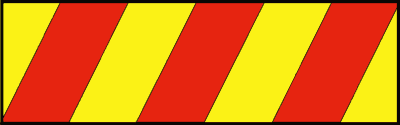
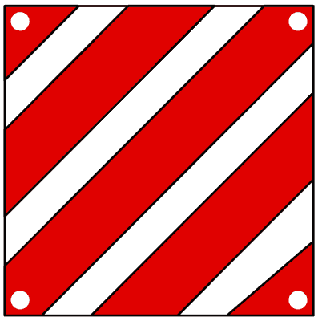
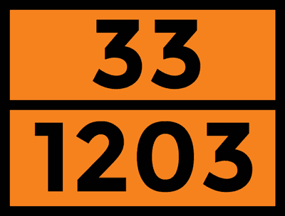

# Capitolo 17 - Norme varie e autostrade
### السير على الطرق السريعة وقواعد متنوعة

- 📁 **المجلد المحلي للباب:** `Capitolo_17_norme_varie_autostrade_pannelli`

## 📌 Ingombro carreggiata caduta carico (5 domande)

**1.** Nel caso di ingombro della carreggiata per caduta accidentale del carico il conducente deve provvedere a rimuovere il carico, se possibile

- **الإجابة:** `VERO ✅ (صح)`

---

**2.** Su strada extraurbana, nel caso di ingombro della carreggiata per caduta accidentale del carico, il conducente deve presegnalare l'ostacolo mediante il segnale di veicolo fermo (triangolo)

- **الإجابة:** `VERO ✅ (صح)`

---

**3.** Nel caso di ingombro della carreggiata per caduta accidentale del carico il conducente deve rendere sollecitamente libero, per quanto possibile, il transito

- **الإجابة:** `VERO ✅ (صح)`

---

**4.** Nel caso di ingombro della carreggiata per caduta accidentale del carico il conducente deve presegnalare l'ostacolo mediante il segnale di STOP

- **الإجابة:** `FALSO ❌ (خطأ)`

---

**5.** Nel caso di ingombro della carreggiata per caduta accidentale del carico il conducente deve restare a bordo del veicolo in attesa dei soccorsi

- **الإجابة:** `FALSO ❌ (خطأ)`

---

## 📌 Ingombro avaria (8 domande)

**6.** In caso di ingombro della carreggiata per avaria del veicolo, il conducente deve sollecitamente rendere libero il transito per il traffico sopraggiungente

- **الإجابة:** `VERO ✅ (صح)`

---

**7.** In caso di ingombro della carreggiata per avaria del veicolo, il conducente deve spingere il veicolo stesso fuori della carreggiata o, se ciò non è possibile, collocarlo sul margine destro della carreggiata

- **الإجابة:** `VERO ✅ (صح)`

---

**8.** In caso di ingombro della carreggiata per caduta del carico o per qualsiasi altra causa, il conducente deve rimuovere l'ingombro, per quanto possibile

- **الإجابة:** `VERO ✅ (صح)`

---

**9.** Su strada extraurbana, nel caso di incidente che provochi l'ingombro della carreggiata per la presenza di veicoli danneggiati che non è possibile rimuovere, il conducente o i passeggeri devono presegnalare la zona mediante il segnale triangolare mobile di pericolo

- **الإجابة:** `VERO ✅ (صح)`

---

**10.** In caso di ingombro della carreggiata per avaria del veicolo, il conducente non è tenuto a spostarlo, in attesa dei soccorsi, se il traffico è scarso

- **الإجابة:** `FALSO ❌ (خطأ)`

---

**11.** Nel caso di ingombro della carreggiata per caduta accidentale del carico il conducente deve evitare di spostarlo per consentire la ricostruzione corretta dell'accaduto

- **الإجابة:** `FALSO ❌ (خطأ)`

---

**12.** Nel caso di ingombro della carreggiata per avaria del veicolo che non è possibile spostare, il conducente deve informare l'organo di polizia, senza dover opportunamente presegnalare la zona.

- **الإجابة:** `FALSO ❌ (خطأ)`

---

**13.** Nel caso di ingombro della carreggiata per caduta del carico non removibile, il conducente può evitare di informare un organo di polizia se presegnala la zona con efficaci segnali manuali

- **الإجابة:** `FALSO ❌ (خطأ)`

---

## 📌 Caduta spargimento materie pericolose (7 domande)

**14.** Chiunque non abbia potuto evitare la caduta o lo spargimento di materie viscide, infiammabili o comunque pericolose, deve, tra l'altro, presegnalare la zona con il segnale mobile di pericolo anche in mezzo alla carreggiata

- **الإجابة:** `VERO ✅ (صح)`

---

**15.** Chiunque non abbia potuto evitare la caduta o lo spargimento di materie pericolose, deve, tra l'altro, eseguire segnali manuali per impedire il transito dei veicoli dalla parte dove non è stato posto il segnale mobile di pericolo

- **الإجابة:** `VERO ✅ (صح)`

---

**16.** Chiunque non abbia potuto evitare la caduta o lo spargimento di materie viscide, infiammabili o pericolose, deve, tra l'altro, rimuoverle o spargere sul terreno, se possibile, sabbia, terra, segatura o altro materiale idoneo a ripristinare l'aderenza

- **الإجابة:** `VERO ✅ (صح)`

---

**17.** Su strada extraurbana, chiunque non abbia potuto evitare la caduta o lo spargimento di materie viscide, infiammabili o comunque pericolose deve, tra l'altro, presegnalare la zona con il segnale mobile di pericolo posto anche in mezzo alla carreggiata

- **الإجابة:** `VERO ✅ (صح)`

---

**18.** Il conducente di un autoveicolo che non abbia potuto evitare lo spargimento di materie pericolose, può evitare di presegnalare la zona con il segnale mobile di pericolo se esegue segnali sonori per allontanare gli altri veicoli

- **الإجابة:** `FALSO ❌ (خطأ)`

---

**19.** Chiunque non abbia potuto evitare la caduta di materie viscide, deve deviare il traffico in attesa che l'ente proprietario della strada intervenga per ripristinare le condizioni ottimali

- **الإجابة:** `FALSO ❌ (خطأ)`

---

**20.** Chiunque non abbia potuto evitare la caduta o lo spargimento di materie pericolose deve, tra l'altro, eseguire segnali manuali atti a segnalare il pericolo, solo dalla parte dove è stato posto il segnale triangolare mobile di pericolo

- **الإجابة:** `FALSO ❌ (خطأ)`

---

## 📌 Segnale mobile triangolare (15 domande)

**21.** Fuori dei centri abitati, di notte, quando mancano o sono insufficienti le luci posteriori di posizione o di emergenza, è obbligatorio presegnalare il veicolo, fermo sulla carreggiata, con il segnale triangolare mobile di pericolo

- **الإجابة:** `VERO ✅ (صح)`

---

**22.** Fuori dei centri abitati, di notte, è obbligatorio presegnalare con il segnale triangolare mobile di pericolo ogni carico caduto accidentalmente dal veicolo sulla carreggiata

- **الإجابة:** `VERO ✅ (صح)`

---

**23.** Fuori dei centri abitati, è obbligatorio anche di giorno presegnalare un veicolo fermo sulla carreggiata mediante il segnale triangolare di pericolo quando non può essere visto nettamente a 100 metri di distanza

- **الإجابة:** `VERO ✅ (صح)`

---

**24.** Fuori dei centri abitati è obbligatorio, anche di giorno, presegnalare un carico accidentalmente caduto sulla carreggiata mediante il segnale triangolare mobile di pericolo, quando l’ingombro non può essere visto nettamente a 100 metri di distanza

- **الإجابة:** `VERO ✅ (صح)`

---

**25.** Il segnale mobile triangolare di pericolo fa parte dell'equipaggiamento obbligatorio degli autoveicoli

- **الإجابة:** `VERO ✅ (صح)`

---

**26.** Il segnale mobile triangolare di pericolo deve essere posto dietro al veicolo o all'ostacolo da segnalare, ad almeno 50 metri

- **الإجابة:** `VERO ✅ (صح)`

---

**27.** Nel caso di intersezione a distanza inferiore a 50 metri, il segnale mobile triangolare di pericolo deve essere posto dietro al veicolo nella posizione più idonea ad essere avvistato

- **الإجابة:** `VERO ✅ (صح)`

---

**28.** Il segnale mobile triangolare di pericolo deve essere posto sulla carreggiata in modo che sia visibile ad una distanza di almeno 100 metri dai veicoli sopraggiungenti

- **الإجابة:** `VERO ✅ (صح)`

---

**29.** Fuori dei centri abitati, di notte, quando mancano o sono insufficienti le luci posteriori di posizione o di emergenza, è consigliabile presegnalare il veicolo fermo sulla carreggiata, con il segnale triangolare mobile di pericolo

- **الإجابة:** `FALSO ❌ (خطأ)`

---

**30.** Il triangolo mobile di pericolo deve essere obbligatoriamente usato per segnalare il veicolo fermo per avaria di notte, se l'ostacolo non è visibile ad almeno 150 metri di distanza

- **الإجابة:** `FALSO ❌ (خطأ)`

---

**31.** Fuori dei centri abitati, è facoltativo presegnalare, anche di giorno, un carico accidentalmente caduto sulla carreggiata mediante il segnale di pericolo, quando non può essere visto nettamente a 100 metri di distanza

- **الإجابة:** `FALSO ❌ (خطأ)`

---

**32.** Di notte, quando mancano o sono insufficienti le luci posteriori di posizione o di emergenza, è obbligatorio presegnalare il veicolo fermo con il segnale triangolare mobile di pericolo anche nei centri abitati

- **الإجابة:** `FALSO ❌ (خطأ)`

---

**33.** Di notte, quando mancano o sono insufficienti le luci posteriori di posizione, è obbligatorio presegnalare velocipedi, ciclomotori e motocicli fermi con il segnale triangolare mobile di pericolo anche nei centri abitati

- **الإجابة:** `FALSO ❌ (خطأ)`

---

**34.** Il segnale mobile triangolare di pericolo deve essere posto sul carico accidentalmente caduto sulla carreggiata

- **الإجابة:** `FALSO ❌ (خطأ)`

---

**35.** Il segnale mobile triangolare di pericolo deve essere posto sulla carreggiata in modo che sia visibile ad una distanza di almeno 50 metri dai veicoli sopraggiungenti

- **الإجابة:** `FALSO ❌ (خطأ)`

---

## 📌 Posizione triangolo (4 domande)

**36.** Il segnale mobile triangolare di pericolo deve essere posto sulla corsia occupata dal veicolo fermo o dal carico caduto

- **الإجابة:** `VERO ✅ (صح)`

---

**37.** Il segnale mobile triangolare di pericolo deve essere posto sulla carreggiata ad almeno un metro dal bordo esterno di essa

- **الإجابة:** `VERO ✅ (صح)`

---

**38.** Nel caso di carreggiata a più corsie, il segnale mobile triangolare di pericolo deve essere posto sulla corsia immediatamente a sinistra del veicolo fermo o del carico caduto

- **الإجابة:** `FALSO ❌ (خطأ)`

---

**39.** Il segnale mobile triangolare di pericolo deve essere posto sulla carreggiata ad almeno un metro dalla striscia di separazione dei sensi di marcia

- **الإجابة:** `FALSO ❌ (خطأ)`

---

## 📌 Giubbotto alta visibilita (7 domande)

**40.** Durante le operazioni di presegnalazione con il segnale mobile di pericolo il conducente deve rendersi visibile indossando il giubbotto o le bretelle retroriflettenti ad alta visibilità

- **الإجابة:** `VERO ✅ (صح)`

---

**41.** Il giubbotto o le bretelle retroriflettenti ad alta visibilità da usare durante le operazioni di presegnalazione con il segnale mobile di pericolo devono essere di tipo approvato

- **الإجابة:** `VERO ✅ (صح)`

---

**42.** Durante le operazioni di presegnalazione con il segnale mobile di pericolo il conducente deve indossare il giubbotto ad alta visibilità anche se si trova sulle corsie di emergenza o sulle piazzole di sosta

- **الإجابة:** `VERO ✅ (صح)`

---

**43.** Per effettuare le operazioni di presegnalazione con il segnale mobile di pericolo è vietato al conducente scendere dal veicolo e circolare sulla strada senza indossare il giubbotto ad alta visibilità

- **الإجابة:** `VERO ✅ (صح)`

---

**44.** Durante le operazioni di presegnalazione con il segnale mobile di pericolo è facoltativo l'uso del giubbotto o delle bretelle retroriflettenti ad alta visibilità

- **الإجابة:** `FALSO ❌ (خطأ)`

---

**45.** Durante le operazioni di presegnalazione con il segnale mobile di pericolo il conducente non deve indossare il giubbotto ad alta visibilità se si trova sulle corsie di emergenza o sulle piazzole di sosta

- **الإجابة:** `FALSO ❌ (خطأ)`

---

**46.** Il conducente deve indossare il giubbotto ad alta visibilità di notte, anche nei centri abitati, qualora debba fermarsi sulla carreggiata perché il suo veicolo ha un guasto

- **الإجابة:** `FALSO ❌ (خطأ)`

---

## 📌 Divieto circolazione (12 domande)

**47.** Sulle autostrade e strade extraurbane principali è vietata la circolazione di velocipedi, ciclomotori, motocicli di cilindrata inferiore a 150 cm3

- **الإجابة:** `VERO ✅ (صح)`

---

**48.** Sulle autostrade e strade extraurbane principali è vietata la circolazione di autovetture che non sono in grado di sviluppare per costruzione la velocità in piano di almeno 80 km/h

- **الإجابة:** `VERO ✅ (صح)`

---

**49.** Sulle autostrade e strade extraurbane principali è vietata la circolazione di macchine agricole

- **الإجابة:** `VERO ✅ (صح)`

---

**50.** Sulle autostrade e strade extraurbane principali è vietata la circolazione di veicoli con carico disordinato e non solidamente assicurato o sporgente oltre i limiti consentiti

- **الإجابة:** `VERO ✅ (صح)`

---

**51.** Sulle autostrade e strade extraurbane principali è vietata la circolazione di veicoli a tenuta non stagna e con carico scoperto, se trasportano materiali che possono disperdersi

- **الإجابة:** `VERO ✅ (صح)`

---

**52.** Sulle autostrade e strade extraurbane principali è vietata la circolazione di veicoli le cui condizioni di uso, equipaggiamento e gommatura possono costituire pericolo per la circolazione

- **الإجابة:** `VERO ✅ (صح)`

---

**53.** Sulle autostrade e strade extraurbane principali è vietata la circolazione di autobus per trasporto di studenti

- **الإجابة:** `FALSO ❌ (خطأ)`

---

**54.** Sulle autostrade e strade extraurbane principali è consigliabile evitare la circolazione di veicoli a tenuta non stagna e con carico scoperto, se trasportano materiali che possono disperdersi

- **الإجابة:** `FALSO ❌ (خطأ)`

---

**55.** Sulle autostrade e strade extraurbane principali è vietata la circolazione di veicoli che trasportano animali vivi.

- **الإجابة:** `FALSO ❌ (خطأ)`

---

**56.** Sono ammessi a circolare su autostrade e strade extraurbane principali i ciclomotori che sviluppano una velocità di almeno 50 km/h

- **الإجابة:** `FALSO ❌ (خطأ)`

---

**57.** Sono ammesse a circolare su autostrade e strade extraurbane principali le macchine agricole, non trainanti un rimorchio

- **الإجابة:** `FALSO ❌ (خطأ)`

---

**58.** Sono ammessi a circolare su autostrade e strade extraurbane principali i veicoli non muniti di pneumatici, se assicurati

- **الإجابة:** `FALSO ❌ (خطأ)`

---

## 📌 Traino veicoli avaria (6 domande)

**59.** Sulle autostrade e strade extraurbane principali è vietata la circolazione di pedoni e animali, ad eccezione delle aree di servizio e delle aree di sosta

- **الإجابة:** `VERO ✅ (صح)`

---

**60.** Nelle aree di servizio e nelle aree di sosta delle autostrade e delle strade extraurbane principali gli animali possono circolare solo se debitamente custoditi

- **الإجابة:** `VERO ✅ (صح)`

---

**61.** Lungo le corsie di emergenza delle autostrade i pedoni possono transitare solo per raggiungere i punti per le richieste di soccorso

- **الإجابة:** `VERO ✅ (صح)`

---

**62.** In autostrada, il traino di veicoli in avaria su carreggiate, rampe, svincoli, aree di servizio o di parcheggio è consentito solo ai veicoli di soccorso autorizzati

- **الإجابة:** `VERO ✅ (صح)`

---

**63.** Sulle autostrade e strade extraurbane principali è vietata la circolazione di pedoni e animali, anche nelle aree di servizio e nelle aree di sosta

- **الإجابة:** `FALSO ❌ (خطأ)`

---

**64.** Nelle aree di servizio e nelle aree di sosta delle autostrade e delle strade extraurbane principali gli animali non possono circolare neppure se debitamente custoditi

- **الإجابة:** `FALSO ❌ (خطأ)`

---

## 📌 Aree servizio (8 domande)

**65.** Sulle carreggiate, sulle rampe, sugli svincoli, sulle aree di servizio o di parcheggio e in ogni altra pertinenza autostradale è vietato richiedere o concedere passaggi

- **الإجابة:** `VERO ✅ (صح)`

---

**66.** Nelle aree di servizio o di parcheggio delle autostrade e in ogni altra pertinenza autostradale è possibile svolgere attività commerciali solo se autorizzate dall'ente proprietario della strada

- **الإجابة:** `VERO ✅ (صح)`

---

**67.** Sulle carreggiate, sulle rampe, sugli svincoli, sulle aree di servizio o di parcheggio e in ogni altra pertinenza autostradale è consentito campeggiare, solo nelle aree a ciò destinate e per il periodo stabilito dall'ente proprietario della strada

- **الإجابة:** `VERO ✅ (صح)`

---

**68.** Nelle aree di servizio delle autostrade, il conducente non deve lasciare in sosta il veicolo per più di 24 ore

- **الإجابة:** `VERO ✅ (صح)`

---

**69.** Nelle autostrade è consentito concedere passaggi a persone invalide

- **الإجابة:** `FALSO ❌ (خطأ)`

---

**70.** Sulle aree di servizio delle autostrade o di parcheggio è consentito chiedere e concedere passaggi.

- **الإجابة:** `FALSO ❌ (خطأ)`

---

**71.** Sulle aree di servizio o di parcheggio delle autostrade e delle strade extraurbane principali è consentito campeggiare

- **الإجابة:** `FALSO ❌ (خطأ)`

---

**72.** Nelle aree di servizio e di parcheggio delle autostrade la durata massima per la sosta di un veicolo è di tre ore

- **الإجابة:** `FALSO ❌ (خطأ)`

---

## 📌 Proiettori anabbaglianti (2 domande)

**73.** Durante la marcia sulle autostrade e strade extraurbane principali è obbligatorio l'uso dei proiettori anabbaglianti anche di giorno

- **الإجابة:** `VERO ✅ (صح)`

---

**74.** Durante la marcia sulle autostrade e strade extraurbane principali l'uso dei proiettori anabbaglianti è facoltativo in condizioni di perfetta visibilità

- **الإجابة:** `FALSO ❌ (خطأ)`

---

## 📌 Retromarcia inversione marcia (9 domande)

**75.** Sulle carreggiate, sulle rampe e sugli svincoli di autostrade e strade extraurbane principali è vietato invertire il senso di marcia e attraversare lo spartitraffico, anche all'altezza dei varchi

- **الإجابة:** `VERO ✅ (صح)`

---

**76.** Sulle carreggiate, sulle rampe e sugli svincoli di autostrade e strade extraurbane principali è vietato percorrere la carreggiata o parte di essa nel senso di marcia opposto a quello consentito

- **الإجابة:** `VERO ✅ (صح)`

---

**77.** Sulle carreggiate, sulle rampe e sugli svincoli di autostrade e strade extraurbane principali è vietato effettuare la retromarcia

- **الإجابة:** `VERO ✅ (صح)`

---

**78.** E' consentito circolare sulle corsie per la sosta di emergenza delle autostrade e strade extraurbane principali per arrestarsi per avaria del veicolo

- **الإجابة:** `VERO ✅ (صح)`

---

**79.** Sulle corsie per le soste di emergenza delle autostrade è vietato effettuare la retromarcia

- **الإجابة:** `VERO ✅ (صح)`

---

**80.** Sulle carreggiate, sulle rampe e sugli svincoli di autostrade e strade extraurbane principali il conducente può invertire il senso di marcia adottando tutti gli accorgimenti necessari

- **الإجابة:** `FALSO ❌ (خطأ)`

---

**81.** Sulle carreggiate, sulle rampe e sugli svincoli di autostrade e strade extraurbane principali il conducente può invertire il senso di marcia in casi di particolare emergenza

- **الإجابة:** `FALSO ❌ (خطأ)`

---

**82.** Sulle carreggiate, sulle rampe e sugli svincoli di autostrade e strade extraurbane principali il conducente può procedere in senso contrario al normale flusso del traffico, per brevi tratti

- **الإجابة:** `FALSO ❌ (خطأ)`

---

**83.** Sulle autostrade e strade extraurbane principali il conducente può utilizzare la corsia di emergenza se il traffico è intenso

- **الإجابة:** `FALSO ❌ (خطأ)`

---

## 📌 Ingorgo uscita immissione (8 domande)

**84.** Sulle autostrade e sulle strade extraurbane principali il conducente che percorre la corsia di accelerazione deve dare la precedenza ai veicoli in circolazione sulle corsie di marcia

- **الإجابة:** `VERO ✅ (صح)`

---

**85.** Sulle autostrade e sulle strade extraurbane principali, per uscire dalla carreggiata il conducente deve impegnare per tempo la corsia di destra, e quindi immettersi nella corsia di decelerazione dal suo inizio

- **الإجابة:** `VERO ✅ (صح)`

---

**86.** Sulle autostrade e sulle strade extraurbane principali il conducente deve segnalare tempestivamente il cambiamento di corsia servendosi degli indicatori di direzione

- **الإجابة:** `VERO ✅ (صح)`

---

**87.** In caso di ingorgo su strade extraurbane principali o autostrade, se la corsia di emergenza manca o non è sufficiente alla circolazione dei veicoli di polizia o di soccorso, il conducente del veicolo che occupa la prima corsia di destra deve disporsi il più vicino possibile alla striscia di sinistra

- **الإجابة:** `VERO ✅ (صح)`

---

**88.** In caso di ingorgo il conducente può transitare sulla corsia per la sosta di emergenza solo per uscire dall'autostrada, a partire dal cartello di preavviso di uscita posto a 500 metri dallo svincolo

- **الإجابة:** `VERO ✅ (صح)`

---

**89.** Sulle autostrade e sulle strade extraurbane principali, per uscire dalla carreggiata il conducente può immettersi nella corsia di decelerazione anche nel tratto successivo al suo inizio

- **الإجابة:** `FALSO ❌ (خطأ)`

---

**90.** Sulle autostrade e sulle strade extraurbane principali se il traffico non è intenso il conducente non ha l'obbligo di servirsi degli indicatori di direzione per segnalare il cambiamento di corsia

- **الإجابة:** `FALSO ❌ (خطأ)`

---

**91.** Sulle autostrade e sulle strade extraurbane principali è consentita la marcia per file parallele anche in assenza di traffico

- **الإجابة:** `FALSO ❌ (خطأ)`

---

## 📌 Rampe svincoli autostradali (6 domande)

**92.** Sulle carreggiate, sulle rampe e sugli svincoli delle autostrade è consentito sostare solo in situazioni di emergenza dovute a malessere del conducente o dei passeggeri oppure ad inefficienza del veicolo

- **الإجابة:** `VERO ✅ (صح)`

---

**93.** Sulle carreggiate, sulle rampe e sugli svincoli delle autostrade è consentito, nel caso di malessere di un passeggero, fermarsi sulla corsia per la sosta di emergenza

- **الإجابة:** `VERO ✅ (صح)`

---

**94.** Sulle carreggiate, sulle rampe e sugli svincoli delle autostrade la sosta di emergenza non deve superare il tempo strettamente necessario e non deve protrarsi comunque oltre tre ore

- **الإجابة:** `VERO ✅ (صح)`

---

**95.** In caso di malessere di un passeggero durante la circolazione sulla carreggiata autostradale, è consentito fermarsi sulla corsia per la sosta di emergenza

- **الإجابة:** `VERO ✅ (صح)`

---

**96.** Sulle carreggiate, sulle rampe e sugli svincoli delle autostrade è vietato sostare o fermarsi, in caso di malessere dei passeggeri

- **الإجابة:** `FALSO ❌ (خطأ)`

---

**97.** Sulle carreggiate, sulle rampe e sugli svincoli delle autostrade la sosta di emergenza non deve superare il tempo strettamente necessario e può protrarsi fino a 24 ore

- **الإجابة:** `FALSO ❌ (خطأ)`

---

## 📌 Automobilista fermo autostrada (5 domande)

**98.** In autostrada è vietato dare un passaggio ad un automobilista fermo per avaria del veicolo sulla corsia di emergenza

- **الإجابة:** `VERO ✅ (صح)`

---

**99.** Qualora il conducente veda un automobilista fermo con veicolo in avaria in autostrada, lo deve accompagnare fino alla stazione di servizio più vicina

- **الإجابة:** `FALSO ❌ (خطأ)`

---

**100.** Qualora il conducente veda un automobilista fermo per avaria del veicolo in autostrada, si deve fermare a prestare soccorso

- **الإجابة:** `FALSO ❌ (خطأ)`

---

**101.** Qualora il conducente veda un automobilista fermo per avaria del veicolo in autostrada, se lo ha superato può retrocedere con prudenza per soccorrerlo

- **الإجابة:** `FALSO ❌ (خطأ)`

---

**102.** Qualora il conducente veda un automobilista fermo in autostrada per avaria del veicolo può trainare prudentemente il veicolo, fino al primo casello di uscita

- **الإجابة:** `FALSO ❌ (خطأ)`

---

## 📌 Trasporto animali persone (7 domande)

**103.** Tutti i passeggeri dei veicoli a motore devono prendere posto in modo da non limitare la libertà del conducente e da non impedirgli la visibilità

- **الإجابة:** `VERO ✅ (صح)`

---

**104.** Il numero massimo di posti sulle autovetture è indicato sulla carta di circolazione

- **الإجابة:** `VERO ✅ (صح)`

---

**105.** Sui veicoli è consentito il trasporto di un animale domestico, comunque in condizione da non costituire impedimento o pericolo per la guida

- **الإجابة:** `VERO ✅ (صح)`

---

**106.** Sui veicoli è consentito il trasporto di animali domestici anche in numero superiore ad uno, purché custoditi in gabbia o nel vano posteriore, appositamente diviso da rete

- **الإجابة:** `VERO ✅ (صح)`

---

**107.** Il numero delle persone trasportabili sulle autovetture indicato sulla carta di circolazione non comprende il conducente

- **الإجابة:** `FALSO ❌ (خطأ)`

---

**108.** Il numero delle persone trasportabili sulle autovetture può raggiungere il massimo di dieci

- **الإجابة:** `FALSO ❌ (خطأ)`

---

**109.** Sui veicoli è consentito il trasporto di cani anche in numero superiore ad uno, purché adeguatamente trattenuti al guinzaglio

- **الإجابة:** `FALSO ❌ (خطأ)`

---

## 📌 Trasporto traino motocicli (7 domande)

**110.** Sui motocicli è vietato il trasporto di minori di anni 5

- **الإجابة:** `VERO ✅ (صح)`

---

**111.** E' vietato ai conducenti di motocicli trainare e farsi trainare da altri veicoli

- **الإجابة:** `VERO ✅ (صح)`

---

**112.** Sui motocicli è vietato trasportare oggetti che non siano solidamente assicurati

- **الإجابة:** `VERO ✅ (صح)`

---

**113.** Sui motocicli è vietato trasportare oggetti che impediscano o limitino la visibilità al conducente

- **الإجابة:** `VERO ✅ (صح)`

---

**114.** Sui motocicli è possibile trasportare un passeggero solo se quest'ultimo è maggiorenne

- **الإجابة:** `FALSO ❌ (خطأ)`

---

**115.** E' consentito ai motocicli farsi trainare, ma solo da autovetture

- **الإجابة:** `FALSO ❌ (خطأ)`

---

**116.** Sui motocicli è vietato trasportare oggetti che sporgano longitudinalmente rispetto alla sagoma del veicolo

- **الإجابة:** `FALSO ❌ (خطأ)`

---

## 📌 Sistemazione carico veicoli (6 domande)

**117.** Il carico dei veicoli deve essere sistemato in modo da evitarne la caduta o la dispersione

- **الإجابة:** `VERO ✅ (صح)`

---

**118.** Il carico dei veicoli deve essere sistemato in modo da non diminuire la visibilità al conducente né impedirgli la libertà dei movimenti nella guida

- **الإجابة:** `VERO ✅ (صح)`

---

**119.** Il carico dei veicoli deve essere sistemato in modo da non compromettere la stabilità del veicolo

- **الإجابة:** `VERO ✅ (صح)`

---

**120.** Il carico dei veicoli deve essere sistemato in modo da non mascherare dispositivi di illuminazione e di segnalazione visiva né le targhe di riconoscimento e i segnali fatti col braccio

- **الإجابة:** `VERO ✅ (صح)`

---

**121.** Il carico del veicolo deve essere sistemato in modo da evitarne la caduta o la dispersione solo se il conducente deve condurre il veicolo su strada extraurbana

- **الإجابة:** `FALSO ❌ (خطأ)`

---

**122.** Il carico dei veicoli deve essere sistemato in modo da non mascherare dispositivi di illuminazione e di segnalazione visiva soltanto durante la circolazione notturna

- **الإجابة:** `FALSO ❌ (خطأ)`

---

## 📌 Sporgenza carico (9 domande)

**123.** Il carico non deve superare il limite di sagoma stabilito per ogni tipo di veicolo

- **الإجابة:** `VERO ✅ (صح)`

---

**124.** Sugli autoveicoli, il carico non può sporgere longitudinalmente dalla parte anteriore

- **الإجابة:** `VERO ✅ (صح)`

---

**125.** Il carico può sporgere longitudinalmente dalla parte posteriore, se costituito da cose indivisibili, fino ai 3/10 della lunghezza dell'autoveicolo

- **الإجابة:** `VERO ✅ (صح)`

---

**126.** Sugli autoveicoli possono essere trasportate cose che sporgono lateralmente fuori della loro sagoma non più di 30 centimetri dalle luci di posizione anteriori e posteriori (comunque entro i limiti massimi di sagoma)

- **الإجابة:** `VERO ✅ (صح)`

---

**127.** E' vietato trasportare o trainare cose che strisciano sul terreno, anche se in parte sostenute da ruote

- **الإجابة:** `VERO ✅ (صح)`

---

**128.** Se il carico sporge oltre la sagoma del veicolo, il conducente deve adottare tutte le cautele idonee ad evitare pericolo agli altri utenti della strada

- **الإجابة:** `VERO ✅ (صح)`

---

**129.** Il carico deve essere sistemato sul veicolo in modo da segnalarne la sporgenza posteriore con il pannello retroriflettente in figura

- **الإجابة:** `FALSO ❌ (خطأ)`
- 

---

**130.** Il carico può sporgere lateralmente, se costituito da cose indivisibili, fino ai 3/10 della larghezza del veicolo

- **الإجابة:** `FALSO ❌ (خطأ)`

---

**131.** E' consentito trasportare o trainare cose che strisciano sul terreno se in parte sostenute da ruote

- **الإجابة:** `FALSO ❌ (خطأ)`

---

## 📌 Sporgenza longitudinale (7 domande)

**132.** La sporgenza longitudinale del carico, fino ai 3/10 della lunghezza del veicolo, deve essere segnalata mediante uno o due pannelli quadrangolari in figura

- **الإجابة:** `VERO ✅ (صح)`
- 

---

**133.** Il pannello in figura deve essere applicato in ogni caso in cui il carico sporge posteriormente, anche se di poco

- **الإجابة:** `VERO ✅ (صح)`
- 

---

**134.** Il pannello in figura segnala carichi indivisibili che sporgono dalla parte posteriore del veicolo

- **الإجابة:** `VERO ✅ (صح)`
- 

---

**135.** Se il carico sporge longitudinalmente per l'intera larghezza della parte posteriore del veicolo, i pannelli in figura devono essere due, posti trasversalmente alle due estremità del carico

- **الإجابة:** `VERO ✅ (صح)`
- 

---

**136.** La sporgenza longitudinale del carico, fino ai 3/10 della lunghezza del veicolo, deve essere segnalata mediante uno o due pannelli in figura

- **الإجابة:** `FALSO ❌ (خطأ)`
- 

---

**137.** Il pannello in figura segnala carichi indivisibili che sporgono dalla parte posteriore destra

- **الإجابة:** `FALSO ❌ (خطأ)`
- 

---

**138.** Se il carico sporge longitudinalmente per l'intera larghezza della parte posteriore del veicolo, si devono applicare due pannelli retroriflettenti in figura

- **الإجابة:** `FALSO ❌ (خطأ)`
- 

---

## 📌 Pannelli gialli arancioni (6 domande)

**139.** Il pannello arancione retroriflettente in figura segnala veicoli che stanno trasportando merci pericolose

- **الإجابة:** `VERO ✅ (صح)`
- 

---

**140.** Il pannello in figura facilita l'individuazione dalla parte posteriore di autocarri con massa a pieno carico superiore a 3,5 tonnellate

- **الإجابة:** `VERO ✅ (صح)`
- 

---

**141.** Il pannello giallo in figura posto nella parte posteriore del rimorchio individua un autotreno o un autoarticolato

- **الإجابة:** `VERO ✅ (صح)`
- 

---

**142.** Il pannello arancione retroriflettente riprodott0 in figura è collocato posteriormente per segnalare carichi sporgenti pericolosi

- **الإجابة:** `FALSO ❌ (خطأ)`
- 

---

**143.** I pannelli in figura sono posti sulla carreggiata per segnalare un ostacolo

- **الإجابة:** `FALSO ❌ (خطأ)`
- 

---

**144.** Il pannello in figura deve essere applicato posteriormente agli autobus di massa totale superiore a 3,5 tonnellate

- **الإجابة:** `FALSO ❌ (خطأ)`
- 

---

## 📌 Regole traino veicoli (9 domande)

**145.** Nessun veicolo può trainare o essere trainato da più di un veicolo (salvo il caso di trasporti eccezionali)

- **الإجابة:** `VERO ✅ (صح)`

---

**146.** Un autoveicolo può trainare un veicolo che non sia un rimorchio se questo non può più circolare per avaria o per mancanza di organi essenziali

- **الإجابة:** `VERO ✅ (صح)`

---

**147.** Il traino per situazione di emergenza di un veicolo da parte di un altro deve avvenire attraverso un solido collegamento, come fune, catena, cavo, barra rigida, purché idoneamente segnalati

- **الإجابة:** `VERO ✅ (صح)`

---

**148.** Il traino per incombente situazione di emergenza di un veicolo in avaria deve avvenire attraverso un solido collegamento, purché idoneamente segnalato per rendere i veicoli chiaramente avvistabili dagli altri utenti della strada

- **الإجابة:** `VERO ✅ (صح)`

---

**149.** Qualora, in situazione di emergenza, il conducente traini con il suo veicolo un altro veicolo senza rispettare le prescrizioni relative alla solidità del collegamento è punito con la sottrazione di 2 punti dalla patente

- **الإجابة:** `VERO ✅ (صح)`

---

**150.** In autostrada, un autoveicolo può trainare un veicolo che non sia un rimorchio, se questo non può più circolare per qualsiasi grave motivo

- **الإجابة:** `FALSO ❌ (خطأ)`

---

**151.** Il traino per incombente situazione di emergenza di un veicolo in avaria deve avvenire attraverso un solido collegamento, anche se non è possibile segnalarlo

- **الإجابة:** `FALSO ❌ (خطأ)`

---

**152.** Durante le operazioni di traino di un veicolo in avaria, il veicolo trainato deve mantenere accese le luci posteriori in mancanza di altra idonea segnalazione

- **الإجابة:** `FALSO ❌ (خطأ)`

---

**153.** Qualora, in situazione di emergenza, il conducente traini con il suo veicolo un altro veicolo senza rispettare le prescrizioni relative alla solidità del collegamento è punito con la sottrazione di 4 punti dalla patente

- **الإجابة:** `FALSO ❌ (خطأ)`

---

## 📌 Ciclisti velocipedi (9 domande)

**154.** Il conducente di un'autovettura deve considerare i rischi che, sulla strada, sono legati alla presenza di velocipedi, mezzi dotati di massa modesta e caratterizzati da basse velocità e possibili oscillazioni trasversali

- **الإجابة:** `VERO ✅ (صح)`

---

**155.** Il conducente di un'autovettura o di un motociclo deve adattare la propria guida anche ai rischi legati alla presenza di velocipedi nel traffico

- **الإجابة:** `VERO ✅ (صح)`

---

**156.** Il conducente di un'autovettura deve prestare particolare attenzione per la presenza nel traffico di velocipedi utilizzati da conducenti giovanissimi e inesperti o da anziani

- **الإجابة:** `VERO ✅ (صح)`

---

**157.** Per un ciclista che si accinge ad effettuare una manovra è molto difficile valutare la velocità di avvicinamento dei veicoli a motore presenti nel traffico

- **الإجابة:** `VERO ✅ (صح)`

---

**158.** Il conducente di un'autovettura deve prevedere la difficoltà di valutazione della velocità del proprio veicolo da parte di un ciclista che, trovandosi sulla stessa corsia di marcia, si accinge a svoltare a sinistra

- **الإجابة:** `VERO ✅ (صح)`

---

**159.** Il conducente deve esercitare particolare prudenza guidando in presenza di ciclista anziano che, per ispezionare la strada alle proprie spalle, esegue con difficoltà e lentezza la torsione del busto a causa dell'età avanzata

- **الإجابة:** `VERO ✅ (صح)`

---

**160.** La presenza nel traffico extraurbano di bambini in bicicletta, anche se affiancati, non rappresenta un rischio per chi guida un autoveicolo, data la loro modesta velocità

- **الإجابة:** `FALSO ❌ (خطأ)`

---

**161.** I ciclisti possono viaggiare in tutta sicurezza nel traffico extraurbano perché i conducenti dei veicoli a motore sono sempre capaci di prevedere eventuali loro cadute o pericolosi sbandamenti dovuti ad irregolarità del fondo stradale

- **الإجابة:** `FALSO ❌ (خطأ)`

---

**162.** La velocità di avvicinamento di un'autovettura, soprattutto su strade extraurbane, è facilmente valutabile a distanza da parte di un ciclista che procede lentamente

- **الإجابة:** `FALSO ❌ (خطأ)`

---

## 📌 Conducente autovettura autoveicolo (9 domande)

**163.** Il conducente di un'autovettura deve costantemente ricordare il rischio derivante dalla presenza nel traffico di ciclomotoristi dotati di limitata esperienza di guida a causa della giovane età

- **الإجابة:** `VERO ✅ (صح)`

---

**164.** La manovra di svolta a sinistra è particolarmente pericolosa per un ciclomotore che deve interferire con la traiettoria di una o più colonne di veicoli più veloci sopraggiungenti nella stessa direzione

- **الإجابة:** `VERO ✅ (صح)`

---

**165.** Il conducente di autoveicolo deve valutare con prudenza, in relazione alla propria velocità, la distanza che lo separa da un ciclomotorista che si accinge a svoltare

- **الإجابة:** `VERO ✅ (صح)`

---

**166.** Il conducente di autoveicolo deve prevedere manovre improvvise altrui, come il procedere a zig-zag di un ciclomotore

- **الإجابة:** `VERO ✅ (صح)`

---

**167.** Il conducente di autoveicolo o motoveicolo deve rispettare la distanza di sicurezza laterale da ciclisti o ciclomotoristi per evitare di metterne a repentaglio l'equilibrio nella guida

- **الإجابة:** `VERO ✅ (صح)`

---

**168.** Il conducente di autoveicolo deve evitare deviazioni trasversali, anche modeste, del proprio veicolo soprattutto in presenza di ciclomotoristi o ciclisti per evitarne la possibile caduta a terra

- **الإجابة:** `VERO ✅ (صح)`

---

**169.** Il conducente di autoveicolo deve rispettare le norme della circolazione, ma non è tenuto a prevedere le possibili imprudenze del ciclomotorista che lo affianca sulla strada

- **الإجابة:** `FALSO ❌ (خطأ)`

---

**170.** Risulta facile al conducente di un autoveicolo valutare la distanza che lo separa da un ciclomotorista che rallenta bruscamente per svoltare in una strada non sufficientemente segnalata

- **الإجابة:** `FALSO ❌ (خطأ)`

---

**171.** Il conducente di un'autovettura può superare a velocità sostenuta, pur rispettando i limiti, un ciclomotorista nonostante la scarsa distanza di sicurezza laterale

- **الإجابة:** `FALSO ❌ (خطأ)`

---

## 📌 Rischi strade extraurbane (5 domande)

**172.** Il conducente di autovettura deve conoscere i rischi derivanti dalla presenza, soprattutto su strade extraurbane, di mezzi particolarmente lenti, come ciclomotori a tre ruote

- **الإجابة:** `VERO ✅ (صح)`

---

**173.** Per un'autovettura che procede a velocità sostenuta, pur rispettando i limiti su strada extraurbana a due sole corsie, un ciclomotore a tre ruote costituisce un potenziale pericolo, soprattutto se effettua manovre improvvise

- **الإجابة:** `VERO ✅ (صح)`

---

**174.** Per il conducente di un'autovettura che procede a velocità regolare su strada extraurbana, può risultare difficoltosa la valutazione della velocità di una macchina agricola che, in genere, procede lentamente

- **الإجابة:** `VERO ✅ (صح)`

---

**175.** La presenza di veicoli che possono raggiungere velocità molto diverse tra loro, soprattutto su strada extraurbana, costituisce un fattore di sicurezza

- **الإجابة:** `FALSO ❌ (خطأ)`

---

**176.** Risulta facile la valutazione dei tempi di avvicinamento ad un veicolo lento per un'autovettura che, specialmente su strada extraurbana, viaggia a velocità sostenuta pur rispettando i limiti

- **الإجابة:** `FALSO ❌ (خطأ)`

---

## 📌 Massa veicoli (5 domande)

**177.** Risulta maggiormente pericolosa la collisione tra veicoli dotati di masse molto diverse tra loro

- **الإجابة:** `VERO ✅ (صح)`

---

**178.** Guidando una piccola autovettura è necessario valutare i maggiori rischi derivanti da possibili tamponamenti o collisioni con autovettura di massa superiore

- **الإجابة:** `VERO ✅ (صح)`

---

**179.** Un'autovettura dotata di notevole massa costituisce, nella circolazione, una garanzia di sicurezza anche per gli altri veicoli di dimensioni e di massa inferiori

- **الإجابة:** `FALSO ❌ (خطأ)`

---

**180.** I veicoli sono tanto più sicuri, nella circolazione, quanto più le loro masse sono differenziate

- **الإجابة:** `FALSO ❌ (خطأ)`

---

**181.** Le grandi differenze di prestazioni e di masse fra le autovetture facilitano una buona sicurezza stradale

- **الإجابة:** `FALSO ❌ (خطأ)`

---

## 📌 Conducente fuoristrada (6 domande)

**182.** Il conducente di un fuoristrada (Suv) deve guidare con la massima prudenza, consapevole che l'altezza e la massa del proprio veicolo costituiscono un potenziale pericolo per pedoni, ciclisti e autovetture di modeste dimensioni

- **الإجابة:** `VERO ✅ (صح)`

---

**183.** I conducenti dei fuoristrada (Suv) debbono considerare i gravi danni che i paraurti sporgenti e rafforzati del proprio mezzo possono determinare nel caso di impatto con veicoli più piccoli

- **الإجابة:** `VERO ✅ (صح)`

---

**184.** Il conducente di fuoristrada (Suv) deve ricordare che la guida di tale veicolo è particolarmente impegnativa in città e che richiede particolari cautele soprattutto nelle manovre di emergenza

- **الإجابة:** `VERO ✅ (صح)`

---

**185.** La guida di un fuoristrada (Suv), dotato di massa notevole e di altezza superiore alle autovetture, garantisce la massima sicurezza per gli occupanti del veicolo stesso e per gli altri utenti della strada

- **الإجابة:** `FALSO ❌ (خطأ)`

---

**186.** Nel caso di collisione o di tamponamento, i paraurti sporgenti e rafforzati (bull bars) rendono i fuoristrada meno pericolosi per gli altri veicoli

- **الإجابة:** `FALSO ❌ (خطأ)`

---

**187.** La guida di un fuoristrada (Suv) risulta particolarmente indicata all'interno dei centri abitati

- **الإجابة:** `FALSO ❌ (خطأ)`

---

## 📌 Valutazioni pericolo (3 domande)

**188.** Alla guida di un'autovettura è opportuno valutare costantemente la potenziale pericolosità dei veicoli industriali e degli autobus, a causa della loro massa notevolmente maggiore

- **الإجابة:** `VERO ✅ (صح)`

---

**189.** Il conducente di motociclo o di autovettura deve saper valutare nella guida gli alti rischi derivanti da autocarri, autotreni o autoarticolati che non rispettano i limiti di velocità

- **الإجابة:** `VERO ✅ (صح)`

---

**190.** Autocarri, autotreni e autoarticolati, per la loro massa notevole, non costituiscono, per un'autovettura o per un motociclo, rischi potenziali maggiori rispetto a qualsiasi altro veicolo

- **الإجابة:** `FALSO ❌ (خطأ)`

---

## 📌 Campo visibilita (7 domande)

**191.** Nonostante le caratteristiche costruttive del veicolo rendano possibile un adeguato campo di visibilità, durante la guida il conducente deve attentamente visualizzare l'area antistante e limitrofa

- **الإجابة:** `VERO ✅ (صح)`

---

**192.** Per il conducente il campo di visibilità può essere ridotto sia da uno dei poggiatesta sia da elementi della carrozzeria della propria autovettura che possono impedire accidentalmente l'avvistamento di altri utenti della strada

- **الإجابة:** `VERO ✅ (صح)`

---

**193.** Per consentire una adeguata visibilità è vietato applicare pellicole adesive sul parabrezza e sui vetri laterali anteriori dei veicoli

- **الإجابة:** `VERO ✅ (صح)`

---

**194.** I pedoni e soprattutto i bambini rischiano di rimanere fuori dal campo visivo del conducente di un veicolo fuoristrada (Suv) a causa delle dimensioni del mezzo

- **الإجابة:** `VERO ✅ (صح)`

---

**195.** Il conducente può limitarsi ad un controllo visivo affrettato dell'area immediatamente antistante il veicolo poiché il suo mezzo dispone per costruzione di un adeguato campo di visibilità

- **الإجابة:** `FALSO ❌ (خطأ)`

---

**196.** E' consentito applicare sui vetri laterali anteriori e sul parabrezza pellicole adesive, a condizione che siano di materiale rimovibile

- **الإجابة:** `FALSO ❌ (خطأ)`

---

**197.** I veicoli fuoristrada presentano un'altezza tale da permettere al conducente una adeguata visibilità di tutti i possibili ostacoli in basso (ad esempio, bambini)

- **الإجابة:** `FALSO ❌ (خطأ)`

---

## 📌 Circolazione autocarri (6 domande)

**198.** Prima di riprendere la marcia, il conducente di un autocarro deve prestare particolare attenzione alla possibile presenza di un pedone o di un ciclista nella zona immediatamente antistante il proprio veicolo fermo

- **الإجابة:** `VERO ✅ (صح)`

---

**199.** Il conducente di un autocarro fermo al semaforo deve prevedere la presenza di pedoni e ciclisti il cui avvistamento è precluso dalla sagoma del proprio veicolo

- **الإجابة:** `VERO ✅ (صح)`

---

**200.** La limitata visuale offerta dal parabrezza degli autocarri nella zona immediatamente antistante il veicolo rende pericolosa la fermata di tali mezzi in colonna, qualora siano presenti pedoni o mezzi a due ruote

- **الإجابة:** `VERO ✅ (صح)`

---

**201.** Il campo di visibilità degli autocarri permette il controllo sicuro di tutta la zona immediatamente antistante e laterale

- **الإجابة:** `FALSO ❌ (خطأ)`

---

**202.** Un pedone può attraversare la strada in tutta sicurezza passando a distanza ravvicinata rispetto alla parte frontale di un autocarro fermo in colonna che sta per ripartire, in quanto sicuramente avvistabile dal conducente

- **الإجابة:** `FALSO ❌ (خطأ)`

---

**203.** Quando stanno per riprendere la marcia dopo un arresto al semaforo, i conducenti di autocarri possono facilmente avvistare pedoni o ciclisti che affiancano e sfiorano la parte anteriore dei propri veicoli

- **الإجابة:** `FALSO ❌ (خطأ)`

---

## 📌 Giubbotto retroriflettente (7 domande)

**204.** Il giubbotto o le bretelle retroriflettenti ad alta visibilità possono sostituire, in ogni caso, il triangolo mobile di pericolo

- **الإجابة:** `FALSO ❌ (خطأ)`

---

**205.** Il giubbotto o le bretelle retroriflettenti ad alta visibilità possono essere solo di colore giallo

- **الإجابة:** `FALSO ❌ (خطأ)`

---

**206.** Il giubbotto retroriflettente ad alta visibilità protegge il conducente anche da rischi chimici, calore, fuoco ed elettricità

- **الإجابة:** `FALSO ❌ (خطأ)`

---

**207.** All'interno del veicolo bisogna tenere giubbotti o bretelle retroriflettenti ad alta visibilità, in numero pari a quello dei posti disponibili

- **الإجابة:** `FALSO ❌ (خطأ)`

---

**208.** L'obbligo di indossare il giubbotto ad alta visibilità si ha quando si sosta fuori dai centri abitati, mentre le bretelle retroriflettenti vanno indossate nelle aree urbane

- **الإجابة:** `FALSO ❌ (خطأ)`

---

**209.** Il giubbotto retroriflettente ad alta visibilità serve per chiedere aiuto agli automobilisti in transito

- **الإجابة:** `FALSO ❌ (خطأ)`

---

**210.** Il giubbotto retroriflettente ad alta visibilità è utile solo quando si deve sostituire una ruota forata

- **الإجابة:** `FALSO ❌ (خطأ)`

---

## 📌 Circolazione dietro veicolo (11 domande)

**211.** Circolando dietro ad un veicolo che trasporta un carico in pericolo di cadere, è opportuno aumentare la distanza di sicurezza, specie se si è in salita

- **الإجابة:** `VERO ✅ (صح)`

---

**212.** Circolando dietro ad un veicolo che ha un carico instabile, è opportuno aumentare la distanza di sicurezza e sorpassarlo appena possibile

- **الإجابة:** `VERO ✅ (صح)`

---

**213.** Circolando dietro ad un veicolo che trasporta un carico che sta per cadere, è opportuno avvertire il conducente del potenziale pericolo

- **الإجابة:** `VERO ✅ (صح)`

---

**214.** Circolando dietro ad un veicolo che ha un carico poco sicuro, conviene non stargli troppo vicino, così da riuscire a fermarsi in tempo, in caso di caduta della merce trasportata

- **الإجابة:** `VERO ✅ (صح)`

---

**215.** Circolando dietro ad un veicolo che ha un carico instabile, bisogna stare attenti, soprattutto quando frena o svolta, per la possibile caduta della merce trasportata

- **الإجابة:** `VERO ✅ (صح)`

---

**216.** Circolando dietro ad un veicolo che ha un carico sporgente, può risultare difficile accorgersi che intende svoltare, se gli indicatori di direzione sono nascosti dalla merce penzolante

- **الإجابة:** `VERO ✅ (صح)`

---

**217.** Circolando dietro ad un veicolo che trasporta un carico che sta per cadere, conviene stringersi il più vicino possibile al margine sinistro della carreggiata

- **الإجابة:** `FALSO ❌ (خطأ)`

---

**218.** Circolando dietro ad un veicolo che trasporta un carico poco sicuro, conviene spostarsi lungo il margine sinistro della carreggiata

- **الإجابة:** `FALSO ❌ (خطأ)`

---

**219.** Circolando dietro ad un veicolo che trasporta un carico che sta per cadere, conviene sorpassarlo subito, anche se in curva

- **الإجابة:** `FALSO ❌ (خطأ)`

---

**220.** Circolando dietro ad un veicolo che trasporta un carico che sta per cadere, conviene arrestarsi bruscamente, ripartendo solo quando gli altri veicoli ci abbiano superato

- **الإجابة:** `FALSO ❌ (خطأ)`

---

**221.** Circolando dietro ad un veicolo che trasporta un carico instabile, bisogna diminuire la distanza di sicurezza, in modo che gli altri veicoli rinuncino al sorpasso, non essendovi spazio sufficiente

- **الإجابة:** `FALSO ❌ (خطأ)`

---

## 📌 Traino rimorchio (23 domande)

**222.** Trainare un rimorchio su strade con forti salite fa aumentare la temperatura del liquido di raffreddamento del motore

- **الإجابة:** `VERO ✅ (صح)`

---

**223.** Se si traina un rimorchio aumenta lo spazio di frenatura

- **الإجابة:** `VERO ✅ (صح)`

---

**224.** Trainando un rimorchio leggero, bisogna considerare che è maggiore la forza ribaltante esercitata dal vento

- **الإجابة:** `VERO ✅ (صح)`

---

**225.** Per una maggiore sicurezza, è consigliabile che nel rimorchio il carico venga sistemato in modo che gli oggetti pesanti si trovino il più vicino possibile al suo asse

- **الإجابة:** `VERO ✅ (صح)`

---

**226.** Alla guida di un veicolo con rimorchio, nello svoltare a destra, bisogna fare particolare attenzione a non salire con la ruota posteriore sul marciapiede

- **الإجابة:** `VERO ✅ (صح)`

---

**227.** Quando un veicolo guasto, munito di servosterzo, viene trainato, può risultare faticoso manovrare lo sterzo

- **الإجابة:** `VERO ✅ (صح)`

---

**228.** Prima di trainare un rimorchio, è opportuno accertarsi che gli impianti di illuminazione e di segnalazione funzionino regolarmente

- **الإجابة:** `VERO ✅ (صح)`

---

**229.** Prima di iniziare a trainare un rimorchio, bisogna controllare dagli specchi retrovisori che la visibilità sia adeguata

- **الإجابة:** `VERO ✅ (صح)`

---

**230.** Quando i rimorchi sono staccati dalla motrice, devono avere una copertura assicurativa che vale anche per il rischio statico (da fermo)

- **الإجابة:** `VERO ✅ (صح)`

---

**231.** I rimorchi trainati da autovetture sono muniti, in genere, di freno ad inerzia

- **الإجابة:** `VERO ✅ (صح)`

---

**232.** I rimorchi devono avere targa propria

- **الإجابة:** `VERO ✅ (صح)`

---

**233.** Per garantire una maggiore sicurezza durante la guida di un veicolo con rimorchio, è consigliabile concentrare il carico massimo in corrispondenza del gancio di traino

- **الإجابة:** `FALSO ❌ (خطأ)`

---

**234.** Per poter trainare un rimorchio non occorre effettuare il collegamento elettrico fra motrice e rimorchio

- **الإجابة:** `FALSO ❌ (خطأ)`

---

**235.** Per guidare un'autovettura che traina un veicolo guasto, con conducente a bordo, occorre la patente di guida della categoria E

- **الإجابة:** `FALSO ❌ (خطأ)`

---

**236.** Il conducente a bordo di un veicolo guasto, che viene trainato, può essere privo di patente di guida

- **الإجابة:** `FALSO ❌ (خطأ)`

---

**237.** Se un veicolo guasto viene trainato con le quattro ruote al suolo, occorre inserire la quarta marcia del cambio di velocità

- **الإجابة:** `FALSO ❌ (خطأ)`

---

**238.** Gli organi di traino di un veicolo non devono essere periodicamente lubrificati

- **الإجابة:** `FALSO ❌ (خطأ)`

---

**239.** Gli organi di traino di un veicolo possono non essere omologati, purché vengano trainati rimorchi di massa inferiore a 750 chilogrammi

- **الإجابة:** `FALSO ❌ (خطأ)`

---

**240.** Se si traina un veicolo guasto, munito di servosterzo, lo sterzo risulterà sempre bloccato

- **الإجابة:** `FALSO ❌ (خطأ)`

---

**241.** Trainando un rimorchio nelle forti discese, non occorre tener conto della forza di spinta esercitata dal rimorchio sulla motrice

- **الإجابة:** `FALSO ❌ (خطأ)`

---

**242.** Per trainare un rimorchio leggero non occorre effettuare il collegamento elettrico

- **الإجابة:** `FALSO ❌ (خطأ)`

---

**243.** Quando si traina un veicolo guasto, occorre che la distanza fra i due veicoli sia di almeno 3 metri

- **الإجابة:** `FALSO ❌ (خطأ)`

---

**244.** Quando si traina un rimorchio, bisogna considerare che nelle curve strette la fascia di ingombro è minore

- **الإجابة:** `FALSO ❌ (خطأ)`

---

## 📌 Numero persone trasportabili (8 domande)

**245.** Il numero di persone trasportabili sui veicoli è indicato sulla carta di circolazione

- **الإجابة:** `VERO ✅ (صح)`

---

**246.** Il numero massimo di posti delle autovetture è pari a nove, compreso quello del conducente

- **الإجابة:** `VERO ✅ (صح)`

---

**247.** Il numero di persone trasportabili sulle autovetture può essere al massimo di nove, compreso il conducente

- **الإجابة:** `VERO ✅ (صح)`

---

**248.** Il numero dei posti di un veicolo è indicato sulla carta di circolazione

- **الإجابة:** `VERO ✅ (صح)`

---

**249.** Il numero di persone trasportabili sui motocicli è sempre di due, oltre il conducente

- **الإجابة:** `FALSO ❌ (خطأ)`

---

**250.** Il numero di persone trasportabili sulle autovetture è al massimo di quattro

- **الإجابة:** `FALSO ❌ (خطأ)`

---

**251.** Il numero di persone trasportabili sugli autocarri è sempre di cinque, compreso il conducente

- **الإجابة:** `FALSO ❌ (خطأ)`

---

**252.** Il numero di persone trasportabili su un veicolo, riportato sulla carta di circolazione, non comprende il conducente

- **الإجابة:** `FALSO ❌ (خطأ)`

---

## 📌 Pannello carichi sporgenti (14 domande)

**253.** Il pannello raffigurato deve essere messo all'estremità del carico che sporge dietro al veicolo

- **الإجابة:** `VERO ✅ (صح)`
- 

---

**254.** Il pannello raffigurato segnala dei carichi che sporgono dalla parte posteriore del veicolo

- **الإجابة:** `VERO ✅ (صح)`
- 

---

**255.** Il pannello raffigurato deve essere retroriflettente

- **الإجابة:** `VERO ✅ (صح)`
- 

---

**256.** Il pannello raffigurato va usato nel caso in cui il carico sporga dietro al veicolo, anche se di poco

- **الإجابة:** `VERO ✅ (صح)`
- 

---

**257.** Il pannello raffigurato può essere messo sui veicoli guasti, quando vengono trainati e non funzionano le luci di emergenza

- **الإجابة:** `VERO ✅ (صح)`
- 

---

**258.** Il pannello raffigurato deve essere sistemato all'estremità del carico sporgente dal veicolo, in modo che sia sempre ben visibile

- **الإجابة:** `VERO ✅ (صح)`
- 

---

**259.** Il pannello raffigurato invita i conducenti che stanno dietro al veicolo su cui è applicato, a circolare con particolare prudenza

- **الإجابة:** `VERO ✅ (صح)`
- 

---

**260.** Il pannello raffigurato si usa solo se il carico sporge di oltre tre decimi della lunghezza del veicolo

- **الإجابة:** `FALSO ❌ (خطأ)`
- 

---

**261.** Il pannello raffigurato va messo anche di lato, quando il carico sporge oltre la larghezza del veicolo

- **الإجابة:** `FALSO ❌ (خطأ)`
- 

---

**262.** Il pannello raffigurato identifica gli autocarri specializzati per il trasporto di materiali da costruzione

- **الإجابة:** `FALSO ❌ (خطأ)`
- 

---

**263.** Il pannello raffigurato va messo sui veicoli che trasportano la spazzatura

- **الإجابة:** `FALSO ❌ (خطأ)`
- 

---

**264.** Il pannello raffigurato va messo sui veicoli, solo se il carico sporge di almeno 50 centimetri

- **الإجابة:** `FALSO ❌ (خطأ)`
- 

---

**265.** Il pannello raffigurato va messo dietro a tutti gli autocarri

- **الإجابة:** `FALSO ❌ (خطأ)`
- 

---

**266.** Il pannello raffigurato può essere sostituito da una bandiera di colore rosso, delle dimensioni di 50x50 centimetri

- **الإجابة:** `FALSO ❌ (خطأ)`
- 

---

## 📌 Comportamenti guida caravan (4 domande)

**267.** Nei caravan, per ridurre il rischio di ribaltamento in curva, occorre sistemare il carico degli oggetti pesanti in modo da mantenere il baricentro il più basso possibile

- **الإجابة:** `VERO ✅ (صح)`

---

**268.** Nei caravan, per ridurre il rischio di ribaltamento in curva, occorre sistemare il carico in modo il più possibile equilibrato tra lato destro e sinistro

- **الإجابة:** `VERO ✅ (صح)`

---

**269.** Il caravan non è considerato un rimorchio perché può essere adibito ad alloggio

- **الإجابة:** `FALSO ❌ (خطأ)`

---

**270.** E’ possibile alloggiare nei caravan (roulotte) durante la circolazione, purché tutti i passeggeri allaccino le cinture di sicurezza

- **الإجابة:** `FALSO ❌ (خطأ)`

---

## 📌 Dotazione rimorchio (10 domande)

**271.** Nel rimorchio è presente un dispositivo di sicurezza che, in caso di sganciamento accidentale, aziona automaticamente il freno di stazionamento

- **الإجابة:** `VERO ✅ (صح)`

---

**272.** Nei rimorchi con freno a inerzia, dopo un prolungato periodo di inattività, i freni potrebbero aver perso efficienza a causa della ruggine

- **الإجابة:** `VERO ✅ (صح)`

---

**273.** Quando si lascia un rimorchio in sosta occorre azionare la leva del freno di stazionamento e, in caso di strada in pendenza, è opportuno applicare dei cunei di arresto alle ruote

- **الإجابة:** `VERO ✅ (صح)`

---

**274.** La frenatura del rimorchio dotato di freno a inerzia non avviene simultaneamente a quella della motrice, in quanto l'azionamento si ha solo dopo che il rimorchio ha esercitato una spinta sulla motrice

- **الإجابة:** `VERO ✅ (صح)`

---

**275.** In un rimorchio dotato di freno a inerzia l’effetto della frenata avviene quando il rimorchio si avvicina alla motrice

- **الإجابة:** `VERO ✅ (صح)`

---

**276.** Alla guida di un veicolo con rimorchio, durante una frenata in marcia rettilinea, il carico trasportato tenderà a spostarsi all’indietro

- **الإجابة:** `FALSO ❌ (خطأ)`

---

**277.** Alla guida di un veicolo con rimorchio, durante una brusca accelerazione in marcia rettilinea, il carico trasportato tenderà a spostarsi in avanti

- **الإجابة:** `FALSO ❌ (خطأ)`

---

**278.** Nelle autovetture dotate di A.B.S. non è possibile agganciare un rimorchio privo di impianto frenante

- **الإجابة:** `FALSO ❌ (خطأ)`

---

**279.** Nei rimorchi dotati di freno a inerzia la frenatura del rimorchio avviene simultaneamente a quella della motrice

- **الإجابة:** `FALSO ❌ (خطأ)`

---

**280.** Nei rimorchi dotati di freno a inerzia il rimorchio frena circa un secondo prima della motrice

- **الإجابة:** `FALSO ❌ (خطأ)`

---

## 📌 Conduzione veicoli rimorchio (26 domande)

**281.** Nei centri abitati il conducente non deve lasciare in sosta un rimorchio staccato dalla motrice, salvo diversa segnalazione

- **الإجابة:** `VERO ✅ (صح)`

---

**282.** Durante la circolazione, i rimorchi devono essere assicurati con la stessa polizza della motrice

- **الإجابة:** `VERO ✅ (صح)`

---

**283.** Gli specchietti esterni montati sulla motrice non devono sporgere oltre 20 centimetri dalla sagoma del veicolo (motrice o rimorchio), con riferimento al punto di maggiore larghezza

- **الإجابة:** `VERO ✅ (صح)`

---

**284.** Il rapporto di traino, entro i limiti di quello tecnicamente ammesso per il veicolo, non deve superare il valore di 1, nel caso di rimorchi muniti di freno di servizio e di massa fino a 3,5 tonnellate

- **الإجابة:** `VERO ✅ (صح)`

---

**285.** Il massimo rapporto di traino per un rimorchio sprovvisto di qualsiasi dispositivo di frenatura è di 0,5

- **الإجابة:** `VERO ✅ (صح)`

---

**286.** Quando il gancio di traino non viene utilizzato, perché non si sta trainando un rimorchio, la sua parte sporgente dalla sagoma posteriore del veicolo deve essere sfilata, smontata o ripiegata

- **الإجابة:** `VERO ✅ (صح)`

---

**287.** I rimorchi T.A.T.S. sono destinati al trasporto di attrezzature che non devono costituire oggetto di commercio, ma essere impiegate solo per il tempo libero

- **الإجابة:** `VERO ✅ (صح)`

---

**288.** I conducenti di autoveicoli trainanti un rimorchio, quando la massa complessiva a pieno carico del complesso veicolare è superiore a 3,5 tonnellate, sono considerati in stato di ebbrezza qualora sia stato accertato un valore corrispondente ad un tasso alcolemico superiore a zero grammi per litro

- **الإجابة:** `VERO ✅ (صح)`

---

**289.** Nelle autostrade con carreggiate a tre o più corsie, ai conducenti di complessi di veicoli di lunghezza totale superiore a 7 metri, è vietato impegnare altre corsie all’infuori delle due più vicine al bordo destro della carreggiata

- **الإجابة:** `VERO ✅ (صح)`

---

**290.** Durante la circolazione, i rimorchi con massa massima a pieno carico fino a 3,5 tonnellate, devono essere segnalati con strisce posteriori e laterali retroriflettenti

- **الإجابة:** `FALSO ❌ (خطأ)`

---

**291.** E' possibile trainare rimorchi non immatricolati, se di massa inferiore ai 750 chilogrammi

- **الإجابة:** `FALSO ❌ (خطأ)`

---

**292.** Il rimorchio si considera parte integrante del veicolo se ha una massa fino a 3,5 tonnellate

- **الإجابة:** `FALSO ❌ (خطأ)`

---

**293.** La larghezza del rimorchio non deve superare quella del veicolo trainante

- **الإجابة:** `FALSO ❌ (خطأ)`

---

**294.** Il rimorchio è parte integrante del veicolo a cui è stato abbinato in fase di collaudo e non può essere agganciato a un altro veicolo

- **الإجابة:** `FALSO ❌ (خطأ)`

---

**295.** Se si trainano caravan e rimorchi T.A.T.S. non è obbligatorio che il veicolo trainante sia munito di specchietto retrovisore destro

- **الإجابة:** `FALSO ❌ (خطأ)`

---

**296.** Gli specchietti esterni montati sulla motrice possono sporgere fino a 50 centimetri dalla sagoma del veicolo di maggiore ingombro, qualora siano posizionati ad un’altezza da terra non superiore a 1 metro

- **الإجابة:** `FALSO ❌ (خطأ)`

---

**297.** Nel rispetto della larghezza massima stabilita per i rimorchi T.A.T.S., le imbarcazioni trasportate possono sporgere fino a 50 centimetri per ogni lato rispetto ai bordi esterni delle luci di posizione posteriori

- **الإجابة:** `FALSO ❌ (خطأ)`

---

**298.** Il titolare di patente di guida della categoria BE che, successivamente, consegue la patente della categoria C, può guidare anche veicoli della categoria CE

- **الإجابة:** `FALSO ❌ (خطأ)`

---

**299.** Per i complessi di veicoli con rimorchi fino a 3,5 tonnellate di massa, non vige l'obbligo di apporre nella parte posteriore i contrassegni indicanti i limiti massimi di velocità specifici loro imposti

- **الإجابة:** `FALSO ❌ (خطأ)`

---

**300.** Quando si traina un rimorchio per trasporto di animali vivi occorre tenere in funzione la segnalazione luminosa di pericolo per segnalare agli altri conducenti di aumentare la distanza di sicurezza

- **الإجابة:** `FALSO ❌ (خطأ)`

---

**301.** Quando si traina un rimorchio occorre staccare la targa della motrice e applicarla nella parte posteriore del rimorchio

- **الإجابة:** `FALSO ❌ (خطأ)`

---

**302.** Se nella carta di circolazione manca il valore della massa rimorchiabile, ciò significa che il veicolo è atto al traino di rimorchi di qualsiasi massa

- **الإجابة:** `FALSO ❌ (خطأ)`

---

**303.** I rimorchi devono essere sottoposti a revisione periodica insieme al veicolo trainante

- **الإجابة:** `FALSO ❌ (خطأ)`

---

**304.** Sui rimorchi, il carico trasportato può sporgere dalla parte anteriore fino ai 3/10 della lunghezza del complesso dei veicoli

- **الإجابة:** `FALSO ❌ (خطأ)`

---

**305.** Sui rimorchi leggeri, il carico trasportato può sporgere posteriormente senza obbligo di specifiche segnalazioni

- **الإجابة:** `FALSO ❌ (خطأ)`

---

**306.** I rimorchi per il trasporto di cavalli (van) non possono circolare in autostrada

- **الإجابة:** `FALSO ❌ (خطأ)`

---

## 📌 Guida veicoli rimorchio (12 domande)

**307.** Alla guida di un veicolo con rimorchio, nello svoltare a destra, bisogna fare particolare attenzione a non investire, con la ruota posteriore destra, eventuali pedoni che si trovino vicino al marciapiede

- **الإجابة:** `VERO ✅ (صح)`

---

**308.** Quando si traina un rimorchio, bisogna considerare che nelle curve la fascia di ingombro è maggiore

- **الإجابة:** `VERO ✅ (صح)`

---

**309.** Trainando un rimorchio nelle forti discese, occorre tener conto della forza di spinta esercitata dal rimorchio sulla motrice

- **الإجابة:** `VERO ✅ (صح)`

---

**310.** Quando si traina un rimorchio, specie se carico, si ha una sensibile riduzione della capacità di accelerazione (ripresa) del veicolo

- **الإجابة:** `VERO ✅ (صح)`

---

**311.** Prima di effettuare qualsiasi manovra con il rimorchio agganciato è bene accertarsi che non vi siano cose e/o persone nel raggio di manovra del complesso

- **الإجابة:** `VERO ✅ (صح)`

---

**312.** Nelle curve il rimorchio tende a “stringere” perché percorre una traiettoria circolare con raggio inferiore alla motrice

- **الإجابة:** `VERO ✅ (صح)`

---

**313.** I movimenti del liquido che si verificano all’interno di un serbatoio vincolato ad un rimorchio durante i cambiamenti di direzione, in frenata e in accelerazione, sono le maggiori cause di instabilità dei complessi di veicoli

- **الإجابة:** `VERO ✅ (صح)`

---

**314.** Trainando un rimorchio occorre verificare che il carico gravante sul gancio non alteri l’assetto del veicolo e l’inclinazione del fascio luminoso dei fari

- **الإجابة:** `VERO ✅ (صح)`

---

**315.** Nell’affrontare una curva a velocità moderata il rimorchio compie sempre lo stesso percorso fatto dalla motrice

- **الإجابة:** `FALSO ❌ (خطأ)`

---

**316.** Durante la marcia, il rimorchio deve avere il ruotino pivottante di manovra abbassato (poggiato al suolo)

- **الإجابة:** `FALSO ❌ (خطأ)`

---

**317.** Nei veicoli dotati di sensori di parcheggio non è possibile agganciare un rimorchio

- **الإجابة:** `FALSO ❌ (خطأ)`

---

**318.** Trainare un rimorchio non comporta un aumento dei consumi di carburante se si marcia a velocità moderata

- **الإجابة:** `FALSO ❌ (خطأ)`

---

## 📌 Carichi organi traino (10 domande)

**319.** Le parti meccaniche in movimento degli organi di traino di un autoveicolo e di un rimorchio devono essere mantenute pulite e adeguatamente lubrificate

- **الإجابة:** `VERO ✅ (صح)`

---

**320.** Gli organi di traino di un veicolo non devono presentare giochi, deformazioni o incrinature

- **الإجابة:** `VERO ✅ (صح)`

---

**321.** Gli organi di traino di un veicolo devono consentire sufficienti oscillazioni in senso verticale tra motrice e rimorchio, in modo da poter compensare le diverse inclinazioni dei veicoli dovute ai dislivelli stradali

- **الإجابة:** `VERO ✅ (صح)`

---

**322.** Quando si traina un rimorchio occorre verificare che il carico verticale gravante sul gancio non ecceda il limite indicato dal costruttore

- **الإجابة:** `VERO ✅ (صح)`

---

**323.** Il carico verticale massimo che può gravare sul gancio della motrice è indicato in un’ apposita targhetta applicata sul gancio di traino

- **الإجابة:** `VERO ✅ (صح)`

---

**324.** Gli organi di traino di un veicolo non necessitano di lubrificazione, ma devono essere periodicamente sgrassati con appositi detergenti o con benzina

- **الإجابة:** `FALSO ❌ (خطأ)`

---

**325.** Gli organi di traino di un veicolo possono non essere di tipo omologato, se destinati solo al traino di rimorchi leggeri

- **الإجابة:** `FALSO ❌ (خطأ)`

---

**326.** Per poter trainare un rimorchio leggero non occorre effettuare il collegamento elettrico fra motrice e rimorchio

- **الإجابة:** `FALSO ❌ (خطأ)`

---

**327.** In caso di rottura degli organi di traino di un veicolo, gli stessi possono essere riparati tramite saldatura presso officina specializzata

- **الإجابة:** `FALSO ❌ (خطأ)`

---

**328.** Per garantire una maggiore sicurezza durante la guida di un veicolo con rimorchio, è consigliabile concentrare il carico massimo in corrispondenza del gancio di traino

- **الإجابة:** `FALSO ❌ (خطأ)`

---

## 📌 Utilizzo rimorchio (4 domande)

**329.** Il conducente di un veicolo con rimorchio deve sistemare la merce trasportata in modo che, durante la marcia, non si verifichino spostamenti, rovesciamenti, cadute o sfregamenti

- **الإجابة:** `VERO ✅ (صح)`

---

**330.** In caso di prolungata inattività del rimorchio è consigliabile, se non è possibile sollevarlo da terra, aumentare la pressione di gonfiaggio degli pneumatici e cambiare periodicamente la loro superficie di appoggio, in modo da evitare la loro ovalizzazione

- **الإجابة:** `VERO ✅ (صح)`

---

**331.** Nel caso in cui il rimorchio rimanga inattivo per lungo tempo è consigliabile, se possibile, mantenere gli pneumatici sollevati da terra, applicando appositi sostegni sotto al telaio

- **الإجابة:** `VERO ✅ (صح)`

---

**332.** Quando si traina un rimorchio, la pressione di gonfiaggio degli pneumatici del veicolo trainante deve essere la stessa degli pneumatici del rimorchio

- **الإجابة:** `FALSO ❌ (خطأ)`

---

