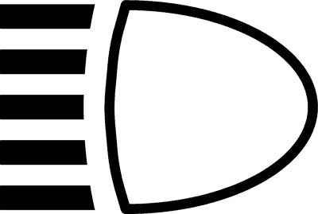
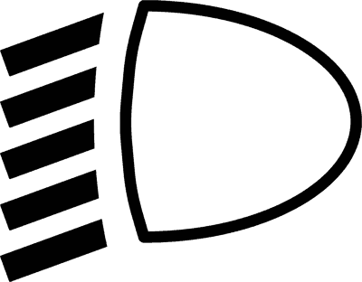
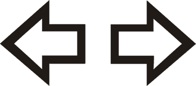
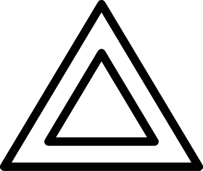
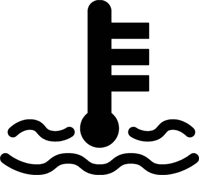
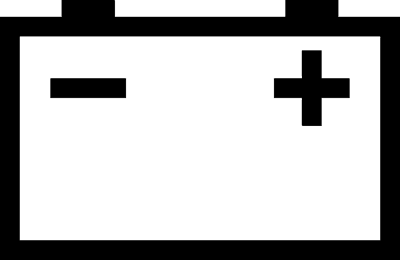
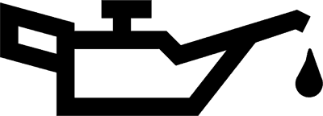
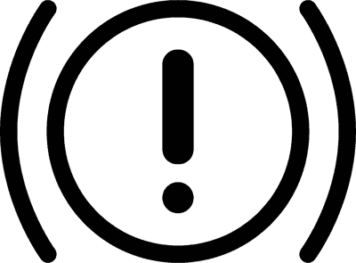
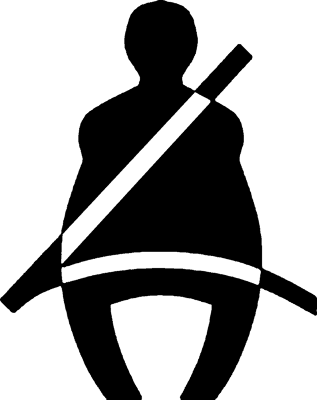

# Capitolo 18 - Uso delle luci e dispositivi acustici
### استخدام الأضواء وأجهزة التنبيه

- 📁 **المجلد المحلي للباب:** `Capitolo_18_luci_dispositivi_acustici`

## 📌 Luci anabbaglianti (9 domande)

**1.** Nelle autostrade e strade extraurbane, è obbligatorio accendere i fari anabbaglianti anche di giorno o, in alternativa, le luci di marcia diurna

- **الإجابة:** `VERO ✅ (صح)`

---

**2.** L’errata impostazione dell’orientamento dei proiettori può ridurre la visibilità del conducente o abbagliare gli altri utenti

- **الإجابة:** `VERO ✅ (صح)`

---

**3.** Proiettori anabbaglianti male orientati possono abbagliare gli altri utenti della strada

- **الإجابة:** `VERO ✅ (صح)`

---

**4.** Pur avendo acceso le luci anabbaglianti, si corre il rischio di abbagliare gli altri se le lampade sono montate in maniera errata o non sono omologate

- **الإجابة:** `VERO ✅ (صح)`

---

**5.** Su un veicolo a motore non è consentito utilizzare lampade non omologate

- **الإجابة:** `VERO ✅ (صح)`

---

**6.** Percorrendo una strada extraurbana durante una giornata assolata è sufficiente accendere le luci di posizione

- **الإجابة:** `FALSO ❌ (خطأ)`

---

**7.** Percorrendo una strada extraurbana, è obbligatorio tenere accesi i proiettori abbaglianti durante le ore diurne

- **الإجابة:** `FALSO ❌ (خطأ)`

---

**8.** L’uso delle luci di posizione è obbligatorio di notte durante la sosta fuori della carreggiata

- **الإجابة:** `FALSO ❌ (خطأ)`

---

**9.** Per le luci di posizione è possibile utilizzare lampade di qualsiasi colore

- **الإجابة:** `FALSO ❌ (خطأ)`

---

## 📌 Dispositivi utilizzare durante marcia (7 domande)

**10.** Durante la marcia nei centri abitati, è obbligatorio tenere accese le luci anabbaglianti da mezz'ora dopo il tramonto del sole a mezz'ora prima del suo sorgere

- **الإجابة:** `VERO ✅ (صح)`

---

**11.** Durante la marcia, in caso di scarsa visibilità per condizioni atmosferiche (neve, pioggia, nebbia), è obbligatorio tenere accese le luci di posizione e quelle anabbaglianti

- **الإجابة:** `VERO ✅ (صح)`

---

**12.** Durante la marcia, in caso di nebbia con visibilità inferiore a 50 metri, bisogna usare la luce posteriore per nebbia, se il veicolo ne è dotato

- **الإجابة:** `VERO ✅ (صح)`

---

**13.** Di notte, nei centri abitati, il veicolo in sosta al margine della carreggiata, può essere segnalato con le luci di sosta

- **الإجابة:** `VERO ✅ (صح)`

---

**14.** Durante la marcia, è obbligatorio tenere accese le luci abbaglianti, a partire dal tramonto del sole fino al suo sorgere

- **الإجابة:** `FALSO ❌ (خطأ)`

---

**15.** Di notte, in caso di sosta fuori dalla carreggiata, è obbligatorio tenere accese le luci anabbaglianti

- **الإجابة:** `FALSO ❌ (خطأ)`

---

**16.** Se si lascia il veicolo in un parcheggio autorizzato, è obbligatorio tenere accese per tutto il tempo le luci di sosta

- **الإجابة:** `FALSO ❌ (خطأ)`

---

## 📌 Obbligo anabbaglianti (3 domande)

**17.** E' obbligatorio accendere i proiettori anabbaglianti, anche di giorno, quando si transita in galleria

- **الإجابة:** `VERO ✅ (صح)`

---

**18.** E' obbligatorio accendere le luci del veicolo in caso di scarsa visibilità per le condizioni del tempo (nebbia, neve, pioggia)

- **الإجابة:** `VERO ✅ (صح)`

---

**19.** E' obbligatorio accendere i proiettori anabbaglianti nelle gallerie stradali, solo se scarsamente illuminate

- **الإجابة:** `FALSO ❌ (خطأ)`

---

## 📌 Uso luci anabbaglianti (8 domande)

**20.** Durante la marcia, in caso di pioggia intensa, oltre alle luci anabbaglianti bisogna tenere accesa la luce posteriore per nebbia, se il veicolo ne è dotato

- **الإجابة:** `VERO ✅ (صح)`

---

**21.** Durante la marcia fuori dai centri abitati, è obbligatorio fare uso delle luci anabbaglianti, sia di giorno che di notte

- **الإجابة:** `VERO ✅ (صح)`

---

**22.** Durante la marcia nelle ore notturne, l'uso delle luci anabbaglianti è obbligatorio anche se l'illuminazione pubblica è sufficiente

- **الإجابة:** `VERO ✅ (صح)`

---

**23.** Durante la marcia, in caso di fitta nevicata, oltre alle luci anabbaglianti bisogna tenere accesa la luce posteriore per nebbia, se il veicolo ne è dotato

- **الإجابة:** `VERO ✅ (صح)`

---

**24.** Proiettori anabbaglianti male orientati possono abbagliare gli altri utenti della strada

- **الإجابة:** `VERO ✅ (صح)`

---

**25.** Durante la marcia, l'uso delle luci anabbaglianti non è consentito nelle gallerie illuminate

- **الإجابة:** `FALSO ❌ (خطأ)`

---

**26.** Durante la marcia, l'uso delle luci di posizione è sempre consentito in alternativa a quelle anabbaglianti

- **الإجابة:** `FALSO ❌ (خطأ)`

---

**27.** L'uso delle luci anabbaglianti è obbligatorio quando si sorpassa un'auto della polizia

- **الإجابة:** `FALSO ❌ (خطأ)`

---

## 📌 Catadiottri (8 domande)

**28.** I catadiottri sono dispositivi che riflettono la luce

- **الإجابة:** `VERO ✅ (صح)`

---

**29.** I catadiottri installati nella parte posteriore dei veicoli sono di colore rosso

- **الإجابة:** `VERO ✅ (صح)`

---

**30.** I catadiottri installati nella parte posteriore di rimorchi e carrelli-appendice sono di colore rosso e di forma triangolare

- **الإجابة:** `VERO ✅ (صح)`

---

**31.** I catadiottri vengono applicati anche sui rimorchi e sui carrelli-appendice

- **الإجابة:** `VERO ✅ (صح)`

---

**32.** I catadiottri installati sulla parte davanti di rimorchi e carrelli-appendice sono di colore bianco

- **الإجابة:** `VERO ✅ (صح)`

---

**33.** I catadiottri vanno accesi mezz'ora dopo il tramonto del sole

- **الإجابة:** `FALSO ❌ (خطأ)`

---

**34.** I catadiottri vanno accesi insieme alle luci di posizione

- **الإجابة:** `FALSO ❌ (خطأ)`

---

**35.** I catadiottri sostituiscono le luci di posizione durante la circolazione nelle strade urbane

- **الإجابة:** `FALSO ❌ (خطأ)`

---

## 📌 Funzione catadiottri (7 domande)

**36.** I catadiottri hanno la funzione di indicare la presenza e l'ingombro dei veicoli su cui sono applicati

- **الإجابة:** `VERO ✅ (صح)`

---

**37.** I catadiottri di colore bianco hanno la funzione di evidenziare la parte davanti dei rimorchi e semirimorchi

- **الإجابة:** `VERO ✅ (صح)`

---

**38.** I catadiottri, se illuminati, hanno la funzione di rendere più visibili, specialmente di notte, i veicoli e i rimorchi in sosta sulla strada

- **الإجابة:** `VERO ✅ (صح)`

---

**39.** I catadiottri rendono più visibile un veicolo guasto, nel caso in cui non funzionino le luci di posizione posteriori

- **الإجابة:** `VERO ✅ (صح)`

---

**40.** I catadiottri con gli indicatori di direzione, segnalano la svolta di un veicolo

- **الإجابة:** `FALSO ❌ (خطأ)`

---

**41.** I catadiottri di colore bianco sono installati negli autoveicoli che trasportano materiale infiammabile

- **الإجابة:** `FALSO ❌ (خطأ)`

---

**42.** I catadiottri possono sostituire gli indicatori di direzione

- **الإجابة:** `FALSO ❌ (خطأ)`

---

## 📌 Targa posteriore veicolo (4 domande)

**43.** La targa posteriore di un autoveicolo è illuminata per consentire una facile lettura dei caratteri che la compongono

- **الإجابة:** `VERO ✅ (صح)`

---

**44.** La targa posteriore di un autoveicolo deve essere illuminata con una luce bianca

- **الإجابة:** `VERO ✅ (صح)`

---

**45.** La luce della targa di un autoveicolo si deve accendere solo di notte

- **الإجابة:** `FALSO ❌ (خطأ)`

---

**46.** La luce della targa di un autoveicolo deve rimanere accesa se si sosta fuori dalla strada

- **الإجابة:** `FALSO ❌ (خطأ)`

---

## 📌 Spie auto (10 domande)

**47.** La spia di accensione della segnalazione luminosa di pericolo è di colore rosso

- **الإجابة:** `VERO ✅ (صح)`

---

**48.** La spia della temperatura dell'acqua di raffreddamento è di colore rosso

- **الإجابة:** `VERO ✅ (صح)`

---

**49.** La spia della pressione dell'olio è di colore rosso

- **الإجابة:** `VERO ✅ (صح)`

---

**50.** La spia della cintura di sicurezza è di colore rosso

- **الإجابة:** `VERO ✅ (صح)`

---

**51.** La spia del freno a mano è di colore rosso

- **الإجابة:** `VERO ✅ (صح)`

---

**52.** La spia di accensione degli indicatori di direzione è di colore rosso

- **الإجابة:** `FALSO ❌ (خطأ)`

---

**53.** La spia di accensione delle luci anabbaglianti è di colore rosso

- **الإجابة:** `FALSO ❌ (خطأ)`

---

**54.** La spia di accensione delle luci abbaglianti è di colore rosso

- **الإجابة:** `FALSO ❌ (خطأ)`

---

**55.** La spia delle luci fendinebbia è di colore rosso

- **الإجابة:** `FALSO ❌ (خطأ)`

---

**56.** La spia del dispositivo per sbrinare o disappannare il parabrezza è di colore rosso

- **الإجابة:** `FALSO ❌ (خطأ)`

---

## 📌 Simbolo abbaglianti (6 domande)

**57.** Il simbolo raffigurato è posto sul comando di accensione dei proiettori di profondità

- **الإجابة:** `VERO ✅ (صح)`
- 

---

**58.** Il simbolo raffigurato è posto su una spia a luce blu

- **الإجابة:** `VERO ✅ (صح)`
- 

---

**59.** Il simbolo raffigurato è posto su una spia a luce verde

- **الإجابة:** `FALSO ❌ (خطأ)`
- 

---

**60.** Il simbolo raffigurato è posto sul comando di accensione dei proiettori anabbaglianti

- **الإجابة:** `FALSO ❌ (خطأ)`
- 

---

**61.** Il simbolo raffigurato segnala l'accensione della luce posteriore per nebbia

- **الإجابة:** `FALSO ❌ (خطأ)`
- 

---

**62.** Il simbolo raffigurato ricorda al conducente che deve spegnere le luci di posizione

- **الإجابة:** `FALSO ❌ (خطأ)`
- 

---

## 📌 Simbolo fari anabbaglianti (7 domande)

**63.** Il simbolo raffigurato è posto sul comando di accensione dei proiettori anabbaglianti

- **الإجابة:** `VERO ✅ (صح)`
- 

---

**64.** Il simbolo raffigurato è posto su una spia a luce verde

- **الإجابة:** `VERO ✅ (صح)`
- 

---

**65.** Il simbolo raffigurato è posto su una spia a luce blu

- **الإجابة:** `FALSO ❌ (خطأ)`
- 

---

**66.** Il simbolo raffigurato segnala l'accensione della luce posteriore per nebbia

- **الإجابة:** `FALSO ❌ (خطأ)`
- 

---

**67.** Il simbolo raffigurato è posto sulla spia delle luci abbaglianti accese

- **الإجابة:** `FALSO ❌ (خطأ)`
- 

---

**68.** Il simbolo raffigurato segnala l'accensione delle luci di posizione

- **الإجابة:** `FALSO ❌ (خطأ)`
- 

---

**69.** Il simbolo raffigurato indica il comando per azionare l'indicatore di direzione destro

- **الإجابة:** `FALSO ❌ (خطأ)`
- 

---

## 📌 Simbolo indicatori direzione (6 domande)

**70.** Il simbolo raffigurato indica il comando degli indicatori di direzione

- **الإجابة:** `VERO ✅ (صح)`
- 

---

**71.** Il simbolo raffigurato è posto su una spia a luce verde

- **الإجابة:** `VERO ✅ (صح)`
- 

---

**72.** Il simbolo raffigurato si trova sulla spia a luce verde lampeggiante dell'indicatore di direzione azionato

- **الإجابة:** `VERO ✅ (صح)`
- 

---

**73.** Il simbolo raffigurato è posto su una spia di colore rosso

- **الإجابة:** `FALSO ❌ (خطأ)`
- 

---

**74.** Il simbolo raffigurato si trova su una spia che si attiva quando sono accese le luci di posizione

- **الإجابة:** `FALSO ❌ (خطأ)`
- 

---

**75.** Il simbolo raffigurato indica il comando per accendere le luci di posizione

- **الإجابة:** `FALSO ❌ (خطأ)`
- 

---

## 📌 Simbolo quattro frecce (7 domande)

**76.** Il simbolo raffigurato indica il comando per azionare la segnalazione luminosa di pericolo

- **الإجابة:** `VERO ✅ (صح)`
- 

---

**77.** Il simbolo raffigurato è posto sul comando che provoca l'accensione contemporanea di tutti gli indicatori di direzione

- **الإجابة:** `VERO ✅ (صح)`
- 

---

**78.** Il simbolo raffigurato è posto su una spia di colore rosso

- **الإجابة:** `VERO ✅ (صح)`
- 

---

**79.** Il simbolo raffigurato indica un dispositivo da usare in casi di emergenza

- **الإجابة:** `VERO ✅ (صح)`
- 

---

**80.** Il simbolo raffigurato indica il comando che aziona il segnale mobile di pericolo

- **الإجابة:** `FALSO ❌ (خطأ)`
- 

---

**81.** Il simbolo raffigurato è posto sulla spia di freno a mano inserito

- **الإجابة:** `FALSO ❌ (خطأ)`
- 

---

**82.** Il simbolo raffigurato indica un dispositivo che si accende automaticamente ad ogni incidente

- **الإجابة:** `FALSO ❌ (خطأ)`
- 

---

## 📌 Utilizzo degli indicatori direzione (14 domande)

**83.** Si devono usare gli indicatori di direzione prima di ogni cambio di corsia, quando si viaggia su strada suddivisa in corsie

- **الإجابة:** `VERO ✅ (صح)`

---

**84.** Si devono usare gli indicatori di direzione se, marciando su strada a senso unico, ci si sposta sulla corsia di sinistra provenendo da quella di destra

- **الإجابة:** `VERO ✅ (صح)`

---

**85.** Si devono usare gli indicatori di direzione ogni volta che si deve effettuare una manovra di svolta

- **الإجابة:** `VERO ✅ (صح)`

---

**86.** Si devono usare gli indicatori di direzione se si intende uscire dalla carreggiata per effettuare una fermata

- **الإجابة:** `VERO ✅ (صح)`

---

**87.** Si devono usare gli indicatori di direzione quando, partendo dal margine della carreggiata, ci si vuole immettere nella circolazione

- **الإجابة:** `VERO ✅ (صح)`

---

**88.** Si devono usare gli indicatori di direzione per segnalare l’intenzione di spostarsi nella corsia di decelerazione di uno svincolo autostradale

- **الإجابة:** `VERO ✅ (صح)`

---

**89.** Si devono usare gli indicatori di direzione per segnalare l’intenzione di entrare sulla carreggiata autostradale, provenendo da una corsia di accelerazione

- **الإجابة:** `VERO ✅ (صح)`

---

**90.** Non si devono usare gli indicatori di direzione quando si cambia corsia mentre si circola su strada a senso unico

- **الإجابة:** `FALSO ❌ (خطأ)`

---

**91.** Non è mai necessario usare gli indicatori di direzione quando si circola su strada a doppio senso ma con carreggiate separate da spartitraffico

- **الإجابة:** `FALSO ❌ (خطأ)`

---

**92.** Non si devono usare gli indicatori di direzione se, per effettuare una fermata fuori della carreggiata, ci si sposta sul margine sinistro

- **الإجابة:** `FALSO ❌ (خطأ)`

---

**93.** Si devono usare gli indicatori di direzione destri per segnalare che si sta per frenare bruscamente

- **الإجابة:** `FALSO ❌ (خطأ)`

---

**94.** Non si devono usare gli indicatori di direzione se, per entrare in un passo carrabile, occorre svoltare a destra

- **الإجابة:** `FALSO ❌ (خطأ)`

---

**95.** Si devono usare gli indicatori di direzione quando si effettua una svolta a sinistra, ma non quando si svolta a destra

- **الإجابة:** `FALSO ❌ (خطأ)`

---

**96.** Si devono usare gli indicatori di direzione sinistri quando si deve percorrere un tornante verso sinistra

- **الإجابة:** `FALSO ❌ (خطأ)`

---

## 📌 Necessita utilizzo indicatori direzione (11 domande)

**97.** L’uso degli indicatori di direzione è necessario per segnalare che si vuole effettuare un cambio di corsia

- **الإجابة:** `VERO ✅ (صح)`

---

**98.** L’uso degli indicatori di direzione è necessario per segnalare l’intenzione di effettuare una manovra di sorpasso

- **الإجابة:** `VERO ✅ (صح)`

---

**99.** L’uso degli indicatori di direzione è necessario per segnalare l’intenzione di parcheggiare sul margine sinistro di una strada a senso unico

- **الإجابة:** `VERO ✅ (صح)`

---

**100.** L’uso degli indicatori di direzione è necessario ogni qualvolta si deve fare una manovra di svolta

- **الإجابة:** `VERO ✅ (صح)`

---

**101.** L’uso degli indicatori di direzione è necessario quando si effettuano manovre di retromarcia

- **الإجابة:** `VERO ✅ (صح)`

---

**102.** L’uso degli indicatori di direzione è necessario nella marcia per file parallele, anche se non si effettuano cambiamenti di corsia

- **الإجابة:** `FALSO ❌ (خطأ)`

---

**103.** L’uso degli indicatori di direzione è necessario per almeno 500 metri dopo aver effettuato un sorpasso

- **الإجابة:** `FALSO ❌ (خطأ)`

---

**104.** L’uso degli indicatori di direzione è necessario quando si inizia una manovra di sorpasso, ma non quando la si termina rientrando nella corsia di marcia normale

- **الإجابة:** `FALSO ❌ (خطأ)`

---

**105.** L’uso degli indicatori di direzione non è necessario se si deve parcheggiare il veicolo spostandosi verso il margine destro della carreggiata

- **الإجابة:** `FALSO ❌ (خطأ)`

---

**106.** L’uso degli indicatori di direzione è necessario quando ci si arresta ad un semaforo rosso

- **الإجابة:** `FALSO ❌ (خطأ)`

---

**107.** L’uso degli indicatori di direzione destri è necessario quando ci si arresta per cause di interruzione della circolazione

- **الإجابة:** `FALSO ❌ (خطأ)`

---

## 📌 Uso abbaglianti (8 domande)

**108.** L’uso dei proiettori a luce abbagliante è vietato, di norma, durante la marcia nei centri abitati

- **الإجابة:** `VERO ✅ (صح)`

---

**109.** L’uso dei proiettori a luce abbagliante è necessario, fuori dei centri abitati, quando l’illuminazione pubblica è insufficiente e non si incrociano altri veicoli

- **الإجابة:** `VERO ✅ (صح)`

---

**110.** L’uso dei proiettori a luce abbagliante è necessario, fuori dei centri abitati, quando l’illuminazione pubblica manca e non si incrociano altri veicoli

- **الإجابة:** `VERO ✅ (صح)`

---

**111.** L’uso dei proiettori a luce abbagliante va sostituito con quello dei proiettori a luce anabbagliante quando si incrociano altri veicoli

- **الإجابة:** `VERO ✅ (صح)`

---

**112.** L’uso dei proiettori a luce abbagliante è di norma consentito in città, in caso di nebbia fitta

- **الإجابة:** `FALSO ❌ (خطأ)`

---

**113.** L’uso dei proiettori a luce abbagliante è necessario nelle gallerie urbane a senso unico

- **الإجابة:** `FALSO ❌ (خطأ)`

---

**114.** L’uso dei proiettori a luce abbagliante è sempre ammesso quando si trasportano feriti o ammalati gravi

- **الإجابة:** `FALSO ❌ (خطأ)`

---

**115.** L’uso dei proiettori a luce abbagliante è necessario, di giorno, se si circola su un’autostrada viaggiando controsole

- **الإجابة:** `FALSO ❌ (خطأ)`

---

## 📌 Uso intermittente proiettori profondita (9 domande)

**116.** E’ consentito l’uso intermittente dei proiettori di profondità (a luce abbagliante), sia di giorno che di notte, per dare avvertimenti utili al fine di evitare incidenti

- **الإجابة:** `VERO ✅ (صح)`

---

**117.** E’ consentito l’uso intermittente dei proiettori di profondità (a luce abbagliante), anche all’interno dei centri abitati, per dare avvertimenti utili al fine di evitare incidenti

- **الإجابة:** `VERO ✅ (صح)`

---

**118.** E’ consentito l’uso intermittente dei proiettori di profondità (a luce abbagliante) per segnalare al veicolo che precede, sia di giorno che di notte, l’intenzione di sorpassare

- **الإجابة:** `VERO ✅ (صح)`

---

**119.** E’ consentito l’uso intermittente dei proiettori di profondità (a luce abbagliante) per segnalare al veicolo che precede, anche all’interno dei centri abitati, l’intenzione di sorpassare

- **الإجابة:** `VERO ✅ (صح)`

---

**120.** E’ consentito l’uso intermittente dei proiettori di profondità (a luce abbagliante), soltanto sulle strade extraurbane

- **الإجابة:** `FALSO ❌ (خطأ)`

---

**121.** E’ consentito l’uso intermittente dei proiettori di profondità (a luce abbagliante), anche all’interno dei centri urbani, ma unicamente di giorno

- **الإجابة:** `FALSO ❌ (خطأ)`

---

**122.** E’ consentito l’uso intermittente dei proiettori di profondità (a luce abbagliante), solo quando si trasportano feriti o ammalati gravi

- **الإجابة:** `FALSO ❌ (خطأ)`

---

**123.** E’ consentito l’uso intermittente dei proiettori di profondità (a luce abbagliante), purché l’illuminazione esterna manchi o sia insufficiente

- **الإجابة:** `FALSO ❌ (خطأ)`

---

**124.** E’ consentito l’uso intermittente dei proiettori di profondità (a luce abbagliante), esclusivamente nei casi di pericolo immediato

- **الإجابة:** `FALSO ❌ (خطأ)`

---

## 📌 Uso proiettori fuori centri abitati (7 domande)

**125.** Fuori dei centri abitati, i conducenti devono spegnere i proiettori di profondità procedendo con quelli anabbaglianti, quando vi sia il pericolo di abbagliare gli altri utenti della strada

- **الإجابة:** `VERO ✅ (صح)`

---

**126.** Fuori dei centri abitati, i conducenti devono spegnere i proiettori di profondità procedendo con quelli anabbaglianti, qualora vi sia il pericolo di abbagliare i pedoni

- **الإجابة:** `VERO ✅ (صح)`

---

**127.** Fuori dei centri abitati, i conducenti devono spegnere i proiettori di profondità procedendo con quelli anabbaglianti, se vi è pericolo di abbagliare i conducenti di veicoli circolanti su altre strade

- **الإجابة:** `VERO ✅ (صح)`

---

**128.** Fuori dei centri abitati, i conducenti devono spegnere i proiettori di profondità procedendo con quelli anabbaglianti, quando stanno per incrociare altri veicoli

- **الإجابة:** `VERO ✅ (صح)`

---

**129.** Fuori dei centri abitati, i conducenti devono spegnere i proiettori di profondità procedendo con quelli anabbaglianti, quando seguono un veicolo a breve distanza

- **الإجابة:** `VERO ✅ (صح)`

---

**130.** Fuori dei centri abitati, i conducenti devono spegnere i proiettori di profondità procedendo con quelli anabbaglianti, dopo un loro uso prolungato, per evitare di scaricare la batteria

- **الإجابة:** `FALSO ❌ (خطأ)`

---

**131.** Fuori dei centri abitati, i conducenti devono spegnere i proiettori di profondità procedendo con quelli anabbaglianti, solo quando il veicolo che li precede a breve distanza è un’autovettura

- **الإجابة:** `FALSO ❌ (خطأ)`

---

## 📌 Spia temperatura liquido raffreddamento (10 domande)

**132.** Il simbolo raffigurato è posto su una spia di colore rosso

- **الإجابة:** `VERO ✅ (صح)`
- 

---

**133.** Una spia accesa di colore rosso, contrassegnata dal simbolo di figura, indica un eccessivo riscaldamento del motore

- **الإجابة:** `VERO ✅ (صح)`
- 

---

**134.** Il simbolo raffigurato è collocato sulla spia che indica l’eccessiva temperatura del liquido di raffreddamento del motore

- **الإجابة:** `VERO ✅ (صح)`
- 

---

**135.** Il simbolo raffigurato è posto su una spia che, se accesa, indica che la temperatura del liquido di raffreddamento supera i limiti stabiliti dal costruttore

- **الإجابة:** `VERO ✅ (صح)`
- 

---

**136.** Il simbolo raffigurato è posto sulla spia che integra l’indicatore della temperatura del liquido di raffreddamento che circola nel motore

- **الإجابة:** `VERO ✅ (صح)`
- 

---

**137.** Il simbolo raffigurato individua il bocchettone del serbatoio del liquido tergicristalli

- **الإجابة:** `FALSO ❌ (خطأ)`
- 

---

**138.** Il simbolo raffigurato è posto su una spia che segnala il livello del liquido di raffreddamento nel radiatore

- **الإجابة:** `FALSO ❌ (خطأ)`
- 

---

**139.** Il simbolo raffigurato è posto sulla spia luminosa che indica la temperatura dell’olio di lubrificazione del motore

- **الإجابة:** `FALSO ❌ (خطأ)`
- 

---

**140.** Il simbolo raffigurato è posto sulla spia che individua l’indicatore della temperatura dell’olio che circola nel motore

- **الإجابة:** `FALSO ❌ (خطأ)`
- 

---

**141.** Il simbolo raffigurato è posto su una spia che, se accesa, segnala l’eccessiva temperatura dell’olio di lubrificazione del cambio di velocità

- **الإجابة:** `FALSO ❌ (خطأ)`
- 

---

## 📌 Spia della batteria (8 domande)

**142.** Una spia di colore rosso contrassegnata dal simbolo di figura, se accesa durante la marcia, indica che il generatore di corrente non carica la batteria

- **الإجابة:** `VERO ✅ (صح)`
- 

---

**143.** Una spia di colore rosso contrassegnata dal simbolo di figura, se accesa durante la marcia, indica che la batteria non si sta ricaricando come previsto

- **الإجابة:** `VERO ✅ (صح)`
- 

---

**144.** Una spia di colore rosso contrassegnata dal simbolo di figura, se accesa durante la marcia, indica che l’alternatore non sta ricaricando la batteria

- **الإجابة:** `VERO ✅ (صح)`
- 

---

**145.** il simbolo raffigurato, se collocato su una spia di colore rosso, permette di capire se la batteria viene correttamente ricaricata o meno dall’alternatore

- **الإجابة:** `VERO ✅ (صح)`
- 

---

**146.** Una spia di colore rosso contrassegnata dal simbolo di figura, se accesa durante la marcia, indica che la batteria è completamente scarica

- **الإجابة:** `FALSO ❌ (خطأ)`
- 

---

**147.** Una spia di colore rosso contrassegnata dal simbolo di figura, se accesa durante la marcia, indica di sostituire subito la batteria

- **الإجابة:** `FALSO ❌ (خطأ)`
- 

---

**148.** Una spia di colore rosso contrassegnata dal simbolo di figura, se accesa durante la marcia, indica che bisogna invertire l’allacciamento dei cavi ai morsetti della batteria

- **الإجابة:** `FALSO ❌ (خطأ)`
- 

---

**149.** Una spia di colore rosso contrassegnata dal simbolo di figura, se accesa durante la marcia, indica che la batteria è sovraccarica

- **الإجابة:** `FALSO ❌ (خطأ)`
- 

---

## 📌 Spia pressione olio (10 domande)

**150.** Il simbolo raffigurato è posto su un dispositivo che dà indicazioni sulla pressione del lubrificante nel motore

- **الإجابة:** `VERO ✅ (صح)`
- 

---

**151.** Il simbolo raffigurato può essere posto su una spia a luce rossa

- **الإجابة:** `VERO ✅ (صح)`
- 

---

**152.** Una spia di colore rosso contrassegnata dal simbolo di figura, se spenta durante la marcia, indica che la pressione dell’olio di lubrificazione del motore è regolare

- **الإجابة:** `VERO ✅ (صح)`
- 

---

**153.** Una spia di colore rosso contrassegnata dal simbolo di figura, se accesa durante la marcia, indica insufficiente pressione dell’olio di lubrificazione del motore

- **الإجابة:** `VERO ✅ (صح)`
- 

---

**154.** Una spia di colore rosso contrassegnata dal simbolo di figura, se accesa durante la marcia, indica di arrestare subito il motore per evitare gravi danni

- **الإجابة:** `VERO ✅ (صح)`
- 

---

**155.** Il simbolo raffigurato può contraddistinguere una spia luminosa di colore giallo ambra

- **الإجابة:** `FALSO ❌ (خطأ)`
- 

---

**156.** Una spia di colore rosso contrassegnata dal simbolo di figura, se accesa durante la marcia, indica una temperatura troppo bassa dell’olio di lubrificazione del motore

- **الإجابة:** `FALSO ❌ (خطأ)`
- 

---

**157.** Una spia di colore rosso contrassegnata dal simbolo di figura, se accesa durante la marcia, indica che il motore consuma troppo olio

- **الإجابة:** `FALSO ❌ (خطأ)`
- 

---

**158.** Una spia di colore rosso contrassegnata dal simbolo di figura, se accesa durante la marcia, indica che l’olio di lubrificazione del cambio di velocità è troppo denso

- **الإجابة:** `FALSO ❌ (خطأ)`
- 

---

**159.** Una spia di colore rosso contrassegnata dal simbolo di figura, se accesa durante la marcia, indica che bisogna cambiare l’olio di lubrificazione del motore

- **الإجابة:** `FALSO ❌ (خطأ)`
- 

---

## 📌 Spia impianto frenante (11 domande)

**160.** Il simbolo raffigurato è posto su una spia di colore rosso

- **الإجابة:** `VERO ✅ (صح)`
- 

---

**161.** Il simbolo raffigurato, contrassegna la spia di funzionamento difettoso di una parte dell’impianto frenante

- **الإجابة:** `VERO ✅ (صح)`
- 

---

**162.** Una spia di colore rosso contrassegnata dal simbolo di figura, se accesa durante la marcia, può segnalare una eccessiva usura delle guarnizioni degli elementi frenanti

- **الإجابة:** `VERO ✅ (صح)`
- 

---

**163.** Una spia di colore rosso contrassegnata dal simbolo di figura, se accesa durante la marcia, può segnalare lo scarso livello del liquido idraulico dei freni

- **الإجابة:** `VERO ✅ (صح)`
- 

---

**164.** Una spia di colore rosso contrassegnata dal simbolo di figura, se accesa durante la marcia, comporta di provvedere rapidamente a una manutenzione o riparazione dell’impianto frenante

- **الإجابة:** `VERO ✅ (صح)`
- 

---

**165.** Una spia di colore rosso contrassegnata dal simbolo di figura, se accesa durante la marcia, segnala che la centralina elettronica è fuori uso

- **الإجابة:** `FALSO ❌ (خطأ)`
- 

---

**166.** Una spia di colore rosso contrassegnata dal simbolo di figura, se accesa durante la marcia, indica che occorre effettuare il tagliando periodico previsto dalla casa costruttrice entro 500 chilometri

- **الإجابة:** `FALSO ❌ (خطأ)`
- 

---

**167.** Una spia di colore rosso contrassegnata dal simbolo di figura, se accesa durante la marcia, indica che occorre effettuare la revisione periodica di legge entro un mese

- **الإجابة:** `FALSO ❌ (خطأ)`
- 

---

**168.** Il simbolo raffigurato individua il luogo ove è riposto l’estintore di bordo

- **الإجابة:** `FALSO ❌ (خطأ)`
- 

---

**169.** Il simbolo raffigurato individua una parte dell’impianto elettrico dove si trova alta tensione

- **الإجابة:** `FALSO ❌ (خطأ)`
- 

---

**170.** Una spia di colore rosso contrassegnata dal simbolo di figura, se accesa durante la marcia, segnala portiere aperte o chiuse non correttamente

- **الإجابة:** `FALSO ❌ (خطأ)`
- 

---

## 📌 Simbolo cinture sicurezza (6 domande)

**171.** Il simbolo raffigurato è posto su una spia di colore rosso

- **الإجابة:** `VERO ✅ (صح)`
- 

---

**172.** Il simbolo raffigurato è posto su una spia di colore rosso che, se accesa durante la marcia, indica che il conducente o un passeggero non hanno indossato le cinture di sicurezza

- **الإجابة:** `VERO ✅ (صح)`
- 

---

**173.** La spia rossa contraddistinta dal simbolo in figura, se accesa durante la marcia, è in genere abbinata ad un segnale acustico in funzione

- **الإجابة:** `VERO ✅ (صح)`
- 

---

**174.** La spia rossa contraddistinta dal simbolo in figura può essere disattivata con apposito comando posto sul cruscotto

- **الإجابة:** `FALSO ❌ (خطأ)`
- 

---

**175.** Il simbolo raffigurato è posto su una spia di colore giallo

- **الإجابة:** `FALSO ❌ (خطأ)`
- 

---

**176.** Il simbolo raffigurato è posto sul pulsante che permette di regolare le modalità di azione del pretensionatore delle cinture di sicurezza

- **الإجابة:** `FALSO ❌ (خطأ)`
- 

---

