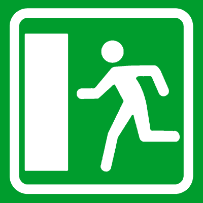

# Capitolo 21 - Incidenti stradali e comportamenti
### حوادث السير والتصرف الواجب

- 📁 **المجلد المحلي للباب:** `Capitolo_21_incidenti_stradali_comportamenti`
- 📊 **إجمالي الأسئلة المعتمدة والمشروحة:** 102 سؤالاً وزارياً

## 📌 Causa probabile incidenti (13 domande)

**1.** Causa probabile di incidenti dovuti alla struttura della strada può essere ristrettezza della strada
- **الإجابة:** `VERO ✅ (صح)`
- **📖 الترجمة السياقية:** من الأسباب المحتملة لوقوع حوادث السير العائدة إلى بنية وهندسة الطريق، ضيق الطريق.
- **💡 الشرح والقاعدة المرورية:** العبارة صحيحة (VERO)؛ ضيق نهر الطريق يقلل مساحة المناورة ويزيد احتمالية الاحتكاك الجانبي والتصادم بالمواجهة بين المركبات المتقابلة.
- **⚠️ كشف الفخ:** سؤال مباشر عن العوامل البنيوية للطريق (struttura della strada)؛ ضيق الطريق عامل خطر حقيقي.
- **🔑 الكلمات المفتاحية:** `Struttura della strada (بنية الطريق)` | `Ristrettezza della strada (ضيق الطريق)` | `Causa di incidenti (سبب الحوادث)`

---

**2.** Causa probabile di incidenti dovuti alla struttura della strada può essere mancata segnalazione degli incroci
- **الإجابة:** `VERO ✅ (صح)`
- **📖 الترجمة السياقية:** من الأسباب المحتملة لوقوع حوادث السير العائدة إلى بنية الطريق، غياب الإشارات المنبهة للتقاطعات.
- **💡 الشرح والقاعدة المرورية:** العبارة صحيحة (VERO)؛ عدم وجود لافتات تحذيرية أو إشارات أسبقية عند التقاطعات يفاجئ السائقين ويؤدي لاقتحام التقاطع دون انتباه واصطدام المركبات.
- **⚠️ كشف الفخ:** غياب الإشارات المنبهة (mancata segnalazione degli incroci) عيب خطير في تجهيز الطريق يسبب الحوادث.
- **🔑 الكلمات المفتاحية:** `Mancata segnalazione (غياب الإشارات)` | `Incroci (تقاطعات)` | `Causa di incidenti`

---

**3.** Causa probabile di incidenti dovuti alla struttura della strada può essere mancanza di segnaletica orizzontale
- **الإجابة:** `VERO ✅ (صح)`
- **📖 الترجمة السياقية:** من الأسباب المحتملة لوقوع حوادث السير العائدة إلى بنية الطريق، غياب الإشارات الأرضية والخطوط الدهانية.
- **💡 الشرح والقاعدة المرورية:** العبارة صحيحة (VERO)؛ غياب الخطوط الأرضية الفاصلة للمسارات وحواف الطريق يشتت مسار السائقين ليلاً وفي الضباب ويزيد مخاطر الخروج عن المسار.
- **⚠️ كشف الفخ:** غياب العلامات الأرضية (mancanza di segnaletica orizzontale) مسبب رئيسي للحوادث في بنية الطريق.
- **🔑 الكلمات المفتاحية:** `Mancanza di segnaletica orizzontale (غياب العلامات الأرضية)` | `Segnaletica stradale`

---

**4.** Causa probabile di incidenti dovuti alla struttura della strada può essere fondo stradale deformato
- **الإجابة:** `VERO ✅ (صح)`
- **📖 الترجمة السياقية:** من الأسباب المحتملة لوقوع حوادث السير العائدة إلى بنية الطريق، وجود أرضية طريق مشوهة وغير مستوية (fondo stradale deformato).
- **💡 الشرح والقاعدة المرورية:** العبارة صحيحة (VERO)؛ الحفر والتموجات وهبوط الأسفلت تخل بتوازن نظام التعليق والتوجيه وتفقد الإطارات تماسكها مسببة انحراف السيارة وانقلابها.
- **⚠️ كشف الفخ:** تشوه سطح الطريق (fondo deformato) عيب هندسي ميكانيكي مسبب للحوادث.
- **🔑 الكلمات المفتاحية:** `Fondo stradale deformato (أرضية طريق مشوهة)` | `Perdita di aderenza (فقدان التماسك)`

---

**5.** Causa probabile di incidenti dovuti alla struttura della strada può essere fondo stradale scivoloso
- **الإجابة:** `VERO ✅ (صح)`
- **📖 الترجمة السياقية:** من الأسباب المحتملة لوقوع حوادث السير العائدة إلى بنية الطريق، أرضية الطريق الزلقة (fondo stradale scivoloso).
- **💡 الشرح والقاعدة المرورية:** العبارة صحيحة (VERO)؛ سطح الطريق الزلق (بسبب طبيعة الأسفلت، أو الزيت، أو الجليد) يطيل مسافة الفرملة بشكل مفاجئ ويؤدي لانزلاق المركبات.
- **⚠️ كشف الفخ:** زلق الأسفلت عامل خطورة بيئي وهندسي مباشر.
- **🔑 الكلمات المفتاحية:** `Fondo stradale scivoloso (أرضية زلقة)` | `Spazio di frenata (مسافة الفرملة)`

---

**6.** Causa probabile di incidenti dovuti alla struttura della strada può essere presenza di strettoie non segnalate
- **الإجابة:** `VERO ✅ (صح)`
- **📖 الترجمة السياقية:** من الأسباب المحتملة لوقوع حوادث السير العائدة إلى بنية الطريق، وجود مضايق واختناقات مرورية غير معلن عنها بلافتات.
- **💡 الشرح والقاعدة المرورية:** العبارة صحيحة (VERO)؛ تضيق الطريق فجأة دون لافتة تحذير مسبقة يفاجئ السائقين أثناء السرعة ويؤدي للاصطدام بالحواجز أو السيارات المقابلة.
- **⚠️ كشف الفخ:** المضيق غير المشار إليه بلافتة (strettoie non segnalate) فخ هندسي قاتل في الطريق.
- **🔑 الكلمات المفتاحية:** `Strettoie non segnalate (مضايق غير معلن عنها)` | `Pericolo di incidente`

---

**7.** Causa probabile di incidenti dovuti alla struttura della strada può essere strada suddivisa in carreggiate
- **الإجابة:** `FALSO ❌ (خطأ)`
- **📖 الترجمة السياقية:** من الأسباب المحتملة لوقوع حوادث السير العائدة إلى بنية الطريق، تقسيم الطريق إلى عدة أنهُر طريق.
- **💡 الشرح والقاعدة المرورية:** العبارة خاطئة (FALSO)؛ تقسيم الطريق إلى عدة أنهُر مفصولة بحواجز وسطية يرفع من مستوى الأمان ويمنع التصادم المباشر، ولا يُعتبر سبباً للحوادث بل عنصراً وقائياً.
- **⚠️ كشف الفخ:** تقسيم الطريق ميزة أمان وليس سبباً للحوادث؛ الأسئلة الخاطئة تعرض عناصر أمان كأسباب للحوادث.
- **🔑 الكلمات المفتاحية:** `Strada suddivisa in carreggiate (طريق مقسم لأنهار - ميزة أمان وليس سبباً للحادث)`

---

**8.** Causa probabile di incidenti dovuti alla struttura della strada può essere strada suddivisa in corsie
- **الإجابة:** `FALSO ❌ (خطأ)`
- **📖 الترجمة السياقية:** من الأسباب المحتملة لوقوع حوادث السير العائدة إلى بنية الطريق، تقسيم الطريق إلى عدة مسارات (corsie).
- **💡 الشرح والقاعدة المرورية:** العبارة خاطئة (FALSO)؛ تقسيم نهر الطريق إلى مسارات منظمة ومخططة يسهل السير ويرفع مستوى الأمان، ولا يعتبر سبباً للحوادث.
- **⚠️ كشف الفخ:** المسارات المنظمة عنصر أمان وسلامة وليس سبباً للحوادث.
- **🔑 الكلمات المفتاحية:** `Strada suddivisa in corsie (طريق مقسم لمسارات - خطأ)`

---

**9.** Causa probabile di incidenti dovuti alla struttura della strada può essere carreggiata a senso unico di circolazione
- **الإجابة:** `FALSO ❌ (خطأ)`
- **📖 الترجمة السياقية:** من الأسباب المحتملة لوقوع حوادث السير العائدة إلى بنية الطريق، كون نهر الطريق ذا اتجاه سير واحد (senso unico).
- **💡 الشرح والقاعدة المرورية:** العبارة خاطئة (FALSO)؛ الاتجاه الواحد يلغي خطر الاصطدام بالمواجهة مع المركبات المعاكسة ويجعل الطريق أكثر أماناً، فليس سبباً للحوادث.
- **⚠️ كشف الفخ:** الاتجاه الواحد أكثر أماناً بطبيعته ولا يعد سبباً للحوادث.
- **🔑 الكلمات المفتاحية:** `Senso unico di circolazione (اتجاه واحد - خطأ)`

---

**10.** Causa probabile di incidenti dovuti alla struttura della strada può essere strada a percorso pianeggiante
- **الإجابة:** `FALSO ❌ (خطأ)`
- **📖 الترجمة السياقية:** من الأسباب المحتملة لوقوع حوادث السير العائدة إلى بنية الطريق، استواء مسار الطريق واستقامته (percorso pianeggiante).
- **💡 الشرح والقاعدة المرورية:** العبارة خاطئة (FALSO)؛ الطريق المستوي والمنبسط يمنح رؤية واضحة وقيادة سهلة ويقلل من مخاطر الطرق الجبلية الوعرة.
- **⚠️ كشف الفخ:** استواء الطريق ميزة جغرافية إيجابية وليست سبباً لوقوع الحوادث.
- **🔑 الكلمات المفتاحية:** `Percorso pianeggiante (مسار مستوٍ - خطأ)`

---

**11.** Causa probabile di incidenti dovuti alla struttura della strada può essere presenza di barriere laterali ad assorbimento d'urto (guardrails)
- **الإجابة:** `FALSO ❌ (خطأ)`
- **📖 الترجمة السياقية:** من الأسباب المحتملة لوقوع حوادث السير العائدة إلى بنية الطريق، وجود حواجز جانبية ممتصة للصدمات (guardrails).
- **💡 الشرح والقاعدة المرورية:** العبارة خاطئة (FALSO)؛ حواجز الجاردريل مصممة لحماية السيارات من الانقلاب والهاوية وامتصاص الصدمات لتخفيف أثر الحادث، وليست سبباً للحادث.
- **⚠️ كشف الفخ:** حواجز الأمان عنصر حماية ووقاية وليست مسبباً للحوادث.
- **🔑 الكلمات المفتاحية:** `Guardrails ad assorbimento d'urto (حواجز ممتصة للصدمات - حماية وليس سبباً)`

---

**12.** Causa probabile di incidenti dovuti alla struttura della strada può essere regolamentazione semaforica
- **الإجابة:** `FALSO ❌ (خطأ)`
- **📖 الترجمة السياقية:** من الأسباب المحتملة لوقوع حوادث السير العائدة إلى بنية الطريق، التنظيم بالإشارات الضوئية (semafori).
- **💡 الشرح والقاعدة المرورية:** العبارة خاطئة (FALSO)؛ الإشارات الضوئية وسيلة أساسية لتنظيم حركة المرور وتفادي التصادم وتوزيع الأسبقية، وليست مسبباً للحوادث.
- **⚠️ كشف الفخ:** الإشارة الضوئية تنظم المرور وتحميه من الحوادث.
- **🔑 الكلمات المفتاحية:** `Regolamentazione semaforica (تنظيم ضوئي - خطأ)`

---

**13.** Causa probabile di incidenti dovuti alla struttura della strada può essere mancanza di curve pericolose
- **الإجابة:** `FALSO ❌ (خطأ)`
- **📖 الترجمة السياقية:** من الأسباب المحتملة لوقوع حوادث السير العائدة إلى بنية الطريق، خلو الطريق من المنعطفات الخطيرة.
- **💡 الشرح والقاعدة المرورية:** العبارة خاطئة (FALSO)؛ غياب المنعطفات الخطيرة يرفع من مستوى أمان الطريق ولا يسبب حوادث.
- **⚠️ كشف الفخ:** خلو الطريق من المنعطفات ميزة أمان وليس سبباً للحوادث.
- **🔑 الكلمات المفتاحية:** `Mancanza di curve pericolose (غياب المنعطفات الخطيرة - خطأ)`

---

## 📌 Caso pioggia (10 domande)

**14.** In caso di pioggia occorre ridurre la velocità
- **الإجابة:** `VERO ✅ (صح)`
- **📖 الترجمة السياقية:** في حالة هطول الأمطار، يلزم تخفيض السرعة.
- **💡 الشرح والقاعدة المرورية:** العبارة صحيحة (VERO)؛ المطر يقلل من تماسك الإطارات على الأسفلت (aderenza) ويطيل مسافة الفرملة، مما يفرض تخفيض السرعة القانونية (110 كم/س بالأوتوستراد و 90 بالطرق الخارجية).
- **⚠️ كشف الفخ:** واجب أمان أول ومباشر عند المطر: خفض السرعة.
- **🔑 الكلمات المفتاحية:** `In caso di pioggia (عند المطر)` | `Ridurre la velocità (تخفيض السرعة)`

---

**15.** In caso di pioggia occorre tenere in funzione i tergicristalli
- **الإجابة:** `VERO ✅ (صح)`
- **📖 الترجمة السياقية:** في حالة هطول الأمطار، يلزم تشغيل مساحات الزجاج الأمامي (tergicristalli).
- **💡 الشرح والقاعدة المرورية:** العبارة صحيحة (VERO)؛ تشغيل المساحات ضروري للحفاظ على وضوح الرؤية الأمامية وتشتيت قطرات المطر عن الزجاج.
- **⚠️ كشف الفخ:** تشغيل المساحات إجراء تشغيلي بديهي وإلزامي للرؤية.
- **🔑 الكلمات المفتاحية:** `Tergicristalli (مساحات الزجاج)` | `Tenere in funzione (إبقاؤها قيد التشغيل)`

---

**16.** In caso di pioggia occorre aumentare la distanza di sicurezza
- **الإجابة:** `VERO ✅ (صح)`
- **📖 الترجمة السياقية:** في حالة هطول الأمطار، يلزم زيادة مسافة الأمان (distanza di sicurezza).
- **💡 الشرح والقاعدة المرورية:** العبارة صحيحة (VERO)؛ بما أن مسافة الفرملة تتضاعف على الأسفلت المبتل، يلزم زيادة مسافة الأمان بينك وبين المركبة الأمامية لتفادي الاصطدام الخلفي.
- **⚠️ كشف الفخ:** المعادلة الثابتة عند المطر: تماسك أقل = مسافة أمان أكبر.
- **🔑 الكلمات المفتاحية:** `Aumentare la distanza di sicurezza (زيادة مسافة الأمان)` | `Pioggia (مطر)`

---

**17.** In caso di pioggia occorre evitare l'appannamento dei vetri
- **الإجابة:** `VERO ✅ (صح)`
- **📖 الترجمة السياقية:** في حالة هطول الأمطار، يلزم تفادي تشكّل الضباب والغيوم على زجاج السيارة (appannamento dei vetri).
- **💡 الشرح والقاعدة المرورية:** العبارة صحيحة (VERO)؛ تكثف بخار الماء داخل المقصورة يحجب الرؤية كلياً؛ ويجب تشغيل مكيف الهواء وجهاز إزالة الضباب (sbrinatore) لإبقاء النوافذ شفافة.
- **⚠️ كشف الفخ:** إزالة تكثف البخار الداخلي عن الزجاج واجب سلامة قيادي.
- **🔑 الكلمات المفتاحية:** `Evitare l'appannamento dei vetri (تفادي تشكل الضباب على الزجاج)`

---

**18.** In caso di pioggia occorre manovrare con prudenza lo sterzo
- **الإجابة:** `VERO ✅ (صح)`
- **📖 الترجمة السياقية:** في حالة هطول الأمطار، يلزم توجيه وتحريك عجلة القيادة بحذر وسلاسة.
- **💡 الشرح والقاعدة المرورية:** العبارة صحيحة (VERO)؛ الحركات المفاجئة والعنيفة لعجلة القيادة على الأسفلت الزلق تسبب انزلاق العجلات الأمامية أو الخلفية وفقدان السيطرة على المركبة.
- **⚠️ كشف الفخ:** المناورة بسلاسة وحذر وتفادي الحركات العنيفة للمقود.
- **🔑 الكلمات المفتاحية:** `Manovrare con prudenza lo sterzo (تحريك المقود بحذر)` | `Sterzo (عجلة القيادة)`

---

**19.** In caso di pioggia occorre passare velocemente sulle pozzanghere per evitare di rimanere impantanati
- **الإجابة:** `FALSO ❌ (خطأ)`
- **📖 الترجمة السياقية:** في حالة هطول الأمطار، يلزم العبور بسرعة فوق برك المياه لتفادي الغوص فيها والعلوق في الوحل.
- **💡 الشرح والقاعدة المرورية:** العبارة خاطئة (FALSO)؛ المرور السريع فوق برك المياه يسبب ظاهرة الانزلاق المائي الفوري (aquaplaning) وتطاير المياه على المشاة والمحرك؛ والواجب هو العبور ببطء شديد.
- **⚠️ كشف الفخ:** ادعاء العبور السريع فوق البرك (passare velocemente sulle pozzanghere) يؤدي لحوادث انقلاب مميتة.
- **🔑 الكلمات المفتاحية:** `Passare velocemente sulle pozzanghere (المرور السريع فوق البرك - خطأ)` | `Aquaplaning`

---

**20.** In caso di pioggia occorre coprire il radiatore con l'apposita mascherina
- **الإجابة:** `FALSO ❌ (خطأ)`
- **📖 الترجمة السياقية:** في حالة هطول الأمطار، يلزم تغطية شبكة مبرد السيارة (الرادياتير) بالغطاء الواقي المخصص.
- **💡 الشرح والقاعدة المرورية:** العبارة خاطئة (FALSO)؛ تغطية الرادياتير تمنع تبريد المحرك وتؤدي لارتفاع حرارته واحتراقه، ولا علاقة لها بأمطار الصيف أو الشتاء العادية.
- **⚠️ كشف الفخ:** تغطية الرادياتير تدبير قديم جداً يخص الصقيع القطبي الشديد ولا يستخدم في الأمطار.
- **🔑 الكلمات المفتاحية:** `Coprire il radiatore (تغطية الرادياتير - خطأ)`

---

**21.** In caso di pioggia occorre frenare energicamente
- **الإجابة:** `FALSO ❌ (خطأ)`
- **📖 الترجمة السياقية:** في حالة هطول الأمطار، يلزم الفرملة بقوة وعنف (frenare energicamente).
- **💡 الشرح والقاعدة المرورية:** العبارة خاطئة (FALSO)؛ الضغط العنيف على الفرامل فوق سطح مبتل يؤدي لقفل العجلات وانزلاق السيارة كقطعة جليد؛ ويجب الفرملة التدريجية السلسة مع استغلال فرملة المحرك.
- **⚠️ كشف الفخ:** الفرملة العنيفة (frenare energicamente) خطأ جسيم على الطرق المبتلة.
- **🔑 الكلمات المفتاحية:** `Frenare energicamente (الفرملة بقوة - خطأ)` | `Frenata progressiva (فرملة تدريجية)`

---

**22.** In caso di pioggia occorre utilizzare, durante la marcia, la segnalazione luminosa di pericolo (quattro frecce lampeggianti simultaneamente)
- **الإجابة:** `FALSO ❌ (خطأ)`
- **📖 الترجمة السياقية:** في حالة هطول الأمطار، يلزم استخدام إشارات الطوارئ الضوئية (الأنوار الرباعية الوامضة معاً) أثناء السير.
- **💡 الشرح والقاعدة المرورية:** العبارة خاطئة (FALSO)؛ الأنوار الرباعية (quattro frecce) مخصصة فقط للتوقف الاضطراري أو التباطؤ الخاطف المفاجئ؛ ولا يجوز إبقاؤها مشتعلة أثناء السير العادي في المطر لأنها تربك السائقين.
- **⚠️ كشف الفخ:** إشعال أضواء الطوارئ أثناء السير العادي في المطر ممنوع ومخالف.
- **🔑 الكلمات المفتاحية:** `Quattro frecce durante la marcia (أضواء الطوارئ أثناء السير - خطأ)`

---

**23.** In caso di pioggia occorre procedere, di norma, con il pedale della frizione abbassato
- **الإجابة:** `FALSO ❌ (خطأ)`
- **📖 الترجمة السياقية:** في حالة هطول الأمطار، يلزم السير عادةً مع الضغط المستمر على دواسة الدبرياج (pedale della frizione abbassato).
- **💡 الشرح والقاعدة المرورية:** العبارة خاطئة (FALSO)؛ الضغط على الدبرياج يفصل المحرك عن العجلات ويلغي قوة فرملة المحرك (freno motore)، مما يجعل السيارة حرة الحركة وعرضة للانزلاق والاصطدام.
- **⚠️ كشف الفخ:** السير بالدبرياج مضغوطاً يفقد السيطرة على المركبة بالكامل.
- **🔑 الكلمات المفتاحية:** `Pedale della frizione abbassato (الدبرياج مضغوط - خطأ)` | `Freno motore (فرملة المحرك)`

---

## 📌 Aquaplanning (9 domande)

**24.** Il fenomeno dell'aquaplaning fa scivolare le ruote sullo strato di acqua
- **الإجابة:** `VERO ✅ (صح)`
- **📖 الترجمة السياقية:** تتسبب ظاهرة الانزلاق المائي (aquaplaning) في انزلاق العجلات وطوفانها فوق طبقة من الماء.
- **💡 الشرح والقاعدة المرورية:** العبارة صحيحة (VERO)؛ الانزلاق المائي يحدث عندما تعجز مداسات الإطارات عن تصريف المياه المتراكمة، فيتشكل إسفين مائي يرفع الإطار عن الأسفلت ويفقد السيارة التوجيه والمكابح.
- **⚠️ كشف الفخ:** التعريف العلمي الدقيق للـ aquaplaning: طوفان الإطارات فوق طبقة ماء دون ملامسة الأسفلت.
- **🔑 الكلمات المفتاحية:** `Aquaplaning (الانزلاق المائي)` | `Scivolare le ruote sullo strato di acqua (انزلاق العجلات فوق طبقة الماء)`

---

**25.** Il fenomeno dell'aquaplaning inizia a velocità più bassa se il pneumatico è molto consumato
- **الإجابة:** `VERO ✅ (صح)`
- **📖 الترجمة السياقية:** تبدأ ظاهرة الانزلاق المائي بالحدوث عند سرعات أقل إذا كان إطار السيارة متآكلاً ومستهلكاً بشدة.
- **💡 الشرح والقاعدة المرورية:** العبارة صحيحة (VERO)؛ كلما تآكل عمق مداس الإطار (battistrada consumato)، قلّت قدرته وقنواته على تصريف المياه، مما يجعل الطوفان المائي يحدث حتى عند سرعات منخفضة.
- **⚠️ كشف الفخ:** الإطار المتآكل يعجل بحدوث الانزلاق المائي عند سرعات أقل بكثير.
- **🔑 الكلمات المفتاحية:** `Velocità più bassa (سرعة أقل)` | `Pneumatico molto consumato (إطار متآكل بشدة)`

---

**26.** Il fenomeno dell'aquaplaning si verifica più facilmente nei veicoli più leggeri
- **الإجابة:** `VERO ✅ (صح)`
- **📖 الترجمة السياقية:** تحدث ظاهرة الانزلاق المائي بسهولة أكبر في المركبات الأخف وزناً.
- **💡 الشرح والقاعدة المرورية:** العبارة صحيحة (VERO)؛ قلة وزن المركبة تعني ضغطاً عمودياً أقل على سطح الأرض، مما يسهل على طبقة الماء رفع السيارة وفصلها عن الأسفلت.
- **⚠️ كشف الفخ:** السيارات الخفيفة أسرع عرضة للانزلاق المائي من السيارات الثقيلة.
- **🔑 الكلمات المفتاحية:** `Veicoli più leggeri (مركبات أخف وزناً)` | `Verifica più facilmente (تحدث بسهولة أكبر)`

---

**27.** Il fenomeno dell'aquaplaning si verifica più facilmente a bassa velocità
- **الإجابة:** `FALSO ❌ (خطأ)`
- **📖 الترجمة السياقية:** تحدث ظاهرة الانزلاق المائي بسهولة أكبر عند السرعات المنخفضة.
- **💡 الشرح والقاعدة المرورية:** العبارة خاطئة (FALSO)؛ الانزلاق المائي ظاهرة ترتبط بالسرعات العالية؛ حيث لا يجد الماء وقتاً كافياً للهروب عبر قنوات الإطار؛ ولا تحدث عند السرعات المنخفضة.
- **⚠️ كشف الفخ:** كلمة (a bassa velocità = بسرعة منخفضة) خاطئة؛ الانزلاق المائي يتطلب سرعة عالية وتراكماً للمياه.
- **🔑 الكلمات المفتاحية:** `A bassa velocità (بسرعة منخفضة - خطأ)` | `Ad alta velocità (بسرعة عالية)`

---

**28.** Il fenomeno dell'aquaplaning riduce lo sbandamento del veicolo
- **الإجابة:** `FALSO ❌ (خطأ)`
- **📖 الترجمة السياقية:** ظاهرة الانزلاق المائي تقلل من انحراف وترنح المركبة.
- **💡 الشرح والقاعدة المرورية:** العبارة خاطئة (FALSO)؛ الانزلاق المائي يلغي تماماً تماسك وتوجيه السيارة مسبباً انحرافها العنيف وترنحها وانقلابها؛ ولا يقلل الانحراف بل يسببه.
- **⚠️ كشف الفخ:** ادعاء تقليل الانحراف (riduce lo sbandamento) باطل؛ الانزلاق المائي يفقد السيطرة تماماً.
- **🔑 الكلمات المفتاحية:** `Riduce lo sbandamento (تقلل الانحراف - خطأ)` | `Aumenta lo sbandamento`

---

**29.** Il fenomeno dell'aquaplaning aumenta nelle carreggiate a forte pendenza laterale
- **الإجابة:** `FALSO ❌ (خطأ)`
- **📖 الترجمة السياقية:** تزداد ظاهرة الانزلاق المائي في أنهُر الطريق ذات الميل الجانبي الحاد.
- **💡 الشرح والقاعدة المرورية:** العبارة خاطئة (FALSO)؛ الميل الجانبي للطريق (pendenza laterale) يساعد على تصريف مياه الأمطار بسرعة نحو القوارع ويمنع تجمع البرك، مما يقلل احتمالية الانزلاق المائي.
- **⚠️ كشف الفخ:** الميل الجانبي يصرّف المياه ويقلل من تجمعها، وبالتالي يقلل من خطر الانزلاق المائي ولا يزيده.
- **🔑 الكلمات المفتاحية:** `Forte pendenza laterale (ميل جانبي حاد)` | `Drenaggio dell'acqua (تصريف المياه)`

---

**30.** Il fenomeno dell'aquaplaning aumenta l'aderenza sul fondo stradale
- **الإجابة:** `FALSO ❌ (خطأ)`
- **📖 الترجمة السياقية:** ظاهرة الانزلاق المائي تزيد من تماسك الإطارات على سطح الطريق.
- **💡 الشرح والقاعدة المرورية:** العبارة خاطئة (FALSO)؛ الانزلاق المائي يفقد المركبة تماسكها تماماً (aderenza nulla) لأن العجلات لا تلامس الأسفلت بل تسبح فوق الماء.
- **⚠️ كشف الفخ:** ادعاء زيادة التماسك (aumenta l'aderenza) تناقض علمي مفضوح.
- **🔑 الكلمات المفتاحية:** `Aumenta l'aderenza (تزيد التماسك - خطأ)` | `Aderenza nulla (انعدام التماسك)`

---

**31.** Il fenomeno dell'aquaplaning rafforza il contatto fra pneumatici e asfalto
- **الإجابة:** `FALSO ❌ (خطأ)`
- **📖 الترجمة السياقية:** ظاهرة الانزلاق المائي تعزز وتقوي التلامس بين الإطارات والأسفلت.
- **💡 الشرح والقاعدة المرورية:** العبارة خاطئة (FALSO)؛ الانزلاق المائي يقطع ويفصل التلامس تماماً بين الإطار والأسفلت بوجود حاجز مائي عازل.
- **⚠️ كشف الفخ:** ادعاء تقوية التلامس (rafforza il contatto) باطل.
- **🔑 الكلمات المفتاحية:** `Rafforza il contatto (تقوي التلامس - خطأ)` | `Perdita di contatto (فقدان التلامس)`

---

**32.** Il fenomeno dell'aquaplaning non dipende dallo spessore e dal disegno del battistrada
- **الإجابة:** `FALSO ❌ (خطأ)`
- **📖 الترجمة السياقية:** ظاهرة الانزلاق المائي لا تعتمد على عمق ورسم مداس الإطار.
- **💡 الشرح والقاعدة المرورية:** العبارة خاطئة (FALSO)؛ تعتمد بشكل حاسم وجوهري على عمق مداس الإطار (spessore del battistrada) ونقشته؛ فالأخاديد العميقة هي المسؤولة عن تفريغ وتصريف المياه.
- **⚠️ كشف الفخ:** النفي بـ (non dipende) خاطئ؛ عمق المداس هو العامل الهندسي الأول في منع الانزلاق المائي.
- **🔑 الكلمات المفتاحية:** `Non dipende dallo spessore (لا تعتمد على العمق - خطأ)` | `Battistrada (مداس الإطار)`

---

## 📌 Strade coperte neve (9 domande)

**33.** Su strade coperte di neve occorre montare pneumatici invernali su tutte le ruote oppure catene sulle ruote motrici
- **الإجابة:** `VERO ✅ (صح)`
- **📖 الترجمة السياقية:** على الطرق المغطاة بالثلوج، يلزم تركيب إطارات شتوية على جميع العجلات، أو سلاسل ثلجية على العجلات الدافعة (المحركة).
- **💡 الشرح والقاعدة المرورية:** العبارة صحيحة (VERO)؛ تفرض اللوائح إما إطارات شتوية على العجلات الأربع (tutte le ruote) لتأمين التوجيه والفرملة المتوازنة، أو تركيب سلاسل الثلج على العجلات الدافعة المرتبطة بالمحرك (ruote motrici).
- **⚠️ كشف الفخ:** القاعدة المعتمدة: إطارات شتوية على كافة العجلات أو سلاسل على العجلات الدافعة.
- **🔑 الكلمات المفتاحية:** `Pneumatici invernali su tutte le ruote (إطارات شتوية على كل العجلات)` | `Catene sulle ruote motrici (سلاسل على العجلات المحركة)`

---

**34.** Su strade coperte di neve occorre moderare la velocità
- **الإجابة:** `VERO ✅ (صح)`
- **📖 الترجمة السياقية:** على الطرق المغطاة بالثلوج، يلزم التهدئة وخفض السرعة.
- **💡 الشرح والقاعدة المرورية:** العبارة صحيحة (VERO)؛ التماسك على الثلج يتدنى إلى أدنى مستوياته، مما يوجب السير بسرعة بطيئة جداً ومضبوطة.
- **⚠️ كشف الفخ:** خفض السرعة واجب قطعي على الثلج.
- **🔑 الكلمات المفتاحية:** `Moderare la velocità (خفض السرعة)` | `Strade coperte di neve`

---

**35.** Su strade coperte di neve occorre aumentare la distanza di sicurezza
- **الإجابة:** `VERO ✅ (صح)`
- **📖 الترجمة السياقية:** على الطرق المغطاة بالثلوج، يلزم زيادة مسافة الأمان.
- **💡 الشرح والقاعدة المرورية:** العبارة صحيحة (VERO)؛ مسافة الفرملة على الثلج قد تزيد بأكثر من أربعة أضعاف المسافة العادية، مما يفرض مضاعفة مسافة الأمان مع المركبات الأمامية.
- **⚠️ كشف الفخ:** زيادة مسافة الأمان واجب أساسي لتفادي الاصطدام الخلفي.
- **🔑 الكلمات المفتاحية:** `Aumentare la distanza di sicurezza (زيادة مسافة الأمان)` | `Neve (ثلج)`

---

**36.** Su strade coperte di neve occorre evitare brusche manovre
- **الإجابة:** `VERO ✅ (صح)`
- **📖 الترجمة السياقية:** على الطرق المغطاة بالثلوج، يلزم تفادي المناورات العنيفة والمفاجئة.
- **💡 الشرح والقاعدة المرورية:** العبارة صحيحة (VERO)؛ الحركات المفاجئة للمقود أو الفرامل تؤدي فوراً لانفلات السيطرة وانزلاق السيارة.
- **⚠️ كشف الفخ:** القيادة على الثلج تتطلب سلاسة ونعومة فائقة وتجنب المفاجآت.
- **🔑 الكلمات المفتاحية:** `Evitare brusche manovre (تفادي المناورات العنيفة)` | `Neve`

---

**37.** Su strade coperte di neve occorre evitare brusche accelerazioni
- **الإجابة:** `VERO ✅ (صح)`
- **📖 الترجمة السياقية:** على الطرق المغطاة بالثلوج، يلزم تفادي التسارع العنيف والمفاجئ.
- **💡 الشرح والقاعدة المرورية:** العبارة صحيحة (VERO)؛ الضغط العنيف على دواسة الوقود يؤدي لدوران العجلات في الفراغ وتزحلقها (slittamento) وفقدان توجيه السيارة.
- **⚠️ كشف الفخ:** التسارع برفق شديد لتفادي دوران العجلات في مكانها.
- **🔑 الكلمات المفتاحية:** `Evitare brusche accelerazioni (تفادي التسارع العنيف)`

---

**38.** Su strade coperte di neve occorre frenare con maggiore energia
- **الإجابة:** `FALSO ❌ (خطأ)`
- **📖 الترجمة السياقية:** على الطرق المغطاة بالثلوج، يلزم الفرملة بمزيد من القوة والشدة.
- **💡 الشرح والقاعدة المرورية:** العبارة خاطئة (FALSO)؛ الفرملة القوية على الثلج تؤدي لقفل العجلات وفقدان التوجيه بالكامل وانزلاق لا يمكن إيقافه؛ ويجب الفرملة بالتدريج وباستخدام فرملة المحرك.
- **⚠️ كشف الفخ:** الفرملة بقوة أكبر (frenare con maggiore energia) تصرف كارثي على الثلج.
- **🔑 الكلمات المفتاحية:** `Frenare con maggiore energia (الفرملة بقوة أكبر - خطأ)` | `Frenata dolce e progressiva`

---

**39.** Su strade coperte di neve occorre alla partenza, accelerare al massimo
- **الإجابة:** `FALSO ❌ (خطأ)`
- **📖 الترجمة السياقية:** على الطرق المغطاة بالثلوج، يلزم عند الانطلاق الضغط على دواسة الوقود لأقصى حد.
- **💡 الشرح والقاعدة المرورية:** العبارة خاطئة (FALSO)؛ الضغط لأقصى حد على الوقود يجعل العجلات تدور عبثاً في مكانها وتحفر في الجليد دون أن تتحرك السيارة؛ ويجب الانطلاق برفق بالغ في الغيار الثاني (seconda marcia).
- **⚠️ كشف الفخ:** التسارع لأقصى حد عند الانطلاق (accelerare al massimo) يؤدي لدوران الإطارات في مكانها وعلوق السيارة.
- **🔑 الكلمات المفتاحية:** `Accelerare al massimo alla partenza (التسارع لأقصى حد عند الانطلاق - خطأ)`

---

**40.** Su strade coperte di neve occorre sterzare bruscamente per evitare di urtare veicoli fermi
- **الإجابة:** `FALSO ❌ (خطأ)`
- **📖 الترجمة السياقية:** على الطرق المغطاة بالثلوج، يلزم الانعطاف الحاد المفاجئ بالمقود لتفادي الاصطدام بالمركبات المتوقفة.
- **💡 الشرح والقاعدة المرورية:** العبارة خاطئة (FALSO)؛ الانعطاف المفاجئ والحاد (sterzare bruscamente) على الثلج يفقد العجلات الأمامية التماسك تماماً ويجعل السيارة تنزلق للأمام في خط مستقيم لتصطدم بالعائق.
- **⚠️ كشف الفخ:** المناورة الحادة بالمقود (sterzare bruscamente) تفقد السيطرة التوجيهية كلياً.
- **🔑 الكلمات المفتاحية:** `Sterzare bruscamente (الانعطاف الحاد المفاجئ - خطأ)`

---

**41.** Su strade coperte di neve occorre frenare a fondo in caso di sbandamento del veicolo
- **الإجابة:** `FALSO ❌ (خطأ)`
- **📖 الترجمة السياقية:** على الطرق المغطاة بالثلوج، يلزم الضغط بقوة على دواسة الفرامل حتى النهاية في حالة انحراف وانزلاق المركبة.
- **💡 الشرح والقاعدة المرورية:** العبارة خاطئة (FALSO)؛ إذا انزلقت السيارة يُحظر كبس الفرامل بالكامل لأن ذلك يزيد الانزلاق تفاقماً؛ بل يجب رفع القدم عن الفرامل وتوجيه المقود برفق في اتجاه الانزلاق لتصحيح المسار.
- **⚠️ كشف الفخ:** الضغط على الفرامل حتى النهاية أثناء الانزلاق (frenare a fondo in caso di sbandamento) يمنع استعادة السيطرة.
- **🔑 الكلمات المفتاحية:** `Frenare a fondo in caso di sbandamento (الفرملة حتى النهاية عند الانزلاق - خطأ)`

---

## 📌 Tratti strada ghiacciati (11 domande)

**42.** In presenza di tratti di strada ghiacciati è opportuno procedere a velocità moderata
- **الإجابة:** `VERO ✅ (صح)`
- **📖 الترجمة السياقية:** في وجود أجزاء متجمدة ومغطاة بالجليد من الطريق، يُستحسن السير بسرعة معتدلة ومنخفضة.
- **💡 الشرح والقاعدة المرورية:** العبارة صحيحة (VERO)؛ الجليد يخفض معامل الاحتكاك والتلاصق إلى الصفر تقريباً، مما يفرض أقصى درجات البطء والتريث.
- **⚠️ كشف الفخ:** السير بسرعة منخفضة ومعتدلة تدبير إلزامي وبديهي فوق الجليد.
- **🔑 الكلمات المفتاحية:** `Tratti di strada ghiacciati (أجزاء طريق متجمدة)` | `Velocità moderata (سرعة معتدلة)`

---

**43.** In presenza di tratti di strada ghiacciati è opportuno aumentare la distanza di sicurezza
- **الإجابة:** `VERO ✅ (صح)`
- **📖 الترجمة السياقية:** في وجود أجزاء متجمدة من الطريق، يُستحسن زيادة مسافة الأمان.
- **💡 الشرح والقاعدة المرورية:** العبارة صحيحة (VERO)؛ على الجليد تصبح مسافة التوقف هائلة، ويجب مضاعفة مسافة الأمان إلى أقصى حد ممكن لتفادي الاصطدام.
- **⚠️ كشف الفخ:** زيادة مسافة الأمان شرط لا بد منه على الجليد.
- **🔑 الكلمات المفتاحية:** `Aumentare la distanza di sicurezza (زيادة مسافة الأمان)` | `Ghiaccio (جليد)`

---

**44.** In presenza di tratti di strada ghiacciati è opportuno distanziarsi dalla traiettoria dei veicoli che si incrociano
- **الإجابة:** `VERO ✅ (صح)`
- **📖 الترجمة السياقية:** في وجود أجزاء متجمدة من الطريق، يُستحسن الابتعاد عن المسار الحركي للمركبات القادمة في الاتجاه المعاكس.
- **💡 الشرح والقاعدة المرورية:** العبارة صحيحة (VERO)؛ ترك هامش جانبي واسع والابتعاد عن المنتصف يقلل خطر الاصطدام في حال انزلقت إحدى المركبتين نحو الأخرى.
- **⚠️ كشف الفخ:** ترك مسافة أمان جانبية وافرة مع المركبات المقابلة (distanziarsi dalla traiettoria).
- **🔑 الكلمات المفتاحية:** `Distanziarsi dalla traiettoria (الابتعاد عن المسار الحركي)` | `Veicoli che si incrociano`

---

**45.** In presenza di tratti di strada ghiacciati è opportuno, in discesa, procedere con marce basse
- **الإجابة:** `VERO ✅ (صح)`
- **📖 الترجمة السياقية:** في وجود أجزاء متجمدة من الطريق، يُستحسن في المنحدرات السير بغيارات منخفضة (marce basse).
- **💡 الشرح والقاعدة المرورية:** العبارة صحيحة (VERO)؛ استخدام الغيارات المنخفضة يفعّل فرملة المحرك (freno motore) للتحكم في السرعة نزولاً دون الحاجة لاستخدام دواسة الفرامل التي قد تسبب الانزلاق.
- **⚠️ كشف الفخ:** في النزول على الجليد: غيارات منخفضة (marce basse) للاستفادة من فرملة المحرك.
- **🔑 الكلمات المفتاحية:** `In discesa (في المنحدر)` | `Marce basse (غيارات منخفضة)` | `Freno motore`

---

**46.** In presenza di tratti di strada ghiacciati è opportuno evitare brusche accelerazioni
- **الإجابة:** `VERO ✅ (صح)`
- **📖 الترجمة السياقية:** في وجود أجزاء متجمدة من الطريق، يُستحسن تفادي التسارع العنيف والمفاجئ.
- **💡 الشرح والقاعدة المرورية:** العبارة صحيحة (VERO)؛ التسارع المفاجئ فوق الجليد يسبب فوراً دوران الإطارات في الفراغ وفقدان التماسك الجانبي وانحراف مؤخرة السيارة.
- **⚠️ كشف الفخ:** تفادي الضغط الفجائي على دواسة الوقود.
- **🔑 الكلمات المفتاحية:** `Evitare brusche accelerazioni (تفادي التسارع العنيف)`

---

**47.** In presenza di tratti di strada ghiacciati è opportuno usare maggiore attenzione nel transito su zone in ombra
- **الإجابة:** `VERO ✅ (صح)`
- **📖 الترجمة السياقية:** في وجود أجزاء متجمدة من الطريق، يُستحسن توخي مزيد من الانتباه عند المرور في المناطق المظللة (zone in ombra).
- **💡 الشرح والقاعدة المرورية:** العبارة صحيحة (VERO)؛ أشعة الشمس قد تذيب الجليد في الأماكن المكشوفة، لكنه يظل متجمداً وصلباً وزلقاً جداً في المناطق المظللة تحت الأشجار أو الجسور أو المباني.
- **⚠️ كشف الفخ:** المناطق المظللة تحتفظ بالجليد والزلق حتى في وضح النهار (zone in ombra).
- **🔑 الكلمات المفتاحية:** `Zone in ombra (المناطق المظللة)` | `Maggiore attenzione (مزيد من الانتباه)`

---

**48.** In presenza di tratti di strada ghiacciati è opportuno innestare la doppia trazione, se il veicolo ne è provvisto
- **الإجابة:** `VERO ✅ (صح)`
- **📖 الترجمة السياقية:** في وجود أجزاء متجمدة من الطريق، يُستحسن تعشيق الدفع الرباعي المزدوج (doppia trazione) إذا كانت المركبة مزودة به.
- **💡 الشرح والقاعدة المرورية:** العبارة صحيحة (VERO)؛ الدفع بجميع العجلات الأربع (4x4 / doppia trazione) يحسن ثبات وتماسك المركبة وقدرتها على الحركة فوق الأسطح الزلقة.
- **⚠️ كشف الفخ:** تشغيل الدفع الرباعي ميزة هامة جداً للثبات على الجليد.
- **🔑 الكلمات المفتاحية:** `Doppia trazione (الدفع المزدوج/الرباعي)` | `Se il veicolo ne è provvisto`

---

**49.** In presenza di tratti di strada ghiacciati è opportuno marciare molto vicino alla barriera laterale
- **الإجابة:** `FALSO ❌ (خطأ)`
- **📖 الترجمة السياقية:** في وجود أجزاء متجمدة من الطريق، يُستحسن السير قريباً جداً من الحاجز الجانبي (الجاردريل).
- **💡 الشرح والقاعدة المرورية:** العبارة خاطئة (FALSO)؛ السير بمحاذاة الحاجز يعرضك للاحتكاك به والاصطدام به عند أي انزلاق طفيف، فضلاً عن تراكم الجليد غير المذاب بكثافة بجانب الحواجز.
- **⚠️ كشف الفخ:** الاقتراب الشديد من الحاجز الجانبي خطأ جسيم يزيد من خطر الاصطدام.
- **🔑 الكلمات المفتاحية:** `Molto vicino alla barriera laterale (قريباً جداً من الحاجز الجانبي - خطأ)`

---

**50.** In presenza di tratti di strada ghiacciati è opportuno non usare le catene, ma gomme chiodate sulle ruote anteriori
- **الإجابة:** `FALSO ❌ (خطأ)`
- **📖 الترجمة السياقية:** في وجود أجزاء متجمدة من الطريق، يُستحسن عدم استخدام السلاسل، بل تركيب إطارات مسامير على العجلات الأمامية فقط.
- **💡 الشرح والقاعدة المرورية:** العبارة خاطئة (FALSO)؛ إذا رُكبت إطارات المسامير (gomme chiodate) فيجب تركيبها على جميع عجلات المركبة الأربع، ويحظر قطعياً تركيبها على محور واحد فقط لتفادي اختلال توازن السيارة.
- **⚠️ كشف الفخ:** تركيب إطارات المسامير على العجلات الأمامية فقط ممنوع؛ يجب تركيبها على كل العجلات الأربع.
- **🔑 الكلمات المفتاحية:** `Gomme chiodate sulle anteriori (إطارات مسامير على الأمام فقط - خطأ)` | `Tutte le ruote (كل العجلات)`

---

**51.** In presenza di tratti di strada ghiacciati è opportuno frenare energicamente ogni volta che si incrocia un altro veicolo
- **الإجابة:** `FALSO ❌ (خطأ)`
- **📖 الترجمة السياقية:** في وجود أجزاء متجمدة من الطريق، يُستحسن الفرملة بقوة في كل مرة نتقاطع فيها مع مركبة أخرى.
- **💡 الشرح والقاعدة المرورية:** العبارة خاطئة (FALSO)؛ الفرملة العنيفة عند التقابل تفقدك السيطرة وتقذف بسيارتك مباشرة في مسار السيارة المقابلة؛ والواجب هو التهدئة المسبقة والتدريجية.
- **⚠️ كشف الفخ:** الفرملة بقوة عند التقابل (frenare energicamente) تسبب الاصطدام المباشر.
- **🔑 الكلمات المفتاحية:** `Frenare energicamente ogni volta (الفرملة بقوة في كل مرة - خطأ)`

---

**52.** In presenza di tratti di strada ghiacciati è opportuno procedere con il cambio in folle
- **الإجابة:** `FALSO ❌ (خطأ)`
- **📖 الترجمة السياقية:** في وجود أجزاء متجمدة من الطريق، يُستحسن السير بناقل الحركة في وضع الفراغ / المور (cambio in folle).
- **💡 الشرح والقاعدة المرورية:** العبارة خاطئة (FALSO)؛ وضع ناقل الحركة في الفراغ (in folle) يفصل المحرك ويحرم السيارة من قوة فرملة المحرك الحيوية للسيطرة على السرعة والانزلاق.
- **⚠️ كشف الفخ:** السير بوضع الفراغ (in folle) كارثة على الطرق الزلقة والمتجمدة.
- **🔑 الكلمات المفتاحية:** `Cambio in folle (ناقل الحركة في وضع الفراغ - خطأ)` | `Freno motore necessario`

---

## 📌 Nebbia fitta (14 domande)

**53.** In caso di nebbia fitta è opportuno lasciarsi guidare dalla segnaletica orizzontale
- **الإجابة:** `VERO ✅ (صح)`
- **📖 الترجمة السياقية:** في حالة الضباب الكثيف، يُستحسن الاسترشاد والاستدلال بالإشارات والعلامات الأرضية الدهانية.
- **💡 الشرح والقاعدة المرورية:** العبارة صحيحة (VERO)؛ الخط الأبيض الجانبي لحافة الطريق (striscia di margine) هو الدليل البصري الأكثر وضوحاً وثباتاً لتوجيه مسار السائق في الظلام والضباب.
- **⚠️ كشف الفخ:** الاستدلال بالخطوط الأرضية (lasciarsi guidare dalla segnaletica orizzontale) سلوك قيادي معتمد في الضباب.
- **🔑 الكلمات المفتاحية:** `Nebbia fitta (ضباب كثيف)` | `Segnaletica orizzontale (علامات أرضية)`

---

**54.** In caso di nebbia fitta è opportuno procedere ad una velocità adeguata alla visibilità
- **الإجابة:** `VERO ✅ (صح)`
- **📖 الترجمة السياقية:** في حالة الضباب الكثيف، يُستحسن السير بسرعة تتناسب مع مدى الرؤية المتاحة.
- **💡 الشرح والقاعدة المرورية:** العبارة صحيحة (VERO)؛ تنص المادة 141 على ضبط السرعة بحيث يستطيع السائق التوقف في حدود مدى الرؤية المتاح؛ وإذا انحسرت الرؤية لما دون 50 متراً يجب ألا تتجاوز السرعة 50 كم/س.
- **⚠️ كشف الفخ:** تكييف السرعة مع مدى الرؤية قاعدة ذهبية في كود السير.
- **🔑 الكلمات المفتاحية:** `Velocità adeguata alla visibilità (سرعة تتناسب مع الرؤية)`

---

**55.** In caso di nebbia fitta è opportuno fermarsi, se necessario, fuori dalla carreggiata
- **الإجابة:** `VERO ✅ (صح)`
- **📖 الترجمة السياقية:** في حالة الضباب الكثيف، يُستحسن التوقف، إذا لزم الأمر، خارج نهر الطريق (fuori della carreggiata).
- **💡 الشرح والقاعدة المرورية:** العبارة صحيحة (VERO)؛ إذا انعدمت الرؤية أو تعذر مواصلة السير، يجب الخروج بالكامل من نهر الطريق والتوقف في ساحات الاستراحة أو محطات الوقود لحماية المركبة من الاصطدام الخلفي.
- **⚠️ كشف الفخ:** التوقف في الضباب يكون خارج نهر الطريق (fuori della carreggiata).
- **🔑 الكلمات المفتاحية:** `Fermarsi fuori della carreggiata (التوقف خارج نهر الطريق)`

---

**56.** In caso di nebbia fitta è opportuno se costretti a fermarsi sulla carreggiata, usare la segnalazione luminosa di pericolo (quattro frecce lampeggianti simultaneamente)
- **الإجابة:** `VERO ✅ (صح)`
- **📖 الترجمة السياقية:** في حالة الضباب الكثيف، إذا اضطررت للتوقف فوق نهر الطريق، يُستحسن استخدام إشارات الخطر الضوئية (الأنوار الرباعية الوامضة معاً).
- **💡 الشرح والقاعدة المرورية:** العبارة صحيحة (VERO)؛ التوقف القسري فوق نهر الطريق في الضباب يشكل خطراً داهماً، مما يلزم تشغيل الأنوار الرباعية ومصابيح الضباب لتنبيه القادمين من الخلف في الوقت المناسب.
- **⚠️ كشف الفخ:** استخدام الأنوار الرباعية إلزامي عند التوقف الاضطراري على نهر الطريق.
- **🔑 الكلمات المفتاحية:** `Costretti a fermarsi sulla carreggiata (مضطر للتوقف على نهر الطريق)` | `Quattro frecce (الأنوار الرباعية)`

---

**57.** In caso di nebbia fitta è opportuno evitare di fermarsi sulla carreggiata, se non per cause di forza maggiore
- **الإجابة:** `VERO ✅ (صح)`
- **📖 الترجمة السياقية:** في حالة الضباب الكثيف، يُستحسن تفادي التوقف فوق نهر الطريق، إلا لأسباب قاهرة وحتمية (cause di forza maggiore).
- **💡 الشرح والقاعدة المرورية:** العبارة صحيحة (VERO)؛ التوقف على نهر الطريق وسط الضباب انتحار مروري؛ ويجب تجنبه تماماً إلا في حالات القوة القاهرة (كالعطل الكامل المفاجئ أو الحادث).
- **⚠️ كشف الفخ:** تفادي التوقف على الكاريدجاتا إلا لضرورة قاهرة حتمية.
- **🔑 الكلمات المفتاحية:** `Evitare di fermarsi sulla carreggiata (تفادي التوقف على الكاريدجاتا)` | `Forza maggiore (قوة قاهرة)`

---

**58.** In caso di nebbia fitta è opportuno accendere i proiettori fendinebbia o, in mancanza, quelli anabbaglianti
- **الإجابة:** `VERO ✅ (صح)`
- **📖 الترجمة السياقية:** في حالة الضباب الكثيف، يُستحسن إشعال كشافات الضباب الأمامية (proiettori fendinebbia)، أو الضوء المنخفض (anabbaglianti) في حال عدم وجودها.
- **💡 الشرح والقاعدة المرورية:** العبارة صحيحة (VERO)؛ كشافات الضباب تسلط شعاعاً عريضاً منخفضاً لا يرتد في عين السائق؛ وفي غيابها يُستخدم الضوء المنخفض حصراً ويُحظر الضوء العالي المبهر.
- **⚠️ كشف الفخ:** إشعال كشافات الضباب أو الضوء المنخفض، وتفادي الضوء العالي كلياً.
- **🔑 الكلمات المفتاحية:** `Proiettori fendinebbia (كشافات ضباب)` | `Anabbaglianti (ضوء منخفض)`

---

**59.** In caso di nebbia fitta è opportuno accendere la luce posteriore per nebbia
- **الإجابة:** `VERO ✅ (صح)`
- **📖 الترجمة السياقية:** في حالة الضباب الكثيف، يُستحسن إشعال ضوء الضباب الخلفي الأحمر (luce posteriore per nebbia).
- **💡 الشرح والقاعدة المرورية:** العبارة صحيحة (VERO)؛ مصباح الضباب الخلفي الأحمر ذو كثافة إضاءة عالية جداً تتيح للسائقين في الخلف رؤية مركبتك في الضباب من مسافة آمنة.
- **⚠️ كشف الفخ:** مصباح الضباب الخلفي (احمر ساطع) صُمم خصيصاً لهذه الحالة عندما تقل الرؤية عن 50 متراً.
- **🔑 الكلمات المفتاحية:** `Luce posteriore per nebbia (ضوء الضباب الخلفي)` | `Visibilità inferiore a 50m`

---

**60.** In caso di nebbia fitta è opportuno guidare con la massima prudenza e concentrazione
- **الإجابة:** `VERO ✅ (صح)`
- **📖 الترجمة السياقية:** في حالة الضباب الكثيف، يُستحسن القيادة بأقصى درجات الحيطة والتركيز.
- **💡 الشرح والقاعدة المرورية:** العبارة صحيحة (VERO)؛ انعدام الرؤية يجهد الحواس ويتطلب أعلى درجات اليقظة والانتباه لأي عائق طارئ.
- **⚠️ كشف الفخ:** قاعدة سلوكية قيادية لا غنى عنها في الطقس السيئ.
- **🔑 الكلمات المفتاحية:** `Massima prudenza e concentrazione (أقصى درجات الحيطة والتركيز)`

---

**61.** In caso di nebbia fitta è opportuno circolare con le sole luci di posizioni accese
- **الإجابة:** `FALSO ❌ (خطأ)`
- **📖 الترجمة السياقية:** في حالة الضباب الكثيف، يُستحسن السير بأضواء الوضعية والموضع فقط (luci di posizione).
- **💡 الشرح والقاعدة المرورية:** العبارة خاطئة (FALSO)؛ أضواء الموضع ضعيفة جداً ولا تكفي لكشف الطريق أو رؤية المركبة في الضباب؛ ويلزم إشعال الضوء المنخفض أو كشافات الضباب.
- **⚠️ كشف الفخ:** السير بأنوار الموضع فقط (sole luci di posizione) ممنوع ومخالف لكود السير في الضباب والظلام.
- **🔑 الكلمات المفتاحية:** `Sole luci di posizione (أنوار موضع فقط - خطأ)` | `Anabbaglianti obbligatori`

---

**62.** In caso di nebbia fitta è opportuno mantenere in funzione l'indicatore di direzione sinistro
- **الإجابة:** `FALSO ❌ (خطأ)`
- **📖 الترجمة السياقية:** في حالة الضباب الكثيف، يُستحسن إبقاء إشارة الانعطاف اليسرى تعمل باستمرار أثناء السير.
- **💡 الشرح والقاعدة المرورية:** العبارة خاطئة (FALSO)؛ إبقاء الغماز الأيسر مشتعلاً يضلل السائقين في الخلف ويوهمهم بأنك تنوي الانعطاف أو التجاوز أو أن هناك عائقاً، مما يسبب ارتباكاً وحوادث.
- **⚠️ كشف الفخ:** تشغيل إشارة اليسار طوال السير في الضباب تصرف خاطئ ومضلل.
- **🔑 الكلمات المفتاحية:** `Indicatore di direzione sinistro in funzione (إشارة اليسار مشتعلة - خطأ)`

---

**63.** In caso di nebbia fitta è opportuno procedere a zig zag per far meglio notare la propria presenza
- **الإجابة:** `FALSO ❌ (خطأ)`
- **📖 الترجمة السياقية:** في حالة الضباب الكثيف، يُستحسن السير في خط متعرج (زيجزاج / zig zag) لإظهار وجودك بشكل أفضل.
- **💡 الشرح والقاعدة المرورية:** العبارة خاطئة (FALSO)؛ السير المتعرج سلوك مجنون ومتهور يؤدي للاصطدام بالسيارات المقابلة أو الخروج من الطريق؛ والواجب هو السير في خط مستقيم منضبط بالمسار.
- **⚠️ كشف الفخ:** السير بطريقة زيجزاج (a zig zag) فكرة خطيرة ومحظورة كلياً.
- **🔑 الكلمات المفتاحية:** `Procedere a zig zag (السير متعرجاً - خطأ)`

---

**64.** In caso di nebbia fitta è opportuno accodarsi al veicolo che precede quanto più vicino possibile
- **الإجابة:** `FALSO ❌ (خطأ)`
- **📖 الترجمة السياقية:** في حالة الضباب الكثيف، يُستحسن الالتصاق بالمركبة التي في الأمام بأقرب مسافة ممكنة وتتبعها.
- **💡 الشرح والقاعدة المرورية:** العبارة خاطئة (FALSO)؛ الالتصاق بالمركبة الأمامية (accodarsi quanto più vicino possibile) يفقدك مسافة الأمان ويؤدي لحادث تصادم متسلسل فور فرملتها المفاجئة.
- **⚠️ كشف الفخ:** الالتصاق بمؤخرة السيارة الأمامية في الضباب فخ كلاسيكي قاتل.
- **🔑 الكلمات المفتاحية:** `Accodarsi quanto più vicino possibile (الالتصاق بأقرب مسافة - خطأ)`

---

**65.** In caso di nebbia fitta è opportuno suonare continuativamente il clacson
- **الإجابة:** `FALSO ❌ (خطأ)`
- **📖 الترجمة السياقية:** في حالة الضباب الكثيف، يُستحسن إطلاق آلة التنبيه (الكلاكس) بشكل متواصل ومستمر.
- **💡 الشرح والقاعدة المرورية:** العبارة خاطئة (FALSO)؛ إطلاق الكلاكس المتواصل غير مسموح ومزعج ويمنع سماع الأصوات التنبيهية الحقيقية لمركبات الإسعاف والطوارئ؛ ويُسمح فقط بنفخات قصيرة عند الضرورة القصوى خارج المدن.
- **⚠️ كشف الفخ:** استخدام الكلاكس باستمرار (continuativamente) ممنوع.
- **🔑 الكلمات المفتاحية:** `Suonare continuativamente il clacson (الكلاكس المتواصل - خطأ)`

---

**66.** In caso di nebbia fitta è opportuno tenere la cintura di sicurezza sganciata per essere più pronti ad abbandonare il veicolo in caso di incidente
- **الإجابة:** `FALSO ❌ (خطأ)`
- **📖 الترجمة السياقية:** في حالة الضباب الكثيف، يُستحسن إبقاء حزام الأمان مفكوكاً لتكون أكثر استعداداً لمغادرة المركبة في حالة وقوع حادث.
- **💡 الشرح والقاعدة المرورية:** العبارة خاطئة (FALSO)؛ حزام الأمان إلزامي دائماً وبشكل مطلق؛ وفكه يعرضك للاصطدام العنيف بالزجاج والمقود والوفاة عند أي حادث.
- **⚠️ كشف الفخ:** فك حزام الأمان في الضباب (cintura sganciata) تصرف مخالف وخطر للغاية.
- **🔑 الكلمات المفتاحية:** `Cintura sganciata (حزام مفكوك - خطأ)` | `Cintura sempre allacciata`

---

## 📌 Obblighi dopo incidente stradale (16 domande)

**67.** Il conducente coinvolto in un incidente stradale ha l'obbligo di fermarsi e di prestare assistenza agli eventuali feriti
- **الإجابة:** `VERO ✅ (صح)`
- **📖 الترجمة السياقية:** يلتزم السائق المتورط في حادث سير بالتوقف وتقديم المساعدة للمصابين المحتملين.
- **💡 الشرح والقاعدة المرورية:** العبارة صحيحة (VERO)؛ تنص المادة 189 من كود السير بصرامة على التزام السائق بالتوقف فوراً في موقع الحادث وتقديم العون للمصابين؛ والفرار جريمة جنائية يعاقب عليها بالسجن.
- **⚠️ كشف الفخ:** التوقف وتقديم الإسعاف واجب قانوني وجنائي مطلق.
- **🔑 الكلمات المفتاحية:** `Coinvolto in un incidente (متورط في حادث)` | `Obbligo di fermarsi (واجب التوقف)` | `Prestare assistenza ai feriti (إسعاف المصابين)`

---

**68.** Il conducente coinvolto in un incidente stradale deve fornire le proprie generalità e gli estremi della patente, della targa e dell'assicurazione del veicolo alle persone danneggiate
- **الإجابة:** `VERO ✅ (صح)`
- **📖 الترجمة السياقية:** يجب على السائق المتورط في حادث سير تقديم بياناته الشخصية وبيانات رخصة القيادة، ولوحة المركبة، وتأمينها للأشخاص المتضررين.
- **💡 الشرح والقاعدة المرورية:** العبارة صحيحة (VERO)؛ تبادل البيانات وتفاصيل وثيقة التأمين ورخصة القيادة حق للمتضررين وواجب قانوني لتوثيق المسؤولية المدنية.
- **⚠️ كشف الفخ:** تقديم البيانات الشخصية والتأمينية للطرف المتضرر إلزام قانوني.
- **🔑 الكلمات المفتاحية:** `Generalità (بيانات شخصية)` | `Estremi della patente, targa e assicurazione (بيانات الرخصة واللوحة والتأمين)`

---

**69.** Il conducente coinvolto in un incidente stradale deve evitare che vengano modificate le tracce, se occorre ricostruire la dinamica dell'incidente
- **الإجابة:** `VERO ✅ (صح)`
- **📖 الترجمة السياقية:** يجب على السائق المتورط في حادث سير تفادي تغيير وتشويه آثار الحادث، إذا لزم الأمر لإعادة تركيب وتحديد ديناميكية الحادث.
- **💡 الشرح والقاعدة المرورية:** العبارة صحيحة (VERO)؛ في حال وجود مصابين أو حوادث جسيمة، يجب الحفاظ على موقع الحادث وآثار الفرملة دون تغيير لتمكين الشرطة من التحقيق الفني النزيه.
- **⚠️ كشف الفخ:** الحفاظ على آثار الحادث (evitare che vengano modificate le tracce) واجب للمعاينة الجنائية.
- **🔑 الكلمات المفتاحية:** `Modificate le tracce (تعديل الآثار)` | `Ricostruire la dinamica (إعادة بناء ديناميكية الحادث)`

---

**70.** Il conducente coinvolto in un incidente stradale per la denunzia all'assicurazione può avvalersi degli appositi moduli prestampati forniti dalla propria assicurazione
- **الإجابة:** `VERO ✅ (صح)`
- **📖 الترجمة السياقية:** يجوز للسائق المتورط في حادث سير، لتقديم البلاغ لشركة التأمين، الاستعانة بالنماذج المطبوعة المخصصة المقدمة من شركة تأمينه (نموذج CAI/CID).
- **💡 الشرح والقاعدة المرورية:** العبارة صحيحة (VERO)؛ نموذج الإقرار الودي للحادث (Constatazione Amichevole / Modulo Blu CAI) يسهل تعويضات التأمين وتوثيق تفاصيل الحادث بالتراضي.
- **⚠️ كشف الفخ:** نموذج البلاغ المطبوع (moduli prestampati) هو وثيقة CAI الرسمية المعتمدة.
- **🔑 الكلمات المفتاحية:** `Denunzia all'assicurazione (بلاغ التأمين)` | `Moduli prestampati (نماذج مطبوعة / CAI)`

---

**71.** Dopo un incidente stradale è obbligatorio apporre il segnale mobile di pericolo sul lunotto posteriore del veicolo, prima di andar via
- **الإجابة:** `FALSO ❌ (خطأ)`
- **📖 الترجمة السياقية:** بعد وقوع حادث سير، يلزم وضع إشارة الخطر المتحركة (المثلث) على الزجاج الخلفي للسيارة قبل المغادرة.
- **💡 الشرح والقاعدة المرورية:** العبارة خاطئة (FALSO)؛ مثلث الخطر (triangolo) يوضع على سطح نهر الطريق خلف السيارة بمسافة لا تقل عن 50 متراً (أو 100م بالأوتوستراد)، ولا يوضع أبداً ملصقاً على الزجاج الخلفي.
- **⚠️ كشف الفخ:** وضع المثلث على الزجاج الخلفي (sul lunotto posteriore) تصرف خاطئ كلياً؛ مكانه على الأرض خلف السيارة.
- **🔑 الكلمات المفتاحية:** `Sul lunotto posteriore (على الزجاج الخلفي - خطأ)` | `Segnale mobile di pericolo (مثلث الخطر)`

---

**72.** Dopo un incidente stradale è obbligatorio coprire il veicolo con un telo di plastica
- **الإجابة:** `FALSO ❌ (خطأ)`
- **📖 الترجمة السياقية:** بعد وقوع حادث سير، يلزم تغطية المركبة بغطاء بلاستيكي.
- **💡 الشرح والقاعدة المرورية:** العبارة خاطئة (FALSO)؛ لا يوجد أي إلزام بتغطية السيارة بغطاء بلاستيكي، بل يجب إخلاء الطريق وتأمين الركاب وحركة السير.
- **⚠️ كشف الفخ:** تغطية السيارة بالبلاستيك (telo di plastica) فرض مخترع وباطل.
- **🔑 الكلمات المفتاحية:** `Coprire con un telo di plastica (تغطية بالبلاستيك - خطأ)`

---

**73.** Dopo un incidente stradale è obbligatorio, solo di notte, apporre il segnale mobile di pericolo in prossimità del veicolo
- **الإجابة:** `FALSO ❌ (خطأ)`
- **📖 الترجمة السياقية:** بعد وقوع حادث سير، يلزم وضع إشارة الخطر المتحركة بالقرب من المركبة ليلاً فقط.
- **💡 الشرح والقاعدة المرورية:** العبارة خاطئة (FALSO)؛ وضع المثلث إلزامي خارج التجمعات السكنية ليلاً ونهاراً إذا تعذر إخلاء المركبة أو كانت تحجب الرؤية، ويوضع على بعد 50 متراً على الأقل وليس بجوار السيارة مباشرة.
- **⚠️ كشف الفخ:** كلمة (solo di notte = ليلاً فقط) و (in prossimità = بالقرب المباشر) كلاهما خطأ فادح؛ المسافة لا تقل عن 50م والواجب ليلاً ونهاراً.
- **🔑 الكلمات المفتاحية:** `Solo di notte (ليلاً فقط - خطأ)` | `In prossimità del veicolo (بالقرب من السيارة - خطأ)`

---

**74.** Dopo un incidente stradale è obbligatorio collocare subito il veicolo sul marciapiede
- **الإجابة:** `FALSO ❌ (خطأ)`
- **📖 الترجمة السياقية:** بعد وقوع حادث سير، يلزم وضع المركبة فوراً فوق الرصيف.
- **💡 الشرح والقاعدة المرورية:** العبارة خاطئة (FALSO)؛ وضع المركبة فوق الرصيف محظور ويعيق حركة المشاة؛ وإذا كان هناك ضحايا يُحظر تحريكها إلا بأمر الشرطة، وإذا كانت أضراراً مادية فقط تُنقل لحافة الطريق أو القارعة.
- **⚠️ كشف الفخ:** وضع السيارة على الرصيف (sul marciapiede) مخالفة إضافية.
- **🔑 الكلمات المفتاحية:** `Collocare subito sul marciapiede (وضعها فوراً على الرصيف - خطأ)`

---

**75.** Dopo un incidente stradale, è obbligatorio segnalare il veicolo fermo con il segnale mobile di pericolo anche nei centri abitati
- **الإجابة:** `FALSO ❌ (خطأ)`
- **📖 الترجمة السياقية:** بعد وقوع حادث سير، يلزم الإشارة للمركبة المتوقفة بمثلث الخطر حتى داخل التجمعات السكنية.
- **💡 الشرح والقاعدة المرورية:** العبارة خاطئة (FALSO)؛ داخل التجمعات السكنية (centri abitati) لا يُلزم القانون بوضع مثلث الخطر إلا إذا كانت الرؤية معدومة جداً وبأمر الشرطة؛ الإلزام القانوني للمثلث يخص الطرق خارج المدن والأوتوستراد.
- **⚠️ كشف الفخ:** مثلث الخطر غير إلزامي داخل التجمعات السكنية (non obbligatorio nei centri abitati).
- **🔑 الكلمات المفتاحية:** `Anche nei centri abitati (حتى داخل المدن - خطأ)` | `Triangolo non obbligatorio in città`

---

**76.** È opportuno che il conducente esegua personalmente la manutenzione della pompa di iniezione del proprio veicolo
- **الإجابة:** `FALSO ❌ (خطأ)`
- **📖 الترجمة السياقية:** يُستحسن أن يقوم السائق شخصياً بإجراء الصيانة لمضخة حقن الوقود في مركبته.
- **💡 الشرح والقاعدة المرورية:** العبارة خاطئة (FALSO)؛ مضخة الحقن منظومة فنية دقيقة ومعقدة تتطلب أجهزة فحص متخصصة وورش صيانة معتمدة، ولا يجوز العبث بها يدوياً من السائق.
- **⚠️ كشف الفخ:** صيانة مضخة الحقن تتطلب فنيين متخصصين وليس تدخلاً شخصياً من السائق.
- **🔑 الكلمات المفتاحية:** `Manutenzione della pompa di iniezione (صيانة مضخة الحقن)` | `Esegua personalmente (ينفذها شخصياً - خطأ)`

---

**77.** La distanza percorsa durante il tempo di reazione non varia con la velocità
- **الإجابة:** `FALSO ❌ (خطأ)`
- **📖 الترجمة السياقية:** المسافة المقطوعة خلال زمن رد الفعل لا تتغير بتغير السرعة.
- **💡 الشرح والقاعدة المرورية:** العبارة خاطئة (FALSO)؛ المسافة المقطوعة خلال زمن رد الفعل تتناسب طردياً مع السرعة (spazio = velocità × tempo)؛ فكلما زادت السرعة قطعت السيارة مسافة أكبر بكثير في نفس الثانية.
- **⚠️ كشف الفخ:** ادعاء أن مسافة رد الفعل لا تتغير بالسرعة (non varia con la velocità) منافٍ لقوانين الفيزياء وحسابات كود السير.
- **🔑 الكلمات المفتاحية:** `Non varia con la velocità (لا تتغير بالسرعة - خطأ)` | `Spazio percorso nel tempo di reazione`

---

**78.** Il corretto funzionamento del motore è garantito dal fatto che la spia rossa dell’olio di lubrificazione rimane costantemente accesa
- **الإجابة:** `FALSO ❌ (خطأ)`
- **📖 الترجمة السياقية:** التشغيل السليم للمحرك تضمنه حقيقة أن اللمبة الحمراء الخاصة بزيت التزييت تظل مشتعلة باستمرار.
- **💡 الشرح والقاعدة المرورية:** العبارة خاطئة (FALSO)؛ بقاء لمبة الزيت الحمراء مشتعلة يعني كارثة: انخفاض خطير لضغط الزيت يهدد باحتراق المحرك فوراً وتلفه؛ الحالة السليمة هي انطفاؤها التام بعد تشغيل المحرك.
- **⚠️ كشف الفخ:** اللمبة الحمراء التحذيرية تعني خطراً وخللاً، وبقاؤها مشتعلة مؤشر خراب وليس سلامة.
- **🔑 الكلمات المفتاحية:** `Spia rossa dell'olio costantemente accesa (لمبة الزيت مشتعلة باستمرار - خطر وتلف)`

---

**79.** È consentito migliorare le prestazioni del proprio veicolo aumentando la cilindrata del motore
- **الإجابة:** `FALSO ❌ (خطأ)`
- **📖 الترجمة السياقية:** يُسمح بتحسين أداء المركبة بزيادة سعة محركها.
- **💡 الشرح والقاعدة المرورية:** العبارة خاطئة (FALSO)؛ تعديل سعة المحرك غير قانوني ويعد تلاعباً ببيانات الترخيص (modifica costruttiva non omologata) يعاقب بسحب رخصة السير وحجز المركبة.
- **⚠️ كشف الفخ:** زيادة سعة المحرك (aumentando la cilindrata) تعديل غير قانوني ومحظور.
- **🔑 الكلمات المفتاحية:** `Aumentando la cilindrata (بزيادة سعة المحرك - خطأ)` | `Modifica non consentita`

---

**80.** Non è necessario mettere a punto i freni squilibrati, se il conducente è in grado di correggere l’anomalo comportamento del veicolo agendo sullo sterzo
- **الإجابة:** `FALSO ❌ (خطأ)`
- **📖 الترجمة السياقية:** ليس من الضروري ضبط وتصليح الفرامل غير المتوازنة، إذا كان السائق قادراً على تصحيح السلوك غير الطبيعي للمركبة بالتحكم في عجلة القيادة.
- **💡 الشرح والقاعدة المرورية:** العبارة خاطئة (FALSO)؛ عدم توازن الفرامل يسبب انحراف السيارة وانقلابها المفاجئ عند الفرملة الطارئة ولا يمكن تعويضه بالمقود؛ وإصلاح الفرامل واجب سلامة فوري إلزامي.
- **⚠️ كشف الفخ:** تعويض عيوب الفرامل باليد والمقود ادعاء وهمي ومرفوض قانونياً.
- **🔑 الكلمات المفتاحية:** `Freni squilibrati (فرامل غير متوازنة)` | `Non è necessario mettere a punto (ليس ضرورياً ضبطها - خطأ)`

---

**81.** Su strada sdrucciolevole, per garantire le migliori condizioni di aderenza in frenata, è opportuno premere a fondo il pedale del freno
- **الإجابة:** `FALSO ❌ (خطأ)`
- **📖 الترجمة السياقية:** على طريق زلق، لضمان أفضل ظروف للتماسك عند الفرملة، يُستحسن الضغط بقوة حتى النهاية على دواسة الفرامل.
- **💡 الشرح والقاعدة المرورية:** العبارة خاطئة (FALSO)؛ الضغط حتى النهاية على طريق زلق يؤدي لقفل العجلات وفقدان التماسك تماماً والانزلاق؛ ويجب الضغط التدريجي المتزن.
- **⚠️ كشف الفخ:** الضغط لأقصى حد (premere a fondo) على طريق زلق يسبب انزلاقاً خطيراً.
- **🔑 الكلمات المفتاحية:** `Premere a fondo il pedale (الضغط حتى النهاية - خطأ)` | `Strada sdrucciolevole (طريق زلق)`

---

**82.** È consentito aumentare le prestazioni del proprio veicolo modificandone le impostazioni elettroniche della centralina che controlla l’iniezione di carburante
- **الإجابة:** `FALSO ❌ (خطأ)`
- **📖 الترجمة السياقية:** يُسمح بزيادة أداء وقوة المركبة بتعديل الإعدادات الإلكترونية لوحدة التحكم (كمبيوتر السيارة / centralina) المسؤولة عن حقن الوقود.
- **💡 الشرح والقاعدة المرورية:** العبارة خاطئة (FALSO)؛ تعديل برمجة كمبيوتر السيارة (rimappatura centralina) لزيادة القوة يغير نسب الانبعاثات ومعايير الأمان المعتمدة ويلغي صلاحية شهادة الفحص ويسقط التأمين ويُعتبر مخالفة قانونية.
- **⚠️ كشف الفخ:** تعديل كمبيوتر السيارة (centralina) غير قانوني.
- **🔑 الكلمات المفتاحية:** `Modificando la centralina (تعديل كمبيوتر السيارة - خطأ)` | `Aumentare le prestazioni`

---

## 📌 Salita discesa passeggero (5 domande)

**83.** Quando bisogna far salire o scendere un passeggero, è opportuno che ciò avvenga dal lato del marciapiede o, in mancanza, dal lato opposto al traffico
- **الإجابة:** `VERO ✅ (صح)`
- **📖 الترجمة السياقية:** عند الحاجة لركوب أو نزول راكب، يُستحسن أن يتم ذلك من جهة الرصيف، أو من الجهة المعاكسة لحركة المرور في حال عدم وجود رصيف.
- **💡 الشرح والقاعدة المرورية:** العبارة صحيحة (VERO)؛ النزول من جهة الرصيف أو جهة اليمين بعيداً عن تيار السيارات القادمة يضمن سلامة الركاب ويمنع حوادث الصدم بالأبواب.
- **⚠️ كشف الفخ:** النزول دائماً من جهة الرصيف (dal lato del marciapiede) أو الجانب الآمن.
- **🔑 الكلمات المفتاحية:** `Salita e discesa passeggero (ركوب ونزول الراكب)` | `Lato del marciapiede (جهة الرصيف)`

---

**84.** Quando si deve far salire o scendere un passeggero dal veicolo, bisogna aprire la portiera solamente quando non si causa pericolo agli altri utenti della strada
- **الإجابة:** `VERO ✅ (صح)`
- **📖 الترجمة السياقية:** عند فتح باب المركبة لركوب أو نزول راكب، يجب عدم فتح الباب إلا عندما لا يُشكِّل ذلك خطراً على مستخدمي الطريق الآخرين.
- **💡 الشرح والقاعدة المرورية:** العبارة صحيحة (VERO)؛ تنص المادة 157 على حظر فتح أبواب المركبات دون التأكد مسبقاً من عدم تشكيل خطر أو إعاقة للمركبات والدراجات القادمة.
- **⚠️ كشف الفخ:** فتح الأبواب مشروط بالتأكد الكامل من خلو الطريق وعدم وجود خطر.
- **🔑 الكلمات المفتاحية:** `Aprire la portiera (فتح الباب)` | `Non causa pericolo (لا يسبب خطراً)`

---

**85.** Quando si deve far salire o scendere un passeggero dal veicolo, bisogna farlo attendere fino a che il veicolo sia completamente fermo
- **الإجابة:** `VERO ✅ (صح)`
- **📖 الترجمة السياقية:** عند ركوب أو نزول راكب من المركبة، يجب إلزامه بالانتظار حتى تتوقف المركبة تماماً وبشكل كلي.
- **💡 الشرح والقاعدة المرورية:** العبارة صحيحة (VERO)؛ النزول أو القفز قبل التوقف التام يعرض الراكب للسقوط تحت العجلات، ويحظر كود السير فتح الأبواب قبل الوقوف الكامل.
- **⚠️ كشف الفخ:** التوقف التام للمركبة (completamente fermo) شرط مسبق لأي فتح للأبواب.
- **🔑 الكلمات المفتاحية:** `Veicolo completamente fermo (مركبة متوقفة تماماً)` | `Attendere (الانتظار)`

---

**86.** Quando si deve far salire o scendere un bambino dal veicolo, è opportuno che vi sia il controllo di un adulto
- **الإجابة:** `VERO ✅ (صح)`
- **📖 الترجمة السياقية:** عند ركوب أو نزول طفل من المركبة، يُستحسن أن يتم ذلك تحت إشراف ومراقبة شخص بالغ.
- **💡 الشرح والقاعدة المرورية:** العبارة صحيحة (VERO)؛ الأطفال يندفعون بحماس للشارع؛ فيلزم مرافقتهم والتحكم في فتح الباب بواسطة شخص بالغ لتأمين نزولهم على الرصيف.
- **⚠️ كشف الفخ:** مراقبة الأطفال بواسطة شخص بالغ واجب حماية بديهي.
- **🔑 الكلمات المفتاحية:** `Bambino dal veicolo (طفل من المركبة)` | `Controllo di un adulto (إشراف شخص بالغ)`

---

**87.** Quando si deve far scendere un passeggero, bisogna tenere presente che l'apertura della portiera di destra è priva di qualsiasi rischio e pericolo
- **الإجابة:** `FALSO ❌ (خطأ)`
- **📖 الترجمة السياقية:** عند نزول راكب، يجب اعتبار أن فتح الباب الأيمن خالٍ تماماً من أي خطر ومجازفة.
- **💡 الشرح والقاعدة المرورية:** العبارة خاطئة (FALSO)؛ فتح الباب الأيمن ليس خالياً من الخطر؛ فقد يقترب راكب دراجة هوائية أو نارية بمحاذاة الرصيف من اليمين، أو يرتطم الباب بأحد المشاة أو الأعمدة.
- **⚠️ كشف الفخ:** ادعاء أن الباب الأيمن خالٍ من أي خطر (priva di qualsiasi rischio) تعميم مضلل وباطل.
- **🔑 الكلمات المفتاحية:** `Portiera di destra priva di rischi (الباب الأيمن بلا خطر - خطأ)` | `Attenzione ai ciclisti a destra`

---

## 📌 Infossamento (3 domande)

**88.** In caso di infossamento su neve o sabbia, non riuscendo a spostare il veicolo, è consigliabile inserire sotto la ruota che slitta qualcosa che faccia attrito (pezzi di legno, tappeti del veicolo, ecc.)
- **الإجابة:** `VERO ✅ (صح)`
- **📖 الترجمة السياقية:** في حالة الغوص والعلوق في الثلج أو الرمال، مع تعذر تحريك المركبة، يُستحسن وضع شيء يحدث احتكاكاً تحت العجلة التي تدور في مكانها (كقطع خشب، أو دواسات السيارة، إلخ).
- **💡 الشرح والقاعدة المرورية:** العبارة صحيحة (VERO)؛ وضع دواسات السيارة (tappeti) أو ألواح خشب أمام العجلات المنزلقة يوفر سطحاً خشناً يعيد تماسك الإطار ويسمح للمركبة بالخروج من الحفرة.
- **⚠️ كشف الفخ:** حل عملي وفعال ومعتمد: وضع شيء يزيد الاحتكاك كدواسات السيارة تحت العجلات.
- **🔑 الكلمات المفتاحية:** `Infossamento su neve o sabbia (العلوق في ثلج أو رمال)` | `Tappeti del veicolo (دواسات السيارة)` | `Attrito (احتكاك)`

---

**89.** In caso di infossamento su neve o sabbia, non riuscendo a partire con la prima marcia è opportuno innestare una marcia superiore
- **الإجابة:** `VERO ✅ (صح)`
- **📖 الترجمة السياقية:** في حالة الغوص في الثلج أو الرمال، مع تعذر الانطلاق بالغيار الأول، يُستحسن تعشيق غيار أعلى (الغيار الثاني).
- **💡 الشرح والقاعدة المرورية:** العبارة صحيحة (VERO)؛ عزم الغيار الأول قوي جداً ويزيد من دوران العجلة السريع في الفراغ؛ بينما الغيار الثاني (seconda marcia) يقلل العزم وينقل حركة أكثر نعومة تمنع انزلاق الإطار وتساعد على الانطلاق.
- **⚠️ كشف الفخ:** الانطلاق بغيار أعلى (marcia superiore) يقلل دوران العجلة في الفراغ.
- **🔑 الكلمات المفتاحية:** `Innestare una marcia superiore (تعشيق غيار أعلى)` | `Seconda marcia`

---

**90.** Su una strada innevata l'aderenza del veicolo è minore che su una strada ghiacciata
- **الإجابة:** `FALSO ❌ (خطأ)`
- **📖 الترجمة السياقية:** على طريق مغطى بالثلوج، يكون تماسك المركبة أقل مما هو عليه على طريق جليدي.
- **💡 الشرح والقاعدة المرورية:** العبارة خاطئة (FALSO)؛ التماسك على الجليد (ghiaccio) هو الأضعف والأسوأ على الإطلاق ويقارب الصفر؛ بينما الثلج يظل يوفر احتكاكاً وتماسكاً أفضل نسبياً من الجليد الصلب.
- **⚠️ كشف الفخ:** المقارنة معكوسة: الجليد أقل تماسكاً وأخطر بكثير من الثلج.
- **🔑 الكلمات المفتاحية:** `Aderenza minore su neve che su ghiaccio (التماسك على الثلج أقل من الجليد - خطأ)` | `Ghiaccio più pericoloso`

---

## 📌 Tamponamenti stradali (5 domande)

**91.** I tamponamenti stradali avvengono principalmente per la forte velocità
- **الإجابة:** `VERO ✅ (صح)`
- **📖 الترجمة السياقية:** تقع حوادث الاصطدام الخلفي (tamponamenti) في المقام الأول بسبب السرعة الزائدة والعالية.
- **💡 الشرح والقاعدة المرورية:** العبارة صحيحة (VERO)؛ السرعة العالية تقلل وقت الاستجابة وتطيل مسافة التوقف المطلوبة، مما يجعل التوقف قبل المركبة الأمامية أمراً مستحيلاً عند أي طارئ.
- **⚠️ كشف الفخ:** السرعة العالية سبب رئيسي مباشر لحوادث الصدم الخلفي.
- **🔑 الكلمات المفتاحية:** `Tamponamenti stradali (حوادث اصطدام خلفي)` | `Forte velocità (سرعة عالية)`

---

**92.** I tamponamenti stradali avvengono maggiormente se non si rispetta la distanza di sicurezza
- **الإجابة:** `VERO ✅ (صح)`
- **📖 الترجمة السياقية:** تقع حوادث الاصطدام الخلفي بنسبة أكبر عند عدم الالتزام بمسافة الأمان.
- **💡 الشرح والقاعدة المرورية:** العبارة صحيحة (VERO)؛ عدم الحفاظ على مسافة الأمان الكافية هو السبب الفيزيائي والميكانيكي الأكثر مباشرة للاصطدام بمؤخرة المركبة المتقدمة عند فرملتها.
- **⚠️ كشف الفخ:** إهمال مسافة الأمان هو السبب الأكبر لحوادث الصدم الخلفي.
- **🔑 الكلمات المفتاحية:** `Non si rispetta la distanza di sicurezza (عدم الالتزام بمسافة الأمان)`

---

**93.** I tamponamenti stradali avvengono principalmente per la disattenzione dei conducenti
- **الإجابة:** `VERO ✅ (صح)`
- **📖 الترجمة السياقية:** تقع حوادث الاصطدام الخلفي في المقام الأول بسبب قلة انتباه وتشتت السائقين.
- **💡 الشرح والقاعدة المرورية:** العبارة صحيحة (VERO)؛ الانشغال بالهاتف أو تشتت الانتباه عن الطريق لثانية واحدة يكفي لقطع مسافة الاصطدام بالسيارة الأمامية دون إدراك لفرملتها.
- **⚠️ كشف الفخ:** تشتت الانتباه (disattenzione) سبب بشري رئيسي.
- **🔑 الكلمات المفتاحية:** `Disattenzione dei conducenti (تشتت انتباه السائقين)`

---

**94.** I tamponamenti stradali avvengono principalmente per l'improvviso guasto del freno di stazionamento
- **الإجابة:** `FALSO ❌ (خطأ)`
- **📖 الترجمة السياقية:** تقع حوادث الاصطدام الخلفي في المقام الأول بسبب العطل المفاجئ لفرامل اليد والانتظار (freno di stazionamento).
- **💡 الشرح والقاعدة المرورية:** العبارة خاطئة (FALSO)؛ فرامل اليد مخصصة لتثبيت السيارة أثناء الركن، ولا تستخدم في التوقف أثناء السير؛ الفرامل المسؤولة عن إيقاف السيارة أثناء السير هي فرامل الخدمة بالدواسة (freno di servizio).
- **⚠️ كشف الفخ:** فرامل اليد (freno di stazionamento) ليست مسؤولة عن إيقاف السيارة في مسار السير.
- **🔑 الكلمات المفتاحية:** `Freno di stazionamento (فرامل اليد/الانتظار - خطأ)` | `Freno di servizio`

---

**95.** I tamponamenti stradali avvengono principalmente tra autoveicoli dotati di servosterzo
- **الإجابة:** `FALSO ❌ (خطأ)`
- **📖 الترجمة السياقية:** تقع حوادث الاصطدام الخلفي في المقام الأول بين المركبات المزودة بنظام مؤازرة التوجيه (الباور ستيرينغ / servosterzo).
- **💡 الشرح والقاعدة المرورية:** العبارة خاطئة (FALSO)؛ نظام مؤازرة التوجيه هو ميزة أمان وراحة ميكانيكية تخفف حركة المقود ولا تسبب حوادث اصطدام خلفي.
- **⚠️ كشف الفخ:** إقحام نظام الباور ستيرينغ في أسباب الصدم الخلفي ربط مغلوط وباطل.
- **🔑 الكلمات المفتاحية:** `Dotati di servosterzo (مزودة بباور ستيرينغ - خطأ)`

---

## 📌 Pannelli galleria (7 domande)

**96.** Percorrendo un lungo tunnel o traforo, in caso di formazione di lunghe file di veicoli, è opportuno aumentare la distanza di sicurezza, per scongiurare, in caso d'incendio, il rapido propagarsi delle fiamme
- **الإجابة:** `VERO ✅ (صح)`
- **📖 الترجمة السياقية:** عند السير في نفق طويل، في حالة تكوّن طوابير طويلة من المركبات، يُستحسن زيادة مسافة الأمان لتفادي الانتشار السريع للنيران في حال نشوب حريق.
- **💡 الشرح والقاعدة المرورية:** العبارة صحيحة (VERO)؛ ترك مسافات واسعة بين المركبات في طابور النفق يمنع انتقال ألسنة اللهب والدخان من سيارة لأخرى ويوفر مجالاً لمرور مركبات الإنقاذ والإطفاء.
- **⚠️ كشف الفخ:** زيادة مسافة الأمان في زحام النفق تدبير أمان استراتيجي لمنع انتشار الحرائق.
- **🔑 الكلمات المفتاحية:** `Lungo tunnel o traforo (نفق طويل)` | `Propagarsi delle fiamme (انتشار ألسنة اللهب)` | `Incendio (حريق)`

---

**97.** Percorrendo un lungo tunnel o traforo, in caso d'incendio, bisogna abbandonare velocemente il veicolo, seguendo la segnaletica che porta alle vie di fuga o ai luoghi sicuri protetti da porte tagliafuoco
- **الإجابة:** `VERO ✅ (صح)`
- **📖 الترجمة السياقية:** عند السير في نفق طويل، في حالة نشوب حريق، يجب مغادرة المركبة بسرعة، متبعاً الإشارات الإرشادية التي تقود إلى مسالك الهروب أو الأماكن الآمنة المحمية بأبواب مضادة للحريق.
- **💡 الشرح والقاعدة المرورية:** العبارة صحيحة (VERO)؛ الدخان السام في الأنفاق قاتل في دقائق معدودة؛ فيجب ترك السيارة فوراً والتوجه نحو مخارج الطوارئ ومسالك النجاة (vie di fuga / porte tagliafuoco).
- **⚠️ كشف الفخ:** الهروب الفوري نحو مسالك الطوارئ المحمية بأبواب مقاومة للحريق.
- **🔑 الكلمات المفتاحية:** `Abbandonare il veicolo (مغادرة المركبة)` | `Vie di fuga (مسالك هروب)` | `Porte tagliafuoco (أبواب مضادة للحريق)`

---

**98.** Percorrendo un lungo tunnel o traforo, in caso d'incendio, bisogna attenersi alle istruzioni vocali del personale di servizio o dei vigili del fuoco, per evitare di incamminarsi nella direzione sbagliata
- **الإجابة:** `VERO ✅ (صح)`
- **📖 الترجمة السياقية:** عند السير في نفق طويل، في حالة نشوب حريق، يجب الالتزام بالتعليمات الصوتية الصادرة من طاقم الخدمة أو رجال الإطفاء، لتفادي السير في الاتجاه الخاطئ.
- **💡 الشرح والقاعدة المرورية:** العبارة صحيحة (VERO)؛ تبث مكبرات الصوت في الأنفاق توجيهات بالاتجاه الآمن للرياح ومسارات الهروب الخالية من الدخان القاتل، والامتثال لها حتمي للنجاة.
- **⚠️ كشف الفخ:** اتباع التوجيهات الصوتية الصادرة عبر مكبرات الصوت لتفادي السير نحو الدخان السام.
- **🔑 الكلمات المفتاحية:** `Istruzioni vocali (تعليمات صوتية)` | `Vigili del fuoco (رجال الإطفاء)`

---

**99.** Il pannello in figura, posto all'interno di una galleria, indica la presenza di una via di fuga
- **الإجابة:** `VERO ✅ (صح)`
- 
- **📖 الترجمة السياقية:** اللوحة الموضحة في الرسم (الشكل 334)، المثبتة داخل النفق، تُشير إلى وجود مسلك هروب ومخرج طوارئ (via di fuga).
- **💡 الشرح والقاعدة المرورية:** العبارة صحيحة (VERO)؛ الشكل 334 (خلفية خضراء مع شخص يركض نحو باب وبجانبه مسافة بالأمتار) يُشير للمسافة والاتجاه نحو أقرب مخرج طوارئ للنجاة.
- **⚠️ كشف الفخ:** الرمز الأخضر مع الشخص الراكض والباب = مسلك هروب (via di fuga).
- **🔑 الكلمات المفتاحية:** `Presenza di una via di fuga (وجود مسلك هروب)` | `Figura 334` | `Galleria (نفق)`

---

**100.** Il pannello in figura, posto all'interno di una galleria, indica la presenza di un estintore
- **الإجابة:** `VERO ✅ (صح)`
- 
- **📖 الترجمة السياقية:** اللوحة الموضحة في الرسم (الشكل 335)، المثبتة داخل النفق، تُشير إلى وجود طفاية حريق (estintore).
- **💡 الشرح والقاعدة المرورية:** العبارة صحيحة (VERO)؛ الشكل 335 (مستطيل أحمر يحمل رمز طفاية حريق بيضاء) يُشير إلى كابينة إطفاء الحريق واستخدام الطفاية اليدوية في حالات الطوارئ داخل النفق.
- **⚠️ كشف الفخ:** الرمز الأحمر مع طفاية الحريق = طفاية حريق (estintore).
- **🔑 الكلمات المفتاحية:** `Presenza di un estintore (وجود طفاية حريق)` | `Figura 335`

---

**101.** Il pannello in figura obbliga a tornare indietro all'imbocco della galleria
- **الإجابة:** `FALSO ❌ (خطأ)`
- 
- **📖 الترجمة السياقية:** اللوحة الموضحة في الرسم (الشكل 334) تُلزم بالدوران للخلف والرجوع إلى مدخل النفق.
- **💡 الشرح والقاعدة المرورية:** العبارة خاطئة (FALSO)؛ اللوحة إرشادية تدل على أقرب مسلك هروب وباب طوارئ؛ والرجوع للخلف بالسيارة داخل النفق ممنوع تماماً وخطير.
- **⚠️ كشف الفخ:** الشكل 334 يدل على مخرج الطوارئ ولا يفرض الرجوع للخلف بالسيارة.
- **🔑 الكلمات المفتاحية:** `Tornare indietro all'imbocco (الرجوع لمدخل النفق - خطأ)` | `Via di fuga (مخرج طوارئ)`

---

**102.** Percorrendo un lungo tunnel o traforo, in caso d'incendio, bisogna seguire la segnaletica di emergenza, anche se in netto contrasto con gli ordini vocali impartiti dai vigili del fuoco
- **الإجابة:** `FALSO ❌ (خطأ)`
- **📖 الترجمة السياقية:** عند السير في نفق طويل، في حالة نشوب حريق، يجب اتباع إشارات الطوارئ حتى لو تعارضت تماماً مع الأوامر الصوتية الصادرة من رجال الإطفاء.
- **💡 الشرح والقاعدة المرورية:** العبارة خاطئة (FALSO)؛ الأوامر الحية المباشرة الصادرة من رجال الإطفاء أو طاقم الطوارئ تلغي وتتفوق على كافة الإشارات الثابتة وتحدد مسار الإنقاذ الفعلي.
- **⚠️ كشف الفخ:** أوامر رجال الإطفاء والشرطة تعلو دائماً على كافة الإشارات الثابتة واللافتات.
- **🔑 الكلمات المفتاحية:** `In netto contrasto con i vigili del fuoco (تتعارض مع رجال الإطفاء - خطأ)` | `Ordini dei vigili del fuoco prevalgono`

---

