# Capitolo 03 - Segnali di divieto
### إشارات المنع

📊 **إجمالي الأسئلة في هذا الباب:** 521 سؤال

---

## 📌 Divieto transito (17 domande)

**1.** Il segnale raffigurato vieta la circolazione nei due sensi

- **الإجابة:** `VERO ✅ (صح)`
- 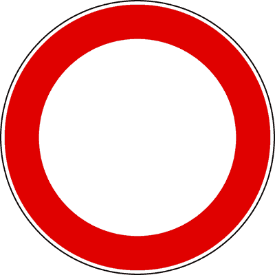

---

**2.** Il segnale raffigurato vieta il transito a tutti i veicoli

- **الإجابة:** `VERO ✅ (صح)`
- 

---

**3.** Il segnale raffigurato vieta la circolazione ai quadricicli a motore

- **الإجابة:** `VERO ✅ (صح)`
- 

---

**4.** Il segnale raffigurato è posto su entrambi gli accessi della strada

- **الإجابة:** `VERO ✅ (صح)`
- 

---

**5.** Il segnale raffigurato vieta il transito agli autocarri

- **الإجابة:** `VERO ✅ (صح)`
- 

---

**6.** Il segnale raffigurato può avere validità limitata nel tempo, indicata in un pannello integrativo

- **الإجابة:** `VERO ✅ (صح)`
- 

---

**7.** Il segnale raffigurato consente il transito ai pedoni

- **الإجابة:** `VERO ✅ (صح)`
- 

---

**8.** Il segnale raffigurato vieta la circolazione ai ciclomotori

- **الإجابة:** `VERO ✅ (صح)`
- 

---

**9.** Il segnale raffigurato è un DIVIETO DI TRANSITO

- **الإجابة:** `VERO ✅ (صح)`
- 

---

**10.** Il segnale raffigurato consente il transito alle biciclette

- **الإجابة:** `FALSO ❌ (خطأ)`
- 

---

**11.** Il segnale raffigurato vieta il transito unicamente ai veicoli a motore

- **الإجابة:** `FALSO ❌ (خطأ)`
- 

---

**12.** Il segnale raffigurato consente, di norma, di entrare nella strada per effettuare la sosta e le operazioni di carico e scarico

- **الإجابة:** `FALSO ❌ (خطأ)`
- 

---

**13.** Il segnale raffigurato non consente l'ingresso, ma solo l'uscita dalla strada

- **الإجابة:** `FALSO ❌ (خطأ)`
- 

---

**14.** Il segnale raffigurato indica che la circolazione è a senso unico

- **الإجابة:** `FALSO ❌ (خطأ)`
- 

---

**15.** Il segnale raffigurato consente il transito alle autovetture con motore elettrico

- **الإجابة:** `FALSO ❌ (خطأ)`
- 

---

**16.** Il segnale raffigurato è un segnale di pericolo

- **الإجابة:** `FALSO ❌ (خطأ)`
- 

---

**17.** Il segnale raffigurato, se barrato in rosso, indica la fine del divieto

- **الإجابة:** `FALSO ❌ (خطأ)`
- 

---

## 📌 Senso vietato (16 domande)

**18.** Il segnale raffigurato vieta di entrare in una strada accessibile invece dall'altra parte

- **الإجابة:** `VERO ✅ (صح)`
- 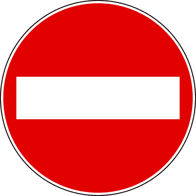

---

**19.** I veicoli senza motore devono rispettare il divieto imposto dal segnale rappresentato

- **الإجابة:** `VERO ✅ (صح)`
- 

---

**20.** I taxi devono rispettare il divieto imposto dal segnale rappresentato

- **الإجابة:** `VERO ✅ (صح)`
- 

---

**21.** I quadricicli a motore devono rispettare il divieto imposto dal segnale rappresentato

- **الإجابة:** `VERO ✅ (صح)`
- 

---

**22.** Il divieto imposto dal segnale raffigurato deve essere rispettato anche nelle ore notturne

- **الإجابة:** `VERO ✅ (صح)`
- 

---

**23.** Il segnale raffigurato è posto su una strada a senso unico

- **الإجابة:** `VERO ✅ (صح)`
- 

---

**24.** Il segnale raffigurato è un SENSO VIETATO

- **الإجابة:** `VERO ✅ (صح)`
- 

---

**25.** Il segnale raffigurato consente l'accesso ai motocicli

- **الإجابة:** `FALSO ❌ (خطأ)`
- 

---

**26.** Il segnale raffigurato consente l'accesso ai ciclomotori

- **الإجابة:** `FALSO ❌ (خطأ)`
- 

---

**27.** Il segnale raffigurato non consente la circolazione dei veicoli in quella strada

- **الإجابة:** `FALSO ❌ (خطأ)`
- 

---

**28.** Il segnale raffigurato è posto su una carreggiata a doppio senso di circolazione

- **الإجابة:** `FALSO ❌ (خطأ)`
- 

---

**29.** Il segnale raffigurato vieta la sosta, ma non la fermata

- **الإجابة:** `FALSO ❌ (خطأ)`
- 

---

**30.** Il segnale raffigurato vieta il sorpasso

- **الإجابة:** `FALSO ❌ (خطأ)`
- 

---

**31.** Il segnale raffigurato consente la circolazione del traffico locale in entrambi i sensi

- **الإجابة:** `FALSO ❌ (خطأ)`
- 

---

**32.** Il divieto imposto dal segnale raffigurato deve essere rispettato, nei centri abitati, dalle ore 8.00 alle ore 20.00

- **الإجابة:** `FALSO ❌ (خطأ)`
- 

---

**33.** Il segnale raffigurato è un DIVIETO DI TRANSITO

- **الإجابة:** `FALSO ❌ (خطأ)`
- 

---

## 📌 Divieto sorpasso (35 domande)

**34.** Il segnale raffigurato consente ad un'autovettura di sorpassare un motociclo

- **الإجابة:** `VERO ✅ (صح)`
- 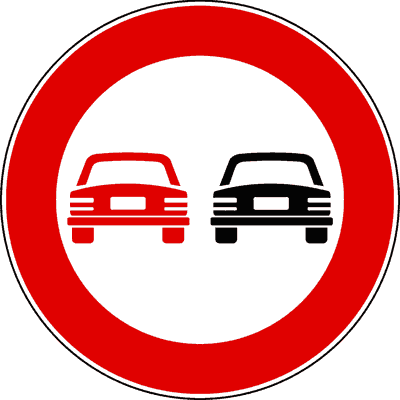

---

**35.** Il segnale raffigurato si può trovare sia sulle strade urbane che su quelle extraurbane

- **الإجابة:** `VERO ✅ (صح)`
- 

---

**36.** Il segnale (A) può essere ripetuto dopo ogni incrocio con pannello integrativo (B)

- **الإجابة:** `VERO ✅ (صح)`
- 

---

**37.** Il segnale raffigurato vieta di sorpassare autocarri

- **الإجابة:** `VERO ✅ (صح)`
- 

---

**38.** Il segnale raffigurato consente di sorpassare i ciclomotori

- **الإجابة:** `VERO ✅ (صح)`
- 

---

**39.** Il segnale raffigurato vieta il sorpasso fra autoveicoli, anche se la manovra può compiersi entro la semicarreggiata

- **الإجابة:** `VERO ✅ (صح)`
- 

---

**40.** In presenza del segnale raffigurato un autocarro può sorpassare un motociclo

- **الإجابة:** `VERO ✅ (صح)`
- 

---

**41.** In presenza del segnale raffigurato un'autovettura può sorpassare un ciclomotore

- **الإجابة:** `VERO ✅ (صح)`
- 

---

**42.** Il segnale raffigurato consente il transito agli autotreni, autoarticolati ed autosnodati

- **الإجابة:** `VERO ✅ (صح)`
- 

---

**43.** In presenza del segnale raffigurato è vietato sorpassare anche gli autoveicoli di massa complessiva inferiore a 3,5 tonnellate

- **الإجابة:** `VERO ✅ (صح)`
- 

---

**44.** In presenza del segnale raffigurato è vietato sorpassare veicoli a motore diversi dai motocicli e dai ciclomotori

- **الإجابة:** `VERO ✅ (صح)`
- 

---

**45.** In presenza del segnale raffigurato è consentito sorpassare veicoli a trazione animale

- **الإجابة:** `VERO ✅ (صح)`
- 

---

**46.** In presenza del segnale raffigurato è consentito sorpassare ciclomotori a due ruote

- **الإجابة:** `VERO ✅ (صح)`
- 

---

**47.** In presenza del segnale raffigurato è consentito il sorpasso dei motocicli

- **الإجابة:** `VERO ✅ (صح)`
- 

---

**48.** Il segnale raffigurato consente il sorpasso delle biciclette

- **الإجابة:** `VERO ✅ (صح)`
- 

---

**49.** In presenza del segnale raffigurato è consentito il sorpasso dei veicoli sprovvisti di motore

- **الإجابة:** `VERO ✅ (صح)`
- 

---

**50.** In presenza del segnale raffigurato è consentito il sorpasso dei veicoli a braccia

- **الإجابة:** `VERO ✅ (صح)`
- 

---

**51.** In presenza del segnale raffigurato è consentito il sorpasso delle carrozze a cavalli

- **الإجابة:** `VERO ✅ (صح)`
- 

---

**52.** Il segnale raffigurato consente ad un motociclo di sorpassare un'autovettura

- **الإجابة:** `FALSO ❌ (خطأ)`
- 

---

**53.** Il segnale raffigurato indica che la corsia di destra è riservata ai veicoli lenti

- **الإجابة:** `FALSO ❌ (خطأ)`
- 

---

**54.** Il segnale raffigurato consente di sorpassare un'autovettura purché non si oltrepassi la striscia continua

- **الإجابة:** `FALSO ❌ (خطأ)`
- 

---

**55.** Il segnale raffigurato vieta ad un motociclo di sorpassare una bicicletta

- **الإجابة:** `FALSO ❌ (خطأ)`
- 

---

**56.** Il segnale raffigurato consente il sorpasso tra autovetture se non vi è la striscia bianca continua

- **الإجابة:** `FALSO ❌ (خطأ)`
- 

---

**57.** Il segnale raffigurato consente ad un'autovettura di sorpassare un autocarro

- **الإجابة:** `FALSO ❌ (خطأ)`
- 

---

**58.** Il segnale raffigurato si trova solo sulle strade extraurbane principali

- **الإجابة:** `FALSO ❌ (خطأ)`
- 

---

**59.** In presenza del segnale raffigurato è vietato sorpassare qualsiasi veicolo

- **الإجابة:** `FALSO ❌ (خطأ)`
- 

---

**60.** In presenza del segnale raffigurato è vietato il transito alle autovetture

- **الإجابة:** `FALSO ❌ (خطأ)`
- 

---

**61.** Il segnale raffigurato impone di dare la precedenza nei sensi unici alternati

- **الإجابة:** `FALSO ❌ (خطأ)`
- 

---

**62.** Il segnale raffigurato consente ad un motociclo di superare un autobus

- **الإجابة:** `FALSO ❌ (خطأ)`
- 

---

**63.** In presenza del segnale raffigurato è consentito il sorpasso degli autoveicoli a motore elettrico

- **الإجابة:** `FALSO ❌ (خطأ)`
- 

---

**64.** Il segnale raffigurato preannuncia una strettoia

- **الإجابة:** `FALSO ❌ (خطأ)`
- 

---

**65.** In presenza del segnale raffigurato è consentito il sorpasso delle macchine agricole

- **الإجابة:** `FALSO ❌ (خطأ)`
- 

---

**66.** In presenza del segnale raffigurato è consentito il sorpasso delle macchine operatrici

- **الإجابة:** `FALSO ❌ (خطأ)`
- 

---

**67.** In presenza del segnale raffigurato è consentito il sorpasso dei veicoli a motore che procedono molto lentamente

- **الإجابة:** `FALSO ❌ (خطأ)`
- 

---

**68.** In presenza del segnale raffigurato è consentito il sorpasso dei veicoli che hanno segnalato l'intenzione di svoltare a destra

- **الإجابة:** `FALSO ❌ (خطأ)`
- 

---

## 📌 Obbligo distanza (12 domande)

**69.** In presenza del segnale raffigurato è obbligatorio mantenere una distanza di almeno 70 metri dal veicolo che precede

- **الإجابة:** `VERO ✅ (صح)`
- 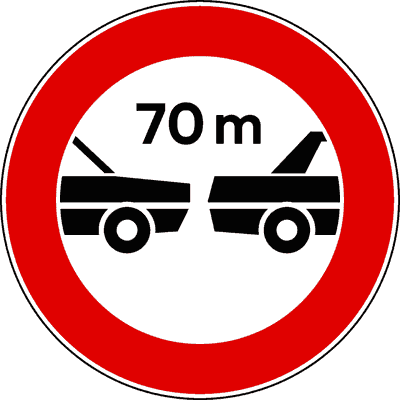

---

**70.** In presenza del segnale raffigurato è consentito ad un veicolo di circolare alla distanza di 80 metri da quello che lo precede

- **الإجابة:** `VERO ✅ (صح)`
- 

---

**71.** Il segnale raffigurato vieta ad un veicolo di circolare a meno di 70 metri da quello che lo precede

- **الإجابة:** `VERO ✅ (صح)`
- 

---

**72.** Il segnale raffigurato vale anche per i motocicli

- **الإجابة:** `VERO ✅ (صح)`
- 

---

**73.** Il segnale raffigurato deve essere rispettato anche quando si viaggia a bassa velocità

- **الإجابة:** `VERO ✅ (صح)`
- 

---

**74.** Il segnale raffigurato obbliga a rispettare la distanza minima indicata

- **الإجابة:** `VERO ✅ (صح)`
- 

---

**75.** Il segnale raffigurato obbliga i veicoli a marciare a meno di 70 metri di distanza l'uno dall'altro

- **الإجابة:** `FALSO ❌ (خطأ)`
- 

---

**76.** Il segnale raffigurato obbliga il veicolo che precede a distanziare quello che lo segue di almeno 70 metri

- **الإجابة:** `FALSO ❌ (خطأ)`
- 

---

**77.** Il segnale raffigurato indica la distanza massima da mantenere esclusivamente nei tratti di strada dove il sorpasso è vietato

- **الإجابة:** `FALSO ❌ (خطأ)`
- 

---

**78.** Il segnale raffigurato preavvisa che a 70 metri inizia il divieto di transito per le autovetture

- **الإجابة:** `FALSO ❌ (خطأ)`
- 

---

**79.** In presenza del segnale raffigurato le autovetture non possono superare la velocità di 70 km/h

- **الإجابة:** `FALSO ❌ (خطأ)`
- 

---

**80.** Il segnale raffigurato indica la lunghezza massima del cavo di traino

- **الإجابة:** `FALSO ❌ (خطأ)`
- 

---

## 📌 Limite 80 (25 domande)

**81.** Il segnale raffigurato è un segnale di divieto

- **الإجابة:** `VERO ✅ (صح)`
- 

---

**82.** In presenza del segnale raffigurato è vietato superare la velocità di 80 km/h

- **الإجابة:** `VERO ✅ (صح)`
- 

---

**83.** Il segnale raffigurato può trovarsi anche sulle autostrade

- **الإجابة:** `VERO ✅ (صح)`
- 

---

**84.** Il limite di velocità indicato sul segnale raffigurato ha validità immediatamente dopo il segnale stesso

- **الإجابة:** `VERO ✅ (صح)`
- 

---

**85.** Il segnale raffigurato prescrive di marciare a velocità inferiore o uguale a 80 km/h

- **الإجابة:** `VERO ✅ (صح)`
- 

---

**86.** Il segnale raffigurato è un segnale di prescrizione

- **الإجابة:** `VERO ✅ (صح)`
- 

---

**87.** Il segnale raffigurato vieta ai veicoli di superare la velocità indicata

- **الإجابة:** `VERO ✅ (صح)`
- 

---

**88.** Il segnale raffigurato obbliga a rispettare un limite massimo di velocità

- **الإجابة:** `VERO ✅ (صح)`
- 

---

**89.** Il segnale raffigurato indica la velocità massima alla quale i veicoli possono procedere

- **الإجابة:** `VERO ✅ (صح)`
- 

---

**90.** Il segnale raffigurato prescrive l'obbligo di viaggiare a velocità non superiore a 80 km/h

- **الإجابة:** `VERO ✅ (صح)`
- 

---

**91.** Il numero raffigurato nel segnale indica la velocità massima consentita

- **الإجابة:** `VERO ✅ (صح)`
- 

---

**92.** Il segnale raffigurato consente di circolare a velocità inferiore a quella indicata

- **الإجابة:** `VERO ✅ (صح)`
- 

---

**93.** Il segnale raffigurato impone di mantenere una distanza di sicurezza di almeno 80 metri

- **الإجابة:** `FALSO ❌ (خطأ)`
- 

---

**94.** Il segnale raffigurato non si riferisce ai motocicli

- **الإجابة:** `FALSO ❌ (خطأ)`
- 

---

**95.** Il segnale raffigurato indica la velocità consigliata

- **الإجابة:** `FALSO ❌ (خطأ)`
- 

---

**96.** Il segnale raffigurato permette di effettuare il sorpasso a velocità superiore a 80 km/h

- **الإجابة:** `FALSO ❌ (خطأ)`
- 

---

**97.** Il segnale raffigurato vieta la circolazione dei veicoli di massa totale superiore a 80 quintali

- **الإجابة:** `FALSO ❌ (خطأ)`
- 

---

**98.** Il segnale raffigurato obbliga a rispettare un limite minimo di velocità

- **الإجابة:** `FALSO ❌ (خطأ)`
- 

---

**99.** Il segnale raffigurato vieta il transito ai veicoli che, per costruzione, non possono raggiungere la velocità indicata

- **الإجابة:** `FALSO ❌ (خطأ)`
- 

---

**100.** Il segnale raffigurato indica un limite di velocità valido solo per autoveicoli

- **الإجابة:** `FALSO ❌ (خطأ)`
- 

---

**101.** Il segnale raffigurato obbliga a rispettare il limite minimo di velocità indicato

- **الإجابة:** `FALSO ❌ (خطأ)`
- 

---

**102.** Il segnale raffigurato impone ai veicoli che non sono in grado di superare gli 80 km/h di marciare sulla corsia di destra

- **الإجابة:** `FALSO ❌ (خطأ)`
- 

---

**103.** Il limite di velocità indicato dal segnale raffigurato entra in vigore 150 metri dopo il segnale stesso

- **الإجابة:** `FALSO ❌ (خطأ)`
- 

---

**104.** Il segnale raffigurato vieta il transito agli autoveicoli con massa complessiva superiore al valore indicato

- **الإجابة:** `FALSO ❌ (خطأ)`
- 

---

**105.** Il segnale raffigurato indica un limite di velocità valido dalle ore 8.00 alle ore 20.00

- **الإجابة:** `FALSO ❌ (خطأ)`
- 

---

## 📌 Divieto clacson (11 domande)

**106.** Il segnale raffigurato vieta l'uso del clacson

- **الإجابة:** `VERO ✅ (صح)`
- 

---

**107.** Il segnale raffigurato vieta le segnalazioni acustiche

- **الإجابة:** `VERO ✅ (صح)`
- 

---

**108.** In presenza del segnale raffigurato è consentito l'uso del clacson solo in caso di pericolo immediato

- **الإجابة:** `VERO ✅ (صح)`
- 

---

**109.** Il segnale raffigurato indica l'inizio di una zona in cui è vietato suonare il clacson

- **الإجابة:** `VERO ✅ (صح)`
- 

---

**110.** In presenza del segnale raffigurato si può utilizzare il clacson se si trasportano feriti o ammalati gravi

- **الإجابة:** `VERO ✅ (صح)`
- 

---

**111.** Il segnale raffigurato consente l'uso del clacson per richiamare l'attenzione in qualsiasi circostanza

- **الإجابة:** `FALSO ❌ (خطأ)`
- 

---

**112.** Il segnale raffigurato deve essere rispettato soltanto dalle ore 20.00 alle ore 8.00

- **الإجابة:** `FALSO ❌ (خطأ)`
- 

---

**113.** Il segnale raffigurato preavvisa la possibilità di incontrare una caserma dei vigili del fuoco

- **الإجابة:** `FALSO ❌ (خطأ)`
- 

---

**114.** Il segnale raffigurato preavvisa una strettoia su strade di montagna

- **الإجابة:** `FALSO ❌ (خطأ)`
- 

---

**115.** Il segnale raffigurato consente l'uso del clacson nei casi di ingorgo stradale

- **الإجابة:** `FALSO ❌ (خطأ)`
- 

---

**116.** Il segnale raffigurato indica la fine del divieto di segnalazioni acustiche

- **الإجابة:** `FALSO ❌ (خطأ)`
- 

---

## 📌 Divieto sorpasso camion (16 domande)

**117.** Il segnale raffigurato vieta ai veicoli di massa a pieno carico superiore a 3,5 tonnellate non destinati al trasporto di persone, di sorpassare veicoli a motore

- **الإجابة:** `VERO ✅ (صح)`
- 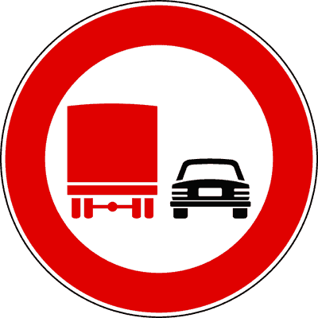

---

**118.** In presenza del segnale raffigurato, un autocarro non può sorpassare veicoli a motore se sulla sua carta di circolazione è indicata una massa complessiva a pieno carico superiore a 3,5 tonnellate

- **الإجابة:** `VERO ✅ (صح)`
- 

---

**119.** Il segnale raffigurato consente ad un autocarro di massa a pieno carico inferiore a 3,5 tonnellate di sorpassare un autoarticolato

- **الإجابة:** `VERO ✅ (صح)`
- 

---

**120.** Il segnale raffigurato consente ad un autobus di massa a pieno carico pari a 18 tonnellate di sorpassare un autotreno

- **الإجابة:** `VERO ✅ (صح)`
- 

---

**121.** In presenza del segnale raffigurato un'autovettura con massa a pieno carico pari a 3 tonnellate trainante un carrello appendice, può sorpassare veicoli a motore

- **الإجابة:** `VERO ✅ (صح)`
- 

---

**122.** In presenza del segnale raffigurato un'autovettura può sorpassare un autotreno

- **الإجابة:** `VERO ✅ (صح)`
- 

---

**123.** In presenza del segnale raffigurato un autocaravan con massa a pieno carico pari a 4 tonnellate può effettuare manovre di sorpasso

- **الإجابة:** `VERO ✅ (صح)`
- 

---

**124.** In presenza del segnale raffigurato è vietato agli autocarri con massa a pieno carico superiore a 3,5 t di sorpassare un motociclo

- **الإجابة:** `VERO ✅ (صح)`
- 

---

**125.** In presenza del segnale raffigurato un autocarro con massa massima a pieno carico superiore a 3,5 tonnellate trainante un rimorchio leggero, può sorpassare un motociclo

- **الإجابة:** `FALSO ❌ (خطأ)`
- 

---

**126.** In presenza del segnale raffigurato un autocaravan di massa a pieno carico superiore a 3,5 tonnellate non può sorpassare veicoli a motore

- **الإجابة:** `FALSO ❌ (خطأ)`
- 

---

**127.** Il segnale raffigurato consente ad un autocarro di massa complessiva superiore a 3,5 tonnellate di sorpassare un motociclo

- **الإجابة:** `FALSO ❌ (خطأ)`
- 

---

**128.** Il segnale raffigurato consente alle autovetture di sorpassare gli autocarri sulla corsia di destra

- **الإجابة:** `FALSO ❌ (خطأ)`
- 

---

**129.** Il segnale raffigurato vieta il sorpasso agli autosnodati

- **الإجابة:** `FALSO ❌ (خطأ)`
- 

---

**130.** Il segnale raffigurato vieta ad un'autocaravan di massa complessiva pari a 6 tonnellate di effettuare manovre di sorpasso

- **الإجابة:** `FALSO ❌ (خطأ)`
- 

---

**131.** In presenza del segnale raffigurato, un autocarro di massa a pieno carico pari a 3 tonnellate non può effettuare manovre di sorpasso

- **الإجابة:** `FALSO ❌ (خطأ)`
- 

---

**132.** In presenza del segnale raffigurato i veicoli con massa a pieno carico superiore a 3,5 tonnellate destinati al trasporto di persone, non possono effettuare manovre di sorpasso

- **الإجابة:** `FALSO ❌ (خطأ)`
- 

---

## 📌 Veicoli trazione animale (12 domande)

**133.** Il segnale raffigurato vieta il transito ai veicoli a trazione animale

- **الإجابة:** `VERO ✅ (صح)`
- 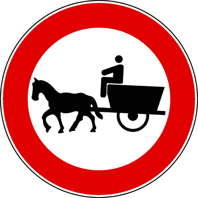

---

**134.** Il segnale raffigurato vieta il transito ai veicoli trainati da cavalli

- **الإجابة:** `VERO ✅ (صح)`
- 

---

**135.** Il segnale raffigurato vieta la circolazione alle carrozze a cavalli

- **الإجابة:** `VERO ✅ (صح)`
- 

---

**136.** Il segnale raffigurato vieta il transito ai veicoli trainati da asini

- **الإجابة:** `VERO ✅ (صح)`
- 

---

**137.** Il segnale raffigurato consente il transito dei motocicli

- **الإجابة:** `VERO ✅ (صح)`
- 

---

**138.** Il segnale raffigurato consente il transito degli autoveicoli

- **الإجابة:** `VERO ✅ (صح)`
- 

---

**139.** Il segnale raffigurato vieta il transito ai veicoli a motore

- **الإجابة:** `FALSO ❌ (خطأ)`
- 

---

**140.** Il segnale raffigurato vige, nei centri abitati, dalle ore 8.00 alle ore 20.00

- **الإجابة:** `FALSO ❌ (خطأ)`
- 

---

**141.** Il segnale raffigurato consente il transito ai veicoli a trazione animale se muniti di pneumatici

- **الإجابة:** `FALSO ❌ (خطأ)`
- 

---

**142.** Il segnale raffigurato indica una strada riservata ai carri agricoli

- **الإجابة:** `FALSO ❌ (خطأ)`
- 

---

**143.** Il segnale raffigurato vieta il transito ai veicoli a braccia

- **الإجابة:** `FALSO ❌ (خطأ)`
- 

---

**144.** Il segnale raffigurato vieta la circolazione a tutti i veicoli sprovvisti di motore

- **الإجابة:** `FALSO ❌ (خطأ)`
- 

---

## 📌 Divieto transito pedoni (10 domande)

**145.** Il segnale raffigurato vieta il transito ai pedoni

- **الإجابة:** `VERO ✅ (صح)`
- 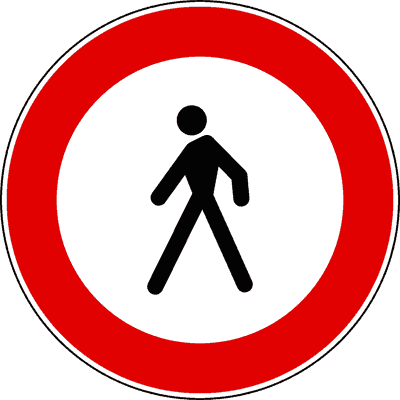

---

**146.** Il segnale raffigurato consente il transito agli autoveicoli

- **الإجابة:** `VERO ✅ (صح)`
- 

---

**147.** Il segnale raffigurato consente il transito ai motocicli

- **الإجابة:** `VERO ✅ (صح)`
- 

---

**148.** Il segnale raffigurato consente il transito ai quadricicli a motore

- **الإجابة:** `VERO ✅ (صح)`
- 

---

**149.** Il segnale raffigurato consente il transito alle biciclette

- **الإجابة:** `VERO ✅ (صح)`
- 

---

**150.** Il segnale raffigurato vieta il transito ai ciclomotori

- **الإجابة:** `FALSO ❌ (خطأ)`
- 

---

**151.** Il segnale raffigurato vale dalle ore 8.00 alle ore 20.00

- **الإجابة:** `FALSO ❌ (خطأ)`
- 

---

**152.** Il segnale raffigurato indica un'area urbana riservata a parco giochi e divertimenti

- **الإجابة:** `FALSO ❌ (خطأ)`
- 

---

**153.** Il segnale raffigurato obbliga i pedoni a circolare sul margine sinistro della carreggiata

- **الإجابة:** `FALSO ❌ (خطأ)`
- 

---

**154.** Il segnale raffigurato indica l'inizio di un percorso pedonale

- **الإجابة:** `FALSO ❌ (خطأ)`
- 

---

## 📌 Transito biciclette (13 domande)

**155.** Il segnale raffigurato vieta il transito alle biciclette

- **الإجابة:** `VERO ✅ (صح)`
- 

---

**156.** Il segnale raffigurato è un segnale di divieto

- **الإجابة:** `VERO ✅ (صح)`
- 

---

**157.** Il segnale raffigurato consente il transito ai quadricicli a motore

- **الإجابة:** `VERO ✅ (صح)`
- 

---

**158.** Il segnale raffigurato consente il transito ai pedoni

- **الإجابة:** `VERO ✅ (صح)`
- 

---

**159.** Il segnale raffigurato consente il transito ai ciclomotori a due ruote

- **الإجابة:** `VERO ✅ (صح)`
- 

---

**160.** Il segnale raffigurato vieta il transito ai quadricicli a pedale

- **الإجابة:** `VERO ✅ (صح)`
- 

---

**161.** Il segnale raffigurato vieta il transito ai tandem

- **الإجابة:** `VERO ✅ (صح)`
- 

---

**162.** Il segnale raffigurato vale dalle ore 8.00 alle ore 20.00

- **الإجابة:** `FALSO ❌ (خطأ)`
- 

---

**163.** Il segnale raffigurato consente il transito delle biciclette nelle ore notturne

- **الإجابة:** `FALSO ❌ (خطأ)`
- 

---

**164.** Il segnale raffigurato vieta il transito ai motocicli

- **الإجابة:** `FALSO ❌ (خطأ)`
- 

---

**165.** Il segnale raffigurato vieta il transito ai ciclomotori

- **الإجابة:** `FALSO ❌ (خطأ)`
- 

---

**166.** Il segnale raffigurato indica la presenza di una corsia riservata a biciclette e ciclomotori

- **الإجابة:** `FALSO ❌ (خطأ)`
- 

---

**167.** Il segnale raffigurato indica un parcheggio per le biciclette

- **الإجابة:** `FALSO ❌ (خطأ)`
- 

---

## 📌 Divieto transito motocicli (13 domande)

**168.** Il segnale raffigurato vieta il transito ai motocicli

- **الإجابة:** `VERO ✅ (صح)`
- 

---

**169.** Il segnale raffigurato consente il transito ai tricicli e ai quadricicli a motore

- **الإجابة:** `VERO ✅ (صح)`
- 

---

**170.** Il segnale raffigurato consente il transito alle autovetture

- **الإجابة:** `VERO ✅ (صح)`
- 

---

**171.** Il segnale raffigurato consente il transito alle biciclette

- **الإجابة:** `VERO ✅ (صح)`
- 

---

**172.** Il segnale raffigurato vieta il transito ai motocicli di qualsiasi cilindrata

- **الإجابة:** `VERO ✅ (صح)`
- 

---

**173.** Il segnale raffigurato consente il transito ai motocicli

- **الإجابة:** `FALSO ❌ (خطأ)`
- 

---

**174.** Il segnale raffigurato vieta il transito a tutti i veicoli a due ruote

- **الإجابة:** `FALSO ❌ (خطأ)`
- 

---

**175.** Il segnale raffigurato si riferisce ai soli motocicli di cilindrata superiore ai 125 cm3

- **الإجابة:** `FALSO ❌ (خطأ)`
- 

---

**176.** Il segnale raffigurato consente il transito ai motocicli dotati di cellula di sicurezza

- **الإجابة:** `FALSO ❌ (خطأ)`
- 

---

**177.** Il segnale raffigurato vieta il transito ai ciclomotori

- **الإجابة:** `FALSO ❌ (خطأ)`
- 

---

**178.** Il segnale raffigurato vieta il transito ai quadricicli a motore

- **الإجابة:** `FALSO ❌ (خطأ)`
- 

---

**179.** Il segnale raffigurato è un segnale di pericolo

- **الإجابة:** `FALSO ❌ (خطأ)`
- 

---

**180.** Il segnale raffigurato obbliga i motociclisti a servirsi della pista loro riservata

- **الإجابة:** `FALSO ❌ (خطأ)`
- 

---

## 📌 Veicoli braccia (11 domande)

**181.** Il segnale raffigurato vieta il transito ai veicoli a braccia

- **الإجابة:** `VERO ✅ (صح)`
- 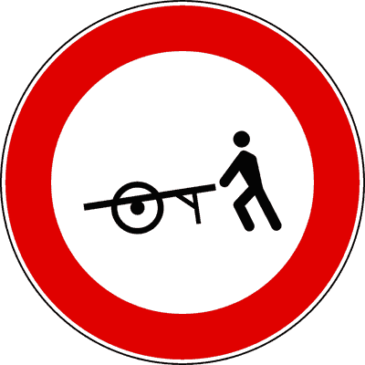

---

**182.** Il segnale raffigurato consente il transito delle biciclette

- **الإجابة:** `VERO ✅ (صح)`
- 

---

**183.** Il segnale raffigurato consente il transito dei ciclomotori

- **الإجابة:** `VERO ✅ (صح)`
- 

---

**184.** Il segnale raffigurato consente il transito di autovetture che trainano un carrello-appendice

- **الإجابة:** `VERO ✅ (صح)`
- 

---

**185.** Il segnale raffigurato vieta il transito di carretti a mano

- **الإجابة:** `VERO ✅ (صح)`
- 

---

**186.** Il segnale raffigurato indica una strada riservata ai venditori ambulanti

- **الإجابة:** `FALSO ❌ (خطأ)`
- 

---

**187.** Il segnale raffigurato vieta il transito dei veicoli a motore durante le ore di mercato

- **الإجابة:** `FALSO ❌ (خطأ)`
- 

---

**188.** Il segnale raffigurato è un segnale di pericolo

- **الإجابة:** `FALSO ❌ (خطأ)`
- 

---

**189.** Il segnale raffigurato vale, per tutti i veicoli, durante le ore di mercato

- **الإجابة:** `FALSO ❌ (خطأ)`
- 

---

**190.** Il segnale raffigurato vieta il transito di veicoli a trazione animale

- **الإجابة:** `FALSO ❌ (خطأ)`
- 

---

**191.** Il segnale raffigurato vieta il transito ad un motociclo, anche se spinto a braccia

- **الإجابة:** `FALSO ❌ (خطأ)`
- 

---

## 📌 Divieto transito autoveicoli (12 domande)

**192.** Il segnale raffigurato vieta il transito a tutti gli autoveicoli

- **الإجابة:** `VERO ✅ (صح)`
- 

---

**193.** Il segnale raffigurato vieta il transito ai tricicli a motore

- **الإجابة:** `VERO ✅ (صح)`
- 

---

**194.** In presenza del segnale raffigurato è permesso il transito ai motocicli

- **الإجابة:** `VERO ✅ (صح)`
- 

---

**195.** In presenza del segnale raffigurato è permesso il transito ai ciclomotori a due ruote

- **الإجابة:** `VERO ✅ (صح)`
- 

---

**196.** Il segnale raffigurato vieta il transito ai quadricicli a motore

- **الإجابة:** `VERO ✅ (صح)`
- 

---

**197.** In presenza del segnale raffigurato è permesso il transito ai veicoli sprovvisti di motore

- **الإجابة:** `VERO ✅ (صح)`
- 

---

**198.** In presenza del segnale raffigurato è permesso il transito ai quadricicli a motore

- **الإجابة:** `FALSO ❌ (خطأ)`
- 

---

**199.** Il segnale raffigurato vieta il transito alle sole autovetture non catalizzate

- **الإجابة:** `FALSO ❌ (خطأ)`
- 

---

**200.** In presenza del segnale raffigurato è consentito il transito alle autovetture adibite al servizio di taxi

- **الإجابة:** `FALSO ❌ (خطأ)`
- 

---

**201.** In presenza del segnale raffigurato è permesso il transito a tutti i tricicli a motore

- **الإجابة:** `FALSO ❌ (خطأ)`
- 

---

**202.** In presenza del segnale raffigurato è consentito il transito agli autobus

- **الإجابة:** `FALSO ❌ (خطأ)`
- 

---

**203.** In presenza del segnale raffigurato è consentito il transito agli autocarri

- **الإجابة:** `FALSO ❌ (خطأ)`
- 

---

## 📌 Divieto transito autobus (12 domande)

**204.** Il segnale raffigurato indica il divieto di transito agli autobus

- **الإجابة:** `VERO ✅ (صح)`
- 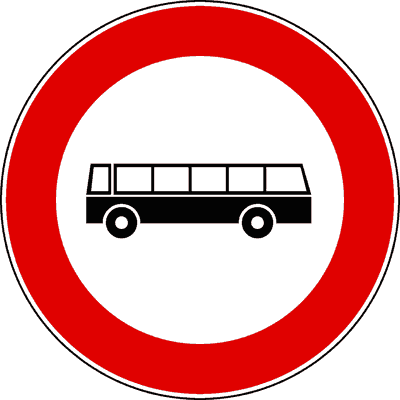

---

**205.** In presenza del segnale raffigurato è consentito il transito alle autovetture

- **الإجابة:** `VERO ✅ (صح)`
- 

---

**206.** In presenza del segnale raffigurato è consentito il transito agli autocarri

- **الإجابة:** `VERO ✅ (صح)`
- 

---

**207.** In presenza del segnale raffigurato è consentito il transito ai motocicli

- **الإجابة:** `VERO ✅ (صح)`
- 

---

**208.** In presenza del segnale raffigurato è consentito il transito alle autocaravan

- **الإجابة:** `VERO ✅ (صح)`
- 

---

**209.** Il segnale raffigurato vieta il transito anche agli autobus di massa a pieno carico inferiore a 3,5 tonnellate

- **الإجابة:** `VERO ✅ (صح)`
- 

---

**210.** In presenza del segnale raffigurato è consentito il transito agli autobus turistici

- **الإجابة:** `FALSO ❌ (خطأ)`
- 

---

**211.** Il segnale raffigurato segnala una corsia riservata agli autobus

- **الإجابة:** `FALSO ❌ (خطأ)`
- 

---

**212.** Il segnale raffigurato preannuncia un'area di sosta per autobus turistici

- **الإجابة:** `FALSO ❌ (خطأ)`
- 

---

**213.** In presenza del segnale raffigurato è consentito il transito agli scuolabus

- **الإجابة:** `FALSO ❌ (خطأ)`
- 

---

**214.** Il segnale raffigurato vieta il transito alle autocaravan

- **الإجابة:** `FALSO ❌ (خطأ)`
- 

---

**215.** Il segnale raffigurato è valido solo nei giorni feriali

- **الإجابة:** `FALSO ❌ (خطأ)`
- 

---

## 📌 Transito mezzi pesanti (9 domande)

**216.** Il segnale raffigurato vieta il transito ai veicoli adibiti al trasporto di cose con massa a pieno carico superiore a 3,5 tonnellate

- **الإجابة:** `VERO ✅ (صح)`
- 

---

**217.** In presenza del segnale raffigurato è consentito il transito di autobus di massa complessiva superiore a 3,5 tonnellate

- **الإجابة:** `VERO ✅ (صح)`
- 

---

**218.** In presenza del segnale raffigurato è consentito il transito di un'autocaravan di massa a pieno carico superiore a 3,5 tonnellate

- **الإجابة:** `VERO ✅ (صح)`
- 

---

**219.** Il segnale raffigurato può essere munito di pannello integrativo con un diverso valore della massa ammessa al transito

- **الإجابة:** `VERO ✅ (صح)`
- 

---

**220.** Il segnale raffigurato vieta il transito di un autocarro di massa a pieno carico pari a 3 tonnellate

- **الإجابة:** `FALSO ❌ (خطأ)`
- 

---

**221.** Il segnale raffigurato vieta il transito a tutti gli autocarri carrozzati con furgone chiuso

- **الإجابة:** `FALSO ❌ (خطأ)`
- 

---

**222.** In presenza del segnale raffigurato è consentito il transito a tutti gli autocarri carrozzati con cassone aperto

- **الإجابة:** `FALSO ❌ (خطأ)`
- 

---

**223.** Il segnale raffigurato vieta il transito ai veicoli di massa superiore a 3,5 tonnellate destinati al trasporto di persone

- **الإجابة:** `FALSO ❌ (خطأ)`
- 

---

**224.** In presenza del segnale raffigurato è consentito il transito agli autotreni di massa superiore a 3,5 tonnellate non adibiti al trasporto di persone

- **الإجابة:** `FALSO ❌ (خطأ)`
- 

---

## 📌 Mezzi molto pesanti (10 domande)

**225.** In presenza del segnale raffigurato è consentito il transito alle autocaravan

- **الإجابة:** `VERO ✅ (صح)`
- 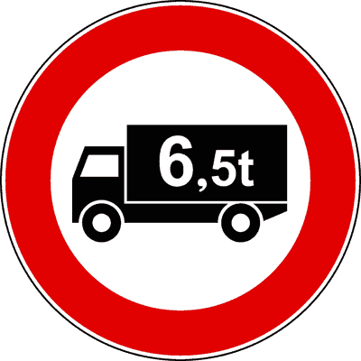

---

**226.** In presenza del segnale raffigurato è consentito il transito agli autobus

- **الإجابة:** `VERO ✅ (صح)`
- 

---

**227.** Il segnale raffigurato vieta il transito agli autocarri con massa a pieno carico superiore a 6,5 tonnellate

- **الإجابة:** `VERO ✅ (صح)`
- 

---

**228.** In presenza del segnale raffigurato è consentito il transito ai veicoli adibiti al trasporto di cose con massa complessiva pari o inferiore a quella indicata nel segnale

- **الإجابة:** `VERO ✅ (صح)`
- 

---

**229.** In presenza del segnale raffigurato è vietato il transito di autocarri se sulla carta di circolazione è indicata una massa a pieno carico superiore a 6,5 tonnellate

- **الإجابة:** `VERO ✅ (صح)`
- 

---

**230.** In presenza del segnale raffigurato è consentito il transito agli autocarri di massa complessiva pari a 7,5 tonnellate

- **الإجابة:** `FALSO ❌ (خطأ)`
- 

---

**231.** Il segnale raffigurato vieta il transito ai veicoli di massa superiore a 6,5 tonnellate destinati al trasporto di persone

- **الإجابة:** `FALSO ❌ (خطأ)`
- 

---

**232.** In presenza del segnale raffigurato è consentito il transito agli autoveicoli ad uso speciale di massa superiore a 6,5 tonnellate

- **الإجابة:** `FALSO ❌ (خطأ)`
- 

---

**233.** Il segnale raffigurato preannuncia una pesa pubblica nelle vicinanze

- **الإجابة:** `FALSO ❌ (خطأ)`
- 

---

**234.** Il segnale raffigurato vieta il transito di autobus di massa complessiva superiore a 10 tonnellate

- **الإجابة:** `FALSO ❌ (خطأ)`
- 

---

## 📌 Transito veicoli rimorchio (10 domande)

**235.** Il segnale raffigurato può essere integrato con pannello che consente il traino di rimorchi di massa non superiore a quella indicata nel pannello stesso

- **الإجابة:** `VERO ✅ (صح)`
- 

---

**236.** Il segnale raffigurato vieta il transito agli autotreni

- **الإجابة:** `VERO ✅ (صح)`
- 

---

**237.** In presenza del segnale raffigurato è consentito il transito di un autoveicolo trainante un carrello-appendice

- **الإجابة:** `VERO ✅ (صح)`
- 

---

**238.** Il segnale raffigurato vieta il transito ai veicoli a motore trainanti un rimorchio

- **الإجابة:** `VERO ✅ (صح)`
- 

---

**239.** In presenza del segnale raffigurato è consentito il transito agli autosnodati

- **الإجابة:** `VERO ✅ (صح)`
- 

---

**240.** In presenza del segnale raffigurato è consentito il transito di un'autovettura trainante un caravan

- **الإجابة:** `FALSO ❌ (خطأ)`
- 

---

**241.** Il segnale raffigurato vale soltanto per i veicoli adibiti al trasporto di merci

- **الإجابة:** `FALSO ❌ (خطأ)`
- 

---

**242.** Il segnale raffigurato indica autocarri in rallentamento

- **الإجابة:** `FALSO ❌ (خطأ)`
- 

---

**243.** Il segnale raffigurato indica che gli autotreni debbono procedere ad una distanza di almeno 100 metri tra di loro

- **الإجابة:** `FALSO ❌ (خطأ)`
- 

---

**244.** In presenza del segnale raffigurato è consentito il transito ad un'autovettura che traina un rimorchio per imbarcazione

- **الإجابة:** `FALSO ❌ (خطأ)`
- 

---

## 📌 Transito macchine agricole (14 domande)

**245.** Il segnale raffigurato vieta il transito alle trattrici agricole

- **الإجابة:** `VERO ✅ (صح)`
- 

---

**246.** In presenza del segnale raffigurato è consentito il transito di veicoli sgombraneve

- **الإجابة:** `VERO ✅ (صح)`
- 

---

**247.** Il segnale raffigurato vale sia di giorno che di notte

- **الإجابة:** `VERO ✅ (صح)`
- 

---

**248.** In presenza del segnale raffigurato è consentito il transito alle macchine operatrici destinate a lavori di manutenzione stradale

- **الإجابة:** `VERO ✅ (صح)`
- 

---

**249.** Il segnale raffigurato vale sia per le macchine agricole gommate, sia per quelle cingolate

- **الإجابة:** `VERO ✅ (صح)`
- 

---

**250.** In presenza del segnale raffigurato è consentito il transito ai motocicli

- **الإجابة:** `VERO ✅ (صح)`
- 

---

**251.** In presenza del segnale raffigurato è consentito il transito ai quadricicli a motore

- **الإجابة:** `VERO ✅ (صح)`
- 

---

**252.** In presenza del segnale raffigurato è consentito il transito alle macchine agricole

- **الإجابة:** `FALSO ❌ (خطأ)`
- 

---

**253.** In presenza del segnale raffigurato è consentito il traino dei rimorchi agricoli di massa complessiva fino a 1,5 tonnellate

- **الإجابة:** `FALSO ❌ (خطأ)`
- 

---

**254.** Il segnale raffigurato vieta il transito ai trattori stradali per semirimorchi

- **الإجابة:** `FALSO ❌ (خطأ)`
- 

---

**255.** Il segnale raffigurato vieta il transito ai quadricicli a motore

- **الإجابة:** `FALSO ❌ (خطأ)`
- 

---

**256.** Il segnale raffigurato è obbligatorio in corrispondenza degli accessi privati

- **الإجابة:** `FALSO ❌ (خطأ)`
- 

---

**257.** Il segnale raffigurato si trova soltanto sulla rete stradale delle aziende agricole

- **الإجابة:** `FALSO ❌ (خطأ)`
- 

---

**258.** In presenza del segnale raffigurato è consentito il transito alle macchine agricole durante le fiere

- **الإجابة:** `FALSO ❌ (خطأ)`
- 

---

## 📌 Merci pericolose (7 domande)

**259.** Il segnale raffigurato vieta il transito ai veicoli che trasportano merci pericolose

- **الإجابة:** `VERO ✅ (صح)`
- 

---

**260.** Il segnale raffigurato vieta il transito alle autocisterne che trasportano benzina

- **الإجابة:** `VERO ✅ (صح)`
- 

---

**261.** Il segnale raffigurato vieta il transito ai veicoli che trasportano carni macellate

- **الإجابة:** `FALSO ❌ (خطأ)`
- 

---

**262.** Il segnale raffigurato vieta il transito agli autoveicoli con motore alimentato a gas liquido (GPL)

- **الإجابة:** `FALSO ❌ (خطأ)`
- 

---

**263.** Il segnale raffigurato vieta il transito agli autocarri telonati

- **الإجابة:** `FALSO ❌ (خطأ)`
- 

---

**264.** Il segnale raffigurato vieta il transito ai veicoli che trasportano merci deperibili

- **الإجابة:** `FALSO ❌ (خطأ)`
- 

---

**265.** Il segnale raffigurato vieta il transito ai veicoli con furgone frigorifero

- **الإجابة:** `FALSO ❌ (خطأ)`
- 

---

## 📌 Trasporto esplosivi (8 domande)

**266.** Il segnale raffigurato vieta il transito ai veicoli che trasportano esplosivi

- **الإجابة:** `VERO ✅ (صح)`
- 

---

**267.** Il carburante contenuto nel serbatoio del veicolo non si considera trasporto di materiale infiammabile vietato dal segnale in figura

- **الإجابة:** `VERO ✅ (صح)`
- 

---

**268.** In presenza del segnale raffigurato è consentito il transito di autovetture alimentate a metano

- **الإجابة:** `VERO ✅ (صح)`
- 

---

**269.** Il segnale raffigurato vieta il transito ai veicoli che trasportano prodotti facilmente infiammabili

- **الإجابة:** `VERO ✅ (صح)`
- 

---

**270.** In presenza del segnale raffigurato gli autoveicoli che trasportano esplosivi possono effettuare manovre di sorpasso

- **الإجابة:** `FALSO ❌ (خطأ)`
- 

---

**271.** Il segnale raffigurato prescrive di fare attenzione al transito di veicoli che trasportano esplosivo

- **الإجابة:** `FALSO ❌ (خطأ)`
- 

---

**272.** In presenza del segnale raffigurato è consentito il transito ai veicoli che trasportano prodotti facilmente infiammabili, purché non esplosivi

- **الإجابة:** `FALSO ❌ (خطأ)`
- 

---

**273.** In presenza del segnale raffigurato è consentito il traino di veicoli che trasportano prodotti facilmente infiammabili

- **الإجابة:** `FALSO ❌ (خطأ)`
- 

---

## 📌 Veicoli acqua (9 domande)

**274.** Il segnale raffigurato vieta il transito ai veicoli che trasportano sostanze suscettibili di contaminare l'acqua

- **الإجابة:** `VERO ✅ (صح)`
- 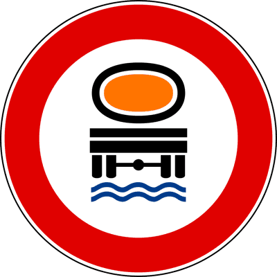

---

**275.** In presenza del segnale raffigurato è consentito il transito di autoveicoli che trasportano prodotti che non contaminano l'acqua

- **الإجابة:** `VERO ✅ (صح)`
- 

---

**276.** In presenza del segnale raffigurato è consentito il transito alle autocisterne che trasportano acqua

- **الإجابة:** `VERO ✅ (صح)`
- 

---

**277.** In presenza del segnale raffigurato è consentito il transito alle innaffiatrici stradali

- **الإجابة:** `VERO ✅ (صح)`
- 

---

**278.** In presenza del segnale raffigurato è consentito il transito di rimorchi che trasportano sostanze che possono contaminare l'acqua

- **الإجابة:** `FALSO ❌ (خطأ)`
- 

---

**279.** Il segnale raffigurato preannuncia una zona soggetta ad allagamento

- **الإجابة:** `FALSO ❌ (خطأ)`
- 

---

**280.** Il segnale raffigurato preannuncia la probabile presenza di acqua sulla carreggiata

- **الإجابة:** `FALSO ❌ (خطأ)`
- 

---

**281.** Il segnale raffigurato vieta la sosta delle autocisterne

- **الإجابة:** `FALSO ❌ (خطأ)`
- 

---

**282.** Il segnale raffigurato vieta il transito alle cisterne vuote

- **الإجابة:** `FALSO ❌ (خطأ)`
- 

---

## 📌 Divieto veicoli larghi (12 domande)

**283.** Il segnale raffigurato si riferisce ai veicoli anche se sprovvisti di motore

- **الإجابة:** `VERO ✅ (صح)`
- 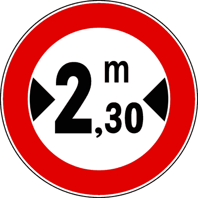

---

**284.** Il segnale raffigurato può trovarsi prima di una strettoia

- **الإجابة:** `VERO ✅ (صح)`
- 

---

**285.** Il segnale raffigurato è posto sulle strade sia urbane che extraurbane

- **الإجابة:** `VERO ✅ (صح)`
- 

---

**286.** Il segnale raffigurato indica la larghezza massima dei veicoli ammessi al transito

- **الإجابة:** `VERO ✅ (صح)`
- 

---

**287.** In presenza del segnale raffigurato è consentito il transito di autotreni larghi 2,30 metri

- **الإجابة:** `VERO ✅ (صح)`
- 

---

**288.** Il segnale raffigurato si riferisce a tutti i veicoli di larghezza superiore a 2,30 metri

- **الإجابة:** `VERO ✅ (صح)`
- 

---

**289.** Il segnale raffigurato indica la distanza minima di sicurezza tra due autoveicoli in transito su quella strada

- **الإجابة:** `FALSO ❌ (خطأ)`
- 

---

**290.** In presenza del segnale raffigurato i veicoli a trazione animale larghi più di 2,30 m possono transitare

- **الإجابة:** `FALSO ❌ (خطأ)`
- 

---

**291.** Il segnale raffigurato è un divieto che non riguarda gli autobus

- **الإجابة:** `FALSO ❌ (خطأ)`
- 

---

**292.** Il segnale raffigurato indica la larghezza di una strettoia

- **الإجابة:** `FALSO ❌ (خطأ)`
- 

---

**293.** Il segnale raffigurato è relativo al rimorchio, ma non alla motrice

- **الإجابة:** `FALSO ❌ (خطأ)`
- 

---

**294.** Il segnale raffigurato indica una strada larga 2,30 metri

- **الإجابة:** `FALSO ❌ (خطأ)`
- 

---

## 📌 Transito veicoli alti (11 domande)

**295.** Il segnale raffigurato indica l'altezza massima, misurata dal piano stradale, dei veicoli che possono transitare

- **الإجابة:** `VERO ✅ (صح)`
- 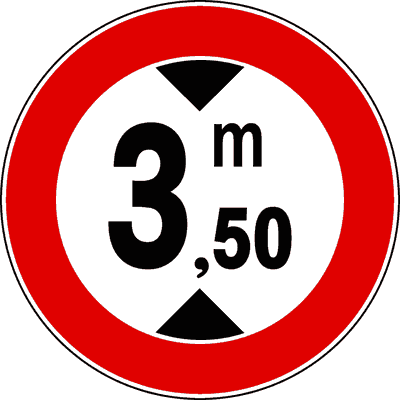

---

**296.** Il segnale raffigurato vieta il transito degli autoveicoli con altezza, comprensiva del carico, superiore a 3,50 metri

- **الإجابة:** `VERO ✅ (صح)`
- 

---

**297.** Il segnale raffigurato indica l'altezza massima dei veicoli ammessi al transito

- **الإجابة:** `VERO ✅ (صح)`
- 

---

**298.** In presenza del segnale raffigurato è consentito il transito di una macchina agricola alta 3,50 metri

- **الإجابة:** `VERO ✅ (صح)`
- 

---

**299.** Il segnale raffigurato può trovarsi sia nei centri abitati che fuori

- **الإجابة:** `VERO ✅ (صح)`
- 

---

**300.** Il segnale raffigurato può trovarsi in un punto in cui la strada passa sotto un ponte

- **الإجابة:** `VERO ✅ (صح)`
- 

---

**301.** Il segnale raffigurato vieta il transito degli autoveicoli di lunghezza superiore a 3,50 metri

- **الإجابة:** `FALSO ❌ (خطأ)`
- 

---

**302.** Il segnale raffigurato indica un passaggio alto 3,50 metri

- **الإجابة:** `FALSO ❌ (خطأ)`
- 

---

**303.** Il segnale raffigurato nei centri abitati vale soltanto dalle ore 8.00 alle ore 20.00

- **الإجابة:** `FALSO ❌ (خطأ)`
- 

---

**304.** Il segnale raffigurato indica che possono passare gli autocarri con carico alto 3,50 metri dal piano del cassone

- **الإجابة:** `FALSO ❌ (خطأ)`
- 

---

**305.** Il segnale raffigurato indica la distanza di sicurezza da tenere dal veicolo che precede

- **الإجابة:** `FALSO ❌ (خطأ)`
- 

---

## 📌 Veicoli superiori 10metri (13 domande)

**306.** Il segnale raffigurato vieta il transito a tutti i veicoli di lunghezza complessiva superiore a 10 metri

- **الإجابة:** `VERO ✅ (صح)`
- 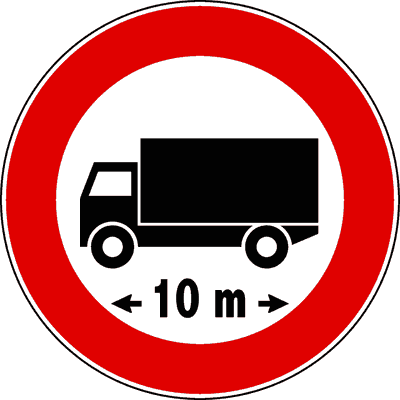

---

**307.** In presenza del segnale raffigurato è consentito il transito di un autotreno lungo 10 metri

- **الإجابة:** `VERO ✅ (صح)`
- 

---

**308.** Il segnale raffigurato vieta il transito a veicoli di lunghezza superiore a quella indicata

- **الإجابة:** `VERO ✅ (صح)`
- 

---

**309.** Il segnale raffigurato deve essere rispettato anche dai conducenti di autobus

- **الإجابة:** `VERO ✅ (صح)`
- 

---

**310.** Il segnale raffigurato vige anche di notte

- **الإجابة:** `VERO ✅ (صح)`
- 

---

**311.** Il segnale raffigurato deve essere rispettato anche dai conducenti di complessi di veicoli

- **الإجابة:** `VERO ✅ (صح)`
- 

---

**312.** Il segnale raffigurato deve essere rispettato solo dai conducenti di veicoli adibiti al trasporto di cose

- **الإجابة:** `FALSO ❌ (خطأ)`
- 

---

**313.** Il segnale raffigurato obbliga un veicolo a distanziare quello che lo segue di almeno 10 metri

- **الإجابة:** `FALSO ❌ (خطأ)`
- 

---

**314.** Il segnale raffigurato indica un'area di parcheggio per autocarri lunghi al massimo 10 metri

- **الإجابة:** `FALSO ❌ (خطأ)`
- 

---

**315.** Il segnale raffigurato impone il distanziamento minimo tra autocarri per consentire alle autovetture di sorpassarli

- **الإجابة:** `FALSO ❌ (خطأ)`
- 

---

**316.** In presenza del segnale raffigurato è consentito il transito di una autovettura che traina un caravan anche se insieme superano i 10 metri

- **الإجابة:** `FALSO ❌ (خطأ)`
- 

---

**317.** In presenza del segnale raffigurato è consentito il transito a tutti gli autosnodati per trasporto di persone

- **الإجابة:** `FALSO ❌ (خطأ)`
- 

---

**318.** Il segnale raffigurato preannuncia che gli autocarri devono mantenere una distanza di sicurezza di almeno 10 metri

- **الإجابة:** `FALSO ❌ (خطأ)`
- 

---

## 📌 Sette tonnellate (10 domande)

**319.** Il segnale raffigurato vieta il transito ai veicoli aventi una massa effettiva superiore a quella indicata

- **الإجابة:** `VERO ✅ (صح)`
- 

---

**320.** Il segnale raffigurato, integrato con pannello, può vietare il transito contemporaneo di più veicoli

- **الإجابة:** `VERO ✅ (صح)`
- 

---

**321.** Il segnale raffigurato vieta il transito agli autocarri di tara superiore a 7 tonnellate

- **الإجابة:** `VERO ✅ (صح)`
- 

---

**322.** In presenza del segnale raffigurato è consentito il transito di una macchina agricola di massa a pieno carico pari a 7 tonnellate

- **الإجابة:** `VERO ✅ (صح)`
- 

---

**323.** Il segnale raffigurato si può trovare prima di un ponte

- **الإجابة:** `VERO ✅ (صح)`
- 

---

**324.** In presenza del segnale raffigurato è consentito il transito ai veicoli il cui asse più caricato ha massa superiore a quella indicata

- **الإجابة:** `FALSO ❌ (خطأ)`
- 

---

**325.** Il segnale raffigurato, nei centri abitati, vige dalle ore 8.00 alle ore 20.00

- **الإجابة:** `FALSO ❌ (خطأ)`
- 

---

**326.** In presenza del segnale raffigurato è consentito il transito di autobus di massa superiore a 7 tonnellate

- **الإجابة:** `FALSO ❌ (خطأ)`
- 

---

**327.** Il segnale raffigurato vieta il transito ai soli veicoli per trasporto merci di massa superiore a 7 tonnellate

- **الإجابة:** `FALSO ❌ (خطأ)`
- 

---

**328.** Il segnale raffigurato vieta il transito ai veicoli di lunghezza superiore a 7 metri

- **الإجابة:** `FALSO ❌ (خطأ)`
- 

---

## 📌 Massa per asse (10 domande)

**329.** Il segnale raffigurato vieta il transito ai veicoli aventi sull'asse più caricato una massa effettiva superiore a quella indicata

- **الإجابة:** `VERO ✅ (صح)`
- 

---

**330.** In presenza del segnale raffigurato è consentito il transito di autocarri aventi massa effettiva per asse di 2,5 tonnellate

- **الإجابة:** `VERO ✅ (صح)`
- 

---

**331.** Il segnale raffigurato vieta il transito ai veicoli aventi una massa effettiva per asse superiore a 2,5 tonnellate

- **الإجابة:** `VERO ✅ (صح)`
- 

---

**332.** Il segnale raffigurato fa riferimento alla massa effettiva sull'asse al momento del transito

- **الإجابة:** `VERO ✅ (صح)`
- 

---

**333.** Il segnale raffigurato può trovarsi prima di un ponte

- **الإجابة:** `VERO ✅ (صح)`
- 

---

**334.** Il segnale raffigurato obbliga i veicoli aventi massa per asse superiore a 2,5 tonnellate a procedere a passo d'uomo

- **الإجابة:** `FALSO ❌ (خطأ)`
- 

---

**335.** Il segnale raffigurato vieta il transito agli autocarri di massa complessiva superiore a quella indicata

- **الإجابة:** `FALSO ❌ (خطأ)`
- 

---

**336.** Il segnale raffigurato vale solo per autoveicoli con ruote gemellate

- **الإجابة:** `FALSO ❌ (خطأ)`
- 

---

**337.** Il segnale raffigurato nei centri abitati vige dalle ore 8.00 alle ore 20.00

- **الإجابة:** `FALSO ❌ (خطأ)`
- 

---

**338.** Il segnale raffigurato vieta il transito a tutti i veicoli con massa complessiva a pieno carico superiore a 2,5 tonnellate

- **الإجابة:** `FALSO ❌ (خطأ)`
- 

---

## 📌 Fine prescrizione (10 domande)

**339.** Il segnale raffigurato indica la fine delle prescrizioni precedentemente imposte

- **الإجابة:** `VERO ✅ (صح)`
- 

---

**340.** Il segnale raffigurato indica la fine di divieti precedentemente imposti

- **الإجابة:** `VERO ✅ (صح)`
- 

---

**341.** Il segnale raffigurato è un segnale di via libera

- **الإجابة:** `VERO ✅ (صح)`
- 

---

**342.** Il segnale raffigurato è un segnale di fine prescrizione

- **الإجابة:** `VERO ✅ (صح)`
- 

---

**343.** Il segnale raffigurato indica il punto dal quale le prescrizioni precedentemente indicate non sono più valide

- **الإجابة:** `VERO ✅ (صح)`
- 

---

**344.** Il segnale raffigurato indica la fine di un cantiere di lavoro

- **الإجابة:** `FALSO ❌ (خطأ)`
- 

---

**345.** Il segnale raffigurato riguarda soltanto i veicoli in servizio pubblico

- **الإجابة:** `FALSO ❌ (خطأ)`
- 

---

**346.** Il segnale raffigurato è un segnale di indicazione

- **الإجابة:** `FALSO ❌ (خطأ)`
- 

---

**347.** Il segnale raffigurato indica la fine di un centro abitato

- **الإجابة:** `FALSO ❌ (خطأ)`
- 

---

**348.** Il segnale raffigurato indica la fine del pericolo precedentemente segnalato

- **الإجابة:** `FALSO ❌ (خطأ)`
- 

---

## 📌 Fine prescrizione velocita (12 domande)

**349.** Il segnale raffigurato indica la fine di una prescrizione

- **الإجابة:** `VERO ✅ (صح)`
- 

---

**350.** Il segnale raffigurato indica la fine del limite massimo di velocità

- **الإجابة:** `VERO ✅ (صح)`
- 

---

**351.** Il segnale raffigurato consente di circolare a velocità superiore a 50 km/h

- **الإجابة:** `VERO ✅ (صح)`
- 

---

**352.** Il segnale raffigurato consente di circolare entro i limiti di velocità vigenti per quel tipo di strada

- **الإجابة:** `VERO ✅ (صح)`
- 

---

**353.** Il segnale raffigurato consente di marciare anche a velocità inferiore a 50 km/h

- **الإجابة:** `VERO ✅ (صح)`
- 

---

**354.** Il segnale raffigurato indica la fine del relativo divieto

- **الإجابة:** `VERO ✅ (صح)`
- 

---

**355.** Il segnale raffigurato indica il limite di velocità per tutti i veicoli

- **الإجابة:** `FALSO ❌ (خطأ)`
- 

---

**356.** Il segnale raffigurato vieta di superare la velocità di 50 km/h

- **الإجابة:** `FALSO ❌ (خطأ)`
- 

---

**357.** Il segnale raffigurato indica la fine del limite minimo di velocità

- **الإجابة:** `FALSO ❌ (خطأ)`
- 

---

**358.** Il segnale raffigurato indica la fine dell'obbligo di mantenere una distanza di sicurezza di almeno 50 metri

- **الإجابة:** `FALSO ❌ (خطأ)`
- 

---

**359.** Il segnale raffigurato prescrive ai veicoli che non superano la velocità di 50 km/h di marciare sulla corsia di destra

- **الإجابة:** `FALSO ❌ (خطأ)`
- 

---

**360.** Il segnale raffigurato indica la velocità consigliata

- **الإجابة:** `FALSO ❌ (خطأ)`
- 

---

## 📌 Fine divieto sorpasso (14 domande)

**361.** Il segnale raffigurato indica la fine del divieto di sorpasso precedentemente imposto

- **الإجابة:** `VERO ✅ (صح)`
- 

---

**362.** In presenza del segnale raffigurato è vietato il sorpasso se deve essere oltrepassata la striscia continua

- **الإجابة:** `VERO ✅ (صح)`
- 

---

**363.** Il segnale raffigurato indica il punto in cui termina il divieto di sorpasso

- **الإجابة:** `VERO ✅ (صح)`
- 

---

**364.** Il segnale raffigurato non impone un particolare limite di velocità

- **الإجابة:** `VERO ✅ (صح)`
- 

---

**365.** Il segnale raffigurato può essere posto sia nei centri urbani che fuori

- **الإجابة:** `VERO ✅ (صح)`
- 

---

**366.** Il segnale raffigurato è un segnale di fine prescrizione

- **الإجابة:** `VERO ✅ (صح)`
- 

---

**367.** Il segnale raffigurato ha validità per tutte le 24 ore

- **الإجابة:** `VERO ✅ (صح)`
- 

---

**368.** Il segnale raffigurato indica la fine del divieto di sorpasso tra le sole autovetture

- **الإجابة:** `FALSO ❌ (خطأ)`
- 

---

**369.** Il segnale raffigurato indica la fine del divieto di transito per tutti gli autoveicoli

- **الإجابة:** `FALSO ❌ (خطأ)`
- 

---

**370.** Il segnale raffigurato prescrive il divieto di marcia per file parallele

- **الإجابة:** `FALSO ❌ (خطأ)`
- 

---

**371.** Il segnale raffigurato indica la fine del limite massimo di velocità

- **الإجابة:** `FALSO ❌ (خطأ)`
- 

---

**372.** Il segnale raffigurato indica la fine del divieto di sosta su entrambi i lati della strada

- **الإجابة:** `FALSO ❌ (خطأ)`
- 

---

**373.** Il segnale raffigurato indica che è finito l'obbligo di mantenere la distanza di sicurezza

- **الإجابة:** `FALSO ❌ (خطأ)`
- 

---

**374.** Il segnale raffigurato indica la fine del divieto di sosta in seconda fila

- **الإجابة:** `FALSO ❌ (خطأ)`
- 

---

## 📌 Fine divieto sorpasso mezzi pesanti (10 domande)

**375.** In presenza del segnale raffigurato un autotreno di massa pari a 44 tonnellate può sorpassare un'autovettura

- **الإجابة:** `VERO ✅ (صح)`
- 

---

**376.** Il segnale raffigurato indica la fine del divieto di sorpasso precedentemente imposto

- **الإجابة:** `VERO ✅ (صح)`
- 

---

**377.** In presenza del segnale raffigurato un autocarro può sorpassare un autobus

- **الإجابة:** `VERO ✅ (صح)`
- 

---

**378.** Il segnale raffigurato indica la fine del divieto di sorpasso per veicoli merci di massa a pieno carico superiore a 3,5 tonnellate

- **الإجابة:** `VERO ✅ (صح)`
- 

---

**379.** Il segnale raffigurato è un segnale di fine prescrizione

- **الإجابة:** `VERO ✅ (صح)`
- 

---

**380.** In presenza del segnale raffigurato è vietato il transito degli autotreni, autosnodati, autoarticolati

- **الإجابة:** `FALSO ❌ (خطأ)`
- 

---

**381.** In presenza del segnale raffigurato le autovetture devono sorpassare gli autocarri sulla corsia di destra

- **الإجابة:** `FALSO ❌ (خطأ)`
- 

---

**382.** Il segnale raffigurato indica la fine del divieto di sorpasso per autobus di massa a pieno carico superiore a 3,5 tonnellate

- **الإجابة:** `FALSO ❌ (خطأ)`
- 

---

**383.** Il segnale raffigurato è un segnale di pericolo

- **الإجابة:** `FALSO ❌ (خطأ)`
- 

---

**384.** Il segnale raffigurato non vale per gli autocarri di massa complessiva pari a 7 tonnellate

- **الإجابة:** `FALSO ❌ (خطأ)`
- 

---

## 📌 Divieto sosta (43 domande)

**385.** Il segnale raffigurato è posto nei luoghi dove la sosta è vietata

- **الإجابة:** `VERO ✅ (صح)`
- 

---

**386.** Il segnale raffigurato vieta la sosta sulle strade urbane dalle ore 8.00 alle ore 20.00, salvo diversa indicazione

- **الإجابة:** `VERO ✅ (صح)`
- 

---

**387.** Il segnale raffigurato può essere integrato da pannelli per indicarne l'inizio, il proseguimento o la fine

- **الإجابة:** `VERO ✅ (صح)`
- 

---

**388.** Il segnale raffigurato cessa di validità dopo il primo incrocio, se non ripetuto

- **الإجابة:** `VERO ✅ (صح)`
- 

---

**389.** Il segnale raffigurato consente la fermata

- **الإجابة:** `VERO ✅ (صح)`
- 

---

**390.** Il segnale raffigurato consente la sosta nel tratto precedente

- **الإجابة:** `VERO ✅ (صح)`
- 

---

**391.** Il segnale raffigurato, opportunamente integrato, può vietare la sosta nei centri abitati dalle ore 0,00 alle 24,00

- **الإجابة:** `VERO ✅ (صح)`
- 

---

**392.** Il segnale raffigurato vieta la sosta, ma non la fermata

- **الإجابة:** `VERO ✅ (صح)`
- 

---

**393.** Il segnale raffigurato contraddistingue le aree dove è proibito lasciare in sosta un veicolo

- **الإجابة:** `VERO ✅ (صح)`
- 

---

**394.** Il segnale raffigurato, lungo strade extraurbane, indica divieto permanente di sosta in assenza di indicazioni integrative

- **الإجابة:** `VERO ✅ (صح)`
- 

---

**395.** Il segnale (A), se integrato con pannello (B), indica una zona in cui vige divieto di sosta

- **الإجابة:** `VERO ✅ (صح)`
- 

---

**396.** Il segnale raffigurato vieta la sosta sul lato della strada dove è posto

- **الإجابة:** `VERO ✅ (صح)`
- 

---

**397.** Il segnale (A) con il pannello (B) vieta la sosta solo nei giorni lavorativi

- **الإجابة:** `VERO ✅ (صح)`
- 

---

**398.** Il segnale (A), integrato con il pannello (B), indica una ZONA RIMOZIONE COATTA

- **الإجابة:** `VERO ✅ (صح)`
- 

---

**399.** Il segnale (A), se integrato con pannello (B), indica una zona in cui vige divieto di sosta, con rimozione del veicolo

- **الإجابة:** `VERO ✅ (صح)`
- 

---

**400.** Il segnale raffigurato non vieta la fermata

- **الإجابة:** `VERO ✅ (صح)`
- 

---

**401.** Il segnale raffigurato è un segnale di prescrizione

- **الإجابة:** `VERO ✅ (صح)`
- 

---

**402.** Il segnale raffigurato non è posto nei luoghi ove per regola generale vige il divieto di sosta

- **الإجابة:** `VERO ✅ (صح)`
- 

---

**403.** Il segnale raffigurato vieta l'abbandono prolungato nel tempo del veicolo

- **الإجابة:** `VERO ✅ (صح)`
- 

---

**404.** Il segnale raffigurato, posto nei centri abitati, vieta, di norma, la sosta dalle ore 8.00 alle 20.00

- **الإجابة:** `VERO ✅ (صح)`
- 

---

**405.** Il segnale (A), integrato con il pannello (B), consente la sosta agli autobus

- **الإجابة:** `VERO ✅ (صح)`
- 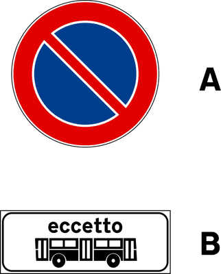

---

**406.** Il segnale (A), integrato con il pannello (B), vieta la sosta soltanto nei giorni festivi

- **الإجابة:** `VERO ✅ (صح)`
- 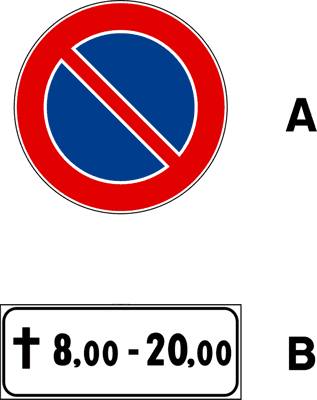

---

**407.** Il segnale raffigurato vieta la sosta ma non la fermata

- **الإجابة:** `VERO ✅ (صح)`
- 

---

**408.** Il segnale raffigurato, se posto sul lato sinistro di una strada a senso unico, vieta la sosta anche sul lato destro

- **الإجابة:** `FALSO ❌ (خطأ)`
- 

---

**409.** Il segnale raffigurato vieta la sosta sul tratto precedente

- **الإجابة:** `FALSO ❌ (خطأ)`
- 

---

**410.** Il segnale raffigurato preannuncia un divieto di fermata

- **الإجابة:** `FALSO ❌ (خطأ)`
- 

---

**411.** Il segnale raffigurato non vale per i motocicli ed i ciclomotori

- **الإجابة:** `FALSO ❌ (خطأ)`
- 

---

**412.** In presenza del segnale raffigurato è sempre prevista la rimozione forzata del veicolo

- **الإجابة:** `FALSO ❌ (خطأ)`
- 

---

**413.** Il segnale raffigurato indica che la sosta è regolamentata con l'uso di parchimetri a pagamento

- **الإجابة:** `FALSO ❌ (خطأ)`
- 

---

**414.** Il segnale raffigurato consente la sosta ai residenti

- **الإجابة:** `FALSO ❌ (خطأ)`
- 

---

**415.** Il segnale raffigurato consente la sosta esponendo il tagliando emesso da un parchimetro

- **الإجابة:** `FALSO ❌ (خطأ)`
- 

---

**416.** Il segnale raffigurato, nelle strade extraurbane, consente la sosta dopo le ore 20.00

- **الإجابة:** `FALSO ❌ (خطأ)`
- 

---

**417.** Il segnale raffigurato consente la sosta soltanto ai veicoli a due ruote

- **الإجابة:** `FALSO ❌ (خطأ)`
- 

---

**418.** Il segnale raffigurato consente la sosta ai quadricicli a motore

- **الإجابة:** `FALSO ❌ (خطأ)`
- 

---

**419.** Il segnale raffigurato, nei centri urbani, prescrive il divieto di sosta dalle ore 20.00 alle ore 8.00, salvo diversa indicazione

- **الإجابة:** `FALSO ❌ (خطأ)`
- 

---

**420.** Il segnale raffigurato indica che la sosta è regolamentata mediante disco orario

- **الإجابة:** `FALSO ❌ (خطأ)`
- 

---

**421.** Il segnale (A), se integrato con il pannello (B), è divieto di sosta permanente

- **الإجابة:** `FALSO ❌ (خطأ)`
- 

---

**422.** Il segnale raffigurato, opportunamente integrato, può vietare la sosta in doppia fila

- **الإجابة:** `FALSO ❌ (خطأ)`
- 

---

**423.** Il segnale raffigurato vieta la sospensione temporanea della marcia per la salita e discesa dei passeggeri

- **الإجابة:** `FALSO ❌ (خطأ)`
- 

---

**424.** Lungo le strade extraurbane, il segnale raffigurato vale soltanto nelle ore diurne

- **الإجابة:** `FALSO ❌ (خطأ)`
- 

---

**425.** Il segnale raffigurato vieta la sosta dei veicoli su ambo i lati della carreggiata

- **الإجابة:** `FALSO ❌ (خطأ)`
- 

---

**426.** Il segnale raffigurato permette la sosta degli autobus

- **الإجابة:** `FALSO ❌ (خطأ)`
- 

---

**427.** Il segnale raffigurato permette la sosta dei ciclomotori

- **الإجابة:** `FALSO ❌ (خطأ)`
- 

---

## 📌 Divieto fermata (21 domande)

**428.** Il segnale raffigurato vieta la temporanea sospensione della marcia del veicolo

- **الإجابة:** `VERO ✅ (صح)`
- 

---

**429.** Il segnale raffigurato vieta la fermata volontaria di tutti i veicoli

- **الإجابة:** `VERO ✅ (صح)`
- 

---

**430.** Lungo le strade dove è posto, il segnale raffigurato vale 24 ore su 24

- **الإجابة:** `VERO ✅ (صح)`
- 

---

**431.** Il segnale raffigurato vieta la sosta sia di giorno che di notte, anche nei centri abitati

- **الإجابة:** `VERO ✅ (صح)`
- 

---

**432.** Il segnale raffigurato vieta la fermata a tutti i veicoli

- **الإجابة:** `VERO ✅ (صح)`
- 

---

**433.** Il segnale raffigurato, in assenza di iscrizioni integrative, vige per tutto l'arco delle ventiquattro ore

- **الإجابة:** `VERO ✅ (صح)`
- 

---

**434.** Il segnale raffigurato vieta qualsiasi volontaria fermata del veicolo

- **الإجابة:** `VERO ✅ (صح)`
- 

---

**435.** In presenza del segnale raffigurato è sempre disposta la rimozione forzata del veicolo

- **الإجابة:** `VERO ✅ (صح)`
- 

---

**436.** Il segnale (A), se integrato con il pannello (B), vieta la fermata nel tratto precedente

- **الإجابة:** `VERO ✅ (صح)`
- 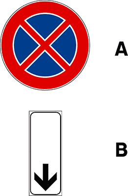

---

**437.** Il segnale (A), se integrato con il pannello (B), indica la fine del divieto di fermata e di sosta

- **الإجابة:** `VERO ✅ (صح)`
- 

---

**438.** Il segnale raffigurato vieta la sosta, ma consente la fermata

- **الإجابة:** `FALSO ❌ (خطأ)`
- 

---

**439.** Lungo le strade urbane, il segnale raffigurato indica che il divieto di fermata vige dalle ore 8.00 alle 20.00

- **الإجابة:** `FALSO ❌ (خطأ)`
- 

---

**440.** Il segnale raffigurato consente la fermata per far salire o scendere passeggeri

- **الإجابة:** `FALSO ❌ (خطأ)`
- 

---

**441.** Il segnale raffigurato consente la fermata se il veicolo non arreca intralcio alla circolazione

- **الإجابة:** `FALSO ❌ (خطأ)`
- 

---

**442.** Il segnale raffigurato vieta la fermata, ma consente la sosta

- **الإجابة:** `FALSO ❌ (خطأ)`
- 

---

**443.** Il segnale raffigurato non vale per gli autobus

- **الإجابة:** `FALSO ❌ (خطأ)`
- 

---

**444.** Il segnale raffigurato non vale per i taxi

- **الإجابة:** `FALSO ❌ (خطأ)`
- 

---

**445.** Il segnale raffigurato è un preavviso di divieto di sosta

- **الإجابة:** `FALSO ❌ (خطأ)`
- 

---

**446.** Il segnale raffigurato vale solo nei giorni feriali, salvo diversa indicazione

- **الإجابة:** `FALSO ❌ (خطأ)`
- 

---

**447.** Il segnale raffigurato consente la fermata del veicolo per la salita e la discesa dei passeggeri

- **الإجابة:** `FALSO ❌ (خطأ)`
- 

---

**448.** Il segnale raffigurato preannuncia la fine del divieto di sosta

- **الإجابة:** `FALSO ❌ (خطأ)`
- 

---

## 📌 Segnale parcheggio (15 domande)

**449.** Il segnale raffigurato indica un parcheggio autorizzato

- **الإجابة:** `VERO ✅ (صح)`
- 

---

**450.** Il segnale raffigurato indica un'area attrezzata ed organizzata per sostare a tempo indeterminato, salvo diversa indicazione

- **الإجابة:** `VERO ✅ (صح)`
- 

---

**451.** Il segnale raffigurato indica un'area di parcheggio e può essere integrato con un pannello che ne indica la distanza

- **الإجابة:** `VERO ✅ (صح)`
- 

---

**452.** Il segnale raffigurato indica un'area di parcheggio e può essere integrato con un pannello che indica le categorie cui la stessa è riservata

- **الإجابة:** `VERO ✅ (صح)`
- 

---

**453.** Il segnale raffigurato indica un'area di parcheggio e può essere integrato con pannello che indica le categorie di veicoli esclusi

- **الإجابة:** `VERO ✅ (صح)`
- 

---

**454.** Il segnale raffigurato indica un'area di parcheggio e può essere integrato con un pannello che ne indica la limitazione nel tempo

- **الإجابة:** `VERO ✅ (صح)`
- 

---

**455.** Il segnale raffigurato indica un'area di parcheggio e può essere integrato con un pannello che indica l'orario e le tariffe

- **الإجابة:** `VERO ✅ (صح)`
- 

---

**456.** Il segnale raffigurato indica un'area di parcheggio e può essere integrato con un pannello indicante la disposizione dei veicoli

- **الإجابة:** `VERO ✅ (صح)`
- 

---

**457.** Il segnale raffigurato indica un'area di sosta con parchimetro

- **الإجابة:** `FALSO ❌ (خطأ)`
- 

---

**458.** Il segnale raffigurato indica che il parcheggio è ammesso dalle 8.00 alle 20.00

- **الإجابة:** `FALSO ❌ (خطأ)`
- 

---

**459.** Il segnale raffigurato indica un’area in cui è possibile la sosta al massimo per un’ora

- **الإجابة:** `FALSO ❌ (خطأ)`
- 

---

**460.** Il segnale raffigurato indica la sosta libera, ma con divieto di fermata

- **الإجابة:** `FALSO ❌ (خطأ)`
- 

---

**461.** Il segnale raffigurato indica un'area di parcheggio riservato ai veicoli della Polizia di Stato

- **الإجابة:** `FALSO ❌ (خطأ)`
- 

---

**462.** Il segnale raffigurato indica un'area di parcheggio e può essere integrato con un pannello che indica la superficie disponibile

- **الإجابة:** `FALSO ❌ (خطأ)`
- 

---

**463.** Il segnale raffigurato indica un'area di parcheggio e può essere integrato con la prescrizione di lasciare la chiave nel quadro

- **الإجابة:** `FALSO ❌ (خطأ)`
- 

---

## 📌 Preannuncio area parcheggio (7 domande)

**464.** Il segnale raffigurato preannuncia che nella direzione della freccia vi è un parcheggio

- **الإجابة:** `VERO ✅ (صح)`
- 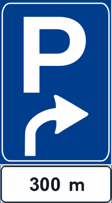

---

**465.** Il segnale raffigurato preannuncia una zona di parcheggio procedendo nel senso della freccia

- **الإجابة:** `VERO ✅ (صح)`
- 

---

**466.** Il segnale raffigurato preannuncia un parcheggio a 300 metri nel senso della freccia

- **الإجابة:** `VERO ✅ (صح)`
- 

---

**467.** Il segnale raffigurato preannuncia un posto di pronto soccorso nel senso della freccia

- **الإجابة:** `FALSO ❌ (خطأ)`
- 

---

**468.** Il segnale raffigurato preannuncia un parcheggio vietato nel senso della freccia

- **الإجابة:** `FALSO ❌ (خطأ)`
- 

---

**469.** Il segnale raffigurato preannuncia che la sosta e il parcheggio sono vietati nel senso della freccia

- **الإجابة:** `FALSO ❌ (خطأ)`
- 

---

**470.** Il segnale raffigurato preannuncia di procedere oltre perché il parcheggio è riservato

- **الإجابة:** `FALSO ❌ (خطأ)`
- 

---

## 📌 Segnale passo carrabile (10 domande)

**471.** Il segnale raffigurato vieta la sosta nel luogo dove è posto

- **الإجابة:** `VERO ✅ (صح)`
- 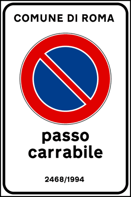

---

**472.** Il segnale raffigurato indica la zona per l'accesso dei veicoli alle proprietà laterali

- **الإجابة:** `VERO ✅ (صح)`
- 

---

**473.** Il segnale raffigurato indica lo sbocco di un passo carrabile

- **الإجابة:** `VERO ✅ (صح)`
- 

---

**474.** Il segnale raffigurato consente la fermata, purché il veicolo non sia di intralcio

- **الإجابة:** `VERO ✅ (صح)`
- 

---

**475.** Il segnale raffigurato, per essere valido, deve contenere l'indicazione dell'ente che ha concesso l'autorizzazione, il numero e l'anno del rilascio

- **الإجابة:** `VERO ✅ (صح)`
- 

---

**476.** Il segnale raffigurato è posto soltanto nelle strade urbane

- **الإجابة:** `FALSO ❌ (خطأ)`
- 

---

**477.** Il segnale raffigurato vale solo nelle ore diurne

- **الإجابة:** `FALSO ❌ (خطأ)`
- 

---

**478.** Il segnale raffigurato vale solo nelle ore notturne

- **الإجابة:** `FALSO ❌ (خطأ)`
- 

---

**479.** Il segnale raffigurato consente la sosta a particolari categorie di veicoli

- **الإجابة:** `FALSO ❌ (خطأ)`
- 

---

**480.** Il segnale raffigurato consente la sosta ai veicoli adibiti al pronto soccorso non in servizio

- **الإجابة:** `FALSO ❌ (خطأ)`
- 

---

## 📌 Divieto sosta contrassegno persone invalide (11 domande)

**481.** Il segnale raffigurato consente la sosta ai veicoli al servizio di persone invalide munite dell'apposito contrassegno

- **الإجابة:** `VERO ✅ (صح)`
- 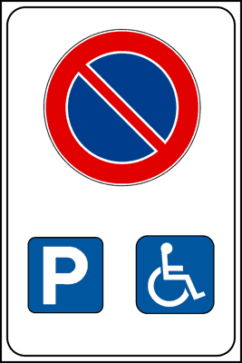

---

**482.** Il segnale raffigurato è un segnale di prescrizione

- **الإجابة:** `VERO ✅ (صح)`
- 

---

**483.** Il segnale raffigurato rappresenta una specifica eccezione al divieto di sosta

- **الإجابة:** `VERO ✅ (صح)`
- 

---

**484.** Il segnale raffigurato non consente la sosta a veicoli diversi da quelli al servizio di persone invalide

- **الإجابة:** `VERO ✅ (صح)`
- 

---

**485.** Il segnale raffigurato consente la sosta agli scuolabus

- **الإجابة:** `FALSO ❌ (خطأ)`
- 

---

**486.** Il segnale raffigurato indica una corsia riservata ai veicoli al servizio di persone invalide

- **الإجابة:** `FALSO ❌ (خطأ)`
- 

---

**487.** Il segnale raffigurato è un divieto di sosta per i veicoli al servizio di invalidi, ed indica il più vicino parcheggio

- **الإجابة:** `FALSO ❌ (خطأ)`
- 

---

**488.** Il segnale raffigurato preavvisa una zona vietata al traffico regolare perché attrezzata per persone invalide

- **الإجابة:** `FALSO ❌ (خطأ)`
- 

---

**489.** Il segnale raffigurato, nella strada ove è posto, consente il transito ai soli veicoli al servizio di persone invalide

- **الإجابة:** `FALSO ❌ (خطأ)`
- 

---

**490.** Il segnale raffigurato consente la sosta ai ciclomotori e ai motocicli

- **الإجابة:** `FALSO ❌ (خطأ)`
- 

---

**491.** Il segnale raffigurato consente la sosta esponendo il tagliando emesso da un parchimetro

- **الإجابة:** `FALSO ❌ (خطأ)`
- 

---

## 📌 Regolazione sosta (11 domande)

**492.** Il segnale raffigurato rappresenta una regolazione della sosta

- **الإجابة:** `VERO ✅ (صح)`
- 

---

**493.** Il segnale raffigurato consente la sosta dalle ore 9.00 alle 17.00

- **الإجابة:** `VERO ✅ (صح)`
- 

---

**494.** Il segnale raffigurato vieta la sosta dalle ore 17.00 alle 20.00

- **الإجابة:** `VERO ✅ (صح)`
- 

---

**495.** Il segnale raffigurato consente la sosta in alcune ore e la vieta in altre

- **الإجابة:** `VERO ✅ (صح)`
- 

---

**496.** Il segnale raffigurato consente la sosta dalle ore 20.00 alle ore 7.00

- **الإجابة:** `VERO ✅ (صح)`
- 

---

**497.** Il segnale raffigurato vieta la sosta dalle ore 7.00 alle ore 9.00

- **الإجابة:** `VERO ✅ (صح)`
- 

---

**498.** Il segnale raffigurato, nei centri abitati, consente la sosta dalle ore 20.00 alle 8.00

- **الإجابة:** `FALSO ❌ (خطأ)`
- 

---

**499.** Il segnale raffigurato indica una zona destinata al parcheggio con impiego del disco orario

- **الإجابة:** `FALSO ❌ (خطأ)`
- 

---

**500.** Il segnale raffigurato vieta la fermata del veicolo tra le ore 17.00 e le 20.00

- **الإجابة:** `FALSO ❌ (خطأ)`
- 

---

**501.** Il segnale raffigurato consente il parcheggio dalle ore 7.00 alle 9.00

- **الإجابة:** `FALSO ❌ (خطأ)`
- 

---

**502.** Nelle ore in cui è vietata la sosta, il segnale raffigurato comporta la rimozione del veicolo

- **الإجابة:** `FALSO ❌ (خطأ)`
- 

---

## 📌 Divieto sosta temporaneo (8 domande)

**503.** Il segnale raffigurato è un segnale di DIVIETO DI SOSTA TEMPORANEO

- **الإجابة:** `VERO ✅ (صح)`
- 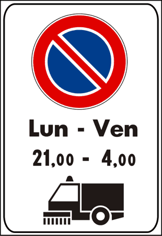

---

**504.** Il segnale raffigurato è posto nei tratti di strada ove vengono effettuate operazioni di pulizia meccanica delle strade

- **الإجابة:** `VERO ✅ (صح)`
- 

---

**505.** Il segnale raffigurato vieta la sosta nei periodi in cui viene effettuata la pulizia meccanica della strada

- **الإجابة:** `VERO ✅ (صح)`
- 

---

**506.** Il segnale raffigurato, nei centri urbani, segnala il divieto di sosta limitato ai giorni e alle ore indicate

- **الإجابة:** `VERO ✅ (صح)`
- 

---

**507.** Il segnale raffigurato indica la presenza di macchine sgombraneve al lavoro sulla strada

- **الإجابة:** `FALSO ❌ (خطأ)`
- 

---

**508.** Il segnale raffigurato segnala che nelle ore indicate vige il DIVIETO DI SOSTA per i veicoli rappresentati in figura

- **الإجابة:** `FALSO ❌ (خطأ)`
- 

---

**509.** Il segnale raffigurato indica che nei giorni e nelle ore indicate è vietata la sosta ai mezzi di pulizia

- **الإجابة:** `FALSO ❌ (خطأ)`
- 

---

**510.** Il segnale raffigurato indica presenza di un deposito con probabile uscita di mezzi per pulizia meccanica delle strade

- **الإجابة:** `FALSO ❌ (خطأ)`
- 

---

## 📌 Autotreni autoarticolati (11 domande)

**511.** Il segnale raffigurato vieta il transito ad autotreni ed autoarticolati

- **الإجابة:** `VERO ✅ (صح)`
- 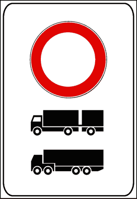

---

**512.** In presenza del segnale raffigurato è vietato il transito alle categorie di veicoli rappresentati in figura

- **الإجابة:** `VERO ✅ (صح)`
- 

---

**513.** Il segnale raffigurato è un divieto di transito per determinate categorie di veicoli

- **الإجابة:** `VERO ✅ (صح)`
- 

---

**514.** Il segnale raffigurato indica che i veicoli delle categorie rappresentate in figura non possono transitare

- **الإجابة:** `VERO ✅ (صح)`
- 

---

**515.** Il segnale raffigurato indica che possono transitare tutti i veicoli esclusi quelli delle categorie rappresentate in figura

- **الإجابة:** `VERO ✅ (صح)`
- 

---

**516.** Il segnale raffigurato indica un itinerario obbligatorio per gli autoveicoli delle categorie rappresentate in figura

- **الإجابة:** `FALSO ❌ (خطأ)`
- 

---

**517.** Il segnale raffigurato preannuncia un parcheggio per autocarri ed autotreni

- **الإجابة:** `FALSO ❌ (خطأ)`
- 

---

**518.** Il segnale raffigurato vieta il transito di tutti i veicoli con esclusione di quelli rappresentati in figura

- **الإجابة:** `FALSO ❌ (خطأ)`
- 

---

**519.** Il segnale raffigurato vieta la sosta ad autotreni ed autoarticolati

- **الإجابة:** `FALSO ❌ (خطأ)`
- 

---

**520.** Il segnale raffigurato presegnala una strada riservata ai veicoli delle categorie rappresentate in figura

- **الإجابة:** `FALSO ❌ (خطأ)`
- 

---

**521.** Il segnale raffigurato indica un divieto di sosta per autotreni e autoarticolati

- **الإجابة:** `FALSO ❌ (خطأ)`
- 

---

