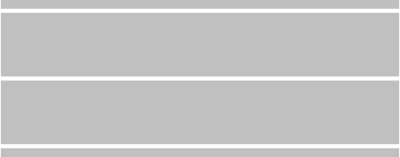
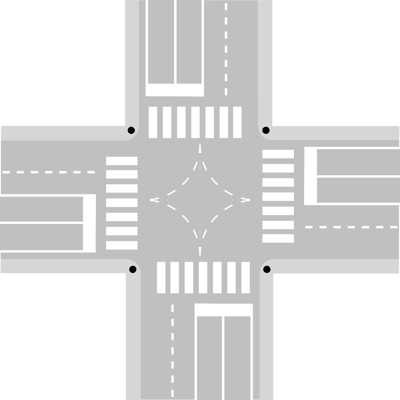
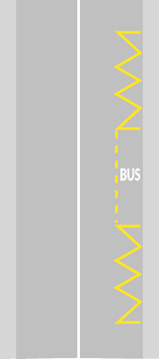
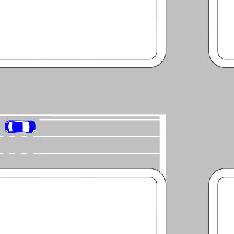
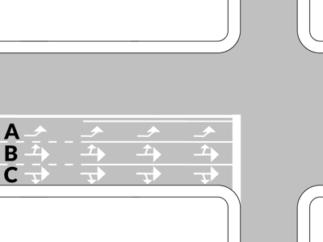
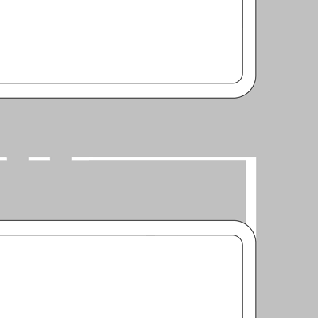
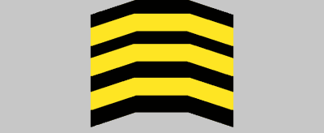
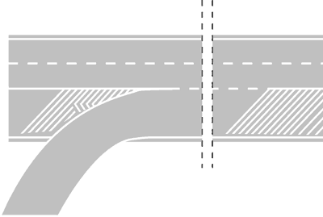
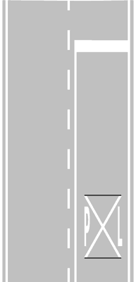
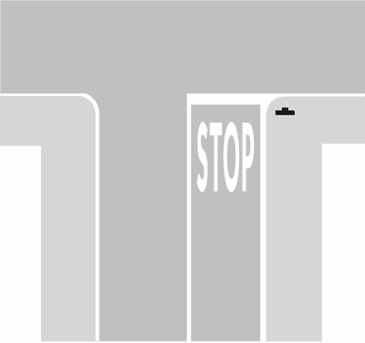

# Capitolo 06 - Segnaletica orizzontale e ostacoli
### الإشارات الأرضية والعوائق

📊 **إجمالي الأسئلة في هذا الباب:** 260 سؤال

---

## 📌 Striscia discontinua (16 domande)

**1.** La striscia bianca discontinua in figura può essere superata

- **الإجابة:** `VERO ✅ (صح)`
- 

---

**2.** La striscia bianca discontinua in figura divide la carreggiata in due corsie

- **الإجابة:** `VERO ✅ (صح)`
- 

---

**3.** Nelle strade a doppio senso con due corsie la striscia bianca discontinua in figura divide i sensi di marcia

- **الإجابة:** `VERO ✅ (صح)`
- 

---

**4.** La striscia bianca discontinua in figura consente, in caso si voglia sorpassare, di occupare momentaneamente l'altra corsia di marcia

- **الإجابة:** `VERO ✅ (صح)`
- 

---

**5.** La striscia bianca discontinua in figura consente l'inversione di marcia, in condizioni di sicurezza, se la strada è a doppio senso

- **الإجابة:** `VERO ✅ (صح)`
- 

---

**6.** La striscia bianca discontinua in figura consente la svolta a sinistra

- **الإجابة:** `VERO ✅ (صح)`
- 

---

**7.** In una carreggiata a senso unico, la striscia bianca discontinua in figura serve a delimitare le corsie

- **الإجابة:** `VERO ✅ (صح)`
- 

---

**8.** La striscia bianca discontinua in figura, nelle strade a senso unico, divide le corsie

- **الإجابة:** `VERO ✅ (صح)`
- 

---

**9.** La striscia bianca discontinua in figura consente di circolare stando a cavallo di essa

- **الإجابة:** `FALSO ❌ (خطأ)`
- 

---

**10.** La striscia bianca discontinua in figura divide la strada da una pista ciclabile

- **الإجابة:** `FALSO ❌ (خطأ)`
- 

---

**11.** La striscia bianca discontinua in figura si trova in vicinanza di tutti i passaggi a livello

- **الإجابة:** `FALSO ❌ (خطأ)`
- 

---

**12.** La striscia bianca discontinua in figura può essere sostituita da una serie di "chiodi" per segnaletica stradale

- **الإجابة:** `FALSO ❌ (خطأ)`
- 

---

**13.** La striscia bianca discontinua in figura consente l'inversione di marcia nelle strade a senso unico

- **الإجابة:** `FALSO ❌ (خطأ)`
- 

---

**14.** La striscia bianca discontinua in figura divide la strada in due carreggiate, ognuna a doppio senso

- **الإجابة:** `FALSO ❌ (خطأ)`
- 

---

**15.** La striscia bianca discontinua in figura si trova solo nelle strade a senso unico

- **الإجابة:** `FALSO ❌ (خطأ)`
- 

---

**16.** La striscia bianca discontinua in figura nelle strade a senso unico è posta nei dossi, per dividere i due sensi di marcia

- **الإجابة:** `FALSO ❌ (خطأ)`
- 

---

## 📌 Strisce strada (7 domande)

**17.** Le strisce lungo il centro della carreggiata possono essere superate se discontinue (tratteggiate)

- **الإجابة:** `VERO ✅ (صح)`

---

**18.** Le strisce lungo il centro della carreggiata non possono essere superate se continue

- **الإجابة:** `VERO ✅ (صح)`

---

**19.** La striscia di mezzo in figura consente il sorpasso senza superarla, purché non vi siano motivi che lo vietino

- **الإجابة:** `VERO ✅ (صح)`
- 

---

**20.** La doppia striscia in figura non può essere superata, ma si può circolare stando a cavallo di essa

- **الإجابة:** `FALSO ❌ (خطأ)`
- 

---

**21.** Le strisce lungo il centro della carreggiata possono essere bianche o azzurre

- **الإجابة:** `FALSO ❌ (خطأ)`

---

**22.** La striscia discontinua in figura può essere sostituita con alcuni "chiodi" o catadiottri, messi a distanza di 50 centimetri

- **الإجابة:** `FALSO ❌ (خطأ)`
- 

---

**23.** La striscia di mezzo in figura non consente il sorpasso in ogni caso

- **الإجابة:** `FALSO ❌ (خطأ)`
- 

---

## 📌 Doppia striscia continua (10 domande)

**24.** La doppia striscia continua in figura serve a dividere i sensi di marcia, sulle strade a doppio senso di circolazione

- **الإجابة:** `VERO ✅ (صح)`
- 

---

**25.** La doppia striscia continua in figura non può essere superata

- **الإجابة:** `VERO ✅ (صح)`
- 

---

**26.** La doppia striscia continua in figura permette il sorpasso, se consentito, senza superarla

- **الإجابة:** `VERO ✅ (صح)`
- 

---

**27.** La doppia striscia continua in figura non consente l'inversione del senso di marcia

- **الإجابة:** `VERO ✅ (صح)`
- 

---

**28.** La doppia striscia continua in figura non consente di svoltare a sinistra

- **الإجابة:** `VERO ✅ (صح)`
- 

---

**29.** La doppia striscia continua in figura si può trovare ai bordi della strada, per segnalare i margini

- **الإجابة:** `FALSO ❌ (خطأ)`
- 

---

**30.** La doppia striscia continua in figura indica che si può viaggiare per file parallele

- **الإجابة:** `FALSO ❌ (خطأ)`
- 

---

**31.** La doppia striscia continua in figura indica il punto in cui i conducenti si debbono arrestare per la presenza del segnale di STOP

- **الإجابة:** `FALSO ❌ (خطأ)`
- 

---

**32.** La doppia striscia continua in figura è di colore azzurro nei parcheggi a pagamento

- **الإجابة:** `FALSO ❌ (خطأ)`
- 

---

**33.** La doppia striscia continua in figura può essere superata

- **الإجابة:** `FALSO ❌ (خطأ)`
- 

---

## 📌 Strisce curve discontinue (7 domande)

**34.** Le strisce di guida in figura, sono strisce curve discontinue (tratteggiate) di colore bianco

- **الإجابة:** `VERO ✅ (صح)`
- 

---

**35.** Le strisce di guida in figura, di norma, si trovano dove la svolta a sinistra si effettua lasciando alla nostra destra il centro dell'incrocio

- **الإجابة:** `VERO ✅ (صح)`
- 

---

**36.** Le strisce di guida in figura debbono essere lasciate alla sinistra del veicolo quando si svolta a sinistra

- **الإجابة:** `VERO ✅ (صح)`
- 

---

**37.** Le strisce di guida in figura servono ad effettuare la svolta in modo corretto, senza prendere contro mano la strada di sinistra

- **الإجابة:** `VERO ✅ (صح)`
- 

---

**38.** Le strisce di guida in figura debbono essere lasciate sempre alla destra del veicolo quando si svolta a destra

- **الإجابة:** `FALSO ❌ (خطأ)`
- 

---

**39.** Le strisce di guida in figura non possono essere superate dai veicoli che proseguono diritto

- **الإجابة:** `FALSO ❌ (خطأ)`
- 

---

**40.** Le strisce di guida in figura delimitano un'isola di traffico

- **الإجابة:** `FALSO ❌ (خطأ)`
- 

---

## 📌 Frecce direzionali (13 domande)

**41.** Le frecce direzionali in figura si trovano all'interno delle corsie, prima di un incrocio

- **الإجابة:** `VERO ✅ (صح)`
- 

---

**42.** Le frecce direzionali in figura indicano ai conducenti le direzioni consentite all'incrocio

- **الإجابة:** `VERO ✅ (صح)`
- 

---

**43.** Le frecce direzionali in figura consentono di immettersi nella corsia scelta quando le strisce sono ancora discontinue (tratteggiate)

- **الإجابة:** `VERO ✅ (صح)`
- 

---

**44.** Le frecce direzionali in figura obbligano a seguire la direzione indicata se le strisce di corsia sono continue

- **الإجابة:** `VERO ✅ (صح)`
- 

---

**45.** Le frecce direzionali in figura sono a freccia combinata diritta-destra per corsie destinate a chi deve proseguire diritto o a destra

- **الإجابة:** `VERO ✅ (صح)`
- 

---

**46.** Le frecce direzionali in figura possono essere completate da scritte sulla pavimentazione che indicano la località raggiungibile

- **الإجابة:** `VERO ✅ (صح)`
- 

---

**47.** Le frecce direzionali in figura segnalano le direzioni permesse

- **الإجابة:** `VERO ✅ (صح)`
- 

---

**48.** Le frecce direzionali in figura obbligano a seguire la direzione indicata, anche se le strisce di corsia sono discontinue (tratteggiate)

- **الإجابة:** `FALSO ❌ (خطأ)`
- 

---

**49.** Le frecce direzionali in figura indicano che si è vicino ad una corsia per la sosta d'emergenza

- **الإجابة:** `FALSO ❌ (خطأ)`
- 

---

**50.** Le frecce direzionali in figura ci consentono di cambiare corsia se le strisce sono continue

- **الإجابة:** `FALSO ❌ (خطأ)`
- 

---

**51.** Le frecce direzionali in figura sono di colore azzurro per indicare un parcheggio a pagamento

- **الإجابة:** `FALSO ❌ (خطأ)`
- 

---

**52.** Le frecce direzionali in figura sono di colore giallo nelle strade dove è vietata la sosta

- **الإجابة:** `FALSO ❌ (خطأ)`
- 

---

**53.** Le frecce direzionali in figura sono di colore blu nelle autostrade

- **الإجابة:** `FALSO ❌ (خطأ)`
- 

---

## 📌 Isole traffico (12 domande)

**54.** L'isola di traffico in figura indica un tratto di strada vietato al transito ed alla sosta dei veicoli

- **الإجابة:** `VERO ✅ (صح)`
- 

---

**55.** L'isola di traffico in figura è realizzata con strisce bianche oblique

- **الإجابة:** `VERO ✅ (صح)`
- 

---

**56.** L'isola di traffico in figura indica una parte della strada su cui non si può circolare

- **الإجابة:** `VERO ✅ (صح)`
- 

---

**57.** In presenza dell'isola di traffico rappresentata in figura il veicolo C deve svoltare a destra

- **الإجابة:** `VERO ✅ (صح)`
- 

---

**58.** In presenza dell'isola di traffico rappresentata in figura il veicolo B deve svoltare a destra

- **الإجابة:** `VERO ✅ (صح)`
- 

---

**59.** In presenza dell'isola di traffico rappresentata in figura il veicolo A deve andare diritto

- **الإجابة:** `VERO ✅ (صح)`
- 

---

**60.** L'isola di traffico in figura può anche essere realizzata con strisce azzurre trasversali

- **الإجابة:** `FALSO ❌ (خطأ)`
- 

---

**61.** L'isola di traffico in figura indica una zona dove è possibile la sosta dei veicoli

- **الإجابة:** `FALSO ❌ (خطأ)`
- 

---

**62.** L'isola di traffico in figura indica una parte della carreggiata sulla quale si può sostare solo per 30 minuti

- **الإجابة:** `FALSO ❌ (خطأ)`
- 

---

**63.** In presenza dell'isola di traffico rappresentata in figura il veicolo C può andare in qualsiasi direzione

- **الإجابة:** `FALSO ❌ (خطأ)`
- 

---

**64.** In presenza dell'isola di traffico rappresentata in figura il veicolo B può svoltare a sinistra, dando la precedenza al veicolo A

- **الإجابة:** `FALSO ❌ (خطأ)`
- 

---

**65.** In presenza dell'isola di traffico rappresentata in figura il veicolo A può svoltare a sinistra, dando la precedenza al veicolo C

- **الإجابة:** `FALSO ❌ (خطأ)`
- 

---

## 📌 Striscia continua (9 domande)

**66.** Rispetto al veicolo che procede nel senso della freccia, la striscia continua centrale in figura si trova prima di una curva

- **الإجابة:** `VERO ✅ (صح)`
- 

---

**67.** Rispetto al veicolo che procede nel senso della freccia, la striscia continua centrale in figura si trova sul tratto in salita di un dosso

- **الإجابة:** `VERO ✅ (صح)`
- 

---

**68.** Rispetto al veicolo che procede nel senso della freccia, la striscia continua centrale in figura si trova prima di un incrocio

- **الإجابة:** `VERO ✅ (صح)`
- 

---

**69.** Il veicolo in figura non può superare la striscia continua centrale

- **الإجابة:** `VERO ✅ (صح)`
- 

---

**70.** Rispetto al veicolo che procede nel senso della freccia, la striscia continua centrale in figura si trova, di norma, su strade a senso unico di circolazione

- **الإجابة:** `FALSO ❌ (خطأ)`
- 

---

**71.** Rispetto al veicolo che procede nel senso della freccia, la striscia continua centrale in figura si trova ogni volta che si supera il tratto in discesa di un dosso

- **الإجابة:** `FALSO ❌ (خطأ)`
- 

---

**72.** Rispetto al veicolo che procede nel senso della freccia, la striscia continua centrale in figura si trova ogni volta che si supera un passaggio a livello

- **الإجابة:** `FALSO ❌ (خطأ)`
- 

---

**73.** Rispetto al veicolo che procede nel senso della freccia, la striscia continua centrale in figura consente l'inversione del senso di marcia

- **الإجابة:** `FALSO ❌ (خطأ)`
- 

---

**74.** Il veicolo in figura può effettuare un sorpasso anche superando la striscia continua centrale

- **الإجابة:** `FALSO ❌ (خطأ)`
- 

---

## 📌 Striscia discontinua centrale (9 domande)

**75.** Rispetto al veicolo che procede nel senso della freccia, la striscia discontinua in figura si trova subito dopo una curva

- **الإجابة:** `VERO ✅ (صح)`
- 

---

**76.** Rispetto al veicolo che procede nel senso della freccia, la striscia discontinua in figura consente di effettuare un sorpasso anche superando tutte e due le strisce

- **الإجابة:** `VERO ✅ (صح)`
- 

---

**77.** Rispetto al veicolo che procede nel senso della freccia, la striscia discontinua in figura si trova dopo un passaggio a livello

- **الإجابة:** `VERO ✅ (صح)`
- 

---

**78.** Rispetto al veicolo che procede nel senso della freccia, la striscia discontinua in figura si può trovare nel tratto in discesa di un dosso

- **الإجابة:** `VERO ✅ (صح)`
- 

---

**79.** Rispetto al veicolo che procede nel senso della freccia, la striscia discontinua in figura consente anche al veicolo che viene di fronte di superare le strisce

- **الإجابة:** `FALSO ❌ (خطأ)`
- 

---

**80.** Rispetto al veicolo che procede nel senso della freccia, la striscia discontinua in figura si trova, di norma, su strade a senso unico di circolazione

- **الإجابة:** `FALSO ❌ (خطأ)`
- 

---

**81.** Rispetto al veicolo che procede nel senso della freccia, la striscia discontinua in figura si trova sul tratto in salita di un dosso

- **الإجابة:** `FALSO ❌ (خطأ)`
- 

---

**82.** Rispetto al veicolo che procede nel senso della freccia, la striscia discontinua in figura si trova subito prima di un incrocio

- **الإجابة:** `FALSO ❌ (خطأ)`
- 

---

**83.** Rispetto al veicolo che procede nel senso della freccia, la striscia discontinua in figura si trova prima di una curva

- **الإجابة:** `FALSO ❌ (خطأ)`
- 

---

## 📌 Segni gialli neri (8 domande)

**84.** I segni gialli e neri in figura dipinti sul bordo del marciapiede indicano un divieto di sosta

- **الإجابة:** `VERO ✅ (صح)`
- 

---

**85.** I segni gialli e neri in figura sono posti lungo la parte verticale del marciapiede

- **الإجابة:** `VERO ✅ (صح)`
- 

---

**86.** I segni gialli e neri in figura dipinti sul bordo del marciapiede indicano che su quel lato della strada non è possibile sostare

- **الإجابة:** `VERO ✅ (صح)`
- 

---

**87.** I segni gialli e neri in figura dipinti sul bordo del marciapiede consentono la fermata

- **الإجابة:** `VERO ✅ (صح)`
- 

---

**88.** I segni gialli e neri in figura dipinti sul bordo del marciapiede indicano che la sosta è consentita solo agli autobus

- **الإجابة:** `FALSO ❌ (خطأ)`
- 

---

**89.** I segni gialli e neri in figura dipinti sul bordo del marciapiede segnalano un ostacolo al centro della carreggiata

- **الإجابة:** `FALSO ❌ (خطأ)`
- 

---

**90.** I segni gialli e neri in figura dipinti sul bordo del marciapiede avvertono i pedoni di fare attenzione al gradino

- **الإجابة:** `FALSO ❌ (خطأ)`
- 

---

**91.** I segni gialli e neri in figura dipinti sul bordo del marciapiede indicano che è vietata anche la fermata

- **الإجابة:** `FALSO ❌ (خطأ)`
- 

---

## 📌 Fermata autobus (11 domande)

**92.** La segnaletica in figura indica una zona per la fermata degli autobus in servizio pubblico di linea

- **الإجابة:** `VERO ✅ (صح)`
- 

---

**93.** La segnaletica in figura indica lo spazio per la fermata di autobus e filobus in servizio pubblico di linea

- **الإجابة:** `VERO ✅ (صح)`
- 

---

**94.** La striscia a zig zag della segnaletica in figura serve agli autobus per facilitare la manovra di accostamento e per ripartire

- **الإجابة:** `VERO ✅ (صح)`
- 

---

**95.** La segnaletica in figura vieta la sosta ma non la fermata anche nelle parti con striscia gialla a zig zag

- **الإجابة:** `VERO ✅ (صح)`
- 

---

**96.** La segnaletica in figura indica lo spazio per la fermata di autosnodati in servizio pubblico di linea

- **الإجابة:** `VERO ✅ (صح)`
- 

---

**97.** La segnaletica in figura indica lo spazio riservato alla sosta anche dei taxi

- **الإجابة:** `FALSO ❌ (خطأ)`
- 

---

**98.** La segnaletica in figura non consente alle autovetture di circolare all'interno dell'area segnata

- **الإجابة:** `FALSO ❌ (خطأ)`
- 

---

**99.** La segnaletica in figura non consente la sosta 20 metri prima della striscia gialla a zig zag

- **الإجابة:** `FALSO ❌ (خطأ)`
- 

---

**100.** La segnaletica in figura vieta agli autocarri di circolare all'interno dell'area segnata

- **الإجابة:** `FALSO ❌ (خطأ)`
- 

---

**101.** La segnaletica in figura può anche essere realizzata con strisce di colore bianco

- **الإجابة:** `FALSO ❌ (خطأ)`
- 

---

**102.** La segnaletica in figura consente la sosta delle autovetture dalle ore 20.00 alle ore 8.00

- **الإجابة:** `FALSO ❌ (خطأ)`
- 

---

## 📌 Strisce guida (6 domande)

**103.** In presenza delle strisce di guida in figura il veicolo C può andare diritto

- **الإجابة:** `VERO ✅ (صح)`
- 

---

**104.** In presenza delle strisce di guida in figura il veicolo B può svoltare a sinistra, dando però la precedenza al veicolo A

- **الإجابة:** `VERO ✅ (صح)`
- 

---

**105.** In presenza delle strisce di guida in figura il veicolo A può andare in qualsiasi direzione

- **الإجابة:** `VERO ✅ (صح)`
- 

---

**106.** In presenza delle strisce di guida in figura il veicolo C deve svoltare a destra

- **الإجابة:** `FALSO ❌ (خطأ)`
- 

---

**107.** In presenza delle strisce di guida in figura il veicolo B deve svoltare a destra

- **الإجابة:** `FALSO ❌ (خطأ)`
- 

---

**108.** In presenza delle strisce di guida in figura il veicolo A deve andare diritto

- **الإجابة:** `FALSO ❌ (خطأ)`
- 

---

## 📌 Corsie arresto (10 domande)

**109.** Tutte e tre le corsie rappresentate in figura consentono al conducente di proseguire dritto

- **الإجابة:** `VERO ✅ (صح)`
- 

---

**110.** La corsia di sinistra rappresentata in figura consente al conducente di proseguire dritto o svoltare a sinistra

- **الإجابة:** `VERO ✅ (صح)`
- 

---

**111.** La corsia di mezzo rappresentata in figura consente al conducente solo di proseguire diritto

- **الإجابة:** `VERO ✅ (صح)`
- 

---

**112.** La corsia di destra rappresentata in figura consente al conducente di proseguire diritto o svoltare a destra

- **الإجابة:** `VERO ✅ (صح)`
- 

---

**113.** E' possibile cambiare corsia finché le strisce sono ancora discontinue (tratteggiate)

- **الإجابة:** `VERO ✅ (صح)`
- 

---

**114.** Il veicolo rappresentato in figura può svoltare a sinistra rimanendo nella stessa corsia

- **الإجابة:** `VERO ✅ (صح)`
- 

---

**115.** La corsia di sinistra rappresentata in figura consente al conducente solo di svoltare a sinistra

- **الإجابة:** `FALSO ❌ (خطأ)`
- 

---

**116.** La corsia di destra rappresentata in figura è riservata ai veicoli lenti

- **الإجابة:** `FALSO ❌ (خطأ)`
- 

---

**117.** La corsia di destra rappresentata in figura consente al conducente solo di svoltare a destra

- **الإجابة:** `FALSO ❌ (خطأ)`
- 

---

**118.** Con la segnaletica rappresentata in figura è consentito al conducente cambiare corsia anche superando la striscia continua

- **الإجابة:** `FALSO ❌ (خطأ)`
- 

---

## 📌 Corsie preselezione (6 domande)

**119.** Le corsie A, B e C rappresentate in figura non consentono al conducente di proseguire diritto

- **الإجابة:** `VERO ✅ (صح)`
- 

---

**120.** La corsia A, rappresentata in figura, consente al conducente di svoltare solo a sinistra

- **الإجابة:** `VERO ✅ (صح)`
- 

---

**121.** Con la segnaletica indicata in figura è consentito al conducente cambiare corsia dove le strisce di corsia sono ancora discontinue(tratteggiate)

- **الإجابة:** `VERO ✅ (صح)`
- 

---

**122.** Le corsie A,B e C rappresentate in figura sono a doppio senso di circolazione

- **الإجابة:** `FALSO ❌ (خطأ)`
- 

---

**123.** Le corsie A, B e C rappresentate in figura consentono al conducente di andare in tutte le direzioni

- **الإجابة:** `FALSO ❌ (خطأ)`
- 

---

**124.** La corsia B rappresentata in figura consente al conducente di svoltare e di proseguire diritto

- **الإجابة:** `FALSO ❌ (خطأ)`
- 

---

## 📌 Corsie preselezione strada doppio senso (8 domande)

**125.** La corsia A rappresentata in figura consente al conducente solo di svoltare a sinistra

- **الإجابة:** `VERO ✅ (صح)`
- 

---

**126.** La corsia B rappresentata in figura consente al conducente di proseguire diritto e di svoltare a sinistra

- **الإجابة:** `VERO ✅ (صح)`
- 

---

**127.** In presenza della segnaletica in figura, la corsia C è l'unica che consente di svoltare a destra.

- **الإجابة:** `VERO ✅ (صح)`
- 

---

**128.** In presenza della segnaletica in figura è consentito cambiare corsia fino a che le strisce sono ancora discontinue(tratteggiate)

- **الإجابة:** `VERO ✅ (صح)`
- 

---

**129.** Tutte e tre le corsie rappresentate in figura consentono al conducente di proseguire diritto

- **الإجابة:** `FALSO ❌ (خطأ)`
- 

---

**130.** In presenza della segnaletica in figura, la corsia A è l'unica che consente di svoltare a sinistra

- **الإجابة:** `FALSO ❌ (خطأ)`
- 

---

**131.** La corsia B rappresentata in figura consente al conducente solo di proseguire diritto

- **الإجابة:** `FALSO ❌ (خطأ)`
- 

---

**132.** La corsia C rappresentata in figura consente al conducente solo la svolta a destra

- **الإجابة:** `FALSO ❌ (خطأ)`
- 

---

## 📌 Bordo marciapiede (7 domande)

**133.** Il bordo del marciapiede come dipinto in figura vieta la sosta anche ai taxi

- **الإجابة:** `VERO ✅ (صح)`
- 

---

**134.** Il bordo del marciapiede dipinto come in figura indica che nessun veicolo può sostare

- **الإجابة:** `VERO ✅ (صح)`
- 

---

**135.** Il bordo del marciapiede dipinto come in figura indica che non si può sostare lungo quel tratto

- **الإجابة:** `VERO ✅ (صح)`
- 

---

**136.** Il bordo del marciapiede dipinto come in figura indica che la sosta è consentita solo a pagamento

- **الإجابة:** `FALSO ❌ (خطأ)`
- 

---

**137.** Il bordo del marciapiede dipinto come in figura indica che la sosta è consentita solo per un'ora

- **الإجابة:** `FALSO ❌ (خطأ)`
- 

---

**138.** Il bordo del marciapiede dipinto come in figura indica la presenza di lavori in corso

- **الإجابة:** `FALSO ❌ (خطأ)`
- 

---

**139.** Il bordo del marciapiede dipinto come in figura indica una strada con diritto di precedenza

- **الإجابة:** `FALSO ❌ (خطأ)`
- 

---

## 📌 Regolamenti segnaletica (12 domande)

**140.** E' regolamentare, nelle zone destinate alla fermata degli autobus in servizio pubblico di linea, trovare sulla pavimentazione la scritta BUS di colore giallo

- **الإجابة:** `VERO ✅ (صح)`

---

**141.** E' regolamentare trovare sulla pavimentazione la scritta TAXI di colore giallo, per indicare zone riservate alla sosta dei taxi in servizio

- **الإجابة:** `VERO ✅ (صح)`

---

**142.** E' regolamentare trovare sulla pavimentazione la scritta STOP, a completamento del relativo segnale verticale

- **الإجابة:** `VERO ✅ (صح)`

---

**143.** E' regolamentare trovare sulla pavimentazione la scritta P L, con croce di S. Andrea, per segnalare un passaggio a livello

- **الإجابة:** `VERO ✅ (صح)`

---

**144.** Quando si incontrano le strisce di figura dipinte sulla pavimentazione occorre moderare la velocità

- **الإجابة:** `VERO ✅ (صح)`
- 

---

**145.** E' regolamentare trovare sulla pavimentazione la scritta indicante il nome di una località, a completamento della freccia direzionale

- **الإجابة:** `VERO ✅ (صح)`

---

**146.** E' regolamentare trovare sulla pavimentazione la scritta STOP, per completare il segnale verticale di DARE PRECEDENZA

- **الإجابة:** `FALSO ❌ (خطأ)`

---

**147.** E' regolamentare trovare sulla pavimentazione la scritta indicante una prossima stazione di servizio

- **الإجابة:** `FALSO ❌ (خطأ)`

---

**148.** E' regolamentare trovare sulla pavimentazione una scritta pubblicitaria che indica un distributore di carburante

- **الإجابة:** `FALSO ❌ (خطأ)`

---

**149.** E' regolamentare trovare sulla pavimentazione una scritta di incoraggiamento per i corridori ciclisti

- **الإجابة:** `FALSO ❌ (خطأ)`

---

**150.** E' regolamentare trovare sulla pavimentazione la scritta TAXI, di colore bianco, nei parcheggi per taxi

- **الإجابة:** `FALSO ❌ (خطأ)`

---

**151.** E' regolamentare trovare sulla pavimentazione la scritta GIOCHI, in vicinanza di giardini pubblici

- **الإجابة:** `FALSO ❌ (خطأ)`

---

## 📌 Striscia bianca discontinua strada senso unico (9 domande)

**152.** In una strada a senso unico di circolazione con la segnaletica indicata in figura si può sorpassare anche superando la striscia di mezzo

- **الإجابة:** `VERO ✅ (صح)`
- 

---

**153.** In una strada a senso unico di circolazione con la segnaletica indicata in figura si può sorpassare anche in curva

- **الإجابة:** `VERO ✅ (صح)`
- 

---

**154.** In una strada a senso unico di circolazione con la segnaletica indicata in figura la carreggiata è divisa in due corsie

- **الإجابة:** `VERO ✅ (صح)`
- 

---

**155.** In una strada a senso unico di circolazione con la segnaletica indicata in figura la corsia di sinistra è, di norma, riservata al sorpasso

- **الإجابة:** `VERO ✅ (صح)`
- 

---

**156.** In una strada a senso unico di circolazione con la segnaletica indicata in figura è consentito il sorpasso in vicinanza o in corrispondenza di dossi

- **الإجابة:** `VERO ✅ (صح)`
- 

---

**157.** In una strada a senso unico di circolazione con la segnaletica indicata in figura si può sempre viaggiare per file parallele

- **الإجابة:** `FALSO ❌ (خطأ)`
- 

---

**158.** In una strada a senso unico di circolazione con la segnaletica indicata in figura si può fare l'inversione del senso di marcia

- **الإجابة:** `FALSO ❌ (خطأ)`
- 

---

**159.** In una strada a senso unico di circolazione con la segnaletica indicata in figura si può circolare stando a cavallo della striscia di mezzo

- **الإجابة:** `FALSO ❌ (خطأ)`
- 

---

**160.** In una strada a senso unico di circolazione con la segnaletica indicata in figura per svoltare a sinistra bisogna rimanere nella corsia di destra

- **الإجابة:** `FALSO ❌ (خطأ)`
- 

---

## 📌 Strisce pedonali (18 domande)

**161.** La segnaletica in figura indica, sia dentro che fuori dei centri abitati, un attraversamento pedonale

- **الإجابة:** `VERO ✅ (صح)`
- 

---

**162.** La segnaletica in figura indica un attraversamento pedonale che può trovarsi anche nei piccoli centri abitati

- **الإجابة:** `VERO ✅ (صح)`
- 

---

**163.** La segnaletica in figura indica un attraversamento pedonale

- **الإجابة:** `VERO ✅ (صح)`
- 

---

**164.** La segnaletica in figura indica un attraversamento per pedoni

- **الإجابة:** `VERO ✅ (صح)`
- 

---

**165.** La segnaletica in figura indica un attraversamento in cui i pedoni hanno la precedenza

- **الإجابة:** `VERO ✅ (صح)`
- 

---

**166.** La segnaletica in figura può essere completata con l'apposito segnale verticale di ATTRAVERSAMENTO PEDONALE

- **الإجابة:** `VERO ✅ (صح)`
- 

---

**167.** La segnaletica in figura obbliga i conducenti ad arrestarsi quando vi sono pedoni che attraversano la carreggiata

- **الإجابة:** `VERO ✅ (صح)`
- 

---

**168.** Un attraversamento pedonale può essere preceduto sulla destra da una striscia gialla a zig zag, come nella figura seguente

- **الإجابة:** `VERO ✅ (صح)`
- 

---

**169.** La segnaletica in figura posta su strade extraurbane secondarie deve essere preceduta dal segnale di pericolo ATTRAVERSAMENTO PEDONALE

- **الإجابة:** `VERO ✅ (صح)`
- 

---

**170.** La segnaletica in figura obbliga i conducenti a fermarsi e dare la precedenza ai pedoni che si accingono ad attraversare

- **الإجابة:** `VERO ✅ (صح)`
- 

---

**171.** La segnaletica in figura indica un'isola di traffico

- **الإجابة:** `FALSO ❌ (خطأ)`
- 

---

**172.** La segnaletica in figura indica un attraversamento per ciclisti

- **الإجابة:** `FALSO ❌ (خطأ)`
- 

---

**173.** La segnaletica in figura indica un attraversamento ciclabile

- **الإجابة:** `FALSO ❌ (خطأ)`
- 

---

**174.** La segnaletica in figura indica un passo carrabile

- **الإجابة:** `FALSO ❌ (خطأ)`
- 

---

**175.** La segnaletica in figura è un'isola di rifugio per pedoni e ciclisti

- **الإجابة:** `FALSO ❌ (خطأ)`
- 

---

**176.** La segnaletica in figura non consente ai veicoli di transitarci sopra

- **الإجابة:** `FALSO ❌ (خطأ)`
- 

---

**177.** La segnaletica in figura indica un'area riservata ai soli pedoni disabili

- **الإجابة:** `FALSO ❌ (خطأ)`
- 

---

**178.** La segnaletica in figura non consente il transito ai pedoni

- **الإجابة:** `FALSO ❌ (خطأ)`
- 

---

## 📌 Striscia arresto (10 domande)

**179.** La striscia bianca trasversale in figura può essere abbinata ad un incrocio regolato da semaforo

- **الإجابة:** `VERO ✅ (صح)`
- 

---

**180.** La striscia bianca trasversale in figura può essere completata con la scritta STOP, dipinta sulla pavimentazione stradale

- **الإجابة:** `VERO ✅ (صح)`
- 

---

**181.** La striscia bianca trasversale in figura indica il punto in cui i conducenti devono arrestarsi in presenza del segnale FERMARSI E DARE PRECEDENZA (STOP)

- **الإجابة:** `VERO ✅ (صح)`
- 

---

**182.** La striscia bianca trasversale in figura indica il punto in cui i conducenti devono arrestarsi in presenza del semaforo a luce rossa

- **الإجابة:** `VERO ✅ (صح)`
- 

---

**183.** Il segnale raffigurato è una striscia trasversale di arresto

- **الإجابة:** `VERO ✅ (صح)`
- 

---

**184.** La striscia bianca trasversale in figura viene abbinata con il segnale di DARE PRECEDENZA

- **الإجابة:** `FALSO ❌ (خطأ)`
- 

---

**185.** La striscia bianca trasversale in figura indica un attraversamento pedonale non regolato

- **الإجابة:** `FALSO ❌ (خطأ)`
- 

---

**186.** La striscia bianca trasversale in figura indica un attraversamento ciclabile

- **الإجابة:** `FALSO ❌ (خطأ)`
- 

---

**187.** La striscia bianca trasversale in figura non può mai essere superata

- **الإجابة:** `FALSO ❌ (خطأ)`
- 

---

**188.** La striscia bianca trasversale in figura indica l'inizio del divieto di sosta

- **الإجابة:** `FALSO ❌ (خطأ)`
- 

---

## 📌 Striscia bianca discontinua strade doppio senso (7 domande)

**189.** In una strada a doppio senso di circolazione con la segnaletica indicata in figura si può effettuare un sorpasso anche superando la striscia di mezzo

- **الإجابة:** `VERO ✅ (صح)`
- 

---

**190.** In una strada a doppio senso di circolazione con la segnaletica indicata in figura non si può circolare stando a cavallo della striscia di mezzo

- **الإجابة:** `VERO ✅ (صح)`
- 

---

**191.** In una strada a doppio senso di circolazione con la segnaletica indicata in figura per svoltare a sinistra bisogna spostarsi verso il centro della carreggiata

- **الإجابة:** `VERO ✅ (صح)`
- 

---

**192.** In una strada a doppio senso di circolazione con la segnaletica indicata in figura si può sorpassare con qualsiasi condizione di visibilità e di traffico

- **الإجابة:** `FALSO ❌ (خطأ)`
- 

---

**193.** In una strada a doppio senso di circolazione con la segnaletica indicata in figura si può sorpassare anche in curva, ma solo in città

- **الإجابة:** `FALSO ❌ (خطأ)`
- 

---

**194.** In una strada a doppio senso di circolazione con la segnaletica indicata in figura si può fare l'inversione di marcia, ma senza occupare l'altra corsia

- **الإجابة:** `FALSO ❌ (خطأ)`
- 

---

**195.** In una strada a doppio senso di circolazione con la segnaletica indicata in figura, fuori dei centri abitati la corsia di sinistra serve per la sosta d'emergenza

- **الإجابة:** `FALSO ❌ (خطأ)`
- 

---

## 📌 Carreggiata doppio senso circolazione (7 domande)

**196.** In una carreggiata a doppio senso di circolazione la striscia di mezzo può essere continua o discontinua (tratteggiata)

- **الإجابة:** `VERO ✅ (صح)`

---

**197.** In una carreggiata a doppio senso di circolazione la striscia di mezzo, se discontinua (tratteggiata), può essere superata durante un sorpasso

- **الإجابة:** `VERO ✅ (صح)`

---

**198.** In una carreggiata a doppio senso di circolazione la linea di mezzo può essere costituita da due strisce continue affiancate, come in figura

- **الإجابة:** `VERO ✅ (صح)`
- 

---

**199.** In una carreggiata a doppio senso di circolazione la linea di mezzo se costituita da strisce continue, come in figura, consente il sorpasso senza superare le linee

- **الإجابة:** `VERO ✅ (صح)`
- 

---

**200.** Nella carreggiata a doppio senso di circolazione le strisce di mezzo in figura dividono i sensi di marcia

- **الإجابة:** `VERO ✅ (صح)`
- 

---

**201.** Nella carreggiata a doppio senso di circolazione la striscia di mezzo in figura, può essere superata con le sole ruote di sinistra

- **الإجابة:** `FALSO ❌ (خطأ)`
- 

---

**202.** Nella carreggiata a doppio senso di circolazione come in figura la striscia di mezzo divide la strada in due carreggiate, ognuna a due corsie

- **الإجابة:** `FALSO ❌ (خطأ)`
- 

---

## 📌 Striscia bianca continua (10 domande)

**203.** La striscia bianca continua di mezzo in figura divide la carreggiata in due corsie

- **الإجابة:** `VERO ✅ (صح)`
- 

---

**204.** La striscia bianca continua di mezzo in figura non può essere superata

- **الإجابة:** `VERO ✅ (صح)`
- 

---

**205.** La striscia bianca continua di mezzo in figura, divide i sensi di marcia nelle strade a doppio senso

- **الإجابة:** `VERO ✅ (صح)`
- 

---

**206.** La striscia bianca continua di mezzo in figura, sulle strade a doppio senso si può trovare sul tratto in salita di un dosso

- **الإجابة:** `VERO ✅ (صح)`
- 

---

**207.** La striscia bianca continua di mezzo in figura, sulle strade a doppio senso può trovarsi in vicinanza degli attraversamenti pedonali

- **الإجابة:** `VERO ✅ (صح)`
- 

---

**208.** La striscia bianca continua di mezzo in figura permette la manovra di sorpasso senza superarla

- **الإجابة:** `VERO ✅ (صح)`
- 

---

**209.** La striscia bianca continua di mezzo in figura divide la strada in due carreggiate, ognuna a doppio senso

- **الإجابة:** `FALSO ❌ (خطأ)`
- 

---

**210.** La striscia bianca continua di mezzo in figura consente di marciarvi a cavallo

- **الإجابة:** `FALSO ❌ (خطأ)`
- 

---

**211.** La striscia bianca continua di mezzo in figura consente il sorpasso anche superandola, purché con le sole ruote di sinistra

- **الإجابة:** `FALSO ❌ (خطأ)`
- 

---

**212.** La striscia bianca continua di mezzo in figura consente l'inversione di marcia nelle strade a doppio senso

- **الإجابة:** `FALSO ❌ (خطأ)`
- 

---

## 📌 Dispositivi strada (12 domande)

**213.** L'iscrizione in figura indica la velocità consigliata

- **الإجابة:** `VERO ✅ (صح)`
- 

---

**214.** Il dispositivo in figura è un dosso artificiale

- **الإجابة:** `VERO ✅ (صح)`
- 

---

**215.** L'elemento in figura è un rallentatore di velocità installato sulla strada

- **الإجابة:** `VERO ✅ (صح)`
- 

---

**216.** L'elemento in figura rappresenta un rallentatore di velocità

- **الإجابة:** `VERO ✅ (صح)`
- 

---

**217.** Le strisce di delimitazione gialle in figura individuano un'area di parcheggio riservata a persone invalide

- **الإجابة:** `VERO ✅ (صح)`
- 

---

**218.** Le strisce gialle diagonali in figura devono essere lasciate libere per consentire l'entrata e l'uscita dal veicolo delle persone invalide

- **الإجابة:** `VERO ✅ (صح)`
- 

---

**219.** In presenza dell'iscrizione in figura non è consentito il transito di veicoli con massa a pieno carico superiore a 50 quintali

- **الإجابة:** `FALSO ❌ (خطأ)`
- 

---

**220.** L'elemento in figura è posto su un tratto di strada su cui è vietata la sosta

- **الإجابة:** `FALSO ❌ (خطأ)`
- 

---

**221.** L'elemento in figura individua un attraversamento ciclabile

- **الإجابة:** `FALSO ❌ (خطأ)`
- 

---

**222.** L'elemento in figura individua un attraversamento pedonale

- **الإجابة:** `FALSO ❌ (خطأ)`
- 

---

**223.** Le strisce gialle in figura delimitano un'area di parcheggio riservata ai taxi

- **الإجابة:** `FALSO ❌ (خطأ)`
- 

---

**224.** Le strisce gialle in figura delimitano un'area riservata al carico e allo scarico di merci

- **الإجابة:** `FALSO ❌ (خطأ)`
- 

---

## 📌 Striscia bianca laterale (12 domande)

**225.** La striscia bianca laterale discontinua in figura separa la carreggiata da una piazzola di sosta

- **الإجابة:** `VERO ✅ (صح)`
- 

---

**226.** La striscia bianca laterale discontinua in figura separa la carreggiata da un passo carrabile

- **الإجابة:** `VERO ✅ (صح)`
- 

---

**227.** Le strisce bianche discontinue sull'intersezione in figura sono strisce di guida

- **الإجابة:** `VERO ✅ (صح)`
- 

---

**228.** La striscia bianca laterale discontinua in figura divide la carreggiata da una corsia di accelerazione

- **الإجابة:** `VERO ✅ (صح)`
- 

---

**229.** La striscia bianca laterale discontinua in figura individua il bordo della strada principale, separandolo da quello della strada secondaria

- **الإجابة:** `VERO ✅ (صح)`
- 

---

**230.** La striscia bianca laterale discontinua in figura può essere superata solo in caso di emergenza

- **الإجابة:** `FALSO ❌ (خطأ)`
- 

---

**231.** La striscia bianca laterale discontinua in figura significa che la sosta non è possibile

- **الإجابة:** `FALSO ❌ (خطأ)`
- 

---

**232.** La striscia bianca laterale discontinua separa la carreggiata dalla corsia di emergenza

- **الإجابة:** `FALSO ❌ (خطأ)`

---

**233.** La striscia bianca laterale discontinua segnala l'inizio di una banchina

- **الإجابة:** `FALSO ❌ (خطأ)`

---

**234.** Le strisce bianche di guida in figura non consentono la svolta

- **الإجابة:** `FALSO ❌ (خطأ)`
- 

---

**235.** La striscia bianca laterale discontinua in figura delimita l'accesso ad una pista ciclabile

- **الإجابة:** `FALSO ❌ (خطأ)`
- 

---

**236.** La striscia bianca laterale discontinua in figura, delimita una piazzola di sosta

- **الإجابة:** `FALSO ❌ (خطأ)`
- 

---

## 📌 Segnaletica passaggio livello (9 domande)

**237.** La segnaletica rappresentata in figura si trova vicino ad un passaggio a livello

- **الإجابة:** `VERO ✅ (صح)`
- 

---

**238.** La segnaletica rappresentata in figura serve ad avvertire i conducenti che si è vicini ad un passaggio a livello senza barriere

- **الإجابة:** `VERO ✅ (صح)`
- 

---

**239.** La segnaletica rappresentata in figura serve ad avvertire i conducenti che si è vicini ad un passaggio a livello con barriere

- **الإجابة:** `VERO ✅ (صح)`
- 

---

**240.** In presenza della segnaletica rappresentata in figura non è consentito spostarsi nella parte sinistra della carreggiata

- **الإجابة:** `VERO ✅ (صح)`
- 

---

**241.** In presenza della segnaletica rappresentata in figura i conducenti devono prestare attenzione all'eventuale sopraggiungere di treni

- **الإجابة:** `VERO ✅ (صح)`
- 

---

**242.** La segnaletica rappresentata in figura serve ad indicare che a 150 metri vi è un attraversamento tranviario molto pericoloso

- **الإجابة:** `FALSO ❌ (خطأ)`
- 

---

**243.** La segnaletica rappresentata in figura si trova solo in vicinanza di passaggi a livello con barriere

- **الإجابة:** `FALSO ❌ (خطأ)`
- 

---

**244.** La segnaletica rappresentata in figura segnala la vicinanza di un incrocio regolato da Polizia locale

- **الإجابة:** `FALSO ❌ (خطأ)`
- 

---

**245.** La segnaletica rappresentata in figura delimita un parcheggio di autobus in servizio pubblico di linea

- **الإجابة:** `FALSO ❌ (خطأ)`
- 

---

## 📌 Corsia emergenza (8 domande)

**246.** Nella segnaletica in figura la striscia bianca continua, che separa la carreggiata dalla corsia di emergenza (corsia A), può essere superata solo in caso di necessità (guasto del veicolo, malessere dei viaggiatori)

- **الإجابة:** `VERO ✅ (صح)`
- 

---

**247.** La corsia di emergenza (corsia A) si può utilizzare in caso di guasto del veicolo, per un massimo di tre ore

- **الإجابة:** `VERO ✅ (صح)`
- 

---

**248.** La corsia di emergenza (corsia A) non si può occupare per le manovre di sorpasso

- **الإجابة:** `VERO ✅ (صح)`
- 

---

**249.** Nella segnaletica in figura la striscia bianca continua, che delimita la corsia di emergenza, (corsia A), indica una zona di parcheggio a tempo

- **الإجابة:** `FALSO ❌ (خطأ)`
- 

---

**250.** Nella segnaletica in figura la striscia bianca continua che delimita la corsia di emergenza, (corsia A), può essere sempre superata in caso di intenso traffico

- **الإجابة:** `FALSO ❌ (خطأ)`
- 

---

**251.** La corsia di emergenza (corsia A) è riservata alla svolta a destra

- **الإجابة:** `FALSO ❌ (خطأ)`
- 

---

**252.** La corsia di emergenza (corsia A) è riservata alla decelerazione

- **الإجابة:** `FALSO ❌ (خطأ)`
- 

---

**253.** La corsia di emergenza (corsia A) è vietata al transito degli autoveicoli ma non al transito dei motocicli

- **الإجابة:** `FALSO ❌ (خطأ)`
- 

---

## 📌 Striscia trasversale continua (7 domande)

**254.** La striscia trasversale continua in figura indica il punto in cui bisogna arrestarsi ad un incrocio, se regolato da semaforo a luce rossa

- **الإجابة:** `VERO ✅ (صح)`
- 

---

**255.** La striscia trasversale continua in figura indica il punto in cui dobbiamo sempre arrestarci ad un incrocio, se il vigile lo impone

- **الإجابة:** `VERO ✅ (صح)`
- 

---

**256.** La striscia trasversale continua in figura indica il punto dove occorre arrestarsi

- **الإجابة:** `VERO ✅ (صح)`
- 

---

**257.** La striscia trasversale continua in figura indica il punto in cui dobbiamo arrestarci ad un incrocio, se non è regolato

- **الإجابة:** `FALSO ❌ (خطأ)`
- 

---

**258.** La striscia trasversale continua in figura indica il punto in cui bisogna sempre arrestarsi in vicinanza di un incrocio stradale

- **الإجابة:** `FALSO ❌ (خطأ)`
- 

---

**259.** La striscia trasversale continua in figura indica che è obbligatorio dare la precedenza ai veicoli provenienti sia da destra sia da sinistra

- **الإجابة:** `FALSO ❌ (خطأ)`
- 

---

**260.** La striscia trasversale continua in figura si trova all'uscita di una proprietà privata

- **الإجابة:** `FALSO ❌ (خطأ)`
- 

---

