# Capitolo 10 - Pannelli integrativi dei segnali
### اللوحات الإضافية

📊 **إجمالي الأسئلة في هذا الباب:** 263 سؤال

---

## 📌 Pannelli distanza (9 domande)

**1.** Il pannello integrativo raffigurato, posto sotto un segnale di pericolo, indica la distanza tra il segnale ed il punto d'inizio del pericolo

- **الإجابة:** `VERO ✅ (صح)`
- 

---

**2.** Il pannello integrativo raffigurato può essere posto sotto i segnali per completarne il significato

- **الإجابة:** `VERO ✅ (صح)`
- 

---

**3.** Il pannello integrativo raffigurato, posto sotto un segnale di indicazione, serve a precisare la distanza che manca per raggiungere il punto indicato dal segnale

- **الإجابة:** `VERO ✅ (صح)`
- 

---

**4.** Il pannello integrativo raffigurato, posto sotto un segnale di obbligo o divieto, indica la distanza dalla quale inizia la prescrizione

- **الإجابة:** `VERO ✅ (صح)`
- 

---

**5.** Il pannello integrativo mostrato in figura A indica i metri di strada già fatta

- **الإجابة:** `FALSO ❌ (خطأ)`
- 

---

**6.** Il pannello integrativo raffigurato indica la pendenza di una strada

- **الإجابة:** `FALSO ❌ (خطأ)`
- 

---

**7.** Il pannello integrativo mostrato in figura A indica la distanza di sicurezza da mantenere dal veicolo che sta davanti

- **الإجابة:** `FALSO ❌ (خطأ)`
- 

---

**8.** Il pannello integrativo raffigurato indica la larghezza di una strada

- **الإجابة:** `FALSO ❌ (خطأ)`
- 

---

**9.** Il pannello integrativo raffigurato, posto sotto il segnale di pericolo, indica la lunghezza del tratto di strada pericoloso

- **الإجابة:** `FALSO ❌ (خطأ)`
- 

---

## 📌 Pannelli estensione (10 domande)

**10.** Il pannello integrativo raffigurato, posto sotto un segnale di pericolo, indica la lunghezza del tratto di strada pericoloso

- **الإجابة:** `VERO ✅ (صح)`
- 

---

**11.** Il pannello integrativo raffigurato, posto sotto un segnale di obbligo, indica la lunghezza del tratto stradale nel quale vale la prescrizione del segnale

- **الإجابة:** `VERO ✅ (صح)`
- 

---

**12.** Il pannello integrativo raffigurato può essere posto sotto un segnale di divieto

- **الإجابة:** `VERO ✅ (صح)`
- 

---

**13.** Il pannello integrativo raffigurato in figura B, posto sotto ad un segnale di pericolo, indica, in chilometri, la lunghezza del tratto di strada pericoloso

- **الإجابة:** `VERO ✅ (صح)`
- 

---

**14.** Il segnale raffigurato indica la lunghezza di un tratto stradale con curve pericolose in successione

- **الإجابة:** `VERO ✅ (صح)`
- 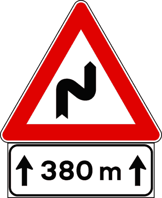

---

**15.** Il pannello integrativo rappresentato in figura A obbliga a proseguire diritto per 380 metri

- **الإجابة:** `FALSO ❌ (خطأ)`
- 

---

**16.** Il pannello integrativo rappresentato in figura A indica la distanza di sicurezza da mantenere in caso di pioggia

- **الإجابة:** `FALSO ❌ (خطأ)`
- 

---

**17.** Il pannello integrativo raffigurato indica la distanza tra il segnale e il punto d'inizio del pericolo

- **الإجابة:** `FALSO ❌ (خطأ)`
- 

---

**18.** Il segnale raffigurato indica la distanza tra il segnale e l'inizio della strada in cattivo stato

- **الإجابة:** `FALSO ❌ (خطأ)`
- 

---

**19.** Il pannello integrativo raffigurato in figura A indica l’altezza di un viadotto

- **الإجابة:** `FALSO ❌ (خطأ)`
- 

---

## 📌 Fascia oraria (9 domande)

**20.** Il segnale raffigurato vieta la sosta dalle ore 7.30 alle ore 19.00

- **الإجابة:** `VERO ✅ (صح)`
- 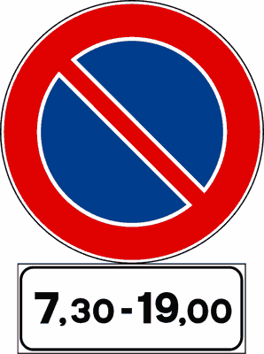

---

**21.** Il segnale raffigurato vieta il transito dalle ore 7.30 alle 19.00

- **الإجابة:** `VERO ✅ (صح)`
- 

---

**22.** Il pannello integrativo (A), posto sotto il segnale (B), vieta il transito ai pedoni nelle sole ore indicate

- **الإجابة:** `VERO ✅ (صح)`
- 

---

**23.** Il pannello integrativo rappresentato in figura B indica le ore di tutti i giorni nelle quali vale il segnale

- **الإجابة:** `VERO ✅ (صح)`
- 

---

**24.** Il segnale raffigurato consente il transito ai motocicli nelle sole ore indicate

- **الإجابة:** `FALSO ❌ (خطأ)`
- 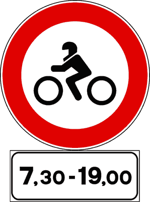

---

**25.** Il segnale raffigurato indica che il clacson può essere usato dalle ore 7.30 alle ore 19.00

- **الإجابة:** `FALSO ❌ (خطأ)`
- 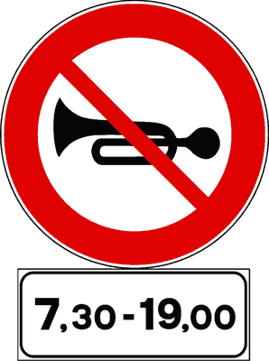

---

**26.** Il segnale raffigurato indica l’orario di apertura di una zona a traffico limitato

- **الإجابة:** `FALSO ❌ (خطأ)`
- 

---

**27.** Il pannello integrativo rappresentato in figura B indica in quali ore si può circolare a fari spenti

- **الإجابة:** `FALSO ❌ (خطأ)`
- 

---

**28.** Il pannello integrativo rappresentato in figura B indica le fasce orarie durante le quali si circola a targhe alterne

- **الإجابة:** `FALSO ❌ (خطأ)`
- 

---

## 📌 Fascia oraria giorni festivi (12 domande)

**29.** Il pannello integrativo raffigurato limita la validità del segnale sotto cui è posto ai giorni festivi e alla fascia oraria indicata

- **الإجابة:** `VERO ✅ (صح)`
- 

---

**30.** Il pannello integrativo raffigurato, posto sotto un segnale di prescrizione, precisa che il segnale vale solo nei giorni festivi e nelle fasce orarie indicate

- **الإجابة:** `VERO ✅ (صح)`
- 

---

**31.** Il segnale raffigurato consente il transito nei giorni festivi e nelle fasce orarie indicate ai soli pedoni

- **الإجابة:** `VERO ✅ (صح)`
- 

---

**32.** Il segnale raffigurato vieta la sosta nella fascia oraria indicata, dei giorni festivi

- **الإجابة:** `VERO ✅ (صح)`
- 

---

**33.** Il segnale raffigurato consente il transito dalle ore 8.00 alle ore 20.00 dei giorni festivi ai soli ciclisti

- **الإجابة:** `VERO ✅ (صح)`
- 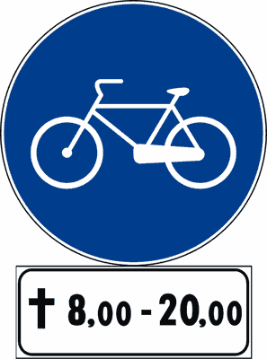

---

**34.** Il segnale raffigurato vieta il transito dalle ore 8.00 alle ore 20.00 dei giorni festivi

- **الإجابة:** `VERO ✅ (صح)`
- 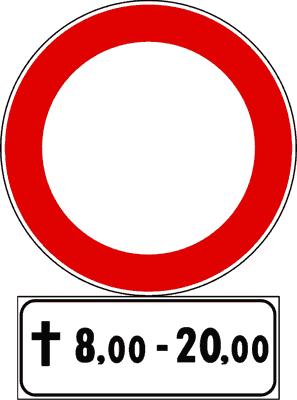

---

**35.** Il pannello integrativo raffigurato indica l'orario d'ingresso nel cimitero

- **الإجابة:** `FALSO ❌ (خطأ)`
- 

---

**36.** Il pannello integrativo raffigurato indica l'orario di apertura delle chiese

- **الإجابة:** `FALSO ❌ (خطأ)`
- 

---

**37.** Il pannello integrativo raffigurato indica l'orario di celebrazione delle funzioni religiose

- **الإجابة:** `FALSO ❌ (خطأ)`
- 

---

**38.** Il segnale raffigurato indica che si può parcheggiare tutti i giorni nella fascia oraria indicata

- **الإجابة:** `FALSO ❌ (خطأ)`
- 

---

**39.** Il pannello integrativo raffigurato vale nei giorni lavorativi

- **الإجابة:** `FALSO ❌ (خطأ)`
- 

---

**40.** Il segnale raffigurato consente il transito dei motocicli la domenica dalle ore 8.00 alle ore 20.00

- **الإجابة:** `FALSO ❌ (خطأ)`
- 

---

## 📌 Fascia oraria giorni lavorativi (12 domande)

**41.** Il pannello integrativo raffigurato, posto sotto un segnale, ne limita la validità nei giorni lavorativi e alle fasce orarie indicate

- **الإجابة:** `VERO ✅ (صح)`
- 

---

**42.** Il segnale raffigurato vieta il transito nella fascia oraria indicata, dei giorni lavorativi

- **الإجابة:** `VERO ✅ (صح)`
- 

---

**43.** Il pannello integrativo raffigurato indica la fascia oraria dei giorni lavorativi durante la quale vale la prescrizione del segnale sotto cui è posto

- **الإجابة:** `VERO ✅ (صح)`
- 

---

**44.** Il segnale raffigurato vieta la sosta nella fascia oraria indicata dei giorni lavorativi

- **الإجابة:** `VERO ✅ (صح)`
- 

---

**45.** Il pannello integrativo raffigurato, posto sotto un segnale di obbligo, indica che esso vale dalle ore 8.00 alle ore 20.00 dei giorni lavorativi

- **الإجابة:** `VERO ✅ (صح)`
- 

---

**46.** Il segnale raffigurato vieta il transito agli autocarri di massa complessiva superiore a 3,5 t. nell'orario indicato, dei giorni lavorativi

- **الإجابة:** `VERO ✅ (صح)`
- 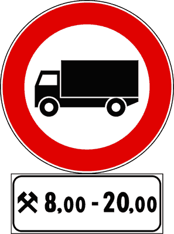

---

**47.** Il pannello integrativo raffigurato indica che il segnale al quale è abbinato vale tutti i giorni, ma solo nelle ore indicate

- **الإجابة:** `FALSO ❌ (خطأ)`
- 

---

**48.** Il pannello integrativo raffigurato indica gli orari di apertura di un museo di attrezzi da lavoro

- **الإجابة:** `FALSO ❌ (خطأ)`
- 

---

**49.** Il pannello integrativo raffigurato indica la fascia oraria di apertura delle officine di soccorso stradale

- **الإجابة:** `FALSO ❌ (خطأ)`
- 

---

**50.** Il segnale raffigurato è riservato ai veicoli per il soccorso stradale

- **الإجابة:** `FALSO ❌ (خطأ)`
- 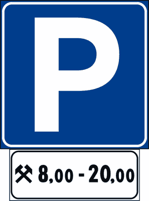

---

**51.** Il pannello integrativo raffigurato indica che il segnale al quale è abbinato vale nei giorni festivi

- **الإجابة:** `FALSO ❌ (خطأ)`
- 

---

**52.** Il pannello integrativo raffigurato, posto sotto il segnale PARCHEGGIO, indica che si può parcheggiare nei giorni festivi dalle ore 8.00 alle ore 20.00

- **الإجابة:** `FALSO ❌ (خطأ)`
- 

---

## 📌 Pannelli limitazione (11 domande)

**53.** Il segnale raffigurato vieta il transito ai soli veicoli indicati

- **الإجابة:** `VERO ✅ (صح)`
- 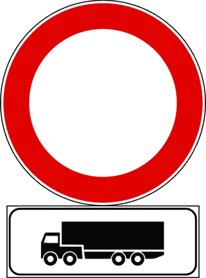

---

**54.** Il segnale raffigurato vieta la sosta ai veicoli indicati

- **الإجابة:** `VERO ✅ (صح)`
- 

---

**55.** Il segnale raffigurato vieta la sosta agli autoarticolati

- **الإجابة:** `VERO ✅ (صح)`
- 

---

**56.** Il pannello integrativo raffigurato indica che il segnale al quale è abbinato vale solo per i veicoli rappresentati

- **الإجابة:** `VERO ✅ (صح)`
- 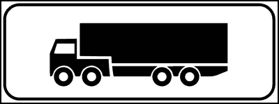

---

**57.** Il pannello integrativo raffigurato può essere abbinato ad un segnale di obbligo

- **الإجابة:** `VERO ✅ (صح)`
- 

---

**58.** Il pannello integrativo raffigurato può essere abbinato ad un segnale di divieto

- **الإجابة:** `VERO ✅ (صح)`
- 

---

**59.** Il pannello integrativo raffigurato indica un'officina meccanica per autotreni

- **الإجابة:** `FALSO ❌ (خطأ)`
- 

---

**60.** Il pannello integrativo raffigurato indica una stazione di rifornimento per soli mezzi pesanti

- **الإجابة:** `FALSO ❌ (خطأ)`
- 

---

**61.** Il segnale raffigurato consente la sosta agli autoarticolati

- **الإجابة:** `FALSO ❌ (خطأ)`
- 

---

**62.** Il segnale raffigurato prescrive che possono transitare gli autoarticolati

- **الإجابة:** `FALSO ❌ (خطأ)`
- 

---

**63.** Il pannello integrativo raffigurato, posto sotto il segnale PARCHEGGIO, indica che possono parcheggiare tutti i veicoli pesanti

- **الإجابة:** `FALSO ❌ (خطأ)`
- 

---

## 📌 Inizio prescrizione (11 domande)

**64.** Il pannello integrativo (A), posto sotto un segnale di divieto, evidenzia il punto d'inizio della prescrizione

- **الإجابة:** `VERO ✅ (صح)`
- 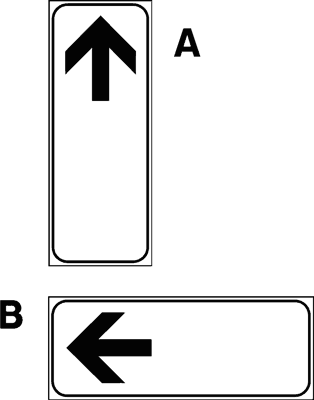

---

**65.** Il segnale raffigurato indica che il divieto di sosta ha inizio in quel punto

- **الإجابة:** `VERO ✅ (صح)`
- 

---

**66.** Il segnale raffigurato evidenzia l'inizio dell'area dove è possibile parcheggiare

- **الإجابة:** `VERO ✅ (صح)`
- 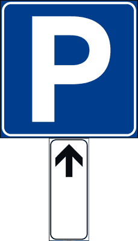

---

**67.** il segnale raffigurato evidenzia il punto d'inizio del divieto di fermata

- **الإجابة:** `VERO ✅ (صح)`
- 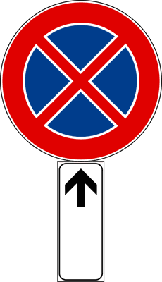

---

**68.** Il segnale raffigurato evidenzia il punto d'inizio del viale pedonale

- **الإجابة:** `VERO ✅ (صح)`
- 

---

**69.** Il pannello raffigurato (A) indica una strada in salita

- **الإجابة:** `FALSO ❌ (خطأ)`
- 

---

**70.** Il pannello raffigurato (A) indica l'obbligo di proseguire diritto

- **الإجابة:** `FALSO ❌ (خطأ)`
- 

---

**71.** Il pannello raffigurato (A) indica la fine di una strada a senso unico

- **الإجابة:** `FALSO ❌ (خطأ)`
- 

---

**72.** Il pannello raffigurato (B) indica la corsia riservata agli autobus urbani

- **الإجابة:** `FALSO ❌ (خطأ)`
- 

---

**73.** Il segnale raffigurato evidenzia il punto in cui finisce l'area destinata al parcheggio

- **الإجابة:** `FALSO ❌ (خطأ)`
- 

---

**74.** Il pannello raffigurato (A), posto sotto un segnale di pericolo, evidenzia il punto dove finisce il pericolo

- **الإجابة:** `FALSO ❌ (خطأ)`
- 

---

## 📌 Continuazione prescrizione (12 domande)

**75.** Il segnale raffigurato indica che il divieto di sosta continua

- **الإجابة:** `VERO ✅ (صح)`
- 

---

**76.** Il segnale raffigurato conferma la continuazione del divieto di sorpasso

- **الإجابة:** `VERO ✅ (صح)`
- 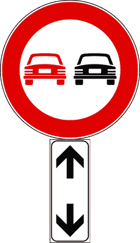

---

**77.** Il segnale raffigurato indica la continuazione del limite massimo di velocità

- **الإجابة:** `VERO ✅ (صح)`
- 

---

**78.** Il segnale raffigurato indica la continuazione del tratto di strada sdrucciolevole

- **الإجابة:** `VERO ✅ (صح)`
- 

---

**79.** Il segnale raffigurato indica che la fermata è vietata sia prima che dopo il segnale

- **الإجابة:** `VERO ✅ (صح)`
- 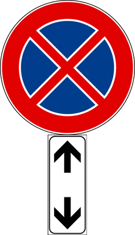

---

**80.** Il pannello integrativo raffigurato (A), posto sotto un segnale di pericolo, ne indica la continuazione

- **الإجابة:** `VERO ✅ (صح)`
- 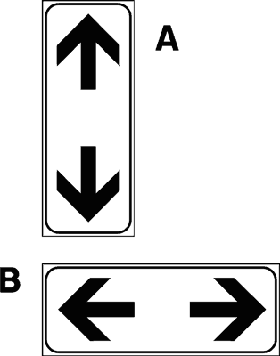

---

**81.** Il pannello integrativo raffigurato (A) indica di tornare indietro

- **الإجابة:** `FALSO ❌ (خطأ)`
- 

---

**82.** Il segnale raffigurato indica la fine della zona destinata al parcheggio

- **الإجابة:** `FALSO ❌ (خطأ)`
- 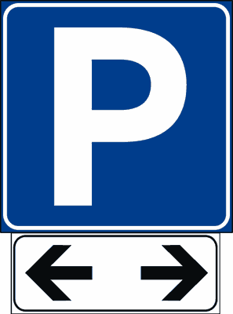

---

**83.** Il pannello integrativo raffigurato (A) indica un senso unico alternato

- **الإجابة:** `FALSO ❌ (خطأ)`
- 

---

**84.** Il pannello integrativo raffigurato (A), posto sotto un segnale di pericolo, ne indica la fine

- **الإجابة:** `FALSO ❌ (خطأ)`
- 

---

**85.** Il pannello integrativo raffigurato (A) indica le due direzioni consentite

- **الإجابة:** `FALSO ❌ (خطأ)`
- 

---

**86.** Il pannello integrativo raffigurato (A) indica una strada a doppio senso di circolazione

- **الإجابة:** `FALSO ❌ (خطأ)`
- 

---

## 📌 Termine prescrizione (12 domande)

**87.** Il segnale raffigurato indica il punto nel quale termina il divieto di sosta

- **الإجابة:** `VERO ✅ (صح)`
- 

---

**88.** Il segnale raffigurato indica il punto dove termina il divieto di fermata

- **الإجابة:** `VERO ✅ (صح)`
- 

---

**89.** Il segnale raffigurato indica la fine del cantiere stradale

- **الإجابة:** `VERO ✅ (صح)`
- 

---

**90.** Il segnale raffigurato indica la fine dell'area destinata al parcheggio

- **الإجابة:** `VERO ✅ (صح)`
- 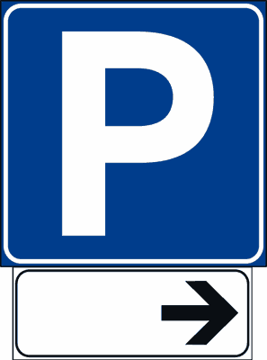

---

**91.** Il segnale raffigurato indica la fine della strada deformata

- **الإجابة:** `VERO ✅ (صح)`
- 

---

**92.** Il segnale raffigurato indica la fine della strada sdrucciolevole

- **الإجابة:** `VERO ✅ (صح)`
- 

---

**93.** Il pannello integrativo raffigurato (A) indica una strada in discesa

- **الإجابة:** `FALSO ❌ (خطأ)`
- 

---

**94.** Il pannello integrativo raffigurato (B), posto sotto il segnale PARCHEGGIO, indica l'inizio della zona destinata al parcheggio

- **الإجابة:** `FALSO ❌ (خطأ)`
- 

---

**95.** Il pannello integrativo raffigurato (A), posto sotto un segnale di divieto, indica l'inizio del divieto

- **الإجابة:** `FALSO ❌ (خطأ)`
- 

---

**96.** Il pannello integrativo raffigurato (A) indica una strada chiusa al traffico

- **الإجابة:** `FALSO ❌ (خطأ)`
- 

---

**97.** Il segnale raffigurato indica la continuazione del divieto di sorpasso

- **الإجابة:** `FALSO ❌ (خطأ)`
- 

---

**98.** Il pannello integrativo raffigurato (A) indica l'unica direzione consentita

- **الإجابة:** `FALSO ❌ (خطأ)`
- 

---

## 📌 Segni in rifacimento (9 domande)

**99.** Il pannello integrativo raffigurato preavvisa che temporaneamente manca la segnaletica orizzontale sulla carreggiata

- **الإجابة:** `VERO ✅ (صح)`
- 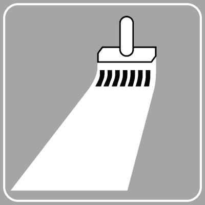

---

**100.** Il pannello integrativo raffigurato indica un tratto di strada sul quale non è temporaneamente presente la segnaletica orizzontale

- **الإجابة:** `VERO ✅ (صح)`
- 

---

**101.** Il pannello integrativo raffigurato indica che si stanno svolgendo i lavori per rifare la segnaletica orizzontale

- **الإجابة:** `VERO ✅ (صح)`
- 

---

**102.** Il pannello integrativo raffigurato viene posto sotto il segnale ALTRI PERICOLI

- **الإجابة:** `VERO ✅ (صح)`
- 

---

**103.** Il segnale raffigurato indica una strada chiusa

- **الإجابة:** `FALSO ❌ (خطأ)`
- 

---

**104.** Il pannello integrativo raffigurato indica una strada innevata

- **الإجابة:** `FALSO ❌ (خطأ)`
- 

---

**105.** Il pannello integrativo raffigurato indica la vicinanza di un attraversamento pedonale

- **الإجابة:** `FALSO ❌ (خطأ)`
- 

---

**106.** Il pannello integrativo raffigurato preavvisa l'inizio di un tratto di strada a senso unico

- **الإجابة:** `FALSO ❌ (خطأ)`
- 

---

**107.** Il pannello integrativo raffigurato indica che non è consentito superare la linea continua

- **الإجابة:** `FALSO ❌ (خطأ)`
- 

---

## 📌 Presenza incidente (10 domande)

**108.** Il pannello integrativo raffigurato invita a rallentare a causa di un incidente

- **الإجابة:** `VERO ✅ (صح)`
- 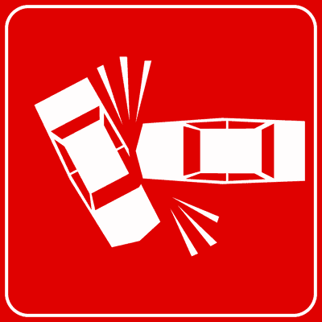

---

**109.** Il pannello integrativo raffigurato indica veicoli incidentati sulla carreggiata

- **الإجابة:** `VERO ✅ (صح)`
- 

---

**110.** Il pannello integrativo raffigurato segnala che la carreggiata è occupata da veicoli incidentati

- **الإجابة:** `VERO ✅ (صح)`
- 

---

**111.** Il pannello integrativo raffigurato segnala un incidente stradale e che quindi occorre diminuire la velocità

- **الإجابة:** `VERO ✅ (صح)`
- 

---

**112.** Il pannello integrativo raffigurato indica una strada sdrucciolevole

- **الإجابة:** `FALSO ❌ (خطأ)`
- 

---

**113.** Il pannello integrativo raffigurato indica di fermarsi e dare la precedenza a destra

- **الإجابة:** `FALSO ❌ (خطأ)`
- 

---

**114.** Il pannello integrativo raffigurato si trova solo se l'incidente è avvenuto in autostrada

- **الإجابة:** `FALSO ❌ (خطأ)`
- 

---

**115.** Il pannello integrativo raffigurato indica un divieto di sosta

- **الإجابة:** `FALSO ❌ (خطأ)`
- 

---

**116.** Il pannello integrativo raffigurato preavvisa la presenza di un garage per veicoli incidentati

- **الإجابة:** `FALSO ❌ (خطأ)`
- 

---

**117.** Il pannello integrativo raffigurato indica di accendere le luci per evitare incidenti

- **الإجابة:** `FALSO ❌ (خطأ)`
- 

---

## 📌 Attraversamento binari (9 domande)

**118.** Il pannello integrativo raffigurato indica la presenza di binari di manovra

- **الإجابة:** `VERO ✅ (صح)`
- 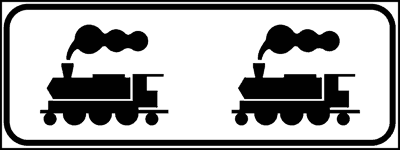

---

**119.** Il segnale raffigurato indica l'attraversamento di binari di manovra

- **الإجابة:** `VERO ✅ (صح)`
- 

---

**120.** Il pannello integrativo raffigurato preavvisa la presenza di binari di manovra o di raccordo in prossimità di scali merci

- **الإجابة:** `VERO ✅ (صح)`
- 

---

**121.** Il segnale raffigurato invita a diminuire la velocità

- **الإجابة:** `VERO ✅ (صح)`
- 

---

**122.** Il pannello integrativo è abbinato al segnale ALTRI PERICOLI

- **الإجابة:** `VERO ✅ (صح)`
- 

---

**123.** Il pannello integrativo indica un'area attrezzata per gare di modellismo

- **الإجابة:** `FALSO ❌ (خطأ)`
- 

---

**124.** Il pannello integrativo raffigurato indica di fare attenzione perché la strada può essere attraversata dai tram

- **الإجابة:** `FALSO ❌ (خطأ)`
- 

---

**125.** Il pannello integrativo raffigurato va rispettato dai conducenti dei treni

- **الإجابة:** `FALSO ❌ (خطأ)`
- 

---

**126.** Il pannello integrativo raffigurato indica un passaggio a livello con due binari

- **الإجابة:** `FALSO ❌ (خطأ)`
- 

---

## 📌 Sgombraneve (12 domande)

**127.** Il pannello integrativo raffigurato indica la presenza di macchine sgombraneve al lavoro sulla strada

- **الإجابة:** `VERO ✅ (صح)`
- 

---

**128.** Il pannello integrativo raffigurato è abbinato al segnale ALTRI PERICOLI

- **الإجابة:** `VERO ✅ (صح)`
- 

---

**129.** Il pannello integrativo raffigurato invita a diminuire la velocità per la presenza di macchine sgombraneve in funzione

- **الإجابة:** `VERO ✅ (صح)`
- 

---

**130.** Il pannello integrativo raffigurato invita a mantenere una distanza di almeno 20 metri dalle macchine sgombraneve in funzione

- **الإجابة:** `VERO ✅ (صح)`
- 

---

**131.** Il pannello integrativo raffigurato indica di prestare attenzione a macchine sgombraneve sulla strada

- **الإجابة:** `VERO ✅ (صح)`
- 

---

**132.** Il pannello integrativo raffigurato è posto su strade innevate per segnalare la presenza di macchine sgombraneve

- **الإجابة:** `VERO ✅ (صح)`
- 

---

**133.** Il pannello integrativo raffigurato indica la costruzione di un parco giochi nelle vicinanze

- **الإجابة:** `FALSO ❌ (خطأ)`
- 

---

**134.** Il pannello integrativo raffigurato indica il divieto di transito alle macchine sgombraneve

- **الإجابة:** `FALSO ❌ (خطأ)`
- 

---

**135.** Il pannello integrativo raffigurato indica l'obbligo di montare le catene

- **الإجابة:** `FALSO ❌ (خطأ)`
- 

---

**136.** Il pannello integrativo raffigurato obbliga a stare distanti 100 metri dallo sgombraneve in funzione

- **الإجابة:** `FALSO ❌ (خطأ)`
- 

---

**137.** Il pannello integrativo raffigurato indica che la strada è percorribile solo dopo che sia passato lo sgombraneve

- **الإجابة:** `FALSO ❌ (خطأ)`
- 

---

**138.** Il pannello integrativo raffigurato indica che sulla strada è possibile incrociare il veicolo per la raccolta della spazzatura

- **الإجابة:** `FALSO ❌ (خطأ)`
- 

---

## 📌 Zona allagamento (10 domande)

**139.** Il pannello integrativo raffigurato indica una strada che in caso di forte pioggia si può allagare

- **الإجابة:** `VERO ✅ (صح)`
- 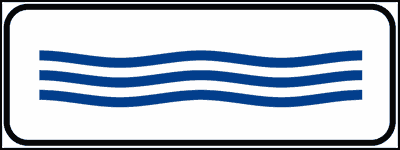

---

**140.** Il pannello integrativo raffigurato indica che stiamo percorrendo un tratto di strada che può allagarsi in caso di forte pioggia

- **الإجابة:** `VERO ✅ (صح)`
- 

---

**141.** Il segnale raffigurato indica che la strada si può allagare in caso di forte pioggia

- **الإجابة:** `VERO ✅ (صح)`
- 

---

**142.** Il pannello integrativo raffigurato indica il pericolo di allagamento della carreggiata in caso di pioggia o forte mareggiata

- **الإجابة:** `VERO ✅ (صح)`
- 

---

**143.** Il pannello integrativo raffigurato indica una piscina nelle vicinanze

- **الإجابة:** `FALSO ❌ (خطأ)`
- 

---

**144.** Il pannello integrativo raffigurato indica un tratto di strada coperto di neve

- **الإجابة:** `FALSO ❌ (خطأ)`
- 

---

**145.** Il pannello integrativo raffigurato preavvisa una banchina cedevole

- **الإجابة:** `FALSO ❌ (خطأ)`
- 

---

**146.** Il pannello integrativo raffigurato vieta il transito ai veicoli che trasportano prodotti che potrebbero inquinare l'acqua

- **الإجابة:** `FALSO ❌ (خطأ)`
- 

---

**147.** Il pannello integrativo raffigurato indica un tratto di strada dove è possibile trovare nebbia

- **الإجابة:** `FALSO ❌ (خطأ)`
- 

---

**148.** Il pannello integrativo raffigurato preavvisa la presenza di cordoli trasversali di rallentamento (dossi artificiali)

- **الإجابة:** `FALSO ❌ (خطأ)`
- 

---

## 📌 Presenza code (11 domande)

**149.** Il pannello integrativo raffigurato indica la possibilità di trovare traffico intenso, con formazione di colonne di veicoli

- **الإجابة:** `VERO ✅ (صح)`
- 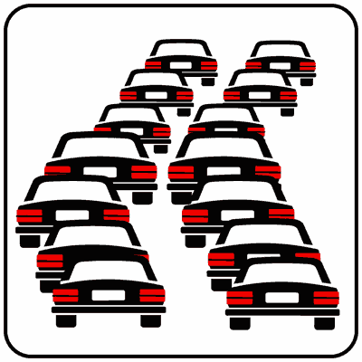

---

**150.** Il pannello integrativo raffigurato indica la possibilità di trovare veicoli fermi in colonna

- **الإجابة:** `VERO ✅ (صح)`
- 

---

**151.** Il pannello integrativo raffigurato si può trovare all'ingresso delle autostrade, per indicare che vi sono veicoli in lento movimento

- **الإجابة:** `VERO ✅ (صح)`
- 

---

**152.** Il pannello integrativo raffigurato invita ad usare prudenza, per non tamponare veicoli fermi per intasamento del traffico

- **الإجابة:** `VERO ✅ (صح)`
- 

---

**153.** Il pannello integrativo raffigurato, posto sull'autostrada, può consigliare di uscire per evitare probabili rallentamenti o code

- **الإجابة:** `VERO ✅ (صح)`
- 

---

**154.** Il pannello raffigurato indica un'area di parcheggio per autovetture

- **الإجابة:** `FALSO ❌ (خطأ)`
- 

---

**155.** Il pannello integrativo raffigurato indica che la corsia di sinistra è riservata ai veicoli che pagano il pedaggio autostradale tramite telepass

- **الإجابة:** `FALSO ❌ (خطأ)`
- 

---

**156.** Il pannello integrativo raffigurato indica una strada a senso unico

- **الإجابة:** `FALSO ❌ (خطأ)`
- 

---

**157.** Il pannello integrativo raffigurato indica l'obbligo di sorpassare a sinistra

- **الإجابة:** `FALSO ❌ (خطأ)`
- 

---

**158.** Il pannello integrativo raffigurato indica di diminuire la distanza di sicurezza

- **الإجابة:** `FALSO ❌ (خطأ)`
- 

---

**159.** Il pannello integrativo raffigurato obbliga i veicoli a circolare a passo d'uomo

- **الإجابة:** `FALSO ❌ (خطأ)`
- 

---

## 📌 Mezzi lavoro (11 domande)

**160.** Il pannello integrativo raffigurato indica la possibile presenza di macchine operatrici in movimento

- **الإجابة:** `VERO ✅ (صح)`
- 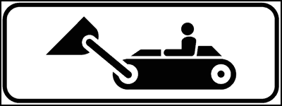

---

**161.** Il pannello integrativo raffigurato indica che sulla corsia possono esserci pale meccaniche al lavoro

- **الإجابة:** `VERO ✅ (صح)`
- 

---

**162.** Il pannello integrativo raffigurato indica che sulla strada possono esserci escavatori in movimento

- **الإجابة:** `VERO ✅ (صح)`
- 

---

**163.** Il pannello integrativo raffigurato invita ad usare particolare prudenza per la presenza di pale meccaniche in movimento

- **الإجابة:** `VERO ✅ (صح)`
- 

---

**164.** Il pannello integrativo raffigurato indica la presenza di cantieri stradali con escavatori e pale meccaniche in azione

- **الإجابة:** `VERO ✅ (صح)`
- 

---

**165.** Il pannello integrativo raffigurato indica la presenza di veicoli militari

- **الإجابة:** `FALSO ❌ (خطأ)`
- 

---

**166.** Il pannello integrativo raffigurato indica un'area per lo scarico della spazzatura

- **الإجابة:** `FALSO ❌ (خطأ)`
- 

---

**167.** Il pannello integrativo raffigurato si trova prima di un ponte, per vietare il transito alle macchine operatrici

- **الإجابة:** `FALSO ❌ (خطأ)`
- 

---

**168.** Il pannello integrativo raffigurato indica una strada riservata alle sole macchine operatrici

- **الإجابة:** `FALSO ❌ (خطأ)`
- 

---

**169.** Il pannello integrativo raffigurato indica divieto di transito a tutti i veicoli con i cingoli

- **الإجابة:** `FALSO ❌ (خطأ)`
- 

---

**170.** Il pannello integrativo raffigurato indica un'area di parcheggio riservata alle macchine operatrici

- **الإجابة:** `FALSO ❌ (خطأ)`
- 

---

## 📌 Strada ghiacciata (12 domande)

**171.** Il segnale raffigurato indica la possibilità di trovare un tratto di strada sdrucciolevole a causa di ghiaccio

- **الإجابة:** `VERO ✅ (صح)`
- 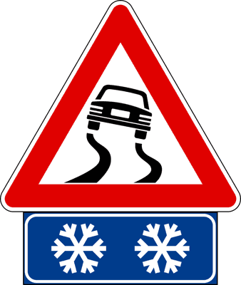

---

**172.** Il pannello integrativo raffigurato indica la possibilità di trovare tratti di strada ghiacciati

- **الإجابة:** `VERO ✅ (صح)`
- 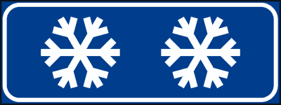

---

**173.** Il pannello integrativo raffigurato indica, in caso di bassa temperatura, la presenza di tratti pericolosi per ghiaccio

- **الإجابة:** `VERO ✅ (صح)`
- 

---

**174.** Il pannello integrativo raffigurato indica, su strade coperte di neve, il pericolo di formazione di ghiaccio

- **الإجابة:** `VERO ✅ (صح)`
- 

---

**175.** Il pannello integrativo raffigurato invita ad usare particolare prudenza, perché la strada può essere ghiacciata

- **الإجابة:** `VERO ✅ (صح)`
- 

---

**176.** Il segnale raffigurato indica strada sdrucciolevole per ghiaccio, in caso di bassa temperatura

- **الإجابة:** `VERO ✅ (صح)`
- 

---

**177.** Il pannello integrativo raffigurato indica la presenza nelle vicinanze di impianti di risalita

- **الإجابة:** `FALSO ❌ (خطأ)`
- 

---

**178.** Il pannello integrativo raffigurato indica la strada da prendere per raggiungere le alpi

- **الإجابة:** `FALSO ❌ (خطأ)`
- 

---

**179.** Il pannello integrativo raffigurato indica la presenza nelle vicinanze di una stazione sciistica

- **الإجابة:** `FALSO ❌ (خطأ)`
- 

---

**180.** Il pannello integrativo raffigurato invita ad usare le luci di emergenza durante la sosta

- **الإجابة:** `FALSO ❌ (خطأ)`
- 

---

**181.** Il pannello integrativo raffigurato invita a non usare i fari abbaglianti

- **الإجابة:** `FALSO ❌ (خطأ)`
- 

---

**182.** Il pannello integrativo raffigurato indica una zona dove nevica spesso

- **الإجابة:** `FALSO ❌ (خطأ)`
- 

---

## 📌 Strada pioggia (12 domande)

**183.** Il pannello integrativo raffigurato indica un tratto di strada pericoloso in caso di pioggia

- **الإجابة:** `VERO ✅ (صح)`
- 

---

**184.** Il pannello integrativo raffigurato invita, in caso di pioggia, ad aumentare la distanza di sicurezza

- **الإجابة:** `VERO ✅ (صح)`
- 

---

**185.** Il pannello integrativo raffigurato indica che quando piove la strada può diventare sdrucciolevole

- **الإجابة:** `VERO ✅ (صح)`
- 

---

**186.** Il pannello integrativo raffigurato indica che in caso di pioggia si può trovare del fango sulla strada

- **الإجابة:** `VERO ✅ (صح)`
- 

---

**187.** Il pannello integrativo raffigurato segnala un tratto di strada sdrucciolevole in caso di pioggia

- **الإجابة:** `VERO ✅ (صح)`
- 

---

**188.** Il pannello integrativo raffigurato invita a diminuire la velocità in caso di pioggia, perché la strada diventa sdrucciolevole

- **الإجابة:** `VERO ✅ (صح)`
- 

---

**189.** Il pannello integrativo raffigurato indica un autolavaggio nelle vicinanze

- **الإجابة:** `FALSO ❌ (خطأ)`
- 

---

**190.** Il pannello integrativo raffigurato indica la presenza di una stazione meteorologica nelle vicinanze

- **الإجابة:** `FALSO ❌ (خطأ)`
- 

---

**191.** Il pannello integrativo raffigurato indica di fare attenzione agli autocarri in transito, per la possibile perdita del carico trasportato

- **الإجابة:** `FALSO ❌ (خطأ)`
- 

---

**192.** Il pannello integrativo raffigurato indica un tratto di strada con probabile formazione di nuvole di polvere

- **الإجابة:** `FALSO ❌ (خطأ)`
- 

---

**193.** Il pannello raffigurato indica una zona dove piove spesso

- **الإجابة:** `FALSO ❌ (خطأ)`
- 

---

**194.** Il pannello integrativo raffigurato indica caduta di pietre sulla strada

- **الإجابة:** `FALSO ❌ (خطأ)`
- 

---

## 📌 Autocarri rallentamento (12 domande)

**195.** Il pannello integrativo raffigurato indica un tratto di strada in salita con probabile presenza di autocarri che marciano a bassa velocità

- **الإجابة:** `VERO ✅ (صح)`
- 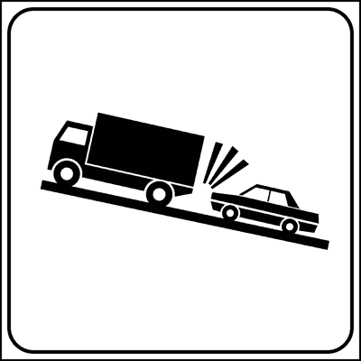

---

**196.** Il pannello integrativo raffigurato indica un tratto di strada in ripida salita che costringe gli autocarri a rallentare

- **الإجابة:** `VERO ✅ (صح)`
- 

---

**197.** Il pannello integrativo raffigurato indica di fare attenzione per la probabile presenza di veicoli pesanti in lento movimento

- **الإجابة:** `VERO ✅ (صح)`
- 

---

**198.** In presenza del segnale raffigurato il conducente deve moderare la velocità per la possibile presenza di autocarri in lento movimento

- **الإجابة:** `VERO ✅ (صح)`
- 

---

**199.** Il pannello integrativo raffigurato indica di circolare ad una velocità prudenziale, per evitare incidenti con gli autocarri che potrebbero stare davanti

- **الإجابة:** `VERO ✅ (صح)`
- 

---

**200.** Il pannello integrativo raffigurato indica un tratto di strada chiuso a causa di un tamponamento

- **الإجابة:** `FALSO ❌ (خطأ)`
- 

---

**201.** Il pannello integrativo raffigurato indica che è vietato sorpassare gli autocarri

- **الإجابة:** `FALSO ❌ (خطأ)`
- 

---

**202.** Il pannello integrativo raffigurato si trova nei pontili d'imbarco delle navi traghetto

- **الإجابة:** `FALSO ❌ (خطأ)`
- 

---

**203.** Il pannello integrativo raffigurato indica di diminuire la distanza di sicurezza

- **الإجابة:** `FALSO ❌ (خطأ)`
- 

---

**204.** Il pannello integrativo raffigurato indica di proseguire con le luci accese

- **الإجابة:** `FALSO ❌ (خطأ)`
- 

---

**205.** Il pannello integrativo raffigurato indica che bisogna suonare il clacson ogni qualvolta si sorpassa un autocarro

- **الإجابة:** `FALSO ❌ (خطأ)`
- 

---

**206.** Il pannello integrativo raffigurato segnala la possibilità di poter essere trainati

- **الإجابة:** `FALSO ❌ (خطأ)`
- 

---

## 📌 Zona rimozione (11 domande)

**207.** Il pannello integrativo raffigurato indica che il veicolo lasciato in sosta può essere portato via dal carro-attrezzi

- **الإجابة:** `VERO ✅ (صح)`
- 

---

**208.** Il segnale raffigurato indica che il veicolo può essere spostato in una depositeria comunale

- **الإجابة:** `VERO ✅ (صح)`
- 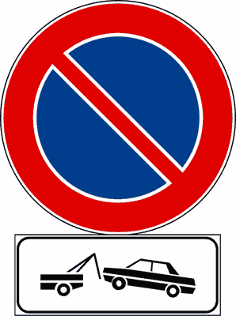

---

**209.** In presenza del segnale raffigurato i veicoli al servizio di persone diversamente abili, muniti di apposito contrassegno, non possono essere portati nella depositeria comunale, né bloccati con le ganasce

- **الإجابة:** `VERO ✅ (صح)`
- 

---

**210.** Il pannello integrativo raffigurato indica una zona di divieto di sosta con rimozione del veicolo

- **الإجابة:** `VERO ✅ (صح)`
- 

---

**211.** Il segnale raffigurato prevede lo spostamento del veicolo o il suo blocco tramite ganasce

- **الإجابة:** `VERO ✅ (صح)`
- 

---

**212.** Il pannello integrativo raffigurato indica la presenza di officine attrezzate per il soccorso stradale

- **الإجابة:** `FALSO ❌ (خطأ)`
- 

---

**213.** Il pannello integrativo raffigurato indica l'imbarco delle autovetture sui treni merce

- **الإجابة:** `FALSO ❌ (خطأ)`
- 

---

**214.** Il pannello integrativo raffigurato indica un'officina meccanica attrezzata per il cambio d'olio

- **الإجابة:** `FALSO ❌ (خطأ)`
- 

---

**215.** Il pannello integrativo raffigurato indica che possono sostare i veicoli per il soccorso stradale

- **الإجابة:** `FALSO ❌ (خطأ)`
- 

---

**216.** Il pannello integrativo raffigurato indica che dopo tre ore il veicolo lasciato in sosta viene rimosso o bloccato

- **الإجابة:** `FALSO ❌ (خطأ)`
- 

---

**217.** Il pannello integrativo raffigurato indica una strada chiusa per incidente

- **الإجابة:** `FALSO ❌ (خطأ)`
- 

---

## 📌 Segnale corsia (7 domande)

**218.** Il pannello integrativo in figura, posto in alto sulla carreggiata insieme ad un segnale indicante una località, segnala la corsia da prendere per raggiungere detta località

- **الإجابة:** `VERO ✅ (صح)`
- 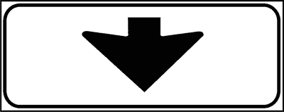

---

**219.** Il pannello integrativo in figura, posto in alto sulla carreggiata insieme ad un segnale, specifica a quale corsia si riferisce il segnale

- **الإجابة:** `VERO ✅ (صح)`
- 

---

**220.** Il pannello integrativo in figura indica che il segnale posto sopra vale per la sola corsia indicata dalla freccia

- **الإجابة:** `VERO ✅ (صح)`
- 

---

**221.** Il pannello integrativo in figura è posto per indicare la fermata degli autobus

- **الإجابة:** `FALSO ❌ (خطأ)`
- 

---

**222.** Il pannello integrativo in figura indica che hanno la precedenza i veicoli che vengono di fronte

- **الإجابة:** `FALSO ❌ (خطأ)`
- 

---

**223.** Il pannello integrativo in figura indica la fine di una prescrizione

- **الإجابة:** `FALSO ❌ (خطأ)`
- 

---

**224.** Il pannello integrativo in figura indica la fine del segnale LIMITE MASSIMO DI VELOCITA'

- **الإجابة:** `FALSO ❌ (خطأ)`
- 

---

## 📌 Presenza tornanti (12 domande)

**225.** Il pannello integrativo in figura (A) indica la vicinanza di una o più curve strette

- **الإجابة:** `VERO ✅ (صح)`
- 

---

**226.** Il pannello integrativo in figura (B) indica la vicinanza di una o più curve particolarmente pericolose

- **الإجابة:** `VERO ✅ (صح)`
- 

---

**227.** Il pannello integrativo in figura (A) può indicare uno o più tornanti

- **الإجابة:** `VERO ✅ (صح)`
- 

---

**228.** Il pannello integrativo in figura (B) si può trovare sotto il segnale di CURVA o DOPPIA CURVA

- **الإجابة:** `VERO ✅ (صح)`
- 

---

**229.** La presenza di uno dei due pannelli integrativi in figura indica la vicinanza di una o più curve strette

- **الإجابة:** `VERO ✅ (صح)`
- 

---

**230.** La presenza di uno dei due pannelli integrativi in figura indica la vicinanza di una o più curve particolarmente pericolose

- **الإجابة:** `VERO ✅ (صح)`
- 

---

**231.** La presenza di uno dei due pannelli integrativi in figura può indicare uno o più tornanti

- **الإجابة:** `VERO ✅ (صح)`
- 

---

**232.** Il pannello integrativo di figura B indica il numero di corsie di cui è composta la strada

- **الإجابة:** `FALSO ❌ (خطأ)`
- 

---

**233.** Il pannello integrativo di figura B indica quanti veicoli contemporaneamente possono percorrere la curva

- **الإجابة:** `FALSO ❌ (خطأ)`
- 

---

**234.** Il pannello integrativo di figura B indica quanti chilometri mancano per poter trovare un cavalcavia che consente di invertire il senso di marcia

- **الإجابة:** `FALSO ❌ (خطأ)`
- 

---

**235.** Il pannello integrativo di figura B indica il numero degli svincoli autostradali

- **الإجابة:** `FALSO ❌ (خطأ)`
- 

---

**236.** La presenza di uno dei due pannelli integrativi in figura indica l’incrocio con una strada dalla quale si immettono autocarri provenienti da una discarica

- **الإجابة:** `FALSO ❌ (خطأ)`
- 

---

## 📌 Pulizia strade (8 domande)

**237.** Il pannello integrativo in figura, posto sotto il segnale DIVIETO DI SOSTA, indica che la sosta è vietata solo in determinate ore dei giorni indicati

- **الإجابة:** `VERO ✅ (صح)`
- 

---

**238.** Il pannello integrativo in figura è posto nei tratti di strada dove vengono effettuate operazioni di pulizia delle strade con autospazzatrici

- **الإجابة:** `VERO ✅ (صح)`
- 

---

**239.** Il pannello integrativo in figura indica i giorni e le ore in cui si effettuano operazioni di pulizia della strada con autospazzatrici

- **الإجابة:** `VERO ✅ (صح)`
- 

---

**240.** Il pannello integrativo in figura, posto sotto il segnale DIVIETO DI SOSTA, indica che la sosta è vietata solo in alcune ore dei giorni indicati

- **الإجابة:** `VERO ✅ (صح)`
- 

---

**241.** Il pannello integrativo in figura indica l'orario per il deposito della spazzatura

- **الإجابة:** `FALSO ❌ (خطأ)`
- 

---

**242.** Il pannello integrativo in figura indica i giorni di apertura degli autolavaggi

- **الإجابة:** `FALSO ❌ (خطأ)`
- 

---

**243.** Il pannello integrativo in figura obbliga a dare la precedenza agli autocarri

- **الإجابة:** `FALSO ❌ (خطأ)`
- 

---

**244.** Il pannello integrativo in figura, posto sotto il segnale DIVIETO DI SOSTA, indica che non possono sostare i veicoli rappresentati

- **الإجابة:** `FALSO ❌ (خطأ)`
- 

---

## 📌 Andamento strada (10 domande)

**245.** I pannelli integrativi in figura vengono posti sotto i segnali di diritto di precedenza

- **الإجابة:** `VERO ✅ (صح)`
- 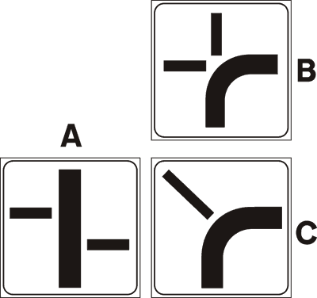

---

**246.** I pannelli integrativi in figura indicano una intersezione, distinguendo la strada principale dalle strade secondarie

- **الإجابة:** `VERO ✅ (صح)`
- 

---

**247.** I pannelli integrativi in figura posti in vicinanza di una intersezione, indicano l'andamento della strada principale

- **الإجابة:** `VERO ✅ (صح)`
- 

---

**248.** I pannelli integrativi in figura possono trovarsi sotto il segnale INTERSEZIONE CON DIRITTO DI PRECEDENZA

- **الإجابة:** `VERO ✅ (صح)`
- 

---

**249.** I pannelli in figura (B) e (C) indicano una curva pericolosa

- **الإجابة:** `FALSO ❌ (خطأ)`
- 

---

**250.** I pannelli integrativi in figura indicano come lasciare il veicolo in sosta

- **الإجابة:** `FALSO ❌ (خطأ)`
- 

---

**251.** I pannelli integrativi in figura vengono posti anche sulle autostrade

- **الإجابة:** `FALSO ❌ (خطأ)`
- 

---

**252.** I pannelli integrativi in figura indicano strade senza uscita

- **الإجابة:** `FALSO ❌ (خطأ)`
- 

---

**253.** I pannelli integrativi in figura indicano la presenza di sottopassaggi

- **الإجابة:** `FALSO ❌ (خطأ)`
- 

---

**254.** I pannelli integrativi in figura indicano che le strade che si incrociano sono momentaneamente interrotte

- **الإجابة:** `FALSO ❌ (خطأ)`
- 

---

## 📌 Pannelli eccezione (9 domande)

**255.** Il segnale in figura consente l'accesso solo agli autobus

- **الإجابة:** `VERO ✅ (صح)`
- 

---

**256.** Il segnale in figura permette di transitare solo agli autobus

- **الإجابة:** `VERO ✅ (صح)`
- 

---

**257.** Il segnale in figura indica che possono parcheggiare tutti i veicoli tranne gli autobus

- **الإجابة:** `VERO ✅ (صح)`
- 

---

**258.** Il pannello integrativo in figura può essere abbinato ad un segnale di obbligo

- **الإجابة:** `VERO ✅ (صح)`
- 

---

**259.** Il pannello integrativo in figura può essere abbinato ad un segnale di divieto

- **الإجابة:** `VERO ✅ (صح)`
- 

---

**260.** Il segnale in figura vieta l'accesso agli autobus

- **الإجابة:** `FALSO ❌ (خطأ)`
- 

---

**261.** Il segnale in figura vieta il transito agli autobus

- **الإجابة:** `FALSO ❌ (خطأ)`
- 

---

**262.** Il pannello integrativo in figura può trovarsi da solo

- **الإجابة:** `FALSO ❌ (خطأ)`
- 

---

**263.** Il pannello integrativo in figura vale solo per gli autobus urbani

- **الإجابة:** `FALSO ❌ (خطأ)`
- 

---

