# Capitolo 14 - Precedenza agli incroci
### أسبقية المرور في التقاطعات

📊 **إجمالي الأسئلة في هذا الباب:** 415 سؤال

---

## 📌 Figura 642 (11 domande)

**1.** Nella situazione rappresentata in figura il tram ha la precedenza rispetto agli altri veicoli

- **الإجابة:** `VERO ✅ (صح)`
- 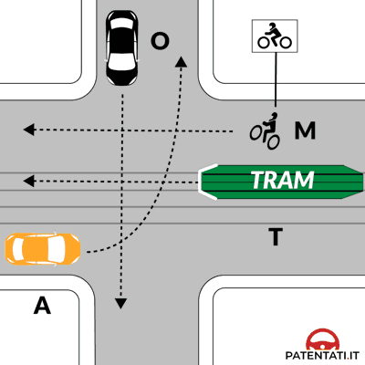

---

**2.** Nell’incrocio rappresentato in figura, tutti i veicoli devono usare prudenza nell’attraversarlo

- **الإجابة:** `VERO ✅ (صح)`
- 

---

**3.** Nella situazione rappresentata in figura il veicolo O deve attendere il transito del tram e che il veicolo A si porti al centro

- **الإجابة:** `VERO ✅ (صح)`
- 

---

**4.** Nella situazione rappresentata in figura il tram transita per primo

- **الإجابة:** `VERO ✅ (صح)`
- 

---

**5.** Nella situazione rappresentata in figura il veicolo M deve attendere il transito del veicolo O

- **الإجابة:** `VERO ✅ (صح)`
- 

---

**6.** Nella situazione rappresentata in figura il veicolo M attraversa l'incrocio insieme al tram

- **الإجابة:** `FALSO ❌ (خطأ)`
- 

---

**7.** Nella situazione rappresentata in figura il veicolo A nello svoltare a sinistra ha la destra libera

- **الإجابة:** `FALSO ❌ (خطأ)`
- 

---

**8.** Nella situazione rappresentata in figura il veicolo O deve attendere che passino il tram ed il veicolo M

- **الإجابة:** `FALSO ❌ (خطأ)`
- 

---

**9.** Nella situazione rappresentata in figura il veicolo O deve attendere che transitino tutti gli altri veicoli

- **الإجابة:** `FALSO ❌ (خطأ)`
- 

---

**10.** Nella situazione rappresentata in figura il veicolo A deve dare la precedenza al tram, ma non al veicolo M

- **الإجابة:** `FALSO ❌ (خطأ)`
- 

---

**11.** Nella situazione rappresentata in figura il veicolo O deve dare la precedenza al tram ed al veicolo M

- **الإجابة:** `FALSO ❌ (خطأ)`
- 

---

## 📌 Figura 608 (10 domande)

**12.** Nella situazione rappresentata in figura il veicolo B non deve dare la precedenza agli altri due veicoli

- **الإجابة:** `VERO ✅ (صح)`
- 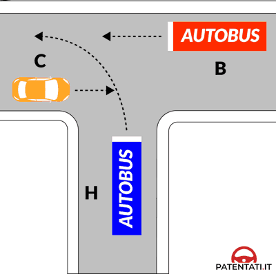

---

**13.** Nella situazione rappresentata in figura il veicolo H passa per secondo

- **الإجابة:** `VERO ✅ (صح)`
- 

---

**14.** Nella situazione rappresentata in figura il veicolo C deve disimpegnare l'incrocio per ultimo

- **الإجابة:** `VERO ✅ (صح)`
- 

---

**15.** Nella situazione rappresentata in figura il veicolo B passa per primo

- **الإجابة:** `VERO ✅ (صح)`
- 

---

**16.** Nella situazione rappresentata in figura il veicolo C deve dare la precedenza al veicolo H

- **الإجابة:** `VERO ✅ (صح)`
- 

---

**17.** Nella situazione rappresentata in figura il veicolo H passa per primo

- **الإجابة:** `FALSO ❌ (خطأ)`
- 

---

**18.** Nella situazione rappresentata in figura passano per primi e contemporaneamente i veicoli B e C

- **الإجابة:** `FALSO ❌ (خطأ)`
- 

---

**19.** Nella situazione rappresentata in figura il veicolo H deve impegnare l'incrocio dopo il passaggio dei veicoli B e C

- **الإجابة:** `FALSO ❌ (خطأ)`
- 

---

**20.** Nella situazione rappresentata in figura il veicolo H ha la precedenza sul veicolo C, in quanto è un autobus

- **الإجابة:** `FALSO ❌ (خطأ)`
- 

---

**21.** Nella situazione rappresentata in figura il veicolo C passa per primo

- **الإجابة:** `FALSO ❌ (خطأ)`
- 

---

## 📌 Figura 615 (12 domande)

**22.** Secondo le norme di precedenza nell'incrocio rappresentato in figura il veicolo R passa per primo

- **الإجابة:** `VERO ✅ (صح)`
- 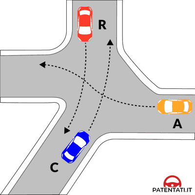

---

**23.** Secondo le norme di precedenza nell'incrocio rappresentato in figura il veicolo C deve passare per ultimo

- **الإجابة:** `VERO ✅ (صح)`
- 

---

**24.** Secondo le norme di precedenza nell'incrocio rappresentato in figura il veicolo A deve passare dopo il veicolo R

- **الإجابة:** `VERO ✅ (صح)`
- 

---

**25.** Secondo le norme di precedenza nell'incrocio rappresentato in figura il veicolo A passa prima del veicolo C

- **الإجابة:** `VERO ✅ (صح)`
- 

---

**26.** Secondo le norme di precedenza nell'incrocio rappresentato in figura il veicolo C deve passare dopo i veicoli R e A

- **الإجابة:** `VERO ✅ (صح)`
- 

---

**27.** Secondo le norme di precedenza nell'incrocio rappresentato in figura il veicolo A, se è della polizia con i dispositivi di allarme in funzione, passa per primo

- **الإجابة:** `VERO ✅ (صح)`
- 

---

**28.** Secondo le norme di precedenza nell'incrocio rappresentato in figura il veicolo A passa per primo

- **الإجابة:** `FALSO ❌ (خطأ)`
- 

---

**29.** Secondo le norme di precedenza nell'incrocio rappresentato in figura il veicolo A deve passare per ultimo

- **الإجابة:** `FALSO ❌ (خطأ)`
- 

---

**30.** Secondo le norme di precedenza nell'incrocio rappresentato in figura il veicolo R deve passare dopo il veicolo A

- **الإجابة:** `FALSO ❌ (خطأ)`
- 

---

**31.** Secondo le norme di precedenza nell'incrocio rappresentato in figura il veicolo R deve attraversare l'incrocio per secondo

- **الإجابة:** `FALSO ❌ (خطأ)`
- 

---

**32.** Secondo le norme di precedenza nell'incrocio rappresentato in figura il veicolo C passa per secondo

- **الإجابة:** `FALSO ❌ (خطأ)`
- 

---

**33.** Secondo le norme di precedenza nell'incrocio rappresentato in figura i veicoli C e R passano per primi e contemporaneamente

- **الإجابة:** `FALSO ❌ (خطأ)`
- 

---

## 📌 Figura 618 (9 domande)

**34.** Nella situazione rappresentata in figura il veicolo L attraversa l'incrocio per primo

- **الإجابة:** `VERO ✅ (صح)`
- 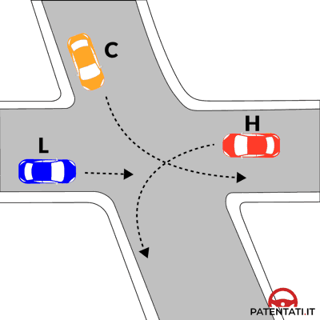

---

**35.** Nella situazione rappresentata in figura il veicolo H attraversa l'incrocio per ultimo

- **الإجابة:** `VERO ✅ (صح)`
- 

---

**36.** E' consentito attraversare l'incrocio in figura secondo l'ordine veicolo L, veicolo C, veicolo H

- **الإجابة:** `VERO ✅ (صح)`
- 

---

**37.** E' consentito attraversare l'incrocio in figura secondo l'ordine il veicolo C dopo il veicolo L, ma prima del veicolo H

- **الإجابة:** `VERO ✅ (صح)`
- 

---

**38.** E' consentito attraversare l'incrocio in figura secondo l'ordine il veicolo L contemporaneamente al veicolo C, poi il veicolo H

- **الإجابة:** `FALSO ❌ (خطأ)`
- 

---

**39.** E' consentito attraversare l'incrocio in figura secondo l'ordine il veicolo H, il veicolo C, il veicolo L

- **الإجابة:** `FALSO ❌ (خطأ)`
- 

---

**40.** E' consentito attraversare l'incrocio in figura secondo l'ordine il veicolo H, il veicolo L, il veicolo C

- **الإجابة:** `FALSO ❌ (خطأ)`
- 

---

**41.** E' consentito attraversare l'incrocio in figura secondo l'ordine il veicolo L, il veicolo H, il veicolo C

- **الإجابة:** `FALSO ❌ (خطأ)`
- 

---

**42.** E' consentito attraversare l'incrocio in figura secondo l'ordine il veicolo C, il veicolo H, il veicolo L

- **الإجابة:** `FALSO ❌ (خطأ)`
- 

---

## 📌 Figura 662 (10 domande)

**43.** Nell'incrocio rappresentato in figura, il veicolo E passa dopo il veicolo A e il veicolo B passa dopo il veicolo E

- **الإجابة:** `VERO ✅ (صح)`
- 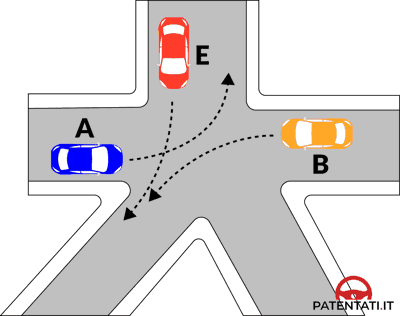

---

**44.** Nell'incrocio rappresentato in figura il veicolo A non deve dare la precedenza ad alcun veicolo

- **الإجابة:** `VERO ✅ (صح)`
- 

---

**45.** Nell'incrocio rappresentato in figura il veicolo E ha diritto di precedenza sul veicolo B

- **الإجابة:** `VERO ✅ (صح)`
- 

---

**46.** Nell'incrocio rappresentato in figura il veicolo E passa prima di quello B, ma dopo il veicolo A

- **الإجابة:** `VERO ✅ (صح)`
- 

---

**47.** Nell'incrocio rappresentato in figura il veicolo B deve passare per ultimo

- **الإجابة:** `VERO ✅ (صح)`
- 

---

**48.** Nell'incrocio rappresentato in figura il veicolo B non deve dare la precedenza ad alcun veicolo

- **الإجابة:** `FALSO ❌ (خطأ)`
- 

---

**49.** Nell'incrocio rappresentato in figura il veicolo A deve dare la precedenza al veicolo B

- **الإجابة:** `FALSO ❌ (خطأ)`
- 

---

**50.** Nell'incrocio rappresentato in figura il veicolo B non deve dare la precedenza al veicolo E

- **الإجابة:** `FALSO ❌ (خطأ)`
- 

---

**51.** Nell'incrocio rappresentato in figura i veicoli A e B passano contemporaneamente dopo il veicolo E

- **الإجابة:** `FALSO ❌ (خطأ)`
- 

---

**52.** Nell'incrocio rappresentato in figura i veicoli A e B passano contemporaneamente prima del veicolo E

- **الإجابة:** `FALSO ❌ (خطأ)`
- 

---

## 📌 Figura 659 (8 domande)

**53.** Nell'incrocio rappresentato in figura, il veicolo A passa dopo il veicolo R e il veicolo C passa dopo il veicolo A

- **الإجابة:** `VERO ✅ (صح)`
- 

---

**54.** Secondo le norme di precedenza nell'incrocio rappresentato in figura il veicolo A passa prima del veicolo C e dopo il veicolo R

- **الإجابة:** `VERO ✅ (صح)`
- 

---

**55.** Secondo le norme di precedenza nell'incrocio rappresentato in figura il veicolo R non deve dare la precedenza ad alcun veicolo

- **الإجابة:** `VERO ✅ (صح)`
- 

---

**56.** Secondo le norme di precedenza nell'incrocio rappresentato in figura i veicoli passano nell'ordine: R, A, C

- **الإجابة:** `VERO ✅ (صح)`
- 

---

**57.** Secondo le norme di precedenza nell'incrocio rappresentato in figura il veicolo C non deve dare la precedenza ad alcun veicolo

- **الإجابة:** `FALSO ❌ (خطأ)`
- 

---

**58.** Secondo le norme di precedenza nell'incrocio rappresentato in figura il veicolo A passa prima del veicolo R e dopo il veicolo C

- **الإجابة:** `FALSO ❌ (خطأ)`
- 

---

**59.** Secondo le norme di precedenza nell'incrocio rappresentato in figura i veicoli passano nell'ordine: R, C, A

- **الإجابة:** `FALSO ❌ (خطأ)`
- 

---

**60.** Secondo le norme di precedenza nell'incrocio rappresentato in figura il veicolo R passa per ultimo

- **الإجابة:** `FALSO ❌ (خطأ)`
- 

---

## 📌 Figura 640 (8 domande)

**61.** Secondo le norme di precedenza possono impegnare l'incrocio rappresentato in figura il veicolo D dopo l'attraversamento del veicolo R

- **الإجابة:** `VERO ✅ (صح)`
- 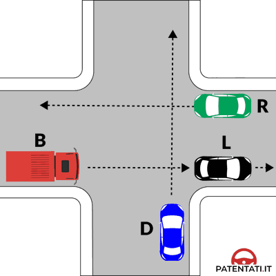

---

**62.** Secondo le norme di precedenza possono impegnare l'incrocio rappresentato in figura il veicolo B dopo l'attraversamento di tutti gli altri veicoli

- **الإجابة:** `VERO ✅ (صح)`
- 

---

**63.** Secondo le norme di precedenza possono impegnare l'incrocio rappresentato in figura il veicolo R senza dare la precedenza ad alcun veicolo

- **الإجابة:** `VERO ✅ (صح)`
- 

---

**64.** Secondo le norme di precedenza possono impegnare l'incrocio rappresentato in figura il veicolo B dopo l'attraversamento dei veicoli R e D

- **الإجابة:** `VERO ✅ (صح)`
- 

---

**65.** Secondo le norme di precedenza possono impegnare l'incrocio rappresentato in figura il veicolo B contemporaneamente al veicolo R e prima di quello D

- **الإجابة:** `FALSO ❌ (خطأ)`
- 

---

**66.** Secondo le norme di precedenza possono impegnare l'incrocio rappresentato in figura il veicolo D prima degli altri veicoli

- **الإجابة:** `FALSO ❌ (خطأ)`
- 

---

**67.** Secondo le norme di precedenza possono impegnare l'incrocio rappresentato in figura il veicolo R dopo l'attraversamento dei veicoli B e D

- **الإجابة:** `FALSO ❌ (خطأ)`
- 

---

**68.** Secondo le norme di precedenza possono impegnare l'incrocio rappresentato in figura il veicolo B prima degli altri veicoli

- **الإجابة:** `FALSO ❌ (خطأ)`
- 

---

## 📌 Figura 632 (13 domande)

**69.** Secondo le norme di precedenza nell'incrocio rappresentato in figura i veicoli passano nel seguente ordine: D, P, B, N

- **الإجابة:** `VERO ✅ (صح)`
- 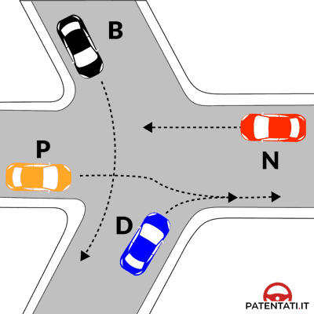

---

**70.** Secondo le norme di precedenza nell'incrocio rappresentato in figura il veicolo N deve passare per ultimo

- **الإجابة:** `VERO ✅ (صح)`
- 

---

**71.** Secondo le norme di precedenza nell'incrocio rappresentato in figura il veicolo B deve passare dopo il veicolo P

- **الإجابة:** `VERO ✅ (صح)`
- 

---

**72.** Secondo le norme di precedenza nell'incrocio rappresentato in figura il veicolo D passa prima degli altri veicoli

- **الإجابة:** `VERO ✅ (صح)`
- 

---

**73.** Secondo le norme di precedenza nell'incrocio rappresentato in figura il veicolo B passa prima del veicolo N

- **الإجابة:** `VERO ✅ (صح)`
- 

---

**74.** Secondo le norme di precedenza nell'incrocio rappresentato in figura il veicolo N passa dopo il veicolo B

- **الإجابة:** `VERO ✅ (صح)`
- 

---

**75.** Secondo le norme di precedenza nell'incrocio rappresentato in figura il veicolo P può passare prima del veicolo B

- **الإجابة:** `VERO ✅ (صح)`
- 

---

**76.** Secondo le norme di precedenza nell'incrocio rappresentato in figura i veicoli passano nel seguente ordine: D, B, N, P

- **الإجابة:** `FALSO ❌ (خطأ)`
- 

---

**77.** Secondo le norme di precedenza nell'incrocio rappresentato in figura i veicoli passano nel seguente ordine: P, B, N, D

- **الإجابة:** `FALSO ❌ (خطأ)`
- 

---

**78.** Secondo le norme di precedenza nell'incrocio rappresentato in figura i veicoli D e N passano contemporaneamente

- **الإجابة:** `FALSO ❌ (خطأ)`
- 

---

**79.** Secondo le norme di precedenza nell'incrocio rappresentato in figura i veicoli D e B passano contemporaneamente

- **الإجابة:** `FALSO ❌ (خطأ)`
- 

---

**80.** Secondo le norme di precedenza nell'incrocio rappresentato in figura il veicolo P passa prima del veicolo B, ma dopo quello N

- **الإجابة:** `FALSO ❌ (خطأ)`
- 

---

**81.** Secondo le norme di precedenza nell'incrocio rappresentato in figura passano per primi indifferentemente i veicoli B e D

- **الإجابة:** `FALSO ❌ (خطأ)`
- 

---

## 📌 Figura 646 (11 domande)

**82.** Nell'incrocio rappresentato in figura i veicoli passano nel seguente ordine: D, C, A, H.

- **الإجابة:** `VERO ✅ (صح)`
- 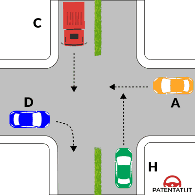

---

**83.** Nell'incrocio rappresentato in figura il veicolo A ha la destra occupata

- **الإجابة:** `VERO ✅ (صح)`
- 

---

**84.** Nell'incrocio rappresentato in figura il veicolo D ha la precedenza sul veicolo C

- **الإجابة:** `VERO ✅ (صح)`
- 

---

**85.** Nell'incrocio rappresentato in figura il veicolo D è il primo ad impegnare l'incrocio

- **الإجابة:** `VERO ✅ (صح)`
- 

---

**86.** Nell'incrocio rappresentato in figura il veicolo H è l'ultimo ad attraversare l'incrocio

- **الإجابة:** `VERO ✅ (صح)`
- 

---

**87.** Nell'incrocio rappresentato in figura il veicolo D deve dare la precedenza a quello C

- **الإجابة:** `FALSO ❌ (خطأ)`
- 

---

**88.** Nell'incrocio rappresentato in figura il veicolo C attraversa per primo

- **الإجابة:** `FALSO ❌ (خطأ)`
- 

---

**89.** Nell'incrocio rappresentato in figura il veicolo A attraversa l'incrocio prima del veicolo C

- **الإجابة:** `FALSO ❌ (خطأ)`
- 

---

**90.** Nell'incrocio rappresentato in figura i veicoli passano nel seguente ordine: C, A, H, D

- **الإجابة:** `FALSO ❌ (خطأ)`
- 

---

**91.** Nell'incrocio rappresentato in figura i veicoli passano nel seguente ordine: H, A, C, D

- **الإجابة:** `FALSO ❌ (خطأ)`
- 

---

**92.** Nell'incrocio rappresentato in figura i veicoli C e H passano per primi

- **الإجابة:** `FALSO ❌ (خطأ)`
- 

---

## 📌 Figura 637 (14 domande)

**93.** Nell'attraversare l'incrocio in figura il veicolo L passa per primo

- **الإجابة:** `VERO ✅ (صح)`
- 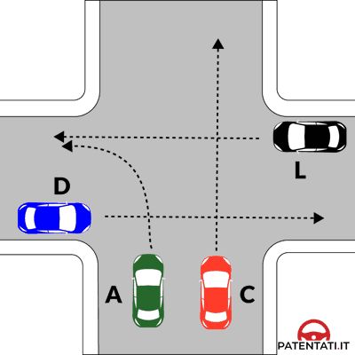

---

**94.** Nell'attraversare l'incrocio in figura il veicolo D è l'ultimo a passare

- **الإجابة:** `VERO ✅ (صح)`
- 

---

**95.** Nell'attraversare l'incrocio in figura i veicoli C e A passano contemporaneamente dopo il veicolo L

- **الإجابة:** `VERO ✅ (صح)`
- 

---

**96.** Nell'attraversare l'incrocio in figura il veicolo A ha la precedenza sul veicolo D

- **الإجابة:** `VERO ✅ (صح)`
- 

---

**97.** Nell'incrocio rappresentato nella figura il conducente del veicolo A deve dare la precedenza al veicolo L

- **الإجابة:** `VERO ✅ (صح)`
- 

---

**98.** Nell'incrocio rappresentato nella figura il conducente del veicolo A può attraversare l'incrocio insieme al veicolo C, dopo il transito del veicolo L

- **الإجابة:** `VERO ✅ (صح)`
- 

---

**99.** Nell'incrocio rappresentato nella figura il conducente del veicolo A ha la precedenza rispetto al veicolo D

- **الإجابة:** `VERO ✅ (صح)`
- 

---

**100.** Nell'attraversare l'incrocio in figura passa per primo il veicolo più veloce

- **الإجابة:** `FALSO ❌ (خطأ)`
- 

---

**101.** Nell'attraversare l'incrocio in figura il veicolo A passa per ultimo

- **الإجابة:** `FALSO ❌ (خطأ)`
- 

---

**102.** Nell'attraversare l'incrocio in figura i veicoli passano nel seguente ordine: C, A, D, L

- **الإجابة:** `FALSO ❌ (خطأ)`
- 

---

**103.** Nell'attraversare l'incrocio in figura i veicoli passano nel seguente ordine: C, L, A, D

- **الإجابة:** `FALSO ❌ (خطأ)`
- 

---

**104.** Nell'attraversare l'incrocio in figura i veicoli D e L passano contemporaneamente prima del veicolo A

- **الإجابة:** `FALSO ❌ (خطأ)`
- 

---

**105.** Nell'incrocio rappresentato nella figura il conducente del veicolo A deve dare la precedenza a tutti i veicoli

- **الإجابة:** `FALSO ❌ (خطأ)`
- 

---

**106.** Nell'incrocio rappresentato nella figura il conducente del veicolo A passa per ultimo

- **الإجابة:** `FALSO ❌ (خطأ)`
- 

---

## 📌 Figura 643 (13 domande)

**107.** Giungendo all'incrocio rappresentato in figura i veicoli passano nel seguente ordine: H, D, B, L

- **الإجابة:** `VERO ✅ (صح)`
- 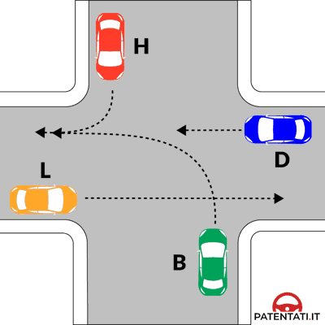

---

**108.** Giungendo all'incrocio rappresentato in figura il veicolo H passa per primo

- **الإجابة:** `VERO ✅ (صح)`
- 

---

**109.** Giungendo all'incrocio rappresentato in figura il veicolo B passa prima del veicolo L

- **الإجابة:** `VERO ✅ (صح)`
- 

---

**110.** Giungendo all'incrocio rappresentato in figura il veicolo D deve dare la precedenza al veicolo H

- **الإجابة:** `VERO ✅ (صح)`
- 

---

**111.** Giungendo all'incrocio rappresentato in figura il veicolo L deve dare la precedenza al veicolo B

- **الإجابة:** `VERO ✅ (صح)`
- 

---

**112.** Giungendo all'incrocio rappresentato in figura il veicolo L deve passare per ultimo

- **الإجابة:** `VERO ✅ (صح)`
- 

---

**113.** Giungendo all'incrocio rappresentato in figura il veicolo D passa prima del veicolo B

- **الإجابة:** `VERO ✅ (صح)`
- 

---

**114.** Giungendo all'incrocio rappresentato in figura il veicolo B deve attendere il transito degli altri tre veicoli

- **الإجابة:** `FALSO ❌ (خطأ)`
- 

---

**115.** Giungendo all'incrocio rappresentato in figura il veicolo H deve attendere che siano transitati i veicoli D e B

- **الإجابة:** `FALSO ❌ (خطأ)`
- 

---

**116.** Giungendo all'incrocio rappresentato in figura i veicoli L e D passano contemporaneamente

- **الإجابة:** `FALSO ❌ (خطأ)`
- 

---

**117.** Giungendo all'incrocio rappresentato in figura i veicoli passano nel seguente ordine: H, D, L, B

- **الإجابة:** `FALSO ❌ (خطأ)`
- 

---

**118.** Giungendo all'incrocio rappresentato in figura il veicolo B, dato che svolta a sinistra, non ha diritto di precedenza su alcun veicolo

- **الإجابة:** `FALSO ❌ (خطأ)`
- 

---

**119.** Giungendo all'incrocio rappresentato in figura i veicoli L e D hanno la precedenza perché non effettuano svolte

- **الإجابة:** `FALSO ❌ (خطأ)`
- 

---

## 📌 Figura 638 (19 domande)

**120.** Secondo le norme di precedenza nell'incrocio rappresentato in figura il veicolo N passa dopo il veicolo R

- **الإجابة:** `VERO ✅ (صح)`
- 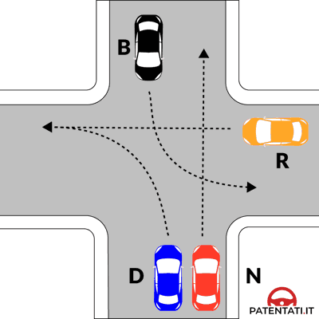

---

**121.** Secondo le norme di precedenza nell'incrocio rappresentato in figura il veicolo B passa dopo il veicolo N

- **الإجابة:** `VERO ✅ (صح)`
- 

---

**122.** Secondo le norme di precedenza nell'incrocio rappresentato in figura il veicolo D passa dopo il veicolo R

- **الإجابة:** `VERO ✅ (صح)`
- 

---

**123.** Secondo le norme di precedenza nell'incrocio rappresentato in figura il veicolo R passa dopo che il veicolo B si è spostato al centro dell'incrocio

- **الإجابة:** `VERO ✅ (صح)`
- 

---

**124.** Secondo le norme di precedenza nell'incrocio rappresentato in figura i veicoli D e N passano contemporaneamente dopo che è passato il veicolo R

- **الإجابة:** `VERO ✅ (صح)`
- 

---

**125.** Secondo le norme di precedenza nell'incrocio rappresentato in figura il veicolo B nell'impegnare l'incrocio deve fermarsi al centro di esso

- **الإجابة:** `VERO ✅ (صح)`
- 

---

**126.** Nell'incrocio rappresentato nella figura il conducente del veicolo B deve dare la precedenza al veicolo N

- **الإجابة:** `VERO ✅ (صح)`
- 

---

**127.** Nell'incrocio rappresentato nella figura il conducente del veicolo B impegna l'incrocio prima del veicolo R

- **الإجابة:** `VERO ✅ (صح)`
- 

---

**128.** Nell'incrocio rappresentato nella figura il conducente del veicolo B può concludere la manovra di svolta a sinistra dopo il transito del veicolo N

- **الإجابة:** `VERO ✅ (صح)`
- 

---

**129.** Nell'incrocio rappresentato nella figura il conducente del veicolo B dopo essersi portato al centro dell'incrocio, deve attendere il transito del veicolo N

- **الإجابة:** `VERO ✅ (صح)`
- 

---

**130.** Secondo le norme di precedenza nell'incrocio rappresentato in figura il veicolo R impegna l'incrocio e si ferma al centro di esso

- **الإجابة:** `FALSO ❌ (خطأ)`
- 

---

**131.** Secondo le norme di precedenza nell'incrocio rappresentato in figura il veicolo N passa per primo

- **الإجابة:** `FALSO ❌ (خطأ)`
- 

---

**132.** Secondo le norme di precedenza nell'incrocio rappresentato in figura il veicolo D passa per primo

- **الإجابة:** `FALSO ❌ (خطأ)`
- 

---

**133.** Secondo le norme di precedenza nell'incrocio rappresentato in figura il veicolo D deve dare la precedenza al veicolo B

- **الإجابة:** `FALSO ❌ (خطأ)`
- 

---

**134.** Secondo le norme di precedenza nell'incrocio rappresentato in figura il veicolo B deve dare la precedenza al veicolo D

- **الإجابة:** `FALSO ❌ (خطأ)`
- 

---

**135.** Secondo le norme di precedenza nell'incrocio rappresentato in figura il veicolo R passa per ultimo

- **الإجابة:** `FALSO ❌ (خطأ)`
- 

---

**136.** Nell'incrocio rappresentato nella figura il conducente del veicolo B ha la destra libera, durante tutta la manovra di svolta

- **الإجابة:** `FALSO ❌ (خطأ)`
- 

---

**137.** Nell'incrocio rappresentato nella figura il conducente del veicolo B deve impegnare per ultimo l'incrocio perché svolta a sinistra

- **الإجابة:** `FALSO ❌ (خطأ)`
- 

---

**138.** Nell'incrocio rappresentato nella figura il conducente del veicolo B deve dare la precedenza al veicolo R che prosegue diritto

- **الإجابة:** `FALSO ❌ (خطأ)`
- 

---

## 📌 Figura 667 (6 domande)

**139.** Nell'incrocio rappresentato in figura i veicoli passano nel seguente ordine: C, A, P

- **الإجابة:** `VERO ✅ (صح)`
- 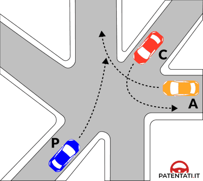

---

**140.** Nell'incrocio rappresentato in figura il veicolo A passa dopo il veicolo C

- **الإجابة:** `VERO ✅ (صح)`
- 

---

**141.** Nell'incrocio rappresentato in figura il veicolo P passa per ultimo

- **الإجابة:** `VERO ✅ (صح)`
- 

---

**142.** Nell'incrocio rappresentato in figura i veicoli passano nel seguente ordine: P, C, A

- **الإجابة:** `FALSO ❌ (خطأ)`
- 

---

**143.** Nell'incrocio rappresentato in figura il veicolo P passa prima del veicolo C

- **الإجابة:** `FALSO ❌ (خطأ)`
- 

---

**144.** Nell'incrocio rappresentato in figura il veicolo P passa per primo perché ha la destra libera

- **الإجابة:** `FALSO ❌ (خطأ)`
- 

---

## 📌 Figura 668 (6 domande)

**145.** Nell'incrocio rappresentato nella figura i veicoli passano nel seguente ordine: S, N, C

- **الإجابة:** `VERO ✅ (صح)`
- 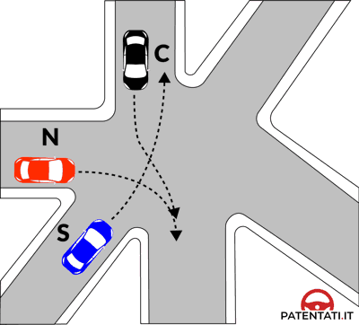

---

**146.** Nell'incrocio rappresentato nella figura il veicolo C transita per ultimo

- **الإجابة:** `VERO ✅ (صح)`
- 

---

**147.** Nell'incrocio rappresentato nella figura il veicolo N transita dopo il veicolo S e prima del veicolo C

- **الإجابة:** `VERO ✅ (صح)`
- 

---

**148.** Nell'incrocio rappresentato nella figura i veicoli passano nel seguente ordine: C, N, S

- **الإجابة:** `FALSO ❌ (خطأ)`
- 

---

**149.** Nell'incrocio rappresentato nella figura il veicolo N transita dopo il veicolo C e dopo del veicolo S

- **الإجابة:** `FALSO ❌ (خطأ)`
- 

---

**150.** Nell'incrocio rappresentato nella figura il veicolo C transita per primo

- **الإجابة:** `FALSO ❌ (خطأ)`
- 

---

## 📌 Figura 610 (2 domande)

**151.** Nell'incrocio rappresentato nella figura il veicolo T transita per primo

- **الإجابة:** `VERO ✅ (صح)`
- 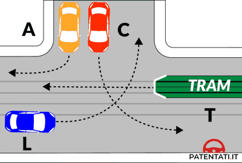

---

**152.** Nell'incrocio rappresentato nella figura i veicoli passano nel seguente ordine: T, L ed A, infine C

- **الإجابة:** `VERO ✅ (صح)`
- 

---

## 📌 Figura 669 (12 domande)

**153.** Dovendo attraversare l'incrocio rappresentato in figura i veicoli devono transitare nel seguente ordine: C, A, L, R, E

- **الإجابة:** `VERO ✅ (صح)`
- 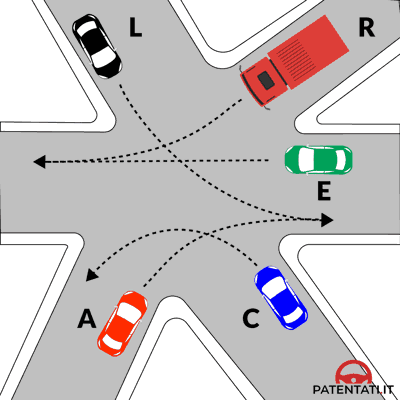

---

**154.** Dovendo attraversare l'incrocio rappresentato in figura il veicolo C transita per primo

- **الإجابة:** `VERO ✅ (صح)`
- 

---

**155.** Dovendo attraversare l'incrocio rappresentato in figura il veicolo A transita subito dopo il veicolo C

- **الإجابة:** `VERO ✅ (صح)`
- 

---

**156.** Dovendo attraversare l'incrocio rappresentato in figura il veicolo E deve dare la precedenza ai veicoli R e L

- **الإجابة:** `VERO ✅ (صح)`
- 

---

**157.** Dovendo attraversare l'incrocio rappresentato in figura il veicolo A transita prima del veicolo L

- **الإجابة:** `VERO ✅ (صح)`
- 

---

**158.** Dovendo attraversare l'incrocio rappresentato in figura il veicolo L transita prima del veicolo R

- **الإجابة:** `VERO ✅ (صح)`
- 

---

**159.** Dovendo attraversare l'incrocio rappresentato in figura il veicolo L transita dopo il veicolo A

- **الإجابة:** `VERO ✅ (صح)`
- 

---

**160.** Dovendo attraversare l'incrocio rappresentato in figura il veicolo E deve dare la precedenza al veicolo A

- **الإجابة:** `FALSO ❌ (خطأ)`
- 

---

**161.** Dovendo attraversare l'incrocio rappresentato in figura i veicoli devono transitare nel seguente ordine: E, C, A, L, R

- **الإجابة:** `FALSO ❌ (خطأ)`
- 

---

**162.** Dovendo attraversare l'incrocio rappresentato in figura il veicolo A deve attendere il passaggio del veicolo E

- **الإجابة:** `FALSO ❌ (خطأ)`
- 

---

**163.** Dovendo attraversare l'incrocio rappresentato in figura qualunque veicolo può impegnare l'incrocio e fermarsi al centro di esso

- **الإجابة:** `FALSO ❌ (خطأ)`
- 

---

**164.** Dovendo attraversare l'incrocio rappresentato in figura i veicoli C e R transitano contemporaneamente dopo il passaggio del veicolo A

- **الإجابة:** `FALSO ❌ (خطأ)`
- 

---

## 📌 Figura 665 (11 domande)

**165.** Nell'incrocio rappresentato in figura i veicoli disimpegnano l'incrocio nel seguente ordine: A, E, V, H, C

- **الإجابة:** `VERO ✅ (صح)`
- 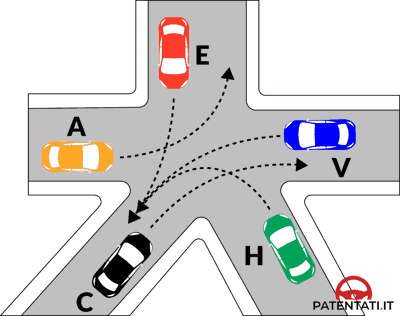

---

**166.** Nell'incrocio rappresentato in figura il veicolo V ha la precedenza sul veicolo H

- **الإجابة:** `VERO ✅ (صح)`
- 

---

**167.** Nell'incrocio rappresentato in figura il veicolo C deve dare la precedenza al veicolo H

- **الإجابة:** `VERO ✅ (صح)`
- 

---

**168.** Nell'incrocio rappresentato in figura il veicolo E passa prima del veicolo H

- **الإجابة:** `VERO ✅ (صح)`
- 

---

**169.** Nell'incrocio rappresentato in figura il veicolo H passa dopo i veicoli A, E, V

- **الإجابة:** `VERO ✅ (صح)`
- 

---

**170.** Nell'incrocio rappresentato in figura il veicolo A passa per primo

- **الإجابة:** `VERO ✅ (صح)`
- 

---

**171.** Nell'incrocio rappresentato in figura i veicoli disimpegnano l'incrocio nel seguente ordine: A, H, C, E, V

- **الإجابة:** `FALSO ❌ (خطأ)`
- 

---

**172.** Nell'incrocio rappresentato in figura i veicoli disimpegnano l'incrocio nel seguente ordine: A, E, C, V, H

- **الإجابة:** `FALSO ❌ (خطأ)`
- 

---

**173.** Nell'incrocio rappresentato in figura il veicolo V deve attendere che siano transitati i veicoli A, E, H

- **الإجابة:** `FALSO ❌ (خطأ)`
- 

---

**174.** Nell'incrocio rappresentato in figura i veicoli A, V e C passano contemporaneamente

- **الإجابة:** `FALSO ❌ (خطأ)`
- 

---

**175.** Nell'incrocio rappresentato in figura il veicolo V passa dopo i veicoli C e H

- **الإجابة:** `FALSO ❌ (خطأ)`
- 

---

## 📌 Figura 647 (12 domande)

**176.** Secondo le norme di precedenza nell'incrocio rappresentato in figura i veicoli L e H passano contemporaneamente per primi

- **الإجابة:** `VERO ✅ (صح)`
- 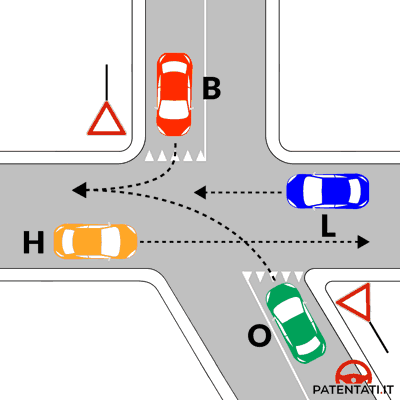

---

**177.** Secondo le norme di precedenza nell'incrocio rappresentato in figura i veicoli passano nel seguente ordine: L e H, B, O

- **الإجابة:** `VERO ✅ (صح)`
- 

---

**178.** Secondo le norme di precedenza, nell'incrocio rappresentato in figura, il veicolo B transita dopo i veicoli L e H

- **الإجابة:** `VERO ✅ (صح)`
- 

---

**179.** Secondo le norme di precedenza nell'incrocio rappresentato in figura il veicolo O transita per ultimo

- **الإجابة:** `VERO ✅ (صح)`
- 

---

**180.** Secondo le norme di precedenza nell'incrocio rappresentato in figura il veicolo B transita prima del veicolo O e dopo i veicoli L e H

- **الإجابة:** `VERO ✅ (صح)`
- 

---

**181.** Secondo le norme di precedenza nell'incrocio rappresentato in figura il veicolo O deve dare la precedenza a tutti gli altri veicoli

- **الإجابة:** `VERO ✅ (صح)`
- 

---

**182.** Secondo le norme di precedenza nell'incrocio rappresentato in figura il veicolo O transita prima del veicolo H, ma dopo il veicolo L

- **الإجابة:** `FALSO ❌ (خطأ)`
- 

---

**183.** Secondo le norme di precedenza nell'incrocio rappresentato in figura il veicolo O transita prima del veicolo H, ma dopo il veicolo B

- **الإجابة:** `FALSO ❌ (خطأ)`
- 

---

**184.** Secondo le norme di precedenza nell'incrocio rappresentato in figura il veicolo B transita per primo

- **الإجابة:** `FALSO ❌ (خطأ)`
- 

---

**185.** Secondo le norme di precedenza nell'incrocio rappresentato in figura il veicolo H transita dopo il veicolo O

- **الإجابة:** `FALSO ❌ (خطأ)`
- 

---

**186.** Secondo le norme di precedenza nell'incrocio rappresentato in figura i veicoli passano nel seguente ordine: B, L, O, H

- **الإجابة:** `FALSO ❌ (خطأ)`
- 

---

**187.** Secondo le norme di precedenza nell'incrocio rappresentato in figura il veicolo O impegna l'incrocio per primo e si ferma al centro di esso

- **الإجابة:** `FALSO ❌ (خطأ)`
- 

---

## 📌 Figura 655 (11 domande)

**188.** Secondo le norme di precedenza nell'incrocio rappresentato in figura il veicolo S transita prima del veicolo R

- **الإجابة:** `VERO ✅ (صح)`
- 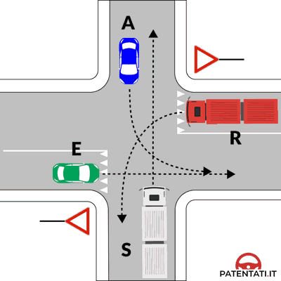

---

**189.** Secondo le norme di precedenza nell'incrocio rappresentato in figura il veicolo S transita prima di tutti gli altri veicoli

- **الإجابة:** `VERO ✅ (صح)`
- 

---

**190.** Secondo le norme di precedenza nell'incrocio rappresentato in figura i veicoli transitano nell'ordine: S, A, E, R

- **الإجابة:** `VERO ✅ (صح)`
- 

---

**191.** Secondo le norme di precedenza nell'incrocio rappresentato in figura il veicolo A deve dare la precedenza al veicolo S

- **الإجابة:** `VERO ✅ (صح)`
- 

---

**192.** Secondo le norme di precedenza nell'incrocio rappresentato in figura il veicolo R transita per ultimo

- **الإجابة:** `VERO ✅ (صح)`
- 

---

**193.** Secondo le norme di precedenza nell'incrocio rappresentato in figura il veicolo E deve attendere il transito del veicolo R

- **الإجابة:** `FALSO ❌ (خطأ)`
- 

---

**194.** Secondo le norme di precedenza nell'incrocio rappresentato in figura il veicolo R impegna per primo l'incrocio e si ferma al centro di esso

- **الإجابة:** `FALSO ❌ (خطأ)`
- 

---

**195.** Secondo le norme di precedenza nell'incrocio rappresentato in figura il veicolo A deve transitare dopo il veicolo E

- **الإجابة:** `FALSO ❌ (خطأ)`
- 

---

**196.** Secondo le norme di precedenza nell'incrocio rappresentato in figura il veicolo A deve transitare per ultimo

- **الإجابة:** `FALSO ❌ (خطأ)`
- 

---

**197.** Secondo le norme di precedenza nell'incrocio rappresentato in figura i veicoli transitano nell'ordine: E, R, S, A

- **الإجابة:** `FALSO ❌ (خطأ)`
- 

---

**198.** Secondo le norme di precedenza nell'incrocio rappresentato in figura il veicolo A deve attendere che siano transitati i veicoli S ed E

- **الإجابة:** `FALSO ❌ (خطأ)`
- 

---

## 📌 Figura 654 (12 domande)

**199.** Nella situazione rappresentata in figura il veicolo A deve attendere il transito dei veicoli C ed R

- **الإجابة:** `VERO ✅ (صح)`
- 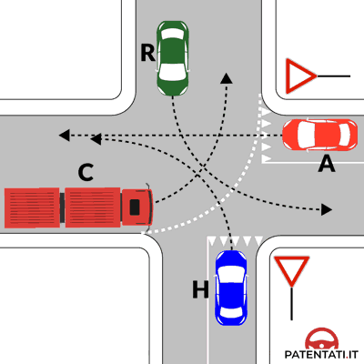

---

**200.** Nella situazione rappresentata in figura i veicoli transitano nell'ordine: C, R, A, H

- **الإجابة:** `VERO ✅ (صح)`
- 

---

**201.** Nella situazione rappresentata in figura il veicolo H deve attendere il transito dei veicoli C, R, A

- **الإجابة:** `VERO ✅ (صح)`
- 

---

**202.** Nella situazione rappresentata in figura il veicolo H deve transitare per ultimo

- **الإجابة:** `VERO ✅ (صح)`
- 

---

**203.** Nella situazione rappresentata in figura il veicolo R deve attendere il transito del veicolo C

- **الإجابة:** `VERO ✅ (صح)`
- 

---

**204.** Nella situazione rappresentata in figura il veicolo C transita per primo

- **الإجابة:** `VERO ✅ (صح)`
- 

---

**205.** Nella situazione rappresentata in figura i veicoli transitano nell'ordine: C, R, H, A

- **الإجابة:** `FALSO ❌ (خطأ)`
- 

---

**206.** Nella situazione rappresentata in figura il veicolo C deve attendere il transito del veicolo H

- **الإجابة:** `FALSO ❌ (خطأ)`
- 

---

**207.** Nella situazione rappresentata in figura il veicolo A deve attendere il transito del veicolo H

- **الإجابة:** `FALSO ❌ (خطأ)`
- 

---

**208.** Nella situazione rappresentata in figura il veicolo R deve attendere il transito dei veicoli H ed A

- **الإجابة:** `FALSO ❌ (خطأ)`
- 

---

**209.** Nella situazione rappresentata in figura il veicolo C deve attendere il transito dei veicoli R, A, H

- **الإجابة:** `FALSO ❌ (خطأ)`
- 

---

**210.** Nella situazione rappresentata in figura il veicolo R deve attendere il transito del veicolo H

- **الإجابة:** `FALSO ❌ (خطأ)`
- 

---

## 📌 Figura 613 (10 domande)

**211.** Secondo le norme di precedenza nell'incrocio rappresentato in figura il veicolo T transita per primo

- **الإجابة:** `VERO ✅ (صح)`
- 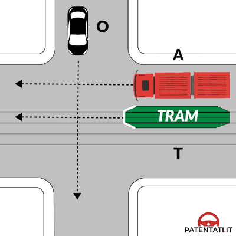

---

**212.** Secondo le norme di precedenza nell'incrocio rappresentato in figura il veicolo A deve attendere il transito del veicolo O

- **الإجابة:** `VERO ✅ (صح)`
- 

---

**213.** Secondo le norme di precedenza nell'incrocio rappresentato in figura il veicolo O deve attendere il transito del veicolo T

- **الإجابة:** `VERO ✅ (صح)`
- 

---

**214.** Secondo le norme di precedenza nell'incrocio rappresentato in figura i veicoli transitano nell'ordine: T, O, A

- **الإجابة:** `VERO ✅ (صح)`
- 

---

**215.** Secondo le norme di precedenza nell'incrocio rappresentato in figura il veicolo O transita prima del veicolo A

- **الإجابة:** `VERO ✅ (صح)`
- 

---

**216.** Secondo le norme di precedenza nell'incrocio rappresentato in figura il veicolo T deve attendere il transito del veicolo O

- **الإجابة:** `FALSO ❌ (خطأ)`
- 

---

**217.** Secondo le norme di precedenza nell'incrocio rappresentato in figura il veicolo O deve attendere il transito del veicolo A

- **الإجابة:** `FALSO ❌ (خطأ)`
- 

---

**218.** Secondo le norme di precedenza nell'incrocio rappresentato in figura il veicolo T deve attendere il transito del veicolo A

- **الإجابة:** `FALSO ❌ (خطأ)`
- 

---

**219.** Secondo le norme di precedenza nell'incrocio rappresentato in figura i veicoli transitano nell'ordine: T, A, O

- **الإجابة:** `FALSO ❌ (خطأ)`
- 

---

**220.** Secondo le norme di precedenza nell'incrocio rappresentato in figura i veicoli A e T transitano contemporaneamente

- **الإجابة:** `FALSO ❌ (خطأ)`
- 

---

## 📌 Figura 648 (18 domande)

**221.** Nella situazione rappresentata in figura il veicolo B deve dare la precedenza a tutti gli altri veicoli

- **الإجابة:** `VERO ✅ (صح)`
- 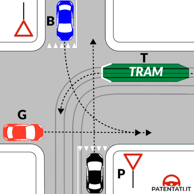

---

**222.** Nella situazione rappresentata in figura il veicolo T passa per primo

- **الإجابة:** `VERO ✅ (صح)`
- 

---

**223.** Nella situazione rappresentata in figura il veicolo B transita per ultimo

- **الإجابة:** `VERO ✅ (صح)`
- 

---

**224.** Nella situazione rappresentata in figura il veicolo P deve dare la precedenza ai veicoli T e G

- **الإجابة:** `VERO ✅ (صح)`
- 

---

**225.** Nella situazione rappresentata in figura i veicoli transitano nell'ordine: T, G, P, B

- **الإجابة:** `VERO ✅ (صح)`
- 

---

**226.** Nella situazione rappresentata in figura il veicolo G deve attendere il transito del veicolo T

- **الإجابة:** `VERO ✅ (صح)`
- 

---

**227.** Nell'incrocio rappresentato nella figura il conducente del veicolo P deve dare la precedenza ai veicoli T e G

- **الإجابة:** `VERO ✅ (صح)`
- 

---

**228.** Nell'incrocio rappresentato nella figura il conducente del veicolo P ha la precedenza sul veicolo B

- **الإجابة:** `VERO ✅ (صح)`
- 

---

**229.** Nell'incrocio rappresentato nella figura il conducente del veicolo P transita dopo il tram e il veicolo G, ma prima del veicolo B

- **الإجابة:** `VERO ✅ (صح)`
- 

---

**230.** Nella situazione rappresentata in figura il veicolo T deve attendere il transito del veicolo G

- **الإجابة:** `FALSO ❌ (خطأ)`
- 

---

**231.** Nella situazione rappresentata in figura il veicolo G transita per primo

- **الإجابة:** `FALSO ❌ (خطأ)`
- 

---

**232.** Nella situazione rappresentata in figura il veicolo B impegna per primo l'incrocio e deve fermarsi al centro di esso

- **الإجابة:** `FALSO ❌ (خطأ)`
- 

---

**233.** Nella situazione rappresentata in figura il veicolo T impegna per primo l'incrocio, ma deve fermarsi al centro di esso

- **الإجابة:** `FALSO ❌ (خطأ)`
- 

---

**234.** Nella situazione rappresentata in figura i veicoli transitano nell'ordine: T, P, G, B

- **الإجابة:** `FALSO ❌ (خطأ)`
- 

---

**235.** Nella situazione rappresentata in figura il veicolo P transita subito dopo il veicolo T

- **الإجابة:** `FALSO ❌ (خطأ)`
- 

---

**236.** Nell'incrocio rappresentato nella figura il conducente del veicolo P transita contemporaneamente al veicolo B, ma dopo il tram

- **الإجابة:** `FALSO ❌ (خطأ)`
- 

---

**237.** Nell'incrocio rappresentato nella figura il conducente del veicolo P ha la precedenza su tutti i veicoli

- **الإجابة:** `FALSO ❌ (خطأ)`
- 

---

**238.** Nell'incrocio rappresentato nella figura il conducente del veicolo P deve dare la precedenza solo al veicolo proveniente dalla sua destra

- **الإجابة:** `FALSO ❌ (خطأ)`
- 

---

## 📌 Figura 650 (18 domande)

**239.** Secondo le norme di precedenza nell'incrocio rappresentato in figura il veicolo N deve attendere il transito del veicolo E

- **الإجابة:** `VERO ✅ (صح)`
- 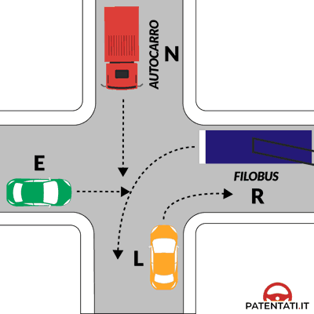

---

**240.** Secondo le norme di precedenza nell'incrocio rappresentato in figura il veicolo E deve attendere il transito del veicolo L

- **الإجابة:** `VERO ✅ (صح)`
- 

---

**241.** Secondo le norme di precedenza nell'incrocio rappresentato in figura il veicolo R deve attendere il transito dei veicoli E ed N

- **الإجابة:** `VERO ✅ (صح)`
- 

---

**242.** Secondo le norme di precedenza nell'incrocio rappresentato in figura i veicoli transitano nell'ordine: L, E, N, R

- **الإجابة:** `VERO ✅ (صح)`
- 

---

**243.** Nell'incrocio rappresentato nella figura il conducente del veicolo E deve dare la precedenza al veicolo L

- **الإجابة:** `VERO ✅ (صح)`
- 

---

**244.** Nell'incrocio rappresentato nella figura il conducente del veicolo E deve dare la precedenza al veicolo proveniente dalla sua destra

- **الإجابة:** `VERO ✅ (صح)`
- 

---

**245.** Nell'incrocio rappresentato nella figura il conducente del veicolo E non ha l'obbligo di dare la precedenza al filobus

- **الإجابة:** `VERO ✅ (صح)`
- 

---

**246.** Nell'incrocio rappresentato nella figura il conducente del veicolo E passa prima dell'autocarro N, dopo il transito del veicolo L

- **الإجابة:** `VERO ✅ (صح)`
- 

---

**247.** Secondo le norme di precedenza nell'incrocio rappresentato in figura il veicolo R (filobus) ha la precedenza sugli altri veicoli

- **الإجابة:** `FALSO ❌ (خطأ)`
- 

---

**248.** Secondo le norme di precedenza nell'incrocio rappresentato in figura il veicolo E deve attendere il transito del veicolo R

- **الإجابة:** `FALSO ❌ (خطأ)`
- 

---

**249.** Secondo le norme di precedenza nell'incrocio rappresentato in figura il veicolo L deve attendere il transito del veicolo R

- **الإجابة:** `FALSO ❌ (خطأ)`
- 

---

**250.** Secondo le norme di precedenza nell'incrocio rappresentato in figura il veicolo E deve attendere il transito dei veicoli N e R

- **الإجابة:** `FALSO ❌ (خطأ)`
- 

---

**251.** Secondo le norme di precedenza nell'incrocio rappresentato in figura il veicolo E deve attendere il transito del veicolo N

- **الإجابة:** `FALSO ❌ (خطأ)`
- 

---

**252.** Secondo le norme di precedenza nell'incrocio rappresentato in figura i veicoli transitano nell'ordine: R, L, E, N

- **الإجابة:** `FALSO ❌ (خطأ)`
- 

---

**253.** Nell'incrocio rappresentato nella figura il conducente del veicolo E passa dopo il filobus ma prima del veicolo N

- **الإجابة:** `FALSO ❌ (خطأ)`
- 

---

**254.** Nell'incrocio rappresentato nella figura il conducente del veicolo E deve dare la precedenza all'autocarro perché prosegue diritto

- **الإجابة:** `FALSO ❌ (خطأ)`
- 

---

**255.** Nell'incrocio rappresentato nella figura il conducente del veicolo E ha la precedenza sui veicoli provenienti da destra e da sinistra

- **الإجابة:** `FALSO ❌ (خطأ)`
- 

---

**256.** Nell'incrocio rappresentato nella figura il conducente del veicolo E passa per primo

- **الإجابة:** `FALSO ❌ (خطأ)`
- 

---

## 📌 Figura 652 (11 domande)

**257.** Secondo le norme di precedenza nell'incrocio in figura il veicolo F deve attendere il transito del veicolo A

- **الإجابة:** `VERO ✅ (صح)`
- 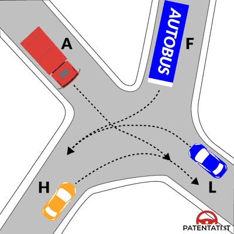

---

**258.** Secondo le norme di precedenza nell'incrocio in figura il veicolo L deve attendere il transito dei veicoli A ed F

- **الإجابة:** `VERO ✅ (صح)`
- 

---

**259.** Secondo le norme di precedenza nell'incrocio in figura il veicolo A deve attendere il transito del veicolo H

- **الإجابة:** `VERO ✅ (صح)`
- 

---

**260.** Secondo le norme di precedenza nell'incrocio in figura il veicolo L deve transitare per ultimo

- **الإجابة:** `VERO ✅ (صح)`
- 

---

**261.** Secondo le norme di precedenza nell'incrocio in figura il veicolo H transita per primo

- **الإجابة:** `VERO ✅ (صح)`
- 

---

**262.** Secondo le norme di precedenza nell'incrocio in figura i veicoli debbono transitare nell'ordine: H,A, F, L

- **الإجابة:** `VERO ✅ (صح)`
- 

---

**263.** Secondo le norme di precedenza nell'incrocio in figura i veicoli devono transitare nell'ordine: A, F, L, H

- **الإجابة:** `FALSO ❌ (خطأ)`
- 

---

**264.** Secondo le norme di precedenza nell'incrocio in figura il veicolo F deve transitare per primo

- **الإجابة:** `FALSO ❌ (خطأ)`
- 

---

**265.** Secondo le norme di precedenza nell'incrocio in figura il veicolo H deve attendere il transito del veicolo L

- **الإجابة:** `FALSO ❌ (خطأ)`
- 

---

**266.** Secondo le norme di precedenza nell'incrocio in figura il veicolo H deve attendere il transito del veicolo F

- **الإجابة:** `FALSO ❌ (خطأ)`
- 

---

**267.** Secondo le norme di precedenza nell'incrocio in figura il veicolo A deve attendere il transito del veicolo F

- **الإجابة:** `FALSO ❌ (خطأ)`
- 

---

## 📌 Figura 617 (19 domande)

**268.** Nell'incrocio rappresentato nella figura il conducente del veicolo N conclude per ultimo l'attraversamento dell'incrocio

- **الإجابة:** `VERO ✅ (صح)`
- 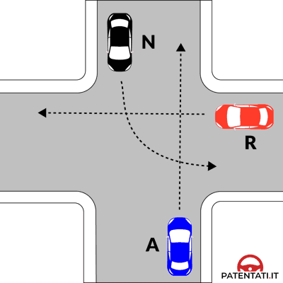

---

**269.** Nell'incrocio rappresentato nella figura il veicolo N deve dare la precedenza al veicolo A

- **الإجابة:** `VERO ✅ (صح)`
- 

---

**270.** Nell'incrocio rappresentato nella figura il veicolo N ha la precedenza rispetto al veicolo R

- **الإجابة:** `VERO ✅ (صح)`
- 

---

**271.** Nell'incrocio rappresentato nella figura il veicolo N può concludere la manovra di svolta a sinistra dopo il transito dei veicoli R e A

- **الإجابة:** `VERO ✅ (صح)`
- 

---

**272.** Nell'incrocio rappresentato nella figura il veicolo N, dopo essersi portato al centro dell'incrocio, deve attendere il transito dei veicoli R e A

- **الإجابة:** `VERO ✅ (صح)`
- 

---

**273.** Nell'incrocio rappresentato nella figura il conducente del veicolo R deve dare la precedenza al veicolo N

- **الإجابة:** `VERO ✅ (صح)`
- 

---

**274.** Nell'incrocio rappresentato nella figura il conducente del veicolo R ha la precedenza rispetto al veicolo A

- **الإجابة:** `VERO ✅ (صح)`
- 

---

**275.** Nell'incrocio rappresentato nella figura il conducente del veicolo R attraversa l'incrocio dopo che il veicolo N si è fermato al centro dell'incrocio

- **الإجابة:** `VERO ✅ (صح)`
- 

---

**276.** Nell'incrocio rappresentato nella figura il conducente del veicolo R passa prima del veicolo A

- **الإجابة:** `VERO ✅ (صح)`
- 

---

**277.** Nell'incrocio rappresentato nella figura il conducente del veicolo R conclude per primo l'attraversamento

- **الإجابة:** `VERO ✅ (صح)`
- 

---

**278.** Nell'incrocio rappresentato nella figura il veicolo N attraversa per primo

- **الإجابة:** `FALSO ❌ (خطأ)`
- 

---

**279.** Nell'incrocio rappresentato nella figura il veicolo N deve dare la precedenza al veicolo R

- **الإجابة:** `FALSO ❌ (خطأ)`
- 

---

**280.** Nell'incrocio rappresentato nella figura il veicolo N ha la precedenza rispetto al veicolo A

- **الإجابة:** `FALSO ❌ (خطأ)`
- 

---

**281.** Nell'incrocio rappresentato nella figura il veicolo N passa dopo il transito del veicolo R ma prima che transiti il veicolo A

- **الإجابة:** `FALSO ❌ (خطأ)`
- 

---

**282.** Nell'incrocio rappresentato nella figura il veicolo N impegna l'incrocio per ultimo

- **الإجابة:** `FALSO ❌ (خطأ)`
- 

---

**283.** Nell'incrocio rappresentato nella figura il conducente del veicolo R deve dare la precedenza al veicolo A

- **الإجابة:** `FALSO ❌ (خطأ)`
- 

---

**284.** Nell'incrocio rappresentato nella figura il conducente del veicolo R passa per ultimo

- **الإجابة:** `FALSO ❌ (خطأ)`
- 

---

**285.** Nell'incrocio rappresentato nella figura il conducente del veicolo R passa dopo il transito del veicolo A

- **الإجابة:** `FALSO ❌ (خطأ)`
- 

---

**286.** Nell'incrocio rappresentato nella figura il conducente del veicolo R impegna l'incrocio e si ferma al centro

- **الإجابة:** `FALSO ❌ (خطأ)`
- 

---

## 📌 Figura 639 (10 domande)

**287.** Nell'incrocio rappresentato nella figura il veicolo A deve dare la precedenza al tram e al veicolo B

- **الإجابة:** `VERO ✅ (صح)`
- 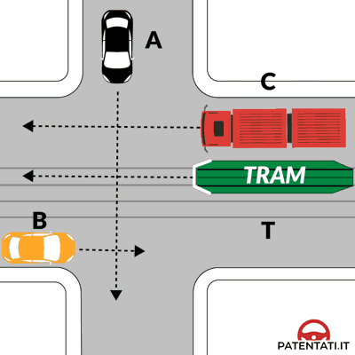

---

**288.** Nell'incrocio rappresentato nella figura il veicolo A ha la precedenza rispetto al veicolo C

- **الإجابة:** `VERO ✅ (صح)`
- 

---

**289.** Nell'incrocio rappresentato nella figura i veicoli transitano nell'ordine: T e B, A, C

- **الإجابة:** `VERO ✅ (صح)`
- 

---

**290.** Nell'incrocio rappresentato nella figura i veicoli T e B possono transitare contemporaneamente

- **الإجابة:** `VERO ✅ (صح)`
- 

---

**291.** Nell'incrocio rappresentato nella figura il veicolo C transita per ultimo

- **الإجابة:** `VERO ✅ (صح)`
- 

---

**292.** Nell'incrocio rappresentato nella figura i veicoli T e C transitano contemporaneamente

- **الإجابة:** `FALSO ❌ (خطأ)`
- 

---

**293.** Nell'incrocio rappresentato nella figura i veicoli transitano nell'ordine: T, B, C, A

- **الإجابة:** `FALSO ❌ (خطأ)`
- 

---

**294.** Nell'incrocio rappresentato nella figura il veicolo A transita per ultimo

- **الإجابة:** `FALSO ❌ (خطأ)`
- 

---

**295.** Nell'incrocio rappresentato nella figura i veicoli T, B, C transitano contemporaneamente

- **الإجابة:** `FALSO ❌ (خطأ)`
- 

---

**296.** Nell'incrocio rappresentato nella figura il veicolo B deve dare la precedenza al veicolo A

- **الإجابة:** `FALSO ❌ (خطأ)`
- 

---

## 📌 Figura 651 (13 domande)

**297.** Nell'incrocio rappresentato nella figura il conducente del veicolo D passa per primo

- **الإجابة:** `VERO ✅ (صح)`
- 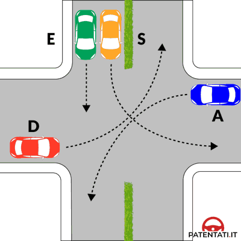

---

**298.** Nell'incrocio rappresentato nella figura il conducente del veicolo D non ha l'obbligo di dare la precedenza ad alcun veicolo

- **الإجابة:** `VERO ✅ (صح)`
- 

---

**299.** Nell'incrocio rappresentato nella figura il conducente del veicolo D non ha l'obbligo di dare la precedenza al veicolo A

- **الإجابة:** `VERO ✅ (صح)`
- 

---

**300.** Nell'incrocio rappresentato nella figura il conducente del veicolo A passa per ultimo

- **الإجابة:** `VERO ✅ (صح)`
- 

---

**301.** Nell'incrocio rappresentato nella figura il conducente del veicolo A deve dare la precedenza ai veicoli E e S

- **الإجابة:** `VERO ✅ (صح)`
- 

---

**302.** Nell'incrocio rappresentato nella figura il conducente del veicolo A prima di impegnare l'incrocio deve attendere il transito, nell'ordine, dei veicoli D, E e S

- **الإجابة:** `VERO ✅ (صح)`
- 

---

**303.** Nell'incrocio rappresentato nella figura il conducente del veicolo D passa per terzo

- **الإجابة:** `FALSO ❌ (خطأ)`
- 

---

**304.** Nell'incrocio rappresentato nella figura il conducente del veicolo D ha l'obbligo di dare la precedenza a tutti i veicoli

- **الإجابة:** `FALSO ❌ (خطأ)`
- 

---

**305.** Nell'incrocio rappresentato nella figura il conducente del veicolo D ha l'obbligo di dare la precedenza al veicolo E, che prosegue diritto

- **الإجابة:** `FALSO ❌ (خطأ)`
- 

---

**306.** Nell'incrocio rappresentato nella figura il conducente del veicolo A ha la destra libera

- **الإجابة:** `FALSO ❌ (خطأ)`
- 

---

**307.** Nell'incrocio rappresentato nella figura il conducente del veicolo A passa contemporaneamente al veicolo D

- **الإجابة:** `FALSO ❌ (خطأ)`
- 

---

**308.** Nell'incrocio rappresentato nella figura il conducente del veicolo A passa dopo i veicoli E e S, ma prima del veicolo D

- **الإجابة:** `FALSO ❌ (خطأ)`
- 

---

**309.** Nell'incrocio rappresentato nella figura il conducente del veicolo A deve dare la precedenza solo al veicolo che prosegue diritto e non a quelli che svoltano

- **الإجابة:** `FALSO ❌ (خطأ)`
- 

---

## 📌 Figura 614 (9 domande)

**310.** Nell'incrocio rappresentato nella figura il veicolo T passa per ultimo

- **الإجابة:** `VERO ✅ (صح)`
- 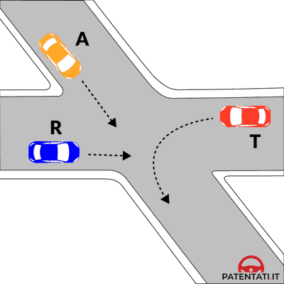

---

**311.** Nell'incrocio rappresentato nella figura il veicolo R passa per primo

- **الإجابة:** `VERO ✅ (صح)`
- 

---

**312.** Nell'incrocio rappresentato nella figura il veicolo A deve attendere il transito del veicolo R

- **الإجابة:** `VERO ✅ (صح)`
- 

---

**313.** Nell'incrocio rappresentato nella figura il veicolo T deve attendere il transito dei veicoli R ed A

- **الإجابة:** `VERO ✅ (صح)`
- 

---

**314.** Nell'incrocio rappresentato nella figura i veicoli transitano nell'ordine: R, A, T

- **الإجابة:** `VERO ✅ (صح)`
- 

---

**315.** Nell'incrocio rappresentato nella figura il veicolo T transita prima del veicolo R

- **الإجابة:** `FALSO ❌ (خطأ)`
- 

---

**316.** Nell'incrocio rappresentato nella figura i veicoli transitano nell'ordine: R, T, A

- **الإجابة:** `FALSO ❌ (خطأ)`
- 

---

**317.** Nell'incrocio rappresentato nella figura i veicoli transitano nell'ordine: T, A, R

- **الإجابة:** `FALSO ❌ (خطأ)`
- 

---

**318.** Nell'incrocio rappresentato nella figura il veicolo T transita prima degli altri veicoli

- **الإجابة:** `FALSO ❌ (خطأ)`
- 

---

## 📌 Figura 664 (4 domande)

**319.** Nell'intersezione di figura il veicolo B deve dare la precedenza al veicolo S

- **الإجابة:** `VERO ✅ (صح)`
- 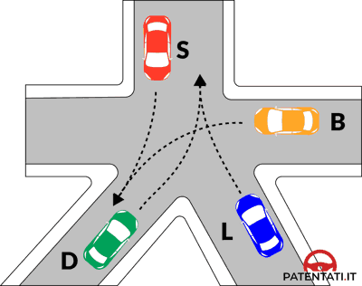

---

**320.** Nell'intersezione di figura l'ordine di transito dei veicoli è: S, B, L, D

- **الإجابة:** `VERO ✅ (صح)`
- 

---

**321.** Nell'intersezione di figura l'ordine di transito dei veicoli è: S, B, D e L contemporaneamente

- **الإجابة:** `FALSO ❌ (خطأ)`
- 

---

**322.** Nell'intersezione di figura l'ordine di transito dei veicoli è: S e D contemporaneamente, B, L

- **الإجابة:** `FALSO ❌ (خطأ)`
- 

---

## 📌 Figura 631 (4 domande)

**323.** Nell'intersezione di figura il veicolo D transita prima del veicolo F

- **الإجابة:** `VERO ✅ (صح)`
- 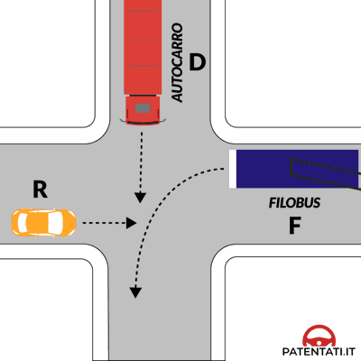

---

**324.** Nell'intersezione di figura l'ordine di transito dei veicoli è: R, D, F

- **الإجابة:** `VERO ✅ (صح)`
- 

---

**325.** Nell'intersezione di figura il filobus passa per primo perché vincolato alla linea elettrica aerea

- **الإجابة:** `FALSO ❌ (خطأ)`
- 

---

**326.** Nell'intersezione di figura l'ordine di transito dei veicoli è: F, R, D

- **الإجابة:** `FALSO ❌ (خطأ)`
- 

---

## 📌 Figura 663 (3 domande)

**327.** Nell'intersezione di figura il veicolo T passa per ultimo

- **الإجابة:** `VERO ✅ (صح)`
- 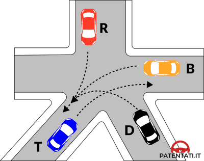

---

**328.** Nell'intersezione di figura l'ordine di precedenza dei veicoli è: R, B, D, T

- **الإجابة:** `VERO ✅ (صح)`
- 

---

**329.** Nell'intersezione di figura il veicolo D transita prima del veicolo B

- **الإجابة:** `FALSO ❌ (خطأ)`
- 

---

## 📌 Figura 633 (5 domande)

**330.** Nell'intersezione di figura l'ordine di transito dei veicoli è: N, A, R

- **الإجابة:** `VERO ✅ (صح)`
- 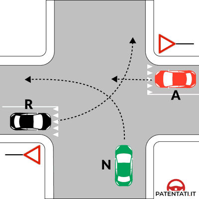

---

**331.** Nell'intersezione di figura i veicoli A ed R devono, se necessario, fermarsi

- **الإجابة:** `VERO ✅ (صح)`
- 

---

**332.** Nell'intersezione di figura il veicolo A può transitare prima del veicolo R, ma dopo il veicolo N

- **الإجابة:** `VERO ✅ (صح)`
- 

---

**333.** Nell'intersezione di figura l'ordine di transito dei veicoli è: A, N, R

- **الإجابة:** `FALSO ❌ (خطأ)`
- 

---

**334.** Nell'intersezione di figura l'ordine di precedenza dei veicoli è: N, R, A

- **الإجابة:** `FALSO ❌ (خطأ)`
- 

---

## 📌 Figura 607 (6 domande)

**335.** Nell'intersezione in figura il veicolo T transita per primo

- **الإجابة:** `VERO ✅ (صح)`
- 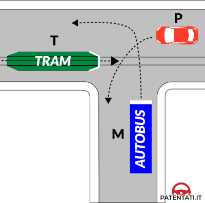

---

**336.** Nell'intersezione in figura i veicoli transitano nel seguente ordine: T, P, M

- **الإجابة:** `VERO ✅ (صح)`
- 

---

**337.** Nell'intersezione in figura il veicolo M transita per ultimo

- **الإجابة:** `VERO ✅ (صح)`
- 

---

**338.** Nell'intersezione in figura il veicolo M ha la precedenza perché è in servizio pubblico

- **الإجابة:** `FALSO ❌ (خطأ)`
- 

---

**339.** Nell'intersezione in figura i veicoli transitano nel seguente ordine: T, M, P

- **الإجابة:** `FALSO ❌ (خطأ)`
- 

---

**340.** Nell'intersezione in figura, il veicolo T può passare per primo, purché il veicolo M non stia svolgendo un servizio pubblico di linea

- **الإجابة:** `FALSO ❌ (خطأ)`
- 

---

## 📌 Figura 604 (5 domande)

**341.** Nell'incrocio rappresentato in figura il veicolo R passa per primo

- **الإجابة:** `VERO ✅ (صح)`
- 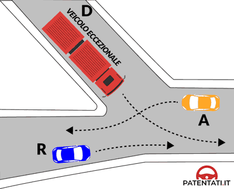

---

**342.** Nell'incrocio rappresentato in figura i veicoli transitano nel seguente ordine: R, D, A

- **الإجابة:** `VERO ✅ (صح)`
- 

---

**343.** Nell'incrocio rappresentato in figura il veicolo D passa prima del veicolo R

- **الإجابة:** `FALSO ❌ (خطأ)`
- 

---

**344.** Nell'incrocio rappresentato in figura i veicoli transitano nel seguente ordine: D, A, R

- **الإجابة:** `FALSO ❌ (خطأ)`
- 

---

**345.** Nell'incrocio rappresentato in figura i veicoli A e R passano contemporaneamente

- **الإجابة:** `FALSO ❌ (خطأ)`
- 

---

## 📌 Figura 636 (8 domande)

**346.** Dovendo attraversare l'incrocio rappresentato in figura il veicolo T transita per primo

- **الإجابة:** `VERO ✅ (صح)`
- 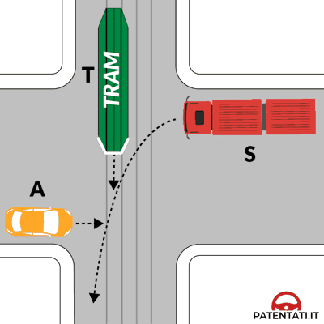

---

**347.** Dovendo attraversare l'incrocio rappresentato in figura il veicolo A transita subito dopo il veicolo T

- **الإجابة:** `VERO ✅ (صح)`
- 

---

**348.** Dovendo attraversare l'incrocio rappresentato in figura il veicolo S deve attendere il transito dei veicoli T e A

- **الإجابة:** `VERO ✅ (صح)`
- 

---

**349.** Dovendo attraversare l'incrocio rappresentato in figura i veicoli devono transitare nel seguente ordine: T, A, S

- **الإجابة:** `VERO ✅ (صح)`
- 

---

**350.** Dovendo attraversare l'incrocio rappresentato in figura il veicolo A transita per primo

- **الإجابة:** `FALSO ❌ (خطأ)`
- 

---

**351.** Dovendo attraversare l'incrocio rappresentato in figura i veicoli devono transitare nel seguente ordine: A, T, S

- **الإجابة:** `FALSO ❌ (خطأ)`
- 

---

**352.** Dovendo attraversare l'incrocio rappresentato in figura il veicolo S transita dopo il veicolo T, ma prima del veicolo A

- **الإجابة:** `FALSO ❌ (خطأ)`
- 

---

**353.** Dovendo attraversare l'incrocio rappresentato in figura i veicoli A e S transitano contemporaneamente dopo il passaggio del veicolo T

- **الإجابة:** `FALSO ❌ (خطأ)`
- 

---

## 📌 Figura 620 (8 domande)

**354.** Secondo le norme di precedenza nell'incrocio rappresentato in figura il veicolo B deve attendere il transito del veicolo P

- **الإجابة:** `VERO ✅ (صح)`
- 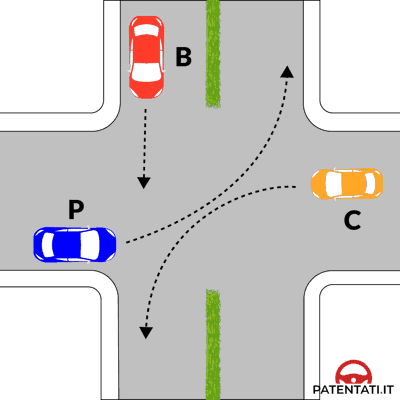

---

**355.** Secondo le norme di precedenza nell'incrocio rappresentato in figura il veicolo P transita per primo

- **الإجابة:** `VERO ✅ (صح)`
- 

---

**356.** Secondo le norme di precedenza nell'incrocio rappresentato in figura i veicoli transitano nell'ordine: P, B, C

- **الإجابة:** `VERO ✅ (صح)`
- 

---

**357.** Secondo le norme di precedenza nell'incrocio rappresentato in figura il veicolo C ha la destra occupata

- **الإجابة:** `VERO ✅ (صح)`
- 

---

**358.** Secondo le norme di precedenza nell'incrocio rappresentato in figura il veicolo B transita per ultimo

- **الإجابة:** `FALSO ❌ (خطأ)`
- 

---

**359.** Secondo le norme di precedenza nell'incrocio rappresentato in figura i veicoli transitano nell'ordine: P, C, B

- **الإجابة:** `FALSO ❌ (خطأ)`
- 

---

**360.** Secondo le norme di precedenza nell'incrocio rappresentato in figura i veicoli P e C transitano contemporaneamente

- **الإجابة:** `FALSO ❌ (خطأ)`
- 

---

**361.** Secondo le norme di precedenza nell'incrocio rappresentato in figura il veicolo P impegna l'incrocio per primo ma si deve fermare al centro di esso

- **الإجابة:** `FALSO ❌ (خطأ)`
- 

---

## 📌 Figura 616 (7 domande)

**362.** Nell'incrocio rappresentato in figura il veicolo B transita per primo

- **الإجابة:** `VERO ✅ (صح)`
- 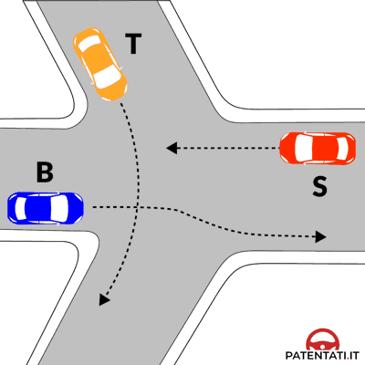

---

**363.** Nell'incrocio rappresentato in figura i veicoli transitano nel seguente ordine: B, T, S

- **الإجابة:** `VERO ✅ (صح)`
- 

---

**364.** Nell'incrocio rappresentato in figura il veicolo S transita per ultimo

- **الإجابة:** `VERO ✅ (صح)`
- 

---

**365.** Nell'incrocio rappresentato in figura i veicoli transitano nel seguente ordine: S, B, T

- **الإجابة:** `FALSO ❌ (خطأ)`
- 

---

**366.** Nell'incrocio rappresentato in figura il veicolo B deve dare la precedenza al veicolo T

- **الإجابة:** `FALSO ❌ (خطأ)`
- 

---

**367.** Nell'incrocio rappresentato in figura nessuno dei veicoli deve moderare la velocità

- **الإجابة:** `FALSO ❌ (خطأ)`
- 

---

**368.** Nell'incrocio rappresentato in figura i veicoli B e S transitano contemporaneamente

- **الإجابة:** `FALSO ❌ (خطأ)`
- 

---

## 📌 Figura 657 (8 domande)

**369.** Secondo le norme di precedenza nell'incrocio rappresentato in figura il veicolo A transita dopo il veicolo R

- **الإجابة:** `VERO ✅ (صح)`
- 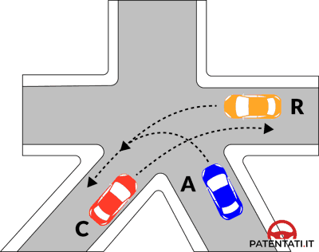

---

**370.** Secondo le norme di precedenza nell'incrocio rappresentato in figura il veicolo R non deve dare la precedenza ad alcun veicolo

- **الإجابة:** `VERO ✅ (صح)`
- 

---

**371.** Secondo le norme di precedenza nell'incrocio rappresentato in figura il veicolo C deve dare la precedenza al veicolo A

- **الإجابة:** `VERO ✅ (صح)`
- 

---

**372.** Secondo le norme di precedenza nell'incrocio rappresentato in figura i veicoli transitano nel seguente ordine: R, A, C

- **الإجابة:** `VERO ✅ (صح)`
- 

---

**373.** Secondo le norme di precedenza nell'incrocio rappresentato in figura il veicolo C non deve dare la precedenza ad alcun veicolo

- **الإجابة:** `FALSO ❌ (خطأ)`
- 

---

**374.** Secondo le norme di precedenza nell'incrocio rappresentato in figura i veicoli R e C transitano contemporaneamente

- **الإجابة:** `FALSO ❌ (خطأ)`
- 

---

**375.** Secondo le norme di precedenza nell'incrocio rappresentato in figura i veicoli transitano nel seguente ordine: R, C, A

- **الإجابة:** `FALSO ❌ (خطأ)`
- 

---

**376.** Secondo le norme di precedenza nell'incrocio rappresentato in figura il veicolo R deve attendere il transito dei veicoli C e A

- **الإجابة:** `FALSO ❌ (خطأ)`
- 

---

## 📌 Figura 660 (8 domande)

**377.** Nell'incrocio rappresentato in figura i veicoli disimpegnano l'incrocio nel seguente ordine: H, D, B

- **الإجابة:** `VERO ✅ (صح)`
- 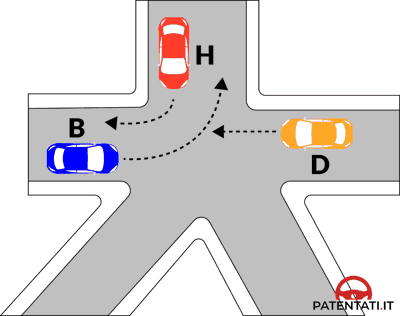

---

**378.** Nell'incrocio rappresentato in figura il veicolo B deve passare per ultimo

- **الإجابة:** `VERO ✅ (صح)`
- 

---

**379.** Nell'incrocio rappresentato in figura il veicolo H non deve dare la precedenza ad alcun veicolo

- **الإجابة:** `VERO ✅ (صح)`
- 

---

**380.** Nell'incrocio rappresentato in figura il veicolo D deve dare la precedenza al veicolo H

- **الإجابة:** `VERO ✅ (صح)`
- 

---

**381.** Nell'incrocio rappresentato in figura il veicolo D deve attendere che il veicolo B sia transitato

- **الإجابة:** `FALSO ❌ (خطأ)`
- 

---

**382.** Nell'incrocio rappresentato in figura i veicoli disimpegnano l'incrocio nel seguente ordine: H, B, D

- **الإجابة:** `FALSO ❌ (خطأ)`
- 

---

**383.** Nell'incrocio rappresentato in figura il veicolo B ha la precedenza sul veicolo D

- **الإجابة:** `FALSO ❌ (خطأ)`
- 

---

**384.** Nell'incrocio rappresentato in figura i veicoli H e B possono passare contemporaneamente

- **الإجابة:** `FALSO ❌ (خطأ)`
- 

---

## 📌 Figura 644 (9 domande)

**385.** Giungendo all'incrocio rappresentato in figura il veicolo P può passare per primo

- **الإجابة:** `VERO ✅ (صح)`
- 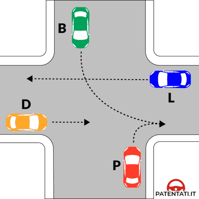

---

**386.** Giungendo all'incrocio rappresentato in figura il veicolo D deve dare la precedenza al veicolo P

- **الإجابة:** `VERO ✅ (صح)`
- 

---

**387.** Giungendo all'incrocio rappresentato in figura il veicolo B deve attendere che siano transitati i veicoli P e D

- **الإجابة:** `VERO ✅ (صح)`
- 

---

**388.** Giungendo all'incrocio rappresentato in figura il veicolo L deve dare la precedenza al veicolo B

- **الإجابة:** `VERO ✅ (صح)`
- 

---

**389.** Giungendo all'incrocio rappresentato in figura i veicoli devono passare nel seguente ordine: P, D, B, L

- **الإجابة:** `VERO ✅ (صح)`
- 

---

**390.** Giungendo all'incrocio rappresentato in figura il veicolo B deve dare la precedenza al veicolo L

- **الإجابة:** `FALSO ❌ (خطأ)`
- 

---

**391.** Giungendo all'incrocio rappresentato in figura il veicolo P deve attendere che siano transitati gli altri tre veicoli

- **الإجابة:** `FALSO ❌ (خطأ)`
- 

---

**392.** Giungendo all'incrocio rappresentato in figura i veicoli devono passare nel seguente ordine: P, D, L, B

- **الإجابة:** `FALSO ❌ (خطأ)`
- 

---

**393.** Giungendo all'incrocio rappresentato in figura i veicoli D e L passano contemporaneamente per primi

- **الإجابة:** `FALSO ❌ (خطأ)`
- 

---

## 📌 Figura 606 (6 domande)

**394.** Dovendo attraversare l'incrocio rappresentato in figura il veicolo E transita per primo

- **الإجابة:** `VERO ✅ (صح)`
- 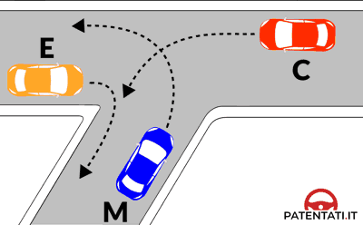

---

**395.** Dovendo attraversare l'incrocio rappresentato in figura il veicolo C transita dopo il veicolo E

- **الإجابة:** `VERO ✅ (صح)`
- 

---

**396.** Dovendo attraversare l'incrocio rappresentato in figura i veicoli devono transitare nel seguente ordine: E, C, M

- **الإجابة:** `VERO ✅ (صح)`
- 

---

**397.** Dovendo attraversare l'incrocio rappresentato in figura il veicolo M transita per primo

- **الإجابة:** `FALSO ❌ (خطأ)`
- 

---

**398.** Dovendo attraversare l'incrocio rappresentato in figura i veicoli devono transitare nel seguente ordine: C, M ed E

- **الإجابة:** `FALSO ❌ (خطأ)`
- 

---

**399.** Dovendo attraversare l'incrocio rappresentato in figura i veicoli M ed E transitano contemporaneamente

- **الإجابة:** `FALSO ❌ (خطأ)`
- 

---

## 📌 Figura 634 (8 domande)

**400.** Giungendo all'incrocio rappresentato in figura il veicolo A passa per primo

- **الإجابة:** `VERO ✅ (صح)`
- 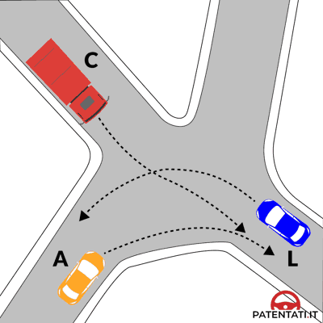

---

**401.** Giungendo all'incrocio rappresentato in figura il veicolo C deve dare la precedenza al veicolo A

- **الإجابة:** `VERO ✅ (صح)`
- 

---

**402.** Giungendo all'incrocio rappresentato in figura il veicolo L passa per ultimo

- **الإجابة:** `VERO ✅ (صح)`
- 

---

**403.** Giungendo all'incrocio rappresentato in figura i veicoli devono passare nel seguente ordine: A, C, L

- **الإجابة:** `VERO ✅ (صح)`
- 

---

**404.** Giungendo all'incrocio rappresentato in figura il veicolo A deve attendere che siano transitati i veicoli L e C

- **الإجابة:** `FALSO ❌ (خطأ)`
- 

---

**405.** Giungendo all'incrocio rappresentato in figura il veicolo L passa per primo

- **الإجابة:** `FALSO ❌ (خطأ)`
- 

---

**406.** Giungendo all'incrocio rappresentato in figura i veicoli devono passare nel seguente ordine: L, C, A

- **الإجابة:** `FALSO ❌ (خطأ)`
- 

---

**407.** Giungendo all'incrocio rappresentato in figura il veicolo C deve attendere il transito del veicolo L

- **الإجابة:** `FALSO ❌ (خطأ)`
- 

---

## 📌 Figura 661 (8 domande)

**408.** Nell'incrocio rappresentato in figura il veicolo E non deve dare la precedenza ad alcun veicolo

- **الإجابة:** `VERO ✅ (صح)`
- 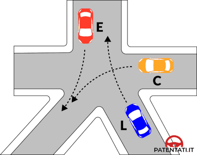

---

**409.** Nell'incrocio rappresentato in figura il veicolo C deve dare la precedenza al veicolo E

- **الإجابة:** `VERO ✅ (صح)`
- 

---

**410.** Nell'incrocio rappresentato in figura il veicolo L deve attendere il transito dei veicoli E e C

- **الإجابة:** `VERO ✅ (صح)`
- 

---

**411.** Nell'incrocio rappresentato in figura i veicoli disimpegnano l'incrocio nel seguente ordine: E, C, L

- **الإجابة:** `VERO ✅ (صح)`
- 

---

**412.** Nell'incrocio rappresentato in figura il veicolo C deve attendere il transito del veicolo L

- **الإجابة:** `FALSO ❌ (خطأ)`
- 

---

**413.** Nell'incrocio rappresentato in figura il veicolo E deve passare per ultimo

- **الإجابة:** `FALSO ❌ (خطأ)`
- 

---

**414.** Nell'incrocio rappresentato in figura i veicoli disimpegnano l'incrocio nel seguente ordine: E, L, C

- **الإجابة:** `FALSO ❌ (خطأ)`
- 

---

**415.** Nell'incrocio rappresentato in figura i veicoli C ed E passano contemporaneamente

- **الإجابة:** `FALSO ❌ (خطأ)`
- 

---

