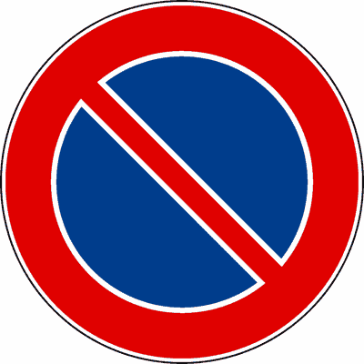

# Capitolo 16 - Fermata, sosta, arresto e partenza
### الوقوف والتوقف والانتظار

📊 **إجمالي الأسئلة في هذا الباب:** 191 سؤال

---

## 📌 Disco orario parchimetro (8 domande)

**1.** Se si parcheggia in una zona regolamentata con parchimetro, occorre esporre l'apposito tagliando, in modo che sia ben visibile

- **الإجابة:** `VERO ✅ (صح)`

---

**2.** Per parcheggiare in una zona regolamentata mediante disco orario, bisogna esporre in modo ben visibile l'orario di arrivo

- **الإجابة:** `VERO ✅ (صح)`

---

**3.** In una zona in cui la sosta è regolamentata con parchimetro, non occorre utilizzarlo se ci si ferma soltanto per far salire o scendere un passeggero

- **الإجابة:** `VERO ✅ (صح)`

---

**4.** Nelle aree di parcheggio a tempo limitato, i veicoli al servizio di persone diversamente abili non sono obbligati a rispettare il limite di tempo stabilito per la sosta.

- **الإجابة:** `VERO ✅ (صح)`

---

**5.** Per parcheggiare in una zona regolamentata mediante disco orario, bisogna indicare sul disco l'orario di fine della sosta, oppure trascriverlo su un foglio di carta

- **الإجابة:** `FALSO ❌ (خطأ)`

---

**6.** In una zona in cui la sosta è regolamentata mediante disco orario, prima che scada il tempo di validità della sosta è consentito aggiornare l'orario, senza che il veicolo venga spostato

- **الإجابة:** `FALSO ❌ (خطأ)`

---

**7.** In una zona in cui la sosta è regolamentata con parchimetro, non occorre utilizzare il parchimetro se si effettua una breve sosta

- **الإجابة:** `FALSO ❌ (خطأ)`

---

**8.** Se si parcheggia in una zona regolamentata mediante disco orario, bisogna trascrivere su un foglio di carta l'ora di arrivo, senza indicare i minuti

- **الإجابة:** `FALSO ❌ (خطأ)`

---

## 📌 Conducente autoveicolo sosta (6 domande)

**9.** Il conducente di un autoveicolo in sosta sul lato destro di una strada urbana, prima di aprire la portiera, deve fare particolare attenzione ai veicoli che sopraggiungono

- **الإجابة:** `VERO ✅ (صح)`

---

**10.** Il conducente di un autoveicolo in sosta su una strada stretta, prima di scendere deve controllare che non sopraggiungano veicoli

- **الإجابة:** `VERO ✅ (صح)`

---

**11.** E' opportuno che il conducente di un autoveicolo in sosta sul lato sinistro in una strada urbana a senso unico, ricordi al passeggero di prestare particolare attenzione ai veicoli che sopraggiungono, prima di aprire la portiera

- **الإجابة:** `VERO ✅ (صح)`

---

**12.** E' opportuno che il conducente di un autoveicolo, in sosta sul lato destro di una strada urbana, ricordi al passeggero che apre la portiera di destra di fare attenzione ai pedoni in transito

- **الإجابة:** `VERO ✅ (صح)`

---

**13.** Il conducente di un autoveicolo può lasciare il motore acceso se sosta per poco tempo

- **الإجابة:** `FALSO ❌ (خطأ)`

---

**14.** Il conducente di un autoveicolo in sosta su una strada stretta, prima di scendere deve preoccuparsi dei veicoli che sopraggiungono da dietro, ma non di quelli di fronte

- **الإجابة:** `FALSO ❌ (خطأ)`

---

## 📌 Prima iniziare guidare (14 domande)

**15.** Prima di iniziare a guidare un autoveicolo è opportuno regolare il sedile e il poggiatesta, secondo la propria statura

- **الإجابة:** `VERO ✅ (صح)`

---

**16.** Prima di iniziare a guidare un autoveicolo è opportuno regolare gli specchi retrovisori interni ed esterni

- **الإجابة:** `VERO ✅ (صح)`

---

**17.** Prima di iniziare a guidare un motociclo è opportuno regolare gli specchi secondo la propria statura

- **الإجابة:** `VERO ✅ (صح)`

---

**18.** Quando si guida un veicolo a motore, bisogna avere con sé tutti i documenti necessari per la guida (carta di circolazione, certificato di assicurazione, patente ecc.), e in corso di validità

- **الإجابة:** `VERO ✅ (صح)`

---

**19.** Prima di iniziare a guidare un veicolo a motore bisogna essere certi che la categoria di patente posseduta ne consenta la guida

- **الإجابة:** `VERO ✅ (صح)`

---

**20.** Prima di iniziare a guidare un veicolo, bisogna essere certi del perfetto stato di efficienza del mezzo

- **الإجابة:** `VERO ✅ (صح)`

---

**21.** Prima di iniziare a guidare un veicolo bisogna accertarsi che gli oggetti trasportati siano sistemati in modo da evitarne la caduta o dispersione

- **الإجابة:** `VERO ✅ (صح)`

---

**22.** Prima di iniziare a guidare un veicolo, bisogna controllare che non sia compromessa la visibilità posteriore e laterale, per la presenza di passeggeri o per il carico mal posizionato

- **الإجابة:** `VERO ✅ (صح)`

---

**23.** Prima di iniziare a guidare un autoveicolo, bisogna individuare i comandi (leve e pulsanti) necessari per la guida e comprenderne bene il funzionamento

- **الإجابة:** `VERO ✅ (صح)`

---

**24.** Prima di iniziare a guidare un’autovettura, bisogna controllare che i passeggeri abbiano regolarmente allacciato le cinture di sicurezza

- **الإجابة:** `VERO ✅ (صح)`

---

**25.** Prima di iniziare a guidare un veicolo a motore bisogna regolare il contachilometri parziale

- **الإجابة:** `FALSO ❌ (خطأ)`

---

**26.** Prima di iniziare a guidare un veicolo a motore bisogna disinserire l'airbag del lato conducente

- **الإجابة:** `FALSO ❌ (خطأ)`

---

**27.** Prima di iniziare a guidare un autoveicolo, bisogna verificare che le cinture di sicurezza siano dotate di pretensionatore

- **الإجابة:** `FALSO ❌ (خطأ)`

---

**28.** Prima di iniziare a guidare un veicolo, bisogna verificarne lo stato di efficienza solo se si deve intraprendere un lungo viaggio

- **الإجابة:** `FALSO ❌ (خطأ)`

---

## 📌 Fermata veicolo (8 domande)

**29.** L'arresto è l'interruzione della marcia del veicolo dovuta ad esigenze della circolazione, come ad esempio ad un semaforo rosso

- **الإجابة:** `VERO ✅ (صح)`

---

**30.** La fermata di un veicolo è la temporanea sospensione della marcia per consentire la salita o la discesa delle persone

- **الإجابة:** `VERO ✅ (صح)`

---

**31.** La fermata di un veicolo è la temporanea sospensione della marcia per esigenze di brevissima durata, come ad esempio per chiedere informazioni agli agenti del traffico

- **الإجابة:** `VERO ✅ (صح)`

---

**32.** La fermata di un veicolo è la temporanea sospensione della marcia per esigenze di brevissima durata.

- **الإجابة:** `VERO ✅ (صح)`

---

**33.** L'arresto è la temporanea sospensione della marcia per esigenze del conducente o dei passeggeri di un veicolo

- **الإجابة:** `FALSO ❌ (خطأ)`

---

**34.** La fermata è l'interruzione della marcia del veicolo dovuta ad esigenze della circolazione

- **الإجابة:** `FALSO ❌ (خطأ)`

---

**35.** La fermata per esigenze del conducente può avere la durata massima di dieci minuti

- **الإجابة:** `FALSO ❌ (خطأ)`

---

**36.** La fermata di un veicolo è vietata se i passeggeri che scendono sono più di uno

- **الإجابة:** `FALSO ❌ (خطأ)`

---

## 📌 Durante fermata (9 domande)

**37.** La fermata non deve arrecare intralcio alla circolazione

- **الإجابة:** `VERO ✅ (صح)`

---

**38.** Durante la fermata il conducente non deve impedire con il proprio autoveicolo il normale flusso del traffico

- **الإجابة:** `VERO ✅ (صح)`

---

**39.** Durante la fermata il conducente deve comportarsi in modo da non costituire pericolo agli altri utenti della strada

- **الإجابة:** `VERO ✅ (صح)`

---

**40.** Durante la fermata il conducente deve essere sempre presente e pronto a riprendere la marcia

- **الإجابة:** `VERO ✅ (صح)`

---

**41.** Durante la fermata il conducente deve sempre adottare le opportune cautele atte ad evitare incidenti

- **الإجابة:** `VERO ✅ (صح)`

---

**42.** Non è consentito fermarsi per chiedere informazioni agli agenti del traffico, quando ciò possa causare intralcio o rallentamento alla circolazione

- **الإجابة:** `VERO ✅ (صح)`

---

**43.** Durante la fermata il conducente può allontanarsi per brevissimo tempo prima di riprendere la marcia

- **الإجابة:** `FALSO ❌ (خطأ)`

---

**44.** La fermata di un veicolo è sempre consentita per chiedere informazioni agli agenti del traffico

- **الإجابة:** `FALSO ❌ (خطأ)`

---

**45.** Durante la fermata il conducente, se si allontana, deve lasciare il veicolo con il motore acceso

- **الإجابة:** `FALSO ❌ (خطأ)`

---

## 📌 Fermata fuori centri abitati (6 domande)

**46.** In caso di fermata, ove non esista marciapiede rialzato, il conducente deve lasciare uno spazio non inferiore ad un metro per il transito dei pedoni

- **الإجابة:** `VERO ✅ (صح)`

---

**47.** Fuori dei centri abitati, il conducente, in caso di fermata, deve collocare, se possibile, il veicolo fuori della carreggiata

- **الإجابة:** `VERO ✅ (صح)`

---

**48.** Fuori dei centri abitati, il conducente, in caso di fermata, deve collocare il veicolo fuori della carreggiata, ma non sulle piste ciclabili

- **الإجابة:** `VERO ✅ (صح)`

---

**49.** Fuori dei centri abitati, se non è possibile collocare il veicolo fuori della carreggiata, il conducente deve effettuare la fermata il più vicino possibile al margine destro della carreggiata

- **الإجابة:** `VERO ✅ (صح)`

---

**50.** In caso di fermata su strada urbana in cui non esiste il marciapiede rialzato, il conducente deve collocare il veicolo il più vicino possibile al margine destro della carreggiata

- **الإجابة:** `FALSO ❌ (خطأ)`

---

**51.** Fuori dei centri abitati, il conducente, in caso di fermata ha l'obbligo di collocare il veicolo fuori della carreggiata, eventualmente su una pista ciclabile

- **الإجابة:** `FALSO ❌ (خطأ)`

---

## 📌 Fermata vietata (12 domande)

**52.** La fermata è vietata in corrispondenza o in prossimità dei passaggi a livello

- **الإجابة:** `VERO ✅ (صح)`

---

**53.** La fermata è vietata sui binari di linee ferroviarie o tranviarie o così vicino ad essi da intralciare la marcia dei veicoli su rotaia

- **الإجابة:** `VERO ✅ (صح)`

---

**54.** La fermata è vietata nelle gallerie, salvo diversa segnalazione.

- **الإجابة:** `VERO ✅ (صح)`

---

**55.** La fermata è vietata nei sottovia, sotto i sovrapassaggi, sotto i fornici e i portici, salvo diversa segnalazione.

- **الإجابة:** `VERO ✅ (صح)`

---

**56.** La fermata è vietata sui dossi.

- **الإجابة:** `VERO ✅ (صح)`

---

**57.** Fuori dai centri abitati e sulle strade urbane di scorrimento la fermata è vietata in prossimità dei dossi.

- **الإجابة:** `VERO ✅ (صح)`

---

**58.** La fermata è vietata nelle curve e, fuori dei centri abitati e sulle strade urbane di scorrimento, anche in loro prossimità

- **الإجابة:** `VERO ✅ (صح)`

---

**59.** La fermata è vietata sul margine destro della carreggiata

- **الإجابة:** `FALSO ❌ (خطأ)`

---

**60.** La fermata è vietata lungo il margine sinistro di una carreggiata a senso unico di circolazione

- **الإجابة:** `FALSO ❌ (خطأ)`

---

**61.** La fermata di breve durata è consentita anche in curva.

- **الإجابة:** `FALSO ❌ (خطأ)`

---

**62.** La fermata è vietata allo sbocco dei passi carrabili

- **الإجابة:** `FALSO ❌ (خطأ)`

---

**63.** La fermata è vietata sulle aree destinate al mercato o al carico e allo scarico delle merci

- **الإجابة:** `FALSO ❌ (خطأ)`

---

## 📌 Fermate cartelli intersezione (11 domande)

**64.** La fermata è vietata in prossimità e in corrispondenza di segnali stradali verticali in modo da occultarne la vista

- **الإجابة:** `VERO ✅ (صح)`

---

**65.** La fermata è vietata in prossimità e in corrispondenza di segnali semaforici in modo da occultarne la vista

- **الإجابة:** `VERO ✅ (صح)`

---

**66.** La fermata è vietata in corrispondenza dei segnali orizzontali di preselezione e lungo le corsie di canalizzazione

- **الإجابة:** `VERO ✅ (صح)`

---

**67.** Fuori dei centri abitati, la fermata è vietata in corrispondenza e in prossimità delle aree di intersezione

- **الإجابة:** `VERO ✅ (صح)`

---

**68.** Nei centri abitati, la fermata e la sosta sono vietate in corrispondenza delle aree di intersezione e in prossimità di esse a meno di 5 metri, salvo diversa segnalazione.

- **الإجابة:** `VERO ✅ (صح)`

---

**69.** La fermata è vietata limitatamente alle ore di esercizio, in corrispondenza dei distributori di carburante

- **الإجابة:** `FALSO ❌ (خطأ)`

---

**70.** La fermata è vietata dopo il segnale DIVIETO DI SOSTA

- **الإجابة:** `FALSO ❌ (خطأ)`
- 

---

**71.** La fermata è vietata in prossimità dei segnali stradali, anche se il veicolo non ne occulta la vista

- **الإجابة:** `FALSO ❌ (خطأ)`

---

**72.** La fermata è vietata lungo le autostrade, anche in caso di emergenza

- **الإجابة:** `FALSO ❌ (خطأ)`

---

**73.** Nei centri abitati la fermata è vietata in prossimità delle aree di intersezione, a più di 5 metri

- **الإجابة:** `FALSO ❌ (خطأ)`

---

**74.** La fermata è consentita sulle corsie di accelerazione, purché brevissima

- **الإجابة:** `FALSO ❌ (خطأ)`

---

## 📌 Divieto sosta fermata (10 domande)

**75.** La sosta e la fermata sono sempre vietate sugli attraversamenti pedonali

- **الإجابة:** `VERO ✅ (صح)`

---

**76.** La sosta e la fermata sono vietate in ogni caso sulle piste ciclabili e agli sbocchi di esse

- **الإجابة:** `VERO ✅ (صح)`

---

**77.** La sosta e la fermata sono vietate sui marciapiedi, salvo diversa segnalazione

- **الإجابة:** `VERO ✅ (صح)`

---

**78.** La fermata è consentita allo sbocco dei passi carrabili

- **الإجابة:** `VERO ✅ (صح)`

---

**79.** La fermata è consentita davanti ai cassonetti dei rifiuti urbani

- **الإجابة:** `VERO ✅ (صح)`

---

**80.** La fermata è consentita sugli attraversamenti pedonali per far scendere un passeggero

- **الإجابة:** `FALSO ❌ (خطأ)`

---

**81.** La fermata per esigenze di brevissima durata è vietata sulle piste ciclabili ma non agli sbocchi di esse

- **الإجابة:** `FALSO ❌ (خطأ)`

---

**82.** La fermata è vietata allo sbocco dei passi carrabili

- **الإجابة:** `FALSO ❌ (خطأ)`

---

**83.** La fermata è sempre vietata in seconda fila

- **الإجابة:** `FALSO ❌ (خطأ)`

---

**84.** La fermata è vietata in ogni caso nelle ore notturne

- **الإجابة:** `FALSO ❌ (خطأ)`

---

## 📌 Cautele durante sosta (12 domande)

**85.** La sosta è la sospensione della marcia del veicolo protratta nel tempo, con possibilità del conducente di allontanarsi

- **الإجابة:** `VERO ✅ (صح)`

---

**86.** Durante la sosta il conducente può allontanarsi dal veicolo

- **الإجابة:** `VERO ✅ (صح)`

---

**87.** Durante la sosta il conducente deve adottare le opportune cautele atte ad evitare incidenti

- **الإجابة:** `VERO ✅ (صح)`

---

**88.** Durante la sosta il conducente deve impedire l'uso del veicolo senza il suo consenso

- **الإجابة:** `VERO ✅ (صح)`

---

**89.** Durante la sosta è opportuno che il conducente azioni il freno di stazionamento ed inserisca il rapporto più basso del cambio di velocità

- **الإجابة:** `VERO ✅ (صح)`

---

**90.** Durante la sosta il conducente deve adottare accorgimenti atti a garantire l'immobilità del veicolo, indipendentemente dal grado di pendenza della strada

- **الإجابة:** `VERO ✅ (صح)`

---

**91.** Durante la sosta nelle strade a forte pendenza, è opportuno che il conducente azioni il freno di stazionamento, inserisca il rapporto più basso del cambio di velocità e lasci il veicolo con le ruote sterzate verso il marciapiede

- **الإجابة:** `VERO ✅ (صح)`

---

**92.** Durante la sosta il conducente deve lasciare il veicolo con il motore spento

- **الإجابة:** `VERO ✅ (صح)`

---

**93.** Durante la sosta nelle ore notturne il conducente deve lasciare in ogni caso accese le luci di posizione

- **الإجابة:** `FALSO ❌ (خطأ)`

---

**94.** Durante la sosta il conducente non può allontanarsi dal veicolo per più di tre ore

- **الإجابة:** `FALSO ❌ (خطأ)`

---

**95.** Durante la sosta il conducente che lascia il veicolo su strada in salita, deve avere cura di inserire la quarta marcia

- **الإجابة:** `FALSO ❌ (خطأ)`

---

**96.** Durante la sosta il conducente deve posizionare il cambio di velocità dell'autovettura in folle

- **الإجابة:** `FALSO ❌ (خطأ)`

---

## 📌 Sosta fuori centri abitati (9 domande)

**97.** Salvo diversa segnalazione il conducente, in caso di sosta nei centri abitati, deve collocare il veicolo il più vicino possibile al margine destro della carreggiata, parallelamente ad esso e secondo il senso di marcia, purché esista il marciapiede rialzato

- **الإجابة:** `VERO ✅ (صح)`

---

**98.** In caso di sosta ove non esista marciapiede rialzato, il conducente deve lasciare uno spazio non inferiore ad un metro per il transito dei pedoni

- **الإجابة:** `VERO ✅ (صح)`

---

**99.** Fuori dei centri abitati, il conducente che deve sostare ha l'obbligo di collocare il veicolo, ove possibile, fuori della carreggiata

- **الإجابة:** `VERO ✅ (صح)`

---

**100.** Fuori dei centri abitati, il conducente che deve sostare ha l'obbligo di collocare il veicolo fuori della carreggiata, ma non sulle piste ciclabili

- **الإجابة:** `VERO ✅ (صح)`

---

**101.** Fuori dei centri abitati il conducente deve collocare il veicolo in sosta fuori della carreggiata, ma non sulle banchine, salvo diversa segnalazione

- **الإجابة:** `VERO ✅ (صح)`

---

**102.** Fuori dei centri abitati, in caso di impossibilità a collocare il veicolo fuori della carreggiata, il conducente deve sostare il più vicino possibile al margine destro della carreggiata

- **الإجابة:** `VERO ✅ (صح)`

---

**103.** In caso di sosta in un centro abitato, il conducente deve collocare il veicolo il più vicino possibile al margine destro della carreggiata, anche dove non esiste il marciapiede rialzato

- **الإجابة:** `FALSO ❌ (خطأ)`

---

**104.** Fuori dei centri abitati, il conducente in caso di sosta deve collocare il veicolo fuori della carreggiata, eventualmente anche sulle piste ciclabili

- **الإجابة:** `FALSO ❌ (خطأ)`

---

**105.** Fuori dei centri abitati, in caso di impossibilità di collocare il veicolo fuori della carreggiata, il conducente non deve effettuare la sosta

- **الإجابة:** `FALSO ❌ (خطأ)`

---

## 📌 Zone spazi sosta (8 domande)

**106.** Nelle strade urbane a senso unico di marcia, la sosta è consentita anche lungo il margine sinistro della carreggiata, purché rimanga uno spazio sufficiente al transito almeno di una fila di veicoli

- **الإجابة:** `VERO ✅ (صح)`

---

**107.** Nelle strade urbane a senso unico di marcia, la sosta è consentita anche lungo il margine sinistro della carreggiata, purché rimanga uno spazio non inferiore a tre metri di larghezza per il transito dei veicoli

- **الإجابة:** `VERO ✅ (صح)`

---

**108.** Nelle zone predisposte per la sosta, il conducente deve collocare il veicolo nel modo prescritto dalla segnaletica

- **الإجابة:** `VERO ✅ (صح)`

---

**109.** Nelle zone nelle quali gli spazi di sosta sono delimitati da segnaletica orizzontale, il conducente deve sempre sistemare il proprio veicolo entro uno degli appositi spazi(stalli), senza invadere quelli contigui

- **الإجابة:** `VERO ✅ (صح)`

---

**110.** Nelle strade urbane a senso unico di marcia, la sosta è sempre consentita anche lungo il margine sinistro della carreggiata

- **الإجابة:** `FALSO ❌ (خطأ)`

---

**111.** E' vietato sostare con autoveicoli o motocicli nei centri abitati, quando non esistano le apposite strisce

- **الإجابة:** `FALSO ❌ (خطأ)`

---

**112.** Nelle zone nelle quali gli spazi di sosta sono delimitati da segnaletica orizzontale, il conducente può sistemare il proprio veicolo anche fuori dall'apposito spazio (stallo) ad esso destinato, a condizione che la sosta sia di brevissima durata

- **الإجابة:** `FALSO ❌ (خطأ)`

---

**113.** In una zona in cui la sosta è regolata con parchimetro, non occorre utilizzarlo se la sosta è di breve durata

- **الإجابة:** `FALSO ❌ (خطأ)`

---

## 📌 Zone vietata sosta (11 domande)

**114.** La sosta è vietata in corrispondenza o in prossimità dei passaggi a livello

- **الإجابة:** `VERO ✅ (صح)`

---

**115.** La sosta è vietata sui binari di linee ferroviarie o tranviarie o così vicino ad essi da intralciare la marcia dei veicoli su rotaia

- **الإجابة:** `VERO ✅ (صح)`

---

**116.** La sosta è vietata nelle gallerie, salvo diversa segnalazione

- **الإجابة:** `VERO ✅ (صح)`

---

**117.** La sosta è vietata nei sottovia, sotto i sovrapassaggi, sotto i fornici e i portici, salvo diversa segnalazione

- **الإجابة:** `VERO ✅ (صح)`

---

**118.** La sosta è vietata sui dossi.

- **الإجابة:** `VERO ✅ (صح)`

---

**119.** Fuori dai centri abitati e sulle strade urbane di scorrimento, la sosta è vietata in prossimità dei dossi

- **الإجابة:** `VERO ✅ (صح)`

---

**120.** La sosta è vietata in corrispondenza dei passaggi a livello ma non in loro prossimità

- **الإجابة:** `FALSO ❌ (خطأ)`

---

**121.** La sosta è vietata sui binari delle linee ferroviarie ma non di quelle tranviarie

- **الإجابة:** `FALSO ❌ (خطأ)`

---

**122.** La sosta è consentita nelle gallerie illuminate

- **الإجابة:** `FALSO ❌ (خطأ)`

---

**123.** La sosta, ma non la fermata, è vietata nei sottovia, sotto i sovrapassaggi, sotto i fornici e i portici

- **الإجابة:** `FALSO ❌ (خطأ)`

---

**124.** Fuori dei centri abitati e sulle strade urbane di scorrimento, è consentita la sosta in prossimità dei dossi.

- **الإجابة:** `FALSO ❌ (خطأ)`

---

## 📌 Zone divieto fermata (13 domande)

**125.** La sosta e la fermata sono vietate nelle curve e, fuori dei centri abitati e sulle strade urbane di scorrimento, anche in loro prossimità

- **الإجابة:** `VERO ✅ (صح)`

---

**126.** La sosta e la fermata sono vietate in prossimità e in corrispondenza di segnali stradali verticali in modo da occultarne la vista

- **الإجابة:** `VERO ✅ (صح)`

---

**127.** La sosta e la fermata sono vietate in prossimità e in corrispondenza di segnali semaforici in modo da occultarne la vista

- **الإجابة:** `VERO ✅ (صح)`

---

**128.** La sosta e la fermata sono vietate in corrispondenza dei segnali orizzontali di preselezione e lungo le corsie di canalizzazione

- **الإجابة:** `VERO ✅ (صح)`

---

**129.** Fuori dei centri abitati, la sosta e la fermata sono vietate in corrispondenza e in prossimità delle aree di intersezione

- **الإجابة:** `VERO ✅ (صح)`

---

**130.** La sosta è vietata allo sbocco dei passi carrabili

- **الإجابة:** `VERO ✅ (صح)`

---

**131.** La sosta è vietata nelle curve ma, fuori dei centri abitati e sulle strade di scorrimento, non è vietata in loro prossimità

- **الإجابة:** `FALSO ❌ (خطأ)`

---

**132.** La sosta, ma non la fermata, è vietata in prossimità e in corrispondenza di segnali semaforici in modo da occultarne la vista

- **الإجابة:** `FALSO ❌ (خطأ)`

---

**133.** La sosta è vietata in corrispondenza dei segnali orizzontali di preselezione ma non lungo le corsie di canalizzazione

- **الإجابة:** `FALSO ❌ (خطأ)`

---

**134.** Fuori dei centri abitati, la sosta è vietata in corrispondenza delle aree di intersezione ma non in loro prossimità

- **الإجابة:** `FALSO ❌ (خطأ)`

---

**135.** La sosta ma non la fermata è vietata sugli attraversamenti pedonali

- **الإجابة:** `FALSO ❌ (خطأ)`

---

**136.** La sosta è vietata sulle piste ciclabili, ma non agli sbocchi di esse nel caso sia di breve durata

- **الإجابة:** `FALSO ❌ (خطأ)`

---

**137.** La sosta è consentita sui marciapiedi, solo se di breve durata

- **الإجابة:** `FALSO ❌ (خطأ)`

---

## 📌 Zone sosta fermata autobus (8 domande)

**138.** La sosta è vietata se si impedisce l’accesso ad altro veicolo già regolarmente in sosta

- **الإجابة:** `VERO ✅ (صح)`

---

**139.** La sosta è vietata dovunque venga impedito lo spostamento di veicoli in sosta

- **الإجابة:** `VERO ✅ (صح)`

---

**140.** La sosta è vietata in seconda fila, salvo che si tratti di veicoli a due ruote

- **الإجابة:** `VERO ✅ (صح)`

---

**141.** La sosta è vietata negli spazi riservati allo stazionamento e alla fermata degli autobus, dei filobus e dei veicoli circolanti su rotaia

- **الإجابة:** `VERO ✅ (صح)`

---

**142.** La sosta è vietata a meno di 15 metri dal segnale di fermata di autobus, filobus e veicoli circolanti su rotaia, qualora gli spazi di stazionamento non siano delimitati

- **الإجابة:** `VERO ✅ (صح)`

---

**143.** La sosta degli autoveicoli in doppia fila è consentita per pochi minuti, azionando le luci di emergenza

- **الإجابة:** `FALSO ❌ (خطأ)`

---

**144.** La sosta degli autoveicoli in doppia fila è consentita purché rimanga spazio sufficiente per la circolazione di due file di veicoli

- **الإجابة:** `FALSO ❌ (خطأ)`

---

**145.** La sosta è consentita negli spazi riservati allo stazionamento e alla fermata degli autobus, dei filobus e dei veicoli circolanti su rotaia purché sia di breve durata

- **الإجابة:** `FALSO ❌ (خطأ)`

---

## 📌 Soste veicoli persone invalide (8 domande)

**146.** La sosta è vietata negli spazi riservati allo stazionamento dei veicoli in servizio di piazza

- **الإجابة:** `VERO ✅ (صح)`

---

**147.** La sosta è vietata sulle aree destinate al mercato e ai veicoli per il carico e lo scarico di cose, nelle ore stabilite

- **الإجابة:** `VERO ✅ (صح)`

---

**148.** La sosta è vietata sulle banchine, salvo diversa segnalazione

- **الإجابة:** `VERO ✅ (صح)`

---

**149.** La sosta è vietata negli spazi riservati alla fermata o alla sosta dei veicoli per persone invalide

- **الإجابة:** `VERO ✅ (صح)`

---

**150.** La sosta è vietata in corrispondenza degli scivoli o dei raccordi tra i marciapiedi e la carreggiata utilizzati dai veicoli per persone invalide

- **الإجابة:** `VERO ✅ (صح)`

---

**151.** La sosta è consentita negli spazi riservati allo stazionamento dei taxi solo se non si protrae per lungo tempo

- **الإجابة:** `FALSO ❌ (خطأ)`

---

**152.** La sosta è consentita sulle aree destinate ai veicoli per il carico e lo scarico di cose, nelle ore stabilite, soltanto se di breve durata

- **الإجابة:** `FALSO ❌ (خطأ)`

---

**153.** La sosta è consentita negli spazi riservati alla fermata o alla sosta dei veicoli per persone invalide purché di breve durata

- **الإجابة:** `FALSO ❌ (خطأ)`

---

## 📌 Sosta cassonetti rifiuti urbani (8 domande)

**154.** La sosta è vietata nelle corsie o carreggiate riservate ai mezzi pubblici

- **الإجابة:** `VERO ✅ (صح)`

---

**155.** La sosta è vietata nelle aree pedonali urbane

- **الإجابة:** `VERO ✅ (صح)`

---

**156.** La sosta è vietata nelle zone a traffico limitato per i veicoli non autorizzati

- **الإجابة:** `VERO ✅ (صح)`

---

**157.** La sosta è vietata negli spazi destinati a servizi di emergenza o di igiene pubblica indicati dalla apposita segnaletica

- **الإجابة:** `VERO ✅ (صح)`

---

**158.** La sosta è vietata davanti ai cassonetti dei rifiuti urbani

- **الإجابة:** `VERO ✅ (صح)`

---

**159.** Brevi soste sono consentite nelle aree pedonali urbane

- **الإجابة:** `FALSO ❌ (خطأ)`

---

**160.** La sosta, ed anche la fermata, sono vietate negli spazi destinati a servizi di emergenza o di igiene pubblica indicati dalla apposita segnaletica

- **الإجابة:** `FALSO ❌ (خطأ)`

---

**161.** La sosta così come la fermata sono vietate davanti ai cassonetti dei rifiuti urbani

- **الإجابة:** `FALSO ❌ (خطأ)`

---

## 📌 Sosta codice strada distributori (5 domande)

**162.** La sosta è vietata, limitatamente alle ore di esercizio, in corrispondenza dei distributori di carburante, e in loro prossimità sino a 5 metri prima e dopo

- **الإجابة:** `VERO ✅ (صح)`

---

**163.** Nei centri abitati il conducente non deve lasciare in sosta un rimorchio staccato dalla motrice, salvo diversa segnalazione

- **الإجابة:** `VERO ✅ (صح)`

---

**164.** Nel caso in cui la sosta è espressamente vietata da una norma del codice stradale, l'osservanza di tale divieto non è condizionata dalla presenza di cartelli segnaletici

- **الإجابة:** `VERO ✅ (صح)`

---

**165.** La sosta è vietata in corrispondenza dei distributori di carburante, sino a 5 metri prima e dopo, anche quando i distributori sono chiusi

- **الإجابة:** `FALSO ❌ (خطأ)`

---

**166.** Nel caso in cui la sosta è espressamente vietata da una norma del codice della strada, l'osservanza di tale divieto è comunque condizionata dalla presenza di cartelli segnaletici

- **الإجابة:** `FALSO ❌ (خطأ)`

---

## 📌 Sosta sottrazione punti (10 domande)

**167.** La sosta negli spazi riservati allo stazionamento e alla fermata di autobus, filobus e veicoli circolanti su rotaia comporta, tra l'altro, la sottrazione di punti dalla patente.

- **الإجابة:** `VERO ✅ (صح)`

---

**168.** La sosta, a meno di 15 metri dal segnale di fermata degli autobus, qualora gli spazi di fermata non siano delimitati, comporta tra l'altro, la sottrazione di punti dalla patente

- **الإجابة:** `VERO ✅ (صح)`

---

**169.** La sosta negli spazi riservati alla fermata e alla sosta dei veicoli per persone invalide, comporta, tra l'altro, la sottrazione di punti dalla patente

- **الإجابة:** `VERO ✅ (صح)`

---

**170.** La sosta in corrispondenza degli scivoli o dei raccordi tra i marciapiedi e la carreggiata utilizzati dai veicoli per persone invalide comporta, tra l'altro, la sottrazione di punti dalla patente

- **الإجابة:** `VERO ✅ (صح)`

---

**171.** La sosta nelle corsie o carreggiate riservate ai mezzi pubblici comporta, tra l'altro, la sottrazione di punti dalla patente

- **الإجابة:** `VERO ✅ (صح)`

---

**172.** La sosta negli spazi riservati allo stazionamento e alla fermata di autobus, filobus e veicoli circolanti su rotaia, è consentita se si utilizza il disco orario

- **الإجابة:** `FALSO ❌ (خطأ)`

---

**173.** La sosta a meno di 15 metri dal segnale di fermata autobus, qualora gli spazi di stazionamento non siano delimitati, è consentita azionando la segnalazione luminosa di pericolo (quattro frecce lampeggianti simultaneamente)

- **الإجابة:** `FALSO ❌ (خطأ)`

---

**174.** La sosta negli spazi riservati alla fermata e alla sosta dei veicoli per persone invalide comporta una sanzione pecuniaria, ma non la sottrazione di punti dalla patente del conducente

- **الإجابة:** `FALSO ❌ (خطأ)`

---

**175.** La sosta in corrispondenza degli scivoli o dei raccordi tra i marciapiedi e la carreggiata utilizzati dai veicoli per persone invalide, comporta la sospensione della patente

- **الإجابة:** `FALSO ❌ (خطأ)`

---

**176.** La sosta nelle corsie o carreggiate riservate ai mezzi pubblici, è consentita, nei centri abitati, dalle ore 22.00 alle ore 8.00

- **الإجابة:** `FALSO ❌ (خطأ)`

---

## 📌 Sosta emergenza (5 domande)

**177.** La sosta di emergenza è l'interruzione della marcia nel caso in cui il veicolo è inutilizzabile per avaria

- **الإجابة:** `VERO ✅ (صح)`

---

**178.** La sosta di emergenza è l'interruzione della marcia nel caso in cui il veicolo deve arrestarsi per malessere fisico del conducente o di un passeggero

- **الإجابة:** `VERO ✅ (صح)`

---

**179.** La sosta di emergenza è l'interruzione della marcia dovuta ad esigenze della circolazione

- **الإجابة:** `FALSO ❌ (خطأ)`

---

**180.** La sosta di emergenza è la temporanea sospensione della marcia per consentire la discesa di persona invalida

- **الإجابة:** `FALSO ❌ (خطأ)`

---

**181.** La sosta di emergenza è la temporanea sospensione della marcia per consentire ad una persona invalida di salire sul veicolo

- **الإجابة:** `FALSO ❌ (خطأ)`

---

## 📌 Discesa veicolo (10 domande)

**182.** Quando si aprono le porte di un veicolo, bisogna assicurarsi che ciò non costituisca pericolo o intralcio per gli altri utenti della strada

- **الإجابة:** `VERO ✅ (صح)`

---

**183.** Prima di aprire lo sportello di un veicolo dal lato rivolto verso il centro della strada bisogna assicurarsi che non sopraggiungano altri veicoli

- **الإجابة:** `VERO ✅ (صح)`

---

**184.** Prima di aprire lo sportello di un veicolo dal lato rivolto verso il marciapiede bisogna assicurarsi che non sopraggiungano pedoni

- **الإجابة:** `VERO ✅ (صح)`

---

**185.** Quando si scende da un veicolo bisogna assicurarsi che ciò non costituisca pericolo o intralcio per gli altri utenti della strada

- **الإجابة:** `VERO ✅ (صح)`

---

**186.** Allorché si accinge a scendere dall'autoveicolo, il conducente deve assicurarsi, anche mediante lo specchietto retrovisore, che non sopraggiungano altri veicoli

- **الإجابة:** `VERO ✅ (صح)`

---

**187.** Prima di scendere dal veicolo in sosta, il conducente deve assicurarsi di avere spento il motore

- **الإجابة:** `VERO ✅ (صح)`

---

**188.** L'apertura di uno sportello del veicolo dal lato del marciapiede comporta l'obbligo di attivare l'indicatore di direzione da quel lato

- **الإجابة:** `FALSO ❌ (خطأ)`

---

**189.** L'apertura degli sportelli del veicolo dal lato rivolto verso il centro della strada è vietato

- **الإجابة:** `FALSO ❌ (خطأ)`

---

**190.** Il conducente può lasciare il veicolo in sosta con il motore acceso per consentire il funzionamento dell'aria condizionata

- **الإجابة:** `FALSO ❌ (خطأ)`

---

**191.** Prima di scendere dal veicolo in sosta, il conducente deve azionare il freno a mano del veicolo, su tutte le strade in discesa ma non in quelle in salita

- **الإجابة:** `FALSO ❌ (خطأ)`

---

