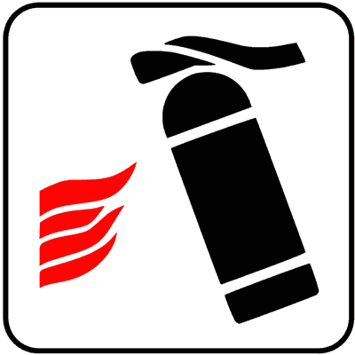

# Capitolo 21 - Incidenti stradali e comportamenti
### حوادث السير والتصرف الواجب

📊 **إجمالي الأسئلة في هذا الباب:** 102 سؤال

---

## 📌 Causa probabile incidenti (13 domande)

**1.** Causa probabile di incidenti dovuti alla struttura della strada può essere ristrettezza della strada

- **الإجابة:** `VERO ✅ (صح)`

---

**2.** Causa probabile di incidenti dovuti alla struttura della strada può essere mancata segnalazione degli incroci

- **الإجابة:** `VERO ✅ (صح)`

---

**3.** Causa probabile di incidenti dovuti alla struttura della strada può essere mancanza di segnaletica orizzontale

- **الإجابة:** `VERO ✅ (صح)`

---

**4.** Causa probabile di incidenti dovuti alla struttura della strada può essere fondo stradale deformato

- **الإجابة:** `VERO ✅ (صح)`

---

**5.** Causa probabile di incidenti dovuti alla struttura della strada può essere fondo stradale scivoloso

- **الإجابة:** `VERO ✅ (صح)`

---

**6.** Causa probabile di incidenti dovuti alla struttura della strada può essere presenza di strettoie non segnalate

- **الإجابة:** `VERO ✅ (صح)`

---

**7.** Causa probabile di incidenti dovuti alla struttura della strada può essere strada suddivisa in carreggiate

- **الإجابة:** `FALSO ❌ (خطأ)`

---

**8.** Causa probabile di incidenti dovuti alla struttura della strada può essere strada suddivisa in corsie

- **الإجابة:** `FALSO ❌ (خطأ)`

---

**9.** Causa probabile di incidenti dovuti alla struttura della strada può essere carreggiata a senso unico di circolazione

- **الإجابة:** `FALSO ❌ (خطأ)`

---

**10.** Causa probabile di incidenti dovuti alla struttura della strada può essere strada a percorso pianeggiante

- **الإجابة:** `FALSO ❌ (خطأ)`

---

**11.** Causa probabile di incidenti dovuti alla struttura della strada può essere presenza di barriere laterali ad assorbimento d'urto (guardrails)

- **الإجابة:** `FALSO ❌ (خطأ)`

---

**12.** Causa probabile di incidenti dovuti alla struttura della strada può essere regolamentazione semaforica

- **الإجابة:** `FALSO ❌ (خطأ)`

---

**13.** Causa probabile di incidenti dovuti alla struttura della strada può essere mancanza di curve pericolose

- **الإجابة:** `FALSO ❌ (خطأ)`

---

## 📌 Caso pioggia (10 domande)

**14.** In caso di pioggia occorre ridurre la velocità

- **الإجابة:** `VERO ✅ (صح)`

---

**15.** In caso di pioggia occorre tenere in funzione i tergicristalli

- **الإجابة:** `VERO ✅ (صح)`

---

**16.** In caso di pioggia occorre aumentare la distanza di sicurezza

- **الإجابة:** `VERO ✅ (صح)`

---

**17.** In caso di pioggia occorre evitare l'appannamento dei vetri

- **الإجابة:** `VERO ✅ (صح)`

---

**18.** In caso di pioggia occorre manovrare con prudenza lo sterzo

- **الإجابة:** `VERO ✅ (صح)`

---

**19.** In caso di pioggia occorre passare velocemente sulle pozzanghere per evitare di rimanere impantanati

- **الإجابة:** `FALSO ❌ (خطأ)`

---

**20.** In caso di pioggia occorre coprire il radiatore con l'apposita mascherina

- **الإجابة:** `FALSO ❌ (خطأ)`

---

**21.** In caso di pioggia occorre frenare energicamente

- **الإجابة:** `FALSO ❌ (خطأ)`

---

**22.** In caso di pioggia occorre utilizzare, durante la marcia, la segnalazione luminosa di pericolo (quattro frecce lampeggianti simultaneamente)

- **الإجابة:** `FALSO ❌ (خطأ)`

---

**23.** In caso di pioggia occorre procedere, di norma, con il pedale della frizione abbassato

- **الإجابة:** `FALSO ❌ (خطأ)`

---

## 📌 Aquaplanning (9 domande)

**24.** Il fenomeno dell'aquaplaning fa scivolare le ruote sullo strato di acqua

- **الإجابة:** `VERO ✅ (صح)`

---

**25.** Il fenomeno dell'aquaplaning inizia a velocità più bassa se il pneumatico è molto consumato

- **الإجابة:** `VERO ✅ (صح)`

---

**26.** Il fenomeno dell'aquaplaning si verifica più facilmente nei veicoli più leggeri

- **الإجابة:** `VERO ✅ (صح)`

---

**27.** Il fenomeno dell'aquaplaning si verifica più facilmente a bassa velocità

- **الإجابة:** `FALSO ❌ (خطأ)`

---

**28.** Il fenomeno dell'aquaplaning riduce lo sbandamento del veicolo

- **الإجابة:** `FALSO ❌ (خطأ)`

---

**29.** Il fenomeno dell'aquaplaning aumenta nelle carreggiate a forte pendenza laterale

- **الإجابة:** `FALSO ❌ (خطأ)`

---

**30.** Il fenomeno dell'aquaplaning aumenta l'aderenza sul fondo stradale

- **الإجابة:** `FALSO ❌ (خطأ)`

---

**31.** Il fenomeno dell'aquaplaning rafforza il contatto fra pneumatici e asfalto

- **الإجابة:** `FALSO ❌ (خطأ)`

---

**32.** Il fenomeno dell'aquaplaning non dipende dallo spessore e dal disegno del battistrada

- **الإجابة:** `FALSO ❌ (خطأ)`

---

## 📌 Strade coperte neve (9 domande)

**33.** Su strade coperte di neve occorre montare pneumatici invernali su tutte le ruote oppure catene sulle ruote motrici

- **الإجابة:** `VERO ✅ (صح)`

---

**34.** Su strade coperte di neve occorre moderare la velocità

- **الإجابة:** `VERO ✅ (صح)`

---

**35.** Su strade coperte di neve occorre aumentare la distanza di sicurezza

- **الإجابة:** `VERO ✅ (صح)`

---

**36.** Su strade coperte di neve occorre evitare brusche manovre

- **الإجابة:** `VERO ✅ (صح)`

---

**37.** Su strade coperte di neve occorre evitare brusche accelerazioni

- **الإجابة:** `VERO ✅ (صح)`

---

**38.** Su strade coperte di neve occorre frenare con maggiore energia

- **الإجابة:** `FALSO ❌ (خطأ)`

---

**39.** Su strade coperte di neve occorre alla partenza, accelerare al massimo

- **الإجابة:** `FALSO ❌ (خطأ)`

---

**40.** Su strade coperte di neve occorre sterzare bruscamente per evitare di urtare veicoli fermi

- **الإجابة:** `FALSO ❌ (خطأ)`

---

**41.** Su strade coperte di neve occorre frenare a fondo in caso di sbandamento del veicolo

- **الإجابة:** `FALSO ❌ (خطأ)`

---

## 📌 Tratti strada ghiacciati (11 domande)

**42.** In presenza di tratti di strada ghiacciati è opportuno procedere a velocità moderata

- **الإجابة:** `VERO ✅ (صح)`

---

**43.** In presenza di tratti di strada ghiacciati è opportuno aumentare la distanza di sicurezza

- **الإجابة:** `VERO ✅ (صح)`

---

**44.** In presenza di tratti di strada ghiacciati è opportuno distanziarsi dalla traiettoria dei veicoli che si incrociano

- **الإجابة:** `VERO ✅ (صح)`

---

**45.** In presenza di tratti di strada ghiacciati è opportuno, in discesa, procedere con marce basse

- **الإجابة:** `VERO ✅ (صح)`

---

**46.** In presenza di tratti di strada ghiacciati è opportuno evitare brusche accelerazioni

- **الإجابة:** `VERO ✅ (صح)`

---

**47.** In presenza di tratti di strada ghiacciati è opportuno usare maggiore attenzione nel transito su zone in ombra

- **الإجابة:** `VERO ✅ (صح)`

---

**48.** In presenza di tratti di strada ghiacciati è opportuno innestare la doppia trazione, se il veicolo ne è provvisto

- **الإجابة:** `VERO ✅ (صح)`

---

**49.** In presenza di tratti di strada ghiacciati è opportuno marciare molto vicino alla barriera laterale

- **الإجابة:** `FALSO ❌ (خطأ)`

---

**50.** In presenza di tratti di strada ghiacciati è opportuno non usare le catene, ma gomme chiodate sulle ruote anteriori

- **الإجابة:** `FALSO ❌ (خطأ)`

---

**51.** In presenza di tratti di strada ghiacciati è opportuno frenare energicamente ogni volta che si incrocia un altro veicolo

- **الإجابة:** `FALSO ❌ (خطأ)`

---

**52.** In presenza di tratti di strada ghiacciati è opportuno procedere con il cambio in folle

- **الإجابة:** `FALSO ❌ (خطأ)`

---

## 📌 Nebbia fitta (14 domande)

**53.** In caso di nebbia fitta è opportuno lasciarsi guidare dalla segnaletica orizzontale

- **الإجابة:** `VERO ✅ (صح)`

---

**54.** In caso di nebbia fitta è opportuno procedere ad una velocità adeguata alla visibilità

- **الإجابة:** `VERO ✅ (صح)`

---

**55.** In caso di nebbia fitta è opportuno fermarsi, se necessario, fuori dalla carreggiata

- **الإجابة:** `VERO ✅ (صح)`

---

**56.** In caso di nebbia fitta è opportuno se costretti a fermarsi sulla carreggiata, usare la segnalazione luminosa di pericolo (quattro frecce lampeggianti simultaneamente)

- **الإجابة:** `VERO ✅ (صح)`

---

**57.** In caso di nebbia fitta è opportuno evitare di fermarsi sulla carreggiata, se non per cause di forza maggiore

- **الإجابة:** `VERO ✅ (صح)`

---

**58.** In caso di nebbia fitta è opportuno accendere i proiettori fendinebbia o, in mancanza, quelli anabbaglianti

- **الإجابة:** `VERO ✅ (صح)`

---

**59.** In caso di nebbia fitta è opportuno accendere la luce posteriore per nebbia

- **الإجابة:** `VERO ✅ (صح)`

---

**60.** In caso di nebbia fitta è opportuno guidare con la massima prudenza e concentrazione

- **الإجابة:** `VERO ✅ (صح)`

---

**61.** In caso di nebbia fitta è opportuno circolare con le sole luci di posizioni accese

- **الإجابة:** `FALSO ❌ (خطأ)`

---

**62.** In caso di nebbia fitta è opportuno mantenere in funzione l'indicatore di direzione sinistro

- **الإجابة:** `FALSO ❌ (خطأ)`

---

**63.** In caso di nebbia fitta è opportuno procedere a zig zag per far meglio notare la propria presenza

- **الإجابة:** `FALSO ❌ (خطأ)`

---

**64.** In caso di nebbia fitta è opportuno accodarsi al veicolo che precede quanto più vicino possibile

- **الإجابة:** `FALSO ❌ (خطأ)`

---

**65.** In caso di nebbia fitta è opportuno suonare continuativamente il clacson

- **الإجابة:** `FALSO ❌ (خطأ)`

---

**66.** In caso di nebbia fitta è opportuno tenere la cintura di sicurezza sganciata per essere più pronti ad abbandonare il veicolo in caso di incidente

- **الإجابة:** `FALSO ❌ (خطأ)`

---

## 📌 Obblighi dopo incidente stradale (16 domande)

**67.** Il conducente coinvolto in un incidente stradale ha l'obbligo di fermarsi e di prestare assistenza agli eventuali feriti

- **الإجابة:** `VERO ✅ (صح)`

---

**68.** Il conducente coinvolto in un incidente stradale deve fornire le proprie generalità e gli estremi della patente, della targa e dell'assicurazione del veicolo alle persone danneggiate

- **الإجابة:** `VERO ✅ (صح)`

---

**69.** Il conducente coinvolto in un incidente stradale deve evitare che vengano modificate le tracce, se occorre ricostruire la dinamica dell'incidente

- **الإجابة:** `VERO ✅ (صح)`

---

**70.** Il conducente coinvolto in un incidente stradale per la denunzia all'assicurazione può avvalersi degli appositi moduli prestampati forniti dalla propria assicurazione

- **الإجابة:** `VERO ✅ (صح)`

---

**71.** Dopo un incidente stradale è obbligatorio apporre il segnale mobile di pericolo sul lunotto posteriore del veicolo, prima di andar via

- **الإجابة:** `FALSO ❌ (خطأ)`

---

**72.** Dopo un incidente stradale è obbligatorio coprire il veicolo con un telo di plastica

- **الإجابة:** `FALSO ❌ (خطأ)`

---

**73.** Dopo un incidente stradale è obbligatorio, solo di notte, apporre il segnale mobile di pericolo in prossimità del veicolo

- **الإجابة:** `FALSO ❌ (خطأ)`

---

**74.** Dopo un incidente stradale è obbligatorio collocare subito il veicolo sul marciapiede

- **الإجابة:** `FALSO ❌ (خطأ)`

---

**75.** Dopo un incidente stradale, è obbligatorio segnalare il veicolo fermo con il segnale mobile di pericolo anche nei centri abitati

- **الإجابة:** `FALSO ❌ (خطأ)`

---

**76.** È opportuno che il conducente esegua personalmente la manutenzione della pompa di iniezione del proprio veicolo

- **الإجابة:** `FALSO ❌ (خطأ)`

---

**77.** La distanza percorsa durante il tempo di reazione non varia con la velocità

- **الإجابة:** `FALSO ❌ (خطأ)`

---

**78.** Il corretto funzionamento del motore è garantito dal fatto che la spia rossa dell’olio di lubrificazione rimane costantemente accesa

- **الإجابة:** `FALSO ❌ (خطأ)`

---

**79.** È consentito migliorare le prestazioni del proprio veicolo aumentando la cilindrata del motore

- **الإجابة:** `FALSO ❌ (خطأ)`

---

**80.** Non è necessario mettere a punto i freni squilibrati, se il conducente è in grado di correggere l’anomalo comportamento del veicolo agendo sullo sterzo

- **الإجابة:** `FALSO ❌ (خطأ)`

---

**81.** Su strada sdrucciolevole, per garantire le migliori condizioni di aderenza in frenata, è opportuno premere a fondo il pedale del freno

- **الإجابة:** `FALSO ❌ (خطأ)`

---

**82.** È consentito aumentare le prestazioni del proprio veicolo modificandone le impostazioni elettroniche della centralina che controlla l’iniezione di carburante

- **الإجابة:** `FALSO ❌ (خطأ)`

---

## 📌 Salita discesa passeggero (5 domande)

**83.** Quando bisogna far salire o scendere un passeggero, è opportuno che ciò avvenga dal lato del marciapiede o, in mancanza, dal lato opposto al traffico

- **الإجابة:** `VERO ✅ (صح)`

---

**84.** Quando si deve far salire o scendere un passeggero dal veicolo, bisogna aprire la portiera solamente quando non si causa pericolo agli altri utenti della strada

- **الإجابة:** `VERO ✅ (صح)`

---

**85.** Quando si deve far salire o scendere un passeggero dal veicolo, bisogna farlo attendere fino a che il veicolo sia completamente fermo

- **الإجابة:** `VERO ✅ (صح)`

---

**86.** Quando si deve far salire o scendere un bambino dal veicolo, è opportuno che vi sia il controllo di un adulto

- **الإجابة:** `VERO ✅ (صح)`

---

**87.** Quando si deve far scendere un passeggero, bisogna tenere presente che l'apertura della portiera di destra è priva di qualsiasi rischio e pericolo

- **الإجابة:** `FALSO ❌ (خطأ)`

---

## 📌 Infossamento (3 domande)

**88.** In caso di infossamento su neve o sabbia, non riuscendo a spostare il veicolo, è consigliabile inserire sotto la ruota che slitta qualcosa che faccia attrito (pezzi di legno, tappeti del veicolo, ecc.)

- **الإجابة:** `VERO ✅ (صح)`

---

**89.** In caso di infossamento su neve o sabbia, non riuscendo a partire con la prima marcia è opportuno innestare una marcia superiore

- **الإجابة:** `VERO ✅ (صح)`

---

**90.** Su una strada innevata l'aderenza del veicolo è minore che su una strada ghiacciata

- **الإجابة:** `FALSO ❌ (خطأ)`

---

## 📌 Tamponamenti stradali (5 domande)

**91.** I tamponamenti stradali avvengono principalmente per la forte velocità

- **الإجابة:** `VERO ✅ (صح)`

---

**92.** I tamponamenti stradali avvengono maggiormente se non si rispetta la distanza di sicurezza

- **الإجابة:** `VERO ✅ (صح)`

---

**93.** I tamponamenti stradali avvengono principalmente per la disattenzione dei conducenti

- **الإجابة:** `VERO ✅ (صح)`

---

**94.** I tamponamenti stradali avvengono principalmente per l'improvviso guasto del freno di stazionamento

- **الإجابة:** `FALSO ❌ (خطأ)`

---

**95.** I tamponamenti stradali avvengono principalmente tra autoveicoli dotati di servosterzo

- **الإجابة:** `FALSO ❌ (خطأ)`

---

## 📌 Pannelli galleria (7 domande)

**96.** Percorrendo un lungo tunnel o traforo, in caso di formazione di lunghe file di veicoli, è opportuno aumentare la distanza di sicurezza, per scongiurare, in caso d'incendio, il rapido propagarsi delle fiamme

- **الإجابة:** `VERO ✅ (صح)`

---

**97.** Percorrendo un lungo tunnel o traforo, in caso d'incendio, bisogna abbandonare velocemente il veicolo, seguendo la segnaletica che porta alle vie di fuga o ai luoghi sicuri protetti da porte tagliafuoco

- **الإجابة:** `VERO ✅ (صح)`

---

**98.** Percorrendo un lungo tunnel o traforo, in caso d'incendio, bisogna attenersi alle istruzioni vocali del personale di servizio o dei vigili del fuoco, per evitare di incamminarsi nella direzione sbagliata

- **الإجابة:** `VERO ✅ (صح)`

---

**99.** Il pannello in figura, posto all'interno di una galleria, indica la presenza di una via di fuga

- **الإجابة:** `VERO ✅ (صح)`
- 

---

**100.** Il pannello in figura, posto all'interno di una galleria, indica la presenza di un estintore

- **الإجابة:** `VERO ✅ (صح)`
- 

---

**101.** Il pannello in figura obbliga a tornare indietro all'imbocco della galleria

- **الإجابة:** `FALSO ❌ (خطأ)`
- 

---

**102.** Percorrendo un lungo tunnel o traforo, in caso d'incendio, bisogna seguire la segnaletica di emergenza, anche se in netto contrasto con gli ordini vocali impartiti dai vigili del fuoco

- **الإجابة:** `FALSO ❌ (خطأ)`

---

